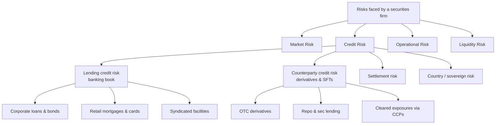
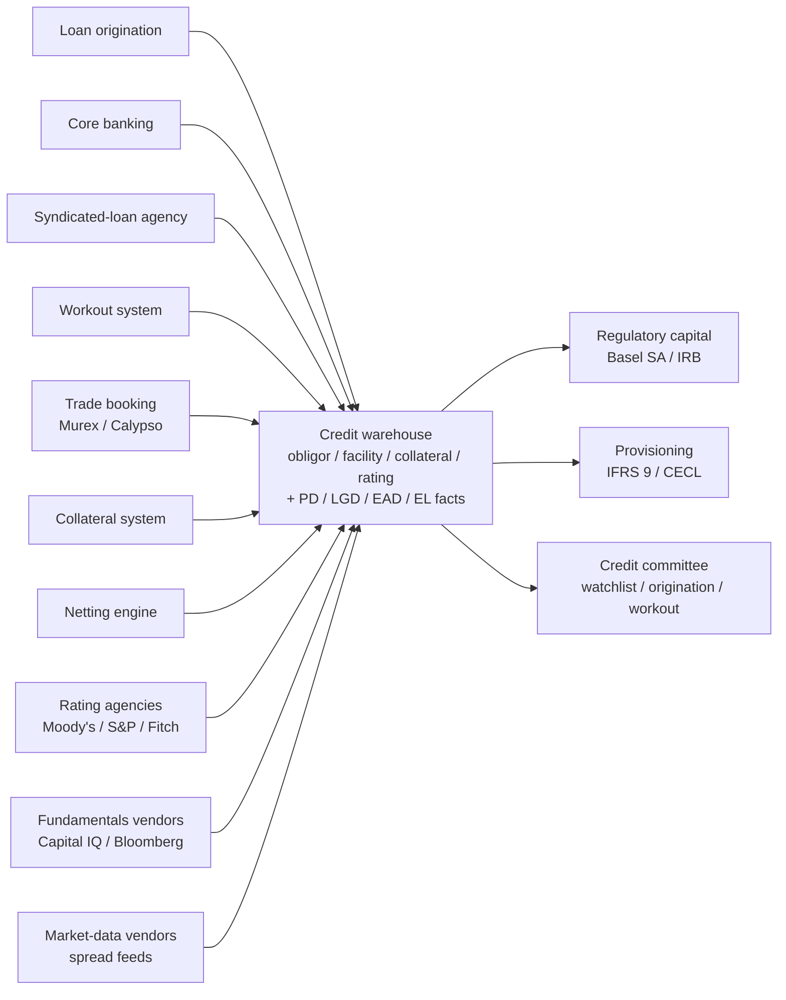

# Credit Module 1 — Credit Risk Foundations

!!! abstract "Module Goal"
    Understand what credit risk *is*, how it differs structurally from market risk, the unifying PD × LGD × EAD identity that runs through the entire track, and the regulatory frameworks (Basel, IFRS 9, CECL) that shape the data you will model.

---

## 1. Learning objectives

By the end of this module, you should be able to:

- **Define** credit risk and distinguish it from market, operational, and liquidity risk.
- **Decompose** any credit loss into its three drivers — Probability of Default (PD), Loss Given Default (LGD), and Exposure at Default (EAD) — and compute a one-year expected loss from them.
- **Distinguish** traditional credit (banking-book lending) from counterparty credit risk (CCR) on derivatives, and explain why both share the same PD × LGD × EAD decomposition.
- **Identify** which Basel regime (SA, IRB-Foundation, IRB-Advanced) applies to a given exposure type, and recognise the canonical IFRS 9 stages and what triggers a stage migration.
- **Recognise** the structural differences between credit data and market data (long-dated, quarterly cadence, tail-event losses, heavy reference-data needs) and the warehouse implications.
- **Map** a typical credit exposure into a fact-table grain that supports both regulatory capital and IFRS 9 / CECL provisioning.

## 2. Why this matters

If you work in BI or data engineering at a securities firm or commercial bank, the credit-risk function is one of the largest, most regulated, and most data-hungry consumers of the warehouse you build. A single mis-classified obligor, a stale rating, or an EAD calculated against the drawn balance instead of the drawn-plus-CCF-adjusted-undrawn balance silently corrupts the firm's regulatory capital number — and Pillar 3 disclosure errors of that flavour have ended careers and triggered supervisory consent orders.

Credit data is the spine of three downstream consumers that every credit-risk warehouse must serve simultaneously: **regulatory capital** (Basel risk-weighted assets), **provisioning** (IFRS 9 expected credit loss or CECL allowance), and the **credit committee's daily decisions** (origination, watchlist, workout). The same `fact_expected_loss` row is read by a regulatory analyst computing capital, an accountant booking a provision, and a credit officer deciding whether to extend a line — and each of them has different tolerance for staleness, different bitemporal expectations, and different aggregation rules. Getting the underlying grain right is the entire game.

This module establishes the vocabulary used throughout the rest of the Credit Risk track. After this module you should be able to read any credit-risk report and articulate which of the three PD / LGD / EAD drivers it touches, which regulatory regime forced it into existence, and what the upstream data lineage looks like.

!!! info "Honesty disclaimer"
    This module reflects general industry knowledge of credit-risk methodology and the canonical Basel / IFRS 9 framework as of mid-2026. Specific bucketing rules, stage-migration triggers, parameter calibrations, and PD / LGD model implementations vary by jurisdiction and by each firm's internal models. Treat the material here as a starting framework — verify against your firm's actual policies, model documentation, and regulator guidance before applying it operationally. Where the author's confidence drops on a particular topic (typically deep model-validation territory), the module will say so explicitly.

## 3. Core concepts

### 3.1 What is credit risk?

**Credit risk** is the risk of loss arising from an obligor's failure to meet a contractual payment obligation when due. The obligor may be a corporation, a sovereign, a financial institution, a household, or another counterparty; the obligation may be a loan repayment, a coupon on a bond, a margin call, or a settlement leg of a derivative. The common feature is that *someone owes you money or a future payment*, and the question is how likely they are to fail to deliver and how much you lose if they do.

The concept sounds simple, but the operational definition of "default" — the event whose probability the entire framework tries to model — is itself a calibration choice. The Basel default definition (paragraph 452 of the original Basel II text, carried forward into subsequent regimes) sets two triggers: (i) the obligor is *unlikely to pay* its credit obligations to the bank in full, without recourse to actions such as realising collateral; or (ii) the obligor is **past due more than 90 days** on any material credit obligation. Either trigger, on its own, classifies the obligor as in default for regulatory-capital purposes. IFRS 9 and CECL use a related but not identical default definition for accounting purposes, and individual jurisdictions add their own modifications (the EU's "new definition of default" — NDoD — is the most-cited recent example). When you see a `default_flag` column in a fact table, the first question to ask is *which definition*; the second is *who owns the calibration*.

Credit risk is distinct from — but adjacent to — three other risk types every securities firm tracks:

- **Market risk** — risk of loss from movements in market prices (rates, FX, equity, spreads, commodities, vol). Covered in detail in the Market Risk track.
- **Operational risk** — risk of loss from process, people, or system failures (rogue trading, system outages, settlement errors, fraud, conduct breaches).
- **Liquidity risk** — risk of being unable to fund obligations or unwind positions at expected cost. Splits into *funding liquidity* (can the firm meet its own obligations) and *market liquidity* (can the firm exit a position without moving the price against itself).

The boundary between credit and market risk is genuinely fuzzy in two places. First, **a corporate bond carries both**: daily mark-to-market moves driven by the underlying risk-free rate and the credit spread sit in market risk; the loss-if-default sits in credit risk. Both numbers exist; both have owners; both must reconcile back to the same bond row in the warehouse. Second, **counterparty credit risk on derivatives** sits squarely on the boundary — the exposure is itself a market-driven number that is then turned into a credit measure. Both of these boundary cases will get their own treatment later in the track; for now, hold the picture that the boundaries exist and that the same physical instrument often shows up in two functional reports.

!!! info "Definition: obligor vs. counterparty vs. issuer"
    These three terms are sometimes used interchangeably, but the precise usage in a credit warehouse matters. An **obligor** is the legal entity that owes the payment — the borrower on a loan, the issuer of a bond held to maturity, the reference entity on a CDS. A **counterparty** is the legal entity facing the firm in any contract — usually but not always the obligor (e.g. on a derivative, your counterparty is the entity on the other side of the trade, who may or may not be an obligor of any underlying credit risk). An **issuer** is specifically the entity that issued a particular security. The Credit Risk track standardises on `dim_obligor` for the credit-bearing entity; the Market Risk track standardises on `dim_counterparty` for the trade-facing entity; conformance between the two — when the same legal entity plays both roles — is one of the core data-modelling tasks.

### 3.2 Two flavours: traditional credit and counterparty credit risk

Credit risk in a securities firm splits into two operationally distinct flavours that share the same underlying PD × LGD × EAD decomposition but differ sharply in their data shapes.

**Traditional credit risk (banking book).** This is the classical lending business — term loans, revolving credit facilities, syndicated loans, mortgages, corporate bonds held to maturity, and trade-finance instruments. The exposure is broadly known in advance (the loan amount, the bond face value), the cashflows are scheduled (interest plus principal), and the data lives in core banking systems, loan-origination platforms, and syndicated-loan agency systems. Time horizons are long — a thirty-year mortgage or a seven-year corporate term loan sits on the books for years.

**Counterparty credit risk (CCR).** This is the credit risk that arises on derivative trades and securities-financing transactions (repo, securities lending). The exposure is *not* known in advance — it is the future positive mark-to-market of the trade, which is itself a stochastic quantity driven by market moves. CCR data lives in trade-booking systems (Murex, Calypso, internal platforms), in collateral systems, and in netting-set engines. Horizons can be long (a thirty-year cross-currency swap) but the exposure profile changes daily with the market.

Both flavours share the same underlying decomposition — every credit loss is driven by *probability* of default, *severity* given default, and *amount* exposed at default. But the upstream data, the cadence, the regulatory treatment, and the engineering patterns differ. The Credit Risk track devotes a full module to EAD specifically (covered in detail in the upcoming Exposure at Default module) because CCR's EAD calculation is one of the more involved data problems in modern risk infrastructure.

A useful side-by-side that newcomers often want:

| Aspect | Lending (banking book) | Counterparty credit risk (CCR) |
|---|---|---|
| Typical instruments | Term loans, revolvers, mortgages, bonds | Derivatives (IRS, FX forwards, swaptions), repo, sec lending |
| Source systems | Core banking, loan-origination, syndicated-loan agency | Trade-booking (Murex, Calypso), collateral, netting engines |
| EAD known in advance? | Largely yes (commitment-bounded) | No — stochastic, market-driven |
| Typical horizon | Months to decades | Days to decades, but exposure shape changes daily |
| Regulatory capital approach | SA / IRB-F / IRB-A | SA-CCR (standardised) / IMM (internal model) |
| Provisioning treatment | IFRS 9 ECL / CECL allowance | Generally not provisioned the same way (CVA captures the equivalent) |
| Cadence of measurement | Daily balance, quarterly model output | Daily exposure, quarterly model output |
| Governance | Credit Risk + relationship management | Credit Risk + CCR specialists, often inside a Counterparty Risk Management (CRM) team |

The track returns to this distinction repeatedly: every fact table you build will look slightly different depending on which side of the lending / CCR boundary the underlying exposure sits.

### 3.3 The unifying identity: EL = PD × LGD × EAD

The single most important formula in credit risk — and the one this entire track is organised around — is the **expected-loss identity**:

$$
\text{EL} = \text{PD} \times \text{LGD} \times \text{EAD}
$$

Each factor has an intuitive meaning before any model is fitted to it:

- **PD (Probability of Default)** — the probability, over a defined horizon (typically one year, or sometimes the full lifetime of the exposure), that the obligor defaults. Default itself is defined operationally — usually 90 days past due on a material obligation, or a bankruptcy / restructuring event. PD is dimensionless, expressed as a number between 0 and 1 (or in basis points: 1bp = 0.01% = 0.0001).
- **LGD (Loss Given Default)** — *if* the obligor defaults, the fraction of the exposure that is unrecoverable after workout, collateral realisation, and recovery cashflows. LGD is dimensionless, expressed as a number between 0 and 1. An unsecured corporate loan typically has an LGD around 60%; a senior-secured loan with hard collateral might be 30% or lower; a subordinated unsecured bond might be 70% or higher.
- **EAD (Exposure at Default)** — the dollar (or local-currency) amount the firm is exposed to at the moment of default. For a fully drawn term loan, EAD ≈ outstanding principal. For a revolving credit facility, EAD = drawn amount + (CCF × undrawn commitment), where CCF is the *credit conversion factor* — the empirical fraction of the unused commitment that the obligor draws as they approach default. For a derivative, EAD is a model output (current exposure + potential future exposure).

Multiplied together, these three numbers give the **expected loss** — the average loss the firm anticipates over the horizon, conditional on its current view of the obligor's risk.

#### A tiny worked example

A corporate term loan of $10,000,000, fully drawn, to an investment-grade obligor with a one-year PD of 1 basis point (0.01% = 0.0001) and an estimated LGD of 60%:

$$
\text{EL}_{1y} = 0.0001 \times 0.60 \times \$10{,}000{,}000 = \$600
$$

Six hundred dollars of expected loss for a ten-million-dollar exposure. That number feels small — and it is, for a single high-quality loan — but multiplied across a portfolio of ten thousand similar loans it becomes $6 million of provisions that the bank must hold, and after correlation and tail effects (the topic of Unexpected Loss) it drives a much larger regulatory capital charge.

This identity is the spine of the rest of the track. Each of the three factors has its own dedicated module — covered in detail in the upcoming PD, LGD, and EAD modules — followed by a dedicated EL module that puts them back together and discusses the additivity and aggregation patterns that fall out.

#### A subtlety: EL is the *expected* loss, not the *actual* loss

A point that is obvious once stated but trips up newcomers: $600 of expected loss does *not* mean the bank loses $600 next year. With probability 99.99%, the obligor pays in full and the bank loses zero; with probability 0.01%, the obligor defaults and the bank loses 60% of $10 million = $6 million. The expectation, $600, is the probability-weighted average of these two outcomes. The actual outcome distribution is highly bimodal — full payment or substantial loss — and the *unexpected* loss, the variance around the expectation, is what credit-portfolio capital is calibrated against. The expected-loss number is what gets provisioned (you build a reserve against the average); the unexpected-loss number is what gets capitalised (you hold capital against the surprise). These two roles for credit-loss numbers — one to absorb the average, one to absorb the tail — are the architectural reason that provisioning and capital are separate workstreams in every regulated bank, and the architectural reason that the Credit Risk track has separate modules for Expected Loss and for Unexpected Loss & Credit VaR.

#### Linearity properties — what's additive and what isn't

A useful property of EL: it *is* additive across obligors, in the strict mathematical sense. If obligor A has an expected loss of $X and obligor B has an expected loss of $Y, then the portfolio's expected loss is $X + $Y exactly — there is no diversification benefit at the EL level, because EL is a probability-weighted average and expectations sum linearly. This is a sharp contrast to VaR, which is *subadditive* (well-behaved cases) or in pathological cases not even that, and which therefore does benefit from diversification.

The corollary for fact-table design: a credit-EL aggregation rolling from obligor to portfolio to segment is a simple `SUM`. No correlation matrix, no variance-covariance overlay, no Monte Carlo. That simplicity ends the moment you move from EL to *unexpected* loss (where correlation drives the entire result) — but for everything that lives at the EL level, ordinary Kimball-style additive-fact patterns apply. Most of the credit warehouse is built on this property.

### 3.4 Why credit data differs structurally from market data

Engineers who arrive at credit risk from a market-risk background (or from a generic data-warehousing background) consistently find the same surprises. The four big ones:

- **Long-dated obligations vs. short-dated trades.** A 30-year mortgage, a 7-year corporate loan, or a 10-year syndicated facility sits on the books for years. A trading position can turn over multiple times per day. Credit fact tables therefore tend to be *deeper* (longer history per entity) and *narrower* (fewer rows per day per entity) than their market-risk counterparts. Bitemporal modelling becomes essential because a single exposure may need to be re-stated under a corrected rating that arrived two quarters after the fact.
- **Quarterly cadence on the regulatory side, monthly on the accounting side.** Daily mark-to-market is a market-risk concept. Credit loss is realised over months or years; PD and LGD models are typically recalibrated quarterly, IFRS 9 / CECL provisions are booked monthly or quarterly, and full Basel IRB recalibrations happen annually. Your warehouse will run *both* cadences side by side — daily counterparty exposure feeds for CCR, and quarterly model-output snapshots for capital and provisioning.
- **Loss is a tail event, not a continuous distribution.** In a normal year, a portfolio's credit loss rate might be 20 basis points. In a stress year (2008, 2020 H1) it might be 200. The distribution is highly skewed, defaults cluster, and most of the year-to-year variance lives in the tail. This shapes the statistics: you cannot use 1-day rolling windows the way market risk uses them, and you cannot validate a PD model on six months of data the way you can validate a VaR model.
- **Reference data is heavy.** Every obligor needs a financial profile (revenue, EBITDA, leverage, sector, geography, ownership), a rating history (internal *and* external), and links to its parent / guarantor / connected counterparties. Recovery cashflows from a default may continue to land for *years* after the default event. The dimensional model carries far more weight in credit than in market risk, where reference data tends to live in `dim_instrument` and `dim_counterparty` and not much else.

The honest summary: credit data is *deeper, slower, more reference-heavy, and more bitemporally fraught* than market data. The compensating simplification is that the cadence is slower, so intraday correctness rarely matters — the question is end-of-month, end-of-quarter, and as-of-some-prior-date correctness.

A practical implication for the engineer: the *physical* design of a credit warehouse looks superficially similar to a market-risk warehouse — Kimball star schemas, conformed dimensions, partitioned fact tables — but the *logical* design tilts heavily toward the dimension side. Where a market-risk warehouse may be 80% fact-table volume and 20% dimension complexity, a credit warehouse is closer to 50/50, and the analytical queries you write spend much more time joining than aggregating. If you have built market-risk warehouses before, expect to invest more time per row on dimensional modelling and SCD-type-2 history than you previously needed.

### 3.5 Brief regulatory tour

You don't need to be a regulator, but knowing *why* a particular report exists makes you orders of magnitude more useful when designing the warehouse that produces it. The regulatory module (covered in detail in the upcoming Regulatory Context module) goes deep on each of these; here is the orientation.

#### The Basel sequence

- **Basel I (1988).** The original framework. A single risk weight (typically 100% for corporate, 50% for residential mortgage, 0% for OECD-government debt) multiplied by 8% gave the capital requirement. Crude but foundational.
- **Basel II (2004).** Introduced the **Internal Ratings-Based (IRB)** approach, allowing banks with regulator approval to use their own PD, LGD, and EAD models inside a regulatory formula to compute risk-weighted assets. Three flavours: **Standardised Approach (SA)** uses external ratings and prescribed risk weights; **IRB-Foundation (IRB-F)** lets the bank model PD but uses regulator-supplied LGD and EAD; **IRB-Advanced (IRB-A)** lets the bank model all three.
- **Basel III (2010, post-GFC).** Increased capital ratios, added the **Capital Conservation Buffer**, the **Countercyclical Buffer**, and a leverage ratio. Most relevant for credit: tighter definitions of regulatory capital and the introduction of the credit-valuation-adjustment (CVA) capital charge for counterparty credit risk.
- **Basel IV (the December 2017 finalisation).** Despite the marketing name, this is technically still Basel III. Key change for credit: an **output floor** that constrains the IRB capital number to at least 72.5% of the equivalent SA number, phasing in to 2028. Also revised SA risk weights and constrained the use of IRB-A for low-default portfolios (large corporates, banks).

#### The accounting standards

- **IFRS 9 (effective 2018).** The international accounting standard governing financial-instrument classification and impairment. The big change vs. the previous IAS 39: **expected credit loss (ECL)** replaces incurred-loss provisioning. Every performing exposure gets a 12-month ECL provision (Stage 1); exposures that have experienced a *significant increase in credit risk* (SICR) since origination get a lifetime ECL (Stage 2); credit-impaired exposures get a lifetime ECL on the net exposure (Stage 3). Stage migration is reversible.
- **CECL (effective 2020 for large US banks, ASU 2016-13).** The US GAAP equivalent of IFRS 9. Materially different in mechanics — CECL applies lifetime ECL to *every* exposure from day one, with no staging — but the underlying inputs (PD, LGD, EAD term-structures, macro overlay) are the same. Provisioning is covered in the upcoming IFRS 9 / CECL module.

#### A note on the Basel approach hierarchy

The choice of approach (SA vs. IRB-F vs. IRB-A) is not optional in the way it sounds. The supervisor approves the approach for each portfolio segment, and a bank typically operates a *mix*: large-corporate exposures might be on IRB-A (the bank has long internal data and modelling sophistication), small-business exposures might be on IRB-F (PD modelled internally, LGD prescribed), and certain segments — sovereigns, banks, equity exposures, low-default portfolios — are increasingly being constrained back to SA under the December 2017 finalisation. The data implication: a single fact table may carry rows whose risk weight was computed under three different approaches, each with different parameter inputs and different formulas. The fact-table grain must record which approach produced each row, and the model-version stamp must distinguish across approaches and across recalibrations.

For each approach, the broad data shape:

| Approach | What the bank supplies | What the regulator prescribes | Typical use case |
|---|---|---|---|
| SA | External rating (where available) | Risk weight by rating bucket | Smaller banks; constrained portfolios; the floor under IRB |
| IRB-F | Internal PD | LGD = 45% senior unsecured / 75% subordinated; prescribed CCF | Corporates, banks, sovereigns at IRB-approved firms |
| IRB-A | Internal PD, LGD, EAD | Asset-correlation formula and downturn LGD floor | Largest banks, well-modelled portfolios (corporates, retail) |

The Regulatory Context module (covered in detail later in the track) walks through each of these in operational detail; for foundations, the key takeaway is that the *same* obligor can carry different capital numbers depending on which approach applies to the holding entity and the portfolio segment.

#### The stress-testing regimes

- **CCAR / DFAST (US).** Annual supervisory stress testing for large US banks, run by the Federal Reserve. Macro scenario → PD/LGD/EAD shifts → projected losses and capital ratios over a nine-quarter horizon.
- **EBA stress test (EU).** Equivalent EU-wide exercise.
- **Bank of England stress test (UK).** UK equivalent.
- **ICAAP (firm-internal).** The Internal Capital Adequacy Assessment Process — every regulated firm runs its own internal stress tests as part of supervisory dialogue.

The takeaway: credit data must serve daily operational reporting *and* a stack of quarterly / annual regulatory exercises that demand point-in-time reproducibility and multi-year history. Your bitemporal model has to support both.

!!! tip "Why so many regimes?"
    A common reaction from data engineers new to the space is "why are there so many parallel reporting requirements that almost-but-not-quite agree?" The answer is institutional rather than technical: each regime was built by a different body for a different audience. Basel is a supervisory framework set by central-bank standard-setters; IFRS / GAAP are accounting frameworks set by independent boards; CCAR / EBA are stress-testing frameworks designed to inform supervisory action. They overlap in inputs (PD, LGD, EAD, macro overlays) but diverge sharply in calibration, definition of default, treatment of forward-looking information, and reporting cadence. The practical consequence is that one underlying obligor can produce four or five different "loss" numbers — regulatory EL, IFRS 9 ECL, CECL allowance, stress-test projected loss, internal economic loss — all valid in their context, all sourced from overlapping but distinct lineages. Your warehouse exists, in large part, to make those numbers reconcilable.

### 3.5a Why three drivers and not one?

A reasonable question that newcomers ask: why decompose loss into three numbers — PD, LGD, EAD — rather than just modelling "loss" as a single quantity? The answer is partly empirical, partly regulatory, and partly architectural.

**Empirically**, the three drivers behave very differently. PD is dominated by obligor-specific creditworthiness and macroeconomic cycle (it spikes in recessions, falls in expansions). LGD is dominated by collateral and seniority (it varies with the structure of the facility, not the obligor's current health). EAD is dominated by the obligor's drawing behaviour (it is largely a function of facility type and obligor stress level). Modelling a single composite "loss" hides these distinct dynamics; modelling each separately lets you calibrate against its own data and validate against its own outcomes.

**Regulatorily**, Basel IRB requires the three to be modelled and stored separately precisely because each is reviewed and validated separately by the supervisor. A model-monitoring report on PD performance means nothing if PD has been pre-multiplied with LGD. The entire IRB validation framework — discriminatory power tests, calibration tests, override-tracking — assumes the three are stored in their decomposed form.

**Architecturally**, the decomposition lets you reuse common upstream signals. The same PD output feeds expected loss, regulatory capital, IFRS 9 staging, credit-limit utilisation, and CVA. The same LGD output feeds the same downstream consumers in parallel. If you stored only the composite EL number, every downstream consumer would have to recompute its own bespoke version. Decomposition is the data architect's friend.

The Credit Risk track follows the conventional decomposition throughout. The three driver modules (PD, LGD, EAD) each take one factor, treat it in depth as both a modelling discipline and a data discipline, and the EL module recombines them.

### 3.5b Where credit risk lives in the firm

Like market risk, credit risk operates as a **2nd-line-of-defence** function — independent from the businesses that originate the credit. The principle is the same as in market risk: the front-office relationship manager and the underwriter have an incentive to grow the book; an independent function must challenge the proposed PD, the proposed LGD, and the proposed exposure to ensure the firm's overall risk profile is honestly measured.

In a typical mid-to-large securities firm or commercial bank, the credit-risk function comprises several sub-units:

- **Underwriting / credit risk approval** — reviews new credit transactions before they are booked. Sits inside the credit-risk function but works closely with the front office on individual deals.
- **Credit risk measurement** — owns the PD / LGD / EAD models, the rating engine, and the EL calculation. The primary internal customer of the credit warehouse.
- **Credit portfolio management (CPM)** — looks at the book in aggregate. Hedges concentration risk via CDS or loan sales, manages the risk appetite at portfolio level.
- **Credit operations / workout** — manages exposures from default through recovery, owns the realised-loss data, feeds the LGD calibration.
- **Credit policy** — owns the firm's credit policies, definitions of default, watchlist criteria, override governance.

Reporting lines vary, but the general shape is that all of these report up to a Chief Credit Officer (CCO) who in turn reports to the Chief Risk Officer (CRO). The CCO is typically distinct from the CRO; the credit organisation is large enough at most banks to warrant its own senior leadership. The Credit Function module (covered in detail in the upcoming module) walks through the org-chart variations and the implications for who owns which warehouse table.

The independence requirement directly shapes data architecture. As in market risk, you will often see **two parallel data flows** — one in the front-office / business ecosystem capturing the obligor's commercial relationship, and one in the Credit Risk ecosystem capturing the same obligor's risk profile — that must reconcile. Understanding why this duplication exists prevents you from "simplifying" it away the first time someone asks you to deduplicate the obligor master.

### 3.6 Risk taxonomy

The same four-way split that opens the Market Risk track applies here, but the credit branch is where the action is:



A quick tour of the credit-risk children:

- **Lending credit risk** — the banking book. Loans, bonds held to maturity, trade finance. The largest book at most commercial banks.
- **Counterparty credit risk (CCR)** — credit risk on derivatives and securities-financing transactions. Smaller in notional than lending at most banks, but disproportionately complex because the EAD is itself a stochastic, market-driven quantity.
- **Settlement risk** — the risk that one leg of a transaction is delivered while the counter-leg is not (the textbook example: Bankhaus Herstatt, 1974). Largely mitigated post-CLS for FX, but still present in non-DvP markets.
- **Country / sovereign risk** — the risk that a government defaults on its obligations or imposes capital controls / convertibility restrictions that prevent obligors in its jurisdiction from paying. Rated separately, capitalised separately, and sits adjacent to but distinct from the underlying obligor's PD.

Most of the rest of the Credit Risk track focuses on **lending credit risk** and **counterparty credit risk** in roughly equal measure, with settlement and country risk treated as cross-cutting concerns.

### 3.7 The two timelines that matter for credit data

Credit data, like market-risk data, lives in a **bitemporal** world: every fact has a *business date* (when it was true in the world) and an *as-of date* (when the firm knew it to be true). This is the same discipline that the Market Risk track treats in depth in [Module 13 — Bitemporality](../modules/13-time-bitemporality.md), and that module remains the canonical reference.

Credit data does, however, *simplify* the bitemporal pattern in one specific way and *complicate* it in another, both worth flagging here:

- **Simplification.** The restatement frequency is lower. A market-risk model may be re-snapped intraday and overnight; credit PD / LGD / EAD models are typically recalibrated quarterly, with the new parameters back-dated to the previous quarter-end and re-runs published as "as-of Q3 2026, system-time November 2026" type artefacts. Daily restatements of historical EL are rare.
- **Complication.** A *rating change is itself a risk event*. When an obligor is downgraded from BB to B, the change in PD reprices not only future expected loss but also the migration risk that gets capitalised separately under Basel IRB. The bitemporal pattern needs to capture not just "what was the rating" but "when did we know the rating changed and from what to what" — covered in detail in the upcoming Rating Systems & Migration module.

For now, hold the picture that credit's bitemporal needs are real but slightly easier in cadence than market's, and substantially harder in semantic depth because the changes themselves carry economic weight.

A small worked example to make the timeline concept concrete. Suppose Obligor X is downgraded on 15 May, with the rating change effective from that date. The bank's quarterly model run for Q2 publishes on 15 August using all data through 30 June, and includes the new rating. A regulator asks in October for "the EL number you would have reported as of 30 June, restated for the rating known on 15 May." The answer is unambiguous bitemporally:

- `business_date = 2026-06-30` (the as-of-the-world date)
- `as_of_date = 2026-08-15` (the as-of-the-bank-knowing date, which is when the Q2 model ran)
- `rating effective_from = 2026-05-15` (the rating's own effective date in the rating dimension)

If the same regulator then asks "and what would you have reported on 1 May, before the downgrade?", you answer with `business_date = 2026-05-01` and the rating effective at that point (the pre-downgrade rating). The same row schema serves both queries; the temporal predicates differ. This is the discipline that the Bitemporality module formalises.

### 3.7a How the cadence shapes the engineering

The market-risk warehouse is fundamentally a *daily* warehouse. Every trading day, market data is snapped, positions are revalued, sensitivities are recomputed, VaR is rerun. The fact tables grow by one partition per day, and the engineering rhythm is built around overnight batches, intraday refreshes, and the never-ending arms race against the regulator's T+1 deadlines.

The credit-risk warehouse runs on a fundamentally different rhythm. Three cadences operate simultaneously:

- **Daily cadence.** Loan balances, drawdowns, repayments, derivative MTMs, and collateral revaluations all update daily. The `fact_facility_balance` and CCR exposure tables grow by one partition per day, broadly the same shape as a market-risk fact table.
- **Monthly cadence.** IFRS 9 / CECL provisioning is typically rerun monthly. The macro overlay and the staging classification update at this cadence. The `fact_expected_loss` and `fact_provision` tables grow by one partition per month per obligor (or per facility).
- **Quarterly cadence.** PD / LGD / EAD models are typically recalibrated quarterly. The model-output tables grow by one partition per quarter, and the entire stock is re-stated when a model recalibrates.

A single Monday's batch on a credit warehouse therefore involves *all three cadences*: today's daily balance feed, this month's provisioning rerun (if today is month-end), and this quarter's model output (if today is quarter-end and the quarterly model has just been published). The orchestration is more complex than the comparable market-risk batch, even though the per-day data volume is typically smaller. Understanding this cadence stack is one of the operational mental models a credit data engineer has to develop early — the upcoming Performance & Materialisation module (passthrough to Market Risk M17) treats the materialisation patterns; the cadence question is the credit-specific overlay on top.

### 3.7b A note on the credit "loss" concept

There are at least four distinct uses of the word "loss" in credit risk, and confusing them is the most common rookie error:

- **Expected loss (EL)** — the probability-weighted average loss over a horizon. The provisioning number.
- **Unexpected loss (UL)** — the standard deviation (or some tail measure) of the loss distribution around its mean. The capital number, roughly speaking.
- **Realised loss** — the loss the bank has actually booked, after a default has occurred and the workout has progressed. Backward-looking.
- **Stressed loss** — the projected loss under a defined adverse macroeconomic scenario. The stress-test number.

Each has its own fact-table, its own owner, its own approval cycle, and its own audience. The Credit Risk track treats them in separate modules; for now, internalise that "credit loss" is an underspecified term and that any conversation about a credit number should pin down which flavour is meant before moving on.

### 3.7c Key stakeholders for credit data

As with market risk, the same underlying data is consumed by very different audiences, each with different lenses, different tolerance bands, and different escalation paths. Knowing who reads what shapes how you design the warehouse and the marts that sit on top of it.

| Stakeholder | What they care about | Cadence |
|---|---|---|
| **Relationship managers / front office** | Their obligors' exposure, available headroom, watchlist status | Daily |
| **Credit officers** | Credit memo, rating, watchlist, covenants, upcoming maturities | Daily / event-driven |
| **Credit Risk Management (2nd line)** | PD / LGD / EAD model output, EL, limit utilisation, concentration | Daily / monthly |
| **Credit Portfolio Management** | Portfolio-level EL and UL, concentration, hedging needs | Monthly |
| **Workout / collections** | Defaulted exposures, recovery progress, LGD outturn | Daily |
| **Finance / Accounting** | IFRS 9 ECL or CECL allowance, P&L impact, disclosure | Monthly / quarterly |
| **Regulatory Reporting** | Basel risk-weighted assets, Pillar 3 disclosure, supervisory data calls | Quarterly |
| **Stress-testing team** | Projected losses under macro scenarios, capital impact | Annual / ad hoc |
| **Internal Audit** | Lineage, controls, evidence, reproducibility | Periodic |
| **Supervisor (external)** | All of the above, on demand | Periodic + ad hoc |

The same `fact_expected_loss` row is read by at least seven of these audiences in the course of a normal quarter, each through a different mart, each with a slightly different filter, each capable of complaining if the number doesn't tie to the version *they* expect. **Conformed dimensions** — the same `dim_obligor`, `dim_facility`, `dim_collateral`, `dim_currency`, `dim_date` underpinning every mart — are how a single warehouse serves all of them. The Core Credit Dimensions module (upcoming) treats this in operational depth.

### 3.8 Where credit data comes from

A typical credit warehouse pulls from many upstream sources and reconciles them into the canonical fact tables. The sources differ depending on whether the exposure is lending or CCR, but the reconciliation discipline is the same.

For **lending credit risk**, expect feeds from:

- **Loan-origination systems** — the system of record for the credit memo, the approved limit, the facility terms, and the initial PD / LGD assignment.
- **Core banking platforms** — the system of record for the daily balance, the drawdown / repayment events, and the days-past-due counter that drives default classification.
- **Syndicated-loan agency systems** — for participations in syndicated facilities, where the agent bank publishes balance and event data to all lenders.
- **Workout / collections systems** — the system of record for recoveries after default, feeding the LGD calculation.
- **Internal credit-rating engines** — the system of record for the obligor's internal rating and the rating history.

For **counterparty credit risk**, expect feeds from:

- **Trade-booking systems** — Murex, Calypso, internal platforms (already covered in the Market Risk track's vendor phase) — the system of record for the trade economics that drive exposure.
- **Collateral systems** — the system of record for posted and received collateral, eligibility, and haircuts.
- **Netting-engine outputs** — the system of record for netting-set composition and aggregated exposure.
- **CCR engines (SA-CCR, IMM)** — the system of record for the regulatory and economic exposure numbers.

Across both flavours, the warehouse also pulls from:

- **Rating agencies** — Moody's, S&P, Fitch — for external ratings and rating actions. Covered in the Credit Risk vendor phase.
- **Fundamental-data vendors** — S&P Capital IQ, Bloomberg, Moody's Analytics — for obligor financials that feed PD models.
- **Market-data vendors** — for spread-implied PD overlays (taking the CDS spread of an obligor as an alternative PD signal).

The credit warehouse's job is to **conform** these feeds onto a stable obligor / facility / collateral grain, store the bitemporal history, and serve the canonical fact tables that PD, LGD, EAD, EL, and provisioning all build on. That conformance work is substantial and is where most credit-warehouse engineering effort goes.

A high-level data-flow picture, showing how the upstream sources land in the canonical credit warehouse and feed the three downstream consumers:



The warehouse is the single point of conformance; the three downstream consumers each take what they need with their own filters and aggregations. Building this picture in your head — many sources, one conformed warehouse, three (or more) downstream regimes — is the architectural mental model the rest of the track elaborates.

#### A practical first-week question

A useful exercise the first time you join a credit-data team: ask for the full lineage of *one* row in `fact_expected_loss` for *one* obligor. The answer should walk through (a) which obligor identifier joins the row to `dim_obligor`; (b) which rating, from which source system, with which effective date, was active on the row's business date; (c) which PD model version produced the PD on that rating; (d) which LGD model version produced the LGD; (e) which facility-balance source produced the EAD; (f) which CCF, from which source, was applied to any undrawn portion; (g) which currency-conversion FX rate was used; (h) which model-run timestamp produced the published row. If the team can answer all eight questions for an arbitrary row in under thirty minutes, the lineage is in good shape. If they cannot, you have just identified your first major engineering project.

## 4. Worked examples

### Example 1 — A PD × LGD × EAD calculation, by hand

A bank has just originated a $10,000,000 senior unsecured term loan to a mid-cap corporate obligor. The obligor's internal rating maps to a 1-year PD of 1.00% (100 basis points) — a reasonable BB-equivalent number. The bank's LGD model, calibrated on its historical workout experience for senior unsecured corporate loans of this size and seniority, returns an LGD of 60%. The loan is fully drawn, so EAD equals the outstanding balance: $10,000,000.

The 1-year expected loss is the simple product:

$$
\text{EL}_{1y} = 0.0100 \times 0.60 \times \$10{,}000{,}000 = \$60{,}000
$$

Sixty thousand dollars of expected loss for one year. The bank books this number as the **Stage 1 IFRS 9 provision** on day one (because the loan is performing and has not seen a significant increase in credit risk since origination), and this is also the number that flows into the bank's regulatory expected-loss calculation under Basel IRB.

Now suppose, two years later, the obligor's financials have deteriorated. The internal-rating engine downgrades the obligor from the BB-equivalent bucket to the B-equivalent bucket, where the 1-year PD is now 4.00%. By the bank's IFRS 9 policy, a downgrade of this magnitude triggers **Stage 2** — the loan has experienced a significant increase in credit risk and must be provisioned at lifetime ECL rather than 12-month ECL. Suppose the loan has 3 years of remaining maturity, and the bank's PD term-structure for B-rated obligors gives the following marginal PDs:

| Year from today | Marginal PD | Cumulative survival | Marginal default probability used |
|---|---|---|---|
| Year 1 | 4.0% | 96.0% | 4.0% |
| Year 2 | 4.0% | 92.16% | 3.84% |
| Year 3 | 4.0% | 88.47% | 3.69% |

Lifetime cumulative default probability: $1 - 0.8847 = 0.1153$, or about 11.5%. Assume LGD remains 60% and EAD remains $10,000,000 (the loan is amortising slowly — a real model would step EAD down each year, but we keep it constant for simplicity).

A simple lifetime EL, summing the marginal contributions:

$$
\text{EL}_{lifetime} \approx (0.040 + 0.0384 + 0.0369) \times 0.60 \times \$10{,}000{,}000 \approx \$691{,}800
$$

The provision balance jumps from the original $60,000 (12-month EL at the original 1.00% PD) to roughly $692,000 — a more than tenfold increase, driven entirely by the combination of the PD downgrade and the move to lifetime horizon. Stage migration is materially expensive, and the operational definition of SICR is one of the most heavily debated implementation choices in any IFRS 9 implementation.

The point of this example is not the precision of the numbers (a real implementation would discount the marginal ELs by the effective interest rate, would step EAD down over the amortisation schedule, and would apply a forward-looking macro overlay to each year's PD). The point is to make the *shape* of the calculation concrete: a single number (PD), times a fraction (LGD), times a dollar amount (EAD), summed across years for a lifetime provision. Every credit-loss number you will ever see in production is, at heart, a more elaborate version of this arithmetic.

### Example 2 — A `fact_expected_loss` table, with SQL

Suppose your warehouse stores expected loss at the grain of (obligor, business date, horizon). The minimal fact table looks like this, in Snowflake / standard SQL:

```sql
-- Snowflake / standard SQL dialect
CREATE TABLE fact_expected_loss (
    obligor_id          VARCHAR(32)     NOT NULL,
    business_date       DATE            NOT NULL,
    as_of_date          DATE            NOT NULL,
    horizon_months      INTEGER         NOT NULL,
    pd                  NUMBER(10, 8)   NOT NULL,
    lgd                 NUMBER(5, 4)    NOT NULL,
    ead_usd             NUMBER(18, 2)   NOT NULL,
    expected_loss_usd   NUMBER(18, 2)   NOT NULL,
    model_version       VARCHAR(16)     NOT NULL,
    PRIMARY KEY (obligor_id, business_date, as_of_date, horizon_months)
);
```

The grain is `(obligor_id, business_date, as_of_date, horizon_months)`. Note the explicit `as_of_date` column alongside `business_date` — that is the bitemporal discipline showing up in the schema. The same `business_date = 2026-03-31` row may exist with two different `as_of_date` values if the firm restated the Q1 numbers in May after a model recalibration.

Some sample rows representing five obligors at quarter-end, with a 12-month horizon:

```sql
INSERT INTO fact_expected_loss VALUES
('OBLIG_001', '2026-03-31', '2026-04-15', 12, 0.00100000, 0.6000,  10000000.00,    6000.00,  'PD_v3.2'),
('OBLIG_002', '2026-03-31', '2026-04-15', 12, 0.00800000, 0.4500,  25000000.00,   90000.00,  'PD_v3.2'),
('OBLIG_003', '2026-03-31', '2026-04-15', 12, 0.04000000, 0.6000,  10000000.00,   24000.00,  'PD_v3.2'),
('OBLIG_004', '2026-03-31', '2026-04-15', 12, 0.00050000, 0.3000,  50000000.00,    7500.00,  'PD_v3.2'),
('OBLIG_005', '2026-03-31', '2026-04-15', 12, 0.02500000, 0.7000,   8000000.00,   140000.00,  'PD_v3.2'),
('OBLIG_006', '2026-03-31', '2026-04-15', 12, 0.00200000, 0.5500,  15000000.00,   16500.00,  'PD_v3.2'),
('OBLIG_007', '2026-03-31', '2026-04-15', 12, 0.10000000, 0.6500,   3000000.00,  195000.00,  'PD_v3.2'),
('OBLIG_008', '2026-03-31', '2026-04-15', 12, 0.00150000, 0.4000,  20000000.00,   12000.00,  'PD_v3.2');
```

The query a credit officer runs on a Monday morning, asking *"who are my five biggest 12-month expected-loss exposures as of the last quarter-end?"*:

```sql
SELECT
    obligor_id,
    pd,
    lgd,
    ead_usd,
    expected_loss_usd
FROM fact_expected_loss
WHERE business_date = DATE '2026-03-31'
  AND as_of_date    = DATE '2026-04-15'
  AND horizon_months = 12
ORDER BY expected_loss_usd DESC
LIMIT 5;
```

Result, ranked:

| obligor_id | pd | lgd | ead_usd | expected_loss_usd |
|---|---|---|---|---|
| OBLIG_007 | 0.10000000 | 0.6500 | 3,000,000 | 195,000.00 |
| OBLIG_005 | 0.02500000 | 0.7000 | 8,000,000 | 140,000.00 |
| OBLIG_002 | 0.00800000 | 0.4500 | 25,000,000 | 90,000.00 |
| OBLIG_003 | 0.04000000 | 0.6000 | 10,000,000 | 24,000.00 |
| OBLIG_006 | 0.00200000 | 0.5500 | 15,000,000 | 16,500.00 |

Notice that the largest EL is *not* the largest exposure (OBLIG_002 has $25M EAD; OBLIG_007 has only $3M). Expected loss is driven by the *product* of three drivers, and a small high-PD exposure can outweigh a large investment-grade one. This is exactly why credit officers think in EL rather than in raw notional, and why your `ORDER BY` clause needs to point at the right column.

The SQL itself is unremarkable. The point of the example is the **shape of the table**: the grain, the explicit bitemporal columns, the model-version stamp that lets you reproduce a number weeks after it was first published. Every fact table in the credit warehouse follows roughly this pattern. The remaining modules in Phase 2 (covered in detail in the upcoming Core Credit Dimensions and Credit Fact Tables modules) catalogue the full set.

A useful follow-up query that the same officer might run on Tuesday morning, after a Q1 model recalibration has landed: *"how did each obligor's 12-month EL change between the original Q1 publication and the restated Q1 publication?"*

```sql
-- Compare Q1 EL between the original publication and the May restatement
WITH original AS (
    SELECT obligor_id, expected_loss_usd
    FROM fact_expected_loss
    WHERE business_date  = DATE '2026-03-31'
      AND as_of_date     = DATE '2026-04-15'
      AND horizon_months = 12
),
restated AS (
    SELECT obligor_id, expected_loss_usd
    FROM fact_expected_loss
    WHERE business_date  = DATE '2026-03-31'
      AND as_of_date     = DATE '2026-05-20'
      AND horizon_months = 12
)
SELECT
    COALESCE(o.obligor_id, r.obligor_id)             AS obligor_id,
    o.expected_loss_usd                              AS el_original,
    r.expected_loss_usd                              AS el_restated,
    r.expected_loss_usd - o.expected_loss_usd        AS el_delta
FROM original o
FULL OUTER JOIN restated r USING (obligor_id)
ORDER BY ABS(el_delta) DESC NULLS LAST
LIMIT 20;
```

The `FULL OUTER JOIN` matters: an obligor may appear only in the restated set (added during recalibration) or only in the original (removed because, e.g., the facility matured), and you want both to surface in the change report. The `as_of_date` filter is the bitemporal discipline at work — both queries pin `business_date` to Q1 quarter-end, but use different `as_of_date` values to read different versions of the same business-date snapshot. This pattern — *same business-date, different as-of-date, ordered by the magnitude of the delta* — is one of the most common analytical queries against any bitemporal credit fact table, and worth committing to memory.

## 5. Common pitfalls

!!! warning "Things to unlearn before going further"
    1. **Confusing 1-year PD with lifetime PD when comparing across obligors.** Two obligors may have similar 1-year PDs but very different lifetime PDs because their remaining maturities differ. Comparing a 1-year PD on a 30-year mortgage against a 1-year PD on a 6-month bridge loan and concluding that the two carry equal risk is a category error — the lifetime expected loss profiles are not comparable without standardising the horizon.
    2. **Reporting EL based on stale ratings.** A common warehouse bug: the rating-as-of-date drifts behind the business-date because the rating-history join uses a `LEFT JOIN` without a temporal predicate. The PD that flows into EL is then yesterday's (or last quarter's) PD on today's exposure. The number is plausible enough to escape eyeballing but materially wrong for any obligor whose rating moved in the interim. Always join rating to facility on `business_date BETWEEN rating_effective_from AND rating_effective_to`.
    3. **Treating LGD as a single number.** LGD is a *distribution* — most defaults recover near the modelled mean, but a meaningful fraction recover much less (and a few recover much more). Regulators distinguish **through-the-cycle LGD** (long-run average) from **downturn LGD** (the LGD that prevails in a stress, used for capital). Your fact table needs to know which flavour it is storing, and reports must not silently mix them.
    4. **Missing the difference between drawn EAD and EAD-at-default for revolvers.** A $50M revolving credit facility currently drawn at $10M does not have an EAD of $10M. The CCF (credit conversion factor) captures the empirical reality that obligors approaching default tend to draw down their available headroom — typical CCFs are in the 50–75% range for committed corporate revolvers. The correct EAD is approximately $10M + 0.65 × $40M = $36M, not $10M. Reports that use the drawn balance as a proxy for EAD systematically understate revolver risk.
    5. **Mixing IFRS 9 stage 1 (12-month EL) and stage 2 (lifetime EL) figures in the same aggregate.** A portfolio total that sums stage-1 12-month ELs and stage-2 lifetime ELs without re-basing them is meaningless — it adds numbers with different units (a 12-month expectation and a multi-year expectation). Either roll everything to the same horizon, or report the two stages separately. The same trap exists when comparing across tenor buckets in the same stage.
    6. **Treating CCR exposure as if it were lending exposure.** A $100M notional 10-year IRS does not have a credit exposure of $100M. The credit exposure is the future positive mark-to-market — a stochastic quantity that is typically a single-digit percentage of notional for vanilla swaps and can be substantially more for cross-currency and commodity products. Using notional as a CCR EAD overstates exposure dramatically and will not survive even a casual review by a CCR analyst.
    7. **Letting a parent / subsidiary identifier mismatch corrupt aggregation.** A multinational corporate group typically has dozens of subsidiaries, each with its own legal-entity identifier (LEI), each potentially holding a separate facility. If your `dim_obligor` does not link subsidiaries to a common parent, single-name limit reports will silently understate concentration. The fix is structural — a `parent_obligor_id` column on `dim_obligor` populated from the LEI hierarchy data, plus a discipline of running concentration aggregations at *both* legal-entity and parent-group level. The Concentration & Limits module (covered in detail later in the track) goes deeper.

## 6. Exercises

1. **Conceptual.** A trader at your firm has a $50M notional 10-year USD interest-rate swap with Counterparty X. Is this market risk, credit risk, both, or neither? Defend the answer by naming what each function would measure, escalate, and capitalise.

    ??? note "Solution"
        Both. **Market risk** measures the daily mark-to-market change in the swap's value driven by moves in the USD swap curve. The market-risk function would escalate a large DV01 against curve limits, would charge VaR / Expected Shortfall capital under FRTB, and would report the position alongside the desk's other rate exposures. **Credit risk**, specifically counterparty credit risk (CCR), measures the loss the firm would suffer if Counterparty X defaulted while the swap had positive mark-to-market to the firm. The CCR function would compute current exposure (the present positive MTM), potential future exposure (the modelled distribution of future MTM), apply Counterparty X's PD and LGD, and report an EAD that flows into both regulatory capital (under SA-CCR or IMM) and the counterparty's credit limit utilisation. The same trade therefore appears in two parallel reports, with two different EAD-equivalent numbers, both correct in their context. Reconciling between the market-risk and CCR views of the same trade is one of the standing engineering tasks in any derivatives-trading franchise.

2. **Applied calculation.** Given a $25,000,000 senior secured term loan to an obligor with 1-year PD = 0.80%, LGD = 45%, and EAD = $25,000,000 (fully drawn, no undrawn commitment), compute:
    - the 12-month expected loss
    - the lifetime EL assuming a flat 0.80% marginal PD per year and a 5-year remaining maturity (treat EAD and LGD as flat over the life)

    ??? note "Solution"
        12-month EL: $0.0080 \times 0.45 \times \$25{,}000{,}000 = \$90{,}000$.

        Lifetime EL using a simple sum of marginal contributions: the cumulative survival probability after $n$ years is $0.992^n$; the marginal default probability in year $n$ is $0.992^{n-1} - 0.992^n = 0.008 \times 0.992^{n-1}$. Summed over 5 years:

        Year 1: $0.00800 \times 0.45 \times 25{,}000{,}000 = 90{,}000$
        Year 2: $0.00794 \times 0.45 \times 25{,}000{,}000 \approx 89{,}280$
        Year 3: $0.00787 \times 0.45 \times 25{,}000{,}000 \approx 88{,}566$
        Year 4: $0.00781 \times 0.45 \times 25{,}000{,}000 \approx 87{,}858$
        Year 5: $0.00775 \times 0.45 \times 25{,}000{,}000 \approx 87{,}155$

        Total lifetime EL ≈ $\$442{,}859$, or about 4.93x the 12-month figure. (The cumulative default probability over 5 years at 0.8% per year is roughly 3.94%.) A real implementation would discount these annual ELs at the loan's effective interest rate — an undiscounted sum is a defensible first approximation but will overstate the booked provision.

3. **Applied — fact-table design.** You are asked to design a `fact_facility_balance` table that supports both daily operational reporting (drawn balance, available headroom) and quarterly regulatory EAD calculation (drawn + CCF × undrawn). What grain do you choose, what columns are non-negotiable, and how do you handle the fact that the CCF is itself a model output that may be restated?

    ??? note "Solution"
        A defensible grain is `(facility_id, business_date, as_of_date)` — one row per facility per business day per knowledge-time. Non-negotiable columns: `committed_amount`, `drawn_amount`, `undrawn_amount` (= committed − drawn, but stored explicitly to avoid downstream join-time arithmetic), `currency`, and the bitemporal pair. The CCF itself is *not* stored on this fact: it is a property of the obligor / facility-type combination that lives on the PD/EAD-model output (a separate `fact_ead_calculation` or `fact_ccf_assignment` keyed on the same facility plus a `model_version`). The reason is that the balance is a *fact about the world* (it does not change when the model recalibrates), whereas the CCF is a *fact about the model* (it does change when the model recalibrates). Keeping them in separate fact tables means a model recalibration restates only the EAD calculation, leaving the underlying balance history untouched and audit-trail-clean. This is the same separation-of-concerns pattern that keeps trade economics separate from sensitivities in market-risk warehouses; the discipline transfers wholesale.

4. **Conceptual.** Explain in your own words why expected loss (EL) is additive across obligors but unexpected loss (UL) is not. Why does this distinction matter for the design of a credit data warehouse?

    ??? note "Solution"
        EL is a probability-weighted *expectation*; expectations of sums equal sums of expectations regardless of correlation, so portfolio EL is the simple sum of obligor ELs. UL is a *spread* (typically a standard deviation or a tail percentile of the loss distribution); spreads of sums depend on the covariance / correlation structure, so portfolio UL is generally less than the sum of obligor ULs (the diversification benefit). The warehouse implication is significant: EL aggregations are ordinary additive Kimball-style facts and can be rolled up at query time with a `SUM`, no correlation matrix required. UL aggregations are not — they require either a portfolio model that re-runs over the underlying loss distribution, or pre-computed UL values stored at every aggregation grain you intend to support. Most credit warehouses materialise UL only at fixed grains (firm, business unit, regulatory portfolio) precisely because arbitrary slicing is computationally and conceptually expensive. The Unexpected Loss & Credit VaR module (upcoming) treats this in depth.

5. **Spot the error.** Your firm's credit-risk department reports a 12-month EL of $1.2M for Obligor X. The same firm's wholesale-banking front office reports a 12-month EL of $1.7M for the *same* Obligor X on the same business date. List three plausible data-pipeline causes for the discrepancy, and for each one describe a check you would run.

    ??? note "Solution"
        Many real-world causes are possible; three of the most common:
        
        **(a) Different rating-as-of-date.** Front office and Risk may be joining to the rating dimension with different temporal predicates, so the PD applied is from different points in time. Check by querying the rating history for Obligor X and confirming which `effective_from` row each system used.
        
        **(b) Different EAD treatment for undrawn commitments.** Front office may be using the drawn balance as EAD; Risk may be applying the bank's CCF model to convert undrawn commitment into incremental EAD. The Risk number would then be larger if there is meaningful undrawn — but the question's numbers go the other way (FO higher), suggesting it is more likely the inverse: FO using gross commitment, Risk using committed-plus-CCF-of-undrawn correctly. Either way, check the EAD column in both source tables and reconcile to the underlying facility ledger.
        
        **(c) Different LGD source.** Front office may be using a relationship-manager override LGD entered at origination; Risk may be using the model-output LGD that has since been recalibrated. Check the LGD column lineage in both systems and the model-version stamps. A common fix is to make the canonical LGD a single warehouse-published number that both systems consume.
        
        Other valid answers include: different obligor identifiers (parent vs. subsidiary), different netting / guarantee treatment, currency-conversion at different FX rates, or one system reporting on a calendar-day basis and the other on a business-day basis. The pattern in all of them is the same: the credit-loss number is a *product of three drivers, each pulled from a separately-sourced fact*, and any discrepancy in any of the three drivers (or in the obligor identifier itself) propagates to the EL number.

### Notes on the exercises

The exercises above are deliberately weighted toward *thinking about data shapes* rather than computing precise numerical answers. That bias reflects the audience: a credit-modelling course would set very different exercises (calibrate a PD on a default-history dataset, estimate downturn LGD from workout cashflows, build a Merton-style EAD profile). Those modelling exercises arrive in the upcoming PD, LGD, and EAD modules. The foundations exercises focus on the prior question — given a number, what does it mean, what is its lineage, and how would you store, query, and reconcile it.

If you want additional self-test material before moving to the next module, two informal habits worth practising:

- **The "name the three drivers" reflex.** Whenever you see any credit-loss number in a report, ask yourself which PD, which LGD, and which EAD produced it. If you cannot answer all three from the document or its supporting metadata, that is a lineage gap and probably a real risk.
- **The "name the regime" reflex.** Whenever you see any credit-capital or provision number, ask yourself which regulatory or accounting regime produced it (Basel SA / IRB-F / IRB-A; IFRS 9 stage 1 / 2 / 3; CECL; stress-test scenario X). The same obligor produces multiple correct answers depending on the regime; knowing which regime applies is the difference between reading the report and merely seeing the report.

These two reflexes — *which three drivers* and *which regime* — are the working credit data professional's equivalent of the market-risk professional's *which Greek* and *which P&L flavour*. They take a few weeks to internalise and a career to refine.

## 7. Further reading

- Hull, J. *Risk Management and Financial Institutions* (Wiley, latest edition). The chapters on credit risk, credit derivatives, and Basel are the canonical undergraduate-to-practitioner bridge for everything in this module.
- de Servigny, A. & Renault, O. *Measuring and Managing Credit Risk* (McGraw-Hill, 2004). Older but still one of the best treatments of PD, LGD, and credit-portfolio modelling at a level that suits a data professional.
- Basel Committee on Banking Supervision, *Basel III: Finalising post-crisis reforms* (December 2017), [bis.org/bcbs/publ/d424.pdf](https://www.bis.org/bcbs/publ/d424.pdf). The authoritative source on the Basel IV finalisation, including the output floor and the revised SA / IRB framework.
- IFRS Foundation, *IFRS 9 Financial Instruments*, [ifrs.org/issued-standards/list-of-standards/ifrs-9-financial-instruments/](https://www.ifrs.org/issued-standards/list-of-standards/ifrs-9-financial-instruments/). The accounting standard itself; the impairment chapter is the one that drives the data design discussed in this module.
- Financial Accounting Standards Board, *ASU 2016-13 (CECL)*, the US GAAP equivalent of IFRS 9. Background and FAQs at [fasb.org](https://www.fasb.org/).
- Basel Committee on Banking Supervision, *Principles for effective risk data aggregation and risk reporting* (BCBS 239, 2013), [bis.org/publ/bcbs239.pdf](https://www.bis.org/publ/bcbs239.pdf). Already canonical for the data side; links cleanly to [Module 16 — Lineage & Auditability](../modules/16-lineage-auditability.md) on the Market Risk track.
- Bluhm, C., Overbeck, L. & Wagner, C. *An Introduction to Credit Risk Modeling* (Chapman & Hall / CRC, 2nd ed.). A more mathematically dense companion to de Servigny & Renault for readers who want the structural-model and CreditMetrics derivations in full.
- Schönbucher, P. *Credit Derivatives Pricing Models* (Wiley). The canonical reference on credit-derivative modelling; relevant for the CCR side of the track and for spread-implied PD overlays.
- Internal: see your firm's credit-policy document, the data dictionary for `dim_obligor` / `fact_facility_balance` / `fact_expected_loss`, and the model-validation reports for the firm's PD / LGD / EAD models. These are the load-bearing references for any operational work and supersede any general text where they conflict.

#### A pragmatic ordering for your first six months

If you are joining a credit-risk data team and want a self-directed reading order on top of the formal modules, a defensible sequence:

1. Spend a week reading your firm's credit policy and the data dictionary for `dim_obligor`, `dim_facility`, and `fact_expected_loss`. The local definitions are load-bearing.
2. Read Hull's credit-risk chapters end to end. They will give you a vocabulary that ties every internal document together.
3. Skim the Basel December 2017 finalisation document — not to memorise the formulas, but to understand the structure of SA, IRB-F, and IRB-A and where the output floor bites.
4. Skim the IFRS 9 impairment chapter — again, for structure rather than for memorisation. Pay attention to the SICR criteria your firm uses.
5. Read de Servigny & Renault on LGD and on rating-migration matrices — the connection between modelling choices and data shapes is the strongest in those chapters.
6. Only then move to Bluhm/Overbeck/Wagner or Schönbucher for the deeper mathematical treatment.

This order optimises for becoming useful to your team quickly; the deeper modelling references can wait until you have an internal frame of reference to attach them to.

### A note on the further-reading list

The Hull, de Servigny & Renault, and Bluhm/Overbeck/Wagner texts each take a different stance and are best read as complements rather than substitutes. Hull is the broadest and most accessible — start there if you have not read a book on credit risk before. de Servigny & Renault is the strongest on the connection between modelling choices and data shapes (their treatment of LGD and rating-migration matrices in particular has aged well). Bluhm/Overbeck/Wagner is the most mathematically demanding and the right reference once you start working on credit-portfolio models in earnest. Schönbucher remains the canonical reference on credit-derivative pricing models, including the structural-model derivations underlying CDS-implied PD overlays.

The regulatory primary sources (BIS, IFRS Foundation, FASB) are not optional reading — even if you never write a Pillar 3 disclosure yourself, the source documents tell you what your warehouse is structurally required to support, and the FAQs the regulators publish around them clarify the operational definitions that drive the most contentious data-modelling decisions. Bookmark them; the secondary literature inevitably lags.

## 8. Recap

You should now be able to:

- Define credit risk, distinguish it cleanly from market, operational, and liquidity risk, and articulate the two boundary cases (corporate bonds carrying both market and credit risk; counterparty credit risk on derivatives sitting on the credit-market boundary).
- Decompose any credit loss into PD × LGD × EAD, compute a simple 1-year expected loss by hand, and explain the difference between a 12-month and a lifetime expected loss in IFRS 9 / CECL terms.
- Distinguish the two flavours of credit risk a securities firm carries — traditional lending in the banking book and counterparty credit risk on derivatives — and name the upstream source systems each one draws from.
- Place the major regulatory regimes (Basel I → II → III → the 2017 finalisation, IFRS 9, CECL, CCAR / EBA stress tests) on a timeline and explain in one sentence each what they require of the warehouse.
- Articulate the four structural ways credit data differs from market data — long-dated, quarterly cadence, tail-event losses, heavy reference data — and predict the warehouse implications of each.
- Read a simple `fact_expected_loss` table, identify its grain, and write the SQL that ranks obligors by expected loss as of a given business and as-of date.
- Connect this module to the rest of the Credit Risk track: the next modules dive into the credit function's organisational shape, the loan / bond / derivative lifecycle, and the credit instruments themselves, before Phase 2 lays down the canonical dimensions and facts.

The next module — **The Credit Function in a Securities Firm** — picks up directly from the brief organisational sketch in Section 3.5b above and walks through underwriting, credit risk, credit portfolio management, credit operations, and credit policy as separate sub-functions, with the data implications of each. If you came to this module from the Market Risk track, the structural parallel to MR Module 2 will be obvious; if you came to credit fresh, treat the next module as your introduction to how a credit-bearing firm is organised internally and why those organisational choices show up in the warehouse.

If you found anything in this module unclear or incompletely justified, that is signal worth pursuing. The credit-risk vocabulary is dense and the operational definitions vary enough across firms that no single module can cover every variation. Use the further-reading list, your firm's internal documentation, and the upcoming module sequence as the next layers of refinement; this module is a foundation, not a complete reference.

A final orientation: the test of whether this module has done its job is whether you can now sit through a routine credit-risk meeting — the kind that runs through stage migrations, model recalibrations, EAD revisions, and Pillar 3 prep — and follow the language without having to ask what the acronyms mean. You will not yet be able to *contribute* substantively to that meeting; that comes after the next dozen modules. But following the language is the precondition for everything else, and that is what this foundations module exists to deliver.

Onward.

The Credit Risk track continues with the credit function in a securities firm, the loan / bond / credit-derivative lifecycle, and the credit instruments themselves; together those four foundations modules close out Phase 1 and prepare the ground for the data-modelling work in Phase 2.

The pace through Phase 1 is deliberately slow because the vocabulary it establishes is reused everywhere downstream. Every PD, LGD, EAD, EL, provisioning, and capital number you encounter in the rest of the track is built on the definitions and decompositions established here. Investing the time on the foundation pays off across the remaining curriculum, and the modules from Phase 2 onwards assume the language of this module is already in place.

---

[← Track Overview](00-credit-risk-overview.md){ .md-button } [Market Risk M01 (sibling) →](../modules/01-market-risk-foundations.md){ .md-button .md-button--primary }

*Next module — The Credit Function in a Securities Firm — coming soon.*
