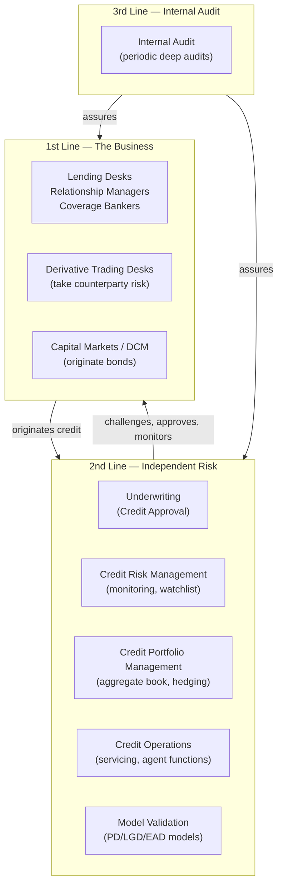
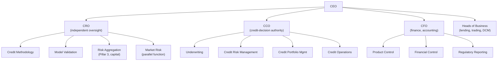
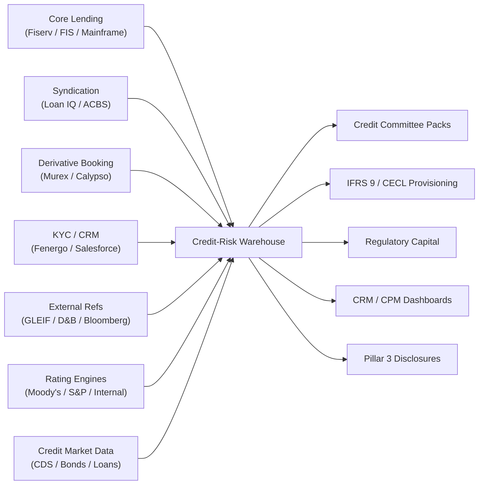

# Credit Module 2 — The Credit Function in a Securities Firm

!!! abstract "Module Goal"
    Map the credit function as it actually sits in a securities firm or commercial bank — its sub-functions, its reporting lines, where its data lives, and how its data flows differ structurally from market-risk data flows. By the end you should be able to look at any credit data issue and immediately know which team owns it, which system it came from, and which committee will care about it.

---

## 1. Learning objectives

By the end of this module, you should be able to:

- **Distinguish** the first, second, and third lines of defence as they apply to credit, and explain why the regulator demands the separation.
- **Identify** the four major sub-functions inside the second-line credit-risk team — underwriting, credit risk management, credit portfolio management, credit operations — and name the data each one consumes and produces.
- **Distinguish** the Chief Credit Officer (CCO) from the Chief Risk Officer (CRO) and explain why the two roles are not interchangeable for governance, sign-off, or data ownership.
- **Trace** a single credit decision from origination to portfolio reporting, naming the system that owns the data at each step.
- **Map** the firm's credit-data landscape — origination systems, syndication / agent platforms, derivative trade-booking, KYC and reference data, rating engines, credit-market data, the credit-risk warehouse — onto the typical org chart.
- **Anticipate** the structural ways credit data flows differ from market-risk data flows in cadence, latency tolerance, restatement frequency, and approval workflow.
- **Recognise** which organisational stakeholders must be consulted before any cross-team credit-data architecture change.

## 2. Why this matters

In many firms the credit-data estate is older, smaller, and structurally less well integrated than the market-risk estate. The core lending systems trace back to the 1990s (sometimes earlier — IBM mainframes still run a meaningful share of the world's commercial-loan books). The teams that own them are smaller than the trading-floor IT functions, the reconciliation cadence is monthly or quarterly rather than daily, and the natural counterparty for credit data is **finance** as often as it is **risk**. A data engineer who arrives from a market-risk background and assumes the credit estate looks the same usually wastes the first six weeks talking to the wrong people, asking the wrong systems for the wrong feeds, and missing the credit-committee deadline that actually matters.

Understanding the org chart is the cheapest way to compress that learning curve. If you know who owns the loan-origination system, who runs the credit committee, who signs off on a single-name limit increase, and who escalates a watchlist downgrade, you can find the right system and the right person in hours rather than weeks. You can also tell — quickly — whether a number is "wrong" because the underlying data is wrong, or "wrong" because it crossed a boundary between two systems that legitimately disagree by design. Most credit-data incidents are the second kind, and the org map is what lets you triage them.

This module sits between [C01 — Credit Risk Foundations](01-credit-risk-foundations.md) (what the credit function measures) and the upcoming module on the loan / bond / credit-derivative lifecycle (how a single credit instrument physically flows through the systems below). The structural parallel to [MR Module 2 — Securities Firm Organisation](../modules/02-securities-firm-organization.md) is deliberate; readers who have worked through the Market Risk track should feel the pattern immediately, and the contrasts (different systems, different cadences, different sign-off paths) are themselves part of what this module is teaching.

!!! info "Honesty disclaimer"
    This module reflects general industry knowledge of how mid-to-large securities firms and commercial banks organise their credit functions as of mid-2026. The exact reporting lines, sub-function boundaries, system names, and committee structures vary materially by firm, jurisdiction, and the specific licensing regime under which the firm operates. Universal banks, broker-dealers, asset managers, and pure commercial banks each look slightly different. Treat the material here as a starting framework — the org chart in your firm's intranet, the credit-policy document, and the list of committee members on the governance wiki are the authoritative references for your specific environment. Where the author's confidence drops on a particular topic (typically firm-specific committee mechanics, jurisdiction-specific senior-manager regimes, vendor-specific feed shapes) the module will say so explicitly.

## 3. Core concepts

The next ten or so sub-sections walk the credit function from the regulatory framing (three lines of defence), through the internal sub-functions (underwriting, CRM, CPM, operations), through the senior leadership distinction (CCO vs CRO), through the committee mechanics, through the system landscape (where credit data physically lives), through the structural contrasts with market risk, ending with the stakeholder map and where the data engineer themself sits in the org. Read them in order; each builds on the language established by the previous.

### 3.1 Three lines of defence as they apply to credit

Post-2010 — driven by the supervisory response to the 2008 crisis — every regulated firm is expected to operate a **three-lines-of-defence** model for risk. The framework is the same as in market risk, but the sub-functions inside each line are different.

The **first line** is the business that originates credit. In a commercial bank that is the lending desks, the relationship managers, and the coverage bankers who sit with the client and structure the deal. In a securities firm it also includes the derivative trading desks, because every uncollateralised derivative is a credit exposure to the counterparty on the other side. Capital-markets / DCM (debt capital markets) teams that originate bond issues sit here too. The first line *takes the credit risk*; it has every commercial incentive to grow the book, and it owns the customer relationship.

The **second line** is the independent credit-risk function. It does not originate; it challenges, approves, monitors, and aggregates. Within the second line there are typically four operational sub-functions (covered in detail in section 3.2 below) plus a model-validation function that sits separately and reviews the PD / LGD / EAD models the credit-risk function uses. In a well-organised firm the second line is staffed by people whose career path is in risk rather than in the business, with compensation untethered from the volume of credit originated.

The **third line** is internal audit. They review *both* the first-line origination process and the second-line risk function, on a rolling multi-year cycle. Their question is not "is this loan good?" but "is the process by which loans are approved, monitored, and provisioned working as documented, and can it be evidenced?" Auditors will ask the data engineer for lineage, controls, and change history; their work product is a finding that goes to the audit committee of the board.

!!! info "Why this matters for BI"
    The three-lines model directly shapes who can change what data, who can sign off on a credit number, and which reports must be produced by an independent team. A first-line analyst can compute an indicative PD; only the second line can stamp the *official* PD that drives capital and provisions. A first-line trader can mark a derivative; only the second line (and product control in finance) can stamp the *official* exposure that drives the credit limit. Get this distinction wrong in your access model and the next internal audit will surface it immediately.

A subtle point worth surfacing up front: the three-lines model is *not* a hierarchy in which the second line is "above" the first or the third is "above" the second. It is a separation-of-duties model in which each line has a distinct job and the three jobs collectively make the system work. The first line is closest to the customer and the risk; it has information advantages and incentive disadvantages. The second line is independent of the customer relationship; it has information disadvantages but incentive advantages. The third line is independent of both and reports to the audit committee of the board, with the explicit role of telling the senior leadership and the board whether the first two lines are working as designed. The model only functions when all three lines are staffed properly and the three reporting paths are unambiguous; collapsing any pair of them into a single function — a temptation in smaller firms or in cost-reduction cycles — is the structural fault that supervisors look for first.

The credit-data engineer typically lives in the second line, but spends time in conversations with all three. First-line lending teams are the source of new deal flow and the consumers of the exposure dashboards. Second-line teams are the primary stakeholders for the warehouse. Internal audit is a periodic but unavoidable interlocutor — the audit cycle on the credit function comes around every two-to-three years for a typical firm, and every audit involves a request for lineage, change history, and evidence-of-control documentation that the data engineer is expected to produce. Treating audit as an adversarial event is a mistake; treating it as a natural part of the operating cycle and being ready for it is the mature posture.

A practical observation: the strength of a firm's three-lines model is usually visible from the *escalation paths* rather than from the org chart. Ask "what happens when the second line disagrees with the first line on a credit decision?" and the answer tells you a great deal about the firm's risk culture. In a strong-lines firm the second line can decline a credit and the decision stands unless escalated to a higher-level committee where both sides present. In a weak-lines firm the second line "raises concerns" but the first line proceeds anyway, with the escalation path either undocumented or rarely used. The data engineer notices the difference because in a strong-lines firm the audit trail captures every disagreement and resolution; in a weak-lines firm the disagreements are informal and the audit trail is thin. Building a warehouse that *expects* and *captures* disagreement — rather than treating consensus as the default — is one of the architectural choices that separates a credible credit-risk warehouse from a decorative one.

### 3.2 The four sub-functions inside the second-line credit-risk team

Within the second line, the credit-risk function typically organises into four operationally distinct sub-functions. The names vary by firm — some firms collapse two into one, some split underwriting by industry — but the four roles exist somewhere in every regulated lender.

#### Underwriting / credit approval

The team that **assesses new credit before it is booked**. An underwriter takes the deal package from the relationship manager, reviews the obligor's financials, runs the rating model, sizes the appropriate limit, structures the covenants, and writes the credit memo that goes to the credit committee. For very large or complex deals there is a back-and-forth with the business that can take weeks. For smaller standardised deals (a corporate revolver under a delegated-authority threshold, say) the underwriter approves directly without a committee.

The data the underwriter needs: the obligor's financials (often manually extracted from filed accounts and entered into the rating engine), the obligor's existing exposure across the firm (loans, derivatives, securities), the relevant industry and country risk overlays, and any internal watchlist or relationship history. The data the underwriter produces: a credit memo, a recommended limit, a recommended rating, a recommended structure, and — if approved — a stamped record in the credit-decision system that authorises the booking team to proceed.

#### Credit risk management (CRM)

The team that **monitors existing exposures**. Once a loan is booked the underwriter's job is done; the CRM team picks up ongoing surveillance. Their work product is the **watchlist** — a continuously curated list of obligors whose credit quality has deteriorated and that warrant heightened monitoring or remedial action. They re-rate obligors annually (or more often if triggered by an event), they track covenant compliance, they review macro and sector developments for industries where the firm is concentrated, and they raise early-warning flags that may push an exposure into restructuring or workout.

The data the CRM team needs: continuously refreshed exposure data, covenant and financial-reporting data from the borrower (typically delivered quarterly under loan documentation), market-data signals where available (CDS spreads, bond prices, equity volatility for listed obligors), and the firm's internal news / event-monitoring feeds. The data the CRM team produces: rating updates, watchlist additions and removals, early-warning indicators, and the annual re-review memos.

#### Credit portfolio management (CPM)

The team that **manages the book in aggregate**. Where the underwriter and the CRM analyst think obligor-by-obligor, the CPM team thinks portfolio-by-portfolio. Their concerns are concentration (single-name, sector, country, vintage), correlation, and the risk-return profile of the book as a whole. They use credit derivatives (CDS, credit indices) to hedge concentration, they participate in loan sales and securitisations to transfer risk, and they advise the business on where the book is over-exposed and where it has appetite for more.

The data the CPM team needs: aggregate exposure rollups under multiple dimensions (industry, country, rating, vintage), the firm's risk-appetite framework and limit hierarchy, hedging-instrument inventory, and the credit-derivative market data that prices their hedges. The data they produce: portfolio dashboards, concentration reports, limit-utilisation reports, and the recommended hedging actions that go to the credit committee or risk committee for approval.

#### Credit operations

The team that **runs the servicing machinery**. Once a loan is booked, every drawdown request, every interest payment, every fee billing, every covenant test, every margin call on a derivative, every collateral movement, and every agent function on a syndicated loan is processed by credit operations. They are the back-office function for the credit book — the analogue of trade settlement for the trading book — and they are typically the largest team in the credit estate by headcount.

The data credit operations need: facility documentation, payment instructions, collateral inventories, syndicated-loan participant lists, and the agent-bank communications for every syndicated facility the firm participates in. The data they produce — and this is the part that newcomers miss — is the **authoritative drawn / undrawn balance for every facility**, the **realised cashflow ledger**, and the **collateral-valuation history**. For a revolving credit facility, the EAD calculation depends entirely on the drawn / undrawn split that credit operations maintains. Treating credit operations as "back-office plumbing" is a classic mistake; their data is the source of truth for half the credit warehouse.

#### A note on overrides

Each of the four sub-functions periodically overrides a model output. The underwriter may stamp a rating override on the obligor's mechanical rating ("the model says BB but the analyst recommends BB- given recent management turnover"). The CRM analyst may add a watchlist flag that the model did not generate. The CPM analyst may apply a portfolio-level concentration overlay that pushes the calculated capital requirement higher. The credit-operations team may override a calculated drawn balance when an agent-bank notification is in dispute. Every override is a piece of human judgement that the model could not produce, and every override carries an audit trail — the name of the person who made it, the reason, the supporting evidence, the date, the duration before re-review. The data warehouse must store and serve the override history alongside the model output, because the regulator's question on any model output is "show me how this number was produced, including any human overrides applied". Overrides are not exceptions to the model; they are part of the model's operational implementation. Designing the warehouse to treat them as first-class data is one of the early architectural decisions that pays off across the rest of the curriculum.

#### A note on workout

A fifth function exists in every regulated lender that is sometimes treated as a separate sub-team and sometimes as a specialised arm of either CRM or credit operations: the **workout team** (sometimes called *special situations*, *restructuring*, or *recovery*). When an obligor defaults, the workout team takes over from the original CRM analyst and runs the recovery process — negotiating with the borrower, realising collateral, working with bankruptcy administrators, recovering cash. The workout function may run for years on a single name; recoveries on commercial loans typically arrive over three-to-five years post-default, and the realised-loss data the workout team produces is the calibration input for the LGD model that the rest of the credit function uses. Without a clean workout-data feed the firm cannot calibrate its LGD models against its own experience and is forced to rely on industry benchmarks, which is a regulatory red flag for IRB-Advanced banks. The data engineer's interface with the workout team is one of the most under-rated joints in the credit warehouse — covered in detail in the upcoming LGD module, but worth flagging here because the team itself rarely advertises its existence.

### 3.3 Reporting lines: CCO vs CRO

Two senior roles dominate the credit-function org chart, and they are *not* the same. The distinction matters for governance, for sign-off authority, and for who owns which data.

The **Chief Credit Officer (CCO)** owns the credit-decision authority. The CCO chairs the credit committee, approves single-name and portfolio-level limits within their delegated authority, and signs off on rating overrides and watchlist actions. The CCO's reporting line is typically into the CEO or into the head of the lending business — they sit on the *decision* side of the firm. Underwriting and credit risk management usually report to the CCO. In some firms credit portfolio management does too; in others it sits on the trading side.

The **Chief Risk Officer (CRO)** owns *independent oversight* of credit risk along with all other risk types (market, operational, liquidity, model, conduct). The CRO does not approve individual loans; the CRO approves the *framework* under which loans are approved — the rating methodology, the model validation, the limit hierarchy, the capital and provisioning calculations, the regulatory reporting. The CRO's reporting line is into the CEO and (functionally) into the board risk committee, with explicit independence from the business heads. The credit-risk methodology team, the model-validation team, and the firm-wide risk-aggregation team usually report to the CRO.

Most firms run both roles, with a clear demarcation that the supervisor scrutinises. A few firms — particularly mid-sized commercial banks where credit dwarfs all other risks — collapse the two roles into one, and the supervisor typically pushes back. The CCO-CRO split is the visible regulatory expectation post-2010, and the data implications are real: a CCO-owned report (today's credit-committee pack) and a CRO-owned report (this quarter's Pillar 3 capital disclosure) draw from the same warehouse but have different sign-off paths and different audit trails.

A practitioner-level point about the CCO role: in firms where the lending business is the dominant source of revenue (most commercial banks, some universal banks), the CCO is one of the most powerful executives in the firm and carries a level of authority comparable to the CEO of a business division. In firms where lending is secondary (most pure broker-dealers, some asset managers), the CCO role may be smaller or even rolled into the CRO. Reading the CCO's seniority on the firm's leadership-team page tells you a great deal about the relative importance of credit in the firm's overall business mix and, by implication, about the budget and headcount that the credit-data function will receive over the medium term. A small CCO function with thin staffing usually correlates with a small credit-data team and a brittle warehouse; a large, well-staffed CCO function typically supports a more mature data estate.

A useful side-by-side that newcomers consistently want:

| Aspect | CCO (Chief Credit Officer) | CRO (Chief Risk Officer) |
|---|---|---|
| Primary remit | Credit-decision authority | Independent oversight of all risk types |
| Approves | Individual credits within delegated authority | Risk frameworks, methodologies, capital |
| Chairs | Credit committee | Risk committee (functional) |
| Reports to | CEO (or head of lending business) | CEO and board risk committee |
| Owns the data for | Credit memos, decision audit trails, watchlist | Capital, RWA, model validation, Pillar 3 |
| Typical sign-off cadence | Weekly committee plus delegated daily | Monthly capital review, quarterly framework |
| Substitutable in absence by | Designated CCO deputy under delegated authority | Designated CRO deputy; not by CCO |

The substitutability row is the one that catches people. The CRO cannot stand in for the CCO and the CCO cannot stand in for the CRO; each role has its own delegated-authority chain that the firm's governance documents specify by name. Routing a sign-off across the boundary is a finding-in-waiting on the next internal audit.

The dotted-line relationship between the CRO's risk-aggregation team and the CFO's regulatory-reporting team is one of the most important seams in the firm: regulatory capital is computed on the risk side, booked on the finance side, and the reconciliation between the two is a permanent fixture of the warehouse. The credit-data engineer typically lives on the CRO side but spends a meaningful share of their time talking to finance.

### 3.3a A note on the rest of the second line

The four sub-functions described above (underwriting, CRM, CPM, credit operations) plus workout do not exhaust the second line. Two more functions sit alongside them and the data engineer needs to know they exist.

**Model validation** is structurally separate from the credit-risk function — it sits inside the broader risk-methodology / model-risk-management group, reporting to the CRO via a different chain than the four credit sub-functions. Its job is to validate the PD, LGD, and EAD models that the credit-risk function uses, on a recurring cycle (typically annual for material models, more often if performance degrades). Validation involves benchmarking the model output against historical experience, stress-testing the model under adverse scenarios, reviewing the model documentation, and producing a validation report that the CRO and the regulator both read. The data engineer interfaces with model validation when they request historical model-output data, when they ask for the lineage of a specific score, and when they raise findings that require a fix in the warehouse.

**Credit policy** is the function that owns the firm's written credit standards — the policies governing what types of obligor the firm will lend to, what rating bucket is acceptable for what facility size, how watchlist additions are triggered, when overrides require escalation, and what documentation must accompany every credit decision. The credit-policy team is small (sometimes one or two people) but their work product is the constitution that everything else operates under. The data engineer interfaces with credit policy when proposing a new dimension or measure ("the policy says ratings are reviewed annually; the warehouse needs to capture the review-date attribute") and when a change in policy requires a change in the warehouse schema.

Both functions are 2nd-line, both report to the CRO, and both have a stake in the warehouse design. Neither shows up on the typical org chart of the credit-risk function (which usually emphasises the four operational sub-functions) but both are unavoidable interlocutors over a multi-quarter time horizon.

### 3.4 The credit committee

The **credit committee** is where large credits are approved. The cadence is typically weekly (some firms run two committees, one for very large deals and one for routine ones); the composition is the CCO as chair, the CRO or a delegate, the heads of the lending businesses for the deals being discussed, and — for very large names, particularly anything that would breach a single-name concentration threshold — sometimes the CEO. For deals above the committee's own delegated authority (a single name in the hundreds of millions, say) the committee's recommendation goes upward to the board risk committee.

The data the credit committee sees is the **credit memo** — typically a 10-to-30-page document that summarises the obligor (financials, sector, ownership, recent news), the proposed transaction (size, tenor, structure, pricing, covenants), the recommended internal rating, the impact on the firm's existing exposure to the obligor and to the obligor's industry / country, the modelled PD / LGD / EAD / EL for the proposed deal, the regulatory-capital impact, and the underwriter's recommendation with conditions. The memo is written by the underwriter, reviewed by the relevant CRM and CPM analysts, and presented at the committee.

The data engineer rarely attends the committee but produces every number on the slide. A typical credit committee runs a dozen names per week; each name's pack draws data from five to ten upstream systems (rating engine, exposure aggregator, financials database, peer-comparison system, industry-research feed, market-data feed for CDS / bond / equity signals where available). If the data pipeline misses Tuesday's committee meeting because Monday night's batch ran late, the deals slip a week. In a competitive lending market a one-week slip can cost the firm the deal. The credit-committee cadence is one of the operationally tightest deadlines in the credit warehouse.

!!! tip "Memorise the cadence"
    Weekly credit committee, with a 24-to-48-hour data cut-off before the meeting. Quarterly model recalibration. Monthly IFRS 9 / CECL provisioning. Annual rating re-review. Daily exposure refresh for derivatives (CCR). The credit warehouse must serve all five cadences without confusing them.

Knowing the committee schedule is the cheapest piece of operational intelligence the data engineer can carry. Pin the committee calendar to your wall (or to your desktop), with the data-cut deadline marked for each meeting. The cost of missing a deadline is a slipped deal; the cost of knowing the deadline is zero. Every credit data engineer who has missed a committee deadline once never misses a second; the cheaper path is to learn from the version of this lesson that lives on the page.

A second-tier of governance bodies sits above and beside the credit committee. The **board risk committee** (sometimes called the board-level risk committee or BRC) reviews the firm-wide risk profile quarterly, including credit concentration, capital adequacy, and stress-test results. It approves credits above the credit committee's own delegated authority — typically anything that would breach a prescribed concentration limit or that involves a sovereign or financial-institution counterparty above a board-level threshold. The **asset and liability committee (ALCO)** reviews the funding and liquidity implications of the lending book and intersects with credit on questions of funded-vs-committed exposures and funding costs by tenor. The **new-product approval committee** reviews any new credit product or structure before it can be offered, with credit-risk sign-off as one of the gates. The data engineer's relationship with each of these bodies is indirect — the warehouse feeds the inputs to the packs they review — but the existence and cadence of each one shapes the data deliverables the warehouse must produce.

#### A note on memo language

The credit memo is written in narrative prose, not in dashboards. A typical memo opens with one or two paragraphs of qualitative summary on the obligor (industry positioning, management quality, ownership structure, recent strategic events), then moves to a financial-analysis section (revenue and EBITDA trends, leverage, liquidity, fixed-charge coverage), then to the proposed transaction (terms, structure, covenants), then to the modelled risk metrics (rating, PD, LGD, EAD, expected loss, regulatory-capital impact), then to the recommendation. A senior credit officer reading the memo is looking for the *story* — does this obligor's situation make sense, do the numbers tell a coherent narrative, are the risks well-identified — as much as for the modelled outputs. The data engineer's role is to make sure the modelled outputs are accurate and well-attributed; the narrative itself is the underwriter's craft. Forgetting that the memo is fundamentally a narrative document, and treating credit decisioning as purely model-driven, is a category error that loses the data engineer credibility with the credit officers they serve. Modules 18 (Working with Credit Officers) covers this in detail; for now, hold the picture that the model output is one input to a human-judgement document, not the document itself.

### 3.5 Where credit data lives in the firm's stack

The credit-data landscape in a typical mid-to-large securities firm or commercial bank is a mosaic of systems, often older and more fragmented than the market-risk estate. Walking through the major sources:

#### Origination and core lending systems

For commercial loans, the **core banking system** is the system of record. In US and European commercial banks this is often a **Fiserv** or **FIS** product (DNA, Phoenix, Premier, Profile); in larger institutions it may be an in-house system, sometimes still running on a mainframe (IBM z/OS with COBOL). These systems carry the facility master, the drawn / undrawn balances, the payment schedule, the interest accruals, and the day-to-day servicing data. They are the authoritative source for *what the firm has lent*.

Core systems are typically batch-oriented (overnight EOD runs, sometimes intraday checkpoints) and their data models are 1980s / 1990s vintage — flat-file extracts, fixed-width fields, EBCDIC encoding still encountered on the mainframe variants. The credit warehouse usually consumes a daily extract from the core, normalised through a staging layer.

#### Syndication and agent systems

For syndicated loans (where multiple lenders share a single facility) the dominant systems are **Loan IQ** (Finastra) and **ACBS** (Automated Commercial Banking System, originally Bankware Systems, now also Finastra). These platforms manage the agent functions — the firm acting as administrative agent on a deal handles drawdown notifications, interest calculations, fee billings, and participant communications for all the lenders. Where the firm is *not* the agent (the more common case for a smaller participant) the firm receives notifications from someone else's Loan IQ instance and re-keys or auto-loads them into its own system.

The data the credit warehouse consumes from Loan IQ / ACBS includes the participant share (the firm may hold 5% of a $500M facility, not the whole $500M), the facility commitment and drawn balance for the firm's share, the fee-accrual ledger, and the agent's view of borrower covenant compliance. The participant-share complication is one of the classic pitfalls — naively pulling the facility-level commitment and treating it as the firm's exposure overstates risk by 20×.

#### Trade booking systems for derivatives

For derivative counterparty credit risk, the source systems are the trade-booking platforms covered in [Phase 8 of the Market Risk track](../modules/24-murex-applied.md) — **Murex**, **Calypso**, in-house systems. These are the same systems the trading desks use to book the trades, with the credit-relevant data (counterparty, netting set, collateral agreement, current exposure) extracted into the credit warehouse for CCR aggregation.

The cadence here is faster than for lending — derivative exposures move daily with the market, and the EOD CCR feed is one of the more time-sensitive batch jobs in the warehouse. Counterparty credit risk overlaps with market risk on the source-system side; the credit-data team is one of several consumers of the trading-system feeds.

#### Reference data: KYC, internal CRMs, third-party feeds

Every obligor needs a legal-entity record. The KYC platform (often Fenergo, Pega, or an in-house build) holds the regulated client-onboarding data — entity name, registered address, beneficial ownership, sanctions screening, regulatory classifications. The internal CRM (Salesforce is common at the relationship-management layer) holds the commercial relationship data. Third-party feeds — **GLEIF** for Legal Entity Identifiers (LEIs), **Dun & Bradstreet** for company hierarchies and credit scores, **Bloomberg** for issuer reference data — supplement the internal records.

The reconciliation between these sources is permanent work. The same obligor may carry three different legal-entity IDs (one in KYC, one in CRM, one in the lending system) with no enterprise-wide ID until someone builds one. Building and maintaining the **conformed obligor dimension** is the single most important data-modelling task in the credit warehouse, and it is exactly the topic of the upcoming Core Credit Dimensions module.

#### Rating systems

Internal ratings are produced by the firm's own rating engine — often a vendor product (Moody's RiskCalc, S&P PD Model, in-house builds) wrapped with firm-specific calibration, override workflows, and audit trails. External ratings come as data feeds from Moody's, S&P, and Fitch directly, or via an aggregator. The credit warehouse stores both the internal and external ratings as time-series, with full bitemporal history (the rating *as of* a given date, *known as of* a given date), because rating restatements are routine and the regulator requires reproducibility of historical capital calculations.

Rating systems are covered in detail in the upcoming Rating Systems & Migration module; for this module the point is that ratings are their own data domain with their own cadence and their own lineage.

#### Market data for credit

Credit markets produce their own market data: CDS spreads (single-name and indices), corporate-bond prices and spreads to benchmark, secondary-loan-market quotes (Markit Loan Pricing), equity volatility for listed obligors (used as a structural-model input). The credit-risk function uses this data both as a direct input to PD overlays (CDS-implied PD is a common signal for large listed names) and as an early-warning input for the watchlist. The market-data feeds overlap with the [MR Market Data module](../modules/11-market-data.md) since the underlying vendors (Bloomberg, Refinitiv, Markit / IHS Markit) serve both functions.

#### Collateral management systems

A separate platform — sometimes part of the trade-booking system, sometimes a standalone product (Algorithmics Collateral, Calypso Collateral, Murex MX.3 Collateral, vendor specialists like Acadia and CloudMargin) — manages the collateral posted against derivative and securities-financing exposures. It tracks the eligible collateral types under each Credit Support Annex (CSA), the haircuts to be applied, the daily margin calls between the firm and each counterparty, and the legal-entity-level collateral inventory. The collateral system feeds the credit-risk warehouse with the *net exposure after collateral* on every netting set; that net number is what drives the EAD for derivatives under both SA-CCR and IMM. The cadence is daily, with intraday refresh during volatile markets. Collateral is its own dedicated module later in the credit track; flagged here because the data engineer often has to source from the collateral system for any CCR work and the data shape is non-trivial.

#### Workflow and case-management systems

Underwriting and CRM work happens inside workflow systems — vendor products like Moody's Analytics CreditLens, S&P Capital IQ Credit Analytics, or in-house builds — that capture the case state of every credit review (drafting, peer review, committee, approved, declined). The state-transition data is a useful input to operational reporting (how long does a typical underwriting cycle take? where are the bottlenecks?) but is rarely a load-bearing input to the regulatory warehouse. The data engineer often inherits the workflow system as a "best-effort" feed rather than a regulated one.

#### The credit-risk warehouse

Finally, the **credit-risk warehouse** itself — the gold mart that aggregates all the upstream feeds, conforms them to the firm's enterprise dimensions, and serves the downstream analytics, dashboards, regulatory submissions, and credit-committee packs. This is what the data engineer typically owns. The warehouse holds the canonical fact tables (covered in detail in the upcoming Credit Fact Tables module) — facility balances, PD / LGD / EAD assignments, expected loss, default events, recovery cashflows, rating histories — at the grains that support all the downstream consumers.

A typical landscape diagram:

Every arrow into the warehouse is a reconciliation point and a contract; every arrow out is a downstream consumer with its own cadence and tolerance. The warehouse engineer's job is to make the seven inbound feeds reconcile to a single conformed view and to make the five outbound consumers all draw their numbers from that one view.

#### A note on enterprise data warehouse vs. credit-specific mart

In larger firms there is typically a tiering: an **enterprise data warehouse (EDW)** that holds the firm's authoritative records across all functions (lending, trading, finance, HR, customer), and a **credit-risk mart** that consumes from the EDW and adds the credit-risk-specific transformations, model outputs, and aggregations. The credit-risk mart is the credit data engineer's primary surface; the EDW is the upstream source. The interface between the two is a contract — what facts and dimensions are the EDW responsible for delivering, at what cadence, with what quality? — and the credit data engineer spends meaningful time negotiating and maintaining that contract. Smaller firms collapse the two layers, with consequences for separation of concerns; larger firms keep them strictly separated, with consequences for end-to-end change management. Neither pattern is inherently better; the trade-offs are real.

#### A note on system age

Credit systems are typically older than market-risk systems by ten-to-twenty years. This is not an accident. Lending was a mature business with established workflows long before the modern derivatives-trading function existed; the systems that grew up around lending in the 1980s and 1990s have been incrementally extended rather than replaced because the cost of replacement is enormous and the risk of disruption to a multi-year loan portfolio is real. Mainframe COBOL is still encountered, often wrapped in a modern API layer that hides the underlying data-shape from downstream consumers but does not change the underlying refresh cadence. Plan for the wrapping layer to leak — when the EOD batch on the underlying mainframe slips, the API stays available but starts returning yesterday's data, and the data engineer who does not know what is behind the wrapper will not understand why their reconciliation broke.

The data engineer who arrives at credit from a market-risk background should expect to spend more time on source-system mechanics than they did in market risk. Reading the file-format documentation for a mainframe extract, understanding the EBCDIC encoding for the obligor-name field, knowing why the date format on the loan-master extract differs from the date format on the participation extract — these are the unglamorous specifics that determine whether the daily ingest works. The tooling has improved over the past five years (vendor connectors, change-data-capture products, modern ETL tools that can handle the legacy formats), but the underlying complexity has not gone away.

#### A note on data-quality controls

Each of the seven inbound feeds requires a daily set of data-quality checks before the warehouse is considered "clean" for downstream consumption. Typical checks include row-count thresholds (the daily Loan IQ extract should land within 5% of the prior day's row count, or an alert fires), key-uniqueness checks (every facility-share record is unique on the composite key), referential-integrity checks (every obligor referenced in the loan extract exists in the obligor master), value-range checks (no negative drawn balances; rating values are in the master-scale set; dates are within plausible bounds), and reconciliation checks against the source system's own daily totals. The daily DQ run typically completes in the first hour of the EOD batch and gates the rest of the pipeline; if a critical check fails, the downstream model runs are held until the data is corrected. Designing the DQ layer is one of the load-bearing engineering tasks of the credit warehouse and is covered in detail in the [Market Risk Data Quality module](../modules/15-data-quality.md), which transfers wholesale to the credit setting.

### 3.6 How credit data flows differ structurally from market-risk data flows

Engineers who arrive at credit from a market-risk background find four big surprises in the data flow.

**Cadence.** Market risk runs a daily VaR. Credit risk runs a daily counterparty-exposure update for derivatives, but the bulk of the model output — PD, LGD, EAD assignments for the lending book, expected loss, regulatory capital — is recalibrated quarterly, with monthly snapshots in between. A credit-risk warehouse that reproduces a quarter-end capital number two years later is doing its job; a market-risk warehouse that reproduces a single day's VaR two years later is doing its job. The cadences are an order of magnitude apart and the warehouse design tilts accordingly.

**Latency tolerance.** A credit-risk EOD that completes by 9am the next day is fine — the credit committee runs at 10am Tuesday and as long as Monday night's batch is in by Tuesday 8am, the world is happy. A market-risk EOD that completes after 6am is a problem because the trader's morning Greek pack is late. Credit systems are tuned for completeness over speed; market-risk systems are tuned for speed over completeness, with completeness recovered intraday. When you size the cluster for the credit warehouse, optimise for an overnight batch window of six or seven hours, not for the 90-minute window the market-risk team negotiates.

**Restatement frequency.** IFRS 9 stage migrations are typically reviewed and restated quarterly. Rating restatements happen continuously but flow into capital quarterly. Default-event corrections (a default that was originally classified as 90-days-past-due and is later reclassified as a restructuring) can land months after the original event. Bitemporal modelling in credit is not optional — every fact must carry both an `as_of_date` and a `system_date` because the same obligor's PD as of 31 March 2025 may be re-stated in May 2025 and again in August 2025 without ever changing the underlying business date. The MR equivalent (a P&L break re-stated three weeks later) exists but is rarer and lower-amplitude.

**Approval workflow.** Every credit-limit change in a regulated lender carries an audit trail — who proposed it, who approved it, under what authority, with what supporting memo, on what date. Every rating override is similarly tracked. The audit trail itself is data the credit warehouse must store and serve, and the regulator can ask for it at any time. Market-risk parameter changes (a vol surface tweak, a curve-construction change) are usually code commits with a developer's name on them; the audit trail lives in the version-control system rather than in the warehouse. Credit's audit trail is a first-class warehouse citizen.

A simple side-by-side helps make these contrasts concrete:

| Dimension | Market-Risk Data | Credit-Risk Data |
|---|---|---|
| Dominant cadence | Daily (VaR, sensitivities) | Quarterly (capital, models), monthly (provisions), daily (CCR only) |
| EOD batch window | 90 minutes typical, completion by ~6am critical | 6–7 hours typical, completion by ~9am acceptable |
| Restatement frequency | Rare; usually a single break replayed | Routine; quarterly stage migration, rating restatements ongoing |
| Bitemporality | Helpful but often optional | Mandatory; model-output reproducibility is a regulator expectation |
| Audit trail | Code-commit history sufficient for most parameter changes | Required in-warehouse for every limit change, rating override, decision |
| History depth | 2–3 years of daily history typical | 5–10+ years of obligor history, multi-year recovery cashflows |
| Source-system age | Modern (Murex, Calypso post-2000) | Mixed; mainframes and 1990s-vintage cores still common |
| Primary downstream | Trading desk; intraday risk managers | Credit committee; quarterly capital and provisioning |
| Primary reconciliation partner | Front office (trader-PC daily) | Finance (risk-finance monthly / quarterly) |

The two estates are different enough that the engineering muscle memory from one does not fully transfer. Engineers crossing from market risk to credit consistently report that the first quarter feels uncomfortable — the cadence is wrong, the systems are unfamiliar, the stakeholders are different — and that the second quarter starts to feel natural once the new patterns are internalised.

The engineering implication: a credit warehouse is *deeper* in history (years per obligor), *slower* in cadence (quarterly dominant), *more bitemporally fraught* (restatements routine), and *more audit-heavy* (every change has a name) than a market-risk warehouse. The compensating simplification is that intraday correctness rarely matters — the question is end-of-month, end-of-quarter, and as-of-some-prior-date correctness, which is a different but generally more tractable engineering problem.

#### A note on cross-product exposure

A surprising amount of credit-data work is in *combining* exposures across products to a single counterparty. A large multinational corporate may simultaneously have a syndicated revolver from the lending business, an interest-rate swap from the trading desk to hedge the floating leg of the revolver, a foreign-exchange forward from the FX desk, a documentary letter of credit from trade finance, and an outstanding bond held in the firm's market-making inventory. Five products, five source systems, one obligor — and the firm's *total* credit exposure is the netted sum across all five (with appropriate haircuts and netting-set treatment). Producing the cross-product view is one of the highest-value deliverables of the credit-risk warehouse and one of the hardest because it requires the conformed obligor dimension to resolve all five products to the same legal entity. Most regulatory submissions and most credit-committee discussions are at the cross-product level; the per-product views from the source systems are intermediate, not final.

A worth-flagging consequence: the legal-entity reference data is inherently *firm-wide*, not credit-specific. A change to an obligor's parent or to its country of incorporation affects market risk, finance, compliance, and credit simultaneously. The reference-data team that owns the legal-entity master typically reports to a chief data officer or to operations, not to the CRO; their stakeholders include every function in the firm, and their change-management process is correspondingly conservative. The credit data engineer who treats the legal-entity master as "their" data and tries to evolve the schema unilaterally will run into immediate political resistance. The correct posture is collaborative — propose the change, get the cross-functional review, accept the timeline, and design around it. The reference-data team is one of the data engineer's most important strategic relationships across an entire career; investing in it pays off across every project that touches an obligor.

### 3.7 Stakeholder map for the credit-data team

The credit-data team has a recurring set of stakeholders, each with their own needs, cadences, and triggers for calling. Mirroring the [stakeholder map in MR M02](../modules/02-securities-firm-organization.md):

| Stakeholder | Cares about | Data they need | Cadence | What triggers a call |
|---|---|---|---|---|
| **Credit Officer (CRM analyst)** | Obligor health, watchlist movements | Exposure by obligor, rating history, covenant compliance, news / event signals | Daily review, weekly deep-dive | Watchlist downgrade; covenant breach; market-data spike on a name they cover |
| **Underwriter** | New-deal viability, modelled PD / LGD / EAD for the proposed structure | Obligor financials, peer comparables, existing exposure across the firm | Per deal (often urgent) | Memo deadline ahead of credit committee |
| **CCO** | Aggregate decision authority, single-name exposures, committee preparation | Top-N exposures by industry / country / rating, policy-breach reports, escalations | Weekly committee, quarterly review | Limit breach; concentration approaching threshold; pre-committee data prep slipping |
| **CRO** | Independent oversight, capital, model performance, regulatory readiness | RWA by portfolio, capital ratio, model-monitoring metrics, IFRS 9 stage migration | Monthly / quarterly | Capital-ratio drift; model-performance degradation; regulator request |
| **CFO / Finance / Product Control** | Risk-finance reconciliation, provisions, regulatory submissions | Exposure totals reconciled to the GL, ECL provision movements, Pillar 3 inputs | Monthly / quarterly | Reconciliation break; provision movement that doesn't tie to risk's view; submission deadline |
| **Internal Audit** | Lineage, controls, evidence of independence | Change history, access logs, sign-off trails, model-validation reports | Annual deep audit, plus ad-hoc | Audit cycle on the credit function; specific finding requiring deep-dive |
| **Regulator** | Pillar 3, supervisory reporting, model approval, stress-test submissions | Quarterly capital and RWA, IFRS 9 disclosures, stress-test outputs, model documentation | Quarterly / annual / ad-hoc | Submission deadline; on-site supervisory visit; thematic review |

The stakeholder map is the cheat sheet for triage. When the CRM analyst calls about a watchlist name they expected to see, they want a 15-minute answer; when the regulator asks for a five-year reconciliation of an IFRS 9 stage migration they want a three-week answer. Knowing which stakeholder is on the call tells you the urgency, the depth, and the expected delivery channel.

#### A practical glossary — terms you'll hear daily

| Term | What it means |
|---|---|
| **The credit memo** | The document presented to the credit committee for each new deal |
| **The credit committee** | Weekly forum where credits above the delegated authority are approved |
| **The watchlist** | Curated list of obligors under heightened monitoring |
| **The override** | A human adjustment to a model output, with name and rationale captured |
| **The delegated authority** | The single-name limit a named individual or committee can approve |
| **The agent** | The bank running the administrative role on a syndicated facility |
| **The participant** | A bank holding a share of a syndicated facility but not running it |
| **The drawn balance** | The portion of a facility the borrower has actually taken |
| **The undrawn commitment** | The unused portion of a facility the borrower could still draw |
| **The CCF** | Credit Conversion Factor — the empirical fraction of undrawn drawn at default |
| **The covenant** | A contractual condition the borrower must maintain (e.g. leverage ≤ 4×) |
| **The workout** | The post-default recovery process |
| **The cure** | An obligor returning to performing status after a brief default |
| **The provision** | The IFRS 9 / CECL accounting reserve against expected loss |
| **The Pillar 3** | The quarterly regulatory disclosure of capital and risk-weighted assets |
| **The SICR** | Significant Increase in Credit Risk — the IFRS 9 trigger for Stage 2 |
| **The CSA** | Credit Support Annex — the legal document governing collateral exchange |
| **The netting set** | A group of derivative trades that net under a single ISDA / CSA |
| **The CCR** | Counterparty Credit Risk — the credit exposure on derivative trades |
| **The syndication** | A loan held jointly by multiple banks, with one acting as agent |

#### A note on the regulator's expectation

The supervisor (the PRA in the UK, the OCC and Federal Reserve in the US, the ECB SSM in the euro area) expects the credit data infrastructure to satisfy several specific properties: full lineage from the source system to every regulatory number, reproducibility of any historical capital or provision number on demand, evidence of independent review of the data flowing through the warehouse, change-management controls on the schema and on every model, and a documented data-quality framework with measurable KPIs. These expectations are codified in BCBS 239 (covered in further reading) and in jurisdiction-specific supervisory letters. The data engineer's job is not just to build the warehouse but to build it in a way that satisfies the supervisory expectations from day one, because retrofitting compliance onto an architecture that did not consider it is far more expensive than building it in. A useful heuristic: every architectural decision should be defensible to an auditor who asks "why did you do it this way, and where is the evidence?" The answer should not be "because it was convenient" — it should be "because the policy requires X, the data shape demands Y, and the audit trail proves it".

### 3.7a A note on organisational variations

The structure described above is typical for a **mid-to-large investment bank** or **universal bank** with both a securities business and a commercial-lending franchise. Several common variations are worth flagging because the data implications differ:

- **Pure commercial bank (no securities business).** The credit function is larger relative to the rest of the firm and often dominates the risk organisation. The CCO may report directly to the CEO at peer level with the CRO. The systems estate skews older (mainframe core, Loan IQ for syndications), and counterparty credit risk on derivatives is a small line of business rather than a major pillar. The data team may be entirely credit-focused with minimal market-risk presence.
- **Pure broker-dealer (no commercial lending).** The credit function is small relative to market risk, and the dominant credit exposure is counterparty credit risk on derivatives and securities-financing transactions. There is no traditional lending book; the systems estate skews newer (Murex, Calypso, modern collateral-management platforms) and the data team typically sits inside a combined risk-data function alongside market risk.
- **Asset manager.** Credit risk is borne by the client (the funds), not by the firm itself, but the firm runs an internal credit-research function that produces ratings and recommendations on instruments held in client portfolios. The "credit function" looks more like sell-side research and less like a 2nd-line risk function. Data needs are heavy on issuer fundamentals and ratings, light on facility servicing.
- **Hedge fund.** Smaller, flatter, less segregated. The credit function may be a single senior credit officer with one or two analysts, the CCO and CRO roles may be combined, and the systems estate may be a vendor portfolio-management system plus a vendor risk system with limited customisation. The data engineer often wears multiple hats.
- **Custodian / agency bank.** Operations-heavy, minimal own-book credit risk, large reference-data and corporate-actions infrastructure. The "credit function" is largely about the counterparty credit risk to the firm's banking and broker-dealer counterparties and to the issuers of securities held under custody.

Map your firm to one of these variations before applying the patterns from this module. The 2nd-line credit function exists in all of them but its size, autonomy, and data needs vary by an order of magnitude.

Two further variations worth noting briefly. **Private-credit firms and direct-lending platforms** — increasingly significant since the post-2008 retreat of bank balance sheets from middle-market lending — combine a buy-side investment-management posture with bank-style credit underwriting and servicing. Their data estate looks like an asset manager's at the front end and like a commercial bank's at the back end, and the org chart often does not yet reflect the hybrid. **Trade-finance and supply-chain-finance providers** run a high-velocity, short-tenor credit business with very different cadences (hundreds of small transactions per day, each with a 30-to-180-day tenor) and a very different operational profile from term lending. The patterns in this module apply to both, with the cadence and granularity adjusted to fit; the underlying three-lines-of-defence and CCO-CRO structure is the same.

### 3.8 Where the data engineer sits

The credit-data engineer typically sits inside the second-line risk technology function, reporting up through the CRO's technology organisation, with a dotted line to the CCO's analytics team. In smaller firms the same engineer often supports both market and credit risk — the platforms (the warehouse, the orchestration layer, the BI tool) are increasingly shared across the two functions, and the boundary between "market-risk data engineer" and "credit-risk data engineer" is softening as risk technology consolidates.

The trend through 2025–2026 has been toward a **shared risk-data platform** — a single warehouse, a single orchestration layer, a single set of conformed dimensions — that serves both market-risk and credit-risk consumers, with domain-specific marts on top. This pattern is the reason the upcoming Core Credit Dimensions module spends so much time on conformance with the Market Risk dimensions: the same `dim_counterparty` row is read by a market-risk VaR job and a credit-risk capital job, and the conformance is the entire architectural foundation for the shared platform.

The data engineer who can speak both languages — who understands what a sensitivities-by-tenor fact table needs *and* what a PD-LGD-EAD assignment fact table needs, and who can design dimensions that serve both — is rare and increasingly valuable. The two halves of this curriculum are deliberately structured to produce that engineer.

#### Career-path implications

The credit-data engineer's career typically progresses along one of three axes. The first is the **technology axis** — deeper into the data platform, the orchestration layer, the warehouse architecture; eventually into a head-of-risk-data-engineering or chief-data-officer role with responsibility for the firm's enterprise data estate. The second is the **domain axis** — deeper into the credit business itself, often via a stretch into model validation or methodology, eventually into a head-of-credit-risk-analytics role with responsibility for the firm's credit-risk measurement framework. The third is the **business axis** — out of risk technology and into the first line, usually into a credit-portfolio-management or credit-strategy role where the deep data fluency is a structural advantage. All three axes are open; the choice depends on whether the engineer's interest is in the platform, the methodology, or the business.

A note on hybrid roles: an increasingly common pattern in mid-to-large firms is the **risk-data product manager** — a role that sits between the engineering function and the business consumers, owning the roadmap of warehouse improvements, the prioritisation of incoming requests, and the relationship with each major stakeholder. The role typically pays more than a senior engineer and less than a head of department, and it is often the natural progression for an engineer who has spent two-to-three years building deep familiarity with both the technical estate and the credit business. If your firm has such a role, observe how the incumbent operates; if your firm does not have one, the gap is often visible in the form of mis-prioritised work and stakeholder frustration, and proposing the role can be one of the higher-leverage organisational changes a senior engineer makes in their first few years.

A note on certifications: the credit-risk function does not have a single dominant certification the way the front office has the CFA or the market-risk function has the FRM. The PRM and FRM both cover credit risk in their syllabi and are useful general credentials. The Certified Credit Executive (CCE) and the Certified Risk Professional (CRP) are sector-specific options. None of them is required for a data-engineering role, but several of them are useful for the domain-axis career path described above; the FRM in particular gives a solid grounding across both market and credit risk and is the most portable across employers.

### 3.9 What a typical day looks like

A composite picture of a typical weekday for the credit-data team in a mid-to-large firm. The shape varies by team and by phase of the quarterly cycle, but the rhythm is recognisable.

- **06:30** — overnight EOD batch completes; data-quality dashboards refresh. The on-call engineer reviews the morning DQ report. Any critical-feed failure (the Loan IQ extract did not arrive, the rating engine batch errored) is escalated immediately because the morning credit-officer reports depend on it.
- **07:30** — morning credit-risk reports auto-publish: the watchlist update, the daily exposure dashboard, the limit-utilisation report, the CCR exposure refresh. Credit officers across regions begin reviewing.
- **08:30** — the first calls start. CRM analysts asking about anomalies on names they cover; underwriters chasing peer-group data for memos in flight; CPM analysts checking concentration metrics ahead of the weekly portfolio review.
- **10:00** — Tuesday only: the credit committee meets. The data team is on standby for any pre-meeting questions and any post-meeting action items.
- **11:00–14:00** — project work. The data team is delivering against a roadmap of warehouse improvements, source-system migrations, regulatory deliveries, and operational fixes. Most days, this is the bulk of the day's productive output.
- **14:00–17:00** — second wave of stakeholder calls; mid-afternoon is when the EMEA close drives a flurry of activity from the European credit officers and the regional Pillar 3 teams. APAC engineers handling the morning shift wind down; US engineers ramp up.
- **17:00–18:00** — preparation for the next overnight batch. Any feed changes scheduled for tonight are tested. Any model recalibrations scheduled for the weekend batch are reviewed. The on-call rotation is confirmed.
- **18:00 onward** — the EOD batch begins. The team is generally off until the morning, with on-call coverage if a critical job fails.

The cadence is recognisable to anyone who has worked in operational data engineering. The specific shape — the Tuesday committee, the morning credit-officer reports, the quarterly cycles — is what makes it credit-specific. New joiners typically take one or two full quarters to internalise the rhythm; once internalised, the rhythm becomes the scaffold against which every other piece of work is planned.

## 4. Worked examples

### Example 1 — A $50M syndicated term loan, traced from origination to credit reporting

A coverage banker in EMEA Corporate Banking originates a $50M five-year syndicated term loan to a European industrials obligor, with the firm acting as a participant for $10M of the total. Watch what happens to the data over the next twelve months.

| # | Step | Owner | System | What the credit data team consumes |
|---|---|---|---|---|
| 1 | **Origination** | 1st-line coverage banker | CRM (Salesforce) + deal pipeline tool | A pipeline record opens with the indicative size, tenor, and obligor. The data team picks up the indicative deal in the weekly pipeline report; nothing yet hits the regulatory warehouse. |
| 2 | **Underwriting / credit approval** | 2nd-line underwriter | Internal rating engine + credit-memo platform | The underwriter pulls the obligor's audited financials, runs the rating engine to produce an internal PD, queries the existing-exposure dashboard for any cross-product exposure, and writes the credit memo. The data team's exposure-aggregation feed is a load-bearing input here; if it lags, the underwriter writes off stale numbers. |
| 3 | **Credit committee sign-off** | CCO + CRM lead + business head | Committee management system | The memo is presented; the committee approves a $10M participation with a sub-investment-grade rating overlay and tightened covenants. The decision is stamped in the credit-decision system with an approval ID and an authority-trail. The data team's credit-decision fact table picks up the new approval row overnight. |
| 4 | **Loan booking in syndication system** | Credit operations | Loan IQ (the firm is a participant, not the agent) | The agent bank (a different firm) sends a participation notification; the firm's credit-ops team books the $10M participation in Loan IQ. The facility master gets a new row with the firm's participation share, the commitment amount, and the documentation links. The data team's daily Loan IQ extract carries the new facility into the warehouse the next morning. |
| 5 | **Drawdown processed** | Credit operations | Loan IQ | Two months later the obligor draws $30M of the $50M facility; the firm's participation share of the drawdown is $6M. Loan IQ records the drawn / undrawn split for the firm's participation: $6M drawn, $4M undrawn commitment. The data team's `fact_facility_balance` picks this up and EAD recomputes (drawn $6M + CCF × undrawn $4M). |
| 6 | **Quarterly rating reaffirmation** | CRM analyst | Internal rating engine + watchlist system | At the next quarter-end the CRM analyst reviews the obligor's latest quarterly financials, reaffirms the rating, and makes no watchlist changes. The reaffirmation is stamped in the rating system; the data team's `fact_rating_history` picks up a new row even though the rating hasn't changed (the *event* is recorded). |
| 7 | **IFRS 9 stage assessment** | CRM analyst + finance / product control | Provisioning engine | Quarterly the finance team runs the IFRS 9 stage assessment. The obligor passes the SICR criteria (no significant increase in credit risk vs. origination) and stays in Stage 1 with a 12-month ECL. The provision is computed using the data team's PD / LGD / EAD inputs and posted to the GL; the data team's `fact_expected_loss` carries the snapshot. |
| 8 | **Exposure aggregated to portfolio reporting** | CPM team | Portfolio-management dashboards | The exposure rolls into the daily CPM dashboards by industry (Industrials), country (the obligor's domicile), rating, and vintage. The CPM team uses the rollup to monitor concentration; the data team's aggregation views serve the dashboard. |
| 9 | **Quarterly Pillar 3 disclosure** | CRO's risk-aggregation team + finance regulatory reporting | Regulatory reporting platform | At year-end the exposure is included in the firm's Pillar 3 capital disclosure (RWA contribution, EAD post-CRM, rating-bucket aggregation). The data team's regulatory-aggregation views feed the submission. |
| 10 | **Annual credit review** | Underwriter + CRM analyst | Internal rating engine + credit-memo platform | One year after origination the underwriter and CRM analyst jointly review the facility, refresh the rating, and confirm continuing approval (or recommend changes — limit reduction, covenant tightening, watchlist addition). The decision is stamped, the warehouse picks up the new rating row, and the cycle continues. |

The point of the trace is the *handover* between systems and teams. Every numbered row above represents a system boundary, a team boundary, and almost always a reconciliation. When a number is wrong on the quarterly Pillar 3 submission, you walk this list backwards: did the regulatory aggregation read the right exposure? Did the exposure feed read the right Loan IQ extract? Did Loan IQ pick up the agent bank's drawdown notification? The answer is almost always at one of those joins.

A subtle point: the firm is a *participant* on this deal, not the agent. The agent bank's Loan IQ instance is the master record for the facility; the firm's instance is a downstream consumer. Several reconciliations break when the agent's notifications arrive late or with errors — typically the firm's drawn balance lags the agent's drawn balance by a day or two, and the data team's reconciliation between the two is a permanent fixture.

A second subtle point: between steps 5 and 10, the obligor's quarterly financials may show deterioration (revenue down 15% year-on-year, leverage ticking up). The CRM analyst notices this in step 6, escalates to a watchlist discussion, and in some scenarios the rating gets downgraded one notch. A downgrade is not just a single data point — it cascades. The new PD feeds the next provisioning cycle (the obligor may move from Stage 1 to Stage 2 under IFRS 9 if the deterioration is large enough to constitute a Significant Increase in Credit Risk, requiring a lifetime ECL provision rather than a 12-month ECL). The new PD also feeds the next capital calculation, increasing RWA on the exposure. The new rating may breach a covenant in the loan documentation, triggering a discussion between the agent and the borrower. The credit-committee pack the following Tuesday includes the watchlist addition. The CPM team's industry-concentration dashboard flags the change. Each of those downstream effects is data the warehouse must serve, with traceability back to the original rating change. A single rating-event row produces ten downstream consequences, and every one of them must reconcile to the same source.

The lesson: a credit-data architecture is not just about ingesting the source systems; it is about making the *consequences* of each event consistently visible across all the downstream consumers. The warehouse is a network of derived views that all trace back to a small number of authoritative source events, and the architecture's job is to keep that network coherent as events flow through.

### Example 2 — Diagnose the data gap: "What's our exposure to industry X in country Y as of yesterday?"

A credit officer covering the European industrials sector calls at 09:30 on Wednesday morning. She is preparing for a credit-committee discussion of a new German industrials deal and wants to know the firm's current exposure to German industrials. She has three numbers on her desk and they don't agree.

- The CPM dashboard says €1.2 billion gross exposure.
- The credit memo for last week's similar deal said €1.05 billion.
- The most recent quarterly Pillar 3 submission to the regulator said €1.4 billion.

Why? She wants an answer in 30 minutes; the committee is at 11:00.

The data engineer's diagnostic walk-through:

1. **Confirm the as-of dates.** The CPM dashboard is "as of T-1 EOD" — Tuesday close. The credit memo is "as of two Wednesdays ago" — the analyst's snapshot at the time the memo was drafted. The Pillar 3 submission is "as of the end of last quarter" — three months stale. Three different as-of dates. The first reconciliation question is always *which point in time*; if the dates don't match, the numbers can't be expected to match either.

2. **Confirm the exposure definition.** The CPM dashboard typically shows *gross drawn + undrawn commitment* (the EAD-relevant view). The credit memo may show *funded exposure only* (drawn balance, no commitment) because the underwriter is sizing the new deal against the portion of the book that is already at work. The Pillar 3 submission shows *exposure post-CRM* (after credit-risk mitigation — collateral, guarantees, netting). Three different exposure definitions. The second reconciliation question is always *which measure*.

3. **Confirm the dimension membership.** "Industrials" is a sector classification. The CPM dashboard uses the firm's internal industry taxonomy (a 20-bucket internal classification). The credit memo uses GICS at the 4-digit level (a more granular external taxonomy). The Pillar 3 submission uses the regulator's prescribed industry classification (another scheme entirely). An obligor classified as "Industrials" under one scheme may be "Capital Goods" or "Industrial Conglomerates" under another. The third reconciliation question is always *which classification*. "Germany" is usually unambiguous (ISO 3166 country code), but the country attributed to the obligor — country of incorporation, country of risk, country of ultimate parent — itself varies by source.

4. **Confirm the legal-entity boundary.** The CPM dashboard may aggregate to the *immediate counterparty*; the credit memo may aggregate to the *ultimate parent*; the Pillar 3 submission may aggregate to the *consolidated group*. A multinational industrials group with German operations and a Luxembourg holding company can land in three different country buckets depending on which view is taken.

5. **Walk back to the warehouse.** The data engineer pulls the underlying `fact_facility_balance` rows for German industrials obligors as of Tuesday EOD, applies each of the three exposure definitions and dimension classifications, and reproduces all three numbers. They tie. The discrepancy is *not* a data bug; it is three different (legitimate) views of the same book.

6. **Frame the answer for the credit officer.** "Your three numbers are all correct; they answer three different questions. The committee should look at the gross drawn + undrawn under the firm's internal industry taxonomy aggregated to the immediate counterparty as of Tuesday EOD: €1.2 billion. If the committee wants a regulatory view, the Pillar 3 number for end-of-Q1 is €1.4 billion; the difference is partly two new deals booked since then, partly the regulator's industry classification picking up two obligors the internal taxonomy puts in 'Conglomerates'. If the committee wants the funded view, drawn-only is approximately €0.95 billion — broadly in line with what the credit memo two weeks ago saw."

The whole diagnosis takes 25 minutes, and it is only possible because the data engineer understands the org chart well enough to know that the three numbers were produced by three teams (CPM, underwriting, regulatory reporting) for three different audiences with three different conventions. The architectural fix — a **conformed industry dimension** with a single source of truth for the obligor's industry under all three taxonomies, and a **conformed exposure measure** with a single fact table from which all three views can be derived by filter — is the entire topic of the upcoming Core Credit Dimensions module. Until that conformance is in place, this reconciliation is permanent work.

The lesson for the data engineer: the most expensive credit-data incidents are *not* bugs in the warehouse; they are mismatched conventions between teams that the warehouse was never asked to reconcile. Building the conformance is the high-leverage architectural move.

#### A short follow-on: how the credit officer reframes the question

Once the credit officer hears the diagnosis, she reframes the next time she calls. Instead of "what is our exposure to German industrials?" she asks "what is our gross drawn-plus-undrawn exposure under the firm's internal industry taxonomy, aggregated to the immediate counterparty, as of yesterday's EOD, for German industrials?" The reframed question has the four critical specifications baked in (measure, classification, aggregation grain, as-of date), and the data engineer can answer it from the warehouse in a single query without any reconciliation overhead. Teaching the consumers of the warehouse to ask the question precisely is itself a deliverable; a one-page reference card pinned to the credit-team's wall, listing the four specifications and the standard values for each, often pays back the time investment within a quarter.

The deeper architectural lesson is that the warehouse's job is to enable *consistent* answers, not to enforce a single answer. The credit officer is right to want all three views (gross-drawn-plus-undrawn for limit monitoring, drawn-only for funding, post-CRM for regulatory) — they answer three legitimate questions for three different audiences. The warehouse's job is to make all three derivable from one set of underlying facts, conformed dimensions, and well-labelled measures. Trying to force one of them to be the "right" answer is an over-reach that will be rejected by the credit function the moment it sees the proposal.

### Example 3 — A short vignette: the watchlist addition that didn't propagate

A CRM analyst adds a mid-cap European industrials obligor to the watchlist on Friday afternoon, citing a profit warning published that morning. The addition is stamped in the watchlist system at 16:30. Over the weekend the credit-portfolio-management dashboard refreshes; on Monday morning the CPM analyst notices the obligor on her dashboard but in the wrong colour — flagged as "performing" rather than "watch". She calls the data team.

The diagnostic walk: the watchlist system writes to the credit warehouse via a nightly batch at 19:00. The Friday 19:00 batch picked up the addition. The CPM dashboard reads from a materialised aggregate that refreshes at 21:00. The Friday 21:00 refresh ran *before* the watchlist was loaded into the warehouse — there is a two-hour gap in the schedule that nobody noticed because most weeks the watchlist is updated earlier in the day. The Saturday and Sunday refreshes saw the watchlist correctly but the dashboard's day-of-week colour scheme reverts to the most recent business-day's status, which for some legacy reason was Friday's stale read. The fix is two-part: (a) re-order Friday's pipeline so the watchlist load completes before the aggregate refresh, and (b) fix the dashboard's day-of-week logic to read the latest available status rather than the most recent business-day's. Both changes ship the following week with regression tests around the schedule order.

The vignette's lesson is small but representative: most credit-data incidents are scheduling and ordering bugs rather than data-content bugs, and the diagnosis requires knowing the upstream and downstream cadence well enough to spot the gap. The org-chart fluency and the source-system landscape work covered earlier in this module are what make that diagnosis possible in 30 minutes rather than a week.

## 5. Common pitfalls

!!! warning "Watch out"
    1. **Confusing CCO authority with CRO authority.** The CCO approves credits within their delegated authority; the CRO approves the framework under which credits are approved. They are not interchangeable, and routing a sign-off to the wrong one is a finding waiting to happen on the next internal audit. When in doubt, ask which committee the decision is going to — the credit committee (CCO) or the risk committee (CRO).
    2. **Assuming credit-risk data refresh cadence matches market-risk cadence.** Market risk runs daily; most of credit runs quarterly with monthly snapshots. Sizing the credit warehouse for a market-risk-style refresh wastes engineering effort and confuses the consumers. Match the cadence to the underlying business cycle, not to a generic "real-time" instinct.
    3. **Missing the syndicated-loan agency complication.** When the firm is a *participant* (not the agent) on a syndicated facility, the master record lives in someone else's system. Naively pulling the facility-level commitment from the agent's notification and treating it as the firm's exposure overstates risk by 5×–20× depending on the participation share. Always pull the firm's *participation share*, and reconcile it against the agent's view daily.
    4. **Treating credit operations as "back-office plumbing".** Credit operations owns the authoritative drawn / undrawn balance for every revolving facility, and that balance is a load-bearing input to EAD. Skipping the credit-ops feed and reading the drawn balance from a downstream report introduces a one-day-or-more lag and breaks the EAD calculation in subtle ways. Source from credit-ops directly.
    5. **Underestimating the credit-committee cadence.** A weekly credit committee with a 24-to-48-hour data cut-off is an operationally tighter deadline than most market-risk batches. A pipeline that misses Tuesday's committee wastes a week of competitive lending activity. Build for committee deadlines first; everything else is more forgiving.
    6. **Confusing the obligor with the counterparty.** The obligor is the entity that owes the credit-bearing payment; the counterparty is the entity facing the firm in any contract. They are usually the same on a loan and usually different on a derivative (where the counterparty is the trade-facing entity, who may or may not be an obligor of any underlying credit risk). Treating them as identical in the dimension model collapses analyses that should stay distinct.
    7. **Skipping the model-validation team in design conversations.** Any change to the warehouse that affects how a model output is stored, transformed, or served is a change the model-validation team must be aware of, because they are the ones who will be asked by the regulator whether the model is operating as documented. Designing a new fact-table layout for PD assignments without consulting validation is a finding-in-waiting on the next on-site supervisory visit.
    8. **Building a "single source of truth" without explicit consumer agreement.** The temptation to nominate one number as the canonical exposure (or PD, or RWA) is real, but doing so without first canvassing the consumers — credit committee, finance, regulatory reporting, CPM — produces an architecture that is technically clean and politically dead-on-arrival. The consumers must agree on the definition before the architecture is built; the architecture is the output of the agreement, not the forcing function for it.

## 6. Exercises

1. **Authority question.** The Head of Lending wants to extend a single-name limit on a long-standing client by $200M, taking the total firm-wide exposure to the obligor from $300M to $500M. The CCO is on holiday. The CRO is in the office. Whose sign-off is needed, and what is the data engineer's role in supporting that decision?

    ??? note "Solution"
        The increase is a credit-decision matter, not a framework matter, so the authority sits on the CCO side, not the CRO side. The CRO being in the office is operationally irrelevant — the CRO does not approve individual single-name limit increases, and substituting CRO sign-off for CCO sign-off would itself be a governance breach. The right path is to (a) identify the CCO's designated deputy under the firm's delegated-authority matrix (every regulated lender has one) and route the request there, or (b) if the increase is above the deputy's authority, schedule an out-of-cycle credit committee with the deputy as chair, or (c) if the increase is above the committee's authority, escalate to the board risk committee, which can approve in the CCO's absence. The data engineer's role is to produce the supporting pack within hours rather than days: current firm-wide exposure to the obligor across all products (loans, derivatives, securities), the obligor's rating history and any recent changes, the resulting concentration metrics post-increase (single-name limit utilisation, sector and country impact), the regulatory-capital impact, and any peer-group context the underwriter typically attaches. The pack is the same shape as a normal credit-committee memo, compressed in turnaround. The lesson: knowing the authority hierarchy lets the data engineer route the request correctly the first time, rather than producing a beautiful pack and finding out it was sent to the wrong committee.

2. **Race-condition question.** A counterparty trade is amended at 16:55 on a Tuesday afternoon, five minutes before the credit-risk EOD cut-off at 17:00. Walk through which credit data systems pick up the amendment in tonight's run, which miss it, and what the data engineer must build to catch the discrepancy.

    ??? note "Solution"
        At 16:55 the trade-booking system (Murex, say) picks up the amendment immediately and the trade flips to "amended" status. The credit-risk EOD batch at 17:00 reads the trade-booking extract; depending on the implementation, either (a) the extract is taken at exactly 17:00 and includes the amendment, or (b) the extract was taken at 16:55 (just before the amendment) and the amendment will only land in tomorrow night's batch. The collateral system, which reads from the trade-booking system on its own schedule (often 17:30), picks up the amendment but recomputes margin overnight; the next-day margin call may differ from what the trader expected. The CCR exposure engine, which reads the EOD position snapshot, will produce a slightly different exposure depending on whether the amendment made it in. The credit-limit system, which monitors limit utilisation against the EOD exposure, may flag a breach that wasn't there yesterday — or fail to flag one that should now be there. Tomorrow's reconciliation between the trading-system view (amended) and the credit-warehouse view (possibly not amended) tears, and someone has to investigate. The data engineer's job is to: (a) document the cut-off contract clearly — every system that consumes from the trade-booking system specifies the time-stamp it freezes against, (b) make late-amendment detection a first-class signal — every position row carries a `late_amendment_flag` if the booking timestamp is within N minutes of the cut-off, (c) ensure the daily reconciliation expects the temporary mismatch in this scenario and does not raise a false positive, (d) make the late-amendment list available to credit operations for next-day clean-up so the inconsistency does not propagate into the weekly credit-committee pack. The bug is usually a silent race that no one sees, not the amendment itself.

3. **Org-aware design question.** You are proposing to consolidate two regional credit-risk warehouses (one in London, one in Singapore) into a single global instance. List four organisational stakeholders you must consult before architecture design begins, and what each cares about.

    ??? note "Solution"
        (1) **Regional Heads of Credit (CCO delegates)** in each region — they own the credit-decision authority and will block any change that disrupts their weekly credit committees or creates a window of regulatory non-compliance. They care about cut-off times, the credit-committee pack, continuity of historical series, and the resilience of the data pipeline through the cut-over. They will want a parallel-run period and explicit roll-back criteria. (2) **CRO's risk-aggregation team and Risk Technology** — they own the warehouse infrastructure today and the model-output pipelines that feed it. They care about migration cost, the deprecation path for the current systems, on-call rotation across time zones for a global instance, and the impact on the quarterly capital and IFRS 9 cycles that depend on the warehouse being available on specific days. (3) **Compliance, Legal, and Internal Audit** — they care about data sovereignty (Singapore data may have local-residency obligations under MAS; the EU-domiciled instance may have GDPR implications for personal data on individual borrowers and beneficial owners), about lineage continuity through the cut-over so the regulator's reproducibility expectations are met, and about the independence of the credit-risk warehouse from any front-office system. (4) **CFO / Finance / Product Control** — Risk and Finance reconcile monthly and quarterly (provisions, RWA, GL postings); any change to the credit-risk warehouse changes the reconciliation surface and PC needs lead time to adjust their own jobs. A good architecture review starts with all four in the room, agrees the constraints, and only then sketches the design. Skipping any of them is the most common reason such programmes fail in year two — the technical design is sound, but a regulatory data-sovereignty constraint or a finance-side reconciliation contract was missed and the programme has to back out.

4. **Conceptual question.** A credit officer asks: "Why do we have three different industry classifications on the obligor record — internal taxonomy, GICS, and the regulator's classification — and which is the 'right' one?"

    ??? note "Solution"
        Each classification serves a different audience and was built for a different purpose. The internal taxonomy is calibrated to the firm's own portfolio shape — for example, the firm may carry enough exposure to "European auto-component manufacturers" to warrant a dedicated bucket that GICS and the regulator's scheme do not break out. GICS (the Global Industry Classification Standard, jointly maintained by S&P and MSCI) is the industry-standard taxonomy used by the equity research community and many vendor data feeds; using GICS lets the firm benchmark its concentration against industry-wide indices and against peer firms. The regulator's classification (NACE in the EU, NAICS in the US) is what Pillar 3 disclosures and supervisory submissions are reported under. None of the three is "right" — they are answers to different questions. The firm's job is to maintain a *crosswalk* between them on the obligor dimension so that any analysis can be performed under the appropriate scheme without the analyst needing to do the mapping by hand. The crosswalk is a small reference table and a load-bearing piece of the conformed obligor dimension; it is the topic of the upcoming Core Credit Dimensions module.

5. **Cadence question.** A new junior data engineer suggests that, given modern infrastructure, the credit warehouse should refresh every 15 minutes "to bring it in line with the trading-floor risk dashboards". Is this a good idea? Frame your answer in terms of the cadence of the underlying credit-risk processes and the value the refresh would deliver.

    ??? note "Solution"
        Mostly no, with one carve-out. Most credit-risk processes do not benefit from a 15-minute refresh. PD / LGD / EAD assignments are recalibrated quarterly; IFRS 9 stage migrations are reviewed quarterly; rating reviews are annual; the credit committee runs weekly. A 15-minute refresh on the lending-book exposures would deliver no incremental value to any of these consumers because the underlying data does not change at that frequency — drawdowns happen daily, payments happen daily, but the model outputs that drive decisions move slowly. The infrastructure cost (more frequent batch jobs, more frequent reconciliations, harder change-management) would be real and the consumer benefit minimal. The carve-out is **counterparty credit risk on derivatives**, where the exposure does change intraday with the market and where some firms do refresh CCR exposures every 15–30 minutes during market hours for limit-monitoring purposes. That use case is real and is typically handled by a dedicated CCR-specific feed rather than a refresh of the entire credit warehouse. The lesson: cadence should match the underlying business cycle, not the available infrastructure capability. Building for a faster cadence than the consumers need is a common rookie mistake that wastes engineering effort and confuses the operational ownership.

6. **Applied question.** A new credit officer joins the team and asks for read access to the credit-risk warehouse. What questions do you ask before granting access?

    ??? note "Solution"
        (1) Which sub-function — underwriting, CRM, CPM, credit operations? Each has different default access scopes. (2) Which obligor segments — large corporate, mid-cap, financial institutions, sovereigns? Some segments may have restricted information (for example, central bank counterparties or sovereign exposures may be limited to a smaller group). (3) Which jurisdictions — the firm's data-sovereignty rules may restrict cross-border access to obligor information. (4) What is their delegated authority limit? An underwriter with a $5M delegated authority typically does not need access to the full $500M+ exposures across the book; access scopes are aligned to the authority hierarchy. (5) Who is their line manager, and has the manager approved the access request through the firm's standard access-management workflow? Granting access without the line-manager sign-off bypasses the audit trail that the next internal audit will check. The lesson: access management in a credit warehouse is itself a governance discipline, not a technical one. The access-management workflow is part of the warehouse's contract with the second-line risk function, and the data engineer's job includes upholding it.

### A bonus design exercise (no solution provided)

Sketch the access-management model for the credit-risk warehouse, given the org structure described in this module. For each of the seven stakeholder types in section 3.7, identify (a) which fact tables they need read access to, (b) which dimension tables they need read access to, (c) which (if any) tables they should have *no* access to under data-sovereignty or commercial-sensitivity rules, and (d) what the standard expiry on their access should be (annual review? per-project? indefinite with line-manager re-approval?). The exercise has no single right answer; the test is whether your sketch could be defended to an internal auditor with a sceptical attitude. Compare your sketch against your firm's actual access matrix once you have one in hand; the gaps in either direction are educational.

## 7. Further reading

- Golin, J. & Delhaise, P. *The Bank Credit Analysis Handbook* (Wiley, latest edition). The standard practitioner reference for how a credit analyst actually thinks about an obligor — the financial-statement analysis, the qualitative overlays, the rating decisions. Reading the analyst-side perspective makes the underwriter's data needs immediately clearer.
- Colquitt, J. *Credit Risk Management: How to Avoid Lending Disasters and Maximize Earnings* (McGraw-Hill, 3rd ed.). A management-perspective treatment of the credit function, including governance, committee structures, and the relationship between underwriting and ongoing monitoring.
- Bank of England, *Senior Managers and Certification Regime (SM&CR)* documentation, [bankofengland.co.uk](https://www.bankofengland.co.uk/prudential-regulation/authorisations/senior-managers-regime-approvals). The UK regulatory accountability model that pins specific named individuals to specific risk responsibilities — including the CCO and CRO roles discussed in this module. The equivalent regimes in other jurisdictions (the US OCC's heightened-standards framework, the EU's CRD V management-body provisions) follow the same pattern with local variations.
- Basel Committee on Banking Supervision, *Principles for effective risk data aggregation and risk reporting* (BCBS 239, 2013), [bis.org/publ/bcbs239.pdf](https://www.bis.org/publ/bcbs239.pdf). The canonical regulatory expectation for risk data — including credit data — covering governance, architecture, data quality, and reporting. Already referenced in C01; equally applicable to the org-and-systems landscape covered here.
- Basel Committee on Banking Supervision, *Corporate governance principles for banks* (July 2015), [bis.org/bcbs/publ/d328.pdf](https://www.bis.org/bcbs/publ/d328.pdf). The supervisory expectation for the three-lines-of-defence model and the independent risk function — the regulatory backdrop to everything in section 3.1 of this module.
- Moody's Analytics, *credit-process and credit-committee best-practice publications* — Moody's publishes periodic guides on credit-decisioning best practice (search for "credit committee" on the Moody's Analytics insights page). Useful for benchmarking your firm's committee structure against the industry pattern; the specific URLs change as the publications are refreshed.
- Internal: your firm's credit policy, the delegated-authority matrix, the credit-committee terms of reference, and the CCO / CRO job descriptions in the governance wiki. These are the load-bearing references for any operational work and supersede any general text where they conflict.

#### A pragmatic ordering for your first six months

If you are joining a credit-data team and want a self-directed reading order on top of the formal modules, a defensible sequence:

1. Spend the first two weeks reading your firm's credit policy, the delegated-authority matrix, the credit-committee terms of reference, and the org chart for the credit function. The local definitions are load-bearing.
2. Read Golin & Delhaise on bank credit analysis — not the whole book, but the chapters on the credit function and on credit committees. It will give you a vocabulary that ties every internal document together.
3. Skim BCBS 239 — not to memorise the principles, but to understand the structure of the supervisory expectation on risk data aggregation. The same document will come back several times in the rest of the curriculum.
4. Skim the corporate-governance principles for banks (BCBS) — for the supervisory framing of the three-lines-of-defence model that this module's section 3.1 referenced.
5. Read the Bank of England SM&CR documentation (or the equivalent in your jurisdiction) — the senior-manager accountability regime is what pins the CCO and CRO roles to specific named individuals and what makes the role distinction operationally consequential rather than just nominal.
6. Only then move to Colquitt's *Credit Risk Management* for the management-perspective deep-dive, and to the Moody's Analytics credit-process publications for industry-benchmark practice.

This order optimises for becoming useful to your team quickly; the deeper management and methodology references can wait until you have an internal frame of reference to attach them to.

## 8. Recap

You should now be able to:

- Place the credit function on the three-lines-of-defence map and explain why the regulator demands the separation, with specific reference to the credit-decision (CCO) vs. independent-oversight (CRO) split.
- Name the four major sub-functions inside the second-line credit-risk team — underwriting, credit risk management, credit portfolio management, credit operations — and identify the data each one consumes and produces.
- Distinguish the CCO from the CRO, articulate why the two roles are not interchangeable, and route a credit-decision question to the right authority.
- Trace a single syndicated-loan participation from origination to quarterly Pillar 3 disclosure, naming the system and the team that owns each step, and identify where the firm's role as participant (not agent) changes the data shape.
- Map the firm's credit-data landscape — origination, syndication, derivative-booking, KYC and reference data, rating engines, credit-market data, the credit-risk warehouse — onto the typical org chart.
- Articulate the four structural ways credit-data flows differ from market-risk flows — cadence, latency tolerance, restatement frequency, approval workflow — and predict the engineering implications of each.
- Anticipate which organisational stakeholders must sign off on any cross-team credit-data architecture change before design work begins, and frame the consultation around what each one cares about.
- Recognise the cross-product exposure problem and articulate why the conformed obligor dimension is a load-bearing piece of the warehouse architecture.
- Distinguish the credit memo (a narrative document) from the model output (a numerical input to it) and avoid the category error of treating credit decisioning as purely model-driven.

The next module — **Loan / Bond / Credit-Derivative Lifecycle** — picks up directly from the trace example in section 4 above and walks through the full lifecycle of a credit instrument from origination through default and recovery, with the state-transition diagrams and bitemporal modelling implications that fall out. If you came to this module from the Market Risk track, the structural parallel to MR Module 3 (trade lifecycle) will be obvious; if you came to credit fresh, treat the next module as your introduction to why credit lifecycles span years rather than days, and what that does to the warehouse design.

A final orientation: the test of whether this module has done its job is whether you can now sit in front of any credit-data issue and immediately know who to talk to, which system to look at, and which committee will care about the answer. The remaining modules build on top of that organisational fluency; the data shapes only make sense once the org chart is internalised.

If you found anything in this module unclear or incompletely justified, that is signal worth pursuing. The exact org structure varies by firm, jurisdiction, and licensing regime, and no single module can cover every variation. Use the further-reading list, your firm's internal governance documentation (the credit policy, the delegated-authority matrix, the credit-committee terms of reference), and the upcoming module sequence as the next layers of refinement; this module is a foundation, not a complete reference.

An honest caveat: the org structure described in this module is a *modal* picture, not a description of any specific firm. Real firms blend the patterns described here with local history, regulatory geography, M&A inheritance, and the personalities of the senior leaders who shaped the function. Two firms with identical published org charts can have very different working cultures and very different effective sign-off paths. The module's framework is a starting point for asking the right questions about your specific firm; it is not a substitute for spending time with the people who actually run the function and discovering how things work in practice.

A second honest caveat: the systems landscape moves. The vendors named in section 3.5 (Fiserv, FIS, Loan IQ, ACBS, Murex, Calypso, Fenergo, Salesforce) are accurate as of mid-2026, but vendor consolidation, cloud migrations, and in-house re-platforming continue to reshape the estate. Treat the named vendors as illustrative of the *category* of system rather than as a permanent list. The categories themselves — origination, syndication, derivative-booking, KYC, reference, rating, market-data, warehouse — are stable enough to plan around for the next decade; the specific products that fill each category are not.

A pragmatic onboarding sequence for the data engineer joining a credit-data team for the first time:

1. Spend the first week reading the firm's credit policy, the delegated-authority matrix, and the org chart for the credit function. Identify the names of the CCO, the CRO, the heads of each sub-function, and the chair of each governance committee that consumes the warehouse's outputs.
2. In the second week, attend (as an observer) one credit committee, one watchlist meeting, and one CPM portfolio-review meeting. The objective is to hear the language and see the data products in use, not to contribute.
3. In the third week, walk the source-system landscape with the technology owner of each system. The objective is to understand the data shape and the refresh cadence of each source, not to memorise the schema.
4. In the fourth week, build a one-page reference card of the seven inbound feeds, the five outbound consumers, and the standard reconciliation contracts between them. Pin it to the wall. Iterate as you learn more.
5. From the second month onward, take ownership of one inbound feed end-to-end and one outbound consumer end-to-end. The depth comes from owning the lifecycle of a piece of data, not from breadth across the whole estate.
6. By the end of the first quarter, you should be able to attend the credit committee as an observer (with the chair's permission) and follow the discussion. By the end of the second quarter, you should be able to anticipate the data questions the committee will raise on each name and have the supporting numbers ready before they ask. By the end of the first year, you should be the person the credit officers call first when they have a data question — not the second or third person, the first.

This onboarding sequence is informal but it consistently produces engineers who become useful within a quarter rather than a year. The org-chart fluency this module aims to build is the foundation; the rest of the curriculum builds the technical depth on top.

The Credit Risk track continues with the loan / bond / credit-derivative lifecycle (the next module), the credit instruments themselves (after that), and then Phase 2's data-modelling work that puts the dimensions and facts on a formal footing. The four foundations modules of Phase 1 are deliberately structured to give you the language and the org-chart fluency before any data-modelling decisions are taken; investing the time on the foundations pays off across the rest of the curriculum, and the modules from Phase 2 onwards assume the language of these four modules is already in place.

A closing note on tone for the rest of the curriculum: the credit-risk track is written from the perspective of a data engineer who has internalised that the credit function is a deeply human institution wrapped around a regulated risk-management framework. The model outputs and the regulatory submissions are real and important, but they sit downstream of human judgement applied at every stage — by the underwriter writing the memo, by the CRM analyst flagging the watchlist addition, by the CCO chairing the committee, by the workout team negotiating the recovery. The data engineer who treats the warehouse as a system to *enable* that human judgement, rather than as a system to *replace* it, builds platforms that the credit officers trust and use. The data engineer who treats the warehouse as the source of truth and the human judgement as a source of error builds platforms that get bypassed within a year.

The rest of the curriculum returns to specific data shapes, model outputs, and engineering patterns. The framing established here — credit as a human institution served by a data infrastructure — is the underlying perspective from which those specifics make sense.

Onward.

---

[← C01 Credit Risk Foundations](01-credit-risk-foundations.md){ .md-button } [MR Module 2 (sibling) →](../modules/02-securities-firm-organization.md){ .md-button .md-button--primary }

*Next module — Loan / Bond / Credit-Derivative Lifecycle — coming soon.*

The pace through Phase 1 of the Credit Risk track is deliberately slow because the vocabulary it establishes is reused everywhere downstream. Every PD, LGD, EAD, exposure rollup, provisioning movement, and capital calculation in the rest of the track is built on the org-chart fluency and source-system landscape established here. Investing the time on the foundation pays off across the remaining curriculum, and the modules from Phase 2 onwards assume the language of these four foundations modules is already in place.

Read the next module (Loan / Bond / Credit-Derivative Lifecycle) when you are ready to walk a single credit instrument through its full operational lifecycle, from origination to either repayment or default-and-recovery, with the bitemporal modelling implications that fall out at each transition.

That module picks up directly from the trace example in section 4 of this module and extends it across the full credit lifecycle, with the state-transition diagrams and the lifecycle-event modelling that the warehouse must capture.
