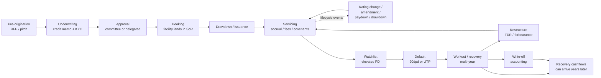
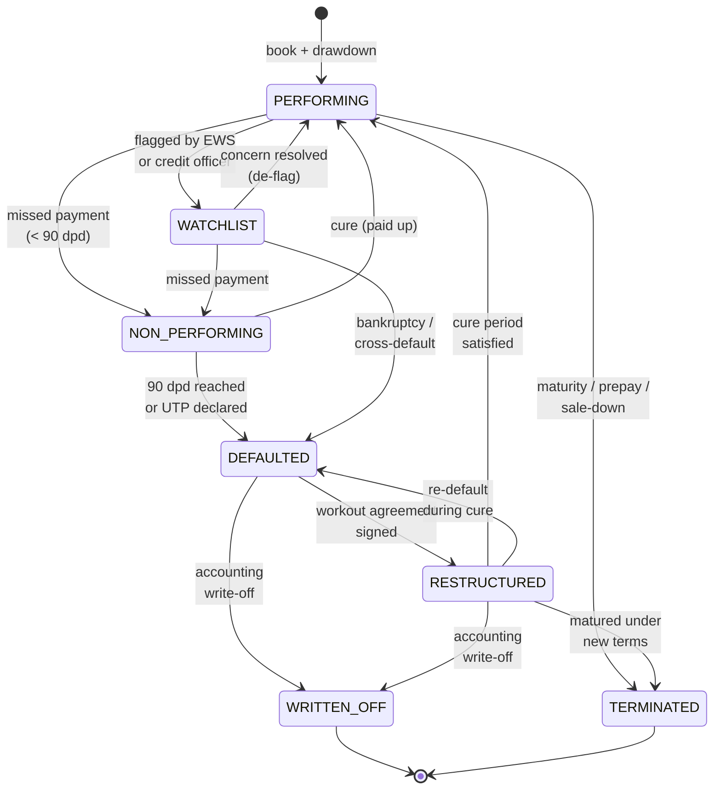
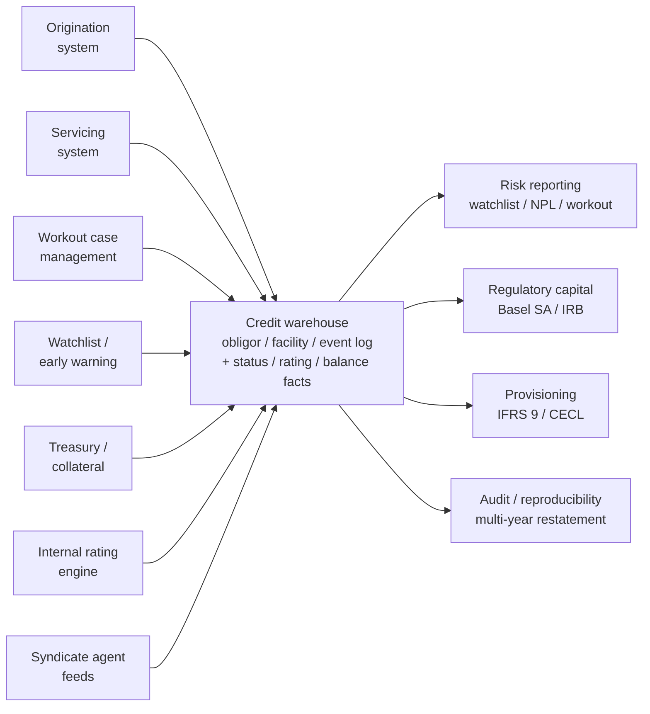

# Credit Module 3 — Loan / Bond / Credit-Derivative Lifecycle

!!! abstract "Module Goal"
    Walk a credit obligation from origination through default and recovery, name every stage and status it can pass through, and understand why credit's multi-year lifecycle puts much heavier weight on bitemporal modelling, event sourcing, and restatement discipline than the market-risk trade lifecycle does. The Market-Risk equivalent is [Module 3 — The Trade Lifecycle (Risk Lens)](../modules/03-trade-lifecycle.md); this module is its credit twin.

---

## 1. Learning objectives

By the end of this module, you should be able to:

- **Identify** the canonical credit lifecycle stages (pre-origination, underwriting, approval, booking, drawdown, servicing, lifecycle events, watchlist, default, workout, restructure, write-off, recovery) and map each one to the source system that owns it.
- **Map** the state-transition machine for a loan, a bond, and a CDS — and explain why the same state diagram applies (with different terminal states) across all three.
- **Apply** the bitemporal `(business_date, as_of_date)` pattern to a multi-year credit lifecycle, and understand why credit's bitemporal stakes are higher than market's: a single restated default classification can bleed back through three years of provisioning.
- **Distinguish** the canonical performing / watchlist / non-performing / defaulted / restructured / written-off / terminated statuses, recognise that they are *not* synonymous with IFRS 9 stages, and write the SQL that reproduces an obligor's status as of an arbitrary historical date.
- **Trace** a default and its multi-year recovery through the warehouse — including the link between recovery cashflows and the original defaulted facility, which is what calibrates LGD.
- **Avoid** the silent restatement traps — overwritten restructures, recovery cashflows orphaned from their parent default, and last-modified-timestamp masquerading as as-of-date.

## 2. Why this matters

A single missed default classification, a stale restructure event, or a recovery cashflow stored without a back-link to its parent facility silently corrupts every downstream credit metric — IFRS 9 / CECL provisioning, regulatory capital under Basel IRB, LGD calibration, watchlist reporting, Pillar 3 disclosure. The defects do not surface in the report. They surface months later when a regulator requests a restatement, or when the model-validation team tries to recalibrate LGD off the workout history and discovers that 18% of recovery cashflows have no parent default to attribute against.

Credit lifecycles span years. A 7-year corporate term loan books in 2024, defaults in 2026, enters a workout that runs through 2028, and produces final recovery cashflows in 2029. Every one of those events is a row that future as-of queries must be able to find and assemble in the right order, with the right knowledge-time predicates. The bitemporal stakes are higher than market's exactly because of this temporal depth: an audit may ask you to reproduce the obligor's position from 30 June 2022, *restated as known on 15 March 2026* — three years of restatement bleed-through, every model recalibration in between, every covenant re-evaluation, every rating downgrade. The market-risk warehouse rarely has to answer questions older than two or three quarters; the credit warehouse routinely has to answer questions five or seven years deep, often during litigation or supervisory review.

The practitioner shift this module asks you to make is from *snapshot* thinking to *event-stream* thinking. A credit obligation is not a row that gets updated; it is a stream of lifecycle events, and the current state of the obligation is *derived* by folding the stream forward to a chosen date. This is the same event-sourcing discipline that the Market Risk track introduces in [Module 3 — Trade Lifecycle](../modules/03-trade-lifecycle.md) and formalises in [Module 13 — Bitemporality](../modules/13-time-bitemporality.md). In credit it is not optional and not a performance optimisation; it is the only way to get the multi-year restatement story right.

!!! info "Honesty disclaimer"
    This module reflects general industry knowledge of the credit lifecycle and the standard data shapes it produces in mid-2026. Specific status taxonomies, default-trigger calibrations (especially the 90-day past-due test and its national variations), restructure-vs-amendment policies, and write-off timing rules vary by jurisdiction, by accounting framework (IFRS 9 vs. US GAAP CECL vs. local GAAP), and by each firm's internal credit policy. Treat the material here as a starting framework — verify against your firm's actual credit policy, your jurisdiction's regulator guidance, and your accounting team's interpretation before applying it operationally. Where the author's confidence drops on a particular topic (typically: jurisdiction-specific forbearance rules, securitisation-specific lifecycles, and the deep details of agent-bank operational practices on syndicated workouts), the module says so explicitly.

## 3. Core concepts

### 3.1 The canonical credit lifecycle stages

A credit obligation does not appear in a fact table fully formed. It moves through a sequence of stages, each owned by a different team and a different system, each producing its own data artefacts. Walked in order:

1. **Pre-origination.** A relationship manager, a syndication desk, or a debt-capital-markets banker sources a deal — a corporate looking to raise term debt, refinance an existing facility, fund an acquisition. The deal is pitched with indicative terms. There is usually **no warehouse footprint** at this stage; the activity lives in CRM systems and pitch books. A few firms do land RFP and indicative-pricing data in a separate analytics store, but the credit warehouse rarely sees it.
     Practical implication: when the credit officer asks "show me the pipeline", the right answer often involves joining the warehouse to a CRM extract rather than serving from credit alone. Document that boundary clearly so the report consumer knows which numbers are sourced from where.

    A second practical wrinkle: pre-origination data is sometimes used by capital-planning teams to *forecast* origination volume and to project capital-consumption over the planning horizon. Where that use exists, the pipeline data lands in a separate forecasting fact rather than in the live credit fact tables. Conflating forecast pipeline with actual originated business is a category error that becomes very expensive at quarter-end when the forecast and the actuals diverge.

2. **Origination & underwriting.** Once the obligor accepts the indicative terms, underwriting begins. A **credit memo** is prepared documenting the obligor's financial profile, the proposed facility structure, the proposed pricing, the proposed covenants, the risk rating, the EAD assumptions, and the LGD estimate. KYC (Know Your Customer) and AML (Anti-Money Laundering) checks complete in parallel. An **internal rating** is assigned by the rating engine or by a credit officer applying the firm's internal scorecard.
    Most firms drive the credit memo through a structured-form workflow tool that produces a versioned document; the warehouse typically captures the *outputs* (the assigned rating, the proposed structure, the limit, the model parameters) rather than the full memo text. The full memo lives in a document store; the warehouse keeps a reference (URL or document ID) so an analyst can drill back to the narrative when needed.

    Two systems-of-record decisions worth pinning down explicitly with the credit team early in any warehouse-build project: (a) which system holds the *current* internal rating — the rating engine, the credit memo, or a derived warehouse table — and (b) which system holds the *current* committed limit — the loan-origination platform, the servicing system, or the limits-management system. Both questions seem trivial; both have answers that vary by firm and that change with reorganisation. Document them in the data dictionary and revisit annually.

3. **Approval.** The credit memo goes to a **credit committee** (for material exposures) or to a delegated authority (for smaller exposures within a relationship manager's or credit officer's limits). The decision — approve, decline, approve-with-conditions — is recorded with timestamp, the names of the approvers, and any conditions attached. This row is the first thing that lands in the credit warehouse for the future facility. A declined deal still leaves a trail.
4. **Booking.** The approved facility lands in the **system of record** — a loan-origination platform for term loans and revolvers, an issuer servicing system for bonds the firm holds, a derivative-booking platform for CDS protection bought or sold. The facility is now identifiable by a `facility_id`, links to an `obligor_id`, has a committed amount, a currency, a maturity, a documented covenant package, and an approved pricing grid. This is the credit equivalent of the market-risk **execution** stage — the moment a row appears in the canonical fact table.
5. **Drawdown / disbursement.** For term loans this is typically a single event near booking — the full principal is wired to the obligor on a defined drawdown date. For **revolvers** it is a recurring pattern over the life of the facility — the obligor draws and repays repeatedly, sometimes daily. Each drawdown is a lifecycle event with its own date, amount, and (for revolvers) the resulting drawn balance. For **bonds** the analogue is **issuance settlement** — the firm wires cash and receives the bond on the issue date.
6. **Servicing.** The day-to-day operational stage that constitutes most of a facility's life. Interest accrues daily; coupons or interest payments fall due on scheduled dates; fees are billed (commitment fees on undrawn revolver, agency fees on syndicated facilities, prepayment fees); covenants are monitored against published financials; the obligor's rating is reaffirmed periodically (typically annually for performing names, more frequently for watchlist names). The data shape is high-volume but low-event-density per facility per day — most days produce only an interest accrual row and a balance row.
7. **Lifecycle events.** Layered on top of routine servicing are the **discrete events** that change the facility's economics or risk profile: rating change, covenant amendment, maturity extension, paydown (scheduled or unscheduled), prepayment, drawdown on a revolver, sale-down to other lenders (in syndicated structures), assignment of the facility to a different legal entity within the obligor's group. Each is a row in the event log with its own date, type, and economic payload.
8. **Watchlist (early warning).** When the credit officer or the early-warning system flags an obligor as showing elevated probability of default — deteriorating financials, sector stress, a missed covenant test that has not yet triggered formal default, an external rating downgrade — the obligor moves to **watchlist**. This is *not* default; the facility is still performing in the contractual sense, payments are still being made, no past-due counter has triggered. Watchlist is an internal classification that drives heightened review frequency, restricts new business with the obligor, and increases provisioning under IFRS 9 (typically a Stage 2 migration). The Watchlist module is its own data artefact — a separate fact or status — and the operational definition of who lands on it varies by firm.
9. **Default.** The formal trigger event. Under the Basel definition (Basel II paragraph 452, carried through subsequent regimes), default fires on either of two triggers: **90 days past due** on any material credit obligation, or **unlikeliness to pay** in full without recourse to actions such as realising collateral. National regulators add their own modifications (the EU's "new definition of default" — NDoD — most prominently). Specific firm-internal triggers include: bankruptcy filing by the obligor, formal acceleration by the bank (calling the loan due), declared covenant breach, cross-default triggered by default on another obligation. The default event lands as a row with a date, a trigger type, and a back-link to the facility (and obligor) it applies to.
10. **Workout / recovery.** Once defaulted, the facility moves from the relationship-management organisation to a **workout team** (sometimes called *special situations*, *credit workout*, or *recovery and restructuring*). The workout team's job is to maximise recovery — through negotiated restructuring, asset sales, collateral realisation, debt-for-equity swaps, or, in the worst case, formal liquidation of the obligor. Workouts typically run **multiple years** (12 to 36 months for a corporate obligor; longer for complex secured situations or for sovereign debt). Throughout the workout the facility carries a defaulted status and accrues no income recognised on a contractual basis (interest may still be accrued for tracking but is not booked to revenue under most accounting frameworks).
11. **Restructure.** A subset of workout outcomes is **restructure** — the original obligation's terms are formally modified to give the obligor a path back to performance. Common modifications: maturity extension, interest-rate reduction, principal forgiveness, conversion to PIK (payment-in-kind) interest, debt-for-equity swap. Under US GAAP this is captured as a **Troubled Debt Restructuring (TDR)** with specific accounting consequences; under IFRS the analogous concept is **forbearance** (with its own EBA classification regime in EU jurisdictions). A successfully restructured facility may *cure* — return to performing status — but the cure period (typically 12 months of compliance with new terms) and the associated accounting treatment are nuanced and jurisdiction-specific.
12. **Write-off.** Accounting recognition that recovery on some portion of the facility is no longer probable. The written-off amount is removed from the bank's gross loans and the corresponding allowance is reduced. Write-off is an **accounting event**, not a legal one — the bank typically retains the legal claim against the obligor and may continue to pursue recovery for years post-write-off. Recovery cashflows received post-write-off are booked as recoveries (a contra-expense) rather than as repayment of the (now zero) carrying value. Write-off timing is governed by accounting policy and varies enormously by firm; some firms write off aggressively at 180 days past due, others wait until workout has demonstrably failed.
13. **Recovery cashflows.** Actual cash received from the obligor or from collateral realisation post-default. These can land in lumps (a property is sold, a debt-for-equity stake is monetised) or in trickles (the obligor makes partial payments under a workout agreement). Critically, **recovery cashflows can land years after default and even years after write-off**. The data engineer's job is to ensure each recovery cashflow points back to the defaulted facility it relates to, because that linkage is what calibrates LGD — the LGD model needs the time series of recovery cashflows attached to the original exposure to compute realised loss severity, and a recovery without a parent is data that has been silently destroyed.

A subtlety worth surfacing on the boundary between stages 5 and 6 (drawdown and servicing): for a revolving credit facility, *every drawdown is a stage-5 event*, not a one-off birth event. A revolver booked in 2023 with a 3-year commitment may see hundreds of drawdown and repayment events over its life, each one landing in the event log with a date, an amount, and a sign (positive for drawdown, negative for repayment). The servicing system is the source of truth for these events; the warehouse needs to fold them to derive the drawn balance on any chosen business date, and that fold is then the input to the EAD calculation (drawn + CCF × undrawn). For a term loan with a single drawdown the fold collapses to one event, which is why term-loan data feels easier; the underlying pattern is the same.

A second subtlety on stage 11 (restructure): not every modification of a facility's terms is a *restructure* in the technical sense. **Routine amendments** — a covenant tweak negotiated for a healthy obligor, a maturity extension at the obligor's request because of a refinancing delay, a documentation change to add a new currency to a multi-currency revolver — are simple lifecycle events that carry the facility forward without triggering TDR or forbearance accounting. The technical restructure is reserved for modifications **made to a borrower in financial difficulty**, where the modification grants a concession that the bank would not otherwise have given. The distinction is consequential: a restructure triggers IFRS 9 Stage 3 and US GAAP TDR accounting; a routine amendment does not. The credit warehouse needs to mark each modification event with its type — `RESTRUCTURE` vs. `AMENDMENT` — and the rule for which is which is policy-driven, not engineer-driven. When in doubt, ask the credit officer to classify the event before loading.

The full picture, in flow form:



The dotted feedback loop on lifecycle events matters: most events do not advance the facility through the macro stages; they modify the facility's economics within the servicing stage and the facility carries on. Only a defined set of trigger events — covenant breach, missed payment past 90 days, bankruptcy filing, formal restructure — advance the facility into watchlist, default, or restructure. The arrow from restructure back to servicing captures the **cure**: a successfully restructured facility may return to performing after the cure period.

### 3.2 Status taxonomy and the state machine

Every credit fact table that carries a per-facility status column should pick one canonical status set and document which transitions are allowed. The set this module recommends — and that most firms in mid-2026 use with minor relabelling:

| Status        | Meaning                                                                                                                            |
| ------------- | ---------------------------------------------------------------------------------------------------------------------------------- |
| PERFORMING    | The facility is contractually current. No past-due counter, no internal watchlist flag. The vast majority of any healthy book.    |
| WATCHLIST     | Performing in the contractual sense but flagged for elevated PD. Often Stage 2 under IFRS 9. Heightened review frequency.         |
| NON_PERFORMING| Past-due but not yet at the 90-day default trigger; or technically defaulted but not yet declared by the bank's policy. Transitional. |
| DEFAULTED     | Default has been formally declared. Workout has begun (or is about to begin). No new business with the obligor.                   |
| RESTRUCTURED  | Terms have been formally modified post-default (TDR / forbearance). May be in the cure period before potentially returning to performing. |
| WRITTEN_OFF   | Accounting write-off has occurred. The facility carries zero or near-zero gross balance; recoveries post-write-off remain possible. |
| TERMINATED    | The facility has fully matured, fully prepaid, been sold to another lender, or otherwise ceased to exist on the firm's books.     |

Two clarifications that catch people out:

- **PERFORMING is the only status where new business can normally be done with the obligor.** Watchlist obligors are typically subject to a new-business freeze; defaulted, restructured, written-off, and terminated facilities are themselves inactive. The new-business policy is a function of obligor status, not facility status, and the warehouse needs to surface the obligor-level rollup so the relationship manager can answer the question "can I do new business with this obligor today" without manually inspecting every facility.
- **NON_PERFORMING vs. DEFAULTED is a fine distinction**, and many firms collapse the two into a single status. Where it matters: the EBA NPL definition is broader than the Basel default definition (NPL captures certain forborne exposures even when not strictly defaulted), and firms that report under both frameworks need both labels. If you are at a US-only firm, the distinction may not matter for your data model and you can model defaulted as the single non-performing label.
- **TERMINATED has multiple flavours that the data engineer should distinguish.** A facility terminating at scheduled maturity is operationally different from one prepaid before maturity, sold to another lender, or closed because the obligor relationship ended. Some firms model these as sub-statuses (TERMINATED_MATURITY, TERMINATED_PREPAY, TERMINATED_SALE, TERMINATED_RELATIONSHIP); others use a single TERMINATED status with a `termination_reason` column. The latter is more flexible and easier to extend; the former is easier to query without joining.
- **WATCHLIST is internal**, not regulatory. There is no regulator-mandated watchlist; each firm defines its own criteria (typically: external rating downgrade below a threshold, internal rating downgrade by N notches, sector concern, concentration concern, or qualitative judgement of the credit officer). The threshold and the governance around it sit in the firm's credit policy. Two firms looking at the same obligor at the same time may legitimately disagree on watchlist status.

The state machine showing the allowed transitions:



The state set above is *minimal but sufficient* — most firms add jurisdiction-specific or accounting-specific sub-statuses on top (EBA forborne-performing, EBA forborne-non-performing, US TDR-classified, internal credit-grade modifiers). The principle is to keep the canonical status set small and orthogonal, and to attach jurisdiction-specific overlays as separate columns rather than as additional status values.

A few transitions are explicitly forbidden and are worth knowing:

- **WRITTEN_OFF → PERFORMING is not allowed.** Once written off, the gross balance is zero and there is nothing to "perform" against. If the obligor's circumstances improve dramatically, the bank may book a *recovery* (contra-expense) but does not reverse the write-off.
- **TERMINATED → anything is not allowed.** Termination is end-of-life. A new facility to the same obligor is a *new* facility with a new `facility_id`, not a resurrection.
- **PERFORMING → DEFAULTED in a single step is rare** but legal — bankruptcy filing or sudden cross-default can skip watchlist entirely. Your state machine should allow the direct transition rather than insist on the intermediate states.
- **NON_PERFORMING → PERFORMING (cure) is common but conditional.** A facility that missed a payment, was cured by the obligor catching up within 90 days, and resumes regular performance is a routine occurrence. The transition should be auto-recorded by the warehouse load process when the days-past-due counter returns to zero, but with a flag indicating that the cure happened (so the watchlist team can review whether the obligor should have been moved to watchlist regardless of the cure).

A note on **probabilistic vs. deterministic transitions.** Several transitions on the diagram are *deterministic* — they fire when an objective threshold is met (90 days past due triggers DEFAULTED; final write-off action triggers WRITTEN_OFF; maturity date plus full repayment triggers TERMINATED). Others are *judgemental* — WATCHLIST classification is a credit officer's call against firm policy; the de-flag back to PERFORMING is similarly judgemental; the cure from RESTRUCTURED back to PERFORMING is deterministic in form (the new terms are met for the cure period) but the cure-period definition itself is policy-driven. The data engineer should know which transitions are deterministic (and therefore can be automated by the warehouse load process from upstream signals) and which are judgemental (and therefore must wait for a human-recorded event from the credit officer or the workout team). Conflating the two — auto-de-flagging a watchlist name because the days-past-due counter went back to zero, when the credit officer still has concerns — is a common warehouse bug that produces silently-wrong watchlist rosters.

A practical implication for fact-table design: every status transition should carry a `transition_source` column identifying whether the transition was system-triggered (from a measurable upstream signal) or human-recorded (from a credit officer or workout team action). Reports can then filter, audit can trace, and the credit officer can review the system-triggered transitions for any that should be overridden. The state machine is the spine that the SQL queries in Section 4 build against; the transition-source discipline is the muscle around the spine.

### 3.3 Lifecycle differences across credit instruments

The macro stages are universal but the cadence and the event mix differ sharply across instrument types. The data engineer needs to recognise the patterns because each instrument's quirks shape the fact-table grain you need to support it.

#### Term loan
The simplest pattern. Single drawdown (or a small number of scheduled drawdowns), then years of scheduled interest and principal payments under a fixed amortisation schedule, then maturity. Lifecycle events are sparse: rating reaffirmation annually, covenant tests quarterly, occasional amendments. Default and workout when they happen are individually significant but uncommon. The fact-table grain is `(facility_id, business_date)` for the daily balance and a much sparser `fact_credit_event` for the discrete events.

#### Revolver (revolving credit facility)
Same macro shape as a term loan but with a **drawdown / repayment cycle** running through the commitment period. The obligor draws down to fund working capital, repays from cashflow, draws again. The drawn balance can move daily; the committed amount is fixed (until the commitment period expires or the obligor permanently reduces). EAD calculation is materially different from a term loan because the **undrawn commitment is itself an exposure** — captured via the credit conversion factor (CCF) discussed in [M01](01-credit-risk-foundations.md) and treated in depth in the upcoming EAD module. Lifecycle events include daily drawdowns and repayments; the event log is denser than for a term loan.

#### Syndicated loan
A loan funded by a syndicate of lenders rather than a single bank. One lender acts as the **agent bank**, administering the facility on behalf of the syndicate — collecting payments, distributing them pro-rata, communicating events to participants. Syndicated loans add several lifecycle complications:

- **Sale-down in the secondary market.** A participant can sell its share of a syndicated loan to another lender. The participant's exposure shrinks; the buyer's exposure grows. Both events must land in both lenders' warehouses.
- **Agent vs. participant data asymmetry.** The agent bank sees every event. A participant sees only what the agent forwards. If your firm is a participant on a particular facility, your event log on that facility is by definition a *projection* of the agent's, not a copy of it. Reconciling agent-side and participant-side records is a standing data-quality task.
- **Voting and consent.** Material amendments to a syndicated loan typically require votes from a defined majority of lenders. The vote itself is a lifecycle event; the resulting amendment, if approved, is another.

#### Bond
Issued in the public or private debt markets and held to maturity (or sold in the secondary market). Coupon schedule is fixed at issuance; coupons pay on scheduled dates; principal returns at maturity. Lifecycle events specific to bonds include:

- **Call.** Issuer-callable bonds may be redeemed by the issuer before scheduled maturity at a defined price.
- **Put.** Investor-puttable bonds may be redeemed by the investor at a defined price.
- **Tender offer.** The issuer offers to buy back outstanding bonds at a defined price and percentage; investors who accept have their bonds retired.
- **Consent solicitation.** Like a syndicated-loan amendment vote, but for bondholders — the issuer asks for changes to the indenture and bondholders vote.

Default mechanics on bonds are similar to loans but the **trustee** plays the role the agent bank plays for syndicated loans — the trustee acts on behalf of bondholders during default and workout.

#### CDS (Credit Default Swap, single-name)
Sharply different from loans and bonds because the firm is taking *protection* on a reference obligor's credit, not lending to it directly. The CDS lifecycle has two distinct legs:

- **Premium leg.** The protection buyer pays a periodic premium (typically quarterly) to the protection seller, calculated as a fixed coupon on the notional. This is a recurring scheduled cashflow throughout the life of the trade.
- **Protection leg.** If a credit event occurs on the reference obligor (failure to pay, bankruptcy, restructuring — defined under the ISDA Credit Derivatives Definitions), the protection seller pays the protection buyer the difference between par and the recovery value of a defaulted reference obligation. This is a single conditional cashflow.

The CDS lifecycle is therefore much closer to the **trade lifecycle** of [MR M03](../modules/03-trade-lifecycle.md) than to the loan lifecycle — a CDS has a trade ID, it gets booked, confirmed, settled, may be amended or unwound, and matures. But its credit-event leg ties it to the reference obligor's lifecycle, so the credit warehouse needs to follow the reference obligor's status (performing / defaulted) in parallel with the trade itself. CDS index trades (CDX, iTraxx) layer further complexity — an index event is triggered by a defined fraction of constituents defaulting, and partial credit events on individual constituents flow through to the index economics.

#### Securitisation tranche
A tranche of an ABS (asset-backed security), MBS (mortgage-backed security), or CLO (collateralised loan obligation) is a claim on cashflows from an underlying pool of obligations. The lifecycle is dominated by the **cashflow waterfall** — the order in which collections from the pool are distributed to the various tranches — rather than by the obligor's behaviour alone. A senior tranche carries on receiving cashflows even when the underlying pool experiences losses, until the losses exceed the protection from junior tranches. The lifecycle events that matter are pool-level: collateral defaults, prepayments, recoveries, and the resulting waterfall distributions to each tranche. The data shape is nested — pool inside the security, tranche inside the pool — and is materially harder than the single-obligor patterns above. Securitisation modelling sits somewhat outside the mainstream of this track and gets only a passing treatment in the upcoming Credit Instruments module.

A note on **agent-bank role flips**, which is a wrinkle on syndicated facilities that catches engineers out. A firm's role on a given syndicated facility — agent vs. participant — can change during the life of the facility. The original agent may resign (typically because of a credit deterioration that puts them in conflict, or because of a strategic exit from a sector); a successor agent is appointed by majority lender vote. If your firm becomes the agent for a facility it previously participated in, your data feed for that facility flips from a projection-of-the-agent's-events to the full event stream — and the warehouse needs to handle the transition without losing history. Mark the role flip as its own event type, carry the role on the facility dimension as SCD2, and ensure that downstream queries do not assume a single role across the facility's history.

A side-by-side summary the data engineer can carry around mentally:

| Instrument         | Lifecycle density | Default / workout pattern                                              | Distinctive lifecycle events                                |
| ------------------ | ----------------- | ----------------------------------------------------------------------- | ----------------------------------------------------------- |
| Term loan          | Low               | Standard workout via collateral realisation and negotiated restructure | Amendment, paydown, prepayment                              |
| Revolver           | Medium            | Standard, but EAD spike via CCF in the run-up to default               | Drawdowns and repayments throughout commitment period       |
| Syndicated loan    | Medium-high       | Workout coordinated by agent on behalf of syndicate                     | Sale-down, vote, amendment, agent-published events          |
| Bond               | Low-medium        | Trustee-coordinated workout; restructure via consent solicitation       | Call, put, tender, consent solicitation                     |
| CDS (single-name)  | Medium            | Reference-obligor default triggers protection payout                    | Credit event determination, ISDA auction, settlement        |
| Securitisation     | High (pool level) | Pool-level losses flow through waterfall; tranche-by-tranche impact     | Collateral default, prepayment, waterfall distribution      |

### 3.4 Why credit lifecycles span years and what that does to your bitemporal model

A market-risk trade lifecycle, as treated in [MR M03](../modules/03-trade-lifecycle.md), typically completes within months. Even a long-dated swap is mostly a stream of small fixings and coupons; the dramatic state transitions (booking, amendment, novation, termination) usually happen on the order of weeks to a few years apart per trade. The credit lifecycle, by contrast, is years long even for healthy facilities and decades long for stressed ones once recovery cashflows are counted. Four consequences for the bitemporal model:

#### Restatement frequency at the obligor level
A credit obligor's profile is **restated routinely** through the life of the relationship. Internal ratings are reaffirmed at least annually for performing names, more frequently for watchlist names, and immediately on material news (earnings release, M&A announcement, sector event, sovereign action). Each reaffirmation may keep the rating unchanged or move it; either way, the reaffirmation itself is a row in the rating history with its own effective date. A 7-year facility will have at least 7 rating-reaffirmation events on its obligor, and several of those will move the rating, which means the PD attached to the facility on any given business date depends on which rating was effective at that date. The bitemporal pattern therefore needs to capture not only the facility's own state but the obligor's state alongside, joined on temporal predicates.

#### Recovery cashflows arrive years after default
A defaulted facility may be otherwise dormant — no balance accruing, no new events on the facility itself — yet recovery cashflows continue to land for years post-default. The recovery fact must point back to the defaulted facility through a **back-link** that survives even after the facility has been written off. The data engineer cannot use the facility's *current* status as a join condition (the facility is WRITTEN_OFF; the recovery is being received in 2029); the join must be to the facility's identity as a stable key, with the recovery carrying its own event date. The LGD calibration depends on this: realised LGD = (EAD − Σ recoveries) / EAD, and Σ recoveries is the sum across all post-default cashflows however many years they take to land. Lose the back-link and you lose the LGD calibration data point.

#### IFRS 9 stage migration is itself a bitemporal event
A facility that migrates from Stage 1 (12-month ECL) to Stage 2 (lifetime ECL) on a given business date carries that migration as a **rated event** in the warehouse — the migration date, the migration trigger, the resulting stage. If a subsequent quarter's data review concludes the migration should have happened earlier (or shouldn't have happened at all), the **restatement** is a new row at a new as-of-date with the corrected effective date. You store *when the migration was first booked*, *when it was corrected*, and *what the corrected effective date is*. Three separate temporal dimensions on a single semantic event. This is heavier than the typical market-risk bitemporal pattern, where the underlying fact (a P&L number, a sensitivity) is itself a continuous quantity rather than a discrete state-transition event.

#### Workout cases re-classify history
A more uncomfortable case. A facility booked in 2022, defaulted in 2024, and partially recovered through 2025 might in 2026 be re-classified as a "near miss" — the bank, on reflection, decides the original default trigger was technically met but the obligor never genuinely missed an economic payment, and the regulator is happy with reclassifying the event as a non-default with full recovery. The historical rows for that facility, including the LGD outturn that fed model calibration, are now wrong as originally recorded. The right pattern is **bitemporal restatement** — the original rows stay in place with their original `as_of_date`; a new set of rows lands with a new `as_of_date` and the corrected facts; the LGD model knows to read the most-recent `as_of_date` for any historical business date.

The wrong pattern — and the one the next section's pitfalls catalogue calls out specifically — is to **overwrite** the original rows with the corrected facts. That destroys the audit trail (you cannot reproduce what was reported in 2024 and 2025 from production data) and silently changes the LGD model's training data without leaving any indication that anything has moved. Overwrites in a credit warehouse are forbidden; restatements are allowed and expected; the discipline is to use the bitemporal columns to distinguish them.

A worked example to make the bleed-through concrete. Suppose Obligor X has a facility that was rated BB on 30 June 2022, and on that basis was assigned a 1-year PD of 1.50% and a 12-month EL of $90,000. The Q2 2022 IFRS 9 provision was set accordingly. Two years later, in Q3 2024, the model-validation team concludes that the BB rating was wrong on the data available at the time — the obligor should have been rated B (the rating engine had a known bug that had been masking a sector overlay). The corrected rating gives a 1-year PD of 4.00% and a 12-month EL of $240,000. The right thing to do is restate Q2 2022 with the corrected rating effective on the original effective date. The new row carries `business_date = 2022-06-30`, `as_of_date = 2024-09-30` (the date of restatement), and the corrected EL of $240,000. The original row at `business_date = 2022-06-30, as_of_date = 2022-07-15` is preserved untouched. Now consider the implications. Every quarter from Q2 2022 through Q2 2024 was provisioned on the wrong rating; each of those quarters needs a restatement row. A Q2 2024 audit run that sums historical EL using `as_of_date = 2024-09-30` returns the corrected numbers; a re-run of the original Q2 2022 disclosure using `as_of_date = 2022-07-15` returns the originally-published number. Both are reproducible. Both can be defended to a supervisor. That is what bitemporal restatement gives you and what overwrite would destroy.

This pattern recurs throughout the credit warehouse: rating restatements, default-classification restatements, recovery-attribution restatements, IFRS 9 stage-migration restatements. The cost of the bitemporal discipline is storage and query complexity; the benefit is reproducibility under restatement, which credit data professionals will need at some point in the lifecycle of every meaningful exposure.

### 3.5 Compared and contrasted with the market-risk trade lifecycle

The credit lifecycle and the market-risk trade lifecycle share a structural skeleton — both walk an entity from origination through events to termination — but the cadence, the event mix, and the bitemporal weight differ enough that the data shapes diverge. A side-by-side comparison:

| Dimension | Market-risk trade lifecycle ([MR M03](../modules/03-trade-lifecycle.md))                              | Credit lifecycle (this module)                                                                                                  |
| ---------------- | ----------------------------------------------------------------- | ----------------------------------------------------------------------------------------------- |
| Typical horizon  | Days to a few years; settles T+2 for cash, multi-year for swaps | Years to decades; recovery cashflows can land 5+ years post-default                              |
| Status changes   | Rare — most trades go BOOK → SETTLE without intermediate events  | Frequent — rating reaffirmations annually, watchlist transitions, default, restructure         |
| Event density    | Medium for derivatives (fixings, coupons, exercises); low for cash | Low for performing facilities (interest accrual, occasional events); high for distressed       |
| Bitemporal pattern | `(business_date, as_of_ts)` at high frequency (intraday, EOD)  | `(business_date, as_of_date)` at lower frequency (typically daily for balances, monthly/quarterly for model output), plus event sourcing for lifecycle events |
| Restatement scope | Usually a single business date being restated for a corrected trade economic | Often months to years of business dates being restated for a corrected default classification or rating |
| Source-system count | 3 typical (FO, MO, BO) for the same trade                    | 4–6 typical (origination, servicing, workout, collateral, treasury, syndicate-agent feed)      |
| Reconciliation focus | Trade-vs-settlement (existence and value tear)                | Multi-system reconciliation onto a single obligor / facility identity                           |

The structural overlap is real: both lifecycles use event-sourcing patterns, both require careful identifier mapping across systems, both fail in the same ways when the bitemporal columns are mishandled. But the credit warehouse's lifecycle data spends much more time being **read** than the market-risk warehouse's does — historical questions are routine in credit, where in market risk only the most recent few quarters tend to matter operationally. Plan partitioning, indexing, and cold-storage strategy accordingly. The Performance & Materialisation module ([MR M17](../modules/17-performance-materialization.md)) is the canonical reference for the underlying patterns; the credit-specific overlay is that the **read path on historical partitions matters more** than in market risk, so cold-storage strategies that defer access (deep S3 tiering, for example) need to be more conservative on the credit side.

For the bitemporal pattern itself, [MR M13 — Bitemporality](../modules/13-time-bitemporality.md) is the canonical reference. This module assumes the reader has either read it or will read it; the credit-specific overlay is the multi-year restatement scope and the event-sourcing density on default and recovery.

A specific example of where the cadence difference bites the data engineer: in market risk, a missed end-of-day batch is bad but recoverable — the next morning's batch picks up the missing day's positions, the VaR is recomputed, and everyone moves on. In credit, a missed quarterly model run is bad and *not easily recoverable*, because the IFRS 9 provision booked at quarter-end is an accounting fact that has already flowed into the firm's published financials. A restatement is possible but expensive (it requires a financial-controllership process, possibly an audit-committee discussion, and possibly a re-issuance of the provision disclosure). The data engineer's defensive posture in credit is therefore tighter on quarter-end than in market risk: every quarter-end load must be **provably complete and provably reconciled** before the provisioning batch is allowed to run, and the gating check has to be an explicit step in the pipeline, not an implicit "the batch will fail loudly if something is wrong" assumption. The Architecture Patterns module ([MR M18](../modules/18-architecture-patterns.md)) discusses gating-by-watermark patterns; in credit they are not optional.

### 3.6 Source systems where credit lifecycle data lives

A credit warehouse pulls from a fan of upstream sources, more than the market-risk equivalent typically does. Each source owns one slice of the lifecycle and feeds the warehouse on its own cadence:

- **Loan-origination systems.** The system of record for the credit memo, the approved limit, the initial facility terms, the assigned internal rating, and the initial PD / LGD assignment. Examples in the marketplace include Finastra's loan-origination platforms, nCino, Misys (now Finastra), and various internal builds. Cadence: event-driven on origination, then largely quiescent.
- **Servicing systems.** The system of record for the daily balance, the drawdown / repayment ledger, the days-past-due counter, the scheduled cashflow calendar, and the running fee accrual. At smaller firms the servicing system is the same physical platform as the origination system; at larger firms they are separate, often by historical accident (an acquired bank's servicing platform, a legacy mainframe ledger). Cadence: daily.
- **Default and recovery tracking (workout case management).** A separate system — sometimes a specialised workout platform, sometimes a glorified case-management tool, sometimes a spreadsheet shared on a network drive (the author has seen all three) — that tracks the obligor through the workout. Holds the case manager's notes, the workout strategy, the projected recovery, and the recorded recovery cashflows. Cadence: event-driven, with periodic case reviews.
- **Watchlist / early-warning systems.** Sometimes integrated with the servicing system, sometimes separate. Holds the rules that flag obligors as elevated PD, the resulting watchlist roster, and the credit officer's notes on each watchlist name. Cadence: event-driven on flag/de-flag, with periodic review.
- **Treasury / collateral systems.** The system of record for collateral movements that follow defaults — when collateral is realised post-default, the treasury system records the proceeds, which then become recovery cashflows on the originating facility. Cadence: event-driven, daily revaluation for marked collateral.
- **Internal credit-rating engines.** The system of record for the obligor's internal rating and the rating history. Often a separate platform that consumes inputs from the origination system, the servicing system, and external rating-agency feeds. Cadence: event-driven on rating change, with at least annual reaffirmation cycles.
- **External rating-agency feeds.** Moody's, S&P, Fitch publish rating actions on rated obligors; the warehouse subscribes to these feeds either directly or through a market-data vendor (Bloomberg, Refinitiv) that consolidates them. External rating actions sometimes trigger internal rating reviews (a sharp downgrade by S&P prompts the internal rating team to reconsider), and the timing relationship between external and internal actions is itself audit-relevant. Cadence: event-driven, with the timing of external actions outside the firm's control.
- **Document repositories.** The credit memo, the loan agreement, the security documentation, the workout-strategy memo, and the formal restructure agreement all live in a document store rather than the warehouse proper. The warehouse holds references (document IDs and URLs); when a downstream consumer needs the underlying narrative, they drill back through the reference. The document store's metadata (author, last-modified, version) often *does* land in the warehouse as part of the lineage record.
- **Syndicate-agent feeds.** For syndicated loans where your firm is a participant, the agent bank publishes balance and event data via standardised feeds (LSTA in the US, LMA in Europe). Cadence: event-driven, with periodic reconciliation cycles. The data quality of these feeds varies enormously by agent — major banks running professional agent operations send clean feeds with minimal lag; smaller agents send batched data with occasional reconciliation breaks. The participant warehouse needs per-agent quality monitoring and the patience to chase down breaks via the agent's operations contact.
- **Accounting / general-ledger systems.** The system of record for the booked balance-sheet position and the booked allowance. The warehouse reconciles to the GL at quarter-end (and often monthly) to ensure that the credit reporting and the financial reporting tie out. Discrepancies between the credit warehouse's view of NPL gross balance and the GL's view of NPL gross balance are some of the most expensive bugs to chase down, because both teams (credit risk and finance) believe their number is correct and the reconciliation forces the question of which underlying source is wrong.

The warehouse's job is to **conform** these feeds onto a stable obligor / facility / event grain, store the bitemporal history, and serve the canonical fact tables that PD, LGD, EAD, and IFRS 9 stage allocation all depend on. The truth is distributed across the source systems; the data engineer's discipline is to assemble it without losing the temporal correctness.

An additional source worth flagging: many firms run a **covenant-monitoring system** as either a module of the servicing platform or a separate tool. It ingests obligor financial statements (often quarterly, sometimes monthly for distressed names), evaluates the negotiated covenants against the reported figures, and produces compliance / breach events that flow into the lifecycle event log. Covenant-monitoring data quality is bounded by the obligor's reporting discipline — if the obligor delivers financials late, the covenant test is late, and the warehouse must distinguish "covenant in compliance" from "covenant test pending" rather than defaulting to the optimistic answer.

A flow diagram of where the data lives and how it lands in the warehouse:



The single most important property of this fan-in architecture is that **no single source system has the full lifecycle picture for any facility**. The origination system has the birth; the servicing system has the body; the workout system has the death and the afterlife; the rating engine has the obligor's continuous reassessment; the syndicate agent fills in the gaps for participated facilities. The warehouse is the only place where the full picture can be assembled — which is why the warehouse is the only defensible source for anything more than single-system reporting.

A practical implication for the engineering team: each upstream feed needs its own freshness SLA, its own data-quality checks at landing, and its own contract with the source-system owner. The origination feed may run on a per-deal basis (event-driven, low frequency); the servicing feed runs daily; the workout feed runs weekly or on case-update events; the rating engine runs daily but most days nothing changes. A monitoring view that surfaces *each feed's last successful load timestamp and the count of rows landed since the previous load* is one of the most under-appreciated artefacts of a healthy credit warehouse. When a downstream report breaks, the first question is always "which upstream feed was late or short", and the monitoring view answers it before anyone has to chase down the source-system owner.

### 3.7 The credit event log pattern

The market-risk trade lifecycle module ([MR M03](../modules/03-trade-lifecycle.md), section 3.3) introduces the event-log pattern for trades: store one immutable row per lifecycle event, derive the current state by folding events forward to a chosen as-of point. The pattern transfers wholesale to credit, with one elaboration: the event types are richer (see Section 3.1's stages), the events span years, and the back-links — particularly recovery-to-default and restructure-to-original-facility — must survive across the multi-year horizon.

The recommended fact-table grain for the event log is `(facility_id, event_type, event_date, as_of_date)` with a `payload_json` column carrying the event-specific economics. Some firms add `event_seq` for tie-breaking on same-day events; some use `event_ts` (timestamp) instead of `event_date` for higher precision on intra-day events such as default declaration. Either is defensible; pick one and document it.

The event log is the canonical source for:

- **As-of-date status reconstruction.** "What was the facility's status on 30 June 2024?" is a fold of the event log up to and including 30 June 2024, returning the latest status-changing event.
- **Recovery aggregation.** Sum of all `RECOVERY_CASHFLOW` events for a given `facility_id` from the default date forward gives you the total recovery, which the LGD calculation needs.
- **Audit trail.** Every row is dated; nothing is overwritten; corrections land as new rows with new `as_of_date` values. Auditor walks the table, not the application logs.
- **Lineage to source.** Each row carries a `source_system` column identifying which upstream system contributed it. When two systems contribute conflicting events (servicing system says missed payment; origination system says payment scheduled but deferred under amendment), the conflict surfaces at warehouse load time rather than weeks later in a downstream report.

The dimensional reflection of these events — the SCD2 status histories, the rating dimensions, the obligor and facility identities they hang off — is treated in the upcoming Core Credit Dimensions module. For now, internalise that the event log is the **source of truth** and that everything else (current state, status snapshots, stage-migration history, watchlist roster) is **derived**. The discipline parallels the trade-event-log discipline of [MR M07 — Fact Tables](../modules/07-fact-tables.md), where event-grain and current-state-grain are both materialised but only one is canonical.

An important practical observation about **derived state tables**: most credit warehouses materialise both the event log and a current-state snapshot fact table (e.g. `fact_facility_status` from Example 2) for query convenience. The snapshot is much faster to query for "current state" questions than re-folding the event log every time. The discipline that keeps the two consistent is to make the snapshot a *materialised view of the fold*, refreshed as part of each batch load, rather than a separately-maintained table that the application writes to directly. The moment the snapshot is updated by anything other than re-folding the event log, the two diverge silently and the warehouse loses its single source of truth. Treat the event log as primary and the snapshot as a derived performance optimisation; never let the snapshot become canonical.

A note on **late-arriving events**, which are more common in credit than in market risk and which the event-log pattern handles particularly well. A workout team may book a recovery cashflow on 2026-08-15 with an effective date of 2026-08-10 (the cash actually arrived five days earlier; the workout system processed it later). The recovery's `event_date` is 2026-08-10; its `as_of_date` is 2026-08-15. A query that asks "what was the cumulative recovery as of 2026-08-12" using the event_date filter alone would include this recovery (it is dated 2026-08-10); a bitemporally-correct query that also requires `as_of_date <= 2026-08-12` would exclude it (the warehouse did not yet know about it on 2026-08-12). Both answers are correct in their respective contexts: the first answers "what is the *now-known* recovery profile as of that historical date"; the second answers "what would we have reported on that date". Audit and supervisory review almost always want the second; risk reporting often wants the first. The `as_of_date` column makes both queryable from the same physical table — which is why the event log is bitemporal by construction, not just by convention.

### 3.8 The lifecycle as the spine of every other credit module

Before moving to the worked examples, a brief orientation on how this module connects to the rest of the Credit Risk track.

Almost every downstream module's data depends on lifecycle events being correctly captured and bitemporally addressable:

- The **PD module** needs the rating history (rating-change events on the obligor) to calibrate transition matrices and to attach the right PD to each facility on each business date. Rating events are lifecycle events on the obligor; the lifecycle's event-sourcing pattern is what makes the rating history queryable.
- The **LGD module** depends critically on the recovery-to-default linkage discussed throughout this module. Without the linkage, there is no realised LGD time series; without the time series, there is no LGD calibration; without the calibration, the LGD model is being trained on overlays and assumptions rather than on outturn data.
- The **EAD module** depends on the drawdown / repayment event stream for revolvers (to compute drawn balance on any business date) and on the original committed-amount and CCF assignment captured at booking.
- The **Expected Loss module** consumes PD, LGD, and EAD jointly and inherits any lifecycle-data weakness in any of the three.
- The **IFRS 9 / CECL module** depends on the stage-migration events being captured with their effective dates, on the watchlist roster being current, and on the default-and-restructure events being correctly classified.
- The **Concentration & Limits module** depends on the facility-level current state (committed and drawn amounts by obligor, by sector, by country) being reproducible at any historical date.
- The **Stress Testing module** depends on the entire lifecycle history to project forward — without a clean baseline lifecycle, the macro overlay applied in stress-testing has nothing solid to overlay on.

The lifecycle module is therefore a **load-bearing foundation module**, not a peripheral introduction. The more rigorous you are with the event-sourcing and bitemporal discipline established here, the easier every downstream module becomes; the cheaper you go on this module's foundations, the more the downstream modules will fight you.

## 4. Worked examples

### Example 1 — SQL: bitemporal lifecycle event log + as-of state query

The first example builds the event log fact table, populates it with a representative multi-year facility lifecycle, and then writes the query that returns the as-of state of that facility on a chosen date. Dialect: Snowflake / standard SQL.

```sql
-- Snowflake / standard SQL dialect
-- The credit lifecycle event log. One row per discrete event; immutable.
-- Folding the rows up to a chosen as_of_date reproduces facility state.
CREATE TABLE fact_credit_event_log (
    facility_id     VARCHAR(32)     NOT NULL,
    event_type      VARCHAR(32)     NOT NULL,    -- BOOKING / DRAWDOWN / RATING_CHANGE / COVENANT_BREACH /
                                                 -- WATCHLIST / DEFAULT / RESTRUCTURE / RECOVERY_CASHFLOW /
                                                 -- WRITE_OFF / TERMINATION
    event_date      DATE            NOT NULL,    -- when the event applied in the world
    as_of_date      DATE            NOT NULL,    -- when the warehouse first knew this row
    event_seq       INTEGER         NOT NULL,    -- tie-break on same-day events
    payload_json    VARCHAR(4000)   NOT NULL,    -- post-event economics (status, rating, amounts, ...)
    source_system   VARCHAR(32)     NOT NULL,    -- ORIGINATION / SERVICING / WORKOUT / RATING / TREASURY
    PRIMARY KEY (facility_id, event_date, event_seq, as_of_date)
);
```

A 12-row sample for a single facility `FAC-7700`, walking through booking → drawdown → two years of normal operation (rating reaffirmations only) → covenant breach → watchlist → default → 18 months of workout (with intermittent recoveries) → final write-off:

```sql
INSERT INTO fact_credit_event_log VALUES
('FAC-7700', 'BOOKING',           '2023-03-15', '2023-03-16', 1, '{"committed":10000000,"ccy":"USD","rating":"BB+","status":"PERFORMING"}',                       'ORIGINATION'),
('FAC-7700', 'DRAWDOWN',          '2023-03-20', '2023-03-21', 1, '{"drawn_delta":10000000,"drawn_balance":10000000}',                                            'SERVICING'),
('FAC-7700', 'RATING_CHANGE',     '2024-03-01', '2024-03-02', 1, '{"rating_old":"BB+","rating_new":"BB","trigger":"annual_reaffirmation"}',                       'RATING'),
('FAC-7700', 'RATING_CHANGE',     '2025-03-01', '2025-03-02', 1, '{"rating_old":"BB","rating_new":"BB-","trigger":"annual_reaffirmation"}',                       'RATING'),
('FAC-7700', 'COVENANT_BREACH',   '2025-09-30', '2025-10-15', 1, '{"covenant":"net_leverage","threshold":3.5,"observed":4.2,"action":"waiver_requested"}',        'SERVICING'),
('FAC-7700', 'WATCHLIST',         '2025-10-20', '2025-10-21', 1, '{"status":"WATCHLIST","trigger":"covenant_breach","ifrs9_stage":2}',                            'SERVICING'),
('FAC-7700', 'RATING_CHANGE',     '2025-10-20', '2025-10-21', 2, '{"rating_old":"BB-","rating_new":"B","trigger":"intra_year_review"}',                           'RATING'),
('FAC-7700', 'DEFAULT',           '2026-02-14', '2026-02-15', 1, '{"status":"DEFAULTED","trigger":"90_dpd","ifrs9_stage":3,"days_past_due":92}',                  'SERVICING'),
('FAC-7700', 'RECOVERY_CASHFLOW', '2026-08-10', '2026-08-11', 1, '{"amount":1500000,"ccy":"USD","source":"collateral_realisation"}',                              'TREASURY'),
('FAC-7700', 'RECOVERY_CASHFLOW', '2027-04-22', '2027-04-23', 1, '{"amount":2000000,"ccy":"USD","source":"workout_settlement"}',                                  'WORKOUT'),
('FAC-7700', 'RECOVERY_CASHFLOW', '2027-09-05', '2027-09-06', 1, '{"amount":500000,"ccy":"USD","source":"trailing_payment"}',                                     'WORKOUT'),
('FAC-7700', 'WRITE_OFF',         '2027-09-30', '2027-10-15', 1, '{"status":"WRITTEN_OFF","amount_written_off":6000000,"trigger":"workout_concluded"}',           'WORKOUT');
```

Walk the rows mentally. The facility books in March 2023 at $10M committed, fully drawn within a week, with an initial rating of BB+. Two annual rating reaffirmations downgrade it modestly through 2024 and into early 2025. In September 2025 a leverage covenant is breached; a waiver is requested but the breach itself triggers watchlist classification, and the rating is reviewed intra-year and downgraded to B. By February 2026 the facility is 92 days past due; default fires. Workout begins. Three recovery cashflows come in over 18 months — collateral realisation, a workout settlement, and a trailing payment — totalling $4M. In September 2027 the workout team concludes that no further recovery is realistic and the remaining $6M is written off.

The query that returns the **as-of state** of the facility on a chosen date — say, 30 September 2026, by which point the facility is defaulted and the first recovery cashflow has landed but the workout settlement and write-off have not:

```sql
-- Snowflake / standard SQL dialect
-- Reconstructs the as-of state of a facility on a chosen business date.
-- Returns the latest status-changing event, the cumulative recovery,
-- and the latest known rating.

WITH events_in_scope AS (
    SELECT *
    FROM fact_credit_event_log
    WHERE facility_id = 'FAC-7700'
      AND event_date <= DATE '2026-09-30'
),
latest_status AS (
    -- Last event of any status-changing type wins for the status field.
    SELECT
        facility_id,
        event_type     AS last_status_event,
        event_date     AS last_status_event_date,
        payload_json
    FROM events_in_scope
    WHERE event_type IN ('BOOKING', 'WATCHLIST', 'DEFAULT', 'RESTRUCTURE', 'WRITE_OFF', 'TERMINATION')
    QUALIFY ROW_NUMBER() OVER (
        PARTITION BY facility_id
        ORDER BY event_date DESC, event_seq DESC
    ) = 1
),
latest_rating AS (
    SELECT
        facility_id,
        payload_json:rating_new::STRING AS current_rating,
        event_date                       AS rating_effective_date
    FROM events_in_scope
    WHERE event_type = 'RATING_CHANGE'
    QUALIFY ROW_NUMBER() OVER (
        PARTITION BY facility_id
        ORDER BY event_date DESC, event_seq DESC
    ) = 1
),
cumulative_recovery AS (
    SELECT
        facility_id,
        SUM(payload_json:amount::NUMBER) AS total_recovery_usd
    FROM events_in_scope
    WHERE event_type = 'RECOVERY_CASHFLOW'
    GROUP BY facility_id
),
default_event AS (
    SELECT
        facility_id,
        event_date AS default_date,
        payload_json:days_past_due::NUMBER AS dpd_at_default
    FROM events_in_scope
    WHERE event_type = 'DEFAULT'
    QUALIFY ROW_NUMBER() OVER (
        PARTITION BY facility_id
        ORDER BY event_date DESC, event_seq DESC
    ) = 1
)
SELECT
    s.facility_id,
    s.last_status_event,
    s.last_status_event_date,
    r.current_rating,
    r.rating_effective_date,
    d.default_date,
    d.dpd_at_default,
    COALESCE(c.total_recovery_usd, 0)               AS total_recovery_usd
FROM latest_status s
LEFT JOIN latest_rating       r USING (facility_id)
LEFT JOIN cumulative_recovery c USING (facility_id)
LEFT JOIN default_event       d USING (facility_id);
```

Expected output for `event_date <= 2026-09-30`:

| facility_id | last_status_event | last_status_event_date | current_rating | rating_effective_date | default_date | dpd_at_default | total_recovery_usd |
| ----------- | ----------------- | ---------------------- | -------------- | --------------------- | ------------ | -------------- | ------------------ |
| FAC-7700    | DEFAULT           | 2026-02-14             | B              | 2025-10-20            | 2026-02-14   | 92             | 1,500,000.00       |

The query folds the event log up to the as-of date, picks the latest status-changing event (DEFAULT, on 14 February 2026), picks the latest rating (B, effective 20 October 2025), sums the recoveries received by 30 September 2026 ($1.5M from the August collateral realisation), and assembles the picture into a single row. Run the same query with `event_date <= '2027-12-31'` and the result changes: status becomes WRITTEN_OFF on 30 September 2027, total recovery becomes $4M, and the LGD-to-date is $(10M − 4M) / 10M = 60%.

The pattern is the same shape as the as-of trade-state query in [MR M03's Example 1](../modules/03-trade-lifecycle.md) but with credit-specific event types and a richer aggregation (cumulative recovery, latest rating). The bitemporal `as_of_date` column is not used in the query above — it would be on a corrected-as-of-some-knowledge-date variant, where the predicate `as_of_date <= :knowledge_ts` is added to each CTE to reproduce what the warehouse believed at a chosen point in the past. That bitemporal extension is the credit twin of the `valid_to = sentinel` pattern in MR M03's example.

Two performance notes that matter when the event log grows to tens of millions of rows across thousands of facilities and many years of history:

- **Partition the event log by `event_date`**, not by `as_of_date`. The vast majority of queries filter on `event_date` (give me the events up to a chosen as-of point); partitioning on `event_date` lets the query engine prune the partitions that are guaranteed to be excluded. As-of-date queries that need historical knowledge-time still scan the relevant partitions; the partition pruning benefits the most common query path.
- **Index on `(facility_id, event_date)` and `(facility_id, event_type, event_date)`**. Both index shapes accelerate the per-facility folds the query above performs. On Snowflake, clustering keys serve the same purpose; on Postgres, btree indexes; on BigQuery, partition + clustering. The principle is the same across engines: facility-keyed access patterns benefit from facility-keyed physical layout.

For a multi-year credit warehouse, the event log is often the largest single fact table by row count (every drawdown, every coupon, every rating reaffirmation, every covenant test result lands as a row). Treat its physical design with the same care you would give a market-risk position fact — the cardinality is similar, the access patterns are different, and the cost of a poorly-designed event log shows up as long-running queries when an auditor asks for a multi-year reproduction.

### Example 2 — SQL: detect facilities in watchlist with no rating refresh in the last 90 days

A common operational data-quality query for a credit data engineer: every facility currently on watchlist whose obligor's rating has not been reaffirmed in 90 or more days is a potential **rating-staleness break**. The credit officer's responsibility is to keep watchlist names under heightened review, including a more-frequent-than-annual rating cadence. If the warehouse can show the credit officer the list of stale ones, they can prioritise their review queue. If the warehouse silently lets the rating drift, the PD attached to those facilities is too rosy and the EL the bank is reporting is too low.

Two source tables. First, a rating dimension as SCD2:

```sql
-- Snowflake / standard SQL dialect
-- Obligor rating history as SCD2: one row per (obligor, rating, effective period).
CREATE TABLE dim_obligor_rating_history (
    obligor_id           VARCHAR(32)   NOT NULL,
    rating               VARCHAR(8)    NOT NULL,    -- internal master-scale rating
    effective_from_date  DATE          NOT NULL,
    effective_to_date    DATE          NOT NULL,    -- 9999-12-31 sentinel for current
    rating_action_type   VARCHAR(32)   NOT NULL,    -- INITIAL / ANNUAL_REAFFIRMATION / INTRA_YEAR_REVIEW / DOWNGRADE / UPGRADE
    PRIMARY KEY (obligor_id, effective_from_date)
);
```

Second, a facility-status fact at daily grain:

```sql
-- Snowflake / standard SQL dialect
-- Daily facility status, sourced from servicing system.
CREATE TABLE fact_facility_status (
    facility_id      VARCHAR(32)   NOT NULL,
    obligor_id       VARCHAR(32)   NOT NULL,
    business_date    DATE          NOT NULL,
    status           VARCHAR(32)   NOT NULL,        -- PERFORMING / WATCHLIST / NON_PERFORMING / DEFAULTED /
                                                    -- RESTRUCTURED / WRITTEN_OFF / TERMINATED
    days_past_due    INTEGER       NOT NULL,
    drawn_balance    NUMBER(18,2)  NOT NULL,
    ccy              CHAR(3)       NOT NULL,
    PRIMARY KEY (facility_id, business_date)
);
```

The query — facilities currently (as of a chosen reporting date) on watchlist whose obligor's *latest* rating action is more than 90 days old:

```sql
-- Snowflake / standard SQL dialect
-- Watchlist facilities with stale rating: latest rating action > 90 days ago.

WITH current_status AS (
    -- Pin the report to a chosen reporting_date.
    SELECT
        facility_id,
        obligor_id,
        business_date,
        status,
        days_past_due,
        drawn_balance,
        ccy
    FROM fact_facility_status
    WHERE business_date = DATE '2026-05-15'
      AND status        = 'WATCHLIST'
),
latest_rating_action AS (
    SELECT
        obligor_id,
        rating                         AS current_rating,
        effective_from_date            AS last_rating_date,
        rating_action_type             AS last_rating_action,
        DATEDIFF(day, effective_from_date, DATE '2026-05-15') AS days_since_rating
    FROM dim_obligor_rating_history
    WHERE effective_to_date = DATE '9999-12-31'   -- the currently-effective row per obligor
)
SELECT
    cs.facility_id,
    cs.obligor_id,
    cs.business_date          AS report_date,
    cs.drawn_balance,
    cs.ccy,
    lra.current_rating,
    lra.last_rating_date,
    lra.last_rating_action,
    lra.days_since_rating
FROM current_status cs
LEFT JOIN latest_rating_action lra USING (obligor_id)
WHERE lra.days_since_rating IS NULL
   OR lra.days_since_rating > 90
ORDER BY lra.days_since_rating DESC NULLS FIRST, cs.drawn_balance DESC;
```

The `LEFT JOIN` with `days_since_rating IS NULL` in the predicate matters: a watchlist facility whose obligor has *no* rating row at all is an even worse data-quality break than one with a stale rating, and surfacing both in the same report is the right operational behaviour. Sorting `NULLS FIRST` puts the no-rating cases at the top of the credit officer's review queue.

A typical result for a mid-sized credit book might look like:

| facility_id | obligor_id | report_date | drawn_balance  | ccy | current_rating | last_rating_date | last_rating_action     | days_since_rating |
| ----------- | ---------- | ----------- | -------------- | --- | -------------- | ---------------- | ---------------------- | ----------------- |
| FAC-1042    | OBL-3301   | 2026-05-15  | 25,000,000.00  | USD | (NULL)         | (NULL)           | (NULL)                 | (NULL)            |
| FAC-7700    | OBL-9920   | 2026-05-15  | 8,500,000.00   | USD | B              | 2025-10-20       | INTRA_YEAR_REVIEW      | 207               |
| FAC-2218    | OBL-4451   | 2026-05-15  | 18,000,000.00  | EUR | BB-            | 2025-12-15       | ANNUAL_REAFFIRMATION   | 151               |
| FAC-3340    | OBL-5572   | 2026-05-15  | 12,000,000.00  | GBP | BB             | 2026-01-30       | ANNUAL_REAFFIRMATION   | 105               |

Real-world implications. The top row — `FAC-1042` with no rating at all on the obligor — is almost certainly a **data-pipeline break**, not a credit issue. Either the rating-engine feed dropped the obligor, or the facility was loaded against an obligor identifier that does not match the rating engine's identifier (a classic identifier-mapping bug, exactly the kind covered for trades in [MR M03](../modules/03-trade-lifecycle.md) and present in credit too). The credit officer cannot act on it without a rating; the data engineer needs to fix the mapping or the feed before the credit officer can do anything useful.

The next three rows are operational-credit issues. For each, the credit officer needs to confirm whether the staleness is a genuine policy breach (the obligor should have been re-rated by now under the firm's intra-year-review policy for watchlist names) or whether the rating engine has a backlog. Either way, the report has surfaced something that matters: a 207-day stale rating on a watchlist facility with $8.5M drawn means the bank is reporting an EL based on a rating that was set seven months ago, before the obligor was downgraded to B. If the obligor's situation has worsened since (and on a watchlist name, that is not improbable), the EL is materially understated and the IFRS 9 stage may still read 2 when it should be 3. The identifier-mapping issue mirrors the analogous trade-side problem covered in MR M03 section 3.7.

The query is cheap to run and the report is short, but the engineering value is high: one query catches both data-pipeline breaks and policy breaches, lets the credit officer triage each by action type, and provides an audit trail (the report runs daily and the historical results are themselves stored). This pattern — *stale-data detection by joining a status fact to a SCD2 dimension and computing day-deltas* — recurs across the credit warehouse for collateral revaluation, covenant testing, financial-statement freshness, and watchlist review. Master it once and you can apply it everywhere.

## 5. Common pitfalls

!!! warning "Things to unlearn before going further"
    1. **Ignoring restructure events and reporting "active default" when the facility was forborne.** A facility that was defaulted in 2024 but restructured in early 2025 is no longer in active default — it is RESTRUCTURED, possibly in a cure period, possibly already cured back to PERFORMING. A status query that filters `WHERE status = 'DEFAULTED'` and ignores the RESTRUCTURED transition reports the facility as actively defaulted when it is not. NPL ratios, regulatory disclosures, and the obligor's current credit memo all become wrong. The fix is the state-machine discipline of Section 3.2 — model the full transition set and write status queries that read the *latest* status, not any historical one.
    2. **Treating recovery cashflows as new fact rows without linking back to the defaulted facility.** A recovery cashflow loaded as a row with a date and an amount but no `facility_id` back-link to the defaulted facility is data that has been silently destroyed for LGD purposes. The LGD model needs to attribute every recovery to its parent default; without the back-link there is no attribution and no realised-LGD calibration data point. The fix is to enforce `facility_id NOT NULL` on the recovery fact, with a foreign-key (or at minimum a referential check) to the originating facility, and a load-time validation that rejects recoveries with no parent.
    3. **Confusing IFRS 9 stage migration with default status.** Stage 2 is *not* default; Stage 3 is *not* synonymous with the Basel default flag in every jurisdiction. A facility on watchlist may be Stage 2 without being defaulted; a defaulted facility is typically Stage 3 but the precise mapping depends on the firm's IFRS 9 policy and on national variations of the default definition. Reports that conflate the two — "everything in Stage 3 is in default", or vice versa — break under detailed inspection by the auditor. Carry both columns explicitly: the firm's `status` (the lifecycle status of Section 3.2) and the firm's `ifrs9_stage` (1 / 2 / 3), and document the mapping rules in the data dictionary rather than embedding them in SQL.
    4. **Not handling the agent vs. participant distinction on syndicated loans.** If your firm is a participant in a syndicated loan, your event log on that facility is a *projection* of the agent bank's event log — you only see what the agent has forwarded, and the agent may forward at a delay or batch up multiple events into a single periodic statement. Reports that assume the participant has full event-level visibility (intra-day drawdown timing, real-time covenant test results) will be wrong on syndicated participations. Mark syndicated participations explicitly in the dimension and adjust any per-facility freshness expectation by the role flag.
    5. **Using last-modified-timestamp as a proxy for as-of-date.** A common shortcut: the application database has a `last_modified_ts` column on every row, and the warehouse engineer treats it as the as-of column. This works only when rows are loaded in strict chronological order without reprocessing. The moment a historical batch is rerun (because the original load missed rows, because a corrected file is republished, because a model recalibration restates a quarter), `last_modified_ts` reflects the *reload time*, not the as-of date the data should be associated with. The as-of date must be a deliberate column, set by the load process from the source system's effective date, not inferred from a row's modification timestamp. The bitemporal pattern of [MR M13](../modules/13-time-bitemporality.md) is unforgiving on this point.
    6. **Missing the workout case that re-classifies a default years later.** A facility's default in 2024 may be re-classified in 2026 as a "near miss" after a full recovery without economic loss. The right response is bitemporal restatement (new rows, new as-of-date, old rows preserved for audit). The wrong response is to overwrite the historical rows. Overwrites silently change the LGD model's training data, break the audit trail, and destroy reproducibility. The pitfall is sometimes worse than malicious — it is well-meaning, performed by an engineer who thinks they are "correcting an error" when they are actually destroying evidence.
    7. **Writing off too late or too early relative to accounting policy.** Write-off timing is governed by accounting policy and varies by firm and jurisdiction. A write-off recorded too early prematurely zeroes the facility's gross balance and may distort recovery accounting (post-write-off recoveries are contra-expense, not principal repayment). A write-off recorded too late leaves a gross balance on the books long after recovery has stopped, distorting NPL ratios and inflating provisioning. The data engineer's defence is to enforce that the WRITE_OFF event references an accounting-policy rule by ID, and to surface in a regular data-quality report any defaulted facility older than the policy's threshold (e.g. 36 months) without a write-off event.

## 6. Exercises

1. **Stage reasoning.** A loan defaulted on 2024-06-15. The workout team recovered $4M of the original $10M outstanding by 2026-03-01. As of today (2026-05-15), what facility status is correct, what is the recovered amount, and what is the LGD-to-date? Walk through the data sources you would consult.

    ??? note "Solution"
        Status as of 2026-05-15 depends on what has happened in the workout since the recoveries began. Three plausible end-states; the data sources tell you which one applies:

        - **Still DEFAULTED**, with workout in progress. The facility has not been formally restructured and has not been written off; the workout team is still pursuing additional recoveries. This is the most likely state if no formal workout-conclusion event exists in the event log.
        - **RESTRUCTURED**, if the workout team has signed a formal restructuring agreement (TDR / forbearance) post-default and the facility is now operating under the new terms.
        - **WRITTEN_OFF**, if the workout team has concluded that no further recovery is realistic and the remaining $6M has been written off under the bank's accounting policy.

        Recovered amount: $4M, sourced from the **workout case management system** (the recovery cashflow ledger) and confirmed against the **treasury system** (the actual cash receipts). The sum of `RECOVERY_CASHFLOW` events in `fact_credit_event_log` for this facility from `event_date >= 2024-06-15` should equal $4M.

        LGD-to-date: realised LGD = (EAD at default − cumulative recovery) / EAD = ($10M − $4M) / $10M = 60%. This is the *current* point estimate; the final LGD is not known until the workout concludes and no further recoveries are expected. A data engineer would expose this as a running estimate in the LGD reporting view, with a flag indicating workout-still-in-progress so the LGD model knows not to use this case as a closed calibration data point yet.

        Data sources to consult, in order: (1) `fact_credit_event_log` for the lifecycle events on the facility; (2) `fact_facility_status` for the current status (or the equivalent SCD2 status table); (3) the workout-system ledger for any case notes or projected-recovery estimates; (4) `dim_facility` for the original committed and EAD-at-default amounts; (5) the treasury system's cash receipts for confirmation that the recoveries actually landed.

2. **State machine.** Given the event log below for facility `FAC-9100`, what is the facility's status on 2025-08-01? Walk through the event-fold.

    | event_seq | event_type        | event_date  | payload                                                |
    | --------- | ----------------- | ----------- | ------------------------------------------------------ |
    | 1         | BOOKING           | 2022-09-10  | `{"committed":15000000,"status":"PERFORMING"}`         |
    | 2         | DRAWDOWN          | 2022-09-15  | `{"drawn_delta":15000000}`                             |
    | 3         | RATING_CHANGE     | 2023-09-10  | `{"rating_old":"BBB","rating_new":"BBB-"}`             |
    | 4         | COVENANT_BREACH   | 2024-12-31  | `{"covenant":"interest_coverage","action":"waiver"}`   |
    | 5         | WATCHLIST         | 2025-01-15  | `{"status":"WATCHLIST","ifrs9_stage":2}`               |
    | 6         | DEFAULT           | 2025-04-20  | `{"status":"DEFAULTED","trigger":"90_dpd"}`            |
    | 7         | RESTRUCTURE       | 2025-07-30  | `{"status":"RESTRUCTURED","new_maturity":"2028-07-30"}`|
    | 8         | RECOVERY_CASHFLOW | 2025-09-15  | `{"amount":2000000}`                                   |

    ??? note "Solution"
        Filter to `event_date <= '2025-08-01'` — events 1 through 7 qualify; event 8 is in the future and excluded. Walk the status-changing events in order:

        - Event 1 (BOOKING): status = PERFORMING.
        - Events 2 and 3 do not change status (drawdown and rating change).
        - Event 4 (COVENANT_BREACH) is itself not necessarily a status change; the breach was waived. Status remains PERFORMING (depending on firm policy — some firms auto-watchlist on any breach regardless of waiver; this exercise treats the explicit WATCHLIST event as the trigger).
        - Event 5 (WATCHLIST): status = WATCHLIST.
        - Event 6 (DEFAULT): status = DEFAULTED.
        - Event 7 (RESTRUCTURE): status = RESTRUCTURED.

        The latest status-changing event up to 2025-08-01 is event 7 (RESTRUCTURE) on 2025-07-30. **Status as of 2025-08-01: RESTRUCTURED.** The facility is in the cure period under the new terms; if it makes its scheduled payments under those terms for the cure period (typically 12 months), it may be re-classified back to PERFORMING. Until then, it remains RESTRUCTURED in the warehouse and is reported as such in NPL and watchlist views.

        A subtlety the exercise rewards spotting: event 8 (RECOVERY_CASHFLOW on 2025-09-15) is *after* the as-of date and not visible in this query. A naïve query that does not filter by `event_date <= as_of_date` would see the recovery and possibly mis-attribute the facility's state. The bitemporal discipline of Section 4 Example 1 prevents this.

3. **Restructure design.** A facility is restructured on 2024-09-30 — covenants relaxed, maturity extended 2 years, no principal reduction. Sketch the lifecycle events you would record, the status transitions, and the bitemporal implications. Should this be tracked as a new facility or as an amendment to the existing one?

    ??? note "Solution"
        **Tracking choice: amendment to the existing facility, not a new facility.** The economic continuity is unbroken — the obligor is the same, the principal is the same, the lender is the same, and the legal claim is the same. A new `facility_id` would break the lineage from the original origination through to the restructured terms and would lose the ability to compute realised LGD on the restructured exposure (since the LGD model needs the full history from origination). The right pattern is to keep the same `facility_id` and record the restructure as a lifecycle event; for queries that need to distinguish pre- vs. post-restructure terms, use the bitemporal predicate.

        **Lifecycle events to record:**

        - A `RESTRUCTURE` event on `event_date = 2024-09-30` with payload describing the new terms (new maturity, new covenant set, retained principal, retained rate or new rate as applicable). Status transitions to RESTRUCTURED.
        - A series of `COVENANT_AMENDMENT` events (or a single batch event with the new covenant package) capturing the relaxed covenant thresholds. Some firms model this as part of the restructure event payload; others give it its own event type. Either is defensible.
        - A `MATURITY_EXTENSION` event capturing the 2-year extension, with old maturity → new maturity. Again, payload-of-restructure or own-event-type are both defensible.
        - The original facility's amortisation schedule is superseded; the new schedule is loaded against the new maturity.

        **Status transitions:** PERFORMING (or whatever the pre-restructure status was) → DEFAULTED (if the restructure was triggered by default; this is the typical TDR case) → RESTRUCTURED on 2024-09-30. If the restructure was a *non-distressed* amendment (relaxed covenants for a healthy obligor renegotiating terms), the transition is PERFORMING → PERFORMING with no intermediate default state — and the event is recorded as a standard `AMENDMENT` rather than a `RESTRUCTURE`. The distinction matters for accounting (TDR / forbearance flag) and for regulatory reporting.

        **Bitemporal implications:**

        - Any query asking "what were the covenants on this facility on a date before 2024-09-30" must read the pre-restructure covenant set; any query asking "what are the covenants now" must read the post-restructure set. The covenants live in a SCD2 dimension keyed on `(facility_id, effective_from)` and the facility-level queries join on the temporal predicate.
        - Lifetime EL recalculation is required at the restructure date. The old amortisation schedule's expected cashflows are no longer valid; the new schedule's cashflows feed the lifetime ECL under IFRS 9 (or the CECL allowance under US GAAP). The provisioning fact for `business_date >= 2024-09-30` reflects the new terms; for `business_date < 2024-09-30` it reflects the old.
        - If the restructure is a TDR, the IFRS 9 stage classification is typically Stage 3 (credit-impaired) for the duration of the cure period. The stage-history fact must capture the migration into Stage 3 on the restructure date.
        - Audit reproducibility: an auditor in 2026 asking "what did you book as the lifetime EL on 30 September 2024 immediately after the restructure" must be answerable from the warehouse via the `as_of_date` predicate, without consulting application logs.

4. **Data-quality query.** Write the SQL that finds every facility whose event log contains a `RECOVERY_CASHFLOW` event but no preceding `DEFAULT` event for the same facility. These are orphaned recoveries — recoveries that have been booked without a parent default to attribute against. Why is this worse than missing a recovery entirely?

    ??? note "Solution"
        Using the `fact_credit_event_log` schema from Example 1:

        ```sql
        -- Snowflake / standard SQL dialect
        -- Orphaned recoveries: RECOVERY_CASHFLOW events on facilities with
        -- no preceding DEFAULT event. These break the LGD calibration data.
        WITH defaults AS (
            SELECT DISTINCT facility_id, MIN(event_date) AS first_default_date
            FROM fact_credit_event_log
            WHERE event_type = 'DEFAULT'
            GROUP BY facility_id
        ),
        recoveries AS (
            SELECT facility_id, event_date, payload_json:amount::NUMBER AS recovery_amount
            FROM fact_credit_event_log
            WHERE event_type = 'RECOVERY_CASHFLOW'
        )
        SELECT
            r.facility_id,
            r.event_date           AS recovery_date,
            r.recovery_amount,
            d.first_default_date,
            CASE
                WHEN d.first_default_date IS NULL              THEN 'NO_DEFAULT_EVENT'
                WHEN r.event_date < d.first_default_date       THEN 'RECOVERY_BEFORE_DEFAULT'
            END AS orphan_reason
        FROM recoveries r
        LEFT JOIN defaults d USING (facility_id)
        WHERE d.first_default_date IS NULL
           OR r.event_date < d.first_default_date
        ORDER BY r.facility_id, r.event_date;
        ```

        Why this is worse than missing a recovery entirely: a missing recovery causes the LGD model to overstate realised loss (the model thinks recovery was $X when actual recovery was $X + missing). A missing recovery is *visible* — the workout team knows they expected a payment, the treasury reconciliation flags it, and the discrepancy is chased. An orphaned recovery, by contrast, is *invisible* — the recovery is in the warehouse, the cash is recorded, but it does not contribute to any LGD calibration data point because there is no parent default to attach it to. Worse, the orphaned recovery may indicate one of two underlying issues: (a) the default event was loaded with a different `facility_id` (an identifier-mapping bug), in which case the realised LGD on the actually-defaulted facility is too high (no recoveries attributed) and there is a phantom recovery floating in the warehouse with no home; or (b) the recovery has been booked against the wrong facility entirely, in which case some other obligor is silently receiving credit for cash they did not generate.

        Operational fix: add this query to the daily data-quality battery, and treat any non-empty result as a P1 incident that pages the credit-data engineer rather than waiting for the next monthly review. Recovery-to-default attribution is the input to LGD calibration; corrupted attribution silently corrupts the LGD model, and that corruption is downstream of provisioning, capital, and pricing.

## 7. Further reading

- Standard & Poor's, *Default, Transition, and Recovery Annual Studies* — published annually; freely available on the S&P Global Ratings site. The sectoral and rating-bucket breakdowns of default and recovery experience are the definitive empirical reference for LGD calibration assumptions and for sanity-checking your firm's internal model outputs.
- Moody's, *Annual Default Study* — Moody's Investors Service publishes the equivalent reference annually under the "Default and Loss Rates" series. Reading both S&P and Moody's side-by-side is instructive: the methodologies differ slightly and the results converge but do not match, which is itself a useful calibration on the range of legitimate disagreement.
- Gilson, S.C. *Creating Value Through Corporate Restructuring: Case Studies in Bankruptcies, Buyouts, and Breakups* (Wiley, 2nd ed.) — practitioner-oriented case studies on workouts and restructurings; useful for the data engineer who wants to understand what the workout team is actually doing when a facility is in their queue.
- IFRS Foundation, *IFRS 9 Financial Instruments*, sections on impairment and stage migration, [ifrs.org/issued-standards/list-of-standards/ifrs-9-financial-instruments/](https://www.ifrs.org/issued-standards/list-of-standards/ifrs-9-financial-instruments/). The standard itself; the impairment chapter directly governs the stage-migration data your warehouse must store and reproduce.
- Standard & Poor's and Moody's, *Credit Process / Rating Methodology* publications — both agencies publish detailed methodological documents covering how they assign and revise ratings. Reading these gives the data engineer the vocabulary the rating engine ingests.
- LSTA (Loan Syndications and Trading Association), *Documentation library on amendments, restructurings, and trade settlement*, [lsta.org](https://www.lsta.org/). The canonical industry source for syndicated-loan operational practice; particularly useful for understanding the agent-vs-participant data flow and the standardised event types that flow over the LSTA settlement infrastructure.
- Basel Committee on Banking Supervision, *Guidelines on the application of the definition of default* (also known as the Basel definition-of-default guidance), [bis.org](https://www.bis.org/). The authoritative source on the 90-day past-due trigger, the unlikeliness-to-pay assessment, and the national variations.
- European Banking Authority, *Guidelines on the application of the definition of default under Article 178 of Regulation (EU) No 575/2013*, the EU-specific supplement that introduces the "new definition of default" (NDoD) and additional materiality thresholds. Required reading for anyone working in or reporting to EU jurisdictions.

## 8. Recap

You should now be able to:

- Walk a credit obligation through the canonical lifecycle stages — pre-origination, underwriting, approval, booking, drawdown, servicing, lifecycle events, watchlist, default, workout, restructure, write-off, recovery — and name the source system that owns each stage's data.
- Apply the PERFORMING / WATCHLIST / NON_PERFORMING / DEFAULTED / RESTRUCTURED / WRITTEN_OFF / TERMINATED state machine, recognise which transitions are allowed and which are forbidden, and reproduce a facility's status as of any historical date by folding its event log forward.
- Distinguish the lifecycle shapes of the major credit instruments (term loan, revolver, syndicated loan, bond, CDS, securitisation tranche) and predict the warehouse implications of each — particularly the agent-vs-participant data asymmetry on syndicated loans and the reference-obligor tracking on CDS.
- Articulate the four ways credit's multi-year lifecycle stresses the bitemporal model — restatement frequency at the obligor level, recovery cashflows arriving years post-default, IFRS 9 stage migration as a bitemporal event, and workout cases that reclassify history — and design fact tables that survive each stress.
- Compare and contrast the credit lifecycle with the market-risk trade lifecycle ([MR M03](../modules/03-trade-lifecycle.md)) and explain why the same event-sourcing pattern applies in both but with different cadence, density, and restatement scope.
- Write SQL that folds a credit event log to an as-of state, that detects watchlist facilities with stale ratings, and that maintains the recovery-to-default back-link that LGD calibration depends on.
- Recognise the seven common pitfalls — restructure overwrites, orphaned recoveries, stage-vs-status conflation, syndicated-loan visibility gaps, last-modified-as-as-of-date, silent reclassifications, and write-off timing errors — and design data pipelines that defend against each.

The next module — **Credit Instruments** — picks up directly from the instrument-by-instrument lifecycle differences sketched in Section 3.3 and walks through each instrument type's cashflow shape, default-risk shape, and dimensional implications in operational depth. If you came to this module from the Market Risk track, the structural parallel to MR Module 4 will be familiar; if you came to credit fresh, treat the next module as the catalogue of the instruments that the lifecycle of this module operates on.

A final orientation: this module's test of comprehension is whether you can sit through a workout-team meeting — the kind that runs through case statuses, recovery projections, restructure proposals, and write-off recommendations — and follow the language. The data engineer who can do that becomes the natural bridge between the workout team and the warehouse, and that bridging role is one of the highest-leverage positions in any credit-data organisation. The next module gives you the instrument-level vocabulary; the modules in Phase 2 give you the dimensional and fact-table machinery to capture all of it; the modules in Phase 3 give you the risk-measure machinery that consumes it. The lifecycle is the spine that runs through all of them.

Two parting habits worth practising before the next module:

- **The "name the lifecycle stage" reflex.** Whenever you see any credit fact or report row, ask which of the lifecycle stages of Section 3.1 the row was generated by. A balance row is from servicing; a default flag is from servicing or workout; a recovery cashflow is from workout or treasury; a rating row is from the rating engine. If you cannot place a row into a stage, the row's lineage is unclear and the row's reliability is unknown.
- **The "where would the back-link break" reflex.** For any cross-stage link — recovery-to-default, restructure-to-original-facility, watchlist-to-trigger-event, write-off-to-workout-conclusion — ask what would happen if the back-link was lost. If the answer involves silent corruption of a downstream model or report, that link is load-bearing and deserves an explicit data-quality check rather than a hopeful trust in upstream completeness.

These two reflexes — *which lifecycle stage* and *where the back-link would break* — are the credit-lifecycle equivalents of the *which Greek* and *which P&L flavour* reflexes that the Market Risk track teaches. They take a few weeks to internalise on real data and a career to refine. The credit warehouse rewards both.

---

[← Credit M02 — Credit Function](02-credit-function-in-firm.md){ .md-button } [MR M03 — Trade Lifecycle (sibling) →](../modules/03-trade-lifecycle.md){ .md-button .md-button--primary }

*Next module — Credit Instruments — coming soon.*
