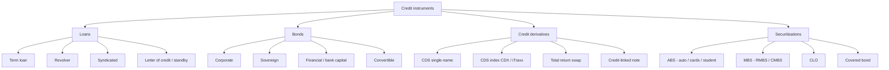

# Credit Module 4 — Credit Instruments

!!! abstract "Module Goal"
    Walk the universe of instruments that generate credit risk — loans, bonds, credit derivatives, securitisations — and for each one nail down what it pays, where the loss comes from when it goes wrong, whether it sits on the balance sheet today (funded) or only contingently (unfunded), and what shape it takes in a credit warehouse. The Market-Risk equivalent is [Module 4 — Financial Instruments Primer](../modules/04-financial-instruments.md); this module is its credit twin and the parallel structure is deliberate.

---

## 1. Learning objectives

By the end of this module, you should be able to:

- **Identify** the four major families of credit instruments — loans, bonds, credit derivatives, securitisations — and the principal sub-types within each.
- **Distinguish** funded from unfunded credit exposures and explain why the distinction drives different EAD calculations and different warehouse columns.
- **Map** an instrument's contractual payoff to the shape of its credit-loss distribution — issuer default, prepayment, collateral shortfall, tranche subordination — and to the dominant PD / LGD / EAD drivers.
- **Decide** the instrument-master attributes a credit warehouse must carry to support every report the credit function downstream depends on (regulatory capital, IFRS 9 / CECL provisioning, watchlist, concentration, limits).
- **Recognise** the identifier landscape (CUSIP, ISIN, SEDOL, LEI, internal facility ID, FpML / LXID for derivatives) and the cross-reference problem that comes with it.
- **Avoid** the most common modelling mistakes — treating a CDS as pure credit risk, modelling a securitisation as a single bond, using CUSIP as a primary key that survives a corporate action.

## 2. Why this matters

Every PD, every LGD, every EAD figure that the credit function ever publishes is ultimately attached to an instrument. The instrument is the spine that the entire fact-table fan hangs from — `fact_facility_balance` keys on it, `fact_pd_assignment` keys on it, `fact_ead_calculation` keys on it, and the IFRS 9 staging engine reads its attributes to decide whether the facility belongs in Stage 1, 2, or 3. Get the instrument taxonomy wrong and the warehouse will struggle to compute exposure correctly, hedge correctly, or report capital correctly. The defect rarely shows up as a wrong number in a single row; it shows up as a *systematic mis-statement* across an entire instrument family that the regulator finds in the next thematic review.

The mistakes are all of the same shape. A revolver classified as a term loan loses its undrawn-commitment exposure and quietly under-states EAD by 30–60% per facility; a sovereign bond classified as a corporate bond gets the wrong default-mechanics path and produces a recovery profile the LGD model cannot calibrate; a tranche of a securitisation modelled as a single bond loses the cashflow waterfall and produces a recovery number that bears no relationship to what the trustee will actually distribute. None of these are exotic edge cases — they are the bread-and-butter classification calls the data engineer has to get right, and they all flow from how well the instrument-master schema captures the four families and their sub-types.

The practitioner shift this module asks you to make is from "an instrument is a row in a table" to "an instrument is a contract whose contractual terms determine which fact tables it generates rows in, on which cadence, with which columns, and which downstream consumers." After this module you should be able to look at any credit instrument the firm holds and predict, before you query the warehouse, which fact tables ought to carry rows for it and which sensitivity columns ought to be populated.

!!! info "Honesty disclaimer"
    This module reflects general industry knowledge of credit instruments and the canonical taxonomies used in mid-2026 credit warehouses. Specific sub-type definitions, jurisdictional bond conventions (US 30/360 vs. European Actual/Actual day-counts, US vs. EU loan-documentation conventions), securitisation tranche labels, and CDS settlement mechanics vary by jurisdiction, by trade-association convention (LSTA vs. LMA for syndicated loans, ISDA for derivatives), and by each firm's product approval. Treat the material here as a starting framework — verify against your firm's actual product manual, the relevant trade-association documentation, and your accounting team's classification before applying it operationally. Where the author's confidence drops on a particular topic (typically: deep structured-credit waterfall mechanics, jurisdiction-specific covered-bond regimes, exotic CDS index tranche conventions), the module says so explicitly.

## 3. Core concepts

### 3.1 The four families

A credit warehouse needs to model four families of instrument. The boundaries are clear at the top level, fuzzy at the edges (a credit-linked note is a hybrid of a bond and a CDS; a syndicated loan in the secondary market trades like a bond), but the four-family split is the right starting point because each family has a distinct cashflow shape, a distinct default-risk shape, and a distinct set of warehouse columns.



For each family the warehouse has to know — at minimum — the cashflow shape (when interest accrues, when principal repays, what optional features can change the schedule), the default-risk shape (where the loss comes from when the obligor stops paying), the funded / unfunded status (does the principal sit on the books today, or only contingently), the recovery characteristics (what drives LGD), and the data-model implications (what columns and what fact-table grain).

A compact summary the data engineer can carry around mentally:

| Family | Funded? | Cashflow shape | Default-risk shape | Recovery driver | Warehouse footprint |
|---|---|---|---|---|---|
| **Loans** | Mostly funded; revolvers partly unfunded | Scheduled or revolver-cycle interest + principal | Obligor default; collateral shortfall when secured | Seniority + collateral realisation + workout outcome | `dim_facility`, `fact_facility_balance`, drawdown event log |
| **Bonds** | Funded | Coupons on schedule; principal at maturity | Issuer default; restructuring; call / put / tender events | Seniority in capital stack; industry / sovereign recovery norms | `dim_security`, `fact_position`, coupon-schedule reference data |
| **Credit derivatives** | Generally unfunded (CDS); funded for CLNs | Premium leg + contingent protection leg | Reference-entity credit event; protection-seller default (CCR) | ISDA auction recovery; counterparty workout for CCR | Trade table, reference-entity link, ISDA settlement events |
| **Securitisations** | Funded | Pool collections distributed via waterfall | Pool collateral defaults exceeding subordination | Tranche position in waterfall; servicer recovery | Pool / tranche / cohort tables, waterfall projection, prepayment data |

Each of the next four sub-sections drills into one family. The treatment depth is uneven by design — loans get the deepest treatment because they are the largest book at most banks and because the data engineer will spend the most time there; securitisations get a high-level treatment because deep structured-credit modelling belongs in a specialised course rather than a foundations module.

A note before the drill-down: the families are defined by *instrument economics*, not by who books them. Loans are booked in core banking and loan-origination platforms; bonds may be booked in trading systems or banking-book ledgers depending on intent; credit derivatives go through derivative-booking platforms (Murex, Calypso, internal builds) and the trade-lifecycle infrastructure of [MR M03](../modules/03-trade-lifecycle.md); securitisations may be held in trading or banking books depending on the firm's policy. The same family can appear across multiple source systems, and the warehouse must conform them onto a single instrument-master grain even when the underlying booking systems disagree on attribute names, default values, and identifier conventions. This is the same conformance discipline that the Market Risk track introduces in [MR M06](../modules/06-core-dimensions.md), applied here to credit's wider set of source systems.

A second note on the **trading-book vs. banking-book** distinction touched on in [MR M04](../modules/04-financial-instruments.md) section 3.12: the same physical instrument — a corporate bond, say — can sit in the trading book (held for short-term resale, marked daily, in scope for FRTB market-risk capital) or in the banking book (held to maturity, accrued, in scope for credit-risk capital and IFRS 9 / CECL provisioning). The credit warehouse cares about both — a banking-book bond drives PD / LGD / EAD and ECL; a trading-book bond drives credit-spread VaR (in market risk) and CVA (in credit risk for the counterparty exposure on derivatives that hedge it). The instrument-master row is the same; the *position* row carries the book-type that determines which downstream consumers process it. The discipline carries directly across from market risk; the difference is that credit-risk consumers care about both populations, where most market-risk consumers care only about the trading book.

### 3.2 Loans (the deepest sub-section)

Loans are the largest book at almost every commercial bank and at most universal banks; they are also the family with the richest sub-type taxonomy and the one where data-modelling errors compound fastest because of the long tenor and the multi-system source landscape introduced in [C03](03-credit-lifecycle.md). Six sub-types matter.

#### 3.2.1 Term loans

The simplest loan. A single principal amount is disbursed at origination (or in a small number of scheduled drawdowns) and is repaid on a defined schedule — bullet (all principal at maturity), amortising (level principal each period plus interest), or balloon (small periodic principal + a large final payment). Interest accrues at a fixed rate, a floating rate (typically a benchmark like SOFR plus a spread), or a hybrid. Tenors range from one year (working-capital loans) to thirty years (commercial real-estate term loans).

**Cashflow shape.** Predictable. The cashflow projection is deterministic given the rate, the schedule, and any prepayment assumption (most term loans are prepayable subject to a fee). The data engineer can pre-materialise the projected cashflow schedule on the facility row at origination and refresh only on amendment.

**Default-risk shape.** Loss arises when the obligor stops paying. The trigger is either past-due (90 days under Basel; sometimes 30 or 60 under stricter internal policy) or a unlikeliness-to-pay determination by the credit officer. EAD is broadly the outstanding principal at default, plus accrued interest and unpaid fees.

**Data-model implications.** A single fact row per (facility, business_date) for the daily balance, plus a sparse event log for amendments, prepayments, and rating changes. The cashflow projection is reference data on the facility, not a fact — it is *generated* from the rate, schedule, and outstanding balance, and refreshed only when one of those inputs changes. Materialising it as a derived view rather than a captured snapshot keeps the storage footprint manageable; carrying it as snapshots becomes important only at IFRS 9 month-end, when the lifetime ECL projection needs to be replayable.

A subtlety on **fixed vs. floating rate** that matters more than it looks. A floating-rate term loan re-prices every period (typically every 1m or 3m) at a benchmark plus a spread; the cashflow projection therefore depends on a forward curve as well as on the schedule. The credit warehouse can either store the projection at one snapshot (and refresh it monthly when the curve moves) or compute it on demand against a curve dimension. The choice is a performance / freshness trade-off; the IFRS 9 / CECL provisioning cadence (monthly) usually drives the answer toward stored snapshots refreshed monthly, with a derived-view fallback for ad-hoc queries.

#### 3.2.2 Revolvers (revolving credit facilities)

A commitment from the bank to lend up to a defined amount on demand, over a defined commitment period (typically one to five years for corporate revolvers, longer for committed liquidity facilities to financial institutions). The obligor draws and repays repeatedly to fund working capital; interest accrues only on the drawn amount; a *commitment fee* (typically 25–50 basis points) is paid on the undrawn portion.

**Cashflow shape.** Stochastic and obligor-driven. The drawn balance can move daily, sometimes intraday for treasury-grade obligors. The bank's view of the next month's drawn balance is informed by historical utilisation patterns, by the obligor's stated funding plan, and by sector working-capital cycles.

**Default-risk shape.** The critical wrinkle for revolvers is that *EAD at default is not the same as the current drawn balance*. Empirically, obligors approaching default *draw down their committed but undrawn lines* — the relationship manager loses leverage to refuse new draws, the obligor needs liquidity, and the bank's exposure rises just as the obligor's PD rises. The Basel framework captures this empirically observed behaviour through the **Credit Conversion Factor (CCF)**, treated in depth in the upcoming EAD module: EAD = drawn + CCF × undrawn, where CCF is the empirical fraction of the unused commitment that the obligor will draw before default. Typical CCF values are 50–75% for unconditionally cancellable commitments and 75–100% for committed facilities.

**Data-model implications.** Two facts per facility per business date — drawn and undrawn — and an event log dense enough to capture every draw and repayment. The EAD calculation is a derived column, not a captured fact, because it depends on the CCF model output. A common warehouse pattern is a `fact_facility_drawn_undrawn` table with daily grain, joined to the facility's CCF assignment from `fact_ead_calculation`.

A wrinkle worth surfacing on the *commitment fee* side: the fee is calculated daily on the undrawn balance, accrued (typically monthly), and paid (typically quarterly). Three temporal dimensions on a single revenue stream — the daily accrual base (which moves with the undrawn balance), the monthly accrual booking, and the quarterly payment — and the warehouse should store the daily accrual at the drawn-undrawn fact grain rather than reconstructing it from the monthly bookings, because revenue-attribution analysts (the relationship-management team's P&L lens) want to see fee revenue at facility-day grain even though the GL only books it monthly.

#### 3.2.3 Syndicated loans

A loan funded by a syndicate of lenders rather than a single bank. The deal is typically arranged by a *lead arranger* (often the relationship bank), allocated to a syndicate of lenders during *primary syndication*, and then traded in the *secondary market* among institutional lenders, hedge funds, and CLO managers. One lender — usually but not always the lead arranger — acts as the *agent bank*, administering the facility on behalf of the syndicate (collecting payments, distributing them pro-rata, communicating events to participants). Documentation is governed in the US by LSTA conventions and in Europe by LMA conventions.

Two sub-distinctions matter for the data engineer:

- **Agency vs. participation.** A bank that is the *agent* sees every event on the facility (every draw, every payment, every covenant test). A bank that is a *participant* sees only what the agent forwards via the standardised feeds (LSTA / LMA), which is generally complete but lags the agent's internal view by a day or two and occasionally has reconciliation breaks. The participant warehouse is by definition a *projection* of the agent's view; the data engineer needs to know which role the firm plays on each facility, and the role is itself a slowly changing attribute (agent banks resign and successors are appointed).

- **Secondary trading.** A participant can sell its share to another lender. From the data perspective this is a partial unwind on the seller's books and a new participation on the buyer's books, settled via an LSTA assignment agreement. The trade is bilateral but is reported to the agent so the agent's record of who-owns-what stays current. A facility may change participant rosters dozens of times over its life; the warehouse needs to model the participant's *share* (a percentage of the total commitment) as a slowly changing attribute on the facility-participant linkage, not as a static field on the facility.

**Default-risk shape.** Same as a bilateral loan from the obligor's perspective, but the workout is coordinated by the agent on behalf of the syndicate. Voting thresholds apply to material amendments — typically a simple majority for routine amendments, a super-majority (66.67% or higher) for material economic changes, and unanimity for the most significant changes (waiver of payment defaults, release of collateral). The bank's recovery on a syndicated workout depends on its share, on the syndicate's ability to coordinate, and on the agent's competence.

**Data-model implications.** Add a `dim_facility_participant` or equivalent that captures the firm's share of each syndicated facility, with effective dating to track sale-downs. Carry the firm's role (agent vs. participant) on the facility dimension as SCD2. Reconcile per-agent feed quality as a standing data-quality metric.

The agent-data wrinkle interacts with the bitemporal pattern of [C03](03-credit-lifecycle.md) in a specific way that deserves flagging. When the firm is a participant, a covenant-test result published by the agent on Wednesday may have been measured against numbers that were already known to be wrong the previous Monday — the obligor restated its financials, the agent re-ran the test on the corrected numbers, and the participant's warehouse sees only the re-run result without an audit trail of the intermediate state. Defensive practice is to capture the agent's own publication timestamp (`as_of_ts`) alongside the test's effective date, so that downstream reports can distinguish "the result we knew on Monday" from "the result we know now". Without that discipline, a regulatory request for the historical covenant-compliance state will produce a number that cannot be reconciled to the published agent communication.

#### 3.2.4 Bilateral loans

A loan between a single lender and a single borrower. Operationally simpler than a syndicated loan — no agent, no participants, no syndicate voting. Common for smaller corporate facilities, commercial real-estate loans below the syndication threshold (typically below $50M), and most middle-market commercial lending. The facility is owned end-to-end by the lender; documentation is typically based on but not slavishly compliant with LSTA / LMA forms.

**Data-model implications.** The simplest loan footprint. One facility row, no participant linkage, no agent feed. Most of the operational complexity in a bilateral loan warehouse comes from the *volume* of small facilities at middle-market and SME banks, not from per-facility complexity.

#### 3.2.5 Secured loans

A loan with a perfected security interest in identified collateral — real estate (commercial-real-estate mortgages, residential mortgages), securities (margin loans, securities-backed lending), receivables (asset-based lending), equipment (equipment finance), inventory (working-capital lines secured by inventory), or all-asset (a blanket lien on the obligor's assets). The collateral does not change the obligor's PD — the obligor's creditworthiness is the same regardless of what backs the loan — but it materially reduces LGD because the bank can realise the collateral on default.

**LGD shape.** Realised LGD on a secured loan is broadly: (EAD − net collateral proceeds − other recoveries) / EAD. Net collateral proceeds depend on the collateral's fair value at realisation, the realisation cost (legal, broker, holding cost), and any time-value drag during the workout. The LGD model treats secured loans as a different population from unsecured loans precisely because the recovery distribution has a different shape — typically a lower mean LGD, but a heavier left tail when the collateral fails to realise (a property in a sector downturn, a security with a frozen market).

The collateral-coverage ratio (typically loan-to-value, LTV) is the primary numerical input the LGD model needs from the warehouse. LTV at origination tells one story; LTV at the most recent revaluation date tells another; LTV in a stress scenario tells a third. The warehouse should carry all three (or the inputs to compute them on demand) — origination LTV as a static attribute on the facility, current LTV as a fact updated on each appraisal or mark, and stress LTV as a model output from the credit-stress module.

**Data-model implications.** Add `dim_collateral` linked to `dim_facility` via a many-to-many bridge (one facility can be secured by multiple collateral pieces; one collateral piece can secure multiple facilities through cross-collateralisation). Carry collateral fair value as a fact on its own cadence (daily for marketable collateral, periodic for real estate via appraisal). The Collateral & Netting module (covered in detail in the upcoming module) treats the deeper data shapes; for foundations, the key takeaway is that collateral is *its own dimension*, not an attribute on the facility.

#### 3.2.6 Unsecured loans

A loan with no collateral. Recovery on default depends entirely on the seniority of the bank's claim against the obligor's general assets — the bank stands in line behind any secured creditors and (in liquidation) ahead of any subordinated creditors and equity. Most large-corporate term loans and most revolvers are unsecured against an investment-grade obligor; unsecured lending is risk-priced through a higher spread rather than through collateral.

**LGD shape.** The Basel IRB-Foundation prescribed LGD for senior unsecured corporate exposures is 45%; empirical realised LGDs vary widely (Moody's and S&P publish recovery studies showing 35–55% mean realised recovery for senior unsecured corporate debt, with substantial variance by sector and vintage). The downturn LGD floor required under Basel IRB-A — the LGD calibrated for stressed conditions rather than long-run average — is typically 5–10 percentage points higher than the through-the-cycle LGD, reflecting the empirical observation that recoveries fall in stress (collateral values drop, workout queues lengthen, secondary markets thin out).

**Data-model implications.** Simpler than secured — no collateral linkage — but the LGD model needs to carry the unsecured population as a separate calibration cell from the secured population, because the recovery distributions have different shapes.

#### 3.2.7 Letters of credit and standby facilities

A bank's *contingent obligation* to pay a defined beneficiary on the obligor's behalf if certain conditions are met. The classic commercial letter of credit (LC) supports international trade — the bank pays the seller on presentation of shipping documents, then claims reimbursement from the buyer (the obligor). A *standby* LC supports performance under another contract — the bank pays the beneficiary if the obligor fails to perform, then claims reimbursement.

**Cashflow shape.** Mostly nothing. The bank collects an issuance fee and a standing fee; no principal is disbursed unless the LC is drawn. Most LCs expire undrawn.

**Default-risk shape.** Two-tier. Until drawn, the bank is exposed to the *obligor's* credit (will the obligor reimburse if the LC is called?) — this is the credit risk the warehouse models. Once drawn, the LC becomes a funded loan to the obligor with the same risk shape as a term loan.

**EAD shape.** EAD = commitment × CCF, with CCF generally high for irrevocable LCs (100% under Basel SA for direct credit substitutes; 50% for performance-related LCs). The instrument is *unfunded* until drawn.

**Data-model implications.** The warehouse must distinguish LC commitments from term loans even when they sit in the same `dim_facility`. A common pattern is a `facility_type` column with values `TERM_LOAN`, `REVOLVER`, `LC`, `STANDBY`, and the EAD calculation branches on the type. The drawn portion of an LC, when called, may be moved to a different facility ID (a new term loan facility booked as a result of the LC draw); document the convention firm-by-firm because it varies.

### 3.3 Bonds

A bond is a tradeable debt security. The issuer borrows from the holder by selling a security that promises a stream of coupons and a return of principal at maturity. Bonds are funded (the holder pays cash up front, owns the security, and is exposed to the issuer's credit). The credit warehouse holds bonds whenever the firm is *long* the credit risk — bonds in the trading book held for market-making, bonds in the banking book held to maturity, bonds held by treasury for liquidity buffers.

#### 3.3.1 Corporate bonds

The classic credit bond. Issued by a non-financial corporation, ranked in seniority within the issuer's capital structure. Five seniority tiers commonly appear:

- **Senior secured.** First claim on identified collateral plus general senior unsecured claim against remaining assets. The strongest debt position. Typical for asset-heavy issuers (utilities, real-estate operators).
- **Senior unsecured.** No collateral, but ahead of subordinated creditors and equity in liquidation. The default seniority for most investment-grade corporate debt.
- **Subordinated.** Ranked below senior creditors. May carry a higher coupon to compensate. Common for financial issuers and for some leveraged-buyout capital structures.
- **Junior subordinated.** Ranked below ordinary subordinated debt, often with deferral features (the issuer can defer coupons under stress without triggering default).
- **Hybrid / equity-like.** Perpetual or very-long-dated subordinated debt with equity-like loss-absorption features. Includes most bank Additional Tier 1 (AT1) securities — covered under "financial bonds" below.

The seniority tier is the single most consequential attribute for LGD modelling on bonds. A senior secured bond on a defaulted issuer might recover 80% of par; a senior unsecured bond on the same issuer might recover 40%; a subordinated bond might recover 10%. The dispersion is wider than for the loan equivalents because public-debt restructurings tend to allocate value strictly along the contractual seniority waterfall, whereas loan workouts often involve negotiated outcomes that compress the recovery dispersion. The data engineer who collapses senior unsecured and subordinated bonds into a single LGD calibration cell will produce a model that is wrong for both populations and that fails the IRB validation test on discriminatory power.

**Cashflow shape.** Periodic coupons (typically semi-annual in the US, annual in much of Europe, varies elsewhere) and principal at maturity. Day-count conventions matter (30/360 for many US corporates, Actual/Actual or Actual/360 for European and money-market securities). The coupon schedule is reference data on the security; the cashflow projection is deterministic until a corporate-action event modifies it.

**Default-risk shape.** Issuer default — failure to pay a coupon or principal within the grace period stipulated in the indenture, bankruptcy filing, or formal restructuring. Recovery depends on the seniority tier and the issuer's liquidation value.

**Data-model implications.** A `dim_security` keyed on internal instrument ID, with cross-reference rows for CUSIP, ISIN, FIGI, and the issuer's LEI. A `fact_position` at (security, business_date, book) grain. The seniority tier is a critical attribute — LGD modelling cells are keyed on it.

#### 3.3.2 Sovereign bonds

Issued by a national government. The default mechanics differ sharply from corporate bonds in two ways. First, sovereigns *cannot go through bankruptcy* in the way a corporation can — there is no court that has jurisdiction over a sovereign's assets in a meaningful way. When a sovereign defaults, the resolution is via *restructuring* (a negotiated reduction of principal, extension of maturity, or coupon reduction) or *selective default* (the sovereign continues to service some obligations while defaulting on others). Second, the recovery distribution looks different — sovereign restructurings (Greece 2012, Argentina 2001 / 2014 / 2020, Russia 1998, Ecuador on multiple occasions) tend to produce broad-based haircuts rather than the seniority-driven waterfall of a corporate liquidation.

**Cashflow shape.** Periodic coupons and principal at maturity; conventions vary by issuer (US Treasuries: semi-annual coupon, Actual/Actual; UK Gilts: semi-annual, Actual/Actual; Bunds: annual, Actual/Actual; many EM sovereigns: semi-annual, 30/360).

**Default-risk shape.** Sovereign default risk concentrates in EM sovereigns and (post-2010) in stressed peripheral-Europe sovereigns. DM sovereigns (US, UK, Germany, Japan) are not zero-PD but are typically modelled with very low PDs and close to zero LGD for the credit warehouse. The warehouse must distinguish *foreign-currency* sovereign debt (where the sovereign cannot print the currency it owes) from *local-currency* sovereign debt (where it can, and where the alternative default mechanism is via inflation rather than a hard restructuring) — these populations have materially different historical default rates.

**Data-model implications.** Sovereign bonds key on the sovereign issuer's LEI and on the country code; the LGD model carries a separate calibration cell for sovereigns. The watchlist process for sovereigns runs through a different governance path than for corporates (the country-risk team, often a separate sub-unit within Credit Risk). The `dim_country_risk` dimension (covered in detail in the upcoming Core Credit Dimensions module) is the canonical reference data join — sovereign rating, country grouping (DM / EM / frontier), convertibility / transfer-restriction flags, and any prudential add-ons or floors that the supervisor has imposed on exposures to that sovereign.

A sub-distinction the data engineer should know: **sub-sovereign** issuers (US states and municipalities, Canadian provinces, German Länder, Brazilian states) sit between corporate and sovereign on the credit risk spectrum. They have taxing power but cannot print currency; they sometimes default formally (the Detroit bankruptcy, Puerto Rico's restructuring) and sometimes get bailed out by the higher-tier sovereign (the German Länder solidarity arrangements). The LGD calibration cell for sub-sovereigns is typically separate from both pure sovereigns and pure corporates, and the warehouse should mark the issuer type explicitly rather than collapsing sub-sovereigns into one of the adjacent buckets.

#### 3.3.3 Financial bonds (including bank capital)

Issued by banks, insurance companies, and other financial institutions. From a recovery-mechanics standpoint they look like corporate bonds — the issuer can fail, the resolution is via bankruptcy (or a special resolution regime for systemic banks), and the seniority tier drives recovery. But three sub-types deserve specific attention because their loss-absorption mechanics are *contractual* rather than legal:

- **AT1 (Additional Tier 1).** Bank capital instruments designed to absorb losses while the bank is still a going concern. AT1 bonds typically have a *trigger* — usually a minimum CET1 ratio, often around 5.125% or 7% — at which the bond's principal is *written down* (sometimes permanently, sometimes temporarily) or *converted to equity*. The trigger fires before formal default. The Credit Suisse AT1 write-down in March 2023 ($17B written to zero while equity holders received some recovery) was the highest-profile recent illustration that AT1 loss-absorption is real, contractual, and can pre-empt the conventional creditor hierarchy.
- **T2 (Tier 2).** Subordinated bank debt that absorbs losses at the *gone-concern* stage (i.e., when the bank enters resolution). Less aggressive triggers than AT1; recovery is via the resolution authority's bail-in framework rather than a contractual write-down.
- **TLAC / MREL eligible debt.** Senior unsecured debt issued by global systemically important banks (G-SIBs) that is bail-in-able under the Total Loss Absorbing Capacity (TLAC) regime in the US / Switzerland / UK or the Minimum Requirement for Own Funds and Eligible Liabilities (MREL) regime in the EU. From the holder's perspective it ranks senior in liquidation but can be bailed in *before* liquidation under a resolution action.

**Data-model implications.** The warehouse must carry the trigger terms as reference data on AT1 securities (trigger ratio, write-down vs. conversion, permanence) and on T2 / TLAC instruments (resolution-regime jurisdiction, bail-in waterfall position). A trigger event is a credit event for the holder even though it is not a formal default by the issuer; the workflow to recognise it as a loss in the warehouse and feed it into LGD calibration needs to be designed in advance, not improvised on the day. A second wrinkle: AT1 coupons are typically *fully discretionary* (the issuer can cancel them without triggering a default), and a coupon cancellation is itself a credit signal that the warehouse should capture even though the regulatory definition of default does not fire on it. Holders treat coupon cancellation as a meaningful watchlist event; the data engineer should ensure the event lands as a row in `fact_credit_event` with an explicit type code rather than being silently absorbed into the coupon-payment fact.

#### 3.3.4 Convertible bonds

A bond with an embedded option for the holder to convert into a defined number of shares of the issuer's equity. The conversion is at the holder's option (so the holder takes the higher-value path — bond if the share price stays low, equity if the share price rises sharply). Convertibles bridge credit and equity desks: the credit risk on the bond floor is real (the issuer can default, in which case the holder ranks as a bondholder), and the equity option is real (the upside participates in equity).

**Data-model implications.** Carry the conversion ratio, the conversion price, and any anti-dilution adjustments as reference data. From a credit-risk perspective, the bond floor (the value if conversion is uneconomic) is what carries credit risk; the equity option carries market risk and is normally booked into the equity-derivatives warehouse. Convertibles are the canonical example of an instrument that legitimately appears in *two* risk warehouses, and the conformance between them is a standing data-quality concern.

#### 3.3.5 Investment-grade vs. high-yield

A bond rated BBB- / Baa3 or higher by the major rating agencies is *investment grade* (IG); a bond rated below is *high yield* (HY) — historically called "junk" before the marketing rebrand. The distinction is not a contractual feature; it is a rating-driven label that nonetheless drives substantial differences in default rate, recovery distribution, and liquidity.

- **Default rates.** Empirically, IG bonds default at single-digit basis points per year; HY bonds default at several hundred basis points per year, with sharp cyclical variation (HY default rates spike to 8–12% in recession years).
- **LGD distributions.** IG defaults are rarer but tend to produce lower recoveries when they do occur (the issuer usually had some sort of catastrophic event); HY defaults are more common and produce a wider recovery distribution.
- **Liquidity.** IG bonds trade in deeper secondary markets and price closer to model marks; HY bonds trade in thinner markets and require greater reliance on dealer marks or matrix pricing.

**Data-model implications.** The warehouse must carry the issuer rating (and ideally the issue rating, which can differ from the issuer rating for structured or notched issues) as a versioned attribute, with rating-action events captured as their own facts. The IG / HY split is typically a derived attribute — `is_investment_grade = (rating >= 'BBB-')` — but it is referenced enough by reports that materialising it on the dimension is reasonable.

The IG / HY boundary is also a *liquidity* boundary in practice. IG bonds trade in deeper secondary markets and price closer to model marks; HY bonds trade in thinner markets and require greater reliance on dealer marks or matrix pricing. From the data engineer's perspective the implication is that the price and yield series for HY positions are noisier and stale more often, and the IFRS 9 ECL on a HY bond may need to fall back on a model-derived spread when a dealer mark is unavailable. The market-data quality SLA for HY positions should be tighter than for IG, not looser, precisely because the underlying data is harder.

### 3.4 Credit derivatives

Credit derivatives transfer credit risk between counterparties without transferring the underlying obligation. The protection buyer pays a premium; the protection seller stands ready to make the buyer whole if a defined credit event occurs on a reference entity. Credit derivatives are mostly *unfunded* — no principal changes hands at trade inception (the credit-linked note is the funded exception) — but they generate counterparty credit risk on top of the credit risk they reference, which is a subtlety the data engineer must internalise early.

#### 3.4.1 CDS single-name

A CDS on a single reference entity. The protection buyer pays a quarterly premium (typically a fixed coupon — 100bp or 500bp under the post-2009 standardised CDS coupon convention — plus an upfront amount that adjusts the spread to the trade's economics). The protection seller pays out if the reference entity suffers a *credit event* as defined under the ISDA Credit Derivatives Definitions: failure to pay (payment default beyond the grace period), bankruptcy, or restructuring (the latter is jurisdiction-specific in its application). Settlement is typically via an *ISDA auction* — a standardised post-event auction that determines the recovery rate, against which the protection payment is the difference between par and the auction price.

**Cashflow shape.** Premium leg is a recurring scheduled cashflow (quarterly coupon on the notional) until maturity or credit event. Protection leg is a single conditional cashflow on credit event. The CDS lifecycle is the trade-lifecycle pattern of [MR M03](../modules/03-trade-lifecycle.md), not the loan-lifecycle pattern of [C03](03-credit-lifecycle.md), but with a contingent linkage to the reference entity's status.

**Default-risk shape (twofold).** *Reference-entity credit risk*: the position's payoff depends on the reference entity defaulting. *Counterparty credit risk on the CDS itself*: when the firm is the protection buyer, the protection only pays if the protection seller is solvent and able to pay. This is the lesson of AIG in 2008 — buying CDS protection from a counterparty that itself fails leaves the buyer with neither protection nor effective credit hedge. Modern CDS markets mitigate this through clearing (vanilla CDS indices clear at ICE Clear and LCH); single-name CDS still trade bilaterally and generate CCR exposure under SA-CCR or IMM, treated in depth in the upcoming EAD module.

**Data-model implications.** A CDS row in the trade table, linked to (a) the reference entity's `dim_obligor` for the credit-risk projection and (b) the CDS counterparty's `dim_counterparty` for the CCR projection. The same physical row generates rows in two different fact streams. Carry the ISDA standard terms (running coupon, restructuring clause variant, credit-event determination committee region) as reference data on the trade.

#### 3.4.2 CDS index (CDX, iTraxx)

A CDS on a basket of reference entities (CDX in North America, iTraxx in Europe and Asia). The standard indices have 100 to 125 constituents and roll every six months on defined dates (March 20 and September 20). Trading is highly liquid, settlement is mostly cleared, and the index trades as a single instrument with a single coupon and single auction settlement on credit events of any constituent.

**Mechanics.** When a constituent defaults, the index's effective notional shrinks proportionally. The protection seller pays out on the defaulted constituent (via the standard ISDA auction for that name); the index continues with the remaining constituents at the reduced effective notional. Subsequent constituents can default in turn. The position thus generates a *series* of credit-event payouts over its life, not a single one.

**Data-model implications.** The index is itself an instrument with its own internal ID; the constituent list is a versioned attribute (constituent rosters change at each roll, but only the on-the-run series is widely traded). Recoveries are at the constituent level, not the index level. The data engineer needs both the index-level trade row and the constituent-level event rows.

#### 3.4.3 Total return swap (TRS)

A swap where one leg pays the *total return* of a reference asset (price change plus coupons) and the other leg pays a funding rate (typically a benchmark plus a spread). The TRS receiver gets the economic exposure of owning the reference asset without owning it legally; the TRS payer earns the funding spread and offloads the economic exposure.

**Common usage.** TRS structures are common in synthetic prime brokerage (a hedge fund takes economic exposure to a portfolio of stocks via TRS rather than owning them directly, often for leverage or regulatory-balance-sheet reasons), in synthetic securitisation (a bank transfers credit-risk economics on a portfolio of loans to a protection seller via TRS), and in repo-like financing arrangements.

**Data-model implications.** A TRS generates credit risk on the *counterparty* (the entity on the other side of the swap, who must keep paying the total return or the funding rate as the case may be) and, indirectly, equity / credit risk on the *reference asset* (because the funding-leg payer bears the price risk on the reference). For a bank receiving total return on a basket of corporate loans via TRS, the credit-risk exposure to the underlying loans must be modelled even though the loans themselves are not on the bank's balance sheet — the synthetic exposure is real and capital-bearing.

#### 3.4.4 Credit-linked note (CLN)

A funded structure embedding a CDS. The investor buys a note from an issuer (typically an SPV or a bank); the note pays a coupon at par-plus-spread (the spread reflects the credit risk being assumed); on a credit event of the reference entity, the note's principal is reduced by the protection payout. The investor effectively sells CDS protection but in funded form — the protection cashflows are pre-paid via the par investment.

**Why CLNs exist.** Investors who cannot trade CDS directly (because of regulatory restrictions, mandate constraints, or operational limitations) can take credit exposure via a CLN. The funded structure also avoids the CCR exposure that an unfunded CDS would generate — the issuer of the CLN holds the cash and pays out from it.

**Data-model implications.** A CLN is a hybrid bond / CDS instrument. It sits in the bond family for cashflow and lifecycle purposes (the investor receives coupons and at maturity gets the par back, less any credit-event reductions) and references the underlying CDS terms for the credit-event mechanics. The warehouse needs to carry both the bond reference data and the embedded CDS terms.

A general note on credit derivatives that the data engineer should internalise: **derivatives generate counterparty credit risk on top of the credit risk they reference**. This is the classic CCR / credit-risk-on-credit-risk recursion. Buying CDS protection on Obligor X from Counterparty Y replaces direct credit risk on X with two simultaneous risks: the residual credit risk on X (which only matters if Y defaults first) and the credit risk on Y. The warehouse must capture both, and the netting / hedging-effect accounting that the credit officer wants (does the CDS hedge actually reduce capital?) depends on getting the CCR-on-derivatives accounting right.

A useful mental model: a CDS is **two simultaneous credit-risk objects** — the reference-entity object (which the firm is *long* if protection-bought, *short* if protection-sold) and the counterparty object (which the firm is *long* through the trade's mark-to-market when in-the-money). Two objects, two `dim_obligor` (or `dim_counterparty`) joins, two PD / LGD / EAD streams. The warehouse design that captures only one — usually the reference entity, because the trade is "a credit trade" — is the design that under-counts the firm's true credit risk every time a counterparty wobble happens. Designing for the dual-link from day one costs a small amount of extra schema and saves a substantial amount of remediation when the regulator (or the firm's own CRO) asks the inevitable "show me our CDS counterparty exposure" question.

Cleared CDS (the bulk of vanilla CDS index trades since the Dodd-Frank / EMIR clearing mandates of the early 2010s) substitutes a CCP — typically ICE Clear Credit or LCH CDSClear — as the counterparty to both legs of every cleared trade. The CCR exposure becomes exposure to the CCP, which is generally treated under a preferential capital regime (lower risk weight than a non-CCP counterparty) but is not zero — the 2020 nickel-trading-halt episode at the LME, while not a CDS event, was a salutary reminder that CCPs can themselves be sources of operational and credit risk under stress. The warehouse should distinguish cleared from bilateral CDS via a `is_cleared` flag on the trade and route the CCR EAD through the CCP-specific calibration cell.

### 3.5 Securitisations (high-level treatment)

A securitisation pools a defined set of credit-bearing assets (mortgages, auto loans, credit-card receivables, leveraged loans, commercial mortgages) into a special-purpose vehicle (SPV); the SPV issues debt securities (*tranches*) of varying seniority that collectively claim the cashflows from the asset pool. Cashflows are distributed via a defined *waterfall*: senior tranches are paid first; mezzanine and junior tranches are paid only after senior obligations are satisfied; the equity tranche absorbs first losses. The structural credit transfer is real — pool losses up to the level of subordination protect the senior tranches.

This module treats securitisations only at the conceptual level. Deep structured-credit modelling — pool-level cashflow projection, prepayment modelling, OC / IC tests, waterfall back-solving, rating-agency stress models — belongs in a specialised structured-credit course rather than a foundations module. Where applied vendor coverage of structured credit is offered (the Polypaths C-track applied module if drafted), it will go into the operational modelling depth.

#### 3.5.1 ABS — asset-backed securities

Pools of consumer or commercial receivables — auto loans, credit-card receivables, student loans, equipment leases. Tranching is conventional: a senior AAA-rated tranche, one or more mezzanine tranches at AA / A / BBB, an equity tranche held by the originator (often required by skin-in-the-game regulations).

**Risk drivers.** Pool-level credit performance (default rates, charge-off rates), prepayment behaviour (faster prepayment can shorten or extend tranche tenor depending on the structure), and macroeconomic overlays (unemployment for auto and cards, used-car prices for auto LGD).

#### 3.5.2 MBS — mortgage-backed securities

Pools of residential mortgages (RMBS) or commercial mortgages (CMBS). The US agency RMBS market (Fannie Mae, Freddie Mac, Ginnie Mae issuance) is the largest fixed-income market in the world; non-agency RMBS, CMBS, and European RMBS / CMBS are smaller but still substantial.

**Distinctive risk driver: prepayment.** RMBS holders are short a prepayment option — when rates fall, mortgage borrowers refinance, the pool prepays, and the RMBS holder is repaid at par when the bond was trading at a premium. Prepayment modelling (PSA assumptions, conditional prepayment rate or CPR) is the dominant analytical concern for agency RMBS, often more important than default modelling because credit risk is largely transferred to the agency.

**CMBS specifics.** Commercial mortgages do not prepay as freely (defeasance and yield-maintenance penalties are common); credit risk is more concentrated (a CMBS pool may have 30–100 loans rather than thousands), and the per-loan analysis matters more.

#### 3.5.3 CLOs — collateralised loan obligations

Pools of leveraged loans (typically senior secured first-lien syndicated loans to non-investment-grade corporate borrowers), tranched into rated debt and an equity tranche. The CLO manager actively manages the pool (substituting loans, reinvesting prepayments) within constraints set by the indenture (concentration limits, OC and IC tests, weighted-average rating, weighted-average spread).

**Structural protections.** OC (over-collateralisation) and IC (interest-coverage) tests divert cashflows from junior tranches to senior tranches when triggered, providing automatic deleveraging if pool quality deteriorates. CLOs survived the 2007–2009 crisis and the 2020 stress with relatively little senior-tranche loss precisely because of these structural features.

**Data-model implications.** A CLO investment requires three layers of data: the *tranche* (the security held), the *deal* (the CLO structure with its indenture terms and waterfall), and the *pool* (the constituent loans, refreshed as the manager rebalances). Pool data is published in standardised feeds (Intex, Trepp); the data engineer needs to subscribe and integrate.

#### 3.5.4 Covered bonds

A bond issued by a financial institution (typically a European bank) and backed by a *cover pool* of high-quality assets (residential mortgages, public-sector loans). The bondholder has *dual recourse* — first claim on the cover pool, plus a senior unsecured claim against the issuing bank if the cover pool proves insufficient. Covered bonds are common in European jurisdictions with mature legal frameworks (Germany's Pfandbriefe, France's obligations foncières, the UK's Regulated Covered Bonds), uncommon in the US.

**Distinctive feature.** Covered bonds historically have very low default rates (no investor in a German Pfandbrief has ever lost money, even through two world wars and the GFC). The dual recourse plus the cover-pool eligibility rules (typically very conservative LTVs and asset quality) explain the resilience. From a credit-risk warehouse perspective, covered bonds typically warrant their own LGD calibration cell because the recovery distribution is materially different from senior unsecured bank debt.

**Tranche / cohort / cashflow data shape.** For each securitisation family, the warehouse needs at least three logical tables: (i) a tranche dimension (the security held, with its position in the waterfall), (ii) a cohort or pool dimension (the underlying assets, often refreshed monthly), and (iii) a cashflow projection fact (the projected distributions to each tranche under base-case and stress assumptions). The forward link to the upcoming Polypaths C-track applied module would extend these patterns to operational depth; the foundations message is: **do not model a securitisation tranche as a single bond row**, because the tranche's behaviour is determined by the pool and the waterfall, not by any standalone obligor.

A subtlety on **agency vs. non-agency** for US RMBS that is worth flagging because it changes the credit-risk story sharply. Agency RMBS (issued by Fannie Mae, Freddie Mac, Ginnie Mae, or backed by their guarantee) carries effectively no obligor credit risk to the holder — the guarantee absorbs default losses. The dominant analytical concern is prepayment, with credit risk effectively transferred to the GSE. Non-agency RMBS (private-label deals issued by banks or specialty originators) carries the full credit risk of the underlying mortgage pool to the tranche holders. The two populations look superficially similar (RMBS, residential mortgages, tranched) but warrant different LGD calibration cells and different downstream risk reporting. Mark agency vs. non-agency on the instrument master and partition the calibration accordingly; conflating them produces an LGD model that is wrong for both populations.

### 3.6 Identifier landscape

Different families use different identifier systems. Tradeable bonds and securitisations key on the public-issuance identifiers (CUSIP, ISIN, SEDOL); issuers key on the LEI (Legal Entity Identifier, issued under ISO 17442 by GLEIF and its accredited LOUs); loans typically key on an internal facility ID with no external standard; OTC derivatives reference entities by the LEI plus an FpML-compatible reference identifier.

| Identifier | Issued by | Coverage in credit | Notes |
|---|---|---|---|
| **CUSIP** | CUSIP Global Services (US/Canada) | US and Canadian bonds, ABS, MBS, CLO tranches | 9 characters; the first 6 identify the issuer. Re-issued on certain corporate actions, so not a stable primary key. |
| **ISIN** | National Numbering Agencies, ISO 6166 | Global; bonds, listed securitisations | 12 characters; embeds CUSIP for US-domiciled securities. The most universal listed-debt identifier. |
| **SEDOL** | London Stock Exchange | UK and many international debt securities | 7 characters; widely used for cross-border settlement and fund accounting. |
| **LEI** | GLEIF (via Local Operating Units) | Issuers, obligors, counterparties — any legal entity | 20 characters; mandatory for many regulatory reports (EMIR, Dodd-Frank, MiFID II). The closest thing to a global entity identifier. |
| **Internal facility ID** | The firm | Loans, internal facilities, undrawn commitments | No external standard. The synthetic primary key in `dim_facility`. |
| **FpML / LXID** | ISDA, individual platforms | OTC derivatives | FpML provides a standardised XML schema for derivative trade data; LXID-like identifiers tie a trade to its standardised description. |
| **CUSIP-INT, ISIN-INT** | DTCC, Euroclear, Clearstream | Cleared / settled positions | Variant identifiers used in clearing and settlement; the warehouse usually maps them back to the tradeable identifier. |

**The cross-reference problem.** A single bond can be referenced by a CUSIP (used by the US settlement system), an ISIN (used by the regulator), a SEDOL (used by the fund-accounting system), and a vendor-specific code (used by the market-data feed). The bond's *issuer* has an LEI, and the issuer's *ultimate parent* has a different LEI. The credit warehouse must hold cross-reference rows for each external identifier *and* the issuer-to-parent hierarchy, both versioned because both change (corporate actions re-issue CUSIPs; mergers and divestitures move issuers between parent groups).

The pragmatic xref discipline mirrors the market-risk pattern from [MR M04](../modules/04-financial-instruments.md): **always join through the firm's internal ID, never directly between two external identifiers**. A bond identified by CUSIP must xref to its issuer (LEI), which must xref to the obligor in the credit warehouse (the firm's internal `obligor_id`, typically). Three different ID systems, all needed, all versioned, all reconciled. The data engineer who shortcuts this — joining `fact_position` directly from CUSIP to `dim_obligor` on issuer name — will discover, the first time a corporate-action breaks the join, that the entire concentration report is silently mis-aggregated.

Three concrete xref scenarios the data engineer should expect to handle:

1. **Corporate-action re-CUSIP.** A bond exchange offer or a merger can produce a new CUSIP for the surviving security, while the issuer's LEI stays the same. The warehouse should hold both old and new CUSIPs as effective-dated rows pointing to the same internal `instrument_id`; positions held across the corporate-action date should remain joinable to historical and current views without losing the link.
2. **Issuer LEI change.** Less common than CUSIP changes but it happens — typically when a legal-entity reorganisation produces a new entity that takes over the issuance role. The warehouse should hold the LEI history with effective dates and resolve queries by joining on the LEI effective on the query's business date, not on the LEI current today.
3. **Sovereign issuer hierarchies.** A bond issued by a sovereign agency (e.g., a state-owned development bank, a utility, a sovereign wealth-fund vehicle) may or may not be guaranteed by the parent sovereign. The warehouse must distinguish *guaranteed* from *non-guaranteed* sub-sovereign issuers because the credit roll-up — and therefore the country-concentration report — depends on whether the parent sovereign's PD or the sub-sovereign's standalone PD applies. Carry the guarantee status as an attribute on the issuer dimension, with the guarantor LEI as a separate field.

### 3.6a Cashflow shapes by instrument family

The same family-level overview, but seen through the lens of *what cashflow you should expect to see in the warehouse on any given business date*. The table below is most useful as a debugging reference — a position whose actual cashflow record diverges from this table's expectation is almost always a misclassification or a missing reference data row.

| Family / sub-type | Interest cashflow cadence | Principal cashflow shape | Optional features that change the schedule |
|---|---|---|---|
| Term loan (bullet) | Monthly or quarterly accrual | All at maturity | Prepayment (with penalty); amendment-driven extension |
| Term loan (amortising) | Monthly or quarterly | Level principal each period | Prepayment; amendment-driven re-amortisation |
| Revolver | Monthly or quarterly on drawn balance; commitment fee on undrawn | Drawn / repaid at obligor's option through commitment period | Maturity extension; permanent commitment reduction |
| Letter of credit | Annual standing fee | None unless drawn | Draw triggers conversion to term-loan-shaped cashflow |
| Senior unsecured corporate bond | Semi-annual (US) or annual (Europe) coupon | Bullet at maturity | Call (issuer); put (holder); tender offer; consent solicitation |
| Sovereign bond | Issuer-specific cadence | Bullet at maturity | Restructure; selective default; CACs (collective action clauses) |
| Subordinated bank capital (T2) | Periodic coupon | Bullet at maturity (usually with first-call) | First-call (issuer); regulatory non-call; bail-in conversion |
| AT1 perpetual | Discretionary periodic coupon | None (perpetual) | Coupon cancellation; first-call; trigger write-down / conversion |
| Convertible bond | Periodic coupon | Bullet at maturity if not converted | Conversion to equity (holder); call (issuer); put (holder) |
| CDS single-name (premium leg) | Quarterly running coupon on standardised IMM dates | None | Credit event terminates the trade with a single contingent payout |
| CDS index | Quarterly coupon on remaining notional | None | Per-constituent credit events shrink the notional sequentially |
| Total return swap | Periodic total-return and funding-leg payments | Final settlement at maturity | Early termination; reset events |
| Credit-linked note | Periodic coupon (par-plus-spread) | Par at maturity, less credit-event reductions | Credit event reduces principal (write-down) |
| RMBS / MBS | Monthly pass-through | Pool prepayments + scheduled amortisation distributed by waterfall | Prepayment shocks; pool delinquency events |
| CMBS | Monthly pass-through | Mostly bullet (matches underlying CRE loans) | Defeasance; loan-level prepayment penalties |
| CLO | Quarterly distributions per waterfall | Reinvestment period then sequential or pro-rata pay | OC / IC test breaches divert cashflow; manager rebalancing |
| Covered bond | Periodic coupon (typically annual in EU, semi-annual in UK) | Bullet at maturity; soft-bullet variant extends if pool insufficient | Maturity extension under soft-bullet; cover-pool top-up |

What this table is for in practice: when a `fact_cashflow_event` row appears that does not match the expectation for the instrument's family / sub-type, that is a data-quality alert — either the instrument is misclassified, the cashflow projection is wrong, or a corporate-action event has changed the schedule and was not captured. The discipline is to wire the table's expectations into a validation rule and to review the breaks daily; the alternative — discovering the mis-classification at month-end IFRS 9 close — is more expensive.

### 3.6b Lifecycle implications by instrument family

Section 3.6a covered cashflow shape. The lifecycle complement: each family generates a distinct event-density signature, and the warehouse needs to know what events to expect. This sub-section is the credit equivalent of [MR M04](../modules/04-financial-instruments.md) section 3.11 and complements [C03](03-credit-lifecycle.md)'s lifecycle deep-dive with an instrument-specific lens.

- **Term loan.** Lifecycle is sparse. The events that matter: amendment (rare; perhaps once or twice over the life of a typical 5y facility), prepayment (typically scheduled or near-maturity), rating reaffirmation (annual). Most days produce only an interest-accrual row. A defaulting term loan generates a small flurry of events around the default trigger (covenant breach, missed payment, declared default) and then a long quiet period through workout punctuated by recovery cashflows.
- **Revolver.** Lifecycle is denser. Drawdowns and repayments through the commitment period generate a row each; for treasury-grade obligors with active working-capital cycles, daily activity is normal. Amendment events (extension of commitment period, increase in commitment, addition of currencies) are still rare. Default-trigger events look the same as for a term loan but the EAD spike from undrawn-to-drawn conversion is the distinctive risk signal in the run-up to default.
- **Syndicated loan.** Inherits the term-loan or revolver lifecycle as appropriate, plus syndicate-specific events: sale-down (a participant sells its share), assignment (legal transfer of the participation), agent role flip, syndicate vote, lender-of-last-resort substitution. Each of these needs an event type code in the warehouse and a back-link to the affected facility.
- **Bond.** Coupon payments on schedule, principal at maturity, plus optional events — call, put, tender offer, consent solicitation, ratings actions (which are issuer-level and propagate to all bonds of the issuer). For sovereigns, restructuring announcements and CAC activations are the analogous lifecycle events. For AT1 / T2, coupon cancellation, trigger events, and call decisions are the distinguishing lifecycle vocabulary.
- **CDS.** Quarterly coupon payments on standard IMM dates (March 20, June 20, September 20, December 20), plus credit-event determination, ISDA auction, and settlement on event. The trade may also be unwound, novated to a CCP, compressed against an offsetting trade, or amended — all of which look like the trade-lifecycle events of [MR M03](../modules/03-trade-lifecycle.md) rather than the loan-lifecycle events of [C03](03-credit-lifecycle.md).
- **Securitisation tranche.** Monthly (RMBS / MBS) or quarterly (CLO, ABS) waterfall distributions. Pool-level events — collateral defaults, prepayments, OC / IC test breaches — propagate to the tranche level via the waterfall mechanics. The tranche's own lifecycle events are sparser (amortisation step-downs, calls of the deal by the equity holders, extension events) but the *pool* underneath generates a continuous stream of activity that the warehouse must ingest from the trustee feed.

The data engineer's mental model: the *instrument* has a sparse lifecycle; the *pool* (for securitisations) or the *reference entity* (for credit derivatives) has a dense one; the warehouse must capture both grains and join them through the instrument-master link rather than collapsing them into a single fact.

### 3.6c Hybrids and edge cases

A few instruments straddle the four-family taxonomy and require explicit decisions on the data engineer's part. None of them break the framework, but each requires a documented convention.

- **Convertible bonds.** A bond floor with an embedded equity option. Credit risk lives on the bond floor (issuer default at the senior unsecured seniority); equity risk lives on the embedded option. The convention this track recommends: classify the instrument as `BOND / CONVERTIBLE` in the credit warehouse, carry the conversion terms as reference data, and mark the equity option as out-of-scope for the credit warehouse (it is in scope for the equity-derivatives warehouse). The conformance between the two warehouses — both holding rows for the same physical instrument — is a standing data-quality concern.
- **Credit-linked notes (CLN).** A funded structure embedding a CDS. Classify as `BOND / CLN` (funded, with credit-event-driven principal reduction) and carry the embedded CDS terms (reference entity, credit-event triggers, settlement mechanics) as a satellite table. The reference entity is *not* the obligor — the obligor is the CLN issuer — but the CLN principal reduces on a credit event of the reference entity, so the warehouse must capture both linkages.
- **Total return swaps on credit (TRS-credit).** Classify as `CDS / TRS` because the data shape is closer to a credit derivative than to a bond, even though the economic exposure on the receive-leg is bond-like. Capture both the counterparty (the TRS payer's CCR risk to the receiver) and the reference asset (the underlying credit risk that the receiver effectively owns).
- **Securitisation equity tranches.** The equity tranche of a CLO or ABS has the highest expected loss and the most variable cashflow profile; it is sometimes more usefully modelled as an equity investment than as a credit instrument. Some firms book equity tranches in the credit warehouse, others in the principal-investments / private-equity warehouse. Pick one and document the boundary; the boundary's audit trail matters more than the choice itself.
- **Repackaged notes and structured notes.** A note issued by an SPV that wraps another credit instrument (a CDS, a basket of bonds, a tranche of an existing securitisation). Classify by the wrapper type and reference the underlying through a satellite table. These are common in private-bank wealth-management portfolios and are systematically under-modelled in many firms' credit warehouses because the booking system treats them as bonds and loses the underlying linkage.

The general principle: any instrument that does not fit cleanly into one family carries a primary classification (the family that the booking system recognises) and a satellite linkage to whatever else the warehouse needs to model. The satellite pattern keeps the instrument master clean and the dispatch logic predictable; the alternative — proliferating sub-types in the main dimension — turns the dispatch table into a mess and makes downstream queries fragile.

### 3.7 Funded vs. unfunded — why the distinction drives EAD

The funded / unfunded split is less obvious to a newcomer than the family split, but it drives more of the warehouse's behaviour than the family does. The principle:

- **Funded exposures** put the bank's principal at risk on the books today. A term loan disbursed last week is funded — the cash has been wired out, the obligor owes it back, and the bank's exposure is broadly the outstanding balance plus accrued interest. EAD ≈ outstanding.
- **Unfunded exposures** put the bank's principal at risk *only contingently*. A revolver's undrawn portion is unfunded — the bank has committed to lend on demand, but no cash has gone out. A standby letter of credit is unfunded until called. CDS protection sold is unfunded — the protection seller has no principal at risk until a credit event occurs on the reference name.

The EAD calculation differs:

- For a **funded** exposure: EAD ≈ outstanding (drawn balance, plus accrued interest, plus any unpaid fees).
- For an **unfunded** exposure: EAD = commitment × CCF, where CCF is the credit conversion factor — the empirical fraction of the unfunded commitment that the obligor will draw before default. CCF values are prescribed under SA and Basel IRB-Foundation, modelled internally under Basel IRB-Advanced, and treated in depth in the upcoming EAD module.
- For a **net derivatives exposure** (the CCR pattern on derivatives, including CDS): EAD = current exposure + PFE (potential future exposure), computed under SA-CCR or IMM. The current exposure is the today's mark-to-market in the firm's favour (the replacement cost if the counterparty defaulted today); the PFE is a model output capturing how much further the exposure might grow before the firm has time to act on a default. Also covered in the EAD module.

The instrument family helps but does not determine the funded / unfunded split — a revolver is *partly* funded (the drawn portion) and *partly* unfunded (the undrawn). The data engineer's discipline is to capture the split per facility, not per facility-type, and to feed the EAD calculation with both numbers.

| Family | Typical funded portion | Typical unfunded portion | EAD treatment |
|---|---|---|---|
| Term loan (drawn) | Outstanding principal | None | Funded; EAD ≈ outstanding |
| Revolver | Drawn balance | Undrawn commitment | Mixed; EAD = drawn + CCF × undrawn |
| Standby LC | None until called | Full commitment | Unfunded; EAD = commitment × CCF |
| Senior unsecured bond | Face × (1 + accrued) | None | Funded; EAD = face × (1 + accrued) |
| CDS protection sold | None | Notional | Unfunded; protection notional drives the loss-on-event |
| CDS protection bought | None | None to reference; CCR to seller | CCR EAD on counterparty (SA-CCR / IMM) |
| Securitisation tranche | Outstanding tranche balance | None | Funded; EAD = tranche balance |

Three fact-table consequences fall out:

- **`fact_facility_balance` carries drawn AND undrawn columns.** Storing only the drawn balance loses the basis for CCF application; storing only the committed amount loses the daily drawdown signal that feeds utilisation analytics.
- **CDS rows generate two EAD streams.** The protection-sold leg generates an EAD on the reference entity's loss profile; the CDS itself generates a CCR EAD on the counterparty. Both must land in the warehouse and feed two different downstream consumers.
- **The instrument master must mark `is_funded` and `is_secured` orthogonally.** A funded loan can be secured or unsecured; an unfunded LC can be cash-margined or fully unsecured. The two flags are independent and both drive different downstream paths.

A specific point about **netting and collateral on the derivative side** that this module flags but does not deepen — the upcoming Collateral & Netting module is the canonical reference. CCR EAD on a CDS portfolio with a single counterparty is computed at the *netting set* level, not the trade level: positive and negative MTMs across all trades governed by the same ISDA Master Agreement and Credit Support Annex (CSA) net against each other before the CCR engine adds the PFE add-on. Initial margin held against the netting set further reduces the EAD. The data engineer who computes CCR EAD trade-by-trade and sums the results will produce a number that is much larger than the regulatory and economic reality, because the netting benefit is left on the table. The discipline is to identify the netting set on every trade row and to push the EAD computation up to the netting-set grain before aggregating; the upcoming Collateral & Netting module walks the data shapes for that pattern.

### 3.7a Risk-driver map — by family and sub-type

The single most useful artefact in this module is the table below. It is the credit-risk equivalent of [MR M04](../modules/04-financial-instruments.md) section 3.9. Print it. Tape it to your monitor. When a feed delivers a credit instrument with a missing PD or LGD assignment, this is what tells you whether the omission is correct or a bug.

| Instrument family / sub-type | Primary PD drivers | Primary LGD drivers | Typical EAD treatment |
|---|---|---|---|
| Term loan (drawn) | Obligor rating, sector, macro overlay | Seniority, collateral coverage, workout cost | Outstanding principal at default |
| Revolver | Obligor rating, sector, utilisation trend | Seniority, collateral coverage | Drawn + CCF × undrawn |
| Syndicated participation | Obligor rating, sector, agent-bank signals | Seniority, collateral coverage, syndicate workout dynamics | Participant share of (drawn + CCF × undrawn) |
| Letter of credit (undrawn) | Obligor rating, underlying-transaction risk | Seniority of reimbursement, cash margin if any | Commitment × CCF (often high CCF) |
| Senior secured corporate bond | Issuer rating, sector | Strong seniority + collateral; recovery from sale | Face × (1 + accrued) |
| Senior unsecured corporate bond | Issuer rating, sector, macro overlay | Senior unsecured seniority, industry recovery norms | Face × (1 + accrued) |
| Subordinated corporate bond | Issuer rating, capital-structure depth | Deep subordination, low recovery | Face × (1 + accrued) |
| Sovereign bond (DM) | Sovereign rating, macro / fiscal overlay | Restructure norms; very low PD makes this minor | Face × (1 + accrued) |
| Sovereign bond (EM) | Sovereign rating, country risk, FX regime | Restructure history (often broad-based haircuts) | Face × (1 + accrued); restructure-driven |
| AT1 perpetual | Issuer CET1 trajectory; trigger ratio | Contractual write-down or conversion | Face value; trigger event can pre-empt default |
| T2 subordinated | Issuer rating; resolution-regime jurisdiction | Bail-in waterfall position | Face × (1 + accrued) |
| Convertible bond (bond floor) | Issuer rating; equity-volatility-driven conversion economics | Senior unsecured seniority of bond floor | Face × (1 + accrued); equity option in market-risk warehouse |
| Covered bond | Issuer rating; cover-pool quality | Dual recourse: cover pool + senior unsecured | Face × (1 + accrued); historically very low LGD |
| CDS single-name (protection sold) | Reference-entity rating; spread-implied PD | ISDA auction recovery | Notional drives loss-on-event payout |
| CDS single-name (protection bought) | Reference-entity rating; CDS counterparty rating | ISDA auction recovery; CCR loss on counterparty | CCR EAD via SA-CCR / IMM on counterparty |
| CDS index | Constituent ratings; index-level spread | Per-constituent ISDA auction recoveries | Notional × active-constituent fraction; CCR via SA-CCR / IMM |
| Total return swap | Counterparty rating; reference-asset credit profile | Counterparty CCR loss; reference-asset standalone | CCR EAD via SA-CCR / IMM; reference asset modelled separately |
| Credit-linked note | Issuer rating; reference-entity rating | Issuer recovery; embedded CDS recovery on event | Outstanding face × (1 + accrued); event reduces face |
| RMBS senior (agency) | GSE / agency credit (typically very strong); prepayment | Agency guarantee absorbs default loss; LGD ≈ 0 | Outstanding tranche balance |
| RMBS senior (non-agency) | Pool collateral PD; HPI; unemployment overlay | Tranche subordination; servicer recovery | Outstanding tranche balance after waterfall |
| CMBS senior | CRE pool PD; cap-rate / NOI dynamics | Tranche subordination; property-level realisations | Outstanding tranche balance after waterfall |
| CLO senior | Leveraged-loan pool PD; OC / IC test trajectory | Deep subordination; senior tranche absorbs losses last | Outstanding tranche balance after waterfall |
| CLO mezzanine / equity | Leveraged-loan pool PD; manager skill | Limited subordination; equity tranche absorbs first | Outstanding tranche balance after waterfall |
| ABS senior (auto, cards) | Pool collateral PD; macro overlay (unemployment, used-car prices for auto) | Tranche subordination; collateral recovery | Outstanding tranche balance after waterfall |

Use the table backwards as well as forwards: if a position record claims to be a CDS protection-bought trade but has no CCR EAD assigned, the EAD pipeline is broken. If a non-agency RMBS senior tranche carries no pool-collateral PD reference, the upstream feed has lost the pool linkage. These are not exotic edge cases; they are the failure modes that show up routinely in mid-size credit warehouses and that the table-driven validation rule catches before the report is published.

### 3.8 What the credit warehouse needs from the instrument master

Wrapping the four families together, the minimum attributes the credit instrument master should carry — and which downstream consumers need them for:

| Attribute | Used by |
|---|---|
| `instrument_id` (internal) | Every fact join |
| `instrument_family` (LOAN / BOND / CDS / SECURITISATION) | Coverage maps, regulatory submission grouping |
| `sub_type` | LGD calibration cell selection, EAD path selection |
| `is_funded` | EAD calculation, balance-sheet vs. off-balance-sheet reporting |
| `is_secured` | LGD calibration cell selection, collateral linkage |
| `seniority` (SR_SECURED / SR_UNSEC / SUBORD / JR_SUBORD / EQUITY) | LGD modelling, capital-stack analytics |
| `currency` | FX translation, currency concentration |
| `maturity_date` | Lifetime ECL projection, tenor bucketing, regulatory maturity adjustment |
| `coupon_type` (FIXED / FLOATING / ZERO / IO / PIK) | Cashflow projection, ECL discounting |
| `issuer_lei` | Issuer-level concentration, rating xref |
| `obligor_id` (internal, derived from issuer chain) | Obligor-level rollup, watchlist, limits |
| `cusip` / `isin` / `sedol` | Settlement xref, market-data enrichment |
| `lxid` / `fpml_id` | Derivative-specific xref |
| `pricing_model_id` | Reproducibility of mark-to-market |

The list is intentionally minimal; specific fact tables (the upcoming Core Credit Dimensions and Credit Fact Tables modules) extend it with their own grain-specific columns. The discipline at instrument-master design time is to capture the attributes that *every* downstream consumer uses; to delegate consumer-specific attributes to satellite tables; and to version-track everything that can change (rating, seniority on certain capital instruments, secured status if collateral coverage moves) via SCD2.

A note on **what NOT to put on the instrument master**. Three categories of attribute belong on adjacent tables rather than the instrument dimension itself:

- **Position-level attributes.** Notional, quantity, drawn balance, mark-to-market, accrued interest. These are facts, not dimensions; they belong on `fact_facility_balance`, `fact_position`, or `fact_cashflow_event` as appropriate.
- **Time-series risk parameters.** PD, LGD, EAD, ECL, regulatory capital. These are model outputs that change with each model run; they belong on `fact_pd_assignment`, `fact_lgd_assignment`, `fact_ead_calculation`, `fact_expected_loss`. The instrument master holds the *attributes that drive the model selection* (family, sub-type, secured, seniority); the model outputs themselves live in their own facts.
- **Counterparty-level attributes.** Obligor financials, internal rating, watchlist status, parent hierarchy. These belong on `dim_obligor` (or its SCD2 history); the instrument links to the obligor via `obligor_id`, but does not duplicate the obligor's attributes on its own row. Duplicating these onto the instrument master is a standing source of data-quality bugs because two updates to the obligor's rating produce two opportunities to forget to refresh the instrument's denormalised copy.

The discipline that follows: when a stakeholder asks "can we put `current_internal_rating` on `dim_credit_instrument`?", the answer is "no, it goes on `dim_obligor`, and the warehouse view exposes the joined version". The view costs a single join at query time; the denormalisation costs every consumer a stale-data risk forever.

### 3.9 Compared and contrasted with the market-risk instrument primer

The credit instrument taxonomy and the market-risk instrument taxonomy of [MR M04](../modules/04-financial-instruments.md) are deliberately structured in parallel — both have four (or five) top-level families, both treat funded vs. unfunded (in market terms: cash vs. derivative), both have an identifier landscape and a classifier worked example, both have a risk-driver map. The data engineer who has read both should see the parallel structure as a deliberate pedagogical choice, not as duplication.

What is the same: the instrument master is its own dimension; external identifiers are joined through internal keys, never directly to each other; SCD2 history is mandatory for any attribute that drives downstream computation; the dispatch-table classifier is the simplest baseline for instrument-driver validation; misclassification produces systematic biases that survive most unit tests and only show up in regulatory or audit review.

What differs:

- **The risk-driver vocabulary.** Market risk talks in deltas, gammas, vegas; credit risk talks in PD, LGD, EAD. The classifiers and validation rules look similar in shape, but the labels are completely different.
- **The funded / unfunded axis.** Market risk distinguishes cash from derivative — both are "funded" in the credit sense (the cash equity is owned, the derivative has an MTM that is exposure-bearing today). Credit risk has a third state (unfunded commitment) that has no real market-risk analogue; the EAD calculation has to accommodate it.
- **The lifetime horizon.** Market-risk instruments live for days to years; credit instruments live for years to decades, and the recovery cashflows on a defaulted credit instrument can land five years past write-off. The instrument master must support multi-year lookback queries that the market-risk instrument master rarely needs.
- **The reference-data weight.** Both warehouses have heavy reference data; credit's is heavier still because every obligor needs financials, parent hierarchy, rating history, and watchlist linkage in addition to the instrument-specific reference data. The dimensional / fact ratio in a credit warehouse tilts further toward dimensions than in a market-risk warehouse, and the instrument master is one of the larger contributors to that tilt.

The data engineer who can fluently navigate both warehouses is, as the credit-track overview notes, rare and valuable. The instrument-master modules in both tracks (this one and [MR M04](../modules/04-financial-instruments.md)) are the most direct point of comparison and the easiest place to internalise the parallels and the divergences.

### 3.10 Where instrument data comes from in a credit warehouse

Section 3.1 noted that the same family can appear across multiple source systems. A more concrete map, family by family, of the typical source systems the credit warehouse pulls from for instrument-master data:

- **Loans.** The loan-origination platform (nCino, Finastra, internal builds) is the system of record for the facility's terms at booking. The servicing system holds the live cashflow schedule and the daily balance. The syndicated-loan agency platform (or the LSTA / LMA feed for participations) holds the agent-published events for syndicated facilities.
- **Bonds.** The instrument's reference data comes from a consolidated security master — typically a vendor product (Bloomberg, Refinitiv, S&P Capital IQ, ICE Data Services) supplemented by internal additions for private placements and hard-to-find issues. Coupon schedules, day-count conventions, optional-feature terms (call schedule, put schedule), and identifier xrefs all source from the security master. Position-level data comes from the trading system or the banking-book ledger depending on intent.
- **Credit derivatives.** The derivative-booking platform (Murex, Calypso, internal) is the system of record for the trade. ISDA master agreements and Credit Support Annexes (CSAs) are referenced from the legal-documentation repository. The reference-entity mapping comes from a credit reference-data product (Markit / IHS-Markit-Refinitiv RED for CDS reference entities is the historical canonical source).
- **Securitisations.** Reference data comes from a structured-credit data vendor (Intex for cashflow models, Trepp for CMBS, Bloomberg / Refinitiv for tranche identifiers). Pool-level data comes from the trustee feed (typically monthly or quarterly), augmented by macroeconomic overlays sourced from external data vendors.

The conformance discipline mirrors [C03](03-credit-lifecycle.md) section 3.6: each source feeds a slice, the warehouse reconciles them onto a stable instrument-master grain, and SCD2 history is preserved on every attribute that downstream consumers join through. The Architecture Patterns module ([MR M18](../modules/18-architecture-patterns.md)) covers the underlying patterns; the credit-specific overlay is the wider source-system fan, especially for syndicated loans and structured credit.

## 4. Worked examples

### Example 1 — Python: an instrument classifier

The function `classify_credit_instrument(family, sub_type, secured, funded)` returns a dict of expected risk drivers and the EAD treatment for the instrument. The dispatch pattern mirrors [MR M04](../modules/04-financial-instruments.md)'s instrument classifier and is the simplest baseline implementation a data-quality check can use to validate the warehouse against the instrument master.

```python
--8<-- "code-samples/python/c04-instrument-classifier.py"
```

When run, the script walks eight sample instruments across the four families through the classifier and prints the EAD treatment for each, plus a detail block for the revolver:

```text
Instrument                    EAD treatment
----------------------------  ------------------------------------------------------------
Vanilla 5y term loan          outstanding principal at default
$50M revolver, drawn $20M     drawn balance + CCF * undrawn commitment
Syndicated TLB participation  participant share of (drawn + CCF * undrawn)
Senior unsecured corp bond    face value * (1 + accrued)
EM sovereign bond             face value * (1 + accrued); restructure-driven
CDS protection sold (5y)      notional (protection sold); for protection bought, EAD against CDS counterparty via SA-CCR / IMM
RMBS AAA senior tranche       outstanding tranche balance after waterfall
CLO BBB mezzanine tranche     outstanding tranche balance after waterfall
```

The dispatch table is keyed narrowly on `(family, sub_type)`; the `secured` and `funded` flags refine the LGD-driver list and the notes string downstream rather than blowing up the keyspace. This is the same design discipline the market-risk classifier follows: keep the table flat, push refinements into post-processing, and treat unknown combinations as data-quality alerts rather than silently defaulting to a "no risk" answer.

A practical use: cross-check the warehouse's `dim_credit_instrument` rows by feeding each row through the classifier and comparing the returned EAD treatment against the actual EAD pipeline step that ran for that row's facility on a recent business date. Mismatches (a row classified as REVOLVER whose EAD was computed without a CCF term, for example) become data-quality alerts.

Two extension patterns the data engineer should consider when adopting this baseline:

- **Persist the dispatch table as data, not as code.** A small `ref_credit_instrument_profile` table holding `(family, sub_type, pd_drivers_json, lgd_drivers_json, ead_treatment)` rows lets the credit risk team maintain the canonical mapping without a code release. The Python classifier then reads the table at startup. The trade-off is the usual one — code-as-data is more flexible and harder to test; the canonical pattern in mid-2026 credit warehouses is to keep the table in code with a quarterly review cycle, and to migrate to a data-driven version only when the business stakeholders demand a faster turnaround than code releases support.
- **Wire the classifier into the data-quality framework.** The output is a list of expected drivers; the warehouse already has the actual drivers attached to each instrument via `fact_pd_assignment`, `fact_lgd_assignment`, and `fact_ead_calculation`. A daily job that diffs expected against actual produces a watch-list of instruments whose risk-driver attribution does not match the classifier's expectation; the credit-risk team triages the watchlist; persistent gaps either indicate a model problem or a classification problem and either gets fixed at root.

### Example 2 — SQL: the credit instrument dimension

A skeletal but realistic `dim_credit_instrument` table, populated with rows covering all four families. The schema is intentionally narrow — the production version will carry many more columns — but the columns shown are the load-bearing ones for the EAD path, the LGD calibration, and the regulatory roll-up.

```sql
CREATE TABLE dim_credit_instrument (
    instrument_id       VARCHAR(32)  PRIMARY KEY,
    instrument_family   VARCHAR(20)  NOT NULL, -- LOAN / BOND / CDS / SECURITISATION
    sub_type            VARCHAR(40)  NOT NULL,
    is_funded           BOOLEAN      NOT NULL,
    is_secured          BOOLEAN      NOT NULL,
    seniority           VARCHAR(20),           -- SR_SECURED / SR_UNSEC / SUBORD / JR_SUBORD / TRANCHE_SR / TRANCHE_MEZZ / EQUITY
    currency            CHAR(3)      NOT NULL, -- ISO 4217
    maturity_date       DATE,
    coupon_type         VARCHAR(20),           -- FIXED / FLOATING / ZERO / PIK / VARIABLE / NA
    issuer_lei          CHAR(20),
    cusip               CHAR(9),
    isin                CHAR(12),
    valid_from          DATE         NOT NULL,
    valid_to            DATE         NOT NULL  -- end-dated SCD2; high-date for current rows
);
```

A dozen sample rows covering all four families:

```sql
INSERT INTO dim_credit_instrument VALUES
-- Loans (no public identifiers; internal IDs only)
('FAC-100001','LOAN','TERM',           TRUE,  FALSE,'SR_UNSEC',   'USD',DATE '2030-06-30','FLOATING','5493001ABCXYZ123QW45',NULL,         NULL,         DATE '2024-06-30',DATE '9999-12-31'),
('FAC-100002','LOAN','REVOLVER',       TRUE,  FALSE,'SR_UNSEC',   'USD',DATE '2028-12-15','FLOATING','549300DEFGHI456QW78',NULL,         NULL,         DATE '2024-12-15',DATE '9999-12-31'),
('FAC-100003','LOAN','SYNDICATED',     TRUE,  TRUE, 'SR_SECURED', 'USD',DATE '2031-03-01','FLOATING','549300JKLMNO789QW90',NULL,         NULL,         DATE '2025-03-01',DATE '9999-12-31'),
('FAC-100004','LOAN','LETTER_OF_CREDIT',FALSE,TRUE, 'SR_SECURED', 'EUR',DATE '2027-11-30','NA',      '549300PQRSTU012EU34',NULL,         NULL,         DATE '2025-05-30',DATE '9999-12-31'),
-- Bonds (public identifiers populated)
('SEC-200001','BOND','CORPORATE_SENIOR_UNSECURED',TRUE,FALSE,'SR_UNSEC','USD',DATE '2029-04-15','FIXED','549300VWXY1234US56','037833DK1','US037833DK10', DATE '2024-04-15',DATE '9999-12-31'),
('SEC-200002','BOND','SOVEREIGN',      TRUE,  FALSE,'SR_UNSEC',   'BRL',DATE '2032-01-01','FIXED','254900BR1234567BR12','105756BJ7','US105756BJ75', DATE '2025-01-01',DATE '9999-12-31'),
('SEC-200003','BOND','SUBORDINATED',   TRUE,  FALSE,'JR_SUBORD',  'EUR',DATE '2033-09-30','FIXED','5299004BANKAT1XYZ12',NULL,         'XS2456789012', DATE '2024-09-30',DATE '9999-12-31'),
('SEC-200004','BOND','CONVERTIBLE',    TRUE,  FALSE,'SR_UNSEC',   'USD',DATE '2028-05-01','FIXED','549300CONVCORP1USD45','12345ABC6','US12345ABC60', DATE '2025-05-01',DATE '9999-12-31'),
-- Credit derivatives (no CUSIP/ISIN; reference entity LEI populated as issuer_lei)
('CDS-300001','CDS','SINGLE_NAME',     FALSE, FALSE,NULL,         'USD',DATE '2030-06-20','NA',      '549300REFENT1USD9012',NULL,         NULL,         DATE '2025-06-20',DATE '9999-12-31'),
('CDS-300002','CDS','INDEX',           FALSE, FALSE,NULL,         'USD',DATE '2030-12-20','NA',      'CDX-IG-S44-V1',       NULL,         NULL,         DATE '2025-09-20',DATE '9999-12-31'),
-- Securitisations (CUSIP / ISIN populated, tranche-level)
('SEC-400001','SECURITISATION','RMBS_SENIOR',TRUE,TRUE,'TRANCHE_SR','USD',DATE '2055-01-25','VARIABLE','549300RMBSISSUER0US01','3138EXAB2','US3138EXAB28', DATE '2025-01-25',DATE '9999-12-31'),
('SEC-400002','SECURITISATION','CLO_MEZZANINE',TRUE,TRUE,'TRANCHE_MEZZ','USD',DATE '2038-04-15','FLOATING','549300CLOMGR123US78','12345CLO0','US12345CLO08', DATE '2025-04-15',DATE '9999-12-31');
```

The query that produces a count by family × sub_type × funded:

```sql
SELECT
    instrument_family,
    sub_type,
    is_funded,
    COUNT(*) AS instrument_count
FROM dim_credit_instrument
WHERE valid_to = DATE '9999-12-31'   -- current rows only
GROUP BY instrument_family, sub_type, is_funded
ORDER BY instrument_family, sub_type, is_funded;
```

**What this query is useful for in practice.** Three things, each more important than it sounds:

1. **Warehouse coverage map.** The result is a one-page summary of what instrument families the warehouse currently models. When a credit officer asks "do we cover bilateral CRE loans?" or "do we have any RMBS exposure on the books?", this query answers without anyone having to grep through facility tables. The summary feeds the data-product catalogue and the on-boarding documentation for new analysts.

2. **Regulatory submission preparation.** Most regulatory templates (Basel Pillar 3, the ECB AnaCredit submission for EU credit institutions, the UK PRA Common Reporting framework, the US FFIEC 101 Schedule for advanced-approaches banks) require breakdowns by exposure class and by funded / unfunded status. Running this query at month-end against the as-of `valid_from` date gives the population that the regulatory engine should be processing; reconciling its row count against the regulatory engine's row count is a standing data-quality gate.

3. **Migration detection.** Run the query for two adjacent dates and diff the results. Sub-types whose count changed materially without a corresponding origination event are a flag — either a misclassification in the upstream feed, an instrument-master reclassification that the warehouse should have logged as an SCD2 change, or a data-quality bug in the load process. This is the kind of monitoring that the [Data Quality module](../modules/15-data-quality.md) treats as a first-class concern; the instrument master is among the first dimensions to wire into it.

A small extension that pays for itself: pivot the query to also include `is_secured` and `seniority` in the grouping. The result becomes a four-way coverage map (family × sub-type × funded × secured × seniority) that doubles as the LGD model's calibration-cell map — every cell that has a non-trivial population should also have a corresponding LGD calibration record, and any mismatch is an early warning that the model coverage has fallen out of sync with the warehouse's actual book composition. Run the extended query monthly and let the credit-risk team triage the gaps; the discipline catches LGD coverage drift months before it becomes a model-validation finding.

## 5. Common pitfalls

!!! warning "Watch out"
    1. **Treating CDS as pure credit risk.** A CDS protection-bought position is a credit hedge against the reference entity *and* a counterparty exposure on the protection seller. A warehouse that captures only the reference-entity link (in `dim_obligor`) without the counterparty link (in `dim_counterparty`) silently under-captures the firm's credit risk. AIG in 2008 was the lesson nobody should need to re-learn; the data shape that prevents the recurrence is the dual-link model, with both EAD streams flowing through the warehouse.
    2. **Assuming all bonds settle the same way.** Sovereign bonds do not go through corporate bankruptcy; they restructure or selectively default, and the recovery distribution looks materially different from a corporate liquidation. A LGD model that pools sovereign and corporate defaults into one calibration cell will produce nonsense for both populations. Keep the populations separate, calibrate them separately, and document which bond instruments belong to which.
    3. **Missing the agency-vs-participation distinction on syndicated loans.** When the firm is a participant rather than agent, the firm's data feed for that facility is a *projection* of the agent's view, not a copy of it. Drawdowns, repayments, and amendments may lag by a day or two; reconciliation breaks happen and need to be chased through the agent's operations contact. Reports that assume participant-side data is real-time will produce stale aggregates on month-end.
    4. **Confusing funded and unfunded EAD treatment.** The most common version is treating a revolver as a term loan — capturing the drawn balance as EAD and ignoring the undrawn commitment. The result is a 30–60% under-statement of revolver EAD, depending on average utilisation. The next-most-common version is treating an LC as if EAD were zero until called, ignoring the CCF that should apply to the commitment. Both errors silently under-state regulatory capital and are cited frequently in supervisory reviews.
    5. **Using CUSIP as a primary key when corporate actions can re-issue under a new CUSIP.** A bond can be re-CUSIPed on certain exchange offers, restructurings, or corporate-action events. A warehouse keyed on CUSIP loses its history at the re-CUSIP point unless the data engineer manually stitches the old and new CUSIPs together. The issuer's LEI is more stable; the firm's internal `instrument_id` is the most stable. Use external identifiers as join keys to external feeds, not as the warehouse's own primary key.
    6. **Modelling securitisations as a single bond instead of as a tranche of a structure.** A CLO mezzanine tranche is not a corporate bond. Its cashflow behaviour depends on the pool's defaults, the manager's reinvestment decisions, and the OC / IC tests that may divert cashflows from junior to senior tranches; a single-issuer credit-spread shock cannot be priced through it the way a corporate-bond model would price it. The pool-tranche-cohort data shape is non-negotiable for any meaningful structured-credit modelling.
    7. **Ignoring callable / putable features in the bond's cashflow projection.** A 30-year corporate bond with a 5-year non-call period is *effectively* a 5-year bond if rates fall enough that the issuer calls it. The cashflow projection that drives lifetime ECL under IFRS 9 must consider the call schedule, the call price, and a behavioural call assumption. A naive "schedule says coupons until maturity" projection over-states the lifetime ECL on a callable IG bond and under-states it on a callable HY bond where the call is unlikely to be exercised because the issuer cannot refinance.

## 6. Exercises

1. **Identify the risk drivers.** For each of these instruments, list the dominant credit risk drivers and the expected EAD treatment: (a) a $50M 5-year revolver drawn $20M; (b) a $25M senior unsecured corporate bond; (c) a $100M CDS protection sold on a single name; (d) a $50M AAA-rated CLO senior tranche.

    ??? note "Solution"
        - **(a) $50M revolver, drawn $20M.** PD drivers: obligor rating, sector, obligor utilisation trend (utilisation rising into stress is itself a watchlist signal). LGD drivers: seniority (typically senior unsecured for revolvers); collateral coverage where the revolver is secured by working capital; workout cost. EAD treatment: drawn + CCF × undrawn = $20M + CCF × $30M, with CCF typically 50–75% for committed revolvers under Basel SA / IRB-F. The undrawn $30M is unfunded today but expected to draw partly under stress.
        - **(b) $25M senior unsecured corporate bond.** PD drivers: issuer rating, sector, macro overlay. LGD drivers: senior unsecured seniority, industry recovery norms; for a US bond, the Moody's / S&P recovery study for the issuer's sector is the typical reference. EAD treatment: face × (1 + accrued); funded; ≈ $25M plus accrued interest at default.
        - **(c) $100M CDS protection sold, single name.** PD drivers: reference-entity rating; credit-spread implied PD. LGD drivers: ISDA auction recovery; the deliverable obligation pool. EAD treatment: notional ($100M) drives the loss-on-credit-event payout (loss = notional × (1 − recovery)). Also generates counterparty credit risk on the *protection buyer* — the firm's exposure if the buyer defaults on premium payments — modelled via SA-CCR or IMM as discussed in the upcoming EAD module.
        - **(d) $50M AAA-rated CLO senior tranche.** PD drivers: pool collateral PD (the leveraged-loan pool), OC / IC test breaches, manager skill. LGD drivers: tranche subordination (the AAA senior tranche has the deepest subordination protection), waterfall position (the senior tranche is paid first in any cashflow), servicer / manager actions during stress. EAD treatment: outstanding tranche balance after the waterfall has run for the period; the tranche may amortise in bullet or sequential pay depending on the deal structure. Modelling requires pool-level data — do not collapse to a single bond.

2. **Schema design.** Sketch the dimensional and fact-table additions needed to onboard a new product family — bilateral commercial real-estate (CRE) loans — to a credit warehouse that today only handles corporate term loans. State assumptions.

    ??? note "Solution"
        Assumptions: the existing warehouse has `dim_obligor`, `dim_facility`, `fact_facility_balance`, and `fact_pd_assignment` operating for corporate term loans, with `dim_facility.facility_type` already an attribute. Bilateral CRE loans are secured (always, by the underlying property), are funded (single drawdown at origination is the norm), and have property-level performance data (NOI, occupancy, debt-service-coverage) that drives PD and a property-valuation series that drives LGD.

        Dimensional additions:
        - Extend `dim_facility` with `facility_type = 'CRE_TERM'`, `is_secured = TRUE`, and reference attributes specific to CRE (`property_type` enum: OFFICE / RETAIL / INDUSTRIAL / MULTIFAMILY / HOTEL; `loan_to_value` at origination; `debt_service_coverage` at origination).
        - Add `dim_collateral_property` (or extend `dim_collateral` if it exists) with property-level attributes: address, property type, gross square feet, year built, current appraisal value, current appraisal date, geographic identifiers.
        - Add `bridge_facility_collateral` to handle the many-to-many between facilities and properties (one facility can be secured by multiple properties; one property can secure cross-collateralised facilities).

        Fact-table additions:
        - `fact_property_performance` at (property, business_date) grain: NOI, occupancy, DSCR, current LTV. Daily for income-producing properties is overkill; monthly is the typical cadence.
        - `fact_property_valuation` at (property, valuation_date) grain: appraisal value, appraisal type (full appraisal, BOV, AVM), appraiser ID. Sparse fact; appraisals refresh annually or on stress events.
        - `fact_facility_lgd_assignment` extension: add a `collateral_value_used` column so the LGD model's input can be back-traced to the specific appraisal.

        Reference data: subscribe to a CRE market-data feed (Trepp, RCA, internal) for benchmark cap rates and submarket fundamentals; load to a `dim_cre_market` table for use in the LGD model's collateral-revaluation step.

        Lifecycle: the upcoming Credit Lifecycle module's state machine continues to apply; CRE loans add the property-revaluation event as a routine lifecycle event that does not advance the facility through stages but does refresh the LGD calculation.

3. **Funded vs. unfunded EAD computation.** Walk through the EAD calculation for the following revolver: $100M committed for 5 years to an investment-grade corporate; currently drawn $40M; the bank's IRB-A model assigns CCF = 65% to this segment. State the EAD and explain what it would have been under (a) the IRB-Foundation prescribed CCF of 75% for committed lines, (b) a "treat as term loan" misclassification that ignores the undrawn portion.

    ??? note "Solution"
        - **Bank's IRB-A CCF (65%).** EAD = drawn + CCF × undrawn = $40M + 65% × ($100M − $40M) = $40M + 65% × $60M = $40M + $39M = **$79M**.
        - **IRB-F prescribed CCF (75%).** EAD = $40M + 75% × $60M = $40M + $45M = **$85M**. The Foundation approach uses a higher prescribed CCF (because regulators are conservative when the bank does not model its own), so the EAD and consequently the regulatory capital are higher.
        - **"Treat as term loan" misclassification.** EAD = drawn = **$40M**. This under-states EAD by $39M (under IRB-A) or $45M (under IRB-F), which means it under-states the regulatory capital charge by roughly a factor of two and the IFRS 9 ECL by a similar order. The downstream consumer who reads the under-stated EAD has no way to detect the bug from the EAD value alone — the number looks plausible. The defect is detectable only by joining to the commitment and noticing that the undrawn portion has zero EAD attribution. This is the exact pattern Pillar 3 reviews routinely surface, and it is the single most expensive instrument-classification mistake the data engineer can make on a revolver-heavy book.

4. **Classifying a hybrid.** Your firm has just bought a $20M credit-linked note (CLN) issued by an SPV, with a 5y maturity, paying a SOFR + 350bp coupon, with principal contingent on the credit performance of a corporate reference entity (Reference Co). Walk through the credit-warehouse classification: which instrument family, which sub-type, which obligor link, which reference-entity link. State which fact tables you would expect to see populated for this position over the life of the trade.

    ??? note "Solution"
        - **Family / sub-type.** `BOND / CLN` — funded structure (the firm paid $20M for the note), bond-shaped cashflows (periodic coupon, principal at maturity), with embedded credit-derivative features. Marked `is_funded = TRUE`, `is_secured = FALSE` (no perfected security interest in collateral; the principal-reduction mechanism is contractual, not secured).
        - **Obligor link.** The SPV that issues the CLN is the obligor — the firm's contractual claim is against the SPV, and the SPV's failure to pay is the default trigger from the firm's perspective. Carry the SPV's LEI (or internal obligor ID) as `obligor_id`.
        - **Reference-entity link.** Reference Co is a satellite — the credit-event mechanism on the CLN's principal references Reference Co's defaults, so the warehouse must hold a satellite link from this CLN to Reference Co's obligor record. The relationship is many-to-one (one CLN may reference multiple entities in basket structures, but in this case it is a single name).
        - **Expected fact-table populations.** `fact_position` (the firm's $20M holding, daily); `fact_cashflow_event` (quarterly coupon receipts at SOFR + 350bp on the outstanding face); `fact_pd_assignment` (the SPV's PD, which reflects both the SPV's standalone risk and the embedded reference-entity risk); `fact_lgd_assignment` (recovery profile reflecting both SPV mechanics and reference-entity recovery on credit event); `fact_ead_calculation` (face × (1 + accrued)); `fact_expected_loss` (derived). On a credit event of Reference Co, `fact_credit_event` lands a row, the CLN's outstanding face is reduced by the protection payout, and subsequent `fact_position` rows reflect the reduced face. The warehouse must ensure that the credit-event fact correctly back-links to both the CLN row and to Reference Co's `fact_default_event` for the underlying credit event.
        - **Common pitfall on this kind of instrument.** Treating the CLN as a vanilla bond and missing the reference-entity link. The result is a position that the credit warehouse models as exposure to the SPV (a low-risk, well-collateralised vehicle) rather than as exposure to Reference Co (the actual driver of loss). Watchlist on Reference Co is then disconnected from the CLN holding, and a Reference Co downgrade silently fails to trigger any review of the CLN. The defensive pattern is to require the reference-entity link as a non-null attribute for any instrument with `sub_type = 'CLN'`, enforced at load time.

5. **Identifier xref.** Your warehouse currently keys credit instruments on CUSIP. The credit-portfolio team wants exposure aggregated to ultimate-parent issuer. Walk through the xref steps and the dimensional changes needed.

    ??? note "Solution"
        Today, the warehouse joins `fact_position` to a security table on CUSIP. The portfolio team wants to roll those positions up to ultimate parent, which CUSIP does not directly support. Three xref hops are needed:

        1. **CUSIP → issuer.** Each CUSIP corresponds to an issuer (not necessarily the obligor's ultimate parent — a subsidiary may issue separately from its parent). The xref is one-to-one for current rows and many-to-one historically (corporate actions can re-CUSIP a security under the same issuer). Build or buy an issuer-level xref table keying CUSIP to a stable issuer identifier (preferably the issuer's LEI; the issuer's internal ID is the warehouse fallback).

        2. **Issuer → ultimate parent.** The corporate hierarchy maps each issuer to its immediate parent and (transitively) its ultimate parent. Hierarchy data is available from rating agencies (S&P CapIQ, Moody's), from LEI relationship-records (the parent-relationship records under the GLEIF Level-2 data), or from internal issuer-relationship management. Build a `dim_issuer_hierarchy` table with `(issuer_lei, immediate_parent_lei, ultimate_parent_lei, valid_from, valid_to)` columns; SCD2 is essential because hierarchies change with mergers and divestitures.

        3. **Ultimate parent → obligor / counterparty.** The credit warehouse's `dim_obligor` (or `dim_counterparty`) is keyed on the firm's internal obligor ID. The xref from ultimate-parent LEI to internal obligor ID is the classic conformed-dimension problem the Market Risk track treats in [MR M06](../modules/06-core-dimensions.md). Where the firm's parent obligor exists, link to it; where it does not (an issuer's ultimate parent that the firm has never done business with), create a parent-only obligor row to anchor the rollup.

        Dimensional changes: add `dim_issuer_hierarchy` SCD2; extend `dim_credit_instrument` (or `dim_security`) with `issuer_lei` if not already there; add a derived view `vw_position_with_ultimate_parent` that joins through the three hops and exposes the ultimate-parent obligor on every position row. The portfolio team's aggregation query then groups by ultimate-parent obligor without needing to know the xref mechanics.

        Pitfalls to call out in the design: (a) historical hierarchy as-of date — a position from 2024 should roll up through the *2024-as-known* hierarchy, not the 2026-current one, especially across an M&A event; (b) cross-default linkages that the legal hierarchy does not capture (joint-venture obligors, guarantor relationships); (c) sovereign issuers where the "ultimate parent" concept is the sovereign itself and the hierarchy stops there.

## 7. Further reading

- Fabozzi, F. *Handbook of Fixed Income Securities* — the standard reference for bonds, sovereigns, and structured credit. Chapters on bond pricing, securitisations, and CDS provide the depth this module gestures toward.
- Hull, J. *Options, Futures, and Other Derivatives* — the chapters on credit derivatives (CDS, CDOs) cover the analytical framework underneath the instruments described in section 3.4.
- Loan Syndications and Trading Association (LSTA), *The LSTA's Complete Credit Agreement Guide* (Bellucci & McCluskey) — the canonical US reference for syndicated-loan documentation, agency mechanics, and secondary trading.
- Choudhry, M. & Pereira, K. *Structured Credit Products: Credit Derivatives and Synthetic Securitisation* — accessible coverage of the structured-credit and synthetic-CDS markets that section 3.4 and 3.5 introduce.
- ISDA, *Credit Derivatives Definitions* (current published version) and the standard ISDA documentation suite — the legal infrastructure that defines credit events, settlement mechanics, and standardised CDS terms.
- GLEIF, [https://www.gleif.org](https://www.gleif.org) and OpenFIGI, [https://www.openfigi.com](https://www.openfigi.com) — the canonical reference data sources for LEI and FIGI respectively. Both sites publish search interfaces, downloadable reference files, and developer APIs that the credit warehouse can integrate.

## 8. Recap

You should now be able to:

- Identify the four major families of credit instruments — loans, bonds, credit derivatives, securitisations — and the principal sub-types within each.
- Explain why funded vs. unfunded is the most consequential single attribute on a credit instrument, and trace how it drives EAD calculation through CCF for unfunded commitments and SA-CCR / IMM for derivative CCR.
- Map an instrument's contractual payoff to its credit-loss shape — issuer default for bonds, obligor default plus collateral shortfall for secured loans, reference-entity event for CDS, pool-level losses through the waterfall for securitisations.
- Decide the instrument-master attributes a credit warehouse must carry: family, sub-type, funded / secured flags, seniority, currency, maturity, coupon type, issuer LEI, external identifier xrefs, internal facility ID, and pricing-model reference.
- Recognise the identifier landscape — CUSIP / ISIN / SEDOL for tradeable bonds and securitisations; LEI for issuers; internal facility ID for loans; FpML / LXID for derivatives — and apply the discipline of joining through the firm's internal ID rather than directly between external identifiers.
- Avoid the canonical pitfalls: CDS without counterparty linkage, sovereign and corporate bonds in a single LGD calibration cell, agency / participation confusion on syndicated loans, revolvers modelled as term loans, securitisations modelled as single bonds, callable bonds projected as if non-callable.

This module closes Phase 1 — Foundations. The four foundations modules together — [Credit Risk Foundations](01-credit-risk-foundations.md), [The Credit Function in a Securities Firm](02-credit-function-in-firm.md), [Credit Lifecycle](03-credit-lifecycle.md), and this Credit Instruments module — establish the vocabulary, the organisational context, the temporal patterns, and the instrument taxonomy that the rest of the track builds on. After Phase 1 the reader should be fluent enough in the terminology to read any credit-risk document the firm produces and pin down which fact tables it references, which model outputs it depends on, and which cadence it runs on.

Phase 2 (Data Modelling) builds on this foundation: [Core Credit Dimensions] (planned) profiles `dim_obligor`, `dim_facility`, `dim_collateral`, `dim_rating_scale`, `dim_industry`, `dim_country_risk`; [Credit Fact Tables] (planned) walks the canonical fact-table fan that hangs off these dimensions. The instrument taxonomy fixed here is the spine that every subsequent fact and dimension hangs from. Phase 3 (Risk Measures) then takes each leg of the PD × LGD × EAD identity in turn, with the instrument families introduced here as the input to the modelling cells. By the time the reader reaches Phase 4 (cross-cutting concepts — rating systems, collateral, concentration, IFRS 9 / CECL provisioning), the instrument taxonomy will feel as familiar as the obligor concept already does, and the warehouse's behaviour on any new instrument family will be predictable from the patterns laid down here.
