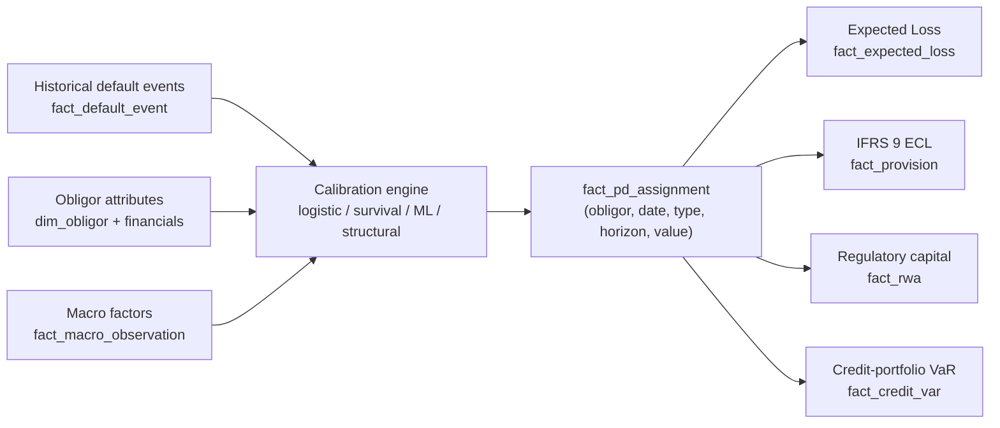
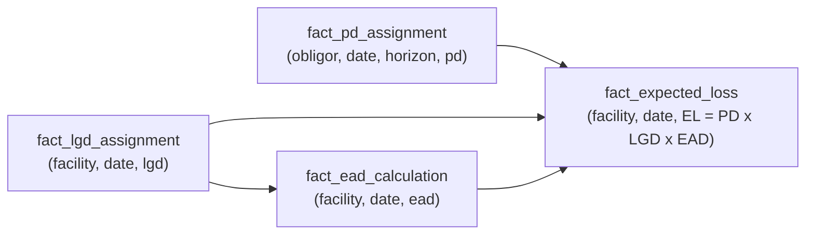

# Credit Module 7 — Probability of Default

!!! abstract "Module Goal"
    Probability of Default (PD) is the most-cited and most-debated number in credit risk. It enters expected-loss provisioning, regulatory capital, IFRS 9 staging, credit-portfolio VaR, and the daily limit conversation between the front office and the credit committee. This module treats PD as a *data* problem — how it is calibrated, how it is stored, what discipline keeps a basis-point change reproducible, and how the warehouse serves the half-dozen downstream consumers that depend on it. Modelling depth (logistic regression vs. survival vs. ML approaches) is treated only as far as the data shape demands; the deep validation territory belongs to the model-development team and is flagged as out of scope.

---

## 1. Learning objectives

By the end of this module, you should be able to:

- **Define** Probability of Default precisely, distinguish Through-the-Cycle (TTC) from Point-in-Time (PIT) PD, and pin down the sign and units convention used in your warehouse.
- **Identify** the data inputs to a PD calibration — historical default events, obligor attributes, macro state, observation-window depth — and recognise which feeds the data-engineering team owns end to end.
- **Design** the `fact_pd_assignment` table with a grain that supports regulatory capital, IFRS 9 lifetime ECL, scenario stress, and PD overrides without proliferating fact tables.
- **Recognise** the Low-Default-Portfolio (LDP) problem and the calibration patterns (pooling, Bayesian shrinkage, margin of conservatism) that the data team must surface alongside the PD figure.
- **Trace** a PD figure from rating bucket through `fact_pd_assignment` to expected loss, regulatory RWA, and IFRS 9 ECL — and reconcile the differences between them when they disagree.
- **Evaluate** the trade-offs between marginal and cumulative PD term structures and the storage shapes (long vs. wide) that serve each downstream consumer.

## 2. Why this matters

PD is the most-cited number in any credit conversation and the most-debated. A single basis point of PD movement on a USD 100 million exposure changes provisions, capital, and pricing by amounts that travel up the firm: at LGD 60% the headline expected-loss change is 100,000,000 × 0.0001 × 0.60 = USD 6,000 per year, which sounds small until you scale it across the ten thousand obligors of a typical corporate book and watch the provisioning number move by tens of millions. The same one-basis-point move flows into the Basel IRB capital formula via the asymptotic single-risk-factor model — non-linearly — and into the IFRS 9 staging classification via the Significant-Increase-in-Credit-Risk thresholds. A PD that the warehouse cannot reproduce is a number the firm cannot defend.

The data engineer's job in PD is not to build the model. That sits with the model-development quants and the model-validation function. The data engineer's job is to make sure the PD that the model produces is *audit-able* — versioned, attributed to a methodology, paired with its calibration window, traceable to the obligor attributes that drove it, reproducible at any prior business date, and consistent across the regulatory submission, the accounting close, the credit committee pack, and the scenario-stress run. Every one of those consumers reads the same `fact_pd_assignment` row through a slightly different lens; the discipline that keeps them reconcilable is exactly what this module is about.

!!! info "Honesty disclaimer"
    This module reflects general industry knowledge of PD methodology as of mid-2026. Specific model architectures (logistic regression vs. survival vs. ML approaches), calibration choices (TTC vs. PIT vs. hybrid), and regulatory validation requirements vary substantially by firm and jurisdiction. Deep model-development and validation territory is beyond this module's scope — pointers in further reading. The goal here is to give the data professional enough vocabulary and pattern recognition to support the model team without becoming one. Where the author's confidence drops on a particular topic (typically inside model-validation territory or jurisdiction-specific regulatory expectations), the module says so explicitly.

## 3. Core concepts

A reading map. Section 3.0 sets the political context. Section 3.1 pins the formal definition and the units. Section 3.2 introduces the central TTC vs. PIT distinction; almost every operational PD question reduces to "which one are we talking about?". Section 3.3 walks the data inputs to a calibration. Section 3.4 surveys the model families at the level a data engineer needs to design loaders. Section 3.5 covers the term structure of PD — the multi-horizon shape that IFRS 9 and credit VaR both demand. Section 3.6 takes on the Low-Default-Portfolio problem. Section 3.7 covers PD overrides and the audit-trail discipline they impose. Section 3.8 connects PD to migration and forward-references the rating-systems module. Section 3.9 lands on the storage shape: `fact_pd_assignment` and its relationships to the rest of the credit warehouse. Sections 3.10 and 3.11 cover the cadence and downstream-consumer landscape.

### 3.0 A reading on the politics of PD

Before the technical content, a paragraph on why PD is the most-debated number in the credit organisation. PD is *the* number on which the credit committee approves a deal; it is the input to the regulatory capital calculation that constrains how much the firm can lend; it is the input to the IFRS 9 provision that hits the income statement; it is the input to the credit-spread component of the loan or bond pricing that the front office quotes. Every one of those constituencies has incentives to push the PD in their preferred direction. Underwriters tend to argue for lower PDs (deals get approved more easily, pricing is more competitive). Regulators tend to argue for higher PDs (capital is more conservative, the firm is safer). Accountants want PDs that match observed default rates over the prior cycle (so the provision matches realised losses). Finance wants stable PDs (so the income statement does not whiplash). The model team sits in the middle of these pressures and tries to produce a number that is empirically defensible, regulatorily acceptable, and commercially functional.

The data engineer is not in the political loop, but is responsible for the artefact that the political loop debates. A `fact_pd_assignment` row that is not bitemporally faithful, that mixes pd_types, or that loses an override audit trail becomes ammunition in a debate where the data team gets blamed for the disagreement rather than the underlying methodology choice. The discipline of this module — pin every dimension, version every model, preserve every override — is what keeps the data team out of arguments it cannot win.

### 3.1 Definition

**Probability of Default** at horizon \(h\) for obligor \(i\) is the probability that obligor \(i\) experiences a default event at any time within the next \(h\) months, conditional on being non-defaulted at the start of the horizon. Two things to pin immediately:

- **Range and units.** PD is a probability in the closed interval \([0, 1]\). The convention in a credit warehouse is to store it as a decimal in that interval, and to render it for human consumption either as a percent (1.5%) or in basis points (150 bp). 1 basis point = 0.0001 = 0.01%. Loaders that store percent rather than decimal are the most common silent bug at the BI layer; pin the convention in the data dictionary and validate at write time. A typical large-corporate PD ranges from a few basis points (highly-rated investment-grade names) to a few hundred basis points (sub-investment-grade); a defaulted obligor has PD = 1; a CCC-bucket obligor in a stressed year can carry a PIT PD above 25%. The dynamic range of the column is wide, which is why most warehouses store PD with at least 8 decimal places of precision (\(1 \times 10^{-8}\) ≈ 0.0001 bp) — small enough to represent AAA names accurately, while still retaining the same precision for the high end of the range.
- **Horizon.** The default horizon is most commonly one year — the regulatory standard for Basel IRB — but **lifetime PD** is required for IFRS 9 stage 2 and stage 3 exposures (covered in detail in the upcoming IFRS 9 / CECL Provisioning module), and shorter horizons (90 days, 180 days) are sometimes used for early-warning signals. The warehouse stores the horizon explicitly as a column; it is *never* embedded in the metric name.

The default *event* itself is defined operationally — typically the Basel definition of "unlikely to pay" or "90 days past due on a material obligation", as introduced in [Credit Risk Foundations](01-credit-risk-foundations.md#31-what-is-credit-risk). The PD is the probability of *that* event over *that* horizon for *that* obligor; changing any of the three changes the number, and the warehouse must record all three.

!!! info "Definition: PD vs. default rate vs. default frequency"
    These three terms are sometimes used interchangeably, but the precise usage in a credit warehouse matters. **PD** is a *probability* — a forward-looking estimate produced by a model for a specific obligor or rating bucket. **Default rate** is the *empirical realisation* — for example, "the default rate for our BB portfolio in 2024 was 4.2%", computed as defaults / obligors in the cohort. **Default frequency** is loose synonym for default rate, more common in the rating-agency literature (S&P and Moody's publish annual *Default, Transition, and Recovery* studies whose tables are explicitly *frequencies*, not predictive PDs). The model PD is calibrated *to* historical default frequencies, but the two should never be confused at the reporting layer.

### 3.2 Through-the-cycle (TTC) vs. point-in-time (PIT)

The single most important distinction in PD methodology — and the most common source of confusion between consumers — is between Through-the-Cycle (TTC) and Point-in-Time (PIT) PD.

**Through-the-cycle (TTC) PD** is averaged over a full economic cycle. It is deliberately less sensitive to current macroeconomic conditions: a TTC PD for a BB-rated corporate is roughly the same in 2024 as it was in 2007, because both years sit somewhere in a longer-run cycle. Basel IRB's regulatory-capital framework expresses a strong preference for TTC-style PDs because the resulting capital number is stable through the cycle, which avoids procyclical capital demands at the worst possible moment (forcing banks to deleverage during a recession). In practice, "fully TTC" is an asymptote; most regulatory PDs are *hybrid*, with a strong TTC tilt and small residual PIT sensitivity. The amount of residual PIT sensitivity is a model-design choice that the supervisor reviews — too little and the PD does not respond to genuine credit deterioration; too much and the procyclicality reappears. Most large IRB banks settle on something like 70-90% TTC weight with the remainder driven by macro and obligor-specific PIT signals.

**Point-in-time (PIT) PD** reflects current macroeconomic conditions. A PIT PD for the same BB-rated corporate is materially higher in a recession than in an expansion, because the model includes contemporary GDP, unemployment, credit-spread, and other macro signals. IFRS 9 ECL is computed at PIT — the accounting standard explicitly requires forward-looking, point-in-time expectations rather than long-run averages, because the provision is meant to reflect the firm's *current* expected loss, not its long-run-average expected loss. The forward-looking requirement is operationalised through *macroeconomic scenarios* — typically three (base, upside, downside) with probability weights that combine to a probability-weighted ECL. The data engineer's implication: the PIT PD stored in `fact_pd_assignment` may be either the base-scenario PD or the probability-weighted PD, and the data dictionary must clarify which. Storing the base PD plus the scenario PDs in separate rows (with a `scenario_id` column on each) is the cleanest pattern, leaving the probability-weighted combination to the BI layer where the scenario weights are themselves visible.

Most large firms maintain *both* a TTC PD and a PIT PD for every obligor, and translate between them via either a scalar (the simple case) or a state-dependent mapping (the sophisticated case). The data engineer typically sees both flavours stored in a single `fact_pd_assignment` table with a `pd_type` discriminator column.

A point about terminology that newcomers find confusing. The phrase "TTC PD" is sometimes used loosely to mean *any* PD that is meant to be cycle-stable; in stricter usage, "TTC PD" means specifically the long-run average implied by a particular calibration window. A "stressed PD" — the PD under a defined adverse scenario, such as the CCAR severely-adverse macro path — is *not* a TTC PD; it is a *conditional* PIT PD that conditions on the stress scenario. A "downturn PD" — sometimes used in LGD discussions but applicable to PD as well — is a PIT PD evaluated at the worst-observed point in the cycle. The data dictionary should spell out the warehouse's vocabulary explicitly: the `pd_type` column is best treated as an enum whose possible values are documented and audited, not a free-text label.

A small numerical illustration of the procyclicality argument. Suppose obligor X has a long-run-average default rate of 100 bp (the TTC PD). In a benign year, the PIT PD might be 60 bp. In a stressed year, the PIT PD might be 250 bp. The regulatory capital under Basel IRB, holding everything else equal, scales (non-linearly) with PD; the IRB formula's implied capital weight at 60 bp is roughly 40% of its weight at 250 bp. Using PIT in the capital formula means the firm holds 2.5× more capital in the stress year — exactly when it can least afford to raise it, and exactly when reducing lending would worsen the cycle. The TTC anchor stabilises capital across the cycle at the cost of being less responsive to current conditions. The trade-off is regulatorily settled in favour of TTC for capital; for the income statement (IFRS 9), it is settled in favour of PIT.

A small comparison table the BI layer should keep visible:

| Aspect | TTC PD | PIT PD |
|---|---|---|
| Sensitivity to current macro | Low | High |
| Primary regulatory consumer | Basel IRB capital | IFRS 9 ECL / CECL |
| Through-cycle stability | High (the design goal) | Low (varies with cycle) |
| Typical update cadence | Annual model recalibration | Quarterly with macro overlay |
| Used for credit committee | Sometimes (anchor) | Sometimes (early warning) |
| Used for credit pricing | Sometimes (long-run cost) | Sometimes (current cost) |
| Mental model | "Average year" PD | "This year, given what we know" PD |

The translation between the two is a model in its own right and is part of the broader PIT/TTC framework that quant teams own. The data engineer's job is to (a) keep the two flavours storable in the same fact table, (b) prevent consumers from mixing them in the same aggregation, and (c) preserve the translation methodology version so that a re-run of the conversion is reproducible.

A picture of the relationship between PIT and TTC across a stylised cycle, suitable for the morning explain to a non-technical consumer:

```text
                  PD over time (basis points), one obligor across a cycle

           500 |                  *    *
                |                *        *
                |              *            *               PIT  *
                |            *                *
           300 |..........*....................*..........TTC............
                |        *                       *      ----------------
                |      *                            *
           100 |    *                                  *
                |
              0 +------+--------+--------+--------+--------+--------+--->
              expansion  late      peak     slow     trough  recovery
                         expansion           down

         The TTC line stays close to the cycle average; the PIT line
         tracks the cycle. The gap between them is the procyclicality
         that the regulator is trying to prevent in the capital number
         (TTC anchor) and the accountant is trying to capture in the
         provision (PIT estimate).
```

A practical observation on the **PIT-to-TTC mapping** itself. Three classes of approach are in production use:

- **Scalar adjustment.** The simplest: TTC PD = PIT PD × \(k\), with \(k < 1\) in stress and \(k > 1\) in benign conditions. \(k\) is calibrated such that the long-run average of TTC PD matches the long-run average default rate. Easy to implement, easy to audit, but mechanically blind to changes in cycle position.
- **Macro-state mapping.** The PIT PD is a function of macro variables (GDP, unemployment, credit spreads); the TTC PD is computed by neutralising the macro variables to their long-run averages. Equivalent to "what would PIT PD be in an average year?" and is the most common production setup.
- **Asset-correlation adjustment (the Vasicek inversion).** The most theoretically grounded: PIT and TTC PDs are linked through the asset-correlation parameter that also drives the Basel IRB capital formula. The Vasicek model maps a TTC PD and a current systemic factor realisation into a PIT PD. The data engineer rarely sees the inversion arithmetic but should know the term — it ties PD methodology to capital methodology and is the conceptual bridge between IRB capital and IFRS 9 ECL.

The methodology choice lives on a `pd_translation_method` column on `dim_pd_methodology`; the data engineer's job is to ensure the methodology version is persisted alongside every TTC and PIT pair so the consumer can verify which inversion produced which figure.

!!! warning "The number-one PD reconciliation question"
    When a credit officer says "the PD on this obligor is 80 bp", the first follow-up question is *always*: TTC or PIT? The second is: as of when? The third is: which model version? A `fact_pd_assignment` row that does not answer all three is a reconciliation problem waiting to happen.

### 3.3 PD calibration data

Even if the data team does not *build* the calibration, it owns the data pipeline that feeds it. The model team's questions are predictable:

- **Historical default events.** A binary flag per obligor per observation period: did the obligor default within the horizon. Sourced from the workout system, the credit operations team, or the firm's default master. The default definition matters: a model trained on a stricter default definition produces a lower PD than the same model trained on a looser one. The data dictionary must pin the definition.
- **Obligor characteristics at the start of the horizon.** Internal rating, sector, geography, financial ratios (leverage, interest coverage, profitability, liquidity), size band, ownership type. These are the model's *features*. They must be available *as of the start of the horizon*, not as of today — a feature snapshot that uses today's rating to predict whether an obligor that has already defaulted would default is a textbook case of look-ahead bias and silently inflates the model's apparent accuracy.
- **Macroeconomic state.** GDP growth, unemployment, credit-spread indices, equity volatility, sector-specific signals. Required for PIT models (where the macro overlay is the source of point-in-time variation) and for forward-looking IFRS 9 calibrations. Sourced from external providers (Bloomberg, Refinitiv, OECD, central banks) and joined onto the obligor panel by date.
- **Observation history depth.** Five to ten years minimum to span a full cycle. For low-default segments, the depth matters even more — a 10-year window with two recessions produces more reliable estimates than a 10-year window of pure expansion. The data engineer should know how deep the firm's panel goes and where it has gaps.

A practical observation on the bitemporal discipline. The calibration panel must be built using *as-of-historical-time* attributes, not today's attributes. This is the bitemporal pattern from [Bitemporality](../modules/13-time-bitemporality.md) applied to the calibration step: when assembling the observation row for "obligor X at the start of 2018", you need the rating, financials, sector, and macro state that were *known to the firm at the start of 2018* — not corrections that arrived two years later. A calibration loader that joins to the current dimension snapshot rather than the as-of dimension snapshot will systematically bias the model. The defensive pattern: calibration-feature joins always specify `where as_of_date <= cohort_start_date`.

A second observation on the **default flag itself**. The historical default events feed is, in theory, a binary column on the obligor panel; in practice it is a small graveyard of edge cases the data team must navigate:

- **Cures.** An obligor that triggered "90 days past due" but cured before workout is, in some firms' default definitions, *not* counted as a default (the cure period mattered). In others (typically the stricter regulatory readings) it is counted. The calibration team needs to know which.
- **Restructurings.** A distressed restructuring (interest reduction, principal forgiveness, term extension) may or may not count as a default depending on whether the restructuring resulted in a "diminished financial obligation" — a definitional call that varies by firm and jurisdiction.
- **Cross-default.** When obligor X defaults on facility A, contractual cross-default clauses may push obligor X into default on facilities B, C, D simultaneously. The default observation count then depends on whether the panel is at the obligor or the facility grain.
- **Re-defaults.** An obligor that defaulted, cured, and defaulted again should produce two events in the panel — but the "second event" is statistically dependent on the first, and most calibrations require a minimum cure-and-clean window (often 12 months) before a second default is counted as independent.

Each of these is a definitional call the calibration team makes; the data team's job is to surface the calls in the metadata, not to make them. A `fact_default_event` table whose rows do not carry a `default_definition_version` column is one re-interpretation away from breaking the calibration silently.

### 3.4 PD model families

The data engineer does not need to implement these, but should recognise them in the model documentation and understand what they imply for the calibration data shape.

- **Logistic regression on financial ratios.** The classical workhorse for corporate lending. Inputs: 5-15 financial ratios plus rating, sector, size dummies. Output: a single PD number per obligor per period. Calibration data is wide-format obligor-period rows with one column per feature. Most banks' corporate PD models still use logistic regression as either the primary engine or the challenger model, because the coefficients are interpretable and the regulator can ask "show me how this PD was produced" and get a one-page answer. The model takes the form \(\text{logit}(\text{PD}) = \beta_0 + \beta_1 x_1 + \cdots + \beta_k x_k\), which is invertible: \(\text{PD} = 1 / (1 + e^{-(\beta_0 + \sum \beta_j x_j)})\). The data team's view: a logistic model is a row of coefficients on `dim_pd_methodology` plus a per-obligor feature snapshot; reproducing the PD a year later requires both.
- **Reduced-form models.** Hazard-rate / intensity-based models, more common for traded names where market-implied default intensities can be extracted from CDS spreads or bond spreads. Calibration data is term-structure shaped: spreads at multiple tenors per name per date. These models naturally produce a PD term structure (section 3.5 below) rather than a single 1-year number.
- **Structural models.** Merton-style models that derive PD from the firm's asset value and asset volatility relative to its debt. Moody's CreditEdge / DRSK family is the canonical commercial example (covered in detail in the upcoming Moody's CreditEdge / DRSK vendor module). Calibration inputs are equity-market data, balance-sheet data, and a structural assumption about debt maturity. The output is sometimes called an EDF (Expected Default Frequency) rather than a PD, but it serves the same role.
- **Machine learning models.** Gradient-boosting trees (XGBoost, LightGBM), random forests, and increasingly neural-network models for retail and small-business segments. They typically out-perform logistic regression on raw discrimination at the cost of interpretability. Calibration data is the same wide-format obligor-period panel but with more features (often hundreds), and the methodology metadata grows accordingly — the model artefact must be persisted alongside the PD output, because reproducing the PD a year later requires reloading the exact model object.

The storage shape is identical across model families: the model produces a PD per obligor per business date, and that PD lands in `fact_pd_assignment` with a `model_version` and `model_family` tag. The downstream consumer should not need to know which family produced the number; that abstraction is the warehouse's job.

A practical observation on **model validation as a data-engineering concern**. The model-validation team — independent of the model-development team, in the second-line-of-defence sense — runs a recurring set of tests on every PD model in production. The data engineer does not run the tests, but does own the tables that feed them. The three big test families and what they need from the warehouse:

- **Discriminatory power tests.** Does the model rank-order obligors correctly — do the high-PD obligors actually default more often than the low-PD obligors? The Accuracy Ratio (AR) and the receiver-operating-characteristic Area Under Curve (AUC) are the two standard metrics. Both need a panel of `(obligor_id, predicted_pd, actual_default_within_horizon)` rows for the test window, joined across `fact_pd_assignment` and `fact_default_event`. The data engineer's job is to make this panel queryable in a single CTE.
- **Calibration tests.** Does the *level* of the PD match observed default rates? The Hosmer-Lemeshow test, the Brier score, and the binomial / Jeffreys interval tests are the standards. They need the same panel as discriminatory power but bucketed (typically into PD deciles) rather than treated obligor-by-obligor.
- **Stability tests.** Does the population the model is being applied to look like the population it was trained on? The Population Stability Index (PSI) and the Characteristic Stability Index (CSI) are the standards. They need the *feature* panel — the inputs to the model, not just the outputs — at both training time and current time. This is one reason `fact_pd_assignment` is often shadowed by a `fact_pd_features` (or similar) that captures the model inputs alongside the output.

The data team that anticipates these queries — and materialises the joined panels behind a view — saves the validation team a lot of weekly effort and earns substantial goodwill in the process.



### 3.5 The term structure of PD

A 1-year PD is a single number; a *term structure* of PD is the entire curve of cumulative default probability over multiple horizons (1y, 2y, 5y, lifetime). For most regulatory-capital uses the 1-year point is enough; for IFRS 9 lifetime ECL, the entire curve is required, because the provision must integrate expected losses across the remaining maturity of the exposure.

Two related quantities recur in the term-structure conversation:

- **Cumulative PD** over horizon \(h\): the probability of default at any point in the next \(h\) periods. Monotonically non-decreasing in \(h\) (you cannot un-default).
- **Marginal PD** for period \(t\) given survival to \(t-1\): the conditional probability of defaulting in period \(t\) given the obligor was alive at the start of period \(t\). Often roughly constant across \(t\) for a stable obligor; rises in stress; falls if the obligor's credit profile improves over the horizon.

The relationship — for discrete annual periods — is:

$$
\text{CumPD}(h) = 1 - \prod_{t=1}^{h} \big(1 - \text{MarginalPD}(t)\big)
$$

A small worked example. An obligor with a flat marginal PD of 1% per year produces:

- CumPD(1y) = 1 - 0.99 = 0.0100 = 100 bp
- CumPD(2y) = 1 - 0.99² = 0.0199 ≈ 199 bp
- CumPD(5y) = 1 - 0.99⁵ ≈ 0.0490 ≈ 490 bp
- CumPD(10y) = 1 - 0.99¹⁰ ≈ 0.0956 ≈ 956 bp

The shape is concave from above (the cumulative PD rises but at a decreasing rate per year, because the population of survivors shrinks), and asymptotes toward 1 as the horizon grows. A weaker obligor with marginal PD of 5% per year reaches CumPD(5y) ≈ 22.6% — the curve rises much more steeply.

```text
                  Cumulative PD (basis points), flat marginal 1%/yr
                  
           1000 |                                            *
                |                                       *
                |                                  *
            500 |                             *
                |                        *
                |                   *
                |              *
            100 |        *
                |   *
              0 *--+----+----+----+----+----+----+----+----+----+--->
                  1y   2y   3y   4y   5y   6y   7y   8y   9y  10y
                                       horizon
```

The data shape for the term structure has two natural representations:

- **Long format.** Rows of `(obligor_id, business_date, pd_type, horizon_months, pd_value)`. One row per (obligor, horizon) pair. Flexible — adding a new horizon is a new row, not a schema change. Joins to other facts at a specific horizon are simple. This is the recommended shape for `fact_pd_assignment`.
- **Wide format.** Rows of `(obligor_id, business_date, pd_1y, pd_2y, pd_5y, pd_lifetime)`. One row per obligor per date. Visually compact but inflexible — adding a new horizon requires altering the table, and aggregations across horizons require unpivoting. Use only at the BI presentation layer, not in the warehouse.

A practical observation on **storing marginal vs. cumulative**. The model typically produces one and the BI layer derives the other. Pick a convention — store cumulative and derive marginal, or store marginal and derive cumulative — and document it in the data dictionary. Storing both invites the inconsistency the next paragraph warns about. If you must store both for performance reasons, store them with a check constraint that the two reconcile to within a numerical tolerance, and run a daily DQ test that the constraint holds.

A second observation on **horizon units**. Express horizon in *months* rather than *years* in the warehouse. Months handle quarterly tenors (3, 6, 9, 12 months), short-horizon early-warning measures, and the long-tenor lifetime PDs (some can be 360 months for a 30-year mortgage) without fractional values. The presentation layer can convert to "1y, 5y, lifetime" labels at render time.

A third observation on the **lifetime horizon for IFRS 9**. "Lifetime" is not a single number — it is a per-facility quantity equal to the remaining contractual maturity (with adjustments for prepayment behaviour, behavioural-life models, and revolver-specific assumptions). A 30-year mortgage with 18 years remaining has a lifetime of 18 years; a 7-year corporate term loan with 4 years remaining has a lifetime of 4 years; a credit-card revolver has no contractual maturity at all and uses a behavioural lifetime (typically 5-7 years for IFRS 9 stage 2 cards). The PD term structure stored on `fact_pd_assignment` therefore needs to extend at least to the longest facility lifetime in the portfolio — for a mortgage book that means 360-month PD curves are the working horizon, even though the curve is mostly flat after the first few years.

A fourth observation on **survival modelling**. The cumulative-PD shape from the marginal-PD product is exactly the survival-curve shape from classical survival analysis (Kaplan-Meier estimator, Cox proportional-hazards regression). The connection matters because some PD models — particularly for retail mortgage portfolios — are explicitly survival models, and the data shape they produce is a survival curve per obligor rather than a single PD per obligor. The warehouse storage shape is the same (one row per horizon in `fact_pd_assignment`), but the methodology metadata grows: a `model_family = 'SURVIVAL'` row carries hazard-rate parameters rather than logit coefficients. The data engineer's role is to recognise the survival-model output and store it in the same shape as the logistic-model output, so downstream consumers see a consistent term-structure interface regardless of the underlying methodology.

### 3.6 Low-default portfolios (LDP)

Sovereigns, banks, very high-grade corporates, and certain specialised lending segments are *low-default portfolios* — segments where defaults are so rare that empirical calibration produces unstable, often zero, default-rate estimates. The Python example in section 4 makes this concrete: a synthetic AAA bucket of 80 obligor-years produces zero observed defaults, so the empirical 1-year PD is exactly 0 bp — which is structurally implausible (no obligor has zero default probability) and useless to the calibration team.

The standard mitigations are:

- **Pooling across firms or regions.** Combine data from multiple firms (via vendor consortia like S&P's CreditPro, Moody's DRD, or Fitch's data services) or across regions to get more observations per bucket. The pooled default rate is then assigned to all firms in the bucket. The data engineer's role is to understand which buckets are populated by pooled data versus internal data, and to flag the distinction in the data dictionary.
- **Bayesian shrinkage toward an expert prior.** Combine the (sparse) empirical default rate with a prior PD (set by experts or by a benchmark like rating-agency historical default tables) using a Bayesian update. The posterior PD is biased toward the prior in the LDP segments and toward the empirical rate in the well-populated segments. The shrinkage parameter is part of the methodology metadata.
- **Margin of conservatism (MoC).** A regulatory expectation under Basel IRB: when the data is sparse, add an explicit conservative buffer to the PD estimate. The MoC is documented as part of the PD model and stored on the calibration metadata. The EBA's guidelines on PD estimation (2017) formalise the categorisation of MoC components — A (data deficiency), B (methodology deficiency), C (general estimation error) — and most European IRB banks track them separately.
- **Pluto-Tasche-style upper-confidence-bound estimation.** A specific technique for LDPs that produces a conservative PD estimate from very few observations (sometimes none) by computing the upper bound of a confidence interval on the default rate. The Pluto and Tasche (2005) paper in further reading is the canonical reference and is required reading for any data engineer supporting an LDP-heavy portfolio.

The data engineer should know which obligors are in LDP segments because the *data shape* differs:

- The point estimate alone is misleading; consumers need a confidence interval (or a flag that the bucket is sparse).
- The model-version metadata may carry MoC components separately from the base PD.
- A re-calibration in an LDP segment is unusually sensitive to a single new default observation, so the warehouse may see large period-over-period PD changes that look like a bug but are actually expected.

A pragmatic rule-of-thumb: any rating bucket with fewer than 50 observed defaults across the calibration window is in LDP territory and needs special handling. The threshold varies by jurisdiction and by model methodology; check the firm's calibration document.

A second observation on LDP and **regulatory expectations**. Basel IV (the December 2017 finalisation) constrains the use of the IRB-Advanced approach for certain LDP segments — large corporates, banks, equities — pushing them back toward the Standardised Approach with prescribed risk weights. The driver is regulator scepticism about the empirical validity of bank-internal models when default observations are scarce. The data engineer's implication: even for an obligor that the bank's internal PD model can score, the regulatory capital calculation may use a different (SA-prescribed) risk weight, and the warehouse must support reporting both numbers simultaneously. The mapping from "internal PD model" to "applicable regulatory approach" lives on `dim_obligor` or on `dim_facility` and is itself a piece of reference data that the credit policy team owns.

A worked sketch of the **Pluto-Tasche upper bound** to make the technique concrete. Suppose a sovereign segment has 200 obligor-years of observation and zero observed defaults. The maximum-likelihood empirical PD is zero, which is structurally wrong. Pluto-Tasche asks instead: *what is the largest PD consistent with the observation of zero defaults at a 90% confidence level?* For \(n = 200\) and \(d = 0\) defaults at confidence \(\gamma = 0.90\), the upper bound is approximately \(1 - (1 - \gamma)^{1/n} = 1 - 0.1^{1/200} \approx 0.0115\) — about 115 bp. Far higher than the empirical zero, far lower than a CCC-bucket PD, and conservative in the regulator-preferred sense. The 50-bp "implausible-zero" region the LDP framework worries about is exactly where the technique earns its keep. The data engineer's role: store the upper-bound estimate in `effective_pd`, the corresponding lower bound (zero in this case) in `pd_lower_ci`, and flag the calibration method on `dim_pd_methodology` so the consumer knows why the figure is what it is.

### 3.7 PD overrides

When the credit committee disagrees with the model, they can *override* the model PD. This is universal practice — every IRB-approved bank's PD framework includes an override mechanism, and the override governance is one of the most-audited parts of the model framework.

The data shape needs to capture both numbers and the audit trail:

- **Model-output PD.** The PD the model produced before any human intervention. Stored unmodified.
- **Override PD.** The PD the credit committee approved, if different from the model output. Stored alongside the model PD.
- **Override reason code.** A controlled vocabulary (e.g. "INDUSTRY_OUTLOOK_NEGATIVE", "MANAGEMENT_QUALITY", "LITIGATION_RISK", "GOVERNMENT_SUPPORT_REMOVED") rather than free text. The reason codes themselves are governed and audited.
- **Approver and approval timestamp.** Who approved, when, and under what authority (some overrides require committee sign-off, others only the senior credit officer).
- **An effective-flag** indicating which PD downstream consumers should use — almost always the override when one exists, but the warehouse should make the choice explicit rather than implicit.

A first-cut DDL for the override columns (extending `fact_pd_assignment`):

```sql
-- Override-related columns layered onto fact_pd_assignment
model_pd                NUMERIC(10, 8) NOT NULL,   -- the raw model output, in [0, 1]
override_pd             NUMERIC(10, 8),            -- NULL when no override
override_reason_code    VARCHAR(64),               -- NULL when no override
override_approver_id    VARCHAR(64),               -- NULL when no override
override_approved_at    TIMESTAMP WITH TIME ZONE,  -- NULL when no override
effective_pd            NUMERIC(10, 8) NOT NULL,   -- override_pd if not null else model_pd
```

The audit-relevant data point is *both* values — the model PD and the override PD — together with the reason. A regulatory submission that uses the model PD when the credit committee approved a different number is a misstatement; a submission that uses the override without a documented reason is also a misstatement. The data team's job is to make both numbers and the override metadata available so the downstream consumer can pick the right one for the report.

A forward link: the broader pattern of model output, override, and approved value is generic across credit risk — LGD has the same shape, internal ratings have the same shape, watchlist classifications have the same shape. The Rating Systems & Migration module (covered in detail in the upcoming Rating Systems & Migration module) treats the rating-override pattern as a special case and discusses the governance hierarchy across the override types.

### 3.7a A small worked example of an override

To make the override pattern concrete, walk through a scenario. The model produces a PD of 35 bp for obligor *DeltaCorp*, business_date 2026-04-30, pd_type TTC, horizon_months 12, model_version `CORP_LOGIT_V7`. The credit committee meets on 2026-05-02 and reviews DeltaCorp because of a recent legal-settlement disclosure that the model's financial-ratio inputs do not capture. The committee approves an override to 80 bp with reason code `LITIGATION_RISK`. The decision is documented in the credit-committee minutes and an entry is made in the override system that flows to the warehouse overnight.

The resulting `fact_pd_assignment` rows for DeltaCorp on business_date 2026-04-30 — assuming the warehouse uses the bitemporal append-only pattern — look like:

| obligor_id | business_date | pd_type | horizon_months | model_pd | override_pd | reason_code | effective_pd | model_version | as_of_timestamp |
|---|---|---|---|---|---|---|---|---|---|
| DELTA01 | 2026-04-30 | TTC | 12 | 0.0035 | NULL | NULL | 0.0035 | CORP_LOGIT_V7 | 2026-05-01 03:00 UTC |
| DELTA01 | 2026-04-30 | TTC | 12 | 0.0035 | 0.0080 | LITIGATION_RISK | 0.0080 | CORP_LOGIT_V7 | 2026-05-03 02:30 UTC |

Two rows, same natural key, two different `as_of_timestamp` values. The first row was written overnight on 1 May before the committee met; the second row was written overnight on 3 May after the committee approved the override. A "current view" query reading the latest as-of returns the override row (effective_pd = 80 bp). A "what did we report on 2 May?" query filtering `as_of_timestamp <= 2026-05-02 23:59 UTC` returns the original row (effective_pd = 35 bp). Both queries are correct; the bitemporal pattern preserves both views without ambiguity.

A subtlety: the override approval timestamp (when the committee actually approved) and the warehouse `as_of_timestamp` (when the row was written) typically differ by hours, not days. Some firms also store the override approval timestamp on the row itself (`override_approved_at`), so that a forensic query can ask "what overrides were approved between two dates regardless of when the warehouse picked them up?". That is the recommended pattern when the credit-committee approval cycle and the warehouse batch cycle are governed independently.

### 3.8 PD migration and rating moves

When an obligor moves between PD buckets — usually because of a rating change, but also possibly because of a model recalibration — that movement is itself a credit event. The `fact_rating_history` table (covered in detail in the upcoming Credit Fact Tables module) captures the rating moves, and the migration matrix used in credit-portfolio VaR is derived from this history.

Two engineering points worth pinning here:

- **A rating change is *not* the same as a recalibration.** A rating change reflects new information about the obligor (a downgrade because of weak earnings, an upgrade because of deleveraging). A recalibration reflects new information about the *model* (the calibration team has refit the model on a longer or fresher data window). Both move the PD; both should be captured; the warehouse must distinguish them so that "PD changed because of obligor X" is separable from "PD changed because the model was retrained".
- **Migration matrices live in their own fact.** A migration matrix is the empirical (or fitted) probability of moving from rating R at time t to rating R' at time t+1, aggregated across the obligor universe. It is not stored on `fact_pd_assignment`; it lives on a separate `fact_rating_migration_matrix` whose grain is `(from_rating, to_rating, business_date, horizon_months, model_version)`. The matrix is consumed by the credit-portfolio VaR engine (covered in detail in the upcoming Unexpected Loss & Credit VaR module).

A worked example of a tiny migration matrix to keep the shape concrete. Suppose a 5-bucket master scale (AAA, A, BBB, BB, CCC) and a 1-year empirical matrix:

| from \ to | AAA | A | BBB | BB | CCC | Default |
|---|---|---|---|---|---|---|
| AAA | 0.92 | 0.07 | 0.01 | 0.00 | 0.00 | 0.0001 |
| A | 0.02 | 0.90 | 0.07 | 0.01 | 0.00 | 0.0010 |
| BBB | 0.00 | 0.05 | 0.88 | 0.06 | 0.01 | 0.0050 |
| BB | 0.00 | 0.01 | 0.07 | 0.82 | 0.08 | 0.0200 |
| CCC | 0.00 | 0.00 | 0.01 | 0.06 | 0.68 | 0.2500 |

Each row sums to 1 (every obligor must end up somewhere — staying, migrating, or defaulting). The diagonal is the *staying* probability — the fact that BB stays BB with 82% probability, more than any other outcome, is the well-documented "stickiness" of ratings. The Default column is the 1-year PD by current rating bucket — and it should match the corresponding `fact_pd_assignment` row for an empirical TTC PD calibrated on the same data window. Reconciliation of `fact_rating_migration_matrix.Default` against `fact_pd_assignment.effective_pd` for matching rating buckets is one of the basic sanity checks every credit warehouse should run nightly.

### 3.9 Storage shape: `fact_pd_assignment`

Pulling everything together, the recommended `fact_pd_assignment` shape:

```sql
CREATE TABLE fact_pd_assignment (
    obligor_id              VARCHAR(64)              NOT NULL,
    business_date           DATE                     NOT NULL,
    pd_type                 VARCHAR(8)               NOT NULL,    -- 'TTC' or 'PIT'
    horizon_months          SMALLINT                 NOT NULL,    -- 12, 24, 60, 360, ...
    pd_horizon_basis        VARCHAR(16)              NOT NULL,    -- 'CUMULATIVE' or 'MARGINAL'
    model_pd                NUMERIC(10, 8)           NOT NULL,
    override_pd             NUMERIC(10, 8),
    override_reason_code    VARCHAR(64),
    override_approver_id    VARCHAR(64),
    override_approved_at    TIMESTAMP WITH TIME ZONE,
    effective_pd            NUMERIC(10, 8)           NOT NULL,
    pd_lower_ci             NUMERIC(10, 8),                       -- for LDP segments
    pd_upper_ci             NUMERIC(10, 8),                       -- for LDP segments
    model_version           VARCHAR(32)              NOT NULL,
    model_family            VARCHAR(32)              NOT NULL,    -- LOGIT / SURVIVAL / ML / STRUCTURAL
    calibration_method      VARCHAR(32)              NOT NULL,    -- TTC / PIT / HYBRID / POOLED / SHRUNK
    source_system           VARCHAR(32)              NOT NULL,
    as_of_timestamp         TIMESTAMP WITH TIME ZONE NOT NULL,
    valid_from              TIMESTAMP WITH TIME ZONE NOT NULL,
    valid_to                TIMESTAMP WITH TIME ZONE,
    PRIMARY KEY (obligor_id, business_date, pd_type, horizon_months, as_of_timestamp),
    CHECK (model_pd      BETWEEN 0 AND 1),
    CHECK (effective_pd  BETWEEN 0 AND 1),
    CHECK (override_pd IS NULL OR override_pd BETWEEN 0 AND 1)
);
```

A few design observations on this shape:

- **The grain is `(obligor_id, business_date, pd_type, horizon_months, as_of_timestamp)`.** One obligor on one business date can have multiple rows: one for TTC 1y, one for PIT 1y, one for PIT 2y, one for PIT lifetime, etc. The `as_of_timestamp` axis enables bitemporal restatement — a corrected PD for a historical date appends a new row with a later `as_of_timestamp`, leaving the original queryable.
- **The bitemporal columns** (`as_of_timestamp`, `valid_from`, `valid_to`) follow the pattern from MR Module 13. The "current" view query takes the latest `as_of_timestamp` per natural key; the "as-of-prior-date" view filters on `valid_from <= prior_date < COALESCE(valid_to, '9999-12-31')`.
- **`effective_pd` is materialised as a column**, not computed in the BI layer. The cost is a few bytes per row; the benefit is that downstream consumers join on a single column rather than a CASE expression, and the override-vs-model logic is centralised in the loader.
- **The confidence-interval columns** are nullable because they only apply to LDP segments. A non-null `pd_upper_ci` is the warehouse's signal to the consumer that the point estimate has wide uncertainty.
- **`model_version` and `calibration_method`** are mandatory because they define the methodology that produced the PD. A re-calibration produces a new `model_version` and an append of new rows; the prior rows are not deleted, so historical reproductions remain valid.

A second-order observation on **partitioning and indexing**. `fact_pd_assignment` is read overwhelmingly with `business_date` as the leading filter (today's PD, last quarter's PD, the regulator's submission-date PD), so partitioning on `business_date` is the obvious choice. Within a partition, the dominant access pattern is "all PDs for one obligor across the term structure" or "all 1-year TTC PDs across all obligors", which suggests clustering on `obligor_id` with a secondary sort on `(pd_type, horizon_months)`. The `as_of_timestamp` column is the bitemporal axis and should not be in the cluster key — it is filtered with `MAX()` in the latest-as-of CTE pattern, and including it in the cluster destabilises clustering after restatements. If your warehouse engine supports zone maps or column statistics, the natural-key columns plus `as_of_timestamp` should all carry them.

A third observation on **row-level retention**. The bitemporal append-only pattern means `fact_pd_assignment` grows monotonically; a typical bank with 50,000 obligors, two `pd_type` values, four horizons, daily partitions, and a 7-year retention horizon ends up with on the order of 50,000 × 2 × 4 × 250 × 7 = ~700 million rows for the base data, plus restatements. That is comfortable for a modern columnar warehouse but uncomfortable for a row-oriented OLTP store; the credit-PD fact almost always lives in the analytic warehouse rather than the transactional core. Aggregation patterns ([Performance & Materialisation](../modules/17-performance-materialization.md)) — pre-aggregating PD-weighted exposure to the rating-bucket grain, for example — apply here as they do in market risk.

### 3.10 PD in the broader fact-table picture

PD is one of three drivers (with LGD and EAD) that combine into expected loss via the identity from [Credit Risk Foundations §3.3](01-credit-risk-foundations.md). The fact-table consequence: `fact_pd_assignment` is one of three sibling fact tables that join into `fact_expected_loss` at the obligor (or facility) grain. Each driver has its own model lineage, its own override mechanism, its own bitemporal stamp, and its own update cadence — and the EL fact joins them at the appropriate as-of timestamps to produce a reconciled number.

A second observation on the **interaction between PD and EAD term structures**. For a 1-year EL on a fully-drawn term loan, the PD and EAD are both single numbers and the multiplication is trivial. For a multi-year EL on a revolving facility, both PD and EAD have term structures: the PD curve gives the cumulative default probability across years, and the EAD profile gives the projected exposure across years (revolvers tend to draw down more as the obligor approaches default — the "facility migration" effect). The lifetime EL is then an integral over the joint term structure, not a product of two scalars. The data shape in `fact_pd_assignment` and the upcoming EAD module's `fact_ead_calculation` must align on the horizon column to support this integration.

A diagram of the join shape, simplified:



The detailed treatment of LGD, EAD, and the EL combination sits in the upcoming Loss Given Default, Exposure at Default, and Expected Loss modules.

### 3.10a A note on the cadence of PD updates

Three update cadences operate on `fact_pd_assignment` simultaneously, and the orchestration is more involved than the daily-batch rhythm of a market-risk fact:

- **Event-driven updates.** When a credit event occurs — a rating change, an override approval, a new financial filing — the affected obligor's PD updates immediately on the day of the event. A single intra-day trigger appends a new row with the current `as_of_timestamp` and the new `effective_pd`. Most banks process these in near-real-time so the downstream limit-utilisation report reflects the change within hours.
- **Periodic recalculation.** Even without an event, the PIT PD updates with the macro overlay — typically monthly or quarterly. The macro feed (GDP, unemployment, credit-spread index) refreshes; the PIT model re-runs across the entire portfolio; new rows append to `fact_pd_assignment` with the new `as_of_timestamp` and the recomputed `effective_pd`. The TTC PD changes much less often (only on rating moves or model recalibrations).
- **Model recalibration.** The model itself is refit on a new training window — typically annually under Basel IRB, sometimes more often for IFRS 9 PIT models. A recalibration produces a new `model_version` and a wholesale refresh of `fact_pd_assignment` for the entire portfolio. Crucially, the prior `model_version` rows are *not* deleted — they remain queryable for back-testing and for the audit trail, and any historical EL or capital number can be reproduced under either the old or the new model.

A single Monday's batch on a credit-PD warehouse therefore involves all three layers running concurrently: today's event-driven updates from the credit-operations system, this month's PIT macro refresh if it is the first business day of the month, and (rarely) the new annual model output if a recalibration has just been published. The orchestration must respect dependencies — the event-driven update has to know whether to write against the old or new model — and the data dictionary must make the version semantics explicit so consumers can read the right rows.

A practical warning on the **annual recalibration day**. When a new model version is published, the entire `fact_pd_assignment` table effectively doubles in row count for the publish day (every obligor gets a new row under the new model version, while the old rows remain). Downstream queries that read "the latest PD per obligor" continue to work as long as the latest-as-of CTE pattern is in place, but queries that group by `model_version` see a step change in row counts. The risk-data pipeline must communicate the publication day clearly in advance — the morning consumer who notices "today's PD numbers are different from yesterday's, with no portfolio change" should not be surprised; the publication day is on the calendar.

### 3.11 Where PD enters every other report

A useful exercise for the data engineer joining the credit team: list every report that consumes a PD figure, and trace back to which row of `fact_pd_assignment` it reads. The list is longer than newcomers expect:

- **Daily credit-committee pack.** Reads the latest TTC and PIT PDs for the largest obligors and the watchlist. Display: rating bucket, PD, change versus prior month.
- **Origination credit memo.** Reads the candidate obligor's TTC PD (and, increasingly, the PIT PD) to support the underwriter's recommendation. Forward-looking: the PD becomes part of the memo and persists into the approved-facility record.
- **Limit-utilisation report.** Single-name and concentration limits are often expressed as PD-weighted-exposure bands (e.g. "no more than 5% of capital exposed to single names with PD > 100 bp"). The report joins exposure to the latest PD per obligor.
- **Pricing engine.** New-business pricing for loans and bonds includes a credit-spread component derived from the PD (typically the PIT PD plus a margin). The pricing system reads PD on demand at quote time.
- **IFRS 9 ECL run (monthly).** Reads the entire PIT PD term structure for every facility, integrates EL across the lifetime, and writes to `fact_provision`. This is the heaviest single consumer in row-volume terms.
- **Regulatory-capital run (quarterly).** Reads the TTC 1-year PD, applies the Basel IRB asset-correlation formula, and produces RWA. Writes to `fact_rwa`.
- **Stress-testing run (quarterly to annual).** Reads the base PD, applies a scenario-driven shift, and re-runs the EL and capital arithmetic. Writes to `fact_stress_loss`.
- **Credit-portfolio VaR run (daily to monthly).** Reads PDs across the entire portfolio plus a migration matrix and a correlation structure, simulates the loss distribution, and writes a tail-loss number to `fact_credit_var`.
- **Pillar 3 disclosure (annual).** Reads PDs at the rating-bucket grain for the regulatory-disclosure-mandated breakdowns. The PDs disclosed are TTC, point-in-time as of year-end, and accompanied by realised default rates for back-testing.
- **External rating-agency questionnaires.** The agency wants the bank's internal PDs alongside the agency's external ratings, to triangulate.
- **Internal-audit reviews and supervisory examinations.** Both run periodic deep-dive reviews of the PD pipeline. They do not consume PDs *operationally*, but they do consume the lineage — for any given PD figure, who computed it, when, with what model, with what overrides, against what calibration. The warehouse is the canonical evidence source for both.
- **Front-office relationship-manager dashboards.** The relationship manager wants to see "their" obligors' PDs, watchlist status, and recent moves to anticipate client conversations. Read-only, but high-frequency.

Ten distinct consumers, all reading the same fact table through slightly different filters. The discipline of the warehouse — pinning `pd_type`, `horizon_months`, `as_of_timestamp`, and `model_version` on every read — is what keeps the ten consumers reading consistent numbers. A warehouse without that discipline produces ten consumers with ten different versions of "the PD" and a reconciliation meeting every Friday afternoon.

### 3.12 Where the data engineer should *not* go

A closing observation on scope. The data team's job is to source, store, version, and serve the PD. The model team's job is to build, calibrate, validate, and approve the PD. A data engineer who tries to second-guess the model team — "your PD looks high for this obligor, can we adjust it?" — is stepping outside the domain and outside the audit boundary. The right channel for a number-quality concern is to file a data-quality issue against the PD figure with evidence (the obligor's recent rating moves, the macro state, the override history) and let the model team triage it.

The reverse boundary is also worth respecting: the model team often has opinions about the warehouse design (the grain, the bitemporal pattern, the override columns) that should be heard but not necessarily implemented. A model team that asks for "just store the PD and don't worry about the override metadata" is asking the warehouse to lose audit fidelity that the regulator will eventually need. The data team's job is to push back politely and explain why the discipline matters.

The healthy pattern: a weekly meeting between the model team and the data team to review the PD pipeline, with both sides committed to staying inside their scope. Most production credit-PD frictions trace back to a moment when one or both sides crossed the line.

A related note on **vendor models**. Some firms use vendor-supplied PD models — Moody's CreditEdge / DRSK (covered in detail in the upcoming Moody's CreditEdge / DRSK vendor module), S&P Capital IQ's RatingsDirect-derived PDs, Bloomberg's DRSK equivalent. These produce a PD per obligor per business date that lands in the warehouse exactly the same way as an internally-computed PD, with the `model_family` column set to identify the vendor and the `model_version` column carrying the vendor's release identifier. The data engineer should not treat vendor PDs as a "black box that we trust"; they should be loaded with the same bitemporal discipline, the same override mechanism, and the same validation panel as internal PDs. The vendor is an upstream source, not an exemption from the warehouse's controls.

A note on **what a "good" PD warehouse looks like in practice**. A handful of operational tests, run nightly, catch most of the failure modes this module has discussed:

1. **Range check.** Every `effective_pd` is in [0, 1]. Any row failing the check is rejected at write time.
2. **Type completeness.** Every obligor that has a TTC PD also has a PIT PD for the same business date. Missing pairs surface a calibration-pipeline gap.
3. **Term-structure monotonicity.** Cumulative PD is non-decreasing in horizon for any (obligor, business_date, pd_type). A non-monotonic curve is a model bug.
4. **Bitemporal coherence.** Joining `fact_pd_assignment` to `fact_exposure` at the same `as_of_timestamp` returns the same row count as the join at the latest as-of. Mismatches signal a restatement that needs reconciliation.
5. **Override reconciliation.** Every row with a non-null `override_pd` has a non-null `override_approver_id`, `override_reason_code`, and `override_approved_at`. Missing audit trail surfaces a governance gap.
6. **Model-version coverage.** Every active obligor has at least one row under the current production `model_version`. Obligors stuck on an old model surface a calibration-coverage gap.

A nightly summary report that lists pass/fail counts for each test is the cheapest insurance the data team can buy against PD-related credit-committee surprises.

7. **Realised-default backtest.** For each rating bucket, the cumulative observed default rate over the prior 12 months should fall within a one- or two-sided confidence band around the latest TTC PD. Persistent breaches surface model-calibration drift.
8. **Override staleness check.** Every active override has been reviewed within the firm's policy window (typically 12 months). Stale overrides surface a governance lapse.

A final observation on the **glossary**. Several terms introduced in this module — TTC PD, PIT PD, marginal PD, cumulative PD, LDP, override, MoC, Pluto-Tasche, asset correlation — recur across the rest of the credit track. They are entered in the [shared glossary](../glossary.md) and a future glossary refresh will add the items this module introduces. When in doubt about a term's precise meaning, the glossary is the canonical answer.

## 4. Worked examples

### Example 1 — Python: empirical PD calibration from cohort data

The first example walks through an empirical 1-year PD calibration on a synthetic cohort dataset. The goal is twofold: to make the basic calibration arithmetic explicit, and to expose the Low-Default-Portfolio problem in miniature — the AAA bucket will produce zero observed defaults across the entire window, which is the structural failure mode that motivates Bayesian shrinkage in production.

```python
--8<-- "code-samples/python/c07-empirical-pd.py"
```

A reading guide. The synthetic dataset is intentionally small — five buckets and five years — so the LDP failure mode is visible at a glance rather than buried in noise. Real production calibrations operate on tens of thousands of obligor-years across 15-25 rating buckets, but the same pathology applies in the AAA/AA region. The script does five things:

1. **Builds a synthetic cohort.** Five rating buckets (AAA, A, BBB, BB, CCC) × five years (2021-2025) × 10-20 obligors per cell. Each cell's defaults are drawn from a Bernoulli with the bucket's *true* PD (1 bp for AAA, 25% for CCC). The seed is fixed so the run is reproducible.
2. **Computes the per-(bucket, year) default rate.** The rate is just `n_defaults / n_obligors` in the cell. Most cells produce 0%; the CCC cells produce 14-35% defaults; the BBB and BB cells produce occasional non-zero rates.
3. **Aggregates to the bucket level in two ways.** The `pd_avg` is the simple average of yearly rates (equal weight per year — the classical TTC estimator). The `pd_pooled` is total defaults / total obligor-years (weighted by cell size). The two numbers diverge when cell sizes vary; reporting both is the honest answer when the calibration team and BI team need to agree on a single figure.
4. **Pivots the per-year matrix for human reading.** A 5×5 grid of bucket × year default rates; the empty cells make the LDP problem visible.
5. **Flags the LDP collapse.** When a bucket has zero observed defaults across the entire window, the empirical estimator is structurally inadequate — a 0 bp PD is not a meaningful estimate, it is an artefact of the small sample. The print statement is the in-line equivalent of the data-quality flag the warehouse should attach to the row.

A few implementation choices in the script worth pointing out:

- **Seed pinning.** `np.random.default_rng(seed=42)` ensures the dataset is reproducible run-to-run. In production calibration code the seed should be persisted alongside the synthetic-data run; in test/QA scaffolding (which is what this script effectively is) the seed is fine to hard-code.
- **`@dataclass(frozen=True)`.** The result container is immutable. Empirical-PD outputs are produced once and read many times; immutability prevents downstream code from mutating the calibration result and silently rewriting history.
- **Two bucket-level statistics.** `pd_avg` and `pd_pooled` are reported side-by-side rather than chosen. Production calibration code will pick one (typically `pd_pooled` for unbalanced cells, `pd_avg` for symmetric panels), but at the diagnostic stage seeing both surfaces the cell-size-imbalance question.
- **Categorical bucket ordering.** The script enforces an explicit AAA → A → BBB → BB → CCC order rather than relying on lexicographic sort. Rating-bucket ordering in BI output is always a custom enum, never an alphabetical sort.

A representative run produces output like:

```text
Synthetic cohort: 383 obligor-years across 5 buckets and 5 years.

Per-bucket per-year default rates
---------------------------------
observation_year    2021    2022  2023    2024    2025
rating_bucket
AAA               0.0000  0.0000  0.00  0.0000  0.0000
A                 0.0000  0.0000  0.00  0.0000  0.0000
BBB               0.0000  0.0769  0.00  0.0000  0.0000
BB                0.0000  0.0000  0.00  0.0909  0.0000
CCC               0.3077  0.1429  0.35  0.2500  0.2308

Bucket-level empirical PDs (TTC-style)
--------------------------------------
  AAA   defaults=  0/79    pd_avg=     0.0 bp   pd_pooled=     0.0 bp
  A     defaults=  0/72    pd_avg=     0.0 bp   pd_pooled=     0.0 bp
  BBB   defaults=  1/74    pd_avg=   153.8 bp   pd_pooled=   135.1 bp
  BB    defaults=  1/78    pd_avg=   181.8 bp   pd_pooled=   128.2 bp
  CCC   defaults= 21/80    pd_avg=  2562.6 bp   pd_pooled=  2625.0 bp
```

The CCC bucket's empirical PD (≈ 2,500-2,600 bp) is in the right neighbourhood of the true PD (2,500 bp) — five years × ~16 obligors × 25% true PD gives plenty of defaults to anchor the estimator. The AAA and A buckets produce 0 bp — clearly wrong, because no obligor has zero default probability. Even the BBB and BB buckets, with a *single* observed default each, produce wildly different `pd_avg` and `pd_pooled` values (181.8 vs. 128.2 bp for BB) — a single observation can shift the estimator by 50 bp, which is not a good sign for stability.

A useful follow-on numerical exercise that the script does not perform but the reader should run mentally: apply the Pluto-Tasche upper bound from §3.6 to the AAA bucket. With \(n = 79\) obligor-years and \(d = 0\) defaults at confidence \(\gamma = 0.90\), the bound is \(1 - 0.1^{1/79} \approx 0.029\) — about 290 bp. That is dramatically higher than the CCC bucket's pooled empirical PD might be in a benign year, and it surfaces the asymmetry the regulator wants visible: when you have *no data* the conservative estimate is large precisely because the data does not support a smaller one. Production calibrations for AAA segments typically combine the Pluto-Tasche bound with rating-agency long-run data (S&P or Moody's AAA 1-year default frequencies are around 0.005% per year — half a basis point) to produce a final estimate somewhere between the two: high enough to be defensible against the LDP critique, low enough to reflect the actual long-run behaviour of AAA names.

The production fix in any of these segments is the LDP toolkit from §3.6: pool with peer firms via vendor data (CreditPro, DRD), shrink toward a rating-agency long-run prior, or apply the Pluto-Tasche upper confidence bound. The data engineer's job is to flag which buckets used which technique on the `fact_pd_assignment` row, so that a downstream report can disclose "this PD reflects pooled data from a 30-firm consortium" rather than implying it is a pure empirical estimate.

### Example 2 — SQL: PD-weighted expected loss by rating bucket

The second example computes a 12-month expected loss aggregated by rating bucket, joining a `fact_exposure` table to a `fact_pd_assignment` table to a `dim_obligor` rating dimension. This is the canonical downstream use of the PD fact and exposes the most common reconciliation gotchas.

A minimal schema:

```sql
CREATE TABLE dim_obligor (
    obligor_id          VARCHAR(64) PRIMARY KEY,
    obligor_name        VARCHAR(256) NOT NULL,
    rating_bucket       VARCHAR(8)   NOT NULL,
    sector              VARCHAR(32),
    country             VARCHAR(2)
);

CREATE TABLE fact_exposure (
    obligor_id          VARCHAR(64)              NOT NULL,
    business_date       DATE                     NOT NULL,
    ead_usd             NUMERIC(18, 2)           NOT NULL,
    lgd_estimate        NUMERIC(6, 4)            NOT NULL,
    as_of_timestamp     TIMESTAMP WITH TIME ZONE NOT NULL,
    PRIMARY KEY (obligor_id, business_date, as_of_timestamp)
);

CREATE TABLE fact_pd_assignment (
    obligor_id          VARCHAR(64)              NOT NULL,
    business_date       DATE                     NOT NULL,
    pd_type             VARCHAR(8)               NOT NULL,
    horizon_months      SMALLINT                 NOT NULL,
    effective_pd        NUMERIC(10, 8)           NOT NULL,
    model_version       VARCHAR(32)              NOT NULL,
    as_of_timestamp     TIMESTAMP WITH TIME ZONE NOT NULL,
    PRIMARY KEY (obligor_id, business_date, pd_type, horizon_months, as_of_timestamp)
);
```

A small set of sample rows for a single business date:

```sql
INSERT INTO dim_obligor VALUES
    ('OBL001', 'AlphaCorp Industries',     'AAA', 'INDUSTRIAL',    'US'),
    ('OBL002', 'Beta Manufacturing',       'A',   'INDUSTRIAL',    'US'),
    ('OBL003', 'Gamma Holdings',           'BBB', 'FINANCIAL',     'GB'),
    ('OBL004', 'Delta Energy',             'BB',  'ENERGY',        'CA'),
    ('OBL005', 'Epsilon Trading',          'CCC', 'TRADING',       'SG');

INSERT INTO fact_exposure VALUES
    ('OBL001', DATE '2026-05-07',  50000000.00, 0.40, TIMESTAMP '2026-05-08 02:00 UTC'),
    ('OBL002', DATE '2026-05-07', 120000000.00, 0.45, TIMESTAMP '2026-05-08 02:00 UTC'),
    ('OBL003', DATE '2026-05-07',  35000000.00, 0.50, TIMESTAMP '2026-05-08 02:00 UTC'),
    ('OBL004', DATE '2026-05-07',  18000000.00, 0.60, TIMESTAMP '2026-05-08 02:00 UTC'),
    ('OBL005', DATE '2026-05-07',   4000000.00, 0.70, TIMESTAMP '2026-05-08 02:00 UTC');

INSERT INTO fact_pd_assignment VALUES
    ('OBL001', DATE '2026-05-07', 'TTC', 12, 0.00010000, 'CORP_LOGIT_V7', TIMESTAMP '2026-05-08 03:00 UTC'),
    ('OBL002', DATE '2026-05-07', 'TTC', 12, 0.00080000, 'CORP_LOGIT_V7', TIMESTAMP '2026-05-08 03:00 UTC'),
    ('OBL003', DATE '2026-05-07', 'TTC', 12, 0.00250000, 'CORP_LOGIT_V7', TIMESTAMP '2026-05-08 03:00 UTC'),
    ('OBL004', DATE '2026-05-07', 'TTC', 12, 0.01200000, 'CORP_LOGIT_V7', TIMESTAMP '2026-05-08 03:00 UTC'),
    ('OBL005', DATE '2026-05-07', 'TTC', 12, 0.18000000, 'CORP_LOGIT_V7', TIMESTAMP '2026-05-08 03:00 UTC');
```

The query — total 12-month EL per rating bucket as of 2026-05-07, using TTC PDs:

```sql
WITH latest_pd AS (
    SELECT
        obligor_id,
        business_date,
        pd_type,
        horizon_months,
        effective_pd,
        model_version,
        ROW_NUMBER() OVER (
            PARTITION BY obligor_id, business_date, pd_type, horizon_months
            ORDER BY as_of_timestamp DESC
        ) AS rn
    FROM fact_pd_assignment
    WHERE business_date  = DATE '2026-05-07'
      AND pd_type        = 'TTC'
      AND horizon_months = 12
),
latest_exposure AS (
    SELECT
        obligor_id,
        business_date,
        ead_usd,
        lgd_estimate,
        ROW_NUMBER() OVER (
            PARTITION BY obligor_id, business_date
            ORDER BY as_of_timestamp DESC
        ) AS rn
    FROM fact_exposure
    WHERE business_date = DATE '2026-05-07'
)
SELECT
    o.rating_bucket,
    COUNT(DISTINCT o.obligor_id)                         AS n_obligors,
    SUM(e.ead_usd)                                       AS total_ead_usd,
    SUM(e.ead_usd * e.lgd_estimate * p.effective_pd)     AS total_el_usd
FROM       dim_obligor      o
INNER JOIN latest_exposure  e ON e.obligor_id = o.obligor_id  AND e.rn = 1
LEFT  JOIN latest_pd        p ON p.obligor_id = o.obligor_id  AND p.rn = 1
WHERE p.effective_pd IS NOT NULL
GROUP BY o.rating_bucket
ORDER BY o.rating_bucket;
```

The expected output:

| rating_bucket | n_obligors | total_ead_usd | total_el_usd |
|---|---|---|---|
| AAA | 1 | 50,000,000 | 2,000 |
| A | 1 | 120,000,000 | 43,200 |
| BBB | 1 | 35,000,000 | 43,750 |
| BB | 1 | 18,000,000 | 129,600 |
| CCC | 1 | 4,000,000 | 504,000 |

The CCC obligor — with one-tenth the EAD of the AAA obligor — produces 250 times the expected loss, because its PD is 1,800 times larger. This is the mechanical consequence of the EL = PD × LGD × EAD identity and is the reason credit committees scrutinise the lower-rated tail of the book disproportionately.

A walkthrough of the gotchas the query handles:

- **Bitemporal "latest as-of" join.** Both `fact_exposure` and `fact_pd_assignment` are bitemporal; the `ROW_NUMBER() OVER (... ORDER BY as_of_timestamp DESC)` CTEs select the latest version of each natural key. A naive join without this would duplicate rows when the warehouse contains multiple `as_of_timestamp` values per business date (which it always does after the first restatement).
- **Which `pd_type` to use.** This query uses TTC PDs because the consumer is the regulatory-capital report. An IFRS 9 ECL query would filter `pd_type = 'PIT'` instead, and would aggregate over a horizon longer than 12 months for stage 2/3 exposures. The `pd_type` filter is *load-bearing* — running this query without it would produce duplicate rows (one per pd_type) and silently double-count the EL.
- **NULL PD handling.** The `LEFT JOIN ... WHERE p.effective_pd IS NOT NULL` pattern keeps obligors without a PD assignment out of the EL aggregation. The alternative is an `INNER JOIN`, which would silently drop them. Whichever is chosen, the data team should expose a separate query that *counts* the obligors with missing PD — a missing PD is itself a data-quality signal that the credit committee should see.
- **Fixed `horizon_months = 12`.** This query computes a 12-month EL only. A lifetime ECL query would filter for the maximum horizon per obligor (and also need the EAD term structure, which is an upcoming module's topic).

A subtlety on the first row. The AAA obligor's EL is 50,000,000 × 0.40 × 0.0001 = 2,000 USD per year. This is the kind of number that occasionally produces a "is the calculation right?" question at the credit committee — the answer is yes, AAA names *do* produce tiny EL numbers per name, and the firm's overall AAA book carries millions of dollars of EL only because there are thousands of AAA names in aggregate.

A second subtlety on the model-version filter. The query above does not filter on `model_version`, which means it picks up whatever model was the latest at the time the row was written. If a model recalibration happened between yesterday and today, the same `business_date` might have rows for both the old and new model versions. The latest-as-of CTE picks the row with the most recent `as_of_timestamp`, which under a recalibration will be the new-model row. That is usually what the consumer wants — but if the consumer is reproducing yesterday's report, they need to filter on the model version that was current yesterday. The defensive pattern: parameterise the model version explicitly when reproducing historical reports, and let the latest-as-of CTE handle the bitemporal axis only.

A third subtlety on the **rating-bucket grain**. The query above reports EL aggregated to the rating bucket from `dim_obligor`. Rating buckets in `dim_obligor` are typically slowly-changing-dimension (SCD) Type 2: when an obligor moves from BBB to BB, the old row is closed and a new row opens. The query as written joins on the *current* rating row, which means the EL aggregation reflects today's view of each obligor's bucket. A historical reproduction — "show me the EL by bucket as it was reported on 2026-04-01" — would need to join on the rating row valid as of that business date, using the SCD Type 2 effective-from / effective-to columns. The pattern is the standard SCD Type 2 join from [Dimensional Modelling](../modules/05-dimensional-modeling.md), applied here to the rating dimension.

A fourth subtlety on the **EL convention**. The query computes EL in USD per year — the EAD is in USD, the LGD is dimensionless, the PD is dimensionless and over a 1-year horizon. If the LGD assignment changes (a re-estimation of recoverability) or the EAD changes (a new drawdown), the EL changes; if any of the three drivers is restated, the EL is restated. The full lineage from PD movement through EL to provision is the topic the upcoming Expected Loss module treats in operational depth; for now, the takeaway is that this single-query EL calculation is the *atom* the rest of the credit warehouse builds on.

## 5. Common pitfalls

!!! warning "Watch out"
    1. **Mixing PIT and TTC PDs in the same report.** A regulatory submission expects TTC; an IFRS 9 disclosure expects PIT. A summary table that pulls from `fact_pd_assignment` without filtering on `pd_type` will silently mix the two and produce a number that is internally inconsistent. Always filter on `pd_type` explicitly.
    2. **Storing only the 1-year PD when downstream consumers need the term structure.** IFRS 9 stage 2 and stage 3 exposures need lifetime ECL, which requires the entire PD curve. A warehouse that stores only `pd_1y` cannot serve IFRS 9 — the accounting team will then rebuild the curve in their own spreadsheet and the firm has two parallel PD figures that disagree.
    3. **Ignoring PD overrides in regulatory submissions.** The model PD and the approved (override) PD are *both* in the warehouse. The regulatory submission must use the approved value; submitting the model PD when an override exists is a misstatement. The warehouse should expose `effective_pd` as a materialised column to make the choice mechanical rather than per-query.
    4. **Calibrating on too-recent data.** A model fit purely on a post-recovery period (say 2021-2024) sees no stress observations and produces a PD that under-states tail risk. This is a model-team failure mode, not a BI failure mode, but the data engineer should know which calibration window each `model_version` used and should be able to surface that to the consumer when asked.
    5. **Confusing marginal and cumulative PD.** A "5-year PD of 200 bp" means very different things if it is a marginal PD (default in year 5 given survival to year 4) versus a cumulative PD (default by end of year 5 from start). A `fact_pd_assignment` row that does not carry a `pd_horizon_basis` discriminator invites this confusion at the consumer layer.
    6. **Missing the `model_version` column so a re-calibration silently changes historical PDs.** When the calibration team re-runs the model, the new PDs should append as new rows with a new `model_version`, leaving the prior rows queryable. A warehouse design that *updates* the existing row destroys the audit trail and makes "what did we report a year ago?" unanswerable.
    7. **Reporting a PD without its confidence interval when the obligor is in an LDP segment.** A 1 bp PD on a sovereign segment with three observed defaults across thirty years is not the same as a 1 bp PD on a corporate segment with three thousand observed defaults across the same window. The consumer needs to see the uncertainty; the warehouse needs to carry it.
    8. **Storing PD as a percent in some loaders and as a decimal in others.** A loader that writes 1.5 (meaning 1.5%) to a column another loader writes 0.015 to is one of the most common silent bugs at the BI layer. Pin the convention to decimal-in-[0,1] in the data dictionary, add a `CHECK (pd BETWEEN 0 AND 1)` constraint at write time, and reject any row that fails the check rather than silently truncating it.
    9. **Joining `fact_pd_assignment` to `fact_exposure` without aligning the bitemporal axes.** A PD published with `as_of_timestamp = 2026-05-08 03:00 UTC` and an exposure published with `as_of_timestamp = 2026-05-08 02:00 UTC` are both "today's" data, but a join that picks the latest as-of per side independently can pair them with versions that were never simultaneously valid. The defensive pattern: pick a single `as_of_timestamp` for the entire query (the latest available across all facts) and filter every fact to its latest version *no later than* that timestamp.

## 6. Exercises

1. **Conceptual — TTC vs. PIT reasoning.** A sovereign borrower's PIT PD is 50 bp. Its TTC PD is 30 bp. The credit committee approves the credit at the TTC figure. The IFRS 9 ECL is computed at the PIT figure. Explain why both numbers are correct, and how your warehouse should store both without confusion.

    ??? note "Solution"
        Both numbers are correct because they answer different questions. The TTC PD (30 bp) is a long-run, cycle-averaged estimate — it is what the credit committee uses to decide whether the obligor is creditworthy *over a typical year*, and is the figure that drives Basel IRB capital, which the regulator wants to be stable through cycles. The PIT PD (50 bp) reflects current macro conditions — it is higher because the macro overlay is tilting downward (perhaps a sovereign-spread widening, or weakening growth in the country), and it is the figure IFRS 9 ECL requires because the accounting standard demands a *current* expected loss, not a long-run-average one. The 20 bp gap is the "PIT premium" — the amount by which current conditions worsen the picture relative to the long-run average.

        The warehouse stores both as separate rows in `fact_pd_assignment`, distinguished by the `pd_type` column ('TTC' vs. 'PIT'). Both rows share the same `obligor_id`, `business_date`, `horizon_months`, and `model_version` — the only difference is the `pd_type` discriminator and the resulting `effective_pd`. Downstream queries filter on `pd_type` according to the consumer: regulatory-capital queries use 'TTC', IFRS 9 ECL queries use 'PIT'. A single summary report that lists "the PD" for the obligor must specify which one; a side-by-side display of both is the safest pattern for credit-committee packs.

2. **Design — term-structure storage.** Sketch the `fact_pd_assignment` table to support: (a) regulatory capital reporting (1-year TTC), (b) IFRS 9 lifetime ECL (cumulative PD to maturity), (c) credit-portfolio stress testing (scenario-shifted PD). What columns are mandatory? State your assumptions.

    ??? note "Solution"
        The grain has to be `(obligor_id, business_date, pd_type, horizon_months, scenario_id, as_of_timestamp)` — adding a `scenario_id` column to the canonical shape from §3.9 to handle (c). The base scenario is `'BASE'` (or a sentinel scenario ID); stress runs append rows with non-base scenarios.

        Mandatory columns:

        - `obligor_id`, `business_date` — the natural-key axes.
        - `pd_type` — 'TTC' for (a), 'PIT' for (b), arbitrary for (c) depending on whether the stress sits on top of the TTC anchor or the PIT estimate.
        - `horizon_months` — 12 for (a), the full term structure (12, 24, 36, ..., up to maturity in months) for (b), typically 12 for a 1-year stress in (c) but can be the full curve if the stress is a lifetime exercise.
        - `pd_horizon_basis` — 'CUMULATIVE' is the sensible default for (b) where the EL integration is already cumulative. (a) is single-horizon so the distinction is moot.
        - `scenario_id` — 'BASE' or a foreign key to `dim_scenario`.
        - `effective_pd`, `model_version`, `as_of_timestamp` — the standard audit triple.

        Assumptions: the stress runs are stored alongside the base PD rather than in a separate fact (cleaner lineage, single grain definition); the maturity per obligor is available from `dim_facility` so the IFRS 9 query knows the maximum horizon to integrate over; the IFRS 9 model produces a cumulative-PD curve directly (so the warehouse stores cumulative and derives marginal at consumption time, per §3.5 convention).

        Optional but recommended: `pd_lower_ci` / `pd_upper_ci` for LDP segments, `override_pd` and the override-metadata block for the audit trail, `calibration_method` to flag pooled/shrunk estimates, and the bitemporal pair `(valid_from, valid_to)` if the warehouse uses interval-style bitemporality rather than as-of-timestamp-style.

3. **Diagnostic — override walkthrough.** Today's regulatory capital number is 5% higher than yesterday's, with no portfolio change and no model recalibration. Walk through the diagnostic checklist for a PD-related root cause.

    ??? note "Solution"
        A 5% capital move with no portfolio change and no model recalibration is almost always a PD-or-LGD-or-EAD movement on existing exposures, an override, or a methodology toggle. The PD-focused checklist:

        1. **Were any PD overrides applied or removed since yesterday?** Query `fact_pd_assignment` for rows where `override_approved_at` is between yesterday's batch and today's batch. A new override that raises the PD on a large exposure can move the capital number visibly. An override that *expires* (the `valid_to` falls in the window) reverts to the model PD and can also move the number.
        2. **Did the as-of-timestamp of the latest PD change for any obligor?** A bitemporal restatement — the model team published a corrected PD for an earlier business date — would surface as a new `as_of_timestamp` on existing obligor/date pairs. Query for distinct `as_of_timestamp` values that appeared since yesterday.
        3. **Did any obligor migrate between rating buckets?** The PD changes when the rating changes. Join `fact_pd_assignment` to `fact_rating_history` on `(obligor_id, business_date)` and look for rating moves in the window.
        4. **Did the macro overlay update?** If PIT PDs feed any part of the capital number, a refreshed macro feed (GDP forecast revision, unemployment update) can move many obligors' PDs simultaneously. Check the `as_of_timestamp` on the macro fact and whether the PIT scaling factors moved.
        5. **Is the right `model_version` being read?** A loader that started picking up a beta-channel `model_version` instead of the production version can produce a step change. Verify the `model_version` distribution today versus yesterday.
        6. **Are there new obligors in the book that picked up a calibration default?** A new obligor with no PD assignment may be defaulted to a portfolio average or a worst-case bucket by the loader. Query for obligors whose PD source changed.

        The actual root cause is one of these in 90% of cases. The diagnostic that the warehouse should make trivially executable is a daily *PD-change report* — for each obligor in the book, the PD today versus the PD yesterday and the reason (override, rating move, recalibration, macro update). When the capital number moves, this report is the first place to look.

4. **Conceptual — what is the PD of a defaulted obligor?** A junior colleague asks: "obligor X just defaulted yesterday. What is its PD today?" Walk through the right answer and the right warehouse handling.

    ??? note "Solution"
        The right answer is "100% — by definition". Once an obligor has defaulted, the probability of default has been realised; the conditional probability of having defaulted given that default has occurred is 1. From an EL perspective the calculation collapses: EL = 1 × LGD × EAD, which means the entire LGD × EAD becomes the loss to be provisioned (subject to recovery expectations).

        The warehouse handling has two parts. First, `fact_pd_assignment` should *stop publishing model PDs* for an obligor once it has defaulted — the model is not predictive any more, and continuing to write a model PD invites consumers to read the wrong number. The defensive pattern: a `default_status` column on `dim_obligor` (driven by `fact_default_event`) that the PD loader checks before writing a row. Second, the EL calculation pipeline switches to a different calculation altogether — *defaulted-asset EL*, computed against the workout team's recovery cashflow projections rather than the standard EL = PD × LGD × EAD identity. This is a topic the upcoming LGD module treats in depth, because workout LGD diverges from market-LGD in important ways.

        A common mistake is to set `effective_pd = 1.0` on the defaulted obligor's row and let the EL pipeline compute as normal. This works arithmetically but pollutes the PD distribution at the calibration level (a defaulted obligor's PD = 1 is not a "model output" and shouldn't be used to recalibrate the model on the next cycle), and it confuses the PIT/TTC distinction (a defaulted obligor's PD has no point-in-time interpretation). The cleaner pattern is to treat defaulted obligors as a separate population with their own pipeline.

5. **SQL — find the obligors with the largest PD movements.** Given `fact_pd_assignment`, write a query that returns the 10 obligors whose `effective_pd` moved the most (in absolute basis points) between business_date 2026-05-06 and 2026-05-07, restricted to TTC 12-month PDs.

    ??? note "Solution"
        ```sql
        WITH latest AS (
            SELECT obligor_id, business_date, effective_pd,
                   ROW_NUMBER() OVER (PARTITION BY obligor_id, business_date
                                      ORDER BY as_of_timestamp DESC) AS rn
            FROM fact_pd_assignment
            WHERE pd_type = 'TTC' AND horizon_months = 12
              AND business_date IN (DATE '2026-05-06', DATE '2026-05-07')
        ),
        wide AS (
            SELECT
                obligor_id,
                MAX(CASE WHEN business_date = DATE '2026-05-06' AND rn = 1 THEN effective_pd END) AS pd_yesterday,
                MAX(CASE WHEN business_date = DATE '2026-05-07' AND rn = 1 THEN effective_pd END) AS pd_today
            FROM latest
            GROUP BY obligor_id
        )
        SELECT
            obligor_id,
            pd_yesterday,
            pd_today,
            (pd_today - pd_yesterday) * 10000 AS pd_change_bp
        FROM wide
        WHERE pd_yesterday IS NOT NULL AND pd_today IS NOT NULL
        ORDER BY ABS(pd_today - pd_yesterday) DESC
        LIMIT 10;
        ```

        The `latest` CTE picks the most recent `as_of_timestamp` per (obligor, business_date) — the standard bitemporal pattern. The `wide` CTE pivots into one row per obligor with yesterday's and today's PD side by side. The final select computes the change in basis points and orders by absolute magnitude. The `WHERE pd_yesterday IS NOT NULL AND pd_today IS NOT NULL` clause excludes new obligors and dropped obligors — those should appear in a separate report on the additions/removals side.

## 7. Further reading

- de Servigny, A. & Renault, O. *Measuring and Managing Credit Risk*, McGraw-Hill, 2004 — the canonical practitioner-oriented reference on credit-risk modelling, with a strong PD chapter and good treatment of the TTC/PIT distinction.
- Bluhm, C., Overbeck, L. & Wagner, C. *An Introduction to Credit Risk Modelling*, 2nd edition, Chapman & Hall/CRC, 2010 — academic-leaning but rigorous; the chapters on default-probability estimation and on the relationship between PD and asset-correlation models are particularly clear.
- Basel Committee on Banking Supervision, *Studies on the Validation of Internal Rating Systems*, BCBS Working Paper No. 14, May 2005 — the regulator's own walkthrough of how PD models should be validated; required reading for anyone building data infrastructure that supports an IRB submission.
- Pluto, K. & Tasche, D. "Estimating Probabilities of Default for Low Default Portfolios", *Risk*, 2005 (and subsequent revisions) — the canonical reference on the LDP problem and the upper-confidence-bound technique for sparse-data segments.
- Standard & Poor's Global Ratings, *Annual Global Corporate Default and Rating Transition Study*, and Moody's Investors Service, *Annual Default Study* — the rating agencies' annual statistical compendia. Essential benchmark for any PD calibration in the corporate space, and the most-cited external data source in IRB validation reports.
- The Basel III/IV finalisation papers — *Basel III: Finalising post-crisis reforms*, BCBS, December 2017, plus the EBA's *Guidelines on PD estimation, LGD estimation and the treatment of defaulted exposures* (EBA/GL/2017/16) — the operational regulatory expectations for PD estimation in Europe; the US OCC and Federal Reserve publish equivalent guidance.
- IFRS 9 implementation papers from the major audit firms (PwC, KPMG, Deloitte, EY) — most are freely downloadable and provide the practical bridge between the standard's text and the calibration choices banks actually make. The PwC *In depth* series and KPMG's *First Impressions* on IFRS 9 are particularly accessible.
- Vasicek, O. *The Distribution of Loan Portfolio Value*, Risk Magazine, December 2002 — the short paper underlying the Basel IRB asymptotic single-risk-factor (ASRF) model that translates a TTC PD into a regulatory capital charge. Worth reading for the conceptual link between PD and capital, even when you will never need to derive the formula yourself.
- Engelmann, B. & Rauhmeier, R. (eds.) *The Basel II Risk Parameters: Estimation, Validation, Stress Testing*, 2nd edition, Springer, 2011 — practitioner-edited collection covering PD, LGD, and EAD estimation in operational depth. The chapters on validation methodology and on low-default portfolios complement the Pluto-Tasche reference above.

## 8. Recap

You should now be able to:

- Define Probability of Default precisely, distinguish TTC from PIT, and articulate why a single obligor carries (and should carry) both PD figures simultaneously in a well-formed credit warehouse.
- Identify the data inputs that feed a PD calibration — historical defaults, obligor attributes, macro state — and recognise the bitemporal discipline required to avoid look-ahead bias when assembling the calibration panel.
- Recognise the four main PD model families (logistic regression, reduced-form, structural, machine learning) and see why the storage shape downstream is the same regardless of which family produced the number.
- Design `fact_pd_assignment` at a grain that supports regulatory capital, IFRS 9 lifetime ECL, scenario stress, and PD overrides, with the bitemporal columns and methodology metadata that make a basis-point change reproducible a year later.
- Recognise the Low-Default-Portfolio problem from a synthetic example and articulate the standard mitigations (pooling, Bayesian shrinkage, margin of conservatism, Pluto-Tasche) that the calibration team will use to populate the sparse-data segments.
- Trace a PD figure from rating bucket through `fact_pd_assignment` to expected loss, regulatory capital, and IFRS 9 ECL, and walk through the diagnostic checklist for a capital-number anomaly that traces back to PD movement.
- Distinguish the data team's responsibilities (storage, versioning, lineage, audit) from the model team's responsibilities (calibration, methodology, validation), and recognise where the boundary is healthy and where it is sometimes crossed.
- Recognise the validation tests (discriminatory power, calibration, stability) the second-line model-validation team runs against PD models, and design `fact_pd_assignment` plus its feature shadow to make those tests cheap to query.
- Connect this module forward to LGD, EAD, and Expected Loss (the next three driver modules) and to the Rating Systems & Migration, Unexpected Loss & Credit VaR, and IFRS 9 / CECL Provisioning modules where the PD number is consumed in depth.
