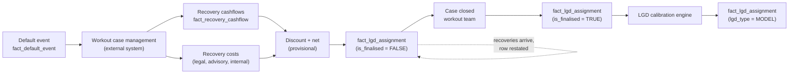

# Credit Module 8 — Loss Given Default

!!! abstract "Module Goal"
    Loss Given Default (LGD) is the second of the three drivers in the Expected Loss identity (PD × LGD × EAD). Where PD tells you whether the obligor defaults, LGD tells you how much it costs when they do. This module treats LGD as a *data* problem — how recoveries are tracked from the workout system through to a calibrated number, why an LGD figure is provisional for years after the default event, how the bitemporal warehouse handles restatements as recovery cashflows arrive, and how the downturn-LGD regulatory requirement reshapes the calibration panel. Modelling depth (the beta-fit, the Vasicek-style transformations between cycle-average and downturn LGDs) is treated only as far as the data shape demands; deep model-validation territory belongs to the model team and is flagged as out of scope.

---

## 1. Learning objectives

By the end of this module, you should be able to:

- **Define** Loss Given Default precisely, distinguish workout LGD from market LGD, and pin down the sign and units convention used in your warehouse.
- **Identify** the drivers of recovery rates — seniority, collateral, jurisdiction, cure outcome — and recognise which feeds the data-engineering team owns end to end.
- **Recognise** downturn LGD as a regulatory requirement under Basel IRB and articulate the data segmentation it imposes on the calibration panel.
- **Design** the `fact_lgd_assignment` table at a grain that supports workout LGDs, market LGDs, modelled LGDs, and the downturn add-on without proliferating fact tables.
- **Trace** recovery cashflows from the workout case-management system, through `fact_recovery_cashflow`, to a finalised LGD figure on `fact_lgd_assignment`.
- **Evaluate** the trade-offs between point-estimate and distributional storage of LGD and recognise where the beta-distribution shape earns its keep over a naive sample mean.

## 2. Why this matters

PD tells you whether the obligor defaults; LGD tells you how much it costs when they do. The two together with EAD give Expected Loss, but the relative importance of the two drivers is asymmetric in a way newcomers often miss. A 10-basis-point error on a 100-basis-point PD is a 10% relative error in the EL; a 5-percentage-point error on a 45% LGD is an 11% relative error in the EL. LGD is no less reportable than PD, no less audited, and no less debated — and it carries one unusual property among the credit parameters that makes the data engineer's job materially harder.

LGD has the longest lifecycle of any credit parameter. The PD is settled the moment the model produces it. The EAD is settled the moment the exposure is measured. The LGD on a defaulted facility, by contrast, is not settled until the workout case closes — and a typical corporate workout runs anywhere from one to four years from default to closure, sometimes longer for complex restructurings or contested bankruptcies. Recovery cashflows trickle in across that window. Costs of recovery (legal fees, advisory fees, internal time costs) accrue alongside them. The "realised LGD" for a single defaulted facility is a moving target until the case is administratively closed, and the calibrated LGD that feeds into the next year's expected-loss number depends on the recovery experience of cases that closed years ago. The data engineer's job is to track this slow-moving lineage with a bitemporal discipline that lets the firm say, with confidence, "this is the LGD as we knew it on date X" and "this is the LGD as we know it today" — and reconcile the two.

The data engineer who keeps the workout-to-LGD lineage clean spares the model team a great deal of forensic work and spares the regulator a great deal of suspicion. A warehouse where LGDs are restated silently — overwritten as new recoveries land, with no audit trail of the prior figure — is a warehouse where the supervisor cannot trace why this quarter's capital number differs from last quarter's. The discipline of this module is the discipline of treating LGD as the long-tail parameter it is, not as a settled point estimate.

!!! info "Honesty disclaimer"
    This module reflects general industry knowledge of LGD methodology as of mid-2026. Specific workout practices, recovery-rate assumptions, downturn-LGD calibration choices, and treatment of restructured exposures vary substantially by firm, by jurisdiction, and by collateral type (corporate workouts in a US Chapter 11 process look very different from a UK administration, an EU pre-pack, or a project-finance work-out in an emerging market). Deep model-development and validation territory is beyond this module's scope — pointers in further reading. The goal here is to give the data professional enough vocabulary and pattern recognition to support the model and workout teams without becoming one. Where the author's confidence drops (typically inside jurisdiction-specific bankruptcy code or behavioural-LGD modelling for retail mortgages), the module says so explicitly.

## 3. Core concepts

A reading map. Section 3.1 pins the formal definition and the conventions. Section 3.2 introduces the workout vs. market LGD distinction — the parallel of the TTC/PIT distinction from the PD module, with different drivers. Section 3.3 walks the drivers of recovery rates (seniority, collateral, jurisdiction). Section 3.4 treats cure rates and the three-way split of default outcomes that the LGD pipeline must distinguish. Section 3.5 covers downturn LGD — the regulatory requirement and the data segmentation it demands. Section 3.6 introduces the beta-distribution shape and explains why LGD is naturally distributional, not just a point estimate. Section 3.7 walks the data lineage from a workout case-management entry to a calibrated LGD fact. Section 3.8 lands on the storage shape: `fact_lgd_assignment` and the companion `fact_recovery_cashflow`. Section 3.9 covers the open-case problem and the provisional-vs-final flag that the warehouse must carry.

### 3.1 Definition

**Loss Given Default** for a defaulted facility is the fraction of the Exposure at Default that is permanently lost after the recovery process completes. It is the complement of the *recovery rate*:

$$
\text{LGD} = 1 - \text{Recovery Rate}
$$

Two things to pin immediately:

- **Range and units.** LGD is a fraction in the closed interval \([0, 1]\). The convention in a credit warehouse is to store it as a decimal in that interval and to render it for human consumption either as a percent (45%) or — much less commonly than for PD — in basis points (4,500 bp). 0% means full recovery (every dollar of the EAD is eventually recovered); 100% means total loss (nothing is recovered). A realised LGD can mathematically exceed 100% if the recovery costs outpace the recoveries themselves — a small revolver with large legal fees can produce a 110% LGD when the loss includes the cost of trying to collect — and the warehouse must accommodate the edge case rather than silently capping at 100%.
- **Reference EAD.** The denominator is the EAD *at the default date*, not today's outstanding balance. Recoveries that arrive years later are discounted back to the default date (more on the discounting convention in §3.7), but the EAD reference is the snapshot at default. Loaders that recompute the denominator against today's outstanding balance are the most common silent bug at the LGD layer; pin the convention in the data dictionary and validate at write time.

The default *event* itself is the same event that triggered the PD = 1 transition (the Basel "unlikely to pay" or "90 days past due" definition from [Credit Risk Foundations](01-credit-risk-foundations.md#31-what-is-credit-risk)); the LGD measures the outcome of *that* event for *that* facility from *that* date.

!!! info "Definition: LGD vs. recovery rate vs. loss rate"
    These three terms are sometimes used interchangeably, but the precise usage in a credit warehouse matters. **LGD** is a *severity* — the fraction of EAD lost after recovery — and is the column most consumers read. **Recovery rate** is the complement (1 − LGD) and is the figure most rating-agency studies publish (e.g. "senior unsecured corporate bonds had a 38% average recovery rate over 1987-2024"). **Loss rate** is sometimes used as a synonym for LGD and sometimes used to mean the product LGD × EAD (a *dollar* loss, not a fraction). Pin the meaning in the data dictionary and avoid the ambiguous "loss rate" label in column names.

### 3.2 Workout LGD vs. market LGD

The single most important distinction in LGD methodology — and the most common source of confusion between consumers — is between **workout LGD** and **market LGD**. They are not competing definitions of the same quantity; they are different observation windows on the same recovery process.

**Workout LGD** is the realised loss after the full recovery process completes. The workout team — sometimes a dedicated special-credits group, sometimes the relationship credit officer — pursues recoveries through whatever legal and contractual machinery is available: collateral seizure and sale, claim filing in bankruptcy proceedings, negotiated restructure, sale of the defaulted claim to a distressed-debt fund. Cash arrives in tranches over months or years; costs are incurred and recorded. When the workout team formally closes the case, the workout LGD is the net realised loss divided by the EAD at default. It is the *most accurate* LGD measure available but requires the longest observation window — typically one to four years for corporate workouts, and significantly longer for complex restructurings, project-finance defaults, or contested bankruptcies in slow jurisdictions.

**Market LGD** is implied from market prices of defaulted instruments. The standard convention: for a bond that has defaulted, observe its price approximately 30 days after the default event (the timing is a market convention, not a regulatory requirement) and treat \(1 - \text{price/par}\) as the market LGD. The market is, in effect, pricing the present value of the expected future recoveries net of the time-and-costs of pursuing them; the bondholder who wants out can sell at that price rather than wait. Market LGD has two important properties: it is *fast* — available within a month of default rather than years — and it is *only available for traded instruments*, which means loans without a secondary market, private placements, and most retail products have no market LGD at all.

Most large firms rely on **workout LGD for regulatory capital** because the supervisor wants the realised-loss number, not a market-implied estimate, and they use **market LGD as an early indicator** for the portfolio of traded names. The two figures often disagree: market LGDs tend to over-predict losses (the market price embeds a liquidity discount and a risk premium the eventual workout does not pay), so a market LGD of 60% for a senior unsecured bond may converge to a workout LGD of 45% three years later. The convergence is itself a data point — a model team that tracks the gap can calibrate a "market-LGD to workout-LGD" mapping, which lets the warehouse publish a faster-but-imperfect proxy alongside the slower-but-realised number.

A small comparison table the BI layer should keep visible:

| Aspect | Workout LGD | Market LGD |
|---|---|---|
| Observation latency | 1-4 years from default | ~30 days from default |
| Population coverage | All defaulted facilities | Only traded instruments |
| Primary regulatory consumer | Basel IRB capital, IFRS 9 ECL | Internal early-warning |
| Source system | Workout case-management + recovery feed | Market-data feed (Bloomberg, MarkIt, dealer indications) |
| Tends to over- or under-state loss | Realised — neither | Over-states (liquidity + risk premium) |
| Mental model | "What we actually lost" | "What the market thinks we'll lose" |

The translation between the two is a model in its own right and is part of the broader LGD framework that quant teams own. The data engineer's job is to (a) keep both flavours storable in the same fact table, (b) prevent consumers from mixing them in the same aggregation, and (c) preserve the methodology version so a re-run of the conversion is reproducible.

A third flavour worth mentioning is **implied LGD from CDS spreads**. The credit-default-swap market quotes spreads that imply a default-risk premium; combined with an assumed recovery rate (often the ISDA standard 40% for senior unsecured), an implied PD can be backed out. Inverting the convention — fixing the PD from another source and solving for the recovery rate — gives an *implied recovery*, which is sometimes used as a third early-warning signal alongside the market-LGD bond-price approach. Implied recoveries from CDS are most useful for the largest names (where the CDS market is liquid) and rarely useful for the long tail of mid-cap and private credit. The warehouse treatment is the same as for market LGD: a separate `lgd_type = 'CDS_IMPLIED'` row alongside the bond-implied MARKET row, with the source feed identified on `source_system`.

!!! warning "The number-one LGD reconciliation question"
    When a credit officer says "the LGD on this facility is 35%", the first follow-up question is *always*: workout or market? The second is: is the case closed (a final figure) or open (a provisional figure)? The third is: which model version was used to fill in any unrealised recovery component? A `fact_lgd_assignment` row that does not answer all three is a reconciliation problem waiting to happen.

### 3.3 Recovery rates by seniority, collateral, jurisdiction

LGD varies primarily with three structural attributes of the defaulted facility. The data engineer does not estimate the variation — that is the model team's calibration — but should know the rough rank-ordering so anomalies look anomalous.

**Seniority.** Where the facility sits in the obligor's capital structure determines who gets paid first in a bankruptcy.

- **Senior secured loans** typically recover 60-80% of par on average across cycles. The security interest in specific collateral (real estate, equipment, receivables) makes the recovery much more certain than for unsecured claims, though the realisable value depends on collateral quality and the speed of liquidation.
- **Senior unsecured bonds and loans** typically recover 35-50% on average. The "senior" claim ranks ahead of subordinated debt but pari-passu with general unsecured creditors (trade creditors, pension claims, lease rejection claims) — the recovery comes out of whatever is left after secured creditors are paid.
- **Subordinated debt** typically recovers 10-30%. Structurally below the senior claims, subordinated debt often receives nothing in a true insolvency and meaningful recovery only in restructurings where the obligor's enterprise value exceeds the senior debt.
- **Equity-like instruments** (hybrid tier 1, preferred equity, convertible notes in junior tranches) typically recover 0-10% if anything.
- **Sovereign debt** is *highly bimodal*. A successful restructure may produce a 70-90% recovery (creditors take a haircut but most of the principal is preserved); a true sovereign default with a deep restructure can produce a 20-30% recovery. The bimodality complicates calibration and is why sovereign LGDs are typically reported with explicit scenario splits rather than a single average.

**Collateral type.** Even within "senior secured", the collateral that backs the loan matters enormously. Real-estate collateral in a stable jurisdiction with an efficient foreclosure process recovers differently from inventory collateral that depreciates rapidly. The standard families:

- **Real estate** (commercial and residential): historically the highest recovery rates, conditional on the local property market. Time-to-resolution is the main driver of variation — a quick sale at 70% of appraised value beats a forced auction at 40% two years later.
- **Cash, securities, and other liquid financial collateral**: highest and most predictable recoveries (near 100%), subject to haircuts that are themselves contractually defined. Collateral pledged under ISDA CSAs and similar netting agreements is in this family.
- **Receivables and inventory**: moderate recoveries, with significant variance. Receivables age and inventory depreciates; the recovery depends on how quickly the workout team can monetise them.
- **Specialised assets** (aircraft, ships, project-finance assets, equipment): recoveries depend on the secondary market for the asset class. Aircraft and ships have well-developed secondary markets and recover well in normal times; specialised project-finance assets often have no liquid secondary market and recover poorly.

**Jurisdiction.** Bankruptcy code, secured-creditor rights, and time-to-resolution differ dramatically across legal jurisdictions and affect realised recoveries.

- **United States** (Chapter 11 reorganisation, Chapter 7 liquidation): well-documented case law, relatively predictable timelines (typically 12-24 months for a Chapter 11), strong secured-creditor protections. Average corporate workout LGDs in the US are at the lower end of the global range.
- **United Kingdom** (administration, pre-pack, scheme of arrangement): efficient processes, pro-creditor culture, but secured-creditor rights are weaker than in the US in some respects. Typical resolution timelines are 12-18 months.
- **European Union** (varies by member state — German *Insolvenzordnung*, French *redressement judiciaire*, Italian *concordato*, Spanish *concurso*): wide variation. Germany and the Netherlands are creditor-friendly; France and Italy historically less so, though recent reforms have narrowed the gap. Timelines range from 18 months to several years.
- **Emerging markets**: typically longer timelines, weaker creditor protections, less predictable outcomes. The LGD model for an emerging-market portfolio carries materially wider confidence intervals.

The data team's role: ensure `dim_facility` carries the seniority, collateral type, and jurisdiction fields so the LGD model can segment its calibration panel, and ensure these fields are themselves treated as slowly-changing dimensions (a re-collateralisation mid-life of a loan changes the LGD and the change must be timestamped).

A compact rank-ordering for newcomers, with very approximate cycle-average ranges:

| Facility type | Typical workout LGD (cycle average) | Variance / bimodality |
|---|---|---|
| Senior secured (real estate, prime jurisdiction) | 20-40% | Low |
| Senior secured (other collateral) | 30-50% | Moderate |
| Senior unsecured loan | 45-60% | Moderate |
| Senior unsecured bond | 50-65% | Moderate |
| Subordinated debt | 70-90% | High |
| Sovereign | bimodal: 10-30% or 70-90% | Very high |

The cycle-average figures hide enormous within-cycle variation; in stress, LGDs across every bucket rise (see §3.5 on downturn LGD), which is why the regulator requires a downturn add-on rather than just the cycle average.

A second observation on **collateral re-valuation cadence**. The realised recovery on a collateralised facility depends not on the collateral's value at origination but on its value at the moment of liquidation. Collateral values move — real estate appreciates and depreciates, equipment ages, receivables age and turn to bad debt, financial collateral fluctuates with market prices. The collateral team revalues holdings on a cadence that varies by collateral type: financial collateral is typically marked daily (it has a market price); real estate is revalued annually or on a trigger (a significant market move, an LTV breach); specialised collateral is revalued less often and is more uncertain when it is. The data engineer's role: ensure `fact_collateral_value` carries the revaluation date and the source of each value, so the LGD pipeline can use the most appropriate value rather than the most recent one. The Collateral & Netting module (upcoming) treats the collateral lifecycle in depth; for LGD purposes, the takeaway is that the recovery the workout team eventually realises is bounded above by the collateral value at the *liquidation* date, which may differ materially from the value carried at the *default* date.

A third observation on **jurisdictional differences in workout duration**. The time the workout takes is itself a load-bearing input to the LGD calculation, because (a) discounting compounds with the workout length, and (b) workout costs accrue continuously. A jurisdiction where the standard corporate workout closes in 12 months produces a lower LGD figure than an equivalent process in a jurisdiction with a 36-month average, even before any difference in the gross recovery rate. The warehouse should carry `jurisdiction` on `dim_facility` and `case_duration_days` (computed at case close) on `fact_lgd_assignment` so the calibration team can model the jurisdictional effect and the consumer can see it.

### 3.4 Cure rates

A meaningful fraction of "defaults" cure. The obligor triggered the technical default condition (90 days past due on a material obligation, or an "unlikely to pay" classification) but then resumed payment before the workout process produced any permanent loss. Cure rates of 20-40% are not unusual for corporate portfolios, and considerably higher for retail (some retail mortgage portfolios have cure rates above 60% — the 90-days-past-due trigger is hit during a temporary disruption and the obligor catches up). The LGD on a cured default is approximately zero — the firm did not lose money — but the case still appears in the default panel and must be handled correctly.

The data engineer must distinguish three outcomes of a default event, each with a different LGD treatment:

- **Defaulted-and-cured cases.** The obligor returned to performing status before the workout produced a permanent loss. LGD is approximately zero (small if there were any cure-period expenses; zero if not). Whether the cure period counts as a default for calibration purposes depends on the firm's default definition — under strict regulatory definitions, the cure does not erase the default event, but the LGD on the event is recorded as the small or zero realised figure.
- **Defaulted-and-restructured cases.** The obligor and the firm negotiated a modification of the original terms (interest reduction, principal forgiveness, term extension) that resolved the default but at a cost to the firm. LGD is the present value of the loss from the restructure — typically computed as the difference between the EAD at default and the present value of the post-restructure cashflows under the original effective interest rate. These cases sit in a "neither cured nor written off" middle ground and are often the trickiest LGD figures to validate.
- **Defaulted-and-written-off cases.** The workout process completed and a permanent loss was booked. LGD is approximately 100% minus any partial recovery — the realised LGD figure described in §3.7.

A fourth, smaller category — **defaulted-and-still-open cases** — is the topic of §3.9 and requires special warehouse handling because the LGD is provisional.

The cure-adjusted LGD figure (the firm's portfolio average across all three closed-case categories, weighted by EAD) is the standard regulatory metric. The data engineer's role: tag every default event with its outcome category, so the calibration team can compute cure-adjusted LGDs without re-discovering the categorisation from raw recovery data. A `default_outcome` column on `fact_default_event` (with controlled vocabulary `CURED`, `RESTRUCTURED`, `WRITTEN_OFF`, `OPEN`) is the cleanest pattern.

A small but important second-order observation: the **cure window** matters. Most firms require a cure period (often 12 months of uninterrupted performing payments) before re-classifying a defaulted obligor as performing. An obligor that cures, defaults again three months later, cures again, and defaults again six months later may be treated as a single continuous default event or as three separate events depending on the firm's definition — and the LGD calculation differs accordingly. This is one of the definitional edge cases the data dictionary must spell out.

```text
                  Realised LGD distribution shape for a typical corporate book
                  (vertical axis: count of closed cases; horizontal axis: LGD %)

        n
       40 |  *
          |  *                                                *
       30 |  **                                              **
          |  **                                              **
       20 |  ***                                            ***
          |  ****                                          ****
       10 |  *****                                        *****
          |  *******         **          ***            *******
        0 +--+----+----+----+----+----+----+----+----+----+----+--> LGD
           0%  10%  20%  30%  40%  50%  60%  70%  80%  90% 100%

           Cured/near-cured       Workout middle ground       Write-offs
           (LGD ~ 0%)             (LGD 30-70%)                (LGD ~ 100%)

         The bimodality is the cure-vs-write-off split made visible at the
         portfolio level. A naive "average LGD = 38%" hides the underlying
         shape — most closed cases are near one end or the other, with the
         middle ground populated by partial-recovery write-offs and
         restructures. The calibration team needs the shape, not the mean.
```

The distribution above is stylised but representative of what a senior-unsecured corporate book of closed workouts actually looks like at most large banks. The left mode (cures and near-cures) is heavily over-represented if the firm's default definition is strict (the technical-default trigger fires often and cures resolve most of them); the right mode (write-offs at near-100% LGD) is the structural failure cases. The middle ground — partial-recovery write-offs and restructures — is where the beta distribution from §3.6 earns its keep, because a single-mode beta can capture this fattest part of the distribution well even though the bimodal tails sit outside its natural shape. Many firms address this by splitting the calibration sample into outcome-conditional sub-segments (cured cases, restructured cases, written-off cases) and fitting a separate beta to each — the cured-case "distribution" is trivially concentrated near 0%, the written-off case distribution is a right-tailed beta, and the restructured-case distribution is the most beta-like of the three.

### 3.5 Downturn LGD — the regulatory bite

The Basel IRB framework requires LGD calibrated to *downturn* conditions, not to the cycle average. The intuition is sharper than for PD: when defaults happen, recoveries are also worse, because (a) collateral values fall in a recession, (b) workout processes are slower when courts are congested, (c) secondary markets for distressed assets are thinner, and (d) the macro environment that pushed the obligor into default is also pushing prospective buyers of the collateral out of the market. Cycle-average LGDs systematically under-state the loss in the years when defaults are concentrated, and the regulator wants the capital number sized to the stressed conditions.

The data engineer's role in downturn LGD is to ensure the calibration team can segment the historical recovery panel by economic regime. This requires:

- **Default date tagged to a macro regime indicator.** Every `fact_default_event` row carries the macro regime in force at the default date — typically a categorical field driven by GDP growth, unemployment, or a credit-spread index (BBB-AAA spread) crossing a threshold. The regime classification itself is a piece of reference data the macro team owns; the data engineer's role is to join it onto the default panel.
- **Recovery cashflows tagged to the macro regime at the cashflow date.** A default that happened in a downturn may have recoveries that land in the subsequent recovery period; tagging the cashflows separately lets the calibration team distinguish "default-in-downturn, recovery-in-downturn" from "default-in-downturn, recovery-in-recovery-period".
- **Cycle-average and downturn LGDs maintained as separate columns on `fact_lgd_assignment`.** The downturn LGD is typically the cycle-average LGD plus an add-on (the "downturn LGD add-on") computed from the historical experience of stressed cohorts. Both numbers and the add-on are stored explicitly so a consumer can reproduce the regulatory figure or revert to the cycle average for non-regulatory uses.

The EBA's *Guidelines on PD estimation, LGD estimation and the treatment of defaulted exposures* (EBA/GL/2017/16) — and the equivalent US OCC / Federal Reserve guidance — formalise the methodology choices, including how to identify the downturn period, how to compute the add-on, and how to document the calibration. The data engineer does not implement the methodology but should know the regulatory language so the calibration team's requests for "the downturn cohort" map to a query that returns the right rows.

A small numerical illustration of the procyclicality argument. Suppose a senior-unsecured corporate facility has a cycle-average LGD of 45%. In a benign year, the actually-realised LGD on the rare default in that segment might be 35% (collateral sells well, workouts close fast). In a stressed year, the realised LGD on the much more numerous defaults might be 60% (collateral sells poorly, workouts drag). The cycle average is 45%; the downturn LGD might be 55% (the average of the realised LGDs in identified downturn cohorts). The Basel IRB capital calculation uses the 55% figure, which produces meaningfully more capital than the 45% cycle average would. The 10-percentage-point add-on is the regulator's bet that the firm should size its capital to the stressed environment, not the average one.

### 3.6 The beta-distribution model for LGD

LGD is naturally a *distribution*, not a point estimate, for two reasons. First, an individual realised LGD can be anywhere in [0, 1] (with edge cases above) and the distribution of realised LGDs across a segment is rarely symmetric — recoveries cluster around a mode that depends on the facility type and tail off to either side. Second, the LGD that the calibration team produces for a *new* default in the segment is an estimate of the central tendency of that distribution, with explicit uncertainty around it. A single number ("the LGD for senior unsecured corporates is 45%") is a compression of a richer object.

The beta distribution is the standard parametric model because:

- **It is bounded on [0, 1].** The natural support of LGD. A normal-distribution model can produce negative or above-100% LGDs that need to be censored, which biases the estimator.
- **It can take a wide range of shapes.** Symmetric (α = β), right-skewed (β > α), left-skewed (α > β), unimodal interior, bimodal (when α < 1 and β < 1, with mass at the endpoints — useful for the sovereign-LGD case). Two parameters (α, β) cover the relevant shapes for credit applications.
- **The first two moments are explicit functions of (α, β).** Mean is \(\alpha / (\alpha + \beta)\); variance is \(\alpha\beta / [(\alpha + \beta)^2 (\alpha + \beta + 1)]\). The method-of-moments estimator (compute the sample mean and variance, solve for α and β) is closed-form, which makes it easy to implement when scipy is not available.

A small mathematical reminder. For a beta-distributed LGD with parameters (α, β):

$$
f(\ell ; \alpha, \beta) = \frac{\ell^{\alpha - 1} (1 - \ell)^{\beta - 1}}{B(\alpha, \beta)}, \quad \ell \in [0, 1]
$$

where \(B(\alpha, \beta)\) is the beta function. The mean is \(\mu = \alpha / (\alpha + \beta)\) and the variance is \(\sigma^2 = \alpha\beta / [(\alpha + \beta)^2(\alpha + \beta + 1)]\). Given a sample mean \(m\) and variance \(v\), the method-of-moments parameters are:

$$
\alpha = m \cdot \left(\frac{m(1-m)}{v} - 1\right), \quad \beta = (1 - m) \cdot \left(\frac{m(1-m)}{v} - 1\right)
$$

The shared factor \((m(1-m)/v - 1)\) must be positive for the beta to be valid; if the sample variance approaches \(m(1-m)\) (the variance of a uniform distribution with the same mean), no beta on [0, 1] fits and the method-of-moments breaks down. In practice, real LGD samples produce well-defined betas because the realised LGDs cluster, but the failure case is worth knowing.

The data engineer does not fit the model — that is the model team's job — but stores the parameters (`beta_alpha`, `beta_beta`) on `fact_lgd_assignment` alongside the point estimates (`lgd_mean`, `lgd_median`, `lgd_p95`) that the consumers most often read. Storing both the parameters and the derived statistics is intentional redundancy: the parameters let a sophisticated consumer reproduce any quantile, while the pre-computed statistics serve the common case without forcing every consumer to import scipy.

```text
                  Two illustrative beta-distribution LGD shapes
                  (vertical axis: density; horizontal axis: LGD in %)

         Senior unsecured corporate           Sovereign (bimodal)
         alpha=2.0, beta=2.4                  alpha=0.5, beta=0.5

   density                                   density
   1.5 |       ****                          3.0 |*                       *
       |     **    ***                           |**                     **
   1.0 |    *        **                      2.0 |  **                 **
       |   *           **                        |    **             **
   0.5 |  *              ***                 1.0 |      ****     ****
       | *                  ****                 |          *****
   0.0 +----+----+----+----+----+--> LGD    0.0 +----+----+----+----+----+--> LGD
       0%   20%  40%  60%  80% 100%             0%   20%  40%  60%  80% 100%

   Mean ~ 45%, right-skewed with mass        Mass at the endpoints — defaulted
   below the mean. Typical corporate         sovereigns either restructure cleanly
   workout shape.                            or experience a deep haircut.
```

The shape difference matters. A senior unsecured corporate workout produces an LGD somewhere around the mean with manageable variance; reporting the mean as the LGD is a reasonable summary. A sovereign default produces an LGD near one of the two endpoints; reporting the mean (which sits in the trough between the modes) is *actively misleading*. The data engineer who stores both the mean and the parameters allows the consumer to recognise this and pick the right summary.

### 3.7 Data lineage from a workout system to a calibrated LGD fact

The LGD pipeline has the longest end-to-end latency of any credit measure. A simplified life-of-an-LGD walks through six stages:

1. **Default event recorded.** When a facility crosses the default threshold (90 days past due, "unlikely to pay" determination, or covenant-breach trigger), the credit operations team writes a row to `fact_default_event` with the facility ID, default date, EAD at default, default trigger code, and the workout case ID that will track the recoveries.
2. **Workout case opened.** The workout team takes ownership of the case in their case-management system (an external system, often a specialised application from a vendor like Wolters Kluwer, Misys, or a bespoke build). The case-management system is the source of truth for everything that happens during the workout — meetings with the obligor, legal filings, valuation reports, recovery negotiations.
3. **Recovery cashflows recorded.** As cash arrives (from collateral sales, restructure payments, bankruptcy distributions, claim sales), each cashflow is recorded against the case. The data engineer's job is to extract the cashflow ledger from the workout system and land it in `fact_recovery_cashflow` with the cashflow date, gross amount, and the case it belongs to. The cashflow feed is typically a daily or weekly batch from the workout system.
4. **Costs of recovery recorded.** Alongside the recovery cashflows, the workout team records the costs incurred to pursue the recoveries — external legal fees, financial-advisor fees, valuation costs, internal staff time costed at a standard rate, court fees and filing costs. These land in `fact_recovery_cashflow` (or a parallel `fact_recovery_cost`, depending on the warehouse design) and are netted against the gross recoveries to produce the *net* recovery figure.
5. **Net realised recovery computed and discounted.** The sum of net recoveries (gross recoveries minus costs) is discounted back to the default date at a configured discount rate — typically the firm's effective interest rate on the original facility, or a standard reference rate (the post-tax cost of debt, or a regulator-prescribed discount rate). The discounting matters because recoveries that land four years post-default are worth materially less than recoveries that land in the first six months; ignoring the time value of money silently overstates the recovery rate. The standard formula:
   $$
   \text{Net Realised Recovery (PV)} = \sum_{t} \frac{(\text{Recovery}_t - \text{Cost}_t)}{(1 + r)^{(d_t - d_0)/365}}
   $$
   where \(d_t\) is the cashflow date, \(d_0\) is the default date, and \(r\) is the annual discount rate.
6. **Realised LGD finalised.** Once the workout case is closed (administratively, by the workout team, when no further recoveries are expected and the case ledger is settled), the realised LGD is computed:
   $$
   \text{LGD} = 1 - \frac{\text{Net Realised Recovery (PV)}}{\text{EAD at Default}}
   $$
   and written to `fact_lgd_assignment` with `lgd_type = 'WORKOUT'`, `is_finalised = TRUE`, and the case-close date.

Steps 1, 2, and 5-6 happen once per default. Steps 3 and 4 happen *many times* per default over the months and years of the workout — and each time, the *provisional* LGD on the case can be recomputed and updated. The warehouse must accommodate this — the LGD figure for an open case is restated repeatedly as recoveries land and as workout expectations update; the warehouse's bitemporal pattern is what lets the firm say "this was our LGD estimate on date X" and "this is our estimate today" without losing either view.



The diagram makes a point worth pinning: the finalised workout LGDs from closed cases are *the calibration input* for the model that produces the LGD figure for newly-defaulted (or not-yet-defaulted) facilities. The pipeline is circular in time — today's calibration consumes yesterday's closed cases, and today's open cases will feed into tomorrow's calibration once they close. The data engineer who keeps the case-close pipeline clean keeps the calibration team in business.

### 3.8 Storage shape: `fact_lgd_assignment` and `fact_recovery_cashflow`

Pulling everything together, two related fact tables sit at the heart of the LGD warehouse. The first stores the LGD figure itself for a facility on a given date, distinguishing the source (workout, market, model) and carrying the methodology metadata. The second stores the cashflow ledger that feeds the workout LGD calculation.

```sql
CREATE TABLE fact_lgd_assignment (
    facility_id             VARCHAR(64)              NOT NULL,
    business_date           DATE                     NOT NULL,
    lgd_type                VARCHAR(8)               NOT NULL,    -- 'WORKOUT' / 'MARKET' / 'MODEL'
    lgd_value               NUMERIC(6, 4)            NOT NULL,    -- point estimate, [0, 1+]
    lgd_mean                NUMERIC(6, 4),                        -- distribution mean if available
    lgd_median              NUMERIC(6, 4),                        -- distribution median if available
    lgd_p95                 NUMERIC(6, 4),                        -- 95th percentile for tail use
    beta_alpha              NUMERIC(10, 6),                       -- fitted beta-distribution params
    beta_beta               NUMERIC(10, 6),
    sample_size             INTEGER,                              -- n behind the calibration
    downturn_add_on         NUMERIC(6, 4),                        -- downturn vs. cycle-average gap
    is_finalised            BOOLEAN                  NOT NULL,    -- TRUE for closed-case workout LGDs
    case_close_date         DATE,                                 -- NULL until workout case closes
    discount_rate_used      NUMERIC(6, 4),                        -- the r in the PV formula
    model_version           VARCHAR(32)              NOT NULL,
    source_system           VARCHAR(32)              NOT NULL,
    as_of_timestamp         TIMESTAMP WITH TIME ZONE NOT NULL,
    valid_from              TIMESTAMP WITH TIME ZONE NOT NULL,
    valid_to                TIMESTAMP WITH TIME ZONE,
    PRIMARY KEY (facility_id, business_date, lgd_type, as_of_timestamp),
    CHECK (lgd_value >= 0),
    CHECK (lgd_value <= 1.5),                                     -- allow > 100% for cost-heavy cases
    CHECK (lgd_type IN ('WORKOUT', 'MARKET', 'MODEL'))
);

CREATE TABLE fact_recovery_cashflow (
    recovery_id             VARCHAR(64)              NOT NULL,
    facility_id             VARCHAR(64)              NOT NULL,
    default_event_id        VARCHAR(64)              NOT NULL,    -- FK to fact_default_event
    cashflow_date           DATE                     NOT NULL,
    gross_recovery_usd      NUMERIC(18, 2)           NOT NULL,    -- can be 0 for cost-only rows
    cost_usd                NUMERIC(18, 2)           NOT NULL,    -- can be 0 for recovery-only rows
    cashflow_type           VARCHAR(32)              NOT NULL,    -- COLLATERAL_SALE, BK_DISTRIBUTION, RESTRUCTURE_PAYMENT, LEGAL_FEE, ...
    source_system           VARCHAR(32)              NOT NULL,
    as_of_timestamp         TIMESTAMP WITH TIME ZONE NOT NULL,
    PRIMARY KEY (recovery_id, as_of_timestamp)
);
```

A few design observations on these shapes:

- **The grain of `fact_lgd_assignment` is `(facility_id, business_date, lgd_type, as_of_timestamp)`.** One facility on one business date can have multiple rows: one for the workout LGD (typically provisional until the case closes), one for the market LGD (if a market price exists for the defaulted instrument), one for the model LGD (the calibrated estimate for a not-yet-defaulted facility). The `as_of_timestamp` axis enables bitemporal restatement — a corrected LGD for a historical date appends a new row with a later `as_of_timestamp`, leaving the original queryable. This is the same bitemporal pattern as `fact_pd_assignment` from the [Probability of Default](07-probability-of-default.md) module.
- **The grain of `fact_recovery_cashflow` is `(recovery_id, as_of_timestamp)`.** A single recovery event (a collateral sale, a bankruptcy distribution) is one row; corrections to the row append a new `as_of_timestamp`. The cashflow date and the as-of timestamp are distinct — a recovery that *occurred* in 2024-03-15 may have been *recorded* in 2024-03-20, and a subsequent correction (the bank realised the costs were under-reported) appends a new as-of in 2024-04-02. All three temporal coordinates are preserved.
- **`is_finalised` is a load-bearing flag.** Downstream consumers reading workout LGDs for capital reporting or for calibration must filter on `is_finalised = TRUE` to avoid contaminating their figures with open cases whose LGD is still moving. Consumers reading workout LGDs for credit-committee surveillance (where the open-case provisional is the right answer) read both.
- **The distribution columns (`lgd_mean`, `lgd_median`, `lgd_p95`, `beta_alpha`, `beta_beta`) are nullable** because they only apply to modelled or calibrated LGDs. A single realised workout LGD is just a number; the distribution columns are populated for the calibrated MODEL rows that summarise segments rather than individual cases.
- **`discount_rate_used`** is materialised because the PV calculation in §3.7 depends on it, and a downstream consumer who wants to reproduce or reconcile the LGD figure needs to know the rate that was used. A re-discount at a different rate is then a recalculation rather than a guess.

A second-order observation on **partitioning and indexing**. `fact_lgd_assignment` is read with two dominant access patterns: "latest LGD for a single facility" (the credit-committee or limit-utilisation case) and "all closed-case workout LGDs in a segment over a calibration window" (the calibration team's case). The first wants `business_date`-range partitioning with clustering on `facility_id`; the second wants the same partitioning with secondary clustering on the segment columns from `dim_facility` (typically held via materialised view or a denormalised segment key on the fact). Both queries scan past the `as_of_timestamp` axis via the latest-as-of CTE pattern, so the as-of column should not be in the cluster key.

A third observation on **row volume**. Unlike `fact_pd_assignment`, where every obligor gets a daily row, `fact_lgd_assignment` for `lgd_type = 'WORKOUT'` only sees rows for *defaulted* facilities — a few hundred per year for a large corporate book. The MODEL rows (calibrated per segment, written periodically) are also low-volume. The `fact_recovery_cashflow` table, by contrast, accumulates rows whenever workout activity happens, and a single complex bankruptcy can produce dozens or hundreds of cashflow rows over its lifetime. The volume is still small compared to a market-risk daily price fact — `fact_recovery_cashflow` rarely exceeds the low millions of rows for even a global bank — but it grows monotonically with no natural pruning point because the regulator wants the full history available for forensic reconstruction.

### 3.9 The open-cases problem and the provisional-vs-final flag

The single most important warehouse design decision specific to LGD is how to handle *open* workout cases. An obligor that defaulted 8 months ago has had some recoveries, has had some costs, and has the workout team's *expectation* of further recoveries that have not yet landed. The firm needs an LGD figure for this case today — for the IFRS 9 stage 3 provision, for the credit-committee surveillance pack, for the management-reporting view — but the figure is mechanically incomplete: a third or a half of the eventual recovery is still in the future.

Three patterns are in use:

- **Realised-only LGD.** Compute the LGD using only the recoveries that have actually landed, divided by the EAD at default. This understates the eventual recovery (it ignores future cashflows) and therefore *overstates* the LGD. Most useful for backstopping: the realised-only LGD is the worst case the firm can defensibly claim today, before any forward-looking projection.
- **Provisional LGD with workout-team projection.** Combine realised recoveries (the cash that has landed) with the workout team's projection of future recoveries (the cash they expect). The projection is itself a piece of forecast data that the warehouse must store and version — typically as a parallel `fact_recovery_projection` table or as projection-flagged rows on `fact_recovery_cashflow`. The provisional LGD is the standard answer for IFRS 9 stage 3 provisioning and for credit-committee surveillance. It updates whenever the workout team revises their projection.
- **Modelled LGD.** Apply the calibrated MODEL LGD for the facility's segment, ignoring the case-specific recovery history entirely. Used as a fallback when the workout case is too new to have any recovery history or when the case-specific projection is too uncertain to use.

The data engineer's role is to make all three views computable and to flag which view a given row represents. The minimum metadata:

- **`is_finalised`** — TRUE only when the workout case is administratively closed and no further recoveries are expected. FALSE for every open case.
- **`lgd_basis`** — a controlled vocabulary distinguishing `REALISED_ONLY`, `PROVISIONAL_PROJECTED`, `MODEL_FALLBACK`. (This can be a column on `fact_lgd_assignment` or an attribute of the `lgd_type` enum; either works as long as the data dictionary is explicit.)
- **`expected_close_date`** — the workout team's best guess for when the case will close, used by IFRS 9 and management reporting to size the unwind expectation.

A worked example. *DeltaCorp* defaulted on 2025-09-01 with an EAD at default of $20M. As of business date 2026-05-01 (eight months later), the workout team has received $5M in recoveries and has incurred $0.4M in costs. They expect a further $8M of recoveries over the next 18 months, with $0.6M of additional costs. The provisional LGD on the case, discounted at 5% to the default date, is approximately:

- Realised PV (net) = ($5M - $0.4M) / (1.05)^(8/12) ≈ $4.45M
- Projected PV (net) = ($8M - $0.6M) / (1.05)^((8+18)/2 / 12) ≈ $6.69M (using a midpoint discount)
- Total PV recovery ≈ $11.14M
- Provisional LGD = 1 − 11.14 / 20 ≈ 44.3%

The warehouse stores this as a row on `fact_lgd_assignment` with `lgd_type = 'WORKOUT'`, `is_finalised = FALSE`, `lgd_basis = 'PROVISIONAL_PROJECTED'`, `expected_close_date = 2027-11-01` (the workout team's estimate). When the case eventually closes — say in late 2027 with actual recoveries that came in $1M below projection and costs $0.2M above — the realised LGD is computed and a new row is appended with `is_finalised = TRUE`, `lgd_basis = 'REALISED_ONLY'`, the final LGD figure, and the actual close date. The provisional row remains in the warehouse, queryable for "what did we report on 2026-05-01?" forensic reconstructions.

The connection back to `fact_default_event` is mechanical. The default event row is written once and is immutable thereafter (a default that happened cannot un-happen, though the default classification can in rare cases be reversed if the default trigger was an operational error). The LGD rows associated with the default event grow over time — a stream of provisional rows during the workout, then a single finalised row at case close. Both tables share the `default_event_id` as the join key, which lets a downstream query reconstruct the full life-of-the-default from event to closure.

## 4. Worked examples

### Example 1 — SQL: compute realised LGD from recovery cashflows

The first example walks through the LGD calculation from a workout-cashflow ledger. The goal is to make the discounting arithmetic explicit and to expose the most common reconciliation gotchas — discount-rate choice, cost treatment, EAD reference, multiple cashflows on the same case. SQL dialect: Snowflake-compatible standard SQL; the date arithmetic uses `DATEDIFF` and `POWER` which are available in essentially every analytic warehouse.

A minimal schema:

```sql
CREATE TABLE fact_default_event (
    default_event_id        VARCHAR(64)              NOT NULL,
    facility_id             VARCHAR(64)              NOT NULL,
    default_date            DATE                     NOT NULL,
    ead_at_default_usd      NUMERIC(18, 2)           NOT NULL,
    default_trigger_code    VARCHAR(32)              NOT NULL,    -- '90DPD', 'UTP', 'COVENANT', ...
    default_outcome         VARCHAR(16),                          -- 'CURED', 'RESTRUCTURED', 'WRITTEN_OFF', 'OPEN'
    case_close_date         DATE,                                 -- NULL while OPEN
    as_of_timestamp         TIMESTAMP WITH TIME ZONE NOT NULL,
    PRIMARY KEY (default_event_id, as_of_timestamp)
);

CREATE TABLE fact_recovery_cashflow (
    recovery_id             VARCHAR(64)              NOT NULL,
    facility_id             VARCHAR(64)              NOT NULL,
    default_event_id        VARCHAR(64)              NOT NULL,
    cashflow_date           DATE                     NOT NULL,
    gross_recovery_usd      NUMERIC(18, 2)           NOT NULL,
    cost_usd                NUMERIC(18, 2)           NOT NULL,
    cashflow_type           VARCHAR(32)              NOT NULL,
    as_of_timestamp         TIMESTAMP WITH TIME ZONE NOT NULL,
    PRIMARY KEY (recovery_id, as_of_timestamp)
);
```

A small set of sample rows for two defaulted facilities and one open case:

```sql
INSERT INTO fact_default_event VALUES
    ('DE001', 'FAC001', DATE '2023-03-15', 10000000.00, '90DPD',
        'WRITTEN_OFF', DATE '2025-06-30', TIMESTAMP '2025-07-01 02:00 UTC'),
    ('DE002', 'FAC002', DATE '2022-11-20', 25000000.00, 'UTP',
        'RESTRUCTURED', DATE '2024-09-15', TIMESTAMP '2024-09-16 02:00 UTC'),
    ('DE003', 'FAC003', DATE '2025-08-01', 20000000.00, '90DPD',
        'OPEN', NULL, TIMESTAMP '2025-08-02 02:00 UTC');

INSERT INTO fact_recovery_cashflow VALUES
    -- FAC001 — written-off case, recoveries across 2 years
    ('RC0001', 'FAC001', 'DE001', DATE '2023-09-30',  1500000.00,  80000.00, 'COLLATERAL_SALE',     TIMESTAMP '2023-10-01 02:00 UTC'),
    ('RC0002', 'FAC001', 'DE001', DATE '2024-02-15',   500000.00,  20000.00, 'COLLATERAL_SALE',     TIMESTAMP '2024-02-16 02:00 UTC'),
    ('RC0003', 'FAC001', 'DE001', DATE '2024-08-20',  2000000.00, 120000.00, 'BK_DISTRIBUTION',     TIMESTAMP '2024-08-21 02:00 UTC'),
    ('RC0004', 'FAC001', 'DE001', DATE '2025-06-30',        0.00,  50000.00, 'LEGAL_FEE',           TIMESTAMP '2025-07-01 02:00 UTC'),
    -- FAC002 — restructured case, two large payments under the restructure
    ('RC0005', 'FAC002', 'DE002', DATE '2023-06-30', 12000000.00, 250000.00, 'RESTRUCTURE_PAYMENT', TIMESTAMP '2023-07-01 02:00 UTC'),
    ('RC0006', 'FAC002', 'DE002', DATE '2024-09-15',  9000000.00, 180000.00, 'RESTRUCTURE_PAYMENT', TIMESTAMP '2024-09-16 02:00 UTC'),
    -- FAC003 — open case, recoveries to date only
    ('RC0007', 'FAC003', 'DE003', DATE '2025-12-10',  3000000.00, 200000.00, 'COLLATERAL_SALE',     TIMESTAMP '2025-12-11 02:00 UTC'),
    ('RC0008', 'FAC003', 'DE003', DATE '2026-03-25',  2000000.00, 150000.00, 'COLLATERAL_SALE',     TIMESTAMP '2026-03-26 02:00 UTC');
```

The query — realised LGD per facility, discounted at 5% per annum to the default date, with bitemporal latest-as-of handling:

```sql
WITH latest_default AS (
    SELECT
        default_event_id,
        facility_id,
        default_date,
        ead_at_default_usd,
        default_outcome,
        case_close_date,
        ROW_NUMBER() OVER (
            PARTITION BY default_event_id
            ORDER BY as_of_timestamp DESC
        ) AS rn
    FROM fact_default_event
),
latest_recovery AS (
    SELECT
        recovery_id,
        default_event_id,
        facility_id,
        cashflow_date,
        gross_recovery_usd,
        cost_usd,
        ROW_NUMBER() OVER (
            PARTITION BY recovery_id
            ORDER BY as_of_timestamp DESC
        ) AS rn
    FROM fact_recovery_cashflow
),
-- Discount each cashflow back to the default date at 5% annual rate.
-- (gross_recovery - cost) is the *net* cashflow; the denominator is the
-- annualised discount factor (1 + r)^((cashflow_date - default_date)/365).
pv_per_cashflow AS (
    SELECT
        d.default_event_id,
        d.facility_id,
        d.default_date,
        d.ead_at_default_usd,
        d.default_outcome,
        r.cashflow_date,
        r.gross_recovery_usd,
        r.cost_usd,
        (r.gross_recovery_usd - r.cost_usd)
            / POWER(1.05, DATEDIFF('day', d.default_date, r.cashflow_date) / 365.0)
            AS net_recovery_pv_usd
    FROM       latest_default  d
    INNER JOIN latest_recovery r ON r.default_event_id = d.default_event_id AND r.rn = 1
    WHERE d.rn = 1
)
SELECT
    default_event_id,
    facility_id,
    default_date,
    default_outcome,
    ead_at_default_usd,
    SUM(net_recovery_pv_usd)                              AS total_net_recovery_pv_usd,
    SUM(net_recovery_pv_usd) / ead_at_default_usd         AS recovery_rate,
    1 - SUM(net_recovery_pv_usd) / ead_at_default_usd     AS realised_lgd
FROM pv_per_cashflow
GROUP BY
    default_event_id, facility_id, default_date, default_outcome, ead_at_default_usd
ORDER BY facility_id;
```

The expected output:

| default_event_id | facility_id | default_date | default_outcome | ead_at_default_usd | total_net_recovery_pv_usd | recovery_rate | realised_lgd |
|---|---|---|---|---|---|---|---|
| DE001 | FAC001 | 2023-03-15 | WRITTEN_OFF | 10,000,000.00 | ~3,407,000 | ~0.341 | ~0.659 |
| DE002 | FAC002 | 2022-11-20 | RESTRUCTURED | 25,000,000.00 | ~19,170,000 | ~0.767 | ~0.233 |
| DE003 | FAC003 | 2025-08-01 | OPEN | 20,000,000.00 | ~4,627,000 | ~0.231 | ~0.769 |

A walkthrough of what each row means:

- **FAC001 (written off).** EAD at default was $10M. Net recoveries (gross minus costs) totalled $3.73M nominal across four cashflows over 2.3 years; discounted at 5% to the default date this becomes ~$3.41M present value. Realised LGD ≈ 66% — a typical outcome for a senior unsecured corporate write-off where the collateral was modest and the workout was lengthy.
- **FAC002 (restructured).** EAD at default was $25M. Two large restructure payments totalled $21M gross, $20.57M net; discounted to default this is ~$19.17M PV. Realised LGD ≈ 23% — much lower than the write-off case because the restructure preserved most of the principal value, at the cost of accepting modified terms that the firm did not get to choose.
- **FAC003 (open).** This is a *realised-only* LGD on an open case. The 76.9% figure is the worst-case backstop — it assumes no further recoveries — and is materially higher than the eventual workout LGD will be once the workout team's projected $8M of future recoveries lands. The IFRS 9 stage 3 provision on this facility should use the *provisional* LGD that incorporates the projection, not the realised-only figure; the difference between the two is the unwind expectation that the next eighteen months of recoveries should produce.

A walkthrough of the gotchas the query handles:

- **Bitemporal "latest as-of" join.** Both `fact_default_event` and `fact_recovery_cashflow` are bitemporal; the `ROW_NUMBER() OVER (... ORDER BY as_of_timestamp DESC)` CTEs select the latest version of each natural key. A naive join without this would duplicate rows after the first restatement.
- **Discount-rate as a hard-coded constant (5%).** The query uses 5% as a stand-in. In production the rate should be a parameter — sourced from a `dim_lgd_methodology` row with the firm's chosen rate (typically the original effective interest rate on the facility, or a regulator-prescribed reference rate). Reproducing the LGD a year later requires knowing the rate that was used, which is why `discount_rate_used` is a column on `fact_lgd_assignment`.
- **Costs netted at the cashflow level, not at the case level.** Each cashflow row carries both `gross_recovery_usd` and `cost_usd`; the discounting applies to the net. The alternative — discount the gross and the costs separately, then subtract — produces the same answer mathematically but obscures the per-cashflow lineage. The chosen pattern keeps each row independently reproducible.
- **Open case handling.** The query treats FAC003 the same way as the closed cases — sum the realised cashflows, discount, compute LGD. The result is the *realised-only* LGD; consumers who need the provisional figure must join in `fact_recovery_projection` (not shown in this example) and extend the sum to include the projected cashflows discounted to the default date. Production warehouses typically expose both views via parallel queries or via a `lgd_basis` filter on a wider LGD calculation view.
- **Currency consistency.** All cashflows in the example are in USD. A real warehouse with multi-currency exposures must convert the cashflows to a single reporting currency at the FX rate prevailing at the cashflow date (not today's FX rate, and not the default-date FX rate — the cashflow rate is what was actually received in the reporting currency). The FX-conversion logic is out of scope for this example but is a non-trivial fourth dimension.

A subtlety on the FAC002 realised LGD of 23%. The restructure preserved most of the principal value, but the LGD figure does *not* reflect the fact that the firm gave up some interest income on the restructured terms — the LGD compares recovered principal to EAD at default, not recovered cashflows to the contractual cashflows under the original terms. A "fuller" loss measure that includes the interest impact is sometimes computed as an "economic loss given default" rather than a regulatory LGD; the warehouse can carry it as a separate column or as a separate `lgd_type`. The data dictionary should make the convention explicit.

### Example 2 — Python: beta-distribution LGD parameter fit

The second example fits a beta distribution to a small synthetic sample of realised LGDs for a senior-unsecured corporate segment. The goal is to make the distributional shape explicit — to show why the fitted beta carries more useful information than the sample mean alone, and to provide a fallback for environments where scipy is not available.

```python
--8<-- "code-samples/python/c08-beta-lgd.py"
```

A reading guide. The synthetic sample is intentionally small (40 realised LGDs) to mirror what a single seniority/collateral segment of a corporate book actually produces — a real-world calibration might have a few hundred observations per segment for the best-populated cells and a few dozen for the more specialised ones. The script does five things:

1. **Builds a synthetic realised-LGD sample.** Forty cases drawn from a beta(2.0, 2.4) which has mean ≈ 0.455, matching the rough empirical shape of senior-unsecured corporate workouts. The seed is fixed so the run is reproducible; the small \(\epsilon\)-clip on the boundary avoids the scipy MLE fit tripping on exact 0 or 1 values (rare but possible in real data when a case produces a 0% loss or a > 100% loss).
2. **Fits the beta by MLE if scipy is available.** Forces the support to be [0, 1] via `floc=0, fscale=1`. Without those constraints scipy treats the location and scale as free parameters and produces a distribution on a shifted/scaled support, which is the most common silent bug when fitting beta distributions in production.
3. **Fits the beta by method-of-moments as a numpy-only fallback.** Solves the closed-form expressions for α and β from the sample mean and variance. Raises an informative error if the sample is too uniform for any beta to fit (the variance-saturation case from §3.6).
4. **Reports the distribution moments and the 95th percentile.** The mean is the figure most consumers ask for; the median is the typical-case outcome; the 95th percentile is the figure the downturn-scenario team and the IFRS 9 stage 3 team care about because it answers "in the bad case, how bad?".
5. **Compares to the naive sample-mean estimator.** The point of the comparison is pedagogical: the naive estimator and the fitted distribution agree on the mean (by construction for the MOM fit), but the distribution retains the asymmetry and the tail that the mean discards.

A few implementation choices in the script worth pointing out:

- **`@dataclass(frozen=True)`.** The fit result is immutable. LGD fits are produced once per calibration cycle and read many times; immutability prevents downstream code from mutating the parameters and silently rewriting the distribution.
- **`try/except ImportError` for scipy.** Production data-engineering environments often have inconsistent scipy availability; the script's fallback path produces a numerically equivalent fit using only numpy, which is universally available. The MLE fit is preferred when available (it is more efficient than the method-of-moments in small samples), but the MOM fit is good enough for most LGD use cases and serves as a sanity check on the MLE.
- **Quantile estimation by sampling in the MOM fallback.** numpy does not ship the regularised incomplete beta function, so the MOM path computes percentiles by drawing 200,000 samples from the fitted beta and taking empirical quantiles. This is numerically equivalent to the analytical CDF inversion for the level of precision needed at the BI layer and is much cleaner than implementing a bisection-on-Newton solver for the incomplete beta from scratch.
- **`_format_pct` for human-readable output.** LGD is typically quoted in percent, not decimal or basis points; the formatting helper makes the output read at a glance.

A representative run produces output like:

```text
Realised LGDs: n = 40 closed workout cases (senior-unsecured corporate).
  sample mean =  41.95%
  sample std  =  21.45%
  sample min  =   8.11%
  sample max  =  85.92%

Method-of-moments beta fit (numpy-only fallback)
------------------------------------------------
  alpha       = 1.8007
  beta        = 2.4921
  fit mean    =  41.95%
  fit median  =  40.77%
  fit 95th    =  79.39%

Comparison to the naive sample-mean estimator
---------------------------------------------
  naive point LGD =  41.95%
  The naive estimator collapses the entire distribution to a single
  number. The fitted beta retains the asymmetry and the tail: the
  95th-percentile LGD is the figure the capital team needs for
  downturn scenarios, and the median is what a typical workout
  produces. Reporting only the mean discards both.
```

A few things worth noting in the output. The fitted mean (41.95%) is identical to the sample mean by construction — the method-of-moments matches the first moment exactly. The fitted median (40.77%) is slightly below the mean, reflecting the right-skew the beta(1.8, 2.5) shape captures. The 95th percentile (79.39%) is dramatically higher than the mean — the right tail of the LGD distribution stretches well past the central tendency, which is exactly why the downturn-LGD framework exists. A consumer who saw only "the LGD for this segment is 42%" would have no way to anticipate that one realised LGD in twenty will exceed 79%; the fitted distribution makes the tail explicit.

The production fix when MLE and MOM disagree: when they differ materially, the MLE is the better estimator (it is the maximum-likelihood, which is asymptotically efficient), but a large gap signals that the beta family does not fit the data well — perhaps because the segment is bimodal (sovereign-like) and a single-mode beta cannot capture the shape. The model team's response is to disaggregate the segment further (split into outcome-conditional sub-segments) or to fit a mixture of betas rather than a single beta. The data engineer's role: store both fits, flag the discrepancy via a daily DQ test, and surface the alert to the calibration team.

A practical observation on **storing the fit alongside the sample**. Production calibration code typically stores the fitted parameters (α, β) on `fact_lgd_assignment` and *also* stores the underlying sample size and the calibration window on `dim_lgd_methodology`. The reason: a fitted beta with (α=2, β=2.5) from a sample of 30 is not the same artefact as the same fitted beta from a sample of 3,000 — the second is much more reliable, and a consumer who needs to know the uncertainty around the central tendency needs the sample size. Reporting (α, β, n) is the honest answer; reporting (α, β) alone hides the calibration-stability question that the model-validation team will eventually ask.

## 5. Common pitfalls

!!! warning "Watch out"
    1. **Not discounting recovery cashflows to the default date.** A recovery of $5M that lands four years after default is worth materially less than $5M at the default date; at a 5% discount rate it is worth about $4.1M. Ignoring the time value of money silently overstates the recovery rate by a factor that grows with the workout horizon. Always discount, always store the discount rate that was used, and reject any LGD calculation that does not declare its discount rate.
    2. **Excluding workout costs from the recovery calculation.** Recoveries are gross; the firm only keeps the net of legal fees, advisory fees, court fees, valuation costs, and internal staff time. A workout that recovers $10M and costs $1.5M to pursue produces an LGD figure that is 15% higher than the naive (gross-only) version. The cost feed must be captured — typically from the same workout case-management system that produces the gross cashflow feed — and netted at the cashflow grain, not retrospectively at the case grain.
    3. **Mixing pre-cure and post-cure cases in a single calibration sample.** A cured default has a near-zero LGD; a written-off default has a 30-90% LGD. Pooling them produces a calibration mean that is meaningless — it is the firm's average outcome across two structurally different populations, not a usable estimate for either. Flag the `default_outcome` on every event and filter the calibration sample explicitly.
    4. **Reporting through-the-cycle LGD when the regulator requires downturn LGD.** The cycle-average LGD systematically under-states the loss during the stressed years when defaults are concentrated; the regulator's downturn requirement is intended to size the capital to the stressed environment. A submission that uses the cycle-average figure for the regulatory capital calculation is a misstatement. The downturn add-on must be applied and the warehouse should expose both the cycle-average and the downturn LGD so the right one is read for the right consumer.
    5. **Reporting only the point estimate when LGD is a distribution.** A sample mean for a segment compresses the dispersion into a single number; the calibration team and the capital team often need the variance, the 95th percentile, or the full fitted distribution. A warehouse design that stores only `lgd_value` (the mean) and discards the distribution shape forces every downstream consumer who needs the tail to re-fit from raw data — and they will disagree on the fit.
    6. **Confusing realised LGD (one observation) with calibrated LGD (a model output).** A single closed workout case has *one* realised LGD; the calibrated LGD for a segment is an estimate of the central tendency of the LGDs of all cases in that segment. Reporting "the LGD on FAC001 is 35%" is fine if you mean the realised figure on FAC001's closed workout; using it to set the model LGD for the segment is a classical sample-of-one error. The `lgd_type` column (WORKOUT vs. MODEL) makes the distinction explicit.
    7. **Cutting off the LGD calculation when the workout case is still open.** A provisional LGD on an open case is a different artefact from a finalised LGD on a closed case; they have different consumers, different audit treatments, and different downstream uses. A warehouse that does not carry an `is_finalised` flag forces every consumer to reason about which is which, and the inevitable inconsistency surfaces in a reconciliation meeting.

## 6. Exercises

1. **Discounting reasoning.** A defaulted $50M facility recovers $30M in cashflows over 3 years post-default (the full $30M arriving evenly across the three years — $10M per year). Compute the realised LGD assuming a 4% discount rate, with no recovery costs. Then compute it ignoring discounting. Discuss the difference.

    ??? note "Solution"
        With a 4% discount rate, each $10M tranche is discounted back to the default date:

        - Year 1: $10M / 1.04¹ ≈ $9.615M
        - Year 2: $10M / 1.04² ≈ $9.246M
        - Year 3: $10M / 1.04³ ≈ $8.890M
        - Total PV ≈ $27.751M

        Realised LGD = 1 − 27.751 / 50 ≈ 44.5%.

        Without discounting, the total recovery is just $30M, so the recovery rate is 60% and the realised LGD is 40%.

        The 4.5-percentage-point gap between the two figures is the present-value cost of the multi-year workout. On a single $50M facility this is $2.25M of difference in the LGD-implied dollar loss; scaled across a portfolio of defaulted facilities with average workout horizons of 2-3 years, the firm-wide difference between the discounted and undiscounted LGDs is meaningful at the capital-number level. The undiscounted figure overstates the recovery (and understates the LGD); the discounted figure is the right answer for regulatory purposes and for any internal use that respects the time value of money. The single most common version of this bug is a loader that sums the gross recoveries across the case ledger without discounting — typically because the workout-system feed lands as a "total recovered" field that has already aggregated across cashflow dates and lost the date information that the discounting needs.

2. **Open case handling.** An obligor defaulted 8 months ago with an EAD at default of $20M. Recoveries to date: $5M gross, $0.4M of costs. The workout team estimates further recoveries of $8M gross over the next 18 months, with $0.6M of additional costs over the same window. What LGD do you report today? What flags are needed on the fact row?

    ??? note "Solution"
        Two LGDs are computable today and a third is reportable; the warehouse should expose all three.

        - **Realised-only LGD.** Net recovery to date = $5M − $0.4M = $4.6M; discounted at 5% to the default date (8 months prior) is approximately $4.6M / 1.05^(8/12) ≈ $4.45M. Realised-only LGD = 1 − 4.45 / 20 ≈ 77.7%. This is the worst-case backstop and is what `lgd_basis = 'REALISED_ONLY'` should report.
        - **Provisional LGD with projection.** Net projected future recovery = $8M − $0.6M = $7.4M over 18 months; using a midpoint discount (the average cashflow lands at month 8 + 9 = 17 months post-default), the PV is $7.4M / 1.05^(17/12) ≈ $6.90M. Combined with the realised PV of $4.45M, total PV recovery ≈ $11.35M. Provisional LGD = 1 − 11.35 / 20 ≈ 43.3%. This is the figure the IFRS 9 stage 3 provision should use; `lgd_basis = 'PROVISIONAL_PROJECTED'`.
        - **Model fallback LGD.** If the calibrated LGD for the facility's segment (say "senior unsecured corporate, US jurisdiction") is 45%, that is the figure a model-fallback consumer would use. `lgd_basis = 'MODEL_FALLBACK'`.

        The fact row(s) should carry:

        - `lgd_type = 'WORKOUT'` for the realised-only and provisional rows; `lgd_type = 'MODEL'` for the segment-calibrated fallback.
        - `is_finalised = FALSE` for all three (the case is open).
        - `lgd_basis` distinguishing the three flavours.
        - `case_close_date = NULL` and `expected_close_date = 2027-11-01` (or whatever the workout team's estimate is) to flag the unwind horizon.
        - `discount_rate_used = 0.05` (the rate that produced the PV figures).
        - `model_version` for the fallback row (the calibration version that produced the 45% segment LGD).

        A consumer choosing which to read picks based on the use case: IFRS 9 stage 3 provisions use the provisional, daily capital surveillance uses the provisional (or sometimes a more conservative variant), forensic backstop uses the realised-only, and a new-defaults extrapolation might use the model fallback.

3. **Downturn calibration.** Your firm's average historical workout LGD for senior unsecured corporate loans is 45%, computed from closed cases over the 2014-2025 window. The regulator asks for the *downturn* LGD figure for the Basel IRB capital calculation. Walk through the data and methodology you would need to produce one.

    ??? note "Solution"
        The downturn LGD is the LGD calibrated to economic-downturn conditions rather than to the cycle average. The data and methodology requirements:

        - **Define the downturn period(s) within the calibration window.** The standard approach is to identify recession periods (negative GDP growth for two consecutive quarters), credit-spread blowout periods (BBB-AAA spread above a defined threshold), or unemployment-spike periods. For the 2014-2025 window the most obvious downturn is the 2020 COVID period and the 2022-2023 monetary-tightening period that produced an increase in corporate defaults. The macro team owns the regime classification; the data engineer's job is to join it onto the default panel.
        - **Tag every default event in the panel with the prevailing macro regime at the default date.** A new `default_macro_regime` column on `fact_default_event` (driven by the macro regime fact) is the cleanest pattern. Closed cases with `default_macro_regime = 'DOWNTURN'` are the downturn cohort.
        - **Compute the downturn cohort's average LGD.** Restrict the closed-case sample to the downturn cohort, then compute the EAD-weighted average LGD (and the distributional shape). Suppose the downturn cohort produces an average LGD of 55% — 10 percentage points above the cycle average of 45%.
        - **Compute the downturn add-on.** The add-on is the difference: 55% − 45% = 10 percentage points. The Basel IRB capital calculation uses 55% (the downturn LGD), or equivalently uses 45% (the cycle average) and applies the 10-point add-on.
        - **Document the methodology.** The downturn identification criteria, the cohort definition, the calculation steps, and the resulting figures are all part of the model documentation that the regulator reviews. A `model_version` on `fact_lgd_assignment` with a corresponding `dim_lgd_methodology` row carrying the criteria is the warehouse's contribution.
        - **Flag the sample-size caveat.** If the downturn cohort is small (the firm's senior-unsecured corporate book might have only 30-50 closed cases in identified downturn windows), the downturn LGD point estimate has wide confidence intervals. The EBA guidance recommends supplementing internal data with external/peer data or with a margin of conservatism when the sample is sparse. The data engineer should surface the sample size alongside the figure so the consumer sees the uncertainty.

        Edge cases the calibration team will ask about: do they include cases that *defaulted* in a downturn but *recovered* in a recovery period (typically yes, with the recovery cashflows weighted by their own regime); do they include cases that *defaulted* in a benign period but had *recoveries* extend into a downturn (less standard, but some methodologies include them); and how to handle pre-downturn defaults whose workouts were still open when the downturn hit (treated case-by-case with explicit documentation). The data engineer's role: make every join queryable and surface the cohort-size implications, then let the model team make the methodology choices.

4. **Conceptual — workout vs. market LGD reconciliation.** A senior unsecured corporate bond defaulted 35 days ago. The market price is 35 cents on the dollar, implying a market LGD of 65%. Your firm's calibrated model LGD for the segment is 50%. The workout team estimates the eventual recovery at 45 cents (a workout LGD of 55%). Which figure goes into the IFRS 9 stage 3 provision today, and why? What changes when the case closes in two years?

    ??? note "Solution"
        The IFRS 9 stage 3 provision today uses the *workout team's projection* — the provisional workout LGD of approximately 55%. The logic: IFRS 9 stage 3 requires a lifetime ECL based on the firm's best estimate of expected losses, which for a defaulted facility means the workout team's case-specific projection if one exists, falling back to the segment-calibrated model LGD if the case is too new for a meaningful projection. Thirty-five days post-default is borderline — some workout teams will have a credible projection by then, others will not — and the firm's documented policy should specify the cut-over.

        The market LGD (65%) is *not* used for the provision because it embeds a liquidity discount and a risk premium that the eventual workout will not pay. The market is, in effect, pricing the option to exit at 35 cents today rather than wait for the workout — a useful early-warning signal but not the right basis for the accounting provision. The market LGD is, however, useful as a credit-committee surveillance figure ("the market is more pessimistic than our model — is there something they know that we don't?") and may trigger a re-examination of the workout team's projection.

        When the case closes in two years, the realised workout LGD becomes the definitive figure. If the realised LGD is close to the projected 55%, the provision absorbs little or no surprise — the unwind is on plan. If the realised LGD is closer to the market's 65%, the provision releases were too optimistic and the firm books an additional charge. If the realised LGD is below 55% (a positive surprise — recoveries came in stronger than projected), the firm releases provisions. The case-close event triggers a final `fact_lgd_assignment` row with `is_finalised = TRUE`, and the difference between the final and the most recent provisional figure flows through the income statement as the "ECL unwind" line.

        The data warehouse's role across this lifecycle: store the market LGD with `lgd_type = 'MARKET'`, the model LGD with `lgd_type = 'MODEL'`, and the workout LGD with `lgd_type = 'WORKOUT'`. All three coexist for the same facility on the same business date, distinguished by the type column; the consumer reads the right one for the use case. The provisional workout LGD restates as the projection updates; the finalised workout LGD lands once, at case close, and becomes the audit-of-record figure.

5. **SQL — finalised LGDs by seniority bucket.** Given `fact_lgd_assignment` joined to a `dim_facility` carrying `seniority_bucket`, write a query that returns the average finalised workout LGD and the number of closed cases per seniority bucket, for cases that closed between 2024-01-01 and 2025-12-31. Use the bitemporal latest-as-of pattern.

    ??? note "Solution"
        ```sql
        WITH latest_lgd AS (
            SELECT
                facility_id,
                business_date,
                lgd_type,
                lgd_value,
                is_finalised,
                case_close_date,
                ROW_NUMBER() OVER (
                    PARTITION BY facility_id, business_date, lgd_type
                    ORDER BY as_of_timestamp DESC
                ) AS rn
            FROM fact_lgd_assignment
            WHERE lgd_type = 'WORKOUT'
              AND is_finalised = TRUE
              AND case_close_date BETWEEN DATE '2024-01-01' AND DATE '2025-12-31'
        )
        SELECT
            f.seniority_bucket,
            COUNT(DISTINCT l.facility_id)        AS n_closed_cases,
            AVG(l.lgd_value)                     AS avg_finalised_lgd,
            STDDEV(l.lgd_value)                  AS std_finalised_lgd
        FROM       latest_lgd   l
        INNER JOIN dim_facility f ON f.facility_id = l.facility_id
        WHERE l.rn = 1
        GROUP BY f.seniority_bucket
        ORDER BY avg_finalised_lgd;
        ```

        The `latest_lgd` CTE picks the most recent `as_of_timestamp` per (facility, business_date, lgd_type) and filters to finalised workout LGDs that closed in the window — the standard bitemporal pattern from §3.8. The outer query aggregates to the seniority bucket grain, reporting both the average and the standard deviation so the consumer can see the dispersion alongside the central tendency.

        A subtlety on the `business_date` filter: the query does not constrain `business_date` directly, because each facility's finalised LGD lands on a single business date (the case-close date or the next business date afterward). Filtering on `case_close_date` is the right semantic — the consumer wants "cases that closed in the window", not "LGDs that were reported in the window". A version of this query that filtered on `business_date` instead would produce roughly the same result for clean data but would silently drop a case whose finalised row was first written outside the window (e.g. a late restatement that landed in 2026 for a case that closed in late 2025).

        A second subtlety on the `STDDEV`. Reporting the standard deviation alongside the mean exposes the within-bucket dispersion — the senior secured bucket might have a low mean (good recoveries) and a tight standard deviation (consistent across cases); the sovereign bucket would have a moderate mean and a very wide standard deviation reflecting the bimodality discussed in §3.6. A consumer who sees only the mean misses the dispersion story.

## 7. Further reading

- Altman, E. I., Brady, B., Resti, A. & Sironi, A., "The Link between Default and Recovery Rates: Theory, Empirical Evidence, and Implications", *Journal of Business*, 2005 — the canonical paper documenting the negative correlation between default rates and recovery rates over the cycle, and therefore the conceptual basis for the downturn-LGD requirement.
- Bruche, M. & González-Aguado, C., "Recovery Rates, Default Probabilities and the Credit Cycle", *Journal of Banking & Finance*, 2010 — a careful empirical treatment of the joint dynamics of PD and LGD across the cycle, with implications for credit-portfolio models that need both drivers to move together.
- Moody's Investors Service, *Annual Default Study* and the *Ultimate Recovery Database* — the rating agency's annual statistical compendium on realised recoveries by seniority, collateral, jurisdiction, and vintage. The most-cited external benchmark for LGD calibrations in the corporate space.
- Basel Committee on Banking Supervision, *Guidance on Paragraph 468 of the Framework Document* (the original "downturn LGD" guidance) and the EBA *Guidelines on PD estimation, LGD estimation and the treatment of defaulted exposures* (EBA/GL/2017/16) — the operational regulatory expectations for LGD estimation in Europe; the US OCC and Federal Reserve publish equivalent guidance for IRB banks under their jurisdiction.
- LSTA (Loan Syndications and Trading Association) documentation on workout best practices, distressed-debt secondary-market conventions, and the standard for measuring recovery on syndicated loans — the practitioner reference for the operational mechanics of US corporate workouts.
- Engelmann, B. & Rauhmeier, R. (eds.) *The Basel II Risk Parameters: Estimation, Validation, Stress Testing*, 2nd edition, Springer, 2011 — the chapters on LGD estimation and validation complement the PD chapters used in the prior module; the treatment of downturn-LGD calibration is particularly clear.
- Schuermann, T., "What Do We Know About Loss Given Default?", Wharton Financial Institutions Center Working Paper, 2004 (subsequently updated) — a widely-read survey of LGD methodology and the empirical evidence, useful as an orientation read for any data engineer joining a credit team.

## 8. Recap

You should now be able to:

- Define Loss Given Default precisely, distinguish workout LGD from market LGD, and articulate why a single facility carries (and should carry) both figures simultaneously in a well-formed credit warehouse.
- Identify the drivers of recovery rates — seniority, collateral, jurisdiction, cure outcome — and recognise the structural rank-ordering of LGDs across the standard facility types.
- Recognise downturn LGD as a Basel IRB requirement and articulate the data segmentation (macro regime tagging on default events and recovery cashflows) the regulatory calibration imposes on the warehouse.
- Design `fact_lgd_assignment` at a grain that supports workout LGDs, market LGDs, and modelled LGDs simultaneously, with the bitemporal columns, the `is_finalised` flag, and the methodology metadata that make a finalised LGD reproducible and a provisional LGD restatable.
- Trace a single recovery cashflow from the workout case-management system, through `fact_recovery_cashflow`, into the present-value discounted aggregation, into a provisional `fact_lgd_assignment` row, and eventually into the finalised LGD that lands at case close.
- Recognise the beta distribution as the standard parametric shape for LGD, articulate why it is preferred over a point estimate (boundedness, asymmetry, tail capture), and read the alpha/beta parameters as a compact summary of the distribution.
- Connect this module forward to Exposure at Default (the third driver) and Expected Loss (the combination), and backward to Probability of Default (the parallel measure with a faster lifecycle) and the [Credit Lifecycle](03-credit-lifecycle.md) module that introduces the default/workout/recovery sequence the LGD pipeline operationalises.
