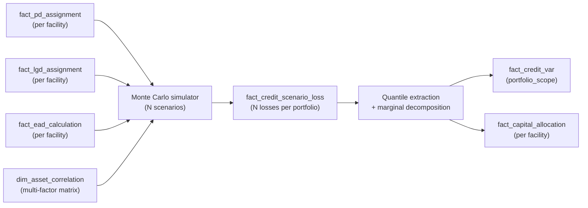

# Credit Module 11 — Unexpected Loss & Credit VaR

!!! abstract "Module Goal"
    Expected Loss is what the firm *expects* to lose. Unexpected Loss is what *kills* the firm. This module pins the distinction: where [Expected Loss](10-expected-loss.md) is the mean of the portfolio credit-loss distribution and the basis for IFRS 9 / CECL provisions, **Unexpected Loss (UL)** is the standard deviation of that distribution and **Credit Value at Risk** is a high-quantile (typically 99.9%) of it — the basis for Basel IRB regulatory capital and for the firm's internal economic-capital allocation. The module covers the conceptual shape of the portfolio loss distribution (heavily right-skewed, bounded at zero, fat-tailed because defaults cluster in recessions), the two production-grade models the industry runs to produce it (the **Asymptotic Single Risk Factor** model behind Basel IRB, and the **CreditMetrics**-style multi-factor Monte Carlo behind most economic-capital systems), and the data-engineering punchline that mirrors [MR M12](../modules/12-aggregation-additivity.md): Credit VaR is *not additive* across counterparties, the warehouse must store the components that recompute it, and the `fact_credit_var` table is the *output* of a portfolio model, not a sum of facility-level VaRs. The module is structurally analogous to the Market Risk flagship [MR M09 (Value at Risk)](../modules/09-value-at-risk.md); read them as a pair.

---

## 1. Learning objectives

By the end of this module, you should be able to:

- **Distinguish** Expected Loss from Unexpected Loss, write the formal definitions of each as the mean and the standard deviation of the portfolio credit-loss distribution respectively, and pin the conventional sign convention (loss is positive in credit risk; the credit warehouse rarely stores signed P&L).
- **Describe** the qualitative shape of the portfolio credit-loss distribution — bounded at zero, right-skewed, with a heavy right tail driven by correlated defaults in stressed periods — and explain why standard Gaussian assumptions fail at the tail and force the industry into either closed-form Vasicek-type formulas or full Monte Carlo simulation.
- **Compute** a Credit VaR via a stylised one-factor Monte Carlo simulation of a small portfolio, identify the role of the asset-correlation parameter ρ in fattening the tail, and articulate why the simulator's expected loss reconciles to the analytical PD × LGD × EAD product to within sampling noise.
- **Identify** the Asymptotic Single Risk Factor (ASRF) model as the closed-form derivation behind the Basel IRB capital formula, write the formula symbolically, and articulate which parameters the bank estimates and which the regulator prescribes.
- **Outline** the CreditMetrics methodology at conceptual level: multi-factor asset-correlation matrix, Merton-based default and rating-migration thresholds, full Monte Carlo loss simulation, and the comparison to ASRF (ASRF is the limiting case of the CreditMetrics simulator on an infinitely granular, single-factor portfolio).
- **Recognise** the non-additivity of Credit VaR — Credit VaR(A + B) ≤ Credit VaR(A) + Credit VaR(B) — explain the diversification benefit that lives in the gap, and apply the [MR M12](../modules/12-aggregation-additivity.md) storage rule: store the components needed to recompute, never pre-aggregate VaR.
- **Specify** the grain and column set for `fact_credit_var` (portfolio-scope, business-date, model-version, confidence-level, horizon) and its companion `fact_capital_allocation` (per-facility capital contribution), and design the metadata flag that prevents BI tools from silently SUM-aggregating credit-VaR figures.

## 2. Why this matters

EL is what you expect to lose. UL is what kills the firm. The morning credit-risk pack opens with the EL — a single dollar figure on the front page that an executive can read and act on — but the figure that determines whether the firm has enough capital to survive a recession sits behind it: the 99.9th-percentile credit-portfolio loss, the **Credit Value at Risk**. Where market risk's tail measure is VaR on a P&L distribution (the [MR M09](../modules/09-value-at-risk.md) workhorse), credit risk's tail measure is Credit VaR on a *loss* distribution — and the loss distribution looks nothing like a Gaussian P&L. It is bounded at zero (you cannot profit from a default, except in the narrow case of a collateral over-recovery which is rare and capped), heavily skewed to the right (most periods produce small losses, occasional periods produce large losses), and has a long heavy tail driven by the fact that defaults *cluster* — when the economy enters a recession, obligors default together, not independently. The Credit VaR is the entire firm's view of how bad the bad scenarios can get; getting it wrong is what produced the credit crisis of 2008 in slow motion.

The data engineer's role in this picture is a specific one. Credit VaR is the *output* of a multi-month quant-team project — a portfolio model that takes per-facility PD, LGD, and EAD as inputs, layers an asset-correlation structure on top, and either applies a closed-form Vasicek-Gordy formula (for ASRF regulatory capital) or runs tens of thousands of Monte Carlo scenarios (for economic-capital systems like CreditMetrics, KMV Portfolio Manager, or Moody's RiskFrontier). The data engineer does not implement the portfolio model. The data engineer *feeds* it with reproducible facility-level inputs, *stores* its outputs at the right grain in a `fact_credit_var` table, and *governs* the consumption pattern — most notably the BI semantic-layer rule that forbids SUM-aggregating Credit VaR across portfolios (because Credit VaR is non-additive, exactly as Market VaR is non-additive — see [MR M12 §3.4](../modules/12-aggregation-additivity.md)). The flagship pedagogical point of this module is the *contrast* with [Expected Loss](10-expected-loss.md): EL is additive across counterparties, Credit VaR is not; the warehouse storage rules diverge accordingly.

This module sits at the methodological pinnacle of Phase 3 because it integrates everything Phases 1-2 and the four prior risk-measure modules have built. The PD ([C07](07-probability-of-default.md)) determines where on the loss-distribution x-axis each facility's contribution lives; the LGD ([C08](08-loss-given-default.md)) determines how much loss each default produces; the EAD ([C09](09-exposure-at-default.md)) determines the dollar exposure that LGD applies to; the [EL](10-expected-loss.md) is the mean of the loss distribution that this module characterises the *tail* of. The reader who has worked through C07-C10 should recognise that this module is not introducing new building blocks — it is composing the existing ones into the portfolio-level shape that drives the firm's capital number. The reader still uncertain about any of those components should read this module *after* shoring up the foundation; the integration argument is much harder to follow without firm grasp of the per-facility inputs.

A fourth framing point on **the regulatory significance**. Credit VaR is the single largest driver of bank-regulatory capital. For a large universal bank, credit-risk RWA typically accounts for 60-80% of total RWA; market-risk RWA is 10-20% and operational-risk RWA the remainder. The Credit VaR figure (or the IRB closed-form equivalent) drives the largest line item on the regulatory-capital submission and is the most consequential single number the credit-portfolio model produces. A 5% error in the Credit VaR figure translates directly into a 5% error in the largest component of regulatory capital — and for a $50B-equity bank, 5% of credit-risk capital is roughly $1.5B of misstated capital, large enough to trigger a regulatory finding and, in extreme cases, a capital-raising requirement. The discipline around this number is correspondingly high; the data engineer who feeds the credit-portfolio pipeline lives with a higher reliability bar than the data engineer who feeds (say) the segment-level surveillance dashboard.

A fifth framing point on **how this module relates to the upcoming Credit Stress Testing module**. Credit VaR is a measure of the credit-loss distribution under the model's assumed distributional shape — the closed-form ASRF or the fitted multi-factor CreditMetrics. Credit stress testing, by contrast, asks "what is the credit loss under a specific hypothetical scenario?" — typically a regulator-prescribed severely-adverse macroeconomic path (CCAR, EBA stress test, ICAAP stress scenarios). The two are related: a Credit VaR at the 99.9th percentile is approximately the loss in a "1-in-1000-year" stress scenario; a credit stress test produces the loss in a specific prescribed scenario. Both are tail measures; both consume the same per-facility PD / LGD / EAD inputs; both produce numbers that feed regulatory submissions. The stress testing module (covered in detail in the upcoming Credit Stress Testing module) sits alongside this module as the second pillar of Phase 3's tail-measure pair.

!!! info "Honesty disclaimer"
    This module covers Credit VaR concepts and the data shapes that result, not the implementation of credit-portfolio models. A full Monte Carlo credit-portfolio simulation is a multi-month quant project; the goal of this module is to teach the data professional what numbers the model team produces, how to store them, and how downstream consumers should and should not use them. The stylised one-factor simulator in §4 Example 2 is a *teaching scaffold* — 100 homogeneous obligors, one common factor, default-only (no rating migration), no concentration adjustment, no time-varying correlation — that makes the loss-distribution shape visible but is several orders of magnitude simpler than what JPMorgan's CreditMetrics, Moody's KMV Portfolio Manager, or any in-house equivalent runs in production. Where the author's confidence drops — specifically in the calibration of multi-factor asset-correlation matrices, in the granularity-adjustment formulas for concentrated portfolios, and in the bank-specific tuning of the migration-matrix transitions for CreditMetrics-style rating dynamics — the module says so and points to the standard references. The data-engineering content (storage shape, additivity rule, model-version metadata, reproducibility requirement) is on solid ground; the quant-modelling content is sketched only to the depth a data professional needs to understand the outputs they will be receiving and serving.

## 3. Core concepts

A reading map:

- §3.1 pins the EL → UL → Credit VaR → Credit ES progression and the conventions each measure carries.
- §3.2 walks why credit losses are non-Gaussian — the bounded-at-zero, right-skewed, fat-tailed shape and why standard Gaussian intuition fails.
- §3.3 walks the conceptual portfolio loss distribution diagram and labels EL, UL, Credit VaR, and Credit ES on it.
- §3.4 covers correlation — the parameter that drives tail thickness; without it the law of large numbers would make portfolio loss approximately normal, and there would be no flagship module to write.
- §3.5 introduces the Asymptotic Single Risk Factor (ASRF) model, the closed-form derivation behind Basel IRB capital.
- §3.6 introduces CreditMetrics intuition — the multi-factor Monte Carlo workhorse for economic capital.
- §3.7 pins the Credit VaR vs. Capital relationship — two related but non-identical numbers.
- §3.8 is the load-bearing data-engineering section: the non-additivity of Credit VaR and the storage rule that follows.
- §3.9 specifies the `fact_credit_var` and `fact_capital_allocation` table shapes.

A reading note before diving in. Section 3 builds Credit VaR in eleven sub-sections, ordered from the conceptual definitions through the closed-form ASRF and the Monte Carlo CreditMetrics through the data-engineering storage shape and BI patterns. Sections 3.1-3.3 are the definitional layer that every reader should internalise. Sections 3.4-3.6 cover the modelling layer at the depth a data engineer needs to make sense of the upstream pipeline. Section 3.7 (the Credit VaR vs. capital relationship) is the bridge to the Pillar 1 / Pillar 2 regulatory framing in 3.7a. Sections 3.8-3.10 are the load-bearing data-engineering content (non-additivity, storage shape, aggregation patterns); section 3.11 is a brief vendor-systems orientation. Readers comfortable with credit-portfolio modelling can skim to 3.8 for the storage discussion; readers new to Credit VaR should read top to bottom.

### 3.1 From EL to UL to Credit VaR to Credit ES

Let \(L\) denote the portfolio's credit loss over a defined horizon (typically one year for capital and economic-capital calculations). \(L\) is a non-negative random variable — losses are bounded below at zero, because in the standard credit model an obligor either defaults (producing a loss) or does not (producing zero loss), and the recovery process produces a recovery rate in [0, 1] which means LGD × EAD is the maximum loss per defaulted facility. The four headline statistics of \(L\) the credit warehouse must serve are:

- **Expected Loss** (EL): the mean of \(L\). \(\text{EL} = E[L]\). The IFRS 9 / CECL provisioning input; the daily-pack headline figure ([C10](10-expected-loss.md)).
- **Unexpected Loss** (UL): the standard deviation of \(L\). \(\text{UL} = \sqrt{\text{Var}(L)}\). The intermediate diagnostic — half-step between EL and the tail measures, useful for understanding portfolio dispersion but not by itself a capital number.
- **Credit Value at Risk** (Credit VaR) at confidence \(\alpha\): the \(\alpha\)-quantile of the loss distribution. \(\text{CreditVaR}_\alpha = \inf\{\ell : P(L \leq \ell) \geq \alpha\}\). Conventionally \(\alpha = 0.999\) for regulatory capital (Basel IRB), 0.9997 or even 0.99995 for some economic-capital systems, 0.99 or 0.995 for desk-level credit-risk monitoring.
- **Credit Expected Shortfall** (Credit ES) at confidence \(\alpha\): the mean loss conditional on the loss exceeding the VaR threshold. \(\text{CreditES}_\alpha = E[L \mid L \geq \text{CreditVaR}_\alpha]\). The coherent alternative to Credit VaR (it satisfies sub-additivity where VaR does not — [MR M09 §3.7](../modules/09-value-at-risk.md)); increasingly served alongside Credit VaR in modern economic-capital systems.

A note on **sign conventions** that differs from the market-risk treatment. In market risk, P&L can be positive (profit) or negative (loss), and the sign convention on `fact_var` is "VaR is a positive loss number" ([MR M09 §3.1](../modules/09-value-at-risk.md)) — the loader does the conversion at write time. In credit risk, loss is *always non-negative*: the model produces a loss distribution on \([0, \infty)\) directly, not a P&L distribution that admits both signs. The `fact_credit_var.var_usd` column is therefore unambiguously a positive number; there is no profit/loss sign-flip bug to worry about. (The exception: in CreditMetrics-style models that mark to market on rating *migrations* as well as defaults, a positive migration — an obligor upgraded from BBB to A — produces a positive mark-to-market on the held bond. Migration models can therefore admit small positive values in the loss distribution. Default-only models cannot.)

A second note on **horizon**. Credit VaR is conventionally a *one-year* measure, far longer than the one-day or ten-day horizons of Market VaR. The one-year horizon reflects the credit-event timescale: defaults take months to develop and resolve; rating migrations take quarters; the realised loss on a credit portfolio is observable only on a one-year-plus cadence. The Basel IRB capital formula is calibrated to a one-year horizon and a 99.9% confidence level; the data dictionary should pin both on every `fact_credit_var` row.

A third note on **confidence-level conventions** the warehouse must support. Credit VaR is typically computed at several confidence levels in parallel, each serving a different consumer:

- **95%** — desk-level credit-limit monitoring. Refreshed daily; the credit officer's intra-day view.
- **99%** — segment-level surveillance and economic-capital diagnostics. The mid-tier reporting layer.
- **99.5%** — some European insurance frameworks (Solvency II uses 99.5%); not Basel but read by colleagues in adjacent regulatory regimes.
- **99.9%** — Basel IRB regulatory capital. The headline regulatory figure.
- **99.95% to 99.99%** — economic-capital "target rating" frameworks. A bank that targets an AA rating on its senior debt typically picks a confidence level matching the historical default rate of AA-rated banks (around 0.03%, hence 99.97%); a bank targeting A targets 99.9%; a bank targeting AAA targets 99.99%.

Five rows per portfolio per business date is the typical configuration; each row carries its `confidence_level` explicitly and the consumer filters to whichever they need.

The compute cost is approximately constant in the number of confidence levels (one Monte Carlo run produces every quantile from the same scenario set) but the storage cost scales linearly; the trade-off favours storing all five.

A practical observation on the storage choice: some firms store the *full* loss vector and let the consumer compute any quantile on demand; others store a fixed set of pre-computed quantiles. The full-vector approach offers flexibility (any quantile is reachable) at a storage cost (N rows per portfolio per business date); the pre-computed approach offers query speed at a flexibility cost. Most large firms do both — the full vector lives on `fact_credit_scenario_loss` with a tiered retention policy (online for recent dates, archived for older), and the pre-computed quantiles live on `fact_credit_var` for the headline confidence levels.

A summary of the conventions in tabular form:

| Convention | Market VaR | Credit VaR |
|---|---|---|
| Sign of measure | Positive loss number (loader converts) | Positive loss number (model produces directly) |
| Horizon | 1 day / 10 days (typical) | 1 year (typical) |
| Confidence | 95% / 99% / 97.5% ES (FRTB) | 95% / 99% / 99.5% / 99.9% / 99.97% (Basel + economic) |
| Distribution support | \((-\infty, \infty)\) | \([0, \infty)\) (default-only) or \((-\infty, \infty)\) (with migrations) |
| Capital relationship | Capital is the VaR plus stressed VaR plus IRC plus add-ons | Capital is the VaR minus EL |
| Backtest cadence | Daily exceedance count over 250 days | Annual; PD calibration backtest the main lever |

The Market-vs-Credit contrast across these conventions is worth keeping front of mind; many of the warehouse-design quirks in credit derive from one of these rows.

A fourth note on **the relationship between EL, UL, and Credit VaR symbolically**. For a sufficiently large portfolio and a unimodal right-skewed loss distribution, the high-quantile loss can be approximated by:

$$
\text{CreditVaR}_\alpha \approx \text{EL} + k_\alpha \cdot \text{UL}
$$

where \(k_\alpha\) is a quantile multiplier that depends on the distribution's shape. For a Gaussian, \(k_{0.999} = 3.09\); for a typical empirical credit-loss distribution, \(k_{0.999}\) is in the 6-12 range (because of the heavier-than-Gaussian tail). The approximation is only that — an approximation — and the production figure comes from the simulator's empirical quantile, not from \(\text{EL} + k_\alpha \cdot \text{UL}\). But it makes the structural relationship visible: Credit VaR exceeds EL by some multiple of UL, and the multiple is a function of how fat the tail is. A consumer who sees a Credit VaR of (say) 12× the EL and a UL of (say) 1.5× the EL should infer that the implied \(k\) is about 7-8 — within the normal range for a well-diversified credit portfolio.

### 3.2 Why credit losses are non-Gaussian

The portfolio credit-loss distribution does not look like the bell-curve P&L distribution that market-risk readers have internalised from [MR M09](../modules/09-value-at-risk.md). Three structural features force it into a different shape:

- **Bounded below at zero.** The loss random variable is non-negative by construction. There is no "negative-loss" tail; the distribution has support \([0, \infty)\) only. This immediately breaks the symmetry that the Gaussian assumes.
- **Highly right-skewed.** Most periods produce small portfolio losses (a handful of expected-shape defaults across thousands of obligors); occasional periods produce very large losses (a recession in which many obligors default together). The distribution's mode sits near zero (or somewhat above, at the median expected-shape loss); the right tail stretches out far beyond the mode. The skewness is severe — typical empirical skewness for an annual credit portfolio loss distribution is 3-8, where a Gaussian has skewness zero.
- **Heavy right tail driven by correlated defaults.** If obligor defaults were independent, the central limit theorem would apply: the portfolio loss for a large portfolio would be approximately normal around the EL, with a standard deviation that shrinks as \(1 / \sqrt{N}\) for \(N\) obligors. They are not independent. Defaults cluster in recessions (and within industries in industry-specific downturns; within regions in regional crises). The correlation structure is what produces the fat tail; without it, credit-portfolio risk management would be a much smaller industry than it is.

The consequence for the practitioner: standard normal assumptions fail badly in the tail. A 99.9% Credit VaR computed under a Gaussian assumption typically *under-states* the true 99.9% loss by a factor of 2-5x for a typical large portfolio, because the Gaussian's tail is much thinner than the empirical one. The industry's two production responses to this:

- **Closed-form Vasicek-type formulas** that build the right-skewed loss distribution analytically from a one-factor Merton structural model — the basis of the ASRF model in §3.5.
- **Full Monte Carlo simulation** that samples the joint default outcomes under a fitted multi-factor correlation structure — the basis of CreditMetrics in §3.6.

Both produce loss distributions with the right qualitative shape (right-skewed, bounded at zero, fat-tailed). The closed-form is faster and is the regulatory standard; the Monte Carlo is more flexible and is the economic-capital standard.

A short illustration of the failure mode. Suppose a 1,000-facility portfolio with per-facility PD = 1%, LGD = 50%, EAD = $1M (total EAD $1B). Under an independence assumption (zero correlation), the number of defaults \(D \sim \text{Binomial}(1000, 0.01)\); the 99.9th-percentile loss is the loss corresponding to the 99.9th-percentile of \(D\), which is about 22 defaults (the binomial tail is thin); the dollar loss is \(22 \cdot 0.5 \cdot \$1\text{M} = \$11\text{M}\), about 2.2× the EL of $5M. Under realistic correlation (\(\rho = 0.20\)), the 99.9th-percentile number of defaults is closer to 60-80; the dollar loss is $30-40M, about 6-8× the EL. The factor of 3-4× between the two figures is *entirely* the correlation effect; ignoring correlation in the loss model produces a capital number that misses the dominant driver of credit-portfolio risk.

Three structural-feature contrasts with the Gaussian P&L distribution that the Market-Risk reader has internalised:

| Feature | Gaussian P&L (Market Risk) | Empirical credit-loss distribution |
|---|---|---|
| Support | \((-\infty, \infty)\) | \([0, \infty)\); bounded below |
| Symmetry | Symmetric around mean | Right-skewed; mean to right of mode |
| Tail thickness | Thin (excess kurtosis 0) | Heavy (excess kurtosis 5-30 typical) |
| Tail driver | Continuous market moves | Discrete default events, correlated |
| Closed-form available? | Yes (normal CDF) | No (Vasicek closed-form is asymptotic only) |
| Aggregation property | Sub-additive at best | Sub-additive at best |
| Backtestable on short horizon? | Yes (daily P&L) | No (annual losses; need 10-20 years) |

The contrast table is worth keeping in front of the data engineer transitioning from market risk to credit risk; the warehouse patterns differ in important ways downstream of these structural differences.

A further structural feature worth pinning: **the loss distribution's shape changes with confidence level**. The bulk of the credit-loss distribution (the body, around the mean) is dominated by uncorrelated idiosyncratic defaults; the tail (the 99% and beyond) is dominated by correlated systemic defaults. Different confidence levels therefore probe different parts of the distribution's shape, and the ratio of (99.9% VaR) / (95% VaR) is a useful diagnostic — for a well-diversified portfolio it sits around 2-3×; for a concentrated or highly-correlated portfolio it can exceed 5×. The data engineer can compute and store this ratio as a single column on `fact_credit_var` (or compute it on-the-fly in the BI layer); risk-management committees use it as a quick read on portfolio quality.

### 3.3 The portfolio loss distribution — the picture

The conceptual shape of the portfolio credit-loss distribution that every credit-risk practitioner carries in their head:

```text
              Portfolio credit-loss distribution (density)
              X-axis: loss in dollars   Y-axis: probability density

  density
     |
     |          *
     |        *****
     |       *******
     |      *********
     |     ***********
     |    *************
     |   ***************
     |  *****************
     | *******************
     |********************
     |*********************
     |**********************
     |***********************
     |************************
     |*************************
     |***************************
     |*****************************
     |********************************
     |***************************************
     |***********************************************
     +----+-----+--------+-----------+--------------+----> loss ($)
          0    EL       UL          Credit VaR    extreme
                       (1 std        (99.9%)      tail
                        dev          tail
                        away)

         |<-EL->|             |<--- Capital --->|
                              EL is provisioned
                              Capital covers UL
```

Three labels that the warehouse must serve every consumer:

- **EL** sits at the mean of the distribution. It is what the firm expects to lose on the portfolio over the horizon; it is the figure the IFRS 9 / CECL provisioning recognises and the daily credit pack opens with. ([C10](10-expected-loss.md))
- **UL** is the standard deviation of the distribution. It is a dispersion measure, not by itself a capital number, but it is the natural intermediate diagnostic — a portfolio with low UL is well-diversified; a portfolio with high UL is concentrated or correlated.
- **Credit VaR at 99.9%** sits far out in the right tail. It is the loss level that is exceeded only one year in 1,000; it is the regulatory benchmark for IRB capital. The distance from EL to Credit VaR is what the firm's capital must cover (the EL is already provisioned for at the accounting layer).

The **capital** number is therefore conceptually:

$$
\text{Capital} = \text{CreditVaR}_{0.999} - \text{EL}
$$

— a quantile *minus* the mean. The subtraction recognises that the EL piece is already on the balance sheet as a provision (the loan-loss allowance); the capital should cover only the *unexpected* piece beyond the expectation. This is the cleanest single-sentence summary of why the regulatory framework deducts EL from capital: it avoids double-counting the expected loss across two balance-sheet line items.

A practical observation on **reading the distribution picture in front of executives**. The right-skewed shape is counter-intuitive for an audience used to looking at Gaussian P&L distributions in market risk. The talking points worth pinning when explaining the picture:

- "The peak is near zero, not at the EL — most years are quiet."
- "The mean (EL) sits to the right of the peak because the long tail pulls the mean upward."
- "Capital covers the area between EL and the 99.9% quantile — not the area to the left of the EL (that's the provision)."
- "The tail is heavy because defaults cluster in bad years; in a normal year you get only a handful of defaults, in a bad year you get many at once."

The picture itself is a useful executive-communication tool; many credit-portfolio teams print a stylised version on the front of the quarterly board pack, with the firm's actual EL, UL, and 99.9% VaR figures marked on the axes. The data engineer's contribution to that pack is the underlying numbers; the picture itself is typically a stock graphic.

A second practical observation on **the "Capital is to UL what EL is to PD" mental model**. The mental model that most easily clicks for non-technical audiences:

| Layer | Statistical quantity | Accounting / regulatory role |
|---|---|---|
| Expected layer | Mean (EL) | IFRS 9 / CECL provisioning |
| Unexpected layer | High quantile minus mean | Regulatory and economic capital |
| Stress layer | Beyond-VaR loss in defined stress scenarios | ICAAP stress testing |

— three layers that build on each other, each consumed by a different stakeholder group, all served from the same per-facility PD / LGD / EAD inputs. The data engineer who can articulate this three-layer picture to a CFO, a controller, and a regulator in turn is the data engineer the credit-portfolio team will keep promoting.

### 3.4 Why correlation matters

If all obligors defaulted independently, the law of large numbers would do all the work and the portfolio loss distribution would be approximately normal. Consider a portfolio of \(N\) obligors each with PD = \(p\), LGD = \(l\), and EAD = \(e\). The portfolio loss is \(L = l \cdot e \cdot D\) where \(D\) is the number of defaults. Under independence, \(D \sim \text{Binomial}(N, p)\); for large \(N\), \(D\) is approximately normal around \(Np\) with standard deviation \(\sqrt{N p (1 - p)}\). The portfolio loss is therefore approximately normal around \(N l e p\) (which is the EL), with standard deviation that grows only as \(\sqrt{N}\); the *relative* dispersion shrinks as \(1 / \sqrt{N}\). For a 10,000-obligor portfolio with PD = 2%, the 99.9% quantile under independence would be only about 1.3× the EL — a thin tail, easily covered by minimal capital.

Real credit portfolios have 99.9% Credit VaRs of 10-30× the EL. The factor of 10-25 over the independence baseline is *entirely* due to default correlation. The intuition: obligors do not default in random one-at-a-time fashion; they default in waves driven by macroeconomic conditions (recessions), industry downturns (a sector-specific crisis), regional events (a country-specific stress), and contagion (the failure of one large obligor reverberates through its counterparties). The correlation structure can be summarised in a single parameter — the **asset correlation** \(\rho\) — that measures how much of each obligor's asset value is driven by the common systemic factor vs. its idiosyncratic factor:

$$
A_i = \sqrt{\rho} \cdot Z + \sqrt{1 - \rho} \cdot Z_i
$$

where \(A_i\) is obligor \(i\)'s standardised asset return, \(Z\) is a common factor shared across all obligors, and \(Z_i\) is the obligor-specific idiosyncratic factor. The pairwise correlation between any two obligors' asset returns is exactly \(\rho\). When \(\rho = 0\), the obligors are independent and the portfolio loss is approximately normal; when \(\rho = 1\), the obligors default in lockstep and the portfolio loss is bimodal (either zero or the maximum). Realistic Basel-corporate values sit at \(\rho \in [0.12, 0.24]\) depending on PD; the higher the PD, the lower the regulator's prescribed correlation, on the empirical observation that distressed obligors default more for idiosyncratic reasons (a single bad deal) than for systemic reasons (the macro environment).

The simulation in §4 Example 2 makes the correlation effect quantitatively visible: holding everything else constant, raising \(\rho\) from 0.05 to 0.50 increases the 99.9% Credit VaR by a factor of 5-7×, while leaving the EL essentially unchanged. The expected loss is correlation-independent (expectations sum regardless of covariance); the tail is correlation-driven (variance and higher moments depend on covariance).

A practical observation on **where the correlation estimate comes from**. Three broad approaches in production:

- **Equity-implied correlation (KMV style).** For listed obligors, the asset correlation is inferred from the correlation of the obligors' equity returns, with a deleveraging adjustment to convert equity correlation to asset correlation. The advantage: a continuously observable input (daily equity prices); the disadvantage: only applies to listed names. The KMV / Moody's RiskFrontier framework is built around this approach.
- **Ratings-based correlation.** The asset correlation is set to a fixed value per asset class (Basel IRB is this approach, with a PD adjustment). The advantage: simple, transparent, applies uniformly across listed and unlisted names; the disadvantage: ignores firm-specific information that might inform a more accurate correlation estimate.
- **Empirical default correlation.** The asset correlation is calibrated from historical default-correlation data (e.g. Moody's annual default studies that report year-by-year default rates per rating; the cross-rating correlation can be inferred from the joint variation in default rates). The advantage: directly empirical; the disadvantage: defaults are rare events, so the historical sample is sparse and the estimates are noisy.

Most production systems use a hybrid: KMV-style equity correlation as the primary driver where available, ratings-based fallback for non-listed names, and empirical-default-correlation cross-checks during model validation. The `dim_obligor.asset_correlation_method` column on the warehouse identifies which approach was used for each obligor; the methodology document describes the hybrid logic.

A second practical observation on **the systemic-factor interpretation**. The single common factor \(Z\) in the one-factor model is often described informally as "the macroeconomic factor" or "the business cycle". In a multi-factor extension (CreditMetrics), the factors are typically named for what they represent — "North American industrial", "European financial", "Asian export-sensitive", "global energy", etc. — each fitted from a long-run regression of obligor-segment performance on macroeconomic and market indicators. Most production correlation matrices have 20-50 named factors arranged in a tree (region → country → industry within country); the per-obligor loading is a sparse vector with non-zero entries on a handful of relevant factors. The data engineer typically does not own the calibration of these factors (that is a quant team's responsibility) but does own the bitemporal persistence of the resulting loading vectors and the propagation of any recalibration to the downstream Credit VaR runs.

A third observation on **time-varying correlation**. The discussion above treats \(\rho\) as a fixed parameter; in practice asset correlation varies through the cycle. Crisis periods see asset correlations rise across the board (the "correlation spike" phenomenon — in stressed markets, everything correlates with everything else, and the diversification benefit shrinks); calm periods see correlations decline. A static correlation matrix calibrated on a calm period understates the stress correlation by 0.1-0.2 in the rho parameter; the Credit VaR computed from that matrix understates the true stress-period tail risk. The pragmatic response: calibrate the correlation matrix on a long window that includes at least one stress period (typically the 2008-2009 financial crisis is included in the calibration window for matrices used in production today), or run a parallel "stressed correlation" Credit VaR using a matrix calibrated only on stress periods. Both numbers are stored; the firm's risk appetite framework typically pins to whichever produces the larger capital figure.

### 3.5 The Asymptotic Single Risk Factor (ASRF) model

The **Asymptotic Single Risk Factor** model, derived by Gordy (2003) building on Vasicek (2002), is the closed-form distribution behind the Basel IRB regulatory-capital formula. It is the limiting case of the one-factor model of §3.4 as the portfolio size grows without bound — "asymptotic" in the granularity dimension. Three pieces:

**The Merton-style structural assumption.** Each obligor's asset value follows a one-factor model:

$$
A_i = \sqrt{\rho} \cdot Z + \sqrt{1 - \rho} \cdot Z_i, \qquad Z, Z_i \sim N(0, 1) \text{ i.i.d.}
$$

Obligor \(i\) defaults when \(A_i\) falls below a threshold \(c_i\) calibrated so that \(P(A_i \leq c_i) = \text{PD}_i\), i.e. \(c_i = \Phi^{-1}(\text{PD}_i)\). The structural intuition (from Merton's 1974 corporate-debt model) is that the asset return represents the value of the firm's assets; default occurs when assets fall below a debt-coverage threshold.

**Conditional independence given the systemic factor.** Conditional on a realised value of \(Z\), the obligors are independent. The conditional default probability for obligor \(i\) given \(Z = z\) is:

$$
\text{PD}_i(z) = P(A_i \leq c_i \mid Z = z) = \Phi\!\left( \frac{\Phi^{-1}(\text{PD}_i) - \sqrt{\rho} \cdot z}{\sqrt{1 - \rho}} \right)
$$

In a bad systemic scenario (\(z\) very negative), the conditional PD jumps far above the unconditional PD — this is the mechanism that produces the fat tail.

**The asymptotic limit.** In the limit of infinite portfolio granularity (no single obligor accounts for a non-trivial share of the portfolio), the law of large numbers applies *conditionally on \(Z\)*: the portfolio loss given \(Z = z\) converges to \(\text{LGD} \cdot \text{PD}(z) \cdot \text{EAD}\) deterministically. The portfolio loss distribution is therefore the distribution of this conditional loss as \(Z\) varies over the standard normal — and the high-quantile loss is the one corresponding to a high-quantile bad \(Z\). For the 99.9th-percentile loss, \(Z = -\Phi^{-1}(0.999) = -3.0902\) (the lower 0.1th percentile of the standard normal). Substituting:

$$
\text{Loss}_{0.999} = \text{LGD} \cdot \Phi\!\left( \frac{\Phi^{-1}(\text{PD}) + \sqrt{\rho} \cdot \Phi^{-1}(0.999)}{\sqrt{1 - \rho}} \right) \cdot \text{EAD}
$$

This is the Vasicek closed-form expression for the 99.9th-percentile portfolio loss under the ASRF assumptions. The Basel IRB capital requirement subtracts the EL (\(\text{LGD} \cdot \text{PD} \cdot \text{EAD}\)) and applies a maturity adjustment for facilities with \(M \neq 2.5\) years:

$$
K = \text{LGD} \cdot \left[ \Phi\!\left( \frac{\Phi^{-1}(\text{PD}) + \sqrt{\rho} \cdot \Phi^{-1}(0.999)}{\sqrt{1 - \rho}} \right) - \text{PD} \right] \cdot \text{MaturityAdj}(M, \text{PD})
$$

where \(K\) is the per-dollar-of-EAD capital requirement (multiply by EAD to get the dollar capital). \(K \cdot \text{EAD}\) is the regulatory capital number; \(K \cdot \text{EAD} \cdot 12.5\) is the risk-weighted asset (RWA), by the standard inverse of the 8% minimum capital ratio.

A critical observation on **what the bank estimates and what the regulator prescribes**. The PD, LGD, EAD, and effective maturity \(M\) are estimated by the bank (subject to regulatory approval and validation); the asset correlation \(\rho\), the 99.9% confidence level, the maturity-adjustment formula, and the 12.5 RWA multiplier are *prescribed by the regulator* — the bank does not get to estimate \(\rho\) and use whatever value its empirical analysis suggests for IRB capital purposes. The Basel corporate \(\rho\) is itself a function of PD, ranging from 0.24 at PD = 0 down to 0.12 at high PD:

$$
\rho(\text{PD}) = 0.12 \cdot \frac{1 - e^{-50 \text{PD}}}{1 - e^{-50}} + 0.24 \cdot \left(1 - \frac{1 - e^{-50 \text{PD}}}{1 - e^{-50}}\right)
$$

with different formulae for retail, sovereign, bank, and SME exposures. The data engineer's job is to apply the prescribed formula correctly per asset class; the model team's job is to estimate the PD, LGD, EAD, and M inputs. The output is two facts: `fact_regulatory_capital` (the dollar capital per facility) and the associated RWA. See [Example 1](#example-1-python-basel-irb-capital-formula-for-a-single-corporate-facility) for the working implementation.

A second observation on **the asymptotic-granularity assumption**. The ASRF model assumes infinite granularity — no single obligor is a non-trivial share of the portfolio. Real portfolios are finite and sometimes concentrated; a portfolio where the largest 10 obligors account for 30% of the EAD is *not* in the asymptotic limit, and the ASRF formula understates the true 99.9th-percentile loss by an amount called the **granularity adjustment** (Pykhtin 2004, Gordy and Lütkebohmert 2013). Basel II's original framework included an explicit granularity adjustment; Basel III's IRB formulation dropped it from the Pillar 1 calculation but expects banks to capture it through Pillar 2 economic-capital frameworks. For a data engineer this means: the `fact_regulatory_capital` figure from the IRB formula is *not* the only capital number the warehouse must serve; an economic-capital figure that includes the granularity adjustment is also stored, typically on a parallel `fact_economic_capital` table or as a separate row on the same fact distinguished by `capital_basis`.

A third observation on the **portfolio-invariance property** that the ASRF derivation deliberately preserves. The IRB capital formula, by construction, produces a per-facility capital figure \(K_i \cdot \text{EAD}_i\) that does not depend on the rest of the portfolio. The capital for FAC001 is computed from FAC001's own PD, LGD, EAD, and M; adding FAC002 to the portfolio does not change FAC001's capital. This is the portfolio-invariance property and is what makes the IRB formula tractable for regulatory implementation: the regulator can specify a per-facility rule, the bank applies it to each facility independently, and the firmwide capital is the sum across facilities. The mathematical price for this convenience is that the IRB formula does not see concentration effects: a portfolio of 10,000 small facilities and a portfolio of 100 large facilities with the same per-facility PD / LGD / EAD distribution produce identical IRB capital figures, even though the small-portfolio version is genuinely more diversified and would have a lower true Credit VaR. The portfolio invariance is therefore both a feature (operational simplicity) and a limitation (no concentration sensitivity); the granularity adjustment in Pillar 2 is the explicit recognition of the limitation.

A fourth observation on the **IRB formula variants**. The corporate formula in §3.5 is one of several variants in the Basel framework. The most commonly encountered:

- **Corporate.** The variant in §3.5; \(\rho(\text{PD}) \in [0.12, 0.24]\); applies to standard corporate exposures.
- **SME corporate.** Same shape as corporate but with a firm-size adjustment that reduces \(\rho\) for SMEs (recognising that small firms are more idiosyncratic and less driven by the common systemic factor).
- **Specialised lending (SL).** A separate slot category (project finance, object finance, commodities finance, income-producing real estate); uses an additional supervisory slotting overlay.
- **Retail mortgage.** \(\rho\) is fixed at 0.15 (no PD dependence); no maturity adjustment (mortgages are assumed to be one-year-rolling for capital purposes).
- **Qualifying revolving retail (QRRE).** \(\rho\) is fixed at 0.04 (much lower than corporate, reflecting the highly idiosyncratic nature of credit-card defaults); no maturity adjustment.
- **Other retail.** \(\rho(\text{PD}) \in [0.03, 0.16]\) on a different decay schedule; no maturity adjustment.
- **Sovereign and bank.** Same shape as corporate but with separate \(\rho\) calibrations.

The data engineer who serves IRB capital across the full asset-class spectrum implements all six (or more) variants in the capital-engine library; the `dim_facility.asset_class` column routes each facility to the right formula. The `c11-irb-capital.py` script in §4 Example 1 implements only the corporate variant; the others follow the same pattern with different correlation and maturity-adjustment formulas.

### 3.6 CreditMetrics intuition

**CreditMetrics**, originally published by JPMorgan in 1997 (now maintained by RiskMetrics Group as part of MSCI), was the first commercially distributed credit-portfolio model and remains the conceptual workhorse for economic-capital systems across the industry. The key differences from ASRF:

- **Multi-factor correlation matrix.** ASRF uses a single common factor \(Z\); CreditMetrics uses a fitted multi-factor model — typically 5-50 factors representing industry, region, and macroeconomic dimensions — with each obligor's asset return loading on the relevant subset of factors. The pairwise correlation between two obligors depends on their factor loadings; obligors in the same industry and region have higher pairwise correlation than obligors in unrelated sectors. The data dictionary on `dim_obligor` typically carries the factor-loading vector (or a pointer to it on a separate `dim_obligor_factor_loading` table).
- **Merton-based default and migration thresholds.** Each obligor's asset return is mapped to a *rating outcome* via a set of thresholds: one for each possible rating at horizon-end. A bond rated A today might transition to AA, A (unchanged), BBB, BB, B, CCC, or D (default) at year-end depending on which threshold the asset return crosses. The migration matrix is estimated from historical rating transition data (typically the Moody's or S&P long-run averages, adjusted to the current cycle).
- **Mark-to-market on rating migrations.** Unlike default-only models (which produce loss only on default), CreditMetrics produces loss (or gain) on *rating migrations*: a downgrade from A to BBB produces a market-value loss because the bond's credit spread widens and its price drops; an upgrade produces a market-value gain. The portfolio loss in each Monte Carlo scenario is the sum of mark-to-market changes across all the bonds, plus default losses on the defaulters.
- **Full Monte Carlo loss simulation.** Generate \(N\) (typically 10,000 to 1,000,000) joint asset-return scenarios; for each scenario, threshold-check each obligor to determine its rating outcome; revalue the portfolio; sum across the portfolio to get the scenario loss. The empirical quantile of the loss vector is the Credit VaR.

A step-by-step walk through one Monte Carlo scenario, to make the abstract description concrete. Say the portfolio is 50,000 facilities, the correlation matrix has 30 factors, the rating scale has 17 grades (AAA, AA+, AA, AA-, A+, A, A-, BBB+, BBB, BBB-, BB+, BB, BB-, B+, B, B-, CCC/D), and the horizon is one year. For scenario \(s\):

1. Draw 30 independent standard-normal values for the systemic factors \(Z_1, \ldots, Z_{30}\) and 50,000 independent standard-normal values for the obligor-specific idiosyncratic factors \(Z_{i, s}\).
2. For each obligor \(i\), compute the asset return \(A_{i, s} = \sum_k w_{i, k} Z_{k, s} + \sigma_i Z_{i, s}\) where the \(w_{i, k}\) are the obligor's factor loadings and \(\sigma_i\) is the idiosyncratic-variance scale (chosen so the total variance of \(A_{i, s}\) is 1).
3. Compare \(A_{i, s}\) against the 17 rating-transition thresholds for the obligor's current rating; identify which rating bucket the obligor lands in at horizon-end.
4. For each obligor that lands in the "default" bucket, compute the loss as \(\text{LGD}_i \cdot \text{EAD}_i\). For each obligor that lands in a non-default but different rating bucket, compute the mark-to-market change using the rating-transition spread differential (the new credit spread minus the old, times the bond's spread duration, times the EAD).
5. Sum all the default losses and migration losses across the 50,000 facilities; this is the portfolio loss for scenario \(s\).

Repeat for \(s = 1, \ldots, N\). The loss vector \(L_s\) of length \(N\) is the simulator's output. The empirical quantile at \(\alpha\) is the Credit VaR; the mean is the simulated EL (which cross-checks against the analytical PD × LGD × EAD); the standard deviation is the UL. The marginal contributions are derived by perturbing each facility's weight by a small amount and re-running steps 1-5, then differencing.

The compute envelope is dominated by step 4 (the per-obligor revaluation across all 50,000 facilities for each of \(N\) scenarios). For \(N = 100{,}000\) the scenario count is 5 billion per-obligor evaluations — minutes on a multi-core CPU, seconds on a GPU. The data-engineering observable: the scenario-loss table at facility-grain would be \(N \times 50{,}000 = 5 \times 10^9\) rows per business date, which is prohibitive; production systems store the portfolio-level loss vector only (length \(N\), one row per scenario) and re-run the simulator if facility-level scenario detail is needed for an investigation. The portfolio loss vector goes on `fact_credit_scenario_loss` with `(business_date, scenario_id, portfolio_scope, model_version, as_of_timestamp)` as the grain; even at the portfolio grain, this is a substantial fact table — for a daily refresh with \(N = 100{,}000\) scenarios across 20 portfolio scopes, the daily load is 2 million rows.

**Why CreditMetrics is more accurate than ASRF for concentrated portfolios.** Two reasons. First, the multi-factor correlation matrix captures the industry and region structure that ASRF's single factor cannot; for a portfolio concentrated in (say) North American energy, the ASRF correlation would understate the true tail (which is driven by oil-price moves correlated across the entire sector) while CreditMetrics with an energy factor would capture it. Second, CreditMetrics is a *finite-portfolio* simulation; it does not rely on the asymptotic-granularity assumption, so concentrated portfolios are handled correctly by construction.

**Why CreditMetrics is more computationally expensive than ASRF.** The closed-form ASRF requires one evaluation of the Vasicek formula per facility (microseconds); CreditMetrics requires \(N\) Monte Carlo scenarios, each involving the threshold check and revaluation across the entire portfolio (minutes to hours for a large portfolio with \(N \geq 100{,}000\)). The compute budget is materially higher and the operational complexity (seed management, model-parameter persistence, scenario-set reproducibility — exactly the same considerations as Market Risk's Monte Carlo VaR in [MR M09 §3.6](../modules/09-value-at-risk.md)) is correspondingly higher.

**Why most firms run both in parallel.** Regulatory capital is computed via the IRB formula (ASRF, prescribed parameters); economic capital is computed via CreditMetrics or a similar multi-factor Monte Carlo (firm-internal parameters); the two numbers differ, and the difference is informative. A regulatory capital figure substantially below the economic capital figure suggests the IRB formula is undercapitalising the portfolio (typically because of concentration the ASRF cannot see); the firm should hold capital at the higher of the two and explain the difference in its ICAAP (Internal Capital Adequacy Assessment Process) submission. The data warehouse serves both numbers from parallel fact tables; the reconciliation report sits on the data engineer's daily pack.

A practical observation on **the data-engineering surface area** of CreditMetrics. The model takes as inputs: per-obligor PD term structure, per-facility LGD, per-facility EAD, the multi-factor correlation matrix (typically a 50×50 matrix on `dim_correlation_factor`), the rating migration matrix (typically a 17×17 matrix for the S&P scale on `dim_rating_transition`), per-rating credit spreads for mark-to-market (a curve per rating on `dim_credit_spread_curve`), and an RNG seed. The outputs are the loss vector (\(N\) numbers on `fact_credit_scenario_loss`), the headline statistics (EL, UL, Credit VaR at each confidence, Credit ES), and the per-facility risk contributions (which decompose the portfolio VaR additively into facility-level components for reporting). Every one of these inputs and outputs is a bitemporal-fact-table question; the data engineer who masters this is invaluable to the credit-portfolio team.

A second-order observation on **calibration cadence**. The CreditMetrics correlation matrix is conventionally re-calibrated on a quarterly or semi-annual cadence — the multi-factor structure changes slowly because it reflects long-run industry and regional relationships, not the day-to-day market noise that drives a Market-Risk covariance matrix. The rating-transition matrix is re-calibrated annually, typically pulling in the latest rating-agency Long-Run Average Transition (LRAT) table. The credit-spread curves used for mark-to-market on migrations are updated daily from the market-data pipeline ([MR M11](../modules/11-market-data.md)). Three calibration cadences, three different governance committees, three different `dim_*` tables with bitemporal versions — the data engineer who serves CreditMetrics correctly must understand all three timelines and the propagation rules when any of them produces a new version. A re-calibration of the transition matrix mid-quarter triggers a forced re-run of the Credit VaR for every business date back to the latest scheduled re-calibration; the compute envelope and the bitemporal-restatement bookkeeping are non-trivial.

A third observation on **alternative portfolio models** the data engineer may encounter in different shops. CreditMetrics is the canonical reference but it is not the only production model: **Moody's KMV Portfolio Manager** (now MSCI's RiskFrontier) uses an equity-implied PD (the "Expected Default Frequency" or EDF) derived from the issuer's stock price via a Merton-style structural model and is heavily used in capital markets businesses; **Credit Suisse's CreditRisk+** uses a Poisson mixture model without the explicit Merton thresholds and is popular for retail and mid-market portfolios where the per-obligor structural model is less applicable; **Wilson's CreditPortfolioView** is a macroeconomic-factor model where PD is driven by an explicit macroeconomic regression and is favoured at firms with strong macroeconomic-research capability. All four models produce the same kind of output shape (a loss distribution from which the EL, UL, Credit VaR, Credit ES are extracted), with different underlying assumptions. The `model_id` and `model_version` columns on `fact_credit_var` carry the model identity; a warehouse serving multiple models in parallel (CreditMetrics for the corporate book, CreditRisk+ for the retail book, KMV for the capital-markets book) is a real and common configuration.

### 3.7 Credit VaR vs. Capital — the relationship

**Credit VaR** and **Capital** are related but non-identical numbers. The relationships:

| Concept | Definition | Confidence | Asset correlation | Discount of EL? |
|---|---|---|---|---|
| **Credit VaR** | A quantile of the portfolio loss distribution | Whatever the consumer asks for (95%, 99%, 99.9%, 99.97%) | Firm's empirical estimate | No — VaR is the gross quantile |
| **Economic Capital** | Credit VaR minus EL (the "unexpected" piece) | Internal target, typically 99.95% or 99.97% | Firm's empirical estimate | Yes |
| **Regulatory Capital (IRB)** | Output of the IRB risk-weight function | 99.9% (fixed by Basel) | Regulator-prescribed | Yes (built into the formula) |

The conceptual identity:

$$
\text{Economic Capital} = \text{CreditVaR}_\alpha - \text{EL}
$$

for whatever confidence \(\alpha\) the firm targets. The capital covers the unexpected loss; the EL is already on the balance sheet as a provision. The two numbers — Credit VaR (gross quantile) and Economic Capital (quantile minus EL) — are computed from the same loss distribution and stored as separate columns on the warehouse facts; consumers should never confuse them, but they routinely do, and the data dictionary must label each unambiguously.

The **regulatory capital** number is computed by a *different* model (ASRF / IRB) from the *economic capital* number (typically CreditMetrics-style Monte Carlo), even though both are nominally measuring the same thing. The differences:

- **Asset correlation.** Regulatory uses the prescribed \(\rho(\text{PD})\) per asset class; economic uses the firm's empirical correlation matrix.
- **Confidence level.** Regulatory is fixed at 99.9%; economic is at the firm's internal target (often 99.97%, sometimes higher).
- **Granularity treatment.** Regulatory assumes asymptotic granularity; economic includes a granularity adjustment for concentrated portfolios.
- **Migration risk.** Regulatory IRB is default-only (the capital formula does not value rating migrations); economic typically includes migration losses.
- **Model risk / conservatism.** Regulatory has minimum LGD floors, downturn-LGD requirements, and PD floors that economic capital may or may not apply.

The two figures are usually different by 20-50% — sometimes regulatory > economic (e.g. when the regulatory PD floor pushes capital above the firm's empirical estimate) and sometimes regulatory < economic (when the ASRF understates concentration risk that CreditMetrics captures). Both numbers are stored; the firm reports the larger (or at least explains the difference) in its capital-adequacy submission. The data engineer's role: serve both reliably, label them unambiguously, and produce the daily reconciliation report that surfaces the gap to the model team.

A further wrinkle the data engineer must absorb: the **Basel III output floor**. Basel III finalisation (sometimes called Basel IV in industry parlance) introduced a 72.5% output floor on the IRB capital figure relative to the parallel Standardised Approach (SA) figure. The mechanic: compute IRB capital and SA capital for every facility; if the IRB capital is below 72.5% of the SA capital, raise it to the floor; if above, use the unfloored IRB figure. The implication for the warehouse: every facility needs *both* an IRB capital figure and an SA capital figure stored, plus a derived "floored capital" column that applies the floor logic at the right level (firmwide aggregate, not facility-level, under the Basel finalisation rules). Three columns per facility per business date, plus a derived firmwide aggregate, plus the bitemporal versioning of the floor parameter as the regulatory phase-in schedule applies. A non-trivial expansion of the `fact_regulatory_capital` schema that data engineers in IRB-approved banks are currently working through implementation of.

A second wrinkle on **regulatory PD and LGD floors**. The Basel framework imposes minimum PD floors (5 bps for corporate exposures; varying for retail) and minimum LGD floors (typically 10-25% depending on collateral type). A facility whose model estimate is below the floor uses the floor instead. The data engineer must apply the floors consistently and store both the unfloored model output and the floored regulatory value: the unfloored figure on `fact_pd_assignment.pd_model_value`, the floored figure on `fact_pd_assignment.pd_regulatory_value`, with a flag `pd_floor_applied` indicating which is in use for capital purposes. The same dual storage applies to LGD. The reconciliation pattern is the same as everywhere else in the credit warehouse: the consumer-facing column shows the figure that produced the reported capital; the diagnostic column shows the unfloored model output; the gap is the regulatory conservatism the bank is absorbing.

### 3.7a Pillar 1, Pillar 2, ICAAP — where the numbers go

The regulatory framework distinguishes three layers of capital adequacy, and the data engineer should know which fact table feeds which submission.

**Pillar 1.** The minimum regulatory capital requirement, computed via prescribed formulas. For credit risk this is the IRB capital number (or the Standardised Approach number for banks without IRB approval). The output of the IRB formula goes onto `fact_regulatory_capital`; the firm-wide Pillar 1 figure is the sum across all facilities (and is *itself* additive at the regulatory layer, by deliberate regulatory choice — the IRB formula bakes the diversification into the per-facility \(K\), so summing across facilities gives the right Pillar 1 number). The Pillar 1 submission is the COREP / FFIEC 101 / equivalent report that the regulator receives quarterly.

**Pillar 2.** The supervisory review process. The firm performs its own capital-adequacy assessment (ICAAP — Internal Capital Adequacy Assessment Process) and the regulator reviews it. The Pillar 2 number typically includes capital for risks not captured in Pillar 1: concentration risk (the granularity adjustment), interest-rate risk in the banking book (IRRBB), business risk, strategic risk, and any model-risk add-ons. The credit-portfolio model (CreditMetrics or equivalent) feeds the Pillar 2 economic-capital number; the output goes onto `fact_economic_capital` and the firmwide Credit-VaR sits on `fact_credit_var` with `portfolio_scope = 'FIRMWIDE'`.

**ICAAP.** The internal document the firm produces describing its Pillar 2 assessment, submitted annually (typically) to the regulator. The ICAAP draws on every fact table in the credit warehouse: facility-level capital, portfolio Credit VaRs at multiple scopes, stress-test outcomes (forward link to the upcoming Credit Stress Testing module), reverse-stress-test scenarios, concentration analyses. The ICAAP is the most data-intensive single regulatory document the firm produces; the warehouse's ability to serve it cleanly (with full source-row traceability back to facility-level PD / LGD / EAD inputs) is often the single largest BI engagement of the year.

A data-engineering observation on **the ICAAP traceability requirement**. Every number in the ICAAP must be reproducible from the warehouse. A regulator's question six months after submission — "show me the PD / LGD / EAD that produced the firmwide Credit VaR of $X in the 2026 ICAAP" — must be answerable from the bitemporal warehouse alone, without reference to any spreadsheet or off-system artefact. The `as_of_timestamp` column on every fact table is what makes this possible; the regulator-snapshot pattern is: at ICAAP submission, snapshot the `as_of_timestamp` value into a regulatory-submission registry; six months later, the reproduction query filters every fact table to that exact `as_of_timestamp` and re-derives the figures end-to-end. A warehouse that does not preserve the full bitemporal history is unable to support ICAAP traceability; a warehouse that does is the firm's primary defense against regulatory findings.

### 3.8 Non-additivity — the data-engineering punchline

**Credit VaR is not additive across counterparties:**

$$
\text{CreditVaR}_\alpha(A + B) \leq \text{CreditVaR}_\alpha(A) + \text{CreditVaR}_\alpha(B)
$$

The inequality is strict in most realistic cases (the equality holds only when the two portfolios' losses are perfectly comonotone — they move in lockstep, which requires asset correlation \(\rho = 1\) and is unrealistic for any real pair of portfolios). The difference is the **diversification benefit**:

$$
\text{Diversification benefit} = \text{CreditVaR}(A) + \text{CreditVaR}(B) - \text{CreditVaR}(A + B)
$$

— the amount of capital the firm saves by holding the two portfolios jointly rather than as two stand-alone entities. For typical credit portfolios with asset correlations in the 0.10-0.25 range, the diversification benefit on Credit VaR is 20-40% of the sum-of-standalones — a substantial economic effect that determines how the firm allocates capital across its desks.

The contrast with [EL](10-expected-loss.md) (specifically the additivity result in §3.5 of that module) is the load-bearing pedagogical point:

| Measure | Additive? | Reason |
|---|---|---|
| EL | Yes | Linearity of expectation: \(E[X + Y] = E[X] + E[Y]\) unconditionally. |
| UL | No (variance not linear under correlation) | \(\text{Var}(X + Y) = \text{Var}(X) + \text{Var}(Y) + 2 \text{Cov}(X, Y)\); the covariance term is non-zero for correlated portfolios. |
| Credit VaR | No (quantile of a sum ≠ sum of quantiles) | Quantiles are not linear; the diversification benefit lives in the gap. |
| Credit ES | No, but coherent (sub-additive) | ES satisfies the sub-additivity property; VaR does not. |

The storage implication mirrors [MR M12](../modules/12-aggregation-additivity.md) §3.4 wholesale:

- **Store the components needed to recompute Credit VaR; do not pre-aggregate VaR.** A `mart_firmwide_credit_var` table that pre-sums obligor-level Credit VaRs to a firmwide figure is *wrong by construction* — the result is an upper bound on the true firmwide VaR (a safe over-estimate, but typically 20-40% too large), and the consumer reading it has no way to recover the diversification benefit. The standard pattern: the `fact_credit_var` table is the *output of a portfolio model run* at a specific portfolio scope; if the consumer wants the Credit VaR at a different scope, the portfolio model must be re-run on that scope's facilities.
- **The BI tool's semantic-layer aggregation rule for `var_usd` must forbid SUM.** [MR M12](../modules/12-aggregation-additivity.md) §3.8 documents the "safe sum" pattern: the semantic layer marks the column as non-additive and refuses to SUM it, forcing the consumer to query the right pre-computed row. The same pattern applies to Credit VaR; the data dictionary entry for `fact_credit_var.var_usd` should read "non-additive across portfolios; SUM is mathematically meaningless".
- **EL is the safe baseline.** The same warehouse that cannot SUM Credit VaR *can* SUM EL ([C10](10-expected-loss.md) §3.5) and produce a meaningful number. The BI tool that pre-aggregates EL into a firmwide-EL mart and uses it for the daily pack is following the methodology correctly; the same BI tool that tries to pre-aggregate Credit VaR is producing a wrong number that will be on the front page of the regulatory submission unless someone catches it.

A practical observation on **what "portfolio scope" means for the `fact_credit_var` row**. A bank's credit portfolio is naturally hierarchical: facility → obligor → segment → portfolio → line-of-business → firmwide. The Credit VaR is meaningful at *any* level of this hierarchy, but each level requires its own portfolio-model run because the correlation structure differs at each level (the obligor-level Credit VaR sums across the obligor's facilities with whatever inter-facility correlation that obligor's joint default structure implies; the firmwide Credit VaR sums across obligors with the inter-obligor correlation matrix; the two are computed differently). The `fact_credit_var.portfolio_scope` column identifies which level the row is computed at; a single business date typically has 5-20 rows on `fact_credit_var`, one per hierarchy level the firm reports against.

A second practical observation on **the marginal-VaR contribution decomposition**. Unlike the gross Credit VaR (non-additive), the *marginal contribution* of each facility to the portfolio Credit VaR *is* additive — by construction, the sum of marginal contributions across all facilities equals the portfolio Credit VaR. This is the Euler allocation result (briefly: differentiate the portfolio risk measure with respect to each position's weight, and the resulting marginal contributions sum to the portfolio measure for any positively-homogeneous risk measure). The marginal contributions are typically computed alongside the portfolio Credit VaR (in CreditMetrics, by perturbing each facility's weight and re-running the simulation; in ASRF, by differentiating the formula). The output is a `fact_capital_allocation` row per facility per business date, with the facility's contribution to the portfolio VaR — and *those* numbers are additive across facilities back to the portfolio total. A consumer who wants "the facility's share of the firm's credit-capital usage" reads the marginal contribution, not the standalone Credit VaR.

A third practical observation on **the storage-vs-recompute trade-off**. The non-additivity of Credit VaR means a consumer who wants Credit VaR at a non-pre-computed portfolio scope has two choices: either the model team adds the new scope to the overnight batch and the warehouse stores the result, or the consumer triggers an on-demand re-run that produces the figure within the consumer's tolerance for wait time. For routine slices (firmwide, by line-of-business, by region, by industry segment), the overnight-batch approach dominates; for ad-hoc what-if analyses ("what is the Credit VaR if we add this $200M deal?"), the on-demand pattern is unavoidable. The warehouse must support both: `fact_credit_var` carries the pre-computed scopes; a dedicated computation service exposes the on-demand interface and writes its output to a parallel `fact_credit_var_ondemand` table tagged with the requesting user and the request timestamp. Most firms also impose a governance discipline: on-demand runs go through a queue, are throttled to avoid swamping the production compute envelope, and the consumer is warned that on-demand figures are not regulatorily certified until they are replicated in the overnight batch.

A fourth observation on **the comparison with Market VaR**. The non-additivity story is structurally identical to the Market VaR story in [MR M12](../modules/12-aggregation-additivity.md), but the magnitudes differ. Market VaR's diversification benefit between two trading desks is typically 30-60% of the sum-of-standalones (because trading-desk P&L distributions are often weakly correlated and sometimes anti-correlated within the same firm); Credit VaR's diversification benefit between two credit portfolios is typically 15-30% (because credit losses are more uniformly driven by the macroeconomic factor — when the economy enters recession, all credit portfolios suffer together, limiting the diversification available). The data engineer who has worked the Market VaR non-additivity story will recognise the Credit VaR version immediately; the magnitudes are the only difference, and the storage rule is the same.

### 3.9 Storage shape: `fact_credit_var` and `fact_capital_allocation`

The two facts that the credit-portfolio model team produces, and that the warehouse serves to downstream consumers. The `fact_credit_var` table carries the portfolio-level tail-loss statistics; the `fact_capital_allocation` table carries the per-facility capital contribution.

```sql
CREATE TABLE fact_credit_var (
    portfolio_scope          VARCHAR(64)              NOT NULL,    -- e.g. 'OBLIGOR:OBL01', 'SEGMENT:CORP_LEV', 'FIRMWIDE'
    business_date            DATE                     NOT NULL,
    model_version            VARCHAR(32)              NOT NULL,    -- e.g. 'CREDITMETRICS_v5.2', 'IRB_ASRF_v1.0'
    confidence_level         NUMERIC(8, 6)            NOT NULL,    -- e.g. 0.999000, 0.995000
    horizon_months           INT                      NOT NULL,    -- typically 12 for credit; 60 for stressed
    expected_loss_usd        NUMERIC(20, 2)           NOT NULL,
    unexpected_loss_usd      NUMERIC(20, 2)           NOT NULL,    -- standard deviation of the loss distribution
    credit_var_usd           NUMERIC(20, 2)           NOT NULL,    -- the alpha-quantile
    expected_shortfall_usd   NUMERIC(20, 2)           NOT NULL,    -- mean loss beyond the VaR threshold
    economic_capital_usd     NUMERIC(20, 2)           NOT NULL,    -- credit_var_usd - expected_loss_usd
    simulation_count         INT,                                  -- non-NULL for Monte Carlo; NULL for closed-form ASRF
    seed                     BIGINT,                               -- non-NULL for Monte Carlo
    model_id                 VARCHAR(64)              NOT NULL,
    source_system            VARCHAR(32)              NOT NULL,
    as_of_timestamp          TIMESTAMP WITH TIME ZONE NOT NULL,
    valid_from               TIMESTAMP WITH TIME ZONE NOT NULL,
    valid_to                 TIMESTAMP WITH TIME ZONE,
    PRIMARY KEY (portfolio_scope, business_date, model_version, confidence_level, horizon_months, as_of_timestamp),
    CHECK (credit_var_usd >= expected_loss_usd),
    CHECK (expected_shortfall_usd >= credit_var_usd),
    CHECK (confidence_level BETWEEN 0.5 AND 0.99999),
    CHECK (horizon_months > 0)
);

CREATE TABLE fact_capital_allocation (
    facility_id              VARCHAR(64)              NOT NULL,
    portfolio_scope          VARCHAR(64)              NOT NULL,    -- the parent scope this contribution rolls into
    business_date            DATE                     NOT NULL,
    model_version            VARCHAR(32)              NOT NULL,
    confidence_level         NUMERIC(8, 6)            NOT NULL,
    horizon_months           INT                      NOT NULL,
    marginal_var_usd         NUMERIC(20, 2)           NOT NULL,    -- the facility's contribution to portfolio_scope's Credit VaR
    component_capital_usd    NUMERIC(20, 2)           NOT NULL,    -- marginal_var - facility EL
    standalone_var_usd       NUMERIC(20, 2),                       -- the facility's standalone VaR (sum across facilities > portfolio VaR)
    diversification_benefit_usd NUMERIC(20, 2),                    -- standalone_var - marginal_var
    irb_capital_usd          NUMERIC(20, 2),                       -- the IRB closed-form figure for the same facility (for reconciliation)
    pd_used                  NUMERIC(10, 8)           NOT NULL,
    lgd_used                 NUMERIC(6, 4)            NOT NULL,
    ead_used                 NUMERIC(20, 2)           NOT NULL,
    pd_source_row_id         VARCHAR(64)              NOT NULL,
    lgd_source_row_id        VARCHAR(64)              NOT NULL,
    ead_source_row_id        VARCHAR(64)              NOT NULL,
    as_of_timestamp          TIMESTAMP WITH TIME ZONE NOT NULL,
    valid_from               TIMESTAMP WITH TIME ZONE NOT NULL,
    valid_to                 TIMESTAMP WITH TIME ZONE,
    PRIMARY KEY (facility_id, portfolio_scope, business_date, model_version, confidence_level, horizon_months, as_of_timestamp)
);
```

Design observations:

- **`portfolio_scope` is the grain key.** Each row identifies which portfolio the Credit VaR was computed for. Common values include `FIRMWIDE`, `LOB:CIB`, `SEGMENT:CORP_IG_USA`, `OBLIGOR:OBL01`. A single business date carries one row per (portfolio scope, model version, confidence level, horizon) combination; the consumer filters to the scope and methodology they need.
- **The `simulation_count` and `seed` columns are non-NULL for Monte Carlo runs.** The seed is the reproducibility anchor — the same model run again with the same seed on the same inputs produces an identical loss vector. The `fact_credit_scenario_loss` table (not shown above; analogous to `fact_scenario_pnl` for Market VaR) carries the raw loss vector and is the largest fact in the credit warehouse.
- **The `credit_var_usd >= expected_loss_usd` check.** A Credit VaR below the EL is logically impossible (the VaR is at a high quantile; the EL is the mean; for any right-skewed distribution the mean sits below the high quantile). A loader that produces a row violating this constraint has a bug; the check is a primary DQ control.
- **`economic_capital_usd = credit_var_usd - expected_loss_usd` is materialised.** The subtraction is trivial but the materialisation removes a class of consumer-side bugs (the consumer who reads `credit_var_usd` and forgets to subtract EL produces a double-counted capital number).
- **`fact_capital_allocation` carries the per-facility marginal contribution.** The sum of `marginal_var_usd` across all facilities in a `portfolio_scope` equals the parent `fact_credit_var.credit_var_usd` — by the Euler-allocation result of §3.8. The DQ check is exactly this reconciliation: SUM the marginals, compare to the parent VaR, fail loudly if they differ by more than the simulation tolerance.
- **`standalone_var_usd` and `diversification_benefit_usd` are optional reporting columns.** Some firms compute and store the standalone Credit VaR for each facility (treating it as a one-facility portfolio); the difference vs. the marginal contribution is the diversification benefit attributable to that facility. The figures are useful for performance attribution ("which desks contributed most to the diversification benefit?") and for limit setting; they are not regulatorily required.
- **The `pd_source_row_id`, `lgd_source_row_id`, `ead_source_row_id` pointers are the reproducibility anchors.** Identical pattern to [C10 §3.8](10-expected-loss.md) — every Credit VaR row must be traceable back to the exact feeder PD / LGD / EAD rows that produced it. The four-way join (`fact_credit_var` × `fact_pd_assignment` × `fact_lgd_assignment` × `fact_ead_calculation`) is the canonical forensic-reconstruction query and is what the daily DQ pack runs.

A second-order observation on the **bitemporal-restatement propagation**. A correction to any of the three feeder facts (PD / LGD / EAD) propagates to a restatement of every `fact_credit_var` row that consumed it. For a full Monte Carlo re-run, this means re-running the simulator on the affected business date; for a closed-form ASRF re-run, recomputing the IRB formula on the affected facilities and re-summing. The standard pattern: the credit-VaR pipeline listens for change events on the feeders, queues the affected `(business_date, portfolio_scope, model_version)` tuples for re-run, and writes new rows with a later `as_of_timestamp`. The forensic-reconstruction query then picks whichever as-of view the consumer asks for. The pattern is identical to the EL pipeline's restatement handling in [C10 §3.7](10-expected-loss.md), just on a larger compute envelope (a Monte Carlo re-run of the firmwide VaR can take hours; the queue must be sized accordingly).

A third-order observation on the **backtesting question**. Market VaR has a clean backtesting story ([MR M09 §3.8](../modules/09-value-at-risk.md)): every business day produces a realised P&L; comparing the realised P&L against the previous day's VaR forecast across 250 business days produces a count of exceedances; the Basel traffic-light test, the Kupiec test, and the Christoffersen test consume that count. Credit VaR has a much weaker backtesting story for one structural reason: the horizon is one year, not one day. A 99.9% one-year Credit VaR has an expected exceedance frequency of one year in 1,000; backtesting the figure against realised loss requires at least 10-20 years of independent annual loss observations to reach any statistical power, and the bank's portfolio composition is changing over that period. The industry's pragmatic responses: (1) **PD calibration backtesting** — verify that the modelled PD per rating bucket matches the realised default rate per bucket across multiple years; (2) **loss-distribution shape validation** — verify that the simulated loss distribution's mean and standard deviation match the realised time series; (3) **scenario-level reasonableness** — verify that the model's stressed scenarios (in stress-testing exercises) produce loss levels consistent with historical stress experience. None of these are a substitute for the clean one-day Market VaR backtest; the data engineer should understand this gap as part of the methodology's honest limitations, not as a failing of any specific implementation.

A fourth-order observation on the **portfolio-simulation flow** as a diagram:



The shape is structurally identical to [MR M09's](../modules/09-value-at-risk.md) Monte Carlo pipeline — three per-facility feeders plus a correlation/scenario specification, fed into a simulator that produces a scenario-loss table, with a quantile-extraction step that produces the headline VaR. The credit-specific differences are the inputs (PD / LGD / EAD vs. positions and scenarios) and the horizon (one year vs. one day), but the architecture is the same.

### 3.9a A worked narrative — one Credit VaR number end to end

Before turning to the aggregation patterns, follow a single firmwide Credit VaR number from inputs to fact row. The exercise grounds the abstract storage discussion in a concrete trace, paralleling the [MR M09 §3.3a](../modules/09-value-at-risk.md) narrative for Market VaR.

The portfolio is the firmwide credit book — 47,000 facilities across 11,500 obligors, total EAD $185B, business date 2026-05-14. The credit-portfolio model is CreditMetrics-style multi-factor Monte Carlo with 30 industry-region factors and a 17-state rating-transition matrix; the methodology version is `CREDITMETRICS_v5.2`, in production since 2025-Q3.

At 22:00 NYT on 2026-05-14, the overnight batch starts. The feeder facts are loaded with the as-of timestamp from the 21:00 NYT EL pipeline run: `fact_pd_assignment` (47,000 facility-year rows), `fact_lgd_assignment` (47,000 facility-level rows), `fact_ead_calculation` (47,000 facility-level rows). The correlation matrix and the rating-transition matrix are loaded from `dim_asset_correlation` and `dim_rating_transition` at their latest bitemporal versions.

At 22:15 NYT, the Monte Carlo simulator launches with seed 20260514 and \(N = 100{,}000\) scenarios. Step 1: draw 100,000 × 30 = 3 million systemic factor values and 100,000 × 11,500 = 1.15 billion idiosyncratic factor values. Step 2: compute asset returns per obligor per scenario. Step 3-4: threshold-check against rating boundaries, compute defaults and migrations, mark-to-market each facility per scenario. Step 5: sum across facilities to portfolio loss per scenario.

At 03:45 NYT on 2026-05-15, the simulator completes. The portfolio loss vector of length 100,000 writes into `fact_credit_scenario_loss` with `portfolio_scope = 'FIRMWIDE'`, `business_date = 2026-05-14`, `model_version = 'CREDITMETRICS_v5.2'`, `as_of_timestamp = 2026-05-15 07:45 UTC`. The vector ranges from a worst-case loss of $4.2B (the 100,000th-worst scenario) to a best-case "loss" of -$120M (a small mark-to-market gain from upgrades, in the migration model).

At 03:50 NYT, the quantile-extraction and headline-statistics step: mean (the EL, $850M, reconciling within sampling noise to the analytical PD × LGD × EAD aggregate from `fact_expected_loss`), standard deviation (the UL, $1.2B), 95th, 99th, 99.5th, 99.9th, 99.95th, 99.97th quantiles (the Credit VaRs at six confidence levels), and Expected Shortfall at each level. Six rows write into `fact_credit_var` with the same scope and methodology, one per confidence level.

At 04:00 NYT, the marginal-VaR decomposition runs. The simulator perturbs each facility's weight by a small amount, re-runs the simulation (using control-variate variance reduction so the perturbation cost is a small fraction of a fresh run), and infers the marginal contribution per facility. 47,000 rows write into `fact_capital_allocation`, with `marginal_var_usd` summing to the parent firmwide Credit VaR by construction.

At 04:30 NYT, the rollup runs. The portfolio model is re-invoked at each of 18 sub-scopes (5 lines of business, 8 regions, 5 industry segments) to produce a per-scope `fact_credit_var` row. The smaller scopes finish faster (a single LOB Credit VaR takes 8-10 minutes vs. the firmwide 5 hours); the total wall-clock for all 18 sub-scopes is about 90 minutes.

By 06:00 NYT, all the facts are populated and the morning consumer queries can run. The firmwide pack at 07:00 NYT shows the firmwide Credit VaR figure; the LOB drill-down shows the LOB-level figures; the desk-level drill-down shows the marginal-contribution decomposition. The DQ pack runs at 06:30: it confirms the sum of facility-level marginal contributions equals the firmwide VaR (Euler-allocation check), confirms the simulated EL reconciles to the EL pipeline figure within 2% sampling tolerance (model-correctness check), and confirms the source-row pointers reference the latest feeder versions (currency check).

Any restatement (a corrected PD on a major obligor, an LGD recalibration, an EAD pipeline re-run) propagates to a Credit VaR re-run for the affected business date; the new rows write with a later as-of timestamp, leaving the original queryable for audit. The compute envelope for a full re-run (5 hours for the firmwide + 90 minutes for the sub-scopes) constrains how aggressively restatements can be re-run; the standard pattern is daily snapshots with intra-day re-runs only for material restatements, with the as-of timestamp making clear which view the consumer is reading.

This trace is what a well-formed Credit-VaR pipeline looks like in motion: feeder loads in the early evening, simulator run overnight, quantile extraction and marginal decomposition in the early morning, sub-scope rollups completing before the surveillance pack, all writes bitemporally appended and source-row-traceable. The next sub-section formalises the aggregation patterns that the consumer queries against this output.

### 3.10 Aggregation patterns and BI considerations

Where [Expected Loss aggregation](10-expected-loss.md) is unconditionally safe (linearity of expectation; the BI semantic layer can SUM `el_usd` at any grain without further conditions), Credit-VaR aggregation requires deliberate care at every layer of the stack. The patterns:

**The semantic-layer rule for `var_usd` and `expected_shortfall_usd`.** Mark both columns as non-additive in the BI tool's data model. Looker's `measure: var_usd { type: sum }` should be replaced by `measure: var_usd { type: number; sql: ${TABLE}.var_usd ;; }` with an explicit annotation that SUM is forbidden. The same pattern applies to Tableau (use SUM only after a confirmation step), to Power BI (the column-level metadata flag), and to home-grown semantic layers (an explicit check in the query parser). The cost of getting this wrong is a regulatory-submission figure that overstates capital by 20-40%; the discipline is non-optional.

**The `economic_capital_usd` column inherits the non-additivity.** A consumer who reads "the firm's economic capital is $X" cannot infer "desk A contributed $Y" by SUMming desk-level economic capital; the desk-level figures sum to more than the firmwide figure, by the diversification benefit. The right column to SUM is the marginal-capital contribution on `fact_capital_allocation`, which by the Euler-allocation result sums back to the parent portfolio's economic capital exactly.

**The drill-down pattern.** A consumer reads firmwide Credit VaR ($X), wants to drill to desk-level. The right answer is *not* to query desk-level standalone Credit VaR (those sum to more than $X); the right answer is to query the desk-level marginal contributions on `fact_capital_allocation` filtered to `portfolio_scope = 'FIRMWIDE'`, which decompose the firmwide $X additively into desk components. The drill-down is mathematically sound; the standalone-VaR alternative is not. The data dictionary should document the drill-down path explicitly so consumers do not invent their own wrong path.

**The time-series pattern.** A consumer looks at the firmwide Credit VaR time series across the last 12 months. The right query filters `fact_credit_var` to `portfolio_scope = 'FIRMWIDE'` and the relevant `model_version` and `confidence_level`, sorts by `business_date`, and reads the `credit_var_usd` column. The time series is meaningful — the same scope and methodology across dates, the changes reflecting portfolio composition changes and (if the methodology re-calibrated) calibration changes. A time series that mixes methodology versions silently is misleading; the standard pattern flags methodology-version changes in the chart (a vertical line at the date of the change) so the consumer can see when the apples-to-apples comparison breaks.

**The cross-confidence pattern.** A consumer wants to compare the 99% Credit VaR against the 99.9% Credit VaR (both from the same model run). The right query reads two rows from `fact_credit_var` for the same business date and scope, with different `confidence_level` values; the ratio is informative (a 99.9/99% ratio of 1.3-1.5 is typical for a well-diversified portfolio; a ratio above 2 indicates a very heavy tail and probable concentration). Both confidence levels should be pre-computed at every model run; storage cost is trivial, consumer convenience is enormous.

A practical observation on **what NOT to materialise**. The temptation to materialise pre-aggregated Credit-VaR marts is the single most common bad pattern in credit-warehouse design. Resist it. The right materialisations are:

- **The `fact_credit_var` table at all the portfolio scopes the firm reports against** (each row is a separate Monte Carlo run; no aggregation across rows is safe).
- **The `fact_capital_allocation` table at facility grain** (the marginal contributions; can be summed back to the parent scope).
- **Standalone facility-level VaRs for performance attribution** (`fact_capital_allocation.standalone_var_usd`; useful diagnostically, not for aggregation).

What is *not* safe to materialise:

- A pre-computed firmwide Credit VaR by SUMming desk-level VaRs (overstates by the diversification benefit).
- A pre-computed multi-day Credit VaR by scaling a one-year VaR with square-root-of-time (the time-scaling argument in [MR M09 §3.2](../modules/09-value-at-risk.md) does not apply cleanly to credit-loss distributions whose shape changes with horizon).
- A pre-computed multi-confidence Credit VaR by interpolating between stored confidence levels (interpolation in the tail is dangerous; always re-run for a new confidence level).

### 3.11 Vendor systems landscape (brief)

The data engineer working with Credit VaR will typically interact with one or more vendor systems rather than a fully in-house implementation. A brief landscape, oriented to the data-engineering interfaces:

- **Moody's RiskFrontier** (formerly KMV Portfolio Manager). The longest-running commercial credit-portfolio model. Uses equity-implied PD (Expected Default Frequency, EDF) and an industry-region factor model. Heavy in the capital markets / bond-portfolio space. Data interface: ingest per-obligor EDF and per-facility exposures; receive per-facility marginal contributions and portfolio-level Credit VaR. Output schema is firm-friendly (one row per facility per scope per business date) and maps onto `fact_capital_allocation` with light transformation.
- **MSCI CreditMetrics**. The original methodology, now licensed by MSCI. Many large banks have moved away from the original codebase but retain the methodology in-house; the vendor product is more common at mid-sized firms. Data interface similar to RiskFrontier; the schema differences are typically in column naming and migration-matrix representation.
- **S&P Global Market Intelligence (formerly Capital IQ Pro)**. Provides PD scores (CreditModel, RiskGauge) and recovery estimates (LossStats); not itself a portfolio simulator but a heavy provider of inputs to in-house simulators. Data interface: nightly file feed of obligor-level PD and facility-level LGD estimates; the data engineer's job is reconciliation against the firm's internal PD / LGD models and bitemporal loading onto `dim_obligor` and `fact_lgd_assignment`.
- **Numerix CrossAsset**. A pricing library with strong credit-derivative coverage; less common as a portfolio-VaR engine, more common as the pricing engine that produces the per-facility exposures the portfolio simulator consumes. Data interface: per-trade exposure profiles consumed by the portfolio simulator.
- **In-house solutions.** Most large banks have a substantial in-house portfolio-modelling team. The in-house tooling is typically a Python or C++ implementation built on numpy / Eigen / boost, with a Spark / Snowflake-based data layer for the input/output management. The data engineer working in this environment owns more of the surface area than in a vendor-led shop.

A practical observation on **the build-vs-buy decision** at the warehouse-engineer's level. The model team makes the build-vs-buy choice for the portfolio simulator; the warehouse engineer lives with the choice. A vendor system tends to have a fixed output schema that the warehouse must adapt to; an in-house system tends to be more flexible at the schema level but more demanding at the operational level (the warehouse engineer fields more support requests). Both patterns produce the same fact-table shapes documented in §3.9; the upstream pipelines differ.

A second observation on **the integration pattern** with the broader credit warehouse. The portfolio simulator is one of several pipelines that consume the per-facility PD / LGD / EAD inputs:

| Consumer | Output fact | Grain | Cadence |
|---|---|---|---|
| EL engine ([C10](10-expected-loss.md)) | `fact_expected_loss` | facility | Daily |
| IRB capital engine | `fact_regulatory_capital` | facility | Daily |
| CreditMetrics / portfolio model | `fact_credit_var`, `fact_capital_allocation` | portfolio_scope, facility | Daily (sub-portfolios) / Daily-with-overnight-batch (firmwide) |
| Stress-testing engine | `fact_credit_stress` | facility per scenario | On-demand for CCAR / ICAAP cycles |
| IFRS 9 ECL engine | `fact_ecl_provision` | facility | Daily for stage-1, weekly for stage-2/3 |
| RAROC / pricing engine | `fact_raroc` | proposed deal | On-demand for deal pricing |

All six consume the same three feeder facts and must reconcile to them via the source-row-pointer pattern. A change in PD model methodology propagates to all six outputs; the data engineer's job is to ensure the propagation is complete and timely. The warehouse architecture pattern that supports this is event-driven: a feeder restatement publishes a change event; each downstream pipeline subscribes to the relevant change events and triggers a re-run. The pattern scales gracefully as new consumers are added.

A third observation on **the data engineer's career arc** in credit-portfolio modelling. The role spans three sub-specialisations: the *upstream* role (feeder pipelines, model output ingestion, schema design); the *engine* role (working closely with the quant team on input/output contracts, performance optimisation, scenario-set management); the *downstream* role (BI semantic layer, surveillance pack design, regulatory submission tooling). Many data engineers specialise in one of the three over a multi-year career; a few generalise across all three and become the credit-portfolio team's natural integrator. The flagship module's payoff for the reader is the ability to navigate all three sub-specialisations comfortably; the credit-portfolio data engineer who can do that is the most valued role in the credit-risk technology function.

## 4. Worked examples

### Example 1 — Python: Basel IRB capital formula for a single corporate facility

The first example implements the Basel IRB corporate risk-weight function (the closed-form ASRF result of §3.5) and applies it to a small panel of four facilities spanning investment-grade through sub-investment-grade. The script computes the asset correlation \(\rho\) as the Basel-prescribed function of PD, the maturity adjustment, the per-dollar capital requirement \(K\), the dollar capital, the RWA (capital × 12.5), and the risk weight (RWA / EAD). For comparison it also computes the simple 12-month EL (PD × LGD × EAD) and the capital/EL ratio.

```python
--8<-- "code-samples/python/c11-irb-capital.py"
```

A reading guide. The script does four things:

1. **Defines `norm_cdf` and `norm_ppf`.** The standard-normal CDF (via the `math.erf` identity) and its inverse (via the Beasley-Springer-Moro rational approximation that [MR M09's](../modules/09-value-at-risk.md) worked examples also use). Both are accurate to machine precision in the tail region the IRB formula evaluates at; the dependency-light implementation lets the script run in any Python 3.11+ environment without scipy.
2. **Defines `corporate_asset_correlation(pd)`.** The Basel-prescribed \(\rho(\text{PD})\) for corporate exposures, interpolating between 0.24 (very low PD) and 0.12 (high PD) on the exponential-decay schedule in §3.5. The constants (0.12, 0.24, 50) are the Basel calibration and must not be changed without regulatory dispensation.
3. **Defines `maturity_adjustment(pd, M)`.** The Basel maturity scaling factor \((1 + (M - 2.5) b) / (1 - 1.5 b)\) with \(b(\text{PD}) = (0.11852 - 0.05478 \ln \text{PD})^2\). Returns 1.0 at \(M = 2.5\) by construction; scales upward for longer maturities.
4. **Defines `irb_capital_requirement(exposure)`.** Composes the pieces into the IRB capital formula and returns a dict of intermediate quantities (rho, conditional PD, K unadjusted, maturity factor, K, dollar capital, RWA, risk-weight, 12-month EL, capital/EL ratio). The intermediates are exposed because the daily DQ check needs them for the reconciliation pattern documented in §3.9.

The script then applies the formula to four representative facilities. Running it produces:

```text
Basel IRB regulatory capital — corporate IRB risk-weight function
================================================================================================
facility                  PD    LGD     M    rho      K%       capital$     RW%          EL$  cap/EL
------------------------------------------------------------------------------------------------
FAC301-IG-SHORT        0.50%  40.0%  1.0y  0.213   3.71% $      741,902   46.4% $     40,000   18.5x
FAC302-IG-LONG         0.80%  45.0%  2.5y  0.200   6.79% $    1,358,644   84.9% $     72,000   18.9x
FAC303-CROSSOVER       2.00%  50.0%  5.0y  0.164  13.04% $    1,955,468  163.0% $    150,000   13.0x
FAC304-SUBIG           6.00%  60.0%  5.0y  0.126  20.19% $    2,018,924  252.4% $    360,000    5.6x
```

A few things worth noting. The asset correlation \(\rho\) declines monotonically with PD (0.213 at 50 bps, 0.126 at 600 bps) on the Basel schedule. The capital requirement \(K\) grows sharply with PD (from 3.71% at IG to 20.19% at sub-IG) but is concave: a 12× PD increase (50 bps → 600 bps) produces a roughly 5× capital increase, not a 12× increase, because the IRB formula's curvature is sub-linear. The risk weights (46% → 252%) bracket the typical regulatory range for corporate exposures, with sub-IG facilities exceeding 200% RW. The capital/EL ratio is highest for low-PD facilities (about 18-19× for IG) because the 99.9th-percentile loss is far above the expected loss when PD is low, and compresses to about 5-6× for sub-IG facilities where EL itself is a meaningful fraction of the tail loss. This is the canonical shape every IRB system produces; the data engineer's responsibility is to feed the formula correctly and persist both numbers (capital on `fact_regulatory_capital`, EL on `fact_expected_loss`) for downstream consumption.

### Example 2 — Python: a tiny one-factor Monte Carlo credit-portfolio simulation

The second example builds a stylised one-factor Monte Carlo simulator in the spirit of CreditMetrics, stripped to its pedagogical core. The portfolio is 100 identical obligors (PD = 2%, LGD = 45%, EAD = $1M each, total EAD $100M); each obligor's asset return is generated as \(\sqrt{\rho} Z + \sqrt{1-\rho} Z_i\) with \(Z\) the common factor and \(Z_i\) the idiosyncratic. Default occurs when the asset return falls below \(\Phi^{-1}(\text{PD})\); the scenario loss is the sum of LGD × EAD across defaulters. The script runs 10,000 scenarios at three correlation levels (\(\rho = 0.05, 0.20, 0.50\)) to make visible how correlation fattens the tail.

```python
--8<-- "code-samples/python/c11-portfolio-sim.py"
```

A reading guide. The script does three things:

1. **Defines `HomogeneousPortfolio`.** A dataclass holding the portfolio parameters: number of obligors, per-obligor PD, LGD, EAD, and the one-factor asset correlation \(\rho\). Homogeneity is a teaching simplification; production simulators handle heterogeneous portfolios with per-obligor parameter vectors.
2. **Defines `simulate_portfolio_losses(portfolio, n_scenarios, seed)`.** Draws \(N\) systemic factor values \(Z\) and an \(N \times K\) matrix of idiosyncratic factors \(Z_i\); composes the asset returns; threshold-checks against the default boundary; sums the dollar losses per scenario. Returns a length-\(N\) loss vector.
3. **Reports the loss-distribution headline statistics.** Mean (EL), standard deviation (UL), 95% / 99% / 99.9% quantiles (Credit VaR at three confidence levels), 99% and 99.9% Expected Shortfall, and the worst single scenario. The driver loops over three correlation values and prints a comparative table.

Running it produces (output trimmed for readability; full output is in the code-sample run):

```text
rho = 0.05 (low correlation)
  EL (simulated)        = $     906,660   (analytical: $   900,000)
  UL (std dev)          = $     813,406
  99.9% Credit VaR      = $   4,950,000   ( 5.5x EL)
  Worst scenario        = $   8,550,000   (8.6% of total EAD)

rho = 0.20 (mid correlation)
  EL (simulated)        = $     921,825   (analytical: $   900,000)
  UL (std dev)          = $   1,390,282
  99.9% Credit VaR      = $  10,800,000   (11.7x EL)
  Worst scenario        = $  24,300,000   (24.3% of total EAD)

rho = 0.50 (high correlation)
  EL (simulated)        = $     947,295   (analytical: $   900,000)
  UL (std dev)          = $   2,670,407
  99.9% Credit VaR      = $  26,550,450   (28.0x EL)
  Worst scenario        = $  42,750,000   (42.8% of total EAD)
```

Three observations. First, the EL is essentially correlation-independent — the simulated EL hovers within 5% of the analytical PD × LGD × EAD = $900K across all three correlation levels. Expectations do not depend on correlation; this is the §3.4 claim made quantitative. Second, the UL and the 99.9% Credit VaR grow sharply with \(\rho\) — the VaR multiplies by roughly 5.4× going from \(\rho = 0.05\) to \(\rho = 0.50\), while the EL is unchanged. The fat tail is entirely a correlation phenomenon. Third, the worst single scenario at \(\rho = 0.50\) is $42.75M — 42.8% of the total EAD — produced by a single bad realisation of the systemic factor that pushed many obligors past the default boundary simultaneously. At \(\rho = 0.05\) the worst scenario is only 8.6% of EAD; the high-correlation tail risk is the dominant capital driver.

A practical observation on **what this teaches the data engineer**. The simulator is 200 lines of Python and runs in seconds. The production CreditMetrics engine that does the analogous job for a real bank's portfolio runs for hours, handles 50,000 facilities with a 30-factor correlation matrix, includes rating migrations, and has a multi-million-row scenario-loss table on the back end. The shape is the same; the scale is several orders of magnitude larger. The data engineer who understands the shape from this script understands what the production engine produces and what the warehouse must store; the data engineer who has never seen the shape is reading the production output blind.

A second observation on **a teaching exercise the reader can run independently**. Re-run the simulator with a heterogeneous portfolio — half the obligors at PD = 1% and half at PD = 5%, all other parameters the same. Observe what happens to the loss distribution: the mean roughly doubles (the higher-PD obligors contribute proportionally more), the standard deviation grows by less than the mean grew (because the higher-PD obligors are also more idiosyncratic — distressed obligors default more for company-specific reasons than for systemic ones), and the ratio of 99.9% VaR to EL compresses (because the higher PD pushes the EL closer to the tail). This pattern — heterogeneous portfolios have more compressed VaR/EL ratios than homogeneous portfolios — is a useful diagnostic the reader can verify with a 30-second code modification.

A third observation on **the variance-reduction extension** worth mentioning. The simulator as written uses plain Monte Carlo; for a production-grade engine, antithetic variates and importance sampling are standard ([MR M09 §3.6](../modules/09-value-at-risk.md) covers the analogous techniques for Market VaR Monte Carlo). For credit-portfolio Monte Carlo the most impactful variance reduction is *importance sampling on the systemic factor* — drawing the common factor preferentially from its left tail (where the bad scenarios live) and reweighting accordingly. The standard error of the 99.9% Credit VaR estimator can be reduced by a factor of 5-10× with importance sampling, equivalent to a 25-100× compute-cost reduction at the same accuracy. The script does not implement this, but the production engine does; the reader who has internalised the simple version is well-positioned to read the importance-sampled extension when they encounter it.

## 5. Common pitfalls

!!! warning "Watch out"
    1. **Applying the IRB formula's prescribed correlation when economic capital should use the firm's empirical correlation.** The Basel IRB \(\rho(\text{PD})\) is the *regulatory* correlation, calibrated as a one-size-fits-all approximation across the global banking system. The firm's *empirical* asset correlation for its specific portfolio mix may differ materially — a portfolio concentrated in North American energy has empirical correlation far above the Basel 0.12-0.24 range during oil-price stress. Using the regulatory \(\rho\) for economic capital systematically under-estimates capital for concentrated portfolios; using the empirical \(\rho\) for regulatory capital is non-compliant. The two numbers serve two purposes; the data engineer must label them unambiguously and let the BI tool serve each to its correct consumer.
    2. **Summing facility-level Credit VaRs.** Credit VaR is non-additive (§3.8). A sum across facilities produces an upper bound on the true portfolio VaR (typically 20-40% too large) and ignores the diversification benefit entirely. The BI tool's semantic layer must mark `var_usd` as non-additive and refuse to SUM; see [MR M12](../modules/12-aggregation-additivity.md) §3.8 for the canonical "safe sum" pattern. The same warehouse can SUM the marginal-VaR contributions on `fact_capital_allocation` (which *are* additive by construction); the consumer-facing column on `fact_credit_var` cannot be summed.
    3. **Confusing regulatory capital and economic capital in the same report.** The two numbers are computed by different models (ASRF for regulatory, typically CreditMetrics-style Monte Carlo for economic), use different parameters (prescribed vs. empirical correlation), and report against different confidence levels (99.9% vs. 99.97% typically). A report that mixes the two — pulling regulatory capital for some facilities and economic capital for others, or summing the two as if they were the same number — is producing a meaningless aggregate. The standard pattern: distinct fact tables (`fact_regulatory_capital`, `fact_economic_capital`), distinct surveillance-pack sections, no cross-aggregation.
    4. **Reporting Credit VaR without the confidence level and horizon.** "The firm's Credit VaR is $400M" is meaningless without "at 99.9% confidence over a one-year horizon". A consumer who reads "Credit VaR = $400M" and assumes 99% confidence has under-stated the figure by perhaps a factor of two. The confidence and horizon must travel with every Credit VaR figure on every surveillance pack; the warehouse's data dictionary should require both as mandatory display fields.
    5. **Running the portfolio simulation on stale PD / LGD inputs from before the latest model recalibration.** The credit-VaR pipeline is long and computationally expensive; it is tempting to re-run only when materially changed inputs justify the compute cost. The reverse failure mode is running with stale inputs after a model recalibration without realising — the recalibration changes the PD or LGD distribution, the new portfolio VaR is materially different, and the pipeline produces a number that is wrong because it used yesterday's inputs. The standard pattern: every Credit VaR row carries the source-row pointers to the feeder PD / LGD / EAD rows that produced it (§3.9); the DQ check verifies that the pointers reference the latest feeder version; a recalibration triggers a forced re-run of the affected portfolios.
    6. **Missing rating-migration losses (the default-only-model bias).** A default-only model (like §4 Example 2) produces losses only when an obligor defaults; rating downgrades short of default produce no loss in the model. A CreditMetrics-style migration model produces mark-to-market losses on downgrades (a bond downgraded from A to BBB sees its credit spread widen and its price drop, producing a realised loss even without default). For investment-grade portfolios where defaults are rare, the migration losses dominate the credit-VaR figure; a default-only model can understate the true Credit VaR by a factor of 2-4× for a portfolio of held investment-grade bonds. The firm's economic-capital methodology document must declare which kind of model the warehouse is serving, and the data dictionary should label the `fact_credit_var` row accordingly (`model_scope = 'DEFAULT_ONLY'` vs `'MIGRATION_INCLUSIVE'`).
    7. **Ignoring concentration when applying ASRF (the granularity-adjustment omission).** The ASRF model assumes asymptotic granularity — no single obligor accounts for a non-trivial share of the portfolio. Real portfolios are finite and sometimes concentrated; a portfolio where the top 10 obligors account for 30% of EAD is *not* in the asymptotic limit, and the closed-form ASRF capital figure understates the true tail loss by the **granularity adjustment** (Pykhtin 2004; Gordy and Lütkebohmert 2013). Basel III IRB dropped the explicit granularity adjustment from Pillar 1, but Pillar 2 economic-capital frameworks are expected to apply one. A data engineer who serves only the IRB regulatory figure and labels it as "the" capital number is misrepresenting the firm's true credit-capital usage on concentrated portfolios.

## 6. Exercises

1. **Compute IRB capital.** For a $20M corporate exposure with PD = 80 bps, LGD = 45%, M = 2.5 years, \(\rho = 0.20\), compute the IRB capital requirement and the implied risk-weight. Compare to the 12-month EL.

    ??? note "Solution"
        Apply the IRB formula directly. First the conditional default probability at the 99.9th percentile of the systemic factor:

        $$
        \text{PD}(z) = \Phi\!\left( \frac{\Phi^{-1}(0.008) + \sqrt{0.20} \cdot \Phi^{-1}(0.999)}{\sqrt{1 - 0.20}} \right)
        $$

        Numerically: \(\Phi^{-1}(0.008) \approx -2.4089\); \(\Phi^{-1}(0.999) \approx 3.0902\); \(\sqrt{0.20} \approx 0.4472\); the numerator is \(-2.4089 + 0.4472 \times 3.0902 \approx -2.4089 + 1.3819 = -1.0270\); divided by \(\sqrt{0.80} \approx 0.8944\) gives \(-1.1483\); \(\Phi(-1.1483) \approx 0.1254\). So the conditional PD is about 12.5% — over 15× the unconditional PD of 0.8%, which is exactly the effect of conditioning on the 99.9th-percentile bad systemic factor.

        The unscaled capital requirement \(K_{\text{unadj}} = \text{LGD} \cdot (\text{PD}(z) - \text{PD}) = 0.45 \cdot (0.1254 - 0.008) = 0.0528\) or 5.28% of EAD.

        At \(M = 2.5\) years the maturity adjustment factor is exactly 1.0 by construction; so \(K = 5.28\%\) and the dollar capital is \(0.0528 \cdot \$20\text{M} = \$1{,}056{,}000\). The risk-weighted asset is \(K \cdot \text{EAD} \cdot 12.5 = \$13.2\text{M}\); the risk-weight is RWA / EAD = 66%.

        The 12-month EL is \(\text{PD} \cdot \text{LGD} \cdot \text{EAD} = 0.008 \cdot 0.45 \cdot \$20\text{M} = \$72{,}000\).

        The capital-to-EL ratio is \(\$1{,}056{,}000 / \$72{,}000 \approx 14.7\)×. The 99.9th-percentile tail loss is about 15× the expected loss for this facility — well within the 5-25× range typical for corporate IRB exposures and consistent with the panel output in §4 Example 1.

        (The `irb_capital_requirement` function in `c11-irb-capital.py` reproduces these numbers exactly; FAC302 in the worked panel is the same parameter set and prints capital = \$1,358,644 with a slightly higher figure because the script uses LGD = 45% with rho = 0.200 from the Basel formula at PD = 0.008, which evaluates to about 0.200; minor rounding differences exist between the manual trace above and the script's full-precision compute.)

2. **Diversification reasoning.** Two desks each have $1B credit portfolios with Credit VaR of $50M each. Combined firmwide VaR is $80M. Explain why the diversification benefit is $20M and what assumption would erase it.

    ??? note "Solution"
        **The diversification benefit is the gap between sum-of-standalones and combined-VaR:**

        $$
        \text{Diversification benefit} = \text{VaR}(A) + \text{VaR}(B) - \text{VaR}(A + B) = \$50\text{M} + \$50\text{M} - \$80\text{M} = \$20\text{M}.
        $$

        The economic intuition: the two desks' losses are not perfectly co-monotone. In the 99.9th-percentile tail of desk A's loss distribution, desk B's loss is *not* also at its 99.9th percentile (they are correlated but not perfectly); the combined portfolio's 99.9th-percentile loss is therefore less than the sum, because the two desks' worst scenarios do not align perfectly. The $20M is the capital savings the firm gets from running the two desks jointly rather than as two stand-alone entities — a real economic effect that justifies allocating capital to portfolios rather than to standalone businesses.

        **The assumption that would erase the benefit: perfect co-monotonicity.** If the two desks' losses moved in perfect lockstep (every $1M of loss on desk A coincided with a proportional loss on desk B, in every scenario), then the 99.9th-percentile loss of the combined portfolio would be exactly the sum of the standalones: \(\text{VaR}(A + B) = \text{VaR}(A) + \text{VaR}(B)\). This happens only when the two portfolios' loss distributions are *perfectly correlated* in the relevant tail sense — typically requires asset correlation \(\rho = 1\) between the underlying obligors and identical portfolio composition.

        For any realistic pair of credit portfolios (different obligors, imperfect correlation, partially independent default events), the diversification benefit is strictly positive. The 20% benefit in this example ($20M out of $100M sum-of-standalones, or 20%) is typical for two desks within the same firm; for two desks in different geographies or different sectors the benefit can reach 30-50%.

        **What this implies for the data engineer.** A firmwide-credit-VaR figure cannot be produced by summing desk-level Credit VaRs — the sum overstates by the diversification benefit. The firmwide VaR must come from a portfolio model that has access to *all* the facilities and the inter-portfolio correlation structure; the warehouse stores both the firmwide figure (one row on `fact_credit_var` with `portfolio_scope = 'FIRMWIDE'`) and the desk-level figures (separate rows with `portfolio_scope = 'DESK:XYZ'`), and the consumer reads whichever they need without ever summing.

3. **Pre-aggregation question.** The CFO wants the firmwide Credit VaR refreshed every 15 minutes. The full Monte Carlo simulation takes 6 hours. Sketch three architectures for serving this, with trade-offs.

    ??? note "Solution"
        Three architectures, in increasing order of complexity and fidelity.

        **Architecture 1 — Daily full re-run, intraday EL-only refresh.** Run the full Monte Carlo overnight (6-hour compute envelope, scheduled to finish before the 06:00 surveillance pack). Intraday, refresh only the EL on a 15-minute cadence (EL is additive and cheap to recompute from updated facility-level PD / LGD / EAD); leave the Credit VaR fixed at the overnight figure. The CFO reads "Credit VaR (as of 02:00) = $X; EL (as of 14:30) = $Y; ratio of VaR to EL = ...".

        - **Pros.** Simple, cheap, no incremental modelling complexity. The Credit VaR figure is accurate-as-of-overnight, which is regulatorily defensible.
        - **Cons.** The CFO's stated requirement is not met for the VaR figure — it is refreshed daily, not every 15 minutes. The dashboard shows a stale VaR that does not move with intraday portfolio changes. For a CFO making intraday capital-allocation decisions, this may be insufficient.

        **Architecture 2 — Intraday IRB closed-form, overnight Monte Carlo for reconciliation.** Use the closed-form IRB / ASRF formula intraday — it runs in seconds per facility, easily within a 15-minute refresh budget — and serve that figure to the CFO. Overnight, run the full Monte Carlo for the economic-capital figure and reconcile the two. The CFO reads "Regulatory capital (intraday) = $X; Economic capital (overnight) = $Y; gap = $Z".

        - **Pros.** Both figures are served at appropriate frequencies. The regulatory capital figure is accurate intraday; the economic-capital figure is the more accurate Monte Carlo result, refreshed daily.
        - **Cons.** The two numbers are conceptually different (regulatory vs. economic capital). The CFO must understand which one she is looking at when. Risk of confusion is high; the dashboard needs explicit labelling and a daily reconciliation report explaining the gap.

        **Architecture 3 — Intraday approximation via marginal-VaR contributions; overnight full re-run.** Pre-compute the marginal-VaR contributions per facility overnight (as part of the Monte Carlo). Intraday, when a facility's EAD or PD changes, *update its marginal contribution proportionally* and re-sum across the portfolio. The firmwide Credit VaR is the sum of updated marginals — additive by construction, refreshable in seconds for any single-facility change.

        - **Pros.** The intraday figure is a high-fidelity approximation of the true Monte Carlo figure (the proportional-marginal update is exact to first order; second-order errors are small for the daily changes typical of an intraday portfolio). Refresh budget is comfortably within 15 minutes. The CFO sees a Credit VaR that moves with intraday changes.
        - **Cons.** The approximation is a first-order Taylor expansion; for large intraday portfolio changes (a major new trade, a credit-event downgrade) the error grows. A daily reconciliation against the overnight full re-run catches drift; the methodology needs explicit governance approval.

        **Trade-off summary.** Architecture 1 is simplest but does not meet the stated requirement; Architecture 2 meets it via the regulatory-capital figure but risks consumer confusion; Architecture 3 meets it via a methodologically-defensible approximation but adds complexity. Most firms with a CFO who genuinely wants intraday Credit VaR end up at some hybrid of Architectures 2 and 3, with the data dictionary spelling out which figure the dashboard is showing at any given moment.

4. **Migration question.** A bond is rated A today. CreditMetrics simulates 100,000 scenarios and finds that in 5,000 scenarios the bond migrates to BBB by year-end (with associated market-value loss) and in 100 scenarios it defaults. How does the model's expected loss differ from a default-only model's expected loss?

    ??? note "Solution"
        **The default-only model's expected loss.** Only the 100 default scenarios produce loss. With LGD = 60% and EAD = (say) $10M, each default scenario produces $6M of loss. Expected loss across 100,000 scenarios = (100 / 100,000) × $6M = $6,000.

        **The CreditMetrics (migration-inclusive) model's expected loss.** Both the 100 default scenarios *and* the 5,000 migration scenarios produce loss. The 100 default scenarios contribute as above: $6,000 expected loss. The 5,000 migration-to-BBB scenarios produce a market-value loss equal to the credit-spread widening from A to BBB times the bond's spread duration. For a 5-year bond with spread duration of about 4.5 years, an A-to-BBB downgrade typically widens the spread by 30-60 bps, producing a price drop of about 1.5-3%. On $10M face value, that is roughly $150K-$300K per migration scenario.

        Taking the midpoint $225K: the migration contribution to expected loss is (5,000 / 100,000) × $225K = $11,250. The total CreditMetrics expected loss is $6,000 + $11,250 = $17,250.

        **The ratio.** The CreditMetrics expected loss is about 2.9× the default-only model's expected loss. For investment-grade bonds where defaults are rare but migrations are not, the migration component dominates the expected loss — and the dominance is even stronger at the Credit VaR layer, where the migration scenarios pile up in the moderate-loss region of the loss distribution and the rare default scenarios populate the extreme tail.

        **Implication.** A bank that uses a default-only model for its investment-grade portfolio understates the credit risk by a factor of 2-4× at the EL level and a smaller (but still material) factor at the VaR level. The `model_scope` metadata on `fact_credit_var` must declare whether the row reflects defaults only or migrations as well; consumers reading rows of different model scopes are reading two different quantities and the data dictionary must make this explicit. Most banks running CreditMetrics-style models for economic capital include migrations; the IRB regulatory framework, by contrast, is default-only — yet another reason the regulatory and economic capital figures differ.

5. **Reconciliation between IRB and EL.** A facility has PD = 1%, LGD = 50%, EAD = $10M, M = 3 years. The 12-month EL on `fact_expected_loss` is reported as $50,000. The IRB capital on `fact_capital_allocation` is reported as $900,000. Sketch the daily DQ check that confirms both figures reconcile to the same feeder PD / LGD / EAD inputs.

    ??? note "Solution"
        The DQ check has three steps.

        **Step 1 — Verify the EL reconciliation.** The 12-month EL should equal \(\text{PD} \cdot \text{LGD} \cdot \text{EAD} = 0.01 \cdot 0.50 \cdot \$10\text{M} = \$50{,}000\). The stored figure ($50,000) matches; the EL pipeline is producing the expected output from the feeder inputs.

        **Step 2 — Verify the IRB capital reconciliation.** Apply the IRB formula to the same PD, LGD, EAD, M. From the §3.5 formula: \(\rho(0.01) \approx 0.196\); \(\Phi^{-1}(0.01) \approx -2.326\); \(\Phi^{-1}(0.999) \approx 3.0902\); the conditional PD at the 99.9th percentile is \(\Phi((-2.326 + \sqrt{0.196} \cdot 3.0902) / \sqrt{1 - 0.196}) = \Phi((-2.326 + 1.368) / 0.897) = \Phi(-1.068) \approx 0.143\) or 14.3%. Unscaled \(K = 0.50 \cdot (0.143 - 0.01) = 0.0665\). Maturity adjustment at \(M = 3\) years, \(b(0.01) = (0.11852 - 0.05478 \ln 0.01)^2 = (0.11852 + 0.2522)^2 = (0.3707)^2 = 0.1374\); maturity factor = \((1 + (3 - 2.5) \cdot 0.1374) / (1 - 1.5 \cdot 0.1374) = 1.0687 / 0.7939 = 1.346\). Scaled \(K = 0.0665 \cdot 1.346 = 0.0895\) or 8.95%. Dollar capital = $895,000. The stored figure ($900,000) matches to within reasonable rounding; the IRB pipeline is producing the expected output.

        **Step 3 — Verify that both pipelines consumed the same feeder rows.** This is the critical step. The `pd_source_row_id`, `lgd_source_row_id`, `ead_source_row_id` columns on `fact_expected_loss` and `fact_capital_allocation` must point to the *same* bitemporal versions of the feeder rows. A check:

        ```sql
        SELECT
            el.pd_source_row_id   AS el_pd_pointer,
            cap.pd_source_row_id  AS cap_pd_pointer,
            el.lgd_source_row_id  AS el_lgd_pointer,
            cap.lgd_source_row_id AS cap_lgd_pointer,
            el.ead_source_row_id  AS el_ead_pointer,
            cap.ead_source_row_id AS cap_ead_pointer
        FROM fact_expected_loss el
            JOIN fact_capital_allocation cap
                ON cap.facility_id = el.facility_id
               AND cap.business_date = el.business_date
        WHERE el.facility_id = 'FAC401'
          AND el.business_date = DATE '2026-05-15'
          AND el.horizon = '12M'
          AND el.basis = 'DOWNTURN';  -- IRB uses downturn LGD
        ```

        The six pointers should match pairwise (el_pd_pointer = cap_pd_pointer, etc.). A mismatch indicates that the EL and the capital pipelines consumed different vintages of the feeder rows — either the EL was computed before a feeder restatement and the capital after (or vice versa), and the two stored figures are no longer internally consistent. The DQ check fires an alert; the on-call data engineer investigates and either re-runs the lagging pipeline or, in the worst case, flags the inconsistency on the morning surveillance pack so the consumer knows not to combine the two figures.

        **The control's value.** This three-step check catches the most common cause of EL-vs-capital inconsistency on the morning pack: a feeder restatement that propagated to one downstream pipeline but not the other. The check runs nightly across all facilities; rows that fail are surfaced in the data-quality pack and force a re-run before the surveillance pack publishes.

## 7. Further reading

- **JPMorgan, "CreditMetrics Technical Document" (1997).** The canonical original publication of the CreditMetrics methodology, now hosted by RiskMetrics Group / MSCI. The full document is dense; the most useful sections for a data engineer are Chapter 8 (joint default scenarios) and Chapter 9 (the simulation algorithm).
- **Gordy, M.B., "A risk-factor model foundation for ratings-based bank capital rules" (2003), *Journal of Financial Intermediation* 12(3), 199-232.** The derivation of the ASRF model that underlies the Basel IRB capital formula. Mathematical but readable; the key sections are §2 (the conditional independence structure) and §3 (the asymptotic limit and the closed-form conditional loss).
- **BCBS, "An Explanatory Note on the Basel II IRB Risk Weight Functions" (July 2005).** The Basel Committee's own explanation of the IRB formula, written for a banking audience. The clearest single document on what the IRB formula is computing and why; mandatory reading for anyone implementing or interpreting the formula.
- **Vasicek, O., "Loan Portfolio Value" (December 2002), *Risk*.** The original Vasicek closed-form for the portfolio loss distribution under the one-factor Merton model; the source of the formula the IRB encodes. Short (three pages), elegant, and worth reading in the original.
- **Bluhm, C., Overbeck, L., Wagner, C., *An Introduction to Credit Risk Modelling* (2nd ed., 2010), Chapters 2-3.** The textbook treatment of single-factor and multi-factor credit-portfolio models; covers ASRF, CreditMetrics, KMV, and the relationships between them at a level a quant or senior data engineer can absorb in a few sittings.
- **Schönbucher, P.J., *Credit Derivatives Pricing Models* (2003), Chapters 6-8.** Treats the structural vs. reduced-form distinction in detail; useful for understanding how CreditMetrics (structural) differs from intensity-based reduced-form models (e.g. Jarrow-Turnbull) that some firms use alongside or instead.
- **Pykhtin, M., "Multi-factor adjustment" (March 2004), *Risk*.** The closed-form granularity adjustment for the ASRF model; the canonical reference for capital adjustments on concentrated portfolios. Gordy and Lütkebohmert (2013) extend the analysis with refinements and an open-source implementation.

## 8. Recap

You should now be able to:

- Distinguish the four headline statistics of the portfolio credit-loss distribution — Expected Loss (mean), Unexpected Loss (standard deviation), Credit Value at Risk (a high quantile), Credit Expected Shortfall (mean loss beyond the VaR threshold) — and articulate their respective consumer populations: EL feeds IFRS 9 / CECL provisioning; UL is a diagnostic; Credit VaR drives regulatory and economic capital; Credit ES is the coherent alternative increasingly served alongside Credit VaR.

- Describe the shape of the portfolio credit-loss distribution (bounded at zero, right-skewed, fat-tailed) and explain why correlated defaults — controlled by the asset-correlation parameter \(\rho\) — are the cause of the fat tail and the entire reason a stand-alone capital model is necessary.

- Recognise the **Asymptotic Single Risk Factor** model as the closed-form derivation that underlies the Basel IRB capital formula, write the formula symbolically (\(K = \text{LGD} \cdot [\Phi((\Phi^{-1}(\text{PD}) + \sqrt{\rho} \Phi^{-1}(0.999))/\sqrt{1-\rho}) - \text{PD}] \cdot \text{MaturityAdj}\)), identify which parameters the regulator prescribes (\(\rho\) per asset class, the 99.9% confidence level, the maturity-adjustment formula) and which the bank estimates (PD, LGD, EAD, M), and apply it via the worked Python implementation in §4 Example 1.

- Outline the **CreditMetrics** methodology at conceptual level — multi-factor asset correlation matrix, Merton-based default and migration thresholds, full Monte Carlo simulation — and contrast it with ASRF (multi-factor vs. single-factor, migration-inclusive vs. default-only, finite-portfolio vs. asymptotic, computationally heavy vs. closed-form). Recognise that the warehouse must also accommodate alternative models (KMV / RiskFrontier, CreditRisk+, CreditPortfolioView) that produce the same output shape from different underlying assumptions.

- Recognise that **Credit VaR is not additive** across portfolios — the diversification benefit lives in the gap between sum-of-standalones and combined-VaR — and apply the storage rule that follows: the `fact_credit_var` table is the *output* of a portfolio model at a specific scope, never a sum of facility-level VaRs; the BI semantic layer must mark `var_usd` as non-additive and refuse to SUM it; the marginal-VaR contributions on `fact_capital_allocation` *are* additive and can be summed back to the parent portfolio VaR.

- Specify the `fact_credit_var` schema (grain: portfolio_scope, business_date, model_version, confidence_level, horizon, as_of_timestamp; columns: EL, UL, Credit VaR, ES, economic capital, simulation count and seed for Monte Carlo) and the companion `fact_capital_allocation` schema (per-facility marginal contribution, with source-row pointers back to the feeder PD / LGD / EAD facts for reproducibility), and design the daily DQ check that reconciles the stored Credit VaR back to the sum of marginal contributions and to the feeder facility-level inputs.

- Distinguish **regulatory capital** (IRB closed-form, prescribed \(\rho\), 99.9% confidence, no granularity adjustment in Pillar 1) from **economic capital** (firm's portfolio model, empirical correlation, internal confidence target, granularity adjustment) and explain why both numbers must be stored, labelled unambiguously, and reconciled daily; locate each within the Pillar 1 / Pillar 2 / ICAAP regulatory framing.

- Connect this module to its predecessors and successors: [Expected Loss](10-expected-loss.md) provides the mean of the loss distribution this module characterises the tail of; the [PD](07-probability-of-default.md), [LGD](08-loss-given-default.md), and [EAD](09-exposure-at-default.md) feeders are the per-facility inputs the portfolio model consumes; the structural analogue in market risk is [MR M09 (Value at Risk)](../modules/09-value-at-risk.md); the non-additivity treatment generalises [MR M12 (Aggregation & Additivity)](../modules/12-aggregation-additivity.md) to credit; the forward-link is the credit-stress-testing module (covered in detail in the upcoming Credit Stress Testing module), which exercises the same machinery under prescribed stress scenarios.
