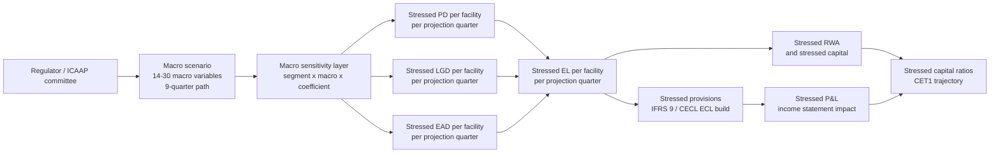

# Credit Module 12 — Credit Stress Testing

!!! abstract "Module Goal"
    Credit stress testing is the quarterly conversation between the credit-risk team, the board, and the regulator. Where [Credit VaR](11-unexpected-loss-credit-var.md) characterises the *distribution* of credit losses under the model's assumed statistical shape, credit stress testing answers a different and more visceral question: *what does the credit portfolio look like under this specific macroeconomic narrative*? The narrative is typically a regulator-prescribed path — CCAR / DFAST in the US, the EBA stress test in Europe, the Bank of England's Annual Cyclical Scenario in the UK, the firm's own ICAAP-internal scenarios alongside — expressed as a 9-quarter trajectory in GDP, unemployment, house prices, equity indices, credit spreads, and a handful of other macro variables. The data engineer's role: build the pipeline that takes those macro inputs, translates them via fitted sensitivity coefficients into stressed PD / LGD / EAD per facility per projection quarter, aggregates to stressed Expected Loss, capital, and provisions, and reconciles the result to the firm's plan. The cadence is quarterly (not daily); the horizon is nine quarters (not one day); the consumer is the board and the regulator (not the trading desk). This module is the structural analogue of [MR M10 (Stress Testing & Scenarios)](../modules/10-stress-testing.md), and the closing module of Phase 3 Credit Risk Measures.

---

## 1. Learning objectives

By the end of this module, you should be able to:

- **Distinguish** credit stress testing from market-risk stress testing along the four practical axes that drive the warehouse design: cadence (quarterly vs. daily), horizon (9 quarters vs. 1-10 days), scenario type (macroeconomic narrative vs. market-data shock vector), and downstream linkage (provisioning + capital vs. P&L + capital).
- **Map** a macroeconomic scenario (GDP, unemployment, HPI, equity, spreads, oil, USD index) onto per-facility shifts in PD, LGD, and EAD via fitted segment-level sensitivity coefficients, and describe the storage shape that supports this many-to-many mapping reproducibly across scenario vintages.
- **Compute** stressed Expected Loss and stressed regulatory capital from baseline PD / LGD / EAD inputs and a per-quarter macro shock path, and apply the result to a small portfolio across the standard CCAR-style four-to-nine-quarter projection grid.
- **Identify** the dominant regulatory stress programmes (CCAR / DFAST, EBA, BoE ACS, PRA SWD, ICAAP) along with their cadence, scenario count, horizon, and the broad shape of the inputs each one expects from the firm.
- **Reverse stress test** a credit portfolio: formulate the inverse problem ("what is the smallest macro shock that breaches CET1 = 10%?"), specify the plausibility constraints that prevent degenerate answers, and sketch the data the optimisation engine needs from the warehouse.
- **Reconcile** stress-test outputs back to the firm's IFRS 9 / CECL provisioning numbers, using the shared forward-looking macroeconomic overlay; understand why running stress and provisioning as separate, unreconciled calculations is a regulatory red flag.

## 2. Why this matters

The morning credit pack opens with the [Expected Loss](10-expected-loss.md) figure and the daily [Credit VaR](11-unexpected-loss-credit-var.md) on the front page. Every quarter, a different and more consequential pack lands on the board table: the *credit stress-test results*. The pack tells the board what the firm's loan losses, provision build, regulatory capital, and capital ratios would look like under three to five named macroeconomic scenarios — a Baseline path that broadly matches the firm's strategic plan, an Adverse path that represents a mild recession, a Severely Adverse path that represents a major recession comparable to 2008-2009, and (usually) one or two firm-specific scenarios designed to probe idiosyncratic concerns the regulator-prescribed scenarios miss. The Severely Adverse scenario is the one that determines the firm's *capital cushion* under regulatory stress-test rules; a firm whose CET1 ratio drops below the regulatory minimum in the Severely Adverse scenario fails the test and faces immediate consequences — restrictions on dividends, restrictions on buybacks, and in the worst case a forced capital-raising. The stress-test results are not a back-room analytical exercise; they are a live, board-level, regulator-visible governance instrument.

The data engineer's role in producing this pack is significant and quite different from the daily credit-VaR pipeline. The stress pipeline takes a small number of macroeconomic scenarios (typically three for CCAR: Baseline, Adverse, Severely Adverse) and projects the entire credit portfolio forward over nine quarters under each scenario. The projection includes new originations (loans the firm expects to book each quarter), payoffs and maturities (loans rolling off the book), defaults (driven by stressed PD), recoveries (driven by stressed LGD), provisions (the build in the IFRS 9 / CECL allowance under each scenario), and the resulting regulatory capital and capital-ratio trajectory. The output is roughly the size of a small bank's three-year strategic plan, *re-done under three scenarios, quarterly*. The data engineer who owns the stress pipeline is producing a deliverable comparable in volume and complexity to the firm's entire FP&A function — and on a regulatory timeline that does not flex.

This module sits at the close of Phase 3 because credit stress testing *integrates* everything Phases 1-3 have built. The [PD](07-probability-of-default.md), [LGD](08-loss-given-default.md), and [EAD](09-exposure-at-default.md) feeders are the per-facility inputs that the macro overlay shifts; the [Expected Loss](10-expected-loss.md) arithmetic is the per-facility, per-quarter stressed-EL computation; the [Credit VaR](11-unexpected-loss-credit-var.md) portfolio model is the natural analogue for the stress aggregation (though stress tests use prescribed scenarios rather than simulated ones). Forward into Phase 4, the upcoming IFRS 9 / CECL Provisioning module that closes the credit-track risk-measures arc shares the macroeconomic overlay with this module — the same Baseline / Adverse / Severely Adverse paths feed both the regulatory stress test and the IFRS 9 stage-2 lifetime ECL macroeconomic overlay, and a firm that runs them as independent calculations on different macro vintages will find its provisions and its stress numbers irreconcilable. The pipeline discipline that prevents this is the load-bearing data-engineering content of this module.

!!! info "Honesty disclaimer"
    This module covers credit stress testing at the level a data engineer needs to design and operate the pipeline that produces stress-test outputs. It does not cover the *modelling* of macro-to-PD / LGD / EAD sensitivities in depth — the calibration of segment-level coefficients from historical macroeconomic and default data is a multi-quarter quant exercise involving cointegration tests, panel regressions, regime-switching models, and structural break diagnostics that a data engineer typically consumes as inputs rather than produces. The author's confidence drops further on jurisdiction-specific regulatory stress-test details (the exact CCAR submission templates, the EBA's per-cycle methodology refinements, the BoE's confidential supervisory overlay) which evolve year-on-year and which any practitioner will get from the regulator's primary documentation rather than this module. The stylised four-quarter projection in §4 Example 2 is deliberately small enough to make the arithmetic visible; a real CCAR run involves nine quarters, tens of thousands of facilities, hundreds of segments, and dozens of macro variables, but the structural pattern is the same. Where the module asserts a specific quantitative claim (e.g. "a 1% drop in HPI typically adds X bps to CRE PD"), the figures are illustrative ranges drawn from publicly disclosed bank stress-test results rather than calibrated coefficients from any specific firm.

## 3. Core concepts

A reading map:

- §3.1 pins what credit stress testing is and the outputs the warehouse must serve.
- §3.2 is the critical contrast section — credit stress vs. market stress along every axis a data engineer needs.
- §3.3 walks the macroeconomic-input list and the macro-to-PD / LGD / EAD sensitivity layer.
- §3.4 covers the dominant regulatory stress programmes (CCAR, DFAST, EBA, BoE ACS, PRA SWD, ICAAP).
- §3.5 covers the 9-quarter projection grid — the load-bearing scope decision.
- §3.6 covers reverse stress testing and the inverse-problem framing.
- §3.7 covers the IFRS 9 / CECL linkage and the macroeconomic-overlay reconciliation.
- §3.8 specifies the storage shape: `dim_macro_scenario`, `fact_macro_scenario_value`, `fact_stressed_pd_lgd_ead`, `fact_stressed_el_capital`.
- §3.9 covers the common architectural pitfalls — separate compute clusters, snapshot alignment, the bitemporal trap.

Sections 3.1-3.2 are definitional and frame the module against the market-risk treatment; sections 3.3-3.7 cover the substantive content (inputs, regulatory framing, projection structure, reverse stress, provisioning linkage); sections 3.8-3.9 are the load-bearing data-engineering content. Readers from a market-risk background should pay particular attention to §3.2 (the contrast) and §3.9 (the snapshot-alignment trap, which has no exact MR analogue).

### 3.1 What credit stress testing is

A **credit stress test** simulates the credit portfolio's behaviour under an externally-specified adverse macroeconomic scenario. The scenario itself is not the output of a statistical model — it is a *narrative*, calibrated to severities the regulator (or the firm's risk-management team, in ICAAP) considers plausible and material. The Federal Reserve's 2024 Severely Adverse scenario, for example, specified a US unemployment rate rising from 3.7% to 10.0% over six quarters, real GDP contracting 8.5% from peak to trough, the S&P 500 dropping roughly 55%, house prices falling 36%, and commercial real estate prices falling 40%. These are not predictions; they are *prescribed shocks* designed to test the firm's resilience to a Great-Recession-comparable downturn.

The credit-portfolio pipeline takes that scenario as input and produces five categories of output that the warehouse must serve:

- **Stressed Expected Loss.** Per facility, per projection quarter, the EL implied by the scenario-stressed PD, LGD, and EAD. Aggregated to segment, business line, and firmwide totals.
- **Stressed Provisions.** The path of the IFRS 9 / CECL allowance over the projection horizon. Under deteriorating macro conditions, stage 2 lifetime ECL builds rapidly as facilities migrate from stage 1; under recovering conditions, the allowance releases. The provision *build* — the period-over-period change in the allowance — hits the income statement directly.
- **Stressed Net Charge-Offs.** The realised credit losses each quarter, computed from stressed PD × stressed EAD × stressed LGD with appropriate timing assumptions about when defaults convert to charge-offs.
- **Stressed Regulatory Capital and Capital Ratios.** The CET1 ratio trajectory across the projection horizon. The headline number the board and the regulator read: does the ratio stay above the regulatory minimum (typically 4.5% CET1 plus buffers, plus a regulator-set Stress Capital Buffer for the largest US banks) under each scenario?
- **Stressed Pre-Provision Net Revenue (PPNR).** Income from interest and fees, less expenses, before provisions. The PPNR is the firm's *first* line of defence — strong PPNR under stress absorbs provisions before they hit capital. PPNR projections involve modelling stressed margins, stressed fee income, stressed deposit balances, and stressed operating expenses; the credit team owns the loss side, the FP&A / treasury team owns the revenue side, and the integrated trajectory is what the regulator scores.

The warehouse must store all five output families at the right grain, joined consistently to the scenario dimension, the portfolio scope, and the projection-quarter timeline. The pipeline that produces them is the largest periodic data-engineering deliverable in the firm.

A third output category worth pinning is the **per-quarter trajectory** of each of the four families above. Stress testing is not a single-point measure (like a daily VaR figure); it is a *trajectory* across the projection horizon. The quarterly granularity is itself a load-bearing decision: a 9-quarter projection produces 9 figures per output series per scenario, which the board pack typically renders as line charts showing the peak-to-trough dynamics under each scenario. The data engineer must store the per-quarter figures, not just the worst-quarter figure, because the *shape* of the trajectory (how fast losses build, how quickly the firm recovers, how the allowance evolves) is itself a regulatory and governance question. A firm whose stressed-EL spikes sharply in Q2 and resolves quickly is in a different position from one whose stressed-EL builds slowly and persists for the full horizon; the board reads both shapes and the regulator scores both.

A practical observation on **what stress testing is *not***. Credit stress testing is not a *prediction* of what will happen; it is a *resilience exercise* against a prescribed adverse path. The Baseline scenario is not the firm's central forecast (the firm has its own internal forecast for planning purposes, sometimes called the "house view"); the Baseline in a stress submission is the regulator's prescribed mildly-stressful path, often closer to the firm's downside than to its central view. The Severely Adverse scenario is calibrated to severity comparable to past major recessions, not to any particular prediction of what the next recession will look like. The board reading the stress pack should *not* conclude "the firm expects unemployment to hit 10%"; the correct reading is "if unemployment hits 10%, the firm has capital headroom of X". The data engineer's contribution to this framing is the metadata on `dim_macro_scenario` that distinguishes regulatory-prescribed paths from firm-internal forecasts; conflating the two is a frequent source of executive-level confusion that the data dictionary should preempt.

A second observation on the **regulatory consequence** of stress tests. In the US, the largest banks (Global Systemically Important Banks and other firms with assets above $100B) face annual CCAR / DFAST submissions; firms that fail the quantitative test (CET1 ratio drops below the minimum under the Severely Adverse scenario) or the qualitative test (the Fed objects to the firm's capital planning process) face restrictions on capital distributions (dividends and buybacks) until the next cycle. The Stress Capital Buffer that the Fed sets for each firm is *derived from* the firm's CCAR results — it is the projected peak-to-trough CET1 drawdown under the Severely Adverse scenario, plus four quarters of planned dividends, expressed as a percentage of RWA, with a 2.5% floor. A firm with a higher stress drawdown gets a higher SCB; a higher SCB raises the firm's binding capital requirement. The stress test is therefore not just a regulatory submission — it is the *direct mechanism* by which the regulator sets the firm's capital requirement. Every quarter a firm produces a stress run, that run feeds (eventually) into the SCB calibration; the data engineer who owns the stress pipeline owns the inputs to the firm's binding capital requirement, which is a load-bearing position.

A fifth output category — the **trajectory dynamics measures**. Beyond the level of stressed EL or stressed capital at each quarter, regulators increasingly ask for *trajectory-shape* statistics: the peak-to-trough drawdown in CET1, the quarter at which the drawdown peaks, the time-to-recovery (number of quarters to return to within X bps of baseline). These are derived statistics, computed from the per-quarter trajectory. The data engineer stores them as separate columns on `fact_stressed_el_capital_summary` (or computes them on-the-fly in the BI semantic layer); either pattern works, but the trajectory-shape statistics should be exposed explicitly because the consumers (regulator, board) read them directly.

### 3.2 Credit stress vs. market stress — the contrast

The single most useful framing for a data engineer transitioning between the two stress disciplines is the side-by-side comparison. The two share the word "stress" but they are different exercises in cadence, horizon, scenario type, downstream consumers, and warehouse design. The table:

| Dimension | Market stress (MR M10) | Credit stress (this module) |
|---|---|---|
| Cadence | Daily refresh on `fact_stress`; intraday for some scenarios | Quarterly (regulatory); monthly or weekly for ICAAP iterations |
| Horizon | 1 day or 10 days (matching VaR horizon); some scenarios go to 1 month | 9 quarters (CCAR / DFAST); 3-5 years (EBA, BoE ACS) |
| Scenario type | Market-factor shock vector — yield-curve shifts, equity moves, FX moves, vol surface moves | Macroeconomic narrative — GDP, unemployment, HPI, CPI, equity, spreads, oil, USD index |
| Scenario count | 5-30 named historical + 10-50 hypothetical, all run every day | 3-5 named scenarios (Baseline, Adverse, Severely Adverse, plus firm-specific), run quarterly |
| Computation method | Sensitivity-based or full revaluation; Greeks × shocks | Macro-conditional PD / LGD / EAD shifts; 9-quarter balance-sheet projection |
| Output | Stressed P&L per book per scenario | Stressed EL, provisions, charge-offs, capital, capital ratios per portfolio per scenario per projection quarter |
| Aggregation | Stress P&L is additive across desks; firmwide stress = sum of desk stress | Stressed EL is additive; stressed capital ratios are *not* additive; firmwide capital ratio is computed from firmwide stressed RWA, not from desk-level ratios |
| Primary consumer | Trading desks, risk officers, intraday escalation | Board, regulator, FP&A, finance |
| Regulatory programme | Basel IMA stressed-VaR, FRTB SES, CCAR market shock (one of CCAR's components) | CCAR / DFAST, EBA stress test, BoE ACS, PRA SWD, ICAAP |
| Provisioning linkage | None directly — market stress drives trading P&L, not provisions | **Direct** — the same macro scenarios drive IFRS 9 / CECL stage-2 lifetime ECL via the macroeconomic overlay |
| Reconciliation pressure | Stress P&L should reconcile to position-level revaluations | Stress capital should reconcile to the firm's strategic plan; stress provisions should reconcile to IFRS 9 / CECL outputs; the firm's plan and the stress narrative must be internally consistent |
| Compute footprint | Hours per scenario, parallel across positions; typically the same engine as VaR | Days per scenario per submission cycle; balance-sheet projection is its own pipeline |
| Warehouse storage shape | `dim_scenario`, `fact_scenario_shock`, `fact_stress` | `dim_macro_scenario`, `fact_macro_scenario_value`, `fact_stressed_pd_lgd_ead`, `fact_stressed_el_capital` |

Seven rows on this table are worth pinning in their own paragraphs because they drive concrete warehouse-design decisions.

**Cadence.** Market stress runs every day because the trading book turns over every day and the stressed P&L depends on today's positions. Credit stress runs every quarter because the loan book turns over much more slowly and because the regulatory submission is quarterly (annual CCAR with quarterly inter-cycle updates for the largest firms). The slower cadence means the credit-stress pipeline can spend more compute per run; the daily-cycle discipline of the MR stress pipeline does not apply. But the slower cadence also means there is no "yesterday's stress" comparison to fall back on if a quarter's run is corrupted — the discipline around reproducibility is therefore higher per run.

**Horizon.** Market stress is a *single-point-in-time* measure — what is the P&L right now under the shock vector? Credit stress is a *trajectory* — what does the portfolio look like quarter by quarter over the next nine quarters? The trajectory framing forces the credit stress pipeline to model originations, payoffs, charge-offs, and provision builds at each quarter; market stress has none of this. The data shape on `fact_stressed_el_capital` therefore carries a `projection_quarter` column that has no analogue on `fact_stress`.

**Scenario type.** A market scenario is a vector of factor shocks (a 10y rate up 200bp, equity down 30%, USD up 10% versus EM, etc.). A credit scenario is a macroeconomic narrative (GDP contracts 8.5% peak-to-trough, unemployment rises to 10%, etc.). The two are related — the macro variables in the credit scenario imply moves in the market factors — but the credit scenario is at one level of abstraction *higher*. The macro-to-market-factor translation is part of the credit-stress methodology and lives in the firm's macro-projection model; the data engineer's responsibility is to store both the macro path (`fact_macro_scenario_value`) and any derived market-factor shocks consistently with the macro vintage.

**Provisioning linkage.** This is the single most important conceptual difference for a data engineer. Market stress drives stressed P&L, which hits the trading book's P&L statement directly. It does not drive provisions because the trading book is marked to market continuously; there is no allowance to build. Credit stress, by contrast, drives *both* capital (via stressed RWA) *and* provisions (via the IFRS 9 / CECL macroeconomic overlay that feeds stage-2 lifetime ECL). The two outputs (capital, provisions) must be internally consistent — they should be computed from the *same* underlying stressed PD / LGD / EAD figures and the *same* macro scenario vintage. A firm that runs stress and provisioning on independent pipelines with different macro vintages will produce reconciliation discrepancies that the regulator will find embarrassing; the data engineer's discipline around shared upstream macro inputs is what prevents this. See §3.7 for the detailed treatment.

**Aggregation properties.** Stressed EL is additive across portfolios just as baseline EL is ([C10 §3](10-expected-loss.md)) — sum the per-facility stressed ELs to get the portfolio total. Stressed capital is *quasi-additive* — stressed regulatory capital (the dollar figure) is additive in the sense that summing per-facility stressed K × EAD figures gives the firmwide stressed capital, but the *capital ratio* (CET1 / RWA) is not additive because the denominator (RWA) is shared. The firmwide CET1 ratio comes from firmwide stressed capital divided by firmwide stressed RWA; it is not the average of desk-level CET1 ratios. The data dictionary on `fact_stressed_el_capital` must make this distinction explicit and the BI semantic layer must refuse to AVG the stressed-CET1 column across portfolios.

**Reconciliation pressure.** Market stress numbers reconcile to the trading book's positions, which are themselves a fact-table feed. Credit stress numbers must reconcile to the *firm's plan* — the projected loan growth, deposit growth, originations volumes, and payoff schedules that the FP&A team has built. The credit stress projection of the loan book at each future quarter should match the firm's planned book size to within a documented tolerance; a stress projection that drifts arbitrarily from the plan is a sign that the stress balance-sheet projection model is decoupled from the firm's planning process, which is a governance finding. The data engineer therefore stores not just the stress outputs but also the plan inputs (planned originations per segment per quarter, planned payoff schedules) on companion fact tables, with the reconciliation control surfacing breaks daily.

**Compute and data-volume profile.** Market stress runs every day at trading-book cadence — the scenarios are run by the same engine that runs daily VaR, on the same compute grid, with the output landing on `fact_stress` overnight. The data volume is significant (hundreds of scenarios × thousands of positions × daily refresh = millions of rows per day) but the pipeline is mature and the cadence is fixed. Credit stress runs quarterly at the most, with each cycle taking days to weeks of compute (the 9-quarter balance-sheet projection is a non-trivial calculation per scenario; the optimisation for reverse stress is heavier still). The data volume per cycle is smaller in row count than market stress's daily output, but the per-row complexity is higher — each row carries lineage pointers to the baseline feeders, scenario-vintage metadata, and projection-quarter granularity. The architectural pattern: market stress is a *streaming* workload that the warehouse refreshes daily; credit stress is a *batch* workload that the warehouse refreshes per regulatory cycle. The two have different operational rhythms and different incident-response patterns.

**Methodology overlap is small in practice.** Despite the shared word "stress", the two pipelines are almost entirely separate in production. The data warehouse usually serves both — `dim_scenario` for market, `dim_macro_scenario` for credit, with no foreign key between them. The compute infrastructure is separate — market stress runs on the same grid as VaR (parallel position-level revaluations); credit stress runs on a dedicated balance-sheet projection cluster. The teams are separate — market-risk methodology vs. credit-risk methodology. The data engineer who serves both is a rare integrator; most warehouses have separate owners for the two pipelines.

A third practical observation, on **the contrast with VaR**. Credit VaR ([C11](11-unexpected-loss-credit-var.md)) and credit stress testing are complementary tail measures, exactly as Market VaR and market stress are complementary on the trading side. Credit VaR characterises the loss distribution under the model's assumed correlation and severity structure; credit stress testing characterises the loss under a specifically named macroeconomic scenario. The two answer different questions: Credit VaR answers "what is the 1-in-1000-year loss under the model's distributional assumptions?"; credit stress testing answers "what is the loss under the Severely Adverse path the Fed has prescribed?". A risk pack that carries one without the other has a blind spot — Credit VaR alone is silent on the firm's resilience to the specific scenarios the regulator cares about; credit stress alone is silent on the loss-distribution shape under the model's assumptions. Both are required; both feed the regulatory submission; both consume the same per-facility PD / LGD / EAD machinery; both produce numbers the data warehouse must serve under appropriate metadata.

### 3.3 Macroeconomic inputs and the macro-to-PD / LGD / EAD layer

The conceptual data flow that drives a credit stress run:



Each step is a load-bearing pipeline stage. The data engineer owns the storage and the lineage at every stage; the modelling team owns the coefficients in the sensitivity layer.

**The macro variable list.** A regulatory stress submission specifies 14-30 macro variables per scenario. The Federal Reserve's CCAR scenarios include around 28 variables covering the US economy (real GDP growth, nominal GDP growth, unemployment rate, CPI inflation, three-month Treasury rate, five-year Treasury yield, ten-year Treasury yield, BBB corporate spread, mortgage rate, prime rate, Dow Jones index, NCREIF commercial real estate price index, house price index, market volatility VIX) and a handful of international variables (real GDP growth, inflation, exchange rate, and bond yield for the Euro Area, UK, Japan, and developing Asia). The EBA scenarios cover similar variables for European jurisdictions. Each variable has a full 9-quarter trajectory; the storage shape is one row per (scenario, projection_quarter, macro_variable) on `fact_macro_scenario_value`.

**The sensitivity coefficients.** The macro-to-PD / LGD / EAD translation lives in a coefficient table — per segment, per macro variable, the impact of a one-unit change in the macro on the stressed PD (or LGD or EAD). Commercial real estate PDs are typically highly sensitive to HPI and CRE-price movements (a 1% drop in CRE prices might add 8-15 bps to CRE PD); corporate PDs are most sensitive to GDP growth and unemployment (a 1% drop in GDP might add 4-10 bps to corporate PD); retail mortgage PDs are sensitive to unemployment and HPI; credit-card PDs are sensitive to unemployment most directly. The coefficients are fitted from long-run historical data covering at least one full credit cycle (the modelling team typically uses data from 1990 through the latest available period, with explicit weighting on the 2008-2010 stress window to ensure the coefficients capture stress-period behaviour). The coefficient table is a slowly-changing dimension; recalibrations happen annually at most, sometimes less, and a recalibration is a governance event that requires sign-off before the new coefficients are deployed.

A typical sensitivity-coefficient table schema:

| Column | Type | Notes |
|---|---|---|
| `segment_id` | VARCHAR | FK to `dim_segment` (e.g. "CRE Office", "Large Corporate", "Retail Mortgage") |
| `macro_variable` | VARCHAR | One of the regulator's scenario variables |
| `target_metric` | VARCHAR | `PD`, `LGD`, or `EAD` |
| `coefficient` | NUMERIC | The shift in the target per 1-unit move in the macro variable |
| `coefficient_units` | VARCHAR | "bps per 1% change", "bps per 1pp change", etc. |
| `effective_from`, `effective_to` | DATE | SCD2 — when the coefficient was in force |
| `calibration_methodology` | VARCHAR | "panel regression", "logistic regression with macro overlay", etc. |
| `calibration_window_start`, `calibration_window_end` | DATE | The historical window used for fitting |
| `calibration_approved_by` | VARCHAR | Methodology owner |

The data engineer maintains the bitemporal history of this table; the modelling team maintains the coefficients themselves. A stress run pins the `effective_from` / `effective_to` window when it executes, so that a historical re-run uses the coefficients in force at the original run date rather than the current ones.

**Functional forms.** The translation from macro to stressed PD is rarely a simple linear shift. Most production models use one of two structural forms:

- **Logit-linked overlay.** The baseline PD is logit-transformed, a linear combination of macro variables is added, and the result is logit-inverted back to a probability. This keeps the stressed PD bounded in [0, 1] and produces the empirically observed asymmetry (PDs near zero rise more sharply under stress than PDs that are already elevated).
- **Macro multiplier.** A multiplicative shift on the baseline PD: stressed PD = baseline PD × macro multiplier. The multiplier itself is a function of the macro variables (typically a multiplicative model on the macro deviations from baseline). Simpler than the logit overlay but does not enforce the [0, 1] bound; in practice combined with a cap to prevent stressed PDs above some plausibility ceiling (typically 99%).

Example 1 in §4 uses a multiplicative-shift form for didactic clarity. Production models tend toward the logit-linked form for the boundedness property; the data engineer should know which form their firm uses and store the inputs accordingly.

**Stressed EAD considerations.** EAD shifts under stress come from two sources. For drawn facilities, the EAD is the outstanding balance, which is unchanged by macro stress directly (it is determined by the obligor's drawn position, not by the macro). For undrawn commitments — revolvers, credit lines, working-capital facilities — the EAD includes the undrawn amount times the credit-conversion factor (CCF, see [C09](09-exposure-at-default.md)). Under stress, obligors *draw down* on their facilities more (a distressed borrower borrows whatever is available), so the effective CCF rises. CCAR-style stress runs typically apply a stressed-CCF multiplier of 1.1-1.5× for revolvers under Severely Adverse scenarios, recognising the empirically observed drawdown-under-stress behaviour. The stressed-EAD calculation is therefore not a flat pass-through; it includes a scenario-conditional CCF overlay that the data engineer must store and apply consistently.

A fourth observation on **the calibration cadence and the governance perimeter**. The sensitivity coefficients on `dim_macro_sensitivity` are recalibrated annually at most. Each recalibration is a governance event — the methodology team produces a recalibration document, the model-validation team reviews it independently, the model-risk-management committee approves the new coefficients, and the deployment is logged with an effective-from date. The data engineer's role is to ensure the bitemporal history of the coefficient table preserves every version, so that a stress run executed in (say) March 2026 against the coefficients in force at that time can be reproduced in October 2026 against the same coefficients — even if the coefficients have been refreshed in the intervening months. The audit trail must show which coefficient version produced which stressed-PD figure on which run date. Without this trail, the regulator cannot validate the firm's stress submissions and the firm's auditors cannot sign off on the methodology consistency.

A fifth observation on **the segment grain**. The macro-to-PD sensitivity is calibrated at the segment level, not at the facility level. Each facility is mapped to a segment via `fact_facility_segment` (typically a slowly-changing relationship — a facility's segment can change when the obligor's industry classification is updated, for example), and the segment's sensitivity coefficients apply to every facility in that segment uniformly. The segmentation choice is methodologically consequential: too coarse, and the segments contain heterogeneous facilities with genuinely different macro sensitivities; too fine, and the per-segment historical data is too thin for reliable coefficient calibration. Most production segmentations carry 20-50 segments — fine enough to distinguish CRE from retail mortgage from credit card from large corporate, coarse enough that each segment has enough historical defaults to fit coefficients with reasonable confidence intervals. The data engineer does not own the segmentation choice but must support the segment-level coefficient grain on the storage shape.

### 3.4 Regulatory stress programmes

The dominant regulatory stress programmes a credit-data engineer in a globally-active firm will encounter:

**CCAR (Comprehensive Capital Analysis and Review) and DFAST (Dodd-Frank Act Stress Test) — Federal Reserve, US.** The most rigorous and most public of the regulatory stress programmes. Applies to US bank holding companies with consolidated assets above $100B (the exact threshold has moved over the years; the largest 33-or-so US bank holding companies are in scope as of 2026). Annual cycle: the Fed publishes the macro scenarios in early February, banks submit their results in April, the Fed publishes its own results and the firms' Stress Capital Buffers in late June. Three scenarios: Baseline, Adverse, Severely Adverse. The Severely Adverse drives the SCB calibration. Nine-quarter projection horizon. CCAR includes the qualitative review (the Fed's assessment of the firm's capital planning process); DFAST is the quantitative-only version that smaller firms in scope must run. The submission templates are publicly disclosed (the FR Y-14 family of reports — A, M, Q) and the results are publicly disclosed at the firm level. The largest data-engineering deliverable in the US bank-regulatory calendar.

**EBA stress test — European Banking Authority, EU.** Biennial cycle (every two years; the 2025 cycle covered around 70 EU banks). Common methodology across all in-scope banks, designed to allow cross-bank comparison. Two scenarios: Baseline and Adverse. Three-year projection horizon. Outputs feed the ECB's Supervisory Review and Evaluation Process (SREP) for the Single Supervisory Mechanism banks. The EBA's adverse scenario is calibrated by the European Systemic Risk Board (ESRB) and is typically more severe than the EBA Baseline by 250-450 basis points on the unemployment trough. The results are publicly disclosed and used by the market as a credit-quality indicator for European banks.

**BoE ACS (Annual Cyclical Scenario) — Bank of England, UK.** Annual cycle (formerly biennial; moved to annual in 2024). Applies to the largest UK banks (typically eight in-scope). One main scenario per year (the "Annual Cyclical Scenario"); the methodology recalibrates the severity over the cycle so that the scenario is *more severe* when the credit cycle is in a benign state and *less severe* when stress is already present in the economy (counter-cyclical calibration). Five-year projection horizon. Outputs feed the BoE's Financial Policy Committee's capital recommendations and inform the UK Capital Requirements Buffer settings.

**PRA SWD (Solvent Wind-Down) — Prudential Regulation Authority, UK.** A UK-specific exercise focused on resolution scenarios: the firm assumes it has been placed into resolution and must demonstrate that its trading book can be wound down in a solvent manner over a specified horizon. Less about credit losses per se and more about the operational and liquidity dynamics of a wind-down; nevertheless, the credit-risk team's stressed-EL projections feed the SWD's loss assumptions. Annual.

**ICAAP (Internal Capital Adequacy Assessment Process) — firm-led, Pillar 2 of Basel.** Each firm designs its own scenarios beyond the regulatory minimums. The ICAAP scenarios typically include the regulatory scenarios (Baseline, Adverse, Severely Adverse from CCAR or the EBA equivalent) plus a set of firm-specific scenarios designed to probe concentrations and idiosyncratic risks the regulator's standard scenarios miss (a sharp drop in oil prices for a firm with material energy-sector exposure; a regional recession for a firm with geographic concentration; a sector-specific shock for a firm with sector concentration). Annual cycle but typically run more frequently (quarterly, sometimes monthly) for internal management purposes. The ICAAP is the firm's own statement of how much capital it needs to hold beyond the Pillar 1 minimum; the supervisor reviews it through the SREP / SREP-equivalent process. The data infrastructure for ICAAP is typically the same as for the regulatory submissions — the firm runs additional scenarios through the same pipeline.

A summary table:

| Programme | Regulator | Geography | Cadence | Scenarios | Horizon | Primary use |
|---|---|---|---|---|---|---|
| CCAR / DFAST | Federal Reserve | US | Annual | 3 (BL / ADV / SEV) | 9 quarters | SCB calibration; dividend / buyback restrictions |
| EBA stress test | EBA / ESRB | EU | Biennial | 2 (BL / ADV) | 3 years | SREP input |
| BoE ACS | Bank of England | UK | Annual | 1 ACS (cyclical) | 5 years | UK capital recommendations |
| PRA SWD | PRA | UK | Annual | Resolution-focused | Wind-down period | Resolution planning |
| ICAAP | Firm-led, supervisor-reviewed | Global (firm-specific) | Annual (+ internal) | Firm-designed, includes regulatory | Variable | Pillar 2 capital, internal management |

The data engineer in a globally-active firm runs all of these in parallel — different scenarios, different methodologies, different submission templates, but the same underlying portfolio and the same upstream PD / LGD / EAD feeders. The discipline that prevents this from becoming a tangled mess is consistent scenario versioning on `dim_macro_scenario` and shared use of the upstream credit-risk feeders. See §3.8.

A practical observation on **ICAAP as the integration layer**. The ICAAP is the firm's own statement of capital adequacy and is the natural integration point across the regulatory programmes. A firm with CCAR, EBA, BoE ACS, and PRA SWD obligations runs each of those programmes on its dedicated cycle, but the ICAAP brings them together — the firm's own scenarios in ICAAP typically include the regulatory scenarios as baselines and add firm-specific scenarios on top. The ICAAP document then synthesises across all of them to make the firm's overall capital-adequacy argument. The data engineer's contribution to this synthesis is the shared upstream that makes cross-programme comparison meaningful — the same `dim_macro_scenario`, the same sensitivity coefficients, the same per-facility stressed-PD / LGD / EAD generator. A firm whose ICAAP synthesis depends on cross-programme comparison cannot tolerate independent stress-testing infrastructures per programme; the shared upstream is what makes the integrated story defensible to the supervisor.

A second observation on **submission templates and the cardinality explosion**. Each regulatory programme has its own submission template that imposes its own cardinality on the firm's outputs. The FR Y-14A schedules for CCAR alone comprise dozens of templates with thousands of line items each, broken down by product, segment, vintage, and projection quarter. The EBA's templates are similar in size; the BoE's are smaller but still substantial. The total cardinality across all programmes' submission templates can reach hundreds of thousands of cells per cycle per firm. The data engineer's pipeline does not produce these cells directly from the source feeders — it produces aggregate outputs from `fact_stressed_el_capital` at the firm's internal grain, and a programme-specific mapper translates those into the submission templates. The mapper layer is non-trivial — each cell on each template has its own definition, its own validation rules, and its own regulator-specified data dictionary — but it is a translation layer, not a calculation layer; the underlying numbers come from the shared upstream.

### 3.5 The 9-quarter projection grid

The CCAR / DFAST submission requires projecting the firm's balance sheet, income statement, and capital ratios over nine quarters under each scenario. The grid shape:

| Row | Q1 BL | Q2 BL | … | Q9 BL | Q1 ADV | Q2 ADV | … | Q9 ADV | Q1 SEV | Q2 SEV | … | Q9 SEV |
|---|---|---|---|---|---|---|---|---|---|---|---|---|
| Loans outstanding | X | X | … | X | X | X | … | X | X | X | … | X |
| Originations (new loans) | X | X | … | X | X | X | … | X | X | X | … | X |
| Payoffs and maturities | X | X | … | X | X | X | … | X | X | X | … | X |
| Stressed PD (avg) | X | X | … | X | X | X | … | X | X | X | … | X |
| Stressed LGD (avg) | X | X | … | X | X | X | … | X | X | X | … | X |
| Defaults (count) | X | X | … | X | X | X | … | X | X | X | … | X |
| Net charge-offs | X | X | … | X | X | X | … | X | X | X | … | X |
| Provision build | X | X | … | X | X | X | … | X | X | X | … | X |
| Allowance balance | X | X | … | X | X | X | … | X | X | X | … | X |
| PPNR | X | X | … | X | X | X | … | X | X | X | … | X |
| Net income | X | X | … | X | X | X | … | X | X | X | … | X |
| RWA | X | X | … | X | X | X | … | X | X | X | … | X |
| CET1 capital | X | X | … | X | X | X | … | X | X | X | … | X |
| CET1 ratio | X | X | … | X | X | X | … | X | X | X | … | X |

Each "X" is one or more rows on the warehouse. The full grid is the size of the firm's three-year strategic plan, re-done under three scenarios, quarterly. For a mid-sized firm with 30 segments and a handful of geographies, that is roughly 30 segments × 14 rows × 9 quarters × 3 scenarios = 11,340 cells at the segment-segment-quarter-scenario grain. For the largest firms with hundreds of segments, the cell count is in the hundreds of thousands. The pipeline that produces them is significant.

**Originations are not a passthrough.** The most consequential and most under-appreciated piece of the 9-quarter projection is the *originations assumption*. The firm's stress balance sheet is not a runoff of the current book — it includes new loans booked each quarter under the scenario. Under Severely Adverse conditions, originations typically decline (the firm pulls back its risk appetite, demand weakens, credit standards tighten) but they do not go to zero. The Fed's CCAR rules historically required firms to assume that originations *continue* at planned levels in some categories even under Severely Adverse conditions, to ensure the stressed-loss projection captures the credit risk of the *new* loans being booked under deteriorated economic conditions — not just the legacy book's runoff. The originations assumption is therefore a load-bearing input to the stress projection, and the data engineer must store both the planned originations volumes (from FP&A) and the stressed originations assumptions (derived from the planned volumes via a scenario-conditional adjustment) on a companion fact table. The stressed PD applied to a new origination booked in Q5 of the Severely Adverse scenario is the PD of a freshly underwritten loan under those macro conditions, not the PD of the legacy book; the segmentation must distinguish vintage to make this tractable.

**Payoffs and maturities under stress.** The complement to the originations assumption. Loans roll off the book either by maturing (contractual payoff) or by being paid off early (voluntary prepayment). Under stress, prepayment behaviour changes — refinancing slows because credit standards tighten and rates may have moved; some loans that would have prepaid in baseline conditions remain on the book under stress, extending exposure. The stressed-payoff assumption is the inverse of the stressed-originations assumption: both shape the projected loan-book trajectory, and both must be consistent with the firm's plan and with the macro scenario. A stress projection that holds payoff rates constant under deteriorating conditions overstates how quickly the book runs off and understates the stressed-EL exposure; a projection that drops payoffs to zero under stress overstates exposure. The defensive pattern: per-segment, per-scenario payoff multipliers (stored on `fact_stressed_payoff_rate` or a companion table) calibrated from historical stressed-period prepayment behaviour.

**Provision build vs. allowance balance.** Two related but distinct measures the warehouse must serve. The **allowance balance** is the IFRS 9 / CECL stage-1-plus-stage-2-plus-stage-3 lifetime ECL at the end of each projection quarter — a stock figure. The **provision build** is the change in the allowance from the previous quarter — a flow figure that hits the income statement. Both are stored on `fact_stressed_el_capital` (or on a related fact); both have BAU equivalents that the stress run compares against. A surge in the allowance balance under Severely Adverse conditions reflects the stage-2 migration of facilities that the macro overlay has flagged as deteriorating; the provision build that produces that surge is the income-statement consequence, which feeds into the CET1 capital trajectory via the after-tax net-income flow.

**PPNR and the integrated trajectory.** Pre-provision net revenue is the income from interest and fees less expenses, computed *before* the provision build. It is the firm's first line of defence against credit losses: strong PPNR absorbs the provision build before the loss hits capital. The PPNR projection is owned by FP&A and treasury, not by the credit-risk team, but the integrated trajectory (PPNR minus provisions minus charge-offs equals net income, which flows into CET1 capital) is what determines whether the firm's CET1 ratio stays above the regulatory minimum. The data engineer's role in the integrated trajectory is the join discipline: the stressed-credit-loss outputs from the credit pipeline must align with the stressed-PPNR outputs from the FP&A pipeline on `scenario_id` and `projection_quarter`, with no mis-alignment of which scenario the two pipelines are computing. A common failure mode is the two pipelines running on subtly different scenario vintages (the credit pipeline picked up the latest scenario refresh; the FP&A pipeline is still on the prior vintage), producing an integrated trajectory whose pieces do not reconcile. The shared `dim_macro_scenario` upstream prevents this; the daily reconciliation control surfaces breaks before they reach the board pack.

**Net charge-offs vs. provisions.** A common consumer confusion the data dictionary must preempt. Net charge-offs are the *realised* losses each quarter — the dollar amount of defaulted facilities that have been written off, net of recoveries. Provisions are the *forward-looking* lifetime ECL build that flows through the income statement before the actual charge-off. Under stress, the provision build *leads* the net charge-offs by 2-4 quarters: the macro deterioration triggers stage-2 migrations and provision build in Q2-Q3, but the actual defaults and charge-offs do not materialise until Q4-Q6 as the deteriorating obligors work through to formal default. The data engineer should store both series so the consumer can see the lead-lag relationship; aggregating them or showing them under a single "credit loss" label conflates two genuinely different things.

### 3.5a A worked numerical illustration of the projection

A small concrete illustration to make the per-quarter dynamics visible. Imagine a portfolio with a single segment "CRE Office", baseline 1y PD = 200 bps, LGD = 35%, EAD = $1B (a stylised office-real-estate book at a mid-sized regional bank). Under the Severely Adverse scenario, the macro path drops HPI by 25% peak-to-trough across quarters 2-4. The sensitivity coefficient on `dim_macro_sensitivity` for CRE Office × HPI is -2.5 bps per 1pp drop, so the stressed-PD trajectory:

| Quarter | HPI YoY drop (pp) | PD shift (bps) | Stressed PD (bps) | Stressed LGD | Stressed EL ($M) |
|---|---|---|---|---|---|
| Q1 | -5 | +12.5 | 212.5 | 0.36 | 7.7 |
| Q2 | -15 | +37.5 | 237.5 | 0.40 | 9.5 |
| Q3 | -25 | +62.5 | 262.5 | 0.45 | 11.8 |
| Q4 | -22 | +55.0 | 255.0 | 0.44 | 11.2 |
| Q5 | -18 | +45.0 | 245.0 | 0.42 | 10.3 |
| Q6 | -12 | +30.0 | 230.0 | 0.40 | 9.2 |
| Q7 | -8 | +20.0 | 220.0 | 0.38 | 8.4 |
| Q8 | -4 | +10.0 | 210.0 | 0.37 | 7.8 |
| Q9 | 0 | 0 | 200.0 | 0.35 | 7.0 |

Baseline EL for the same portfolio is 200bps × 35% × $1B = $7M per year. The peak-quarter stressed EL is $11.8M (1.7× baseline); the cumulative stressed EL across the 9-quarter horizon is $83M, against a baseline cumulative of $63M (9 × $7M). The cumulative uplift of $20M is what the firm must absorb in additional credit losses under the Severely Adverse scenario, before considering the provision build and the RWA increase.

The illustration is deliberately simple — single segment, single macro variable, no originations, no payoffs, no stressed-CCF overlay on undrawn commitments. A real submission would include all of these, segmented across 30-50 portfolios, with 14-30 macro variables driving the per-segment stressed PD via the full sensitivity matrix. The numbers grow but the per-row arithmetic does not change.

### 3.6 Reverse stress testing

A **reverse stress test** inverts the standard stress-testing question. Where a forward credit stress asks "what is the loss and capital ratio under the Severely Adverse scenario?", a reverse stress asks "what scenario would breach our capital threshold?". The motivation is governance and board-level — to surface the firm's *blind spots* by characterising the scenarios that would matter most, rather than only the scenarios the regulator or the risk team has thought to model.

**The mathematical formulation.** Given a target outcome (typically a CET1-ratio threshold), the reverse stress solves an optimisation:

$$
\mathbf{m}^* = \arg\min_{\mathbf{m}} \; \mathrm{Plausibility}(\mathbf{m}) \quad \text{subject to} \quad \mathrm{StressedCET1}(\mathbf{m}) = \text{Threshold}
$$

where \(\mathbf{m}\) is a macro-scenario path (a vector of macro variable trajectories over the projection horizon) and \(\mathrm{Plausibility}(\mathbf{m})\) is a plausibility metric (typically a Mahalanobis distance from the historical macro mean under a fitted multivariate macro model). The constraint pins the outcome; the objective rewards finding the *most plausible* scenario that produces the outcome.

**Why constraints matter.** Without a plausibility objective, the optimiser will find degenerate solutions — a macro path that has GDP dropping 90% in one quarter and recovering immediately, or unemployment spiking to 50%, or HPI dropping 100%. Mathematically these are minimum-magnitude shocks (any shock that triggers a capital breach is a "solution"), but economically they are nonsense. The plausibility constraints that recur in production reverse-stress engines:

- **Marginal plausibility.** No single macro variable's trajectory deviates from its historical mean by more than a documented maximum (typically 99.9th-percentile move).
- **Joint plausibility.** The macro path's Mahalanobis distance from the historical mean lies below a documented threshold (the threshold is typically calibrated so that the historical Great Recession trajectory sits just inside the threshold).
- **Cross-variable coherence.** Constraints that prevent implausible joint moves (GDP cannot grow while unemployment spikes; HPI cannot rise while CRE prices crash).
- **Smoothness.** The macro path is constrained to evolve smoothly quarter-on-quarter (no sharp reversals beyond historical precedent).

The reverse-stress engine sits outside the warehouse; it consumes the warehouse's macro data, the credit pipeline's stressed-PD / LGD / EAD machinery, and a fitted multivariate macro model that produces the plausibility metric. The engine's output — the converged macro path — goes back into the warehouse as a new row on `dim_macro_scenario` (with `scenario_type = 'REVERSE'`) and an associated full set of rows on `fact_macro_scenario_value`, `fact_stressed_pd_lgd_ead`, and `fact_stressed_el_capital`. The board pack then shows the converged scenario alongside its plausibility metric and its stressed-CET1 trajectory.

**The board-level reframing.** Reverse-stress results are powerful in the boardroom because they invert the capital conversation. Instead of "our CET1 is 12.5% and our minimum is 10%, so we have 250bp of headroom", the reverse stress lets the board ask "what scenario would consume our 250bp of headroom, and how plausible is that scenario relative to historical experience?". The answer is a *scenario* — a narrative — not a number, and the narrative is exactly the kind of qualitative input boards have asked for post-2008. The data engineer's contribution to this conversation is the underlying pipeline that makes the reverse-stress calculation reproducible; the narrative framing is the consumer's responsibility.

A practical observation on **the data dictionary for reverse-stress results**. Reverse-stress outputs need their own metadata flags on `dim_macro_scenario` to distinguish them from forward scenarios. A reverse-stress scenario carries `scenario_type = 'REVERSE'`, a pointer to the threshold that produced it (`target_metric = 'CET1_RATIO'`, `target_threshold = 0.10`), and the plausibility metric value (`plausibility_score`). Downstream consumers reading from `dim_macro_scenario` should be able to filter reverse-stress scenarios out of routine forward-stress reporting (a reverse scenario in the regular stress dashboard would be confusing) while still surfacing them in the dedicated reverse-stress board pack. The metadata discipline here is the BI semantic layer's responsibility; the warehouse provides the flags, the BI layer enforces the filtering.

A practical observation on **the computational footprint**. Reverse stress is significantly heavier than forward stress because each optimiser iteration requires a full forward stress run (to evaluate the CET1 ratio under the candidate macro path). For a portfolio with 9 quarters and 30 segments, a single forward run takes hours; a reverse-stress optimiser typically needs 50-500 iterations to converge, which means days to weeks of compute per reverse-stress run. Reverse stress is therefore an annual or semi-annual exercise, not a continuous one; the warehouse's role is to provide the inputs at a clean snapshot, persist the engine's outputs, and support the periodic re-run cadence.

### 3.7 Linkage to IFRS 9 / CECL provisioning

The single most consequential data-engineering responsibility in the stress-testing pipeline is *consistency between stress outputs and provisioning outputs*. The two calculations share the macroeconomic overlay — the same Baseline / Adverse / Severely Adverse paths that the stress test runs are the paths that feed the IFRS 9 / CECL forward-looking macroeconomic overlay for stage-2 lifetime ECL. Running them as independent calculations on different macro vintages produces reconciliation discrepancies that the regulator will find embarrassing and that the firm's auditors will challenge.

**The IFRS 9 macroeconomic overlay.** IFRS 9 (and CECL, the US equivalent) requires that the ECL calculation incorporate *forward-looking macroeconomic information*. The mechanism: the unconditional PD term-structure derived from internal data is conditioned on a weighted average of multiple macro scenarios (typically three: a Baseline, an upside, and a downside, with weights summing to 1). The conditioning shifts the PD trajectory upward in deteriorating macro scenarios and downward in improving ones, producing a probability-weighted ECL that reflects the firm's view of the macroeconomic outlook. The three scenarios that feed the IFRS 9 overlay are typically the same Baseline / Adverse / Severely Adverse (or close variants) that feed the regulatory stress test — *exactly the same macro paths, exactly the same sensitivity coefficients, exactly the same stressed-PD machinery*.

**The reconciliation requirement.** A firm that runs CCAR (or the EBA equivalent) on one macro vintage and IFRS 9 on a different vintage will produce a stress-test stressed-ECL figure that does not reconcile to the IFRS 9 stressed-ECL figure for the same scenario. The regulator's expectation is that the two figures are *the same number*, computed from *the same upstream inputs*; the audit chain that demonstrates this is a key piece of the firm's IFRS 9 governance documentation. The data engineer's pipeline discipline therefore must enforce:

- A single canonical `dim_macro_scenario` table that both pipelines consume.
- A single canonical `fact_macro_scenario_value` table that carries the macro variable values per scenario per projection quarter.
- A single canonical sensitivity-coefficient table that both pipelines use to translate macro to PD / LGD / EAD shifts.
- A single canonical `fact_stressed_pd_lgd_ead` table that both pipelines write to (or that is the input to both downstream calculations).

The downstream calculations diverge — the regulatory stress pipeline produces capital-and-ratio outputs, the IFRS 9 pipeline produces stage-1/stage-2/stage-3 ECL splits — but the upstream macro and sensitivity layers must be shared. The reconciliation control that the data engineer owns: a daily check that the macro path on `fact_macro_scenario_value` for each named scenario matches what the IFRS 9 pipeline consumed for the same scenario as of the same business date. Any divergence is a control failure that fires immediately.

A practical observation on **scenario vintage**. Macro scenarios get refined over time — the Fed publishes a refresh of its CCAR scenarios annually; the firm's ICAAP scenarios get re-calibrated annually or after material macroeconomic developments. Different downstream calculations may consume different *vintages* of the same named scenario at different times — a stress run executed on March 15 against the 2026Q1 vintage of the Severely Adverse scenario, an IFRS 9 calculation executed on March 31 against the same 2026Q1 vintage. The `dim_macro_scenario` table is SCD2 on the vintage dimension; each row carries `vintage_id`, `effective_from`, and `effective_to`. A historical re-run of either pipeline pins the vintage in force at the original run date, so that the re-run reproduces the original outputs. The bitemporal discipline here is identical to the discipline on the underlying credit-risk feeders ([C07-C09](07-probability-of-default.md)); the stress-and-provisioning pipeline simply propagates it forward.

A third observation on **the methodology document footprint**. The shared macroeconomic overlay between stress and provisioning is documented in two places that must remain consistent: the firm's CCAR / EBA stress-testing methodology document (owned by credit-risk methodology) and the firm's IFRS 9 / CECL methodology document (owned by finance / accounting policy). Both documents describe the macro-to-PD / LGD translation, the sensitivity coefficients, the scenario design, and the weighting (for IFRS 9). When the methodology team recalibrates the sensitivity coefficients, both documents must be updated; when the IFRS 9 weights change, the consequence flows through to the stress-test outputs because both pipelines share the upstream. The data engineer's role here is partly governance: the deployment of new coefficients should not happen without sign-off from both methodology owners, and the warehouse's `dim_macro_sensitivity` SCD2 history should capture the joint approval. Without this, the firm risks methodology documents that say different things about the same underlying mechanism, which is a regulatory finding waiting to happen.

A second observation on **the IFRS 9 vs. CCAR weighting**. IFRS 9 uses a probability-weighted average of macro scenarios (typical weights: 50% Baseline, 25% upside, 25% downside) to produce a single ECL figure. CCAR runs each scenario separately and produces three sets of outputs (Baseline, Adverse, Severely Adverse) without averaging. The two consumption patterns differ — IFRS 9 wants a weighted aggregate, CCAR wants three separate trajectories — but both consume the same per-scenario underlying inputs. The data engineer's `fact_stressed_pd_lgd_ead` table stores the per-scenario figures; the IFRS 9 calculation reads all three scenario rows and computes its weighted aggregate downstream, while the CCAR pipeline reads each scenario row independently. The pipeline architecture supports both consumers from the same shared upstream.

### 3.8 Storage shape — the credit stress fact tables

The warehouse's stress-testing footprint comprises four primary tables plus the joins to the existing credit dimensions:

**`dim_macro_scenario`** — the scenario dimension. One row per (scenario, vintage). SCD2 on vintage. Columns:

| Column | Notes |
|---|---|
| `scenario_id` | PK; e.g. "CCAR_2026_SEV_v1" |
| `scenario_name` | Human-readable label, e.g. "Severely Adverse" |
| `regulatory_regime` | "CCAR", "EBA", "BoE_ACS", "PRA_SWD", "ICAAP", etc. |
| `vintage_id` | The macro vintage (typically annual) |
| `severity_rank` | "BASELINE", "ADVERSE", "SEVERELY_ADVERSE", "REVERSE", "ICAAP_FIRM_SPECIFIC" |
| `owner` | Methodology owner |
| `published_date` | When the regulator (or firm) published the scenario |
| `effective_from`, `effective_to` | SCD2 range |
| `methodology_uri` | Pointer to the calibration document |
| `replaced_by_scenario_id` | When the scenario is superseded |

**`fact_macro_scenario_value`** — the macro path. One row per (scenario, projection_quarter, macro_variable). Columns:

| Column | Notes |
|---|---|
| `scenario_id` | FK to `dim_macro_scenario` |
| `projection_quarter` | 0 (baseline = scenario start) through 9 (or N for the regime) |
| `projection_date` | Calendar date corresponding to the projection_quarter |
| `macro_variable` | E.g. "REAL_GDP_GROWTH", "UNEMPLOYMENT_RATE", "HPI", "BBB_SPREAD" |
| `value` | The macro variable's value at that projection quarter |
| `unit` | "%", "bps", "index", etc. |
| `change_basis` | "LEVEL", "YOY_GROWTH", "QOQ_CHANGE", etc. |
| `as_of_timestamp` | When this row was written |

**`fact_stressed_pd_lgd_ead`** — the per-facility stressed risk-driver outputs. One row per (facility, scenario, projection_quarter, as_of_timestamp). Columns:

| Column | Notes |
|---|---|
| `facility_id` | FK to `dim_facility` |
| `scenario_id` | FK to `dim_macro_scenario` |
| `projection_quarter` | 0-9 (CCAR) or longer for other regimes |
| `stressed_pd` | The per-quarter conditional PD under the scenario |
| `stressed_lgd` | The per-quarter LGD under the scenario |
| `stressed_ead` | The per-quarter EAD (including stressed CCF effects for revolvers) |
| `pd_baseline_source_id` | Pointer to the baseline PD row on `fact_pd_assignment` (lineage) |
| `lgd_baseline_source_id` | Pointer to the baseline LGD row (lineage) |
| `ead_baseline_source_id` | Pointer to the baseline EAD row (lineage) |
| `model_version` | The version of the stress model that produced this row |
| `as_of_timestamp` | When this row was written |

**`fact_stressed_el_capital`** — the per-portfolio stressed aggregate outputs. One row per (portfolio_scope, scenario, projection_quarter, as_of_timestamp). Columns:

| Column | Notes |
|---|---|
| `portfolio_scope` | E.g. "FIRMWIDE", "BUSINESS_LINE:CIB", "SEGMENT:CRE_OFFICE" |
| `scenario_id` | FK to `dim_macro_scenario` |
| `projection_quarter` | 0-9 |
| `stressed_el` | Aggregated stressed Expected Loss |
| `stressed_lifetime_ecl` | Aggregated stressed lifetime ECL (IFRS 9 stage-2 equivalent) |
| `stressed_rwa` | Stressed risk-weighted assets |
| `stressed_capital` | Stressed regulatory capital (dollar) |
| `stressed_cet1_ratio` | Stressed CET1 ratio |
| `stressed_provisions` | The provision build for this quarter |
| `stressed_net_chargeoffs` | The net charge-offs for this quarter |
| `stressed_ppnr` | Pre-provision net revenue under the scenario |
| `model_version`, `as_of_timestamp` | Standard |

The four tables together carry the full stress-testing footprint. The joins to the existing credit dimensions (`dim_facility`, `dim_segment`, `dim_obligor`, `dim_book`) provide the slicing dimensions for downstream reporting. The lineage pointers from `fact_stressed_pd_lgd_ead` back to the baseline `fact_pd_assignment` / `fact_lgd_assignment` / `fact_ead_calculation` rows provide the reproducibility chain — any stressed-PD row can be traced back to the baseline PD it was derived from and the scenario that produced the shift.

A practical observation on **the cardinality**. For a firm with 50,000 facilities running CCAR across three scenarios and nine projection quarters, `fact_stressed_pd_lgd_ead` carries 50,000 × 3 × 9 = 1.35 million rows per submission cycle. For a firm with 500,000 facilities and an ICAAP that runs five additional scenarios on top of CCAR, the cardinality reaches tens of millions of rows per cycle. The table is therefore partitioned by `scenario_id` and `projection_quarter`, with the most recent vintage on hot storage and older vintages archived; the query patterns are predictably "give me all rows for this scenario at this projection quarter" which the partitioning serves well.

A second observation on **the lineage discipline**. The `pd_baseline_source_id` / `lgd_baseline_source_id` / `ead_baseline_source_id` lineage pointers on `fact_stressed_pd_lgd_ead` are not optional. They are what enables the bitemporal reconciliation between the stress run and the BAU credit pipeline at the snapshot the stress run consumed. A regulator query of the form "show me your stressed-PD for FAC401 under CCAR 2026 Severely Adverse, and reconcile it to the baseline PD you held for FAC401 at the time the stress run executed" is answerable only through the lineage pointers. The pattern is identical to the source-row pointers on `fact_expected_loss` and `fact_capital_allocation` described in [C11 §3.10](11-unexpected-loss-credit-var.md); the stress pipeline simply propagates the discipline one layer further down.

A third observation on **the materialised-view layer for board reporting**. The board pack typically renders the per-scenario CET1 trajectory across all three scenarios on a single chart, with the regulatory minimum line and the firm's internal threshold line overlaid. Producing this chart from `fact_stressed_el_capital` requires a pivot — three scenarios as columns, nine projection quarters as rows, the CET1 ratio as the value. A materialised view that pre-pivots the data (`mv_board_cet1_trajectory`) refreshes nightly after the stress pipeline completes and serves the board pack queries in milliseconds; the underlying `fact_stressed_el_capital` remains the source of truth, the materialised view is a presentation-layer optimisation. The pattern is the same as the surveillance-dashboard materialised views in [C11](11-unexpected-loss-credit-var.md).

A fourth observation on **non-additivity of stressed capital ratios**. The `stressed_cet1_ratio` column on `fact_stressed_el_capital` is non-additive across portfolios — you cannot AVG it across portfolio_scope to get a firmwide ratio. The firmwide CET1 ratio is computed from firmwide stressed CET1 capital divided by firmwide stressed RWA; the data dictionary must mark `stressed_cet1_ratio` as non-additive (analogously to the Credit VaR non-additivity treatment in [C11 §3.8](11-unexpected-loss-credit-var.md)) and the BI semantic layer must refuse to aggregate it. The dollar columns (`stressed_capital`, `stressed_rwa`, `stressed_el`) *are* additive and can be summed; the ratio is the consequence of summing the dollar inputs and dividing.

### 3.9 Common architectural pitfalls

Three architectural patterns that recur in production stress-testing pipelines and that the data engineer should design defensively against.

**The separate-compute-cluster pattern.** Stress models are slow (per-quarter balance-sheet projections, optimisation iterations for reverse stress, scenario-conditional CCF overlays). They typically run on a dedicated compute cluster — separate from the BAU credit-risk pipeline that produces `fact_pd_assignment`, `fact_lgd_assignment`, and `fact_ead_calculation` daily. The two clusters share data via the warehouse: the stress pipeline reads the baseline credit-risk feeders, applies the macro overlay, and writes stressed outputs back to the warehouse for consumption. The architectural risk: the stress pipeline reads the baseline feeders on (say) day T-1 at 02:00, runs for six hours, writes its outputs at 08:00. Meanwhile the BAU pipeline has re-published the baseline feeders for day T at 04:00. The stress outputs are now keyed to a baseline that has been superseded; any reconciliation between stress and BAU at day T will fail. The defensive pattern: the stress pipeline pins the baseline snapshot it consumed (via `pd_baseline_source_id` etc. lineage pointers on `fact_stressed_pd_lgd_ead`) and the reconciliation control is against the snapshot it consumed, not against the current BAU. The bitemporal discipline here is *exactly* the same as the discipline that governs replays in [MR M13 Bitemporality](../modules/13-time-bitemporality.md), but specialised to the stress-cluster-vs-BAU-cluster boundary.

**The snapshot-alignment trap.** A subtler version of the same problem: the stress pipeline reads facility-level inputs at snapshot S1 (say, end-of-quarter 2026-Q1), produces stressed outputs, and stores them. A regulator query arrives weeks later asking "show me your stressed-EL for facility FAC401 at projection quarter 5 of the Severely Adverse scenario, executed in your Q1 2026 cycle". The data engineer queries `fact_stressed_el_capital` and returns the figure. But the regulator then asks "and reconcile that to the baseline EL for FAC401 as you reported it for Q1 2026". The data engineer queries `fact_expected_loss` and returns the baseline EL — but if the EL pipeline has re-published the row since the stress run (perhaps because of a feeder restatement), the two figures will not reconcile to the same PD / LGD / EAD inputs. The fix: the lineage pointers on `fact_stressed_pd_lgd_ead` point to *bitemporally-correct* versions of the feeder rows, not to "the current version", so that the reconciliation always recovers the inputs the stress run actually used. This is the load-bearing piece of the warehouse design and the most frequent source of regulatory findings on stress-test data integrity.

**The scenario-vintage trap.** A different snapshot-alignment problem at the scenario level. The Fed publishes the 2026 CCAR scenarios in February 2026. The firm runs its stress submission against those scenarios. In December 2026, the firm re-runs the stress as part of its internal quarterly cycle — and uses the *2027* CCAR scenarios (just published) rather than the 2026 ones. The board pack shows a stressed-CET1 trajectory that does not match what was submitted to the Fed eight months earlier, with no obvious explanation. The defensive pattern: every stress run pins the scenario `vintage_id` it consumed; the comparison between two runs is always at the same vintage; the metadata makes vintage drift visible to the consumer. The `dim_macro_scenario` table's SCD2 design exists precisely for this purpose.

A fourth architectural pattern worth pinning: **the originations / planned-balance-sheet decoupling**. The stress projection consumes both the credit pipeline's stressed-PD / LGD / EAD figures *and* the FP&A pipeline's planned originations and planned-balance-sheet trajectory. The two pipelines live in different organisational ownership — credit risk owns the stressed-PD machinery, finance / FP&A owns the planned originations. The decoupling produces two recurring failure modes. First, the FP&A team refreshes the plan mid-cycle without notifying the credit-stress team; the stress run completes against an outdated plan and the integrated output (stressed capital ratio) does not match the firm's current planning. Second, the credit-stress team applies its own assumption about originations that diverges from the official plan; the regulator asks "why is your stress-test balance-sheet trajectory different from your strategic plan?" and the firm cannot explain. The defensive pattern: a shared `fact_planned_originations` table that both pipelines consume, with a single owner (typically the FP&A team) and a controlled refresh cadence aligned to the stress cycle. The credit-stress team's pipeline reads from the table and is forbidden from applying its own originations overlay.

A fifth pitfall worth pinning: **double-counting the macro overlay**. If the baseline PD is *already* conditioned on a macro forecast (some PD models incorporate macroeconomic variables in the baseline PIT calibration), applying a macro overlay on top produces double-counting — the baseline already reflects the macro, and the overlay shifts it again. The fix: the data dictionary on `fact_pd_assignment` must declare whether the baseline PD is macro-conditioned (TTC vs. PIT distinction from [C07 §3](07-probability-of-default.md)), and the stress pipeline must only apply the overlay on top of a TTC baseline. Applying the overlay on top of an already-PIT baseline overstates the stress impact; applying it on top of a TTC baseline is the correct treatment.

## 4. Worked examples

### Example 1 — SQL: stress a facility's PD using segment-level macro sensitivities

The schema:

```sql
-- Snowflake / Postgres ANSI SQL
-- dim_macro_scenario: one row per (scenario, vintage), SCD2
CREATE TABLE dim_macro_scenario (
    scenario_id           VARCHAR PRIMARY KEY,
    scenario_name         VARCHAR NOT NULL,
    regulatory_regime     VARCHAR NOT NULL,
    severity_rank         VARCHAR NOT NULL,
    vintage_id            VARCHAR NOT NULL,
    owner                 VARCHAR,
    effective_from        DATE NOT NULL,
    effective_to          DATE
);

-- One row per (scenario, projection_quarter, macro_variable)
CREATE TABLE fact_macro_scenario_value (
    scenario_id           VARCHAR NOT NULL,
    projection_quarter    INTEGER NOT NULL,
    macro_variable        VARCHAR NOT NULL,
    value                 NUMERIC NOT NULL,
    unit                  VARCHAR NOT NULL,
    change_basis          VARCHAR NOT NULL,
    PRIMARY KEY (scenario_id, projection_quarter, macro_variable)
);

-- Sensitivity coefficients: segment × macro_variable × target_metric
CREATE TABLE dim_macro_sensitivity (
    segment_id            VARCHAR NOT NULL,
    macro_variable        VARCHAR NOT NULL,
    target_metric         VARCHAR NOT NULL,  -- 'PD', 'LGD', 'EAD'
    coefficient_bps       NUMERIC NOT NULL,  -- bps shift per 1pp change
    effective_from        DATE NOT NULL,
    effective_to          DATE,
    PRIMARY KEY (segment_id, macro_variable, target_metric, effective_from)
);

-- Facility-to-segment mapping
CREATE TABLE fact_facility_segment (
    facility_id           VARCHAR NOT NULL,
    segment_id            VARCHAR NOT NULL,
    effective_from        DATE NOT NULL,
    effective_to          DATE,
    PRIMARY KEY (facility_id, effective_from)
);

-- Baseline PD per facility (from the BAU credit pipeline)
CREATE TABLE fact_pd_assignment (
    facility_id           VARCHAR NOT NULL,
    business_date         DATE NOT NULL,
    one_year_pd           NUMERIC NOT NULL,
    pd_model_version      VARCHAR NOT NULL,
    PRIMARY KEY (facility_id, business_date)
);
```

A minimal seed for one Severely Adverse scenario:

```sql
-- Seed one Severely Adverse scenario with a 4-quarter HPI shock
INSERT INTO dim_macro_scenario VALUES
    ('CCAR_2026_SEV_v1', 'Severely Adverse', 'CCAR', 'SEVERELY_ADVERSE', '2026Q1',
     'credit-risk-methodology', DATE '2026-02-15', NULL);

INSERT INTO fact_macro_scenario_value VALUES
    ('CCAR_2026_SEV_v1', 1, 'HPI_YOY_PCT', -8.0, '%', 'YOY_GROWTH'),
    ('CCAR_2026_SEV_v1', 2, 'HPI_YOY_PCT', -18.0, '%', 'YOY_GROWTH'),
    ('CCAR_2026_SEV_v1', 3, 'HPI_YOY_PCT', -25.0, '%', 'YOY_GROWTH'),
    ('CCAR_2026_SEV_v1', 4, 'HPI_YOY_PCT', -20.0, '%', 'YOY_GROWTH');

-- Commercial real estate PD is highly sensitive to HPI: a 1pp drop in HPI
-- adds 2.5 bps to the segment's PD (the 'coefficient' is the bps shift per
-- 1pp move in the macro variable).
INSERT INTO dim_macro_sensitivity VALUES
    ('CRE_OFFICE', 'HPI_YOY_PCT', 'PD', -2.5, DATE '2026-01-01', NULL),
    ('LARGE_CORPORATE', 'HPI_YOY_PCT', 'PD', -0.3, DATE '2026-01-01', NULL),
    ('RETAIL_MORTGAGE', 'HPI_YOY_PCT', 'PD', -1.2, DATE '2026-01-01', NULL);
```

The query that produces stressed PD per facility per projection quarter under the chosen scenario:

```sql
-- Snowflake / Postgres ANSI SQL
-- Stressed PD = baseline PD + sum over macro variables of
--                              (sensitivity coefficient_bps / 10000)
--                              * (scenario value - baseline value)
--
-- The simplification here: we assume the baseline macro value is 0
-- (the sensitivity coefficient is calibrated as bps shift per 1pp
-- *deviation from baseline*, which is the standard convention for
-- regulatory stress submissions).
WITH facility_baseline AS (
    SELECT
        pd.facility_id,
        pd.one_year_pd                                 AS baseline_pd,
        fs.segment_id
    FROM fact_pd_assignment pd
        JOIN fact_facility_segment fs
            ON fs.facility_id = pd.facility_id
           AND DATE '2026-03-31' BETWEEN fs.effective_from
                                     AND COALESCE(fs.effective_to, DATE '9999-12-31')
    WHERE pd.business_date = DATE '2026-03-31'
),
macro_shifts AS (
    SELECT
        fb.facility_id,
        msv.projection_quarter,
        SUM(ms.coefficient_bps * msv.value / 10000.0) AS pd_shift_decimal
    FROM facility_baseline fb
        JOIN dim_macro_sensitivity ms
            ON ms.segment_id = fb.segment_id
           AND ms.target_metric = 'PD'
           AND DATE '2026-03-31' BETWEEN ms.effective_from
                                     AND COALESCE(ms.effective_to, DATE '9999-12-31')
        JOIN fact_macro_scenario_value msv
            ON msv.macro_variable = ms.macro_variable
           AND msv.scenario_id = 'CCAR_2026_SEV_v1'
    GROUP BY fb.facility_id, msv.projection_quarter
)
SELECT
    fb.facility_id,
    fb.segment_id,
    fb.baseline_pd,
    ms.projection_quarter,
    fb.baseline_pd + ms.pd_shift_decimal             AS stressed_pd_raw,
    LEAST(1.0,
          GREATEST(0.0, fb.baseline_pd + ms.pd_shift_decimal)) AS stressed_pd_capped,
    'CCAR_2026_SEV_v1'                               AS scenario_id
FROM facility_baseline fb
    JOIN macro_shifts ms ON ms.facility_id = fb.facility_id
ORDER BY fb.facility_id, ms.projection_quarter;
```

A walk through the query. The first CTE pulls the baseline PD per facility and joins to the facility's segment as of the business date — the segment determines which sensitivity coefficients apply. The second CTE joins the segment's coefficients to the scenario's macro values and aggregates across macro variables (summing the contribution of each macro variable to the per-segment PD shift). The final SELECT adds the per-quarter shift to the baseline PD, caps at [0, 1] for plausibility, and tags the scenario for downstream filtering. The output is one row per (facility, projection_quarter) per scenario — the body of `fact_stressed_pd_lgd_ead` for the PD column.

The coefficient convention deserves a note. The `coefficient_bps` of -2.5 for CRE_OFFICE × HPI_YOY_PCT × PD reads: "a 1 percentage point drop in HPI YoY growth (i.e. HPI going from 0% growth to -1%) adds 2.5 bps to the segment's PD". In the macro path, HPI_YOY_PCT of -8% means a deviation of -8pp from the baseline of 0%; the contribution to the PD shift is therefore -2.5 × -8 = +20 bps. The sign convention can trip a new data engineer; the data dictionary on `dim_macro_sensitivity` should pin it with a worked example.

### Example 2 — Python: stylised 4-quarter stressed EL projection

A small, synthetic, runnable example that produces the per-quarter stressed-EL trajectory for a 10-facility portfolio under a Severely Adverse macro path. The full script is in [c12-stressed-el-projection.py](../code-samples/python/c12-stressed-el-projection.py):

```python
--8<-- "code-samples/python/c12-stressed-el-projection.py"
```

Running the script produces a portfolio-level table of the form:

```text
Stressed EL projection — scenario: Severely Adverse 2026Q2
======================================================================
  Severity        = SEVERELY_ADVERSE
  Horizon         = 5 quarters (incl. Q0 baseline)
  Portfolio size  = 10 facilities
  Portfolio EAD   = $   171,000,000

  Per-quarter macro path and multipliers:
    quarter | GDP YoY | PD mult | LGD mult
    --------+---------+---------+---------
      Q0   |   +0.0% |  1.00x  |  1.00x
      Q1   |   -2.0% |  2.50x  |  1.40x
      Q2   |   -2.5% |  3.00x  |  1.50x
      Q3   |   -1.0% |  2.00x  |  1.30x
      Q4   |   +0.0% |  1.30x  |  1.10x

  Portfolio-level stressed EL path:
    quarter | BAU EL          | stressed EL     | uplift           | x-multiple
    --------+-----------------+-----------------+------------------+-----------
      Q0   | $      841,050  | $      841,050  | $             0  |   1.00x
      Q1   | $      841,050  | $    2,933,675  | $     2,092,625  |   3.49x
      Q2   | $      841,050  | $    3,754,725  | $     2,913,675  |   4.46x
      Q3   | $      841,050  | $    2,186,730  | $     1,345,680  |   2.60x
      Q4   | $      841,050  | $    1,202,702  | $       361,652  |   1.43x
```

Reading the output. The Q0 row is the baseline — the multipliers are 1.0 and the stressed EL equals the BAU EL ($841K). Q1 applies the first stress quarter: PD multiplier 2.5×, LGD multiplier 1.4×, producing a stressed EL of $2.93M (3.49× the baseline). The peak stress is at Q2 (PD multiplier 3.0×, LGD multiplier 1.5×) where stressed EL is $3.75M (4.46× baseline). The recovery from Q3 onwards shows the shape regulators ask about — does the portfolio stabilise, and how quickly? — and is the shape the IFRS 9 / CECL allowance also follows (allowance builds in Q1-Q2, peaks at Q2-Q3, releases from Q3 onwards). The 5-quarter horizon is deliberately compact; the same arithmetic extended to 9 quarters with three scenarios is the structural shape of a CCAR submission's stressed-EL output.

The script is intentionally simple in three ways a production model is not. First, the multipliers are flat across facilities — a real model would derive segment-and-time-varying multipliers from the macro path via the sensitivity layer of §3.3. Second, the EAD is held constant — a real model would apply a stressed-CCF overlay on revolvers and would model originations and payoffs at each projection quarter. Third, there is no IFRS 9 stage migration — a real model would track each facility's stage and recompute lifetime ECL when stage 2 triggers. The pattern is the same; the production complexity sits at each of these three points.

### Example 3 — a note on extending the stylised model

The Example 2 script is a teaching scaffold; three extensions move it toward production. First, replace the flat per-quarter PD and LGD multipliers with a per-facility derivation: for each facility, look up its segment, look up the segment's sensitivity coefficients for each macro variable, multiply by the scenario's macro path at each projection quarter, and aggregate to a per-facility per-quarter PD shift. The arithmetic is straightforward but the data joins are non-trivial — the script becomes substantially more data-engineering-heavy than calculation-heavy. Second, add a stressed-CCF overlay for revolvers: identify the facilities with undrawn commitments (from `dim_facility.product_type`), apply a stressed-CCF multiplier (typically 1.2-1.4× under Severely Adverse), and recompute stressed EAD as drawn + stressed-CCF × undrawn. Third, add IFRS 9 stage migration: each facility carries a stage flag at projection quarter 0; under stress, facilities migrate from stage 1 to stage 2 when their stressed-PD trajectory triggers the SICR (significant increase in credit risk) threshold; stage-2 facilities then carry lifetime ECL rather than 12-month EL, which compounds the loss impact across the trajectory. None of these extensions changes the per-row arithmetic shown in Example 2; they expand the cardinality of the rows produced and add the bookkeeping that makes the per-facility figures defensible against the segment-level rollups the regulator expects.

## 5. Common pitfalls

!!! warning "Watch out"
    1. **Applying a single PD multiplier across heterogeneous segments.** A blanket "PD × 2.5 under Severely Adverse" ignores that CRE PDs are HPI-driven, retail mortgage PDs are unemployment-driven, and corporate PDs are GDP-driven; each segment has different sensitivities to different macros. The defensive pattern: per-segment, per-macro coefficients on `dim_macro_sensitivity`, and a stress engine that respects the segmentation. A single multiplier produces a stress number that is easy to compute and impossible to defend.
    2. **Running stress on stale macro vintages.** The Fed publishes new CCAR scenarios annually; the firm's ICAAP scenarios get recalibrated annually or after material macroeconomic events. Running a current stress submission against an old vintage produces a stress number that does not match what the regulator expects. The defensive pattern: every stress run pins the `vintage_id` it consumed on `dim_macro_scenario`; the comparison between runs is always at the same vintage; the morning surveillance check fires if the live vintage is older than the regulator's latest publication.
    3. **Missing the bitemporal alignment between stress portfolio snapshot and BAU portfolio.** The stress pipeline reads facility-level inputs at snapshot S1 and writes stressed outputs that should reconcile to the BAU credit numbers *at S1*, not at the current snapshot. If the BAU pipeline has restated the inputs since S1, the stress outputs will not reconcile against the current BAU. The fix: lineage pointers on `fact_stressed_pd_lgd_ead` to the bitemporally-correct versions of the feeders, and reconciliation controls that respect those pointers. This is the single most common cause of regulatory findings on stress-test data integrity.
    4. **Ignoring originations in 9-quarter projections.** The stress balance sheet is not a runoff of the current book — it includes new loans booked each quarter under the scenario. A projection that excludes originations understates the stressed PD / LGD applied to the new vintage and understates the firm's stress-period credit risk. The fix: store both planned and stressed originations on a companion fact, apply stressed PD / LGD to the new vintage explicitly, and document the originations assumption in the methodology pack.
    5. **Confusing stress capital with regulatory capital baselines.** The Stress Capital Buffer (SCB) is *not* the stress capital figure — it is the projected peak-to-trough CET1 drawdown under Severely Adverse plus four quarters of planned dividends, expressed as a percentage of RWA. The firm's binding capital requirement under Basel III is the regulatory minimum (4.5% CET1 plus the 2.5% Capital Conservation Buffer) plus the SCB plus the GSIB surcharge plus any other countercyclical buffers. Treating the SCB as "the stress capital" understates the firm's binding requirement; treating it as "the stress drawdown" overstates it. The data dictionary on `fact_stressed_el_capital` should pin the definition of every capital column unambiguously.
    6. **Reverse stress producing implausibly mild scenarios.** Without plausibility constraints, the optimiser will find degenerate solutions — a single-macro-variable shock that triggers the capital breach with all other macros at zero. The result is mathematically optimal under the constraint and economically meaningless. The fix: marginal and joint plausibility constraints (Mahalanobis distance from historical mean, cross-variable coherence, smoothness) baked into the optimisation; the board pack reports both the converged scenario and its plausibility metric, so the consumer can judge whether the scenario is worth worrying about.
    7. **Treating stress provisions and IFRS 9 ECL as separate calculations.** The two share the macroeconomic overlay — the same scenarios, the same sensitivity coefficients, the same stressed-PD machinery. Running them independently on different macro vintages produces reconciliation discrepancies that the regulator and the firm's auditors will challenge. The fix: a single canonical upstream — `dim_macro_scenario`, `fact_macro_scenario_value`, the sensitivity coefficient table — that both pipelines consume; the divergence happens only downstream, in the regulatory-capital vs. IFRS 9 ECL aggregation logic.

## 6. Exercises

1. **Stress arithmetic.** Facility X has baseline 1y PD = 80 bps, LGD = 45%, EAD = $10M. Under the Severely Adverse Scenario quarter 2, the PD multiplier is 2.5×, the LGD multiplier is 1.4×, and the EAD is unchanged. Compute the stressed 1y EL for that quarter and compare to BAU.

    ??? note "Solution"
        The BAU 1y EL is:
        $$\mathrm{EL}_{\mathrm{BAU}} = \mathrm{PD} \cdot \mathrm{LGD} \cdot \mathrm{EAD} = 0.0080 \cdot 0.45 \cdot \$10\mathrm{M} = \$36{,}000.$$

        The stressed 1y EL at Q2 is:
        $$\mathrm{EL}_{\mathrm{stress}} = (\mathrm{PD} \cdot 2.5) \cdot (\mathrm{LGD} \cdot 1.4) \cdot \mathrm{EAD} = 0.020 \cdot 0.63 \cdot \$10\mathrm{M} = \$126{,}000.$$

        The stress uplift is $90,000, a 3.5× multiple on the BAU EL. The multiple is the product of the PD multiplier and the LGD multiplier: 2.5 × 1.4 = 3.5. This product-of-multipliers shortcut is convenient for back-of-envelope checks but should not be used in the production pipeline — the stressed PD and LGD must be derived per facility from the macro scenario via the sensitivity layer, not from a portfolio-level multiplier. The product-of-multipliers form holds only because EAD was unchanged; if EAD had also been stressed (a revolver with a stressed-CCF overlay, for example), the product would extend to three terms.

        A practitioner observation: the 3.5× uplift is consistent with what regulatory stress submissions show for typical segments at peak stress. A board reading the stress pack should expect to see uplift multiples of 2-5× at the peak of the Severely Adverse trajectory; multiples of 10× or more would suggest either an unusually concentrated portfolio or a stressed-PD / LGD calibration that has wandered outside the plausible range and warrants methodology review.

2. **9-quarter design.** Sketch the dimensional and fact-table additions required to support a CCAR-style 9-quarter projection for credit losses, capital, and provisions. State the grain explicitly for each new table.

    ??? note "Solution"
        Four primary table additions, with grains:

        **`dim_macro_scenario`** — grain: one row per (scenario, vintage). SCD2 on vintage. Identifies the scenario by name and severity, carries the regulatory regime, the vintage, and the methodology owner. A typical CCAR cycle adds 3 rows per year (Baseline, Adverse, Severely Adverse); a firm running EBA and BoE alongside CCAR adds more.

        **`fact_macro_scenario_value`** — grain: one row per (scenario_id, projection_quarter, macro_variable). For CCAR with 28 macro variables and 9 projection quarters, this is 28 × 9 × 3 scenarios = 756 rows per cycle. Negligible storage; the table is small and the access pattern is "give me the macro values for this scenario at this quarter".

        **`fact_stressed_pd_lgd_ead`** — grain: one row per (facility_id, scenario_id, projection_quarter, as_of_timestamp). For a 50,000-facility firm running CCAR, this is 50,000 × 3 × 9 = 1.35M rows per cycle. The lineage pointers (`pd_baseline_source_id`, `lgd_baseline_source_id`, `ead_baseline_source_id`) connect each stressed row back to the bitemporally-correct baseline row.

        **`fact_stressed_el_capital`** — grain: one row per (portfolio_scope, scenario_id, projection_quarter, as_of_timestamp). For a typical firm with ~100 portfolio scopes (firmwide, business line, sub-business-line, key segments) and CCAR with 3 scenarios × 9 quarters, this is 100 × 3 × 9 = 2,700 rows per cycle. Carries the aggregate output columns (stressed_el, stressed_rwa, stressed_capital, stressed_cet1_ratio, stressed_provisions, stressed_net_chargeoffs, stressed_ppnr) plus model_version and as_of_timestamp.

        Plus a companion `fact_planned_originations` table (grain: segment × business_date × scenario_id) that stores the originations assumptions per scenario per quarter — the load-bearing input to the balance-sheet projection that the §3.5 narrative pinned. Without it, the stress projection cannot model the new vintage of loans booked during the projection horizon.

        Joins to existing dimensions (`dim_facility`, `dim_segment`, `dim_obligor`, `dim_book`) are unchanged — the stress tables consume the same dimensional slicing as the BAU credit tables. The new dimension is `dim_macro_scenario`; everything else is fact additions.

        A natural follow-up: the BI semantic layer must mark `stressed_cet1_ratio` as non-additive (a ratio of two sums; cannot be averaged across portfolios) analogously to the Credit VaR non-additivity treatment in [C11 §3.8](11-unexpected-loss-credit-var.md). The dollar columns are additive; the ratio is the consequence.

3. **Reverse stress.** Your firm's CET1 minimum (including buffers) is 10%. Current CET1 is 12.5%. Sketch a reverse-stress process that finds the smallest macro shock causing CET1 to breach 10%. What constraints prevent the answer being trivial (e.g. "GDP drops 90%")?

    ??? note "Solution"
        The process:

        **Step 1 — Formulate the inverse problem.** Define a parameterised macro-scenario path \(\mathbf{m}(\boldsymbol{\theta})\) — for example, a 9-quarter trajectory of (GDP growth, unemployment, HPI, equity, BBB spread) parameterised by the trough depth and the recovery shape. Define the plausibility metric \(P(\boldsymbol{\theta}) = (\mathbf{m}(\boldsymbol{\theta}) - \mathbf{m}_0)^\top \Sigma^{-1} (\mathbf{m}(\boldsymbol{\theta}) - \mathbf{m}_0)\) — Mahalanobis distance from the historical mean macro path under the historical covariance \(\Sigma\). Define the constraint \(\mathrm{StressedCET1}(\boldsymbol{\theta}) = 10\%\) at the trough.

        **Step 2 — Run the optimiser.** Solve \(\boldsymbol{\theta}^* = \arg\min_{\boldsymbol{\theta}} P(\boldsymbol{\theta}) \text{ s.t. } \mathrm{StressedCET1}(\boldsymbol{\theta}) = 10\%\). Each iteration evaluates the stressed CET1 under the candidate macro path — a full forward stress run through the credit pipeline. Convergence in 50-500 iterations; days to weeks of compute.

        **Step 3 — Persist and report.** Write the converged macro path \(\mathbf{m}(\boldsymbol{\theta}^*)\) into `fact_macro_scenario_value` with `scenario_type = 'REVERSE'`, with the corresponding `fact_stressed_pd_lgd_ead` and `fact_stressed_el_capital` rows. The board pack reports the converged scenario narratively ("GDP contracts X%, unemployment rises to Y%, HPI falls Z%") alongside the plausibility metric \(P(\boldsymbol{\theta}^*)\) — typically expressed as "this scenario is approximately a 1-in-N-year event" via a calibration of \(P\) to historical event probabilities.

        **The constraints that prevent trivial answers.** Without constraints, the optimiser will find degenerate solutions — a single-quarter shock to one macro variable with all others at zero. Three classes of constraint prevent this:

        - **Marginal plausibility caps.** Each macro variable's trajectory is bounded by its historical maximum-magnitude move (e.g. unemployment cannot exceed its 1933 Depression peak of 25%; HPI cannot drop more than its 2007-2011 peak-to-trough of 27%). A GDP shock of -90% is excluded by this constraint.

        - **Joint plausibility floor.** The Mahalanobis distance \(P(\boldsymbol{\theta})\) is bounded by a threshold calibrated to a documented historical event (e.g. the Great Recession trajectory sits just inside the threshold; anything more extreme is excluded). A shock that is mathematically large in a single variable but absurd in joint terms is excluded by this constraint.

        - **Cross-variable coherence.** Constraints that prevent macroeconomic non-sequiturs (GDP cannot grow while unemployment spikes by 10pp; equity cannot rise while credit spreads widen by 1000bp; HPI cannot rise while CRE prices crash). These constraints encode the macroeconomic structure that the optimiser would otherwise ignore in its search for the minimum-magnitude shock.

        Plus operationally: **smoothness constraints** (the macro path evolves smoothly quarter-on-quarter, no sharp reversals beyond historical precedent), and **regime constraints** (the shock must be consistent with one of a small set of named regimes — recession, inflation shock, geopolitical, liquidity).

        With these constraints, the reverse-stress output is a macro path that is internally coherent, historically anchored, and represents a genuinely plausible (if severe) economic outcome. Without them, the output is a number that the board cannot reason about and the regulator will not accept.

4. **Provisioning reconciliation.** A facility has baseline 1y PD = 60 bps, LGD = 40%, EAD = $5M. The CCAR Severely Adverse scenario at projection quarter 3 produces a stressed 1y PD of 240 bps and stressed LGD of 56%. The IFRS 9 pipeline, computing lifetime ECL with a 40% / 30% / 30% weighting of Baseline / Adverse / Severely Adverse, reports a stage-2 lifetime ECL of $42,000 for this facility. Sketch the daily DQ check that confirms the IFRS 9 ECL and the stress outputs are reconciled to the same upstream.

    ??? note "Solution"
        The control has four steps.

        **Step 1 — Verify the stressed-PD reconciliation.** Confirm that `fact_stressed_pd_lgd_ead.stressed_pd` for (this facility, this scenario, projection_quarter = 3) equals 240 bps. Confirm that the lineage pointer `pd_baseline_source_id` points to the baseline PD row of 60 bps on `fact_pd_assignment`. The implied PD multiplier is 240 / 60 = 4×, which should match the multiplier the scenario's macro path implies for this facility's segment via `dim_macro_sensitivity`.

        **Step 2 — Verify the IFRS 9 ECL component.** Confirm that the IFRS 9 stage-2 lifetime ECL on `fact_ifrs9_ecl` for this facility decomposes as 40% × Baseline-weighted lifetime ECL + 30% × Adverse-weighted lifetime ECL + 30% × Severely-Adverse-weighted lifetime ECL. Each weighted component should be the lifetime ECL computed against the same stressed-PD trajectory from `fact_stressed_pd_lgd_ead` for the corresponding scenario.

        **Step 3 — Verify scenario vintage alignment.** Confirm that both pipelines consumed the same `scenario_id` for each scenario name. The IFRS 9 pipeline's "Baseline" must point to the same vintage-stamped Baseline scenario_id on `dim_macro_scenario` as the CCAR stress pipeline's "Baseline". Vintage drift between the two pipelines is the most common cause of reconciliation failure.

        **Step 4 — Sample the cross-check arithmetic.** For this facility specifically:
        - Compute the lifetime ECL under each scenario from the stressed PD trajectory and the LGD / EAD inputs.
        - Apply the 40 / 30 / 30 weighting.
        - Compare to the reported $42,000.
        - The expected match tolerance is small (the IFRS 9 calculation includes survival probabilities and discounting that the simple stress run does not, so a 5-10% gap is normal); a gap larger than 20% indicates a methodology divergence that warrants escalation.

        **The control's value.** Surfacing reconciliation breaks between stress and provisioning at the per-facility level catches the upstream divergence that aggregated reconciliation would miss. A firm whose firmwide stressed-EL and firmwide IFRS 9 ECL reconcile within tolerance can still have per-facility breaks that signal data-integrity problems; the per-facility control finds them. The control runs daily over a sample of facilities (full coverage is expensive); breaks are surfaced in the morning data-quality pack and the on-call data engineer investigates.

5. **Pipeline design.** Your firm runs CCAR (3 scenarios, annual), EBA (2 scenarios, biennial), BoE ACS (1 scenario, annual), and an ICAAP pack (5 firm-specific scenarios, quarterly). Sketch the warehouse architecture that supports all four programmes from a shared upstream without producing redundant pipelines.

    ??? note "Solution"
        The shared-upstream architecture has three layers.

        **Layer 1 — Canonical scenario and sensitivity store.** A single `dim_macro_scenario` table carries every named scenario across all programmes, distinguished by the `regulatory_regime` column. A single `fact_macro_scenario_value` table carries the macro paths for every scenario at every projection quarter. A single sensitivity-coefficient table (`dim_macro_sensitivity`) carries the segment-level coefficients. All four programmes read from this canonical store; no programme has its own copy.

        **Layer 2 — Shared stressed-PD / LGD / EAD generator.** A single stress engine takes any scenario from `dim_macro_scenario` plus the baseline credit-risk feeders and produces `fact_stressed_pd_lgd_ead` rows. The engine is scenario-agnostic — it consumes the scenario by ID, runs the sensitivity-coefficient logic, and writes the per-facility stressed outputs. All four programmes' downstream calculations consume from this shared table.

        **Layer 3 — Programme-specific aggregators.** Each programme has its own downstream aggregation logic — CCAR aggregates to the FR Y-14 templates with US regulatory capital formulas; EBA aggregates to its own templates with the EU's regulatory capital adaptations; BoE ACS aggregates to the BoE's templates; ICAAP aggregates to the firm's internal Pillar 2 templates. The aggregators are programme-specific because the reporting templates differ; the upstream stressed-PD / LGD / EAD figures are shared.

        **The cadence handling.** CCAR runs annually but the pipeline can run quarterly on a "dry-run" basis (the firm runs the full CCAR pipeline every quarter for internal management, then submits formally once a year). EBA runs biennially, but the pipeline can run annually for internal management. BoE ACS runs annually. ICAAP runs quarterly. The shared upstream supports any cadence — the stressed-PD / LGD / EAD generator runs whenever a new scenario vintage is published or whenever the baseline feeders are refreshed; the programme-specific aggregators run on their own cadences.

        **The vintage discipline.** Each programme's submission pins the scenario vintage it consumed; the same shared infrastructure supports historical re-runs at the original vintage. Vintage drift between programmes is monitored via a control that compares the active vintage on each programme to the latest published vintage from the respective regulator; a programme running an older vintage than the regulator has published is flagged for refresh.

        **What this architecture prevents.** Without the shared upstream, each programme builds its own scenario library, its own sensitivity coefficients, and its own stressed-PD / LGD / EAD generator. The result is four parallel pipelines that drift from each other, four sets of reconciliation breaks across the programmes, and a regulator question — "why does your CCAR stressed-PD for FAC401 differ from your IFRS 9 stressed-PD for FAC401 in your Severely Adverse scenario?" — that the firm cannot answer cleanly. The shared upstream is the architecture that makes the firm-level integration story defensible.

## 7. Further reading

- **Board of Governors of the Federal Reserve System, "Dodd-Frank Act Stress Test (DFAST) Methodology" (annual).** The Fed's own description of the CCAR / DFAST methodology, scenario design, and supervisory expectations. The annual document is the authoritative source on what the Fed expects firms to compute and submit. See also the FR Y-14A / Y-14M / Y-14Q submission instructions, which specify the line-item granularity of the regulatory submission.
- **European Banking Authority, "EU-wide Stress Test Methodological Note" (biennial).** The EBA's common methodology for the EU stress test, including the macro scenario specifications, the constraint set (e.g. the static-balance-sheet assumption that EBA imposes and that CCAR does not), and the submission templates. The methodological note is dense but is the only authoritative source.
- **Bank of England, "Stress testing the UK banking system: 2024 results" (and prior years).** The BoE's published results and methodology for the Annual Cyclical Scenario. The methodology section describes the counter-cyclical calibration of severity, the integration with the FPC's capital recommendations, and the SWD interaction.
- **Basel Committee on Banking Supervision, "Stress testing principles" (BCBS 450, October 2018).** The Basel Committee's high-level principles for bank stress testing — useful as a framing document and as the international reference point that the various jurisdictional regimes implement variations of.
- **Quagliariello, M. (ed.), *Stress Testing the Banking System: Methodologies and Applications* (Cambridge University Press, 2009).** A useful academic reference covering the methodological foundations of bank stress testing across credit, market, and operational risk. The credit-stress chapters cover the macro-to-PD translation, the portfolio-projection methods, and the regulatory framing at academic depth.
- **Moody's Analytics, "Stressed PD and Stressed LGD modelling" (white papers).** Industry-vendor references on the macro-to-PD / LGD modelling layer. Useful for the data engineer who wants to understand the modelling side of the pipeline that produces the stressed PD / LGD inputs to the stress fact tables. Oxford Economics publishes comparable material on the macro-forecasting side.
- **Federal Reserve, "Comprehensive Capital Analysis and Review (CCAR): Summary Instructions" (annual).** The submission instructions for CCAR — the operational complement to the methodology document, specifying file formats, validation rules, and submission timelines.

A practical observation on **using the further reading**. The primary regulator documentation (Fed, EBA, BoE) is the authoritative source on the *current cycle's* methodology — each cycle introduces refinements, new templates, or revised scenario calibration. A data engineer responsible for stress submissions should track the regulator's annual publications and update the pipeline accordingly; reliance on a textbook or an older publication for current-cycle work is a recipe for missed methodology updates. The academic and vendor references are more durable — the structural principles (macro-to-PD modelling, balance-sheet projection, reverse-stress optimisation) do not change cycle-over-cycle and these sources are appropriate for foundational understanding. The data engineer's reading discipline: textbooks for foundations, regulator publications for the cycle, vendor white papers for the modelling layer.

## 8. Recap

You should now be able to:

- Distinguish credit stress testing from market-risk stress testing along the practical axes that drive warehouse design — cadence (quarterly vs. daily), horizon (9 quarters vs. 1-10 days), scenario type (macroeconomic narrative vs. market-factor shock), downstream linkage (provisioning + capital vs. P&L + capital), and aggregation properties.
- Describe the macro-to-PD / LGD / EAD sensitivity layer at the level a data engineer needs to design the storage shape — 14-30 macro variables per scenario, segment-level sensitivity coefficients calibrated from long-run historical data, fitted as either logit-linked overlays or multiplicative shifts, with stressed-CCF overlays for revolvers.
- Identify the dominant regulatory stress programmes (CCAR / DFAST, EBA, BoE ACS, PRA SWD, ICAAP) along with their cadence, scenario count, horizon, and the broad shape of the inputs each one expects; recognise that a globally-active firm runs all of them from a shared upstream.
- Compute stressed Expected Loss from baseline PD / LGD / EAD and a per-quarter macro shock path, both in SQL against a stressed-PD fact table (Example 1) and in Python against a stylised four-quarter projection (Example 2). Recognise the shock-and-recovery shape of the stressed-EL trajectory and connect it to the IFRS 9 / CECL allowance build that follows the same shape.
- Reverse stress test a credit portfolio — formulate the inverse problem ("what is the smallest plausible macro shock that breaches CET1 = 10%?"), specify the plausibility constraints (Mahalanobis distance, cross-variable coherence, smoothness) that prevent degenerate solutions, and sketch the optimisation engine's interface to the warehouse.
- Specify the storage shape — `dim_macro_scenario`, `fact_macro_scenario_value`, `fact_stressed_pd_lgd_ead`, `fact_stressed_el_capital` — at the right grain, with lineage pointers back to the baseline credit-risk feeders for reproducibility and with the bitemporal discipline that ensures historical re-runs reproduce original outputs.
- Recognise the architectural pitfalls — separate compute cluster, snapshot-alignment trap, scenario-vintage trap, double-counting the macro overlay between PIT baselines and the stress overlay — and design defensively against them.
- Reconcile stress-test outputs to IFRS 9 / CECL provisioning via the shared macroeconomic overlay; understand that running stress and provisioning as independent pipelines on different macro vintages is the most common cause of regulatory findings on stress-test data integrity, and that a single canonical upstream is what prevents this.
- Recognise that this module closes Phase 3 (Credit Risk Measures): with PD, LGD, EAD, Expected Loss, Credit VaR, and now Credit Stress Testing covered, the data engineer has the full risk-measure vocabulary that downstream Phase 4 cross-cutting modules (rating systems, collateral, concentration, IFRS 9 / CECL) and the Phase 7 capstone build on.

- Connect this module to its predecessors and successors: the [PD](07-probability-of-default.md), [LGD](08-loss-given-default.md), and [EAD](09-exposure-at-default.md) feeders are the per-facility inputs the stress overlay shifts; the [Expected Loss](10-expected-loss.md) arithmetic is the per-facility per-quarter stressed-EL computation; the [Credit VaR](11-unexpected-loss-credit-var.md) module characterised the distribution-based tail measure that complements this scenario-based tail measure; the market-risk analogue is [MR M10 Stress Testing & Scenarios](../modules/10-stress-testing.md), structurally similar but with the differences pinned in §3.2; the forward link is the IFRS 9 / CECL Provisioning module that shares this module's macroeconomic overlay infrastructure.
