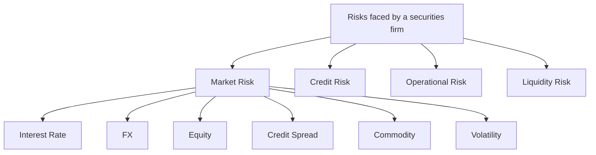

# Module 1 — Market Risk Foundations

!!! abstract "Module Goal"
    Understand what market risk *is*, why the function exists, who cares about it, and the regulatory landscape that shapes everything downstream — including the data you'll model.

---

## 1. Learning objectives

By the end of this module, you should be able to:

- **Define** market risk and distinguish it from credit, operational, and liquidity risk.
- **Classify** a position into its dominant market-risk sub-type (interest rate, FX, equity, credit spread, commodity, volatility).
- **Compute** a simple DV01 on a zero-coupon bond and explain what the number means in dollars.
- **Identify** the major regulatory regimes (Basel, FRTB, IFRS) that drive the data demands you will see in production.
- **Recognise** that every risk measure — VaR, ES, sensitivities, stress P&L — is a summary of an underlying P&L distribution.
- **Map** stakeholder personas (traders, risk managers, CRO, Finance, regulators, audit) to the views of the same data they each consume.

## 2. Why this matters

If you work in BI or data engineering for a securities firm, market risk is almost certainly the largest, most heavily regulated, and most computationally intensive consumer of your data. Knowing *what* the risk function is trying to measure — and *why* the regulator demands it — is the difference between mechanically loading a fact table and being able to defend its design when Internal Audit walks in.

This module sits at the foundation of the curriculum. Everything from trade lifecycles ([Module 3](03-trade-lifecycle.md)) through sensitivities ([Module 8](08-sensitivities.md)), VaR ([Module 9](09-value-at-risk.md)), stress ([Module 10](10-stress-testing.md)) and bitemporality ([Module 13](13-time-bitemporality.md)) builds on the vocabulary established here. Without it, you will keep guessing why your warehouse looks the way it does.

The practical payoff: after this module you should be able to read any risk report and articulate which sub-type of market risk it covers, which stakeholder it serves, and which regulatory regime forced it into existence.

## 3. Core concepts

### 3.1 What is market risk?

**Market risk** is the risk of loss from movements in market prices. It's distinct from:

- **Credit risk** — risk that a counterparty defaults
- **Operational risk** — risk from process, people, or system failures
- **Liquidity risk** — risk of being unable to fund or unwind positions

Market risk specifically covers losses from changes in:

- **Interest rates** — yield curves, basis spreads
- **FX rates** — currency movements
- **Equity prices** — single names and indices
- **Credit spreads** — bond and CDS spreads (the *spread* component, not default itself)
- **Commodity prices** — oil, gas, metals, agriculturals
- **Volatility** — implied vol surfaces (a major risk for options books)



The dotted line between **credit risk** and **credit spread risk** trips up newcomers: a corporate bond carries *both*. Default risk sits in credit; daily mark-to-market moves driven by spread widening sit in market.

### 3.2 Why the function exists

Three fundamental reasons:

1. **Internal risk management.** A trading firm must know how much it can lose. Without measurement, you cannot manage.
2. **Capital adequacy.** Regulators require firms to hold capital against market risk. The amount is calculated from market risk measures.
3. **Limits & governance.** Each trader, desk, and division has limits (VaR limits, sensitivity limits, stress limits). Breaches must be detected and escalated.

### 3.3 The risk function — independent by design

Market risk sits in the **2nd line of defense** (we cover this in detail in [Module 2](02-securities-firm-organization.md)). The key principle: **independence from the front office**.

A trader has a direct financial incentive to under-report risk. The risk function exists to provide an independent, challenger view. This independence is reflected in:

- Separate reporting lines (Risk reports to a CRO, not to trading heads)
- Separate systems (Risk has its own data warehouse and engines)
- Separate calculations (Risk re-prices and re-computes, doesn't trust FO numbers blindly)

!!! info "Why this matters for BI"
    The independence requirement directly shapes data architecture. You'll often have **two parallel data flows** — one in the FO ecosystem, one in the Risk ecosystem — that must reconcile. Understanding why this duplication exists prevents you from "simplifying" it away.

### 3.4 Key stakeholders

| Stakeholder | What They Care About |
|-------------|---------------------|
| **Traders** | Their book's P&L, sensitivities (Greeks), limits headroom |
| **Risk Managers** | VaR, stress, limit breaches, concentration, tail risk |
| **CRO / Senior Risk** | Aggregate exposure, regulatory capital, board reporting |
| **Finance** | P&L reconciliation, capital, regulatory submissions |
| **Regulators** | FRTB compliance, model approval, ad-hoc requests |
| **Internal Audit** | Controls, lineage, evidence, independence |

Each consumes the same underlying data through different lenses. **Conformed dimensions** ([Module 6](06-core-dimensions.md)) are how a single warehouse serves all of them.

### 3.5 Regulatory landscape (brief tour)

You don't need to be a regulator, but knowing *why* a report exists makes you 10× more useful.

#### Basel framework

The Basel Committee on Banking Supervision sets global standards:

- **Basel II (2004)** — introduced the Internal Models Approach (IMA) for market risk; firms could use their own VaR models with regulator approval.
- **Basel 2.5 (2009, post-GFC)** — added **Stressed VaR (sVaR)** and **IRC** (Incremental Risk Charge) after VaR alone was shown to underestimate crisis losses.
- **Basel III** — broader bank capital framework; market risk piece evolved into FRTB.

#### FRTB — the current regime

**FRTB (Fundamental Review of the Trading Book)** is the current market risk capital framework. Key shifts:

- **VaR replaced by Expected Shortfall (ES)** at 97.5% confidence
- **Liquidity horizons** vary by risk factor (10d to 250d)
- **Standardized Approach (SA)** is now meaningful — every firm computes it, even IMA-approved firms
- **Internal Models Approach (IMA)** has stricter approval — desk-level, not firm-level
- **Non-Modellable Risk Factors (NMRF)** get punitive capital treatment
- **P&L Attribution Test** — daily test that risk model P&L matches actual P&L within tolerance

#### Other regimes worth knowing

- **IFRS 9 / IFRS 13** — accounting standards governing fair value measurement
- **MiFID II** — EU markets regulation (transaction reporting, best execution)
- **Dodd-Frank** — US equivalent (Volcker rule, swap reporting)
- **CCAR / DFAST** — US stress testing for large banks
- **EBA Stress Tests** — EU equivalent

!!! tip "Regulator-driven data demands"
    Most "weird" things in your warehouse exist because of a regulator. Bitemporality? Required to reproduce historical reports. Granular trade-level storage? Required for reg reporting. Multiple P&L flavors? Required for the P&L attribution test.

### 3.6 Risk measures at a glance

The major measures you'll model. We deep-dive on each later.

| Measure | What It Measures | Module |
|---------|------------------|--------|
| **Sensitivities (Greeks, DV01)** | How value changes for a small market move | [Module 8](08-sensitivities.md) |
| **VaR** | Loss not expected to be exceeded with X% confidence | [Module 9](09-value-at-risk.md) |
| **Expected Shortfall (ES)** | Average loss in the worst (1-X)% of cases | [Module 9](09-value-at-risk.md) |
| **Stress P&L** | Loss under specific defined scenarios | [Module 10](10-stress-testing.md) |
| **IRC** | Default and migration risk for credit positions | [Module 19](19-regulatory-context.md) |

### 3.7 Stats detour — risk, return, loss distributions

Just an intuitive primer; we go deeper in [Module 9](09-value-at-risk.md).

- **Return** = change in value over a period, often expressed as a percentage.
- **Risk** = uncertainty about future returns, typically captured by the **distribution** of possible returns.
- **Loss distribution** = the distribution of P&L outcomes, usually with losses on one side and gains on the other.

Most risk measures are **summaries of this distribution**:

- **VaR** is a percentile of it (the 99th percentile loss, for example)
- **ES** is the average beyond that percentile
- **Stress P&L** is a single point on it (under a specific scenario)
- **Sensitivities** describe its *shape* near today's market

Holding this picture in your head — *every risk measure is a summary of a P&L distribution* — is the single most useful intuition in market risk.

## 4. Worked examples

### Example 1 — Computing DV01 on a 5y zero-coupon bond

A trader holds a $1,000,000 face-value zero-coupon bond maturing in 5 years. The current continuously-compounded yield is 3%. The risk manager wants to know: *what does my book lose if rates move 1 basis point against me?*

The continuous-compounding price is

$$
P(y) = F \cdot e^{-y T}
$$

So at \(y = 0.03\), \(T = 5\), \(F = 1{,}000{,}000\):

$$
P(0.03) = 1{,}000{,}000 \cdot e^{-0.15} \approx 860{,}707.98
$$

DV01 is the change in price from a 1bp *fall* in yield (which produces a *gain* on a long bond):

$$
\text{DV01} = P(y - 0.0001) - P(y) \approx 86.07
$$

So this position will gain roughly $86 for each 1bp drop in yield, and lose roughly $86 for each 1bp rise. Multiply by a 50bp shock and you have your answer for a small parallel scenario. The closed-form approximation \(P \cdot T \cdot 1\text{bp} \approx 860{,}708 \cdot 5 \cdot 0.0001 \approx 430.35\) — wait, that gives the *modified-duration dollar* answer for a *5-year* zero, which under continuous compounding equals \(P \cdot T \cdot \Delta y\); for a 1bp shift that's $86.07 because duration of a zero equals its maturity. The closed form and the bump match — that's the sanity check every junior risk analyst should run.

```python
--8<-- "code-samples/python/01-dv01-calc.py"
```

Discuss: DV01 is *additive across instruments within the same risk factor*. Twenty positions on the same yield curve can have their DV01s summed to give a portfolio DV01. That additivity is exactly what makes sensitivities a workhorse risk measure for daily reporting — and it is exactly what *fails* once you mix curves, currencies, or non-parallel shifts. See [Module 8](08-sensitivities.md) for the full treatment.

### Example 2 — Classifying a small portfolio

A junior analyst is handed three positions and asked to label the dominant market-risk sub-type and the dominant Greek for each.

| Position                  | Dominant sub-type     | Dominant Greek (or sensitivity) | Why                                                       |
| ------------------------- | --------------------- | ------------------------------- | --------------------------------------------------------- |
| 10y US Treasury, long $5m | Interest rate         | DV01 (dollar duration)          | Price moves with the 10y point on the USD curve.          |
| USD/JPY long $10m notional| FX                    | Delta to USD/JPY spot           | A 1% move in USD/JPY produces a roughly 1% USD P&L move.  |
| AAPL call option, 100 contracts | Equity (with vol)| Delta to AAPL spot, then Vega   | Delta dominates intraday; Vega becomes material near events.|

The point of the table is not the answers. It is the *habit* of asking, for any position, "what is the price function and which input dominates?" Every fact table you load needs a `risk_factor` dimension; this table is what populates it for these three rows.

## 5. Common pitfalls

!!! warning "Things to unlearn before going further"
    1. **"VaR tells you the worst case."** It doesn't. It tells you a threshold; losses *beyond* it are by definition not bounded by VaR. That's why ES exists.
    2. **"More data = better risk numbers."** Not always. Historical VaR with 10 years of data may include irrelevant regimes. Most banks use 1–2 years.
    3. **"Risk and Finance should always agree."** They use different bases (clean vs. dirty P&L, different snap times, different inclusion rules). Reconciliation is structural, not a bug.
    4. **"Sensitivities can just be summed."** They can — within a risk factor and bucket. But mixing currencies, mixing tenors, or summing across different shock conventions silently produces garbage.
    5. **"A corporate bond is just credit risk."** It carries both — default risk lives in credit, daily MTM moves driven by spread changes live in market. Both numbers exist; both have owners.

## 6. Exercises

1. **Conceptual.** A bank holds a $50m position in a 7-year senior unsecured corporate bond issued by a BBB-rated corporate. Both market risk *and* credit risk are present. Distinguish them precisely: what loss does each function measure, and what would each function escalate?

    ??? note "Solution"
        Market risk measures the daily MTM impact of moves in (a) the underlying risk-free rate (treasury curve) and (b) the BBB credit spread that prices the bond above the curve. Both are *market* risks because they show up in the bond's price every day even if the issuer never defaults. Credit risk measures the loss that occurs *if the issuer actually defaults* — modelled as PD × LGD × EAD, or via a CVA charge. Market risk would escalate a sharp spread widening or curve move; credit risk would escalate a downgrade, a drop in the issuer's CDS-implied PD, or a credit-watch listing. Both functions read from the same bond row in the warehouse; they slice it differently.

2. **Applied.** A book contains: (i) a long $5m 10-year US Treasury, (ii) a long $10m USD/JPY position, and (iii) 100 AAPL call options expiring in 30 days, struck at-the-money. Classify each into its market-risk sub-type and identify the dominant Greek/sensitivity per position.

    ??? note "Solution"
        (i) Interest-rate risk; dominant sensitivity is DV01 to the 10y point on the USD curve (with smaller exposures to neighbouring tenors). (ii) FX risk; dominant sensitivity is delta to USD/JPY spot. There is also a small interest-rate component if the position is funded via FX-forward, but for a spot or rolling-spot position FX delta dominates. (iii) Equity risk with material volatility risk; intraday the position is dominated by **delta** to AAPL spot, but as expiry approaches and around events (earnings) **vega** and **gamma** become first-order. Many shops report all three Greeks daily for option books for exactly this reason.

3. **Reasoning.** Liquidity risk is officially distinct from market risk, yet it is almost always discussed alongside it. Why? Give two concrete scenarios where treating them in isolation produces a misleading risk number.

    ??? note "Solution"
        The two interact because a market-risk number is only meaningful given an assumption about *how long it takes to exit the position*. Standard 1-day VaR assumes you can unwind tomorrow at today's mid; if the position is illiquid, the actual exit cost can be many multiples of VaR. FRTB explicitly responds to this with **liquidity horizons** that vary by risk factor (10d for liquid G10 rates, up to 250d for some credit-spread factors). Two concrete scenarios: (1) a large block of an illiquid EM corporate bond — VaR might say $1m at 99%, but the bid-offer cost of liquidating in a stressed market can be $5m or more, dwarfing the modelled tail. (2) An exotic derivative with no observable hedge instrument — the market-risk model may assume continuous re-hedging that is operationally impossible, understating the real tail.

## 7. Further reading

- Hull, J. *Risk Management and Financial Institutions* (Wiley, latest edition) — Chapters on market risk, VaR, and Basel are the canonical undergraduate-to-practitioner bridge.
- Jorion, P. *Value at Risk: The New Benchmark for Managing Financial Risk* (McGraw-Hill, 3rd ed.) — Still the standard reference on VaR methodology and its critique.
- Crouhy, M., Galai, D. & Mark, R. *The Essentials of Risk Management* (McGraw-Hill, 2nd ed.) — Practitioner-oriented overview of the full risk-management stack including governance.
- Bank for International Settlements, *Market risk overview*, [bis.org/bcbs/publ/d457.htm](https://www.bis.org/bcbs/publ/d457.htm) — BCBS's own summary of the market-risk regulatory framework.
- Basel Committee on Banking Supervision, *Minimum capital requirements for market risk* (the FRTB final standard, BCBS 457, January 2019, with subsequent FAQs) — the authoritative source on the current regime.
- Internal: see the firm's market-risk policy document and the data-dictionary for `fact_position` and `dim_risk_factor` for the local mapping of these concepts to your warehouse.

## 8. Recap

You should now be able to:

- Define market risk and place it inside the broader risk taxonomy alongside credit, operational, and liquidity risk.
- Classify a position into its dominant market-risk sub-type and name the Greek or sensitivity that drives its daily P&L.
- Compute a DV01 on a vanilla zero-coupon bond by hand and reconcile it against a closed-form duration approximation.
- Name the regulatory regimes (Basel II/2.5/III, FRTB, IFRS 9/13, CCAR) that drive most of the data demands you will see in the warehouse.
- Explain to a non-risk colleague that every risk measure is a summary of a P&L distribution — and use that picture to read any risk report.

---

[← Curriculum](../curriculum.md){ .md-button } [Next: Module 2 — How a Securities Firm is Organized →](02-securities-firm-organization.md){ .md-button .md-button--primary }
