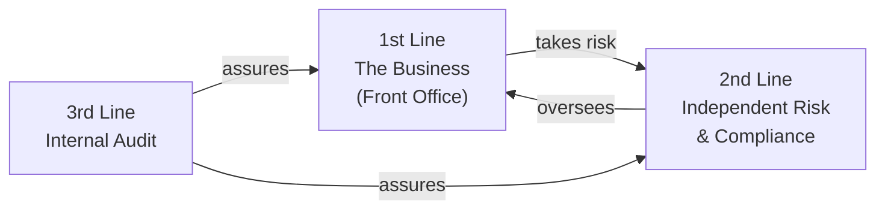
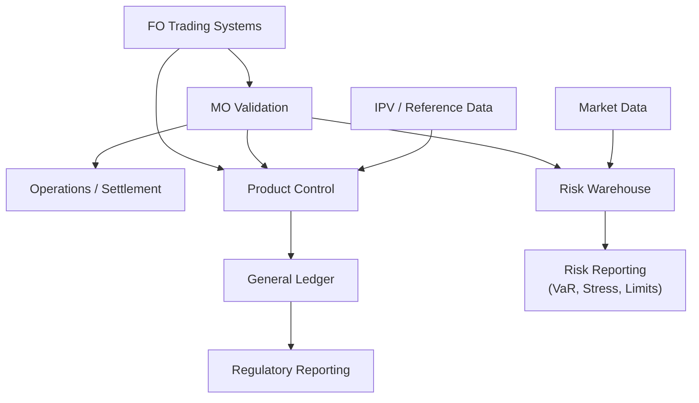

# Module 2 — How a Securities Firm is Organized

!!! abstract "Module Goal"
    Understand the organizational structure of a securities firm — areas, responsibilities, and how each maps to data ownership and data flow. By the end, you should be able to look at any data issue and immediately know **who to talk to**.

---

## 1. Learning objectives

By the end of this module, you should be able to:

- **Identify** the three lines of defense and explain why regulators expect this separation.
- **Distinguish** front-office, middle-office, back-office, risk, and finance functions and locate each on the front-to-back data-flow diagram.
- **Trace** a single trade from execution through risk reporting, naming the system that owns the data at each step and the team accountable for it.
- **Map** a data quality issue (a missing position, a P&L break, a reconciliation gap) to the function that owns the upstream data.
- **Recognise** the common organisational variations (asset managers, hedge funds, universal banks, custodians) and adjust your mental model accordingly.
- **Anticipate** the stakeholder consultations required before any cross-org data architecture change.

## 2. Why this matters

A securities firm's data architecture *mirrors* its org chart. If you do not know which function owns a piece of data, you cannot diagnose why it is wrong, who has the authority to fix it, or whom to invite to a design review. Every BI deliverable in market risk crosses at least three of front office, middle office, back office, risk, and finance — and every one of those crossings is a place where ownership changes hands.

This module sits between [Module 1](01-market-risk-foundations.md) (what the function measures) and [Module 3](03-trade-lifecycle.md) (how a single trade physically flows through the systems below). The vocabulary you build here — desk, book, IPV, F2B, three lines of defense — recurs throughout the curriculum and throughout your career.

A practitioner who has internalised the org map can look at any unexpected number and instantly form a hypothesis about which team to call first. That instinct compresses incident response from days to hours.

## 3. Core concepts

### 3.1 The Three Lines of Defense

The foundational model regulators expect every firm to follow:



| Line | Role | Examples |
|------|------|----------|
| **1st** | Owns and takes risk | Trading, Sales, Structuring |
| **2nd** | Independent oversight & challenge | Risk, Compliance, Finance |
| **3rd** | Independent assurance | Internal Audit |

!!! info "Why this matters for BI"
    This isn't bureaucracy trivia — it dictates **who can change what data**, **who signs off on numbers**, and **why certain reports must be produced by independent teams**. It directly shapes BI access models and data ownership.

### 3.2 Front Office (FO)

The revenue-generating side. Subdivisions:

#### Sales
Client-facing. Originates trades, manages relationships, **does not take principal risk**. Compensation is typically tied to client revenue.

#### Trading
**Takes principal risk.** Makes markets, runs proprietary positions, hedges. Organized along two axes:

- **By asset class** — Rates, Credit, FX, Equities, Commodities
- **By region** — EMEA, APAC, Americas

A typical desk might be "EMEA Rates Flow Trading" or "APAC Credit Derivatives".

#### Structuring
Designs bespoke products for clients (structured notes, exotic options, hybrid products). Often sits within or beside trading.

#### Research
Publishes market views. **Separated from trading by Chinese walls** — research must not be influenced by trading positions.

#### Front Office Quants ("Strats")
Build pricing models used by traders. Often embedded directly within desks.

!!! tip "Data implications"
    FO is where trades are *born*. The **trader dimension**, **desk dimension**, and **book dimension** all originate here. Books are typically owned by a trader or trading team.

### 3.3 Middle Office (MO)

The independent layer between FO and back office. Often confused with Operations — they're different functions.

#### Trade Support / Trade Validation
Checks every booked trade for accuracy (terms, prices, counterparty) **before** it flows downstream.

#### Product Control / P&L Group
Produces the **official daily P&L**, independent of traders. Reconciles trader's "estimate" P&L vs. official P&L. Investigates breaks.

!!! example "The classic P&L flow"
    1. Trader publishes their **estimate P&L** at end of day (~5pm).
    2. Product Control runs the **official P&L** overnight using validated marks.
    3. Next morning: trader and PC reconcile. Differences ("breaks") are explained.

#### Independent Price Verification (IPV)
Monthly/periodic independent check that marks used by FO are reasonable. Critical for **fair value reporting** under IFRS 13.

#### Reference Data / Static Data
Owns the instrument master, counterparty master, market data sources. **The team behind your dimension tables.**

!!! tip "Data implications"
    MO is the **gatekeeper of data quality** for everything downstream. They're often your closest BI partner. Reconciliations between FO systems and risk/finance flow through MO.

### 3.4 Back Office / Operations

Settlement, clearing, custody, corporate actions.

| Function | Responsibility |
|----------|----------------|
| **Trade Settlement** | Ensuring cash and securities actually exchange hands |
| **Clearing** | Interfacing with CCPs (LCH, CME, etc.) |
| **Custody** | Holding the securities |
| **Corporate Actions** | Dividends, splits, mergers — all of which adjust positions |
| **Collateral Management** | Managing margin with counterparties |
| **Reconciliations** | Cash, position, nostro/vostro recs |

!!! tip "Data implications"
    This is where the **settled position** is golden. Risk often uses the FO trade view; Finance uses the settled view. Reconciling these is a constant data exercise.

### 3.5 Risk Management (2nd Line)

Independent oversight. Subdivisions matter for understanding who consumes which data.

#### Market Risk — Your Domain
VaR, sensitivities, stress, limits. Often split into:

- **Risk Production** — runs the engines, produces the numbers. **BI often sits here or adjacent.**
- **Risk Management** — analyzes, challenges traders, sets and monitors limits.

#### Credit Risk
Counterparty default risk. Models: **PFE** (Potential Future Exposure), **EAD** (Exposure at Default), **CVA** (Credit Valuation Adjustment).

#### Operational Risk
Risk from process/people/systems failures.

#### Liquidity Risk
Funding and market liquidity.

#### Model Risk Management
Validates pricing and risk models independently. They will scrutinize your data lineage during model validation.

#### Enterprise / Integrated Risk
Aggregates across silos for board and regulatory reporting.

!!! tip "Data implications"
    Risk is usually your *primary stakeholder*. They consume position data and market data, and produce sensitivities, VaR, stress P&L. Risk has its own data store separate from Finance's.

### 3.6 Finance

The accounting and regulatory reporting function.

| Sub-function | Responsibility |
|--------------|----------------|
| **Product Control** | Daily P&L (sometimes in MO, sometimes Finance — varies by firm) |
| **Financial Control / Accounting** | Books the official ledger, statutory accounts |
| **Regulatory Reporting** | Basel capital, FRTB, IFRS 9, COREP/FINREP submissions |
| **Tax** | Transaction taxes, FATCA |
| **Treasury** | Funding, FTP (funds transfer pricing), liquidity |

!!! warning "The Risk-Finance reconciliation"
    Finance numbers and Risk numbers must reconcile but often don't (different bases, conventions, snap times). A huge BI challenge in any firm is maintaining **risk-finance reconciliation**. This is so important it gets its own treatment in [Module 15](15-data-quality.md).

### 3.7 Compliance & Legal

- **Compliance** — ensures adherence to regulations (MAR, MiFID II, Dodd-Frank). Trade surveillance, communications surveillance.
- **Legal** — documentation (ISDA Master Agreements, CSAs, Credit Support Annexes), disputes.

!!! tip "Data implications"
    Compliance often consumes trade and communications data for surveillance. Specific data marts for surveillance are common, sometimes with restricted access.

### 3.8 Technology & Data

- **Front Office IT** — pricing systems, trader tools, e-trading platforms
- **Risk IT** — risk engines, scenario systems, the risk warehouse (where you likely sit or interface)
- **Finance IT** — GL, regulatory reporting platforms
- **Enterprise Data** — data warehouses, data lakes, data governance, MDM (Master Data Management)
- **Infrastructure** — cloud, networks, security

!!! tip "This is your world"
    Understand who owns which system because you'll spend half your career sourcing data from one team's system into another's.

### 3.9 Internal Audit (3rd Line)

Periodic deep audits. They will ask you for:

- Lineage (where does this number come from?)
- Controls (who reviewed it?)
- Evidence (show me the change tickets)
- Independence (prove FO can't override Risk)

Don't fear them — be ready. Good lineage and documentation make audits painless.

### 3.10 Common variations

The structure above is typical for an **investment bank** or **broker-dealer**. Variations:

| Firm Type | Differences |
|-----------|-------------|
| **Asset Manager** | "Portfolio Managers" instead of "Traders"; less principal risk; more emphasis on attribution and benchmarks |
| **Hedge Fund** | Smaller, flatter; less segregation between FO and risk; founder-led |
| **Universal Bank** | Adds Retail, Commercial, Wealth divisions — usually structurally separate from Markets/Securities |
| **Custodian** | Operations-heavy; minimal FO; huge reference data function |

Sell-side vs. buy-side terminology differs throughout — worth keeping a personal cheat sheet.

### 3.11 Region-based organization

Many large firms run a **dual matrix**: by **product** AND by **region**.

```text
                EMEA    APAC    AMRS
   Rates         R-E     R-A     R-M
   Credit        C-E     C-A     C-M
   FX            F-E     F-A     F-M
   Equities      E-E     E-A     E-M
```

Each cell has a head, a P&L, and limits. Books and trades carry both attributes — your dimensions need to support both rollups.

### 3.12 How org maps to data architecture

The punchline of the section — a typical securities firm's data flow **mirrors** its org structure.



Every arrow is a **reconciliation point**. Every box has a **data owner**. Knowing this map means you always know **where to go when a number looks wrong**.

### 3.13 Practical glossary — things you'll hear daily

| Term | What It Means |
|------|---------------|
| **The desk** | A specific trading team (e.g., "the EMEA Rates desk") |
| **The book** | A logical container of trades for P&L/risk |
| **The trader** | The person responsible for a book |
| **The strat** | FO quant; builds models for the desk |
| **The quant** | Generic for any quantitative analyst |
| **FO / MO / BO** | Front / Middle / Back Office |
| **PC** | Product Control |
| **IPV** | Independent Price Verification |
| **Risk Prod** | Risk Production team |
| **Front-to-Back / F2B** | The full lifecycle of a trade |
| **STP** | Straight-Through Processing — fully automated trade flow |
| **EOD** | End of Day |
| **T+0/T+1/T+2** | Trade date / +1 day / +2 days (settlement convention) |
| **The Greek pack** | Daily report of sensitivities to risk managers |
| **The limit pack** | Daily report of limits utilization |
| **The daily P&L** | Official end-of-day P&L from PC |
| **The explain** | P&L attribution showing what drove daily P&L |

## 4. Worked examples

### Example 1 — A vanilla 5y USD interest-rate swap, $100m notional, traced front-to-back

A flow-rates trader on the EMEA Rates desk executes a 5-year USD pay-fixed interest-rate swap with a hedge-fund counterparty on the morning of 7 May 2026. Notional $100m, fixed 4.30%, floating 3M SOFR, semi-annual fixed / quarterly floating, T+2 effective date. Watch what happens to the data over the next 36 hours.

| # | Step | Owner | System (typical) | What happens to the data |
| - | ---- | ----- | ---------------- | ------------------------- |
| 1 | **Execution & booking** | Trader (FO) | Trade-capture / OMS (e.g. Murex, Calypso, in-house) | The trader confirms terms with the counterparty (voice or electronic) and books the trade. A new row is minted with `fo_trade_id = FOT-2026-018442`, status NEW, all economic terms captured. The risk warehouse picks this up via a near-real-time feed within minutes. |
| 2 | **Sales / desk-level booking** | Sales (FO) | Same OMS, sales-attribution module | Sales credit and client-facing booking attributes (`sales_credit`, `client_id`, `coverage_banker`) are stamped on the trade. P&L attribution to the sales desk uses these later in the cycle. |
| 3 | **Trade validation** | Middle Office — Trade Support | Confirmation / matching platform (e.g. MarkitWire, DTCC) | MO validates the booked terms, checks the counterparty has signed CSAs, and submits the trade for matching. Once the counterparty matches, status flips to "matched" in the confirmation system; the trade gets a USI/UTI for regulatory reporting. |
| 4 | **Risk validation & EOD position lock** | Middle Office — Risk Production | Risk warehouse / position store | MO reconciles FO trade capture against the matched confirmation. If both agree, the trade is included in the *official* EOD position snapshot at the regional cut-off (17:30 London). The position store stamps it with `business_date = 2026-05-07`. |
| 5 | **Settlement instruction** | Back Office / Operations | Settlement ledger, SWIFT, CCP feed | If the swap is to be cleared (LCH SwapClear is typical), Ops generates the give-up instruction; otherwise it manages the bilateral CSA mechanics. The settlement system mints `set_ref = SET-998112`; for cleared trades, LCH stamps `LCH-77890`, which becomes the legal identifier post-novation to the CCP. |
| 6 | **Treasury / funding** | Treasury | Funding desk's ledger, FTP system | The first floating fixing won't pay for three months, but Treasury immediately picks up the trade for funds-transfer-pricing — every desk pays an internal funding cost based on its open positions. The trade now appears in the FTP fact table with a charge against the Rates book. |
| 7 | **P&L recognition** | Finance — Product Control | Official P&L engine, GL feeder | Overnight, Product Control runs the official P&L using IPV-validated marks. Day-1 P&L is roughly the bid-offer captured at execution minus any market move from booking time to EOD. The GL recognises fair-value MTM under IFRS 9. Trader's estimate P&L from the FO blotter is reconciled against PC's official number the next morning; any break is explained. |
| 8 | **EOD VaR & sensitivities** | Risk Management | Risk engine, risk warehouse, Greek pack | The risk engine reads the EOD position from step 4, recomputes sensitivities (`DV01` per tenor on the USD curve, gamma to large moves), and generates VaR/ES contributions for the swap. Numbers land in the Greek pack and the limit pack the next morning by 07:00 London for the desk to review at the morning meeting. |

The point of the trace is the *handover* between functions. Every numbered row above represents a system boundary, a team boundary, and almost always a reconciliation. When a number is wrong on the morning Greek pack, you walk this list backwards: did Risk get the right position from MO? Did MO get the right confirmation from FO? Did FO book the right economics? The answer is almost always at one of those joins.

### Example 2 — Mapping a data issue back to the org

A risk manager calls at 08:30 to report that the EMEA Rates desk's DV01 to the 5y USD point looks $200k higher than yesterday with no obvious new trade. A junior BI analyst on Risk Production diagnoses it.

1. Pull the EOD position diff from yesterday to today: a single new $100m 5y USD payer swap explains the move.
2. Cross-check FO blotter (Trader → step 1) — trade is there, booked at 09:14 yesterday.
3. Cross-check MO confirmation (step 3) — trade matched at 11:02 yesterday.
4. Cross-check official EOD position (step 4) — trade is in.
5. Conclusion: the DV01 jump is *correct*, not a data bug. The trader simply put on a new hedge yesterday and forgot to mention it in the morning meeting.

That five-step diagnosis is only possible because the analyst has internalised the front-to-back map. Without it, the call would have escalated to three teams and consumed half a day. With it, the answer is a 15-minute query.

## 5. Common pitfalls

!!! warning "Watch out"
    1. **Confusing Middle Office with Operations.** They are different functions in any firm large enough to separate them. MO validates and produces official P&L; Ops settles. Asking Ops to fix a P&L break is a common rookie error.
    2. **Treating FO as a single team.** Sales, Trading, Structuring, Research, and Strats are distinct functions with distinct reporting lines and incentives. "FO booked it wrong" is meaningless until you specify which sub-function.
    3. **Forgetting Independent Audit will read your lineage.** Architecture decisions taken to "simplify" the parallel FO and Risk feeds usually fail the next IA review on independence grounds. Document the *reason* for the duplication, not just the duplication.
    4. **Assuming the same org chart in every firm.** Asset managers, hedge funds, and custodians look very different. Map their functions to the equivalent investment-bank role before applying any pattern from this module.
    5. **Skipping the org-stakeholder review on cross-team data work.** Any consolidation, migration, or rebuild that crosses FO/MO/Risk/Finance boundaries will fail without explicit upfront sign-off from the data owners on each side. The cost of the review is hours; the cost of skipping it is months.

## 6. Exercises

1. **Conceptual.** A trader, a Middle Office product controller, and a Back Office settlements clerk each claim to know "the official EOD position" for a book. Who is actually authoritative, and how is the answer reconciled against the other two views?

    ??? note "Solution"
        The official EOD position is owned by Middle Office (Risk Production / Product Control, depending on firm), built from the FO trade capture *after* MO has validated it and *before* Operations has settled it. The trader's blotter view is the *intra-day* view and is authoritative for hedging decisions but not for reporting. The Back Office view is authoritative for cash and securities movement but lags the trade view by 1–2 days for spot products and longer for derivatives. The reconciliation is a daily three-way: FO blotter → MO official position → BO settlement, with breaks tracked at each join. The MO number is the one the regulator and senior management see; the others exist to validate it.

2. **Applied.** A trade is amended at 16:55 on 7 May, five minutes before the regional EOD cut-off. Walk through which downstream systems pick up the amendment by EOD, and which might miss it. What is the data engineer's role in managing this race condition?

    ??? note "Solution"
        At 16:55 the FO blotter is updated immediately. The MO confirmation system receives the amendment but the counterparty re-match may not complete before the 17:30 cut-off — meaning the EOD official position picks up the *amended* economics from FO but flags an unmatched confirmation. The Back Office settlement instruction may still reflect the *original* terms because its EOD batch ran at 17:00. The Risk engine has the amended position in its EOD snapshot, so the next morning's VaR is right; but the next morning's settlement-vs-position reconciliation will tear. The data engineer's role is to: (a) define the cut-off contract clearly (every system documents what time-stamp it freezes against), (b) make late amendments a first-class signal — `late_amendment_flag` on the position row, (c) ensure the reconciliation job *expects* the BO/MO mismatch in this scenario and does not raise a false positive, and (d) make the late-amendment list available to MO for next-day clean-up. The bug is usually a silent race that no one sees, not the amendment itself.

3. **Org-aware.** You are proposing to consolidate two regional risk warehouses (one in London, one in Singapore) into a single global instance. List the four organisational stakeholders you must consult before the architecture design begins, and what each cares about.

    ??? note "Solution"
        (1) **Heads of Market Risk in each region** — they own the risk numbers and will block any change that creates a window of regulatory non-compliance or that disrupts their daily routine. They care about cut-off times, the limit pack, and continuity of the historical series. (2) **Risk IT** — they own the engines and the warehouse infrastructure today. They care about migration cost, the deprecation path for current systems, and on-call rotation across time zones for a global instance. (3) **Compliance and Internal Audit** — they care about data sovereignty (Singapore data may have local-residency obligations under MAS), about lineage continuity through the cut-over, and about the independence of risk numbers from FO. (4) **Finance / Product Control** — Risk and Finance reconcile daily; any change to the Risk warehouse changes the reconciliation surface and PC needs lead time to adjust their own jobs. A good architecture review starts with all four in the room, agrees the constraints, and only then sketches the design. Skipping any of them is the most common reason such programmes fail in year two.

## 7. Further reading

- Simmons, M. *Securities Operations: A Guide to Trade and Position Management* (Wiley) — the standard practitioner reference for the front-to-back operational flow.
- DTCC, *DTCC services and platforms overview*, [dtcc.com](https://www.dtcc.com/) — a good orientation to the post-trade infrastructure your Back Office will be plugged into.
- Harris, L. *Trading and Exchanges: Market Microstructure for Practitioners* (Oxford University Press) — explains how the front-office sees market structure, and therefore why FO data looks the way it does.
- Bank of England, *Senior Managers and Certification Regime (SM&CR)* documentation, [bankofengland.co.uk](https://www.bankofengland.co.uk/prudential-regulation/authorisations/senior-managers-regime-approvals) — the regulatory accountability model that pins specific named individuals to specific risk and data responsibilities.
- Bank for International Settlements, *Markets Committee papers on market structure*, [bis.org/about/factmktc.htm](https://www.bis.org/about/factmktc.htm) — periodic surveys of how the major asset-class markets are organised, useful for putting your firm's structure in context.
- Internal: the firm's organisation chart and the data-ownership matrix in your data-governance wiki — the local concrete instance of everything in this module.

## 8. Recap

You should now be able to:

- Name the three lines of defense and explain why the regulator demands the separation.
- Place any business function (Sales, Trading, Trade Support, Product Control, IPV, Operations, Market Risk, Credit Risk, Compliance, Internal Audit) on the front-to-back map.
- Trace a vanilla swap through eight steps from execution to next-morning Greek pack and identify the system and team that owns each step.
- Diagnose a data-quality issue by walking the front-to-back map backwards and identifying the team to call first.
- Anticipate which organisational stakeholders must sign off on any cross-team data architecture change before design work begins.

---

[← Module 1](01-market-risk-foundations.md){ .md-button } [Next: Module 3 — Trade Lifecycle →](03-trade-lifecycle.md){ .md-button .md-button--primary }
