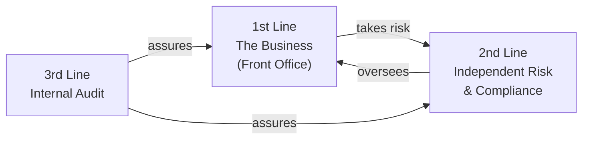
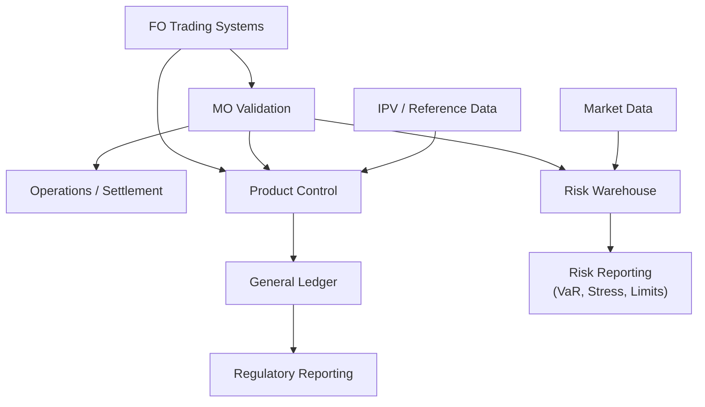

# Module 2 — How a Securities Firm is Organized

!!! abstract "Module Goal"
    Understand the organizational structure of a securities firm — areas, responsibilities, and how each maps to data ownership and data flow. By the end, you should be able to look at any data issue and immediately know **who to talk to**.

## 2.1 The Three Lines of Defense

The foundational model regulators expect every firm to follow:



| Line | Role | Examples |
|------|------|----------|
| **1st** | Owns and takes risk | Trading, Sales, Structuring |
| **2nd** | Independent oversight & challenge | Risk, Compliance, Finance |
| **3rd** | Independent assurance | Internal Audit |

!!! info "Why this matters for BI"
    This isn't bureaucracy trivia — it dictates **who can change what data**, **who signs off on numbers**, and **why certain reports must be produced by independent teams**. It directly shapes BI access models and data ownership.

## 2.2 Front Office (FO)

The revenue-generating side. Subdivisions:

### Sales
Client-facing. Originates trades, manages relationships, **does not take principal risk**. Compensation is typically tied to client revenue.

### Trading
**Takes principal risk.** Makes markets, runs proprietary positions, hedges. Organized along two axes:

- **By asset class** — Rates, Credit, FX, Equities, Commodities
- **By region** — EMEA, APAC, Americas

A typical desk might be "EMEA Rates Flow Trading" or "APAC Credit Derivatives".

### Structuring
Designs bespoke products for clients (structured notes, exotic options, hybrid products). Often sits within or beside trading.

### Research
Publishes market views. **Separated from trading by Chinese walls** — research must not be influenced by trading positions.

### Front Office Quants ("Strats")
Build pricing models used by traders. Often embedded directly within desks.

!!! tip "Data implications"
    FO is where trades are *born*. The **trader dimension**, **desk dimension**, and **book dimension** all originate here. Books are typically owned by a trader or trading team.

## 2.3 Middle Office (MO)

The independent layer between FO and back office. Often confused with Operations — they're different functions.

### Trade Support / Trade Validation
Checks every booked trade for accuracy (terms, prices, counterparty) **before** it flows downstream.

### Product Control / P&L Group
Produces the **official daily P&L**, independent of traders. Reconciles trader's "estimate" P&L vs. official P&L. Investigates breaks.

!!! example "The classic P&L flow"
    1. Trader publishes their **estimate P&L** at end of day (~5pm).
    2. Product Control runs the **official P&L** overnight using validated marks.
    3. Next morning: trader and PC reconcile. Differences ("breaks") are explained.

### Independent Price Verification (IPV)
Monthly/periodic independent check that marks used by FO are reasonable. Critical for **fair value reporting** under IFRS 13.

### Reference Data / Static Data
Owns the instrument master, counterparty master, market data sources. **The team behind your dimension tables.**

!!! tip "Data implications"
    MO is the **gatekeeper of data quality** for everything downstream. They're often your closest BI partner. Reconciliations between FO systems and risk/finance flow through MO.

## 2.4 Back Office / Operations

Settlement, clearing, custody, corporate actions.

| Function | Responsibility |
|----------|----------------|
| **Trade Settlement** | Ensuring cash and securities actually exchange hands |
| **Clearing** | Interfacing with CCPs (LCH, CME, etc.) |
| **Custody** | Holding the securities |
| **Corporate Actions** | Dividends, splits, mergers — all of which adjust positions |
| **Collateral Management** | Managing margin with counterparties |
| **Reconciliations** | Cash, position, nostro/vostro recs |

!!! tip "Data implications"
    This is where the **settled position** is golden. Risk often uses the FO trade view; Finance uses the settled view. Reconciling these is a constant data exercise.

## 2.5 Risk Management (2nd Line)

Independent oversight. Subdivisions matter for understanding who consumes which data.

### Market Risk — Your Domain
VaR, sensitivities, stress, limits. Often split into:

- **Risk Production** — runs the engines, produces the numbers. **BI often sits here or adjacent.**
- **Risk Management** — analyzes, challenges traders, sets and monitors limits.

### Credit Risk
Counterparty default risk. Models: **PFE** (Potential Future Exposure), **EAD** (Exposure at Default), **CVA** (Credit Valuation Adjustment).

### Operational Risk
Risk from process/people/systems failures.

### Liquidity Risk
Funding and market liquidity.

### Model Risk Management
Validates pricing and risk models independently. They will scrutinize your data lineage during model validation.

### Enterprise / Integrated Risk
Aggregates across silos for board and regulatory reporting.

!!! tip "Data implications"
    Risk is usually your *primary stakeholder*. They consume position data and market data, and produce sensitivities, VaR, stress P&L. Risk has its own data store separate from Finance's.

## 2.6 Finance

The accounting and regulatory reporting function.

| Sub-function | Responsibility |
|--------------|----------------|
| **Product Control** | Daily P&L (sometimes in MO, sometimes Finance — varies by firm) |
| **Financial Control / Accounting** | Books the official ledger, statutory accounts |
| **Regulatory Reporting** | Basel capital, FRTB, IFRS 9, COREP/FINREP submissions |
| **Tax** | Transaction taxes, FATCA |
| **Treasury** | Funding, FTP (funds transfer pricing), liquidity |

!!! warning "The Risk-Finance reconciliation"
    Finance numbers and Risk numbers must reconcile but often don't (different bases, conventions, snap times). A huge BI challenge in any firm is maintaining **risk-finance reconciliation**. This is so important it gets its own treatment in [Module 15](15-data-quality.md).

## 2.7 Compliance & Legal

- **Compliance** — ensures adherence to regulations (MAR, MiFID II, Dodd-Frank). Trade surveillance, communications surveillance.
- **Legal** — documentation (ISDA Master Agreements, CSAs, Credit Support Annexes), disputes.

!!! tip "Data implications"
    Compliance often consumes trade and communications data for surveillance. Specific data marts for surveillance are common, sometimes with restricted access.

## 2.8 Technology & Data

- **Front Office IT** — pricing systems, trader tools, e-trading platforms
- **Risk IT** — risk engines, scenario systems, the risk warehouse (where you likely sit or interface)
- **Finance IT** — GL, regulatory reporting platforms
- **Enterprise Data** — data warehouses, data lakes, data governance, MDM (Master Data Management)
- **Infrastructure** — cloud, networks, security

!!! tip "This is your world"
    Understand who owns which system because you'll spend half your career sourcing data from one team's system into another's.

## 2.9 Internal Audit (3rd Line)

Periodic deep audits. They will ask you for:

- Lineage (where does this number come from?)
- Controls (who reviewed it?)
- Evidence (show me the change tickets)
- Independence (prove FO can't override Risk)

Don't fear them — be ready. Good lineage and documentation make audits painless.

## 2.10 Common Variations

The structure above is typical for an **investment bank** or **broker-dealer**. Variations:

| Firm Type | Differences |
|-----------|-------------|
| **Asset Manager** | "Portfolio Managers" instead of "Traders"; less principal risk; more emphasis on attribution and benchmarks |
| **Hedge Fund** | Smaller, flatter; less segregation between FO and risk; founder-led |
| **Universal Bank** | Adds Retail, Commercial, Wealth divisions — usually structurally separate from Markets/Securities |
| **Custodian** | Operations-heavy; minimal FO; huge reference data function |

Sell-side vs. buy-side terminology differs throughout — worth keeping a personal cheat sheet.

## 2.11 Region-Based Organization

Many large firms run a **dual matrix**: by **product** AND by **region**.

```
                EMEA    APAC    AMRS
   Rates         R-E     R-A     R-M
   Credit        C-E     C-A     C-M
   FX            F-E     F-A     F-M
   Equities      E-E     E-A     E-M
```

Each cell has a head, a P&L, and limits. Books and trades carry both attributes — your dimensions need to support both rollups.

## 2.12 How Org Maps to Data Architecture

The punchline of the module — a typical securities firm's data flow **mirrors** its org structure.



Every arrow is a **reconciliation point**. Every box has a **data owner**. Knowing this map means you always know **where to go when a number looks wrong**.

## 2.13 Practical Glossary — Things You'll Hear Daily

| Term | What It Means |
|------|---------------|
| **The desk** | A specific trading team (e.g., "the EMEA Rates desk") |
| **The book** | A logical container of trades for P&L/risk |
| **The trader** | The person responsible for a book |
| **The strat** | FO quant; builds models for the desk |
| **The quant** | Generic for any quantitative analyst |
| **FO / MO / BO** | Front / Middle / Back Office |
| **PC** | Product Control |
| **IPV** | Independent Price Verification |
| **Risk Prod** | Risk Production team |
| **Front-to-Back / F2B** | The full lifecycle of a trade |
| **STP** | Straight-Through Processing — fully automated trade flow |
| **EOD** | End of Day |
| **T+0/T+1/T+2** | Trade date / +1 day / +2 days (settlement convention) |
| **The Greek pack** | Daily report of sensitivities to risk managers |
| **The limit pack** | Daily report of limits utilization |
| **The daily P&L** | Official end-of-day P&L from PC |
| **The explain** | P&L attribution showing what drove daily P&L |

## 2.14 Key Takeaways

- The firm is organized into **three lines of defense** — this shapes data ownership.
- **Front Office** creates trades; **Middle Office** validates and produces official P&L; **Operations** settles; **Risk** measures and monitors; **Finance** accounts and reports.
- **Independence** between FO and 2nd line creates parallel data flows that must reconcile.
- The **data architecture mirrors the org chart**. Memorize the F2B flow.
- When something looks wrong: identify which step in the F2B flow it's broken at, and you've identified who to call.

## 2.15 Glossary Terms Introduced

FO, MO, BO, PC, IPV, CRO, F2B, STP, EOD, CCP, ISDA, CSA, MDM.
See the [glossary](../glossary.md) for definitions.

---

[← Module 1](01-market-risk-foundations.md){ .md-button } [Next: Module 3 — Trade Lifecycle →](03-trade-lifecycle.md){ .md-button .md-button--primary }
