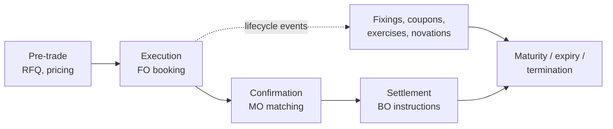
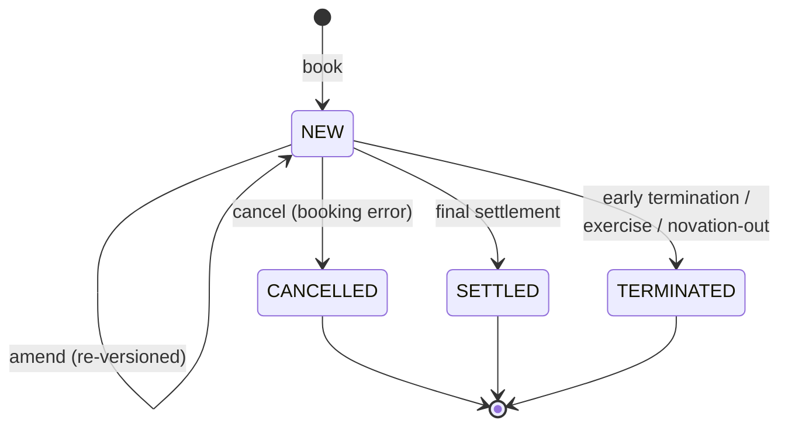
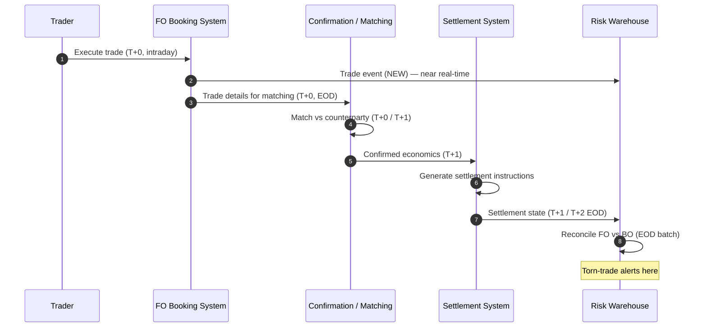
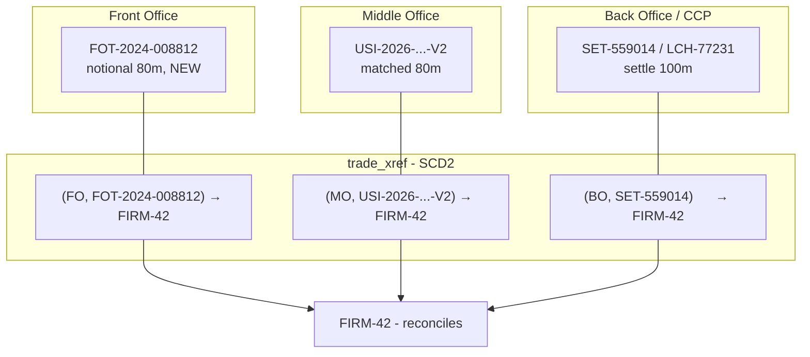

# Module 3 — The Trade Lifecycle (Risk Lens)

!!! abstract "Module Goal"
    Track a trade from origination to risk reporting through the lens of the data it generates. Understand where each row in your warehouse is born, how it mutates, and why a single missed amendment silently corrupts every downstream risk number.

---

## 1. Learning objectives

By the end of this module, you should be able to:

- **Identify** the six canonical stages of a trade lifecycle (pre-trade, execution, confirmation, settlement, lifecycle events, maturity/expiry/termination) and map each stage to the system that owns the data.
- **Trace** a single trade across front-office, middle-office, and back-office systems, explaining why each system holds a different "version of the truth".
- **Distinguish** between a NEW, AMENDED, CANCELLED, SETTLED, and TERMINATED trade and apply the state-transition rules that govern moves between those statuses.
- **Query** an event log to reconstruct the as-of state of a trade at an arbitrary timestamp, and to detect torn trades that exist in front-office capture but are missing in back-office settlement.
- **Recognise** how lifecycle events on derivatives (fixings, coupons, exercises, novations, partial unwinds) create new rows that risk reporting must fold into the parent trade.
- **Avoid** the common pitfalls — ignoring CANCELLED status, treating amendments as new trades, snapshot-only queries that miss intra-day churn, and timezone confusion on `business_date`.

## 2. Why this matters

A stale or torn trade in your warehouse silently corrupts every downstream risk number. If the front-office system has booked a $500m interest-rate swap that never arrived in the back-office settlement feed, your end-of-day VaR is wrong, your sensitivities are wrong, and your regulatory submission is wrong — and nothing in the report will tell you so. The defects only surface days later when Operations chases a missing confirmation, or when Finance cannot reconcile the cash ledger. By then the risk pack has already been signed off.

BI and data professionals are the people who decide *which* version of a trade enters the warehouse, *when* it enters, and *how* it is corrected. Those decisions are not glamorous, but they determine whether the firm's risk numbers are defensible. Every market-risk metric — sensitivities (Module 8), VaR (Module 9), stress (Module 10), P&L attribution (Module 14) — is a function of a position. Every position is a roll-up of trades. Every trade is a sequence of events. If you do not understand the events, you cannot defend the metric.

This module gives you the vocabulary and the queries. It connects upward to the organisational map in [Module 2](02-securities-firm-organization.md) (who owns which system) and downward to the bitemporal modelling patterns in [Module 13](13-time-bitemporality.md) (how to store the events without losing history). After this module, you should be able to look at any row in a `fact_trade` table and say which system it came from, what status it was in, and what could go wrong.

## 3. Core concepts

### 3.1 The six lifecycle stages

A trade does not pop into existence in a fact table. It moves through a sequence of stages, each owned by a different desk and a different system:

1. **Pre-trade.** A trader gets a request — voice, chat, electronic RFQ, or an algorithmic signal. The structure is priced, possibly hedged, possibly negotiated. No row exists in any warehouse yet, but pre-trade data (quotes, RFQs) often *does* land in a separate analytics store.
2. **Execution.** The trade is agreed and *captured* in the front-office (FO) booking system. This is the moment a trade ID is minted. Almost every market-risk system treats this row, with this ID, as the source of truth for **position and risk**.
3. **Confirmation.** Middle-office (MO) and the counterparty match economics — for OTC derivatives, this is the legal confirmation. For listed products, it is the exchange's drop-copy. The trade may be flagged "matched" or "unmatched" in a confirmation system.
4. **Settlement.** Back-office (BO) instructs and reconciles cash and securities movements. For a spot equity trade this is T+1 or T+2; for a swap, the first cashflow may be months away. Settlement is the moment **finance and treasury** start to care.
5. **Lifecycle events.** For anything other than a vanilla cash trade, the trade *evolves*: index fixings on a floating leg, coupon payments, optional exercise, novation to a new counterparty, partial unwind, compression. Each event is a new row in the event log; the trade ID stays the same.
6. **Maturity / expiry / termination.** The trade ends. For a bond, it matures; for an option, it expires; for a swap, it can be terminated early by mutual agreement, by exercise, or by default.



The dotted arrow matters. Lifecycle events do not flow strictly after settlement — a swap booked today will start fixing and paying coupons years before it matures, and each event must be folded back into the live position.

### 3.2 Status taxonomy and the state machine

Every well-designed trade store carries a `status` column. The values are deceptively simple; the rules between them are where firms get hurt. The five canonical statuses are:

| Status      | Meaning                                                                                                  |
| ----------- | -------------------------------------------------------------------------------------------------------- |
| NEW         | Trade has been booked. It is the latest version of itself. It contributes to today's position and risk.  |
| AMENDED     | The trade economics have been modified post-booking. The previous version is superseded.                 |
| CANCELLED   | The trade was booked in error and has been voided. It contributes nothing to position or risk.           |
| SETTLED     | The trade has fully settled (cash and securities have moved, or all cashflows have been delivered).      |
| TERMINATED  | The trade ended before its scheduled maturity (early termination, exercise, novation-out, default).      |

Two notes before the diagram:

- **AMENDED is not really a terminal status.** A trade can be amended many times. Each amendment produces a new event with `event_type = 'AMEND'`, and the trade's *current* status returns to NEW (or stays NEW) — because economically it is again "the latest live version of itself". Some firms model this as a separate `version_number` column rather than as a status. Both work; pick one and document it.
- **SETTLED applies cleanly to cash trades** (an equity trade settles T+2 and is done) but is awkward for derivatives, which have many partial settlements over years. Most derivative shops mark a swap as SETTLED only when the *final* cashflow has paid; until then, the trade is NEW and individual cashflows have their own settlement state.



Why are some transitions forbidden? A SETTLED trade cannot be CANCELLED — once cash has moved, you cannot pretend it never happened; you book a *reversing* trade instead. A CANCELLED trade cannot be AMENDED — it never existed economically, so there is nothing to amend; you book a fresh NEW trade with the corrected details. A TERMINATED trade cannot be re-AMENDED post-termination — terms after the termination date are meaningless. Each forbidden transition exists for a reason rooted in either accounting or legal reality, and your reconciliation queries should treat any observed transition outside this set as a data-quality alert.

!!! info "Definition: torn trade"
    A *torn trade* is a trade that exists in one system but not in another at the moment a snapshot is taken — most commonly, present in front-office capture but missing from back-office settlement at end of day. Torn trades are a leading indicator of either a feed failure, a pending confirmation, or a booking that has been unilaterally cancelled in one system but not the others.

### 3.3 Lifecycle events on derivatives

For cash equity and FX-spot, the lifecycle is short. For derivatives, the lifecycle *is* the trade. Five event types that you will see in any swap/option/structured-product event log:

- **Fixings.** A floating leg references a benchmark (SOFR, EURIBOR, an equity index). On each fixing date, the index value is observed and locked in. The fixing is a new row; the trade's future cashflows are recomputed.
- **Coupons / cashflows.** A scheduled payment of interest, dividend, or principal. The cashflow may have its own settlement state independent of the parent trade.
- **Exercises.** An option holder elects to exercise. This may convert the option into a cash payout, into a new underlying trade (physical settlement), or into termination.
- **Novations.** Counterparty A is replaced by Counterparty C, with B's consent. From a data-model standpoint this is a *change of dimension key* on the trade — the position itself survives but its counterparty exposure flips. CCP clearing is the most common form.
- **Partial unwinds and compression.** The notional is reduced (partial unwind) or a portfolio of offsetting trades is replaced with a smaller economically equivalent set (compression, e.g. via TriOptima). Either is a lifecycle event on each affected trade.

The data-modelling implication is that a trade is **not** a row, it is a stream. Module 7 calls the resulting fact table a `fact_trade_event` (event-grain) and derives `fact_trade_state` (current-version grain) from it. Most firms physically materialise both.

### 3.4 As-of vs business-date views

A risk number is always quoted as of *some* date. Two date concepts coexist:

- **`business_date`** — the trading day the row belongs to. This is what the desk and the regulator care about. End-of-day risk for `business_date = 2026-05-07` should reflect everything bookable on 7 May.
- **`as_of_ts`** (or `valid_from`/`valid_to`) — the wall-clock time at which the warehouse believes that fact. If a trade is booked at 18:00 on 7 May but only feeds into the warehouse at 04:00 on 8 May, the `business_date` is still 7 May; the `as_of_ts` is 8 May 04:00.

This distinction is a full module on its own — see [Module 13](13-time-bitemporality.md). For now, the practitioner rule is: **if you query "the trade as it stands today", you are answering one question; if you query "the trade as the EOD risk batch saw it on 7 May", you are answering a different question, and the answers will diverge whenever there has been a back-dated amendment.** Both queries are legitimate. The bug is silently giving one when the user wanted the other.

### 3.5 Three systems, three versions of the trade

A securities firm typically runs (at least) three trade-bearing systems:

| Layer        | System                  | Owner          | Authoritative for...                         |
| ------------ | ----------------------- | -------------- | -------------------------------------------- |
| Front office | Trade-capture / OMS     | Trader / desk  | Economics at the moment of execution         |
| Middle office| Confirmation / matching | Trade Support  | Whether the counterparty agrees the economics|
| Back office  | Settlement ledger       | Operations     | Whether cash and securities have moved       |

Each system has its own primary key (`fo_trade_id`, `confirmation_id`, `settlement_ref`) and its own update cadence. Front-office systems are real-time and high-churn; back-office systems are batch and slower-moving. **Do not assume the three IDs match.** Mapping tables — usually maintained by Trade Support — link them, and those mapping tables themselves are a source of bugs. When you see a "trade missing in BO" alert, the root cause is more often a missing mapping row than a missing settlement.

### 3.6 The end-to-end information flow



The risk warehouse subscribes to *both* the front-office feed (for risk and position) and the back-office feed (for reconciliation and accounting tie-out). Risk reporting does not wait for settlement — by the time a trade has settled, the desk has already hedged it five times. But the EOD reconciliation between FO and BO is where data-quality bugs are caught, and that reconciliation is a BI job.

### 3.7 FO ↔ MO ↔ BO identifier mapping

Section 3.5 made the point in passing; it deserves its own treatment, because the identifier-mapping problem is the single most common root cause of bad reconciliation queries.

Each system mints its own primary key for the same economic trade:

- **Front office** stamps the trade with an internal trade ID at the moment of capture (e.g. `FOT-2024-008812`). This ID is what the trader sees on their blotter and what the risk feed carries.
- **Middle office** re-keys the trade when it confirms. For OTC derivatives this is the **USI** (Unique Swap Identifier, US/CFTC) or **UTI** (Unique Trade Identifier, EU/EMIR and global) — a regulator-mandated identifier that must be agreed bilaterally with the counterparty. For listed products it is the exchange's clearing reference. For prime-brokerage give-ups, MO mints a *give-up confirmation ID* distinct from both legs.
- **Back office** assigns its own settlement reference (`SET-…`, `SSI-…`, depending on platform) when it generates the wire instruction. For cleared swaps the CCP also assigns its own ID — `LCH-…` at LCH SwapClear, `CME-…` at CME — and that becomes the legal identifier of the trade post-clearing.
- **Counterparty** has *its* own internal trade ID for the same trade. You will never see this directly, but it is the value that appears on their confirmation when MO matches.

**Why this matters for the data warehouse.** A naive `JOIN fo.trades f ON f.trade_id = b.trade_id bo.settlements b` will return zero rows. The keys are different namespaces. Every reconciliation depends on a **mapping table** maintained by Operations or Trade Support — one row per `(source_system, source_trade_id) → firm_trade_id` — and the freshness of that mapping table is now part of your data-quality surface area.

**The "broken link" failure mode.** A trader amends `FOT-2024-008812` at 14:30: the notional drops from 100m to 80m. MO receives the amendment, re-confirms with the counterparty, and the new confirmation arrives back with a *new* USI (`USI-2026-...-V2`). The mapping table is updated overnight by an Ops process — but the process fails silently. BO never sees the amendment because its feed comes through the MO confirmation path; it settles the *original* 100m. Your warehouse now contains:

- An FO row showing 80m, status NEW, version 2.
- An MO row showing 80m, USI V2.
- A BO row showing 100m settled.
- No mapping linking the new USI to the FO trade ID.

The reconciliation report shows two unmapped rows on either side and *no value tear*, because the joinable population sees nothing in common. The 20m discrepancy is invisible until someone reads the cash ledger.

**The data engineer's response.** Maintain a `trade_xref` (or `instrument_xref` for instruments) dimension in the warehouse, joined on `(source_system, source_trade_id)` and producing a synthetic firm-wide ID. Make it SCD Type 2 — every change to the mapping is a new row with `valid_from` / `valid_to` — so historical breaks can be replayed exactly as they were known on the day. Reconciliation queries join through the xref, not directly between source systems. The xref itself becomes a first-class data product with its own SLA and its own freshness alert.



**Real-world identifiers worth recognising.**

- **USI** (Unique Swap Identifier) — Dodd-Frank Title VII, US-issued for swaps reported to a Swap Data Repository.
- **UTI** (Unique Trade Identifier) — global ISO/CPMI-IOSCO standard, mandatory under EMIR REFIT (EU), MAS (Singapore), JFSA (Japan), and increasingly elsewhere. UTIs are bilaterally agreed; the "UTI generation waterfall" defines who mints it (the CCP, the SEF, the seller, etc.).
- **CCP cleared-trade IDs** — LCH SwapClear, CME ClearPort, ICE Clear all re-stamp the trade post-clearing. Once a trade clears, the CCP ID is the legal identifier; the original FO ID survives only as a cross-reference.
- **Give-up trade IDs** in prime brokerage — an executing broker books a trade, gives it up to the prime broker, who books a mirror; both have FO IDs and the give-up agreement links them.
- **Allocation IDs** — a block trade allocated across multiple sub-accounts produces a parent ID and N child IDs; the xref must model that one-to-many.

The principle does not change: the identifier is *which system you are looking from*, not *what the trade is*. The xref answers the second question.

**Industry-current example.** `gl-reconciler` in Anthropic's open-source `claude-for-financial-services` catalogue automates the GL-to-source reconciliation pattern using the same xref-and-tie-out logic this section describes. The agent's prompt definition is open source and worth reading directly to see how the reconciliation rules are encoded — the structure mirrors the data shape we recommend.

## 4. Worked examples

### Example 1 — SQL: as-of state from an event log

A common request from a risk manager is *"show me the state of trade T-1001 as it would have been seen at 17:00 on 7 May"*. With a properly designed event log this is a single query. The schema below is deliberately minimal and dialect-neutral.

```sql
-- Event log: one row per lifecycle event for any trade.
-- Each row is bitemporal: business_date is when the event applies,
-- valid_from / valid_to is the warehouse's belief window for this row.
CREATE TABLE event_log (
    trade_id       VARCHAR(32)   NOT NULL,
    event_seq      INTEGER       NOT NULL,
    event_type     VARCHAR(16)   NOT NULL,   -- BOOK, AMEND, CANCEL, FIXING, COUPON, EXERCISE, NOVATE, TERMINATE, SETTLE
    event_ts       TIMESTAMP     NOT NULL,   -- wall-clock of the event
    business_date  DATE          NOT NULL,   -- trading day the event belongs to
    payload_json   VARCHAR(4000) NOT NULL,   -- post-event economics (notional, rate, ccy, ...)
    valid_from     TIMESTAMP     NOT NULL,
    valid_to       TIMESTAMP     NOT NULL,   -- 9999-12-31 sentinel for current rows
    PRIMARY KEY (trade_id, event_seq, valid_from)
);
```

Sample rows. Trade `T-1001` is booked, amended once, then partially unwound:

| trade_id | event_seq | event_type | event_ts            | business_date | payload_json                                       | valid_from          | valid_to            |
| -------- | --------- | ---------- | ------------------- | ------------- | -------------------------------------------------- | ------------------- | ------------------- |
| T-1001   | 1         | BOOK       | 2026-05-06 09:30:00 | 2026-05-06    | `{"notional":100000000,"rate":0.0425,"ccy":"USD"}` | 2026-05-06 09:31:00 | 9999-12-31 00:00:00 |
| T-1001   | 2         | AMEND      | 2026-05-07 11:15:00 | 2026-05-07    | `{"notional":100000000,"rate":0.0430,"ccy":"USD"}` | 2026-05-07 11:16:00 | 9999-12-31 00:00:00 |
| T-1001   | 3         | UNWIND     | 2026-05-08 14:00:00 | 2026-05-08    | `{"notional":60000000,"rate":0.0430,"ccy":"USD"}`  | 2026-05-08 14:01:00 | 9999-12-31 00:00:00 |

The query: return the latest event whose `event_ts` is at or before the requested timestamp, with the warehouse's currently-believed payload (`valid_to = sentinel`).

```sql
-- Returns the as-of state of a single trade at a chosen timestamp.
-- Two filters: (1) event must have happened by :as_of_ts;
--              (2) we want the warehouse's current belief about that event,
--                  i.e. the row that has not yet been superseded.
WITH ranked AS (
    SELECT
        trade_id,
        event_seq,
        event_type,
        event_ts,
        business_date,
        payload_json,
        ROW_NUMBER() OVER (
            PARTITION BY trade_id
            ORDER BY event_ts DESC, event_seq DESC
        ) AS rn
    FROM event_log
    WHERE trade_id   = :trade_id
      AND event_ts  <= :as_of_ts
      AND valid_to   = TIMESTAMP '9999-12-31 00:00:00'
)
SELECT
    trade_id,
    event_type      AS latest_event,
    event_ts        AS latest_event_ts,
    business_date,
    payload_json    AS current_economics
FROM ranked
WHERE rn = 1;
```

Mentally execute it for `:trade_id = 'T-1001'`, `:as_of_ts = TIMESTAMP '2026-05-07 17:00:00'`:

1. Three event rows for the trade pass the `valid_to` sentinel filter.
2. Of those, `event_seq = 3` (`event_ts = 2026-05-08 14:00`) is *after* the as-of timestamp, so it is excluded.
3. `event_seq = 2` (`event_ts = 2026-05-07 11:15`) is the latest surviving row.
4. The query returns the AMEND event, with the post-amendment economics: notional 100m, rate 4.30%.

A common variant is to also accept a `:knowledge_ts` parameter and replace `valid_to = sentinel` with `:knowledge_ts BETWEEN valid_from AND valid_to`. That is the bitemporal form — what the warehouse believed *at* a chosen wall-clock — and it is essential for audit. See [Module 13](13-time-bitemporality.md).

### Example 2 — SQL: detecting torn trades

A torn trade is in front-office capture but absent from back-office settlement at end of day. The reconciliation runs as part of the EOD batch and produces a list of `trade_id`s for the Operations queue.

```sql
-- Front-office trade-capture snapshot, one row per (trade_id, business_date).
CREATE TABLE fo_trades (
    trade_id       VARCHAR(32)  NOT NULL,
    business_date  DATE         NOT NULL,
    status         VARCHAR(16)  NOT NULL,   -- NEW / AMENDED / CANCELLED / SETTLED / TERMINATED
    book_id        VARCHAR(16)  NOT NULL,
    cpty_id        VARCHAR(16)  NOT NULL,
    notional       DECIMAL(20,2) NOT NULL,
    ccy            CHAR(3)      NOT NULL,
    PRIMARY KEY (trade_id, business_date)
);

-- Back-office settlement snapshot, one row per (settlement_ref, business_date).
-- Joined to fo_trades via a mapping column populated by Trade Support.
CREATE TABLE bo_settlements (
    settlement_ref VARCHAR(32)  NOT NULL,
    fo_trade_id    VARCHAR(32),                 -- NULLABLE: mapping may be missing
    business_date  DATE         NOT NULL,
    settle_state   VARCHAR(16)  NOT NULL,       -- PENDING / INSTRUCTED / SETTLED / FAILED
    settle_amount  DECIMAL(20,2) NOT NULL,
    ccy            CHAR(3)      NOT NULL,
    PRIMARY KEY (settlement_ref, business_date)
);
```

Sample rows for `business_date = 2026-05-07`:

| Source | Row                                                                                                       |
| ------ | --------------------------------------------------------------------------------------------------------- |
| FO     | (`T-2001`, 2026-05-07, NEW, BOOK-A, CPTY-X, 50,000,000, USD)                                              |
| FO     | (`T-2002`, 2026-05-07, NEW, BOOK-A, CPTY-Y, 25,000,000, USD)                                              |
| FO     | (`T-2003`, 2026-05-07, CANCELLED, BOOK-B, CPTY-Z, 10,000,000, EUR)                                        |
| BO     | (`S-9001`, fo=`T-2001`, 2026-05-07, INSTRUCTED, 50,000,000, USD)                                          |
| BO     | (`S-9002`, fo=NULL,     2026-05-07, INSTRUCTED, 25,000,000, USD) — mapping missing                        |

The reconciliation query. Note the explicit handling of CANCELLED — those should *not* appear in BO and absence is correct, not a tear.

```sql
-- Torn trades: present in FO with a live status, missing in BO settlement.
-- A live FO status = NEW, AMENDED, or SETTLED. CANCELLED and TERMINATED
-- are excluded because BO is not expected to have an open settlement.
SELECT
    fo.trade_id,
    fo.business_date,
    fo.status        AS fo_status,
    fo.book_id,
    fo.cpty_id,
    fo.notional,
    fo.ccy,
    'MISSING_IN_BO'  AS tear_reason
FROM fo_trades fo
LEFT JOIN bo_settlements bo
       ON bo.fo_trade_id   = fo.trade_id
      AND bo.business_date = fo.business_date
WHERE fo.business_date = DATE '2026-05-07'
  AND fo.status IN ('NEW', 'AMENDED', 'SETTLED')
  AND bo.settlement_ref IS NULL
ORDER BY fo.book_id, fo.trade_id;
```

Expected output for the sample data:

| trade_id | business_date | fo_status | book_id | cpty_id | notional   | ccy | tear_reason   |
| -------- | ------------- | --------- | ------- | ------- | ---------- | --- | ------------- |
| T-2002   | 2026-05-07    | NEW       | BOOK-A  | CPTY-Y  | 25,000,000 | USD | MISSING_IN_BO |

`T-2001` matches via the mapping. `T-2003` is correctly excluded (CANCELLED). `T-2002` tears: the BO row exists physically (`S-9002`) but the `fo_trade_id` mapping is NULL — from the reconciliation's perspective the trade is missing. This is the realistic case. **Most "missing trades" are actually missing mappings.** A mature reconciliation produces a second query that flags BO rows with `fo_trade_id IS NULL` so Trade Support can hunt down the mapping.

A common extension is a value-tear check: even when the mapping exists, the `fo.notional` may not equal `bo.settle_amount` (FX-converted), and the difference is a separate alert — economics tear vs existence tear. Get the existence tear right first.

### Example 3 — Python: folding an event log into current position state

The two SQL examples above run on a database. The same logic in pandas is useful for ad-hoc reconciliation work — you have a CSV from one system and a parquet extract from another and you need to produce "current state" without round-tripping through a warehouse. The pattern is a *left fold* over the event log, ordered by `(event_ts, event_seq)`.

The schema of `event_log` is the same as in Example 1 — `trade_id`, `event_seq`, `event_type`, `event_ts`, `business_date`, `payload_json` — loaded into a pandas DataFrame.

```python
# Module: 03 — The Trade Lifecycle (Risk Lens)
# Purpose:  Fold a long-format trade event log into a wide "current state"
#           DataFrame as of a chosen timestamp. Handles BOOK / AMEND / CANCEL /
#           TERMINATE. Intended for ad-hoc reconciliation, not production EOD.
# Depends:  pandas (3.11+).

from __future__ import annotations

import json
import pandas as pd


def fold_events_to_position(
    events: pd.DataFrame,
    as_of: pd.Timestamp,
) -> pd.DataFrame:
    """Collapse an event log into one row per active trade as of ``as_of``.

    Expected ``events`` columns: trade_id, event_seq, event_type, event_ts,
    business_date, payload_json. ``event_type`` is one of
    BOOK / AMEND / CANCEL / TERMINATE.
    """
    if events.empty:
        return events.iloc[0:0]

    # 1. Apply the cutoff. Events stamped strictly after the as-of are unseen.
    in_scope = events.loc[events["event_ts"] <= as_of].copy()

    # 2. Stable ordering: by event_ts, then event_seq to break same-ts ties.
    in_scope = in_scope.sort_values(
        by=["trade_id", "event_ts", "event_seq"],
        kind="mergesort",
    )

    # 3. Take the last event per trade — the trade's current state.
    last = in_scope.groupby("trade_id", as_index=False).tail(1)

    # 4. Drop trades whose terminal event removes them from the active book.
    active = last.loc[~last["event_type"].isin(["CANCEL", "TERMINATE"])].copy()

    # 5. Project payload_json keys into columns. Latest event wins by design.
    payloads = active["payload_json"].apply(json.loads).apply(pd.Series)
    out = pd.concat(
        [
            active[["trade_id", "event_type", "event_ts", "business_date"]]
            .rename(columns={"event_type": "last_event_type",
                             "event_ts": "last_event_ts"})
            .reset_index(drop=True),
            payloads.reset_index(drop=True),
        ],
        axis=1,
    )

    # 6. AMEND lands the trade back in NEW (per section 3.2); BOOK is NEW too.
    out["status"] = "NEW"

    head = ["trade_id", "status", "last_event_type", "last_event_ts",
            "business_date"]
    tail = [c for c in out.columns if c not in head]
    return out[head + tail].sort_values("trade_id").reset_index(drop=True)


if __name__ == "__main__":
    sample = pd.DataFrame([
        # T-1: BOOK then AMEND — survives with amended notional.
        {"trade_id": "T-1", "event_seq": 1, "event_type": "BOOK",
         "event_ts": pd.Timestamp("2026-05-06 09:30"),
         "business_date": "2026-05-06",
         "payload_json": '{"notional": 100000000, "rate": 0.0425, "ccy": "USD"}'},
        {"trade_id": "T-1", "event_seq": 2, "event_type": "AMEND",
         "event_ts": pd.Timestamp("2026-05-07 11:15"),
         "business_date": "2026-05-07",
         "payload_json": '{"notional": 80000000, "rate": 0.0430, "ccy": "USD"}'},
        # T-2: BOOK then CANCEL — drops out.
        {"trade_id": "T-2", "event_seq": 1, "event_type": "BOOK",
         "event_ts": pd.Timestamp("2026-05-06 10:00"),
         "business_date": "2026-05-06",
         "payload_json": '{"notional": 25000000, "rate": 0.0410, "ccy": "USD"}'},
        {"trade_id": "T-2", "event_seq": 2, "event_type": "CANCEL",
         "event_ts": pd.Timestamp("2026-05-06 16:45"),
         "business_date": "2026-05-06",
         "payload_json": '{}'},
        # T-3: BOOK then TERMINATE — drops out.
        {"trade_id": "T-3", "event_seq": 1, "event_type": "BOOK",
         "event_ts": pd.Timestamp("2026-05-05 14:00"),
         "business_date": "2026-05-05",
         "payload_json": '{"notional": 50000000, "rate": 0.0500, "ccy": "EUR"}'},
        {"trade_id": "T-3", "event_seq": 2, "event_type": "TERMINATE",
         "event_ts": pd.Timestamp("2026-05-07 09:00"),
         "business_date": "2026-05-07",
         "payload_json": '{"notional": 50000000, "rate": 0.0500, "ccy": "EUR"}'},
        # T-4: untouched BOOK — survives unchanged.
        {"trade_id": "T-4", "event_seq": 1, "event_type": "BOOK",
         "event_ts": pd.Timestamp("2026-05-07 08:15"),
         "business_date": "2026-05-07",
         "payload_json": '{"notional": 15000000, "rate": 0.0395, "ccy": "GBP"}'},
    ])

    as_of = pd.Timestamp("2026-05-07 17:00")
    state = fold_events_to_position(sample, as_of)
    print(f"Active book as of {as_of}:")
    print(state.to_string(index=False))
```

Run it and you get:

```text
Active book as of 2026-05-07 17:00:00:
trade_id status last_event_type       last_event_ts business_date  notional   rate ccy
     T-1    NEW           AMEND 2026-05-07 11:15:00    2026-05-07  80000000 0.0430 USD
     T-4    NEW            BOOK 2026-05-07 08:15:00    2026-05-07  15000000 0.0395 GBP
```

Trace it:

- `T-1` was booked at 100m, then amended down to 80m on 7 May. The fold takes the latest event (`AMEND`), unpacks its payload, and emits one row at 80m. Status is NEW because an AMEND lands the trade back in NEW (section 3.2).
- `T-2` was booked then cancelled on the same business day. The latest event is `CANCEL`, which the fold treats as terminal — the trade is dropped from the active book entirely.
- `T-3` was booked on 5 May and terminated on 7 May. Latest event is `TERMINATE`, dropped.
- `T-4` was a single `BOOK` with no further events; it survives unchanged.

**Why this is harder than it looks.**

- **Sort stability matters.** Two events with the same `event_ts` (a feed that stamps everything at second precision and lands a BOOK + AMEND in the same batch) will produce non-deterministic ordering under an unstable sort. The function uses `kind="mergesort"` (a stable sort) and breaks ties on `event_seq`, which is the canonical tiebreaker. `event_seq` must be monotonic per `trade_id` upstream — that is a contract the source system has to honour.
- **Idempotence under replay.** Folding the same event log twice must produce the same output. Since the fold is purely a function of the input rows and the `as_of` parameter, it is idempotent by construction — no hidden state, no random sampling. This matters when you re-run the reconciliation after a late-arriving event lands.
- **No partial states.** A trade that has been *partially* unwound (notional 100m → 60m) is still NEW with an updated payload, not "PARTIALLY_UNWOUND". The status taxonomy is intentionally narrow; quantity changes ride in the payload.

**When to use this in the warehouse.** For one-off ad-hoc reconciliation against a small extract, a Python fold is the right tool — you can iterate in a notebook, you can sanity-check edge cases, and the code reads top-to-bottom. **Do not use this pattern for production EOD position calculation.** Production should use SQL set-based logic (the `ROW_NUMBER` pattern in Example 1) for performance and for transaction-level consistency with the rest of the warehouse load. The Python fold is for the engineer's workbench, not the batch.

The same fold pattern shows up in three places that come up later in the curriculum: **event sourcing** (where the database *is* an event log and the current state is always derived), **change-data-capture (CDC)** ingestion (where you fold a stream of inserts/updates/deletes from a source database into a mirror), and **bitemporal queries** ([Module 13](13-time-bitemporality.md), where the fold is parameterised by *both* a business cutoff and a knowledge cutoff).

## 5. Common pitfalls

!!! warning "Watch out"
    1. **Ignoring CANCELLED status and double-counting.** A CANCELLED trade still has a row in your fact table. If your position aggregate is `SUM(notional)` without filtering, the cancelled trade is counted. Always filter `WHERE status NOT IN ('CANCELLED')` (or model cancellations as offsetting rows) — and document which convention your warehouse uses.
    2. **Treating an amendment as a new trade.** An amendment shares the trade ID with the original. If you load it as a new row keyed on `(trade_id, business_date)` without superseding the prior version, you double-count. Worse: if you key on `(trade_id, event_ts)` you do not double-count, but every downstream join expecting one-row-per-trade-per-day breaks.
    3. **Pulling the latest snapshot only and missing intra-day churn.** If your batch reads `fact_trade_state` once at 18:00, you will miss any trade that was booked and cancelled within the day. For some risk reports that is fine; for others (intra-day P&L attribution, T+0 limit monitoring) it is not. Know which of your downstream consumers care, and either land the event log or expose a separate intra-day view.
    4. **Cross-region timezone confusion on `business_date`.** Tokyo's 7 May ends before London's 7 May begins. A "global" reconciliation that joins FO and BO rows on `business_date` without first normalising each region's calendar will silently match Tokyo's 7-May trades against London's 6-May settlements. Store both `event_ts` (UTC) and the *region's* `business_date`, and document the region cutover.
    5. **Trusting the FO ID across systems.** The front-office trade ID is *not* the back-office reference and is *not* the confirmation ID. Mapping tables exist for a reason; trust them when they are populated and treat their gaps as the leading indicator of a tear.
    6. **Trusting the FO `as_of` timestamp for risk reporting when MO holds the matched/confirmed timestamp.** FO stamps the trade the instant it is captured; MO does not stamp it as economically agreed until the counterparty confirmation lands, which can be hours or a day later. At month-end this matters: a trade booked at 17:55 on 31 May and confirmed at 09:30 on 1 June belongs to May for risk and to June for confirmation-state reporting. A reconciliation that uses MO's confirmed-ts as if it were the FO booking-ts will silently shift volume across the month boundary. Always carry both timestamps explicitly and let the consumer choose.
    7. **Re-running EOD against a partially loaded event log.** Without an upstream watermark or a "ready" signal, the EOD risk batch will happily run against a feed that is half-arrived — the SQL is internally consistent, the row counts look plausible, the report ships. The defect surfaces the next morning when the missing 12% of the day's volume finally lands. The defence is a hard gate: the batch refuses to start until upstream publishes a `feed_ready` marker for the target `business_date`, and the marker is set only after row counts and checksums against the source agree. "Run anyway" buttons should require a named human approver and leave an audit trail.

## 6. Exercises

1. **Conceptual.** Why is `NEW → AMENDED → NEW` (the self-loop on the state diagram) preferred over modelling AMENDED as a permanent terminal status? Give one concrete query that becomes harder if AMENDED is terminal.

    ??? note "Solution"
        Treating AMENDED as a return-to-NEW makes the *current* live population queryable as `WHERE status = 'NEW'`, regardless of how many amendments the trade has been through. If AMENDED were terminal, the live population becomes `WHERE status IN ('NEW','AMENDED')` and any future amendment-like status (re-amended? amended-after-amendment?) explodes the filter. The amendment count belongs in a `version_number` column, not in the status. Concretely, "show today's open positions" becomes `WHERE status = 'NEW' AND business_date = :d` versus `WHERE status IN ('NEW','AMENDED', ...) AND business_date = :d` — fragile and prone to omission.

2. **Conceptual.** Front office has booked a trade at 17:55 on 7 May. The back-office feed runs at 18:30 on 7 May. The risk batch runs at 19:00 on 7 May. At what point is this trade torn, and what is the expected resolution path?

    ??? note "Solution"
        At 19:00 on 7 May the trade is in FO and not in BO — it tears under the reconciliation. The expected path: (a) the BO feed picks up the trade in the next cycle (overnight, or 18:30 on 8 May), (b) the EOD reconciliation re-runs and the tear closes, (c) Operations is notified only if the tear persists for more than one cycle. A well-instrumented warehouse stamps each tear with a `first_seen_ts` and only escalates after an SLA threshold (e.g. 24h).

3. **SQL — applied.** Given the event log below for trade `T-3001`, what is the trade's status and notional on `business_date = 2026-05-09`?

    | event_seq | event_type | event_ts            | business_date | payload                  |
    | --------- | ---------- | ------------------- | ------------- | ------------------------ |
    | 1         | BOOK       | 2026-05-06 10:00:00 | 2026-05-06    | `{"notional":80000000}`  |
    | 2         | AMEND      | 2026-05-07 14:00:00 | 2026-05-07    | `{"notional":75000000}`  |
    | 3         | UNWIND     | 2026-05-08 11:00:00 | 2026-05-08    | `{"notional":50000000}`  |
    | 4         | AMEND      | 2026-05-09 09:30:00 | 2026-05-09    | `{"notional":48000000}`  |
    | 5         | CANCEL     | 2026-05-10 10:00:00 | 2026-05-10    | `{}`                     |

    ??? note "Solution"
        Filter to `event_ts <= '2026-05-09 23:59:59'` — events 1 to 4 qualify, event 5 (the CANCEL) is on a later business date and does not apply on 9 May. The latest qualifying event is `event_seq = 4` (AMEND) with notional 48,000,000. The status is NEW (an AMEND lands the trade back in NEW under the convention from 3.2). On 10 May the same trade is CANCELLED and contributes zero. This is exactly the scenario where snapshot-only loaders go wrong: a job that reads the trade table on 11 May sees only the CANCELLED row and concludes the trade never had a position, which is silently false for the days it was open.

4. **SQL — applied.** Extend the torn-trade query in Example 2 to also flag *value tears*: rows where the FO and BO records exist and are mapped, but `fo.notional` does not equal `bo.settle_amount`. Assume both are in the same currency.

    ??? note "Solution"
        ```sql
        SELECT
            fo.trade_id,
            fo.business_date,
            fo.notional       AS fo_notional,
            bo.settle_amount  AS bo_amount,
            (fo.notional - bo.settle_amount) AS diff,
            'VALUE_TEAR'      AS tear_reason
        FROM fo_trades fo
        JOIN bo_settlements bo
              ON bo.fo_trade_id   = fo.trade_id
             AND bo.business_date = fo.business_date
        WHERE fo.business_date = DATE '2026-05-07'
          AND fo.status IN ('NEW','AMENDED','SETTLED')
          AND fo.notional <> bo.settle_amount;
        ```
        In production you would also tolerance-check (`ABS(diff) > :tolerance`) because rounding noise from FX conversions or fractional shares produces false positives.

5. **Design.** Your firm runs trading desks in Tokyo, London, and New York. Each desk's day ends at its local 18:00. Sketch how you would store `business_date` in the event log so that a single reconciliation query can run globally without timezone bugs.

    ??? note "Solution"
        Store three columns: `event_ts` in UTC (always), `business_date` (a `DATE`, in the *desk's* region calendar), and `region` (TKY / LDN / NYC). The reconciliation joins FO and BO on `(trade_id, business_date, region)`. To produce a *global* EOD view, run the reconciliation three times, once per region, each at its own local cutover, and union the results. Avoid the temptation to invent a single global business date — every choice favours one region and disadvantages the other two, and back-dated trades expose the asymmetry. See [Module 13](13-time-bitemporality.md) for the deeper bitemporal pattern.

## 7. Further reading

- ISDA, *Documentation library and lifecycle event guidance*, [isda.org/documentation](https://www.isda.org/documentation/) — the canonical source on how OTC derivative lifecycle events (novations, partial terminations, compression) are documented.
- Simmons, M. *Securities Operations: A Guide to Trade and Position Management* (Wiley) — the standard reference for the front-to-back operational flow, especially confirmation and settlement.
- DTCC, *Trade Information Warehouse (TIW) overview*, [dtcc.com](https://www.dtcc.com/) — how a major industry utility persists OTC derivative trade and lifecycle data; useful both as a model and because many firms feed TIW directly.
- SWIFT, *Standards MT category 5 (securities) and category 3 (treasury) message reference guides* — the wire-level format for confirmation and settlement messages; reading one MT540/MT541 demystifies what the BO feed actually contains.
- Basel Committee on Banking Supervision, *BCBS 239: Principles for effective risk data aggregation and risk reporting*, January 2013 — the regulatory backdrop for why lifecycle data quality is auditable, not optional.
- Gregoriou, G. & Lhabitant, F-S. (eds.), *Stock Market Liquidity* — chapter on order-book microstructure is useful background for the *pre-trade* stage, which this module skims.

## 8. Recap

You should now be able to:

- Walk a trade through the six lifecycle stages and name the system that owns each stage's data.
- Apply the NEW / AMENDED / CANCELLED / SETTLED / TERMINATED state machine, and explain why a SETTLED trade cannot transition to CANCELLED.
- Write an as-of state query against an event log, using both `event_ts` and the bitemporal `valid_to` filter to recover the warehouse's belief at a chosen point in time.
- Detect torn trades by reconciling front-office capture to back-office settlement, and recognise that most "tears" are missing mapping rows rather than missing settlements.
- Anticipate the four warehouse-killing pitfalls — silent CANCELLED double-counts, amendment-as-new-trade duplication, snapshot-only churn loss, and timezone misalignment on `business_date` — and design queries that defend against them.

---

[← Module 2 — Securities Firm Organization](02-securities-firm-organization.md){ .md-button } [Next: Module 4 — Financial Instruments →](04-financial-instruments.md){ .md-button .md-button--primary }
