# Module 4 — Financial Instruments Primer

!!! abstract "Module Goal"
    Just enough product knowledge to model risk data well. The focus is on what makes each instrument *different from a data perspective* — how it should be classified, which risk drivers it generates, and which identifiers and lifecycle behaviours your warehouse needs to carry.

---

## 1. Learning objectives

By the end of this module, you should be able to:

- **Classify** any common instrument by asset class (Rates, FX, Credit, Equity, Commodity), payoff linearity (linear vs non-linear), and optionality (vanilla vs exotic).
- **Identify** the dominant risk drivers a market-risk warehouse should expect for each instrument family, as a precondition for the sensitivity coverage check in [Module 8](08-sensitivities.md).
- **Map** real instrument identifiers — ISIN, CUSIP, RIC, SEDOL, FIGI, internal IDs — to the role they play in the warehouse, and explain why instrument master is its own dimension rather than a denormalised set of trade columns.
- **Distinguish** listed from OTC products and explain the consequences for data sourcing, lifecycle modelling, and reference-data freshness.
- **Recognise** the major pricing-model families (discount-curve, Black–Scholes, SABR, local-vol, structural credit) at a vocabulary level, so you can read a model identifier on a position record and know which inputs are needed.
- **Avoid** the common classification pitfalls that silently corrupt aggregated risk numbers (defaulting to OTHER, conflating banking-book with trading-book, summing across asset classes as if linear meant additive).

## 2. Why this matters

A single misclassified instrument breaks aggregation and corrupts every aggregated risk number that touches it. If a CDS is booked under `asset_class = 'RATES'` because the booking system fell back to a default, the IR sensitivity will be summed into the wrong bucket, the credit-spread sensitivity will be missing from the credit roll-up, and the regulatory FRTB book will fail its cross-check between trading-desk attestation and computed risk. The defect is not a bad number on one trade — it is a *systematic bias* applied to every report that aggregates over `asset_class`. Most firms discover these biases the hard way, in a regulator's review.

The instrument master is the spine of the risk warehouse. Every fact row carries a foreign key to an instrument; every sensitivity is keyed by instrument; every aggregation rolls up via instrument attributes. If the spine is wrong, nothing downstream can compensate. BI and data engineers do not have to be derivatives traders, but they do have to know which fields on the instrument record are load-bearing — `asset_class`, `product_type`, `optionality`, `currency`, `maturity_date`, `is_listed` — and they have to know which identifier to trust when the same economic instrument appears in three feeds with three different keys.

This module gives you the taxonomy, the risk-driver expectations, and the identifier vocabulary. It connects upward to the trade lifecycle in [Module 3](03-trade-lifecycle.md) (the trade events ride on top of the instrument they reference) and downward to the dimension model in [Module 6](06-core-dimensions.md) (where `dim_instrument` is built and version-tracked) and to sensitivities in [Module 8](08-sensitivities.md) (where the risk drivers listed here are actually computed). After this module you should be able to look at a row in `dim_instrument` and predict, before you run any query, which sensitivities ought to exist for it and which would indicate a feed bug.

## 3. Core concepts

### 3.1 Asset classes

Market risk classifies instruments by **asset class** because the risk drivers for one class are economically incommensurable with another. A 1bp shift in the JPY curve and a 1bp tightening in a CDS spread are both labelled "1bp", but they are not the same risk and you cannot net them. Five classes cover most of the trading book.

#### Rates

**Typical instruments.** Government bonds (USTs, Bunds, JGBs), interest-rate swaps (IRS), forward-rate agreements (FRAs), interest-rate futures (Eurodollar, SOFR futures), swaptions, caps and floors, basis swaps, cross-currency swaps. Anything whose dominant payoff depends on the level or shape of an interest-rate curve.

**Key risk drivers.** Movements in zero-coupon discount curves (one curve per currency, sometimes one per index — e.g. USD-SOFR vs USD-OIS), the shape of those curves (level, slope, curvature), and for optional products the volatility surface of forward rates (Black or normal vol, by tenor and expiry).

**Typical sensitivities to expect.** IR delta (DV01 or IR01), bucketed delta by tenor on the curve, IR convexity, IR vega for swaptions and caps, basis sensitivities for cross-currency products. Previewed in [Module 8](08-sensitivities.md).

**Pricing-model family (overview).** Discount-curve (single-curve or multi-curve) for linear products. SABR for swaptions in many shops. Hull–White, Black–Karasinski, or LGM short-rate models for Bermudan/callable products. The bookings system's `pricing_model_id` field will tell you which.

**Data-perspective note.** Rates is the asset class with the *richest* curve dependency: a single IRS may reference a discount curve, a projection curve, and a basis curve, all in the same currency. Post-2008 the move from single-curve to multi-curve frameworks doubled or tripled the number of curves the warehouse has to carry per currency — ask any rates-warehouse engineer about the migration. For BI, the practical consequence is that "the USD curve" is ambiguous and every position record must reference the *specific* curves used.

#### FX

**Typical instruments.** Spot FX, FX forwards (outrights), FX swaps (a spot leg and an offsetting forward leg, used for short-dated funding), non-deliverable forwards (NDFs, used where the local currency is non-convertible — KRW, INR, BRL, TWD), FX options (vanilla European, American, exotic — barriers, digitals, touch options).

**Key risk drivers.** Spot FX rate (per currency pair), the shape of both currencies' interest-rate curves (because forwards are derived from spot and the rate differential), and for options the implied-vol surface of the pair (smile, skew, term structure).

**Typical sensitivities to expect.** FX spot delta, IR delta on each leg's currency, FX vega for option products, FX vanna and FX volga for exotics or any vol-sensitive position you care about cross-Greeks on.

**Pricing-model family (overview).** Garman–Kohlhagen (Black–Scholes adapted for two interest rates) for vanilla FX options. Local-vol or stochastic-vol models (SABR, Heston) for exotics with smile sensitivity. Linear products are pure curve maths, no model.

**Data-perspective note.** FX is the asset class where *currency pair direction* matters: EUR/USD and USD/EUR are the same market quoted two ways, but the warehouse must standardise to one side. Most firms canonicalise on the ISO 4217 ordering (EUR/USD, GBP/USD, USD/JPY) and store quotes in `base/quote` form, with conversion logic to invert when a feed delivers the opposite side. Inconsistency here causes silent sign errors that survive the unit-test stage and only show up when an FX move goes the wrong direction in a P&L attribution.

#### Credit

**Typical instruments.** Corporate bonds, sovereign bonds with credit risk (EM sovereigns, peripheral Europe), credit-default swaps (CDS, single-name and on indices like CDX or iTraxx), CDS index tranches, total-return swaps on credit, convertible bonds (which have both equity and credit components).

**Key risk drivers.** The risk-free curve (because credit instruments still discount), the credit-spread curve of the reference name or basket (term structure of default probability), recovery-rate assumptions, and for tranches the implied default correlation across names.

**Typical sensitivities to expect.** IR delta, credit-spread sensitivity (CS01, sometimes called credit DV01 or PV01), jump-to-default (JTD) for single-name CDS, recovery-rate sensitivity, and for tranches correlation sensitivity. Spreads are often bucketed by tenor like rates curves.

**Pricing-model family (overview).** Reduced-form (intensity-based, hazard-rate) models — JP Morgan's CDS pricer, the ISDA standard model — are dominant for CDS. Structural (Merton, KMV) models show up in counterparty credit risk and economic-capital frameworks. Tranches use Gaussian copula or extensions.

**Data-perspective note.** Credit instruments reference both an *issuer* (the entity that owes the money) and an *obligation* (the specific bond or contract). The entity hierarchy matters — sovereigns own agencies own subsidiaries — and the warehouse must be able to roll up issuer-level exposure across all instruments referencing entities in the same parent group. Issuer hierarchies change over time (mergers, restructurings) and the cross-reference between bond ISIN and issuer LEI (Legal Entity Identifier) is itself a versioned dimension worth its own treatment.

#### Equity

**Typical instruments.** Cash equities (stocks), equity index futures (S&P 500 e-mini, FTSE, Nikkei), equity options (vanilla and exotic), equity-linked structured notes (autocallables, reverse convertibles), variance swaps and volatility swaps, total-return swaps on single names or indices.

**Key risk drivers.** Spot price of the underlying (or each underlying for a basket), implied-volatility surface (skew, smile, term structure), expected dividend stream, repo rate (for funding/borrow costs), and for structured products correlation across underlyings.

**Typical sensitivities to expect.** Equity delta, equity gamma, equity vega (often bucketed by strike and expiry), rho (interest-rate sensitivity), dividend exposure. Exotics add vanna, volga, correlation deltas, and barrier-specific risks.

**Pricing-model family (overview).** Black–Scholes / Black–Scholes–Merton for vanilla European options. Local-vol (Dupire) or stochastic-vol (Heston, SABR) for vol-sensitive products. Monte Carlo for path-dependent or multi-asset payoffs.

**Data-perspective note.** Equity has the deepest reference-data demands of any asset class. A single position record may need to know the ticker, the ISIN, the FIGI, the CUSIP/SEDOL, the listing exchange, the primary listing exchange (often different — many stocks are dual-listed), the sector and sub-sector classification, the index memberships (S&P 500, FTSE 100, EuroStoxx — each with its own membership rules and rebalancing dates), and the dividend schedule. Index memberships in particular drive both pricing (dividend assumptions) and reporting (sector aggregations), and they change frequently — the warehouse needs an index-membership dimension with full SCD2 history.

#### Commodity

**Typical instruments.** Commodity futures (WTI crude, Brent, natural gas, gold, silver, copper, agriculturals), commodity swaps (fixed-for-floating on a benchmark), commodity options (mostly on futures rather than spot), structured commodity products. Some banks separate energy, metals, and agricultural commodities into sub-classes.

**Key risk drivers.** The forward curve of the commodity (each contract month is a separate point — there is no single "spot price" the way there is for FX), the volatility surface (often by contract month), inventory / convenience yield (the curve's contango or backwardation), and seasonality for power, gas, and agriculturals.

**Typical sensitivities to expect.** Commodity delta by contract month (because a long Dec-26 WTI position is not the same exposure as a long Mar-27 WTI position), commodity vega, term-structure sensitivities. Cross-commodity hedges (crack spreads, calendar spreads) generate additional bucketed risks.

**Pricing-model family (overview).** Black-76 (a variant of Black–Scholes for futures) for vanilla options. Multi-factor curve models (Schwartz, Gibson–Schwartz) for storage and structured products.

**Data-perspective note.** Commodity reference data is the messiest of the asset classes. Contract specifications differ across exchanges (NYMEX WTI vs ICE Brent, both crude oil but with different delivery, location, and grade rules). Vendor symbology is balkanised — every market-data vendor has its own commodity coding, and bridging them requires a hand-curated mapping. Settlement may be physical (delivery into a pipeline, a tank, or a warehouse) which adds location and quality attributes that no other asset class has to model. Plan for the data quality on commodity reference to be the lowest in the warehouse.

The "term structure" point bears repeating because it is the hardest mental shift for analysts coming from equities or FX. There is no single "WTI price" — there is a price for the Dec-26 contract, a different price for the Jan-27 contract, and so on out the curve. A long position in Dec-26 and a long position in Jan-27 are *not* the same exposure even though both reference WTI; they hedge different things, settle on different dates, and roll independently. The instrument master must treat each contract month as its own instrument, and the warehouse must aggregate carefully — summing barrels across the curve produces a number that is rarely useful.

#### A note on cross-class hybrids

Some instruments straddle classes. A convertible bond has both an equity component (the conversion option) and a credit component (the underlying bond). A quanto option pays in a currency other than the natural currency of its underlying, mixing equity and FX risk. A credit-linked note pays a coupon contingent on a credit event of a third party. Hybrids do not get their own asset class — they inherit one (typically the dominant one) and rely on the warehouse to carry the secondary sensitivities explicitly. A convertible bond is normally classified as `CREDIT` but should still carry an equity delta. Hybrids are where the classifier in section 4.1 is most likely to underspecify the driver list, and they are usually best handled by an explicit override on the instrument record rather than by extending the dispatch table.

### 3.2 Cash vs derivative

A **cash instrument** is a direct claim — owning the bond, the share, the currency. The trade settles by delivery of the asset, and the position rolls until maturity or sale. A **derivative** is a contractual claim whose value is *derived from* an underlying — an option, a swap, a future, a forward. The trade may or may not deliver the underlying at expiry; many derivatives settle in cash against an observed price.

The data implications differ. Cash positions can be priced by reference to a market quote on the asset itself (a bond price, an equity close). Derivatives almost always require *model* pricing — a curve, a vol surface, a set of model parameters — and so the warehouse has to carry the model identity and the model inputs, not just the market quote. A cash bond has a clean price and a yield; an interest-rate swap has a present value, a set of cashflow projections, and a sensitivity vector. The fact tables look different, the dimensions look different, and the data-quality checks look different.

### 3.3 Linear vs non-linear

A payoff is **linear in a risk factor** if a small move in that factor produces a proportional move in the instrument's value. A vanilla interest-rate swap is approximately linear in the curve — shift the curve by 1bp and the swap's PV moves by an amount close to its DV01, with negligible curvature. A vanilla option is *non-linear*: shift the underlying by 1% and the option's value moves by *delta* × 1%, plus a *gamma* correction term that becomes important for larger moves and dominates near the strike at expiry. Linearity is per-factor — a swap is linear in rates but quadratic in FX if it is denominated in a currency you do not measure in.

Why this matters for data: a linear payoff is fully described by its *first-order* sensitivity (delta). A non-linear payoff requires *second-order* sensitivities (gamma, vega convexity, vanna, volga) to be priced under stress. Your warehouse therefore has to carry the second-order columns when the instrument needs them, and not when it does not — but it has to know which is which. That decision is driven by `payoff_type` on the instrument master, not by inspecting the trade. [Module 12](12-aggregation-additivity.md) explores why "linear" does not mean "additive across asset classes" — a vanilla swap and a vanilla equity forward are each linear in their own factor, but you cannot meaningfully add their sensitivities.

### 3.4 Vanilla vs exotic

**Vanilla** products have standard payoffs: European or American calls and puts, vanilla swaps, vanilla swaptions, vanilla caps and floors. The market quotes liquid prices for them, the pricing models are mature, and the risk drivers are well understood. **Exotic** products have non-standard payoffs — barriers (knock-in, knock-out, double-barrier), digitals, autocallables, lookbacks, Asians (path-dependent on an average), basket products, hybrids that touch more than one asset class. They typically require Monte Carlo or PDE pricing, they generate cross-Greeks the warehouse may not natively store, and they often have *barrier risk* — a discontinuous payoff feature near a barrier level that ordinary delta and gamma do not capture.

For the warehouse, exotics are where defaults break. If you store delta and gamma but not vanna and volga, an FX exotic's risk is silently incomplete. If you bucket equity vega only by expiry and not by strike, an autocallable's smile risk vanishes from the report. The instrument master must mark exotics explicitly so downstream consumers know to check for the additional sensitivities.

The line between vanilla and exotic shifts with market practice. Vanilla swaptions were a structured product in the 1990s; today they are screen-priced. Variance swaps were exotic when first traded; they are now a mature liquid product on major equity indices. The instrument-master `optionality` flag should be reviewed periodically — products migrate from EXOTIC to VANILLA as liquidity and pricing-model standards mature, and the warehouse should follow the migration so that risk reporting stops over-instrumenting products that no longer need bespoke treatment.

### 3.5 Instrument identifiers

The same economic instrument is referred to by different identifiers in different systems. The warehouse has to carry a cross-reference, the same way the trade warehouse carries `trade_xref` (see [Module 3](03-trade-lifecycle.md), section 3.7). The major identifier families:

| Identifier | Issued by | Coverage | Notes |
| ---------- | --------- | -------- | ----- |
| **ISIN** (International Securities Identification Number) | National Numbering Agencies, ISO 6166 | Global; covers listed equities, bonds, listed derivatives, funds. | 12-character alphanumeric, prefix is country code. The most universal listed-product identifier. Does not cover OTC derivatives. |
| **CUSIP** | CUSIP Global Services | US and Canadian securities. | 9 characters. The first 6 identify the issuer, the next 2 the issue, the 9th is a check digit. Often embedded as the 4th–11th characters of a US ISIN. |
| **SEDOL** | London Stock Exchange | UK and many international securities. | 7 characters. Used heavily in the UK and Asia; many funds key on SEDOL rather than ISIN. |
| **RIC** (Reuters Instrument Code) | LSEG / Refinitiv | Global, vendor-specific. | A market-data identifier, not a regulatory one. Format varies by venue (`AAPL.O` for AAPL on Nasdaq, `VOD.L` for Vodafone on LSE). Excellent for joining to a real-time feed; useless for regulatory reporting. |
| **FIGI** (Financial Instrument Global Identifier) | OpenFIGI / Bloomberg | Global, free, open. | 12-character. Designed to be the "permanent" identifier — survives corporate actions that break ISIN. Increasingly used in OTC and crypto contexts. |
| **USI / UTI** | CFTC / regulators | OTC swaps and derivatives. | Per-trade, not per-instrument — covered in [Module 3](03-trade-lifecycle.md). For the *instrument* (the underlying contract specification of an OTC product) there is usually no public identifier; firms invent one. |
| **Internal IDs** | The firm | Everything. | The synthetic primary key in `dim_instrument`. Always carry one, always join through it, never expose it to consumers as the "real" ID. |

**Why instrument master is its own dimension.** The naive design — denormalise instrument attributes onto every fact row — fails the moment any attribute changes. A bond's credit rating gets downgraded; the ISIN of a stock changes after a corporate action; an option's expiry date is corrected; a swap's day-count convention is updated. If the attribute lives on the fact row, you either rewrite history or you live with a permanent inconsistency. If it lives on a versioned dimension (`dim_instrument` SCD2), every fact row continues to point at the *same* instrument key, and the dimension carries the history. [Module 6](06-core-dimensions.md) goes into the dimension build.

**The cross-reference problem.** The same economic instrument may have an ISIN, a CUSIP, a SEDOL, a RIC, a FIGI, and one or more vendor-specific codes (Bloomberg's `BBGid`, S&P's `MIID`, ICE's product code). A trade booked on RIC may have to settle on ISIN. A risk feed on ISIN may have to enrich from a market-data feed on RIC. Mapping rows go stale during corporate actions — a stock split changes the ISIN but not the FIGI; a ticker change changes the RIC but not the ISIN. [Module 6](06-core-dimensions.md) covers the `instrument_xref` dimension explicitly. For now, the rule is: always join through the firm's internal ID, never directly between two external identifiers.

**OTC has no public identifier for the instrument itself.** A vanilla 5y EUR IRS at 3.20% versus 6m EURIBOR has no ISIN. The trade has a UTI, but the *instrument* — the contract specification — is described entirely by its terms (notional, currency, fixed rate, floating index, payment frequencies, day-count conventions, business-day calendars). Some firms generate a synthetic instrument key by hashing the canonical term set, so that two economically identical OTC trades book against the same `instrument_id`. Others treat each OTC trade as having a *trade-specific* instrument that is never reused. The choice has consequences: synthetic-keying enables instrument-level aggregation across trades but creates a hard requirement that the canonicalisation never drifts; trade-specific keying simplifies the master at the cost of preventing cross-trade roll-ups. Whichever convention the firm picks, it must be documented and audited.

### 3.6 Pricing-model families at a glance

The warehouse usually does not run the pricing engine, but it does store enough metadata to make a position reproducible — the model name, the model parameters, the curve and surface IDs. Reading those metadata fields requires knowing the model families at a vocabulary level. No formulas here — that is not this module's job.

**Discount-curve / curve-projection models.** The simplest family: a present value is the sum of future cashflows discounted at the appropriate zero-coupon rate, with floating cashflows projected from a forward curve. Used for bonds, FRAs, IRS, FX forwards, cross-currency swaps. Inputs: one or more curves per currency. No volatility, no model parameters beyond the curve. The warehouse stores the curve ID and the as-of date; the cashflow schedule is on the trade.

**Black–Scholes (and variants).** The default model for vanilla options on equities (Black–Scholes–Merton), FX (Garman–Kohlhagen), and futures (Black-76). Inputs: spot, strike, time to expiry, risk-free rate, dividend or carry, and a single implied volatility. The warehouse stores the implied vol used and the model variant, because the same option can be priced under different vol surfaces for different reports.

**SABR (Stochastic Alpha Beta Rho).** A four-parameter stochastic-vol model used heavily in rates (swaptions, caplets) and increasingly in FX. SABR fits the volatility *smile* — the empirical observation that out-of-the-money options trade at different implied vols than at-the-money options. Inputs: alpha, beta, rho, nu, plus the underlying forward and strike. The warehouse needs to carry the four parameters (or a reference to a calibrated surface) for any swaption position.

**Local-vol (Dupire) and stochastic-vol (Heston).** Used for path-dependent or vol-sensitive exotics in equity and FX. Local-vol fits a deterministic vol(*S*, *t*) surface to all market option prices. Heston adds a separate stochastic process for variance. Both are typically calibrated daily and the warehouse stores the surface ID and calibration timestamp. Pricing happens by Monte Carlo or PDE.

**Structural credit (Merton/KMV) and reduced-form credit.** Two families for credit. *Structural* models treat default as the firm's asset value crossing a debt threshold — used for counterparty credit, economic capital, and academic research. *Reduced-form* (intensity-based) models treat default as the first arrival of a Poisson process with a hazard rate calibrated to CDS spreads — used for trading desk pricing of CDS, CDS indices, and tranches. The ISDA standard model is reduced-form. The warehouse stores the hazard-rate curve ID and recovery assumption.

The taxonomy of models is much wider than these five families (HJM, LMM, Hull–White, Heath–Jarrow–Morton, Cheyette, Bates, …). For BI work, recognising the *family* is enough — the family tells you which inputs the warehouse must carry to make a pricing call reproducible.

The minimum a position record must reference for a price to be reproducible:

| Model family | Required references |
| ------------ | -------------------- |
| Discount-curve | Curve set ID, curve as-of date, currency |
| Black–Scholes (vanilla) | Spot ID, vol surface ID (point or whole surface), discount curve, dividend curve / borrow rate, model variant (BS / BSM / Black-76) |
| SABR | Calibrated parameter set ID (alpha, beta, rho, nu) per (expiry × tenor), forward curve, calibration timestamp |
| Local-vol / Heston | Vol surface ID, calibration timestamp, model parameters (Heston: kappa, theta, sigma, rho, v0), Monte Carlo seed for reproducibility |
| Reduced-form credit | Risk-free curve, hazard-rate curve ID, recovery assumption, ISDA pricer version |

If any of these is missing from the position record, the price cannot be regenerated independently — and the post-trade audit, the regulatory model-validation review, and the reconciliation against an alternative pricing run all fail. The warehouse design rule is: every position carries (or references) every input needed to repeat its valuation. "Reproducible by construction" beats "reconcilable after the fact" every time.

### 3.7 Listed vs OTC

**Listed** products trade on an exchange. The contract specification is standardised by the exchange (lot size, tick size, settlement convention). Identifiers come from the exchange or a national numbering agency (ISIN, CUSIP). Prices are public, end-of-day marks are observable, lifecycle is short and well-instrumented. The data flow is: exchange → market-data vendor → warehouse, with high freshness and high reliability. Listed examples: cash equities, equity index futures and options, bond futures, listed FX futures, exchange-traded funds.

**OTC** products are bilaterally negotiated. Each contract is potentially bespoke — its own notional, its own dates, its own optional features. Identifiers may or may not exist publicly (USI/UTI for reportable swaps, none for many structured products), and the firm typically synthesises an internal ID. Confirmation is via FpML messages or paper. Lifecycle is long and event-rich (see [Module 3](03-trade-lifecycle.md)). The data flow is: front-office booking system → confirmation/matching → warehouse, with the booking system as the only authoritative source for the contract terms. OTC examples: interest-rate swaps, swaptions, single-name CDS, FX forwards, structured equity products.

The implications for the warehouse:

- **Identifiers.** Listed products lean on ISIN/CUSIP and a market-data RIC. OTC products lean on the firm's internal ID and (where available) UTI.
- **Reference data.** Listed contract specs come from the exchange or a vendor. OTC contract terms are part of the trade record itself — the trade *carries* its instrument definition rather than referencing a master record.
- **Pricing inputs.** Listed products typically have an observable mark; OTC products almost always need model pricing.
- **Lifecycle volume.** Listed products have low event volume per trade. OTC derivatives generate fixings, coupons, exercises, novations, and partial unwinds across years.

A complication worth highlighting: **cleared OTC**. Post-2009, regulatory reform pushed the bulk of standardised OTC derivatives (vanilla IRS, vanilla CDS indices) through central counterparties (CCPs) — LCH SwapClear, CME, ICE Clear, JSCC. Cleared trades are still bilaterally negotiated at execution but become contracts against the CCP at clearing, with daily margining and a CCP-issued trade ID. From a data perspective they sit between listed and OTC: still booked through the OTC pipeline, but with margin flows and lifecycle events that resemble listed products. The warehouse needs `is_cleared` as a separate flag from `is_listed`; the two are not the same axis.

### 3.8 The taxonomy

```mermaid
flowchart TD
    Root[Asset class]
    Root --> R[Rates]
    Root --> F[FX]
    Root --> C[Credit]
    Root --> E[Equity]
    Root --> M[Commodity]

    R --> R1[Bonds]
    R --> R2[Linear derivatives]
    R --> R3[Optional]
    R1 --> R1a[UST / Gilt / Bund]
    R2 --> R2a[IRS]
    R2 --> R2b[FRA / IR future]
    R3 --> R3a[Swaption]
    R3 --> R3b[Cap / floor]

    F --> F1[Cash / linear]
    F --> F2[Optional]
    F1 --> F1a[Spot]
    F1 --> F1b[Forward / NDF]
    F2 --> F2a[FX option]
    F2 --> F2b[Barrier / digital]

    C --> C1[Bonds]
    C --> C2[Swaps / index]
    C1 --> C1a[Corporate / sovereign]
    C2 --> C2a[Single-name CDS]
    C2 --> C2b[CDX / iTraxx]

    E --> E1[Cash]
    E --> E2[Linear deriv]
    E --> E3[Optional]
    E1 --> E1a[Stock]
    E2 --> E2a[Index future]
    E2 --> E2b[TRS]
    E3 --> E3a[Vanilla option]
    E3 --> E3b[Autocall / barrier]

    M --> M1[Futures]
    M --> M2[Optional]
    M1 --> M1a[Energy WTI / NG]
    M1 --> M1b[Metals / Ags]
    M2 --> M2a[Commodity option]
```



### 3.9 Risk-driver map

This table is the second "diagram" — it is the single most useful artefact in this module. Print it. Tape it to your monitor. When a feed delivers a position with a missing sensitivity, this is what tells you whether the omission is correct or a bug.

| Instrument family | Asset class | Primary risk drivers | Typical sensitivities to expect |
| ----------------- | ----------- | -------------------- | ------------------------------- |
| Vanilla IRS | Rates | Discount curve, projection curve | IR delta (bucketed by tenor), basis, IR convexity |
| Vanilla swaption | Rates | Curve + swaption vol surface | IR delta, IR vega (by expiry × tenor) |
| FX spot | FX | Spot rate | FX spot delta |
| FX forward / NDF | FX | Spot, both currencies' curves | FX spot delta, IR delta on each leg |
| FX vanilla option | FX | Spot, both curves, FX vol surface | FX spot delta, FX vega, IR delta on each leg |
| FX exotic (barrier / digital) | FX | Spot, both curves, full vol surface | FX spot delta, FX vega, FX vanna, FX volga, IR delta |
| Equity vanilla (cash / future) | Equity | Spot price, dividend, repo | Equity delta, dividend exposure |
| Equity option (vanilla) | Equity | Spot, vol surface, dividends, rates | Equity delta, gamma, vega, rho, dividend |
| Equity exotic (autocall / barrier) | Equity | Spot, full smile/skew, correlation (basket) | Delta, gamma, vega (by strike × expiry), correlation, barrier risk |
| CDS (single-name) | Credit | Risk-free curve, credit spread curve, recovery | IR delta, credit-spread CS01, jump-to-default |
| Corporate bond | Credit | Risk-free curve, issuer credit spread, recovery | IR delta, credit-spread CS01, recovery sensitivity |
| Commodity future | Commodity | Forward curve at contract month | Commodity delta (by contract month), term-structure |
| Commodity option | Commodity | Forward curve + vol surface (by month) | Commodity delta, commodity vega, term-structure |

Use this table backwards: if a position record claims to be a vanilla swaption but carries no IR vega, the feed is broken. If a corporate bond carries equity delta, somebody has misclassified the bond.

A few subtleties the table does not catch. *Cross-currency products* (cross-currency swaps, quanto options, multi-currency notes) appear in the asset class of their dominant payoff but always also carry FX risk; the FX delta is easily forgotten because the trade "isn't an FX trade". *Convertible bonds* are credit instruments with equity optionality and require both credit-spread and equity sensitivities; they straddle the rules. *Dual-listed equities* trade in two markets at sometimes-divergent prices, and the warehouse must decide which exchange's price is canonical for sensitivity computation. *Inflation-linked products* depend on a CPI index that is itself a slow-moving market data series with publication lags. None of these break the table; they each require an explicit override that the analyst has thought about and documented.

### 3.10 Notional, quantity, and the "size" problem

What does it mean for a position to be "100"? The answer depends on the instrument and getting it wrong is one of the most common silent bugs in market-risk warehouses.

- **Cash equity.** "100" means 100 shares. Multiply by spot to get market value. Trivial.
- **Bond.** "100" usually means 100 units of *face value*, not 100 bonds. A US corporate bond is often quoted in $1,000 face per unit, so "100" is $100,000 face. UK gilts and many European bonds quote per £100 face. The instrument master should carry a `face_value_per_unit` field.
- **IRS.** "100,000,000" is the *notional* — never exchanged, just the multiplier on the cashflows. The warehouse stores notional, and a separate `present_value` column for the mark-to-market.
- **Equity option.** "100" means 100 contracts. A US equity option contract is for 100 shares — the *contract multiplier* — so 100 contracts on AAPL is effectively 10,000 share-equivalents. The contract multiplier is on the instrument record and must be applied when computing share-equivalent delta.
- **Index future.** "100" means 100 contracts. The contract has its own multiplier (S&P 500 e-mini is $50 × index level); market value is contracts × multiplier × index level.
- **CDS.** "100,000,000" is the protection notional. The position's market value is much smaller (the upfront plus running spread present-valued); the *notional* is what triggers in a credit event.
- **FX forward.** "100,000,000 EUR" is the notional in the *base* currency; the contracted USD amount is implied by the contract rate. Storing only one side is a common bug — both legs need to be on the record.

The warehouse must carry both *quantity* (the raw size in the instrument's native units) and the *multipliers* needed to convert that quantity into a comparable economic number. A `position_quantity` of 100 is meaningless without `unit_type` and `multiplier`; aggregations that ignore the multiplier silently mis-scale the position by orders of magnitude. A common defensive pattern is to also materialise a `position_market_value_reporting_ccy` column at load time, so downstream consumers cannot accidentally sum raw quantities across heterogeneous instruments.

### 3.11 Lifecycle implications by instrument family

Section 3.7 made the listed-vs-OTC point in general; the more specific point is that *each* instrument family has its own lifecycle signature, and the warehouse has to know what events to expect. A few that come up often:

- **Cash equity.** Lifecycle is short. The trade settles T+1 (US) or T+2 (most other markets) and the position then sits until sold. Lifecycle events are corporate actions on the *issuer* — splits, dividends, mergers, rights issues, spin-offs — that change the instrument record without any trade activity. Corporate-action processing is a separate operational discipline; the warehouse subscribes to a corporate-actions feed (DTCC, vendor) and applies the events to the position on the ex-date.
- **Equity option.** Adds the option lifecycle — early exercise (American), expiration, automatic in-the-money exercise on listed contracts. Listed equity options also adjust on corporate actions through standardised OCC rules; the strike and the deliverable change to preserve economic value, and the warehouse must apply the adjustment or the position drifts out of true.
- **Vanilla IRS.** Long lifecycle — fixings on the floating leg (every 3m or 6m for years), coupon payments on both legs, possible compression (offset against other trades into a smaller economically equivalent set), possible novation to a CCP. Each event is a row in the event log; the trade ID is stable.
- **Swaption.** Two phases — option phase (until exercise date) and underlying-swap phase (after exercise, if exercised). The instrument *transforms* on exercise: the position becomes the underlying swap and inherits all of its subsequent lifecycle events. Some firms model this as two instrument records (the swaption and the swap that materialises), others as a single record that changes type. Pick one and document it.
- **CDS.** Quarterly coupon payments on standard IMM dates (20 Mar, 20 Jun, 20 Sep, 20 Dec). Credit events (bankruptcy, failure to pay, restructuring) trigger settlement — auction-driven cash settlement is the modern norm, with the auction price determining the recovery rate paid out. A credit event is a major lifecycle event; the warehouse must have a path to ingest the auction result and revalue the position.
- **Bond.** Coupon payments on schedule, principal at maturity, optional features (callable, putable, convertible) that may trigger early termination. Sinking-fund bonds amortise principal on a schedule. Index-linked bonds reset on the index (CPI) which itself is a lifecycle event.
- **FX forward / NDF.** One settlement event at maturity — an exchange of currencies (forward) or a cash settlement against a fixing rate (NDF). The fixing rate for an NDF is itself a lifecycle event that locks in the settlement amount on the fixing date, often two business days before maturity.
- **Commodity future.** Daily mark-to-market with margin variation, expiry on a fixed contract month, deliverable or cash-settled depending on the contract. Roll trades — closing the front-month and opening the next month — happen continuously and are a major source of lifecycle traffic in commodities books.

The instrument master should carry enough metadata for the lifecycle engine to know what events to expect: payment frequencies, fixing schedules, exercise styles, settlement type, deliverable definition. Any of these missing means the engine cannot project the next event, and reconciliation against the booking system will diverge silently as time passes.

### 3.12 Booking-book vs trading-book and the regulatory lens

A topic that bridges this module and [Module 19](19-regulatory-context.md): the same instrument can be in the *trading book* or the *banking book*, and the regulatory treatment differs sharply. The trading book is in scope for market-risk capital (FRTB, IMA/SA) — sensitivities are computed daily, VaR or expected shortfall is reported, and stress is monitored. The banking book is in scope for credit-risk capital and interest-rate risk in the banking book (IRRBB) — different metric, different cadence, different validation.

For the warehouse this means `book_type` is a load-bearing attribute. A bond in the trading book and the same bond in the banking book are different from a reporting perspective even when they share an `instrument_id`. The convention is to carry `book_type` on the *position* (or the *trade*), not on the instrument — because the same instrument can move between books over its life — but the instrument master may carry an *eligibility* flag that constrains which books are permitted.

Reclassification (moving an instrument from trading to banking, or vice versa) is a major audited event with regulatory disclosure obligations. The warehouse should treat any reclassification as an explicit lifecycle event with an effective date and an audit trail, not as a free attribute change. This is the single most-watched data-quality control by the prudential regulators in any FRTB-aligned firm.

### 3.13 Versioning the instrument master

Instrument attributes change over time and the warehouse must remember the change. The standard pattern is **Slowly Changing Dimension Type 2** (SCD2): each change creates a new row in `dim_instrument` with `valid_from` and `valid_to` columns and the same business key. Every fact table joins through the `(instrument_id, business_date)` pair so that the historically-correct attribute is always retrieved.

What kinds of changes are SCD2-tracked, and what are not?

- **Tracked.** Maturity-date corrections, day-count convention corrections, reclassification of `asset_class` or `product_type`, changes to the linked pricing-model identifier, changes to the issuer (rare, e.g. assumption on a bond), changes to the instrument's listed/cleared status, ISIN re-issuance after a corporate action.
- **Not tracked.** Daily price marks (those go to a market-data fact table, not the instrument dimension), real-time risk metrics, anything position-level (notional, quantity, counterparty).
- **Edge cases.** Index memberships are usually a separate dimension (`dim_index_membership`) rather than columns on `dim_instrument`, because they change often and a single instrument can be a member of many indices.

The SCD2 pattern interacts with the bitemporal model from [Module 13](13-time-bitemporality.md) — `valid_from`/`valid_to` is the *business* validity, and the same row also carries `knowledge_from`/`knowledge_to` for the warehouse's *belief* validity. A correction to a historical instrument attribute should not destroy the previous belief; it should supersede it with new knowledge while preserving the old. Audit replays of "what did the warehouse believe on 2024-12-31?" depend on the bitemporal aspect, not the SCD2 aspect alone.

### 3.14 What belongs on the instrument record vs the trade record

A recurring design question: when a piece of data could plausibly live on either, which side gets it? The answer is governed by a single rule — **attributes that are properties of the contract definition belong on the instrument; attributes that are properties of the specific position belong on the trade**.

A few examples that help calibrate the rule:

- *Maturity date.* Property of the contract — on the instrument. Even for an OTC trade where the instrument is synthetic, the maturity is a defining attribute of the contract and the same logical instrument should not have two maturities.
- *Notional / quantity.* Property of the position — on the trade. The same instrument can be held at any notional.
- *Counterparty.* Property of the position — on the trade. The same OTC instrument can be traded with different counterparties.
- *Day-count convention.* Property of the contract — on the instrument. Two trades on the "same" instrument must use the same day-count, or they are not the same instrument.
- *Pricing-model identifier.* Usually on the trade or on a position-level attribute. A firm may price the same instrument under different models in different reports (e.g. a regulatory pricer vs an internal pricer), and the attribution must trace which model produced which value.
- *Trade date / settlement date.* Property of the position — on the trade. Different trades on the same instrument settle on different dates.
- *Coupon schedule (for bonds).* Property of the contract — on the instrument. Two holders of the same bond receive identical coupons.

The rule is not always obvious — `currency` for a bond is usually unambiguous (instrument), but for a multi-currency structured note can be position-specific (the investor chooses the payout currency at trade date). Document the convention explicitly for each questionable field; the convention is the contract between the warehouse and its consumers, and silent re-locations across releases are a source of long-running joins-that-go-wrong bugs.

A pragmatic check: when a developer is about to add a column to either side, they should be able to answer "could two different positions on the same instrument have different values for this column?" If yes, it goes on the trade. If no, it goes on the instrument. If the answer is "depends on the product", the column probably belongs on the instrument and the *interpretation* belongs in a separate enrichment layer that lookup-joins against the position context.

### 3.15 The minimum viable instrument record

After all of the above, what does a workable `dim_instrument` row look like? At minimum:

| Column | Why it is there |
| ------ | --------------- |
| `instrument_id` | Synthetic firm-wide primary key, never reused. |
| `asset_class` | The aggregation spine. Constrained to a controlled vocabulary. |
| `product_type` | The next aggregation level. Constrained to a controlled vocabulary, joined to ISDA taxonomy where possible. |
| `payoff_type` (LINEAR/NONLINEAR) | Drives sensitivity expectations and pricing-model selection. |
| `optionality` (NONE/VANILLA/EXOTIC) | Drives second-order sensitivity expectations. |
| `currency` | Native currency of the contract. |
| `maturity_date` | NULL for perpetual / cash equity / spot FX; a date for everything else. |
| `is_listed`, `is_cleared` | Two separate axes. Drives data-source and lifecycle expectations. |
| `pricing_model_family` | The family from section 3.6, used for reproducibility and validation. |
| `valid_from`, `valid_to` | SCD2 versioning. |
| External identifiers (ISIN, CUSIP, FIGI, RIC) | Optional — populated where they exist, NULL where they do not (e.g. OTC swaps). |

That is roughly a dozen columns and it is enough to drive the asset-class roll-up, the sensitivity-coverage check, the listed/OTC split, and the SCD2 audit trail. Everything else — issuer hierarchy, index memberships, contract specifications — is a separate dimension that joins to this one. Resist the urge to add columns until a concrete consumer demands them; every column is a maintenance burden and a potential source of inconsistency.

A common temptation, especially in firms with a single warehouse for both market and credit risk, is to fold every conceivable attribute into the instrument table — `lgd`, `pd`, `notch_rating`, `seniority`, `collateral_type`, `tenor_bucket`, `frtb_bucket`, and so on. The result is a 200-column table that nobody fully understands, where most rows are NULL, and where every consumer extracts a different subset. Better to have a lean canonical instrument with several focused enrichment dimensions (`dim_instrument_credit`, `dim_instrument_frtb`) joined when needed, each owned by the team that uses it. The lean canonical is the contract; the enrichments are the implementations.

## 4. Worked examples

### Example 1 — Python: a risk-driver classifier

The following classifier maps `(asset_class, payoff_type, optionality)` to the dominant risk drivers a market-risk warehouse should expect for the instrument. It is exactly the rule the table in section 3.9 encodes — but it is now executable, so it can be run against an instrument-master extract to check whether the sensitivities the warehouse holds match the sensitivities it *ought* to hold.

The runnable copy lives at `docs/code-samples/python/04-instrument-classifier.py`. The body is reproduced here for readability.

```python
# Module: 04 — Financial Instruments Primer
# Purpose:  Classify an instrument by (asset_class, payoff_type, optionality)
#           and return the dominant risk drivers the warehouse should expect.
# Depends:  Python 3.11+, stdlib only.

from __future__ import annotations

_DRIVER_TABLE: dict[tuple[str, str, str], list[str]] = {
    # Rates
    ("RATES", "LINEAR", "NONE"):       ["IR delta", "IR curve shape", "basis"],
    ("RATES", "NONLINEAR", "VANILLA"): ["IR delta", "IR vega", "IR convexity"],
    ("RATES", "NONLINEAR", "EXOTIC"):  ["IR delta", "IR vega", "IR convexity",
                                         "smile / SABR params"],
    # FX
    ("FX",    "LINEAR", "NONE"):       ["FX spot delta", "IR delta (both legs)"],
    ("FX",    "NONLINEAR", "VANILLA"): ["FX spot delta", "FX vega",
                                         "IR delta (both legs)"],
    ("FX",    "NONLINEAR", "EXOTIC"):  ["FX spot delta", "FX vega",
                                         "FX vanna", "FX volga",
                                         "IR delta (both legs)"],
    # Credit
    ("CREDIT", "LINEAR", "NONE"):      ["IR delta", "credit spread (CS01)",
                                         "recovery"],
    ("CREDIT", "NONLINEAR", "VANILLA"): ["IR delta", "credit spread (CS01)",
                                          "jump-to-default"],
    # Equity
    ("EQUITY", "LINEAR", "NONE"):      ["equity delta", "dividend exposure"],
    ("EQUITY", "NONLINEAR", "VANILLA"): ["equity delta", "equity gamma",
                                          "equity vega", "dividend exposure",
                                          "rho"],
    ("EQUITY", "NONLINEAR", "EXOTIC"):  ["equity delta", "equity gamma",
                                          "equity vega", "skew / smile",
                                          "correlation", "barrier risk"],
    # Commodity
    ("COMMODITY", "LINEAR", "NONE"):       ["commodity delta",
                                              "term-structure (curve) risk"],
    ("COMMODITY", "NONLINEAR", "VANILLA"): ["commodity delta",
                                              "commodity vega",
                                              "term-structure (curve) risk"],
}


def classify_instrument(
    asset_class: str,
    payoff_type: str,
    optionality: str,
) -> list[str]:
    """Return the dominant risk drivers for an instrument.

    asset_class : one of RATES, FX, CREDIT, EQUITY, COMMODITY.
    payoff_type : LINEAR or NONLINEAR.
    optionality : NONE, VANILLA, or EXOTIC.

    Returns a list of risk-driver labels. An empty list means the
    combination is unknown — treat as a data-quality alert.
    """
    key = (asset_class.upper(), payoff_type.upper(), optionality.upper())
    return list(_DRIVER_TABLE.get(key, []))


if __name__ == "__main__":
    samples = [
        ("Vanilla IRS (5y)",      "RATES",     "LINEAR",    "NONE"),
        ("IR cap (3y, USD)",      "RATES",     "NONLINEAR", "VANILLA"),
        ("FX forward (EUR/USD)",  "FX",        "LINEAR",    "NONE"),
        ("FX option (EUR/USD)",   "FX",        "NONLINEAR", "VANILLA"),
        ("Equity vanilla (AAPL)", "EQUITY",    "LINEAR",    "NONE"),
        ("Equity barrier (SPX)",  "EQUITY",    "NONLINEAR", "EXOTIC"),
        ("CDS (single name)",     "CREDIT",    "LINEAR",    "NONE"),
        ("Corporate bond",        "CREDIT",    "LINEAR",    "NONE"),
    ]

    width = max(len(label) for label, *_ in samples)
    print(f"{'Instrument'.ljust(width)}  Risk drivers")
    print(f"{'-' * width}  {'-' * 60}")
    for label, ac, pt, opt in samples:
        drivers = classify_instrument(ac, pt, opt)
        print(f"{label.ljust(width)}  {', '.join(drivers)}")
```

Running it produces:

```text
Instrument             Risk drivers
---------------------  ------------------------------------------------------------
Vanilla IRS (5y)       IR delta, IR curve shape, basis
IR cap (3y, USD)       IR delta, IR vega, IR convexity
FX forward (EUR/USD)   FX spot delta, IR delta (both legs)
FX option (EUR/USD)    FX spot delta, FX vega, IR delta (both legs)
Equity vanilla (AAPL)  equity delta, dividend exposure
Equity barrier (SPX)   equity delta, equity gamma, equity vega, skew / smile, correlation, barrier risk
CDS (single name)      IR delta, credit spread (CS01), recovery
Corporate bond         IR delta, credit spread (CS01), recovery
```

How this is used in practice. The instrument master carries `asset_class`, `payoff_type`, and `optionality` columns. A warehouse health check joins `dim_instrument` to the sensitivity fact table and compares the *expected* drivers (from this classifier) to the *actual* drivers stored. Mismatches fall into three categories: (a) a missing sensitivity that should exist (feed bug — escalate), (b) an extra sensitivity not in the expected set (probably benign, possibly indicating a classifier gap), (c) a completely empty driver list because the `(asset_class, payoff_type, optionality)` triple is not in the dispatch (classification gap — fix the instrument record). Run the check daily and alert on (a).

The classifier is intentionally narrow. It does not claim to enumerate every Greek the firm computes — only the *dominant* drivers a position should be expected to carry. Second-order cross-Greeks, regulatory-specific sensitivities (FRTB SBM bucket sensitivities, the IRRBB shocks), and risk-factor-decomposed drivers that emerge from a specific factor model live in their own classifiers. Keep the dispatch small; extend by adding a separate function rather than overloading this one. The pattern of "expected vs actual sensitivity coverage" repeats throughout the warehouse and is one of the highest-leverage data-quality controls available — see [Module 15](15-data-quality.md) for the broader treatment.

### Example 2 — SQL: instrument-master coverage map

A common BI request is *"give me a coverage map of the instrument master, broken out by asset class, product type, and listed/OTC, so I can see where the warehouse is thin."* The query is straightforward but the use is subtle — it surfaces concentration risk in the data itself, not just in the portfolio.

```sql
-- Instrument master: one row per economic instrument, versioned via SCD2 elsewhere.
-- This is the slice we care about for the coverage map: the latest live row.
CREATE TABLE instrument_master (
    instrument_id   VARCHAR(32)   NOT NULL,
    asset_class     VARCHAR(16)   NOT NULL,   -- RATES / FX / CREDIT / EQUITY / COMMODITY
    product_type    VARCHAR(32)   NOT NULL,   -- e.g. IRS_VANILLA, FX_FORWARD, CDS_SINGLE_NAME
    currency        CHAR(3)       NOT NULL,
    maturity_date   DATE,                     -- NULL for cash equity / spot FX
    is_listed       BOOLEAN       NOT NULL,
    option_type     VARCHAR(16),              -- NONE / VANILLA / EXOTIC
    PRIMARY KEY (instrument_id)
);
```

Sample rows. A small but realistic spread across the asset classes:

| instrument_id | asset_class | product_type      | currency | maturity_date | is_listed | option_type |
| ------------- | ----------- | ----------------- | -------- | ------------- | --------- | ----------- |
| IM-0001       | RATES       | IRS_VANILLA       | USD      | 2031-05-07    | false     | NONE        |
| IM-0002       | RATES       | IRS_VANILLA       | EUR      | 2030-03-15    | false     | NONE        |
| IM-0003       | RATES       | SWAPTION_VANILLA  | USD      | 2027-05-07    | false     | VANILLA     |
| IM-0004       | FX          | FX_FORWARD        | EUR      | 2026-08-31    | false     | NONE        |
| IM-0005       | FX          | FX_OPTION_VANILLA | EUR      | 2026-09-30    | false     | VANILLA     |
| IM-0006       | EQUITY      | EQUITY_CASH       | USD      | NULL          | true      | NONE        |
| IM-0007       | EQUITY      | EQUITY_FUTURE     | USD      | 2026-09-18    | true      | NONE        |
| IM-0008       | EQUITY      | EQUITY_AUTOCALL   | USD      | 2029-12-15    | false     | EXOTIC      |
| IM-0009       | CREDIT      | CDS_SINGLE_NAME   | USD      | 2031-06-20    | false     | NONE        |
| IM-0010       | CREDIT      | CORP_BOND         | USD      | 2034-02-15    | false     | NONE        |
| IM-0011       | COMMODITY   | COMMODITY_FUTURE  | USD      | 2026-12-19    | true      | NONE        |
| IM-0012       | COMMODITY   | COMMODITY_OPTION  | USD      | 2026-12-19    | true      | VANILLA     |

The coverage query: count by `asset_class × product_type × is_listed`, ordered so the heaviest cells float to the top.

```sql
-- Instrument-master coverage map.
-- Use cases:
--   1. Warehouse health check: are all expected product types populated?
--   2. Coverage gap: is an asset class entirely OTC, or entirely listed?
--   3. Concentration: is one product_type dominating the population?
SELECT
    asset_class,
    product_type,
    is_listed,
    COUNT(*)                       AS instrument_count,
    SUM(CASE WHEN option_type IN ('VANILLA', 'EXOTIC')
             THEN 1 ELSE 0 END)    AS optional_count,
    SUM(CASE WHEN option_type = 'EXOTIC'
             THEN 1 ELSE 0 END)    AS exotic_count
FROM instrument_master
GROUP BY asset_class, product_type, is_listed
ORDER BY asset_class, product_type, is_listed;
```

Expected output for the sample data:

| asset_class | product_type      | is_listed | instrument_count | optional_count | exotic_count |
| ----------- | ----------------- | --------- | ---------------- | -------------- | ------------ |
| COMMODITY   | COMMODITY_FUTURE  | true      | 1                | 0              | 0            |
| COMMODITY   | COMMODITY_OPTION  | true      | 1                | 1              | 0            |
| CREDIT      | CDS_SINGLE_NAME   | false     | 1                | 0              | 0            |
| CREDIT      | CORP_BOND         | false     | 1                | 0              | 0            |
| EQUITY      | EQUITY_AUTOCALL   | false     | 1                | 1              | 1            |
| EQUITY      | EQUITY_CASH       | true      | 1                | 0              | 0            |
| EQUITY      | EQUITY_FUTURE     | true      | 1                | 0              | 0            |
| FX          | FX_FORWARD        | false     | 1                | 0              | 0            |
| FX          | FX_OPTION_VANILLA | false     | 1                | 1              | 0            |
| RATES       | IRS_VANILLA       | false     | 2                | 0              | 0            |
| RATES       | SWAPTION_VANILLA  | false     | 1                | 1              | 0            |

**What this query is useful for in practice.**

- *Warehouse health checks.* The coverage map should be stable day-to-day. A sudden drop in `EQUITY / EQUITY_OPTION_VANILLA / true` from 2,400 instruments to 12 is almost certainly an upstream feed truncation, not a structural change in the trading book.
- *Coverage gaps.* If `RATES / SWAPTION_VANILLA` has positions in the trading book but zero instruments in the master, the trades are pointing at orphaned IDs. This is a sentinel for cross-reference breakage and should fail the EOD batch hard.
- *Concentration awareness.* A product_type that dominates 80% of the population deserves disproportionate attention in regression tests, sample data, and pricing-model validation. The coverage map makes that concentration visible without reading the trade fact table.
- *Listed vs OTC ratio.* The `is_listed` split tells the data team where the data sourcing pressure lies. A book that is 95% OTC has very different feed and reference-data needs from one that is 95% listed.

In production the query runs daily and its result is itself stored in a small fact table (`fact_instrument_master_coverage`) with a `business_date` column, so coverage trends can be plotted and alerted on. The coverage map is one of the cheapest data-quality artefacts you can build, and one of the most informative.

A few extensions that are worth building once the basic map is in place. **Maturity-bucket coverage**: extend the `GROUP BY` to include a synthetic `maturity_bucket` column (e.g. `0-1y / 1-3y / 3-5y / 5-10y / 10y+`), so the warehouse surfaces gaps in long-dated coverage that a simple count would miss. **Currency coverage**: a count by `(asset_class, currency)` is the simplest way to surface a missing-currency-curve issue before downstream pricing fails. **Stale-instrument detection**: `WHERE maturity_date < CURRENT_DATE` flags instruments past maturity that should have been retired from the master — a long tail of expired records is a smell that the lifecycle process is not closing instruments cleanly. None of these are expensive; all of them have caught real bugs in production warehouses.

## 5. Common pitfalls

!!! warning "Watch out"
    1. **Relying on a single identifier when xref breaks during a corporate action.** A stock split changes the ISIN for the new shares but typically keeps the FIGI; a ticker rename changes the RIC but not the ISIN; a merger creates a new ISIN that supersedes two old ones. A reconciliation that joins on ISIN alone will silently lose history at every corporate-action date. Carry the firm's internal ID, maintain `instrument_xref` as SCD2, and join through it. [Module 6](06-core-dimensions.md) goes deeper.
    2. **Treating "linear" as additive across asset classes.** A vanilla IRS is linear in its rate curve; a vanilla equity forward is linear in the equity spot. Both are linear, but you cannot meaningfully add their sensitivities into a single number — they live on different factor spaces. "Linear" is per-factor, not a global property. [Module 12](12-aggregation-additivity.md) explores why aggregation across asset classes requires either a common factor model (FRTB, IMA) or explicit non-additivity acknowledgement.
    3. **Confusing economic vs accounting classification.** The same bond can be in the *trading book* (held for short-term profit, mark-to-market, in scope for market-risk capital) or in the *banking book* (held to maturity, accrual accounting, in scope for credit-risk capital). The instrument is identical; the regulatory and reporting treatment is different. The warehouse must carry the *book* designation alongside the instrument attributes — and a book reclassification is a major audited event, not a free attribute change.
    4. **Defaulting unknown product types to "OTHER" and losing visibility.** When a new product type lands in the booking system and the ETL has no mapping, the convenient default is `product_type = 'OTHER'`. The coverage map then shows a growing OTHER bucket that nobody owns. By the time the bucket is large enough to notice, the unmapped products have been included in aggregates for weeks at the wrong asset-class default. Fail the load on unknown product types instead of defaulting; "OTHER" should be the count of instruments that *cannot* be classified after deliberate review, and it should be visible to the steering committee.
    5. **Storing the model identity but not the model inputs.** A position record that says "priced under SABR" but does not carry (or reference) the calibrated alpha/beta/rho/nu is not reproducible. Two months later when an auditor asks why the swaption was valued at *X*, nobody can rerun the price. The warehouse must either store the calibrated parameters with the position, or carry a reference key to the calibration set used (with the calibration set itself versioned and immutable). Reproducibility is a design constraint, not a nice-to-have.

## 6. Exercises

1. **Conceptual.** Why is the instrument master implemented as its own dimension rather than denormalised into the trade or position fact tables? Give one concrete query that becomes harder under denormalisation.

    ??? note "Solution"
        A versioned dimension keeps every fact row pointing at a stable instrument key while the *attributes* of that instrument evolve over time — credit ratings change, day-count conventions get corrected, ISINs are reassigned after corporate actions. If the attributes are denormalised onto the fact, you face a choice: rewrite history (which destroys audit) or live with stale columns (which corrupts current reporting). The dimension version (SCD2) carries the history and resolves both problems. Concretely: "show me the trading-book population of investment-grade bonds as of 2024-12-31" requires the *credit rating as it was* on that date — trivial against a versioned `dim_instrument`, painful and error-prone against a denormalised fact.

    2. **Applied — sensitivities.** A position record references a 5y EUR/USD cross-currency basis swap. Which sensitivities would you expect to see, and which would be a red flag if missing?

    ??? note "Solution"
        Cross-currency swaps are linear-but-multi-curve. Expect: IR delta on the EUR curve, IR delta on the USD curve, FX spot delta on EUR/USD (because the notional exchange at termination revalues in the reporting currency at the prevailing FX rate), and a basis sensitivity on the cross-currency basis spread (the additional spread quoted on one leg to compensate for funding differentials between currencies). Red flag if missing: the FX spot delta — without it, FX moves between trade date and reporting date silently distort the position's reporting-currency PV. Many warehouses get the two IR deltas right and forget the FX delta because the swap "isn't an FX trade".

    3. **Applied — sensitivities.** A position record references a 3-month USD call option on AAPL, strike at-the-money. Which sensitivities would you expect to see?

    ??? note "Solution"
        Equity delta (sensitivity to AAPL spot), equity gamma (second-order spot, important because the option is ATM where gamma peaks), equity vega (sensitivity to implied vol of AAPL), rho (sensitivity to the USD discount rate), dividend exposure (any dividends paid before expiry reduce the call's value). For a 3-month tenor, theta would also be tracked though it is mechanical given the other Greeks. The classifier function in Example 1 returns this set under `(EQUITY, NONLINEAR, VANILLA)`.

    4. **Applied — sensitivities.** A position record references a 10-year on-the-run US Treasury. Which sensitivities would you expect, and is FX delta one of them?

    ??? note "Solution"
        IR delta (the dominant driver — bucketed by tenor along the UST curve), IR convexity (small but non-zero for a 10y bond), and a credit-spread CS01 *if* the warehouse models USTs against a separate Treasury credit curve (most do not — USTs are usually treated as the risk-free benchmark). FX delta: only if the reporting currency is not USD. For a USD-reporting book, the UST has zero FX exposure by construction; for a JPY-reporting book the same UST has FX delta on USD/JPY equal to its full market value. The instrument is the same; the reporting currency determines whether FX delta exists. This is a good example of why the instrument master alone does not determine the sensitivity set — the *book context* matters too.

    5. **Design.** Your firm has just begun trading a new product: a 2-year FX-rate-linked structured note that pays a coupon based on EUR/USD spot crossing a barrier. How would you classify it in `dim_instrument`, and which warehouse changes are required before the first trade settles?

    ??? note "Solution"
        Classification: `asset_class = 'FX'` (the dominant payoff is FX-driven), `product_type = 'FX_STRUCTURED_NOTE'` (a new value — add it to the controlled vocabulary), `payoff_type = 'NONLINEAR'`, `optionality = 'EXOTIC'` (barriers are exotic). Pre-launch warehouse changes: (a) extend the `product_type` reference table and the ETL mapping; (b) confirm the sensitivity fact table can carry FX vanna and FX volga, which are required for barrier products and may not be populated for the existing vanilla FX book; (c) check the pricing-model identifier — if it is a new local-vol or stochastic-vol surface, register the surface ID and ensure the curve/vol-surface dimensions are joined; (d) add a coverage-map alert so the new product appears in the daily map from day one and any drop is caught immediately; (e) update the instrument-master classifier (Example 1) so the expected risk drivers can be checked against the actual stored sensitivities. None of these changes are exotic in their own right — but skipping any of them is how a new product corrupts the next month's risk reporting.

## 7. Further reading

- Hull, J. *Options, Futures, and Other Derivatives* (10th edition or later). The standard reference for product mechanics, payoff structure, and the introductory treatment of every pricing model named in this module. Chapters 1–4 (mechanics), 7 (swaps), 24 (credit derivatives), 32 (real options) cover the asset-class survey.
- ISDA, *Product Taxonomy*, [https://www.isda.org/taxonomy/](https://www.isda.org/taxonomy/). The industry-standard hierarchical taxonomy of OTC derivative products, used in regulatory reporting (UTI generation, trade reporting under Dodd-Frank and EMIR). Worth reading even if your firm has its own internal taxonomy — your taxonomy should be reconcilable to ISDA's.
- FpML, *Financial products Markup Language schema*, [https://www.fpml.org/](https://www.fpml.org/). The XML schema used industry-wide to represent OTC derivative trade economics in confirmations and downstream messages. Reading the schema for a single product (e.g. `interest-rate-swap`) clarifies what fields the warehouse *must* be able to ingest.
- OpenFIGI, [https://www.openfigi.com/](https://www.openfigi.com/). Free identifier service from Bloomberg. Useful both as a public ID source and as a model for how identifier mappings should be exposed to consumers.
- Lipton, A. & Rennie, A. (eds.), *The Oxford Handbook of Credit Derivatives*. The serious credit reference if your firm has a meaningful credit-derivatives book — covers single-name CDS, indices, tranches, correlation models, and the post-2008 reforms. Lipton's chapters on structural and reduced-form credit are the single best summary at this level.
- Andersen, L. & Piterbarg, V. *Interest Rate Modeling* (three volumes). The serious rates reference. Volume 2 (term-structure models) is the relevant one for understanding what your booking system means when it says "Hull–White" or "LMM" on a position record. Heavy mathematics, but the product chapters are accessible without the proofs.
- ANNA Service Bureau, *ISIN allocation rules*, [https://www.anna-web.org/](https://www.anna-web.org/). The authoritative source on how ISINs are minted and the conditions under which they change. Useful background when investigating an apparent corporate-action mismatch.
- Bloomberg / OpenFIGI, *FIGI handbook*, [https://www.openfigi.com/about/figi](https://www.openfigi.com/about/figi). Explains the design intent behind FIGI's "permanent identifier" property, which is what makes it useful when ISINs churn through corporate actions.
- GLEIF, *Legal Entity Identifier (LEI) standard*, [https://www.gleif.org/](https://www.gleif.org/). The 20-character ISO 17442 identifier for legal entities, mandatory under EMIR and Dodd-Frank for any reportable derivative trade. Useful background for the issuer dimension referenced from credit instruments.
- ISDA, *SIMM and FRTB methodology documents*, [https://www.isda.org/](https://www.isda.org/). The two industry standards (initial-margin model for OTC, and the FRTB market-risk capital framework) both depend on the asset-class taxonomy described in this module; reading either document alongside the firm's own classification rules is a worthwhile sanity check.

## 8. Recap

You should now be able to:

- Classify any common instrument by asset class, payoff linearity, and optionality, and predict — before opening the database — which sensitivities the warehouse should carry for it.
- Read an instrument record and identify which identifier (ISIN, CUSIP, RIC, SEDOL, FIGI, internal ID) is appropriate for a given downstream join, and explain why instrument master is its own versioned dimension.
- Recognise the major pricing-model families at a vocabulary level and know which inputs (curves, vol surfaces, model parameters) the warehouse must store to make a position reproducible.
- Distinguish listed from OTC products and explain the consequences for data sourcing, identifier strategy, and lifecycle event volume.
- Avoid the classification pitfalls — single-identifier joins, "linear means additive", banking-book/trading-book confusion, the OTHER bucket — that silently corrupt aggregated risk numbers.
- Design a minimum-viable `dim_instrument` record that is lean enough to maintain and rich enough to drive the asset-class roll-up, the sensitivity-coverage check, and the SCD2 audit trail.
- Recognise the quirks of each asset class — multi-curve rates, currency-pair direction in FX, issuer hierarchy in credit, deep reference data in equity, balkanised symbology in commodity — and anticipate where in the warehouse each one will surface as a data-quality concern.

---

[← Module 3 — Trade Lifecycle](03-trade-lifecycle.md){ .md-button } [Next: Module 5 — Dimensional Modeling →](05-dimensional-modeling.md){ .md-button .md-button--primary }
