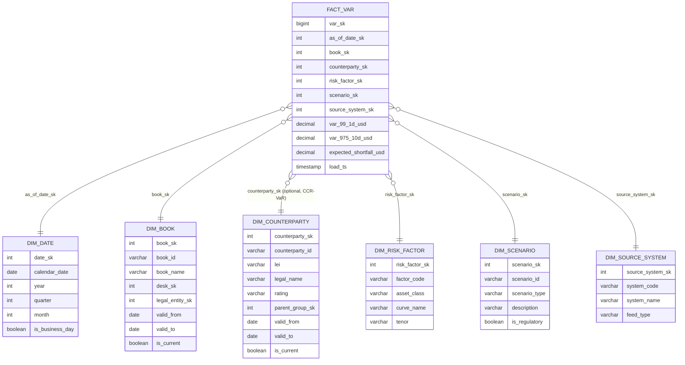

# Module 5 — Dimensional Modeling Fundamentals

!!! abstract "Module Goal"
    Kimball's dimensional modeling — applied specifically to a market-risk warehouse. Star schemas and SCD types are familiar territory to anyone who has read the Toolkit; what changes here is the regulatory weight on every modelling choice and the points at which Kimball orthodoxy stops being enough.

---

## 1. Learning objectives

By the end of this module, you should be able to:

- **Design** a star schema for a typical risk-measure fact table, identifying conformed dimensions, role-playing dimensions, junk dimensions, and degenerate dimensions in the appropriate places.
- **Choose between** SCD types 0, 1, 2, 3, and 6 for a given attribute on a risk-relevant dimension, and justify the choice in audit terms (what is preserved, what is lost, what a regulator can reconstruct).
- **Apply** an SCD2 upsert pattern in a warehouse with `MERGE` and in one without, and write the corresponding as-of join against a fact table without the `is_current = TRUE` anti-pattern.
- **Distinguish** surrogate from natural keys, and explain why the LEI on a counterparty record is an attribute, not a primary key.
- **Recognise** the points at which dimensional modelling alone is insufficient for a risk warehouse — most importantly the bitemporal layer that SCD2 by itself does not provide — and articulate what additional structure [Module 13](13-time-bitemporality.md) adds.
- **Critique** a candidate star schema for a risk fact, identifying mixed-grain bugs, missing surrogate keys, and SCD-type misapplications before they reach production.

## 2. Why this matters

Dimensional modelling is the bridge between the operational systems described in [Module 3](03-trade-lifecycle.md) and the BI tool that a risk manager actually opens at 07:30 to look at yesterday's risk. The trader's blotter, the booking engine, the confirmation matcher, and the settlement ledger are all third-normal-form transactional systems built for write throughput. The risk dashboard is built for read throughput, for slicing across desks and books and counterparties, for drilling from a region down to a single trade, and for reproducing exactly what was reported to a regulator three years ago. The schema between those two worlds is the dimensional model. Get it right and risk reporting is fast, intuitive, and auditable; get it wrong and aggregation breaks at the worst possible time.

The wrongness is rarely catastrophic in the short term. A poorly designed dimension produces reports that are *almost* right — the totals tie, the ranks look plausible, no one notices for a quarter. Then the auditor asks for the counterparty rating that applied on a position from eighteen months ago, and the answer is "the rating today, joined as if it had always been the rating", and the audit fails. Or the bus matrix is missing a conformed `dim_book` and four fact tables each carry their own slightly different definition of what a book is, so the firm-wide gross-notional figure depends on which fact table you summed first. These are not exotic failures; they are the daily texture of working in a warehouse where dimensional modelling was treated as boilerplate.

This module is where the BI engineer joining a risk team meets dimensional modelling *as practised under regulatory scrutiny*. The Kimball toolkit is the starting point, not the destination. Five pieces of the toolkit get bent or extended: SCD2 is mandatory rather than recommended on most reference dimensions; surrogate keys are non-negotiable; bitemporality is layered on top of SCD2 because regulators demand the warehouse remember not just what was true but when it knew that was true; degenerate dimensions are the rule for trade IDs rather than the exception; and the bus matrix is the artefact that an auditor will physically print and ask you to defend. By the end of this module you should be able to read a star schema and predict where it will hurt.

## 3. Core concepts

### 3.1 Star vs snowflake — and the lightly snowflaked risk warehouse

A **star schema** keeps every dimension as a single denormalised table. `dim_counterparty` carries the counterparty's name, rating, parent group, country of risk, sector, and LEI in one wide row. A **snowflake schema** normalises a dimension across multiple linked tables — `dim_counterparty` joins to `dim_parent_group`, which joins to `dim_country`, and so on. The star wins on query simplicity and BI-tool ergonomics; the snowflake wins on storage efficiency and on the cleanliness of hierarchical updates.

In most BI domains, Kimball's recommendation is unambiguous: prefer the star. Storage is cheap, BI tools join more reliably across a single dim, and the snowflake's update advantages rarely matter in practice. In a market-risk warehouse the answer is more nuanced. Risk warehouses tend to be **lightly snowflaked** — a star at the dimension surface that the BI tool sees, with a small number of dimensions internally normalised because the underlying business hierarchy is itself a first-class object that other dimensions also reference.

The canonical example is the organisational hierarchy: **Book → Desk → Legal Entity**. Every fact table joins to `dim_book`, but `dim_book` itself joins to `dim_desk`, which joins to `dim_legal_entity`. Why not flatten? Three reasons specific to risk:

1. **The hierarchy is referenced by other dimensions.** `dim_trader` also belongs to a desk and a legal entity. `dim_counterparty` has its own legal-entity hierarchy. If each dimension carried a denormalised copy of the org structure, an org change would require simultaneous SCD2 updates across every dimension that referenced it, with an obvious risk of partial application.
2. **The hierarchy changes for regulatory reasons.** Books move between desks for risk-management purposes; desks move between legal entities during reorganisations or as a consequence of ring-fencing. Each move must be auditable on its own terms, with its own effective date, and the audit trail belongs in the org-hierarchy tables, not duplicated across every fact-facing dimension.
3. **Reporting often pivots on the hierarchy itself.** A "by legal entity" report that walks up from `fact_position` through `dim_book → dim_desk → dim_legal_entity` is an everyday request, and the warehouse should be modelled to make that walk cheap and unambiguous.

The compromise most firms reach: dimensions that the BI tool joins to are presented as a star, but the dimensions internally reference a small number of slowly changing hierarchy tables. Materialised views or BI-layer logical models flatten the hierarchy at query time when needed. The result reads like a star to the analyst and behaves like a normalised model to the data engineer, and neither has to lie to the other.

There are dimensions where the snowflake should *not* be done even in a risk warehouse. `dim_instrument` is the obvious example: the temptation to normalise out the issuer, the asset class, the currency, the listing exchange into separate sub-dimensions is real, but the cardinality of `dim_instrument` is high (millions of rows in a global warehouse), the read pattern is overwhelmingly "filter by one or two attributes and join to a fact", and any join through three sub-dimensions to recover the issuer's country adds latency to every query that touches an instrument. Keep `dim_instrument` flat; let `dim_book` snowflake. The rule of thumb: snowflake the small slowly changing hierarchies that are referenced *by other dimensions*; keep the large fact-facing dimensions denormalised.

### 3.2 Conformed dimensions and the bus matrix

A **conformed dimension** is a dimension that is shared, with the same key and the same attribute semantics, across more than one fact table. `dim_date` is conformed by definition; `dim_counterparty` is conformed if and only if every fact table that mentions a counterparty agrees on the surrogate key. Conformance is what allows a query to roll up positions, sensitivities, and P&L in a single slice on the same counterparty without contortions.

The artefact that documents conformance is the **bus matrix**: rows are fact tables (business processes, in Kimball's vocabulary), columns are dimensions, cells are checkmarks where the fact uses the dimension. A complete bus matrix is the single most useful one-page picture of a risk warehouse — it tells you which facts can be joined on which slice, where conformance is incomplete, and which dimensions you are still missing.

Below is a preview of the Module 06 bus matrix, restricted to the five common risk facts:

| Fact / Dimension      | Date | Trade | Instrument | Counterparty | Book | Risk Factor | Scenario |
| --------------------- | :--: | :---: | :--------: | :----------: | :--: | :---------: | :------: |
| `fact_position`       |  ✓   |   ✓   |     ✓      |      ✓       |  ✓   |             |          |
| `fact_sensitivity`    |  ✓   |   ✓   |     ✓      |      ✓       |  ✓   |      ✓      |          |
| `fact_var`            |  ✓   |       |            |              |  ✓   |             |    ✓     |
| `fact_pnl`            |  ✓   |   ✓   |     ✓      |      ✓       |  ✓   |             |          |
| `fact_stress`         |  ✓   |       |     ✓      |              |  ✓   |      ✓      |    ✓     |

Read the matrix as a contract, not as documentation. Each checkmark is an assertion: "this fact and this dimension share the same surrogate key, with the same semantics, populated by the same canonical loader". A missing checkmark is also an assertion — that the dimension is not meaningful for that fact, and that no analyst should be drawn into trying to join them.

Three observations the matrix makes visible:

- `dim_book` and `dim_date` are the universal conformed dimensions; every fact uses them. A change to either propagates everywhere.
- `fact_var` is at a coarser grain than `fact_position`. Trade and instrument do not appear because VaR is computed on aggregated portfolios, not on individual trades. This is the single biggest source of confusion when a risk manager tries to "drill from VaR to a trade" and discovers the drill path does not exist (it cannot, by construction — see [Module 9](09-value-at-risk.md)).
- `dim_risk_factor` is shared between `fact_sensitivity` and `fact_stress` but absent from `fact_pnl`. P&L is decomposed by *attribution category*, not by risk factor, in most firms. If the matrix showed it everywhere, you would expect a single drill path; the matrix tells you the drill path does not exist and the analyst will have to use a join.
- `dim_scenario` appears only on `fact_var` and `fact_stress` — the two facts where a "what-if" axis is intrinsic to the measure. It is intentionally absent from `fact_position` and `fact_pnl`, which describe what *happened* rather than what *might happen*. Confusing the two leads to the most common BI mistake on stress data: treating a stressed P&L as if it were realised, and reporting it alongside actual P&L as comparable numbers.

The full bus matrix and the dimension-by-dimension build is [Module 6](06-core-dimensions.md). What you should take away here is that the matrix is the contract between fact-table designers and that conformance is an operational discipline, not a one-time design exercise.

### 3.3 Slowly changing dimensions in a risk warehouse

Reference data changes. A counterparty is downgraded, a book moves between desks, a trader changes name, an instrument's classification is corrected after a feed bug. The question is what the warehouse does with the change. Kimball enumerates several **slowly changing dimension** (SCD) patterns; in a risk warehouse, the choice is rarely free.

| SCD type | What changes      | What's preserved                  | History reproducible? | Typical risk-warehouse use                                                  |
| -------- | ----------------- | --------------------------------- | --------------------- | --------------------------------------------------------------------------- |
| Type 0   | Nothing — fixed.  | Original value forever.           | n/a — never changes.  | Instrument identifiers (ISIN, internal ID) once minted; trade ID; LEI mint.  |
| Type 1   | Overwrite in place. | Latest value only.              | No.                   | Pure corrections of data-entry errors (mistyped trader name, wrong country code) where no audit trail is required. |
| Type 2   | New row per version, `valid_from` / `valid_to` / `is_current`. | Full history; every version queryable as-of. | Yes.                  | Counterparty rating, book→desk mapping, instrument classification, anything regulators may ask about historically. **The default for a risk warehouse.** |
| Type 3   | New column for prior value (e.g. `current_rating`, `prior_rating`). | One step of history only. | Limited. | Rare in risk; sometimes used for rating-transition reports where the previous value is genuinely the only one needed. |
| Type 6   | Hybrid: SCD1 + SCD2 + SCD3 — type-2 history table plus type-1 "current" attributes plus type-3 "previous" columns where useful. | Full history *and* current snapshot in one row. | Yes. | Used where dashboards need the current attribute alongside the historical row without a self-join (e.g. "current desk of the trader who owned this position last year"). |

A few points the table does not capture:

- **Type 4** (a separate "history" table from a "current" table) exists in the literature but is essentially type 2 with a physical split. Most modern warehouses keep both states in one table and live with the slightly larger row count.
- **The default in a risk warehouse is type 2.** Anything that could appear on a regulatory report, anything that could affect a historical risk number, anything where the answer to "what was true on date X" must be reproducible — type 2. Type 1 is reserved for *corrections to current state where no audit obligation attaches*. The bias should be strongly against type 1 on dimensions referenced by historical facts.
- **Type 0 matters more than it sounds.** Some attributes must never change once minted: the trade ID assigned at booking, the ISIN minted by the issuing CSD, the internal instrument ID. A type-0 attribute is a contract with downstream consumers, and the warehouse should refuse updates rather than silently overwrite.
- **Type 6 is a pragmatism, not a separate type.** It is what you reach for when the dashboard wants both "the rating that applied on the position date" (type 2) and "the rating today" (type 1) on the same row without a self-join. Modern columnar warehouses make the storage cost negligible.

#### When does each type fit?

A few worked examples on dimensions you will see in a risk warehouse:

- **Counterparty rating** — type 2. A downgrade changes risk capital, changes counterparty-credit-risk add-ons, changes regulatory reporting. Every historical risk number must remain reproducible at the rating that applied on its position date. Type 1 here is an audit failure waiting to happen.
- **Trader name (correction of a typo)** — type 1. The misspelling was wrong on the day it was entered; there is no historical truth to preserve. Overwrite and move on.
- **Trader's desk assignment** — type 2. The trader genuinely changed desks. Historical positions belong to the old desk; new positions belong to the new desk. A type-1 overwrite here would silently restate every historical position into the new desk's totals, which is exactly the kind of silent corruption that breaks audits.
- **Instrument identifiers (ISIN, internal ID)** — type 0. Once minted, these never change. If an upstream system changes them, the right answer is to load a new instrument row, not to overwrite the old one. The link from old to new lives in a cross-reference table.
- **Counterparty parent group** (e.g. an acquisition reassigns a subsidiary) — type 2. The parent on the day the position was held must remain queryable; the new parent applies from the effective date forward.
- **Counterparty *legal name* change** (e.g. AT&T renames itself) — **type 2, almost never type 1**. The temptation is to treat a rename as a cosmetic update — same legal entity, same LEI, just a new label. Resist it. A type-1 overwrite destroys the audit trail of "what name appeared on the trade confirmation". Confirmations, regulatory submissions, and counterparty exposure reports filed at the time used the old name; if you cannot reproduce them, you cannot defend them. Type 2 with `valid_from` / `valid_to` is the right default for any counterparty attribute that appears on an outbound report.

The decision rule, compressed: **if a regulator could plausibly ask "what value applied on date X?", use type 2. If the question is meaningless because the value is fixed, use type 0. If the question is meaningless because the change was a correction, use type 1. Everything else is type 2.**

A practical complication. Most upstream feeds do not distinguish between "this is a change to the world" (type-2 territory) and "this is a correction of an earlier mistake" (type-1 territory). Both arrive as the same row update. The warehouse cannot read intent from the feed. The defensive default is to treat *all* changes on a regulatory-relevant attribute as type 2 — the cost of an extra dim row is trivial; the cost of losing audit trail is not. Where the upstream genuinely flags corrections (some master-data-management platforms do), the warehouse can route them to type-1 overwrite *only* with a documented exception, ideally with the corrected-from value preserved in a `correction_log` audit table so the original mistake is still recoverable for audit purposes.

### 3.4 Surrogate vs natural keys

A **natural key** is an identifier that exists in the business — an ISIN, an LEI, a trade ID minted by the booking system. A **surrogate key** is an integer (or UUID, or hash) generated by the warehouse, with no business meaning, used as the primary key of the dimension and as the foreign key on the fact.

In a star schema with type-2 history, surrogate keys are non-negotiable. The natural key is not unique over time — a counterparty with LEI `5493001KJTIIGC8Y1R12` exists as multiple rows in `dim_counterparty` once the rating changes, the parent group changes, the legal name changes. The fact table cannot foreign-key the LEI because the LEI alone does not identify *which version of the counterparty* the fact references. The surrogate key (`counterparty_sk`) does, because the warehouse mints a new surrogate every time SCD2 closes out a row and inserts the next version.

The natural keys belong in **attribute columns** on the dimension, not as the primary key. They are queryable, they are indexable, they are searchable, but they are not the join key. A typical `dim_counterparty` row carries:

- `counterparty_sk` — surrogate, primary key, foreign-keyed from facts.
- `counterparty_id` — internal natural key, stable across versions of the same counterparty.
- `lei` — Legal Entity Identifier, a 20-character ISO 17442 code.
- `legal_name`, `rating`, `parent_group_id`, `country_of_risk`, ...
- `valid_from`, `valid_to`, `is_current`.

The combination `(counterparty_id, valid_from)` is unique; the combination `counterparty_sk` is unique; `lei` is *not* unique over time and should not have a unique constraint. This last point trips people coming from operational-system design — "but the LEI is unique by definition!" — and the answer is yes, unique to the entity, not unique to the row in a versioned dimension. The constraint belongs on `counterparty_sk`.

A useful test: if you cannot answer "show me every version of counterparty X over time" with a query like `SELECT * FROM dim_counterparty WHERE counterparty_id = ? ORDER BY valid_from`, your dimension is not properly versioned and your facts cannot reference history correctly.

A second test, often more revealing in practice: pick any historical fact row and try to recover the *exact* dimension attributes that the warehouse believed applied at the time the fact was loaded. If that recovery requires a self-join, an `is_current = TRUE` filter, or an "approximate" date predicate, the surrogate-key discipline is incomplete. The fact's foreign key should resolve to one and only one dim row, and that row should be the one that was current when the fact was minted. Any deviation from this is a future audit finding.

There is one further point on surrogate keys worth flagging because it surfaces in practice. Some shops use **deterministic hash surrogates** (`MD5(counterparty_id || valid_from)`) instead of monotonic integer sequences, on the grounds that hashes are stable across reloads and parallelisable across nodes. Both approaches work; the hash approach is friendlier in lakehouse architectures (Spark, dbt) where sequences are awkward to coordinate across distributed writers. The integer approach is friendlier in single-node analytical databases where the natural ordering of `counterparty_sk` values aligns with insertion order and helps the planner. Pick one convention, document it in the data dictionary, and do not mix.

### 3.5 Junk, degenerate, and role-playing dimensions

Three structural patterns recur in any non-trivial dimensional model and all three apply heavily in risk.

**Junk dimensions.** A junk dimension groups several low-cardinality flags that have no natural home of their own into a single dimension. A typical risk junk dim might combine `trade_source` (FRONT_OFFICE / DROP_COPY / GIVEN_UP), `is_intraday` (Y/N), `is_back_dated` (Y/N), and `confirmation_state` (UNCONFIRMED / MATCHED / DISPUTED). Each on its own would be a one-column dimension or, worse, four columns directly on the fact. The junk dim materialises every meaningful combination and assigns each a surrogate, so the fact carries one foreign key instead of four. Two reasons this matters in risk specifically: it keeps the fact narrow (fact rows are the bulk of the warehouse) and it provides a single place to enforce the valid combinations (e.g. `confirmation_state = 'MATCHED'` should never coincide with `trade_source = 'GIVEN_UP'` in the same row).

**Degenerate dimensions.** A degenerate dimension is a dimension that has *only* a key — no attributes — so it lives on the fact rather than as a separate table. The canonical example in risk is **`trade_id`**. A trade has economic attributes, but those belong on `dim_trade` (or on the snapshot table that represents the trade as a dimension); the trade ID itself appears on `fact_position`, `fact_sensitivity`, and `fact_pnl` as a degenerate dimension because it is a useful slicing key without needing its own dimension table. Order numbers, ticket numbers, and confirmation references behave the same way. The risk-warehouse rule: if the only thing you would put in the dimension is the key, leave it on the fact and call it a degenerate dimension explicitly in the data dictionary.

**Role-playing dimensions.** A role-playing dimension is a single dimension referenced multiple times by the same fact, in different roles. The textbook example is `dim_date`, referenced by `fact_position` as `trade_date`, `value_date`, and `settlement_date`. Physically there is one `dim_date` table; logically the fact carries three foreign keys, each playing a different role. The query layer typically defines three views (`v_dim_trade_date`, `v_dim_value_date`, `v_dim_settlement_date`) that alias the same underlying dim, so BI users can drag whichever role they need without re-aliasing in every query. In a risk warehouse, `dim_date` is almost always role-played; `dim_currency` is sometimes role-played for currency-pair facts (a base currency role and a quote currency role); `dim_legal_entity` is occasionally role-played (booking entity vs risk-taking entity).

The pitfall — and it appears in section 5 — is forgetting that role-playing dims need **explicit aliases in queries**. Joining `dim_date` to `fact_position` without disambiguating which role you are joining produces a Cartesian-flavoured nonsense that some optimisers silently flatten and others reject; either way, the answer is wrong.

A worked role-playing example. A vanilla FX-spot trade carries three dates and two currencies:

```sql
-- fact_fx_trade with role-playing FKs to dim_date and dim_currency.
SELECT
    f.fx_trade_id,
    td.calendar_date  AS trade_date,
    vd.calendar_date  AS value_date,
    sd.calendar_date  AS settle_date,
    bc.iso_code       AS base_ccy,
    qc.iso_code       AS quote_ccy,
    f.notional_base,
    f.spot_rate
FROM fact_fx_trade f
JOIN dim_date     td ON td.date_sk     = f.trade_date_sk
JOIN dim_date     vd ON vd.date_sk     = f.value_date_sk
JOIN dim_date     sd ON sd.date_sk     = f.settle_date_sk
JOIN dim_currency bc ON bc.currency_sk = f.base_ccy_sk
JOIN dim_currency qc ON qc.currency_sk = f.quote_ccy_sk
WHERE td.calendar_date = DATE '2026-05-07';
```

Each role gets its own alias. A BI tool that exposes `dim_date` as a single object and lets the user drag "Date" onto a query without specifying the role is dangerous; most modern semantic layers (LookML, dbt's metricflow, Cube) require the role to be declared in the model so the alias is generated automatically.

### 3.6 Why dimensional modelling fits market-risk reporting

The case for dimensional modelling in market risk is not that it is the only choice — Data Vault, anchor modelling, and ELT-into-wide-tables all have advocates — but that it maps unusually well onto the way risk is actually consumed.

- **Drill paths are hierarchical and predictable.** The risk manager's natural slice is Region → Legal Entity → Desk → Book → Trade. The instrument slice is Asset Class → Product Type → Issuer → Instrument. These are dimension hierarchies; a star model walks them naturally.
- **Slice-and-dice is the dominant query pattern.** "Show me yesterday's VaR by desk and by asset class, then drill into Rates" is one query against `fact_var` joined to `dim_book` and `dim_risk_factor`. In a normalised model the same question is a four-table join and a longer mental hop.
- **Aggregation pre-computation is natural.** Materialised summaries at coarser dimension grains (book-day, desk-day, region-day) are easy to define and easy to refresh from a star. [Module 17](17-performance-materialization.md) treats this in detail.
- **Time travel maps cleanly to SCD2.** "What was the rating on the position date?" is a join with a date predicate, not a separate temporal infrastructure.
- **Additivity has a name.** A fact is *additive*, *semi-additive*, or *non-additive* across each of its dimensions — and the dimensional model makes the question askable. Position notional is additive across most dimensions but non-additive across time (you cannot sum yesterday's notional and today's notional and get a meaningful number); VaR is non-additive across nearly everything. [Module 12](12-aggregation-additivity.md) is built around this taxonomy.

These properties are real and worth the modelling investment. They are also not enough on their own.

It is worth being honest about what dimensional modelling does *not* solve. It does not solve the upstream data-quality problem — if the source feed delivers a wrong rating, the dim faithfully versions the wrong rating into history. It does not solve the cross-system identifier problem — the trade-xref pattern in [Module 3](03-trade-lifecycle.md) is still required upstream of the dim. It does not solve the question of how risk measures aggregate; the aggregation rules in [Module 12](12-aggregation-additivity.md) sit on top of the dimensional model. And it does not, by itself, solve the bitemporal requirement, which is the next subsection. Dimensional modelling is necessary infrastructure for risk reporting; it is not the whole stack.

### 3.7 Where Kimball bends in market risk — bitemporality

Dimensional modelling, including SCD2, assumes a single time axis: the *effective* time at which a value applied. The risk warehouse has two time axes. A position is both an end-of-day **snapshot** (the firm held this much of this trade as of close on 7 May) *and* an event in a stream of intraday amendments (the firm believed it held this much of this trade at 16:00 on 7 May, then amended at 18:30 to a different number). Regulators want both. A risk number filed on 8 May reflecting "the position as of 7 May close" must remain reproducible, even after the position is later restated.

This is **bitemporality**: every fact is timestamped with both *valid time* (when the value applied in the world) and *transaction time* (when the warehouse came to believe it). SCD2 gives you valid time; bitemporality adds transaction time on top. The combination is what answers the regulator's question "what did your system say the rating was on 7 May, *as known on the date of the original report*?". A pure SCD2 dim, with no transaction-time layer, can only answer "what does your system *now* say the rating was on 7 May?", which is different and which auditors will catch.

The mechanics are deferred to [Module 13](13-time-bitemporality.md). What matters here is the framing: SCD2 alone is **not enough** for a risk warehouse that has any regulatory reporting obligation. Treat SCD2 as a necessary layer that captures valid-time history of dimensions, and treat bitemporality as a separate layer that captures transaction-time history of facts and dimensions both. This is the most common point at which a textbook Kimball implementation falls short of what a risk warehouse actually needs, and it is worth flagging early in any new design conversation. If your modelling discussion ends with "and we'll use SCD2 for history", the conversation is half-finished.

A second, related point: the fact tables themselves often need both a **snapshot** view (one row per book per business date — the EOD position) and an **event** view (one row per amendment, with a wall-clock timestamp). [Module 7](07-fact-tables.md) treats this in detail and Module 3's event-log pattern is the upstream that makes both views possible. The risk reader should not accept the framing that "the position is the position"; a position is a *projection* of an event stream onto a business date, and the warehouse has to carry both the projection and the stream because different consumers ask for different things.

### 3.8 A reference star schema

Pulling the pieces together, here is the star for a sample VaR fact:



Three details worth pointing out in the diagram:

- `dim_book` and `dim_counterparty` carry `valid_from` / `valid_to` / `is_current` — they are SCD2. `dim_date`, `dim_risk_factor`, and `dim_source_system` do not — they are SCD1 (or effectively type 0 for date). The choice is per-dimension.
- `dim_book` snowflakes lightly to `desk_sk` and `legal_entity_sk` (not shown as separate boxes in this diagram, but referenced).
- The fact carries no natural keys in its join columns — only surrogates. The trade ID, when it appears on `fact_position`, is a degenerate dimension and lives directly on the fact.
- `fact_var` does not reference `dim_trade` or `dim_instrument`. VaR is computed at portfolio grain, not at trade grain, and the absence of those join keys is *correct* — it tells the analyst (and the BI tool) that no drill-to-trade exists from this fact. The bus matrix in section 3.2 made this point in the abstract; the schema makes it concrete.
- The optional `dim_counterparty` link is included because some firms compute counterparty-credit-risk VaR (CCR-VaR) at counterparty grain. If your shop computes only market-risk VaR, drop the column; if both, the same fact may carry it as nullable or you may split the two facts.

## 4. Worked examples

### Example 1 — SQL: SCD2 upsert via MERGE for a Counterparty dimension

The job: a daily feed of current-state counterparty records arrives in `stg_counterparty`. The target `dim_counterparty` is SCD2 — every change closes out the prior version and inserts a new one; unchanged rows are left alone; new counterparties are inserted as new surrogates with `valid_to = '9999-12-31'` and `is_current = TRUE`.

The staging table represents the upstream's *current belief* about each counterparty. There is no version history in staging; that is what the warehouse adds.

```sql
-- Dialect-neutral DDL.
-- stg_counterparty: one row per counterparty, current state from upstream.
CREATE TABLE stg_counterparty (
    counterparty_id   VARCHAR(32)  NOT NULL,
    lei               VARCHAR(20),
    legal_name        VARCHAR(200) NOT NULL,
    rating            VARCHAR(8),                   -- e.g. 'A+', 'BBB-', 'NR'
    parent_group_id   VARCHAR(32),
    country_of_risk   CHAR(2),
    feed_business_dt  DATE         NOT NULL,        -- the day this row applies
    PRIMARY KEY (counterparty_id, feed_business_dt)
);

-- dim_counterparty: SCD2 versioned dimension.
-- counterparty_sk is the warehouse-minted surrogate; counterparty_id is the
-- stable natural key across versions; (counterparty_id, valid_from) is unique.
CREATE TABLE dim_counterparty (
    counterparty_sk   BIGINT       NOT NULL,        -- surrogate, PK
    counterparty_id   VARCHAR(32)  NOT NULL,        -- natural key, NOT unique
    lei               VARCHAR(20),
    legal_name        VARCHAR(200) NOT NULL,
    rating            VARCHAR(8),
    parent_group_id   VARCHAR(32),
    country_of_risk   CHAR(2),
    valid_from        DATE         NOT NULL,
    valid_to          DATE         NOT NULL,        -- 9999-12-31 sentinel
    is_current        BOOLEAN      NOT NULL,
    PRIMARY KEY (counterparty_sk)
);
```

Sample state. Yesterday `dim_counterparty` had one row for counterparty `CP-100`, rated `BBB+`. Today's `stg_counterparty` shows the same counterparty downgraded to `BBB-`. A second counterparty `CP-200` is brand new.

`dim_counterparty` before the load:

| counterparty_sk | counterparty_id | lei                  | legal_name | rating | valid_from | valid_to   | is_current |
| --------------- | --------------- | -------------------- | ---------- | ------ | ---------- | ---------- | ---------- |
| 5001            | CP-100          | 5493001KJTIIGC8Y1R12 | Acme Corp  | BBB+   | 2025-11-01 | 9999-12-31 | TRUE       |

`stg_counterparty` for `feed_business_dt = 2026-05-07`:

| counterparty_id | lei                  | legal_name  | rating | parent_group_id | country_of_risk | feed_business_dt |
| --------------- | -------------------- | ----------- | ------ | --------------- | --------------- | ---------------- |
| CP-100          | 5493001KJTIIGC8Y1R12 | Acme Corp   | BBB-   | PG-9            | US              | 2026-05-07       |
| CP-200          | 549300XYZAB12345678  | Beta SA     | A      | PG-12           | FR              | 2026-05-07       |

#### Snowflake-style MERGE

`MERGE` is the natural fit on warehouses that support it (Snowflake, BigQuery, Oracle, SQL Server, Databricks, recent Postgres). The pattern is two passes: first close out changed rows; then insert new versions for the changed-and-the-brand-new.

```sql
-- Dialect: Snowflake / BigQuery / SQL Server (MERGE syntax).
-- Step 1: close out rows whose business attributes have changed.
MERGE INTO dim_counterparty AS tgt
USING (
    SELECT s.*
    FROM   stg_counterparty s
    JOIN   dim_counterparty d
           ON  d.counterparty_id = s.counterparty_id
           AND d.is_current       = TRUE
    WHERE  s.feed_business_dt    = DATE '2026-05-07'
      AND  (
              COALESCE(s.lei,             '') <> COALESCE(d.lei,             '')
           OR COALESCE(s.legal_name,      '') <> COALESCE(d.legal_name,      '')
           OR COALESCE(s.rating,          '') <> COALESCE(d.rating,          '')
           OR COALESCE(s.parent_group_id, '') <> COALESCE(d.parent_group_id, '')
           OR COALESCE(s.country_of_risk, '') <> COALESCE(d.country_of_risk, '')
           )
) AS chg
   ON  tgt.counterparty_id = chg.counterparty_id
   AND tgt.is_current       = TRUE
WHEN MATCHED THEN UPDATE SET
    valid_to   = DATE '2026-05-07',                  -- close out yesterday
    is_current = FALSE;
```

```sql
-- Step 2: insert the new version (for changed rows) and brand-new rows.
INSERT INTO dim_counterparty (
    counterparty_sk, counterparty_id, lei, legal_name, rating,
    parent_group_id, country_of_risk, valid_from, valid_to, is_current
)
SELECT
    nextval('dim_counterparty_seq')      AS counterparty_sk,
    s.counterparty_id,
    s.lei,
    s.legal_name,
    s.rating,
    s.parent_group_id,
    s.country_of_risk,
    DATE '2026-05-07'                    AS valid_from,
    DATE '9999-12-31'                    AS valid_to,
    TRUE                                 AS is_current
FROM stg_counterparty s
LEFT JOIN dim_counterparty d
       ON  d.counterparty_id = s.counterparty_id
       AND d.is_current       = TRUE
WHERE s.feed_business_dt = DATE '2026-05-07'
  AND (
        d.counterparty_sk IS NULL                              -- brand new
     OR COALESCE(s.lei,             '') <> COALESCE(d.lei,             '')
     OR COALESCE(s.legal_name,      '') <> COALESCE(d.legal_name,      '')
     OR COALESCE(s.rating,          '') <> COALESCE(d.rating,          '')
     OR COALESCE(s.parent_group_id, '') <> COALESCE(d.parent_group_id, '')
     OR COALESCE(s.country_of_risk, '') <> COALESCE(d.country_of_risk, '')
      );
```

After the load, `dim_counterparty` looks like:

| counterparty_sk | counterparty_id | rating | valid_from | valid_to   | is_current |
| --------------- | --------------- | ------ | ---------- | ---------- | ---------- |
| 5001            | CP-100          | BBB+   | 2025-11-01 | 2026-05-07 | FALSE      |
| 5002            | CP-100          | BBB-   | 2026-05-07 | 9999-12-31 | TRUE       |
| 5003            | CP-200          | A      | 2026-05-07 | 9999-12-31 | TRUE       |

A few notes on the pattern:

- **`valid_to` is the start of the new version** in this convention (half-open intervals: the row is valid for `valid_from <= d < valid_to`). Some shops use `valid_to = valid_from_of_next - 1` (closed intervals). Both work; pick one and document it. Half-open is less error-prone for date arithmetic.
- **`COALESCE(..., '')` is the standard way to make `NULL <> NULL` behave as "different"**. Without it, `NULL <> NULL` evaluates to NULL (i.e. falsy), and a row with a previously-null attribute that gets populated will not be detected as changed.
- **Hash-based change detection** is a common refinement: maintain a `row_hash = HASH(lei || legal_name || rating || ...)` column on the dim and compare hashes instead of column-by-column. The benefit is robustness as the column list grows; the cost is collision risk (negligible with SHA-256, non-negligible with MD5 on large dims).
- **The two steps are usually wrapped in a single transaction** so a partial application never leaves the dim with two `is_current = TRUE` rows for the same `counterparty_id`. Most warehouses also enforce this with a unique constraint or a periodic data-quality check.
- **Late-arriving dimension data** is the awkward edge case the pattern above does not handle natively. If `stg_counterparty` arrives on 2026-05-09 with a row whose change should have applied as of 2026-05-07, the naive load will close out the current row with `valid_to = 2026-05-09` rather than `valid_to = 2026-05-07`, and the two intervening days will incorrectly carry the prior version. The fix is to drive `valid_to` and `valid_from` from a `feed_business_dt` (or, more correctly, from an upstream `effective_date`) rather than from `CURRENT_DATE`. This is the seam at which the bitemporal pattern in [Module 13](13-time-bitemporality.md) becomes necessary — the dim needs to record both the effective date of the change and the date the warehouse learned about it.

#### `INSERT INTO ... SELECT ... UNION ALL` for warehouses without MERGE

Older Postgres, MySQL, and some lakehouse layers do not have `MERGE`. The same logic expressed as a single insert-and-replace pattern (preceded by an `UPDATE` to close out the prior versions):

```sql
-- Dialect: ANSI SQL / Postgres / MySQL (no MERGE required).
-- Step 1: close out changed currents (same as before, expressed as UPDATE).
UPDATE dim_counterparty AS d
SET    valid_to   = DATE '2026-05-07',
       is_current = FALSE
FROM   stg_counterparty s
WHERE  d.counterparty_id = s.counterparty_id
  AND  d.is_current       = TRUE
  AND  s.feed_business_dt = DATE '2026-05-07'
  AND  (
         COALESCE(s.lei,             '') <> COALESCE(d.lei,             '')
      OR COALESCE(s.legal_name,      '') <> COALESCE(d.legal_name,      '')
      OR COALESCE(s.rating,          '') <> COALESCE(d.rating,          '')
      OR COALESCE(s.parent_group_id, '') <> COALESCE(d.parent_group_id, '')
      OR COALESCE(s.country_of_risk, '') <> COALESCE(d.country_of_risk, '')
       );

-- Step 2: insert new versions and brand-new rows (identical to the MERGE case).
INSERT INTO dim_counterparty (
    counterparty_sk, counterparty_id, lei, legal_name, rating,
    parent_group_id, country_of_risk, valid_from, valid_to, is_current
)
SELECT
    nextval('dim_counterparty_seq'),
    s.counterparty_id, s.lei, s.legal_name, s.rating,
    s.parent_group_id, s.country_of_risk,
    DATE '2026-05-07', DATE '9999-12-31', TRUE
FROM stg_counterparty s
LEFT JOIN dim_counterparty d
       ON  d.counterparty_id = s.counterparty_id
       AND d.is_current       = TRUE             -- after step 1, "current" means "still open"
WHERE s.feed_business_dt = DATE '2026-05-07'
  AND d.counterparty_sk IS NULL;                 -- closed-out or brand new
```

The `UPDATE`-then-`INSERT` form is occasionally awkward because the second step depends on the first having committed (so the closed-out rows have `is_current = FALSE` and the join finds nothing to match against). Wrap both in a transaction; on warehouses without MVCC, run them serially in the same session. dbt's snapshot materialisation does the same dance generically — see [the dbt docs](https://docs.getdbt.com/docs/build/snapshots).

### Example 2 — SQL: as-of join — fact joined to SCD2 dim using `valid_from` / `valid_to`

The job: report position notional for `business_date = 2026-04-15`, joined to the counterparty rating *that applied on 15 April*, not the rating as it stands today. This is the routine case for any historical risk report.

The two tables:

```sql
CREATE TABLE fact_position (
    position_sk      BIGINT       NOT NULL,
    position_date    DATE         NOT NULL,         -- business date of the position
    book_sk          INTEGER      NOT NULL,
    counterparty_sk  BIGINT       NOT NULL,         -- FK to a specific dim version
    instrument_sk    BIGINT       NOT NULL,
    notional_usd     DECIMAL(20,2) NOT NULL,
    PRIMARY KEY (position_sk)
);
-- dim_counterparty as in Example 1.
```

If the loader has correctly populated `counterparty_sk` to point at the *version of the counterparty that was current on `position_date`*, then the as-of join is trivial:

```sql
-- The clean form: surrogate FK already encodes the version.
SELECT
    p.position_date,
    p.book_sk,
    d.counterparty_id,
    d.legal_name,
    d.rating,
    SUM(p.notional_usd) AS notional_usd
FROM fact_position p
JOIN dim_counterparty d
  ON d.counterparty_sk = p.counterparty_sk
WHERE p.position_date = DATE '2026-04-15'
GROUP BY p.position_date, p.book_sk, d.counterparty_id, d.legal_name, d.rating;
```

This is the way it is *meant* to work. The fact table's foreign key resolves to exactly one row in the dim, the row that was current at the time the fact was loaded, and the rating is automatically the one that applied. **The discipline cost** is on the loader: every time `fact_position` is built for a given business date, the loader must look up `counterparty_sk` against the dim version that was current on that business date, not the version that is current today. Most production loaders do this correctly; many ad-hoc backfills do not, and that is where the bugs live.

#### The bad version — joining on `is_current = TRUE`

The mistake that matters. A new BI engineer writes:

```sql
-- BAD: joins to current dim version regardless of position date.
SELECT
    p.position_date,
    p.book_sk,
    d.counterparty_id,
    d.legal_name,
    d.rating                         -- this is TODAY's rating, not 15 April's
    SUM(p.notional_usd) AS notional_usd
FROM fact_position p
JOIN dim_counterparty d
  ON d.counterparty_id = (
        SELECT counterparty_id FROM dim_counterparty
        WHERE counterparty_sk = p.counterparty_sk
     )
 AND d.is_current = TRUE              -- <-- the bug
WHERE p.position_date = DATE '2026-04-15'
GROUP BY p.position_date, p.book_sk, d.counterparty_id, d.legal_name, d.rating;
```

This query "works" — it produces output, the totals look reasonable, no error is thrown — but every counterparty whose rating changed between 15 April and today shows the *current* rating against historical positions. A counterparty downgraded from `A` to `BBB+` on 1 May appears as `BBB+` against the 15 April positions. Risk reports stratified by rating bucket are wrong. The historical regulatory submission filed on 16 April cannot be reproduced. The defect is silent until someone notices the rating distribution has subtly drifted on a re-run of an old report.

#### The correct version — `position_date BETWEEN valid_from AND valid_to`

When the surrogate key was not preserved (a backfill reading from a flattened source, an ad-hoc query against a dim with no fact-side surrogate), the fix is to join on the natural key plus the validity window:

```sql
-- CORRECT: join on natural key + as-of date inside [valid_from, valid_to).
-- Uses half-open interval to match the load convention from Example 1.
SELECT
    p.position_date,
    p.book_sk,
    d.counterparty_id,
    d.legal_name,
    d.rating,
    SUM(p.notional_usd) AS notional_usd
FROM fact_position p
JOIN dim_counterparty d
  ON d.counterparty_id = (
        SELECT counterparty_id FROM dim_counterparty
        WHERE counterparty_sk = p.counterparty_sk
     )
 AND p.position_date >= d.valid_from
 AND p.position_date <  d.valid_to
WHERE p.position_date = DATE '2026-04-15'
GROUP BY p.position_date, p.book_sk, d.counterparty_id, d.legal_name, d.rating;
```

The predicate `position_date >= valid_from AND position_date < valid_to` selects exactly one dim row per counterparty per position date, provided the dim is non-overlapping (a data-quality property worth checking with a separate query). If your shop uses closed intervals (`valid_to = end_of_validity`), use `BETWEEN valid_from AND valid_to` instead — but be aware that on the day of a change the boundary row is the *new* version under one convention and the *old* version under the other; the convention has to be documented and applied consistently.

#### Performance implications

As-of range joins are significantly more expensive than equi-joins. Three things matter:

- **Index `valid_from` and `valid_to`** (and `counterparty_id`) on the dim. A range scan on `position_date BETWEEN valid_from AND valid_to` is unavoidable, but a composite index on `(counterparty_id, valid_from)` lets the optimiser narrow to the right counterparty before the range check.
- **Cluster the fact on `position_date`.** Snowflake's clustering keys, BigQuery's partitioning, Redshift's sort keys — all of them reward queries that filter on the cluster column with a tighter scan. Most production risk facts cluster on `(position_date, book_sk)` for exactly this reason.
- **Consider materialising the as-of join** if the same historical view is queried often. A `fact_position_with_attrs` table built once at load time and referencing the correct dim versions is cheaper to query than re-joining on every read. The cost is duplication of dim attributes onto the fact, which is itself a tradeoff (see [Module 17](17-performance-materialization.md)).

The honest summary: the surrogate-key-on-fact pattern is faster *and* harder to get wrong, so use it whenever the loader can be made to compute it correctly. The range-join pattern is the fallback for queries that have to work without that discipline, and for ad-hoc historical queries where the fact-side surrogate was not preserved.

A note on terminology. The literature sometimes calls the range-join pattern an **"as-of join"** or a **"temporal join"**; some warehouses (kdb+, ClickHouse, recent Snowflake previews) expose it as a first-class operator (`ASOF JOIN`) that the planner optimises specifically for the one-version-per-key semantics. Where available, the dedicated operator is faster and clearer than the manual `BETWEEN` predicate, and worth using. Where not available, the manual form is unavoidable and the index/cluster discipline above matters most.

## 5. Common pitfalls

!!! warning "Watch out"
    1. **Joining on `is_current = TRUE` for historical reports.** This is the single most common SCD2 bug. The query runs, the totals look fine, and every historical row inherits today's dim attributes. Use the surrogate-key-on-fact pattern, or fall back to the `position_date BETWEEN valid_from AND valid_to` join — never `is_current = TRUE`. Make this a code-review-stop.
    2. **Using a natural key as the primary key on an SCD2 dim.** The LEI is unique to the entity; it is *not* unique across versions of the entity in a versioned dimension. A `UNIQUE (lei)` constraint on `dim_counterparty` will fail the moment the rating changes. Surrogate keys (`counterparty_sk`) are non-negotiable; natural keys go in attribute columns. The fact's foreign key is the surrogate.
    3. **Mixing grains in a single fact table.** If `fact_position` carries one row per `(trade_id, position_date)` and someone adds a row representing aggregated notional at `(book_id, position_date)` with `trade_id = NULL`, the table now has two grains. Every aggregation query needs to filter on the grain, every consumer has to remember which is which, and a `SUM(notional_usd)` without a filter double-counts. One fact, one grain — declare it explicitly in the data dictionary.
    4. **Forgetting that role-playing dimensions need separate aliases in queries.** `fact_position` references `dim_date` in three roles: trade date, value date, settlement date. A query that joins `dim_date` once and uses its attributes for all three purposes is meaningless. Define three views (`v_dim_trade_date`, `v_dim_value_date`, `v_dim_settle_date`) or three table aliases (`d_td`, `d_vd`, `d_sd`) and use them explicitly. Some BI tools require the views; some allow aliases; both prevent the silent error.
    5. **Storing AT&T's name change as an SCD1 update and losing the audit trail.** A counterparty rename feels cosmetic — same legal entity, same LEI, just a new label. It is not cosmetic from an audit perspective: every confirmation, every regulatory filing, every counterparty-exposure report referenced the *name on the day*. Overwriting the name destroys the ability to reproduce those reports. Default to type 2 for any attribute that ever appears on an outbound report. Document the exceptions explicitly.
    6. **Allowing two `is_current = TRUE` rows for the same natural key.** A partially applied SCD2 load (the close-out succeeded but the insert failed, or vice versa) leaves the dim with two open rows for the same counterparty. Every downstream join that filters `is_current = TRUE` now multiplies. Wrap the close-out and the insert in a single transaction *and* run a daily DQ check that asserts `COUNT(*) = 1` per `(counterparty_id) WHERE is_current = TRUE`.
    7. **Treating SCD2 as a substitute for bitemporality.** SCD2 records valid time only. If a regulator asks "what did your system *believe* the rating was on 5 May, *as known on 5 May*", SCD2 alone will give them what the system *now believes* applied on 5 May, which is a different and indefensible answer. If your warehouse has any regulatory submission obligation, plan for the bitemporal layer in [Module 13](13-time-bitemporality.md) from the start; retrofitting it is significantly harder than designing for it.

## 6. Exercises

1. **Design — applied.** Sketch the dimensions for an FX-spot trade fact at trade-event grain. List each dimension, the SCD type you would choose for it, and one sentence justifying the choice. Assume the warehouse already has a generic `dim_date` and `dim_currency`.

    ??? note "Solution"
        A reasonable design:

        - **`dim_date`** — used in three role-playing roles: `trade_date`, `value_date`, `settle_date`. Effectively type 0 (calendar facts do not change after the date is past).
        - **`dim_currency`** — used in two role-playing roles: `base_ccy`, `quote_ccy`. Type 1 (correcting an ISO code is a correction, not a versioned event); the currency itself does not "change" in any meaningful sense.
        - **`dim_counterparty`** — type 2. Rating and parent-group changes must be reproducible historically; renames must remain auditable.
        - **`dim_trader`** — type 2 for desk and legal-entity assignments (a trader genuinely moving desks must not retroactively restate historical positions); type 1 for typo corrections to the trader's name.
        - **`dim_book`** — type 2. The book→desk mapping changes for organisational reasons that are themselves auditable; historical positions must roll up to the desk that owned them at the time.
        - **`dim_source_system`** — type 1 (source-system metadata is configuration, not history; corrections overwrite).
        - `trade_id` is a **degenerate dimension** on the fact — no separate dim. The trade's economics (notional, rate, ccy pair) are fact-level columns at trade-event grain.

        The fact's grain statement: "one row per trade event for an FX-spot trade", with foreign keys to the role-played `dim_date` (×3), role-played `dim_currency` (×2), `dim_counterparty_sk`, `dim_trader_sk`, `dim_book_sk`, `dim_source_system_sk`.

2. **Spot the mistake — conceptual.** A junior engineer proposes the following dim for counterparty ratings, with the justification that "ratings rarely change and the dim is queried very heavily, so we should keep it small":

    ```sql
    CREATE TABLE dim_counterparty (
        counterparty_id  VARCHAR(32) PRIMARY KEY,
        lei              VARCHAR(20) UNIQUE,
        legal_name       VARCHAR(200),
        rating           VARCHAR(8)              -- updated in place when changes
    );
    ```

    Identify at least two distinct problems with this design, and describe a regulator-facing scenario where the design fails.

    ??? note "Solution"
        Three structural problems:

        1. **The natural key (`counterparty_id`) is the primary key.** This forecloses SCD2 — there can only ever be one row per counterparty. Every downstream fact that joins on `counterparty_id` will see the current value, not the historical one.
        2. **The `lei` has a `UNIQUE` constraint.** Same problem, different angle: as soon as you try to add SCD2, the unique constraint will fire on the first changed row. The natural keys belong in attribute columns without unique constraints.
        3. **`rating` is updated in place** — i.e. SCD type 1 on a regulatory-relevant attribute. Every historical risk report that bucketed exposure by rating becomes irreproducible the moment a single counterparty is upgraded or downgraded.

        Regulator scenario: at a routine review the regulator asks for the firm's counterparty-credit-risk exposure broken down by rating bucket as of a date six months ago, and asks for the breakdown to tie to the figure originally submitted on that date. With this design the breakdown cannot be reproduced — the current rating is the only one stored. The submitted figure is now indefensible. The right shape is `dim_counterparty (counterparty_sk PK, counterparty_id, lei, legal_name, rating, valid_from, valid_to, is_current)` with no unique constraints on natural keys.

3. **SQL — applied.** Given `fact_pnl(pnl_sk, business_date, counterparty_sk, pnl_usd)` and the SCD2 `dim_counterparty` from Example 1, write a query that returns daily P&L grouped by **counterparty rating bucket** (`AAA-A`, `BBB`, `BB-and-below`, `NR`) for `business_date BETWEEN DATE '2026-04-01' AND DATE '2026-04-30'`. The rating must be the rating that applied on each row's business date.

    ??? note "Solution"
        Two equivalent shapes — the fast one assumes the loader populated `counterparty_sk` correctly per business date; the safe one falls back to the as-of join:

        ```sql
        -- Fast form: the surrogate FK already pins the historical version.
        WITH bucketed AS (
            SELECT
                p.business_date,
                CASE
                    WHEN d.rating IN ('AAA','AA+','AA','AA-','A+','A','A-') THEN 'AAA-A'
                    WHEN d.rating IN ('BBB+','BBB','BBB-')                 THEN 'BBB'
                    WHEN d.rating IS NULL OR d.rating = 'NR'               THEN 'NR'
                    ELSE 'BB-and-below'
                END AS rating_bucket,
                p.pnl_usd
            FROM fact_pnl p
            JOIN dim_counterparty d
              ON d.counterparty_sk = p.counterparty_sk
            WHERE p.business_date BETWEEN DATE '2026-04-01' AND DATE '2026-04-30'
        )
        SELECT business_date, rating_bucket, SUM(pnl_usd) AS pnl_usd
        FROM bucketed
        GROUP BY business_date, rating_bucket
        ORDER BY business_date, rating_bucket;
        ```

        ```sql
        -- Safe form: as-of join on the validity window. Use when fact-side
        -- surrogates may not have been pinned at load time (e.g. a backfill).
        WITH cp_id_lookup AS (
            SELECT counterparty_sk, counterparty_id
            FROM   dim_counterparty
        ),
        bucketed AS (
            SELECT
                p.business_date,
                CASE
                    WHEN d.rating IN ('AAA','AA+','AA','AA-','A+','A','A-') THEN 'AAA-A'
                    WHEN d.rating IN ('BBB+','BBB','BBB-')                 THEN 'BBB'
                    WHEN d.rating IS NULL OR d.rating = 'NR'               THEN 'NR'
                    ELSE 'BB-and-below'
                END AS rating_bucket,
                p.pnl_usd
            FROM fact_pnl p
            JOIN cp_id_lookup l
              ON l.counterparty_sk = p.counterparty_sk
            JOIN dim_counterparty d
              ON  d.counterparty_id = l.counterparty_id
              AND p.business_date  >= d.valid_from
              AND p.business_date  <  d.valid_to
            WHERE p.business_date BETWEEN DATE '2026-04-01' AND DATE '2026-04-30'
        )
        SELECT business_date, rating_bucket, SUM(pnl_usd) AS pnl_usd
        FROM bucketed
        GROUP BY business_date, rating_bucket
        ORDER BY business_date, rating_bucket;
        ```

        The wrong form is `JOIN dim_counterparty d ON d.counterparty_id = ... AND d.is_current = TRUE`. It compiles, runs, and returns the wrong answer for any counterparty whose rating changed during April or after.

4. **Conceptual.** Why is `dim_book` typically lightly snowflaked to `dim_desk` and `dim_legal_entity` rather than fully denormalised, given that snowflaking is generally discouraged in BI? Give one operational scenario where the snowflake makes a regulatory question easier to answer than a denormalised dim would.

    ??? note "Solution"
        Three reasons (recap of section 3.1): the org hierarchy is referenced by other dimensions (`dim_trader`, `dim_counterparty`), so duplicating it across them invites drift; the hierarchy itself changes for auditable reasons (book→desk reassignments, ring-fencing) that benefit from a single SCD2 surface; and reports often pivot on the hierarchy itself.

        Operational scenario: a regulator asks "show me all trades booked under legal entity LE-EU during Q1 2026, with the desk that owned each book at the time". With a snowflaked `dim_book → dim_desk → dim_legal_entity`, the answer is one chain of as-of joins through the SCD2 layers — a single source of truth for who owned what when. With a denormalised `dim_book` carrying its own desk and legal-entity columns, you have to trust that every historical row in `dim_book` had its `desk_id` and `legal_entity_id` correctly captured at the time, with no drift between the dim and the org hierarchy as it existed in HR / Finance. In practice the drift is real and the regulator's question becomes a multi-system reconciliation rather than a single query.

5. **Conceptual — bitemporality preview.** SCD2 captures *valid time* for a dimension — the period during which a value applied in the world. Why is that not enough for a risk warehouse with regulatory reporting obligations? Sketch one auditor question that pure SCD2 cannot answer.

    ??? note "Solution"
        SCD2 records what the warehouse *currently believes* applied at each point in valid time. It does not record what the warehouse *believed at an earlier point in transaction time*. If a dim row is later corrected (e.g. a rating that was originally entered as `BBB+` on 1 May was corrected on 7 May to `BBB-` with `valid_from = 1 May`), pure SCD2 has no record that the warehouse ever thought the rating was `BBB+`.

        Auditor question: "Your firm filed a risk report on 5 May with counterparty CP-100 in the BBB+ bucket. Today your warehouse shows that counterparty as BBB- on 5 May. Reconcile the discrepancy and show me what your system said the rating was *as known on 5 May*." Pure SCD2 cannot answer this. The bitemporal layer ([Module 13](13-time-bitemporality.md)) adds a second time axis — transaction time — to every SCD2 row, so the warehouse can answer "what did we believe was true on 5 May, *as of* 5 May" as a separate query from "what do we now believe was true on 5 May".

## 7. Further reading

- Kimball, R. & Ross, M. *The Data Warehouse Toolkit: The Definitive Guide to Dimensional Modeling*, 3rd edition (Wiley, 2013) — the canonical reference. Chapters 1–5 establish facts, dimensions, grain, and conformance; chapter 5 is the chapter on slowly changing dimensions and is essential. Read it before you read anything else on this topic.
- Kimball Group, *Dimensional Modeling Techniques* — the firm's free reference of named patterns including all SCD types, junk dimensions, role-playing dimensions, degenerate dimensions, and conformed dimensions, at [kimballgroup.com/data-warehouse-business-intelligence-resources/kimball-techniques/dimensional-modeling-techniques/](https://www.kimballgroup.com/data-warehouse-business-intelligence-resources/kimball-techniques/dimensional-modeling-techniques/). Useful as a vocabulary reference; bookmark it.
- Adamson, C. *Star Schema: The Complete Reference* (McGraw-Hill, 2010) — an alternative perspective on the same material. Adamson is more pragmatic than Kimball on a few points (notably on snowflaking and on hybrid SCD types) and is worth reading specifically for those contrasts.
- Basel Committee on Banking Supervision, *Principles for effective risk data aggregation and risk reporting (BCBS 239)*, January 2013, [bis.org/publ/bcbs239.pdf](https://www.bis.org/publ/bcbs239.pdf) — the regulatory backdrop for why audit and reproducibility are not optional. Principles 3 (accuracy and integrity), 4 (completeness), and 6 (adaptability) all bear directly on dimensional modelling decisions in a risk warehouse.
- dbt Labs, *Snapshots* documentation, [docs.getdbt.com/docs/build/snapshots](https://docs.getdbt.com/docs/build/snapshots) — how SCD2 is implemented in a modern transformation tool. Useful both for the mechanics (the `check` and `timestamp` strategies map directly to the patterns in Example 1) and as a reference architecture for incremental dim builds.
- Linstedt, D. & Olschimke, M. *Building a Scalable Data Warehouse with Data Vault 2.0* (Morgan Kaufmann, 2015) — Data Vault is an alternative paradigm that some risk warehouses (especially in continental European banks) adopt instead of dimensional modelling. Worth reading for the contrast: Data Vault separates business keys (hubs), relationships (links), and descriptive attributes (satellites) explicitly, and treats temporality as a first-class concern from the start. Even if your warehouse is dimensional, knowing the Data Vault vocabulary is useful when integrating with teams who use it.

## 8. Recap

You should now be able to:

- Sketch a star schema for a risk-measure fact, identify which dimensions are conformed, role-played, junk, or degenerate, and justify each choice in terms a peer would accept.
- Pick the right SCD type for any given dimension attribute, with the default of type 2 on regulatory-relevant attributes and type 0 on identifiers that must never change.
- Implement an SCD2 upsert in either MERGE or UPDATE+INSERT form, including the change-detection predicate and the half-open validity-window convention.
- Write an as-of join against an SCD2 dim correctly — preferring the surrogate-key-on-fact pattern, falling back to a `position_date BETWEEN valid_from AND valid_to` predicate, and recognising the `is_current = TRUE` join as the canonical bug.
- Articulate where dimensional modelling stops being enough — the bitemporal layer that risk warehouses need on top of SCD2 — and explain to a peer why "we'll use SCD2 for history" is only half an answer.

---

[← Module 4 — Financial Instruments](04-financial-instruments.md){ .md-button } [Next: Module 6 — Core Dimensions →](06-core-dimensions.md){ .md-button .md-button--primary }
