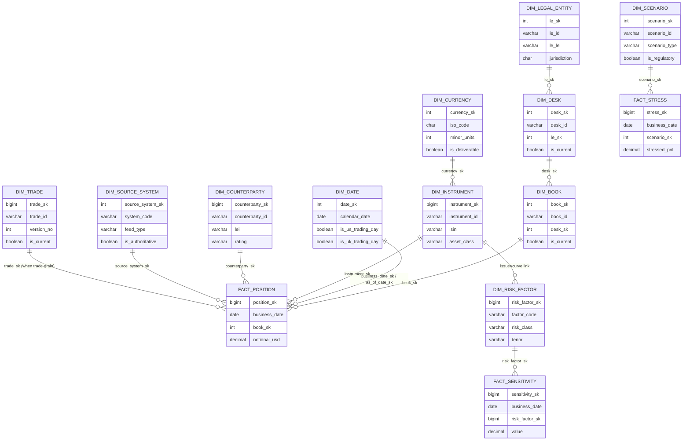

# Module 6 — Core Dimensions in Market Risk

!!! abstract "Module Goal"
    The canonical dimension catalogue of a market-risk warehouse. For each dimension you will see grain, candidate natural keys, surrogate-key approach, SCD type, the five-to-fifteen attributes that actually matter, and the gotchas that catch people coming from a generic BI background. The point is not to enumerate every column you might invent — it is to fix the conformed shapes that every fact in the warehouse will join to.

---

## 1. Learning objectives

By the end of this module, you should be able to:

- **Enumerate** the canonical dimensions of a market-risk warehouse — Date, Trade, Instrument, Counterparty, Book/Desk/Legal Entity, Currency, Risk Factor, Scenario, Source System, As-of/Business Date — and state the grain, natural key, surrogate-key approach, and SCD type of each.
- **Justify** the SCD type chosen for each dimension in audit terms, including the subtle cases (ISIN as an SCD2 attribute on `dim_instrument`, LEI re-issuance, desk reorganisations, counterparty rename).
- **Build** a date dimension from scratch in either Postgres or Snowflake, joined to a holiday table to populate per-region trading-day flags, and explain how role-playing makes one physical `dim_date` serve `trade_date`, `value_date`, `settle_date`, `business_date`, and `as_of_date`.
- **Write** a hierarchical rollup query against a Book → Desk → Legal Entity dimension structure using `GROUPING SETS` or `ROLLUP`, including the ragged-hierarchy case where some books skip the desk level.
- **Recognise** when a dimension that looks naturally one-per-system (risk factor, source system, scenario) needs to be conformed across the firm before it lands in the warehouse, and what conformance discipline costs in practice.
- **Critique** a dimension catalogue for the recurring failure modes — missing trading-day flags, natural keys mistreated as primary keys, desk mergers handled as SCD1, per-system risk-factor naming, missing source-system lineage.

## 2. Why this matters

Every fact table in a risk warehouse joins to the same dozen dimensions. `fact_position`, `fact_sensitivity`, `fact_var`, `fact_pnl`, `fact_stress` — they differ in their measures and their grain, but the dimension surface they present to the analyst is shared. Standardising those dimensions is the difference between a usable warehouse and a swamp of one-off models. If `dim_book` means one thing to the position fact and a slightly different thing to the P&L fact, then the firm-wide gross-notional figure depends on which fact you summed first, the regulator's "show me the trading book" question becomes a multi-system reconciliation, and every drill-down the BI tool offers is provisional. Conformance, in the Kimball sense from [Module 5](05-dimensional-modeling.md), is the operational discipline that makes the warehouse trustworthy. The dimension catalogue below is what conformance looks like when you write it down.

The dimensions in this module are also where the modelling decisions made in Modules 3, 4, and 5 are *physically realised*. The trade lifecycle from [Module 3](03-trade-lifecycle.md) lands in `dim_trade` and on the degenerate `trade_id` column of every trade-grain fact. The instrument taxonomy from [Module 4](04-financial-instruments.md) lands in `dim_instrument`, with the asset-class and product-type columns that drive every aggregation in Modules 8 through 14. The SCD2 patterns from [Module 5](05-dimensional-modeling.md) are applied per-dimension, with deliberate exceptions: `dim_date` is effectively type 0, `dim_currency` is type 1, `dim_book` and `dim_counterparty` and `dim_instrument` are type 2 by default, and the cases where the choice is non-obvious (the LEI inside `dim_counterparty`, the ISIN inside `dim_instrument`) get their own treatment below. The catalogue is opinionated because the consequences of getting it wrong are not small.

What the BI engineer should do differently after this module: never invent a new dimension when a conformed one exists; never bury a natural key (LEI, ISIN, MIC, CCY) as a unique primary key on an SCD2 dim; never let the trading-day flag question be answered case-by-case in BI logic when it belongs in `dim_date`; and never accept a fact-table design that omits `source_system_sk` because "we only have one source today". These are the recurring failure modes; the rest of the module exists to help you spot them before they ship.

## 3. Core concepts

### 3.1 The dimension catalogue at a glance

Before walking each dimension, the bus-matrix-adjacent summary. Eleven dimensions, the grain, the SCD posture, the facts that consume them.

| Dimension              | Grain                                 | Natural key(s)              | Surrogate     | SCD   | Primary consumers                                 |
| ---------------------- | ------------------------------------- | --------------------------- | ------------- | ----- | ------------------------------------------------- |
| `dim_date`             | one row per calendar day              | `calendar_date`             | `date_sk` INT (YYYYMMDD) | 0   | every fact, role-played                           |
| `dim_trade`            | one row per trade version             | `trade_id`, `version_no`    | `trade_sk`    | 2     | trade-grain facts (`fact_trade`, optionally `fact_position`) |
| `dim_instrument`       | one row per instrument version        | internal `instrument_id`    | `instrument_sk` | 2   | every fact that touches an instrument             |
| `dim_counterparty`     | one row per counterparty version      | internal `counterparty_id`  | `counterparty_sk` | 2 | `fact_position`, `fact_pnl`, CCR facts            |
| `dim_book`             | one row per book version              | `book_id`                   | `book_sk`     | 2     | every fact (org-spine)                            |
| `dim_desk`             | one row per desk version              | `desk_id`                   | `desk_sk`     | 2     | snowflaked from `dim_book`                        |
| `dim_legal_entity`     | one row per LE version                | `le_id` (and LEI as attr)   | `le_sk`       | 2     | snowflaked from `dim_desk`                        |
| `dim_currency`         | one row per ISO 4217 ccy              | `iso_code` (3-char)         | `currency_sk` | 1     | role-played: notional/payment/base/reporting      |
| `dim_risk_factor`      | one row per (curve, tenor) point or surface point | `factor_code`     | `risk_factor_sk` | 2 | `fact_sensitivity`, `fact_stress`, `fact_market_data` |
| `dim_scenario`         | one row per scenario definition       | `scenario_id`               | `scenario_sk` | 2     | `fact_var`, `fact_stress`                         |
| `dim_source_system`    | one row per source feed/system        | `system_code`               | `source_system_sk` | 1 | every fact (lineage)                              |
| `dim_as_of_date`       | role-played from `dim_date`           | `calendar_date`             | `as_of_date_sk` | 0   | every fact (bitemporal pair with business date)   |

A few framing notes before the per-dimension walk:

- **`dim_date` is not really SCD anything** — the calendar does not change. It appears as type 0 in the table because no row is ever updated after creation. The interesting work in `dim_date` is in attribute *coverage*: trading-day flags per region, fiscal periods, end-of-period markers. Get those wrong and every analyst writes a one-off CTE to compute them.
- **The org spine (`dim_book` / `dim_desk` / `dim_legal_entity`) is lightly snowflaked** — see [Module 5 §3.1](05-dimensional-modeling.md) for the rationale. The three tables together behave as a single conformed organisational dimension; the snowflake is a physical artefact, not a logical one.
- **`dim_currency` is small but role-played** — one physical table, multiple logical roles per fact (notional ccy, payment ccy, base ccy of the fund, reporting ccy of the report). The role-playing discipline from [Module 5 §3.5](05-dimensional-modeling.md) applies in full.
- **`dim_risk_factor` is the bridge to market data** — every sensitivity is keyed by a risk factor; every shock in a scenario is applied to a risk factor; every market-data series is identified by a risk factor. Conformance here is harder than anywhere else, because pricing engines naturally invent their own factor names.
- **`dim_source_system` looks trivial and is load-bearing** — every fact row carries `source_system_sk` so lineage queries ([Module 16](16-lineage-auditability.md)) can answer "where did this number come from" without crawling logs.

### 3.2 `dim_date`

**Grain.** One row per calendar day, indefinitely far into the past and at least 5–10 years into the future. Most warehouses load 1990-01-01 through 2050-12-31 once and never touch it again.

**Natural key.** `calendar_date` (DATE). Globally unique by construction.

**Surrogate.** `date_sk` as `INT` in `YYYYMMDD` form (e.g. `20260507`). This is the one place the surrogate-key-must-be-meaningless rule is routinely broken, and for good reason: a `date_sk` of `20260507` sorts naturally, partitions naturally, is human-readable in a query plan, and carries no SCD versioning so the meaningfulness causes no harm. The integer encoding also lets BI tools predicate on date ranges without a join (`WHERE date_sk BETWEEN 20260101 AND 20260131`). Some shops use a sequence-generated `BIGINT` instead; both work, and the YYYYMMDD form is the more common convention in risk warehouses.

**SCD type.** Effectively 0. Calendar facts do not change. The exception is the trading-day flag — if a holiday calendar is corrected after the fact, the row updates in place — but in practice the holiday table is the SCD2 surface and `dim_date` is materialised from it as a (possibly cached) view.

**Key attributes.**

| Column                  | Notes                                                                                       |
| ----------------------- | ------------------------------------------------------------------------------------------- |
| `date_sk`               | YYYYMMDD integer surrogate.                                                                 |
| `calendar_date`         | DATE.                                                                                       |
| `day_of_week`           | 1–7 (Mon–Sun) or 0–6; pick a convention firm-wide.                                          |
| `day_name`              | 'Monday', etc. — for display.                                                               |
| `is_weekend`            | BOOLEAN.                                                                                    |
| `is_us_trading_day`     | BOOLEAN. NYSE / NYMEX calendar.                                                             |
| `is_uk_trading_day`     | BOOLEAN. LSE / UK bank-holiday calendar.                                                    |
| `is_jp_trading_day`     | BOOLEAN. TSE / Japan public-holiday calendar.                                               |
| `is_eu_trading_day`     | BOOLEAN. TARGET2 calendar — pan-Eurozone settlement.                                        |
| `iso_year`, `iso_week`  | ISO 8601 week numbering (avoid local week conventions for cross-region reports).            |
| `fiscal_year`           | Firm's fiscal year — *not* the calendar year. Most US-headquartered firms align to calendar; many JP firms run April–March. |
| `fiscal_quarter`        | 'FY26-Q1' style.                                                                            |
| `end_of_month_flag`     | TRUE if last calendar day of month.                                                         |
| `end_of_quarter_flag`   | TRUE if last calendar day of quarter.                                                       |
| `end_of_year_flag`      | TRUE if `MM-DD = '12-31'`.                                                                  |
| `business_eom_flag`     | TRUE if last *trading* day of the month for the firm's primary calendar — distinct from calendar EOM (e.g. 2025-08-31 is a Sunday; the business EOM is 2025-08-29). |

**Role-playing.** This is the textbook role-played dimension. Physically one table; logically referenced as `trade_date`, `value_date`, `settle_date`, `business_date`, `as_of_date`, `effective_date`, `maturity_date`. Every fact-to-`dim_date` join needs an explicit alias; see [Module 5 §3.5](05-dimensional-modeling.md) for the worked pattern.

**Bitemporal relationship.** `business_date` (or `position_date`) is the *valid time* axis on facts. `as_of_date` is the *transaction time* axis. Both are foreign keys to `dim_date` in different roles. [Module 13](13-time-bitemporality.md) treats the pair in detail; the relevant point here is that you do not need two physical date dimensions, you need one `dim_date` referenced twice.

**Gotchas.**

1. **Trading-day flags are per-region — never use one flag firm-wide.** "Is_business_day" without a region qualifier is the single most common source of off-by-one errors in cross-region risk reporting. A US holiday like Thanksgiving is a perfectly normal trading day in London and Tokyo; a Japan-only holiday like the Emperor's Birthday is a normal trading day in New York. The flag set must be per-region and named explicitly; downstream queries pick the relevant flag, never the unqualified one.
2. **Holiday tables drift.** Public holidays for next year are usually known; for two and three years out, they are estimates that quietly change as governments confirm them. Reload the future segment of `dim_date` at least quarterly.
3. **Fiscal calendars are firm-specific.** Do not bake "fiscal year = calendar year" into the dim. Carry the fiscal columns explicitly; if your firm's fiscal year ever shifts (M&A, regulatory restructuring), the dim should be the only place that needs to change.

### 3.3 `dim_trade`

**Grain.** One row per trade *version*. Each amendment closes the prior version and opens a new one; cancellations close the version without opening a new one (some shops mark the closed row with a `cancellation_flag`). Lifecycle events from [Module 3 §3.5](03-trade-lifecycle.md) typically *do not* spawn new trade versions — they sit on the event log and on the cashflow fact, leaving `dim_trade` as a snapshot of the trade's economic terms.

**Natural keys.** Internal `trade_id` (the primary key from the booking system) plus `version_no`. Some shops use a derived `(trade_id, valid_from)` instead of a version number; both serve the same purpose.

**Surrogate.** `trade_sk` (BIGINT). Every version is a distinct surrogate; the fact's foreign key resolves to exactly one version.

**SCD type.** 2. Trade economics that change post-booking (notional adjustments, rate corrections, side flips on a wrong-side booking) must be auditable.

**Key attributes.** A trade dimension is *narrow* by design — most economic detail belongs on the fact (notional, rate, strike) at trade-event grain or on `dim_instrument` (product type, currency) at instrument grain. What `dim_trade` carries is the slice of trade-level metadata that is *not* on the fact and is *not* on the instrument:

| Column            | Notes                                                                              |
| ----------------- | ---------------------------------------------------------------------------------- |
| `trade_sk`        | Surrogate.                                                                         |
| `trade_id`        | Internal identifier from the booking system. Type 0 — never re-used.               |
| `version_no`      | 1, 2, 3, ... per trade.                                                            |
| `trader_id`       | The trader of record at the time. Resolves to `dim_trader` in shops that have one. |
| `sales_id`        | The salesperson or salescredit recipient (often distinct from the trader).         |
| `broker_id`       | External broker, where applicable.                                                 |
| `trade_source`    | FRONT_OFFICE / DROP_COPY / GIVEN_UP / API.                                         |
| `confirmation_state` | UNCONFIRMED / MATCHED / DISPUTED.                                                |
| `is_internal`     | Inter-desk or inter-LE trade flag (matters for elimination on a consolidated view).|
| `valid_from`, `valid_to`, `is_current` | SCD2 bookkeeping.                                            |

**The degenerate-vs-real-dimension debate.** A common shortcut is to treat the trade as a *degenerate* dimension — `trade_id` lives directly on the fact and there is no `dim_trade`. This works when the only trade-level metadata you need (trader, broker, source) is already replicated onto the fact at load time. The argument for a real `dim_trade` is that those attributes are *not* always replicated — and when an analyst asks "show me yesterday's positions for trades booked through broker X", you do not want the answer to require a join back to the booking system. The compromise most warehouses settle on: a real `dim_trade` exists, carries the metadata that is *not* otherwise on the fact, and the fact carries `trade_id` as a degenerate dimension *as well as* `trade_sk` as a foreign key. Slightly redundant; significantly cheaper to query.

**Gotchas.**

1. **Amendments versus corrections.** The booking feed often does not distinguish between "the trader amended the trade" (true change, SCD2 close-out) and "an Ops user fixed a typo" (correction, SCD1 territory). Default to SCD2 unless the feed explicitly flags corrections; the cost of an extra row is negligible.
2. **Cancellations are not deletes.** A cancelled trade must remain in `dim_trade` with `is_current = FALSE` and an explicit cancellation marker. Hard-deleting the row breaks every historical fact that referenced it.
3. **The trade-version explosion on derivatives.** A long-dated swap can be amended dozens of times over its life; the fact tables that reference the *current* version need to look up the latest `trade_sk` per `trade_id` on every load. Index `(trade_id, is_current)` or maintain a materialised "current trades" view.

### 3.4 `dim_instrument`

[Module 4](04-financial-instruments.md) covered the instrument taxonomy; this is the dimensional realisation.

**Grain.** One row per instrument *version*. An instrument has many versions over its life (rating changes, sector reclassifications, identifier corrections).

**Natural key.** Internal `instrument_id` — a warehouse-stable identifier. ISIN, CUSIP, RIC, FIGI, SEDOL all live on the row as attributes but **none of them is the primary natural key**. The reason is the next gotcha.

**Surrogate.** `instrument_sk` (BIGINT). SCD2-versioned.

**SCD type.** 2 by default. The exceptions are corrections (SCD1) and identifiers minted at issuance (effectively type 0 from the issuer's perspective, but see below).

**Key attributes.** Of the order of 30–60 columns in a real warehouse; the canonical 15:

| Column              | Notes                                                                          |
| ------------------- | ------------------------------------------------------------------------------ |
| `instrument_sk`     | Surrogate.                                                                     |
| `instrument_id`     | Internal natural key. Stable across versions of the same instrument.           |
| `isin`              | 12-char ISIN. *Versioned attribute* — see gotcha.                              |
| `cusip`             | 9-char US identifier.                                                          |
| `figi`              | 12-char Bloomberg FIGI.                                                        |
| `ric`               | Refinitiv code (vendor-specific).                                              |
| `instrument_name`   | Display name.                                                                  |
| `asset_class`       | RATES / FX / CREDIT / EQUITY / COMMODITY (per [Module 4](04-financial-instruments.md)). |
| `product_type`      | More granular: BOND, IRS, FUT, OPT, CDS, ...                                   |
| `is_listed`         | BOOLEAN — listed vs OTC.                                                       |
| `listing_mic`       | ISO 10383 Market Identifier Code for listed instruments (XNYS, XLON, XTKS).    |
| `currency_sk`       | FK to `dim_currency` — the instrument's principal currency.                    |
| `issuer_id`         | FK to `dim_issuer` (or LEI directly for sovereigns).                           |
| `issue_date`        | Original issuance date.                                                        |
| `maturity_date`     | NULL for perpetual; in the past for matured-but-retained-for-history rows.     |
| `rating`            | Composite or per-agency (S&P, Moody's, Fitch). Versioned.                      |
| `sector`            | GICS or ICB sector code. Versioned.                                            |
| `valid_from`, `valid_to`, `is_current` | SCD2 bookkeeping.                                       |

**Identifiers as SCD2 attributes.** The non-obvious point: ISIN, CUSIP, and other "permanent" identifiers *do change*. Corporate actions can re-ISIN a security (a stock split, a merger, an exchange offer). A bond can be re-issued with a new ISIN attached to the same economic obligation. Vendor identifiers (RIC, FIGI) drift more often than ISINs as data providers reorganise their reference. The internal `instrument_id` is the stable spine; ISIN and friends are *attributes* on `dim_instrument` and they are SCD2 in their own right — versioned with `valid_from` / `valid_to` so a query that filters by ISIN as of a historical date returns the row that carried that ISIN at the time. Treating ISIN as immutable and primary-keying it is a well-known way to break the warehouse the first time a corporate action lands.

**Gotchas.**

1. **Asset-class defaulting.** Booking systems with fall-back logic ("if you don't recognise the instrument, set asset_class = OTHER") produce silent miscategorisation that survives to aggregation. The dim build should reject OTHER as a value, not propagate it.
2. **Rating providers disagree.** S&P's BBB+ is roughly Moody's Baa1 is roughly Fitch's BBB+. Most shops carry all three plus a *composite* and document the composite rule. Do not pick one provider and silently hide the rest.
3. **Maturity in the past does not mean delete.** Matured bonds need to remain queryable for historical position and P&L reporting. Filter on `maturity_date >= business_date` only at query time, never at load time.
4. **Sector taxonomies change.** GICS sub-industries are restructured every few years; SCD2 is the only way to keep historical sector roll-ups stable.

### 3.5 `dim_counterparty`

**Grain.** One row per counterparty version.

**Natural keys.** Internal `counterparty_id` plus LEI (Legal Entity Identifier, ISO 17442, 20-char). LEI is the global standard and is present on the dim, but it is not unique-constrained; see gotcha.

**Surrogate.** `counterparty_sk` (BIGINT). SCD2.

**SCD type.** 2 by default. Rating, parent group, jurisdiction, and legal name all change in audit-relevant ways.

**Key attributes.**

| Column              | Notes                                                                          |
| ------------------- | ------------------------------------------------------------------------------ |
| `counterparty_sk`   | Surrogate.                                                                     |
| `counterparty_id`   | Internal natural key.                                                          |
| `lei`               | 20-char LEI. Versioned attribute.                                              |
| `legal_name`        | As filed with the registrar. Versioned.                                        |
| `short_name`        | Display name for BI tools.                                                     |
| `entity_type`       | BANK / CORPORATE / SOVEREIGN / FUND / SPV / CCP / ...                          |
| `rating`            | Internal credit rating (master scale) and/or external composite.               |
| `jurisdiction`      | ISO 3166-1 alpha-2. Versioned (a re-domiciled entity does change jurisdiction).|
| `parent_counterparty_id` | The immediate parent in the credit hierarchy. Versioned.                  |
| `ultimate_parent_id` | The top of the credit hierarchy.                                              |
| `is_internal`       | TRUE for inter-LE counterparties (the firm's own entities trading with each other). |
| `netting_set_id`    | The netting agreement under which the counterparty's exposures may be netted.   |
| `csa_id`            | Credit Support Annex identifier (collateral terms).                            |
| `valid_from`, `valid_to`, `is_current` | SCD2 bookkeeping.                                       |

**Counterparty hierarchy.** The credit-risk view of a counterparty is hierarchical: a subsidiary's exposures roll up to its immediate parent and ultimately to the ultimate parent group. The hierarchy is itself SCD2 — acquisitions, divestitures, and restructurings move subsidiaries between parents. Two modelling shapes are common: a self-referencing `parent_counterparty_id` on `dim_counterparty` (simple, walks via recursive CTE) and a separate `dim_counterparty_hierarchy` table with explicit `(child_sk, ancestor_sk, level, valid_from, valid_to)` rows (better for deep hierarchies and for "ultimate parent" queries that should not require recursion). Most risk warehouses carry both — the parent column on the dim for everyday queries, the hierarchy table for the credit team's roll-ups.

**Gotchas.**

1. **LEI is unique to the entity but not to the row.** A `UNIQUE (lei)` constraint will fire the moment SCD2 inserts the second version of any counterparty. Keep LEI as an attribute, indexed but not unique-constrained.
2. **LEIs do get re-issued.** Strictly, an LEI is meant to be permanent and survive corporate actions; in practice, mergers and demergers occasionally produce a new LEI for the surviving entity. Treat LEI as a versioned attribute; do not assume it is constant for the life of `counterparty_id`.
3. **The renamed counterparty.** When AT&T was reorganised it changed legal name several times across the same LEI. Type-1-overwriting the name destroys the audit trail of which name appeared on confirmations and regulatory filings at the time. Default to SCD2 for any attribute that ever appears on an outbound report.
4. **Jurisdiction matters for sanctions and capital.** A counterparty re-domiciled from the UK to Ireland post-Brexit may have moved from one regulatory regime to another; the dim must record the change with effective dates so historical capital calculations remain reproducible.

### 3.6 `dim_book`, `dim_desk`, `dim_legal_entity` — the org spine

The three dimensions together form the conformed organisational hierarchy. They are lightly snowflaked: `fact_*` tables join to `dim_book`; `dim_book` carries `desk_sk`; `dim_desk` carries `legal_entity_sk`. The rationale is in [Module 5 §3.1](05-dimensional-modeling.md). All three are SCD2 because reorganisations are routine and must be auditable.

**`dim_book`** — Grain: one row per book version. Natural key: `book_id`. Attributes include `book_name`, `book_type` (TRADING / BANKING / WAREHOUSE), `is_active`, `desk_sk` (snowflake link), `currency_sk` (the book's reporting currency), `risk_owner` (the head trader or PM accountable for the book), and the SCD2 bookkeeping. Reorganisations move books between desks; each move is a new SCD2 row.

**`dim_desk`** — Grain: one row per desk version. Natural key: `desk_id`. Attributes: `desk_name`, `desk_head`, `legal_entity_sk` (snowflake link), `business_division` (FICC / EQUITIES / IBD / WEALTH), and SCD2 bookkeeping. Desk mergers (two desks become one) and splits (one desk becomes two) are the routine reorganisation events; both are handled by closing the prior SCD2 row and opening the appropriate new ones, with a documented `reorganisation_id` on each affected row so the audit trail is reconstructible.

**`dim_legal_entity`** — Grain: one row per LE version. Natural key: internal `le_id`; LEI as an attribute. Attributes: `le_name`, `le_lei`, `jurisdiction`, `regulator` (the lead regulator — Fed, PRA, JFSA, BaFin, ...), `is_branch_of`, `consolidation_group`, and SCD2 bookkeeping.

**Ragged hierarchies.** The org tree is rarely a clean three-level pyramid. Some books report directly to a legal entity without a desk in between (most warehouses, treasury operations, and some prop-style businesses). Some desks are themselves hierarchical (a "global rates desk" with regional sub-desks that are themselves desks). Two patterns handle the messiness:

1. **Default rows.** Where the structural level does not apply, point at a default row — `dim_desk` carries an `(unallocated)` row with a fixed surrogate key, and books that report direct to LE point at it. Queries that group by desk see the `(unallocated)` row and the analyst can spot it.
2. **Bridge tables.** For genuinely deep or ragged hierarchies (5+ levels), a bridge table `dim_org_bridge(child_sk, ancestor_sk, level, valid_from, valid_to)` flattens every (descendant, ancestor) pair across the structure. Queries that need "all books under legal entity X" become a single equi-join instead of a recursive CTE.

The reorganisation-as-SCD2 case is the worked example in section 4.

### 3.7 `dim_currency`

**Grain.** One row per ISO 4217 currency.

**Natural key.** `iso_code` (3-char: USD, EUR, GBP, JPY, ...). Globally unique and stable.

**Surrogate.** `currency_sk` (small INT — fewer than 200 distinct rows).

**SCD type.** 1. Currency metadata corrections overwrite. The historical-currency case (DEM, FRF, ITL absorbed into EUR; ZWD redenominated) is handled by keeping the legacy rows with `is_active = FALSE` and never deleting; conversion of historical positions in legacy currencies is a separate concern and lives in the FX-rate fact, not in this dim.

**Key attributes.** `iso_code`, `iso_numeric` (3-digit ISO 4217 numeric), `currency_name`, `minor_units` (number of decimal places — JPY=0, USD=2, KWD=3, BHD=3, CLF=4 for oddities), `is_active`, `is_deliverable` (FALSE for non-deliverable currencies — KRW, INR, BRL, TWD onshore — that trade as NDFs offshore), `is_g10` (BOOLEAN — the G10 set as the principal liquid currencies).

**Role-playing.** Almost every fact role-plays `dim_currency`: notional currency, payment currency, base currency of the trading book, reporting currency of the report. An FX trade carries two currencies (base and quote); a cross-currency swap carries three (the two legs and the reporting currency of the book). Apply the role-playing alias discipline from [Module 5 §3.5](05-dimensional-modeling.md).

**Gotchas.**

1. **Minor units matter for amount fields.** JPY notionals are integer yen; treating them as if they had 2 decimal places turns ¥1,000,000 into ¥10,000.00 silently. Carry `minor_units` on the dim and use it for display formatting.
2. **Non-deliverable does not mean non-tradeable.** KRW NDFs are an enormous market; the warehouse must distinguish "non-deliverable currency" (a property of the currency) from "non-deliverable forward" (a property of the trade).

### 3.8 `dim_risk_factor`

This dimension is where the warehouse meets market data. Every sensitivity, every shock, every market-data series is keyed by a risk factor.

**Grain.** One row per *risk factor point* — a single (curve, tenor) combination, a single (vol surface, strike, expiry) point, a single (credit name, tenor) point. The grain is intentionally fine because pricing engines compute sensitivities at exactly this grain.

**Natural key.** `factor_code` — a structured string assembled from the components: `USD-OIS-3M`, `EUR-IRS-10Y`, `SPX-VOL-100-1Y`, `IBM-CDS-5Y`. Conformance across pricing engines is the work; see gotcha.

**Surrogate.** `risk_factor_sk` (BIGINT).

**SCD type.** 2. Curve definitions, tenor sets, and surface grids change as pricing engines are upgraded; historical sensitivities must remain joinable to the factor definitions that applied at the time.

**Key attributes.** `factor_code`, `asset_class`, `risk_class` (IR / FX / CREDIT_SPREAD / EQUITY / COMMODITY / VOL — finer than asset class), `curve_or_surface_name`, `tenor`, `tenor_years` (numeric form for sorting), `strike` (NULL for non-vol factors), `expiry` (NULL for non-vol), `currency_sk` (where applicable), `factor_type` (CURVE_POINT / VOL_POINT / SPREAD_POINT / SPOT), and SCD2 bookkeeping.

**Conformance is the hard part.** Three pricing engines compute USD swap deltas; one calls the 5Y point `USD-LIBOR-5Y`, one calls it `USD.IRS.5Y`, one calls it `USD/SOFR/5Y` post the LIBOR transition. None is wrong; all are different. The warehouse cannot simply load all three and aggregate — sensitivities at "the USD 5Y point" would split three ways. The conformance discipline is to define the canonical factor codes once, build a cross-reference (`factor_xref(source_system_code, source_factor_code, dim_risk_factor_sk)`) that maps every system's native code to the canonical surrogate, and require every load to resolve through the xref. Skipping the xref produces the per-system risk-factor dimension that the section 5 pitfall describes.

**Relationship to market data.** [Module 11](11-market-data.md) treats the market-data fact in detail; the relevant point here is that `fact_market_data(risk_factor_sk, business_date, value)` is the bridge from the dimension to the time series. Sensitivities and shocks both reference `risk_factor_sk`; the value at any date is one join away.

### 3.9 `dim_scenario`

**Grain.** One row per scenario *definition*. A historical-VaR scenario representing 2008-09-15 is one row; a regulatory stress scenario like the EBA 2023 adverse is one row; a custom hypothetical "10% equity sell-off" is one row.

**Natural key.** `scenario_id` — internal stable identifier.

**Surrogate.** `scenario_sk`.

**SCD type.** 2. Scenarios are versioned: a regulatory stress is re-parameterised year on year, and historical scenarios may be re-cut as the historical window rolls.

**Key attributes.** `scenario_id`, `scenario_name`, `scenario_type` (HIST_VAR / HYPOTHETICAL / REGULATORY / REVERSE_STRESS), `is_regulatory` (BOOLEAN), `regulator` (FED, EBA, BoE, ...), `historical_date` (NULL unless the scenario is anchored to a single past day, e.g. for historical-VaR), `severity` (MILD / MODERATE / SEVERE), `description` (free text, surfaced in BI tooltips), and SCD2 bookkeeping.

**Use in facts.** `fact_var` carries one row per (book, date, scenario) for historical-VaR shops; `fact_stress` carries one row per (book, date, scenario, risk_factor) for stress; both reference `dim_scenario`. The shocks themselves — "what does this scenario do to USD-IRS-5Y?" — live in a separate `fact_scenario_shock` keyed by (`scenario_sk`, `risk_factor_sk`, `shock_value`). [Module 9](09-value-at-risk.md) and [Module 10](10-stress-testing.md) treat the consumption.

**Gotchas.**

1. **Regulatory scenarios are versioned annually.** Treating `EBA_ADVERSE` as a single row that gets re-parameterised in place destroys the ability to reproduce last year's stress submission. Each annual version is its own SCD2 row.
2. **Historical scenarios drift with the window.** A 1-year historical-VaR scenario set rolls every business day; if the scenario set is stored as a fixed list, the dim must be reloaded on the appropriate cadence, and the load is itself bitemporal — "what scenarios were in the window on 2026-04-15?" is a regulator's question.

### 3.10 `dim_source_system`

**Grain.** One row per upstream feed or system. Order of magnitude 20–100 rows in a real warehouse.

**Natural key.** `system_code` — short stable identifier (`MUREX_FO`, `CALYPSO_FO`, `IMPACT_BO`, `BLOOMBERG_REF`).

**Surrogate.** `source_system_sk` (small INT).

**SCD type.** 1. System metadata is configuration; corrections overwrite. A retired system has `is_active = FALSE`, never deleted.

**Key attributes.** `system_code`, `system_name`, `system_owner` (the team accountable), `feed_type` (BATCH / REAL_TIME / SNAPSHOT / EVENT_STREAM), `data_domain` (TRADE / POSITION / MARKET_DATA / REFERENCE / RISK), `is_authoritative` (TRUE if this system is the firm's golden source for the relevant domain), `is_active`, `replaced_by_sk` (FK to the system that supersedes a retired one).

**Why it matters.** Every fact row carries `source_system_sk`. Lineage queries — "which system contributed this trade", "which feed produced yesterday's market-data anomaly", "show me every fact row sourced from MUREX between 2025 and 2026" — become trivial joins. Without it, lineage requires log forensics and the answer is often "we don't really know". [Module 16](16-lineage-auditability.md) builds the full lineage-and-audit story on top of this dimension.

**Gotcha.** Treating it as optional. The temptation is "we have one source today, we'll add the column when we onboard a second". By the time the second source arrives, the historical facts have no source attribution, the cutover is lossy, and the lineage trail is broken. Add `source_system_sk` from day one with a single seeded row if needed.

### 3.11 `dim_as_of_date` and the bitemporal pair

The bitemporal model is treated in depth in [Module 13](13-time-bitemporality.md). The dimension catalogue's contribution is to fix the convention: there is one physical `dim_date`, role-played as `business_date` (the *valid* time — when the value applied in the world) and as `as_of_date` (the *transaction* time — when the warehouse came to believe it). Every regulatorily-relevant fact carries both. Queries default to `as_of_date = business_date` for "current best understanding"; auditor queries pin `as_of_date` to a historical date to recover "what we believed at the time".

The dim itself is just `dim_date` under another alias — no separate table is needed. What needs to exist is the *discipline* of always carrying both keys on regulatorily-relevant facts. Skipping `as_of_date_sk` because "we'll fix it later" is a frequent and costly mistake; retrofitting bitemporality after the fact is significantly harder than designing for it.

### 3.12 Conformance across regions and desks

The catalogue above presents each dimension as if its definition were obvious. In a multi-region firm it usually is not. The canonical example is `trade_date`. A US trader books a USD-IRS at 17:00 New York time on a Tuesday: the US trade-capture system records `trade_date = Tuesday`. The same trade is given up to a Tokyo back-office system that processes it at 06:00 local Wednesday: the Tokyo system records `trade_date = Wednesday`. Both systems are correct for their own definition; both are wrong for a firm-wide warehouse that needs *one* `trade_date` per trade. The choice the warehouse has to make:

- **Pick one canonical convention** — e.g. always the trade-capture (front-office) system's local business date — and require every load to translate to it. Cleaner; sometimes politically hard ("APAC's date is being thrown away").
- **Carry both** — `trade_date_capture_local` and `trade_date_settlement_local`, both as foreign keys to `dim_date`, with a derived canonical column for the firm's primary reporting view. More columns, more discipline, but no information loss.

Most firms end up with the second pattern and document the canonical rule. The warehouse's job is to make the choice explicit on every fact and every dimension; the failure mode is to leave it implicit, with each pipeline picking its own answer and the firm-wide totals quietly disagreeing.

The same conformance question applies to:

- **Counterparty.** APAC may know a counterparty by its local Hong Kong sub-entity; the global warehouse needs the ultimate parent. Conformance is a hierarchy lookup.
- **Book.** Some firms allow "shadow" books — APAC tracks intra-day positions in a local book that mirrors the global book of record. The global warehouse must ignore the shadow or roll it into the parent.
- **Risk factor.** Per section 3.8 — different pricing engines name the same factor differently. Conformance is the xref.

The pattern is the same across all of these: declare the canonical definition, build the translation layer at load time, do not let downstream pipelines re-invent the conformance rule.

## 4. Worked examples

### Example 1 — Building `dim_date` with regional trading-day flags

The job: generate a calendar table from 2020-01-01 through 2030-12-31, with day-of-week and end-of-period attributes, and join in a `dim_holiday` table to set per-region trading-day flags.

#### Postgres — `generate_series` and a CTE

```sql
-- Dialect: Postgres 14+.
-- Step 1: the holiday reference table.
CREATE TABLE dim_holiday (
    holiday_date     DATE         NOT NULL,
    region_code      VARCHAR(8)   NOT NULL,   -- 'US', 'UK', 'JP', 'EU'
    holiday_name     VARCHAR(100) NOT NULL,
    PRIMARY KEY (holiday_date, region_code)
);

-- A handful of seed rows (production loads from an authoritative vendor).
INSERT INTO dim_holiday (holiday_date, region_code, holiday_name) VALUES
    (DATE '2026-01-01', 'US', 'New Year''s Day'),
    (DATE '2026-01-01', 'UK', 'New Year''s Day'),
    (DATE '2026-01-01', 'JP', 'New Year''s Day'),
    (DATE '2026-01-01', 'EU', 'New Year''s Day'),
    (DATE '2026-01-19', 'US', 'Martin Luther King Jr. Day'),
    (DATE '2026-05-04', 'UK', 'Early May Bank Holiday'),
    (DATE '2026-05-05', 'JP', 'Children''s Day'),
    (DATE '2026-05-25', 'UK', 'Spring Bank Holiday'),
    (DATE '2026-05-25', 'US', 'Memorial Day');
```

```sql
-- Step 2: build dim_date from generate_series, joining holidays for flags.
CREATE TABLE dim_date AS
WITH calendar AS (
    SELECT generate_series(
        DATE '2020-01-01',
        DATE '2030-12-31',
        INTERVAL '1 day'
    )::DATE AS calendar_date
),
flagged AS (
    SELECT
        c.calendar_date,
        EXTRACT(ISODOW FROM c.calendar_date)::INT          AS day_of_week,
        TO_CHAR(c.calendar_date, 'Day')                    AS day_name,
        (EXTRACT(ISODOW FROM c.calendar_date) IN (6, 7))   AS is_weekend,
        EXISTS (SELECT 1 FROM dim_holiday h WHERE h.holiday_date = c.calendar_date AND h.region_code = 'US') AS us_holiday,
        EXISTS (SELECT 1 FROM dim_holiday h WHERE h.holiday_date = c.calendar_date AND h.region_code = 'UK') AS uk_holiday,
        EXISTS (SELECT 1 FROM dim_holiday h WHERE h.holiday_date = c.calendar_date AND h.region_code = 'JP') AS jp_holiday,
        EXISTS (SELECT 1 FROM dim_holiday h WHERE h.holiday_date = c.calendar_date AND h.region_code = 'EU') AS eu_holiday
    FROM calendar c
)
SELECT
    TO_CHAR(calendar_date, 'YYYYMMDD')::INT                AS date_sk,
    calendar_date,
    day_of_week,
    TRIM(day_name)                                         AS day_name,
    is_weekend,
    NOT (is_weekend OR us_holiday)                         AS is_us_trading_day,
    NOT (is_weekend OR uk_holiday)                         AS is_uk_trading_day,
    NOT (is_weekend OR jp_holiday)                         AS is_jp_trading_day,
    NOT (is_weekend OR eu_holiday)                         AS is_eu_trading_day,
    EXTRACT(YEAR    FROM calendar_date)::INT               AS calendar_year,
    EXTRACT(QUARTER FROM calendar_date)::INT               AS calendar_quarter,
    EXTRACT(MONTH   FROM calendar_date)::INT               AS calendar_month,
    EXTRACT(YEAR    FROM calendar_date)::INT               AS fiscal_year,
    'FY' || EXTRACT(YEAR FROM calendar_date) || '-Q' || EXTRACT(QUARTER FROM calendar_date) AS fiscal_quarter,
    (calendar_date = (DATE_TRUNC('month',   calendar_date) + INTERVAL '1 month' - INTERVAL '1 day')::DATE) AS end_of_month_flag,
    (calendar_date = (DATE_TRUNC('quarter', calendar_date) + INTERVAL '3 month' - INTERVAL '1 day')::DATE) AS end_of_quarter_flag,
    (TO_CHAR(calendar_date, 'MM-DD') = '12-31')            AS end_of_year_flag
FROM flagged;

CREATE UNIQUE INDEX dim_date_pk     ON dim_date (date_sk);
CREATE        INDEX dim_date_cal    ON dim_date (calendar_date);
```

#### Snowflake — the `GENERATOR` pattern

```sql
-- Dialect: Snowflake.
-- Equivalent build using GENERATOR for the row source.
CREATE OR REPLACE TABLE dim_date AS
WITH calendar AS (
    SELECT
        DATEADD(day, seq4(), DATE '2020-01-01') AS calendar_date
    FROM TABLE(GENERATOR(rowcount => 4018))   -- 2020-01-01 to 2030-12-31 inclusive
),
flagged AS (
    SELECT
        c.calendar_date,
        DAYOFWEEKISO(c.calendar_date)                                                   AS day_of_week,
        DAYNAME(c.calendar_date)                                                        AS day_name,
        (DAYOFWEEKISO(c.calendar_date) IN (6, 7))                                       AS is_weekend,
        EXISTS (SELECT 1 FROM dim_holiday h WHERE h.holiday_date = c.calendar_date AND h.region_code = 'US') AS us_holiday,
        EXISTS (SELECT 1 FROM dim_holiday h WHERE h.holiday_date = c.calendar_date AND h.region_code = 'UK') AS uk_holiday,
        EXISTS (SELECT 1 FROM dim_holiday h WHERE h.holiday_date = c.calendar_date AND h.region_code = 'JP') AS jp_holiday,
        EXISTS (SELECT 1 FROM dim_holiday h WHERE h.holiday_date = c.calendar_date AND h.region_code = 'EU') AS eu_holiday
    FROM calendar c
)
SELECT
    TO_NUMBER(TO_CHAR(calendar_date, 'YYYYMMDD'))                                       AS date_sk,
    calendar_date,
    day_of_week,
    day_name,
    is_weekend,
    NOT (is_weekend OR us_holiday)                                                      AS is_us_trading_day,
    NOT (is_weekend OR uk_holiday)                                                      AS is_uk_trading_day,
    NOT (is_weekend OR jp_holiday)                                                      AS is_jp_trading_day,
    NOT (is_weekend OR eu_holiday)                                                      AS is_eu_trading_day,
    YEAR(calendar_date)                                                                 AS calendar_year,
    QUARTER(calendar_date)                                                              AS calendar_quarter,
    MONTH(calendar_date)                                                                AS calendar_month,
    YEAR(calendar_date)                                                                 AS fiscal_year,
    'FY' || YEAR(calendar_date) || '-Q' || QUARTER(calendar_date)                       AS fiscal_quarter,
    (calendar_date = LAST_DAY(calendar_date, 'MONTH'))                                  AS end_of_month_flag,
    (calendar_date = LAST_DAY(calendar_date, 'QUARTER'))                                AS end_of_quarter_flag,
    (TO_CHAR(calendar_date, 'MM-DD') = '12-31')                                         AS end_of_year_flag
FROM flagged;
```

#### Sample query — trading-day flags for the week of 2026-05-04

```sql
SELECT
    date_sk,
    calendar_date,
    day_name,
    is_weekend,
    is_us_trading_day,
    is_uk_trading_day,
    is_jp_trading_day,
    is_eu_trading_day,
    end_of_month_flag
FROM dim_date
WHERE calendar_date BETWEEN DATE '2026-05-04' AND DATE '2026-05-13'
ORDER BY calendar_date;
```

Expected output:

| date_sk  | calendar_date | day_name  | is_weekend | is_us_trading_day | is_uk_trading_day | is_jp_trading_day | is_eu_trading_day | end_of_month_flag |
| -------- | ------------- | --------- | ---------- | ----------------- | ----------------- | ----------------- | ----------------- | ----------------- |
| 20260504 | 2026-05-04    | Monday    | FALSE      | TRUE              | FALSE             | TRUE              | TRUE              | FALSE             |
| 20260505 | 2026-05-05    | Tuesday   | FALSE      | TRUE              | TRUE              | FALSE             | TRUE              | FALSE             |
| 20260506 | 2026-05-06    | Wednesday | FALSE      | TRUE              | TRUE              | TRUE              | TRUE              | FALSE             |
| 20260507 | 2026-05-07    | Thursday  | FALSE      | TRUE              | TRUE              | TRUE              | TRUE              | FALSE             |
| 20260508 | 2026-05-08    | Friday    | FALSE      | TRUE              | TRUE              | TRUE              | TRUE              | FALSE             |
| 20260509 | 2026-05-09    | Saturday  | TRUE       | FALSE             | FALSE             | FALSE             | FALSE             | FALSE             |
| 20260510 | 2026-05-10    | Sunday    | TRUE       | FALSE             | FALSE             | FALSE             | FALSE             | FALSE             |
| 20260511 | 2026-05-11    | Monday    | FALSE      | TRUE              | TRUE              | TRUE              | TRUE              | FALSE             |
| 20260512 | 2026-05-12    | Tuesday   | FALSE      | TRUE              | TRUE              | TRUE              | TRUE              | FALSE             |
| 20260513 | 2026-05-13    | Wednesday | FALSE      | TRUE              | TRUE              | TRUE              | TRUE              | FALSE             |

The interesting rows are 2026-05-04 (UK Early May Bank Holiday — UK markets closed, US/JP/EU open) and 2026-05-05 (Japanese Children's Day — Japan closed, others open). A query that averaged some risk measure across "the week of 4 May" using a single firm-wide trading-day flag would silently include or exclude these days against whichever regional convention the flag happened to encode. Three or four per-region flags, populated from the holiday table, eliminate the ambiguity at the dim layer where it belongs.

### Example 2 — Hierarchical Book → Desk → Legal Entity rollup

The job: report position notional for a given business date, rolled up by Legal Entity → Desk → Book, with subtotals at every level. Handle the ragged-hierarchy case where some books report directly to an LE without a desk. Then handle a desk merger via SCD2.

#### Schema

```sql
-- Dialect-neutral DDL for the org spine and a position fact.
CREATE TABLE dim_legal_entity (
    le_sk            INT          NOT NULL PRIMARY KEY,
    le_id            VARCHAR(16)  NOT NULL,
    le_name          VARCHAR(100) NOT NULL,
    le_lei           VARCHAR(20),
    jurisdiction     CHAR(2),
    valid_from       DATE         NOT NULL,
    valid_to         DATE         NOT NULL,
    is_current       BOOLEAN      NOT NULL
);

CREATE TABLE dim_desk (
    desk_sk          INT          NOT NULL PRIMARY KEY,
    desk_id          VARCHAR(16)  NOT NULL,
    desk_name        VARCHAR(100) NOT NULL,
    le_sk            INT          NOT NULL,                   -- snowflake link
    business_division VARCHAR(20),
    valid_from       DATE         NOT NULL,
    valid_to         DATE         NOT NULL,
    is_current       BOOLEAN      NOT NULL
);

CREATE TABLE dim_book (
    book_sk          INT          NOT NULL PRIMARY KEY,
    book_id          VARCHAR(16)  NOT NULL,
    book_name        VARCHAR(100) NOT NULL,
    desk_sk          INT          NOT NULL,                   -- snowflake link; (unallocated) for ragged
    book_type        VARCHAR(16),
    valid_from       DATE         NOT NULL,
    valid_to         DATE         NOT NULL,
    is_current       BOOLEAN      NOT NULL
);

CREATE TABLE fact_position (
    position_sk      BIGINT       NOT NULL PRIMARY KEY,
    business_date    DATE         NOT NULL,
    book_sk          INT          NOT NULL,
    instrument_sk    BIGINT       NOT NULL,
    notional_usd     DECIMAL(20,2) NOT NULL
);
```

#### Seed data — including an `(unallocated)` desk row for ragged hierarchies

```sql
INSERT INTO dim_legal_entity (le_sk, le_id, le_name, le_lei, jurisdiction, valid_from, valid_to, is_current) VALUES
    (1, 'LE-US',  'Acme Securities US',  '5493001KJTIIGC8Y1R12', 'US', DATE '2020-01-01', DATE '9999-12-31', TRUE),
    (2, 'LE-EU',  'Acme Securities EU',  '529900T8BM49AURSDO55', 'IE', DATE '2020-01-01', DATE '9999-12-31', TRUE);

INSERT INTO dim_desk (desk_sk, desk_id, desk_name, le_sk, business_division, valid_from, valid_to, is_current) VALUES
    (10, 'DESK-RATES-US', 'US Rates',     1, 'FICC',     DATE '2020-01-01', DATE '9999-12-31', TRUE),
    (11, 'DESK-CR-US',    'US Credit',    1, 'FICC',     DATE '2020-01-01', DATE '9999-12-31', TRUE),
    (12, 'DESK-RATES-EU', 'EU Rates',     2, 'FICC',     DATE '2020-01-01', DATE '9999-12-31', TRUE),
    (99, 'UNALLOCATED',   '(unallocated)', 0, 'N/A',      DATE '1900-01-01', DATE '9999-12-31', TRUE);
-- Note: the (unallocated) row points at a sentinel le_sk = 0 with a corresponding
-- (unallocated) row in dim_legal_entity (omitted for brevity).

INSERT INTO dim_book (book_sk, book_id, book_name, desk_sk, book_type, valid_from, valid_to, is_current) VALUES
    (100, 'BK-RATES-US-1',  'US Rates Flow',     10, 'TRADING', DATE '2020-01-01', DATE '9999-12-31', TRUE),
    (101, 'BK-RATES-US-2',  'US Rates Macro',    10, 'TRADING', DATE '2020-01-01', DATE '9999-12-31', TRUE),
    (102, 'BK-CR-US-1',     'US IG Credit',      11, 'TRADING', DATE '2020-01-01', DATE '9999-12-31', TRUE),
    (103, 'BK-RATES-EU-1',  'EU Rates Flow',     12, 'TRADING', DATE '2020-01-01', DATE '9999-12-31', TRUE),
    (104, 'BK-TREAS-US',    'US Treasury Mgmt',  99, 'BANKING', DATE '2020-01-01', DATE '9999-12-31', TRUE);
    -- BK-TREAS-US is a ragged-hierarchy case: reports directly to LE-US, no desk.

INSERT INTO fact_position (position_sk, business_date, book_sk, instrument_sk, notional_usd) VALUES
    (1, DATE '2026-05-07', 100, 1, 250000000),
    (2, DATE '2026-05-07', 100, 2, 180000000),
    (3, DATE '2026-05-07', 101, 3, 320000000),
    (4, DATE '2026-05-07', 102, 4, 150000000),
    (5, DATE '2026-05-07', 103, 5, 410000000),
    (6, DATE '2026-05-07', 104, 6, 75000000);
```

#### Rollup query with `GROUPING SETS`

```sql
-- Dialect: ANSI / Postgres / Snowflake / SQL Server.
-- Position rollup by Legal Entity → Desk → Book using GROUPING SETS.
SELECT
    COALESCE(le.le_name,   '— ALL LEGAL ENTITIES —')  AS legal_entity,
    COALESCE(d.desk_name,  '— ALL DESKS —')            AS desk,
    COALESCE(b.book_name,  '— ALL BOOKS —')            AS book,
    SUM(f.notional_usd)                                 AS notional_usd,
    GROUPING(le.le_name)                                AS g_le,
    GROUPING(d.desk_name)                               AS g_desk,
    GROUPING(b.book_name)                               AS g_book
FROM fact_position    f
JOIN dim_book         b  ON b.book_sk = f.book_sk  AND b.is_current = TRUE
JOIN dim_desk         d  ON d.desk_sk = b.desk_sk  AND d.is_current = TRUE
JOIN dim_legal_entity le ON le.le_sk  = COALESCE(NULLIF(d.le_sk, 0), 1)  -- ragged: route (unallocated) to its LE
                          AND le.is_current = TRUE
WHERE f.business_date = DATE '2026-05-07'
GROUP BY GROUPING SETS (
    (le.le_name, d.desk_name, b.book_name),   -- book level
    (le.le_name, d.desk_name),                -- desk subtotal
    (le.le_name),                             -- LE subtotal
    ()                                        -- grand total
)
ORDER BY g_le, le.le_name, g_desk, d.desk_name, g_book, b.book_name;
```

The `is_current = TRUE` filters in the joins are correct here because the example asks for *today's* org structure rolling up *today's* positions. For historical rollups, the joins must use the as-of pattern from [Module 5 §4.2](05-dimensional-modeling.md): `f.business_date >= b.valid_from AND f.business_date < b.valid_to`, and similarly for `dim_desk` and `dim_legal_entity`.

Expected result (abbreviated):

| legal_entity         | desk              | book                | notional_usd  |
| -------------------- | ----------------- | ------------------- | ------------- |
| Acme Securities EU   | EU Rates          | EU Rates Flow       |   410,000,000 |
| Acme Securities EU   | EU Rates          | — ALL BOOKS —       |   410,000,000 |
| Acme Securities EU   | — ALL DESKS —     | — ALL BOOKS —       |   410,000,000 |
| Acme Securities US   | (unallocated)     | US Treasury Mgmt    |    75,000,000 |
| Acme Securities US   | (unallocated)     | — ALL BOOKS —       |    75,000,000 |
| Acme Securities US   | US Credit         | US IG Credit        |   150,000,000 |
| Acme Securities US   | US Credit         | — ALL BOOKS —       |   150,000,000 |
| Acme Securities US   | US Rates          | US Rates Flow       |   430,000,000 |
| Acme Securities US   | US Rates          | US Rates Macro      |   320,000,000 |
| Acme Securities US   | US Rates          | — ALL BOOKS —       |   750,000,000 |
| Acme Securities US   | — ALL DESKS —     | — ALL BOOKS —       |   975,000,000 |
| — ALL LEGAL ENTITIES — | — ALL DESKS —   | — ALL BOOKS —       | 1,385,000,000 |

The `(unallocated)` row makes the ragged hierarchy explicit instead of silently rolling Treasury into one of the trading desks. The grand total is unambiguous; the desk subtotals tie to their LE subtotal; the LE subtotals tie to the grand total. `ROLLUP(le.le_name, d.desk_name, b.book_name)` would produce the same result with marginally less control over which subtotals appear; `GROUPING SETS` is preferred when you need the freedom to omit one level (e.g. show LE and book without desk).

#### Desk reorganisation — SCD2 merge of two desks into one

The case: on 2026-06-01, `DESK-CR-US` (US Credit) is merged into `DESK-RATES-US` (renamed `DESK-RATES-CREDIT-US`, "US Rates & Credit"). Old fact rows from before 2026-06-01 still point at desk_sk 11 (US Credit, now closed); new fact rows from 2026-06-01 onward point at the new combined desk via books that have themselves been re-pointed.

```sql
-- Dialect: ANSI MERGE.
-- Step 1: close out the two pre-merger desk rows.
UPDATE dim_desk
SET    valid_to   = DATE '2026-06-01',
       is_current = FALSE
WHERE  desk_id IN ('DESK-RATES-US', 'DESK-CR-US')
  AND  is_current = TRUE;

-- Step 2: insert the new combined desk as a new SCD2 row.
INSERT INTO dim_desk
    (desk_sk, desk_id, desk_name, le_sk, business_division, valid_from, valid_to, is_current)
VALUES
    (13, 'DESK-RATES-CREDIT-US', 'US Rates & Credit', 1, 'FICC',
     DATE '2026-06-01', DATE '9999-12-31', TRUE);

-- Step 3: re-point the books that belonged to either pre-merger desk.
-- Books are themselves SCD2 — close out the prior version and open a new one.
UPDATE dim_book
SET    valid_to   = DATE '2026-06-01',
       is_current = FALSE
WHERE  book_id IN ('BK-RATES-US-1','BK-RATES-US-2','BK-CR-US-1')
  AND  is_current = TRUE;

INSERT INTO dim_book
    (book_sk, book_id, book_name, desk_sk, book_type, valid_from, valid_to, is_current)
SELECT
    book_sk + 1000,                  -- new surrogate
    book_id,
    book_name,
    13,                              -- the new combined desk
    book_type,
    DATE '2026-06-01',
    DATE '9999-12-31',
    TRUE
FROM dim_book
WHERE book_id IN ('BK-RATES-US-1','BK-RATES-US-2','BK-CR-US-1')
  AND valid_to = DATE '2026-06-01';
```

After the reorganisation, a query against historical positions in May 2026 — joined as-of `business_date` — sees the original `BK-CR-US-1` book under `DESK-CR-US` under `LE-US`, exactly as the firm was organised at the time. A query against positions in June 2026 sees the same book under the new combined `DESK-RATES-CREDIT-US`. The audit trail is intact; the rollup produces the structurally correct answer for either reporting period; no historical fact row needs to be touched. This is the SCD2-on-the-org-spine pattern paying its rent.

## 5. Common pitfalls

!!! warning "Watch out"
    1. **`dim_date` without per-region trading-day flags.** A single `is_business_day` flag silently picks one region's calendar for the whole firm, and any cross-region query that averages over "trading days" produces a different number depending on which flag the analyst happened to use. Carry `is_us_trading_day`, `is_uk_trading_day`, `is_jp_trading_day`, `is_eu_trading_day` as explicit columns; let the query pick. The follow-on bug — averaging a daily P&L series including weekend rows because no flag was applied at all — is the same defect at a coarser scale.
    2. **LEI as primary key on `dim_counterparty`.** The LEI is a stable identifier *of the entity*; it is not a unique identifier of *a row* in an SCD2 dimension. `UNIQUE (lei)` will fire on the first SCD2 close-out. Worse, when an LEI is genuinely re-issued (rare but real, post a merger or demerger), a unique constraint forces an in-place overwrite that destroys the audit trail. Surrogate keys for the PK; LEI as an indexed-but-not-unique attribute.
    3. **Desk merger handled as an SCD1 update.** Two desks merge; an engineer overwrites the `desk_id` on every historical book row to point at the new combined desk. Every historical position now rolls up to the new desk, the May P&L attribution to "US Credit" disappears, and the audit response "show me the May exposure of the desk that owned this book at the time" returns nothing. Reorganisations are SCD2 events on every affected dimension; close out the old rows, open the new ones, leave the historical fact-to-dim joins to the as-of pattern.
    4. **Per-system risk-factor dimensions.** Three pricing engines name "the USD swap 5Y point" three different ways. The lazy answer is to load all three names as three rows in `dim_risk_factor`; the result is sensitivities that split three ways and never aggregate cleanly. Conformance is the work: define canonical factor codes once, build a `factor_xref` from each system's native code to the canonical surrogate, and require every load to resolve through the xref. Skipping this is the single biggest reason firm-wide sensitivity reports do not tie.
    5. **`source_system_sk` omitted from the fact tables "for now".** The fact loads start with a single source; the column is judged unnecessary; six months later a second source onboards and the historical rows have no attribution. Lineage queries — "where did this trade come from?", "is this market-data anomaly from feed A or feed B?" — degrade from a one-line join to a multi-system reconciliation. Add `source_system_sk` from day one with a single seeded row; the cost is one INT per fact row and the option value is enormous.
    6. **Identifiers on `dim_instrument` treated as immutable.** ISIN, CUSIP, and FIGI all do change — corporate actions re-ISIN securities; vendor reorganisations re-issue RICs; sector-classification providers restate sub-sectors. Treating any of these as a type-0 attribute means historical lookups by identifier silently miss rows. Version them as SCD2 attributes alongside everything else; the internal `instrument_id` is the type-0 spine, not the vendor ID.

## 6. Exercises

1. **Applied — desk merger walk-through.** Two desks `DESK-A` and `DESK-B` merge on 2024-06-01 into a new desk `DESK-AB`. Walk through the SCD2 row updates needed in `dim_desk` (and any dependent updates in `dim_book`). Then describe what queries against historical `fact_position` for *May 2024* will return, and what queries for *June 2024* will return, assuming the queries use the as-of join pattern from [Module 5 §4.2](05-dimensional-modeling.md).

    ??? note "Solution"
        SCD2 updates on 2024-06-01:

        - In `dim_desk`: close out the two current rows for `DESK-A` and `DESK-B` by setting `valid_to = 2024-06-01` and `is_current = FALSE`. Insert a new row for `DESK-AB` with a fresh `desk_sk`, `valid_from = 2024-06-01`, `valid_to = 9999-12-31`, `is_current = TRUE`.
        - In `dim_book`: every book that previously pointed at `DESK-A` or `DESK-B` needs a new SCD2 version — close out the prior row (`valid_to = 2024-06-01`, `is_current = FALSE`) and insert a new row with the same `book_id` but a fresh `book_sk` and `desk_sk = (DESK-AB's new sk)`.
        - All `fact_position` rows are untouched. They continue to reference the surrogate keys that were current at the time.

        Query behaviour:

        - **May 2024 query.** The as-of join `f.business_date BETWEEN b.valid_from AND b.valid_to` and onward through `dim_desk` resolves to the *pre-merger* book and desk rows. Positions roll up to `DESK-A` and `DESK-B` as separate desks under their original LE. The May P&L and exposure attribution to the two desks is preserved exactly as it was reported at the time.
        - **June 2024 query.** The same as-of join resolves to the *post-merger* rows. Positions roll up to the single `DESK-AB`. The new combined desk shows the aggregated exposure for the period after 2024-06-01.
        - **A query spanning both months.** Group by `desk_id` (not `desk_sk`) — `DESK-A`, `DESK-B`, and `DESK-AB` all appear, with their respective date ranges. This is the audit-friendly answer; if the regulator asks "show me the desk responsible for this exposure on this date", the answer is unambiguous.

2. **Design — five-level corporate hierarchy.** Sketch the dimensions you need to support reporting position by *ultimate parent legal entity* across a 5-level corporate hierarchy: subsidiary → sub-group → division → operating company → ultimate parent. The hierarchy itself changes over time (M&A, divestitures). What dimensions, what keys, what SCD types, and which tables would you materialise vs derive on read?

    ??? note "Solution"
        Two-table design:

        - **`dim_counterparty`** as in section 3.5, SCD2, with a single `parent_counterparty_id` column pointing at the immediate parent at the time. The single-parent column handles the everyday "who is the immediate parent" question and supports recursive walks.
        - **`dim_counterparty_hierarchy`** — a bridge table with `(child_sk, ancestor_sk, level, valid_from, valid_to, is_current)` rows, one row per (descendant, ancestor) pair across the full structure. SCD2 on the hierarchy itself, so M&A events produce new rows with the appropriate effective dates.

        With the bridge table, "all positions whose ultimate parent is X as of business date D" becomes a single equi-join — `JOIN dim_counterparty_hierarchy h ON h.child_sk = f.counterparty_sk AND h.level = (max for that child as of D) AND D BETWEEN h.valid_from AND h.valid_to AND h.ancestor_sk = (X's sk as of D)`. Without the bridge table, the same question requires a recursive CTE walking up the parent column for every position, which is correct but slow.

        Materialise the hierarchy bridge; derive the everyday parent walks from the dim's parent column. Refresh the bridge on any change to the dim, ideally as part of the same load.

3. **Conceptual — As-of Date as its own dimension.** Why is As-of Date its own dimension (role-played from `dim_date`) and not just an attribute on the fact? Defend the choice in two sentences each from (a) the BI tool perspective, (b) the audit perspective, and (c) the storage perspective.

    ??? note "Solution"
        *(a) BI tool perspective.* A dimension surface lets the BI tool offer the as-of axis as a first-class slicer alongside business date — analysts can pin "as of yesterday" while flexing business date freely. An attribute on the fact would not appear in the dimensional model and would have to be re-typed by every analyst on every query.

        *(b) Audit perspective.* The bitemporal model ([Module 13](13-time-bitemporality.md)) requires both `business_date` and `as_of_date` to be modelled symmetrically — both are dates with calendars, both are queryable across the same `dim_date` attributes (year, quarter, end-of-period). Treating one as a dimension and the other as a raw attribute breaks the symmetry and makes audit queries inconsistent.

        *(c) Storage perspective.* `dim_date` is a single physical table; role-playing it as `dim_as_of_date` adds zero rows and one foreign-key column on the fact. The storage cost is negligible; the modelling clarity is significant.

4. **Spot the design flaw.** A team has built `dim_risk_factor` by loading every distinct (system_code, factor_code) combination from their three pricing engines as a separate row, with `risk_factor_sk` as a sequence and no cross-reference. They argue this preserves source-of-truth fidelity. What goes wrong, and what is the right shape?

    ??? note "Solution"
        Sensitivities that should aggregate at the same risk-factor point split three ways. A USD-IRS-5Y delta computed by the rates engine sits under one `risk_factor_sk`; the same delta computed by the credit engine for a hedging trade sits under a different `risk_factor_sk`; the same delta from a third system sits under a third. The firm-wide IR sensitivity report shows three rows where there should be one, none of them complete. Stress shocks defined against "the canonical USD-IRS-5Y" can only be applied to one of the three, leaving two-thirds of the sensitivities unstressed.

        The right shape is a single canonical `dim_risk_factor` keyed by canonical `factor_code`, plus a `factor_xref(source_system_sk, source_factor_code, risk_factor_sk)` table. Every loader resolves the source's native factor code through the xref before writing the fact. Source-of-truth fidelity is preserved on the *raw* layer; the *conformed* dim is the firm-wide canonical surface that downstream queries should always use.

## 7. Further reading

- Kimball Group, *Dimensional Modeling Techniques: Conformed Dimensions* — [kimballgroup.com/data-warehouse-business-intelligence-resources/kimball-techniques/dimensional-modeling-techniques/conformed-dimension/](https://www.kimballgroup.com/data-warehouse-business-intelligence-resources/kimball-techniques/dimensional-modeling-techniques/conformed-dimension/). The canonical statement of conformance and why the bus matrix is the contract you defend.
- Kimball Group, *Slowly Changing Dimension Techniques* — same site, the linked SCD page. The vocabulary used throughout this module (type 0/1/2/3/6) is Kimball's; bookmark the page as a vocabulary reference.
- GLEIF — Global Legal Entity Identifier Foundation, [gleif.org](https://www.gleif.org/). The authoritative source for LEI registration, lookup, and the LEI lifecycle (issuance, lapse, transfer, retirement). Read the LEI ROC documents if you want to understand why LEIs occasionally do change.
- ISO 4217 — the standard for currency codes, maintained by SIX Group on behalf of ISO at [six-group.com/en/products-services/financial-information/data-standards.html](https://www.six-group.com/en/products-services/financial-information/data-standards.html). The full code list, the historical (deprecated) currencies, and the minor-units field that BI engineers routinely overlook.
- dbt Labs, *Snapshots* documentation, [docs.getdbt.com/docs/build/snapshots](https://docs.getdbt.com/docs/build/snapshots). How SCD2 dimension builds are expressed in a modern transformation tool — the `check` strategy is the column-by-column compare from Module 5 Example 1; the `timestamp` strategy is the late-arriving-data shape.
- Basel Committee on Banking Supervision, *Principles for effective risk data aggregation and risk reporting (BCBS 239)*, January 2013, [bis.org/publ/bcbs239.pdf](https://www.bis.org/publ/bcbs239.pdf). Principles 2 (data architecture and IT infrastructure) and 6 (adaptability) bear directly on the dimension-conformance and source-system-lineage work in this module. [Module 16](16-lineage-auditability.md) returns to BCBS 239 in detail.

## 8. Recap

You should now be able to:

- List the canonical dimensions of a market-risk warehouse and recite, from memory, the grain, surrogate-key approach, and SCD type of each.
- Build `dim_date` from scratch in either Postgres or Snowflake, with per-region trading-day flags driven by a `dim_holiday` table, and explain the role-playing pattern that lets one physical date dimension serve every date column on every fact.
- Implement an SCD2 desk reorganisation (merger or split) by closing out the prior rows and inserting new versions, leaving every historical fact row untouched and the as-of join pattern producing the structurally correct rollup for either reporting period.
- Justify why ISIN, LEI, and similar "permanent" identifiers belong as SCD2 attributes — not as primary keys — on their respective dimensions, and predict the failure modes when a junior engineer mistakes them for natural-key PKs.
- Diagnose the recurring dimension-catalogue failures — missing trading-day flags, per-system risk-factor naming, missing source-system lineage, in-place desk-merger overwrites — before they ship, and propose the conformed shape that prevents them.

---

## Reference — ER diagram of the core dimensions

The picture the catalogue describes, with the principal relationships and 2–4 key columns per box.



The diagram is the catalogue compressed to a page. The lightly-snowflaked org spine (`DIM_LEGAL_ENTITY → DIM_DESK → DIM_BOOK`) is visible as a chain; the role-played dimensions (`DIM_DATE`, `DIM_CURRENCY`) appear once with multiple incoming relationships; the conformance-critical `DIM_SOURCE_SYSTEM` sits to one side, joined by every fact. The shape is what every fact in the warehouse will look like; the dimension catalogue above is what makes the shape consistent across them.

---

[← Module 5 — Dimensional Modeling](05-dimensional-modeling.md){ .md-button } [Next: Module 7 — Fact Tables →](07-fact-tables.md){ .md-button .md-button--primary }
