# Module 7 — The Fact Tables of Market Risk

!!! abstract "Module Goal"
    The fact-table side of the risk warehouse. After Modules 5 and 6 you can name and shape the dimensions; this module covers what hangs off them. Fact types, grain, additivity, restatement, and the four reference fact tables that recur in every market-risk warehouse: `fact_position`, `fact_sensitivity`, `fact_var`, and `fact_pnl`. The point is not to enumerate every measure you might ever store — it is to fix the patterns and the mistakes that determine whether a risk warehouse can defend its numbers under audit.

---

## 1. Learning objectives

By the end of this module, you should be able to:

- **Choose** the correct Kimball fact-table type — transactional, periodic-snapshot, or accumulating-snapshot — for a given risk measure, and justify the choice in terms of the upstream event stream and the downstream reporting pattern.
- **Declare** the grain of a fact table as a single sentence ("one row per X per Y per Z") and recognise the symptoms of a mixed-grain fact before it ships to BI.
- **Identify** measures as additive, semi-additive, or non-additive across each of their dimensions, and apply the correct aggregation pattern (SUM, point-in-time SUM, no-aggregation) in BI.
- **Design** the four reference risk fact tables — position, sensitivity, VaR, P&L — at the right grain, with the right dimensions, and with explicit handling for restatements and late-arriving data.
- **Implement** the bitemporal load pattern for a periodic-snapshot fact (`business_date` + `as_of_timestamp`) and write the "current view" and "as known on date X" queries against it.
- **Critique** a candidate fact-table design for the recurring failure modes — mixed grain, summing non-additive measures, missing as-of timestamp, pre-aggregated values that cannot be disaggregated, semi-additive measures averaged instead of point-in-time-summed.

## 2. Why this matters

Choosing the wrong fact type, or — worse — mixing grains in a single fact table, is the most expensive mistake you can make in a risk warehouse. It is also the most invisible. A mixed-grain `fact_position` that mostly carries trade-level rows but occasionally carries pre-aggregated book-level rows will tie to the firm-wide totals on day one, will pass every smoke test the loader runs, and will return plausible numbers to every dashboard for months. The bug surfaces at the first regulatory audit, when someone asks "show me yesterday's gross notional decomposed to the trade level" and the answer either double-counts (book-level rows summed alongside their constituent trades) or comes up short (book-level rows that have no trade-level equivalent because the trades were never loaded). By that point the table has years of history, dozens of downstream consumers, and a non-trivial number of submitted reports that depend on its current shape. Restating it is a quarter-long project at best.

The same pattern recurs with non-additive measures. VaR is famously non-additive — the VaR of a portfolio is not the sum of the VaRs of its sub-portfolios — and yet `SUM(var_usd)` is the first thing every BI tool offers when it sees a column called `var_usd`. The query runs, the totals look reasonable, the risk manager nods, and a number that has no mathematical meaning ships to the front office. With sensitivities the failure mode is more subtle: notional is additive, but a delta against the same risk factor expressed at different tenors is *only sometimes* additive depending on how the curve is parameterised. The fact-table designer's job is to surface these constraints in the schema — through grain declarations, through column documentation, through the absence of certain join paths in the bus matrix — so the analyst cannot accidentally do the wrong thing.

After this module the BI engineer should approach a candidate fact-table design with three questions, in order: *what is the grain, in one sentence?*, *which measures are additive across which dimensions?*, and *what is the audit story when a row is later restated?*. If any of the three has no clean answer, the design is not finished. The four reference fact tables in section 3.6 exist precisely so the answers are pre-baked for the canonical risk measures; deviations should be deliberate, not accidental.

A final framing point. Fact tables are where the warehouse pays for every modelling shortcut taken upstream. A poorly conformed dimension produces awkward reports; a poorly designed fact produces *wrong* numbers, often silently and often only discovered under audit. The asymmetry matters. Spending an extra week on the grain statement, the additivity table, and the bitemporal load pattern at design time saves quarters of remediation later. The BI engineer who skips the grain conversation because "we can refactor later" is making a promise the warehouse cannot keep — fact tables, once loaded with years of history and joined by dozens of consumers, are the single hardest object in a warehouse to refactor in place.

## 3. Core concepts

### 3.1 The three fact-table types

Kimball's taxonomy gives three fact-table types and a risk warehouse uses all three. The types differ in *what each row represents*: a discrete event, a periodic state snapshot, or a rolling lifecycle.

```mermaid
flowchart LR
    subgraph T["Transactional fact"]
        T1["one row per **event**"]
        T2["e.g. fact_trade_event"]
        T3["arrives continuously"]
        T4["additive across rows"]
    end
    subgraph P["Periodic snapshot fact"]
        P1["one row per **(entity, period)**"]
        P2["e.g. fact_position EOD"]
        P3["arrives on a schedule"]
        P4["semi-additive across time"]
    end
    subgraph A["Accumulating snapshot fact"]
        A1["one row per **lifecycle**"]
        A2["e.g. fact_trade_lifecycle"]
        A3["**updated** as state changes"]
        A4["non-additive across rows"]
    end
    T --> P --> A
```



A **transactional fact** has one row per event in the operational world. Each row is immutable once written; new events append new rows; nothing updates. The row's measures describe the event itself — the notional of the trade, the cash amount of the payment, the size of the amendment. In a risk warehouse, the canonical examples are `fact_trade_event` (one row per booking, amendment, lifecycle event from [Module 3](03-trade-lifecycle.md)) and `fact_cashflow` (one row per scheduled or actual cash payment). Transactional facts grow indefinitely, partition naturally on event time, and aggregate cleanly across most dimensions because each row is genuinely a separable atom.

A **periodic snapshot fact** has one row per *entity per period* — typically per book (or trade, or counterparty) per business date. The row records the *state* of the entity at the end of the period, not the events that produced the state. New rows arrive on a schedule (usually daily, post-EOD batch); existing rows are not updated in place but may be *restated* by inserting a new row with a later `as_of_timestamp` (more on this in section 3.4). The canonical example is `fact_position`: one row per book per instrument per business date, with notional, market value, and PV01 as measures. Periodic snapshots are how a risk warehouse answers "what was the firm's position on date X" in O(1) joins, instead of replaying months of trade events.

An **accumulating snapshot fact** has one row per *lifecycle* — per trade from booking to settlement, per loan from origination to maturity, per netting set from inception to termination. The row is *updated* in place as the lifecycle progresses, with separate columns for each milestone date and each milestone measure (booking_date, confirmation_date, settlement_date, …). Accumulating snapshots are the right fit when the questions are about lifecycle metrics — average time to confirmation, fraction of trades unsettled at T+5, ageing buckets — rather than about positions or P&L. They are the rarest of the three in a risk warehouse but appear in operations-adjacent reporting (`fact_trade_lifecycle`, `fact_collateral_call`).

A side-by-side comparison of the three types as they apply in market risk:

| Aspect                  | Transactional               | Periodic snapshot                   | Accumulating snapshot              |
| ----------------------- | --------------------------- | ----------------------------------- | ---------------------------------- |
| Row represents          | a single event              | state of an entity at end of period | the full lifecycle of an entity    |
| Insert pattern          | append-only                 | append-per-period                   | insert-then-update                 |
| Update pattern          | never                       | restatements add a new row          | each milestone updates the row     |
| Typical grain           | (event_id)                  | (entity, period)                    | (entity)                           |
| Risk example            | `fact_trade_event`, `fact_cashflow` | `fact_position`, `fact_sensitivity`, `fact_var`, `fact_pnl` | `fact_trade_lifecycle`, `fact_settlement` |
| Cardinality growth      | unbounded (events)          | linear in periods × entities        | bounded by entity count            |
| Partition strategy      | event_date                  | business_date                       | open_date or update_date           |
| Additivity (across rows)| additive                    | semi-additive (across time)         | non-additive                       |

The mistake to avoid is treating one type's row as another type's row. A position is not an event — you cannot reconstruct the sum of positions over a month by adding daily positions, because the same position is counted thirty times. A trade event is not a snapshot — you cannot ask "what was the fact_trade_event on 2026-04-15" because there is no such object; there are events that *occurred* on that date. The fact-type taxonomy is the vocabulary that prevents these category errors before they propagate into BI.

A note on naming. Different shops use slightly different vocabularies for the three types — "event fact" for transactional, "snapshot fact" or "state fact" for periodic-snapshot, "lifecycle fact" or "process fact" for accumulating-snapshot. The Kimball labels are the most widely understood and are used throughout this curriculum, but if your team uses a local convention, document the mapping in the data dictionary and stick to it. The important property is the *semantics* of the row (event vs state vs lifecycle), not the label.

A second note on the diagram above. The arrows linking transactional → periodic snapshot → accumulating are *not* a process flow — the three are independent design choices, not stages of a pipeline. The arrows reflect the typical *order in which* a warehouse builds them: events arrive first from the operational system, snapshots are derived from events, lifecycle facts are derived from snapshots. The order is conventional, not mandatory; some warehouses skip the events entirely and consume snapshots directly from upstream.

A practical observation. Most risk warehouses end up with a *family* of fact tables that mix the three types deliberately. The transactional facts capture the firm's economic activity at the most granular level — every booking, every cashflow, every market-data tick that the warehouse retains. The periodic-snapshot facts roll the activity up onto a daily reporting calendar, which is the calendar that risk reporting and regulators speak in. The accumulating-snapshot facts sit alongside both, capturing lifecycle metrics that neither of the other two surfaces well. Each consumer reaches for the fact type that matches their question; the data dictionary's job is to make the choice obvious.

There is also a *grain-of-time* nuance worth flagging on transactional facts. Trade events carry a wall-clock timestamp (when the booking happened); periodic snapshots carry a date (the close-of-business date the snapshot describes). A query that joins the two has to decide whether to use the event timestamp or the business date the event falls on, and the choice affects whether late-evening events count for the day they occurred or the next reporting day. The decision belongs in the fact-table design, not in BI.

A second practical observation, on *which fact type is the source of truth* when more than one carries overlapping data. The daily `fact_position` snapshot can in principle be reconstructed from `fact_trade_event` plus market data — and some shops do this, on a "compute it from the events" basis, refusing to materialise the snapshot. Most production risk warehouses do *not* do this, for three reasons: the reconstruction is expensive (every query replays months of events), the reconstruction is fragile (a single missing event corrupts every downstream date), and the snapshot is what regulators saw at the time (so the snapshot, not the events, is what must be reproducible). The defensive default is to materialise the snapshot, link it to the underlying events through `source_system_sk` and ideally a `position_event_set_sk` audit pointer, and treat the snapshot as the system of record for risk reporting. The events remain the system of record for the trades themselves.

### 3.2 Grain — the most important sentence in any fact-table design

The **grain** of a fact table is what one row represents. It is declared as a single sentence, written down in the data dictionary, and treated as load-bearing documentation. The grain is not "what the fact is about" — that is the description; it is "how to identify a single row uniquely from the dimension keys" — that is the grain.

Grain examples for the four reference facts in this module:

- `fact_position` — *one row per (book, instrument, business_date) at end-of-day, with each restatement adding a new row at a later as_of_timestamp.*
- `fact_sensitivity` — *one row per (book, risk_factor, sensitivity_type, business_date), where sensitivity_type identifies the kind of sensitivity (delta, vega, PV01, …).*
- `fact_var` — *one row per (book, scenario_set, var_horizon, confidence, business_date).*
- `fact_pnl` — *one row per (book, business_date, pnl_component), where pnl_component identifies clean / dirty / each attribution bucket.*

These are not arbitrary phrasings. Each grain statement names exactly the columns whose combination identifies a row, and excludes the columns that are *measures* (notional, sensitivity_value, var, pnl_value) or *attributes resolved through dimensions* (instrument's currency, book's desk, scenario's stress shocks). A reader of the dictionary can take the grain statement, list the named columns, and write the unique constraint without looking at the schema.

**Why mixing grains is fatal.** A *mixed-grain* fact is one whose rows do not all conform to the same grain statement. The classic failure mode in risk: a `fact_position` table designed at trade-level grain that occasionally carries book-level rows for instruments where the trade-level breakdown is unavailable. The book-level rows have `trade_id IS NULL` and a notional that equals the sum of the (missing) trade-level rows. Every aggregation query has to remember to handle the NULL trades correctly:

- A query that filters `WHERE trade_id IS NOT NULL` underestimates by missing the book-level rows.
- A query that groups by book and sums notional double-counts every position where both trade-level and book-level rows exist.
- A query that uses `COALESCE(trade_id, 'BOOK_LEVEL')` and groups by it is correct, but only the analyst who knows to do it gets the right answer.

The defensive rule is *one fact, one grain*. If you have data at two different grains, you have two facts: `fact_position_trade` and `fact_position_book`, with the book-level fact loaded by aggregating the trade-level fact (when the trade-level data exists) or from upstream (when it does not). The bus matrix in [Module 5 §3.2](05-dimensional-modeling.md) treats each as a separate process; the data dictionary names them separately; and analysts are explicitly told which one to use for which question.

A useful test for a candidate grain: **can you write the unique constraint?** If the candidate grain is "(book_sk, instrument_sk, business_date)" and the loader does not enforce `UNIQUE (book_sk, instrument_sk, business_date)`, either the grain is wrong or the loader is wrong. With restatements, the unique constraint includes `as_of_timestamp` — `UNIQUE (book_sk, instrument_sk, business_date, as_of_timestamp)` — and the "current view" is then a query that picks the latest as-of per business-date triple (see Example 1).

A second test, often more useful in conversation: **write the grain on a whiteboard before you write the DDL.** If the grain statement requires more than one sentence, or contains the word "or", or contains the word "sometimes", the design is not finished. "One row per (book, instrument, business_date), or per (book, business_date) when the trade-level breakdown is unavailable" is two grains in a trench-coat, and it will hurt. Split the fact, or push the loader harder upstream until it can supply the trade-level rows; do not accept the mixed grain.

A third observation worth flagging because it surfaces in every greenfield design. The grain of the *operational source* and the grain of the *warehouse fact* are not necessarily the same. The booking system emits one event per amendment; the warehouse can carry that grain (`fact_trade_event`, transactional, one row per event) *or* a coarser grain (`fact_trade_current`, periodic snapshot, one row per trade per business date with the latest version's economics). The two grains answer different questions and a mature warehouse carries both. The recurring mistake is to carry only the snapshot and lose the events, which destroys the ability to answer "show me the amendment history of trade X" without going back to the operational system. The grain choice is per-fact, per-question, not a universal property of the upstream feed.

### 3.3 Additive, semi-additive, non-additive measures

A fact-table measure is **additive** across a dimension if `SUM(measure)` over that dimension produces a meaningful number. It is **non-additive** if the sum is meaningless. **Semi-additive** measures are additive across some dimensions but not others — typically additive across entities and non-additive across time, because the same entity is counted in every period.

The classification matters because BI tools default to summing every numeric column. If the measure is non-additive, the default produces nonsense; the fact-table designer's job is to surface the constraint at the schema level (so the BI tool can be configured with the right aggregation rule) and at the documentation level (so the analyst who skips the configuration knows why the answer is wrong).

A reference table for the common risk measures:

| Measure                 | Additive across…             | Semi-additive across… | Non-additive across…           | Notes                                                                                              |
| ----------------------- | ---------------------------- | --------------------- | ------------------------------ | -------------------------------------------------------------------------------------------------- |
| Trade notional          | trades, instruments, books   | —                     | time (within a snapshot fact)  | Additive at trade-event grain across all dimensions; semi-additive on a position snapshot.         |
| Position notional       | books, instruments           | time                  | —                              | Sum across books on the same date; do not sum across dates without dividing by the period count.   |
| Market value            | books, instruments           | time                  | —                              | Same shape as notional; the dimensions of additivity are the same.                                 |
| Cash amount (cashflow)  | trades, dates                | —                     | —                              | Pure transactional measure; additive everywhere because each cashflow is a discrete event.         |
| PV01 / DV01             | trades, instruments, books   | time                  | risk factors (different tenors)| Additive in currency terms across positions; non-additive across tenors of different curves.       |
| Delta (single-RF)       | trades, books                | time                  | risk factors (different ones)  | Sums across positions for the same risk factor; do not sum across different risk factors.          |
| Vega                    | trades, books                | time                  | risk factors                   | Same constraint as delta; surface vega across two different vol surfaces is meaningless.           |
| Realised P&L            | trades, books, dates         | —                     | —                              | Pure transactional; additive across every dimension. The cleanest measure in the warehouse.        |
| Unrealised P&L          | books                        | time                  | —                              | Semi-additive across time (same position revalued daily); add only point-in-time.                  |
| VaR                     | —                            | —                     | books, scenarios, time         | Non-additive across nearly everything. Treated in detail in [Module 12](12-aggregation-additivity.md). |
| Expected shortfall      | —                            | —                     | books, scenarios, time         | Same shape as VaR.                                                                                 |
| Stressed P&L            | trades, books (per scenario) | —                     | scenarios                      | Additive across positions within a scenario; never sum across different scenarios.                 |

A few notes on the pattern.

The **semi-additive** classification across time is the one most often missed. Position notional is genuinely additive across books on the same date — gross notional of the firm is the sum across all books — and it is genuinely *not* additive across dates, because Monday's position and Tuesday's position are mostly the same trades, double-counted if summed. The correct cross-time aggregation is *averaging* (for "average position over the month") or *point-in-time picking* (for "position at month-end"), not summing. BI tools that default to SUM on a position fact silently produce thirty-times-too-large monthly totals.

The **non-additivity of VaR** deserves its own module ([Module 12](12-aggregation-additivity.md)) because the question "what's the firm-wide VaR" cannot be answered by summing book-level VaRs at all. VaR is *subadditive* — the portfolio VaR is at most the sum of the components, often substantially less, because of diversification. To answer the firm-wide question you must run VaR at the firm grain, which is why `fact_var` carries one row per book *and* one row per aggregate level explicitly, and the bus matrix forbids drilling from the firm-VaR row to the constituent trades.

The **per-risk-factor caveat on PV01 and delta** is a more subtle non-additivity. Two PV01 numbers against the same risk factor (e.g. USD-LIBOR-3M-5Y) at the same tenor on different instruments do sum. Two PV01 numbers against *different* risk factors (USD-LIBOR-3M-5Y and EUR-EURIBOR-3M-5Y) do not — the underlying scalars have different units in any economically meaningful sense. The fact table makes this explicit by carrying one row per (book, risk_factor, sensitivity_type) and *not* offering a "total PV01" measure; if a report wants firm-wide DV01 it must aggregate per risk factor and present the result as a vector, not a scalar.

The **non-additivity of unrealised P&L across time** has the same shape as position notional but is more easily missed because the column is named "P&L" and analysts sum P&L by reflex. Unrealised P&L on date T is the change in mark-to-market over the day on the positions held at COB on T; it is genuinely additive across books on the same date, and *not* additive across dates — Monday's unrealised P&L is the price move from Friday close to Monday close, Tuesday's is the move from Monday close to Tuesday close, and they sum to "Friday-to-Tuesday" only by coincidence (the trades on Monday and Tuesday are usually different). The defensive answer is to carry *realised* P&L (which is additive across time, as a flow) and *unrealised* P&L (which is point-in-time) as different `pnl_component` values on `fact_pnl`, and to document the additivity per component.

### 3.4 Late-arriving facts and restatements

A **late-arriving fact** is a fact row whose `business_date` is in the past relative to its `as_of_timestamp`. A `fact_sensitivity` row that arrives on 2026-05-10 with `business_date = 2026-05-07` is late by three days; a `fact_position` row that arrives in the next overnight batch with `business_date = 2026-05-07` is *on time* (the warehouse expected to load yesterday's positions tonight).

A **restatement** is a fact row that supersedes an earlier row for the same logical entity at the same business date. Restatements happen in risk warehouses for routine reasons: a sensitivity calculation re-runs because a risk factor was repriced; a position is amended after a late trade-amendment lands; an attributed P&L row is corrected after the attribution engine fixes a bucketing bug. Restatements are not errors — they are the normal mechanism by which the warehouse converges on the correct historical state.

The wrong way to handle a late-arriving or restated row is to either (a) insert it with `business_date = today` (which puts the row in the wrong reporting period) or (b) overwrite the prior row in place (which destroys the audit trail). Either approach makes "what did the warehouse believe yesterday" unanswerable.

The right way is the **bitemporal pattern**: every fact row carries both `business_date` (the period the row describes) and `as_of_timestamp` (when the warehouse came to believe it), and the late row is inserted with the *original* `business_date` and a `as_of_timestamp = now()`. The fact table now has two rows for the same `(book, instrument, business_date)`: the original one with `as_of_timestamp = 2026-05-08T02:00:00Z` and the restated one with `as_of_timestamp = 2026-05-10T11:42:00Z`. Neither is deleted; queries pick the right one based on the question.

The two canonical query patterns:

- **Current view** — "what does the warehouse currently believe about each business date" — pick the row with the maximum `as_of_timestamp` per `(book, instrument, business_date)` triple.
- **As-known-on view** — "what did the warehouse believe about each business date as of date X" — pick the row with the maximum `as_of_timestamp <= X` per triple.

Both patterns are window-function queries (`ROW_NUMBER() OVER (… ORDER BY as_of_timestamp DESC)`) and both are demonstrated in the Worked Examples below. The bitemporal layer is the seam at which [Module 13](13-time-bitemporality.md) takes over with the full treatment; here the relevant point is that *every* fact table in a regulated risk warehouse must carry both timestamps from day one. Retrofitting the bitemporal pair onto a pre-existing fact is significantly harder than designing for it.

A few practical points on the bitemporal load.

- **`as_of_timestamp` is the load wall-clock, not `CURRENT_TIMESTAMP` evaluated per row.** A batch that loads 10,000 rows assigns the same `as_of_timestamp` to every row in the batch — captured once at batch start and passed as a parameter. Per-row evaluation produces 10,000 different timestamps that are nearly equal but not equal, and the "current view" query becomes harder to reason about (which of the 10,000 nearly-equal timestamps is "the" load?). Treat the batch as the unit of restatement, not the row.
- **The `business_date` of a late-arriving row is the date the row *describes*, not the date it arrived.** A position correction that lands on 2026-05-10 for the 2026-05-07 EOD position has `business_date = 2026-05-07`. The day it arrived (`2026-05-10`) appears in `as_of_timestamp`. Confusing the two — putting `business_date = 2026-05-10` because that is "today" — is the canonical late-arriving-fact bug.
- **Restatements should not delete the prior version.** The audit story depends on the prior row remaining queryable. Most teams enforce this with a "no DELETE" policy on the fact table, optionally with a separate `fact_position_purged` archive for rows that genuinely need to be removed (e.g. a row loaded under the wrong source system that should never have existed).

### 3.5 Fact restatement vs SCD2 on dimensions

These two mechanisms are routinely confused. They are different mechanisms operating on different objects, and the warehouse needs both.

- **SCD2 on a dimension** records that a *dimension attribute* changed in the world (counterparty rating downgraded, book moved between desks). The dim row is closed out with `valid_to` and a new row inserted with the next version. See [Module 5 §3.3](05-dimensional-modeling.md). Facts joined to the dim resolve to whichever version was current at the fact's `business_date`, and historical reports remain reproducible.
- **Fact restatement** records that a *measured value at a point in time* was later corrected or recomputed (sensitivity rerun after a market-data fix, position amended after a trade was rebooked). A new fact row is inserted with the same `business_date` and a later `as_of_timestamp`. The original row is preserved.

The two mechanisms compose. A `fact_sensitivity` row for `business_date = 2026-04-15` carries `book_sk = 5001` (the version of the book that was current on 2026-04-15) and a sensitivity value computed by the original 2026-04-15 batch. If, on 2026-05-01, the sensitivity is recomputed because a curve was repriced, the warehouse inserts a *new* `fact_sensitivity` row with the same `business_date = 2026-04-15`, the same `book_sk = 5001` (still the right version), and a new `as_of_timestamp` and `sensitivity_value`. SCD2 on `dim_book` is unaffected; the book has not changed. Fact restatement on `fact_sensitivity` is what changed.

The reverse case also occurs. If `dim_book` is restructured on 2026-05-01 (book 5001 moves to a new desk), every *new* fact_sensitivity row from 2026-05-01 forward references the new book version (`book_sk = 5002`); historical fact rows for `business_date <= 2026-04-30` continue to reference `book_sk = 5001`. Fact rows are not restated by a dim change; the SCD2 versioning of the dim is what preserves the correct historical join.

The concise rule: **dim changes propagate forward through new fact loads; fact restatements add new versions of historical fact rows.** Both leave audit trails. Both must be supported. Neither replaces the other.

### 3.6 Risk-specific fact patterns

Four reference fact tables. For each: grain statement, key columns, dimensions referenced, additivity classification, and the gotcha that catches first-time designers.

#### 3.6.1 `fact_position`

**Type.** Periodic snapshot. One row per book per instrument per business date, restated as needed.

**Grain.** *One row per (book, instrument, business_date), with each restatement adding a new row at a later `as_of_timestamp`.*

**Key columns.** `position_sk` (surrogate, BIGINT), `book_sk`, `instrument_sk`, `business_date`, `as_of_timestamp`, `currency_sk`, `source_system_sk`.

**Measures.** `notional` (instrument currency), `notional_usd` (reporting currency), `market_value`, `market_value_usd`, `quantity` (number of units / contracts).

**Dimensions referenced.** `dim_book`, `dim_instrument`, `dim_date` (in two roles: `business_date`, `as_of_date`), `dim_currency`, `dim_source_system`.

**Additivity.** Notional and market value are **additive across books and instruments** on the same business date, **semi-additive across time** (sum within a date, do not sum across dates).

**Gotcha.** The "as-of date" terminology trips people. `business_date` is the date the position *applies to* (close of business on that date); `as_of_timestamp` is the wall-clock instant the warehouse loaded the row. They are *not* the same column, and conflating them produces irreproducible reports. The convention this module uses: `business_date` (DATE) is the valid-time axis; `as_of_timestamp` (TIMESTAMP) is the transaction-time axis. Some shops use `as_of_date` (DATE) instead of a timestamp for the second axis — that works if restatements only happen across calendar days, but breaks for intraday restatements; default to TIMESTAMP unless you have a reason not to.

#### 3.6.2 `fact_sensitivity`

**Type.** Periodic snapshot. One row per book per risk factor per sensitivity type per business date.

**Grain.** *One row per (book, risk_factor, sensitivity_type, business_date), with restatements as for fact_position.*

**Key columns.** `sensitivity_sk`, `book_sk`, `risk_factor_sk`, `sensitivity_type` (DELTA / VEGA / PV01 / GAMMA / …), `business_date`, `as_of_timestamp`, `source_system_sk`.

**Measures.** `sensitivity_value` (in the natural unit of the sensitivity — currency-per-bp for PV01, currency-per-vol-point for vega), `sensitivity_value_usd` where conversion makes sense.

**Dimensions referenced.** `dim_book`, `dim_risk_factor`, `dim_date` (×2), `dim_source_system`. Sometimes `dim_instrument` if sensitivities are stored at trade or instrument grain rather than book grain.

**Additivity.** Sensitivity values are **additive across books for the same (risk_factor, sensitivity_type)** on the same business date. They are **non-additive across risk factors** — summing PV01 against USD-3M-5Y and PV01 against EUR-3M-5Y is meaningless. The fact table makes this constraint visible by keying on `risk_factor_sk` so the analyst sees the breakdown explicitly.

**Long format vs wide format.** The long-format design above is the recommended default: one row per (book, risk_factor, sensitivity_type, business_date) with a single `sensitivity_value` measure. The alternative is *wide format* — one row per (book, business_date) with one column per risk factor (`pv01_usd_3m_2y`, `pv01_usd_3m_5y`, …). Wide format is briefly seductive — it avoids a join — and breaks the moment a new risk factor is added (DDL change required) or the analyst wants to filter by risk factor (dynamic SQL required). The long format is the standard pattern in modern columnar warehouses; reserve wide format for fixed, well-bounded surfaces where every column is known at design time.

**Gotcha.** Sensitivity types (DELTA / VEGA / PV01 / …) live in the grain *as a column*, not as separate fact tables. The temptation to split into `fact_delta`, `fact_vega`, `fact_pv01` is real, especially because the unit and the natural currency differ; resist it. One fact, with `sensitivity_type` as part of the grain, gives a single bus-matrix entry, a single audit story, and a single set of loaders. The unit-difference question is solved by a `unit_code` column on `dim_risk_factor` (or on the fact, if it varies by sensitivity type).

#### 3.6.3 `fact_var`

**Type.** Periodic snapshot. One row per book per scenario set per VaR horizon per confidence level per business date.

**Grain.** *One row per (book, scenario_set, var_horizon, confidence, business_date), with restatements as before.*

**Key columns.** `var_sk`, `book_sk`, `scenario_set_sk`, `var_horizon` (1d / 10d), `confidence` (0.95 / 0.99 / 0.975), `business_date`, `as_of_timestamp`, `source_system_sk`.

**Measures.** `var` (currency, typically USD), `expected_shortfall` (currency, typically USD), `var_count` (number of scenarios used in the calculation — useful for backtesting).

**Dimensions referenced.** `dim_book`, `dim_scenario` (or `dim_scenario_set`), `dim_date` (×2), `dim_source_system`. Notably *absent*: `dim_instrument`, `dim_trade`, `dim_risk_factor` — VaR is computed at portfolio grain, and the absence of those FKs is deliberate (it tells the BI tool no drill-to-trade exists from VaR).

**Additivity.** **Non-additive across nearly everything.** Specifically: VaR is non-additive across books (the VaR of two books summed exceeds the VaR of the merged portfolio because of diversification), non-additive across time (VaR is a worst-case quantile, not a flow), non-additive across confidence levels and horizons (different statistical objects entirely). The fact table must carry one row per *aggregate level explicitly* — a row for each individual book, plus rows for each desk roll-up, plus a row for the firm — because the warehouse cannot derive the higher levels from the lower ones by addition. [Module 12](12-aggregation-additivity.md) treats the aggregation rules in full.

**Gotcha — call it out, in red.** The fact table that most invites accidental summing is `fact_var`, because `var` looks like a number and BI tools default to SUM. Document this in three places: in the data-dictionary entry for `fact_var.var` (with the words "non-additive" in the description), in the BI semantic layer (configure the measure with `aggregation = none` or `aggregation = max` rather than `sum`), and on the dashboard itself (a tooltip warning when a SUM would be applied). All three layers should agree; all three are routinely missed.

#### 3.6.4 `fact_pnl`

**Type.** Periodic snapshot, with a transactional flavour for components that are themselves discrete events (realised P&L from a settled cashflow). The hybrid is real and is treated explicitly below.

**Grain.** *One row per (book, business_date, pnl_component), where pnl_component identifies the kind of P&L bucket: clean / dirty / each attribution category.*

**Key columns.** `pnl_sk`, `book_sk`, `business_date`, `as_of_timestamp`, `pnl_component` (CLEAN / DIRTY / ATTR_RATES / ATTR_FX / ATTR_CREDIT / ATTR_RESIDUAL / …), `currency_sk`, `source_system_sk`.

**Measures.** `pnl_value` in book currency, `pnl_value_usd` in reporting currency.

**Dimensions referenced.** `dim_book`, `dim_date` (×2), `dim_currency`, `dim_source_system`. The P&L attribution component itself is treated as a column on the fact (a degenerate dimension) rather than as an FK to a `dim_pnl_component` table; the small fixed vocabulary makes this practical, though some shops do split it out.

**Additivity.** P&L is **additive across books and dates** (this is the whole point — daily P&L sums to monthly P&L, book P&L sums to desk P&L). It is **non-additive across pnl_components** in the sense that summing CLEAN + DIRTY is double-counting; summing the attribution components without CLEAN gives the attributed P&L; summing all the attribution components should reconcile to CLEAN within a small unattributed residual (which is itself an attribution component). The grain — one row per component — makes the constraint visible.

**Gotcha — clean / dirty / attributed.** The three views of P&L are:

- **Clean P&L** — the change in mark-to-market over the day, *excluding* cashflows. The raw price-driven number.
- **Dirty P&L** — the change in mark-to-market over the day, *including* cashflows (coupons, dividends, settlements). The accounting view.
- **Attributed P&L** — clean P&L decomposed by source: "rates moved by X, FX moved by Y, credit spreads widened by Z, residual unexplained = R". The risk-management view.

The three are different decompositions of the same underlying daily change, and the warehouse needs all three. The grain — `pnl_component` as part of the key — is what lets the same fact table carry all three without mixing them up. The attribution methodology (which is non-trivial — different shops use different decompositions with subtly different residuals) is treated in [Module 14](14-pnl-attribution.md). Here the relevant point is that the *fact table* is grain-locked; the methodology lives upstream.

### 3.7 Cross-fact patterns — what every risk fact has in common

The four reference facts above differ in measure and grain, but they share a consistent skeleton that is worth naming explicitly. A new fact table designed in this warehouse will inherit the same skeleton; deviations should be deliberate.

**Mandatory columns on every fact.**

| Column              | Purpose                                                                                  |
| ------------------- | ---------------------------------------------------------------------------------------- |
| `<fact>_sk`         | Surrogate primary key. Sequence-generated or hash-based; either works (see [Module 5 §3.4](05-dimensional-modeling.md)). |
| `business_date`     | Valid-time axis. The date the row describes. DATE.                                       |
| `as_of_timestamp`   | Transaction-time axis. The wall-clock the warehouse loaded the row. TIMESTAMP (UTC).     |
| `source_system_sk`  | Lineage. Which upstream system produced the row. FK to `dim_source_system`.              |
| Grain FKs           | The dimensions whose combination identifies the row. Listed in the grain statement.      |
| Measures            | The numeric columns the fact carries. Each documented with its additivity classification.|

Two columns that are *not* on every fact but recur often enough to be worth flagging: `book_sk` (almost always present, because virtually every risk question is sliced by book) and `currency_sk` (present on every fact whose measures are currency-denominated, identifying the currency the measure is expressed in).

**Mandatory constraints.**

- `UNIQUE (<grain columns>, as_of_timestamp)` — the bitemporal grain key. Without this, restatements collide and "current view" queries are non-deterministic.
- `NOT NULL` on every grain column and on `source_system_sk`. A NULL in a grain column either means the grain is wrong or the row should not have been loaded.
- Foreign-key constraints on every dimension reference. Some shops omit these for performance; the cost of an unenforced FK is reference rot, which compounds. Enforce at load time at minimum.

**Mandatory partition / cluster strategy.** Every periodic-snapshot fact in a risk warehouse partitions on `business_date` and clusters on `book_sk` (or whichever grain column is the dominant query filter). The reason: queries against a risk fact almost always carry a date predicate (`business_date = ?` or `business_date BETWEEN ? AND ?`) and a book predicate (`book_sk IN (?)` or a join against a desk filter). Partitioning on the date lets the planner prune to the relevant slice; clustering on the book lets the storage layer serve the slice with minimum I/O. The vendor-specific syntax differs (see [Module 17](17-performance-materialization.md)); the principle is universal.

**Mandatory data-quality checks.** At minimum, every fact table should be checked daily for: (1) presence of expected rows on the latest `business_date` (no missing books, no missing instruments), (2) uniqueness of the bitemporal grain key (no duplicate `(<grain>, as_of_timestamp)` tuples), (3) referential integrity (every FK resolves to a dim row valid on the `business_date`), (4) measure plausibility (notional within sane bounds, no negative quantities where they should be positive, no NaN/Inf in float measures). [Module 15](15-data-quality.md) treats the DQ framework in detail; the point here is that the fact-table design is incomplete without the checks.

**Optional columns that earn their keep.** Three columns that are not strictly necessary but pay back their cost in most warehouses: `load_batch_id` (BIGINT, identifying the loader run that produced the row — useful for replays and for surgical restatements of a single batch), `row_hash` (BINARY/STRING, a hash of the measure columns — useful for change detection on restatement, see [Module 5 §4.1](05-dimensional-modeling.md)), and `pricing_method_sk` (FK to `dim_pricing_method`, useful when the same fact can be produced by multiple valuation methodologies and consumers need to slice by method). Add these when the use cases are present; do not add them speculatively.

### 3.8 Aggregate facts and factless facts — two patterns to know about

Two fact-table patterns that recur in risk warehouses but do not fit the four reference shapes above.

**Aggregate facts.** An aggregate fact is a fact at a coarser grain than the atomic fact, materialised for performance. `fact_position_book_daily` aggregates `fact_position` from `(book, instrument, business_date)` grain to `(book, business_date)` grain by summing notional and market value across instruments. The aggregate fact is faster to query and dramatically smaller (often one or two orders of magnitude); the cost is that it is derived, not authoritative, and it must be rebuilt every time the atomic fact is restated. The right discipline: aggregates are *layers on top of* the atomic fact (never replacements), they are rebuilt deterministically from the atomic data (never loaded independently from upstream), and the data dictionary points consumers at the atomic fact for any query the aggregate cannot answer. [Module 17](17-performance-materialization.md) treats the materialisation patterns; the relevant point here is that aggregate facts inherit the additivity classification of their source measures, and any non-additive measure (VaR, ES, stressed P&L) cannot be aggregated this way at all.

**Factless facts.** A factless fact is a fact table with no measure columns — only foreign keys to dimensions and a date. The row records that an *event happened* (or that a relationship existed) at a given time, without quantifying anything. In risk, factless facts surface in two contexts. The first is *limit breaches*: `fact_limit_breach` records that book B exceeded limit L on date D — there is no "amount of breach" to record (or rather, the amount is computed elsewhere); the fact records the existence of the breach. The second is *coverage*: `fact_book_active_on_date` records that book B was a "live" book on date D (had at least one position, was not suspended). Coverage facts answer questions like "how many books were active in Q1 2026" and "which books had no positions on the last trading day" — questions that are awkward to answer from `fact_position` alone because absence of evidence is not evidence of absence. Both patterns have grain statements, additivity classifications (`COUNT(*)` is the natural measure), and bitemporal columns just like measure-bearing facts.

## 4. Worked examples

### Example 1 — Periodic-snapshot insert pattern with bitemporal columns

The job: build `fact_position` as an EOD periodic snapshot with explicit bitemporal columns. Show the DDL, the ordinary load, the restatement load, and the "current view" SQL pattern that resolves restatements.

#### DDL

```sql
-- Dialect: ANSI / Snowflake / BigQuery (DECIMAL/NUMERIC differ; otherwise portable).
CREATE TABLE fact_position (
    position_sk         BIGINT        NOT NULL,         -- surrogate, PK
    book_sk             INTEGER       NOT NULL,         -- FK -> dim_book
    instrument_sk       BIGINT        NOT NULL,         -- FK -> dim_instrument
    business_date       DATE          NOT NULL,         -- valid-time axis
    as_of_timestamp     TIMESTAMP     NOT NULL,         -- transaction-time axis
    currency_sk         INTEGER       NOT NULL,         -- FK -> dim_currency (instrument ccy)
    source_system_sk    INTEGER       NOT NULL,         -- FK -> dim_source_system

    quantity            DECIMAL(20,6) NOT NULL,         -- contracts / units
    notional            DECIMAL(20,2) NOT NULL,         -- in instrument ccy
    notional_usd        DECIMAL(20,2) NOT NULL,         -- in reporting ccy
    market_value        DECIMAL(20,2) NOT NULL,         -- in instrument ccy
    market_value_usd    DECIMAL(20,2) NOT NULL,         -- in reporting ccy

    PRIMARY KEY (position_sk),
    UNIQUE (book_sk, instrument_sk, business_date, as_of_timestamp)
);

-- Snowflake-specific: cluster on the partition predicate that queries hit.
ALTER TABLE fact_position CLUSTER BY (business_date, book_sk);
-- BigQuery equivalent: PARTITION BY business_date CLUSTER BY book_sk, instrument_sk.
-- Postgres equivalent: declarative partition by RANGE (business_date), with monthly partitions.
```

A few notes on the DDL.

- The unique constraint includes `as_of_timestamp` as the fourth column. Without it, restatements would fail. With it, restatements append cleanly and the "current view" query (below) is well-defined.
- `business_date` is `DATE`, `as_of_timestamp` is `TIMESTAMP`. The valid-time axis is daily because positions are EOD; the transaction-time axis is sub-second because intraday restatements occur (a corrected feed at 14:00, a recomputation at 19:00). Use `TIMESTAMP WITH TIME ZONE` (or store UTC explicitly) — never local time.
- `currency_sk` on the fact is the *instrument's* currency. The reporting currency (USD) is implicit in the `_usd` columns, and the FX rate used is implicit in the `notional_usd / notional` ratio. If the warehouse supports multiple reporting currencies, add a separate `reporting_currency_sk` and store `notional_reporting` in addition to `notional_usd`.
- `source_system_sk` is mandatory. Every fact row needs lineage; see [Module 16](16-lineage-auditability.md).

#### Ordinary load — the tonight-batch INSERT

The EOD batch ran at 02:00 the next morning. The loader has computed `notional` and `market_value` for every (book, instrument) pair that had a non-zero position at COB. The insert is a straight append:

```sql
-- Dialect: portable.
INSERT INTO fact_position (
    position_sk, book_sk, instrument_sk, business_date, as_of_timestamp,
    currency_sk, source_system_sk,
    quantity, notional, notional_usd, market_value, market_value_usd
)
SELECT
    nextval('fact_position_seq'),                 -- or UUID, or hash
    b.book_sk,
    i.instrument_sk,
    DATE '2026-05-07'                AS business_date,
    TIMESTAMP '2026-05-08 02:00:00'  AS as_of_timestamp,
    i.currency_sk,
    s.source_system_sk,
    stg.quantity,
    stg.notional,
    stg.notional * fx.usd_rate       AS notional_usd,
    stg.market_value,
    stg.market_value * fx.usd_rate   AS market_value_usd
FROM   stg_position stg
JOIN   dim_book        b  ON b.book_id        = stg.book_id        AND b.is_current = TRUE
JOIN   dim_instrument  i  ON i.instrument_id  = stg.instrument_id  AND i.is_current = TRUE
JOIN   dim_source_system s ON s.system_code   = stg.source_system
JOIN   dim_fx_rate     fx ON fx.from_ccy_sk   = i.currency_sk
                         AND fx.business_date  = DATE '2026-05-07'
WHERE  stg.business_date = DATE '2026-05-07';
```

Two points worth flagging.

The FK lookups use `is_current = TRUE` because the load is happening *as of the business date* — the version of the book that is current at load time is, by construction, the version that was current on the business date (modulo the SCD2 valid window, which the loader should also check; see [Module 5 §4.1](05-dimensional-modeling.md)). For backfills of historical business dates, replace `is_current = TRUE` with the as-of-join pattern (`business_date BETWEEN valid_from AND valid_to`) — otherwise the historical positions get joined to today's book version, which is the canonical bug.

The `as_of_timestamp` is set explicitly to the load wall-clock, not to `CURRENT_TIMESTAMP`. The reason is reproducibility: if the load is restarted from a checkpoint, the same rows must produce the same `as_of_timestamp` so the unique constraint does not fire spuriously. Most loaders capture the batch start time once and pass it as a parameter.

#### Restatement load — same business_date, later as_of_timestamp

Two days later, on 2026-05-10, an upstream system corrects the position for `book_id = 'B-100'`, `instrument_id = 'INST-9999'` on 2026-05-07: the original notional was 1,000,000 USD; the corrected notional is 1,250,000 USD. The loader must insert a *new* row with the same (book_sk, instrument_sk, business_date) and a later as_of_timestamp.

```sql
INSERT INTO fact_position (
    position_sk, book_sk, instrument_sk, business_date, as_of_timestamp,
    currency_sk, source_system_sk,
    quantity, notional, notional_usd, market_value, market_value_usd
)
SELECT
    nextval('fact_position_seq'),
    b.book_sk,
    i.instrument_sk,
    DATE '2026-05-07'                AS business_date,         -- ORIGINAL business date
    TIMESTAMP '2026-05-10 11:42:00'  AS as_of_timestamp,        -- restatement wall-clock
    i.currency_sk,
    s.source_system_sk,
    1250.000000   AS quantity,
    1250000.00    AS notional,
    1250000.00    AS notional_usd,
    1245000.00    AS market_value,
    1245000.00    AS market_value_usd
FROM   dim_book        b
JOIN   dim_instrument  i  ON i.instrument_id = 'INST-9999'    AND i.is_current = TRUE
CROSS JOIN dim_source_system s
WHERE  b.book_id = 'B-100'      AND b.is_current = TRUE
  AND  s.system_code = 'POS-CORR-FEED';
```

After this insert, `fact_position` has *two* rows for `(book_sk = 5001, instrument_sk = 9999, business_date = 2026-05-07)` — the original at `as_of_timestamp = 2026-05-08 02:00:00` and the restated at `as_of_timestamp = 2026-05-10 11:42:00`. Both are preserved. Neither is deleted.

#### Current view — pick the latest as_of per business_date triple

The standard pattern uses a window function. The cleanest form is `QUALIFY` (Snowflake / BigQuery / Databricks):

```sql
-- Dialect: Snowflake / BigQuery / Databricks (QUALIFY clause).
SELECT *
FROM   fact_position
QUALIFY ROW_NUMBER() OVER (
            PARTITION BY book_sk, instrument_sk, business_date
            ORDER BY     as_of_timestamp DESC
        ) = 1;
```

For warehouses without `QUALIFY` (Postgres, Redshift, MySQL) the same logic in a CTE:

```sql
-- Dialect: Postgres / Redshift / portable.
WITH latest AS (
    SELECT
        *,
        ROW_NUMBER() OVER (
            PARTITION BY book_sk, instrument_sk, business_date
            ORDER BY     as_of_timestamp DESC
        ) AS rn
    FROM fact_position
)
SELECT *
FROM   latest
WHERE  rn = 1;
```

Most BI tools wrap this in a `v_fact_position_current` view so analysts query the view, not the underlying fact, and never see the restated rows unless they explicitly want to. The underlying fact retains every version for audit; the view exposes only the latest. Both are needed; do not be tempted to delete the older versions to "clean up".

### Example 2 — Late-arriving fact handling: as-of vs business date

Building on the same `fact_position`. The question: *what was the EOD position for `book_id = 'B-100'` on 2026-06-30, as we knew it on 2026-07-15?* This differs from the same question asked today, because positions on 2026-06-30 were restated several times in late July as upstream corrections landed.

Sample data — `fact_position` has three rows for the (book, instrument, 2026-06-30) triple:

| position_sk | book_sk | instrument_sk | business_date | as_of_timestamp     | notional_usd | source                  |
| ----------- | ------- | ------------- | ------------- | ------------------- | ------------ | ----------------------- |
| 8001        | 5001    | 9999          | 2026-06-30    | 2026-07-01 02:00:00 | 1,000,000    | original EOD batch      |
| 8002        | 5001    | 9999          | 2026-06-30    | 2026-07-12 09:30:00 | 1,150,000    | first restatement       |
| 8003        | 5001    | 9999          | 2026-06-30    | 2026-07-22 14:15:00 | 1,250,000    | second restatement      |

The "current view" query above returns row 8003 — `notional_usd = 1,250,000`. The "as known on 2026-07-15" query must return row 8002 — `notional_usd = 1,150,000` — because at 2026-07-15 the third restatement had not yet landed.

The query — same window-function shape, with an `as_of_timestamp <= '2026-07-15'` filter inside the window:

```sql
-- "What did we know on 2026-07-15 about positions on 2026-06-30?"
-- Dialect: Snowflake / BigQuery (QUALIFY).
SELECT
    p.position_sk,
    p.book_sk,
    p.instrument_sk,
    p.business_date,
    p.as_of_timestamp,
    p.notional_usd
FROM fact_position p
WHERE p.business_date = DATE '2026-06-30'
  AND p.book_sk       = 5001
  AND p.as_of_timestamp <= TIMESTAMP '2026-07-15 23:59:59'
QUALIFY ROW_NUMBER() OVER (
            PARTITION BY p.book_sk, p.instrument_sk, p.business_date
            ORDER BY     p.as_of_timestamp DESC
        ) = 1;
```

The result: position_sk = 8002, notional_usd = 1,150,000. The key clause is `as_of_timestamp <= '2026-07-15 23:59:59'` *inside the predicate* (not in the window's ORDER BY), so the window picks the latest restatement that was *known by* 2026-07-15.

Two related variants worth knowing.

For a regulatory submission filed on 2026-07-15, the relevant predicate is the submission timestamp itself (often `2026-07-15 17:00:00`) rather than end-of-day, because intraday restatements that landed *after* the submission are not part of what the firm reported. Get the predicate exactly right.

For a cross-section of *every* book on 2026-06-30 as known on 2026-07-15, drop the `book_sk = 5001` filter. The window function does the right thing per (book, instrument) pair. The result is the full snapshot the warehouse would have produced on 2026-07-15, even though some of the rows have since been restated.

#### A note on performance

The window-function pattern reads every row in the partition before it picks one, which on a heavily restated fact can be substantially more I/O than reading just the latest row. Three common optimisations:

- **Materialise the current view as a separate table** — rebuilt on each load, queried directly by BI. Trade: storage doubles (the atomic fact plus the current view), but query latency drops by an order of magnitude. Worth it for facts that BI hits hard.
- **Add a `is_latest` boolean column** maintained by the loader: TRUE on the row that has the maximum `as_of_timestamp` per grain key, FALSE on the prior versions. The "current view" query becomes `WHERE is_latest = TRUE` — a cheap equality predicate the planner can use as a partition filter. Trade: the loader has to flip the prior `is_latest = TRUE` row to FALSE on every restatement, which is a small extra write.
- **Cluster the fact on `(business_date, book_sk, as_of_timestamp DESC)`** so the latest restatement is always the first row read. On Snowflake and BigQuery this requires the right cluster key; on Postgres it requires the right index. The cost is index maintenance overhead on every restatement insert.

All three are common in production. The right choice depends on the read/write ratio of the specific fact; `fact_position` (read-heavy) typically materialises the current view, while `fact_var` (read-light, write-once) typically does not.

This is a quick preview of full bitemporality. The general framework — querying any fact at any (business_time, transaction_time) pair, with both axes treated symmetrically — is [Module 13](13-time-bitemporality.md). The pattern shown here is the practical core: every fact carries both timestamps, every "current" query is a window-function pick, every "as-known-on" query adds a predicate to the same window. Nothing more exotic is needed for the standard cases.

## 5. Common pitfalls

!!! warning "Watch out"
    1. **Mixed grain in a single fact table.** `fact_position` carrying mostly trade-level rows but occasionally book-level rows with `trade_id IS NULL` is the canonical example. Every aggregation query becomes a special case; double-counting is silent and routine. One fact, one grain — declared in the data dictionary, enforced by the unique constraint, checked in CI. If you have data at two grains, you have two facts.
    2. **Summing VaR (or any non-additive measure).** `SUM(var_usd)` over a portfolio is not the portfolio's VaR — it is an upper bound that ignores diversification, and it is wrong by anywhere from 10% to 60% in practice. Configure the BI semantic layer to refuse SUM on `fact_var.var`; document the constraint in three places (dictionary, semantic layer, dashboard tooltip); and provide explicit aggregate rows in the fact for the portfolio levels that consumers want. [Module 12](12-aggregation-additivity.md) treats the rules in detail.
    3. **Missing `as_of_timestamp` on a fact table.** A fact with only `business_date` and no transaction-time axis cannot tell you what the warehouse believed yesterday — only what it believes now. Late-arriving data overwrites silently, restatements destroy history, the audit story falls apart at the first regulator question. Every fact in a regulated risk warehouse carries both `business_date` and `as_of_timestamp` from day one. Retrofitting is significantly harder than designing for it.
    4. **Storing pre-aggregated values you cannot disaggregate.** A `fact_position_monthly` that stores the average position over each month, but no daily rows, traps the warehouse: when someone asks for the position on the 15th, you cannot recover it. Pre-aggregations are useful for performance ([Module 17](17-performance-materialization.md)) but they are *layers on top of* the atomic fact, not replacements for it. The atomic grain (daily, in this case) is always loaded; the aggregates are derived.
    5. **Averaging a semi-additive measure across time when you should be summing point-in-time.** "Average position notional in May" is rarely the question; "position notional on 2026-05-31" or "month-end gross notional summed across books on 2026-05-31" is. A semi-additive measure summed across the time dimension is wrong by a factor of N (the number of periods); averaged across the time dimension it is rarely meaningful either, because the average across thirty business days of a position that closed mid-month is misleading. Default to point-in-time, on the date the question asks about; offer time-averaged measures only when explicitly requested.
    6. **Conflating fact restatement with SCD2 on dimensions.** A late-arriving fact does not require a new dim version; a dim version change does not require restatement of historical facts. The two mechanisms compose (section 3.5) but are independent. Treating them as the same thing leads to spurious dim versions, missing fact restatements, or both.
    7. **Loading the snapshot from an unstable upstream and trusting it as the system of record.** A periodic-snapshot fact loaded from an upstream that itself revises its history (without telling the warehouse) produces silent drift: today's load shows yesterday's positions one way, tomorrow's load — built from the same upstream re-queried — shows them differently. The warehouse must either pin the upstream's `as_of_timestamp` on every load (so the query is reproducible) or carry the full event stream from upstream (so the snapshot is reconstructible). The middle ground — "we'll just re-query when we need to" — gives the worst of both worlds.
    8. **Treating `business_date` and `as_of_timestamp` as interchangeable.** `business_date` is the date the row *describes* (close-of-business on that date). `as_of_timestamp` is the wall-clock the warehouse loaded the row. The two columns answer different questions and are stored separately for that reason. A query that filters on `as_of_timestamp` to "get yesterday's positions" almost certainly wants `business_date` instead, and vice versa. Spell the distinction out in column-level documentation; resist the temptation to "simplify" by collapsing them into one.

## 6. Exercises

1. **Grain question.** Given the following CREATE TABLE, write the grain of the fact in plain English (one sentence). State the unique constraint that would enforce the grain. Identify which columns are the grain, which are FKs to dimensions, and which are measures.

    ```sql
    CREATE TABLE fact_collateral_balance (
        balance_sk          BIGINT        NOT NULL PRIMARY KEY,
        counterparty_sk     BIGINT        NOT NULL,
        netting_set_sk      BIGINT        NOT NULL,
        currency_sk         INTEGER       NOT NULL,
        business_date       DATE          NOT NULL,
        as_of_timestamp     TIMESTAMP     NOT NULL,
        source_system_sk    INTEGER       NOT NULL,
        posted_collateral   DECIMAL(20,2) NOT NULL,
        received_collateral DECIMAL(20,2) NOT NULL,
        net_collateral      DECIMAL(20,2) NOT NULL
    );
    ```

    ??? note "Solution"
        **Grain (one sentence):** *One row per (counterparty, netting set, currency, business_date), with each restatement adding a new row at a later `as_of_timestamp`.*

        **Unique constraint:** `UNIQUE (counterparty_sk, netting_set_sk, currency_sk, business_date, as_of_timestamp)`.

        **Grain columns** (identify the row): `counterparty_sk`, `netting_set_sk`, `currency_sk`, `business_date`, plus `as_of_timestamp` for the bitemporal axis.

        **Dimension FKs** (resolve attributes through joins): `counterparty_sk → dim_counterparty`, `netting_set_sk → dim_netting_set`, `currency_sk → dim_currency`, `business_date / as_of_timestamp → dim_date` (role-played), `source_system_sk → dim_source_system`.

        **Measures**: `posted_collateral`, `received_collateral`, `net_collateral`. All three are in the row's `currency_sk` (note: not in a global reporting currency — that would require either a USD-equivalent column or a query-time FX join).

        Side note on additivity: `posted_collateral` and `received_collateral` are additive across counterparties and netting sets *within the same currency* (you cannot sum USD and EUR balances directly), and semi-additive across time (one row per business date, do not sum across dates).

2. **Additivity question.** A `fact_risk` table carries the following measures, computed at `(book_sk, business_date)` grain. For each measure, state whether it is additive across **books**, additive across **time**, or non-additive, and defend each answer in one sentence. Which can you safely apply `SUM(...)` to in a BI tool that aggregates across both axes?

    - **A.** `gross_notional_usd` (sum of absolute notionals of all positions in the book, in USD)
    - **B.** `var_99_1d_usd` (1-day 99% VaR of the book, in USD)
    - **C.** `realised_pnl_usd` (P&L realised on the book on the business date, in USD)

    ??? note "Solution"
        **A. `gross_notional_usd`** — *additive across books*: yes (firm-wide gross notional is the sum of book-level gross notionals on the same date). *Additive across time*: **no, semi-additive** — each daily row is a snapshot of the same positions, and summing across dates double-counts. The right cross-time aggregation is point-in-time pick (e.g. "gross notional at month-end") or averaging (rarely useful in practice).

        **B. `var_99_1d_usd`** — *additive across books*: **no, non-additive** — VaR is subadditive at best and the firm-VaR is generally substantially less than the sum of book-VaRs because of diversification. *Additive across time*: **no, non-additive** — VaR is a quantile of the loss distribution, not a flow; "the firm's VaR over the month" is meaningless as a sum. Apply `SUM` to neither axis; the BI tool should be configured to refuse summing this column.

        **C. `realised_pnl_usd`** — *additive across books*: yes (firm-wide realised P&L is the sum of book-level P&Ls). *Additive across time*: yes — daily realised P&L is a flow, and summing across dates gives monthly / yearly realised P&L. This is the cleanest of the three; `SUM(realised_pnl_usd)` over any combination of books and dates is the right answer.

        **Safe to SUM in a BI tool that aggregates across both axes**: only **C**. **A** is safe across books on a single date; **B** is never safe.

3. **Design question — `fact_stress`.** Sketch a `fact_stress` table for storing stress-test results across 50 named scenarios for 1000 books daily. Pick the fact type, declare the grain, list the dimensions referenced, and identify the measure(s). State the additivity classification and the gotcha you would flag in the data dictionary.

    ??? note "Solution"
        **Fact type:** Periodic snapshot. Each (book × scenario) combination produces a stressed P&L value daily; new rows append per business date, and restatements add new rows at later `as_of_timestamp`.

        **Grain (one sentence):** *One row per (book, scenario, business_date), with each restatement adding a new row at a later `as_of_timestamp`.*

        **Approximate row volume:** 1000 books × 50 scenarios × 1 row per business date = 50,000 rows per day, or roughly 12.5 million rows per year per restatement layer. Comfortably within periodic-snapshot territory; cluster on `(business_date, book_sk)`.

        **Sketch DDL:**

        ```sql
        CREATE TABLE fact_stress (
            stress_sk         BIGINT        NOT NULL PRIMARY KEY,
            book_sk           INTEGER       NOT NULL,
            scenario_sk       INTEGER       NOT NULL,
            business_date     DATE          NOT NULL,
            as_of_timestamp   TIMESTAMP     NOT NULL,
            currency_sk       INTEGER       NOT NULL,
            source_system_sk  INTEGER       NOT NULL,

            stressed_pnl      DECIMAL(20,2) NOT NULL,    -- in book currency
            stressed_pnl_usd  DECIMAL(20,2) NOT NULL,    -- in reporting currency

            UNIQUE (book_sk, scenario_sk, business_date, as_of_timestamp)
        );
        ```

        **Dimensions referenced:** `dim_book`, `dim_scenario`, `dim_date` (×2 — business and as-of), `dim_currency`, `dim_source_system`. Notably *absent*: `dim_instrument`, `dim_trade`, `dim_risk_factor` — like `fact_var`, stress is computed at portfolio grain.

        **Additivity:** Stressed P&L is **additive across books within the same scenario** (firm-wide stressed P&L for "1990 USD rates spike" = sum across books for that scenario). It is **non-additive across scenarios** — summing the stressed P&L from "1990 rates spike" and "2008 credit crunch" is meaningless; the two scenarios are different what-if worlds, not additive shocks. It is **non-additive across time** for the same reasons VaR is.

        **Gotcha to flag:** The "stressed P&L" is a hypothetical, not a realised P&L, and must never be summed alongside `fact_pnl.pnl_value` in the same total. The bus matrix makes the point structurally (`fact_stress` and `fact_pnl` are different processes), but the data dictionary should also call it out — most accidental BI mistakes on stress data come from analysts who treat the stressed number as comparable to the realised P&L.

4. **Restatement query.** Given `fact_pnl` with the same bitemporal columns as `fact_position` (i.e. carrying `business_date`, `as_of_timestamp`, and the standard FKs), write a query that returns, for `book_sk = 5001`, the realised P&L for each business date in May 2026 *as known on 2026-06-15*. Mark the SQL dialect.

    ??? note "Solution"

        ```sql
        -- Dialect: Snowflake / BigQuery / Databricks (QUALIFY).
        SELECT
            business_date,
            pnl_component,
            pnl_value_usd
        FROM   fact_pnl
        WHERE  book_sk           = 5001
          AND  business_date BETWEEN DATE '2026-05-01' AND DATE '2026-05-31'
          AND  pnl_component     = 'CLEAN'
          AND  as_of_timestamp <= TIMESTAMP '2026-06-15 23:59:59'
        QUALIFY ROW_NUMBER() OVER (
                    PARTITION BY book_sk, business_date, pnl_component
                    ORDER BY     as_of_timestamp DESC
                ) = 1
        ORDER BY business_date;
        ```

        Notes on the answer. (1) The `as_of_timestamp <= '2026-06-15 23:59:59'` predicate restricts to rows the warehouse knew about by that time. (2) The `pnl_component = 'CLEAN'` filter is required because the fact's grain includes `pnl_component`; without it the result has multiple rows per business date (one per component). (3) The `QUALIFY` clause picks the latest as-of per business date — the right answer if multiple restatements happened before 2026-06-15. (4) For a Postgres / Redshift dialect, replace `QUALIFY` with a `WITH … ROW_NUMBER() …` CTE filtered on `rn = 1` (see Example 1).

5. **Conceptual — preview Module 13.** Two scenarios. For each, state whether the warehouse should respond by (a) inserting a new fact row with a later `as_of_timestamp` (fact restatement), (b) closing out a dim row and inserting a new version (SCD2 dim change), (c) both, or (d) neither.

    - **Scenario 1.** A trader's desk assignment changes effective 2026-05-20. Past positions remain on the old desk; new positions are on the new desk.
    - **Scenario 2.** The risk system reruns sensitivities for 2026-04-15 because a curve was repriced. The new sensitivity values differ from the original by 5%.

    ??? note "Solution"
        **Scenario 1: SCD2 dim change only.** `dim_book` (or `dim_trader`) closes out the old version with `valid_to = 2026-05-20` and inserts a new version. *No fact rows are restated* — historical `fact_position` rows continue to reference the old `book_sk`, which correctly resolves through the SCD2 dim to the old desk. New fact loads from 2026-05-20 forward reference the new `book_sk`. The dim handles the propagation; the facts stay put.

        **Scenario 2: fact restatement only.** A new `fact_sensitivity` row is inserted for `business_date = 2026-04-15` with the same `book_sk`, `risk_factor_sk`, `sensitivity_type` and a new `as_of_timestamp` and `sensitivity_value`. *No dim changes* — neither the book nor the risk factor changed; only the computed sensitivity value did. The "current view" query now returns the corrected value; the "as known on 2026-04-15" query still returns the original.

        Both scenarios illustrate the section 3.5 rule: dim changes propagate forward through new fact loads; fact restatements add new versions of historical fact rows. Neither replaces the other, and the warehouse needs both mechanisms operating independently.

6. **Critique a candidate design.** A colleague proposes the following table for storing daily VaR results across books and confidence levels. Identify at least three problems with the design and rewrite the DDL to fix them.

    ```sql
    CREATE TABLE fact_var (
        book_id        VARCHAR(32) NOT NULL,
        as_of_date     DATE        NOT NULL,
        var_99_1d      DECIMAL(20,2),
        var_95_1d      DECIMAL(20,2),
        var_99_10d     DECIMAL(20,2),
        es_99_1d       DECIMAL(20,2),
        last_updated   TIMESTAMP   NOT NULL DEFAULT CURRENT_TIMESTAMP,
        PRIMARY KEY (book_id, as_of_date)
    );
    ```

    ??? note "Solution"
        Problems:

        1. **Wide format on confidence and horizon.** Adding a new confidence level (97.5%) or horizon (5d) requires DDL. The grain should carry confidence and horizon as columns, not as suffixes on the measure name.
        2. **Natural key (`book_id`) used as primary key.** No surrogate; no SCD2 join discipline. Should be `book_sk` FK.
        3. **`as_of_date` is ambiguous** — is it valid time (the date the VaR applies to) or transaction time (when the warehouse loaded it)? They are different. The fact needs both `business_date` and `as_of_timestamp`.
        4. **No `source_system_sk`** — no lineage. Cannot answer "which engine produced this row".
        5. **No `scenario_set_sk`** — VaR computed under different scenario sets (historical-VaR with 250d window, historical-VaR with 500d window, Monte-Carlo VaR) produces different numbers; the fact needs to slice on scenario set.
        6. **`last_updated` defaults to `CURRENT_TIMESTAMP`** — per-row evaluation, non-reproducible from a checkpoint restart. Should be set explicitly to the batch wall-clock.

        Rewrite:

        ```sql
        CREATE TABLE fact_var (
            var_sk            BIGINT        NOT NULL PRIMARY KEY,
            book_sk           INTEGER       NOT NULL,
            scenario_set_sk   INTEGER       NOT NULL,
            var_horizon_days  INTEGER       NOT NULL,        -- 1, 10, ...
            confidence        DECIMAL(5,4)  NOT NULL,        -- 0.9500, 0.9750, 0.9900
            business_date     DATE          NOT NULL,
            as_of_timestamp   TIMESTAMP     NOT NULL,
            currency_sk       INTEGER       NOT NULL,        -- usually USD
            source_system_sk  INTEGER       NOT NULL,
            var               DECIMAL(20,2) NOT NULL,
            expected_shortfall DECIMAL(20,2),
            UNIQUE (book_sk, scenario_set_sk, var_horizon_days, confidence, business_date, as_of_timestamp)
        );
        ```

        Grain (one sentence): *one row per (book, scenario_set, var_horizon, confidence, business_date), with each restatement adding a new row at a later as_of_timestamp.* Document `var` and `expected_shortfall` as non-additive; configure the BI semantic layer accordingly.

## 7. Further reading

- Kimball, R. & Ross, M. *The Data Warehouse Toolkit: The Definitive Guide to Dimensional Modeling*, 3rd edition (Wiley, 2013) — chapters 1, 3, and 4 on facts, grain, and the three fact-table types. Chapter 3's treatment of additivity is the canonical reference; chapter 4's accumulating-snapshot pattern is worth reading even though risk warehouses use it less often than the other two types.
- Adamson, C. *Star Schema: The Complete Reference* (McGraw-Hill, 2010) — chapter 3 on facts and grain. Adamson is more pragmatic than Kimball on a few points (notably on factless facts and on hybrid snapshots) and is a useful second perspective.
- Linstedt, D. & Olschimke, M. *Building a Scalable Data Warehouse with Data Vault 2.0* (Morgan Kaufmann, 2015) — the alternative paradigm. Data Vault separates the equivalent of facts into "links" (relationships, with no measures) and "satellites" (measures, with explicit load timestamps); the bitemporal pattern is built in from the start. Worth reading specifically for the contrast on how restatements are handled.
- Basel Committee on Banking Supervision, *Principles for effective risk data aggregation and risk reporting (BCBS 239)*, January 2013, [bis.org/publ/bcbs239.pdf](https://www.bis.org/publ/bcbs239.pdf) — the regulatory backdrop for fact-table audit. Principles 3 (accuracy and integrity) and 4 (completeness) bear directly on the bitemporal-load and restatement patterns; Principle 6 (adaptability) on the grain question.
- dbt Labs, *Incremental models* documentation, [docs.getdbt.com/docs/build/incremental-models](https://docs.getdbt.com/docs/build/incremental-models) — the production pattern for loading fact tables incrementally. The `merge` strategy maps directly to the Example 1 insert pattern; the `insert_overwrite` strategy is the Snowflake/BigQuery equivalent for partition-replace loads. Read alongside the Snapshots documentation linked from [Module 5](05-dimensional-modeling.md).
- Snowflake documentation, *Clustering keys & clustered tables*, [docs.snowflake.com/en/user-guide/tables-clustering-keys](https://docs.snowflake.com/en/user-guide/tables-clustering-keys); BigQuery documentation, *Partitioned tables* and *Clustered tables*, [cloud.google.com/bigquery/docs/partitioned-tables](https://cloud.google.com/bigquery/docs/partitioned-tables) — the vendor-specific patterns for getting periodic-snapshot facts to partition and cluster on `(business_date, book_sk)` so EOD loads and historical queries both perform. [Module 17](17-performance-materialization.md) treats the cross-vendor performance question in detail.

## 8. Recap

You should now be able to:

- Name the three Kimball fact-table types (transactional, periodic-snapshot, accumulating-snapshot), pick the right type for any given risk measure, and explain the choice in terms of the upstream event stream and the downstream reporting pattern.
- Declare the grain of any fact table as a single sentence and recognise the symptoms of a mixed-grain fact — `trade_id IS NULL` rows alongside trade-level rows, double-counting in routine aggregations, special-case BI logic — before they reach production.
- Classify common risk measures as additive, semi-additive, or non-additive across each of their dimensions, and apply the correct aggregation pattern in BI: SUM for additive across the dimension, point-in-time SUM for semi-additive across time, no-aggregation (or explicit aggregate rows) for non-additive measures like VaR.
- Design the four reference fact tables — `fact_position`, `fact_sensitivity`, `fact_var`, `fact_pnl` — with the grain, key columns, dimensions, and measures shown in section 3.6, and articulate the gotcha for each.
- Implement the bitemporal load pattern (`business_date` + `as_of_timestamp`) for any periodic-snapshot fact, write the "current view" query with `QUALIFY ROW_NUMBER()`, and write the "as-known-on-date-X" query that supports late-arriving facts and audit reproducibility.
- Distinguish fact restatement from SCD2 dim change, recognise that they compose independently, and apply the right mechanism (or both) when reference data and fact values move at different times for different reasons.
- Critique a candidate fact-table design against the section 3.7 skeleton — surrogate key, business_date, as_of_timestamp, source_system_sk, grain FKs, measures, unique constraint, partition strategy, DQ checks — and identify what is missing before the design ships.

---

If those five capabilities feel solid, you have the fact-table side of the warehouse — combined with the dimensional side from Modules 5 and 6, the design half of the curriculum is complete. The next modules turn from *how to model* to *what to model*: starting with sensitivities and VaR, the two risk measures that exercise every pattern in this module hardest.

[← Module 6 — Core Dimensions](06-core-dimensions.md){ .md-button } [Next: Module 8 — Sensitivities →](08-sensitivities.md){ .md-button .md-button--primary }
