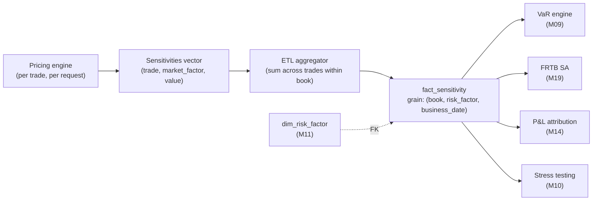

# Module 8 — Sensitivities Deep Dive

!!! abstract "Module Goal"
    Sensitivities — the Greeks, DV01, CS01, and their bucketed cousins — are the rosetta stone between trading positions and every aggregated risk number the firm produces. This module covers them as data: what they measure, what shape they take when they land in `fact_sensitivity`, how they aggregate (and where they refuse to), and what to look for when the upstream calculation has gone subtly wrong. The derivatives mathematics is treated only insofar as it constrains the data design.

---

## 1. Learning objectives

By the end of this module, you should be able to:

- **Define** the first-order Greeks (delta, vega, rho, theta) and the second-order Greeks (gamma, cross-gamma, vanna, volga) as partial derivatives of present value with respect to a market factor, and translate each into the column it occupies on a `fact_sensitivity` row.
- **Distinguish** scalar sensitivities (a single number per position-factor pair) from bucketed sensitivities (a vector along a tenor or strike axis) from surface sensitivities (a matrix along two axes), and choose the right grain for `fact_sensitivity` accordingly.
- **Aggregate** bucketed sensitivities to coarser grains — parallel DV01 from key-rate DV01, total vega from strike-bucketed vega — and articulate what information is lost when you do.
- **Detect** the recurring failure modes that make sensitivities silently incompatible across systems: bumping-convention mismatch (1bp absolute vs 1% relative), strike-bucket mismatch, currency mismatch (trade currency vs reporting currency), and the conflation of analytic and numerical Greeks.
- **Choose** between long-format storage (one row per risk factor) and wide-format storage (one column per risk factor), and justify the choice in terms of cardinality, evolution of the risk-factor universe, and the downstream consumer.
- **Validate** a numerical Greek against its analytic counterpart on a benchmark instrument, and recognise when a disagreement is numerical noise rather than a calculation bug.

## 2. Why this matters

Sensitivities are upstream of nearly every aggregated risk number the firm produces. Historical-simulation VaR ([Module 9](09-value-at-risk.md)) replays past market-factor moves against current sensitivities to generate a P&L distribution. The FRTB Standardised Approach computes capital from bucketed sensitivities times prescribed risk weights, with prescribed correlations. P&L attribution ([Module 14](14-pnl-attribution.md)) decomposes the day-over-day P&L into a delta-explain, a vega-explain, a residual; the explain components are sensitivities multiplied by realised market moves. Stress testing ([Module 10](10-stress-testing.md)) at the desk level often runs as a Taylor-series approximation built from delta, gamma, and vega rather than as a full revaluation. Each of these consumers reaches into `fact_sensitivity`, joins to `dim_risk_factor`, and produces a number that the front office, risk management, finance, and the regulator rely on. If `fact_sensitivity` is wrong, every consumer is wrong, and the wrongness is correlated — fixing one report does not fix the others.

The data shape decisions you make in this module determine whether downstream consumers can trust the answers. A sensitivity stored without an explicit bumping convention will be summed against another desk's sensitivity that used a different convention, and the resulting number will be wrong by some unspecified factor. A sensitivity stored at the wrong grain — book-level when bucketed-by-tenor was needed, or vice versa — will either understate the risk (information lost in the aggregation) or overstate it (information that was never there to begin with, fabricated by the loader to fill the schema). A sensitivity stored in trade currency when the warehouse expected reporting currency will produce a silent FX bug that survives every smoke test until a major FX move makes the totals visibly wrong.

After this module you should be able to look at a row in `fact_sensitivity`, follow the chain of joins to `dim_risk_factor`, and predict which consumer queries it will participate in and which will silently exclude it. You should also be able to take a candidate sensitivity feed and write the data-quality checks that catch the recurring upstream failure modes — coverage by asset class, bumping-convention consistency, currency consistency, sign convention — before the numbers reach BI. The instruments primer in [Module 4](04-financial-instruments.md) told you which Greeks to *expect* for each asset class; this module tells you what to *do* with them once they arrive.

A note on what this module does *not* cover. It does not cover the derivation of any pricing model — Black–Scholes, SABR, Hull–White, or any other — beyond the use of Black–Scholes as a validation reference in Example 1. It does not cover the operational details of the market-data pipeline that feeds the curves and surfaces the pricing engine consumes; that is the subject of [Module 11](11-market-data.md). It does not cover the aggregation arithmetic for portfolio-level risk measures — VaR, FRTB SA capital, ES — beyond the brief outline of how `fact_sensitivity` feeds them; those are Modules 9, 12, and 19. The scope here is the sensitivity layer itself: what rows go into `fact_sensitivity`, how they get there, what shape they take, and how to keep them honest.

A framing note for readers coming from a quantitative-finance background. This module deliberately treats the Greeks as data, not as derivatives. The mathematics — Itô calculus, replication arguments, Black–Scholes derivation — is covered well in standard texts (the Further Reading section points to Hull and Wilmott as the canonical references) and is not reproduced here. The reason is one of leverage: a BI engineer who can derive Black–Scholes but cannot tell when a delta is summed across an incompatible bumping convention is not the engineer the warehouse needs. The reverse engineer — comfortable with the data shapes, the additivity rules, the FRTB bucket structure, and the recurring upstream failure modes, even without the calculus — is the engineer who keeps the warehouse honest. The audience for this module is the second engineer; the first engineer is welcome but will find the derivation footnotes thinner than expected.

## 3. Core concepts

A meta-note before diving in. Section 3 below builds the warehouse view of sensitivities in eleven sub-sections, ordered from "what each row is" through "what each Greek measures" through "how they get written and aggregated". Readers who already work with risk data daily can skim 3.0–3.4 and concentrate on 3.5–3.8 (data flow, storage shapes, bumping methodology, additivity). Readers new to risk should read top to bottom; the worked examples in section 4 assume the section 3 vocabulary throughout.

### 3.0 Sensitivities as data — the warehouse view

Before the Greeks themselves, a one-screen orientation on what a sensitivity *is* in the warehouse. The trader thinks of a sensitivity as a hedging tool — "I am long 500 deltas on EUR/USD and need to short 500 EUR/USD spot to flatten the book". The data engineer thinks of a sensitivity as a row on `fact_sensitivity` — a number, with a set of dimensional attributes that say what it is a sensitivity *of* and a set of provenance attributes that say *how* and *when* it was computed. The two views are the same object seen from different sides; the trader-side view drives what a *good* number looks like, and the engineer-side view drives what the storage and aggregation arithmetic must protect.

A canonical `fact_sensitivity` row, decomposed:

| Column                  | Semantic role                                                                          |
| ----------------------- | -------------------------------------------------------------------------------------- |
| `sensitivity_sk`        | Surrogate key for the row — opaque, used for joins to companion tables.                |
| `book_sk`               | The book the sensitivity belongs to. FK into `dim_book` ([Module 6](06-core-dimensions.md)). |
| `risk_factor_sk`        | The market factor the sensitivity is *with respect to*. FK into `dim_risk_factor` ([Module 11](11-market-data.md)). |
| `sensitivity_type`      | Which Greek this is — DELTA, VEGA, GAMMA, DV01, CS01, … Drawn from a controlled vocabulary. |
| `business_date`         | The reporting date the sensitivity describes — typically the close-of-business date.    |
| `as_of_timestamp`       | When the warehouse came to believe this value; supports restatements ([Module 7 §3.4](07-fact-tables.md)). |
| `currency_sk`           | The currency of the value (reporting currency by convention; trade currency tracked separately for audit). |
| `source_system_sk`      | Which engine produced this row.                                                        |
| `sensitivity_value`     | The number — in the units implied by `sensitivity_type` and `bumping_convention`.       |
| `bumping_convention`    | The precise specification of how the bump was applied — section 3.7. NOT NULL.          |
| `compute_method`        | Full revaluation, Taylor approximation, AAD — see section 3.5.                          |

Three properties of this row to anchor everything else in the module against:

- **The grain identifies the row.** `(book_sk, risk_factor_sk, sensitivity_type, business_date, as_of_timestamp)` is the unique key. Two rows with the same grain represent the same logical measurement, and one is a restatement of the other.
- **The semantic meaning of the value depends on `sensitivity_type` and `bumping_convention` jointly.** Neither alone is sufficient. A `sensitivity_type` of `DV01` does not pin down the units; a `bumping_convention` of `1bp absolute, central` does not say which Greek; only the pair does.
- **The value is only meaningful in the company of its joined dimensions.** `risk_factor_sk` resolves to a market factor with an asset class, a currency, a tenor, a strike — and the risk factor's identity is what makes the value comparable to other rows. A sensitivity value with a missing or wrong `risk_factor_sk` is orphaned data.

The rest of section 3 unpacks each piece — what the Greeks are (3.1, 3.3), what shape they take in the warehouse (3.2), what conventions distinguish them (3.4), how they get there (3.5), how they are stored (3.6), how the bumping works (3.7), and how they aggregate (3.8). Keep the row above in mind — every concept maps back to a column or a constraint on it.

### 3.1 First-order Greeks

A **first-order Greek** is the partial derivative of an instrument's present value with respect to a single market factor, holding all other factors fixed. The derivative is local — it tells you how the PV moves for an infinitesimal change in the factor — and the resulting number is the *coefficient* of the linear term in a Taylor expansion of PV around the current state of the world.

Four first-order Greeks dominate the risk warehouse:

| Greek  | Symbol               | Partial derivative w.r.t.    | Typical units                        | Read as                                                                                  |
| ------ | -------------------- | ---------------------------- | ------------------------------------ | ---------------------------------------------------------------------------------------- |
| Delta  | \(\Delta\)           | spot price of the underlying | currency per unit underlying         | "P&L impact of a one-unit move in the underlying."                                       |
| Vega   | \(\nu\) (or \(\mathcal{V}\)) | implied volatility   | currency per vol point (1% absolute) | "P&L impact of a one-vol-point rise in implied vol."                                     |
| Rho    | \(\rho\)             | risk-free interest rate      | currency per 1% absolute rate move   | "P&L impact of a 100bp parallel rate shift." Often quoted per 1bp instead — see DV01.    |
| Theta  | \(\Theta\)           | time to expiry               | currency per day (or year)           | "P&L decay over the next day, all else equal." Sign convention varies — see pitfalls.    |

Each Greek is a *partial* derivative — vega holds spot fixed even though spot and vol moves are typically correlated; rho holds the curve fixed in shape and shifts only its level. The "all else equal" caveat is what makes the Greeks useful as building blocks but hazardous as standalone forecasts. Two desks netting their delta exposure on the same name will not net their vega exposure unless they have also agreed on which volatility surface point each is bumping; the partials only compose when the partials are with respect to the *same* market factor under the *same* bumping convention.

!!! info "Definition: present value (PV)"
    The **present value** of a position is its mark-to-market valuation under the current state of the world — the sum of expected future cashflows, discounted back to today, with optionality priced under the chosen pricing model. Greeks are partial derivatives of PV; nothing in this module computes PV from scratch. The pricing engine produces PV; the warehouse stores its derivatives.

In Black–Scholes, the analytic forms are textbook (delta = \(N(d_1)\) for a European call, vega = \(S \phi(d_1) \sqrt{T}\), and so on). Production books rarely consume the closed forms directly — most positions reach the warehouse with Greeks that were produced by the pricing engine through bump-and-revalue (section 3.7), and the closed forms are kept as validation references. Section 4's worked example uses the closed form precisely as that kind of reference.

A vocabulary note for delta in particular. The bare term "delta" is overloaded in trading: it can mean the partial derivative (the analytic Greek), the equivalent underlying position implied by that derivative (the **delta-equivalent notional**), or the percentage-of-notional measure (sometimes called **percentage delta** or just "the delta" in equity options trading, where it is reported as a number in [0, 1] for calls). Three different things with three different units, all called "delta". The warehouse must pin one definition per `sensitivity_type` value, document it, and refuse to mix. The same point applies less often but does apply to vega: "vega" can mean the partial derivative in currency-per-vol-point or, occasionally in equity-options shops, in basis points of the option's premium. Spend the five minutes to nail the definitions in the data dictionary; the alternative is debugging a 30%-wrong number a quarter from now under regulatory pressure.

A worked example of the delta-overloading. Consider a long position in 100 contracts of a vanilla European call on the S&P 500, struck at-the-money with 1y to expiry, where each contract is on \$50 × the index. With the index at 5,000 the notional underlying exposure is \$50 × 5,000 × 100 = \$25M. The analytic delta (\(N(d_1)\)) for this option is approximately 0.58. The three different "deltas" the trading system might report:

- **Partial-derivative delta**: 0.58 (dimensionless, per option contract).
- **Delta-equivalent notional**: 0.58 × \$50 × 5,000 × 100 = \$14.5M (in dollars; the size of the equivalent index position the option behaves like).
- **Percentage delta**: 58% (the option moves like 58% of the underlying notional).

All three are correct under their own definitions, all three would be reported as "the delta of the position", and in `fact_sensitivity` they end up as wildly different `sensitivity_value` numbers. Without a controlled vocabulary on `sensitivity_type` distinguishing the three, any aggregation across a feed reporting (1) and a feed reporting (2) is broken.

A second vocabulary note on theta. Theta is conventionally negative for long option positions (the option loses value as time passes, all else equal) and positive for short option positions. Some engines emit theta as the *signed rate* of value change with respect to a forward time step (negative for long calls); others emit theta as the *absolute size* of one-day decay (positive for long calls, with the sign implicit in the position direction). The two presentations cancel under any operation that preserves sign and double-count under any operation that does not. Pin the convention and validate.

### 3.2 Bucketed variants

Most "first-order" sensitivities in a real risk warehouse are not scalars — they are *vectors* along a tenor or strike axis. A 10-year interest-rate swap has a delta against the 5-year point on the curve, a different delta against the 7-year point, a different one against the 10-year point, and small but non-zero deltas against neighbouring tenors that the swap touches through curve interpolation. Storing a single "IR delta" scalar throws away the tenor structure; storing the full vector preserves it.

Three shapes recur:

- **Scalar sensitivity** — one number per (position, risk factor). Equity delta against the S&P 500 spot is scalar: a single underlying, a single bump, a single number. FX spot delta against EUR/USD is scalar.
- **Curve-shaped sensitivity** — a vector indexed by tenor. **Key-rate DV01** (KRD), **bucketed DV01**, **partial DV01** are all names for this: per-tenor sensitivity to a 1bp shift at a single curve point, with all other points held fixed. Typical tenor buckets: 1M, 3M, 6M, 1Y, 2Y, 3Y, 5Y, 7Y, 10Y, 15Y, 20Y, 30Y. The vector has one entry per bucket.
- **Surface-shaped sensitivity** — a matrix indexed by strike and tenor (or strike and expiry). **Vega surface**, sometimes called **bucketed vega**, has one entry per (strike, expiry) cell of the implied-vol surface that the position is sensitive to. An ATM 1y vanilla option has vega concentrated near the ATM-1y cell; a 1y-2y forward-starting variance swap has vega spread across many cells.

The shape determines the grain of `fact_sensitivity`. Scalar sensitivities are one row per (book, risk_factor, business_date). Curve-shaped sensitivities are one row per (book, risk_factor, tenor_bucket, business_date) — the tenor becomes part of the grain. Surface-shaped sensitivities are one row per (book, risk_factor, tenor_bucket, strike_bucket, business_date) — both axes become part of the grain. The cardinality grows accordingly: a book with 50 swaps and a 12-tenor curve produces 12 rows of bucketed DV01, where a book with 50 vanilla options and a 5-strike × 5-tenor vol surface produces 25 rows of bucketed vega *per option* before any aggregation.

The "right" granularity is the *coarsest* grain that still answers the consumer questions. FRTB SA defines its bucketing scheme; if the warehouse is feeding FRTB it must store at *at least* the FRTB grain or finer. P&L attribution typically wants per-tenor and per-strike grain because the realised market moves are also tenor- and strike-specific. VaR can usually consume coarser bucketed sensitivities than FRTB requires. The warehouse's job is to store at the finest grain any consumer needs and to provide aggregation views that roll up to coarser grains on demand (section 3.6).

A practical observation on bucket choice. The tenor buckets above (1M, 3M, …, 30Y) are not universal — they are a common convention. FRTB SA prescribes its own set (different per asset class), some shops use ISDA SIMM buckets, and individual desks may carry private bucket sets aligned to their hedging instruments. The warehouse standard is to carry one canonical bucket set per curve in `dim_risk_factor` and to *map* feeds that arrive in different bucket sets into the canonical set at load time. The mapping is not always lossless (regridding from a 12-bucket set to an 8-bucket set drops resolution; the reverse interpolates information that was not in the source) and the data dictionary must document the mapping rule, the lossiness, and any precision the consumer should not assume.

A second observation on surface-shaped sensitivities. The "vol surface" is a continuous object — implied volatility is a function of strike and expiry — but the warehouse stores it discretely on a grid of (strike_bucket, tenor_bucket) cells. Two pricing engines may bucket the same surface differently (5×5 vs 7×7 grid, ATM-relative strikes vs absolute strikes, calendar tenors vs business-day tenors). Reconciling vega between two such engines requires regridding one onto the other's bucket set, which is the surface-equivalent of the curve regridding above and inherits the same lossiness story. The defensive pattern is to store both the canonical-grid vega and the source-grid vega when the two differ, so consumers can choose which to use based on their tolerance for regridding noise.

### 3.3 Second-order Greeks

A **second-order Greek** is the partial derivative of a first-order Greek — equivalently, a second partial of PV. Where first-order Greeks tell you the linear term in the Taylor expansion of PV, second-order Greeks tell you the quadratic term, and they matter exactly when the linear approximation breaks down.

| Greek       | Symbol             | What it measures                                                                       | When it matters                                                                |
| ----------- | ------------------ | -------------------------------------------------------------------------------------- | ------------------------------------------------------------------------------ |
| Gamma       | \(\Gamma\)         | \(\partial^2 \mathrm{PV} / \partial S^2\). Curvature of PV in spot.                    | Option-heavy books, especially short-dated options near the strike. Gap risk. |
| Cross-gamma | \(\Gamma_{i,j}\)   | \(\partial^2 \mathrm{PV} / \partial S_i \, \partial S_j\). Cross-curvature.            | Multi-asset exotics, baskets, correlation-sensitive structured products.       |
| Vanna       | —                  | \(\partial^2 \mathrm{PV} / \partial S \, \partial \sigma\). Cross-derivative spot/vol. | Vol-sensitive books where spot and vol are correlated (FX, equity).            |
| Volga       | —                  | \(\partial^2 \mathrm{PV} / \partial \sigma^2\). Curvature of PV in vol.                | Vol-of-vol exposed positions: volatility products, exotic options.             |

For a linear instrument — a forward, a vanilla swap, cash equity — second-order Greeks are zero (or negligible) and the warehouse can ignore them. For an option-heavy book, ignoring them is a known and avoidable bug. The classic failure mode is a daily delta-hedged options book that reports a flat delta exposure, looks risk-flat, and then prints an unexpected P&L when the underlying moves more than a few percent — the move that took the option further into or out of the money was outside the linear-approximation regime, and the missing gamma was the explanation.

Cross-gamma deserves a flag for BI engineers because of its data shape. A standalone gamma is a vector along the same axis as delta — one entry per underlying. Cross-gamma is a *matrix* indexed by pairs of underlyings, and the off-diagonal entries are the ones that matter for multi-asset products. Storing cross-gamma as a flat list of (book, risk_factor_1, risk_factor_2, value) rows in `fact_sensitivity` is the long-format default; the alternative wide-format presentation as a sparse matrix is rarely worth it.

A small caveat on terminology. Some pricing engines report "gamma" as the second derivative as defined here; others report a "1% gamma" or "1-unit gamma" that is already scaled by some bump size, equivalent to a finite-difference approximation rather than a true partial. The convention is per-engine and must be documented on `dim_risk_factor` or on a `dim_sensitivity_type` accompanying the fact. Treating one engine's gamma as another engine's gamma without checking the scale is the gamma equivalent of the bumping-convention bug in section 3.7.

The FRTB SA introduces a related but distinct measure called **curvature**, which is *not* gamma despite measuring the same kind of thing. Curvature is computed as the difference between a full revaluation of the position under a prescribed up-and-down shock and the linear (delta-only) approximation of that revaluation; it captures the residual second-order P&L without sitting on top of an analytic Hessian. The warehouse should carry curvature as its own `sensitivity_type` value rather than aliasing it onto gamma — the two are related but defined differently and treated separately by the regulator. Confusing them in the schema is a surprisingly common FRTB onboarding bug.

A note on which second-order Greeks to *carry by default*. Three layers of decision, from cheapest to most expensive:

- **Carry nothing second-order.** Acceptable for purely linear books (vanilla swaps, cash equities, FX forwards). The Taylor approximation collapses to its linear term and gamma, vanna, volga are all zero by construction. The warehouse stores first-order Greeks and a `is_linear_book` flag on `dim_book` documents the choice.
- **Carry diagonal Hessian (gamma + volga).** Acceptable for option-heavy single-underlying books where cross-Greeks between underlyings are not relevant. Gamma captures spot-spot curvature; volga captures vol-vol curvature; the off-diagonal vanna captures spot-vol cross-curvature. This is the most common production layer.
- **Carry full Hessian (gamma + cross-gamma + vanna + volga + cross-vanna + …).** Required for multi-underlying exotics, baskets, and any book where consumer-side risk attribution wants to decompose P&L across pairs of factors. Storage cost scales with the square of the risk-factor count and is non-trivial for FRTB-grain risk-factor sets.

Document the choice per book or per asset class on `dim_book` and let the consumer query the documentation before assuming a Greek is present. The recurring failure mode is a consumer assuming gamma exists for every book and silently treating its absence as a zero, which under-states risk for the books that should carry it.

### 3.4 Instrument-specific conventions: DV01, CS01, PV01

Three closely related but distinct measures appear constantly in rates and credit risk. They are all "the P&L impact of a 1bp move in something", but the *something* differs and the warehouse needs to keep them apart.

| Convention | Bump applied to                          | Typical instruments        | Sign convention                                                  |
| ---------- | ---------------------------------------- | -------------------------- | ---------------------------------------------------------------- |
| **DV01**   | Zero curve (or yield), parallel or per-tenor bucketed | Rates products, government bonds, swaps | Positive for a long fixed-rate bond (you lose value as rates rise — but DV01 is reported as the absolute size of that loss, sign convention varies). |
| **PV01**   | Discount curve specifically (not projection curve)    | Rates products, used as a generic "1bp present-value sensitivity" measure | Same as DV01 in single-curve frameworks; differs in multi-curve setups (post-2008). |
| **CS01**   | Credit-spread curve of a specific name or index       | Credit-default swaps, credit bonds, tranches | Positive for a long-protection (short credit) CDS — you gain value as spreads widen. Conventions vary; document. |

The differences are easiest to see by what *moves* under each bump. DV01 moves the entire interest-rate curve; an IRS that pays floating and receives fixed has a DV01 that nets the discount-curve sensitivity and the projection-curve sensitivity (which point the same way for a vanilla swap, opposite ways for a basis swap). PV01 in a multi-curve framework moves only the discount curve, so it isolates the funding-rate sensitivity from the rate-fixing sensitivity. CS01 moves only the credit-spread curve, leaving the risk-free curve fixed; the result is the pure exposure to default-probability changes at the spread level.

In single-curve frameworks (pre-2008, or in some emerging-markets shops still), DV01 and PV01 are numerically identical — there is one curve and bumping it is the same operation either way. Post-2008 multi-curve frameworks broke that equivalence, and warehouses that did not update their sensitivity nomenclature accordingly carry decade-old field names that mean different things in different feeds. The defensive posture is to store both `sensitivity_type` ('DV01' / 'PV01' / 'CS01') and `bumping_convention` (the precise specification of which curve was moved by how much) on `fact_sensitivity`, and to refuse to aggregate across mismatched values.

Two further measures appear in credit risk and deserve a flag because they look like CS01 but are not.

- **Spread01.** Same as CS01 in most usages — the P&L impact of a 1bp widening in the credit spread of a specific name. Some shops use "spread01" for the broader-market (index) spread sensitivity and "CS01" for the single-name; others use the names interchangeably. Pin per feed.
- **Jump-to-default (JTD).** Not a sensitivity in the partial-derivative sense at all — it is the P&L impact of an *instantaneous default* of the reference name, with the recovery rate held at its reference value. JTD is a discrete-event scenario, not a continuous bump, and it is computed by repricing the position under the assumption that the credit has defaulted right now. Storing JTD in the same fact column as CS01 is a category error; it belongs in its own `sensitivity_type` (or its own table) and is never additive with CS01 across positions on the same name.

The same general point — that the warehouse needs a *taxonomy* of sensitivity types richer than "Greek name" — recurs across asset classes. Equity has dividend-yield sensitivity (sometimes called "epsilon" or "psi"), borrow-rate sensitivity, and a residual called "skew sensitivity" that some engines emit and others do not. Commodities have term-structure sensitivities along the futures curve. Each is its own `sensitivity_type` value drawn from a controlled vocabulary; the warehouse cannot rely on the Greek name alone to disambiguate.

### 3.4a A note on the FRTB sensitivity-based approach

The Fundamental Review of the Trading Book (FRTB) Standardised Approach is the regulatory framework that turned the warehouse-side discipline of this module into a *requirement*. Pre-FRTB, a bank could compute regulatory market-risk capital from VaR alone, with sensitivities used internally for hedging and analysis. Post-FRTB, the SA computes capital directly from bucketed sensitivities multiplied by prescribed risk weights, with prescribed correlations applied at each aggregation level. The warehouse must store sensitivities at the FRTB grain (or finer) and produce the prescribed buckets cleanly enough that the SA capital number is reproducible from the warehouse alone.

Three structural implications for `fact_sensitivity`:

- **The risk-factor identification must align with FRTB's bucketing scheme.** FRTB SA prescribes buckets per asset class (10 buckets for general-interest-rate risk, 18 for credit-spread risk, 11 for equity, etc., each with prescribed risk weights and intra-bucket / inter-bucket correlations). The warehouse's `dim_risk_factor` must carry attributes that map each risk factor to its FRTB bucket — typically a `frtb_bucket_id` column that the SA query groups by.
- **Three sensitivity types are required: delta, vega, curvature.** Curvature is the FRTB-specific second-order measure introduced in section 3.3 — not gamma, despite the resemblance. The warehouse must produce curvature for every position that carries optionality, against every relevant risk factor, computed under the prescribed shock sizes (a +/-X% shift, where X varies by risk factor).
- **The regulatory submission is reproducible from the warehouse.** The SA capital number must be reconstructable from a stored snapshot of `fact_sensitivity` plus the prescribed FRTB parameters (risk weights, correlations) plus the SA aggregation formula. This pins down the bitemporal-load discipline from [Module 7 §3.4](07-fact-tables.md): the warehouse must be able to re-run any historical SA submission against the as-of-then sensitivity values, not against current values that may have been restated.

The FRTB Internal Models Approach (IMA) is a separate framework that uses Expected Shortfall instead of VaR and is built on full-revaluation, not sensitivities. IMA does not impose the bucketing requirements above, but it imposes its own discipline (P&L attribution tests, risk-factor eligibility tests) that consume both `fact_sensitivity` (for sensitivity-based diagnostics) and `fact_pnl` (for the attribution tests). [Module 19](19-regulatory-context.md) treats both regimes in detail.

### 3.4b Sensitivities by asset class — what to expect on the feed

A quick map of which Greeks a well-formed sensitivity feed should carry, by asset class. This is the operational follow-up to [Module 4](04-financial-instruments.md)'s "typical sensitivities to expect" entries — given a feed is supposed to cover this asset class, what are the rows that *must* exist and the rows that *may* exist depending on the products in the book.

| Asset class | Always expect                                              | Often expect (option-heavy books)                  | Sometimes expect                                  |
| ----------- | ---------------------------------------------------------- | -------------------------------------------------- | ------------------------------------------------- |
| Rates       | DV01 / PV01, bucketed by tenor and curve                   | Vega (swaptions, caps), gamma, IR convexity        | Cross-currency basis sensitivity                  |
| Credit      | CS01, bucketed by tenor and reference name                 | JTD (single-name CDS); index correlation (tranches) | Recovery-rate sensitivity                          |
| FX          | FX spot delta per pair, FX forward delta (curve-shaped)    | FX vega, vanna, volga (option books)               | NDF-specific deltas; quanto adjustments            |
| Equity      | Equity delta per underlying                                | Vega (surface-shaped), gamma, dividend exposure    | Borrow rate sensitivity, correlation deltas        |
| Commodity   | Delta per contract month (vector along futures curve)      | Vega per contract month                            | Crack/calendar spread sensitivities, location      |

The "always expect" column is the coverage minimum. A position record in a book classified as `RATES` that produces no DV01 row in `fact_sensitivity` is a data-quality alert — either the position is misclassified or the pricing engine failed silently. The "often" and "sometimes" columns describe expected variation; the data-quality framework should set thresholds (X% of rates positions should produce vega rows when the position is an option) rather than hard requirements, because the variation by book composition is real.

### 3.5 From pricing engine to risk warehouse

The data flow from a position to a `fact_sensitivity` row passes through three distinct stages, each at a different grain. Understanding the grain transitions is the key to writing loaders that do not silently destroy information.



**Stage 1 — pricing engine produces a sensitivities vector per trade.** The engine prices the trade and then either (a) computes Greeks analytically from the closed form (vanilla equity options under Black–Scholes — section 4.1), (b) bumps each market factor and reprices, taking the finite difference (most production engines, most products), or (c) computes Greeks via algorithmic differentiation, also called adjoint algorithmic differentiation or AAD (modern engines, increasingly common for complex books). All three produce the same logical output: a vector of (market_factor_id, sensitivity_value) pairs per (trade, request).

**Stage 2 — the ETL aggregates from trade-level to the warehouse grain.** The trade-level vector arrives in a staging table; the loader sums across trades within each (book, market_factor) and writes the result to `fact_sensitivity` at book grain. The aggregation is a SUM, applied per-risk-factor — and this is the first place where the additivity story (section 3.8) matters. Sums are valid within the same risk factor; sums across different risk factors are not.

**Stage 3 — `fact_sensitivity` stores the long-format row.** One row per (book, risk_factor, business_date), with `sensitivity_value`, `bumping_convention`, `currency`, `as_of_timestamp`, `source_system_sk`. The fact links to `dim_risk_factor` ([Module 11](11-market-data.md)) which carries the risk-factor's identity, asset class, currency, tenor, strike, curve_id, and any other shape attributes the consumers need to filter on.

A practical wrinkle on stage 1. **Full revaluation** Greeks bump each factor one at a time and reprice the entire trade — accurate, slow, and the default for production. **Taylor-series approximation** Greeks reuse a previously computed gradient (and possibly Hessian) to estimate Greeks under new conditions without repricing — fast, less accurate, and used primarily in real-time risk views and stress-testing fast paths. The two should not be mixed in the same fact row without an explicit `compute_method` flag, because a rigorous user (FRTB submission, regulator audit) will want to filter to one or the other. Most production warehouses store full-revaluation Greeks as the canonical layer and Taylor-approximation Greeks as a separate fast-path table.

A second wrinkle on stage 2. The pricing engine emits sensitivities in the *trade currency*. The warehouse usually wants them in the *book reporting currency* or the *firm reporting currency*. The conversion happens during ETL, applied at the fact-row grain, using the FX rate of the business date. Doing the conversion at the BI layer instead, on the aggregate, produces a wrong answer when the books in the aggregate use different currencies — see the pitfalls section 5 for the full failure mode.

A third wrinkle, on the relationship between the sensitivity feed and the position feed. Both feeds describe the same trades on the same business date but they typically arrive on different schedules — positions usually first (because they drive the standalone reporting that doesn't need the Greeks), sensitivities later (because they require the heavier pricing run). The warehouse must tolerate a window during which positions exist on `fact_position` for `business_date = T` but the corresponding `fact_sensitivity` rows have not yet arrived. Two recurring patterns for handling the gap:

- **Block-and-wait.** Downstream consumers (VaR, FRTB, attribution) are scheduled to run only after both feeds have completed. The orchestration layer treats the sensitivity load as a hard dependency and a failure or delay in the sensitivity feed blocks the entire downstream chain. Defensive but expensive — a single slow position causes a five-hour delay in the morning risk report.
- **Run-with-stale.** Downstream consumers run on the latest available sensitivities, which may be from a prior business date if the current-date load has not finished. The output carries a `sensitivity_as_of_date` column distinct from `business_date` so the consumer is aware of the staleness. Cheaper but the consumer must understand the difference.

Most production warehouses ship a hybrid: critical regulatory consumers (FRTB) block-and-wait; internal management reports run-with-stale and flag the staleness. The choice belongs to the consumer, not the warehouse, but the warehouse must support both by carrying the load timestamps cleanly.

### 3.5a A worked narrative — single trade through to fact row

To make the data flow concrete, follow a single trade from booking to its sensitivity row.

A trader on the rates desk books a 5-year USD-denominated payer interest-rate swap on 2026-05-07 at 10:30 NYT, notional \$100M, paying fixed at 4.25%, receiving SOFR floating. The trade flows through the booking system, lands in the operational store as a `BOOK` event with `trade_id = T-9012345`, and is propagated to the warehouse's `fact_trade_event` (transactional, see [Module 7 §3.6.4](07-fact-tables.md)) and `fact_position` (periodic snapshot) overnight as part of the EOD batch.

The next morning at 02:30 NYT, the pricing engine processes the EOD position file and prices the swap. It produces:

- A PV of approximately \$0 (the swap is on-market) in trade currency USD.
- A vector of bucketed DV01 values against the USD-SOFR curve: 1M = 0, 3M = 5, 6M = 10, 1Y = 25, 2Y = 80, 3Y = 150, 5Y = 4,200, 7Y = 800, 10Y = 100, 30Y = 0 (USD per 1bp).

These values land in a staging table `stg_sensitivity` at trade grain — one row per `(trade_id, risk_factor_id)` with the bucketed DV01 values. The ETL aggregates from trade grain to book grain by summing across trades within each `(book_sk, risk_factor_sk)` pair. For the book containing only this trade and a few hedges, the resulting rows match the trade-level vector closely; for a busy book with hundreds of trades, the loader produces a netted-down vector that reflects the offsetting exposures.

The aggregated rows write into `fact_sensitivity` at 02:45 NYT with `business_date = 2026-05-07`, `as_of_timestamp = 2026-05-08 06:45:00 UTC`, `sensitivity_type = 'DV01'`, `bumping_convention = '1bp absolute parallel-per-tenor, central, full reval'`, `currency_sk` set to the reporting currency (USD here), `source_system_sk` set to the FO pricing engine. The rows are now visible to all downstream consumers — VaR, FRTB, attribution — and the trade has formally entered the risk warehouse's sensitivity view.

A restatement might happen later. If the SOFR curve is repriced on 2026-05-09 because of a market-data correction, the pricing engine re-runs and produces a new vector of DV01 values for the same trade and the same business date. The new rows insert into `fact_sensitivity` with the same `business_date = 2026-05-07` but `as_of_timestamp = 2026-05-09 11:00:00 UTC`. The original rows remain queryable; the "current view" query picks the new ones; the "as known on 2026-05-08" query picks the originals. The audit story is intact.

This trace is what a well-formed `fact_sensitivity` row looks like in motion: priced once at the trade level, aggregated once at the book level, written once per `as_of_timestamp`, and queryable forever after under the bitemporal pattern.

### 3.6 Storage shapes — long vs wide

Two shapes for storing sensitivities, with different trade-offs and different histories.

**Long format.** One row per (book, risk_factor, business_date, [tenor_bucket, strike_bucket as applicable]). The risk factor is a foreign key into `dim_risk_factor`. Adding a new risk factor is an INSERT into `dim_risk_factor` and a new value of `risk_factor_sk` appearing in subsequent fact rows; no DDL change. Querying for "all sensitivities of book X on date Y" is a simple filter; querying for "all rates deltas across all books" is a join through `dim_risk_factor` with a filter on asset class. This is the default for modern columnar warehouses (Snowflake, BigQuery, Databricks, Redshift) and the default for any warehouse that expects the risk-factor universe to evolve.

```sql
-- Long format
CREATE TABLE fact_sensitivity (
    sensitivity_sk     BIGINT       NOT NULL PRIMARY KEY,
    book_sk            INTEGER      NOT NULL,
    risk_factor_sk     INTEGER      NOT NULL,        -- FK to dim_risk_factor
    sensitivity_type   VARCHAR(16)  NOT NULL,        -- 'DELTA', 'VEGA', 'DV01', 'CS01', ...
    business_date      DATE         NOT NULL,
    as_of_timestamp    TIMESTAMP    NOT NULL,
    currency_sk        INTEGER      NOT NULL,        -- usually reporting currency
    source_system_sk   INTEGER      NOT NULL,
    sensitivity_value  DECIMAL(20,6) NOT NULL,
    bumping_convention VARCHAR(64),                  -- '1bp absolute', '1% relative', ...
    UNIQUE (book_sk, risk_factor_sk, sensitivity_type, business_date, as_of_timestamp)
);
```

**Wide format.** One row per (book, business_date) with one *column* per risk factor or per Greek. `delta_spx`, `delta_eurusd`, `vega_spx_1y_atm`, and so on. The schema encodes the risk-factor universe directly in the column list. This is legacy from in-memory cube tools (Essbase, SSAS, early TM1) where the column-oriented presentation was friendly to the cube engine, and it is occasionally the right shape for a stable, small risk-factor universe with predictable BI access patterns.

```sql
-- Wide format (for a small fixed risk-factor universe — uncommon in modern risk)
CREATE TABLE fact_sensitivity_wide (
    book_sk           INTEGER       NOT NULL,
    business_date     DATE          NOT NULL,
    as_of_timestamp   TIMESTAMP     NOT NULL,
    currency_sk       INTEGER       NOT NULL,
    delta_spx         DECIMAL(20,6),
    delta_eurusd      DECIMAL(20,6),
    delta_usdjpy      DECIMAL(20,6),
    vega_spx_1y_atm   DECIMAL(20,6),
    vega_eurusd_1y_atm DECIMAL(20,6),
    -- ... one column per risk factor in the universe ...
    PRIMARY KEY (book_sk, business_date, as_of_timestamp)
);
```

The trade-offs:

| Aspect                          | Long format                                 | Wide format                                              |
| ------------------------------- | ------------------------------------------- | -------------------------------------------------------- |
| Risk-factor evolution           | Insert into dim, no DDL                     | DDL change every time a new factor appears               |
| Sparse data                     | Naturally sparse (only non-zero rows stored) | Sparse → many NULL columns; storage waste                |
| Cardinality of risk factors     | Scales to millions (typical for FRTB)       | Practical ceiling around 100–500 columns                 |
| Filtering by asset class        | Join `dim_risk_factor`, filter              | Hard-coded by column name — needs maintained metadata    |
| BI tooling integration          | Modern columnar BI (Looker, Tableau live)   | Legacy cube tools (Essbase, SSAS multidimensional)       |
| Audit and lineage               | One fact row per measurement — clean        | One row carries dozens of measurements — coarser audit   |
| Query for "all deltas"          | `WHERE sensitivity_type = 'DELTA'`           | `SELECT delta_*` — needs metadata, brittle               |

Long is the right default for any FRTB-aware warehouse and for any warehouse where the risk-factor universe changes more than once a quarter. Wide is acceptable when the universe is small (a hundred factors at most), stable (no new factors expected this year), and the consumer is a cube-based BI tool that natively expects one column per measure. Modern warehouses ship long; the wide presentation, when needed, is built as a view on top of the long fact (a `PIVOT` query). The reverse — long view on top of a wide fact — is harder to build robustly because the column list has to be discovered dynamically.

A third shape worth mentioning, occasionally seen in legacy systems, is the **semi-wide** layout: one row per (book, business_date, sensitivity_type) with an array-typed column carrying the values for each risk factor. Snowflake's `OBJECT` and BigQuery's `STRUCT`/`ARRAY` types make this technically expressible and it shows up in feeds that originate from JSON-emitting risk engines. It is a halfway house: the schema does not change as the risk-factor universe changes (good), but the values are inside an array and standard BI tools cannot aggregate over them without an `UNNEST` or `LATERAL FLATTEN` (bad). Most warehouses unflatten semi-wide feeds into long format at load and treat the array structure as a transport convenience, not a storage choice.

Cardinality and cost. A typical FRTB-grade sensitivity universe carries a few thousand risk factors per asset class — say 100 currencies × 12 tenors for rates, plus a few hundred CDS names × 5 tenors for credit, plus equity surfaces × strikes × tenors, plus FX. The total order of magnitude is 10⁴ to 10⁵ risk factors firmwide. With a few thousand books and one row per (book, risk_factor, sensitivity_type, business_date), `fact_sensitivity` carries 10⁸–10⁹ rows per business date — an order of magnitude larger than `fact_position` for most banks. Partitioning on `(business_date)` and clustering on `(book_sk, risk_factor_sk)` is the typical layout; the long-format choice makes this trivial, where a wide-format alternative at this scale would have a column count in the thousands and would not fit the columnar engine's row-group strategy at all.

### 3.7 Bumping methodology

How a sensitivity is *computed* affects its *value*. The same trade against the same market factor can produce three different DV01s depending on the bumping methodology, and all three are "correct" under their stated convention. The warehouse stores enough metadata to keep them apart.

Three orthogonal axes:

- **Parallel vs bucketed bump.** A parallel bump shifts every point on the curve by the same amount (1bp added to every tenor) and produces a single scalar sensitivity. A bucketed bump shifts one tenor at a time, with the others held fixed, and produces a vector. Parallel DV01 is roughly the sum of bucketed DV01s but not exactly — the exactness depends on the curve interpolation method. The two are not interchangeable. FRTB SA requires bucketed.
- **Absolute vs relative shift.** An absolute shift adds a fixed amount to the factor (1bp added to a rate, 1 vol point added to a volatility). A relative shift multiplies the factor by a fixed ratio (1% relative bump on a 4% rate is 4bp; 1% relative bump on a 50% vol is 50 vol points absolute). Absolute is the default for rates and credit; relative is occasionally used for volatilities and almost always for equity dividend yields. A 1bp DV01 from an absolute-shift engine is *not* comparable to a 1% rho from a relative-shift engine without rescaling, and rescaling requires knowing the level of the underlying factor at the time of the bump.
- **One-sided vs central-difference.** A one-sided bump computes \((V(x + h) - V(x)) / h\), repricing once at the bumped state and once at the base. A central-difference bump computes \((V(x + h) - V(x - h)) / (2h)\), repricing twice — once up, once down. Central is more accurate (second-order accurate in \(h\) versus first-order for one-sided) but twice as expensive. For most production books the cost dominates and engines use one-sided; for validation and for high-precision regulatory submissions central is preferred. The choice can shift the reported sensitivity by a few percent — small enough to miss in a smoke test, large enough to fail a strict reconciliation.

The defensive posture is to store the bumping convention as a *string* on `fact_sensitivity` (or as an FK to a `dim_bumping_convention` if the convention is high-cardinality and reused across feeds). Two examples of well-formed conventions:

```text
"1bp absolute parallel shift on USD-SOFR-OIS, central difference, full revaluation"
"1% relative shift on USD-SPX-IMPLIED-VOL, one-sided up bump, Taylor-series approximation"
```

The downstream consumer can then filter on the convention to ensure compatibility before aggregating. Most importantly, if a consumer wants to *combine* sensitivities from two feeds with different conventions, the convention strings make the incompatibility visible — the alternative, where the fact row carries a bare number with no convention metadata, makes the incompatibility silent.

A reproducibility note. Bumping is a numerical procedure and the same trade, priced under the same engine, with the same bumping convention, must produce the same sensitivity to the last bit on a given hardware/software stack. Sensitivity values that drift between recomputations of the same row are a sign of either non-deterministic pricing (Monte Carlo with no fixed seed; AAD with non-deterministic graph traversal) or of an upstream input that is not as fixed as the consumer assumes. [Module 16](16-lineage-auditability.md) treats the lineage question; the relevant point here is that `fact_sensitivity` rows must be reproducible from their stated inputs and the warehouse should be able to re-run any historical row and bit-match the stored value.

A pragmatic note on AAD and pathwise Greeks. Modern pricing engines increasingly produce Greeks via *adjoint algorithmic differentiation* (AAD), which computes all sensitivities in a single backward pass through the pricing graph at a cost that is constant in the number of risk factors. This contrasts with bump-and-revalue, whose cost scales linearly with the risk-factor count (one revaluation per factor). For a book against a thousand risk factors, AAD is ~1000× faster and the speedup pays for the engineering cost within the first quarter for most firms. From the warehouse's point of view, AAD-derived Greeks look the same as bump-and-revalue Greeks — they sit in `fact_sensitivity` with the same schema — but the `compute_method` should distinguish them because AAD Greeks are *exact* derivatives (no truncation error, no cancellation noise) and the reconciliation tolerance against analytic references should be tighter than for bump-and-revalue. The same warehouse should be able to carry both methods side by side and document which is canonical for each book.

A note on bump-size selection. The Example 1 script demonstrates that the optimal bump size is bounded above by the truncation error of the finite-difference formula (which prefers small \(h\)) and bounded below by floating-point cancellation (which punishes very small \(h\)). The standard rule of thumb is \(h \sim \epsilon^{1/2}\) for one-sided differences (\(\sim 10^{-8}\) for double precision), \(h \sim \epsilon^{1/3}\) for central differences (\(\sim 10^{-5}\) for double precision). Production engines pick a fixed \(h\) per asset class and per market factor based on the typical magnitude of the factor — 1bp absolute for rates, 1 vol point absolute for vols, 1% relative for spot prices — and stick with it for years. The chosen \(h\) becomes part of the bumping convention and is one of the things the warehouse must record so that recomputation is bit-reproducible.

### 3.7a A reference table — first-order vs second-order Greeks

A side-by-side comparison of the Greeks introduced above, organised by the warehouse-relevant attributes rather than by the trader-relevant ones. The "additive across the same risk factor" column is the most consequential one — it is the property that section 3.8 builds the additivity rule on.

| Greek          | What it measures                                          | Order  | Shape                | Additive across same RF (Y/N) | Typical use case in the book                                                          |
| -------------- | --------------------------------------------------------- | ------ | -------------------- | :---------------------------: | ------------------------------------------------------------------------------------- |
| Delta          | \(\partial \mathrm{PV} / \partial S\)                     | First  | Scalar (per RF)      | Y                             | Linear hedging, every spot-sensitive book.                                            |
| DV01 / PV01    | \(\partial \mathrm{PV} / \partial r_i\) per curve point   | First  | Curve (vector by tenor) | Y (within tenor and curve) | Rates books, every IR-sensitive position; FRTB SA delta input for GIRR.               |
| CS01           | \(\partial \mathrm{PV} / \partial s_i\) per spread point  | First  | Curve (vector by tenor) | Y (within tenor and name)   | Credit books, CDS, credit bonds; FRTB SA delta input for CSR.                         |
| Vega           | \(\partial \mathrm{PV} / \partial \sigma\)                | First  | Scalar or surface    | Y (within strike and tenor) | Option books; FRTB SA vega input.                                                     |
| Rho            | \(\partial \mathrm{PV} / \partial r\) (parallel)          | First  | Scalar               | Y (within currency)         | Less common in production — mostly subsumed by DV01.                                  |
| Theta          | \(\partial \mathrm{PV} / \partial t\)                     | First  | Scalar               | Y                             | Time-decay management for option books.                                               |
| Gamma          | \(\partial^2 \mathrm{PV} / \partial S^2\)                 | Second | Scalar (per RF)      | Y (within RF)                 | Option books, especially short-dated near-the-money.                                  |
| Cross-gamma    | \(\partial^2 \mathrm{PV} / \partial S_i \, \partial S_j\) | Second | Matrix (per pair)    | Y (within RF pair)            | Multi-asset exotics, baskets, correlation-sensitive products.                         |
| Vanna          | \(\partial^2 \mathrm{PV} / \partial S \, \partial \sigma\) | Second | Scalar (per RF pair) | Y (within RF pair)            | FX and equity vol-sensitive books.                                                    |
| Volga          | \(\partial^2 \mathrm{PV} / \partial \sigma^2\)            | Second | Scalar (per RF)      | Y (within RF)                 | Vol-of-vol exposed positions; volatility products.                                    |
| Curvature (FRTB) | Full reval P&L under prescribed shock minus delta×shock | Second-equiv | Scalar (per RF)  | Y (within RF, FRTB SA only)   | FRTB SA capital — the regulatory second-order measure.                                |

The Y/N column is uniform Y because all Greeks are additive *within the same risk factor* (or risk-factor pair, for cross-Greeks). The constraint that bites is the reverse one — none are additive across *different* risk factors except through an explicit aggregation rule with prescribed correlations (FRTB SA, ISDA SIMM) or through a portfolio re-pricing (VaR, full-revaluation stress). The additivity table is uniform on its useful axis precisely because the warehouse design has factored out the harder cases into the grain.

### 3.8 Sensitivity additivity

Sensitivities are *mostly* additive across positions. The qualifier "mostly" hides the central data-design constraint of this module.

**They are additive across positions within the same risk factor.** Two trades both with delta against EUR/USD spot can be summed; the result is the book's net delta against EUR/USD spot. Three trades all with bucketed DV01 at the 5Y point on the USD-SOFR curve can be summed; the result is the book's 5Y DV01 against USD-SOFR. This is the property that makes the ETL's stage-2 aggregation (section 3.5) correct: the loader sums trade-level sensitivities within each (book, risk_factor) and writes the book-level total.

**They are not additive across different risk factors.** A 1bp move in the USD 5Y rate and a 1bp move in the USD 10Y rate are not the same shock. Their bucketed DV01s have the same units (currency per bp) and look summable, but summing them produces a number that does not correspond to any economic scenario — the resulting "total DV01" is the sensitivity to a synthetic scenario in which both points move by 1bp simultaneously, which is *not* the same as the parallel DV01 (which moves the entire curve, not just two points). For the same reason, a delta against EUR/USD and a delta against USD/JPY cannot be summed; the units are nominally the same (currency per pip) but the shocks are independent.

**They are not additive across instruments with different bumping conventions.** A DV01 from a 1bp absolute-shift engine and a DV01 from a 1% relative-shift engine cannot be summed without rescaling, even if both are nominally "DV01 against USD-SOFR-5Y". The rescaling requires knowing the level of the rate at bump time and is rarely done correctly outside the original engine.

The warehouse encodes additivity through the grain. `fact_sensitivity` at grain (book, risk_factor, sensitivity_type, business_date) is *additive across the dimension that is not in the grain* — sums across books are valid (firm-wide DV01 against USD-SOFR-5Y is the sum of book-level DV01s), sums across instruments inside a book are already done by the loader, sums across business dates are not valid (semi-additive in time, like all snapshot facts — see [Module 7 §3.3](07-fact-tables.md)). Sums across `risk_factor_sk` are *not* valid as a default; the BI layer must be configured to disallow them, and any aggregated risk presentation that does cross risk factors (a "total DV01" number) must do so through an explicit aggregation rule that the data dictionary documents.

The full treatment of when sensitivities aggregate cleanly, when they aggregate with caveats, and when they refuse to aggregate at all is the subject of [Module 12](12-aggregation-additivity.md). Here the relevant rule is the simple one: **same risk factor, same convention, same currency: sum. Anything else: stop.**

A small but important corollary on the BI presentation. Most BI tools default to summing every numeric column. For `sensitivity_value` this is dangerous — the SUM is correct only when the rows being summed satisfy the additivity preconditions, and the BI tool has no way of knowing whether they do. Three options for surfacing the constraint:

- **Configure the semantic layer to forbid SUM on `sensitivity_value` without an explicit grouping by `risk_factor_sk` and `bumping_convention`.** Users who try to drag the column into a chart without those groupings get a query error rather than a silent wrong number.
- **Replace `sensitivity_value` with two columns at the BI layer**: a per-risk-factor `sensitivity_value` that aggregates correctly within a single risk factor, and a calculated `sensitivity_text` that displays "n/a — choose a risk factor" when the user has not grouped by one. Heavy-handed but unambiguous.
- **Document the constraint in the column description and trust the analyst.** Cheapest and least defensible — it works for sophisticated users and fails silently for everyone else. Almost always insufficient on its own.

The defensive default is the first option in any BI tool that supports it. The data warehouse layer enforces the schema; the BI semantic layer enforces the additivity rules. Both controls together are necessary; neither is sufficient alone.

### 3.9 Stats detour — partial derivatives, in pictures

For readers who reach this module without the calculus background, a brief grounding on what a partial derivative *is* before the worked examples assume it. This subsection can be skipped by readers comfortable with the topic.

A function \(f(x)\) of a single variable has a derivative \(f'(x)\) that says: at this value of \(x\), how steep is the function. Geometrically, \(f'(x)\) is the slope of the tangent line to the graph of \(f\) at the point \(x\). If \(f(x) = x^2\), then \(f'(x) = 2x\), and at \(x = 3\) the slope is 6 — a small change in \(x\) of size \(\Delta x\) produces a change in \(f\) of approximately \(6 \Delta x\), with the approximation getting better as \(\Delta x\) shrinks.

A function \(f(x_1, x_2, \dots, x_n)\) of many variables has a *partial derivative* with respect to each variable: \(\partial f / \partial x_i\) says how steep \(f\) is in the direction of \(x_i\), with all other \(x_j\) held fixed. Geometrically, slice the multivariate graph along the \(x_i\) direction at the chosen point and the partial is the slope of the slice. The "all other variables held fixed" caveat is what makes partials *partial* and what makes them subject to the same all-else-equal warning that pervades the Greeks.

The Greeks are exactly partial derivatives of present value with respect to each market factor, treating all other factors as fixed:

$$
\Delta = \frac{\partial \mathrm{PV}}{\partial S}, \quad \nu = \frac{\partial \mathrm{PV}}{\partial \sigma}, \quad \rho = \frac{\partial \mathrm{PV}}{\partial r}, \quad \Theta = \frac{\partial \mathrm{PV}}{\partial t}
$$

A finite-difference approximation replaces the calculus limit with a small but non-zero bump. For delta:

$$
\Delta \approx \frac{V(S + h) - V(S - h)}{2h}
$$

(central difference; the one-sided variant uses \(V(S + h) - V(S)\) divided by \(h\) and is half-as-accurate for the same bump size). The pricing engine in section 3.5 is implementing this formula one factor at a time. The numerical-noise discussion in Example 1 is about the trade-off between making \(h\) small enough that the truncation error is negligible and large enough that floating-point cancellation does not destroy the result.

Second-order partials follow the same pattern. \(\partial^2 \mathrm{PV} / \partial S^2 = \Gamma\) (gamma) measures the curvature of PV in the spot direction. \(\partial^2 \mathrm{PV} / \partial S \, \partial \sigma\) is vanna — the *cross* partial, measuring how the spot-direction slope changes as vol changes (or equivalently, how the vol-direction slope changes as spot changes; the two are equal by Schwarz's theorem). The Hessian matrix of all second partials has gamma and volga on its diagonal and vanna and cross-gamma off-diagonal.

The data engineer's takeaway: each partial derivative is a *single number per (point, direction) pair* — equivalently, per (position, market factor) pair, which is exactly the grain of `fact_sensitivity`. The warehouse stores the partials; the calculus stays in the pricing engine. The mathematical structure is what fixes the data structure, not the reverse.

## 4. Worked examples

Two examples. The first is a Python validation of a numerical Greek against its analytic counterpart on a benchmark instrument. The second is a SQL aggregation of bucketed DV01 to parallel DV01 against a `fact_sensitivity` schema.

### Example 1 — Python: numerical delta of a vanilla European call

The pricing engine produces Greeks via bump-and-revalue (section 3.7). For a vanilla European call under Black–Scholes, we have the closed-form delta as a validation reference. The two should agree to within numerical tolerance — and watching the agreement deteriorate as the bump size shrinks past a floor is a useful exercise in what "numerical tolerance" actually means.

The full runnable file is at `docs/code-samples/python/08-numerical-delta.py`. The substantive code (also inlined here for offline reading):

```python
from __future__ import annotations

import math
from dataclasses import dataclass


@dataclass(frozen=True)
class EuropeanCall:
    """A vanilla European call option, parameterised in the Black-Scholes world."""

    spot: float       # underlying price, S
    strike: float     # strike price, K
    vol: float        # annualised volatility, sigma (e.g. 0.20 for 20%)
    rate: float       # risk-free rate, r (continuously compounded, annual)
    ttm: float        # time to maturity in years, T


def _phi(x: float) -> float:
    """Standard-normal cumulative distribution function via math.erf."""
    return 0.5 * (1.0 + math.erf(x / math.sqrt(2.0)))


def black_scholes_call(opt: EuropeanCall) -> float:
    """Closed-form Black-Scholes price of a European call (no dividend)."""
    if opt.ttm <= 0.0:
        # Intrinsic value at or after expiry. Avoids log(0) and division by zero.
        return max(opt.spot - opt.strike, 0.0)
    d1 = (math.log(opt.spot / opt.strike)
          + (opt.rate + 0.5 * opt.vol * opt.vol) * opt.ttm) \
         / (opt.vol * math.sqrt(opt.ttm))
    d2 = d1 - opt.vol * math.sqrt(opt.ttm)
    return opt.spot * _phi(d1) - opt.strike * math.exp(-opt.rate * opt.ttm) * _phi(d2)


def analytic_delta(opt: EuropeanCall) -> float:
    """Closed-form delta of a European call: N(d1)."""
    if opt.ttm <= 0.0:
        return 1.0 if opt.spot > opt.strike else 0.0
    d1 = (math.log(opt.spot / opt.strike)
          + (opt.rate + 0.5 * opt.vol * opt.vol) * opt.ttm) \
         / (opt.vol * math.sqrt(opt.ttm))
    return _phi(d1)


def numerical_delta(opt: EuropeanCall, h: float = 1e-4) -> float:
    """Central-difference numerical delta: (V(S+h) - V(S-h)) / (2h)."""
    if h <= 0.0:
        raise ValueError("bump size h must be strictly positive")
    up = EuropeanCall(opt.spot + h, opt.strike, opt.vol, opt.rate, opt.ttm)
    dn = EuropeanCall(opt.spot - h, opt.strike, opt.vol, opt.rate, opt.ttm)
    return (black_scholes_call(up) - black_scholes_call(dn)) / (2.0 * h)


if __name__ == "__main__":
    benchmark = EuropeanCall(spot=100.0, strike=100.0, vol=0.20, rate=0.02, ttm=1.0)
    px = black_scholes_call(benchmark)
    d_an = analytic_delta(benchmark)
    d_num = numerical_delta(benchmark, h=1e-4)
    print(f"Price (BS): {px:.8f}")
    print(f"Delta (analytic, N(d1)): {d_an:.8f}")
    print(f"Delta (numerical, h=1e-4, central): {d_num:.8f}")
    print(f"Absolute disagreement: {abs(d_num - d_an):.2e}")
```

Run on the benchmark option \(S = K = 100, \sigma = 20\%, r = 2\%, T = 1y\), the analytic delta is \(N(d_1) \approx 0.57925971\) and the central-difference numerical delta with \(h = 10^{-4}\) agrees to about 11 decimal places. The error scan at the bottom of the script shows the expected behaviour: as \(h\) shrinks from \(10^{-1}\) to \(10^{-3}\) the error drops quadratically (central difference is second-order accurate in \(h\)), then plateaus, then *grows* as floating-point cancellation in the numerator \((V(S+h) - V(S-h))\) starts dominating the truncation error of the finite-difference formula.

```text
Bump size h | numerical delta  | error vs analytic
--------------------------------------------------------
  1e-01     | 0.5792590577     | 6.52e-07
  1e-02     | 0.5792597029     | 6.52e-09
  1e-03     | 0.5792597094     | 6.32e-11
  1e-04     | 0.5792597094     | 1.35e-11    <- sweet spot
  1e-05     | 0.5792597097     | 2.71e-10
  1e-06     | 0.5792597086     | 7.95e-10
  1e-07     | 0.5792596625     | 4.70e-08
  1e-08     | 0.5792593072     | 4.02e-07
  1e-09     | 0.5792593072     | 4.02e-07
```

Practical implications for the warehouse:

1. **Numerical Greeks are not exact.** A `sensitivity_value` of 0.5792597094 from one engine and 0.57925971 from another are *both* the same number to engineering precision; refusing to reconcile them because they disagree at the eleventh decimal is a category error. A reconciliation tolerance of \(10^{-6}\) is reasonable for first-order Greeks; \(10^{-4}\) is more typical when the engines use different numerical methods.
2. **Bump-size choice belongs to the engine, not the warehouse.** Different engines may pick different bump sizes (one might use 1bp absolute, another 0.0001 relative); both are correct, both produce slightly different numbers, and the warehouse must not impose a single convention as ground truth without rescaling.
3. **The validation pattern matters.** For any new pricing-engine-and-product combination reaching the warehouse, run the analytic-vs-numerical comparison on a benchmark portfolio before trusting the production feed. The data quality framework ([Module 15](15-data-quality.md)) has a place for these cross-checks.

A walk-through of the script's design choices, since the dataclass-and-pure-function pattern recurs across the curriculum:

- **`EuropeanCall` is a frozen dataclass.** Immutable by construction, hashable, comparable, and prints cleanly. The bumping functions create *new* `EuropeanCall` instances rather than mutating the input; the original is preserved and the comparison `numerical_delta(opt) - analytic_delta(opt)` uses the same input twice without risk of one call having silently changed the state.
- **`_phi` is computed via `math.erf`** rather than imported from `scipy.stats` to keep the dependency footprint to the standard library. For production use the SciPy `norm.cdf` is more accurate in the tails (where it uses asymptotic expansions); for the central-strike benchmark in this script the difference is below machine precision.
- **The pricing function and the analytic-delta function share their `d1` calculation.** A more refactored version would compute `d1` once and pass it to both; the duplicated code is left in place because it makes each function self-contained and runnable in isolation, which is the right trade-off for tutorial code.
- **The numerical delta uses the input dataclass's frozen fields by constructing new instances.** This is more verbose than mutating the spot field would be (mutation is forbidden by `frozen=True`), and intentionally so — the immutability prevents an entire class of subtle bugs where the calling code's `opt` reference changes between two function calls.

Adapting the script to a different Greek (vega, rho) is straightforward: bump the relevant field instead of `spot`, divide by twice the bump size, and compare to the analytic form. For gamma, the central-difference formula is \((V(S+h) - 2V(S) + V(S-h)) / h^2\) — three evaluations, second-order accurate, with a noise floor proportional to \(\epsilon / h^2\) (worse than the first-order Greek's \(\epsilon / h\)). The bump size for second-order Greeks is correspondingly larger; the rule of thumb is \(h \sim \epsilon^{1/4} \approx 10^{-4}\) for double precision rather than the \(10^{-5}\) for first-order central difference.

### Example 2 — SQL: aggregating bucketed DV01 to parallel DV01

The setup. `fact_sensitivity` carries bucketed DV01 against a `dim_risk_factor` whose `tenor_bucket` field encodes the curve point. We want to derive a single parallel DV01 per (book, business_date) by summing across tenor buckets, *within the same curve_id*. The result is a single number per book per date that answers "what is this book's P&L impact under a 1bp parallel shift in the entire USD swap curve" — a coarser view of the same data, useful for top-of-firm dashboards but missing the where-does-the-risk-live information that bucketed DV01 carries.

Schema (Snowflake / BigQuery / Databricks dialect, but portable):

```sql
-- Dialect: Snowflake / BigQuery / Databricks (DATE / TIMESTAMP / DECIMAL).
CREATE TABLE dim_risk_factor (
    risk_factor_sk    INTEGER       NOT NULL PRIMARY KEY,
    risk_factor_id    VARCHAR(64)   NOT NULL,        -- natural key, e.g. 'USD-SOFR-5Y'
    asset_class       VARCHAR(16)   NOT NULL,        -- 'RATES', 'CREDIT', 'FX', ...
    curve_id          VARCHAR(32)   NOT NULL,        -- e.g. 'USD-SOFR'
    tenor_bucket      VARCHAR(8)    NOT NULL,        -- '1M', '3M', '6M', '1Y', '2Y', '5Y', '10Y', '30Y'
    currency_iso      CHAR(3)       NOT NULL,
    UNIQUE (risk_factor_id)
);

CREATE TABLE fact_sensitivity (
    sensitivity_sk     BIGINT       NOT NULL PRIMARY KEY,
    book_sk            INTEGER      NOT NULL,
    risk_factor_sk     INTEGER      NOT NULL,        -- FK to dim_risk_factor
    sensitivity_type   VARCHAR(16)  NOT NULL,        -- 'DV01' for this example
    business_date      DATE         NOT NULL,
    as_of_timestamp    TIMESTAMP    NOT NULL,
    sensitivity_value  DECIMAL(20,6) NOT NULL,        -- in reporting currency, per 1bp
    bumping_convention VARCHAR(64),
    UNIQUE (book_sk, risk_factor_sk, sensitivity_type, business_date, as_of_timestamp)
);
```

Sample rows. Two books, one curve (`USD-SOFR`), eight tenor buckets, two business dates. All sensitivities are bucketed DV01 in USD per 1bp.

```sql
-- dim_risk_factor: eight rows for the USD-SOFR curve.
INSERT INTO dim_risk_factor VALUES
    (101, 'USD-SOFR-1M',  'RATES', 'USD-SOFR', '1M',  'USD'),
    (102, 'USD-SOFR-3M',  'RATES', 'USD-SOFR', '3M',  'USD'),
    (103, 'USD-SOFR-6M',  'RATES', 'USD-SOFR', '6M',  'USD'),
    (104, 'USD-SOFR-1Y',  'RATES', 'USD-SOFR', '1Y',  'USD'),
    (105, 'USD-SOFR-2Y',  'RATES', 'USD-SOFR', '2Y',  'USD'),
    (106, 'USD-SOFR-5Y',  'RATES', 'USD-SOFR', '5Y',  'USD'),
    (107, 'USD-SOFR-10Y', 'RATES', 'USD-SOFR', '10Y', 'USD'),
    (108, 'USD-SOFR-30Y', 'RATES', 'USD-SOFR', '30Y', 'USD');

-- fact_sensitivity: book 5001, business_date 2026-05-07, bucketed DV01 across the curve.
INSERT INTO fact_sensitivity VALUES
    (1, 5001, 101, 'DV01', DATE '2026-05-07', TIMESTAMP '2026-05-08 02:00:00',     50.00, '1bp absolute, central'),
    (2, 5001, 102, 'DV01', DATE '2026-05-07', TIMESTAMP '2026-05-08 02:00:00',     75.00, '1bp absolute, central'),
    (3, 5001, 103, 'DV01', DATE '2026-05-07', TIMESTAMP '2026-05-08 02:00:00',    120.00, '1bp absolute, central'),
    (4, 5001, 104, 'DV01', DATE '2026-05-07', TIMESTAMP '2026-05-08 02:00:00',    100.00, '1bp absolute, central'),
    (5, 5001, 105, 'DV01', DATE '2026-05-07', TIMESTAMP '2026-05-08 02:00:00',    200.00, '1bp absolute, central'),
    (6, 5001, 106, 'DV01', DATE '2026-05-07', TIMESTAMP '2026-05-08 02:00:00',    500.00, '1bp absolute, central'),
    (7, 5001, 107, 'DV01', DATE '2026-05-07', TIMESTAMP '2026-05-08 02:00:00',    300.00, '1bp absolute, central'),
    (8, 5001, 108, 'DV01', DATE '2026-05-07', TIMESTAMP '2026-05-08 02:00:00',     50.00, '1bp absolute, central'),
-- book 5002 same date — different shape of risk along the curve.
    (9, 5002, 104, 'DV01', DATE '2026-05-07', TIMESTAMP '2026-05-08 02:00:00',   -200.00, '1bp absolute, central'),
   (10, 5002, 106, 'DV01', DATE '2026-05-07', TIMESTAMP '2026-05-08 02:00:00',    400.00, '1bp absolute, central'),
   (11, 5002, 107, 'DV01', DATE '2026-05-07', TIMESTAMP '2026-05-08 02:00:00',    600.00, '1bp absolute, central'),
   (12, 5002, 108, 'DV01', DATE '2026-05-07', TIMESTAMP '2026-05-08 02:00:00',    100.00, '1bp absolute, central');
```

The aggregation query — parallel DV01 per (book, business_date), summed across tenor buckets within the same curve:

```sql
-- Dialect: Snowflake / BigQuery / Databricks. Replace QUALIFY with a CTE for Postgres / Redshift.
SELECT
    f.book_sk,
    f.business_date,
    d.curve_id,
    SUM(f.sensitivity_value) AS parallel_dv01_usd,
    COUNT(DISTINCT d.tenor_bucket) AS tenor_count
FROM       fact_sensitivity AS f
INNER JOIN dim_risk_factor  AS d
       ON  d.risk_factor_sk = f.risk_factor_sk
WHERE      f.sensitivity_type = 'DV01'
  AND      d.asset_class      = 'RATES'
  AND      f.business_date    = DATE '2026-05-07'
QUALIFY ROW_NUMBER() OVER (
            PARTITION BY f.book_sk, f.risk_factor_sk, f.sensitivity_type, f.business_date
            ORDER BY     f.as_of_timestamp DESC
        ) = 1
GROUP BY   f.book_sk, f.business_date, d.curve_id
ORDER BY   f.book_sk, d.curve_id;
```

Expected result:

| book_sk | business_date | curve_id  | parallel_dv01_usd | tenor_count |
| ------- | ------------- | --------- | ----------------: | ----------: |
| 5001    | 2026-05-07    | USD-SOFR  |          1,395.00 |           8 |
| 5002    | 2026-05-07    | USD-SOFR  |            900.00 |           4 |

Reading the output. Book 5001's parallel DV01 of \$1,395 means: under a 1bp parallel upward shift in the entire USD-SOFR curve, the book loses (or gains, depending on sign convention — see pitfalls) \$1,395. Book 5002's parallel DV01 of \$900 has the same physical interpretation, but the `tenor_count` of 4 versus 8 is a hint that the two books carry different *shapes* of risk along the curve — book 5002 is a barbell or some other structure that does not touch every tenor.

The gotcha worth dwelling on: **parallel DV01 is a reduction of information**. Bucketed DV01 told us that book 5001 has \$500 of DV01 at the 5Y point and \$50 at the 30Y point — a curve-steepening or front-end exposure shape. Parallel DV01 collapses both into a single \$1,395 number that does not distinguish a book with all its risk concentrated at the 5Y from a book with the same total exposure spread evenly across all tenors. For the firm-wide dashboard, parallel DV01 is enough; for risk management, P&L attribution, and FRTB SA, it is not. The warehouse stores bucketed and provides parallel as a derived view; not the reverse, and never only one. A book that has a parallel DV01 of zero but large bucketed DV01s of opposite sign at different tenors is *not* hedged — it is exposed to a curve-steepening or curve-flattening move, and the parallel-only view hides the exposure.

A second observation. The `QUALIFY ROW_NUMBER()` clause picks the latest restatement per (book, risk_factor, sensitivity_type, business_date) following the bitemporal-load pattern from [Module 7 §3.4](07-fact-tables.md). In a strict reproducibility setting (regulatory submission, audit) replace `as_of_timestamp DESC` with `as_of_timestamp <= '<run timestamp>'` to recover the value as known on the run date. The query is otherwise identical.

A third observation on the curve grouping. The query groups by `d.curve_id` rather than rolling everything up to a single per-book number. This matters because a book can carry DV01 against multiple curves (USD-SOFR, EUR-ESTR, GBP-SONIA for a multi-currency rates desk) and the parallel-DV01 number is only meaningful per-curve — the parallel shift is a shift in *one* curve's points, not a simultaneous shift in every curve's points. Aggregating across curves to "total DV01" is the same kind of additivity error as aggregating across tenor buckets to "total DV01 across the curve": the units agree (currency per bp) but the underlying scenario does not. The query keeps `curve_id` in the GROUP BY to surface this, and the result table has one row per (book, curve), not one row per book.

A Postgres / Redshift port (no `QUALIFY` clause):

```sql
-- Dialect: Postgres / Redshift / standard SQL.
WITH latest AS (
    SELECT
        f.*,
        ROW_NUMBER() OVER (
            PARTITION BY f.book_sk, f.risk_factor_sk, f.sensitivity_type, f.business_date
            ORDER BY     f.as_of_timestamp DESC
        ) AS rn
    FROM   fact_sensitivity AS f
    WHERE  f.sensitivity_type = 'DV01'
      AND  f.business_date    = DATE '2026-05-07'
)
SELECT
    l.book_sk,
    l.business_date,
    d.curve_id,
    SUM(l.sensitivity_value) AS parallel_dv01_usd,
    COUNT(DISTINCT d.tenor_bucket) AS tenor_count
FROM       latest l
INNER JOIN dim_risk_factor d ON d.risk_factor_sk = l.risk_factor_sk
WHERE      l.rn = 1
  AND      d.asset_class = 'RATES'
GROUP BY   l.book_sk, l.business_date, d.curve_id
ORDER BY   l.book_sk, d.curve_id;
```

The result is identical; only the latest-row selection mechanism differs. For warehouses on Snowflake, BigQuery, Databricks SQL, or Trino the `QUALIFY` form is more concise; for warehouses on Postgres or Redshift the CTE form is portable. Both should be in the team's snippet library because most warehouses have at least one downstream tool that runs against a different engine than the primary.

A fourth observation on the worked example is the *sign convention* baked into the `INSERT` statements. The DV01s above are positive numbers — the convention here is "positive DV01 means the position loses value as rates rise" (the long-fixed-rate-bond convention). Some shops use the opposite sign — "positive DV01 means gain as rates rise" — and the choice ripples through every aggregation: a parallel DV01 of \$1,395 under the first convention is a P&L *loss* under a parallel rate rise; under the second convention it is a *gain*. Pin the convention in the data dictionary, validate against a benchmark trade with known directional exposure, and document on every `fact_sensitivity` ETL job which convention the source engine emits.

A fifth observation, on the relationship between this query and FRTB SA. The FRTB SA delta capital charge for general interest-rate risk (GIRR) starts from exactly this kind of bucketed DV01, with the additional steps of (a) re-bucketing into the prescribed FRTB tenor set if the warehouse buckets differ, (b) multiplying by the prescribed risk weights per tenor, (c) applying the prescribed intra-bucket correlations to combine within the same currency, and (d) applying the inter-bucket correlations to combine across currencies. The aggregation is *not* a simple SUM — the FRTB formula is a weighted sum of squares with off-diagonal correlation terms. The warehouse stores the bucketed inputs at this query's grain; the FRTB engine consumes them and produces the capital number under the regulatory formula. The two views — operational "parallel DV01 by curve" and regulatory "capital number from FRTB SA" — coexist on the same underlying fact rows.

## 5. Common pitfalls

The pitfalls below are the recurring mistakes that catch teams onboarding their first sensitivity feed. The pattern in each case is that the schema permits the bug, the loader has no way to detect it, and the resulting bad data passes every row-count and null-count smoke test until a rare event makes it visible. The defensive controls are at three levels — schema NOT NULL constraints, loader-side validation against a controlled vocabulary, and reconciliation against an analytic or third-party reference — and a robust onboarding process applies all three before the feed is allowed into production.

!!! warning "Watch out"
    1. **Storing Greeks without a bumping convention.** A `fact_sensitivity` row with `sensitivity_value = 1500.00` and no `bumping_convention` column is a number with no defined meaning. One desk's 1bp absolute DV01 will be summed against another desk's 1% relative DV01 (which is roughly 100× larger if rates are around 1%, or 400× larger if rates are around 4%), and the resulting roll-up will be silently wrong by a factor that varies with the rate level. Make `bumping_convention` NOT NULL, document the controlled vocabulary, and configure the BI layer to refuse aggregations across distinct convention values.
    2. **Summing vega across different strike buckets.** Bucketed vega along the strike axis is not additive any more than bucketed DV01 along the tenor axis is — the strike points are different risk factors. A "total vega" computed by summing across strikes corresponds to no economic shock and is not what FRTB SA, VaR, or P&L attribution expect. Treat strike-bucketed vega and tenor-bucketed DV01 with the same discipline: store at the bucket grain, derive any coarser presentations as views, and forbid the implicit BI-layer SUM.
    3. **Confusing analytic and numerical Greeks at reconciliation time.** A vanilla call's analytic delta and central-difference numerical delta will agree to ~11 decimal places (Example 1); for less analytic-friendly products the agreement is closer to 4–6 decimals; for path-dependent Monte Carlo products with pathwise-method Greeks, agreement of 2–3 decimals is normal. Both numbers are correct. A reconciliation that fails on a 0.001% disagreement between two engines using two different methods is misconfigured — the tolerance must be set against the noise floor of the methods involved.
    4. **Pricing engine returns Greeks in trade currency, warehouse expects book currency.** The most subtle currency bug in the warehouse. The engine prices a JPY-denominated swap and returns DV01 in JPY; the ETL writes 12,500 to `fact_sensitivity` and labels the row's `currency_sk` as JPY; the BI layer aggregates across books and treats every row as USD because that is the reporting currency. The aggregate is silently wrong by the JPY/USD rate. The defensive pattern is to convert during ETL using the trade-date FX rate, store the result in reporting currency, and use `currency_sk` to record the *original* trade currency for audit — never to be used in the aggregation arithmetic.
    5. **Treating cross-gamma as small and ignoring it for option-heavy books.** A delta-hedged book of long calls and short puts on the same underlying with similar strikes can have near-zero net delta and large net cross-gamma; the cross-gamma exposure is what produces the tail P&L when the underlying makes a large move. A risk warehouse that stores delta and gamma but not cross-gamma is fine for linear books and silently incomplete for exotic books. Decide per asset class which second-order Greeks to carry and document the decision; do not carry just the diagonal Hessian by default and discover the missing terms in a market move.
    6. **Sign convention drift between feeds.** "DV01" in some shops is positive when the position loses value as rates rise; in others it is positive when the position gains. "Theta" is sometimes reported as the rate of value decay (negative for a long option) and sometimes as the absolute size of decay (positive number, sign implicit). Two feeds with opposite conventions sum to zero on a position with significant exposure, and the bug is invisible unless a unit test compares the signs to a known reference. Pin the sign convention per `sensitivity_type` in the data dictionary and validate every new feed against the convention.
    7. **Treating zero as a valid sensitivity rather than as missing data.** The pricing engine fails to compute a Greek (the model has no closed form for the product, the engine times out, the trade is misclassified and routed to a sub-engine that does not support that asset class). The loader, finding no value, writes `sensitivity_value = 0` and moves on. Downstream the position appears risk-flat against that factor and the consumer trusts the zero. The defensive pattern is to make `sensitivity_value` NULL for missing data — never zero — and to carry an explicit `is_computed` boolean (or, equivalently, write zero only when the engine confirmed the computation produced exactly zero and surface engine failures as NULLs that fail data-quality coverage tests).
    8. **Mixing bucketed and parallel sensitivities in the same `sensitivity_type`.** A feed labels both bucketed DV01 (per-tenor) and parallel DV01 (whole-curve) as `sensitivity_type = 'DV01'` and distinguishes them only by whether `tenor_bucket` is populated. Any consumer that filters on `sensitivity_type = 'DV01'` without an explicit predicate on `tenor_bucket IS NOT NULL` (or `IS NULL`) double-counts: the parallel value is the sum of the bucketed values, and summing both is summing the curve twice. Use distinct `sensitivity_type` values (`'DV01_BUCKETED'` and `'DV01_PARALLEL'`, or store one and derive the other as a view) and make the schema make the mistake hard.
    9. **Aggregating sensitivities across business dates.** A user runs a "30-day average DV01" report by averaging `sensitivity_value` over a 30-day window. The result is well-defined (it is an average) but rarely meaningful — sensitivities are point-in-time measurements of the book's exposure at the close of each business date, and averaging them blurs together different positions on different days. The right "30-day average" depends on the question: average exposure to a constant shock (sum × 30 ÷ 30, equal to a 30-day average if the book composition is stable, garbage if positions changed), or P&L impact under a 1bp shock applied each day separately (a different calculation entirely, computed against the daily snapshot, not the average). Treat sensitivity averages with the same caution as semi-additive measure aggregations from [Module 7 §3.3](07-fact-tables.md).
   10. **Trusting the engine's reported zero.** The pricing engine successfully computes a Greek and reports it as exactly zero. For a position with no exposure to the factor (a USD-only swap has no JPY DV01) this is the right answer. For a position that *should* have exposure but whose Greek calculation hit a numerical edge case — Monte Carlo with too few paths, AAD with a non-differentiable point in the payoff, finite-difference at a knock-out barrier — zero is a wrong answer dressed up as a right one. Cross-check: any zero sensitivity for a position whose asset class predicts a non-zero Greek is a data-quality alert worth investigating before the position is reported as risk-flat.

A meta-pattern across these pitfalls: each is a *category error* dressed up as a number. The schema accepts the bad row because the column types are correct (a DECIMAL is a DECIMAL); the BI tool aggregates the row because the operation is valid (a SUM is a SUM); the consumer trusts the result because the answer is numerically plausible (the magnitude looks reasonable). The defence has to push back at the schema level — NOT NULL, controlled vocabularies, FK relationships, refusal to accept ambiguous types — because by the time a wrong number reaches the BI layer the layer has no way to know the number is wrong.

A practical onboarding checklist for a new sensitivity feed, distilled from the pitfalls above:

- [ ] `bumping_convention` is populated for every row, drawn from the controlled vocabulary in the data dictionary, and the values for this feed are documented (which curve is bumped, by how much, absolute or relative, one-sided or central, full reval or Taylor).
- [ ] `sensitivity_type` is populated for every row, drawn from the controlled vocabulary, with an explicit assertion of which Greek the value represents and what units it is in.
- [ ] `currency_sk` is populated, the convention is documented (reporting currency expected; trade currency tracked separately), and the FX conversion path is verified for at least one cross-currency book.
- [ ] Sign convention is pinned per `sensitivity_type`, validated against an analytic reference (a vanilla call has positive delta and negative theta — a feed that says otherwise is wrong-signed and must be flipped at load), and the convention is documented in the column description.
- [ ] Coverage is verified: for every (book, expected risk factor) pair implied by the position feed, the sensitivity feed has either a non-zero value or an explicit zero (with `is_computed = TRUE`); missing rows are flagged as data-quality alerts.
- [ ] At least one benchmark trade per asset class is reconciled against an analytic or third-party reference, with a documented tolerance (typically \(10^{-4}\) to \(10^{-6}\) relative for first-order Greeks, looser for second-order).
- [ ] The bitemporal-load pattern from [Module 7](07-fact-tables.md) is in place — `business_date` and `as_of_timestamp` populated correctly, restatements append rather than overwrite, the "current view" and "as-known-on-date-X" queries return sensible results.
- [ ] The data dictionary entry for the feed names the source system, the engine, the canonical bumping convention, the sign convention, the unit-of-measure conversion, and the on-call contact for upstream failures.

Onboarding a feed without satisfying this list almost guarantees a downstream incident within the first quarter. Onboarding with the list satisfied does not eliminate incidents — new failure modes recur — but it eliminates the predictable ones, which is most of them.

## 6. Exercises

1. **Applied calculation — bucketed to parallel DV01.** A book has the following bucketed DV01s (in USD per 1bp) against the USD-SOFR curve:

    | Tenor | DV01 (USD) |
    | ----- | ---------: |
    | 1Y    |        100 |
    | 2Y    |        200 |
    | 5Y    |        500 |
    | 10Y   |        300 |
    | 30Y   |         50 |

    Compute parallel DV01 by summing across tenors. Then explain why the parallel number alone is not enough to characterise the book's interest-rate risk — what scenarios is the book exposed to that the parallel number hides?

    ??? note "Solution"
        Parallel DV01 = 100 + 200 + 500 + 300 + 50 = **1,150 USD per 1bp**.

        The parallel number tells the reader the book loses about \$1,150 if the entire USD-SOFR curve shifts up by 1bp. It does *not* tell the reader where on the curve the risk lives, and that location matters for any non-parallel curve scenario:

        - **Curve steepening** (short end down, long end up). The 1Y and 2Y exposures become P&L gainers; the 10Y and 30Y exposures become P&L losers; the net is determined by how much each end moves and by the bucketed DV01s. The parallel DV01 of 1,150 is silent on this scenario.
        - **Curve flattening** (short end up, long end down). The reverse: 1Y and 2Y losers, 10Y and 30Y gainers. Again, parallel DV01 cannot answer.
        - **Belly bulge** (5Y point alone moves). The book has \$500 of DV01 concentrated at the 5Y point, more than at any other tenor. A 1bp move in the 5Y alone — a "belly" move that often happens in rates around quarterly Fed meetings — produces a much larger P&L impact than the parallel number's "average" intuition would suggest.

        The pattern is that parallel DV01 is a one-dimensional summary of a five-dimensional exposure (or twelve-dimensional, for a full FRTB tenor set). It is useful as a top-of-firm dashboard number and useless for risk management. The bucketed view must be available to anyone making hedging decisions; the parallel view is a derived report, never a substitute.

2. **Conceptual — vol units mismatch.** A risk system reports vega in "volatility points" (1 vol point = 1% absolute, so a vega of 5,000 means \$5,000 P&L impact per 1% rise in implied vol). Another system reports vega in "volatility basis points" (1 vbp = 0.01%, so a vega of 5,000 means \$5,000 P&L impact per 1bp rise in implied vol). A junior engineer writes a query that sums vega across both systems and reports the result in a desk-level dashboard. Walk through the bug and the fix.

    ??? note "Solution"
        **The bug.** A vega of 5,000 in vol points and a vega of 5,000 in vol bps describe two very different exposures. The vol-points vega is the P&L impact of a 1% absolute move in implied vol; the vol-bps vega is the P&L impact of a 0.01% absolute move. They differ by a factor of 100: the vol-bps system's 5,000 is equivalent to the vol-points system's 50, not 5,000.

        Summing them naively produces 10,000, which the dashboard interprets as 10,000 in some unit. If the dashboard treats it as vol points, the firm's true vega in vol-points terms is 50 + 5,000 = 5,050, not 10,000 — the dashboard is over-stating vega by 99% on the desks that report in vol bps. If the dashboard treats it as vol bps, the firm's true vega in vol-bps terms is 5,000 + 500,000 = 505,000, and the dashboard is under-stating vega by 99% on the desks that report in vol points. Either reading is wrong; the only correct reading is the rescaled one.

        **The fix.** Three layers, in order of priority:

        1. **At the source.** Standardise the unit at the warehouse load layer. Pick one convention — vol points is the most common — and have the loader convert vol-bps feeds by multiplying by 100. Store the convention in `bumping_convention` (e.g. `"1 vol point absolute, central difference"`) so any consumer can verify.
        2. **At the schema.** Make `bumping_convention` NOT NULL, and configure the BI semantic layer to refuse aggregation across distinct values. The bug becomes a query error rather than a wrong number.
        3. **At the data quality framework.** Add a coverage test that for any new vega feed, a benchmark trade of known vega is reconciled against an analytic reference. A vol-bps feed misclassified as vol points fails the reconciliation immediately; the misclassification cannot reach production.

        This is the recurring pattern for unit-of-measure pitfalls in the warehouse: standardise at load, enforce at the schema, validate at the data-quality layer. Three controls because any single one of them can be bypassed by an in-a-hurry feed onboarder; all three together is hard to bypass by accident.

3. **Cross-gamma data shape.** A portfolio holds long call options and short put options on the same equity underlying with similar strikes ("synthetic forwards" or "risk reversals"). The net delta is small (calls and puts have nearly opposite delta near the same strike); the net vega is also small. Cross-gamma — the second derivative of PV with respect to two different risk factors — is *not* small for a multi-asset version of this trade. (a) Why might cross-gamma matter even though the linear and pure-curvature risks are nearly hedged? (b) What grain would `fact_sensitivity` need to capture cross-gamma cleanly?

    ??? note "Solution"
        **(a) Why cross-gamma matters.** A hedged delta-and-gamma position can still have non-zero exposure to *correlations* between underlyings. For a multi-asset basket option, the cross-gamma \(\partial^2 \mathrm{PV} / \partial S_i \, \partial S_j\) measures how the position's PV changes when underlying \(i\) and underlying \(j\) move *together*. Two single-asset products with offsetting deltas and offsetting gammas can still have non-zero cross-gamma if the products reference different underlyings — and the cross-gamma is what produces the P&L when the two underlyings co-move. Ignoring cross-gamma in the warehouse means the multi-asset book reports as risk-flat under the linear-and-diagonal-quadratic Taylor approximation and produces unexplained P&L when correlations move.

        For the single-underlying risk reversal in the question, the cross-gamma between underlyings is zero (only one underlying). But the cross-Greek vanna — \(\partial^2 \mathrm{PV} / \partial S \, \partial \sigma\) — is non-zero, and the structure of long calls / short puts at similar strikes typically produces a non-zero net vanna even when net delta and net vega are zero. Vanna is the equivalent failure mode for single-underlying vol products: the position looks risk-flat under (delta, vega) and prints a P&L when spot and vol both move.

        **(b) Grain for cross-gamma.** Cross-gamma against two distinct risk factors is naturally a *matrix* rather than a vector. Two presentations are common:

        - **Long format with paired risk factors.** Add `risk_factor_2_sk` to the grain of `fact_sensitivity`, making it (book, risk_factor_1_sk, risk_factor_2_sk, sensitivity_type, business_date). For first-order Greeks, `risk_factor_2_sk` is NULL. For cross-Greeks, it carries the second risk factor. This keeps everything in one fact and pays the cost of a frequently-NULL column.
        - **Separate cross-Greek fact.** A dedicated `fact_sensitivity_cross` table at grain (book, risk_factor_1_sk, risk_factor_2_sk, sensitivity_type, business_date), kept separate from the first-order `fact_sensitivity`. Cleaner schema, requires UNION queries when consumers want both first- and second-order in one view.

        The second presentation is more common in production warehouses because cross-Greeks are sparse — most (factor, factor) pairs have zero cross-gamma, and a NULL-heavy column on the main fact is clutter. The data dictionary documents both tables and the BI semantic layer makes the right choice for each consumer.

4. **Numerical noise floor.** The Example 1 script shows that the central-difference numerical delta agrees with the analytic delta to ~11 decimals at \(h = 10^{-4}\) and *worsens* as \(h\) shrinks to \(10^{-9}\). Explain why. What is the implication for an engine that uses an automatic-bump-size selector "smaller h is more accurate"?

    ??? note "Solution"
        **Why the error worsens at small \(h\).** The central-difference formula \((V(S+h) - V(S-h)) / (2h)\) has two error sources:

        - **Truncation error** from the finite-difference approximation. For central difference this scales as \(O(h^2)\) — halving \(h\) cuts the truncation error by a factor of four. For \(h \to 0\) the truncation error goes to zero.
        - **Cancellation error** from floating-point arithmetic. \(V(S+h)\) and \(V(S-h)\) are very close to each other for small \(h\); their difference loses significant digits to cancellation. With double-precision floats (~16 significant digits), if \(V \sim 10^1\) and \(V(S+h) - V(S-h) \sim 10^{-9}\), the subtraction loses 10 of the 16 digits and the result is good to about 6 digits. The cancellation error scales as \(O(\epsilon / h)\), where \(\epsilon\) is machine precision (~\(10^{-16}\) for double) — *halving* \(h\) *doubles* the cancellation error.

        The total error is the sum: \(O(h^2 + \epsilon / h)\). It is minimised when the two terms are comparable, which happens around \(h \sim \epsilon^{1/3} \approx 10^{-5}\) for double precision and a typical \(V\). Below that, cancellation dominates and the error grows.

        **Implication for "smaller h is more accurate" auto-selectors.** The intuition is wrong below the noise floor. An engine that picks \(h = 10^{-12}\) "to be safe" produces a numerical Greek that is *less* accurate than \(h = 10^{-5}\), not more, because cancellation has eaten the benefit. The defensive default is to pin \(h\) at a known-good value (typically \(10^{-4}\) or \(10^{-5}\) for absolute bumps on price-like factors) rather than letting an auto-selector drive it lower; or to use higher-precision arithmetic (long double, mpmath) where the cancellation noise floor is lower; or to use AAD, which avoids the finite-difference cancellation entirely. For the warehouse, the relevant point is that two engines with different bump-size choices may legitimately disagree at the 6th–10th decimal places, and reconciliation tolerances must reflect this.

5. **Critique a feed.** A new pricing-engine feed for an exotic-equity book lands in staging. The feed produces one row per trade per `risk_factor_id`, with columns `(trade_id, risk_factor_id, sensitivity_value, currency)`. The risk team flags four concerns. List four schema- or convention-level questions you would ask the feed owner before approving the load into `fact_sensitivity`.

    ??? note "Solution"
        Four reasonable questions, in roughly the priority order they should be asked:

        1. **What is the bumping convention, per `risk_factor_id`?** Without an explicit bumping convention, the feed is ambiguous. Specifically: what is the bump size (1bp, 1%, other), is it absolute or relative, is it one-sided or central-difference, is it parallel or bucketed, full revaluation or Taylor approximation? Different `risk_factor_id`s within the same feed may have different conventions (rates curves are typically absolute, vols are sometimes relative); the feed must declare this per-row or per-risk-factor.
        2. **What is the sensitivity type?** The schema does not distinguish delta from vega from rho. A `risk_factor_id` of `SPX-IMPLIED-VOL-1Y-ATM` could carry a vega (P&L per 1% vol move) or a sensitivity to the implied-vol level treated as a price (P&L per 1-unit vol move) or something else. `sensitivity_type` must be explicit, drawn from a controlled vocabulary, and FK-able into a `dim_sensitivity_type` if multiple types are expected.
        3. **What currency are the sensitivity values in — trade currency or reporting currency?** The `currency` column is on the row but its semantics are ambiguous: is the sensitivity already in reporting currency with the trade currency tracked for audit, or is it in trade currency and needs an FX conversion in the loader? A wrong assumption here is the silent-FX-bug pitfall (section 5 #4).
        4. **What is the sign convention?** For each `sensitivity_type`, what does a positive value mean? "Positive DV01 = position gains as rates rise" or "positive DV01 = position loses as rates rise"? The convention varies across firms and across feeds within a firm. The loader must know to either canonicalise to a single convention at load or to track the convention per feed and apply rescaling at consumption time.

        Other reasonable questions: bitemporal load metadata (where is `business_date` and `as_of_timestamp`?), grain (one row per trade is finer than the warehouse grain — what aggregation does the loader apply?), null handling (is a missing row a zero or a missing data point?). Approving the feed without answers to all four of the priority questions guarantees a downstream reconciliation problem.

## 7. Further reading

- Hull, J. *Options, Futures, and Other Derivatives*, 11th edition (Pearson, 2021) — chapter 19 on the Greek letters is the standard introduction. Hull derives the analytic Black–Scholes Greeks, motivates each one through a hedging argument, and discusses the second-order Greeks with worked examples. Chapter 20 on volatility smiles previews the surface-shaped sensitivities of section 3.2.
- Wilmott, P. *Frequently Asked Questions in Quantitative Finance*, 2nd edition (Wiley, 2009) — the chapter on numerical Greeks ("How do I compute the Greeks numerically?") is unusually practical. Wilmott discusses bump-size selection, the cancellation noise floor (section 4 example 1, exercise 4), and the comparison of finite-difference, pathwise, and likelihood-ratio methods in fewer pages than the textbooks take.
- Glasserman, P. *Monte Carlo Methods in Financial Engineering* (Springer, 2003) — chapter 7 on estimating sensitivities. The pathwise and likelihood-ratio methods are the two ways to compute Greeks inside a Monte Carlo pricer without finite differences; the chapter is the canonical reference and the methods are increasingly common in production engines for path-dependent products.
- Basel Committee on Banking Supervision, *Minimum capital requirements for market risk* (BCBS 457, January 2019) — the FRTB standard. Sections on the Standardised Approach define the regulatory bucketing scheme for sensitivities (delta, vega, curvature) and the prescribed risk weights and correlations. Available at [bis.org/bcbs/publ/d457.pdf](https://www.bis.org/bcbs/publ/d457.pdf). Read alongside the consultative papers for the rationale.
- Risk.net, *FRTB sensitivities-based approach* topic page, [risk.net/topic/frtb](https://www.risk.net/topic/frtb) — running coverage of the practical implementation of FRTB SA sensitivities, the bucketing edge cases, and the disagreements between regulators and practitioners on convention. Useful as a current-events complement to the BCBS document.
- Press, W. H. et al., *Numerical Recipes: The Art of Scientific Computing*, 3rd edition (Cambridge, 2007) — chapter 5 on numerical differentiation. The textbook treatment of the truncation-vs-cancellation trade-off (section 5.7 specifically) is the one most quoted in the quant-finance literature on numerical Greeks; the optimal bump-size analysis in exercise 4 is from this chapter.
- ISDA, *ISDA SIMM Methodology* — the industry-standard initial-margin model for non-cleared derivatives, built directly on bucketed sensitivities. The methodology document specifies the bucketing scheme, the risk weights, and the correlation structure that the warehouse must produce when feeding SIMM. A useful counterpart to FRTB SA: same data shape, different regulatory consumer. Available from the ISDA SIMM project pages.
- Kalliasan & Cont (eds.), *Handbook of Financial Risk Management* (Wiley, 2013) — the chapters on risk-factor sensitivities and on bucketing schemes. A more practitioner-oriented complement to Hull, with explicit treatment of the choices the warehouse engineer must make.
- Internal: the team's risk-data dictionary, specifically the `fact_sensitivity` and `dim_risk_factor` entries — the canonical reference for which `sensitivity_type` values, `bumping_convention` strings, and `risk_factor_id` patterns are in use locally. No public reference can substitute for this; every shop has its conventions and the dictionary is where they are recorded.

## 8. Recap

You should now be able to:

- Define the first-order Greeks (delta, vega, rho, theta) and the second-order Greeks (gamma, cross-gamma, vanna, volga) as partial derivatives of present value, identify which Greeks each asset class produces, and locate each one as a `sensitivity_type` value on `fact_sensitivity`.
- Choose between scalar, curve-shaped (bucketed), and surface-shaped storage for a sensitivity based on the underlying market factor's structure, and make the corresponding choice on the grain of `fact_sensitivity` (whether `tenor_bucket` and `strike_bucket` are part of the grain or not).
- Aggregate bucketed DV01 to parallel DV01 with the SQL pattern in Example 2, articulate that parallel is a *reduction* of bucketed (never the reverse), and explain to a non-specialist consumer what curve scenarios the parallel view hides.
- Distinguish DV01 from PV01 from CS01 by what each one bumps, and recognise the multi-curve ambiguity that produced the DV01-vs-PV01 distinction in the first place.
- Read a `fact_sensitivity` row and predict, from `bumping_convention`, `sensitivity_type`, `currency_sk`, and `risk_factor_sk`, which other rows it can be summed against — *same risk factor, same convention, same currency, sum; anything else, stop* — and which require either rescaling or aggregation through a richer rule that [Module 12](12-aggregation-additivity.md) treats in full.
- Validate a numerical Greek against an analytic reference where one exists, recognise numerical noise versus calculation bugs, and pick a reconciliation tolerance that respects the noise floor of the methods involved.
- Critique a candidate sensitivity feed for the recurring failure modes — missing bumping convention, ambiguous sensitivity type, unspecified currency convention, drifting sign convention — before the feed reaches production, and design the data-quality checks that catch each one at load time rather than at audit time.

---

If those capabilities feel solid, the sensitivity layer of the warehouse is ready. The next module turns sensitivities into a P&L distribution under a set of historical or simulated market-factor scenarios, and produces the firm's most recognised single risk number: Value-at-Risk.

### Glossary terms introduced in this module

For ease of cross-reference, the terms first defined or used here in their warehouse-specific sense:

- **Greek** — generic term for a partial derivative of present value with respect to a market factor.
- **Delta**, **gamma**, **vega**, **theta**, **rho** — first- and second-order Greeks (section 3.1, 3.3).
- **Vanna**, **volga**, **cross-gamma** — second-order cross-Greeks (section 3.3).
- **DV01**, **PV01**, **CS01**, **JTD**, **Spread01**, **curvature** — instrument-specific sensitivity conventions (section 3.4, 3.4a).
- **Bucketed DV01** / **key-rate DV01** / **partial DV01** — curve-shaped sensitivity by tenor (section 3.2).
- **Vega surface** — surface-shaped sensitivity by strike and tenor (section 3.2).
- **Bumping convention** — the precise specification of how a market factor was perturbed to compute a sensitivity (section 3.7).
- **Full revaluation** vs **Taylor-series approximation** — two compute methods for sensitivities (section 3.5).
- **AAD (Adjoint Algorithmic Differentiation)** — the modern alternative to bump-and-revalue (section 3.7).
- **Long format** vs **wide format** — two storage shapes for the sensitivity fact (section 3.6).
- **Parallel** vs **bucketed** bump — two bumping methodologies (section 3.7).
- **Absolute** vs **relative** shift — two bumping methodologies (section 3.7).
- **One-sided** vs **central-difference** numerical Greek — two bumping methodologies (section 3.7).

A connecting note. Modules 9 (VaR), 10 (Stress Testing), 12 (Aggregation), 14 (P&L Attribution), and 19 (Regulatory) all consume `fact_sensitivity` as one of their primary inputs. The data dictionary entry for `fact_sensitivity` is therefore the single most-cited entry in the warehouse documentation; revisions to its grain, its bumping conventions, or its sign rules ripple through every consumer. Treat it as the high-stability part of the warehouse — additions of new `sensitivity_type` values are routine, but changes to existing semantics require a coordinated rollout across consumers and a documented migration plan. The cost of getting it right once is high; the cost of getting it wrong and changing it is much higher.

A note on the worked Python example's runnability. The `08-numerical-delta.py` file in `docs/code-samples/python/` runs against a stock Python 3.11 install with no third-party dependencies. The expected output is included in the script's comments and reproduced in section 4 above; deviations of more than a single decimal place at \(h = 10^{-4}\) are a sign of a Python interpreter floating-point oddity rather than a code bug. Run the script as part of the curriculum-walkthrough exercise in the early days on the team — it's the smallest useful unit of "reading a Greek's value and judging whether to trust it".

### A short closing observation

The single highest-leverage thing a BI engineer can do with `fact_sensitivity` in their first month on the warehouse is to read every column description in the data dictionary, run the section 4 example queries against production data, and try to break the additivity rules — sum across risk factors, mix bumping conventions, average across business dates. The schema and BI layer should refuse most of these; the ones that succeed are the next batch of pitfalls to fix. The team that treats `fact_sensitivity` as a self-defending object, with the schema and semantic layer enforcing what the consumers must respect, is the team whose risk numbers reconcile under audit. The team that treats it as a dumb numeric table is the team whose audit findings keep the risk function busy for the rest of the year.

---

A final note on sequencing. The next module (Value at Risk) leans heavily on `fact_sensitivity` for historical-simulation VaR; if your team's sensitivities are not yet trustworthy, the VaR layer cannot be either, and the order of operations is to fix sensitivities first.

[← Module 7 — Fact Tables](07-fact-tables.md){ .md-button } [Next: Module 9 — Value at Risk →](09-value-at-risk.md){ .md-button .md-button--primary }
