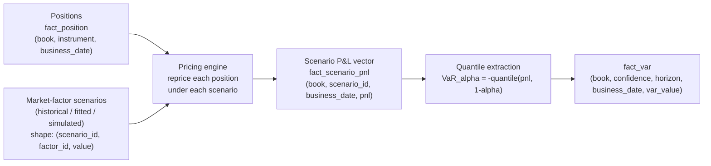

# Module 9 — Value at Risk

!!! abstract "Module Goal"
    Value at Risk (VaR) is the single number that travels from the trading desk to the board pack to the regulator every business day. Behind that number sits a multi-stage pipeline that the risk-data team owns end-to-end: market-factor scenarios, position revaluation, P&L vectors, quantile extraction, and bitemporally-loaded fact rows. This module covers VaR as data — what each of the three calculation methods needs from the warehouse, what shape the outputs take in `fact_var`, why the number does not add up across desks, how it is backtested, and where the regulatory frame is moving (FRTB and Expected Shortfall). The mathematics is treated only insofar as it constrains the data design and the audit story.

---

## 1. Learning objectives

By the end of this module, you should be able to:

- **Define** Value at Risk as a quantile of the P&L distribution at a stated confidence level and horizon, write the formal definition both as a quantile and as a tail-loss bound, and pin the sign convention used in your warehouse.
- **Compare** historical, parametric (variance-covariance), and Monte Carlo VaR by their data inputs, computational cost, modelling assumptions, and the recurring failure modes each method introduces into the warehouse.
- **Compute** one-day historical VaR and Expected Shortfall from a P&L vector, and parametric VaR for a small portfolio from a covariance matrix and a normal-quantile factor, in both closed form and Monte Carlo.
- **Distinguish** VaR from Expected Shortfall (ES / CVaR), explain why the FRTB Internal Models Approach replaced VaR with ES at 97.5%, and identify which fact tables carry each measure in a typical risk warehouse.
- **Backtest** a VaR system using the Basel traffic-light test, the Kupiec proportion-of-failures test, and the Christoffersen conditional-coverage test, and read the result alongside the operational reasons backtests fail in practice.
- **Identify** the structural reasons VaR is not additive across portfolios, locate the diversification benefit in a worked numerical example, and forward-reference the full additivity treatment in [Module 12](12-aggregation-additivity.md).
- **Specify** the grain and column set for `fact_var` (and its companion `fact_var_component`), articulate why a non-additive flag belongs in metadata, and design a query that reproduces a historical VaR submission under bitemporal restatement.

## 2. Why this matters

VaR is the single most-cited number in market risk. It sits on the front page of the daily risk pack that goes to the CRO, to the board, and to the regulator. It drives the Basel and FRTB capital calculations under the Internal Models Approach. It determines whether a desk has breached a limit and is forced to reduce risk. It anchors the conversation between the front office and risk management every morning. Almost no other warehouse output is read by as many distinct constituencies, with as many different presuppositions, as VaR — and almost no other output is as widely misunderstood. The number is a one-line summary of a five-stage pipeline, and the warehouse that produces it owns every stage.

Behind that number sits a data flow that the risk-data team is responsible for end-to-end. Positions arrive from the trade-capture system ([Module 3](03-trade-lifecycle.md)) and land on `fact_position` ([Module 7](07-fact-tables.md)). Market-factor scenarios are loaded from a historical window or generated by a model ([Module 11](11-market-data.md)). The pricing engine reprices the positions under each scenario, producing a vector of P&Ls per book. The quantile of that vector becomes the VaR. The output writes into `fact_var` at a grain that supports both the regulatory submission and the morning-after explain. If any stage is wrong — wrong scenarios, wrong revaluation, wrong P&L sign convention, wrong quantile interpolation — the VaR is wrong, and downstream nobody can see why. The pipeline is exactly as trustworthy as its weakest stage.

A second framing point. VaR has been, for over twenty years, the single most-debated risk measure in finance. It is criticised in academic circles for failing sub-additivity, blamed in some post-2008 retrospectives for the false comfort it gave during the pre-crisis period, and accused by traders of being either too conservative (when limit breaches force unwinding profitable positions) or too lenient (when a market stress prints a P&L outside the entire VaR distribution). Almost every other risk measure in the warehouse — sensitivities, stress P&L, capital — has its critics, but none has the political weight of VaR. The data team's job is not to take sides in the methodology debate; it is to produce a number that is reproducible, traceable, and consistent with the methodology document the bank has approved. When the methodology debate resolves (as it has, for FRTB, in favour of Expected Shortfall), the data team's job is to migrate the pipeline cleanly while preserving the audit trail of the prior regime. The warehouse outlives any single methodology choice; the data engineer who treats it that way builds for the next change as well as the current one.

The regulatory frame is shifting, and the warehouse needs to know it. The Basel 2.5 framework (post-2008) required banks to compute and report VaR plus a separate "stressed VaR" over a window covering a period of significant financial stress. The Fundamental Review of the Trading Book (FRTB), in its Internal Models Approach, replaced VaR with **Expected Shortfall** at the 97.5% confidence level — for the coherence reasons developed in section 3.5 below. The Standardised Approach abandons quantile-of-distribution measures entirely in favour of bucketed-sensitivity capital ([Module 8 §3.4a](08-sensitivities.md)). For most banks, the warehouse has to support both regimes during a long transition: VaR for the legacy reports and limit checks, ES for the FRTB IMA submission, FRTB SA capital from sensitivities. A risk-data team that understands all three — and the relationships between them — is in a position to keep the warehouse coherent across the transition.

## 3. Core concepts

A reading note before diving in. Section 3 builds VaR in nine sub-sections, ordered from "what is a VaR number" through "how is it computed" through "how is it backtested and audited". Sections 3.1–3.3 are the definitional layer that every reader should internalise. Sections 3.4–3.6 cover the three computational methods at the depth a data engineer needs to design loaders and reconciliation tests for each. Sections 3.7–3.9 cover the operational complications — Expected Shortfall, backtesting, decomposition — and the storage shapes that sit underneath them all. Readers comfortable with classical risk theory can skim to 3.6 for the storage discussion; readers new to VaR should read top to bottom.

### 3.1 Definition

**Value at Risk** at confidence level \(\alpha\) over horizon \(h\) is the quantile of the loss distribution at probability \(\alpha\). Two equivalent formulations:

$$
\mathrm{VaR}_\alpha(L) = \inf\{\, \ell \in \mathbb{R} \;:\; P(L \leq \ell) \geq \alpha \,\}
$$

$$
P(L \leq \mathrm{VaR}_\alpha(L)) = \alpha
$$

where \(L\) is the loss random variable over the horizon. A 99% one-day VaR of \$10M means: with 99% confidence, the loss over the next business day will not exceed \$10M; equivalently, the loss is expected to exceed \$10M on roughly one in every 100 trading days. Translating the formal statement into trader-friendly language without losing the precision matters — the regulator, the board, and the desk all hear "99% VaR is \$10M" and each forms a different mental model.

A few definitional points the warehouse must pin explicitly:

- **Sign convention.** \(L\) is the *loss* — losses are positive. Some warehouses store P&L (profits positive, losses negative) and compute VaR as the absolute value of the lower \((1 - \alpha)\)-quantile of P&L; others store loss directly and take the upper \(\alpha\)-quantile. Both produce the same number; failing to document which convention is in use produces silent sign-flip bugs at consumption time. The convention in `fact_var` should be: VaR is a positive loss number, period; the loader does the conversion at write time.
- **Horizon \(h\).** One business day for limit monitoring and most internal risk views; ten business days for Basel 2.5 and FRTB-SA capital calculation; longer for stressed-VaR variants. The warehouse stores VaR explicitly tagged with horizon — a `horizon_days` column or its equivalent — and never permits a query to compare VaRs across horizons without rescaling.
- **Confidence level \(\alpha\).** 95% for many internal management views; 99% for Basel-style regulatory VaR; 97.5% for FRTB-IMA Expected Shortfall (section 3.7); 99.9% for some economic-capital variants. The warehouse stores VaR with `confidence_level` as a column, never as part of the metric name.
- **Distribution \(P\).** The shape of the loss distribution is what the three methods (sections 3.4–3.6) construct differently. Historical VaR uses the empirical distribution from a window of past observations; parametric VaR assumes a normal (or Student-t) shape; Monte Carlo VaR samples from a fitted multivariate distribution. The shape choice is the single biggest modelling assumption, and the warehouse must record which method (and which parameters) produced each row.

!!! info "Definition: quantile"
    The **\(\alpha\)-quantile** of a distribution is the value \(q\) such that the cumulative distribution function evaluated at \(q\) equals \(\alpha\). For a discrete sample of \(n\) observations, the empirical quantile at \(\alpha = 0.99\) is approximately the value at sorted position \(\lceil 0.99 n \rceil\); the precise formula varies by interpolation rule, and numpy's `np.quantile` defaults to linear interpolation between adjacent ranks. The interpolation choice can move the VaR by 1–5% on small samples — pin the choice in the data dictionary.

### 3.2 Horizon, confidence, and scaling

The horizon and confidence pair are not independent in regulatory practice, and the warehouse must respect the conventions when storing or transforming VaR.

| Use case                          | Horizon         | Confidence    | Notes                                                                |
| --------------------------------- | --------------- | ------------- | -------------------------------------------------------------------- |
| Internal limit monitoring         | 1 business day  | 95% or 99%    | Read by desks daily; 1-day for tactical, 95% for fewer false alarms. |
| Basel 2.5 regulatory VaR          | 10 business days | 99%          | Computed from 1-day VaR via square-root-of-time scaling, typically.  |
| FRTB-IMA Expected Shortfall       | per-factor liquidity horizon | 97.5% | Liquidity horizons range 10d–250d by factor class.                |
| Economic capital / risk appetite  | 1 year          | 99.9% or 99.97% | Far-tail measures; usually computed via Monte Carlo, not historical. |

**Square-root-of-time scaling.** The simplest way to convert a 1-day VaR to a 10-day VaR is to multiply by \(\sqrt{10} \approx 3.162\). The scaling rests on three assumptions: returns are independent across days, returns are identically distributed, and returns are jointly normally distributed (so that variance scales linearly with time and standard deviation scales with the square root). The first two assumptions are violated mildly in calm markets and dramatically in stressed markets; the third is violated by every empirically-observed return distribution to some degree.

When square-root-of-time scaling breaks:

- **Gap risk.** Overnight or weekend gaps in illiquid or news-driven assets produce one-day moves that are not the sum of independent intraday moves. Scaling a 1-day VaR computed from intraday samples to a 10-day VaR will under-state the gap-risk exposure.
- **Illiquid positions.** A position that takes two weeks to unwind has its true 10-day VaR driven not by 10-day price volatility but by the path of available liquidity over those two weeks. The square-root-of-time number assumes you can mark-to-market and hold; reality is that you have to sell into an evaporating bid.
- **Mean-reversion or trending.** If returns exhibit autocorrelation (positive: trending; negative: mean-reverting), variance does not scale linearly with time. Scaling assumes zero autocorrelation.
- **Volatility clustering.** GARCH-type effects mean that a quiet one-day window understates the variance of a ten-day window that includes a vol spike. Scaling a quiet-day VaR misses the regime change.

The defensive pattern is to compute the multi-day VaR directly when it matters — using overlapping or non-overlapping multi-day return windows in historical VaR, or letting the Monte Carlo simulate the full multi-day path — rather than scaling a 1-day VaR to fit a regulatory horizon. Square-root-of-time is acceptable as a first approximation for liquid, broadly-held portfolios; it is wrong for option-heavy books, illiquid books, and any book whose dominant risk is a regime change.

### 3.3 Three methods overview

The three production approaches to VaR differ in how they construct the loss distribution. Each makes different demands on the warehouse and produces a different shape of intermediate data that must be stored if the calculation is to be reproducible.

| Method               | Loss distribution from                                | Strengths                                                | Weaknesses                                                  |
| -------------------- | ----------------------------------------------------- | -------------------------------------------------------- | ----------------------------------------------------------- |
| **Historical**       | Empirical quantile of past P&L observations           | Non-parametric; captures fat tails and observed correlations | Only as good as the window; no extrapolation beyond the worst observation. |
| **Parametric**       | Closed-form quantile of an assumed (typically normal) distribution | Fast; analytically tractable; small data footprint       | Assumes normality; fails on heavy tails and non-linear payoffs. |
| **Monte Carlo**      | Empirical quantile of simulated P&Ls from a fitted distribution | Handles non-linear payoffs and arbitrary distributions   | Computationally heavy; only as good as the fitted model.    |

A side-by-side summary table to keep these straight, with the warehouse dimension highlighted in each cell:

| Aspect                  | Historical                                | Parametric                              | Monte Carlo                                  |
| ----------------------- | ----------------------------------------- | --------------------------------------- | -------------------------------------------- |
| Distribution            | Empirical                                 | Normal (or Student-t)                   | Fitted (any)                                 |
| Scenario count          | 250 (typical)                              | n/a (closed form)                       | 10k–1M (FRTB-grade)                          |
| Compute cost            | Moderate                                  | Trivial                                 | Heavy                                        |
| Captures fat tails      | Yes (if in window)                        | No (or partially with t)                 | Yes (if in fitted model)                    |
| Captures non-linearity  | Yes (full reval)                          | No (linear approximation)                | Yes (full reval)                            |
| Reproducibility anchor  | `scenario_set_sk` → window dates          | `scenario_set_sk` → covariance matrix   | `scenario_set_sk` → seed + model parameters |
| Audit complexity        | Low                                       | Low                                     | Moderate (model parameters)                 |
| Typical use             | Basel 2.5 VaR submission                  | Desk limit monitoring                   | FRTB-IMA Expected Shortfall                 |

A practical observation on **how banks combine the methods** in production. Few large banks run a single VaR method; most run all three in parallel and use the agreement (or disagreement) as a model-risk diagnostic. The canonical setup: historical VaR is the regulatory submission for Basel 2.5; Monte Carlo Expected Shortfall is the regulatory submission for FRTB-IMA; parametric VaR is the desk-level limit-monitoring view that runs intraday because it is fast enough. The three numbers should agree to within model uncertainty under normal conditions; persistent disagreements (parametric < historical for many days running, or Monte Carlo > historical for an option-heavy book) indicate that one of the methods has stopped describing the book correctly. The warehouse's job is to store all three with their methodology metadata so the diagnostic comparison is queryable; the risk-management team's job is to interpret the disagreements and decide whether they reflect a real model issue or merely the methods' different properties.

A diagram of the common pipeline that all three feed:



Three observations on this pipeline that hold across all methods:

- **The scenario set is the most-audited intermediate.** Whether scenarios come from history (last 250 days), from a fitted model (sampled from a normal), or from a stressed-period selection (2007–2009), they must be tagged with a `scenario_set_id` and stored such that the same VaR can be reproduced from the same scenario set on a later day. The regulator will ask "which scenarios produced this VaR?" and the warehouse must be able to answer.
- **`fact_scenario_pnl` is the single largest fact in the warehouse.** For a typical bank with 1,000 books × 250 scenarios × daily updates, `fact_scenario_pnl` carries 250,000 rows per business date; for FRTB IMA with 6,000+ scenarios per business date, the row count climbs into the millions. Partition on `business_date`, cluster on `book_sk`, and document a retention policy — most jurisdictions require 5–7 years of retention, which makes scenario P&L the dominant storage cost in the risk warehouse.
- **The quantile is the cheap part.** Computing `-quantile(pnl, 0.01)` over a sorted vector is microseconds; the computational expense is in producing the vector. The warehouse should store both the quantile and the vector, so that re-asking "what was the VaR if we had used 95% instead of 99%" requires no recomputation, only a re-quantile.

### 3.3a A worked narrative — one VaR number end to end

Before unpacking the three methods, follow a single 99% 1-day historical VaR number from inputs to fact row. The exercise grounds the abstract pipeline in a concrete trace.

The book is the rates flow desk, business date 2026-05-07, currently holding 47 USD-denominated interest-rate swaps and 12 SOFR-OIS basis swaps. The position feed lands on `fact_position` overnight at 02:30 NYT. The risk run is configured for 99% 1-day historical VaR over the trailing 250 business days; the scenario set is `HIST_USD_250_2026-05-07`, identifying the 250-day window ending on 2026-05-07.

At 03:00 NYT, the historical-VaR engine starts. For each of the 250 historical days in the window, it loads the day's market-factor returns from `fact_market_data_observation` ([Module 11](11-market-data.md)) — about 200 rates-related factors per day for this book. It applies each day's returns to today's portfolio composition, repricing each of the 59 positions through the rates pricing engine. The output is 250 P&L numbers, one per historical scenario day.

At 03:45 NYT, the 250 P&L numbers write into `fact_scenario_pnl` with `scenario_set_sk` referencing `HIST_USD_250_2026-05-07`, `business_date = 2026-05-07`, `as_of_timestamp = 2026-05-08 07:45:00 UTC`. The vector ranges from a worst-case loss of \$8.2M (corresponding to the historical day 2025-08-12, a sharp Fed-pivot-related move) to a best-case gain of \$5.1M, with most days clustering in the \$0.5M-loss-to-\$0.5M-gain range.

At 03:46 NYT, the quantile-extraction step: sort the 250 P&Ls ascending, take the 1st-percentile observation (numpy's default linear interpolation between rank 2 and rank 3), take the negative for the loss convention. The result: VaR = \$3.4M. The Expected Shortfall (mean of the worst 2-3 observations) is \$5.2M. Both write into `fact_var` as a single row with `method = 'HISTORICAL'`, `confidence_level = 0.99`, `horizon_days = 1`, `var_value = 3,400,000`, `es_value = 5,200,000`, `as_of_timestamp = 2026-05-08 07:46:00 UTC`.

At 04:00 NYT, the component-VaR decomposition runs. The engine perturbs each desk's position vector by a small amount, recomputes the portfolio VaR, and infers the marginal-and-component decomposition. The 12 desks contributing to this book produce 12 rows on `fact_var_component`, with `component_var_value` summing to 3,400,000 (the parent VaR) by construction.

By 04:30 NYT, all four facts are populated and the morning consumer queries can run. The risk pack at 06:00 NYT shows the \$3.4M number; the desk-level component view shows which 3 desks account for 65% of it; the regulatory submission at month-end will pick the row with `as_of_timestamp` matching the regulatory snapshot date. Any restatement (a corrected rate, a re-classified trade) re-runs the engine and produces a new row with a later `as_of_timestamp`, leaving the original queryable for audit.

This trace is what a well-formed VaR pipeline looks like in motion: one P&L vector per business date, one VaR-and-ES row per (book, method, confidence, horizon), one component decomposition tree under it, and bitemporal append-only writes that preserve the audit story. The next four sub-sections describe how each computational method differs in producing that P&L vector; the storage shape that sits underneath is the same.

### 3.4 Historical VaR

**Historical VaR** computes the loss distribution as the empirical distribution of past P&L observations. The algorithm has four steps:

1. **Choose a historical window.** Typical choices: the last 250 business days (a calendar year), the last 500 business days, or a stressed window such as 2007–2009 (for stressed VaR — section 3.7a). The window length and selection rule are part of the methodology and must be stored.
2. **For each day in the window, construct the *return vector* of market-factor changes.** A 250-day window over a universe of 1,000 risk factors produces 250 vectors of length 1,000.
3. **For each historical day's return vector, reprice today's portfolio under those moves.** This produces a vector of 250 P&L observations — what the current portfolio would have made or lost on each historical day if those returns had happened today.
4. **Take the empirical quantile.** The 99% 1-day VaR is the negative of the 1st-percentile P&L — the loss exceeded on only the 2.5 worst-out-of-250 days.

The data shape going in:

- `fact_position` for the current book composition.
- A market-data history table (typically `dim_risk_factor_history` or `fact_market_data_observation`, see [Module 11](11-market-data.md)) for the daily factor levels.
- A returns derivation: \(r_{t,i} = \log(F_{t,i} / F_{t-1,i})\) or \(r_{t,i} = (F_{t,i} - F_{t-1,i}) / F_{t-1,i}\) depending on the convention per asset class.

The data shape coming out:

- `fact_scenario_pnl` rows, one per (book, historical_scenario_day, current_business_date) combination.
- `fact_var` row(s), one per (book, confidence_level, horizon, current_business_date, as_of_timestamp), with `method = 'HISTORICAL'` and a foreign key to the scenario set used.

A practical data-shape note on the returns derivation. The pricing engine consumes returns of risk factors, not absolute factor levels — the historical day's *change* in the SOFR curve, not the SOFR curve's level on that day. The conversion from absolute levels to returns is non-trivial for risk factors that are not naturally percentages: an interest rate that moved from 4.25% to 4.30% had a "return" of either +5bp absolute or +1.18% relative depending on the convention; an implied volatility that moved from 18% to 20% similarly. The convention is per-factor and is documented on `dim_risk_factor` ([Module 11](11-market-data.md)). A historical-VaR engine that consumes mixed conventions across factors without explicit declaration produces a P&L vector that mixes absolute and relative shocks; the resulting quantile is mathematically defined and economically incoherent. The defensive pattern: load the conversion convention from `dim_risk_factor` at run time, apply per-factor at the returns-derivation step, and include the conversion convention in the scenario-set metadata so the audit query can verify it later.

**Strengths.** The empirical distribution captures the actual joint behaviour of risk factors during the chosen window — fat tails, correlations, regime characteristics, all of it, without parametric assumptions. The method is transparent: every VaR observation traces back to a specific historical day, which makes the explain conversation with the desk straightforward ("today's VaR is driven by the move that happened on 2008-09-15 — Lehman day").

**Weaknesses.** The estimator is only as good as the window. A 250-day window that does not contain a tail event will produce a VaR that under-states the true exposure; a window that *does* contain a tail event may produce a VaR that mechanically falls off after 250 days when the tail observation rolls out of the window, producing a discontinuity unrelated to any real risk change. There is no way to extrapolate beyond the worst observation in the window — the 99.9% quantile of a 250-observation sample is the second-worst observation, period; there is no model to interpolate to a more extreme number.

A practical observation on the rolling window. The 250-day window's mechanical roll-off produces a known and recurring artefact: when a tail event from a year ago drops out of the window, the VaR drops by a measurable amount overnight, with no real change in the portfolio or in market conditions. Risk committees see this and ask "did our risk go down?" — the honest answer is no, the *measurement* of risk went down because the worst-day driver moved out of memory. Pair the historical VaR with a stressed-VaR number that uses a fixed window so the committee has a measure that does not have this artefact.

A second practical observation, on **age-weighted historical VaR**. A common refinement of the equally-weighted historical method (sometimes called the Boudoukh-Richardson-Whitelaw or BRW approach) gives more weight to recent observations and less weight to older ones, on the theory that recent volatility is more predictive of next-day volatility than year-old volatility is. The weights are typically a geometric decay \(w_t = \lambda^{T - t} (1 - \lambda) / (1 - \lambda^T)\) with \(\lambda\) around 0.99. The resulting empirical distribution is a weighted version of the equal-weight one and the quantile interpretation extends naturally. Storage implications: the warehouse must carry the weighting scheme on `dim_scenario_set` (the weights are not free parameters; they are part of the methodology), and the loader must apply them at the quantile step, not at any earlier stage. An equal-weighted VaR re-weighted at the BI layer is *not* the same as a properly-weighted VaR, because the quantile of the weighted distribution is not the weighted quantile of the unweighted distribution.

A third observation, on **filtered historical simulation (FHS)**. The most aggressive of the historical-method refinements: use a GARCH-type volatility model to standardise each day's return by its conditional vol, take the empirical distribution of the standardised residuals, and then re-scale the residuals by the *current* conditional vol estimate to produce the simulated returns for today. The procedure decouples the empirical distribution shape (preserved from history) from the volatility level (driven by the current model). FHS is in production use at several large banks for FRTB-IMA and is the answer to the criticism that pure historical VaR is slow to react to vol regime changes. Data implications are substantial: `fact_scenario_pnl` must carry the residual *and* the vol-rescale factor, the model parameters must be persisted on `dim_scenario_set`, and the methodology requires governance approval as a parametric overlay on the otherwise-non-parametric historical method. Most warehouses that adopt FHS run it in parallel with plain-vanilla historical VaR for at least a year of model-validation comparison.

### 3.5 Parametric (variance-covariance) VaR

**Parametric VaR** assumes that portfolio returns are jointly normally distributed and computes the VaR analytically from the portfolio standard deviation and the appropriate normal quantile.

For a single asset, the formula is:

$$
\mathrm{VaR}_\alpha = z_\alpha \cdot \sigma \cdot V
$$

where \(z_\alpha\) is the standard-normal quantile at confidence \(\alpha\) (\(z_{0.99} \approx 2.326\), \(z_{0.95} \approx 1.645\)), \(\sigma\) is the standard deviation of returns over the horizon, and \(V\) is the portfolio value.

For a multi-asset portfolio, the per-asset volatilities and pairwise correlations are encoded in a covariance matrix \(\Sigma\), and the portfolio variance is computed quadratically:

$$
\sigma_p^2 = \mathbf{w}^\top \Sigma \mathbf{w}
$$

where \(\mathbf{w}\) is the vector of position weights. The portfolio VaR is then \(z_\alpha \cdot \sigma_p \cdot V\). Section 4 walks through the two-asset case in code.

**The covariance matrix.** \(\Sigma\) is the central data input to parametric VaR. Each diagonal entry is a variance \(\sigma_i^2\); each off-diagonal entry is a covariance \(\rho_{ij} \sigma_i \sigma_j\). The matrix is usually estimated from the same historical window as historical VaR, and the same window-rolloff considerations apply. The matrix must be positive semi-definite (any covariance matrix is, in theory; sample-estimated matrices sometimes fail the test due to numerical noise or insufficient data — section 4 example 2 uses a Cholesky factorisation that will fail loudly on a non-PSD input, which is the desired behaviour).

**Cholesky and eigendecomposition.** Two factorisations of \(\Sigma\) recur in production. The Cholesky decomposition writes \(\Sigma = L L^\top\) with \(L\) lower triangular; it is the natural input to a Monte Carlo simulator that draws correlated normals from i.i.d. normals. The eigendecomposition writes \(\Sigma = Q \Lambda Q^\top\) with \(Q\) orthogonal and \(\Lambda\) diagonal; it is the natural input to principal-component-style risk decompositions and to "fix" non-PSD matrices by clipping negative eigenvalues to zero. Most production parametric-VaR engines use Cholesky for the simulation path and eigendecomposition for the decomposition / diagnostics path.

**Strengths.** Fast — closed-form for a single asset, a single matrix multiply for a portfolio. Small data footprint — \(O(n^2)\) for the covariance matrix versus \(O(n \cdot T)\) for a historical-simulation panel. Analytically tractable, which makes diagnostics (component VaR, marginal VaR) straightforward.

**Weaknesses.** The normality assumption fails empirically — financial returns exhibit fatter tails than normal, especially at the daily horizon. The method understates the probability of extreme moves; a 99% parametric VaR on a fat-tailed asset typically corresponds to something closer to 95–97% of the empirical distribution. The method is also blind to non-linear payoffs: an option's P&L is not a linear function of the underlying's return, and feeding option deltas into a parametric-VaR formula understates the risk by the amount of the gamma exposure. The "delta-only" parametric VaR, in particular, is acknowledged across the industry as inadequate for option books and is one of the historical drivers of the move to Monte Carlo and historical-simulation approaches.

A small worked example to make the matrix arithmetic concrete. Two assets, vols 15% and 20% annually, correlation 0.30, equal weights of \$5M each (so \$10M portfolio):

- \(\sigma_A^2 = 0.0225\), \(\sigma_B^2 = 0.04\), \(\rho \sigma_A \sigma_B = 0.30 \cdot 0.15 \cdot 0.20 = 0.009\).
- Covariance matrix (annual): \(\Sigma = \begin{pmatrix} 0.0225 & 0.009 \\ 0.009 & 0.04 \end{pmatrix}\).
- Weight vector \(\mathbf{w} = (0.5, 0.5)\). Portfolio variance \(\mathbf{w}^\top \Sigma \mathbf{w} = 0.25 \cdot 0.0225 + 0.25 \cdot 0.04 + 2 \cdot 0.25 \cdot 0.009 = 0.005625 + 0.01 + 0.0045 = 0.020125\).
- Annual standard deviation \(\sigma_p = \sqrt{0.020125} \approx 0.142\); 1-day standard deviation \(\sigma_p \cdot \sqrt{1/252} \approx 0.00894\); 1-day 99% VaR = 2.326 × 0.00894 × 10,000,000 = \$207,948.

Now flip the correlation to \(-0.30\) (negative correlation, the diversification-friendly case): the off-diagonal becomes \(-0.009\); portfolio variance becomes \(0.005625 + 0.01 - 0.0045 = 0.011125\); \(\sigma_p \approx 0.1054\); 1-day 99% VaR ≈ \$154,500. The negative correlation cut the VaR by 26% versus the positive-correlation case. This is the diversification benefit in algebra, made visible by the off-diagonal sign flip in the covariance matrix. Section 4 example 2 produces a similar number from a Cholesky-driven Monte Carlo, by way of cross-check.

A note on the parametric approach's quiet survival in production. Despite the well-known weaknesses, parametric VaR remains the most common method for desk-level limit monitoring (where speed matters and the portfolio is mostly linear), for first-cut sensitivity analyses (where the analyst wants a number in seconds, not minutes), and for the analytic decompositions of section 3.9. Most banks run parametric VaR in parallel with historical or Monte Carlo and use the disagreement between the methods as a risk-model diagnostic. Large persistent gaps mean either the parametric assumption is breaking down (heavy tails or non-linearity in the book) or the historical window has gone stale.

**The Student-t extension.** A common middle ground between strict normality and full empirical historical methods is to fit a multivariate Student-t distribution rather than a multivariate normal. The Student-t with degrees of freedom \(\nu\) has heavier tails than the normal — \(\nu = 5\) is a typical fit for daily equity-index returns, \(\nu = 7\)–\(10\) for FX returns, \(\nu = 4\) for commodity returns. The closed-form quantile of a univariate Student-t is tractable; the multivariate case is more involved but standard. Storage implications: `dim_scenario_set` carries the fitted \(\nu\) along with the covariance matrix, and the loader applies the right quantile factor (which for \(\nu = 5\) at 99% is about 3.36 versus the normal's 2.326 — a 44% larger VaR for the same vol). The Student-t is the simplest principled answer to the "fat tails" critique of parametric VaR and is in widespread production use.

**The covariance matrix in production.** Three operational considerations on the matrix itself:

- **Estimation window.** Common choices: 1 year of daily data (250 observations) for stable books, 6 months (125 observations) for fast-moving regimes, exponentially-weighted moving average (RiskMetrics-style, \(\lambda \approx 0.94\)) for adaptive estimation. The window is part of the methodology and must be persisted on `dim_scenario_set`.
- **Shrinkage.** The sample covariance matrix is unbiased but high-variance; for high-dimensional risk-factor sets (FRTB-grade) the sample matrix is often singular or near-singular. Ledoit-Wolf shrinkage blends the sample matrix with a structured target (typically the identity scaled by average variance, or a one-factor model) to produce an estimate that is regular and lower-variance at the cost of a small bias. Most modern parametric-VaR engines use shrinkage; the shrinkage parameter goes on `dim_scenario_set` along with the underlying matrix.
- **Update cadence.** Recomputing the matrix daily is the default; some shops use a weekly or monthly cadence with daily *adjustments* via a faster-running univariate volatility model. The cadence choice trades off responsiveness (daily catches regime changes faster) against stability (weekly produces less volatile VaR numbers and avoids "VaR jumped because a single observation entered the matrix" conversations).

The covariance matrix is the parametric method's single most-audited input. A regulator's reproducibility request for a parametric VaR essentially reduces to "show me the matrix you used and the fitting window it came from"; if those are stored cleanly the rest of the calculation is a deterministic algebra.

### 3.6 Monte Carlo VaR

**Monte Carlo VaR** simulates a large number of synthetic market-factor scenarios from a fitted distribution, reprices the portfolio under each, and takes the empirical quantile of the simulated P&L vector. The algorithm has five steps:

1. **Fit a model to historical market-factor data.** Typically a multivariate normal with mean and covariance estimated from a recent window; sometimes a multivariate Student-t, a copula, or a more complex stochastic-vol or jump-diffusion model.
2. **Generate \(N\) synthetic scenarios from the fitted model.** \(N\) is typically in the 10,000 to 1,000,000 range; FRTB-IMA practice is at the higher end.
3. **For each scenario, reprice the portfolio under the simulated market factors.** This is the computational bottleneck — \(N\) full revaluations across thousands of positions.
4. **Take the empirical quantile of the simulated P&L vector.** Identical to historical VaR's step 4, just over a larger and synthetically-generated sample.
5. **Persist the scenario set, the seed, and the model parameters** so the same VaR can be reproduced.

The data shape going in:

- A fitted-model parameter set: means, covariance matrix, distribution family, fitting window.
- A pseudo-random number generator with a persistent seed.

The data shape coming out:

- A `fact_scenario_pnl` table at the same grain as historical VaR, but with `scenario_set_id` referring to a Monte Carlo scenario set rather than a historical window.
- A `fact_var` row with `method = 'MONTE_CARLO'` and a foreign key to the scenario set.

A practical observation on the **fitting window** for the Monte Carlo model. The fitted distribution's parameters (means, covariance matrix, possibly higher moments) come from the same kind of historical window the historical method uses. Common choices: 1 year of daily data with equal weights, 1 year with exponential weighting (RiskMetrics, \(\lambda \approx 0.94\)), or a longer 3-5 year window for the structural parameters of a more complex model (regime-switching, GARCH-on-vol). The window length and weighting scheme are part of the methodology and must be persisted on `dim_scenario_set`. A common operational mistake: re-running the Monte Carlo VaR with a refreshed model after a vol regime change without flagging the methodology change in the scenario-set metadata. The new VaR number is correct under the new model but is not directly comparable to the prior VaR series; the discontinuity in the time series of VaR will confuse the morning consumer if not flagged.

**Strengths.** Handles non-linear payoffs natively — every option in the book is repriced under each scenario, and gamma, vega, and higher-order effects come through automatically. Handles arbitrary distribution shapes — once you can sample from the model, you can simulate. Extends to multi-period scenarios (path-dependent options, exotic structured products) where neither historical nor parametric is well-defined.

**Weaknesses.** Computationally expensive — running 100,000 scenarios across 10,000 positions is on the order of a billion pricing calls, which dominates the warehouse's overnight compute budget. Only as good as the fitted model — a Monte Carlo VaR built on a normal-distribution assumption inherits the same fat-tail under-statement as parametric VaR, just dressed up in 100,000 simulated paths. Reproducibility requires explicit seed and parameter persistence; "we ran 100k Monte Carlo scenarios and got VaR = X" is unverifiable a year later if the seed wasn't stored.

A practical observation on **variance reduction**. Monte Carlo VaR at a fixed path budget can be sharpened by classical variance-reduction techniques: **antithetic variates** (for each path \(\mathbf{x}\), also use \(-\mathbf{x}\); the mean of the pair has lower variance than the standalones), **stratified sampling** (partition the input distribution into equal-probability strata and draw one path per stratum), and **importance sampling** (draw paths preferentially from the tail and reweight). The first two are essentially free and should be on by default in any modern Monte Carlo VaR engine; the third requires a fitted importance distribution and is more involved. Variance reduction does not change the answer, only the standard error of the estimator at a given path count; the warehouse audit story is the same regardless. The data-team observable: a Monte Carlo engine that achieves comparable accuracy to a competitor at half the path count is probably using better variance reduction, and the methodology document should make clear which techniques are in play.

A second observation on **quasi-random / low-discrepancy sequences**. Sobol' and Halton sequences are deterministic alternatives to pseudo-random draws that fill the unit hypercube more uniformly. For high-dimensional integrals over smooth functions, quasi-Monte Carlo converges as \(O((\log N)^d / N)\) rather than the pseudo-Monte Carlo \(O(1/\sqrt{N})\); for tail-quantile estimation the advantage is more modest because the quantile is sensitive to the worst few paths and not to the bulk of the distribution. Some FRTB-IMA engines use Sobol' for the body of the distribution and switch to importance-sampled pseudo-random draws for the tail; the warehouse must persist enough state to reproduce both segments, which means the scenario-set metadata grows accordingly. Most banks use straightforward pseudo-random Monte Carlo with antithetic variates in production and reserve quasi-random methods for diagnostic tools and one-off analyses.

A practical observation on Monte Carlo and the warehouse. The Monte Carlo scenario set is an *artefact* of the calculation, not a property of the world — running it again with a different seed produces a different (but statistically similar) VaR. The warehouse's bitemporal-load discipline ([Module 7 §3.4](07-fact-tables.md)) needs a small extension here: a re-run of Monte Carlo VaR with a new seed for the same business date is *not* a restatement of the original number, it is a new measurement of the same population parameter. Convention: persist both runs as separate `as_of_timestamp` values, document the seed change in `compute_method_metadata`, and let the consumer pick the canonical one. The "current view" query for Monte Carlo VaR should typically return the most recent run; the audit query should return the run associated with the regulatory submission.

### 3.7 Expected Shortfall (ES / CVaR)

**Expected Shortfall**, also known as **Conditional Value at Risk (CVaR)** or **Tail VaR**, is the average loss conditional on the loss exceeding the VaR threshold:

$$
\mathrm{ES}_\alpha(L) = E[\, L \;|\; L \geq \mathrm{VaR}_\alpha(L) \,]
$$

Equivalently, ES is the average over the worst \((1 - \alpha)\) fraction of the loss distribution. For a discrete sample of \(n\) observations with \(\alpha = 0.99\), the 99% ES is the mean of the worst \(\lceil 0.01 n \rceil\) losses. The ES is always at least as large as the VaR, and typically larger by a factor that reflects the thickness of the tail beyond the quantile (for a normal distribution, the 99% ES is about 1.15 × the 99% VaR; for fat-tailed empirical distributions the ratio is larger, often 1.2–1.5).

**Why FRTB moved from VaR to ES.** Two reasons drive the shift:

- **VaR is insensitive to the magnitude of losses beyond the threshold.** A portfolio whose 1% tail consists of losses just slightly above VaR has the same VaR as a portfolio whose 1% tail consists of catastrophic losses an order of magnitude larger. ES distinguishes them; VaR does not. For regulators concerned with capital adequacy in extreme scenarios, this is not an academic point.
- **VaR is not a coherent risk measure; ES is.** *Coherence* in the sense of Artzner, Delbaen, Eber, and Heath (1999) requires four properties: monotonicity, translation invariance, positive homogeneity, and **sub-additivity**. Sub-additivity means \(\rho(X + Y) \leq \rho(X) + \rho(Y)\) — combining two portfolios cannot produce a risk measure larger than the sum of the standalones (the "diversification benefit"). VaR violates sub-additivity in general; specific counter-examples exist for which VaR(A+B) > VaR(A) + VaR(B). ES satisfies sub-additivity for any distribution. The full coherence story is the subject of [Module 12](12-aggregation-additivity.md); the takeaway here is that ES has a mathematical guarantee that VaR does not.

**Why FRTB chose 97.5% instead of 99%.** The shift from VaR-99% to ES-97.5% was calibrated to produce a similar capital number under typical conditions while moving to a measure with the better mathematical properties. ES at 97.5% averages over the worst 2.5% of outcomes; VaR at 99% looks at the boundary of the worst 1%. For a normal distribution, the two numbers are approximately equal; for a fat-tailed distribution, ES-97.5% is somewhat larger than VaR-99%. The calibration was deliberate — regulators wanted the move to ES to be a *qualitative* improvement in the risk measure, not a *quantitative* increase in capital that would have made the transition politically difficult.

A picture of the relationship between VaR and ES on the loss distribution, suitable for the morning explain to a non-technical audience. The diagram shows a stylised P&L histogram with the lower tail to the left (losses) and the body and upper tail to the right (small losses and profits). The 99% VaR is the boundary between the worst 1% and the best 99%; the 99% ES is the average of the bars in the worst 1%.

```text
                        P&L distribution (frequency)
                                            #####
                                          ##########
                                       ################
                                     ###################
                                  ##########################
                            #################################
                       ######################################
                    ##############################################
                #####################################################
       ###  ##########################################################
   ## ###############################################################
   ----------|--------|----------|--------------------|----------> P&L
       worst   ES     VaR        median             best
       (1%)   (mean   (1%
              of      quantile)
              tail)
       <----- losses ----- 0 ----- profits ----->
       VaR is the threshold; ES is the average loss given threshold breached.
```

The visual point is that VaR ignores everything to the left of the threshold (the depth of the tail), while ES averages over it. Two distributions with the same VaR can have very different ES values if one has a fat tail and the other has a thin tail beyond the threshold. This is the core motivation for the FRTB shift to ES — and the reason the ES/VaR ratio is the practitioner's go-to diagnostic for tail thickness.

**Storage in the warehouse.** ES is typically stored alongside VaR on the same `fact_var` row — the same scenario set produces both, and computing ES from a P&L vector once VaR is known is essentially free (one array slice and one mean). The schema can carry both `var_value` and `es_value` columns on the same row, with a `confidence_level` that applies to both, or it can carry separate rows distinguished by a `metric_type` column. The choice is a stylistic one; the substantive constraint is that VaR and ES must come from the *same* scenario set and *same* run, never combined across runs.

```sql
-- Combined VaR + ES on a single row of fact_var.
CREATE TABLE fact_var (
    var_sk             BIGINT       NOT NULL PRIMARY KEY,
    book_sk            INTEGER      NOT NULL,
    business_date      DATE         NOT NULL,
    as_of_timestamp    TIMESTAMP    NOT NULL,
    method             VARCHAR(16)  NOT NULL,    -- 'HISTORICAL', 'PARAMETRIC', 'MONTE_CARLO'
    confidence_level   DECIMAL(5,4) NOT NULL,    -- 0.9900, 0.9750, etc.
    horizon_days       INTEGER      NOT NULL,    -- 1, 10, ...
    scenario_set_sk    INTEGER      NOT NULL,    -- FK to dim_scenario_set
    currency_sk        INTEGER      NOT NULL,    -- reporting currency
    var_value          DECIMAL(20,2) NOT NULL,   -- positive loss number
    es_value           DECIMAL(20,2),             -- positive loss number; NULL only if not computed
    n_observations     INTEGER      NOT NULL,    -- size of the underlying P&L vector
    is_additive        BOOLEAN      NOT NULL DEFAULT FALSE,    -- always FALSE; documented as such
    UNIQUE (book_sk, method, confidence_level, horizon_days,
            business_date, as_of_timestamp)
);
```

Two notes on this schema:

- **`is_additive` is always FALSE and is on the schema deliberately.** The flag exists to make the non-additivity property visible in the schema metadata layer, so that BI tools that auto-generate aggregations pick it up and refuse to SUM `var_value` across rows. An equivalent pattern is to include the additivity classification on `dim_metric_type` and let consumers join through to pick it up. Either way, the warehouse's own metadata declares VaR as non-additive — see section 3.8 and [Module 12](12-aggregation-additivity.md).
- **The grain explicitly includes `method`, `confidence_level`, and `horizon_days`.** A book may carry several VaR rows for the same business date — one per method, one per confidence level, one per horizon. Each is a distinct measurement and must be queried with all the dimensional predicates pinned.

### 3.7a Stressed VaR

**Stressed VaR** is the same algorithm as historical VaR — empirical quantile of past P&L observations — applied over a *fixed* historical window covering a period of significant financial stress. The Basel 2.5 framework introduced stressed VaR after the 2008 crisis when regulators observed that the rolling-window historical VaR had sharply *under*-stated risk during the calm pre-crisis years (2004–2006) precisely because the window did not contain stress observations.

Two operational distinctions from rolling-window VaR:

- **Window selection is part of the methodology.** Most banks use 2007–2009 (the GFC) or 2008–2009 (the post-Lehman acute stress), or in some regional setups a localised stress (the 2011 European debt crisis, 2015 China devaluation, 2020 COVID-19 shock). The choice is documented in the bank's risk methodology and approved by the regulator; it is not a tunable parameter that the data team can change without governance.
- **The window does not roll.** Stressed VaR is computed against the same historical period every business date, year after year. The "today" is whatever the current portfolio composition is; the historical observations are fixed. The result: stressed VaR responds to changes in the *book*, not to changes in the *world*, which is exactly the property regulators wanted.

Storing stressed VaR alongside ordinary VaR is straightforward — same fact, different `scenario_set_sk` referencing a fixed-window scenario set rather than a rolling-window one. The pitfall to avoid: using the *same* `scenario_set_sk` for both VaR and stressed VaR. If the rolling window happens to cover the stress period, the two numbers will be identical; if it does not, the SVaR query that uses the rolling window will silently produce a non-stressed number labelled as stressed. Different `scenario_set_sk` values, different `dim_scenario_set` rows with different metadata — keep them apart in the dimensional model.

A practical observation on stressed-VaR window selection at the methodology layer. The Basel 2.5 text requires the stressed window to cover "a period of significant financial stress relevant to the bank's portfolio". Two interpretations have emerged in supervisory practice: (a) a fixed historical period such as 2007-2009 used by all banks regardless of book composition, and (b) a portfolio-specific period selected by maximising the SVaR over candidate one-year windows in the bank's historical archive. Approach (a) is administratively simpler and produces comparable numbers across banks; approach (b) is methodologically more defensible (the "stress" should reflect the actual portfolio's worst experience) but requires governance approval of the selection algorithm and quarterly re-validation that the chosen window is still the right one. Most banks landed on approach (a) for regulatory simplicity and run approach (b) internally as a diagnostic. The data team's role is to support both: `dim_scenario_set` carries a `selection_method` field documenting how the window was chosen, and the loader respects whatever the methodology document specified.

### 3.8 Why VaR is non-additive

The classic counter-example. Two portfolios A and B, each with VaR = \$1M at 99% confidence. The naive expectation is that the combined portfolio A+B has VaR up to \$2M (no diversification) or possibly less (some diversification). The actual VaR of A+B is \$1.5M — less than \$2M, consistent with diversification. So far, so good.

Now construct a different example. Two portfolios C and D, where C is "long protection on bond X (gain if X defaults)" and D is "short protection on bond X (loss if X defaults)". Each has a VaR computed under a model where the bond defaults with low probability — say VaR(C) = \$1M, VaR(D) = \$1M. The combined portfolio C+D has *zero* exposure to a default of X; its VaR is much smaller, perhaps zero. Diversification works, sub-additivity holds.

Construct yet a third example, harder. Two portfolios E and F whose returns are negatively correlated under most market conditions but synchronously bad in tail scenarios. For an everyday return pattern, VaR(E) = VaR(F) = \$1M and VaR(E+F) is somewhat less — diversification looks fine. But under a tail scenario where the negative correlation breaks and both portfolios lose simultaneously, the combined loss can be larger than either standalone loss. Depending on the precise distribution shape, it is possible to construct E and F such that VaR(E+F) > VaR(E) + VaR(F) — VaR fails sub-additivity, *more risk together than apart*.

A more accessible construction without invoking the full Artzner machinery. Consider two single-name credit portfolios A and B, each holding a long-protection position on a different reference name with default probability 0.7% per year (i.e., the credit will default with probability 0.7% over the VaR horizon). The 99% VaR of each standalone portfolio is *zero* — the worst 1% of outcomes does not include a default (which happens 0.7% of the time, less than the 1% threshold). Now combine A and B. The combined portfolio loses if *either* name defaults; the probability of at least one default is approximately 1.4%. The 99% VaR of the combined portfolio is *non-zero* — it captures the loss from a single default. So VaR(A) + VaR(B) = 0 + 0 = 0, but VaR(A+B) > 0. Sub-additivity fails: combination produces *more* measured risk than the standalone sum. The example is somewhat contrived (the standalone VaRs hide a real risk by sitting in a non-tail position), but it illustrates the mechanism: VaR is a quantile, quantiles do not add, and combining distributions can shift mass across the threshold in ways that produce paradoxical aggregate outcomes.

The concrete construction is technical (Artzner et al. give an example with binary credit-default-style payoffs) and the worked-out arithmetic belongs in [Module 12](12-aggregation-additivity.md), which treats sub-additivity, coherence, and the additivity story for every risk measure used in the warehouse. The takeaway here, for VaR specifically:

- **VaR is not in general sub-additive.** \(\mathrm{VaR}(A + B)\) can exceed \(\mathrm{VaR}(A) + \mathrm{VaR}(B)\) for specific distributions of \(A\) and \(B\). The cases where it does are not pathological — they include realistic concentration-risk and credit-default-style payoffs.
- **Therefore VaR cannot be safely SUMmed.** A "firmwide VaR" computed as \(\sum_i \mathrm{VaR}(\text{book}_i)\) may understate (in the typical diversification case) or overstate (in the sub-additivity-violation case) the true firmwide VaR. The right answer is to compute VaR directly at the firmwide grain — running the historical or Monte Carlo simulation against the firmwide P&L vector, not summing per-book numbers.
- **The warehouse must enforce this.** The `is_additive = FALSE` flag on `fact_var` (or the equivalent metadata classification) is the schema-level statement of "do not SUM this column across rows". The BI layer should refuse, the documentation should warn, the data dictionary should be explicit, and the morning risk-pack template should never construct a firmwide number by summation.

The diversification benefit shows up in the comparison \(\mathrm{VaR}(A + B) - \min(\mathrm{VaR}(A) + \mathrm{VaR}(B), \text{some upper bound})\) — when sub-additive, the combined VaR is less than the sum, and the difference is the diversification benefit; when super-additive (the ugly case), there is no diversification benefit and combination makes things worse. Section 3.9 takes the *correct* additive decomposition — component VaR — which sums by construction.

### 3.9 Component, marginal, and incremental VaR

Three closely-related decompositions appear in production VaR systems. They answer different questions and have different mathematical properties.

**Marginal VaR** of position \(i\) is the partial derivative of portfolio VaR with respect to a small increase in position \(i\):

$$
\mathrm{MVaR}_i = \frac{\partial \mathrm{VaR}_p}{\partial w_i}
$$

It answers "if I add one more unit of position \(i\), how much does the portfolio VaR change?" It is a per-position number with units of VaR-per-unit-position, useful for marginal hedging decisions.

**Component VaR** of position \(i\) is the marginal VaR multiplied by the current position size:

$$
\mathrm{CVaR}_i = \mathrm{MVaR}_i \cdot w_i
$$

By Euler's theorem on positively-homogeneous functions (and VaR is positively homogeneous in position size), component VaRs sum to the portfolio VaR:

$$
\sum_i \mathrm{CVaR}_i = \mathrm{VaR}_p
$$

This is the *only* additive decomposition of VaR. It answers "what fraction of the portfolio VaR is attributable to position \(i\)?" — and for any partition of positions into desks or sub-portfolios, the component VaRs of the partition sum to the portfolio VaR by construction. The desk-level component VaRs sum to the firmwide VaR; the standalone desk VaRs do not.

**Incremental VaR** of position \(i\) is the difference between the portfolio VaR with and without position \(i\):

$$
\mathrm{IVaR}_i = \mathrm{VaR}_p - \mathrm{VaR}_{p \setminus i}
$$

It answers "if I removed position \(i\) entirely, how much would the portfolio VaR change?" — the *non-marginal* version of the same idea. Incremental VaRs do *not* sum to the portfolio VaR (they would only if VaR were additive, which it is not). Incremental VaR is more expensive to compute than marginal or component (each one requires re-running VaR with a position removed) and is typically used for big-move decisions like exiting an entire desk, where the small-bump assumption underlying marginal VaR is inappropriate.

Storage in the warehouse. Marginal and component VaR are typically stored together in `fact_var_component`, at a finer grain than `fact_var`:

```sql
CREATE TABLE fact_var_component (
    var_component_sk     BIGINT       NOT NULL PRIMARY KEY,
    var_sk               BIGINT       NOT NULL,    -- FK to fact_var (the parent VaR row)
    position_sk          INTEGER      NOT NULL,    -- or book_sk, depending on grain
    business_date        DATE         NOT NULL,
    as_of_timestamp      TIMESTAMP    NOT NULL,
    marginal_var_value   DECIMAL(20,6) NOT NULL,    -- per-unit-position
    component_var_value  DECIMAL(20,2) NOT NULL,    -- positive loss; sums to fact_var.var_value
    is_additive          BOOLEAN      NOT NULL DEFAULT TRUE,
    UNIQUE (var_sk, position_sk)
);
```

Two notes on this schema:

- **`is_additive = TRUE` is the right value here.** Component VaR is the additive decomposition; SUMming component_var_value across rows partitioned by any sub-set of positions gives a meaningful number — the contribution of those positions to the parent VaR. The schema metadata says so explicitly.
- **The grain is per-position (or per-book, or per-asset-class) within a parent VaR row.** The choice depends on the consumer. Desk-level component VaR for the morning risk pack is at desk grain; per-trade component VaR for trader feedback is at trade grain. Most warehouses store the finest grain the engine produces and aggregate up via views.

Incremental VaR is rarely stored as a fact because it is computed on demand for specific scenarios (exiting a desk, restructuring a book) rather than continuously. When stored, it sits on a separate table (or carries a `decomposition_type` enum on the same fact) — never mixed with component VaR, because the additivity properties are different.

A practical pattern for component VaR at scale. Computing component VaR exactly via the marginal-derivative formula requires \(n\) re-runs of the VaR engine for \(n\) positions (one perturbation each), which scales poorly. Two production short-cuts are common. First, the **expected-tail-contribution** estimator computes component VaR as the average per-position P&L over the worst \((1 - \alpha)\) fraction of scenarios — a non-parametric estimator that requires no re-runs and is exact in the limit of infinite scenarios. Second, the **reuse-of-Greeks** estimator reuses the per-position delta-and-gamma profile against the scenario-set vol structure to approximate the component decomposition algebraically. The first is more accurate; the second is faster. Most production warehouses use the first when the scenario count is large enough (it is for FRTB-IMA Monte Carlo) and the second otherwise. The choice is documented on `dim_scenario_set` and the consumer can verify which estimator produced their numbers.

A note on the **interpretation** of component VaR. A negative component VaR is meaningful — it represents a position that *reduces* portfolio risk (typically a hedge that pays off in the same scenarios where the rest of the book loses). Naive readers sometimes interpret a negative component VaR as a data error and "correct" it to zero or to absolute value; both are wrong. The negative number is the diversification credit the position is bringing to the book, and removing it (the incremental-VaR test) would *increase* the portfolio VaR. The data dictionary should explicitly call out that `component_var_value` can be negative and that negative values are economically informative, not data-quality alerts.

### 3.10 Storage shapes and bitemporality

Pulling section 3.7's `fact_var` and section 3.9's `fact_var_component` together, the canonical warehouse view of VaR carries three closely related facts plus their dimensional context:

| Fact                       | Grain                                                                                 | Carries                                            |
| -------------------------- | ------------------------------------------------------------------------------------- | -------------------------------------------------- |
| `fact_scenario_pnl`        | (book, scenario_id, scenario_set, business_date, as_of_timestamp)                     | The repriced P&L per scenario — the largest fact.  |
| `fact_var`                 | (book, method, confidence, horizon, business_date, as_of_timestamp)                  | VaR + ES values from the parent P&L vector.        |
| `fact_var_component`       | (var_sk, position_or_book, business_date, as_of_timestamp)                            | Marginal + component VaR; sums to `fact_var.var_value`. |

The dimensional companions:

| Dimension              | Role                                                                                            |
| ---------------------- | ----------------------------------------------------------------------------------------------- |
| `dim_scenario_set`     | Identifies the scenario universe used: historical window dates, Monte Carlo seed and parameters, stressed-VaR window. |
| `dim_book`             | The book the VaR describes; carries the org-hierarchy slot for desk/division/firm rollups.       |
| `dim_currency`         | Reporting currency (typically the firm's reporting currency, e.g. USD).                         |
| `dim_metric_type`      | Lookup carrying the additivity flag, the unit of measure, and the canonical name for each metric. |

A note on **`fact_scenario_pnl`'s role as the warehouse's reproducibility anchor**. Every VaR number on `fact_var` is derived from a P&L vector on `fact_scenario_pnl`. Persisting the vector means that "show me the VaR you reported on date X" is answerable directly (look up `fact_var`); "show me the calculation that produced it" is answerable by joining to `fact_scenario_pnl` filtered by the same `scenario_set_sk`; and "show me how it would have changed if we had used 95% instead of 99%" is answerable by re-quantiling the stored vector without re-running the pricing engine. The audit story collapses to three table joins and is the single most-valuable property of the warehouse for any regulator-facing conversation. Skimping on `fact_scenario_pnl` retention to save storage cost is the first thing to *not* do; the audit reconstruction it supports is worth the disk.

A worked example of the storage cost. A bank with 1,500 books, computing 99% historical VaR daily over a 250-day window, generates 1,500 × 250 = 375,000 rows of `fact_scenario_pnl` per business date for the historical method alone. Add a Monte Carlo VaR with 10,000 paths: 1,500 × 10,000 = 15,000,000 rows per business date. Add FRTB-IMA Expected Shortfall over 6,000 paths across multiple liquidity horizons: 1,500 × 6,000 × 5 (horizons) = 45,000,000 rows. At seven years of retention (the typical regulatory minimum) this is on the order of \(10^{11}\) rows of `fact_scenario_pnl` total, which is several orders of magnitude larger than `fact_position` and is the dominant storage cost in the risk warehouse. The partitioning and clustering choices matter accordingly.

A typical layout in a columnar engine for `fact_scenario_pnl`:

- **Partition key**: `business_date`. Daily partitions match the load and query patterns; pruning is automatic for any date-restricted query.
- **Cluster keys**: `(book_sk, scenario_set_sk)`. Most queries either drill into a single book (the morning explain) or aggregate across books at firmwide grain (the regulatory submission); both benefit from clustering on `book_sk`.
- **Compression**: standard columnar with appropriate dictionary encoding. The `pnl` column is high-cardinality numeric and resists deep compression; the dimensional FK columns compress to near-trivial space.
- **Retention**: hot storage for the most recent 90 days (frequent re-query for the morning pack and ad-hoc explains), warm for 1 year (occasional re-query for trending and audit), cold archive for 5–6 years (regulatory retention, queried only on demand). Most warehouses run a tiered storage policy that moves partitions across tiers automatically.

Bitemporal load discipline applies in full ([Module 7 §3.4](07-fact-tables.md), [Module 13](13-time-bitemporality.md)). Two patterns specific to VaR:

- **Restatements happen often.** Market-data corrections, position-feed late arrivals, pricing-engine bug fixes — any of these can trigger a re-run of VaR for a prior business date. The warehouse must accept the new rows under a new `as_of_timestamp`, leave the original rows queryable, and let the consumer pick. The "latest as-of" view is the morning consumer's default; the "as-known-on-date-X" view is the regulator's default.
- **Monte Carlo re-runs are not restatements.** A re-run of Monte Carlo VaR with a new seed produces a statistically different number with the same input information. The warehouse should distinguish the two cases — a true restatement (a fix to underlying data or methodology) versus a re-sample (a new draw with the same model) — via metadata on `dim_scenario_set` or via a `compute_method_metadata` JSON column. Auditing a re-sample as if it were a restatement leads to inappropriate change-management overhead; auditing a restatement as if it were a re-sample leads to the audit trail not telling the truth.

A note on **`dim_metric_type` as a controlled vocabulary**. The metric-type dimension is the place where the warehouse documents which measures exist, what units they are in, what the additivity classification is, and what the canonical aggregation rule is for each. A typical row: `metric_type_sk = 1`, `metric_name = 'VAR'`, `unit = 'CURRENCY'`, `is_additive = FALSE`, `aggregation_rule = 'COMPUTE_AT_GRAIN'`, `description = 'Value at Risk; quantile of the loss distribution'`. The BI semantic layer reads `dim_metric_type` to configure auto-aggregations, refuse SUMs across non-additive metrics, and present the right unit on dashboards. Skipping `dim_metric_type` and hard-coding the rules in BI is the recurring shortcut that produces inconsistent behaviour across tools.

### 3.10a A canonical query — VaR with bitemporal latest-as-of selection

The VaR pipeline produces multiple rows for the same logical measurement under restatement; the BI layer's default query has to pick the right one. The pattern below selects the latest VaR per (book, method, confidence, horizon, business_date) — the morning consumer's view — and joins to `dim_book` and `dim_scenario_set` for context.

```sql
-- Dialect: Snowflake / BigQuery / Databricks SQL (uses QUALIFY).
SELECT
    v.book_sk,
    b.book_name,
    b.desk_name,
    v.business_date,
    v.method,
    v.confidence_level,
    v.horizon_days,
    v.var_value,
    v.es_value,
    v.es_value / NULLIF(v.var_value, 0) AS es_var_ratio,
    s.scenario_set_name,
    s.scenario_set_method,
    v.as_of_timestamp
FROM       fact_var          v
INNER JOIN dim_book          b ON b.book_sk          = v.book_sk
INNER JOIN dim_scenario_set  s ON s.scenario_set_sk  = v.scenario_set_sk
WHERE      v.business_date    = DATE '2026-05-07'
  AND      v.method           = 'HISTORICAL'
  AND      v.confidence_level = 0.99
  AND      v.horizon_days     = 1
QUALIFY    ROW_NUMBER() OVER (
              PARTITION BY v.book_sk, v.method, v.confidence_level,
                           v.horizon_days, v.business_date
              ORDER BY     v.as_of_timestamp DESC
          ) = 1
ORDER BY   v.var_value DESC;
```

A second pattern worth showing — aggregating component VaR up to the desk level for the morning report:

```sql
-- Component VaR rolled up from position grain to desk grain for one parent VaR.
SELECT
    b.desk_name,
    SUM(c.component_var_value) AS desk_component_var,
    COUNT(*)                   AS positions_in_desk,
    SUM(c.component_var_value) / v.var_value AS pct_of_parent
FROM       fact_var_component c
INNER JOIN fact_var           v ON v.var_sk    = c.var_sk
INNER JOIN dim_book           b ON b.book_sk   = c.book_sk
WHERE      v.business_date    = DATE '2026-05-07'
  AND      v.method           = 'HISTORICAL'
  AND      v.confidence_level = 0.99
  AND      v.horizon_days     = 1
  AND      v.book_sk          = :firmwide_book_sk     -- the parent VaR's book
GROUP BY   b.desk_name, v.var_value
ORDER BY   desk_component_var DESC;
```

The query exploits the additive property of component VaR: SUMming `component_var_value` across positions within a desk produces the desk's contribution to the firmwide VaR; the `pct_of_parent` column is the share of total risk that desk accounts for. The same query against `fact_var` (standalone VaRs) instead of `fact_var_component` would not be additive and the percentages would not sum to 100% — the diversification benefit would be missing. The schema's additivity flag tells the BI layer which fact supports which kind of rollup; the morning report uses `fact_var_component` for the share-of-firmwide breakdown precisely because the math is consistent.

Two observations on the latest-as-of query above. First, the `QUALIFY` clause picks the latest as-of timestamp per logical row — restatements append rather than overwrite, and the consumer always gets the freshest version of a given measurement. The Postgres / Redshift equivalent is the CTE-with-`ROW_NUMBER()` form from [Module 8 §4](08-sensitivities.md). Second, the `es_var_ratio` derived column is a fast diagnostic for tail thickness — values close to 1.15 suggest near-normal behaviour (and possibly an under-fit empirical distribution); values above 1.3 suggest fat tails are showing up in the historical window. A row with `es_var_ratio = NULL` is one where the engine produced a VaR but no ES, which on a modern FRTB-aware warehouse is itself a data-quality alert.

The audit-query variant is the same with one substitution: replace `QUALIFY ROW_NUMBER() OVER ... = 1` ordered by `as_of_timestamp DESC` with the predicate `as_of_timestamp <= DATE '2025-09-30 23:59:59 UTC'` and re-pick the latest row up to that moment. The result is "the VaR as we knew it on 2025-09-30" — the regulator's view when reviewing a quarter-end submission. Both variants run against the same fact table; the difference is only in the time-pin condition. [Module 13](13-time-bitemporality.md) generalises the pattern to every bitemporal fact in the warehouse.

### 3.11 Backtesting

**Backtesting** compares predicted VaR against realised P&L over a historical period and asks whether the prediction was well-calibrated. The basic procedure: for each business date in the test window, count the days on which the realised loss exceeded the predicted VaR (an "exception" or "violation"), and compare the count to what the confidence level predicts.

For 99% 1-day VaR over a 250-day window, the expected number of exceptions is \(0.01 \times 250 = 2.5\). A system producing 2 or 3 exceptions is well-calibrated; a system producing 0 is over-conservative (the VaR is too high, the bank is over-capitalised); a system producing 10 is under-conservative (the VaR is too low, the bank is under-capitalised, the regulator is unhappy).

**The Basel traffic-light test.** Basel II/III defines a simple zoning of the exception count over a 250-day window at 99% confidence:

| Zone   | Exceptions | Capital multiplier | Regulator action                                                |
| ------ | ---------- | ------------------ | --------------------------------------------------------------- |
| Green  | 0–4        | 3.00               | None — the model is performing as expected.                      |
| Yellow | 5–9        | 3.40–3.85          | Rising scrutiny; bank must investigate and explain.              |
| Red    | 10+        | 4.00               | Model deemed inadequate; capital add-on; possible withdrawal.    |

The capital multiplier feeds directly into the regulatory capital number (capital = multiplier × max(VaR_today, average VaR over last 60 days) + SVaR adjustment). A move from green to yellow costs the bank measurable capital; a move from yellow to red costs more and triggers a remediation conversation with the regulator. Backtesting is not an academic exercise; it is the ongoing evidence the bank gives the regulator that the model still works.

**The Kupiec proportion-of-failures test.** The Kupiec test (1995) formalises the traffic-light intuition into a likelihood-ratio test of the null hypothesis that the true exception rate equals the nominal \(1 - \alpha\). With \(x\) exceptions in \(T\) days and nominal rate \(p = 1 - \alpha\), the test statistic is:

$$
LR_{POF} = -2 \ln\!\left[\frac{p^x (1-p)^{T-x}}{(x/T)^x (1 - x/T)^{T-x}}\right]
$$

Under the null, \(LR_{POF}\) is asymptotically chi-squared with one degree of freedom. The test is *unconditional*: it asks whether the exception rate matches the nominal rate without considering the timing of exceptions.

A worked example of the unconditional Kupiec arithmetic for a "well-calibrated" outcome. Suppose a system reports 3 exceptions in 250 days at 99% confidence — close to the expected 2.5. Plug into the formula: \(LR_{POF} = -2 \ln[0.01^3 \cdot 0.99^{247} / (0.012)^3 \cdot (0.988)^{247}] \approx 0.10\). The chi-squared critical value at 1 df at 95% is 3.84; the observed statistic is far below, so the null of correct calibration is *not* rejected. The traffic-light reading is also clearly green. The two tests agree because the result is unambiguous; the disagreement cases are in the middle where a 5- or 6-exception outcome can be marginally accepted by Kupiec at 95% but flagged as yellow by the traffic light. Most teams report all three tests (traffic-light, Kupiec, Christoffersen) on the morning report and let the consumer judge.

**The Christoffersen conditional-coverage test.** The Christoffersen test (1998) extends Kupiec by also testing the *independence* of exceptions over time. A model that produces 2 exceptions clustered on 2 consecutive days is failing differently from a model that produces 2 exceptions on random days a year apart, even though the total count is the same. Christoffersen's test combines the unconditional-coverage statistic \(LR_{UC}\) with an independence statistic \(LR_{IND}\) that tests whether an exception today is independent of an exception yesterday. The combined statistic \(LR_{CC} = LR_{UC} + LR_{IND}\) is asymptotically chi-squared with two degrees of freedom under the joint null.

A practical observation on the **traffic-light multiplier mechanics**. The capital formula in Basel 2.5 is roughly capital = max(VaR_today, VaR_avg_60d) × (3 + traffic_light_addon) + max(SVaR_today, SVaR_avg_60d) × (3 + addon). The traffic-light addon ranges from 0.0 (green, 0–4 exceptions) to 1.0 (red, 10+ exceptions). A move from green-zone 4 exceptions to yellow-zone 5 exceptions adds 0.4 to the multiplier — a capital increase of roughly 13% on the VaR portion of the charge. For a bank with multi-billion-dollar VaR-based capital, the difference is on the order of hundreds of millions. The traffic light is therefore not just a methodology check; it is a quarterly conversation between the bank and the regulator with real money on the line. The data team's role is to provide the exception count cleanly enough that the conversation is about model performance and not about data quality — a yellow-zone reading attributable to feed lag rather than model failure is a recoverable conversation; one attributable to the model is a remediation programme.

Why these tests fail in practice. Backtesting works in a stationary world; financial markets are not stationary. Three recurring reasons backtests fail despite the underlying model being "correct":

- **Regime changes.** A VaR model fitted over a low-vol regime under-predicts losses when vol regime-changes upward. The exceptions cluster around the regime change and the test rejects, even though the model was correctly calibrated for the prior regime.
- **Fat-tailed reality.** A normal-distribution parametric VaR will have too few exceptions in calm periods (the body is too thin) and too many in stressed periods (the tail is too thin). Aggregated over a long enough window, the rates may average out; over a 250-day window, they often do not.
- **Wrong P&L denominator.** The realised P&L used for backtesting must match the assumptions baked into the VaR model. "Hypothetical P&L" — what the portfolio would have made if held unchanged from yesterday — is the right comparator for a VaR computed against yesterday's portfolio. "Actual P&L" — what the portfolio actually made, including intraday trading and fee income — includes effects that VaR does not predict and produces apparent exceptions that are not really model failures. Using the wrong P&L is the most common cause of inflated exception counts. [Module 14](14-pnl-attribution.md) treats clean vs dirty P&L in detail.

The data shape for backtesting in the warehouse: a `fact_var_backtest` table at grain (book, business_date, as_of_timestamp) with columns `var_value` (the prediction made yesterday for today), `realised_pnl` (today's actual outcome), `is_exception` (boolean, derived), and `scenario_set_sk` (FK back to the scenario set used for the prediction). Aggregations over a 250-day window reproduce the Basel traffic-light count; aggregations over longer windows feed Kupiec and Christoffersen test statistics computed daily and reported alongside the VaR itself.

A worked numeric example for Kupiec on the section 6 exercise. Plug \(x = 8\), \(T = 250\), \(p = 0.01\) into the formula:

$$
LR_{POF} = -2 \ln\!\left[\frac{0.01^8 \cdot 0.99^{242}}{(8/250)^8 \cdot (1 - 8/250)^{242}}\right] \approx 9.5
$$

The 99% chi-squared critical value at 1 degree of freedom is approximately 6.63; the 95% critical value is 3.84. The observed statistic of 9.5 exceeds both, so the null of correct calibration is rejected at conventional significance levels. The traffic-light, Kupiec, and Christoffersen tests typically agree at the extremes (clearly green or clearly red) and disagree in the middle, where the additional structure of Christoffersen sometimes catches a clustering pattern that Kupiec misses or fails to flag a borderline-yellow that Kupiec calls. The defensive backtesting framework runs all three and reports them side by side; the regulator's expectation is that the bank examines disagreements between tests rather than picking the most-favourable one.

A note on **two backtesting denominators that recur**. The FRTB framework distinguishes three P&L series for backtesting purposes:

- **Hypothetical P&L** — the P&L that would have been realised if the prior day's portfolio had been held unchanged for one day, with all parameters of the model frozen at the prior day's close. This is the cleanest comparator for VaR; the model predicted the loss distribution for "yesterday's portfolio held for one day" and hypothetical P&L is exactly that.
- **Risk-theoretical P&L** — the P&L predicted by the risk model itself for the realised market-factor moves. Used in the FRTB P&L attribution test against the actual.
- **Actual P&L** — the realised P&L including intraday trading, new trades, fee income, day-counting effects. The accounting P&L the desk hits at end of day. This is what the trader sees on their blotter and what the firm reports in its income statement.

The three differ in non-trivial ways and the wrong choice produces a wrong backtest. Most warehouses store all three on `fact_pnl` (with a `pnl_type` discriminator) and the backtest engine joins by `pnl_type = 'HYPOTHETICAL'` for the unconditional and conditional coverage tests. [Module 14](14-pnl-attribution.md) treats the three definitions and their derivation in full.

A note on **PnL backtesting under FRTB**. The FRTB Internal Models Approach introduces a more demanding test than the Basel 2.5 traffic light: the **P&L attribution test**, which compares the variance and tail of the daily P&L predicted by the risk model against the variance and tail of the actual hypothetical P&L. The test is a continuous monitor (not a 250-day count), the metrics are formal (Spearman correlation and Kolmogorov-Smirnov distance between the two distributions), and the consequences of failing are immediate (a desk falls out of IMA approval and reverts to the Standardised Approach until it passes again). Data-team implications: the warehouse must carry a daily snapshot of *both* the risk-model-predicted P&L distribution and the actual hypothetical P&L; the metrics must be computable on demand for any desk; and the lineage from each P&L number back to its source must be airtight, because any mismatch between what the model "saw" and what the desk actually traded triggers a test failure. [Module 14](14-pnl-attribution.md) treats P&L attribution in full, including the FRTB-specific test definitions; the present module flags the existence of the test and its data dependence on `fact_var` and `fact_scenario_pnl`.

A worked example of the cadence in numbers. A bank with 50 IMA-eligible desks runs the backtest for each desk daily. Each desk produces a 250-day exception count; the firmwide aggregator combines them per the FRTB rules; the morning pack shows 50 individual zone classifications plus the firmwide. On a typical day, 45 desks are clearly green, 4 are deep green (zero exceptions in the window), 1 is yellow with 5 exceptions, and the firmwide is green. Over a quarter the data team produces 90 such daily reports, each one persisted on `fact_var_backtest_daily` for audit; the regulator-facing quarterly snapshot is the row at the quarter-end date. The cadence is not negotiable — every IMA-approved bank produces this report every business day — and the warehouse layout has to support both the daily and the quarterly views without re-running the underlying calculation.

A note on **the practical reporting cadence of backtests**. Most banks compute the running 250-day exception count as a daily metric and publish it as part of the morning risk pack alongside the VaR itself. The format is typically a sparkline showing the trend over the last few quarters, a discrete count for the current 250-day window, and the implied traffic-light zone with the corresponding capital multiplier. Quarter-end is the formal regulator-facing snapshot but the conversation is continuous: a desk that is approaching the yellow boundary in mid-quarter is already in conversation with the model-risk function before quarter-end. The data warehouse needs to support both views — the daily continuous count for internal monitoring and the quarter-end discrete snapshot for regulatory submission — from the same underlying `fact_var_backtest` data, which is straightforward as long as the bitemporal load discipline is in place and the as-of queries pick the right snapshot.

A final note on **backtesting and stale positions**. A subtle backtesting bug arises when the position feed for the prior business date arrives late and the VaR computation runs against a partial book. The next day's hypothetical P&L is computed against the *full* book; the prior day's VaR was computed against the partial book; the comparison is across mismatched portfolios and the exception rate is mechanically inflated. The defensive pattern is to run the backtest only after the position feed has fully landed (block-and-wait) or to flag any backtest day where the position-feed completeness was below threshold (run-with-stale plus quality flag). [Module 8 §3.5](08-sensitivities.md) covers the same pattern for sensitivity feeds; the same principle applies here.

## 4. Worked examples

### Example 1 — Historical VaR and Expected Shortfall

The first worked example computes one-day historical VaR and Expected Shortfall at 99% confidence over a synthetic 250-day P&L series, then re-runs over a 1000-day series to illustrate the sampling-noise effect. The full runnable script is at [`docs/code-samples/python/09-historical-var.py`](../code-samples/python/09-historical-var.py); the inline version below is the abbreviated form for narrative reading.

```python
import numpy as np


def historical_var(pnl: np.ndarray, confidence: float = 0.99) -> float:
    """One-day historical VaR at the given confidence level.

    Sign convention: VaR is reported as a positive loss number.
    """
    threshold = np.quantile(pnl, 1.0 - confidence)
    return float(-threshold)


def expected_shortfall(pnl: np.ndarray, confidence: float = 0.99) -> float:
    """One-day historical Expected Shortfall (ES / CVaR)."""
    threshold = np.quantile(pnl, 1.0 - confidence)
    tail = pnl[pnl <= threshold]
    return float(-tail.mean())


if __name__ == "__main__":
    rng = np.random.default_rng(42)
    # Student-t(5) draws rescaled to daily vol = $1M; deliberately fat-tailed.
    raw = rng.standard_t(df=5, size=250)
    pnl = raw * (1_000_000.0 / raw.std(ddof=1))

    print(f"99% 1-day VaR: {historical_var(pnl, 0.99):,.0f}")
    print(f"99% 1-day ES:  {expected_shortfall(pnl, 0.99):,.0f}")
```

Running the script (against the seeded synthetic data) produces:

```
N = 250  days  |  99% VaR =      2,603,258   99% ES =      2,937,712
N = 1000 days  |  99% VaR =      2,744,457   99% ES =      3,636,513

ES / VaR ratio (N=250)  = 1.128
ES / VaR ratio (N=1000) = 1.325
```

A few observations on the numbers. The 99% VaR over 250 days is approximately \$2.6M; this is the loss exceeded on the 2–3 worst days out of 250 (the 1st-percentile observation, with linear interpolation between adjacent ranks per numpy's default). The ES is approximately \$2.9M, which is the average of those 2–3 worst losses. The ES is necessarily larger than the VaR — it is the mean of the tail, the VaR is the boundary of the tail.

The 1000-day window produces a VaR of \$2.7M and an ES of \$3.6M. The VaR is similar to the 250-day estimate (the body of the distribution has not changed), but the ES is 24% larger — over 1000 days the worst 10 observations include some genuine fat-tail draws that the 250-day window's worst 2–3 observations missed. The ES/VaR ratio jumps from 1.13 to 1.33 as the larger sample reveals the tail thickness more honestly. This is a recurring pattern: VaR is a relatively stable estimator (the quantile interpolation smooths over individual draws) while ES is more sensitive to the worst few observations and reveals tail thickness more clearly. It is also one of the under-appreciated reasons FRTB chose ES — the measure responds to the tail beyond the quantile, where VaR plateaus.

The seed pattern matters in the warehouse. `numpy.random.default_rng(42)` is the modern numpy RNG factory; the seed of 42 is arbitrary but persistent — re-running the script produces identical numbers, which is the property a regulator's reproducibility request needs. In production the equivalent is the `scenario_set_id` foreign key on `fact_var`, which identifies *which* scenario set produced the VaR; the scenario set itself is materialised in `fact_scenario_pnl` so that the calculation is reproducible from stored data, not just from a stored seed.

### Example 2 — Parametric VaR for a two-asset portfolio

The second worked example computes one-day 99% parametric VaR for a two-asset portfolio in two ways: a closed-form analytic formula and a Monte Carlo estimator. The two should agree closely because the Monte Carlo simulation draws from the same normal distribution the analytic formula assumes. The full runnable script is at [`docs/code-samples/python/09-parametric-var.py`](../code-samples/python/09-parametric-var.py).

The portfolio: 60% in asset A (15% annual vol), 40% in asset B (20% annual vol), correlation 0.30 between A and B, portfolio mark-to-market \$10M, 1-day 99% VaR.

```python
import numpy as np


def covariance_matrix(vols, corr):
    return np.array([
        [vols[0] ** 2,           corr * vols[0] * vols[1]],
        [corr * vols[0] * vols[1], vols[1] ** 2          ],
    ])


def analytic_var(weights, cov_annual, portfolio_value,
                 confidence, horizon_days=1, trading_days_per_year=252):
    sigma_p_annual = float(np.sqrt(weights @ cov_annual @ weights))
    sigma_p_horizon = sigma_p_annual * np.sqrt(horizon_days / trading_days_per_year)
    z = 2.326  # standard-normal quantile at 0.99
    return z * sigma_p_horizon * portfolio_value


def monte_carlo_var(weights, cov_annual, portfolio_value,
                    confidence, n_paths, horizon_days=1,
                    trading_days_per_year=252, seed=42):
    rng = np.random.default_rng(seed)
    cov_horizon = cov_annual * (horizon_days / trading_days_per_year)
    L = np.linalg.cholesky(cov_horizon)
    iid = rng.standard_normal(size=(2, n_paths))
    correlated = L @ iid                                   # shape (2, n_paths)
    portfolio_returns = weights @ correlated               # shape (n_paths,)
    pnl = portfolio_returns * portfolio_value
    return float(-np.quantile(pnl, 1.0 - confidence))


if __name__ == "__main__":
    vols = np.array([0.15, 0.20])
    corr = 0.30
    weights = np.array([0.6, 0.4])
    portfolio_value = 10_000_000.0

    cov = covariance_matrix(vols, corr)
    print(f"Analytic 1-day 99% VaR: ${analytic_var(weights, cov, portfolio_value, 0.99):,.0f}")
    for n in (1_000, 10_000, 100_000, 1_000_000):
        v = monte_carlo_var(weights, cov, portfolio_value, 0.99, n_paths=n)
        print(f"Monte Carlo VaR  N = {n:>9,}   VaR = ${v:,.0f}")
```

Running the full script produces:

```
Analytic 1-day 99% VaR:  $201,041

Monte Carlo VaR  N =     1,000   VaR = $     216,668   rel. err = +7.773%
Monte Carlo VaR  N =    10,000   VaR = $     197,693   rel. err = -1.665%
Monte Carlo VaR  N =   100,000   VaR = $     202,736   rel. err = +0.843%
Monte Carlo VaR  N = 1,000,000   VaR = $     200,996   rel. err = -0.022%
```

A few observations on the numbers. The analytic VaR is approximately \$201,000 — the portfolio of \$10M in 60/40 weights with the given vols and correlation has a 1-day standard deviation of \$87,000 (computable from \(\sqrt{w^\top \Sigma w / 252} \cdot V\)), and the 99% normal quantile of 2.326 produces VaR = 2.326 × 87,000 ≈ \$201,000.

The Monte Carlo estimates converge to the analytic answer at the rate \(O(1/\sqrt{N})\) typical of Monte Carlo estimators, with the additional caveat that the *quantile* converges more slowly than the *mean* (the quantile is determined by a small number of order statistics, not by the bulk of the sample). The N = 1,000 case shows a 7.8% relative error; N = 1,000,000 brings the error to 0.02%. For FRTB-grade Monte Carlo VaR the path count is typically at least 100,000 and often higher, precisely because the deeper tail (99.5%, 99.9%) requires more paths to estimate well.

When does the analytic and Monte Carlo disagreement become a real divergence rather than a sampling-noise issue? Two cases recur:

- **Higher confidence levels.** At 99.97% (a common economic-capital level), the worst 0.03% of paths drive the quantile, which means out of 1 million paths only about 300 contribute. The Monte Carlo standard error is correspondingly larger and the analytic-vs-MC comparison degrades.
- **Non-normal payoffs.** If the portfolio contains options, the analytic formula (which assumes the portfolio P&L is linear in the underlying returns) diverges from the Monte Carlo (which prices the option correctly under each scenario). The disagreement is no longer noise — it is the gamma exposure that the analytic formula misses. This is the canonical motivation for replacing parametric VaR with Monte Carlo on option-heavy books.

Both worked examples are included in the curriculum precisely because they make these statistical and modelling properties tangible — a VaR engineer who has run both scripts and watched the convergence behaviour has a much sharper intuition for which method to recommend on which book than one who has only read the formulas.

### Example 3 — A diversification-benefit numerical demonstration (in narrative form)

The third example is small enough to walk through in prose without code. Two desks, A and B, each running a long-equity book against a different sector. The 1-day return of desk A is normally distributed with mean 0 and daily standard deviation 1.5%; desk B's return has the same shape with daily standard deviation 1.2%; the correlation between the two desks' returns is \(\rho = 0.4\). Each desk is sized at \$50M of mark-to-market value. We compute the standalone VaRs and the combined VaR at 99% 1-day, and look at the diversification benefit explicitly.

The standalone VaRs are easy:

- VaR(A) = 2.326 × 0.015 × \$50M = \$1.745M.
- VaR(B) = 2.326 × 0.012 × \$50M = \$1.396M.
- Sum of standalones = \$3.141M.

The combined portfolio is \$50M of A plus \$50M of B; the combined return has variance \(0.5^2 \cdot \sigma_A^2 + 0.5^2 \cdot \sigma_B^2 + 2 \cdot 0.5 \cdot 0.5 \cdot \rho \cdot \sigma_A \cdot \sigma_B\) (where the 0.5 weights come from the equal split of \$100M total across the two desks). Plugging in: variance = 0.000056 + 0.000036 + 0.000036 = 0.000128; standard deviation = 1.13%; combined VaR = 2.326 × 0.0113 × \$100M = \$2.628M.

The diversification benefit is \$3.141M - \$2.628M = \$513k, or about 16% of the standalone sum. This is the number a desk-level user would see when the morning report shows desk-level VaRs of \$1.745M and \$1.396M but the firmwide row of \$2.628M, and the immediate question is "where did the missing half-million go?" The answer: nowhere — it was never there. The standalone VaRs each conservatively assume the other desk's losses are happening at the same time, which under partial correlation is not the case 99 times out of 100. The firmwide VaR computed at the firmwide grain is what the real risk is; the sum of standalones is an over-statement, the diversification benefit is the over-statement amount, and the correct rollup *is* the firmwide computation, not any per-desk summation.

Now flip the correlation to \(\rho = 1\) (perfect correlation). The variance computation becomes 0.000056 + 0.000036 + 0.000090 = 0.000182; standard deviation = 1.35%; combined VaR = 2.326 × 0.0135 × \$100M = \$3.141M. The combined VaR equals the sum of standalones exactly — under perfect correlation there is no diversification benefit, and the sum-of-standalones is the right answer (which is fine for parametric VaR; the issue is that VaR is *coincidentally* additive only under perfect correlation, which is the worst-case assumption). For \(\rho < 1\), the firmwide VaR is strictly less than the sum and the firmwide grain matters.

This example is the well-behaved case — VaR sub-additivity holds, diversification produces a measurable benefit, the warehouse arithmetic is intuitive. The credit-default-style construction in section 3.8 is the badly-behaved case where sub-additivity fails outright; section 6 exercise 3 walks through the executive-register explanation of either case.

## 5. Common pitfalls

The pitfalls below are the recurring ways a VaR pipeline produces the wrong number while every smoke test passes. Each is a real production bug that has cost real banks real money or real regulatory attention. The defences are at three levels: schema-level NOT NULLs and controlled vocabularies, loader-level validation against benchmark trades, and consumer-level refusal to perform operations the warehouse does not endorse.

!!! warning "Watch out"
    1. **Holding-period scaling abuse.** Computing 1-day VaR on liquid intraday data and rescaling to 10-day VaR by \(\sqrt{10}\) for an illiquid book that takes two weeks to unwind. The square-root scaling assumes independent, identically-distributed daily returns; an illiquid position experiences neither. The 10-day VaR for an illiquid position is whatever loss the position can experience over the actual unwind period, which depends on liquidity dynamics that the 1-day VaR knows nothing about. Compute multi-day VaR directly (overlapping or non-overlapping windows in historical, full path simulation in Monte Carlo) when the holding period exceeds the liquidity horizon.
    2. **Using the same window for both VaR and stressed VaR.** SVaR was introduced precisely to compensate for the fact that rolling-window VaR forgets stress events. Computing both numbers from the same 250-day rolling window defeats the regulatory intent — when the rolling window does not cover a stress period, the two numbers are mechanically equal and the SVaR has no informational content. Use a fixed historical window for SVaR (typically GFC-era), validate the window selection against the methodology document, and refuse loader patterns that share the rolling window across the two metrics.
    3. **Summing VaR across desks for a "firmwide" number.** \(\sum_i \mathrm{VaR}(\text{desk}_i)\) is not the firmwide VaR — it is an arbitrary number that does not respect either diversification or the sub-additivity properties of the underlying distribution. The firmwide VaR is computed by running the historical or Monte Carlo simulation against the firmwide P&L vector at the firmwide grain, never by summing per-desk numbers. The `is_additive = FALSE` flag on `fact_var` exists to make this enforceable in the BI semantic layer; teams that ignore the flag inevitably regenerate the bug. [Module 12](12-aggregation-additivity.md) treats this in full.
    4. **Silent FX bug from trade-currency vs book-currency mismatch.** The pricing engine produces P&L in trade currency (\$JPY for a JPY-denominated swap); the warehouse expects reporting currency (\$USD) on `fact_scenario_pnl`. The loader writes the JPY number into a USD-labelled column; the VaR engine takes a quantile of a column that mixes JPY and USD numbers as if they were homogeneous. The quantile is mathematically well-defined and economically meaningless. Convert during ETL using the trade-date FX rate, store the result in reporting currency, and use a separate `original_currency_sk` column to record the trade currency for audit — never to be used in the aggregation arithmetic.
    5. **Backtesting against the wrong P&L.** Backtesting compares VaR predicted yesterday for today against the realised P&L today. The realised P&L must be the **hypothetical P&L** — what the portfolio would have made if held unchanged from yesterday — not the **actual P&L** which includes intraday trading and fees. Using actual P&L produces apparent exceptions that are intraday-trading effects, not VaR-model failures, and inflates the exception count to the point where a healthy model registers as yellow or red. [Module 14](14-pnl-attribution.md) defines clean and dirty P&L precisely; the backtest should always use the cleanest comparator the warehouse supports.
    6. **Choosing N by computational convenience rather than statistical justification.** "We run 5,000 Monte Carlo paths because that's what fits in the overnight batch window" is a common production rationale; the resulting tail estimate at 99% is based on the worst 50 paths, which has a standard error in the 10–15% range. The right answer to "how many paths" is "enough that the tail-quantile standard error is below the tolerance the consumer needs", which for FRTB-IMA is usually 1% or better and which usually requires \(\geq 100,000\) paths. Document the justification on `dim_scenario_set` and revisit it when the book changes meaningfully.
    7. **Quantile interpolation drift across tools.** numpy's `np.quantile` defaults to linear interpolation between adjacent ranks; pandas' `Series.quantile` historically used the same default but the convention has shifted over major versions; SQL warehouses' `PERCENTILE_CONT` (continuous) and `PERCENTILE_DISC` (discrete) differ on the same input. Two reports computing the "same" 99% VaR over the same P&L vector can disagree by 5-15% on a 250-observation sample purely because of the interpolation rule. Pin a single rule in the data dictionary, implement the quantile in one place (the load-time engine, not the BI layer), and reconcile any downstream re-computation against that canonical value. The pitfall has caused real disputes between front office and risk over which "the" VaR is.
    8. **Monte Carlo Greeks-based reval that does not capture path dependency.** A common shortcut is to approximate the Monte Carlo reval using a Taylor expansion around current state — multiplying delta by the simulated underlying move, plus half gamma times the move squared. For path-independent products this is reasonable; for path-dependent products (barrier options, lookback options, Asian options, anything that integrates over the path) it is wrong. The Taylor approximation knows about the endpoint of the simulated path and not the journey, which is exactly the information path-dependent payoffs care about. For exotic books, the Monte Carlo reval has to be a full pricer call per scenario, not a Taylor approximation — and the warehouse should carry a `compute_method` field on `fact_scenario_pnl` that distinguishes the two.

A practical onboarding checklist for a new VaR feed, distilled from the pitfalls above:

- [ ] `method`, `confidence_level`, `horizon_days` are populated for every row, drawn from the controlled vocabulary in the data dictionary, with the methodology document version referenced.
- [ ] `scenario_set_sk` is populated and resolves to a `dim_scenario_set` row that documents the window or model parameters; the scenario set's identity is reproducible from the documented inputs.
- [ ] Sign convention is pinned: VaR and ES are positive loss numbers; the loader converts at write time; consumers never need to apply a sign flip.
- [ ] FX conversion is applied at the per-position P&L step, in reporting currency, with the trade currency tracked separately for audit.
- [ ] The bitemporal-load discipline is in place — `business_date` and `as_of_timestamp` populated, restatements append rather than overwrite, the as-of query in section 3.10a returns sensible results.
- [ ] Backtesting is wired against hypothetical P&L (not actual), with the `pnl_type` discriminator on `fact_pnl` populated and the backtest engine joining on the right value.
- [ ] At least one benchmark portfolio per asset class is reconciled against an independent reference (a vendor system, a published benchmark, or a parallel internal calculation), with documented tolerance.
- [ ] The data dictionary entry for `fact_var` and `fact_var_component` names the source engine, the canonical methodology, the additivity classification, and the on-call contact for upstream failures.

Onboarding a feed without satisfying this list almost guarantees a downstream incident — usually within the first quarter, often during a market stress when the warehouse is most visible. Onboarding with the list satisfied does not eliminate incidents, but it eliminates the predictable ones, which is the bulk of the failure modes in production.

A meta-pattern: each of these is a *category* error — a number that is mathematically defined and numerically plausible but answers a different question than the consumer asked. The defence is at the schema level (NOT NULLs, controlled vocabularies, additivity flags) because by the time a wrong number reaches the BI layer no downstream control can know the difference. Onboarding a new VaR feed without validating against the seven items above produces a downstream incident within a quarter; validating against them all produces a feed that fails honestly at load time, which is the failure mode the warehouse can recover from.

## 6. Exercises

1. **Computation — historical VaR by hand.** A book has the following 10 daily P&Ls (in \$thousands), in chronological order: \(-150, +80, -45, +120, -310, +60, -90, +25, -180, +200\). Compute the 1-day 95% historical VaR. Show the sorted P&L vector, identify the quantile observation, and explain the choice of interpolation.

    ??? note "Solution"
        Sort the P&L vector ascending: \(-310, -180, -150, -90, -45, +25, +60, +80, +120, +200\).

        The 95% confidence level corresponds to the 5th percentile of P&L, i.e. the loss exceeded on 5% of days. With 10 observations, the 5th-percentile position is between rank 1 (the worst observation, -310) and rank 2 (the second-worst, -180). Numpy's default linear interpolation places the quantile at \(-310 + 0.05 \cdot (10 - 1) \cdot (-180 - (-310)) / 1 = -310 + 0.45 \cdot 130 = -310 + 58.5 = -251.5\) (the formula uses the 1-indexed rank, so the 0.05 quantile of 10 observations sits between rank 1 and rank 2 with weight 0.45 on rank 2).

        The 95% 1-day historical VaR is therefore \(-(-251.5) = \$251.5\)k.

        On the interpolation choice: numpy's default is `interpolation='linear'` (now called `method='linear'` in numpy 1.22+), which interpolates between adjacent ranks. Other defensible choices include `'lower'` (always pick the worse adjacent observation, giving VaR = \$310k here) and `'higher'` (always the better, giving \$180k). The choice can move the answer by 20–40% on a 10-observation sample; for a 250-observation sample the differences are smaller but non-zero. The data dictionary must pin the convention — the recurring failure is two reports using different conventions, agreeing 95% of the time, and producing a 30% disagreement when the book hits a quiet quarter where the quantile sits between two well-separated observations.

2. **Backtesting interpretation.** A 99% 1-day VaR system reported 8 exceptions in 250 trading days. State the Basel traffic-light zone, compute the rough Kupiec test outcome, and list three operational diagnoses worth investigating before declaring the model broken.

    ??? note "Solution"
        **Traffic-light zone.** 8 exceptions falls in the **yellow zone** (5–9 exceptions). The corresponding capital multiplier under Basel 2.5 is approximately 3.65; the bank is required to investigate and document, but is not yet at the red-zone threshold (10+) that triggers a fundamental model review.

        **Kupiec test.** Expected exceptions at 99% over 250 days = 2.5; observed = 8. The proportion of failures \(p_{obs} = 8/250 = 0.032\) is more than 3× the nominal 0.01. The likelihood-ratio statistic \(LR_{POF}\) for these numbers is approximately 9.5, which exceeds the chi-squared critical value at 1 df at 99% (6.63) — the null of correct calibration is rejected. The Kupiec test agrees with the traffic-light intuition that the model is mis-calibrated.

        **Three operational diagnoses to investigate before declaring the model broken.**

        - **Wrong P&L denominator.** Is the backtest using hypothetical P&L (held-unchanged) or actual P&L (with intraday trading)? Actual P&L typically inflates the exception count by 20–50% on actively-traded books because intraday trading effects appear as exceptions that the VaR was never trying to predict. Switching to hypothetical P&L is the first thing to try.
        - **Stale or misspecified scenario set.** Has the historical window covered the recent realised volatility regime? A 250-day VaR fitted over a low-vol period under-predicts during a high-vol period; the exceptions cluster around the regime change. Inspect the timing of the exceptions: clustered exceptions point to regime issues, randomly-distributed exceptions point to a structural model problem.
        - **Position-feed lag or pricing-engine failure on specific exception days.** Are the exception days correlated with operational events — a feed delay, an engine timeout, a holiday-calendar bug that left a stale price in the model? A "model" exception that traces to a stale price is a data-quality issue, not a model issue.

        Only after these are excluded should the model itself be re-examined. The conversation with the regulator distinguishes "the model is fine, the data was bad on these days" from "the model is mis-specified" — the former is a remediation; the latter is a governance event.

3. **Why non-additive — an explanation in the executive register.** \(\mathrm{VaR}(A) = \$1\)M, \(\mathrm{VaR}(B) = \$1\)M, \(\mathrm{VaR}(A+B) = \$1.5\)M. The Head of Risk asks why \$1M + \$1M ≠ \$2M. Write the explanation in 3–4 sentences, suitable for a non-technical executive.

    ??? note "Solution"
        Each desk's VaR is the loss they expect on their worst 1-in-100 days, computed against their own portfolio's distribution of outcomes. When we combine the two desks, the worst day for the firm is not the sum of each desk's worst day — sometimes one desk is making money on the same day the other is losing, so the losses partially offset. The combined VaR of \$1.5M reflects this diversification: the firm's worst 1-in-100 day is less bad than the sum of each desk's worst 1-in-100 day. The \$0.5M difference is the diversification benefit, and it is exactly the reason VaR is computed at the firmwide grain rather than summed from desk-level numbers.

        (A follow-up sentence the analyst can add if the executive presses: "and in some pathological cases — concentrated credit exposures, certain options structures — the combined VaR can actually exceed the sum of standalones, which is why we don't even take the sum as an upper bound. The only safe firmwide number is the one computed at the firmwide grain, which is what \$1.5M is.")

4. **Method choice — vanilla swaps with a small exotic tail.** Your book contains 95% vanilla interest-rate swaps and 5% knock-out options. Recommend a VaR method and justify the choice in two paragraphs.

    ??? note "Solution"
        **Recommendation: full-revaluation Monte Carlo or full-revaluation historical, not parametric.**

        The 95% vanilla swap exposure is well-suited to a parametric VaR — the swap P&L is linear in the underlying rate moves to a high degree of approximation, and the variance-covariance formula will give a reasonable answer for that majority of the book. The problem is the 5% knock-out options. Knock-outs are *path-dependent* — the option ceases to exist if the underlying breaches a barrier at any point during the contract's life — and their P&L is decidedly non-linear in the underlying. A parametric VaR computed from the option's delta will badly under-state the tail risk of the knock-out, because the delta is small when the option is far from the barrier and only blows up as the barrier is approached. The 5% of book size that the knock-outs represent can drive the tail of the firm-level P&L distribution, which means their mis-pricing in the VaR has an out-of-proportion effect on the headline number. A "delta-only" parametric VaR is the wrong recommendation here.

        Between full-revaluation historical and full-revaluation Monte Carlo, the choice depends on the warehouse's data and the regulatory frame. Historical is preferable if the past 250–500 days contain a representative range of moves around the knock-out barriers (so the empirical distribution captures the path-dependency naturally) and if the regulatory submission is Basel 2.5 VaR. Monte Carlo is preferable if the knock-out barriers are far from the historical range (the historical window will systematically under-sample the barrier crossings) or if the submission is FRTB-IMA Expected Shortfall (which expects a richer scenario set than 250 historical days). A practical answer: run both, compare the tail estimates, and use the disagreement as a model-risk diagnostic — large disagreement means the model risk is large and the desk needs to know.

5. **Storage — sketching `fact_var` for component VaR by desk.** Sketch the `fact_var_component` schema needed to support component VaR decomposition by desk. State the grain explicitly. Include the foreign keys back to `fact_var` and to the dimensional context. Explain why `is_additive = TRUE` is correct here even though `fact_var.is_additive = FALSE`.

    ??? note "Solution"
        ```sql
        CREATE TABLE fact_var_component (
            var_component_sk     BIGINT       NOT NULL PRIMARY KEY,
            var_sk               BIGINT       NOT NULL,    -- FK to fact_var (the parent)
            book_sk              INTEGER      NOT NULL,    -- the desk this component is for
            business_date        DATE         NOT NULL,
            as_of_timestamp      TIMESTAMP    NOT NULL,
            currency_sk          INTEGER      NOT NULL,    -- inherits from fact_var
            scenario_set_sk      INTEGER      NOT NULL,    -- inherits from fact_var; carried for query convenience
            marginal_var_value   DECIMAL(20,6) NOT NULL,    -- per-unit-position; small number
            component_var_value  DECIMAL(20,2) NOT NULL,    -- positive loss; sums to fact_var.var_value
            is_additive          BOOLEAN      NOT NULL DEFAULT TRUE,
            UNIQUE (var_sk, book_sk),
            FOREIGN KEY (var_sk)         REFERENCES fact_var (var_sk),
            FOREIGN KEY (book_sk)        REFERENCES dim_book (book_sk),
            FOREIGN KEY (currency_sk)    REFERENCES dim_currency (currency_sk),
            FOREIGN KEY (scenario_set_sk) REFERENCES dim_scenario_set (scenario_set_sk)
        );
        ```

        **Grain.** One row per (parent VaR row, desk, business_date, as_of_timestamp). The parent VaR row identifies the firmwide-or-portfolio VaR being decomposed; the desk identifies the slice of the portfolio. A given parent VaR row has \(n\) component rows where \(n\) is the number of desks contributing to the portfolio.

        **Why `is_additive = TRUE` is correct.** Component VaR is the only additive decomposition of VaR — by Euler's theorem on positively-homogeneous functions, the per-desk component VaRs sum to the parent VaR. Specifically, for any subset of desks, summing their `component_var_value` rows produces the contribution of that subset to the parent VaR — which is the *correct* answer to "how much of the firmwide VaR comes from the rates desks?". This is in contrast to summing standalone `var_value`s from `fact_var`, which is *not* equal to the firmwide VaR (the diversification benefit is absent from the standalone numbers). The schema flag distinguishes the two cases: `fact_var.is_additive = FALSE` (do not SUM across rows), `fact_var_component.is_additive = TRUE` (SUM is the additive decomposition the math endorses). The BI semantic layer reads the flag and configures the auto-aggregation accordingly.

6. **Reproducibility under restatement.** Sketch the SQL query that returns "the 99% 1-day historical VaR for book B as of business date 2026-03-31, as it was known on 2026-04-15" — the kind of as-of query a regulator would ask after a Q1 submission. State which columns of `fact_var` you filter on and which you order by, and explain why the query is harder than "give me today's VaR".

    ??? note "Solution"
        ```sql
        SELECT v.book_sk, v.business_date, v.method, v.confidence_level,
               v.horizon_days, v.var_value, v.es_value, v.as_of_timestamp
        FROM   fact_var v
        WHERE  v.book_sk          = :book_sk
          AND  v.business_date    = DATE '2026-03-31'
          AND  v.method           = 'HISTORICAL'
          AND  v.confidence_level = 0.99
          AND  v.horizon_days     = 1
          AND  v.as_of_timestamp <= TIMESTAMP '2026-04-15 23:59:59 UTC'
        QUALIFY ROW_NUMBER() OVER (
                  PARTITION BY v.book_sk, v.business_date,
                               v.method, v.confidence_level, v.horizon_days
                  ORDER BY     v.as_of_timestamp DESC
              ) = 1;
        ```

        The query has three filtering predicates beyond the simple "today's VaR" version: an explicit `business_date`, an explicit method-and-confidence-and-horizon (because `fact_var` carries multiple rows per book per date), and an `as_of_timestamp <= ...` time-pin condition. The `QUALIFY ROW_NUMBER()` then picks the latest row that was *known* by the cut-off date. Without the time-pin, the query would return whatever the latest restatement is *now*, which by April 15 may have been re-restated by, say, May or June — and that is the wrong answer for a "what did we report on April 15" question.

        The query is harder than "today's VaR" because it requires two separate time concepts — the business date the measurement describes, and the as-of timestamp at which the measurement was known to the warehouse. Conflating them is the most common bitemporal-query bug. [Module 13](13-time-bitemporality.md) treats the pattern in full and gives the canonical helper view (`v_fact_var_as_of`) that wraps the time-pin logic so consumers do not have to write it from scratch every time.

## 7. Further reading

- Jorion, P. *Value at Risk: The New Benchmark for Managing Financial Risk*, 3rd edition (McGraw-Hill, 2007) — the canonical practitioner reference. Jorion covers all three computational methods, the regulatory framework, the decomposition of portfolio VaR into marginal and component contributions, and the operational considerations (data, software, governance) that the academic literature glosses over. The chapter on backtesting (chapter 6 in the 3rd edition) is particularly useful as a complement to the present module.
- Artzner, P., Delbaen, F., Eber, J.-M., and Heath, D. *Coherent Measures of Risk*, Mathematical Finance, 9(3): 203–228 (1999). The foundational paper on the four coherence axioms (monotonicity, translation invariance, positive homogeneity, sub-additivity) and the demonstration that VaR fails sub-additivity. The argument is the mathematical justification for the FRTB shift to Expected Shortfall and the underpinning of [Module 12](12-aggregation-additivity.md). Available open-access via the authors' web pages.
- Basel Committee on Banking Supervision. *Minimum capital requirements for market risk* (BCBS 457, January 2019; revised in February 2024). The FRTB standard. Sections on the Internal Models Approach define the Expected Shortfall framework, the liquidity-horizon table, the P&L attribution test, and the risk-factor eligibility test. Available at [bis.org/bcbs/publ/d457.pdf](https://www.bis.org/bcbs/publ/d457.pdf).
- McNeil, A. J., Frey, R., and Embrechts, P. *Quantitative Risk Management: Concepts, Techniques and Tools*, revised edition (Princeton, 2015) — the standard advanced reference. Chapters 2 (basic concepts) and 8 (aggregate risk) are the most relevant; the treatment of coherent and convex risk measures is more rigorous than Jorion and complements the section 3.7–3.8 material here. Heavy reading; worth the effort for the mathematical risk team.
- Kupiec, P. *Techniques for Verifying the Accuracy of Risk Measurement Models*, Journal of Derivatives, 3(2): 73–84 (1995). The original proportion-of-failures backtesting paper. Short and readable; defines the unconditional-coverage test that section 3.11 references. The follow-up literature on conditional coverage (Christoffersen) and on the joint distribution of test statistics is extensive but the original Kupiec paper remains the entry point.
- Christoffersen, P. *Evaluating Interval Forecasts*, International Economic Review, 39(4): 841–862 (1998). The conditional-coverage backtesting paper. Christoffersen extends Kupiec by also testing the independence of exceptions over time, which catches model failures that the unconditional test misses (clustering of exceptions around regime changes). The combined-coverage statistic is in standard use in modern backtesting frameworks.
- Risk.net topic page on VaR backtesting and model risk, [risk.net/topic/var](https://www.risk.net/topic/var) — running coverage of practical issues in production VaR systems: model performance during the 2020 pandemic, the FRTB transition, the recurring debates about clean-vs-dirty P&L and about the status of the IMA approval pipeline. Useful as a current-events complement to the textbooks.
- Internal: the team's risk-data dictionary, specifically the `fact_var`, `fact_var_component`, `fact_scenario_pnl`, and `dim_scenario_set` entries — the canonical reference for which methods, confidence levels, horizons, and scenario sets are in use locally. As with `fact_sensitivity` in [Module 8](08-sensitivities.md), no public reference can substitute for this; every shop has its conventions and the dictionary is where they are recorded.

## 8. Recap

You should now be able to:

- Define VaR formally as a quantile of the loss distribution at a stated confidence and horizon, write the definition both as a quantile and as a tail-loss bound, and pin the sign convention used in your warehouse.
- Compare historical, parametric, and Monte Carlo VaR by their data inputs (returns history, covariance matrix, fitted-distribution parameters), computational cost (cheap, very cheap, expensive), and recurring failure modes (window roll-off, normality assumption, seed reproducibility).
- Compute one-day historical VaR and Expected Shortfall from a P&L vector with the patterns in section 4 example 1, recognise the relationship ES > VaR by construction, and explain why the ES/VaR ratio is the practitioner's view of tail thickness.
- Compute parametric VaR for a small portfolio from a covariance matrix and the standard-normal quantile, validate the analytic answer against a Monte Carlo simulation with Cholesky-factored correlated draws, and identify when a discrepancy is sampling noise versus a model deviation.
- Distinguish VaR from Expected Shortfall, articulate the coherence (sub-additivity) argument that motivated the FRTB shift to ES, and locate both measures on the canonical `fact_var` schema.
- Read a `fact_var` row, understand which other rows it can and cannot be SUMmed against (the answer: nothing — VaR is non-additive, period; component VaR on `fact_var_component` is the additive decomposition), and design queries that respect the additivity flag in the schema metadata.
- Backtest a VaR system using the Basel traffic-light, Kupiec, and Christoffersen tests; interpret the results in light of the operational reasons backtests fail (regime change, fat-tail reality, wrong P&L denominator); and recognise an inflated exception count as a data-quality alarm before assuming it is a model failure.

---

If those capabilities feel solid, the morning VaR number on the firmwide risk pack is no longer an opaque quantile but a queryable artefact of a documented pipeline. The next module ([Module 10](10-stress-testing.md)) takes the same scenario-and-reval pipeline and points it at *deterministic* scenarios — historical replays, hypothetical shocks, regulator-prescribed stress tests — instead of the empirical or fitted distributions of VaR. Many of the data shapes are shared; the consumer is different, the audit story is sharper, and the warehouse's job is the same: produce numbers that survive scrutiny.

### Glossary terms introduced in this module

For ease of cross-reference, the terms first defined or used here in their warehouse-specific sense:

- **Value at Risk (VaR)** — quantile of the loss distribution at confidence \(\alpha\) over horizon \(h\) (section 3.1).
- **Expected Shortfall (ES / CVaR / Tail VaR)** — average loss conditional on exceeding VaR (section 3.7).
- **Historical VaR** — empirical-quantile method using past P&L observations (section 3.4).
- **Parametric VaR** / **Variance-covariance VaR** — closed-form normal-quantile method (section 3.5).
- **Monte Carlo VaR** — empirical-quantile method using simulated P&Ls from a fitted distribution (section 3.6).
- **Stressed VaR (SVaR)** — historical VaR over a fixed stressed window (section 3.7a).
- **Square-root-of-time scaling** — the \(\sigma_h = \sigma_1 \sqrt{h}\) scaling and its limits (section 3.2).
- **Coherent risk measure** — Artzner et al. axioms; ES is coherent, VaR is not (section 3.7).
- **Sub-additivity** — \(\rho(X+Y) \leq \rho(X) + \rho(Y)\); fails for VaR in general (section 3.8).
- **Marginal / component / incremental VaR** — three decompositions with different additivity properties (section 3.9).
- **Scenario set** — the universe of market-factor scenarios fed to the revaluation; identified by `scenario_set_id` (section 3.3, 3.10).
- **Hypothetical vs actual P&L** — the right comparator for backtesting; treated in full in [Module 14](14-pnl-attribution.md) (section 3.11, pitfall 5).
- **Basel traffic-light test** — green/yellow/red zones based on exception counts (section 3.11).
- **Kupiec test / proportion-of-failures (POF)** — unconditional-coverage backtesting test (section 3.11).
- **Christoffersen test / conditional coverage** — extension that tests independence of exceptions (section 3.11).

### A short closing observation

The single highest-leverage thing a BI engineer can do with `fact_var` in their first month on the warehouse is to read every column description in the data dictionary, run the section 4 example scripts and the section 3.10a SQL query against production data, and verify that every VaR row on the morning risk pack ties back to a specific row of `fact_var`, a specific `scenario_set_sk`, and a specific `as_of_timestamp`. The traceability exercise reveals where the schema is well-formed and where it is fudged. Most warehouses pass the test with a few rough edges; some pass cleanly; a few fail in ways that are hard to repair without a schema migration. The team that knows where it stands on that spectrum is the team that can speak honestly to the regulator about its model risk.

A connecting note. `fact_var` and `fact_var_component` are the two most-cited fact tables in the warehouse after `fact_position` and `fact_pnl`. Every consumer of risk numbers — front office, risk management, finance, treasury, regulator — reads from these tables, and every change to their grain or methodology ripples across all of them. As with `fact_sensitivity`, the cost of getting it right once is high; the cost of getting it wrong and changing it is much higher. Treat the schema as a stable contract, version any methodology change explicitly, and make the bitemporal-load discipline of [Module 13](13-time-bitemporality.md) a habit, not an afterthought.

---

A note on the worked Python examples' runnability. The two scripts in `docs/code-samples/python/` (`09-historical-var.py` and `09-parametric-var.py`) run against a stock Python 3.11 install with numpy as the only third-party dependency. Each script seeds its random number generator (`numpy.random.default_rng(42)`) so that re-running produces identical numbers — the same property a regulator's reproducibility request needs. Walking through both scripts in the first week on the team is worth the half-hour: they make the historical-versus-parametric distinction tangible, the convergence behaviour of Monte Carlo visible, and the sign-convention discipline second-nature.

A final note on sequencing. The next module (Stress Testing) reuses the scenario-and-reval pipeline for deterministic scenarios; if your team's VaR pipeline is solid the stress-testing layer is largely the same engine pointed at a different scenario set. If the VaR pipeline is shaky, fix it first — stress testing inherits every weakness of the underlying revaluation step, and a fragile VaR engine is a fragile stress engine.

[← Module 8 — Sensitivities](08-sensitivities.md){ .md-button } [Next: Module 10 — Stress Testing →](10-stress-testing.md){ .md-button .md-button--primary }
