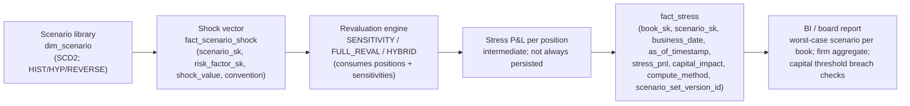

# Module 10 — Stress Testing & Scenarios

!!! abstract "Module Goal"
    Stress testing answers a question VaR cannot. Where VaR ([Module 9](09-value-at-risk.md)) tells you what is plausible under normal conditions, stress testing tells you what kills the firm under specified abnormal ones. The two travel together on the daily risk pack and on every regulatory submission, but they live in different fact tables, aggregate by different rules, and answer different consumer questions. This module covers stress testing as data: what a *scenario* is in the warehouse, what a *shock vector* looks like on disk, the difference between sensitivity-based and full-revaluation stress, the storage shapes for `dim_scenario` and `fact_stress`, the additivity property that distinguishes stress from VaR, the regulatory programmes the warehouse must service (CCAR, EBA, BoE), and the common bugs that turn a stress number into a misleading one.

---

## 1. Learning objectives

By the end of this module, you should be able to:

- **Distinguish** historical scenarios (replays of named past events) from hypothetical scenarios (forward-looking shocks designed by risk managers) and from reverse stress tests (the inverse problem — what scenario breaches a stated threshold), and identify which rows on `dim_scenario` carry which type.
- **Choose** between sensitivity-based stress (shock × Greek; fast, approximate) and full-revaluation stress (re-price every position under the shocked market; slow, accurate), and articulate the hybrid pattern most production warehouses adopt.
- **Design** the Scenario dimension and the stress fact at a grain that supports daily refresh, scenario versioning under SCD2, and a one-line query for "worst-case scenario per book", and write the column list for both.
- **Apply** a shock vector to a sensitivities table to compute stressed P&L per position, and recognise where the Delta-only approximation breaks down for option-heavy books that need a Delta-Gamma extension.
- **Reverse-stress-test** a portfolio: sketch the inverse-problem framing, the constraints required to make the search well-posed, and the data the optimisation engine needs from the warehouse.
- **Aggregate** stressed P&L across desks using simple summation — and explain to a sceptical consumer why this works for stress where it does not for VaR.

## 2. Why this matters

Stress testing is the complement to VaR, not a competitor. VaR answers a probabilistic question — "what is the loss exceeded only on 1% of days under normal conditions?" — by integrating over a distribution of possible market states. Stress testing answers a deterministic question — "what is the loss under *this specific* set of market moves?" — by evaluating the portfolio at a single point in scenario space. The two together give the consumer a complete picture: VaR characterises the body and near tail of the loss distribution; stress probes the far tail at points the historical sample either does not visit (because they have not happened yet) or would weight too lightly to matter to the quantile (because they are rare relative to the window length). A risk pack that carries one without the other is a risk pack with a known blind spot, and every regulator and risk committee in the post-2008 world knows it.

The warehouse-side consequences are concrete. VaR rows land on `fact_var` ([Module 9 §3.10](09-value-at-risk.md)) at a grain of (book, confidence, horizon, business_date, as_of_timestamp); stress rows land on `fact_stress` at a grain of (book, scenario_id, business_date, as_of_timestamp). The two facts have related but distinct dimensional joins — `fact_var` joins to `dim_scenario_set` (a *bag* of scenarios consumed by quantile extraction), `fact_stress` joins to `dim_scenario` (a *single* scenario consumed by point evaluation). The aggregation rules differ, the consumer queries differ, and the regulatory consumers differ — Basel 2.5 IMA cares about VaR, CCAR cares about stress, FRTB IMA cares about Expected Shortfall plus a separate stressed-ES calculation. A data engineer who treats stress as "VaR but with a different scenario set" produces a warehouse that is internally consistent but answers neither set of consumer questions cleanly.

A second framing point. Stress P&L is *additive* across positions and across desks. A 99% one-day VaR for the whole bank is not the sum of the desk-level VaRs (that is the entire content of [Module 12](12-aggregation-additivity.md) on subadditivity); a stress P&L for the whole bank under "China hard landing" *is* the sum of the desk-level stress P&Ls under the same shock. This is one of stress testing's most important practical properties — it makes capital allocation, sub-portfolio diagnostics, and what-if analysis trivial in a way VaR refuses to be — and it is also one of the easiest things to break in the warehouse if you let two desks run "China hard landing" against subtly different shock vectors. Section 3 covers the *scenario conformance* discipline that protects the additivity; section 5 covers the bugs that violate it.

A practitioner-angle paragraph. After this module you should be able to look at a row on `fact_stress` and predict (i) which scenario produced it, (ii) what shock vector that scenario implies, (iii) which engine wrote it, (iv) whether the underlying calculation was a sensitivity-based approximation or a full revaluation, and (v) which version of the scenario library was in force when it was computed. You should also be able to write the SQL that returns each book's worst-case scenario for board reporting, and the data-quality check that flags scenario-version drift between sensitivities and shocks. The Greeks half of the input was Module 8; the scenario half is this module; the join is the stress fact.

## 3. Core concepts

A reading note before diving in. Section 3 builds the warehouse view of stress testing in nine sub-sections, ordered from "what a scenario is" through "what the fact tables look like" through "how aggregation works". Sections 3.1–3.3 cover scenario taxonomy (historical, hypothetical, reverse). Sections 3.4–3.5 cover the calculation methods (sensitivity-based vs full revaluation) and the regulatory programmes that drive them. Sections 3.6–3.8 cover the storage shapes and the conformance discipline that keeps stress numbers comparable across desks. Section 3.9 covers aggregation and the additivity property. Readers familiar with the trader-side view of stress testing can skim to 3.6 for the storage discussion; readers new to the topic should read top to bottom.

### 3.1 Historical scenarios

A **historical scenario** is a vector of market-factor moves drawn from a named past event. The classic library every bank carries:

| Scenario | Date(s) | What it represents | Typical shock magnitudes |
| -------- | ------- | ------------------ | ------------------------ |
| **Black Monday** | 1987-10-19 | One-day equity crash; volatility regime change | SPX -22%, equity vol +200%, flight to quality in rates |
| **GFC peak** | 2008-09-15 → 2008-09-29 | Lehman default and immediate aftermath | Credit spreads +500bp on financials, SPX -20% over two weeks, USD funding strain |
| **Sovereign crisis** | 2011-08-01 → 2011-09-30 | Eurozone peripheral sovereign stress | BTP-Bund spread +250bp, EUR -10% vs USD, periphery bank equity -40% |
| **COVID shock** | 2020-03-09 → 2020-03-23 | Pandemic-driven liquidity crisis | SPX -34% over 14 trading days, oil -65%, IG credit +200bp, vol surface up 3-5x |
| **Taper tantrum** | 2013-05 → 2013-09 | Fed hawkish pivot signal | UST 10y +120bp, EM FX -8%, equity -5% |

Each row of the table is, in the warehouse, a pre-computed vector: one shock value per market factor for that scenario, stored on a companion table `fact_scenario_shock` (sometimes called `dim_scenario_shock` because it is more reference-data than fact). The shock for SPX under "Black Monday" is -22% relative; the shock for the USD 5Y rate is some specific basis-point move; the shock for EUR/USD is some specific percentage move. The scenario *is* the vector; the name is just the human-readable label.

**Why historical scenarios are useful.** They are *lived through*. Every shock value in the vector actually occurred — there is no debate about plausibility, no calibration to defend, no expert judgement to second-guess. The cross-factor dependencies are also realised (the equity move and the rate move and the credit move all happened on the same day under the same news flow), which means the joint shock is internally coherent in a way a hypothetical shock often is not. For board reporting, "this is what the firm would lose today if 2008 happened again" is a sentence that lands without explanation.

**Why historical scenarios are limited.** They are always *backward-looking*. The 1987 crash, the GFC, COVID — none of these were in any bank's historical-scenario library before they happened. A library that consists exclusively of past crises is a library that prepares the firm for *the last war*, not the next one. Historical scenarios also carry the *factor-coverage problem*: a scenario from 1987 cannot directly shock a 2026 risk factor that did not exist in 1987 (a single-name CDS on a company founded in 2010, an inverse-VIX ETF, a crypto-derivative). The warehouse must either project the historical shock onto the modern factor universe (with documented mapping rules) or carry an explicit "factor not covered" flag for the missing entries.

A practical observation on **window selection** for historical scenarios. Most named historical scenarios are not single-day events — the GFC unfolded over weeks, COVID over a month. The scenario library must pin a precise start and end date for each named event, and the shock vector is computed as the cumulative move (compounded for relative shocks, summed for absolute shocks) over that window. Two banks running "GFC" with different window definitions will get materially different shock magnitudes and produce non-comparable stress numbers; the conformance discipline of section 3.7 starts here.

A second practical observation, on **factor mapping for legacy scenarios**. The 1987 Black Monday scenario is the canonical example. The shock vector includes an SPX move (-22%), a VIX-equivalent vol move (large positive), a US Treasury yield move (sharp drop in flight to quality), and a cluster of currency moves. But the 1987 universe of risk factors is not the 2026 universe — there was no SOFR curve in 1987 (LIBOR was the funding benchmark; the 2008-onwards transition to overnight rates re-shaped the curve), there were no single-name CDS spreads (the modern CDS market dates from the late 1990s), there were no listed VIX futures (the contract launched in 2004), and large swathes of the EM-corporate-credit and crypto-derivative universes did not exist. The warehouse must apply documented mapping rules: project the 1987 LIBOR move onto the modern SOFR-equivalent factor, project broad-based equity vol onto a VIX-equivalent factor, and explicitly *exclude* factors with no historical analogue from the scenario shock with a `factor_in_scenario_coverage` flag. The mapping rules go on `dim_scenario`'s methodology document; the exclusions go on `fact_scenario_shock` so the consumer can see which factors received zero shocks because they were not covered, versus which received zero shocks because the scenario genuinely did not move them.

A third observation, on **scenario library curation**. The historical library is not a fixed set — it grows as new events occur (March 2020 was added to most banks' libraries within weeks), and old events occasionally get re-windowed as historical perspective evolves (the GFC window has been variously defined as Sept-Oct 2008, the full Sept 2008–March 2009 stress period, or the entire 2007–2009 crisis arc; different windows produce different shock magnitudes). The library curation cadence is typically annual — a formal review of which scenarios remain in the library, which should be retired (e.g., the 1998 LTCM event has fallen off many banks' libraries because the modern fund-of-funds-via-prime-broker exposure structure is sufficiently different), which should be re-windowed, which new events should be added. The warehouse must support all of this through SCD2 on `dim_scenario` (calibration history), `retirement_date` (for retired scenarios), and `effective_from`/`effective_to` ranges that let any historical stress run be reproduced against the as-of-then library composition.

### 3.2 Hypothetical scenarios

A **hypothetical scenario** is a forward-looking shock vector designed by risk managers to probe a specific concern not well-represented in the historical library. Examples that recur on bank scenario lists:

- **"China hard landing"** — sharp slowdown in Chinese growth, with knock-on effects on commodity prices (-30%), EM FX (-15%), credit spreads on China-exposed corporates (+300bp), and a flight-to-quality move in DM rates (-50bp).
- **"Fed +200bp"** — an aggressive Fed tightening cycle, with USD parallel rate shift +200bp, USD/EM FX +10%, equity -15%, credit -100bp (counter-intuitive: tightening cures credit by reducing inflation).
- **"Geopolitical Middle East shock"** — oil +50%, equity -10%, gold +20%, defence-sector equity +15%, EM FX mixed by oil-exporter status.
- **"AI capex unwind"** — concentrated tech equity -40%, semiconductor -50%, broader equity -15%, credit on AI-infra borrowers +300bp.
- **"Climate physical event"** — region-specific property re-rating, insurance-sector equity -20%, regional muni bonds +150bp, sovereign downgrade in directly-affected jurisdictions.

The construction process is part craft, part science. The risk-management team identifies a concern, names it, and then *calibrates* the shock vector — typically by anchoring magnitudes to historical analogues (the equity shock under "China hard landing" is calibrated to the size of moves seen in past EM-led growth scares) or to extreme-but-plausible quantiles of the marginal factor distributions (the rate shock under "Fed +200bp" is the 99.9th percentile of the modelled rate distribution under a hawkish-pivot regime). Cross-factor dependencies are imposed by hand or by reference to a structural model — and this is where hypothetical scenarios are weakest, because the joint shock is the modeller's view of how factors move together, not a realised observation.

**Combining historical and hypothetical patterns.** The practical answer to "the joint shock is just the modeller's view" is to build hypothetical scenarios on a *historical correlation backbone*. Take the cross-factor correlation matrix from a historical period (e.g., the rates-equity-credit correlations during the 2008 stress), specify a univariate shock magnitude for the lead factor (USD 10y rate +200bp), and let the correlation structure imply the rest of the shock vector (equity, credit, FX moves consistent with the historical co-movement under stress conditions). The result is forward-looking on the headline magnitude and historically-anchored on the cross-factor structure. Most production hypothetical libraries use some variant of this hybrid.

A practical observation on **scenario ownership**. Hypothetical scenarios in a regulated bank are not free-form — each one has a documented owner (a named member of the risk-management team), a calibration document explaining the magnitude choice, and a governance record of when the scenario was approved, last reviewed, and (eventually) retired. The warehouse's `dim_scenario` carries `owner`, `calibration_date`, `approval_date`, and `retirement_date` to support the governance workflow; a stress number computed against a scenario whose calibration is older than the methodology document permits is a regulatory finding waiting to happen.

A second observation on **scenario severity definitions**. Hypothetical scenarios are typically classified into severity tiers — `BASELINE` (a mild adverse move; the central case for normal monitoring), `ADVERSE` (a meaningful stress; the level the firm uses for risk-appetite monitoring), `SEVERELY_ADVERSE` (a deep stress comparable to past major crises; the level the firm uses for capital adequacy assessment), `EXTREME` (a tail event beyond historical experience; reverse-stress level). The classification is consequential: it determines which scenario gets aggregated into which board-level metric, and which appears in which regulatory submission. The warehouse must carry the severity classification on `dim_scenario` and must be able to answer queries like "what is the worst-case loss under any SEVERELY_ADVERSE scenario for this book" — the consumer should not have to know the names of all SEVERELY_ADVERSE scenarios; the dimension should know that.

A third observation on **scenario design as a quantitative discipline**. The traditional view of hypothetical scenario design as "expert judgement plus calibration to history" has been increasingly displaced by more systematic approaches: principal-component analysis on historical risk-factor moves to identify dominant stress modes; copula-based joint distributions for cross-factor dependencies under stress; regime-switching models that distinguish "normal" from "stress" cross-factor correlation structures. Each approach produces shock vectors that are mathematically defensible against a documented model. The warehouse-side implication is that `dim_scenario` should carry not just the methodology document URI but, where applicable, a reference to the model parameters that produced the shock vector — so that a recalibration is traceable not just to "the team re-ran the calibration" but to "the team re-ran the PCA on a refreshed historical window" with the window dates persisted. The systematic discipline does not eliminate expert judgement (the choice of historical window, the choice of regime classifier, the imposition of structural constraints all involve judgement), but it makes the judgement auditable.

### 3.3 Reverse stress tests

A **reverse stress test** inverts the standard stress-testing question. Where a forward stress test asks "what is the P&L under scenario X?", a reverse stress test asks "what scenario would cause a P&L of X?". Mathematically it is the inverse problem: given a target loss \(L^*\), find a shock vector \(\mathbf{s}^*\) such that \(\mathrm{StressPnL}(\mathbf{s}^*) = -L^*\), subject to constraints that make \(\mathbf{s}^*\) plausible.

The motivation is regulatory and board-level. A bank's risk appetite is typically expressed not as "we are comfortable with VaR up to X" but as "we want to be confident we will not lose more than Y% of capital under a plausible market event". The forward-stress framing answers the question "have any of our named scenarios produced a loss greater than Y?" and is sensitive to the imagination of whoever wrote the scenario library. The reverse-stress framing answers the question "is there *any* plausible scenario that produces a loss greater than Y?" and forces the firm to confront the gap between its capital threshold and the worst-case shock its current portfolio is exposed to.

**The mathematical formulation.** A typical reverse stress test optimises a plausibility metric (e.g., Mahalanobis distance from the historical mean under a fitted multivariate distribution) subject to a P&L constraint:

$$
\mathbf{s}^* = \arg\min_{\mathbf{s}} \; \mathbf{s}^\top \Sigma^{-1} \mathbf{s} \quad \text{subject to} \quad \mathrm{StressPnL}(\mathbf{s}) = -L^*
$$

The Mahalanobis-distance objective rewards shock vectors that lie close to the historical correlation structure — a shock where rates and equity move together in a historically-plausible direction is preferred over a shock where they move in opposite directions (which would be implausible under a market-stress regime). The constraint pins the loss; the objective pins the plausibility.

**Why constraints matter.** Without constraints, the reverse-stress optimiser will find degenerate solutions — a shock vector that is large in a single factor the portfolio is heavily exposed to, with all other factors at zero. The result is a "worst-case scenario" where one rate moves by 5,000bp and nothing else happens, which is mathematically optimal under the P&L constraint and economically nonsense. Constraints that recur in production reverse-stress engines:

- **Marginal plausibility caps.** No single-factor shock larger than its historical max (or 99.9th-percentile move).
- **Joint plausibility floor.** Mahalanobis distance below a documented threshold.
- **Sign-coherence constraints.** Rates and credit cannot move in implausible relative directions (a rates +200bp shock with credit -300bp is excluded as historically unprecedented).
- **Regime constraints.** The shock must be consistent with one of a small set of named regimes (recession, inflation shock, geopolitical, liquidity), each with its own correlation structure.

**The data shape coming out.** A reverse stress test produces a *scenario* — a shock vector — that goes back into the same `fact_scenario_shock` table the forward scenarios live in, typically with a `scenario_type = 'REVERSE'` flag and a reference to the loss threshold that produced it. The downstream consumer then runs a *forward* stress against that scenario for reporting purposes (so the board pack can show "the smallest plausible shock that breaches our $500M Tier-1 threshold is this one"), and the reverse-engineered scenario becomes part of the named library going forward. The optimisation engine is upstream of the warehouse; the warehouse stores the result.

A practical observation on **board-level reporting**. Reverse-stress results are powerful because they reframe the capital conversation. Instead of "VaR is $50M and we have $5B of capital, so we are 100x covered", the reverse stress lets the board ask "what shock would breach our $5B capital cushion, and is that shock something we would be embarrassed *not* to have anticipated?" The reframing is qualitative — the answer is a *scenario*, not a number — and it is exactly the kind of qualitative reasoning regulators have pushed banks toward post-2008. The warehouse's job is to make the underlying calculation reproducible; the reframing is the consumer's responsibility.

A second observation on **the optimisation engine and the warehouse boundary**. The reverse-stress engine is computationally heavy — it runs an iterative optimiser that proposes shock vectors, evaluates the firm-wide stressed P&L for each, and refines its proposals until the constraint is satisfied. Each iteration requires a stress evaluation against the entire portfolio, which means a full revaluation pass (or a sensitivity-based approximation, depending on the configuration). For a 10,000-position book a single iteration is a non-trivial compute job; the optimiser may need hundreds of iterations to converge. This sits uncomfortably with the warehouse's batch-processing rhythm — reverse stress is typically run as a quarterly board-level exercise rather than a daily refresh, and the warehouse's role is to (i) provide the engine's inputs (positions, sensitivities, scenario library reference data) at a clean snapshot, and (ii) persist the engine's outputs (the converged shock vector and the stress P&L it produces) back into `fact_scenario_shock` and `fact_stress` with appropriate version stamps. The optimisation itself happens *outside* the warehouse, in a dedicated compute environment; the warehouse owns the inputs and the outputs.

### 3.4 Sensitivity-based vs full-revaluation stress

The two methods of computing stress P&L correspond to two different views of how a position's value moves under a shock.

**Sensitivity-based stress** approximates the position's revaluation using its Greeks. The Taylor expansion of present value around the current state of the world is:

$$
\Delta \mathrm{PV} \approx \Delta \cdot dS + \frac{1}{2} \Gamma \cdot dS^2 + \mathcal{V} \cdot d\sigma + \rho \cdot dr + \Theta \cdot dt + \cdots
$$

For a single shock vector, the stressed P&L is the sum of the Taylor terms evaluated at the shock magnitudes. The first-order (delta) approximation alone is exact for linear instruments (vanilla swaps, cash equity, FX forwards) and approximate for everything else; the addition of the gamma term captures the dominant non-linearity for vanilla options; the addition of vanna and volga captures cross-derivative terms that matter for vol-sensitive books.

| Term | Sensitivity input | When it matters |
| ---- | ----------------- | --------------- |
| Δ · dS | First-order delta | Always — dominant for linear books |
| ½ Γ · dS² | Gamma | Option-heavy books, large shocks |
| 𝒱 · dσ | Vega | Books with vol exposure |
| ½ Volga · dσ² | Volga | Books with vol-of-vol exposure |
| Vanna · dS · dσ | Vanna | Spot/vol-correlated books (FX, equity options) |
| ρ · dr | Rho | Long-dated rates exposure |

**Full-revaluation stress** re-runs the pricing engine for every position under the shocked market state. The output is the exact PV under the new world; the stressed P&L is the difference from the unshocked PV. This is the same operation the historical-VaR pipeline does (250 times, one per historical scenario; see [Module 9 §3.4](09-value-at-risk.md)) — the only difference is that stress runs it once per scenario rather than over a window.

The trade-off is the standard one between speed and accuracy:

| Aspect | Sensitivity-based | Full-revaluation |
| ------ | ----------------- | ---------------- |
| Compute cost | Cheap — a dot product per position | Expensive — one full pricing call per position per scenario |
| Accuracy on linear books | Exact | Exact |
| Accuracy on vanilla options | Approximate (Taylor-truncation error grows with shock size) | Exact |
| Accuracy on exotics | Often poor — path-dependence and discontinuities are not in the Greeks | Exact |
| Storage requirements | `fact_sensitivity` already exists | Must persist scenario-level revalued PVs |
| Auditability | Reproducible from the sensitivity row + shock vector | Reproducible only with the full pricing-engine state |

**The hybrid pattern**, which is what most production warehouses adopt, splits the book by materiality and complexity:

- **Full-revaluation for the big positions and the exotic positions.** The top 5–10% of the book by notional, and any position carrying exotic optionality (knock-out, knock-in, barrier, path-dependent, multi-asset), goes through the full pricing engine for every scenario. The compute cost is bounded because the position count is bounded; the accuracy is exact where it matters most.
- **Sensitivity-based for the long tail.** The remaining 90–95% of positions, which are individually small and predominantly linear, use the Taylor expansion against their pre-computed sensitivities. The compute cost collapses to a matrix multiply; the accuracy is good enough on the population of positions that individually do not move the result.
- **The split is documented per book or per asset class** on `dim_book` or in a methodology table, and the choice is auditable. The morning consumer should be able to see, for any stress P&L row, which method produced it.

A practical observation on the **Taylor-truncation error**. The error in a sensitivity-based stress grows with the shock size — for a vanilla call at the money with a 20% spot shock, the Delta-Gamma approximation is typically within 5–10% of the full revaluation; for the same option with a 50% spot shock (the kind of move stress scenarios contemplate), the approximation can be off by 30–50% because the higher-order terms (Speed, Color, …) have started to matter. The defensive pattern: when adopting sensitivity-based stress for a non-linear book, validate against full revaluation across a *range of shock sizes* spanning the scenario library, document the maximum acceptable error, and re-validate any time the methodology or the book composition materially changes.

A practical observation on **path-dependent and discontinuous payoffs**. Some option types break the sensitivity-based path entirely, regardless of how many higher-order Greeks are added. A knock-out option has a payoff that drops discontinuously to zero at the barrier; no Taylor expansion captures the discontinuity, because the derivatives at the barrier do not exist in the classical sense (or are infinite, depending on the formal treatment). A knock-in option is similar — the payoff is zero until the barrier is crossed, then non-zero. Asian options and lookback options depend on the *path* of the underlying, not the terminal value, and stress-shocking the terminal level alone does not capture path dependence. Variance swaps and volatility swaps depend on the realised volatility over the contract life, which is path-dependent in a different way. For all of these, full revaluation is the only honest approach; treating them under sensitivity-based stress produces a number that is mathematically defined and economically meaningless. The warehouse should carry a `path_dependent` flag on `dim_instrument` ([Module 4](04-financial-instruments.md)) and the stress-testing engine should route any position carrying that flag through full reval regardless of the book-level method choice.

A second observation on **engine consistency**. The sensitivity-based path consumes Greeks from `fact_sensitivity` ([Module 8](08-sensitivities.md)); the full-revaluation path consumes positions from `fact_position` ([Module 7](07-fact-tables.md)) and hits the pricing engine. The two paths can produce different stress P&L numbers for the same position under the same scenario if the sensitivities were computed under bumping conventions that do not match the shock conventions in the scenario library. The conformance discipline of section 3.7 covers the bumping/shock alignment requirement.

### 3.4a Worked numerical example — the sensitivity-based / full-reval gap

Concrete illustration of the truncation error, to make the table abstract. A vanilla European call on the SPX, struck at 5,000, 1y to expiry, current spot 5,000, implied vol 18%, risk-free rate 4%. Black-Scholes PV ≈ \$455 per option. Greeks at the current state: delta ≈ 0.58, gamma ≈ 0.000158, vega ≈ \$19.8 per vol point.

Apply a -20% spot shock (new spot 4,000) with vol unchanged. The exact full-revaluation PV under the shock is approximately \$71 — the option has fallen deep out of the money and most of its value has evaporated. The change in PV is \$71 − \$455 = −\$384.

Under the Delta-only sensitivity-based approximation: \(\Delta \cdot dS = 0.58 \times (4000 - 5000) = -\$580\). The approximation overstates the loss by 51%.

Under the Delta-Gamma approximation: \(\Delta \cdot dS + \frac{1}{2} \Gamma \cdot dS^2 = -580 + 0.5 \times 0.000158 \times (-1000)^2 = -580 + 79 = -\$501\). Better, but still overstates the loss by 30%.

The same exercise with a smaller shock — say -5% — produces Delta-only error of about 4% and Delta-Gamma error of about 0.5%. This is the practical content of the table: sensitivity-based stress is fit-for-purpose for small shocks (the kind that drive desk-level limit monitoring) and increasingly approximate for the large shocks that drive the stress scenarios that matter for capital. The hybrid pattern exists precisely to reserve the expensive full-reval path for the situations where the cheap path is wrong by an unacceptable amount.

### 3.5 Regulatory stress programmes at a glance

Three programmes drive the bulk of the regulatory stress-testing workload at large banks. Each has its own scenario design philosophy, severity definition, reporting cycle, and methodology document. The warehouse must be able to support all three concurrently for global firms; the deep treatment of the regulatory frame is in [Module 19](19-regulatory-context.md). What follows is the orientation a data engineer needs to recognise the consumer queries.

| Programme | Authority | Frequency | Scenario design | Reporting consumer |
| --------- | --------- | --------- | --------------- | ------------------ |
| **CCAR / DFAST** | US Federal Reserve | Annual | Three scenarios prescribed by the Fed: baseline, adverse, severely adverse. Macroeconomic + market variables. 9-quarter horizon. | Capital plan submission; public disclosure of bank-by-bank results. |
| **EBA stress test** | European Banking Authority | Biennial | Scenarios prescribed by EBA in coordination with ESRB and ECB. Adverse-only (no severely-adverse layer). 3-year horizon. | Capital adequacy assessment; public disclosure. |
| **BoE annual cyclical scenario** | Bank of England | Annual | Single scenario calibrated to the position of the UK financial cycle. Counter-cyclical capital buffer linkage. | Capital adequacy; FPC policy input. |

A few orientation points:

- **The scenarios are prescribed, not bank-chosen.** Unlike internal scenario libraries where the bank designs the shocks, regulatory scenarios come down from the supervisor as a vector (or as a set of macroeconomic drivers the bank must translate into market-factor shocks via its own models). The warehouse must be able to load a regulator-supplied scenario into `dim_scenario` and `fact_scenario_shock` cleanly, with provenance pointing back to the supervisory document.
- **The horizons are long.** CCAR runs 9 quarters out; EBA runs 3 years out. This means the stress-testing engine must project not just one day's stressed P&L but a full path of stressed earnings, capital ratios, and balance-sheet evolution. The warehouse-side fact for these programmes is typically *not* `fact_stress` (which is single-period) but a separate `fact_capital_projection` or equivalent that carries quarterly stressed P&L, capital, and RWA over the projection horizon.
- **The methodology is heavily documented and audited.** Each programme has a published methodology that pins the scenario translation, the projection assumptions, the disclosure requirements, and the audit trail. The warehouse's lineage discipline ([Module 16](16-lineage-auditability.md)) is exercised most aggressively against regulatory stress submissions; reproducibility from the warehouse alone is not optional.

A practical observation on **warehouse design for regulatory stress**. The three programmes overlap in much of what they need from the warehouse — positions, sensitivities, scenario shocks, pricing-engine outputs, capital aggregations — but differ in the projection logic and the disclosure schemas. The defensive design is to keep `fact_stress` as the single-period stress fact (used for daily internal stress, ad-hoc what-if, board reporting), and to materialise programme-specific projection tables (`fact_ccar_projection`, `fact_eba_projection`, `fact_boe_acs`) on top of it. The single-period fact is conformed; the programme-specific tables embody the programme-specific projection logic. The alternative — building one fat fact that tries to satisfy all three regulatory regimes — produces a schema that is correct for none of them.

A second observation on **the macro-to-market translation**. Regulatory scenarios are typically published as macroeconomic vectors — GDP growth, unemployment rate, house price index, equity index level, sovereign yield, corporate spread, inflation rate — projected over the regulatory horizon. The scenario as published is *not* a market-factor shock vector that the pricing engine can consume directly; the bank must run an internal model that translates the macroeconomic projection into a vector of risk-factor moves at each projection point. The translation model is itself audited (the regulator wants to see how the bank gets from "GDP -3% under severely adverse" to "credit spreads on industrial corporates +400bp at the 4-quarter horizon"), and the warehouse must persist not just the regulator's macro vector but the bank's translated market-factor shock vector and the model parameters that produced the translation. The lineage chain — supervisory document → bank's macro scenario load → translation model → market-factor shocks → pricing engine → stress P&L → capital projection — is one of the longest in the warehouse, and reproducibility from the warehouse alone requires every step to be persisted.

A third observation on **internal vs regulatory severity calibration**. The internal scenario library and the regulatory scenarios coexist on `dim_scenario` and are queried together for cross-checks. A common diagnostic: how does the firm's internal "severely adverse" scenario compare to the Fed's "severely adverse" CCAR scenario in terms of stressed P&L? If the firm's scenario produces materially less stress than the Fed's, the internal calibration may be too lenient and the risk committee should hear about it. If the firm's scenario produces materially more stress, the internal calibration may be over-weighting tail risk relative to the supervisor's view; this is less alarming but worth understanding. The warehouse query is straightforward — group `fact_stress` by `regulatory_regime` and compare aggregates — and the reporting cycle around it is one of the more useful internal-governance tools the stress data supports.

### 3.6 Storing stress results — the dimension and the fact

Two warehouse objects carry the bulk of the stress-testing data: the **scenario dimension** (one row per scenario) and the **stress fact** (one row per evaluation of a scenario against a book on a date).

#### `dim_scenario` — one row per scenario

| Column | Type / role | Notes |
| ------ | ----------- | ----- |
| `scenario_sk` | Surrogate key | Opaque integer; the join target from `fact_stress`. |
| `scenario_id` | Business key | Stable human-readable identifier (e.g., `HIST_GFC_2008`, `HYP_CHINA_HARD_LANDING_2026Q1`). |
| `scenario_name` | Display string | "GFC 2008 (Sep 15 — Sep 29)", "China Hard Landing — Q1 2026 calibration" |
| `scenario_type` | Controlled vocabulary | `HISTORICAL` / `HYPOTHETICAL` / `REVERSE` / `REGULATORY`. |
| `severity` | Controlled vocabulary | `BASELINE` / `ADVERSE` / `SEVERELY_ADVERSE` / `EXTREME`. Aligns with regulatory severity definitions where applicable. |
| `regulatory_regime` | Controlled vocabulary | `INTERNAL` / `CCAR` / `EBA` / `BOE_ACS` / `OTHER`. |
| `calibration_date` | Date | When the scenario shocks were last calibrated. |
| `approval_date` | Date | When the scenario was governance-approved for production use. |
| `retirement_date` | Date / nullable | When the scenario was retired (null if active). |
| `owner` | String | Named risk-manager or team responsible for the scenario. |
| `methodology_document_uri` | String | Link to the methodology / calibration document. |
| `effective_from` | Timestamp | SCD2 lower bound. |
| `effective_to` | Timestamp / nullable | SCD2 upper bound. |
| `is_current` | Boolean | SCD2 current-row flag. |

**Why SCD2.** Scenarios get re-calibrated. The shock vector for "China hard landing" in 2024 is not the same as the shock vector for "China hard landing" in 2026; the name is stable but the magnitudes evolve as the risk-management team updates its view. The warehouse must preserve the historical calibrations so that any historical stress P&L is reproducible from the as-of-then scenario shocks, not the current ones. SCD2 on `dim_scenario` is the standard pattern; the `effective_from` / `effective_to` columns let the consumer query "what shock vector was associated with this scenario on this date".

#### `fact_scenario_shock` — the shock vector

| Column | Notes |
| ------ | ----- |
| `scenario_sk` | FK to `dim_scenario`. |
| `risk_factor_sk` | FK to `dim_risk_factor` ([Module 11](11-market-data.md)). |
| `shock_value` | The numerical shock — units depend on `shock_convention`. |
| `shock_convention` | `ABSOLUTE_BP` / `RELATIVE` / `ABSOLUTE_LEVEL`. Pins units; mismatch is the silent-bug machine of stress. |
| `effective_from` / `effective_to` | SCD2 — the shock value can change without the scenario_sk changing if the calibration is refreshed. |

Together `dim_scenario` and `fact_scenario_shock` define the *input* side of stress testing. A scenario is a (scenario_sk, vector of shocks) pair; the vector is one row per (scenario_sk, risk_factor_sk).

#### `fact_stress` — the result

| Column | Notes |
| ------ | ----- |
| `stress_sk` | Surrogate key. |
| `book_sk` | FK to `dim_book`. |
| `scenario_sk` | FK to `dim_scenario`. |
| `business_date` | Reporting date. |
| `as_of_timestamp` | When the warehouse came to believe this value (bitemporal — Module 13). |
| `stress_pnl` | The stressed P&L number, signed (negative = loss). |
| `stress_market_value` | Market value of the book under the shocked state (optional but useful for capital impact). |
| `capital_impact` | Stressed capital movement (CET1 impact, RWA delta, etc.). Often null for non-regulatory runs. |
| `compute_method` | `SENSITIVITY` / `FULL_REVAL` / `HYBRID`. Audit attribute. |
| `scenario_set_version_id` | The version of the scenario library the calculation used — see section 3.8. |
| `source_system_sk` | Which engine produced the row. |

**The grain is `(book_sk, scenario_sk, business_date, as_of_timestamp)`.** Two rows with the same grain are restatements of one another; the bitemporal-load discipline ([Module 7 §3.4](07-fact-tables.md)) preserves both. A typical day's `fact_stress` for a 1,000-book bank running 50 scenarios is 50,000 rows — modest by warehouse standards, which is one of the practical attractions of stress over the much-larger `fact_scenario_pnl` that sits under VaR.

### 3.7 Scenario conformance

Stress P&L is additive across desks if and only if all desks evaluate the *same* scenario against the *same* shock vector. This is a stronger requirement than it sounds, and the conformance discipline that protects it is one of the warehouse's most under-appreciated jobs.

**The failure mode.** Two desks both report a stress P&L for "China hard landing" on the same business date. Desk A's engine evaluated the scenario using shock vector v1 (calibrated 2026-Q1, 8 risk factors, equity shock -25%). Desk B's engine evaluated the scenario using shock vector v2 (calibrated 2026-Q3, 12 risk factors, equity shock -30%). Both rows land on `fact_stress` with `scenario_id = 'HYP_CHINA_HARD_LANDING'`. The morning consumer sums them and reports the firm-level "China hard landing" stress, which is now a meaningless number — half the book was stressed under one vector, half under another.

**The defensive pattern.**

- **One source of truth for the scenario.** `dim_scenario` is the system of record; every engine that runs a stress consumes the shock vector from the warehouse, not from a desk-local copy. The latency cost is the daily refresh of the engine's scenario cache.
- **Version-stamp every stress row.** `fact_stress.scenario_set_version_id` records which version of the scenario library the calculation used. A query that aggregates across desks can refuse to do so unless all rows share the same version.
- **Conformance checks at load time.** A data-quality job runs after every stress load and flags scenario-version drift across books. The check is cheap and catches the silent bug at the load stage rather than at the consumer stage. ([Module 15 §3.x](15-data-quality.md) treats the data-quality framework in detail.)
- **Refresh policy that is universal, not per-desk.** When the scenario library is recalibrated, all engines pick up the new version on the same business date. A staggered rollout where Desk A picks up v2 on Monday and Desk B picks up v2 on Wednesday produces three days of inconsistent stress numbers — the conformance discipline does not survive a staggered rollout, and the operational discipline of stress-testing recalibration is built around the rollout date.

A practical observation on **scenario conformance across legal entities**. Global banks operate multiple legal entities under multiple jurisdictions, each with its own scenario library calibrated to local market conditions and local regulator preferences. The conformance discipline above applies *within* a legal entity — within the US bank-holding-company entity, all desks run the same scenarios. *Across* entities, the scenario libraries diverge legitimately: the US entity's "Fed +200bp" is calibrated to the US rate environment, the European entity's "ECB +200bp" is calibrated to the EUR rate environment, and aggregating the two firm-wide is not meaningful. The warehouse must carry an `entity_sk` on `dim_scenario` so that entity-local scenarios stay entity-local at consumption time.

A second observation on **conformance with respect to the position date**. Stress conformance is not just about the shock vector — it is also about the *positions* the shock is evaluated against. A stress run that consumes positions as of business_date 2026-05-07 and shocks them with a scenario calibrated against market data as of 2026-05-07 is internally consistent. A stress run that consumes positions as of 2026-05-07 but shocks them with a scenario calibrated against market data as of 2026-04-30 (because the calibration cycle ran weekly and the latest is from a week ago) is consistent only if the market did not move materially in the interim — and even then it is the kind of thing a regulator's reproducibility review will catch. The warehouse should stamp every `fact_stress` row with both the position business_date and the scenario calibration date (or the scenario_set_version that pins it), so the conformance can be verified with a join.

### 3.8 Scenario versioning — SCD2 plus a scenario-set version

Two distinct versioning concepts apply to scenarios, and confusing them is a recurring schema bug.

**SCD2 on `dim_scenario`** versions the *attributes* of a single scenario over time. The scenario "China hard landing" exists as a logical entity with a stable `scenario_id`; its attributes (calibration_date, owner, severity classification) evolve. The SCD2 pattern produces multiple rows on `dim_scenario` with the same `scenario_id` but different `scenario_sk` values, with `effective_from` / `effective_to` ranges that never overlap.

**`scenario_set_version_id`** versions the *bag of scenarios in force* on a given run. The scenario library at any point in time is a set: 50 scenarios, each at its current calibration. When the library is updated — a new scenario is added, an old one is retired, an existing one is recalibrated — the set as a whole transitions from version N to version N+1. The version_id is what makes a stress run reproducible: "we ran the firm-wide stress on 2026-05-07 against scenario_set_version 47" pins exactly which scenarios and which shock vectors were in force.

The two concepts work together:

- A single scenario's history lives in the SCD2 chain on `dim_scenario`. Querying the chain with an as-of date returns the version of the scenario active on that date.
- A scenario-set version is a snapshot of which `dim_scenario` rows were considered "in the library" on a given date. The set membership lives in a `dim_scenario_set` table or equivalent, with `(scenario_set_version_id, scenario_sk)` membership rows.
- A `fact_stress` row references both: `scenario_sk` says which scenario produced it (and via SCD2 you can recover the shock vector that was in force at the time), and `scenario_set_version_id` says which library version was the reference set.

A practical observation. The bitemporal pattern of [Module 13](13-time-bitemporality.md) generalises both concepts: `dim_scenario` SCD2 is "world time" (the scenario was recalibrated as of a real date), and `scenario_set_version_id` is part of the "system time" (the warehouse's record of which scenarios were considered in force as of a system date). Module 13 unifies the two patterns; for the moment it is enough to recognise that scenarios need both kinds of versioning, that they are independent, and that a stress fact must reference both.

### 3.9 Aggregation and the additivity property

Stress P&L is *additive* across positions and across desks under a single scenario. The arithmetic is:

$$
\mathrm{StressPnL}_{\text{book}}(\mathbf{s}) = \sum_{\text{position} \in \text{book}} \mathrm{StressPnL}_{\text{position}}(\mathbf{s})
$$

$$
\mathrm{StressPnL}_{\text{firm}}(\mathbf{s}) = \sum_{\text{book} \in \text{firm}} \mathrm{StressPnL}_{\text{book}}(\mathbf{s})
$$

The reason is that stress P&L under one fixed shock is just *the P&L the portfolio would have under that shock*. P&L is additive — a portfolio's P&L is the sum of its constituent positions' P&Ls — and stressed P&L is no exception. There is no quantile, no expectation, no diversification adjustment to make. Sum the rows.

Compare with VaR ([Module 9 §3.8](09-value-at-risk.md), [Module 12](12-aggregation-additivity.md)). VaR is a quantile of a P&L distribution; the quantile of a sum is *not* the sum of the quantiles, and so VaR fails additivity. Two desks each with a 99% one-day VaR of \$5M do not in general have a combined VaR of \$10M — they have something *less* (diversification benefit) or, in pathological cases, something *more* (the subadditivity-violation case). The warehouse cannot answer "what is the firm-wide VaR" by summing desk-level VaR rows; it has to re-run the quantile against the firm-wide P&L vector. Stress imposes no such constraint.

**What additivity buys you.**

- **Capital allocation is straightforward.** The firm-wide stress loss decomposes cleanly into desk-level contributions; each desk's contribution is just the desk's row. Compare to the VaR case, where component-VaR decomposition requires a perturbation analysis ([Module 9 §3.9](09-value-at-risk.md)).
- **What-if analysis is cheap.** "What would the stress P&L look like if Desk A were closed?" is the firm-wide stress minus Desk A's row. The same question for VaR requires re-running the entire pipeline.
- **Sub-portfolio diagnostics are immediate.** Filter `fact_stress` to a desk, a region, a product, or a counterparty exposure, and the sum is the stress P&L of that slice. No re-computation required.

**What additivity does *not* buy you.**

- **Comparability across scenarios.** A book's stress P&L of \$10M under scenario A and \$15M under scenario B does not mean B is "1.5x worse" in any meaningful sense — the scenarios shock different factors at different magnitudes. Comparability requires conformance on *what* the scenario means, not just on the arithmetic.
- **Comparability across firms.** Two banks reporting "China hard landing" stress losses of \$200M and \$300M may be running materially different scenarios — different lead-factor magnitudes, different correlation backbones, different factor coverage. The headlines are not directly comparable.
- **A "risk number" without context.** A stress P&L is meaningful *under its scenario*. Reporting a stress P&L without naming the scenario that produced it (and ideally the scenario_set_version) is the stress equivalent of reporting a VaR without confidence and horizon — a number with the units stripped off.

### 3.9a Liquidity-adjusted stress

A specialised but increasingly important variant. Standard stress P&L assumes the firm can mark-to-market its positions instantaneously at the shocked levels — the loss reported is the mark-to-market loss under the shocked state of the world. Real markets do not work that way under stress: the bid-ask spread widens, the order book thins, and the firm cannot exit its positions at the screen mid-price. The *liquidity-adjusted* stress P&L incorporates the cost of unwinding the position over a documented liquidity horizon, typically by adding a haircut proportional to the position's bid-ask spread under stress conditions.

The data shape: a `liquidity_adjustment` column on `fact_stress`, computed as the position size multiplied by a stressed bid-ask spread (often a multiple of the normal-conditions spread, with the multiple calibrated per asset class). The total liquidity-adjusted stress P&L is the standard mark-to-market stress P&L plus the liquidity adjustment (which is a loss, hence negative). For a position that the firm intends to hold rather than unwind under stress, the adjustment is zero; for a position the firm would be forced to liquidate (e.g., to meet margin calls, to satisfy a regulatory ratio), the adjustment can be material — sometimes 20–50% of the mark-to-market loss for illiquid positions in stressed markets. FRTB IMA introduces a related concept (the *liquidity horizon* per risk-factor class, ranging from 10 to 250 days) that effectively builds the same idea into the Expected Shortfall calculation; standard stress testing captures it through the explicit haircut.

A practical observation on liquidity-adjustment data quality. The stressed bid-ask spreads are themselves modelled — typically as a function of the position's size relative to typical market depth, with the function calibrated against historical data from past stress periods. The model is per-asset-class and is part of the methodology document. The defensive pattern: persist the bid-ask multiplier on `dim_scenario` (it is a scenario-specific assumption — "under GFC liquidity conditions, IG corporate bond bid-ask widened by 5x") rather than baking it into the engine code, so that recalibrating the liquidity assumption does not require an engine release.

### 3.9aa Aggregation in practice — a small worked example

A concrete numerical illustration of section 3.9's additivity claim, to make the contrast with VaR memorable. Consider two desks each holding a single position:

- **Desk A** — long \$100M of SPX. Under "China hard landing" scenario, SPX falls 10%. Desk A's stress P&L is −\$10M.
- **Desk B** — long \$50M of EUR/USD. Under the same scenario, EUR strengthens 2% against USD (flight-to-quality dynamics). Desk B's stress P&L is +\$1M.

The firm-wide stress P&L under "China hard landing" is the sum: −\$10M + \$1M = −\$9M. There is no diversification adjustment to make. The shock vector is the same for both desks (same `scenario_set_version_id`); the per-position P&Ls under the shock just add up. If the positions had different signs and the shocks moved the underlyings in correlated directions, some offset would appear naturally in the sum — but that is not a separate "diversification benefit", it is the intrinsic netting of position-level P&Ls under one fixed shock.

Now consider the same two positions and ask: what is the firm-wide *VaR* at 99% one-day? The desks' standalone VaRs are some numbers — say \$2M for Desk A and \$0.8M for Desk B — and the firm-wide VaR is *not* \$2.8M. It is something less, because the joint distribution of SPX returns and EUR/USD returns has a correlation that produces some offset under most market states. The exact firm-wide VaR requires re-running the historical simulation against the firm-wide P&L vector; it cannot be computed by summing the desk-level rows. The data-engineering consequence is that `fact_var` rows do not aggregate by SUM, while `fact_stress` rows do — and this single difference drives much of the divergent design of the two facts.

### 3.9b Stress and capital — the link to RWA and CET1

Stress P&L is one input to the broader question of *capital adequacy under stress*. The full chain:

1. **Stressed P&L per book** — what we computed in this module. A negative number reduces income.
2. **Stressed earnings projection** — aggregating book-level stress P&L plus stressed credit losses, stressed operational losses, stressed funding costs, etc., over the projection horizon. This produces a stressed P&L statement quarter by quarter.
3. **Stressed CET1 capital** — current CET1 plus retained earnings under the stressed scenario. The stressed earnings flow into capital; if earnings are negative, capital is depleted.
4. **Stressed RWA (Risk-Weighted Assets)** — RWA are not constant under stress; credit RWAs grow as obligor ratings migrate downward under stress, market RWAs grow as the stressed VaR component increases. The stressed RWA is computed from stressed inputs.
5. **Stressed CET1 ratio** — stressed CET1 divided by stressed RWA. The headline number for capital adequacy under stress; the regulatory threshold is typically 4.5% (minimum) or higher under specific buffers.

The warehouse's `fact_stress` is upstream of all of this — the market-risk stressed P&L from `fact_stress` feeds the stressed earnings projection, which feeds the stressed CET1 calculation. The capital teams downstream of market risk consume `fact_stress` as one input among many; the conformance discipline (section 3.7) is part of what makes the downstream consumption trustworthy. A `fact_stress` row that mis-states the stress P&L by 10% propagates into the capital projection at the same 10% (after potential offsets from other stressed inputs); the stress on the warehouse-side calculation is one of the quietly highest-leverage data quality concerns in the bank.

A practical observation on **stressed RWA loading**. The stressed-RWA component is itself an output of a separate stress calculation that consumes credit-rating migrations, exposure-at-default revisions, and probability-of-default re-calibrations under the scenario. The market-risk warehouse is upstream of this — `fact_stress` provides the market-risk component — but the stressed-RWA load typically lands in a separate fact (`fact_stressed_rwa` or similar) owned by the credit-risk warehouse, with a foreign key back to the same `dim_scenario` row. The conformance discipline of section 3.7 generalises here: the stressed-RWA must use the same `scenario_set_version_id` as the market-risk stressed-P&L, or the firm-wide stressed CET1 ratio is computed from inputs that disagree on what scenario they are evaluating.

A practical observation on **the capital_impact column**. The `capital_impact` column on `fact_stress` is the optional pre-computed CET1 impact attributable to a single book and a single scenario — a convenience for downstream reporting. The convenience comes with a cost: the CET1 impact depends on the rest of the bank's stress projection (the stressed RWA component depends on aggregate exposure, the stressed earnings depend on cross-book offsets), so the per-book per-scenario CET1 impact is an *attribution* rather than an *aggregation*-friendly number. Sum the column at your peril. Most warehouses leave `capital_impact` null for daily internal stress and populate it only for the regulatory submission rows where the attribution methodology has been formally documented.

### 3.10 The end-to-end stress data flow

Pulling the previous sub-sections into a single picture. The flow from scenario design to board pack:



At each stage, the data shape is well-defined and the engine that produces it is a documented part of the lineage:

- **Stage A (`dim_scenario`).** Reference data. Maintained by the risk-management team via a governance workflow; loaded into the warehouse on a controlled cadence with SCD2 versioning. One row per scenario per calibration version.
- **Stage B (`fact_scenario_shock`).** The vector form of a scenario. One row per (scenario, risk factor, calibration version). This is the input the revaluation engine consumes. Conformance discipline (section 3.7) applies here.
- **Stage C (revaluation engine).** The compute step. Sensitivity-based path is a dot product of sensitivities × shocks; full-reval path is a pricing-engine call per position. Hybrid books split by the materiality / complexity rule of section 3.4.
- **Stage D (per-position stress P&L).** Intermediate. Some warehouses persist this for audit (especially regulatory programmes); others discard it after aggregation. The trade-off is storage cost vs traceability.
- **Stage E (`fact_stress`).** The aggregated result. Grain is (book, scenario, business_date, as_of_timestamp). This is what every consumer reads.
- **Stage F (BI / board).** Consumer queries: worst-case scenario per book, firm-wide aggregate per scenario, capital-threshold breach checks, scenario coverage by asset class.

The diagram is the orientation; section 4 makes both ends concrete with worked examples.

## 4. Worked examples

### Example 1 — Python: stressed P&L from sensitivities × shock vector

The first example takes a small `sensitivities` DataFrame (rows = positions, columns = risk factors with their delta values), defines a shock vector, and computes the stressed P&L per position as the dot product of position sensitivities and shocks. The full sample is at `docs/code-samples/python/10-stress-pnl.py` and is reproduced in extracts here.

```python
--8<-- "code-samples/python/10-stress-pnl.py"
```

**What the script does, step by step.**

The `SENSITIVITIES_LONG` table is the production-shape long-format sensitivities (see [Module 8 §3.6](08-sensitivities.md)) — one row per (position_id, risk_factor) with the corresponding delta value. Four positions, three risk factors, twelve rows total. The position semantics: POS_001 is short USD 5y rate exposure, POS_002 is long EUR notional, POS_003 is long SPX delta, POS_004 is mixed.

The `SHOCK_VECTOR` is a Python dict mapping risk-factor identifiers to shock magnitudes. Critical: the *units* of each shock match the bumping convention used to compute the corresponding deltas. Rates in absolute decimal (50bp = 0.0050), FX and equity as relative returns (-10% = -0.10). Mixing absolute and relative shocks against deltas computed under different conventions is the single biggest source of silent bugs in stress testing — the warehouse should refuse to evaluate a stress where the shock convention does not match the bumping convention on the corresponding `fact_sensitivity` row.

The `stressed_pnl_linear` function pivots the long-format input to a wide matrix (positions × risk factors), aligns the shock vector to the columns (filling zero for any factor in the sensitivities but missing from the shock), and takes the row-wise dot product. The result is a Series of stressed P&L per position. Sum it across positions to get the book-level stress; sum across books to get the firm-level stress (which works because of the additivity property of section 3.9).

The output for the inputs in the script:

```
Per-position stressed P&L (Delta-only, linear approximation)
----------------------------------------------------------------
     POS_001  stressed P&L =           -1,250 USD
     POS_002  stressed P&L =       -1,200,000 USD
     POS_003  stressed P&L =         -160,000 USD
     POS_004  stressed P&L =         -230,250 USD
----------------------------------------------------------------
       TOTAL  stressed P&L =       -1,591,500 USD
```

POS_001's loss of \$1,250 comes from −250,000 (delta) × +0.0050 (shock) — being short rates loses money when rates rise; the magnitude is small because the position is small. POS_002's loss of \$1.2M comes from being long EUR while EUR depreciates 10%. POS_003's loss of \$160k comes from being long SPX delta while SPX falls 20%. POS_004 is mixed-factor and accumulates losses across all three.

**The Delta-Gamma extension.** For an option position the linear approximation is incomplete — the curvature term ½·Γ·dS² is non-trivial under the kind of large shocks stress scenarios contemplate. The script's second half adds the gamma term for a single option position with a 2M SPX delta and 5M of gamma:

```
Delta-Gamma extension — single option position
----------------------------------------------------------------
  Shock applied (EQUITY_SPX, relative): -20.0%
  Linear (Δ·dS) term:                -400,000 USD
  Gamma  (½·Γ·dS²) term:             +100,000 USD
  Delta-Gamma stressed P&L:          -300,000 USD
```

The long-gamma position shows a positive gamma term (\$100k), partially offsetting the linear loss (\$400k). The corrected estimate is \$300k loss instead of \$400k loss — a 25% revision driven by a single second-order term. For short-gamma positions the gamma term has the opposite sign and *amplifies* the loss; the consumer who reads only the linear term mis-states the loss in the conservative direction. Either way, ignoring gamma on an option-heavy book is the well-known stress-testing failure mode of section 5.

A practical observation on what the script *does not* do. The example computes the stress for a single shock vector. Production engines compute stress against the entire scenario library — typically 50 scenarios at the desk-level, more for the firm-level run — and produce one `fact_stress` row per (book, scenario) combination. The script's inner loop is the right primitive; the outer loop over scenarios is straightforward. The example also assumes the sensitivities are already loaded in the right shape; in production the loader joins to `dim_risk_factor` and validates the bumping conventions before the dot product runs.

### Example 2 — SQL: store and query stress results by scenario and book

The second example builds the storage tables for a small bank running 5 scenarios across 4 books, populates `dim_scenario` and `fact_stress` with sample rows, and writes the query that returns each book's worst-case scenario and the corresponding stress_pnl. The query is the canonical board-reporting query for stress.

#### Build the scenario dimension

```sql
-- dim_scenario: one row per scenario, with attributes that pin the calibration.
-- This is a simplified cut — the production version would carry SCD2 columns
-- (effective_from, effective_to, is_current) for the calibration history.
CREATE TABLE dim_scenario (
    scenario_sk          BIGINT PRIMARY KEY,
    scenario_id          VARCHAR(64) NOT NULL,         -- stable business key
    scenario_name        VARCHAR(128) NOT NULL,
    scenario_type        VARCHAR(16)  NOT NULL,         -- HISTORICAL/HYPOTHETICAL/REVERSE
    severity             VARCHAR(24)  NOT NULL,         -- BASELINE/ADVERSE/SEVERELY_ADVERSE
    regulatory_regime    VARCHAR(16)  NOT NULL,         -- INTERNAL/CCAR/EBA/BOE_ACS
    calibration_date     DATE         NOT NULL,
    owner                VARCHAR(64)  NOT NULL,
    methodology_doc_uri  VARCHAR(256)
);

INSERT INTO dim_scenario VALUES
    (1, 'HIST_GFC_2008',           'GFC 2008 (Sep 15 — Sep 29)',
        'HISTORICAL', 'SEVERELY_ADVERSE', 'INTERNAL',
        DATE '2025-12-01', 'risk.management.team', 'docs/scenarios/hist_gfc.pdf'),
    (2, 'HIST_COVID_2020',         'COVID shock 2020 (Mar 9 — Mar 23)',
        'HISTORICAL', 'SEVERELY_ADVERSE', 'INTERNAL',
        DATE '2025-12-01', 'risk.management.team', 'docs/scenarios/hist_covid.pdf'),
    (3, 'HIST_BLACK_MONDAY_1987',  'Black Monday 1987-10-19',
        'HISTORICAL', 'EXTREME', 'INTERNAL',
        DATE '2025-12-01', 'risk.management.team', 'docs/scenarios/hist_bm.pdf'),
    (4, 'HYP_CHINA_HARD_LANDING',  'China Hard Landing — 2026 calibration',
        'HYPOTHETICAL', 'ADVERSE', 'INTERNAL',
        DATE '2026-01-15', 'apac.risk.team', 'docs/scenarios/hyp_china.pdf'),
    (5, 'HYP_FED_HIKE_200BP',      'Fed +200bp — hawkish pivot',
        'HYPOTHETICAL', 'ADVERSE', 'INTERNAL',
        DATE '2026-01-15', 'rates.risk.team', 'docs/scenarios/hyp_fed.pdf');
```

Three historical scenarios (rows 1–3) and two hypothetical (rows 4–5). The historical scenarios share a calibration date (2025-12-01, the annual recalibration of the historical library); the hypothetical scenarios share a more recent calibration date (2026-01-15, the quarterly recalibration of the forward-looking library). Severity classifications differ by scenario — Black Monday is an "EXTREME" scenario, the others are "SEVERELY_ADVERSE" or "ADVERSE" — and these classifications drive how the scenarios are aggregated in the board pack.

#### Build the stress fact

```sql
-- fact_stress: one row per (book, scenario, business_date, as_of_timestamp).
-- The grain is what makes the additivity property work — each row is a single
-- evaluation of one scenario against one book on one date.
CREATE TABLE fact_stress (
    stress_sk                   BIGINT PRIMARY KEY,
    book_sk                     BIGINT      NOT NULL,
    scenario_sk                 BIGINT      NOT NULL,
    business_date               DATE        NOT NULL,
    as_of_timestamp             TIMESTAMP   NOT NULL,
    stress_pnl                  NUMERIC(20, 2) NOT NULL,
    stress_market_value         NUMERIC(20, 2),
    capital_impact              NUMERIC(20, 2),
    compute_method              VARCHAR(16) NOT NULL,   -- SENSITIVITY/FULL_REVAL/HYBRID
    scenario_set_version_id     INTEGER     NOT NULL,
    source_system_sk            BIGINT      NOT NULL
);

INSERT INTO fact_stress (stress_sk, book_sk, scenario_sk, business_date,
                         as_of_timestamp, stress_pnl, compute_method,
                         scenario_set_version_id, source_system_sk) VALUES
    -- Book 101: Rates flow desk
    ( 1, 101, 1, DATE '2026-05-07', TIMESTAMP '2026-05-08 06:30:00',  -45_000_000, 'HYBRID',     47, 1),
    ( 2, 101, 2, DATE '2026-05-07', TIMESTAMP '2026-05-08 06:30:00',  -28_000_000, 'HYBRID',     47, 1),
    ( 3, 101, 3, DATE '2026-05-07', TIMESTAMP '2026-05-08 06:30:00',  -12_000_000, 'HYBRID',     47, 1),
    ( 4, 101, 4, DATE '2026-05-07', TIMESTAMP '2026-05-08 06:30:00',   -8_000_000, 'SENSITIVITY',47, 1),
    ( 5, 101, 5, DATE '2026-05-07', TIMESTAMP '2026-05-08 06:30:00',  -55_000_000, 'SENSITIVITY',47, 1),
    -- Book 102: Equity derivatives desk
    ( 6, 102, 1, DATE '2026-05-07', TIMESTAMP '2026-05-08 06:30:00', -120_000_000, 'FULL_REVAL', 47, 1),
    ( 7, 102, 2, DATE '2026-05-07', TIMESTAMP '2026-05-08 06:30:00', -185_000_000, 'FULL_REVAL', 47, 1),
    ( 8, 102, 3, DATE '2026-05-07', TIMESTAMP '2026-05-08 06:30:00', -210_000_000, 'FULL_REVAL', 47, 1),
    ( 9, 102, 4, DATE '2026-05-07', TIMESTAMP '2026-05-08 06:30:00',  -65_000_000, 'FULL_REVAL', 47, 1),
    (10, 102, 5, DATE '2026-05-07', TIMESTAMP '2026-05-08 06:30:00',   -5_000_000, 'FULL_REVAL', 47, 1),
    -- Book 103: Credit flow desk
    (11, 103, 1, DATE '2026-05-07', TIMESTAMP '2026-05-08 06:30:00', -240_000_000, 'HYBRID',     47, 1),
    (12, 103, 2, DATE '2026-05-07', TIMESTAMP '2026-05-08 06:30:00', -150_000_000, 'HYBRID',     47, 1),
    (13, 103, 3, DATE '2026-05-07', TIMESTAMP '2026-05-08 06:30:00',  -35_000_000, 'HYBRID',     47, 1),
    (14, 103, 4, DATE '2026-05-07', TIMESTAMP '2026-05-08 06:30:00',  -95_000_000, 'HYBRID',     47, 1),
    (15, 103, 5, DATE '2026-05-07', TIMESTAMP '2026-05-08 06:30:00',  -18_000_000, 'HYBRID',     47, 1),
    -- Book 104: FX flow desk
    (16, 104, 1, DATE '2026-05-07', TIMESTAMP '2026-05-08 06:30:00',  -22_000_000, 'SENSITIVITY',47, 1),
    (17, 104, 2, DATE '2026-05-07', TIMESTAMP '2026-05-08 06:30:00',  -38_000_000, 'SENSITIVITY',47, 1),
    (18, 104, 3, DATE '2026-05-07', TIMESTAMP '2026-05-08 06:30:00',  -15_000_000, 'SENSITIVITY',47, 1),
    (19, 104, 4, DATE '2026-05-07', TIMESTAMP '2026-05-08 06:30:00',  -42_000_000, 'SENSITIVITY',47, 1),
    (20, 104, 5, DATE '2026-05-07', TIMESTAMP '2026-05-08 06:30:00',  -28_000_000, 'SENSITIVITY',47, 1);
```

Twenty rows: 4 books × 5 scenarios × 1 business_date. The compute method varies by book — the rates flow desk is a hybrid (sensitivity-based for the small positions, full-reval for the structured products), the equity derivatives desk is full-reval (option-heavy book where the Taylor approximation breaks down), the credit flow desk is hybrid, the FX flow desk is sensitivity-based (dominantly linear book). All rows share `scenario_set_version_id = 47`, which is the conformance evidence.

#### The board-reporting query — worst-case scenario per book

```sql
-- Snowflake / BigQuery syntax — use QUALIFY for the post-window filter.
SELECT
    book_sk,
    scenario_sk,
    stress_pnl,
    compute_method
FROM fact_stress
WHERE business_date = DATE '2026-05-07'
  AND scenario_set_version_id = 47
QUALIFY ROW_NUMBER() OVER (
    PARTITION BY book_sk
    ORDER BY stress_pnl ASC          -- most negative first
) = 1;
```

Postgres does not support QUALIFY; the equivalent uses a CTE:

```sql
-- Postgres syntax — wrap in a CTE and filter on the row_number column.
WITH ranked AS (
    SELECT
        book_sk,
        scenario_sk,
        stress_pnl,
        compute_method,
        ROW_NUMBER() OVER (
            PARTITION BY book_sk
            ORDER BY stress_pnl ASC
        ) AS rn
    FROM fact_stress
    WHERE business_date = DATE '2026-05-07'
      AND scenario_set_version_id = 47
)
SELECT book_sk, scenario_sk, stress_pnl, compute_method
FROM ranked
WHERE rn = 1;
```

For the sample data above, the result is:

| book_sk | scenario_sk | stress_pnl  | compute_method |
| ------- | ----------- | ----------- | -------------- |
| 101     | 5           | -55,000,000 | SENSITIVITY    |
| 102     | 3           | -210,000,000 | FULL_REVAL     |
| 103     | 1           | -240,000,000 | HYBRID         |
| 104     | 4           | -42,000,000 | SENSITIVITY    |

Each book has a different worst-case scenario — the rates desk fears the Fed +200bp scenario, the equity derivatives desk fears Black Monday, the credit desk fears a GFC repeat, the FX desk fears China hard landing. This is exactly the kind of decomposition that supports board-level capital allocation: the firm is not exposed to a single dominant scenario, but to a *set* of scenarios each of which is worst-case for a different desk. The capital cushion has to absorb the worst-case scenario for the firm as a whole, and that is computed by joining `fact_stress` with itself or by re-running the query at the firm aggregate.

A practical observation on the **performance characteristics of the query**. The window function partitions on `book_sk` and orders by `stress_pnl` ascending. For the typical scale (50 scenarios × 1,000 books = 50,000 rows per business_date), the partition sizes are tiny (50 rows each) and the sort is essentially free. The query plan on Snowflake or BigQuery for this kind of QUALIFY-with-ROW_NUMBER pattern is a single scan of the date-partitioned `fact_stress`, an in-memory partition-and-sort, and a filter — measured in seconds even at 10x the scale. The Postgres CTE version has the same logical plan but with the ROW_NUMBER materialised in the CTE; for very large scales (millions of rows per partition) Postgres can struggle, and the defensive pattern is to push the work into a materialised view that pre-computes the worst-case-per-book and refreshes nightly. At the scales typical for daily stress reporting this is unnecessary; at FRTB-IMA-style scale (thousands of scenarios per book) it becomes worth doing.

A second practical observation on the **null-handling** in the worst-case query. The query above implicitly assumes every (book, scenario, business_date) cell on `fact_stress` is populated. In reality, some cells may be missing — a scenario newly added to the library may not yet have been computed against every book, an engine failure may have skipped some rows, a book may be excluded from a specific scenario by methodology. The query's worst-case-per-book result is then over the *populated* cells only, which silently understates the worst case if the missing cells would have been worse. The defensive pattern: join `fact_stress` against the cross-product of `dim_book` and the in-scope `dim_scenario` rows, identify missing cells with a LEFT JOIN, and surface the missing-cell count to the morning consumer alongside the worst-case result. A worst-case-per-book result with non-zero missing cells is a result that needs a caveat.

A practical observation on the **firm-wide worst-case scenario**. Naively summing the desk-level worst-case losses gives a number (\$547M total in the example) — but that is the sum of *different* scenarios applied to *different* books, not a single scenario that produced \$547M of firm-wide loss. The correct firm-wide worst-case is computed differently: aggregate `stress_pnl` by `scenario_sk` first, then take the worst sum.

```sql
-- Firm-wide worst-case scenario — sum stress_pnl across books per scenario.
SELECT
    scenario_sk,
    SUM(stress_pnl) AS firm_stress_pnl
FROM fact_stress
WHERE business_date = DATE '2026-05-07'
  AND scenario_set_version_id = 47
GROUP BY scenario_sk
ORDER BY firm_stress_pnl ASC
LIMIT 1;
```

For the sample, this returns scenario 1 (GFC 2008) with a firm aggregate of −\$427M — driven by the credit desk's −\$240M concentration. The mismatch between "sum of desk worst-cases" (\$547M) and "firm worst-case under one scenario" (\$427M) is *not* a diversification benefit in the VaR sense; it is the difference between asking "what is the worst possible thing that could happen to each desk independently" and "what is the worst single scenario for the firm as a whole". Both questions are legitimate; both are common consumer asks; the warehouse must support both, and the morning consumer must know which one the report is showing.

#### A scenario-coverage check

A useful diagnostic query that should run after every stress load: confirm that every in-scope (book, scenario) pair has a populated row on `fact_stress` for the business_date.

```sql
-- Coverage check: identify missing (book, scenario) combinations.
WITH expected AS (
    SELECT b.book_sk, s.scenario_sk
    FROM dim_book b
    CROSS JOIN dim_scenario s
    WHERE b.is_active = TRUE
      AND s.retirement_date IS NULL
),
actual AS (
    SELECT DISTINCT book_sk, scenario_sk
    FROM fact_stress
    WHERE business_date = DATE '2026-05-07'
      AND scenario_set_version_id = 47
)
SELECT e.book_sk, e.scenario_sk
FROM expected e
LEFT JOIN actual a USING (book_sk, scenario_sk)
WHERE a.book_sk IS NULL;
```

The expected result is the empty set on a healthy day. A non-empty result identifies the (book, scenario) combinations missing from `fact_stress` and needs investigation: which engine should have produced these rows, what was the failure mode, can it be re-run before the morning consumer reports go out. The check is cheap (a single date partition; a small dimension cross-join) and catches the silent under-statement bug of section 5 before it propagates.

#### A scenario severity comparison

A second board-pack-friendly query: aggregate the firm-wide stress loss by severity tier, to support the kind of executive-summary reporting that classifies losses as "expected under baseline", "manageable under adverse", or "capital-significant under severely adverse".

```sql
SELECT
    s.severity,
    s.scenario_type,
    COUNT(DISTINCT f.scenario_sk)        AS scenarios_in_tier,
    SUM(f.stress_pnl)                    AS total_firm_stress_pnl,
    MIN(f.stress_pnl)                    AS worst_single_book_loss,
    AVG(f.stress_pnl)                    AS avg_book_stress_pnl
FROM fact_stress f
JOIN dim_scenario s ON f.scenario_sk = s.scenario_sk
WHERE f.business_date = DATE '2026-05-07'
  AND f.scenario_set_version_id = 47
GROUP BY s.severity, s.scenario_type
ORDER BY s.severity, s.scenario_type;
```

The result is a small table — five severities (or fewer in practice) by three or four scenario types — that gives the CRO a one-screen view of where the firm's stress exposure lives. The grouping by severity and type is what makes the dimension's controlled vocabulary pay off; without it the consumer would be back to summing individual scenario rows by name and counting on memory to know which is severely-adverse.

### Example 3 — SQL: scenario shock vector storage

A short third example to anchor the input side of stress. The shock vector for a single scenario is one row per (scenario, risk_factor) on `fact_scenario_shock`; here is the minimal schema and a sample population for the "China Hard Landing" scenario (scenario_sk = 4 from Example 2).

```sql
CREATE TABLE fact_scenario_shock (
    scenario_sk          BIGINT      NOT NULL,
    risk_factor_sk       BIGINT      NOT NULL,
    shock_value          NUMERIC(12, 6) NOT NULL,
    shock_convention     VARCHAR(16) NOT NULL,   -- ABSOLUTE_BP/RELATIVE/ABSOLUTE_LEVEL
    effective_from       TIMESTAMP   NOT NULL,
    effective_to         TIMESTAMP,
    PRIMARY KEY (scenario_sk, risk_factor_sk, effective_from)
);

INSERT INTO fact_scenario_shock VALUES
    -- China Hard Landing (scenario_sk = 4), 2026 calibration
    (4, 1001, -0.300, 'RELATIVE',     TIMESTAMP '2026-01-15 00:00:00', NULL),  -- HSCEI -30%
    (4, 1002, -0.150, 'RELATIVE',     TIMESTAMP '2026-01-15 00:00:00', NULL),  -- USD/CNH -15%
    (4, 1003, +300,   'ABSOLUTE_BP',  TIMESTAMP '2026-01-15 00:00:00', NULL),  -- China IG +300bp
    (4, 1004, -0.300, 'RELATIVE',     TIMESTAMP '2026-01-15 00:00:00', NULL),  -- Copper -30%
    (4, 1005, -50,    'ABSOLUTE_BP',  TIMESTAMP '2026-01-15 00:00:00', NULL),  -- US 10y -50bp (flight to quality)
    (4, 1006, -0.100, 'RELATIVE',     TIMESTAMP '2026-01-15 00:00:00', NULL),  -- SPX -10% (contagion)
    (4, 1007, +100,   'ABSOLUTE_BP',  TIMESTAMP '2026-01-15 00:00:00', NULL);  -- US IG +100bp (contagion)
```

Seven shocks for a forward-looking scenario: a lead Chinese-equity move, a CNH currency move, a China credit-spread widening, a commodity move (copper as the China-demand proxy), and three contagion moves into US rates, US equity, and US credit. The shocks have mixed conventions — equities and FX as relative returns, rates and spreads as absolute basis-point moves — and the `shock_convention` column on each row is what tells the engine how to apply each shock to the corresponding sensitivity. Mismatched conventions are the silent-bug machine; explicit per-row tagging is what protects against it.

The query that joins this to the sensitivities to produce the per-position stressed P&L (the SQL equivalent of Example 1's Python dot product) is straightforward in concept but messy in practice — it has to apply the convention-specific transformation per factor — and is typically embedded in the stress-testing engine rather than expressed in pure SQL. The warehouse's role is to *store* the inputs and outputs cleanly; the engine consumes them and produces `fact_stress`.

## 5. Common pitfalls

!!! warning "Watch out"
    1. **Linear approximation on an option-heavy book.** Sensitivity-based stress using only delta against a 20%-spot-move scenario understates the convexity loss for short-gamma positions and the convexity gain for long-gamma positions, both by amounts that can dwarf the linear term. The fix is the Delta-Gamma extension at minimum, full revaluation for serious option exposure. The diagnostic: validate the sensitivity-based stress against full revaluation across a range of shock sizes, document the maximum acceptable error, and route any scenario that exceeds the threshold through full reval.
    2. **Mixing scenario versions silently.** A stress run that consumes last week's calibrated shocks against this week's sensitivities produces a number that is mathematically defined and economically meaningless. The defensive pattern: stamp every `fact_stress` row with the `scenario_set_version_id` in force at the time of the calculation, refuse to aggregate across mismatched versions, and run a data-quality check at load time that flags version drift across desks.
    3. **Reverse-stress results that look implausibly mild.** A reverse stress with no plausibility constraints will find a degenerate single-factor shock that breaches the loss threshold without resembling any real market event. The fix is to constrain the search: marginal-plausibility caps, joint-plausibility floors, regime constraints, sign-coherence rules. The diagnostic: visualise the reverse-stress shock vector and ask "does this look like a market state I would recognise from history?" — if the answer is no, the constraints are wrong.
    4. **Comparing stress results across firms.** Two banks reporting "China hard landing" stress losses cannot be directly compared without reading the methodology of each. The lead-factor magnitudes may differ, the correlation backbones may differ, the factor coverage may differ, the aggregation rules may differ. Headlines that say "Bank A's stress loss is bigger than Bank B's" without naming the scenarios are headlines without information content. The defensive pattern, internally: when reading another bank's stress disclosure, pin the methodology document before believing any comparison.
    5. **Reporting a stress P&L without naming the scenario.** A stress number is meaningful *under its scenario*. "Our stress loss is \$200M" is the stress equivalent of "our VaR is \$50M" without confidence and horizon — a number with the units stripped off. The board pack must always carry the (scenario, magnitude) pair together; the warehouse query that drops the scenario column to make the report fit on one slide is the bug.

## 6. Exercises

1. **Reverse-stress reasoning.** Your firm's Tier 1 capital threshold is breached at a \$500M loss under stress. Sketch a reverse-stress process to identify the smallest plausible market shock that would cause this. What constraints would you impose on the search to ensure the result is economically meaningful?

    ??? note "Solution"
        The reverse-stress process formulates an inverse problem: find a shock vector \(\mathbf{s}^*\) such that the firm-wide stress P&L equals −\$500M, minimising a plausibility metric. A standard formulation is to minimise the Mahalanobis distance \(\mathbf{s}^\top \Sigma^{-1} \mathbf{s}\) subject to the P&L constraint, where \(\Sigma\) is the historical covariance matrix of risk-factor returns under stress conditions. The constraints to impose: (a) marginal-plausibility caps — no single-factor shock larger than its historical 99.9th-percentile move; (b) joint-plausibility floor — Mahalanobis distance below a documented threshold (e.g., 4-5 standard deviations); (c) regime constraints — the shock must be consistent with one of a small set of named regimes (recession, inflation, geopolitical, liquidity); (d) sign-coherence — pairs of factors with strong historical correlation under stress must move in the historically-consistent direction (rates and credit move together in flight-to-quality; rates and equity move opposite in growth scares). Without these constraints the optimiser will produce a degenerate single-factor shock that breaches the threshold with a 5,000bp move in one rate and zero in everything else — mathematically optimal, economically nonsense. The output of the constrained search is a *named* shock vector; it goes back into `fact_scenario_shock` with `scenario_type = 'REVERSE'` and a reference to the loss threshold, and the board pack reports both the magnitude and a qualitative description of the regime (e.g., "the smallest plausible shock that breaches \$500M is a deep recession with credit-led stress").

2. **Sensitivity-based vs full-reval choice.** Given a portfolio with 90% vanilla swaps and 10% knock-out options, you have time and budget to compute either (i) sensitivity-based stress for the whole book, or (ii) full-revaluation stress for the option half only (with the swap half not stressed at all, or stressed under a separate cheap path). Which do you choose, and why?

    ??? note "Solution"
        Choose (i), with a follow-up. Sensitivity-based stress on the swap portion is *exact* — vanilla swaps are linear and their Taylor expansion is just their delta against the rate shock; there is no truncation error. Sensitivity-based stress on the knock-out option portion is *poor* — knock-out options are path-dependent and discontinuous (the value drops to zero across the barrier), and no Taylor expansion captures the discontinuity. So option (i) gives you exact stress on 90% of the book and poor stress on 10%; option (ii) gives you exact stress on 10% of the book and *no* stress on 90%, which fails the basic regulatory expectation of complete coverage. The right answer is the *hybrid* pattern of section 3.4: sensitivity-based for the linear 90%, full-revaluation for the non-linear 10%, with the budget split accordingly. In practice this is what option (i) implicitly is once you recognise that the sensitivity-based stress for the option portion needs to be replaced by full-reval — the choice is not binary, it is "where do you spend the full-reval budget", and the answer is "on the positions where the Taylor approximation is unacceptable, which is the option portion". The follow-up: validate the option-portion full-reval stress against the option-portion sensitivity-based stress periodically; if the gap is small enough you can drop the full-reval and save the compute, and if the gap grows you know to allocate more budget.

3. **Schema design.** Sketch the Scenario dimension and the stress fact for a firm running 50 scenarios across 1,000 books daily. State the grain explicitly. Include columns that support SCD2 versioning of scenario calibrations and bitemporal restatement of stress results.

    ??? note "Solution"
        **`dim_scenario`** — grain: one row per (scenario_id, calibration_version), SCD2-versioned.
        Columns: `scenario_sk` (PK, surrogate); `scenario_id` (business key, stable across calibrations); `scenario_name`; `scenario_type` (HISTORICAL/HYPOTHETICAL/REVERSE/REGULATORY); `severity` (BASELINE/ADVERSE/SEVERELY_ADVERSE/EXTREME); `regulatory_regime` (INTERNAL/CCAR/EBA/BOE_ACS); `calibration_date`; `approval_date`; `retirement_date` (nullable); `owner`; `methodology_doc_uri`; `effective_from`; `effective_to`; `is_current`.
        For 50 scenarios with quarterly recalibration, `dim_scenario` carries roughly 50 × 4 = 200 rows per year — modest.
        **`fact_scenario_shock`** — grain: one row per (scenario_sk, risk_factor_sk).
        Columns: `scenario_sk` (FK); `risk_factor_sk` (FK to `dim_risk_factor`); `shock_value`; `shock_convention` (ABSOLUTE_BP / RELATIVE / ABSOLUTE_LEVEL); `effective_from`; `effective_to`.
        For 50 scenarios and ~1,000 risk factors typical scenario coverage of 100–500 factors per scenario, this is on the order of 10,000–25,000 rows per calibration version — still modest.
        **`fact_stress`** — grain: one row per (book_sk, scenario_sk, business_date, as_of_timestamp). 1,000 books × 50 scenarios × 1 business_date = 50,000 rows per day, ~12.5M rows per year before restatement.
        Columns: `stress_sk` (PK); `book_sk` (FK); `scenario_sk` (FK); `business_date`; `as_of_timestamp` (bitemporal); `stress_pnl`; `stress_market_value` (nullable); `capital_impact` (nullable); `compute_method` (SENSITIVITY/FULL_REVAL/HYBRID); `scenario_set_version_id`; `source_system_sk`.
        Partition `fact_stress` on `business_date`, cluster on `book_sk` for the per-book worst-case query in section 4. The bitemporal `as_of_timestamp` supports restatements without losing history; queries that want the latest believed value filter on `MAX(as_of_timestamp)` per (book_sk, scenario_sk, business_date) tuple.

4. **Conformance check.** Write the SQL data-quality check that flags scenario-version drift across desks for a given business_date — i.e., the check that detects the section-3.7 failure mode where Desk A and Desk B both report stress for the same scenario but used different scenario_set_version_ids.

    ??? note "Solution"
        ```sql
        -- DQ check: for any business_date, every fact_stress row should share
        -- the same scenario_set_version_id. A non-empty result is a finding.
        SELECT
            business_date,
            COUNT(DISTINCT scenario_set_version_id) AS distinct_versions,
            ARRAY_AGG(DISTINCT scenario_set_version_id) AS versions_seen
        FROM fact_stress
        WHERE business_date = DATE '2026-05-07'
        GROUP BY business_date
        HAVING COUNT(DISTINCT scenario_set_version_id) > 1;
        ```
        The query returns one row per business_date that has multiple scenario-set versions in `fact_stress`. The expected result on a healthy day is the empty set. A non-empty result is the alert: the morning consumer queries that aggregate stress P&L across desks for that date will be silently mixing versions, and the firm-level number is meaningless until the underlying data is reconciled. The remediation: identify which engines wrote the rogue version, re-run them with the canonical version, and load the correction with a later `as_of_timestamp` so the original is preserved for audit. The same check generalises to scenario-name collisions across legal entities (where two entities legitimately use different scenarios under the same name) — extend the partition to include `entity_sk` and the check tightens accordingly.

5. **Aggregation reasoning.** Two desks each report a stress P&L of −\$50M under "China hard landing". The morning consumer asks: is the firm-wide stress P&L under "China hard landing" equal to −\$100M, or is there a diversification adjustment as there would be for VaR? Justify.

    ??? note "Solution"
        Yes, the firm-wide stress P&L is exactly −\$100M, and there is no diversification adjustment. The reason is that stress P&L under one fixed scenario is just the P&L of the portfolio under that shock vector — a sum of position-level P&Ls — and P&L is linearly additive across positions and books. The two desks both evaluated the *same* shock vector (the China hard landing scenario), so their reported P&Ls are slices of the firm-wide P&L and sum to the firm-wide number. This is the additivity property of section 3.9 and is one of stress testing's most important practical attractions. The contrast with VaR is the point of Module 12: VaR is a quantile of a P&L distribution, and the quantile of a sum is *not* the sum of the quantiles — desk-level VaRs do not sum to firm-level VaR because each desk's P&L distribution has its own quantile and the firm's distribution has a different quantile that depends on cross-desk correlations. Stress imposes no such constraint because no quantile is taken; the additivity is exact. The caveat: the additivity only works if both desks really did evaluate the same shock vector. If Desk A used scenario_set_version 46 and Desk B used scenario_set_version 47 (the conformance failure of section 3.7), then the −\$100M number is not the firm-wide stress under one scenario — it is a sum of two different scenarios, and the additivity argument does not apply. This is exactly why the conformance discipline matters; it is what makes the additivity rigorous rather than approximate.

## 7. Further reading

- **Basel Committee on Banking Supervision**, *[Principles for sound stress testing practices and supervision](https://www.bis.org/publ/bcbs155.htm)*, 2009. The foundational supervisory document on stress-testing governance. Reads as a set of expectations rather than a methodology — but every regulator's expectations downstream of this document refer back to it.
- **Federal Reserve**, *[Comprehensive Capital Analysis and Review (CCAR) documentation](https://www.federalreserve.gov/supervisionreg/ccar.htm)*. The annual scenarios (baseline, adverse, severely adverse), the firm-by-firm result disclosures, and the methodology guidance that drive the US stress-testing programme. The disclosure documents are particularly useful for calibrating internal scenarios against published regulatory severity.
- **European Banking Authority**, *[EU-wide stress test methodology](https://www.eba.europa.eu/risk-and-data-analysis/risk-analysis/eu-wide-stress-testing)*. The biennial scenario set, the methodological notes, and the firm-by-firm result tables for European banks. Contains particularly clear documentation of the macro-to-market-factor translation that turns the supervisory scenario into a shock vector the warehouse can consume.
- **Bank of England**, *[Annual Cyclical Scenario documentation](https://www.bankofengland.co.uk/stress-testing)*. The single annual scenario calibrated to the position of the UK financial cycle; the link to the Counter-Cyclical Capital Buffer is explicit and worth understanding for context.
- **Bank for International Settlements**, *Stress Testing for Risk Control under Basel II* (Committee on the Global Financial System working paper). The conceptual frame for stress testing as a risk-management tool rather than a capital calculation; older but still the cleanest exposition of the why.
- **Risk.net**, archive of articles on reverse stress testing. Search the journal for "reverse stress" — the practitioner-perspective coverage of the technique's evolution from board-level reframing exercise to formal optimisation problem is well-covered there, with case studies from named institutions.
- *Cross-references in this curriculum.* [Module 8](08-sensitivities.md) defines the Greeks that the sensitivity-based stress path consumes; the bumping conventions of M08 §3.7 must align with the shock conventions of this module. [Module 9](09-value-at-risk.md) covers VaR — the complement to stress testing — in depth, including the stressed-VaR variant that lives on `fact_var` rather than `fact_stress`. [Module 11](11-market-data.md) covers the risk-factor dimension that scenario shocks reference. [Module 12](12-aggregation-additivity.md) explains the additivity property formally, including why VaR fails it and stress satisfies it. [Module 13](13-time-bitemporality.md) generalises the SCD2 + scenario_set_version_id pattern of section 3.8 to the full bitemporal model. [Module 14](14-pnl-attribution.md) covers the related but distinct P&L attribution problem (decomposing a *realised* P&L into per-factor contributions, where stress decomposes a *hypothetical* P&L). [Module 19](19-regulatory-context.md) treats the regulatory programmes (CCAR/EBA/BoE) at the depth their compliance work requires.

### 7.0a A note on internal write-ups

Most large banks maintain internal stress-testing methodology documents that are richer than any of the public references above — they pin the bank's specific scenario library, the calibration cadence, the engine architecture, the conformance checks, and the data-quality framework. These documents are typically owned by the risk-management team and reviewed annually by internal audit. As a data engineer, the single most useful 30-minute investment for this module is to read your firm's internal stress methodology document end to end. The public references frame the discipline; the internal document operationalises it.

A second internal investment: read the most recent stress-test results pack distributed to the board. The pack shows what the consumer is reading, which scenarios they are paying attention to, which numbers they are summing, and which captions explain the scenario context. The data engineer who has read the board pack writes queries that match the consumer mental model; the engineer who has not, writes queries that produce technically correct numbers the consumer cannot use.

### 7.1 A note on what comes next

This module covered single-period stress testing and the warehouse shapes that support it. Three follow-on topics are deliberately deferred:

- **Multi-period projection.** CCAR runs 9 quarters out and EBA runs 3 years out. Projecting stressed P&L, capital, and balance-sheet evolution over those horizons requires assumptions about position evolution under stress (run-off vs roll-over), funding-cost evolution, dividend policy, and many other dynamics that go well beyond market-risk stress as a single-period concept. The warehouse-side treatment is in [Module 19](19-regulatory-context.md).
- **Stressed VaR and stressed Expected Shortfall.** The Basel 2.5 framework introduced "stressed VaR" — a VaR computed over a fixed historical window of significant stress (typically 2007–2009) rather than the rolling current window. FRTB IMA's stressed Expected Shortfall is the analogous concept for the post-FRTB regime. Both are *VaR-like* measures evaluated under stressed inputs rather than *stress measures* in the single-scenario sense; they live on `fact_var` ([Module 9 §3.7a](09-value-at-risk.md)) rather than on `fact_stress`.
- **Reverse-stress as an optimisation engineering problem.** The reverse-stress framing in section 3.3 covered the warehouse-side data shape (the engine produces a shock vector that goes back into `fact_scenario_shock`) and the high-level mathematical formulation. The full treatment of the optimisation engineering — choice of solver, convergence criteria, parallelisation, sensitivity to constraint formulation — is a specialist topic worth its own write-up; the references in section 7 are the entry points.

## 8. Recap

You should now be able to:

- **Distinguish** historical scenarios (replays of named past events; lived through, backward-looking) from hypothetical scenarios (forward-looking shocks calibrated by risk managers; combinable with historical correlation backbones) from reverse stress tests (the inverse problem — what shock breaches a stated loss threshold).
- **Choose** between sensitivity-based stress (cheap, exact for linear books, approximate for non-linear) and full-revaluation stress (expensive, exact for everything), and recognise the hybrid pattern that most production warehouses adopt — full-reval for the big and exotic positions, sensitivity-based for the linear long tail.
- **Specify** the schema for `dim_scenario` and `fact_stress` at the right grain (one row per scenario; one row per book × scenario × business_date × as_of_timestamp), with SCD2 versioning on the scenario dimension and a `scenario_set_version_id` on the fact.
- **Apply** a shock vector to a sensitivities table to compute stressed P&L per position, recognise where the Delta-only approximation breaks down, and extend to Delta-Gamma where the convexity matters.
- **Aggregate** stress P&L by simple summation across positions, books, and desks under a single scenario — and explain to the consumer why this works for stress where it does not for VaR. The additivity property is the practical content of stress testing's most important difference from VaR.
- **Recognise** the recurring failure modes — linear approximation on option-heavy books, scenario-version drift across desks, unconstrained reverse-stress searches, cross-firm comparisons of differently-calibrated scenarios, headline stress numbers shorn of their scenario context — and write the data-quality checks that catch them.
- **Connect** stress testing to its predecessors and successors: Greeks from [Module 8](08-sensitivities.md) feed the sensitivity-based path, scenarios from [Module 11](11-market-data.md)'s market-data dimension live alongside the shock vectors, the additivity property is formalised in [Module 12](12-aggregation-additivity.md), and the regulatory programmes (CCAR/EBA/BoE) are detailed in [Module 19](19-regulatory-context.md).

---

[← Module 9 — VaR](09-value-at-risk.md){ .md-button } [Next: Module 11 — Market Data →](11-market-data.md){ .md-button .md-button--primary }
