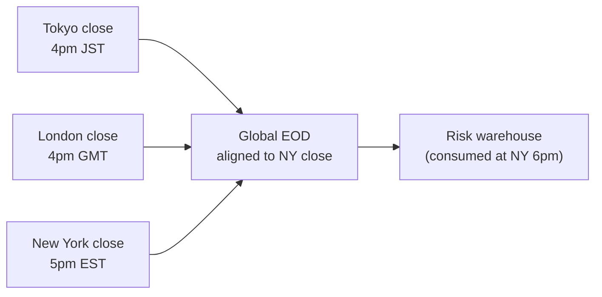
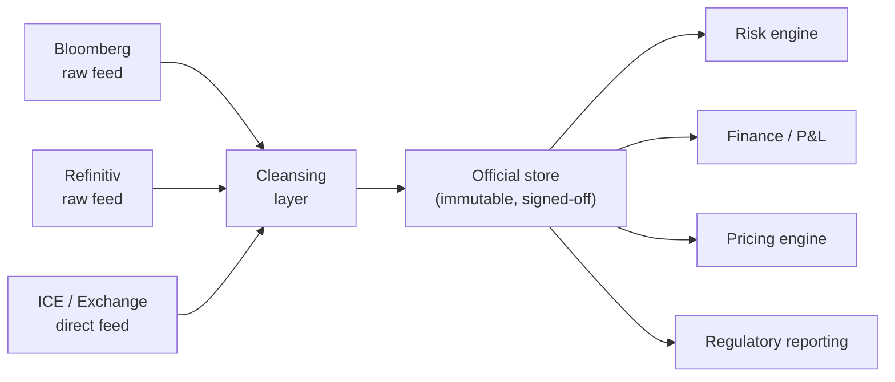

# Module 11 — Market Data & Risk Factors

!!! abstract "Module Goal"
    Every risk number the warehouse produces is a function of two inputs: a *position* and a *market-data snapshot*. Modules 03–07 covered the position half. This module covers the market-data half: what an EOD snapshot actually contains (curves, surfaces, fixings, FX rates, equity prices, credit spreads, commodities), how raw vendor feeds are cleansed into the firm's official store, why the snapshot is bitemporal, and why lineage from a stress P&L back to the specific curve point that produced it is not a nice-to-have but a regulatory expectation. Phase 4 of the curriculum starts here, and the rest of the phase — bitemporality, P&L attribution, data quality, lineage — leans on this layer being right.

---

## 1. Learning objectives

By the end of this module, you should be able to:

- **Identify** the canonical market-data structures that drive a risk warehouse — yield curves, volatility surfaces, FX rates and forwards, credit spreads, equity prices and dividends, fixings, and commodity curves — and locate each on the schema.
- **Distinguish** the three market-data layers a production firm runs — vendor (raw), cleansed (de-duped, outlier-flagged, gap-filled), official (signed-off, immutable) — and explain which downstream consumer reads from which layer.
- **Bootstrap** a zero curve from par swap rates using successive substitution, articulate the simplifying assumptions you have to make to do it in 50 lines, and recognise the production-engine machinery (day-counts, multi-curve frameworks, interpolation rules) that the toy version omits.
- **Detect** the recurring failure modes of the market-data layer — missing fixings, stale prices, vendor switches with subtle convention differences, FX cross-rate triangulation without provenance, race conditions where the official EOD is consumed before it is locked.
- **Justify** why market-data lineage is critical to the warehouse's regulatory posture — reproducibility under BCBS 239, P&L attribution, stress reproducibility, and the audit defence of any historical risk number — by tracing a single stressed VaR figure back through to the specific snapshot rows that produced it.

## 2. Why this matters

Every risk number the warehouse produces is the output of a function with two inputs: a position and a market-data snapshot. Modules 03 through 07 covered the position half — trade capture, instrument reference data, fact tables, dimensional joins. The position half is, in most large banks, the better-staffed, better-tooled, better-monitored half. The market-data half is where the silent bugs live. If yesterday's SOFR fixing did not arrive overnight and the loader fell back to the prior day's value without flagging it, every floating-leg accrual, every short-rate scenario, every CSA-discounted PV in the warehouse is wrong by some unspecified amount — and the wrongness propagates correlated through every consumer until somebody notices the limit-utilisation report drifting away from desk expectations. Days later. Sometimes weeks.

The warehouse-side consequence is concrete. The market-data layer is the *root of the lineage tree* for every aggregated risk number. A VaR figure for yesterday is a function of a sensitivities snapshot which is a function of a market-data snapshot; a stress P&L is a function of a shock vector applied to a market-data snapshot; a P&L attribution decomposes a realised return into per-factor contributions which are realised market-data moves multiplied by per-factor sensitivities. Three of the next five modules — [Module 12](12-aggregation-additivity.md) on aggregation, [Module 13](13-time-bitemporality.md) on bitemporality, [Module 14](14-pnl-attribution.md) on P&L attribution — are downstream consumers of the structures defined here. [Module 16](16-lineage-auditability.md) on lineage is fundamentally a discipline applied *to* the market-data layer, because the rest of the lineage chain inherits from the market-data identifiers.

A practitioner-angle paragraph. After this module you should be able to look at any aggregated risk number on the warehouse — a VaR row, a stress row, a P&L explain row — and trace backwards to the specific market-data snapshot it consumed: which curve, which surface, which fixings, at which `business_date` and `as_of_timestamp`, sourced from which vendor, cleansed under which methodology, signed off by Market Data Operations at which timestamp. You should also recognise the warning signs of a market-data layer that does not support that traceability — implicit fallbacks, undocumented bootstrap methods, FX cross rates without provenance, snapshots that mutate after sign-off — and write the data-quality checks that catch them before the consumer queries do.

A note on scope. This module covers the *consumption* perspective on market data — what shapes the warehouse stores, how the layered architecture works, what the bitemporal stamp protects against. It does not cover the *production* perspective — how Bloomberg's BVAL composite is calculated, how the OIS-discounted basis is derived, how a vol surface is fitted from listed-option prices. Those are the responsibility of the vendors and of the firm's quantitative-research function. The BI engineer's role is to receive the outputs cleanly, persist them with appropriate metadata, and make them queryable for downstream consumers — and the discipline to do that well is what this module is about.

## 3. Core concepts

A reading note. Section 3 builds the warehouse view of market data in nine sub-sections, plus several side-bars. Sections 3.1–3.6 cover *what is in a snapshot* — curves, surfaces, fixings, and so on — and the dimensional shape they take, with side-bars on rates surfaces (3.3a) and the market-factor dimension (3.5a). Sections 3.7–3.8 cover the timing dimension (EOD vs intraday vs real-time, and the multi-region close problem), with a side-bar on time-zone storage (3.8a). Sections 3.9–3.10 cover the layered architecture (vendor → cleansed → official) and the cleansing operations. Section 3.11 covers proxy and bootstrap derivations. Section 3.12 covers missing-data and outlier handling. Section 3.13 closes on lineage and forward-references the bitemporal structure that [Module 13](13-time-bitemporality.md) treats in depth, with a worked lineage trace (3.13a). Sections 3.14–3.16 cover FRTB modellability, interpolation, PCA, FRTB bucketing, a worked snapshot illustration, and the Market Data Operations function as a human counterpart to the schema. Readers familiar with risk data daily can skim 3.1–3.6 and concentrate on the layered architecture and lineage discussions; readers new to the topic should read top to bottom.

### 3.1 The EOD market-data snapshot

A **market-data snapshot** is a frozen, time-stamped collection of every market observation the firm needs to revalue every position and compute every risk metric for a given business date. The snapshot is not a single table — it is a *family* of tables sharing a common `business_date` and `as_of_timestamp`, each storing one structural type of market data. The risk pack for a given EOD references *the snapshot* as a noun; the warehouse implementation is a set of fact rows joined by the date-and-time pair.

The canonical contents:

| Structure                | Fact-table grain                                                  | Typical row count per snapshot |
| ------------------------ | ----------------------------------------------------------------- | ------------------------------ |
| Yield curves             | (curve_id, tenor, business_date, as_of_timestamp)                 | 50–200 curves × 10–30 tenors   |
| Volatility surfaces      | (surface_id, strike, expiry, business_date, as_of_timestamp)      | 30–100 surfaces × 25–100 cells |
| FX spot rates            | (currency_pair, business_date, as_of_timestamp)                   | 100–500 pairs                  |
| FX forward curves        | (currency_pair, tenor, business_date, as_of_timestamp)            | 100–500 × 10–20 tenors         |
| Equity spot prices       | (instrument_id, business_date, as_of_timestamp)                   | 1,000–50,000 names             |
| Equity dividend yields   | (instrument_id, business_date, as_of_timestamp)                   | matches equity universe        |
| Equity repo rates        | (instrument_id, tenor, business_date, as_of_timestamp)            | matches equity universe        |
| Credit spread curves     | (issuer, seniority, currency, tenor, business_date, as_of)        | 1,000–10,000 issuers × tenors  |
| Fixings                  | (index_id, fixing_date, business_date, as_of_timestamp)           | a few hundred reference rates  |
| Commodity prices/curves  | (commodity_id, contract_month, business_date, as_of_timestamp)    | 50–500 commodities × tenors    |

Two properties of the table to anchor against. First, every grain carries `business_date` *and* `as_of_timestamp` — the snapshot is bitemporal from the start, because vendors restate prior-day values into the next morning's feed and the warehouse must preserve both the original and the correction. Section 3.13 (and [Module 13](13-time-bitemporality.md)) treats this in detail. Second, the row counts add up to a non-trivial volume — a typical large-bank EOD snapshot is in the tens of millions of rows, refreshed daily, retained for a regulatory horizon of seven to ten years. Storage and partition design matter; pre-FRTB warehouses that under-budgeted market-data retention have spent the post-FRTB years rebuilding partitions.

A practical observation on **the snapshot identity**. Every consumer of the warehouse — risk engine, finance, regulatory reporting, P&L attribution, board pack — must agree on the snapshot identifier when they read market data. The identifier is the triple `(business_date, close_region, as_of_timestamp)`; reading without specifying the triple is reading "the latest" by some implicit convention, and implicit conventions diverge between consumers. The architectural pattern is to make the snapshot identifier an explicit input to every consumer query and to publish a "default snapshot" pointer per business date that the consumers refer to by name (e.g., `LATEST_SIGNED_OFF_EOD_NY`). The pointer is a piece of warehouse-managed metadata; consumers that read against the pointer get consistent answers, and consumers that override the pointer accept the responsibility for explaining why.

A second observation on **what the snapshot does *not* contain**. The snapshot is *market* data — observable inputs and curves derived from them. It is not pricing-engine output (PVs, sensitivities, cashflows); those live on facts that are themselves *consumers* of the snapshot, joined to the snapshot by the bitemporal triple. The separation matters because pricing-engine outputs change every time the engine is re-run, and the warehouse pattern is to retain pricing outputs against the specific market-data snapshot they were computed against. A trade revalued today against today's snapshot has one PV; the same trade revalued against yesterday's snapshot has a different PV; both PVs are correct under their respective snapshots and both belong on the warehouse.

### 3.2 Yield curves

A **yield curve** is a function from tenor to interest rate for a given currency, instrument family, and curve role. Three concepts the warehouse must keep separate:

- **Zero curve.** A curve of continuously- (or otherwise) compounded zero-coupon rates by tenor. The discount factor at tenor T is `DF(T) = exp(-z(T) * T)` under continuous compounding; the zero curve is the canonical form pricing engines consume.
- **Par swap curve.** A curve of par fixed rates — the fixed coupon that makes a par swap fair at each tenor. Par rates are the *market-quoted* form for tenors beyond the deposit/futures region; the bootstrap (section 3.11) converts them to the zero form.
- **Basis curve.** A curve of the spread between two reference indices at each tenor — e.g., 3M-vs-6M LIBOR basis, USD/EUR cross-currency basis. Basis curves are the post-2008 multi-curve world's adjustment layer; they let the warehouse discount cashflows under one curve and project forward rates under another.
- **Discount curve.** A curve dedicated to discounting cashflows under a specific collateralisation regime — OIS-discounted for collateralised trades under a CSA, an unsecured curve for uncollateralised trades. Pre-2008 a single curve served both projection and discounting; post-2008 the two are split, and the same trade is priced against potentially three or four curves simultaneously.

A yield-curve fact row looks like `(curve_sk, tenor_label, tenor_years, rate_value, rate_convention, business_date, as_of_timestamp, source_layer)`. The `rate_convention` column is non-negotiable — a 5Y point quoted as `0.026` is meaningless without saying whether it is continuously compounded, annually compounded, simply quoted, in absolute decimal or in basis points. Two banks running the same trade against the "same" curve but interpreting the convention differently will produce PVs that disagree by tens of basis points and converge to nothing. The convention belongs on the row, alongside the value.

A practical observation on **curve identity stability**. The `curve_id` should be stable across changes in the firm's curve-construction methodology. If the warehouse switches from a single-curve LIBOR-discounting framework to a multi-curve OIS-discounting framework, the *same* trade should still join to *the same* curve identifier; the methodology change is captured in the SCD2 versioning of `dim_market_factor`, not in the curve identifier itself. A curve identifier that changes when methodology changes breaks every historical join and forces consumers to maintain mapping tables indefinitely. Stable identifiers, mutable metadata.

A second practical observation on the **multi-curve framework**. Pre-2008, a single LIBOR curve served as both the projection curve (for forward-rate computation on floating legs) and the discount curve (for present-valuing all cashflows). The 2008 crisis broke that equivalence: the spread between LIBOR and OIS opened up dramatically, and the market priced collateralised trades against the OIS-implied discount rate while uncollateralised exposure continued to be discounted under a LIBOR-equivalent. The post-2008 standard is to maintain *separate* projection and discount curves per currency. A vanilla USD swap collateralised under a CSA with USD cash collateral now consumes a SOFR projection curve (for the floating-leg forwards), a SOFR discount curve (for cashflow PVing), and possibly a basis curve adjustment. The same trade between unrated counterparties uncollateralised would discount under a different curve (e.g., the funding curve of the issuing entity). The warehouse must carry the multi-curve framework explicitly: `dim_curve` distinguishes `curve_role = 'PROJECTION'` from `curve_role = 'DISCOUNT'` and pairs each trade's pricing against the relevant set. Confusing the two — discounting under the projection curve, or vice versa — is a footgun that survived from pre-2008 codebases for several years.

A second observation on **curve construction inputs**. A typical USD curve is built from a stack of instruments at different tenors: deposit rates at the very short end (1D, 1W, 1M); STIR futures (Eurodollar, SOFR-1M, SOFR-3M) at the 3M-2Y range; par swap rates from 1Y or 2Y onwards. Each instrument family has its own quoting convention, day-count, and price-to-rate conversion. The bootstrap consumes the stack jointly — the short end calibrates DF(1D) through DF(1Y), the futures region refines DF(1Y) through DF(3Y) with the futures-implied forwards, and the swap region extends to 30Y or longer. The warehouse stores both the *inputs* (deposit, futures, swap quotes on `fact_market_data` with appropriate instrument metadata) and the *outputs* (the bootstrapped zero curve), with a lineage attribute pointing each output point to the subset of inputs that determined it. The lineage is what makes the section 5 pitfall on bootstrap method tractable — when a 7Y zero rate moves unexpectedly, you can identify whether the move came from a 5Y or 7Y or 10Y input quote, or from a bootstrap-method change.

### 3.3 Volatility surfaces

A **volatility surface** is a function from (strike, expiry) to implied volatility for a given underlying and option style. The surface lives at the heart of every option price; without it, no vega exposure exists, no FRTB curvature can be computed, no stress P&L on an option-heavy book is meaningful.

Three storage shapes recur:

- **Strike grid by expiry grid.** The standard rectangular form. For an FX vol surface this might be 5 deltas (10P, 25P, ATM, 25C, 10C) by 8 expiries (1W, 1M, 3M, 6M, 1Y, 2Y, 5Y, 10Y) = 40 cells per surface.
- **SABR or similar parametric form.** Some shops store the *parameters* of a fitted vol model (alpha, beta, rho, nu in SABR) per expiry rather than the gridded vol values. This is denser but couples the warehouse to the parametric form; if the model is recalibrated, every historical surface must be re-stored.
- **Local vol or stochastic vol surface.** For exotic books, the implied surface is fed into a model that produces a local-vol or stochastic-vol surface. The warehouse may store either the implied-vol input or the model-vol output or both; the choice depends on which downstream consumer needs which.

The fact-row grain is `(surface_sk, strike_axis_value, expiry_axis_value, vol_value, vol_convention, business_date, as_of_timestamp, source_layer)`. Strike conventions are particularly treacherous: FX surfaces are typically delta-quoted (25-delta call), equity surfaces are strike-percentage-quoted (95% of spot, 100%, 105%), and rates surfaces (caps/floors/swaptions) are absolute-strike-quoted. A consumer that joins to a strike axis without checking the convention is reading the wrong cell of the surface; the bug is silent until somebody computes a vega and fails to reconcile.

A practical observation on **smile and skew**. The implied-vol surface is rarely flat across strikes. Equity index surfaces typically display a pronounced *skew* — out-of-the-money puts (low strikes) trade at higher implied vols than out-of-the-money calls (high strikes), reflecting the market's pricing of crash risk. FX surfaces typically display a smile — both wings (low-delta puts and low-delta calls) trade at higher vols than ATM, reflecting symmetric tail-risk pricing. Rates surfaces show smile in caps/floors and a more complex skew structure in swaptions. The shape matters because options away from the money cannot be priced at ATM vol; a vega exposure on a 25-delta put against a surface that does not carry the skew is mis-priced from the start. The warehouse's surface storage must capture enough cells to interpolate the skew or smile at the strikes the position cares about, and the cleansing layer must validate that the surface shape remained smooth across cells (a single cell that breaks the smile pattern is a likely vendor glitch).

A practical observation on **vol-surface arbitrage constraints**. A well-formed vol surface satisfies a set of no-arbitrage conditions: butterfly-arbitrage-free (the call-spread implied vol curve must be monotone in the right direction), calendar-arbitrage-free (the implied total variance must be monotone in expiry), and, in some treatments, additional conditions on the local-vol surface derived via Dupire. The cleansing layer for vol surfaces should validate these conditions and flag violations. A surface that violates butterfly arbitrage produces negative implied probabilities, which downstream pricers either fail loudly on (good) or silently produce nonsense from (bad). Vendor-supplied surfaces are usually arbitrage-validated at source, but in-house fitted surfaces (especially during methodology rollouts) sometimes are not, and the cleansing-layer validation is what catches the gap.

A second observation on **calendar tenor vs business-day tenor**. An expiry quoted as "1M" might mean 30 calendar days, 21 business days, or "the same day-of-month one calendar month from today, adjusted for non-business days under a documented rolling rule". The three values produce slightly different implied vols once interpolated against actual time-to-expiry on the position. The warehouse stores the *resolved* expiry date alongside the tenor label and the convention used to resolve it, so consumers can join cleanly without inheriting the original ambiguity.

### 3.3a A note on rates surface — caps, floors, swaptions

Rates volatility is its own beast. Three surface families recur:

- **Cap/floor surface** — implied volatility per (strike, expiry) for cap and floor instruments referencing a given short-rate index. Strikes are absolute (3.50%, 4.00%, 4.50%, etc.); expiries are tenor-based (1Y, 2Y, 5Y, 10Y).
- **Swaption surface** — implied volatility per (option-expiry, swap-tenor, strike) for swaptions on a given underlying swap index. Three-axis structure rather than two; storage cardinality is correspondingly larger.
- **Constant-maturity-rate surface** — used for some structured products; less common.

The black-versus-normal distinction matters in rates vol. Pre-2008, rates vol was universally quoted as Black (lognormal) implied vol. Post-2008, with policy rates spending years near or below zero, lognormal vol stopped being well-defined for many strike configurations, and the market moved to *normal* (Bachelier) implied vol — quoted in basis points per square root of time rather than as a percentage of the rate. Some shops carry both quotes (with the conversion documented); some carry only one. The vol convention belongs on the row, alongside the value, exactly as for the rate convention on the curve.

### 3.4 FX spot, FX forwards, and the cross-rate problem

FX market data has two layers: **spot rates** (one rate per currency pair at a moment in time) and **FX forward curves** (one rate per (pair, tenor) for forward-starting trades). The forward curve is built from spot plus the cross-currency basis curve plus the two single-currency interest-rate curves — it is a derived structure, but it is universally stored as a first-class fact because every consumer wants tenor-dated FX directly.

The **cross-rate triangulation problem** is one of the most recurrent silent bugs in the FX layer. The market quotes a finite set of currency pairs directly; everything else is computed by triangulation through a base currency (typically USD). If the warehouse stores `EUR/USD = 1.0850` and `USD/JPY = 152.30`, the cross rate `EUR/JPY = 1.0850 × 152.30 = 165.245`. But: the warehouse may *also* store an `EUR/JPY` directly quoted by a vendor at, say, `165.20`. The two numbers will not agree exactly because of bid-ask spread, liquidity, and timing differences across venues. Which one is correct?

There is no universal answer — but the warehouse must record *which one was used*. The pattern: a `fx_rate_source` column on the fact row that distinguishes `DIRECT_QUOTE` from `TRIANGULATED_VIA_USD` from `TRIANGULATED_VIA_EUR`, plus a `triangulation_path` column that names the bridging currency when relevant. A position's PV that consumed `EUR/JPY` as a triangulation will reconcile against another consumer's PV that consumed it as a direct quote only when both records the path. Without it, the disagreement is unattributable.

A practical observation on **stale-FX-rate diagnostics**. A particularly subtle bug: an FX rate stored against a stale `as_of_timestamp` that the consumer query reads thinking it is current. The diagnostic is to enforce a *freshness contract* per FX pair on the EOD layer — the lock cannot complete unless every active currency pair has a value with `as_of_timestamp` within an hour of the lock time. Pairs missing fresh values trigger the cleansing layer's late-data response (forecast, fallback, hold) explicitly. Without the freshness contract, the lock can complete with stale FX values silently mixed in, and consumers compute against a snapshot that is partly current and partly hours old.

A second practical observation on **the universal-base convention**. Many warehouses adopt a single base currency (USD by convention) and triangulate every cross rate through it, even when direct quotes are available. The trade-off: triangulation is slightly less accurate (a few pips of bid-ask noise) but is universally consistent — every consumer reading EUR/JPY gets the same value regardless of which vendor was queried. The alternative (use direct quotes where available, triangulate where not) is more accurate at the value level but introduces inconsistency between consumers. The choice is documented in the methodology and persisted on the fact row's source attribute.

A second observation on **FX forwards**. The forward rate at tenor T for a currency pair X/Y is, in the absence of cross-currency basis, given by interest-rate parity: `Fwd(X/Y, T) = Spot(X/Y) × DF_Y(T) / DF_X(T)`. In practice, the cross-currency basis introduces a wedge — the actual market forward differs from the parity forward by the basis. The warehouse stores the *market-quoted* forward where it is observable; for tenors where the forward is not directly quoted, it derives the forward from spot, the two interest-rate curves, and the basis curve. The derivation belongs in the cleansing or downstream-derivation layer, with provenance recorded.

A third observation on **NDF currencies**. For non-deliverable forward currencies (BRL, KRW, INR, TWD, etc.), the spot market is not directly tradeable in the conventional sense — settlement happens in USD against a fixing rate published by a designated rate-setting authority. The warehouse must distinguish NDF "spot" (the published fixing) from deliverable spot (where the latter exists at all), and the fixings (3.6) machinery extends to cover NDF-specific rate-setting events. NDF FX forwards have their own conventions and are typically quoted as outright forward points rather than forward rates.

### 3.5 Credit spreads, equity reference data, and commodities

Three more structural areas the warehouse must carry:

- **Credit spread curves** — per `(issuer, seniority, currency, tenor)`. A senior-unsecured 5Y EUR spread for a given corporate is a different fact from the subordinated 5Y EUR spread for the same name; sovereign and sub-sovereign curves layer on top. The cardinality is large: 1,000–10,000 distinct issuers × multiple seniorities × multiple currencies × 6–10 tenors per curve. Index spreads (CDX, iTraxx, single-name CDS spreads) are stored alongside.
- **Equity reference data** — spot price, dividend yield (or dividend forecast curve for index futures and dividend-sensitive options), repo rate (for short-borrowing cost on shorts and for index-future fair-value calculation). The trio is needed to price any equity derivative; missing dividends are one of the most common silent bugs in dividend-aware option pricing.
- **Commodity prices and curves** — typically a vector along the futures curve (one price per contract month), supplemented by basis differentials (location, quality, calendar spread) where the underlying physical market matters. WTI vs Brent vs Dubai is three different curves; cracking, cooling, and storage costs add layered adjustments.

The dimensional structure across all three follows the same pattern as yield curves: a `dim_market_factor` (or `dim_risk_factor` — the names are interchangeable in most warehouses; this curriculum uses `dim_market_factor` for the market-data layer and `dim_risk_factor` for the sensitivity-side joins) carries the metadata (asset class, family, identifier, conventions), and the value lives on a fact row keyed by the factor surrogate plus the bitemporal pair.

A practical observation on **credit curve shape**. Credit-spread curves are typically *upward-sloping* under normal conditions (longer-tenor spreads exceed shorter-tenor spreads, reflecting accumulated default risk) and may *invert* under stress (the market prices the issuer as more likely to default in the near term than in the long term, conditional on surviving the near term). An inverted credit curve for an issuer in normal market conditions is a signal worth investigating — either a vendor data issue or a market warning. The cleansing layer's shape-validation rules should distinguish "inversion is normal here" from "inversion is anomalous here" per issuer and per regime.

A second practical observation on **issuer reference data**. Credit spread curves are keyed by issuer, and the issuer reference data must be stable across the warehouse — `dim_issuer` carries the issuer's LEI (Legal Entity Identifier), CRIN (CUSIP-equivalent issuer identifier), parent-subsidiary structure, and credit rating history. The cross-walk between issuer identifiers is non-trivial — vendors emit different identifiers for the same legal entity, and the cleansing layer's role for credit data includes mapping vendor identifiers to the firm's canonical `issuer_sk`. A miss in the mapping causes a credit position to consume the wrong issuer's spread curve, which is a category of error that no downstream check easily catches.

A practical observation on **dividend curve dynamics**. Equity dividend forecasts are themselves a curve — projected dividend amounts and ex-dates over the next several years — and that curve drives the pricing of dividend-sensitive options (long-dated calls, dividend swaps, index futures). The curve is rebuilt periodically from analyst estimates, futures-implied dividends, and historical patterns; the rebuild method is methodology data persisted on the warehouse alongside the curve values. A rebuild that changes the dividend assumptions silently shifts every dividend-sensitive option's PV; the methodology versioning is what makes the shift attributable.

A third observation on **corporate-action handling**. Equity reference data must be aware of corporate actions — splits, mergers, spinoffs, dividend payments — that change the price series semantics across the action date. A 2-for-1 stock split halves the spot price and doubles the share count; a position quoted in shares against a pre-split price is double-counting; the warehouse must adjust either the position or the historical price series to maintain consistency. Most warehouses adjust the historical price series (the *back-adjusted* convention), so a moving-average computed across the action looks smooth. The adjustment factor is itself a piece of warehouse-managed data; it must be persisted and applied consistently across all consumers of the price series.

### 3.5a The market-factor dimension — `dim_market_factor`

A short structural anchor. Every fact row in the market-data layer joins to a single dimension that identifies the market factor: `dim_market_factor`. The dimension carries the metadata that makes the factor identifiable, classifiable, and joinable across the warehouse.

A canonical column list:

| Column                  | Purpose                                                                              |
| ----------------------- | ------------------------------------------------------------------------------------ |
| `market_factor_sk`      | Surrogate key. Opaque integer; the join target from every market-data fact.          |
| `market_factor_id`      | Stable business key (e.g., `USD_SOFR_5Y`, `EURUSD_SPOT`, `SPX_VOL_ATM_1Y`).          |
| `asset_class`           | Controlled vocabulary: `RATES` / `CREDIT` / `FX` / `EQUITY` / `COMMODITY`.           |
| `factor_family`         | Sub-classification: `ZERO_CURVE` / `VOL_SURFACE` / `SPOT_RATE` / `FIXING` / etc.     |
| `currency`              | Currency code where applicable (USD, EUR, etc.); NULL for cross-currency factors.    |
| `tenor_label`           | Tenor label where applicable (`5Y`, `3M`, `O/N`); NULL for non-tenor factors.        |
| `tenor_years`           | Numeric tenor; NULL for non-tenor factors.                                           |
| `strike_label`          | Strike label for surface points (`ATM`, `25P`, `25C`, `95%`); NULL elsewhere.        |
| `expiry_label`          | Expiry label for surface points (`1M`, `1Y`); NULL elsewhere.                        |
| `quote_convention`      | The native quote convention (continuous/annual compounding, lognormal/normal vol).   |
| `bumping_convention`    | The default bump used when computing sensitivities (1bp absolute, 1% relative).      |
| `frtb_bucket_id`        | FRTB SA bucket assignment for capital aggregation; NULL for non-FRTB factors.        |
| `data_quality_class`    | Default classification (`OBSERVED` / `DERIVED` / `PROXY_CANDIDATE`).                 |
| `is_modellable`         | FRTB IMA modellability flag, refreshed by the observability test.                    |
| `effective_from`        | SCD2: when this version of the dimension row became effective.                       |
| `effective_to`          | SCD2: when this version was superseded; NULL for current.                            |
| `is_current`            | Boolean shortcut for SCD2 lookups.                                                   |

Two properties to anchor against. First, `dim_market_factor` is **SCD2-versioned**. The metadata on a market factor evolves — the FRTB bucket assignment changes during a methodology refresh, the tenor label is restated, the modellability flag flips on or off as observability drifts. Each change writes a new row with appropriate `effective_from`/`effective_to`; the historical lookup against `business_date` resolves to the version in force at that date. Second, the dimension is **the join target for everything market-data**. `fact_market_data`, `fact_fixing`, `fact_scenario_shock` ([Module 10](10-stress-testing.md)), `fact_sensitivity` ([Module 8](08-sensitivities.md)) all join to it. The cardinality of the dimension determines the cardinality of every consumer query that aggregates by factor; design it tight.

### 3.6 Fixings

A **fixing** is a published reference rate value for a specific date — SOFR for 2024-06-15, ESTR for 2024-06-15, EURIBOR-3M for 2024-06-15. Fixings are *not* a curve — they are the realised, published, observable value of a reference rate at a specific point in time. The fixing for SOFR on 2024-06-15 is one number, published by the New York Fed at approximately 8am NY time on 2024-06-16 (one business day after the fixing date).

Fixings drive every floating-rate cashflow in the warehouse. A floating leg of a vanilla USD swap pays a coupon equal to (fixing of SOFR-3M-compounded-in-arrears at the period start) × notional × period-fraction. To compute today's accrual, the warehouse needs the relevant fixings; to compute the next coupon's value, the warehouse needs the *forecast* fixing (a forward rate read off the projection curve). The two are different objects and live in different facts: realised fixings on `fact_fixing`, forecast fixings derived from `fact_market_data`.

The grain is `(index_sk, fixing_date, business_date, as_of_timestamp, fixing_value, source_layer, publication_status)`. The `publication_status` column matters because fixings are sometimes *late* — the ARRC published-by-9am-NY policy for SOFR is a target, not a guarantee, and on bad days the fixing arrives mid-morning. The exercise in section 6 walks through the policy options for late fixings.

A practical observation on **compounded-in-arrears reference rates**. The post-LIBOR transition replaced term reference rates (LIBOR-3M was a single quoted rate for the next three months) with overnight rates (SOFR is a single overnight rate, observed daily). To express a 3M coupon under SOFR, the convention is *compounded in arrears*: the coupon is computed by daily-compounding the realised SOFR fixings over the 3-month accrual period. The warehouse therefore needs *every business day's* SOFR fixing during the accrual period to compute the coupon — not a single fixing at the period start. The grain widens accordingly: a 3M coupon on a swap might depend on 60 to 65 daily SOFR fixings, all of which must be present and current as of the EOD cutoff for the coupon to be precisely valued. A single missing fixing in the middle of the period creates an approximation gap; cleansing-layer fill rules apply.

A practical observation on **forecast-fixing models**. The forecast-fixing approach (substituting an expected fixing where the actual is missing) requires a model — typically a small implementation of futures-implied-rate extraction or an overnight-index proxy. The model is itself versioned and audited; a forecast-substitute that uses a model parameter set from six months ago is no better than a stale fallback. The warehouse stores the forecast-model identifier and parameters alongside the substituted fixing, providing a complete reconstruction path.

A second practical observation on **fixing publication conventions**. Different reference rates publish on different schedules: SOFR publishes overnight (next-business-day morning NY); ESTR publishes overnight (next-business-day morning Frankfurt); EURIBOR publishes intraday (around 11am Brussels, same day for the same-day fixing). The warehouse needs the publication-time metadata per index — a `publication_time_local` attribute on `dim_market_factor` for the index — so the loader knows when to expect each fixing and the cleansing layer's late-publication detector can trigger appropriately. A loader that hardcodes "fixings publish overnight" misses the EURIBOR same-day pattern and silently lags every EURIBOR-dependent calculation by 24 hours.

A second practical observation on **historical fixings retention**. The warehouse must retain not just today's fixing but the *full history* of every fixing series — for compounded-in-arrears coverage of long-dated swaps, for back-testing of historical-simulation VaR, for restatement reconstruction of past coupons. A fixing series for SOFR going back to 2018 (the launch of SOFR) is roughly 1,800 daily values; a series for legacy LIBOR going back further may be 5,000-10,000 values per index per tenor. The retention is small in storage terms but must be carefully managed — a missing historical fixing in the middle of a long-dated swap's accrual period will silently misvalue the trade for years.

A second observation on **fallback rates and benchmark transition**. The 2021–2023 LIBOR transition required every legacy LIBOR-referencing trade to specify a fallback rate (typically a SOFR-equivalent plus a fixed spread adjustment). The warehouse must carry the trade-level fallback specification on the instrument record and the fallback-trigger logic in the pricing engine — when the LIBOR fixing is unavailable (because LIBOR has ceased to publish), the engine must consume the SOFR fallback fixing instead. The fallback specification itself can change over the trade's life as the benchmark-transition documentation evolves; the bitemporal stamp on the instrument record captures the changes.

### 3.7 EOD vs intraday vs real-time

Three consumer cadences pull from the same upstream feeds at different latencies and stability:

- **End-of-day (EOD).** A stable, reproducible cut at a specific named time — typically 5pm New York for the firm's primary close, with regional cuts (4pm London, 4pm Tokyo) for entities reporting against local close. EOD is what the official risk pack consumes, what regulators expect, and what the audit trail freezes. Stability matters more than freshness.
- **Intraday.** A near-real-time view refreshed every few seconds or minutes, used by intraday risk monitoring, limit checks, and what-if pre-trade analysis. Intraday data is *not* the same data as EOD — it has not been cleansed, has not been reconciled across vendors, and may reflect transient errors that the EOD process would catch and correct. Intraday risk is fast and approximate; EOD risk is slow and authoritative.
- **Real-time.** Tick-level data, primarily consumed by the front-office trading systems and not generally by the risk warehouse. Real-time data is upstream of intraday; it is the firehose from which intraday snapshots are sampled.

The warehouse usually carries the EOD layer as the primary fact and the intraday layer as a secondary, optionally-retained fact (or a transient cache that ages out). Audit and regulatory consumers read EOD; pre-trade and in-day consumers read intraday. Confusion between the two — an EOD report sourcing intraday data, or vice versa — is a recurring failure mode in the early days of a warehouse build.

A practical observation on **the intraday-EOD reconciliation**. A risk consumer that watches intraday risk during the day and then receives the official EOD risk pack in the evening expects the two views to be approximately consistent — the EOD number should not look like a different portfolio. When they diverge materially, the divergence is either (i) a market-move story (the market moved between the last intraday refresh and the EOD cut), (ii) a position-move story (trades booked between the last intraday refresh and the EOD cut), or (iii) a data-story (the cleansing layer applied corrections that the intraday view was not party to). The warehouse's job is to make the third category visible — every EOD row that diverges from the equivalent intraday row by more than a tolerance carries an attribution flag identifying the divergence source. Without it, every EOD vs intraday discrepancy gets debated as a "did the system get it wrong" question; with it, the discussion converges on the actual cause within minutes.

A practical observation on **the role of regional sub-snapshots**. Each regional close is a sub-snapshot whose data feeds into the global snapshot. The relationships between sub-snapshots and the global aggregation are explicit on the warehouse: a global EOD on NY close consumes the JST sub-snapshot for Asian assets and the GMT sub-snapshot for European assets, with an `aggregation_method` attribute indicating whether each sub-snapshot was rolled-forward to NY time or accepted as-is. Documenting the aggregation makes group-level metrics reproducible; leaving it implicit makes them lottery numbers.

A second practical observation on **the staleness contract**. Some intraday consumers — desk-level limit monitoring, intraday VaR — are not allowed to consume data older than a documented staleness threshold (e.g., 15 minutes). The warehouse expresses the staleness contract through a `staleness_seconds` attribute on every intraday row, computed as `now() - publication_timestamp`, and the consumer query filters or alerts on rows that exceed the contract. Without the explicit attribute, the consumer has no way to distinguish "current" data from "current-as-of-this-morning" data, and stale-data bugs proliferate. The same pattern applies, with longer thresholds, to the EOD layer — a row whose underlying source has not refreshed in N days is suspect regardless of which layer it sits in.

A second observation on **streaming sources and snapshots**. Real-time tick data from exchanges and ECNs arrives at frequencies the warehouse does not attempt to retain — the firehose is consumed by trading systems, sampled into the intraday layer at a configurable cadence (typically every minute or every five minutes), and frozen at the EOD cut into the official layer. The warehouse's role is downstream of the streaming infrastructure; the snapshot is what the warehouse persists, the stream is what the trading systems consume directly. This separation of concerns is what keeps the warehouse architecture tractable; trying to make the warehouse the system of record for tick data is a common early-stage mistake that quickly becomes unsustainable as data volumes scale.

### 3.8 Closing conventions per region

The "global close" is a fiction. The world has at least three primary closes — Tokyo 4pm JST, London 4pm GMT, New York 5pm EST — and each is the canonical close for the entities domiciled in that region. The warehouse must carry all three concurrently for global firms, and any aggregated metric that crosses regions has to make a choice about which close to align to.



A practical observation on **holiday calendars**. Different regions observe different bank holidays; a `business_date` that is a business day in NY may be a holiday in London or Tokyo. The warehouse must carry per-region holiday calendars and compute "the prior business date" or "the next business date" relative to the consumer's region. A consumer in London asking "what was yesterday's curve" on the morning after a UK bank holiday should receive the curve from two business days prior, not one calendar day prior. The holiday calendars themselves are reference data versioned on `dim_calendar`; the convention extends to fixing dates, settlement dates, and curve roll dates.

A second practical observation on **the choice of primary close**, expanding the point. For a global firm reporting to multiple regulators, the choice of which close to anchor the *group-level* metric to is a material decision. NY 5pm gives the freshest US data but staler Asia data; Tokyo 4pm gives the freshest Asia data but yesterday-stale US data. The conventional choice is NY (because US markets dominate the group's risk in most large banks) but the choice is documented per metric and the staleness implications are reported. A board-level metric that aggregates across regions on NY close is a different metric from the same aggregation on Tokyo close, even though they look superficially the same; reconciling them requires knowing the close convention.

Two practical issues recur. First, the **Asia-stale problem**: when the global EOD aligns to NY close, the Asian markets closed eight to ten hours earlier. An Asia equity price that was current as of Tokyo 4pm is *eight hours stale* by the time the global EOD snapshot is taken at NY 5pm; the position's delta exposure to that equity is computed against a price that no longer reflects current market state. Some firms snapshot the Asian close into the global close as-is (accepting the staleness); others *roll forward* the Asian close to NY-time using the Asian futures market's intervening moves (which introduces its own approximation noise). The choice is documented per asset class and persisted on the fact row as a `close_alignment_method` attribute.

Second, the **multi-entity reporting problem**: a Tokyo-domiciled subsidiary reports to the JFSA on Tokyo close; a London entity reports to the PRA on London close; a New York entity reports to the Fed on NY close. The warehouse must produce three separate official snapshots — JST EOD, GMT EOD, EST EOD — for the three regulators, sharing some inputs but with different cut times and different forward-fill conventions. The pattern is to carry a `close_region` attribute on the snapshot identifier and to materialise the three closes as separate `as_of_timestamp` rows on the same `business_date`.

### 3.8a Time-zones and `as_of_timestamp` storage

A short flag on a recurring source of confusion. The `as_of_timestamp` column on every market-data fact row should be stored as **UTC** and converted to the relevant local time only for display. The reasons are operational:

- **Cross-region comparisons require a single time axis.** A row marked "2026-05-07 17:00" without a time zone is ambiguous — is it New York close, London close, Tokyo close, or local-server time? Stored in UTC, the same row is unambiguously `2026-05-07T22:00:00Z` (which is NY 5pm EDT) and the consumer can convert to any local time as needed.
- **DST shifts break local-time queries.** A query that filters on "WHERE as_of_timestamp = '2026-03-08 22:00:00'" will silently mishit one row out of every two during the DST transition week if the column is stored in local time. UTC eliminates the issue.
- **Daylight-saving regions vary.** US DST and EU DST do not transition on the same date; Asia is mostly DST-free. Cross-region snapshots (the `close_region` model from 3.8) need a stable time axis that is invariant to whichever region is currently in DST.

The display-layer convention is to convert UTC to local time at the BI tool — Power BI, Tableau, the firm's risk reporting application — using the consumer's preferred time zone as a profile setting. The warehouse never stores local time; the storage layer is invariantly UTC.

### 3.9 Vendor → cleansed → official

The architectural pattern that separates a robust market-data layer from a fragile one is the explicit three-layer hierarchy:



- **Vendor layer.** Raw feeds from Bloomberg, Refinitiv, ICE, exchange direct feeds, internal market-making desks. Each feed has its own conventions, identifiers, refresh cadence, and quirks. The warehouse stores raw vendor data under a `source_vendor` partition and does not modify it after receipt — the vendor layer is the audit reference for "what did the vendor send us".
- **Cleansed layer.** The result of applying outlier detection, missing-data fill, conflict resolution, and convention normalisation to the vendor feeds. Cleansed rows carry a `cleansing_method` attribute that names the specific operations applied. The cleansing layer is *not yet official* — it is the candidate for the official store, subject to sign-off.
- **Official layer.** The firm's blessed, immutable EOD snapshot. Once signed off by Market Data Operations (typically a named role with a documented approval workflow), the official rows are immutable for that `(business_date, as_of_timestamp)`. Restatements happen by writing a new row with a later `as_of_timestamp`, never by mutating the existing row.

Three properties of the layered architecture worth pinning. First, **every consumer reads from the official layer by default.** Risk, finance, P&L, regulatory — all consume the same authoritative source. A consumer that bypasses the official layer to read raw vendor data has chosen unreproducibility; the warehouse should make that choice an explicit deviation, not a quiet shortcut. Second, **the layers are stored, not transient.** Vendor data is retained; cleansed data is retained; official data is retained — all with appropriate bitemporal stamps so any historical question ("what did we believe yesterday at noon?") has a deterministic answer. Third, **sign-off is a workflow, not a metadata flag.** The Market Data Operations team owns a documented procedure — checks executed, exceptions reviewed, dispensations granted, sign-off attested — and the warehouse stores the workflow output (`signed_off_by`, `signed_off_at`, `dispensation_codes`) on the official rows.

A practical observation on **storage cost discipline**. Three layers of retention multiply the storage volume by roughly three for the headline-snapshot count. Compression helps (numerical columns with limited cardinality compress well), columnar storage helps (consumer queries typically read a narrow column subset), and lifecycle management helps (vendor-layer rows older than the regulatory minimum can be moved to colder storage tiers with longer retrieval latency). The discipline is to right-size each layer's retention against its consumer demand: official-layer rows stay hot for the regulatory-window minimum (typically 7 years); cleansed-layer rows can age to warm storage after a quarter; vendor-layer rows can age to cold storage after a month. The cold-storage rehydration on regulator request must be tested periodically — a regulator who asks for a 5-year-old vendor row and receives "we will get back to you in 2 weeks" gets unimpressed.

A practical observation on **the cleansed-but-unsigned-off intermediate state**. Between cleansing completion and sign-off, the cleansed values are real but provisional. Consumers reading the cleansed layer during this window must accept the provisional flag and acknowledge that the values may change before sign-off. The architectural pattern is a `signoff_status` attribute (`PENDING`, `SIGNED_OFF`, `WITHDRAWN`) on the cleansed-layer rows, with consumers that require sign-off filtering on `SIGNED_OFF` and consumers comfortable with provisional data filtering more loosely. The status transitions are themselves auditable events.

A practical observation on **dispensation auditability**. Every dispensation granted by Market Data Operations creates an audit record: who granted, on what evidence, at what time, with what justification. The dispensation records are themselves audited — typically by internal audit on a periodic basis — to verify that the dispensation flow was followed (reviewer was authorised, evidence was sufficient, justification was reasonable). The warehouse stores the dispensation records on a separate `fact_dispensation` table with foreign keys back to the affected market-data rows, providing a queryable audit trail. The deeper audit-trail discipline is in [Module 16](16-lineage-auditability.md).

A second observation on **the publication contract**. Every layer should publish a contract — what it accepts as input, what it guarantees as output, what its refresh cadence is, what its sign-off SLA is. Consumers code against the contract, not against undocumented behaviour, and contract changes go through a change-control process that notifies all affected consumers. Without the contract, every consumer is implicitly betting on the layer behaving the way it behaved yesterday, and unannounced changes break consumer queries silently. With the contract, the layer becomes a stable platform other systems can build on.

### 3.10 The cleansing operations

What happens between vendor and cleansed? Five operations recur across asset classes:

- **Outlier detection.** Spike filters that flag any value moving more than a configurable threshold (e.g., 5σ over a rolling window) without corroborating moves in correlated factors. A US 10y rate that prints 50bp lower than yesterday with no equivalent move in the 2y, 5y, or 30y is a likely vendor glitch; the cleansing layer flags it for review.
- **Stale-data flagging.** Rows that have not changed for N consecutive business days are flagged as potentially stale. A government bond yield that has not moved in three days is suspicious; an emerging-markets credit spread that has not moved in a week may be indicative of a feed cut. The threshold N is asset-class-specific.
- **Missing-data fill.** Where a vendor failed to publish a value, the cleansing layer applies a documented fill rule — last-good-value, interpolation between bracketing values, proxy from a related instrument — and flags the fill explicitly on the row (`fill_method`, `fill_provenance`).
- **Cross-vendor reconciliation.** Where two or more vendors quote the same factor, the cleansing layer compares them, flags meaningful disagreements (e.g., > 1bp on a rate, > 0.5% on a spot), and either picks one (per a documented vendor-priority rule) or takes a weighted blend. The chosen value goes to the cleansed layer; the rejected values are retained on the vendor layer for audit.
- **Convention normalisation.** Vendors report in different conventions — Bloomberg may quote a swap rate semi-annual ACT/360 where Refinitiv quotes the same rate annual 30/360. The cleansing layer converts to the firm's canonical conventions and persists both the original and the normalised value, with the conversion factor explicit.

Each cleansing operation produces a *flag*, a *value*, and a *provenance*. The triple is what makes the cleansing layer auditable. A cleansed row that says "value = 2.503%, fill_method = LAST_GOOD_VALUE, provenance = vendor=BLOOMBERG, original_business_date=2024-06-14" tells the consumer exactly how the number got there; a cleansed row that says only "value = 2.503%" is the silent-bug machine.

A practical observation on **cross-vendor weighting**. Where two vendors agree closely, the cleansing layer commonly stores both raw values on the vendor layer and produces a *blended* value on the cleansed layer using a documented weighting (e.g., 60% Bloomberg / 40% Refinitiv based on historical accuracy on this factor, or a liquidity-weighted blend). The blend is one example of a derivation; the cleansing layer must record the weights, the vendor identifiers consumed, and the algorithm name on the cleansed row's provenance. Where two vendors disagree materially (above the asset-class threshold), the cleansing layer does *not* blend — it picks per the vendor-priority rule and flags the disagreement on the row, escalating to Market Data Operations for review.

A practical observation on **alert fatigue**. Cleansing-layer outlier detection generates a stream of flags every day; if every flag triggers a high-priority alert, the operations team rapidly tunes them out. The discipline is to *tier* the alerts: critical (page immediately), high (review within an hour), medium (review by EOD lock), low (logged for the morning review). The tiering depends on the factor (a SOFR fixing alert is critical; an EM-currency vol alert is medium), the magnitude of the breach, and the corroborating signals. Alert tiering is itself a piece of warehouse-managed methodology that evolves as the team learns which alerts are actionable.

A second observation on **the dispensation workflow**. Sometimes a flagged outlier is genuine — the value really did move that much, the spike detector triggered on a real event. The Market Data Operations team accepts the value with a `dispensation_code` attached to the cleansed row, recording which person granted the dispensation, on what evidence, and at what timestamp. The dispensation flow is what prevents legitimate market events from being silently smoothed away by the cleansing layer; without it, a flash crash gets cleansed out and the warehouse loses fidelity to actual market reality. The dispensation code itself is a controlled vocabulary (`MARKET_EVENT_CONFIRMED`, `VENDOR_GLITCH_OVERRIDDEN`, `MANAGEMENT_OVERRIDE`, etc.) and the codes themselves are auditable.

A third observation on **methodology evolution**. Cleansing rules themselves change over time as the firm learns about new failure modes, new vendors, new market regimes. A spike-detection threshold tightened from 6σ to 5σ in response to a missed glitch is a methodology change with consequences for historical reproducibility — re-running yesterday's cleansing under today's tightened rule may flag values that were accepted at the time. The discipline is to *version* the cleansing methodology and stamp every cleansed row with the methodology version in force at the time of cleansing. Historical re-runs invoke the as-of-then version explicitly. The pattern is the same SCD2 versioning the dimensions use, applied to the rules themselves.

A fourth observation on **the interaction with intraday updates**. Most cleansing logic is run as a batch process at EOD, but some rules apply intraday — particularly cross-vendor reconciliation when both vendors are streaming. An intraday cleansed value may be revised again at EOD when more inputs are available; the bitemporal pattern handles the revision (a new `as_of_timestamp` is written) without losing the intraday history. Intraday risk consumers see the streaming-cleansed value; EOD risk consumers see the EOD-cleansed value; both are persisted and both are reproducible.

### 3.11 Proxy and bootstrap

Two distinct derivation operations appear in the market-data layer: *proxy* and *bootstrap*. They are often confused; they mean different things.

A **proxy** is a substitution: factor A has no observable market data today, so we use factor B as a stand-in, with a documented rationale. The 7Y point on a thinly-traded EM sovereign curve is missing; the cleansing layer proxies it from the 5Y and 10Y points by linear interpolation, or from a benchmark sovereign by spread offset, or from the issuer's credit spread by a documented mapping. The proxy is an explicit data-quality concession; it must be flagged on the row as `derivation_method = 'PROXY'` with `proxy_source` naming the donor factor and `proxy_method` naming the rule.

A **bootstrap** is a transformation: we observed market-quoted instruments (par swap rates, deposit rates, futures prices) and need to derive a structurally different curve (zero rates, discount factors). The bootstrap is the standard procedure for converting market quotes into the form the pricing engine consumes. Section 4's worked example shows the toy version; production engines (QuantLib, rateslib, Murex's internal curve module) handle day-count conventions, multi-curve frameworks, holiday calendars, interpolation choices, and convergence on the joint solution.

A **bootstrap method** is part of the data, not part of the code. Two bootstraps of the same par-rate inputs under different methods (linear-on-zero vs log-linear-on-discount-factor vs monotone-cubic-spline) produce zero rates that agree at the input knots and disagree between them. A 7Y zero rate that was bootstrapped under linear-on-zero may differ from the same 7Y zero rate bootstrapped under cubic-spline by tens of basis points. The warehouse must persist the method on the curve fact (`bootstrap_method = 'LOG_LINEAR_DF'`, say) so a later P&L attribution that re-evaluates the same trade against the same snapshot can reproduce the curve exactly.

A practical observation on **derivation chains**. A single output value may be the result of *multiple* derivations stacked: a 7Y EM-corporate spread that was proxied from a peer-group average, where the peer-group average was itself bootstrapped from sector-index components, where the sector-index components were filled from prior-day values. The lineage attribute on the output row should record the *chain* — not just "PROXY" but "PROXY(peer_group_avg) -> BOOTSTRAP(sector_components) -> FILL(prior_day)". Consumers reading the value can then assess the quality of every step in the chain. Without the chain, two derivations of the same shape look equivalent even when one is two steps from observed data and the other is five.

A second practical observation on the **proxy hierarchy**. Where multiple proxy options exist for a missing factor, the firm's methodology pins a *priority order*: try the first proxy rule, fall back to the second if the first is also unavailable, and so on. The hierarchy is documented per asset class and per factor family. A common pattern: for a missing single-name CDS spread, proxy first from the same issuer's bond spread (matching seniority and currency), second from a peer-group average spread (constructed from comparably-rated issuers in the same sector), third from the corresponding sector index spread. Each step is more approximate than the previous; the hierarchy is what bounds the approximation. The warehouse stores both the *chosen* proxy rule and the *priority position* of the rule in the hierarchy, so the consumer can see how deep into the hierarchy the cleansing layer descended for any given fill.

A second observation on **proxy quality monitoring**. A proxy is, by construction, an approximation. The firm typically tracks the *historical accuracy* of each proxy rule by comparing the proxy value to the eventually-observed actual value (when the actual is published with a delay) or to a more-trusted alternative source (where one becomes available). The accuracy metric is itself a piece of warehouse-managed data, refreshed periodically, and feeds into the methodology-review process — proxy rules with degrading accuracy get retired or replaced. The cleansing layer's `proxy_method` attribute joins to a methodology table that carries the accuracy history, providing the consumer with a confidence indicator alongside every proxied value.

### 3.12 Missing-data and outlier handling

Missing data and outliers are two failure modes of the same underlying problem: the vendor feed is not telling the warehouse what it expected to be told. Each firm has a documented policy.

For **missing fixings** specifically, three policies recur (see exercise 2 for a worked treatment):

- **Wait.** Hold the EOD until the fixing arrives. Robust on accuracy; brittle on schedule. If the fixing is hours late and the EOD must be locked for downstream consumers, waiting is not an option.
- **Use yesterday's value.** Carry forward the prior-day value with an explicit `fill_method = 'PRIOR_DAY'` flag and a downstream alert. The warehouse is honest about the substitution; the consumer can decide whether to act on the alert.
- **Use a forecast / proxy.** Compute the expected fixing from a related instrument (the SOFR-3M futures contract implied rate, the prior-day SOFR plus the overnight rate move) and substitute it with `fill_method = 'FORECAST'`. More accurate than yesterday's value when the underlying rate has moved; more complex to defend at audit.
- **Hold the snapshot.** Do not lock the EOD at all until the fixing is resolved. Different from "wait" in that the snapshot is *not* finalised — downstream consumers see a `snapshot_status = 'PENDING'` flag and know to re-poll. Useful when the missing fixing is consequential and the wait is bounded; not useful when the wait is open-ended.

The choice is per-firm and per-fixing — the policy for a critical fixing like SOFR may be different from the policy for a less-watched EM fixing. The warehouse stores the policy in a reference table and the chosen value on the fact row, with the path explicit.

A practical observation on **fixing-as-of-time precision**. Fixings are quoted *as of* a precise reference time — SOFR is the volume-weighted median of overnight Treasury repo transactions in a defined window, ESTR is computed from euro-area unsecured overnight lending in a defined window. The window definition matters; a fixing reproduced from raw transaction data with a slightly different window definition will not match the published value. The warehouse stores the published fixing and treats it as authoritative; reproducing fixings from underlying data is a specialist's task that the warehouse does not attempt.

A second practical observation on **the late-fixing escalation**. The Market Data Operations team typically maintains a *fixing-watch list* — the small set of fixings whose timely arrival is critical to EOD lock. A late SOFR fixing triggers an immediate page; a late EM-currency fixing triggers a quieter alert; a late but-not-critical fixing might just be logged for the morning review. The watch list is asset-class- and book-composition-specific (a firm with heavy SOFR exposure runs SOFR as critical; a firm with no USD floating exposure does not), and it is reviewed periodically as the book composition evolves. The watch list is what calibrates the operational response; without it, every late fixing gets the same response and the team is either under- or over-reacting.

For **outliers**, the canonical patterns:

- **Spike detection.** A value that moves more than X standard deviations over a rolling window without corroborating moves elsewhere. Threshold X is asset-class-specific (X = 5 for rates, lower for FX, higher for equity vol surfaces where smile dynamics produce legitimate large moves).
- **Stale-data detection.** No change in N business days. Threshold N is asset-class-specific.
- **Cross-vendor disagreement.** Two vendors quote the same factor with values differing by more than Y% or Y bp. Threshold Y is asset-class-specific.
- **Calendar/expiry consistency.** A vol-surface cell whose expiry date does not align to the calendar (a 1M cell quoted with an expiry date 17 days from today during a normal-market month) is suspect; a yield-curve tenor whose tenor-years is inconsistent with its tenor label is suspect. Schema-level validation catches these before they propagate.
- **Inter-factor consistency.** A 5Y zero rate that disagrees with the implied 5Y from a separately-stored discount factor at 5Y by more than rounding tolerance indicates a derivation inconsistency. The check is cheap and catches both data-loading bugs and methodology mismatches.

Each detection rule produces a flag. The cleansing layer does not *correct* outliers automatically — it flags them, escalates to the Market Data Operations team for review, and the team chooses between accepting (it really did move that much), correcting (the vendor sent a glitch, use the alternative source), or holding (do not lock the EOD until the issue is resolved). The decision goes back into the audit trail.

### 3.13 Why market-data lineage is critical

The market-data layer is the root of the lineage tree. Every aggregated risk number — VaR, stress P&L, FRTB capital, P&L attribution — is a function of position data and market-data inputs; the position layer is reproducible from `fact_position` and its joins, and the market-data layer must be equivalently reproducible from `fact_market_data` and its joins. Four downstream concerns make this non-negotiable:

- **Reproducibility for regulators.** A regulator (Fed, PRA, ECB, JFSA) routinely asks "show me the report you submitted on 2024-06-15 exactly as it stood on that date". The submission is a function of position data and market-data inputs as of 2024-06-15. If either side has been mutated since, the report is unreproducible. The bitemporal stamp on every market-data row, plus the immutability of the official layer post-sign-off, is what makes the regulatory ask answerable.
- **P&L attribution.** [Module 14](14-pnl-attribution.md) decomposes the day-over-day P&L into per-factor contributions. The decomposition is `realised_factor_move × sensitivity = factor_pnl_contribution`. The realised factor move is `value(business_date) - value(business_date - 1)` *for the same factor under the same methodology*. If the curve was re-bootstrapped under a different method on day T, the day-over-day move on the zero rate is partly a genuine market move and partly a methodology change; the attribution is broken until the methodology change is identified and isolated.
- **Stress reproducibility.** [Module 10](10-stress-testing.md) computes stress P&L as `shock_vector × sensitivity`. The shock vector is anchored to the same market-data layer the sensitivities were computed against; if the snapshot was rerun under different inputs, the stress is computed against an inconsistent base. The warehouse-side discipline is the conformance check from M10 §3.7, which depends on every stress row carrying the market-data snapshot identifier it was computed against.
- **BCBS 239 lineage.** The Basel principle on risk-data aggregation and reporting demands that risk numbers be traceable to source. [Module 16](16-lineage-auditability.md) treats this in depth; the market-data layer's role is to *be* the source — to carry stable identifiers, immutable post-sign-off rows, and provenance attributes that downstream lineage tooling can consume. A market-data layer that does not carry vendor provenance, cleansing methods, derivation methods, or sign-off timestamps cannot support a BCBS 239 attestation regardless of how good the downstream tooling is.

A practical observation on **independent price verification (IPV)**. A periodic finance-led process compares the warehouse's official market-data values against an independent reference set — typically a different vendor or a custodian-supplied valuation — and investigates material discrepancies. IPV is the layer's external check: the cleansing layer's internal validation can be wrong systematically (a bug in the spike-detection code, a methodology that everyone agrees with internally but is empirically inferior), and IPV is what catches the systematic miss. The warehouse stores the IPV results alongside the official values and the dispensation history, providing a complete picture of the assurance applied to each value.

A second practical observation on **lineage as a first-class concern**, not an afterthought. Many warehouses built before BCBS 239 became operational treated lineage as a documentation exercise — a Visio diagram, a wiki page, an annual review cycle. The post-2014 expectation is that lineage is *queryable* — given any aggregated risk number, the warehouse can produce a deterministic answer to "what inputs produced this number, sourced from where, signed off by whom". The queryable expectation forces lineage attributes onto every fact row and every dimension row, not just into a separate metadata catalogue. The market-data layer is the deepest link of the chain; if it carries the attributes, the rest of the chain inherits them naturally; if it does not, the chain breaks at its root.

A practical observation on **the consumer-side lineage query**. Most BI tools provide a "where did this number come from" right-click action. For warehouse-managed numbers, that action should resolve to a deterministic chain back through the lineage attributes — fact row, dimension joins, source-system identifier, vendor record, sign-off attestation. Building the right-click action is a one-time investment that pays off every time a consumer doubts a number; without it, every doubt becomes an email thread.

A second practical observation on **lineage and reproducibility versus performance**. Carrying lineage attributes on every row has a storage cost — a `provenance` JSON column or a set of foreign keys adds bytes per row, and at half-a-billion-row scale the bytes add up. The performance cost of *querying* the lineage is also non-trivial — a five-step chain across the warehouse requires multiple joins. The defensive design is to materialise *summary* lineage views (the most common queries pre-aggregated into a flat reportable shape) while retaining the per-row attributes for the deeper investigations. The summary view is what consumers query daily; the per-row view is what the audit defender pulls when the regulator's question goes deep.

A forward reference. Every market-data row in the warehouse has `business_date` AND `as_of_timestamp`; restatements are common (a vendor corrects yesterday's print at 8am the next day, the warehouse loads the correction with a later `as_of_timestamp` while preserving the original). The bitemporal pattern is the same one [Module 13](13-time-bitemporality.md) generalises across the warehouse — but in the market-data layer it is not optional, because the regulatory reproducibility expectation kicks in immediately.

### 3.13a A worked lineage trace

To make the lineage discussion concrete, follow a single number backwards through the warehouse. Yesterday's reported one-day 99% historical VaR for the firm was $42.7M. The number sits on `fact_var` against `(book_sk = FIRMWIDE, business_date = 2026-05-06, as_of_timestamp = 2026-05-06T22:30:00Z)`.

The lineage chain, traced in reverse:

1. **`fact_var` row** points to a `historical_window_id` referencing the 250 observation dates used in the historical-simulation calculation, plus a `sensitivity_snapshot_id` and a `market_data_snapshot_id`.
2. **The sensitivity snapshot** lives on `fact_sensitivity` rows keyed by the `sensitivity_snapshot_id`; each row carries the `risk_factor_sk` it is computed against and the position it belongs to.
3. **The market-data snapshot** lives on `fact_market_data` rows keyed by `(business_date = 2026-05-06, close_region = EST_EOD, as_of_timestamp = 2026-05-06T22:00:00Z)`. Each row carries `market_factor_sk`, the value, the source layer, the cleansing method, and the provenance.
4. **The vendor layer** carries the raw inputs each cleansed row was derived from, by following the `provenance` attribute back to (vendor, vendor_business_date, vendor_publication_timestamp).
5. **The bootstrap inputs** for any curve-derived factors are themselves rows on `fact_market_data` with `factor_role = 'INPUT_PAR'` and a lineage pointer connecting them to the bootstrapped output.
6. **The sign-off attestation** for the official market-data snapshot is on a separate `fact_signoff` (or equivalent) recording who signed, at what time, with what dispensations applied.

Reading the chain forwards, the regulator's question "show me how you got to $42.7M on 2026-05-06" is answered by walking from the VaR row through the sensitivities, through the historical-simulation window, into the market-data snapshot, into the vendor layer, into the sign-off record. Every step is a deterministic join. The audit defence is "we have the data and the methodology"; both must be true.

The point for the BI engineer is that *every* link in this chain depends on the foreign key being correctly populated and the bitemporal stamp being respected. A `fact_var` row that does not carry a `market_data_snapshot_id` — or that points to a snapshot that was subsequently mutated — breaks the chain at one of its most consequential links. The discipline is one of *not allowing* unanchored fact rows; the warehouse should reject loads that do not carry the required lineage attributes.

### 3.14 Modellable vs non-modellable risk factors (FRTB)

A short flag on a topic this module touches but defers to [Module 19](19-regulatory-context.md). The FRTB Internal Models Approach (IMA) classifies every risk factor as either **modellable** or **non-modellable** based on the observability of its market data. A factor is modellable only if the warehouse can demonstrate at least 24 *real* observable price quotes per year, with no gap longer than one month between consecutive observations. A factor that fails the test is a **non-modellable risk factor (NMRF)** and is subject to a punitive stressed capital add-on outside the main IMA expected-shortfall calculation.

The warehouse-side implication is that the market-data layer must support an explicit *observability test* per risk factor. The test consumes `fact_market_data` (or its vendor-layer ancestor) over a rolling year and counts qualifying observations per factor. The output flags `modellable = TRUE/FALSE` per (factor, business_date) and feeds the FRTB IMA capital calculation. The cleansing layer's role is upstream: a value that was filled by proxy or by prior-day fallback does *not* count as a real observation for modellability purposes; only genuine vendor-published quotes count. The provenance attributes from section 3.10 are what make the modellability test rigorous — without them, a fill or proxy gets counted as an observation and the factor's modellable status is overstated.

For BI engineers the punchline is simple. Every market-data row needs a `data_quality_class` (or equivalent) attribute that distinguishes `OBSERVED_QUOTE` from `FILLED` from `PROXIED` from `BOOTSTRAPPED`; the FRTB IMA observability test will consume that attribute, and any row that does not carry it correctly will silently skew the modellable-factor count and the capital calculation. The deeper FRTB treatment is in Module 19.

### 3.14a Interpolation choices on curves and surfaces

A side-bar on a topic the bootstrap section glossed over: when a consumer asks for a value at a tenor or strike that is *between* the input knots, the warehouse must interpolate. The choice of interpolation rule is a methodology decision with material P&L consequences and belongs on the curve or surface metadata.

Common rules for yield curves:

- **Linear on zero rates.** Simple, monotonic, but produces non-smooth forward rates (the implied forward jumps at each knot).
- **Linear on log discount factors.** Equivalent to piecewise-constant forward rates between knots; smooth in DF but stepped in forward.
- **Monotone cubic spline (Hyman, Steffen, etc.).** Smooth in zero rates and forward rates; can produce ringing if the input data is noisy.
- **Tension splines.** Smooth with controllable trade-off between flexibility and rigidity; used by some shops for equity dividend curves.

Common rules for volatility surfaces:

- **Linear on implied vol.** Simple but produces non-smooth Greeks.
- **SABR or SVI parametric fit per expiry.** The smile is described by a parametric form fitted to the cells, and interpolation between cells happens within the parametric form. Smooth and arbitrage-free under appropriate constraints.
- **Local-vol grid via Dupire.** A non-parametric approach where the implied surface is converted to a local-vol surface and interpolated in the local-vol space; consumes more compute and is sensitive to noise.

The point for the warehouse is that every curve and surface row carries an `interpolation_method` attribute on its metadata (typically on `dim_market_factor` rather than on the value-row itself, since the rule applies to the whole curve/surface). Two consumers reading the same input knots under different interpolation rules will see different intermediate values; reproducibility requires the rule to be persisted and respected by all consumers.

### 3.14b Principal-component decomposition — a glimpse

A short flag on a structural property of curve data that BI engineers benefit from knowing. If you take the daily moves of a yield curve over a year and run a principal-component analysis on the (tenor × time) matrix, the first three components typically explain 95-99% of the variance: a *level* component (parallel shift across all tenors), a *slope* component (steepening or flattening of the curve), and a *curvature* component (humping or de-humping in the middle). The remaining components describe noise and very-short-term-specific dynamics.

The practical content for the warehouse: aggregated risk metrics on rates exposure can often be expressed compactly in PCA space rather than in raw tenor-bucket space. A book's exposure to the level component is the parallel-shift sensitivity; exposure to the slope component drives the steepener/flattener P&L; exposure to the curvature component drives the butterfly-trade P&L. Some shops materialise PCA-projected sensitivity views (`fact_sensitivity_pca`) alongside the raw bucketed sensitivities to support these analyses; the projection requires a stored eigenbasis (which is itself a piece of market-data-derived methodology data, refreshed periodically). The deeper PCA treatment is in [Module 12](12-aggregation-additivity.md)'s aggregation discussion.

### 3.14c Bucketing for FRTB SA capital aggregation

A short note on the bucketing structure FRTB SA imposes on the risk-factor universe — relevant here because the bucketing is metadata on `dim_market_factor` and the warehouse must carry it cleanly.

The FRTB SA prescribes per asset class a fixed set of *buckets* — for general interest-rate risk, 10 buckets indexed by currency and a "low-volatility / medium / high" classification; for credit-spread risk, 18 buckets indexed by sector, credit quality, and maturity; for equity, 11 buckets indexed by region and large-cap/small-cap; and so on. Within each bucket, sensitivities are aggregated under prescribed intra-bucket correlations; across buckets, aggregation uses inter-bucket correlations.

The warehouse's job is to assign every `market_factor_sk` to its FRTB bucket on `dim_market_factor.frtb_bucket_id`. The assignment is sometimes obvious (USD SOFR points all map to the USD GIRR bucket) and sometimes a judgement call (a corporate issuer's sector classification might depend on which industry-classification system the firm uses). The judgement calls go in the methodology document; the warehouse implements them through the dimension attribute.

A subtlety: the FRTB framework occasionally updates bucket definitions, and a recategorisation moves factors between buckets. The SCD2 versioning on `dim_market_factor` handles the transition: the prior bucket assignment is preserved in the historical row, the new assignment is in the current row, and historical FRTB SA submissions reproduce against the as-of-then assignment. The deeper FRTB treatment, including the bucket-by-bucket aggregation formulae, is in [Module 19](19-regulatory-context.md).

A second subtlety on **bucket coverage gaps**. A risk factor that does not map to any FRTB bucket (because it is a niche factor not contemplated by the framework, or because the firm's mapping methodology has a gap) needs to be flagged explicitly. The default in some warehouses is to assign such factors to a residual bucket; the disciplined approach is to refuse the load until the mapping is documented, because residual-bucket capital treatment is typically punitive and unintended residual assignments are a common source of capital surprises. The data-quality check is a coverage report: every active risk factor in `dim_market_factor` should map to a non-null `frtb_bucket_id`, and any nulls trigger investigation.

### 3.15 A worked snapshot — what one EOD looks like end to end

A short orientation, to make the abstract structure concrete. Picture a global bank's NY 5pm EOD snapshot for 2026-05-07. The snapshot identifier is `(business_date = 2026-05-07, close_region = EST_EOD, as_of_timestamp = 2026-05-07T22:00:00Z)`. Inside it:

- **Yield curves**: about 80 distinct curves (USD SOFR projection, USD SOFR discount, EUR ESTR, GBP SONIA, JPY TONAR, AUD AONIA, plus per-currency basis curves and the major EM curves) × 12 to 25 tenors each, totalling roughly 1,500 fact rows.
- **Volatility surfaces**: about 50 surfaces (FX vol per major pair, equity index vol per major index, swaption vol per currency, cap/floor vol per currency) × 25 to 40 cells each, totalling roughly 1,500 fact rows.
- **FX rates and forwards**: 200 spot pairs + 200 pairs × 12 forward tenors, totalling about 2,600 rows.
- **Equity reference data**: 8,000 listed equities × 3 attributes (spot, dividend yield, repo rate), totalling 24,000 rows.
- **Credit spreads**: 5,000 issuers × 3 seniorities × 2 currencies × 6 tenors, totalling roughly 180,000 rows (sparser in practice — most issuers have one or two seniority/currency combinations).
- **Fixings**: 200 reference indices × 1 fixing per business day, totalling 200 rows for the snapshot date plus historical accrual-period fixings (potentially thousands of rows for compounded-in-arrears coverage).
- **Commodities**: 100 commodities × 24 contract months, totalling 2,400 rows.

Total: roughly 200,000 to 300,000 fact rows for a single snapshot. Multiply by 252 business days per year and a 7-year regulatory retention horizon, and the market-data layer is on the order of half a billion rows in steady state — modest by big-data standards, substantial by the standards of a typical risk-warehouse fact table. Partition design (typically by `business_date` with sub-partitioning by asset class), compression, and lifecycle management (cold-store after a documented age, with rehydration on regulator request) all matter.

A second pass on the snapshot. Layer the bitemporal dimension over the headline numbers: any single (`business_date`, `close_region`) pair may carry *multiple* `as_of_timestamp` versions because of restatements. A typical day might see two or three restatements per snapshot — a vendor correction at 9am the next morning, an additional dispensation applied at midday, a methodology refresh at end of week — and each restatement appears as additional rows for the affected factors with later `as_of_timestamp` values. The original rows are *not* deleted; they are preserved alongside, and consumers query "the value as of timestamp X" rather than "the value". The volume implication is that the layer is a few times larger than the headline-snapshot count suggests; the storage discipline must accommodate it without compromising the bitemporal pattern.

A practical observation on **regional snapshots and intraday consumers**. An intraday risk consumer in London asking "what is my current FX exposure?" will read against the most recent intraday market-data state, not the prior-day GMT EOD. The intraday layer must therefore carry its own bitemporal stamps and its own freshness contracts; the EOD layer is the official archive but the intraday layer is the working surface for in-day queries. The two layers coexist with a clear contract about what each is for; consumers must know which they want.

A second pass on the volume. The half-billion-row steady state is roughly equivalent to a few hundred GB of compressed columnar storage — not a problem for any modern warehouse engine. Where the volume becomes meaningful is in the *historical reload* scenario: re-running yesterday's risk pack against a corrected market-data snapshot may need to read tens of millions of rows in a few seconds, which requires partition pruning, columnar projection, and clustered-by-business-date physical layout to be working correctly. The performance discipline is in [Module 17](17-performance-materialization.md); the layer's contribution is to be friendly to it.

A third pass on the snapshot. The relationship between snapshots and *risk consumers* is many-to-one upstream and one-to-many downstream. Many vendor feeds (Bloomberg, Refinitiv, ICE, exchanges, internal market-makers) feed into one cleansed-and-official snapshot; one official snapshot feeds many consumers (risk engines, finance, regulatory, P&L attribution, board reports). The architectural simplicity of "one official snapshot, many consumers" is what makes the warehouse-side discipline tractable: every consumer reads from the same authoritative source and will agree with every other consumer on what the underlying market data was. The architectural simplicity is fragile, however — the temptation to bypass the snapshot ("just read the raw vendor for this one report") is constant, and resisting it is what protects the consistency property the warehouse exists to provide.

### 3.16 Market Data Operations as a function

A short note on the human side of the layer, because the warehouse design assumes its existence. **Market Data Operations** is a named function — typically a small team of 5-15 people in a global bank — whose responsibility is the end-to-end integrity of the market-data layer. The team's day looks like:

- **Pre-EOD (afternoon).** Monitor the vendor feeds for completeness and freshness. Investigate any factor that has not refreshed within its expected window. Liaise with vendors over open data tickets. Apply pre-EOD corrections under the cleansing-layer dispensation workflow.
- **EOD (evening).** Trigger the cleansing run against the day's vendor data. Review the exception report (outliers flagged, cross-vendor disagreements, missing-data fills). Approve or reject each exception, applying dispensations where appropriate. Sign off the official snapshot. Communicate any open items to downstream consumers.
- **Post-EOD (next morning).** Process overnight vendor restatements. Verify late-arriving fixings against the prior-day fill (forecast or fallback). Apply corrections via the bitemporal load pattern (new `as_of_timestamp`, original rows preserved). Communicate any material restatements to consumers who may need to refresh dependent calculations.
- **Periodic.** Methodology reviews (bootstrap method, interpolation rule, vol-surface fit). Vendor reviews (cost, accuracy, coverage). FRTB modellability monitoring. BCBS 239 attestation contributions. Audit support.

The warehouse design must support every step of this workflow — the dispensation codes, the bitemporal load, the lineage attributes, the sign-off attestation. A warehouse that "just stores values" without supporting the operations function is a warehouse that the operations function will route around (with shadow spreadsheets, ad-hoc loaders, and undocumented overrides), and the integrity of the layer collapses. The reverse is also true: a warehouse that supports the workflow well makes the operations function efficient and auditable, and the layer's integrity is sustained by it. The relationship is symbiotic and worth investing in.

A second practical observation on **the operations team's audit role**. The team is typically the first responder to any auditor question about a market-data value: "where did this come from, how was it cleansed, who signed it off?". The warehouse is what they consult to answer; the schema is what makes the answer one-query rather than one-week-of-investigation. A market-data layer that supports the team well makes the audit response time minutes; one that does not makes it days, and the team's frustration with the warehouse spreads to every other interaction they have with BI.

A third practical observation for BI engineers. When you build a query against the market-data layer, talk to the Market Data Operations team. They know the quirks — which factors are routinely late, which vendors disagree on which conventions, which methodology refreshes are scheduled, which dispensations are common. A query built without that context is a query that will surprise the consumer the first time a normal-but-non-default condition appears. A query built with it is a query that gracefully handles the conditions and surfaces them via the data-quality flag rather than via a downstream P&L surprise.

## 4. Worked examples

### Example 1 — Python: bootstrap a zero curve from par swap rates

A bank's swap desk gives the warehouse a set of par swap rates at standard tenors:

```text
  1Y = 2.00%
  2Y = 2.20%
  3Y = 2.40%
  5Y = 2.60%
 10Y = 2.80%
```

Mildly upward-sloping. The pricing engine consumes a *zero* curve, not a par curve. The bootstrap converts one to the other by successive substitution from short tenors out.

**The math sketch.** Under simplifying assumptions — annual coupons, single curve, continuous compounding for zero rates — a par swap of tenor T with fixed coupon `c` has present value zero, which means:

$$
c \sum_{i=1}^{T} \mathrm{DF}(i) + \mathrm{DF}(T) = 1
$$

Solving for `DF(T)` given the prior `DF(i)` values:

$$
\mathrm{DF}(T) = \frac{1 - c \sum_{i=1}^{T-1} \mathrm{DF}(i)}{1 + c}
$$

Once we have `DF(T)`, the continuously-compounded zero rate is `z(T) = -ln(DF(T)) / T`. We start at T=1 (where the sum is empty), compute DF(1), then T=2 using DF(1), then T=3 using DF(1) and DF(2), and so on. The "successive substitution" name comes from this recursion.

The full sample is in `docs/code-samples/python/11-bootstrap-curve.py`. The core is:

```python
--8<-- "code-samples/python/11-bootstrap-curve.py"
```

Run it and the comparison table prints:

```text
   Tenor    Par rate   Zero rate   Spread (bp)
------------------------------------------------
   1.0Y     2.0000%    1.9803%      -1.97
   2.0Y     2.2000%    2.1783%      -2.17
   3.0Y     2.4000%    2.3780%      -2.20
   5.0Y     2.6000%    2.5792%      -2.08
  10.0Y     2.8000%    2.7852%      -1.48
```

The small negative spread between zero and par here is the *compounding-convention difference* — zeros are continuously compounded, par rates are annually compounded. Re-quote the zero rate in annual compounding (`exp(z) - 1`) and the relationship reverses on this upward-sloping curve.

**Simplifications the toy version takes.** Several, all material in production:

- **No day-count conventions.** Real swaps pay on calendar dates with actual day counts (ACT/360, ACT/365, 30/360 — different per currency and instrument). The toy assumes integer years; production must respect each cashflow's day-count fraction.
- **Single curve.** Real post-2008 frameworks have a discount curve (often OIS) and one or more projection curves (one per index tenor — 3M LIBOR, 6M EURIBOR, etc.). The bootstrap produces a *family* of curves jointly, each consuming different market quotes.
- **Annual coupons.** Most swaps pay semi-annual or quarterly. The successive-substitution arithmetic generalises but the equation gets longer.
- **Linear interpolation between knots.** The toy interpolates the *par rate* linearly between input tenors; production engines interpolate the zero rate, the discount factor, the log of the discount factor, or use a monotone-cubic spline — and the choice produces different rates at non-knot tenors.
- **No convergence loop.** A multi-curve bootstrap solves for several curves simultaneously and may need an iterative solver to converge. The toy is closed-form because it is single-curve.

For production, do not write your own bootstrap — use [QuantLib](https://www.quantlib.org/) or [rateslib](https://rateslib.com/) or your firm's internal curve library, and persist the method on the warehouse's curve fact alongside the rates. The toy is for understanding what the production engine is doing; reading its 50 lines is faster than reading QuantLib's 50,000.

**A second pass — what the warehouse stores.** Once the bootstrap has run, the warehouse persists *both* the input par rates and the output zero rates on `fact_market_data`, with appropriate metadata distinguishing the two. The input row carries `factor_role = 'INPUT_PAR'` and `derivation_method = 'OBSERVED_QUOTE'`; the output row carries `factor_role = 'BOOTSTRAPPED_ZERO'` and `derivation_method = 'BOOTSTRAP_LOG_LINEAR_DF'` (or whatever method was used). A lineage attribute on the output row references the input row IDs that determined it. Downstream consumers query the *outputs* for pricing; the *inputs* are retained for audit and for re-bootstrapping under alternative methods if methodology questions arise. This dual storage is what makes the section 5 pitfall on bootstrap method tractable in practice — when a question arises, both sides of the derivation are preserved.

**The dimensional anchor.** The bootstrap output rows on `fact_market_data` join to a `dim_market_factor` row per output point — `USD_OIS_ZERO_5Y`, `USD_OIS_ZERO_7Y`, etc. The dimension carries the curve identity, the tenor metadata, the FRTB bucket, and the bootstrap method default; the fact row carries the value and the bitemporal stamp. Consumers query `fact_market_data` joined to `dim_market_factor` by surrogate key and filter on whichever attributes they need (curve role, tenor, currency, bucket).

**A third pass — what changes intraday.** The bootstrap is typically run once per snapshot (per `as_of_timestamp` per `business_date`). If a vendor restates an input par rate during the day (the prior-day correction pattern), the bootstrap is re-run and a new set of output zero rates is loaded with a later `as_of_timestamp`. The original outputs remain in place. Consumers reading the snapshot at noon will see the original; consumers reading at 4pm will see the corrected version. The bitemporal stamp makes the temporal divergence visible and reconcilable.

### Example 2 — SQL: join trades to the official EOD market-data snapshot

A position-level risk number — a stressed P&L, a VaR contribution, a P&L explain term — needs to consume the market-data values that were *current at the EOD cutoff* on the relevant business date. The warehouse stores market data bitemporally (every row has `business_date` and `as_of_timestamp`), and a single business date may have multiple `as_of_timestamp` versions because of restatements. The query needs to pick the *latest as_of_timestamp ≤ EOD cutoff* for each market factor.

The schema. `fact_trade_position` carries one row per (book, instrument, business_date) with the position size and the instrument surrogate key. `fact_market_data` carries one row per (market_factor, business_date, as_of_timestamp) with the market-factor value. A bridge table or instrument-level join expresses which market factors each instrument depends on (in this simplified version we assume the dependency comes from `dim_instrument` directly).

```sql
-- Schema sketch
CREATE TABLE fact_trade_position (
    book_sk          BIGINT      NOT NULL,
    instrument_sk    BIGINT      NOT NULL,
    business_date    DATE        NOT NULL,
    as_of_timestamp  TIMESTAMP   NOT NULL,
    position_qty     NUMERIC(20, 6) NOT NULL,
    PRIMARY KEY (book_sk, instrument_sk, business_date, as_of_timestamp)
);

CREATE TABLE fact_market_data (
    market_factor_sk BIGINT      NOT NULL,
    business_date    DATE        NOT NULL,
    as_of_timestamp  TIMESTAMP   NOT NULL,
    value            NUMERIC(18, 8) NOT NULL,
    source_layer     VARCHAR(16) NOT NULL,  -- VENDOR / CLEANSED / OFFICIAL
    PRIMARY KEY (market_factor_sk, business_date, as_of_timestamp)
);

-- Mapping table (simplified — production uses a richer instrument-factor bridge)
CREATE TABLE bridge_instrument_factor (
    instrument_sk    BIGINT      NOT NULL,
    market_factor_sk BIGINT      NOT NULL,
    PRIMARY KEY (instrument_sk, market_factor_sk)
);
```

**Snowflake / BigQuery: `QUALIFY ROW_NUMBER()`.** The cleanest expression of "latest version at or before cutoff" uses the windowed `QUALIFY` clause:

```sql
SELECT
    p.book_sk,
    p.instrument_sk,
    p.position_qty,
    md.market_factor_sk,
    md.value             AS market_value,
    md.as_of_timestamp   AS md_as_of
FROM fact_trade_position p
JOIN bridge_instrument_factor b
  ON b.instrument_sk = p.instrument_sk
LEFT JOIN fact_market_data md
  ON md.market_factor_sk = b.market_factor_sk
 AND md.business_date    = p.business_date
 AND md.source_layer     = 'OFFICIAL'
 AND md.as_of_timestamp <= TIMESTAMP '2026-05-07 22:00:00'  -- NY 5pm in UTC
WHERE p.business_date    = DATE '2026-05-07'
  AND p.as_of_timestamp  = (
      SELECT MAX(as_of_timestamp)
      FROM fact_trade_position
      WHERE book_sk       = p.book_sk
        AND instrument_sk = p.instrument_sk
        AND business_date = p.business_date
        AND as_of_timestamp <= TIMESTAMP '2026-05-07 22:00:00'
  )
QUALIFY ROW_NUMBER() OVER (
    PARTITION BY p.book_sk, p.instrument_sk, md.market_factor_sk
    ORDER BY md.as_of_timestamp DESC
) = 1;
```

The `QUALIFY ROW_NUMBER()` clause filters, after the join and grouping, to the single market-data row per (position, factor) with the latest `as_of_timestamp` not exceeding the cutoff. The same pattern handles the position side (we want the latest position version too, in case positions were restated intraday). The `LEFT JOIN` is deliberate — we want positions to appear even if their market data is missing, so the next step (the data-quality alert) can flag the gap.

**Postgres: CTE alternative.** Postgres does not support `QUALIFY`; the same logic is expressed with a CTE that pre-computes the latest `as_of_timestamp` per (factor, business_date) ≤ cutoff:

```sql
WITH md_latest AS (
    SELECT
        market_factor_sk,
        business_date,
        MAX(as_of_timestamp) AS latest_as_of
    FROM fact_market_data
    WHERE business_date    = DATE '2026-05-07'
      AND source_layer     = 'OFFICIAL'
      AND as_of_timestamp <= TIMESTAMP '2026-05-07 22:00:00'
    GROUP BY market_factor_sk, business_date
),
pos_latest AS (
    SELECT
        book_sk,
        instrument_sk,
        business_date,
        MAX(as_of_timestamp) AS latest_as_of
    FROM fact_trade_position
    WHERE business_date    = DATE '2026-05-07'
      AND as_of_timestamp <= TIMESTAMP '2026-05-07 22:00:00'
    GROUP BY book_sk, instrument_sk, business_date
)
SELECT
    p.book_sk,
    p.instrument_sk,
    p.position_qty,
    b.market_factor_sk,
    md.value             AS market_value,
    md.as_of_timestamp   AS md_as_of,
    CASE WHEN md.value IS NULL THEN 1 ELSE 0 END AS missing_md_flag
FROM fact_trade_position p
JOIN pos_latest pl
  ON pl.book_sk         = p.book_sk
 AND pl.instrument_sk   = p.instrument_sk
 AND pl.business_date   = p.business_date
 AND pl.latest_as_of    = p.as_of_timestamp
JOIN bridge_instrument_factor b
  ON b.instrument_sk    = p.instrument_sk
LEFT JOIN md_latest mdl
  ON mdl.market_factor_sk = b.market_factor_sk
 AND mdl.business_date    = p.business_date
LEFT JOIN fact_market_data md
  ON md.market_factor_sk = mdl.market_factor_sk
 AND md.business_date    = mdl.business_date
 AND md.as_of_timestamp  = mdl.latest_as_of
WHERE p.business_date    = DATE '2026-05-07';
```

**What happens if a market factor is missing.** The `LEFT JOIN` returns the position row with `market_value IS NULL`; the `missing_md_flag` column makes the gap explicit. Downstream, a data-quality check counts non-zero `missing_md_flag` rows and alerts when the count exceeds a threshold:

```sql
-- DQ alert: positions with missing market data on the EOD cut
SELECT
    business_date,
    market_factor_sk,
    COUNT(*) AS positions_missing_md
FROM (
    -- the query above, with missing_md_flag = 1
) missing
WHERE missing_md_flag = 1
GROUP BY business_date, market_factor_sk
HAVING COUNT(*) > 0;
```

The expected result on a healthy day is the empty set. A non-empty result names the market factors that have positions depending on them but no current EOD value — typically a sign of a vendor feed cut, a missed cleansing-layer run, or a sign-off that did not complete in time. The remediation: identify the factor, escalate to Market Data Operations, re-run the cleansing, sign off, and re-run the consuming reports. The bitemporal stamp on the load makes the late correction non-destructive — the original empty state is preserved alongside the corrected populated state, and any historical question about "what was the warehouse showing at 6am" is answerable.

**A note on the `as_of_timestamp <= cutoff` semantics.** The cutoff is the EOD lock time — the moment the official snapshot was sealed. The query reads the last value the warehouse believed was correct as of that moment; values restated after the cutoff (corrections that arrive at 9am the next morning, for instance) are *deliberately excluded* by the cutoff filter. This is important: the EOD report is supposed to be the snapshot as it stood at lock, not the snapshot as it stands today. A regulator asking "what did your VaR look like at the lock on 2026-05-07?" expects the value computed against the lock-time snapshot, not the value that would be computed against today's restated snapshot. The bitemporal pattern, plus the cutoff in the query, plus the immutability of the official store post-sign-off, are jointly what make that reproducibility work.

**A note on consumer-side caching.** Some BI tools cache query results aggressively to reduce repeated load on the warehouse. For market-data-dependent queries this is a footgun: a cached result computed against last hour's snapshot may be stale by the time the consumer reads it, even though the cache lookup is instantaneous. The discipline is to make the cache key include the snapshot identifier (`business_date`, `close_region`, `as_of_timestamp`) so a cache hit only returns when the snapshot is genuinely unchanged. Caches keyed only on the SQL text become silent staleness machines.

**A note on partition pruning.** Both queries above filter on `business_date` first, which lets the query engine prune partitions if `fact_market_data` and `fact_trade_position` are partitioned on `business_date` (the standard recommendation). Without partition pruning, a join across the full historical depth of the warehouse against today's positions is a full table scan; with partition pruning it touches just today's partition and runs in seconds. Confirm the query plan does the prune before promoting the query into the consumer-facing layer; missing pruning is one of the most common BI-side performance regressions in market-data joins.

## 5. Common pitfalls

!!! warning "Watch out"
    1. **Using yesterday's curve silently when today's didn't arrive.** The cleansing layer falls back to a prior-day value without flagging it; the loader marks the row `cleansed = TRUE` and the consumer never sees the substitution. Every floating-leg accrual, every short-rate scenario, every CSA-discounted PV consumes the stale curve and the report looks normal until the rates have moved enough for the staleness to print as a P&L surprise. The fix is to make the fill explicit: every fallback writes `fill_method = 'PRIOR_DAY'` (or whatever applies) on the row and a downstream alert fires when fill_method is non-default for any factor that should refresh daily. Silent fallbacks are the single most common source of "we did not know our data was wrong" findings in market-risk audits. The diagnostic, run as a daily DQ check: `SELECT factor, business_date, fill_method, COUNT(*) FROM fact_market_data WHERE business_date = current_date AND fill_method <> 'NORMAL' GROUP BY 1,2,3` — any non-empty result is a flag for review.
    2. **Bootstrapping to zero rates without recording the bootstrap method.** A 7Y zero rate bootstrapped under linear-on-zero may differ from the same rate bootstrapped under monotone-cubic-spline by tens of basis points at off-knot tenors. If the warehouse stores only the rate values and not the bootstrap method, a rerun under the same par-rate inputs but a different method produces a number-different curve that cannot be reconciled to the original. The fix is to persist the bootstrap method on the curve fact (`bootstrap_method = 'LOG_LINEAR_DF'`) and any related parameters (interpolation rule, smoothing). A full reproduction requires the inputs *and* the algorithm; storing only the inputs is necessary but not sufficient. The same point applies to vol-surface fitting (SABR vs SVI parameters), proxy rules (which donor, which mapping), and any other derivation step — the recipe belongs alongside the result.
    3. **Missing FX cross-rate triangulation provenance.** The warehouse stores `EUR/USD` and `USD/JPY` directly and computes `EUR/JPY` by triangulation, but does not record that the EUR/JPY value was triangulated. A downstream consumer that also has a direct `EUR/JPY` quote from a vendor compares the two and finds them disagreeing by a few pips; the discrepancy is unattributable because the warehouse did not record which one was the triangulated one. The fix is a `fx_rate_source` attribute on every FX row and a `triangulation_path` attribute when the source is `TRIANGULATED_VIA_X`. Reconciliations between systems require the path; reconciliations without it are guesswork. The general principle: any value the warehouse *computed* (rather than received) needs a provenance attribute that names the inputs and the algorithm; consumers that aggregate across computed values must respect the provenance to avoid double-counting or stale-input bugs.
    4. **Vendor switch with subtle convention differences.** The firm switches from Bloomberg to Refinitiv for a class of swap rates as a cost optimisation. The new vendor quotes the same rate under the same name but with a different day-count convention (semi-annual ACT/360 instead of annual 30/360). The cleansing layer normalises to the firm's canonical convention but the conversion factor is approximately 1.0 — within rounding tolerance for monitoring but enough to produce a visible "vendor switch" P&L print on the day of the changeover. The fix is to run the new vendor in parallel for several months, reconcile every value pair, document the convention differences explicitly, and make the cutover a planned event with sign-off from finance and risk. Sneaking a vendor switch through as a routine config change is one of the warehouse's reliable footguns. The post-cutover monitoring should retain the prior vendor's feed in shadow mode for a quarter so any latent convention difference surfaces in a normal market move and can be diagnosed against the historical comparison.
    5. **Not snapshot-locking the official EOD before downstream calc starts.** The cleansing run completes at 6:00pm; the risk engine starts consuming the official store at 6:01pm; sign-off arrives at 6:30pm. Between 6:01 and 6:30, Market Data Operations applied a correction that updated three rows. The risk engine read the un-corrected rows at 6:05; the finance engine read the corrected rows at 6:35. Same `business_date`, same official store, different snapshots — and the two reports do not reconcile. The fix is to lock the official snapshot at sign-off and refuse downstream consumption until the lock is in place. Any consumer that needs to start earlier reads the candidate-cleansed layer and accepts the unsigned-off label; nobody reads "official" before "official" exists. The architectural pattern is to express the lock as a workflow gate (the official-store partition for `(business_date, close_region)` is created with `is_locked = FALSE` and only flips to `TRUE` after sign-off); consumers query `WHERE is_locked = TRUE` by default and must explicitly opt in to read pre-lock data.

## 6. Exercises

1. **Spot the error.** A junior analyst hands you a zero-curve table for a single business date:

    | Tenor | Zero rate (%) |
    | ----- | ------------- |
    | 1Y    | 2.05          |
    | 2Y    | 2.18          |
    | 3Y    | 2.31          |
    | 5Y    | 2.49          |
    | 7Y    | 1.42          |
    | 10Y   | 2.71          |
    | 30Y   | 2.95          |

    Identify the implausible point and explain *why* — give two distinct reasons.

    ??? note "Solution"
        The 7Y point at 1.42% is implausible. Two reasons. **(1) Monotonicity / smoothness.** The curve is monotonically rising from 2.05% (1Y) to 2.49% (5Y) and from 2.71% (10Y) to 2.95% (30Y). A real yield curve can have inversions and humps, but a single point dropping by ~107bp from its neighbour at 5Y and then jumping back up by ~129bp to the next point at 10Y is not a market structure — it is a data error. The shape would imply a forward rate between 5Y and 7Y deeply negative (large enough to drag the cumulative discount back), and an even larger forward rate between 7Y and 10Y to recover; no economic regime supports that joint move. **(2) Cross-curve reasonableness.** Even if you suspended the monotonicity intuition, the 7Y rate of 1.42% would be lower than the 1Y rate of 2.05% — a 7-year zero rate below the 1-year zero rate would imply the market is pricing a deep recession with a strong rate-cutting cycle in the medium term, but then *recovering* to 2.71% at 10Y, which contradicts the recession story. The most likely explanation is a typo or unit error — the value might have been 2.42% with a digit transposition, or it might have been pulled from a different curve entirely (a deposit-curve point misclassified). The cleansing layer's spike-detection check should have flagged this; if it did not, the threshold needs tightening for this curve.

2. **Fixings vs forecast.** On 2024-06-15 the 3M SOFR fixing for that day's reset has not been published by the time the EOD cut needs to lock. The trade's floating leg needs the fixing to compute today's accrual. Walk through three sensible policies — wait, use yesterday's, use a forecast — and the data implications of each.

    ??? note "Solution"
        **Wait.** Hold the EOD until the fixing publishes (typically by 9am NY the morning of 2024-06-16, but occasionally later under stress). *Implications:* the warehouse's 2024-06-15 EOD is delayed; downstream consumers (risk pack distribution, regulatory filings, finance close) all slip; if other consumers are time-sensitive (overnight VaR for the next morning trading desk), the slip cascades. The audit trail is clean — the fixing is the actual published value — but the operational cost is high. Defensible only if the fixing is reliably late by less than a few hours; not defensible if waiting could push EOD beyond an internal SLA. **Use yesterday's value.** Carry forward the 2024-06-14 SOFR fixing as the 2024-06-15 fixing, with `fill_method = 'PRIOR_DAY'` and a downstream alert. *Implications:* the EOD locks on schedule; the floating-leg accrual for 2024-06-15 is computed against an approximate fixing (yesterday's, not today's); the alert tells consumers the value is provisional. If the actual fixing arrives later and differs (which it always does — overnight rates do move), the warehouse loads the corrected fixing with a later `as_of_timestamp` on the same `business_date`, and downstream consumers reload affected calculations. Audit trail is clean as long as the bitemporal pattern is honest. Most common policy in practice. **Use a forecast.** Compute the expected fixing from a related instrument — the SOFR-3M futures contract implied rate, or yesterday's SOFR plus the change in the overnight rate — and substitute it with `fill_method = 'FORECAST'`. *Implications:* the EOD locks on schedule; the substituted value is closer to the true rate than yesterday's value (in expectation); the calculation is more complex to defend at audit because the forecast model is an additional moving part. Usually reserved for fixings where the wait policy fails *and* prior-day error would be material — large deviations between the two fall on rate-volatile days, exactly when the fixing is most needed. As with the prior-day policy, the forecast value is loaded provisionally and replaced on `as_of_timestamp` once the actual publishes.

3. **Lineage.** Your VaR number for yesterday changed when re-run today, with no code change and no position change. List the market-data sources you would investigate first, in priority order, and explain why.

    ??? note "Solution"
        Five candidates, in roughly the order I would check. **(1) Restated market-data rows.** Vendors routinely correct prior-day values into the next morning's feed — a Bloomberg "previous close" that was actually an intraday print, a Refinitiv adjustment for a mis-reported corporate action. Every correction lands on the warehouse with a later `as_of_timestamp` against yesterday's `business_date`; the rerun consumes the corrected version, the original consumed the uncorrected version, and the VaR moves. Query: `SELECT market_factor_sk, COUNT(DISTINCT as_of_timestamp) FROM fact_market_data WHERE business_date = yesterday GROUP BY 1 HAVING COUNT(DISTINCT as_of_timestamp) > 1`. The hits are the candidates. **(2) Late-arriving fixings.** If yesterday's EOD locked under a `fill_method = 'PRIOR_DAY'` for a fixing and the actual fixing arrived by today's morning, the corrected fixing produces a different floating-leg accrual and a different VaR contribution. Same query as (1) filtered to fact_fixing. **(3) Bootstrap method or curve-construction parameter changes.** If the curve-building team changed the bootstrap method or interpolation rule between yesterday's run and today's rerun (common during methodology rollouts), the same par-rate inputs produce different zero-rate outputs. Query: compare `bootstrap_method` and related metadata on yesterday's curve fact rows between the two runs. **(4) Proxy substitutions.** If a market factor that was missing yesterday at EOD was filled by a proxy, and the underlying donor factor has since been corrected (or the proxy rule itself was changed), the proxied value differs between the two runs. Query: rows with `derivation_method = 'PROXY'` for yesterday's `business_date`. **(5) Snapshot-lock breach.** The risk engine consumed the official store before sign-off was complete (the section 5 pitfall); the rerun read the post-sign-off state, which differs from the pre-sign-off state the original consumed. Query: compare the read timestamp on the original VaR run's audit log against the official-store sign-off timestamp. If the read was earlier, the VaR was computed against the candidate-cleansed layer, not the official layer.

4. **Snapshot design.** Your firm operates entities in Tokyo, London, and New York. Each entity reports to its local regulator on local close. Sketch how the warehouse's market-data layer accommodates three concurrent EOD snapshots on the same calendar date.

    ??? note "Solution"
        Carry a `close_region` controlled-vocabulary attribute on the snapshot identifier — `JST_EOD`, `GMT_EOD`, `EST_EOD` — and make `(business_date, close_region, as_of_timestamp)` the bitemporal triple keying the official market-data fact. On a calendar date where 2024-06-15 is the business date for all three regions, the warehouse holds three sets of rows: `(2024-06-15, JST_EOD, 2024-06-15T07:00Z)` for the Tokyo close at 4pm JST, `(2024-06-15, GMT_EOD, 2024-06-15T16:00Z)` for the London close at 4pm GMT, `(2024-06-15, EST_EOD, 2024-06-15T22:00Z)` for the NY close at 5pm EST. Where a market is closed at a snapshot's nominal time (US equities at JST EOD; Asian equities at EST EOD), the snapshot stores the most recent observed value with a `close_alignment_method` attribute — `LAST_OBSERVED` for as-is, or `ROLLED_FORWARD` if the price was projected forward via the local futures market between the local close and the snapshot time. The choice is asset-class-specific and documented per snapshot type. Each entity's risk engine consumes its own `close_region` exclusively for its regulatory reports; cross-region group-level reporting picks a primary close (typically EST) and accepts the staleness in the other regions, with the staleness flagged on every row that consumed a non-current `close_alignment_method`. The pattern keeps the three snapshots cleanly partitioned, supports independent sign-off workflows per region, and makes the regulator-specific reproducibility expectation answerable for each.

5. **Layered architecture rationale.** Your CIO proposes simplifying the market-data architecture by removing the cleansed-vs-official distinction — "if it's clean enough to use, just call it official." Push back. Give two arguments rooted in audit and operational reality.

    ??? note "Solution"
        **Audit argument.** The cleansed layer is the staging area where data engineers and Market Data Operations apply their judgement — outlier reviews, fill rules, vendor reconciliations, dispensations. The official layer is the post-judgement, signed-off, immutable artefact. Collapsing the two means every staging adjustment becomes immediately consumable as official, with no review checkpoint. Audit will rightly object: a regulator asking "show me the workflow that turned this raw price into the value you used" wants to see the cleansed-layer state *before* sign-off, the sign-off attestation, and the official-layer state *after*. Without the layered separation, the workflow is "data engineer typed a number and it appeared in the report" — which fails BCBS 239 attestation and any reasonable audit standard. **Operational argument.** Sign-off takes time — typically a 30-60 minute window where the cleansing is complete but Market Data Operations is reviewing exception reports before attesting. During that window, downstream consumers may legitimately need to start work — a pre-EOD risk preview, an intraday what-if, a reconciliation against finance's preliminary close. With the layered architecture, those consumers read the cleansed layer with the explicit "unsigned-off" tag; with the layered architecture removed, they either wait (slowing every downstream process by an hour) or read uncleansed vendor data (defeating the cleansing investment). The two-layer pattern is what reconciles the audit need for sign-off with the operational need for early consumption — both are real, both must be satisfied, and the layers are how. The CIO's simplification trades a real audit risk for an imagined operational simplification; the right answer is to invest in better cleansing-layer tooling, not to remove the layer.

6. **Bootstrap method audit.** A consumer reports that yesterday's swap PV recomputed today differs from the original by 8 basis points despite no change in inputs they can see. Walk through the diagnostic steps you would take, in order, against the market-data layer.

    ??? note "Solution"
        **Step 1.** Confirm the inputs really are unchanged. Query `fact_market_data` for yesterday's `business_date` filtered to the curve points the swap depends on, ordered by `as_of_timestamp`. If multiple `as_of_timestamp` rows exist for the same factor, the inputs *are* changed — the consumer is reading "the latest" without realising a restatement happened. The gap is explained by the restatement; the remediation is to run both PVs (original and current) bitemporally and reconcile the move to the restated points. **Step 2.** If the inputs are genuinely unchanged, check the `bootstrap_method` and `interpolation_method` attributes on the curve fact rows. If yesterday's curve was built under `BOOTSTRAP_LINEAR_ZERO` and today's rebuild uses `BOOTSTRAP_LOG_LINEAR_DF`, the off-knot zero rates differ even though the input par rates are identical. The 8bp gap is consistent with a methodology change at non-knot tenors. **Step 3.** Check whether the swap actually depends on off-knot tenors. If the swap's cashflows fall exactly on the input par-rate tenors, the bootstrap method should not produce different output at those tenors (different methods agree at the knots). If the cashflows fall between knots, the methodology change is the explanation. **Step 4.** Check the curve's `effective_from` on `dim_market_factor`. A new SCD2 row with a methodology change would show on the dimension; the reconciliation should pin down when the change happened, who approved it, and what the migration plan was. **Step 5.** Document the finding back to the consumer with the chain explicit: "the curve was rebuilt under a different bootstrap method effective from <date>; the 8bp gap on your swap is the methodology change applied at off-knot tenors." The lineage attributes are what make this five-step chain tractable in minutes rather than days.

7. **Cleansing-layer rule design.** Sketch the spike-detection rule for the USD 10Y zero rate. Be specific about the threshold, the rolling window, the response when the threshold is breached, and the dispensation path.

    ??? note "Solution"
        **Threshold.** A daily move greater than 5 standard deviations of the rolling 60-business-day daily-change window. For a typical USD 10Y rate with realised daily-change vol of ~5bp, the threshold corresponds to ~25bp — large but credible during stress regimes, well outside normal day-to-day variation. **Window.** 60 business days for the standard-deviation estimate, refreshed daily. The window is short enough to track regime changes (a vol regime shift propagates into the threshold within a quarter) but long enough to be statistically meaningful. **Response.** When the threshold is breached, the cleansing layer flags the row as `outlier_flag = TRUE` and *does not auto-correct* — the value goes to the cleansed layer with the flag, and an alert routes to Market Data Operations for review. **Dispensation.** The reviewer pulls the corroborating moves: the 2Y, 5Y, 30Y rates; the corresponding swap par rates; the equivalent rates on other currencies' curves; the news flow on the day. If the moves corroborate (a Fed surprise, for instance), the reviewer dispensations the value with `dispensation_code = 'MARKET_EVENT_CONFIRMED'` and the flag transitions to `outlier_flag = TRUE, dispensation = APPROVED`. The cleansed value passes to the official store unchanged. If the moves do not corroborate (a vendor glitch suspected), the reviewer either substitutes the alternative-vendor value with `fill_method = 'CROSS_VENDOR'` or holds the snapshot pending further investigation. The whole workflow lands in the audit trail; the consumer query that reads the official store sees a clean value with the dispensation flag visible if they look for it.

## 7. Further reading

- **Hull, J.** *Options, Futures, and Other Derivatives* — the chapters on yield curves, bootstrap, and discount factors are the standard practitioner reference. The treatment of multi-curve discounting in the post-2008 editions is particularly clear.
- **Brigo, D. and Mercurio, F.** *Interest Rate Models — Theory and Practice* — the advanced reference for curve construction, multi-curve frameworks, and the calibration of pricing models against observed market quotes. Heavy on the math; consult when the toy bootstrap stops being enough.
- **Bloomberg L.P. and Refinitiv** — vendor documentation for the BFIX, BVAL, RIC, and chain-of-curve products. Each vendor publishes specific methodology notes for how their composite quotes are constructed; reading them once saves debugging time later when a value disagrees with a competitor's quote.
- **Basel Committee on Banking Supervision**, *[BCBS 239 — Principles for effective risk data aggregation and risk reporting](https://www.bis.org/publ/bcbs239.htm)* — the principles on data accuracy, completeness, timeliness, and lineage that the market-data layer must satisfy. Treated in depth in [Module 16](16-lineage-auditability.md).
- **QuantLib documentation** — the production-grade open-source bootstrap reference at [quantlib.org](https://www.quantlib.org/). Read the curve-construction examples in the Python or C++ tutorials before writing any production curve code; the patterns generalise to any curve library.
- **rateslib documentation** — a more recent, Python-native curves and derivatives library at [rateslib.com](https://rateslib.com/). Smaller scope than QuantLib but more accessible Python API; useful for teams building Python-first risk pipelines.
- *Cross-references in this curriculum.* [Module 04](04-financial-instruments.md) defines the instrument universe whose pricing depends on this market-data layer. [Module 08](08-sensitivities.md)'s sensitivities are computed against bumped versions of these snapshots. [Module 10](10-stress-testing.md)'s shock vectors are applied against these snapshots. [Module 13](13-time-bitemporality.md) generalises the bitemporal pattern from this module to the rest of the warehouse. [Module 14](14-pnl-attribution.md) decomposes day-over-day P&L into per-factor moves on this layer. [Module 16](16-lineage-auditability.md) treats lineage and BCBS 239 in depth.

### 7.0a A note on internal write-ups

Most large banks maintain internal market-data methodology documents that pin the firm's specific vendor stack, cleansing rules, dispensation workflow, snapshot times, sign-off procedure, and bootstrap methods. The single most useful 30-minute investment for this module is to read your firm's internal market-data methodology document end to end. The public references frame the discipline; the internal document operationalises it for *your* warehouse.

A second internal investment: spend an hour shadowing the Market Data Operations team during an EOD cycle. Watch the cleansing-layer exception report come up; watch the dispensation discussions; watch the sign-off attestation. The lived rhythm of the operations function is what makes the warehouse-side discipline make sense; reading the schemas without the operations context is a form of architectural archaeology that misses the daily reality the warehouse is built around.

### 7.1 A note on what comes next

This module covered the market-data layer as the root of the lineage tree and the source of every market input the warehouse consumes. Three follow-on topics are deliberately deferred:

- **The bitemporal pattern in detail.** This module introduced `business_date` and `as_of_timestamp` as the bitemporal pair on every market-data fact and motivated the bitemporal stamp via the regulatory reproducibility expectation. [Module 13](13-time-bitemporality.md) treats the pattern in depth — the SCD types, the slowly-changing-dimension nuances, the reload-vs-restate decision — and generalises it from market data to the rest of the warehouse.
- **P&L attribution against the layer.** The module flagged that day-over-day moves on the market-data layer feed [Module 14](14-pnl-attribution.md)'s attribution; the full treatment of the attribution arithmetic (delta-explain, vega-explain, residual decomposition, the unexplained P&L tolerance) is in that module.
- **Data-quality framework discipline.** Section 3.10's cleansing operations are part of a broader data-quality framework that [Module 15](15-data-quality.md) covers — the dimensions of quality (completeness, accuracy, timeliness, consistency, validity, uniqueness), the metrics, the alerting, and the BI-side instrumentation.

## 8. Recap

You should now be able to:

- **Identify** the canonical market-data structures — yield curves (zero, par, basis, discount), volatility surfaces, FX spot and forwards, credit spread curves, equity reference data, fixings, and commodity curves — and map each to its dimensional shape on `fact_market_data`.
- **Distinguish** the three layers of a robust market-data architecture (vendor → cleansed → official) and explain which downstream consumer reads from which layer, and why the layered separation is what makes BCBS 239 attestation possible.
- **Bootstrap** a zero curve from par swap rates by successive substitution, articulate the simplifying assumptions of the toy version (no day-counts, single curve, annual coupons, linear interpolation, no convergence loop), and recognise the production-engine machinery (QuantLib, rateslib) that the toy omits.
- **Distinguish** proxies (substitutions: factor A stands in for missing factor B) from bootstraps (transformations: market quotes derived into a structurally different curve), and persist the method on the fact row in both cases.
- **Detect** the recurring failure modes — silent prior-day fallbacks, undocumented bootstrap methods, FX triangulation without provenance, vendor switches with subtle convention differences, snapshot-lock breaches — and write the data-quality alerts that catch them before consumer queries do.
- **Justify** the bitemporal stamp on every market-data row by reference to four downstream concerns: regulatory reproducibility, P&L attribution, stress reproducibility, and BCBS 239 lineage. The market-data layer is the root of the lineage tree; if it is mutable post-sign-off, nothing downstream is reproducible.
- **Connect** market data to its successors in the curriculum: the bitemporal pattern is generalised in [Module 13](13-time-bitemporality.md), the per-factor decomposition is consumed in [Module 14](14-pnl-attribution.md), the data-quality framework is built up in [Module 15](15-data-quality.md), and the lineage discipline is treated in depth in [Module 16](16-lineage-auditability.md).
- **Recognise** that the human side of the layer — the Market Data Operations function, the dispensation workflow, the sign-off attestation — is not separable from the warehouse design. A schema that supports the workflow well reinforces the integrity of the data; a schema that ignores the workflow gets routed around. The two co-evolve.
- **Anticipate** the FRTB modellability test as a consumer of the layer's provenance attributes — every value's `data_quality_class` (observed / filled / proxied / bootstrapped) feeds the IMA capital calculation through the modellable-factor count. The provenance is not optional metadata; it is regulatory input.

---

[← Module 10 — Stress Testing](10-stress-testing.md){ .md-button } [Next: Module 12 — Aggregation →](12-aggregation-additivity.md){ .md-button .md-button--primary }
