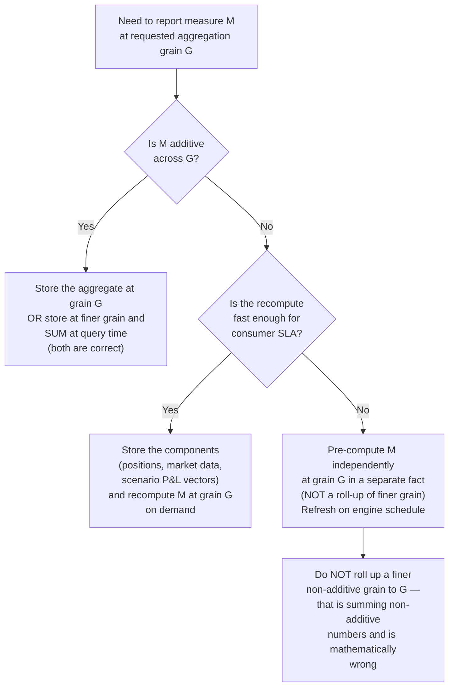

# Module 12 — Aggregation, Hierarchies & Additivity ⭐

!!! abstract "Module Goal"
    "Why isn't this number equal to the sum of those numbers?" is the most frequently-asked question put to a market-risk data team, and the answer is rarely "the data is wrong." Most of the time the answer is "the math forbids it." This module is the central theorem of risk reporting: **sums lie**. It catalogues which measures are additive, which are semi-additive, and which are non-additive; explains why VaR and ES do not roll up; defines coherent risk measures and the diversification benefit; and translates the mathematics into warehouse storage rules — what to store, what to compute, how to flag non-additive measures so a BI tool cannot silently misuse them. Get this wrong in the schema and you will spend years patching reports that should never have aggregated in the first place.

---

## 1. Learning objectives

By the end of this module, you should be able to:

- **Classify** any risk measure on the warehouse as additive, semi-additive, or non-additive across each of its dimensions (positions, time, books, scenarios, risk factors), and write the classification down in the data dictionary in a form a BI tool can consume.
- **Identify** the diversification benefit between two portfolios from their stand-alone VaRs and their joint VaR, articulate the correlation assumptions that produced the benefit, and explain why regulators stress-test the assumption that the correlations remain stable in a crisis.
- **Define** sub-additivity and the four axioms of a coherent risk measure (Artzner et al. 1999), explain in one sentence each why VaR fails sub-additivity in pathological cases and why Expected Shortfall does not, and connect this theoretical result to the FRTB choice of ES at 97.5% as the IMA capital measure.
- **Choose** what to store and what to compute on demand for each major risk measure: store components and recompute non-additive aggregates from them, store additive measures as aggregates only when the consumer pattern justifies the loss of decomposability, and flag every non-additive column in the schema so the BI tool cannot SUM it by default.
- **Audit** a candidate BI report or dashboard for additivity violations — drag-and-drop pivots that sum VaR across desks, time-averages that average a quantile, "diversification benefit" numbers reported without specifying the correlation assumption, and pre-aggregated nightly tables that cannot be re-rolled to a new dimension without rebuilding the pipeline.
- **Apply** the semantic-layer pattern (a `safe_sum`-style guarded measure in dbt, LookML, or Cube) to make the additivity rule a property of the metric definition, not of the analyst's discipline.

## 2. Why this matters

"Why isn't this number equal to the sum of those numbers?" is the question risk managers ask data teams more often than any other. A board pack reports firmwide VaR as \$120M; the desk-level breakdown adds up to \$185M; the gap is \$65M and nobody on the meeting has a one-line explanation. A finance director sees a quarterly Stress P&L total and wonders why it is not the simple sum of the daily Stress P&Ls in the underlying table. A regulator asks how the regional VaR aggregates to the legal-entity VaR and the answer is silence. Every one of these conversations is a Module 12 conversation. The answer is rarely "the data is wrong" — it is usually "the math forbids it." Until the data team can give the math answer fluently, the credibility of every aggregated number on the warehouse is on a permanent slow leak.

The warehouse-side consequence is concrete and expensive. Module 07 listed the four reference fact tables and flagged additivity per measure in a table; this module is where that flag becomes load-bearing. A pre-aggregated nightly table — the kind that sounds like an obvious performance optimisation in a Tuesday architecture meeting — is the single most common Module-21-class anti-pattern in real warehouses, because it bakes in the wrong rollup behaviour at the storage layer. Once a BI consumer is reading from "fact_var_by_desk", every request for a regional view either silently sums VaRs (wrong) or rebuilds the entire pipeline at a new grain (expensive). The correct pattern — store the components, recompute the aggregate at the consumer's requested grain — is harder to get right at first, easier to live with for the next decade.

After this module a BI engineer should approach any new measure with three reflexes. First: write down the additivity profile across each dimension before designing the fact table — additive across positions, semi-additive across time, non-additive across books and scenarios is a typical profile and the schema should encode it. Second: refuse to materialise an aggregate of a non-additive measure unless the aggregate is recomputed from the underlying components, never summed from a coarser layer. Third: flag the non-additive columns in the metadata such that the BI tool either disables SUM for them or routes the user through a pre-defined safe-aggregation measure. The mathematics in section 3.3 explains *why* these reflexes are correct; the storage discussion in section 3.4 explains *how* to encode them in the warehouse; the worked examples in section 4 show what the right and wrong patterns look like in code.

## 3. Core concepts

A reading note. Section 3 walks the additivity story in eight sub-sections, building from the catalogue of measures (3.1) through the diversification benefit (3.2), the formal coherence axioms (3.3), the storage rules that follow from them (3.4), the pre-aggregation anti-pattern (3.5), the summable decompositions of VaR (3.6), aggregation safety in BI tools (3.7), and the semantic-layer fix (3.8). Sections 3.1 and 3.4 are the most load-bearing for a data engineer; section 3.3 is the theoretical backbone everyone should read once even if they only need it occasionally.

### 3.1 Why sums lie — the catalogue

Every measure on the warehouse falls into one of three buckets across each dimension it spans. The bucket determines what `SUM(measure)` means in BI; getting the bucket wrong is how a non-additive number sneaks into a board pack.

**Additive measures.** A measure is *additive* across a dimension if `SUM(measure)` over that dimension produces a meaningful number under the same units. The canonical examples in market risk:

- **Notional.**
    - Trade notional is additive across trades, instruments, books, and any organisational hierarchy you care to define.
    - The sum of the notionals of a portfolio is the gross notional of the portfolio, full stop.
    - Sign convention matters — long and short positions of the same instrument should net or gross depending on the consumer's question — but additivity itself is unambiguous.
- **Market value.**
    - Mark-to-market PV is additive across positions on a single business date in a single reporting currency.
    - The MTM of a portfolio is the sum of the MTMs of its constituents, given a common pricing snapshot.
    - The "common pricing snapshot" caveat is non-trivial; positions valued under different snapshots cannot be summed meaningfully (Module 11 §3.1 covers the snapshot-identity discipline).
- **Sensitivities within the same risk factor.**
    - Two delta numbers against the same risk factor at the same tenor on different positions sum to the portfolio delta against that risk factor.
    - Two PV01 numbers against `USD_SOFR_5Y` from different swaps add.
    - The key word is *same* — across different risk factors the answer changes (the delta against `USD_SOFR_5Y` and the delta against `EUR_ESTR_5Y` do not have a meaningful sum because the underlying scalars carry different units of bumping).
- **P&L (intraday or by component).**
    - Realised cash P&L is a flow and adds across time, books, and trades.
    - Unrealised P&L for a single business date adds across books on that date (it is semi-additive across time — see below).
    - P&L decomposed into clean P&L plus residual, or into per-factor attribution buckets, adds back to the parent measure within the day.

**Semi-additive measures.** A measure is *semi-additive* if it is additive across some dimensions but not others. The recurring case in market risk is *additive across positions, non-additive across time*:

- **Position size, position notional, balances.**
    - A position is a *state*, not a flow.
    - Monday's position and Tuesday's position are mostly the same trades; summing them double-counts.
    - Aggregating across books on the same date is fine; summing the same position across thirty days produces a thirty-times-too-large number.
    - The correct cross-time aggregation is point-in-time picking ("position at month-end") or averaging ("average position over the month"), not summing.
- **Outstanding limits, collateral balances, margin.**
    - Same shape as positions — a stock variable that aggregates spatially but not temporally.
    - The BI tool's default SUM over time produces wrong numbers in exactly the same way.
- **Unrealised P&L** as a stock.
    - Realised P&L is a flow and adds across time; unrealised P&L is a stock as of the EOD revaluation and does not.
    - The two should live in different `pnl_component` rows of `fact_pnl` precisely because their additivity profiles differ.
    - A single column called "P&L" that conflates the two is one of the most common warehouse modelling mistakes; the additivity discipline forces the split.

**Non-additive measures.** A measure is *non-additive* across a dimension if `SUM(measure)` is mathematically meaningless. The canonical examples:

- **VaR and Expected Shortfall.**
    - Quantile-based measures of a portfolio P&L distribution.
    - The portfolio quantile is not the sum of the constituent quantiles.
    - The constituent distributions combine via correlations, and the portfolio quantile is generally less than the sum of the constituent quantiles (the diversification benefit, section 3.2).
    - Across time, averaging a daily VaR is also meaningless — you cannot average a quantile to get a coherent statistic.
- **Capital.**
    - Whether economic capital, Basel-IMA capital, or FRTB-SA bucketed capital, the firm-wide capital is not the sum of per-desk capitals.
    - Under FRTB SA in particular, the bucketed-aggregation formula explicitly recombines per-bucket sensitivities under a regulatory correlation matrix.
    - Per-desk capital numbers are mathematical fictions if summed; the regulator expects the bucketed-then-correlated number.
- **Stressed VaR (mostly).**
    - A quantile of a stressed-window distribution; same shape as ordinary VaR.
    - The window selection (the stress period) is methodology data that must be persisted on the row.
- **Ratios, percentages, rates.**
    - Average return on a portfolio is a weighted average of the constituents, not a sum.
    - Sharpe ratios of components do not sum to a portfolio Sharpe ratio.
    - P&L attribution percentages of total do not sum across days into a meaningful "total percentage".
- **Regulatory measures based on quantiles or correlations.**
    - Most of the FRTB SA capital is in this category.
    - Bucketed-then-correlated aggregation is the deliberate non-additive structure.
    - The aggregation formula is published in the regulation; the warehouse must implement it, not approximate it via SUM.

A reference table that captures the catalogue at a glance. Use it as the cover sheet of your data dictionary's measures section:

| Measure                                | Across positions | Across time           | Across books / hierarchy | Notes                                                                                  |
| -------------------------------------- | ---------------- | --------------------- | ------------------------ | -------------------------------------------------------------------------------------- |
| Trade notional                         | Additive         | Non-add (snapshot)    | Additive                 | Additive at trade-event grain; semi-additive on a position snapshot.                   |
| Position notional / market value       | Additive         | Semi-additive         | Additive                 | Sum across books on a date; pick point-in-time across dates.                           |
| Sensitivity (same risk factor)         | Additive         | Semi-additive         | Additive                 | Within the same risk factor and tenor only.                                            |
| Sensitivity (across risk factors)      | Non-additive     | Semi-additive         | Non-additive             | The vector adds; the scalar sum is meaningless.                                        |
| Stress P&L (per scenario)              | Additive         | Additive (as a flow)  | Additive                 | Additive across positions for a *single* scenario; never sum across scenarios.         |
| VaR (any confidence, any horizon)      | Non-additive     | Non-additive          | Non-additive             | Quantile of a P&L distribution; recompute, do not sum.                                 |
| Expected Shortfall                     | Non-additive     | Non-additive          | Non-additive             | Same shape as VaR; coherent, but still not summable.                                   |
| Capital (FRTB SA or IMA)               | Non-additive     | Non-additive          | Non-additive             | Bucketed-then-correlated aggregation; per-desk numbers are not a basis for sum.        |
| Daily realised P&L (cash)              | Additive         | Additive (flow)       | Additive                 | The cleanest measure on the warehouse; additive in every direction.                    |
| Daily unrealised P&L (mark-to-market)  | Additive         | Non-additive          | Additive                 | Stock variable; sums over books on a date but not over dates.                          |

This is the **aggregation safety matrix** referenced in the diagram requirement at the head of the module. It belongs in the data dictionary and it belongs as a cell-tooltip on every BI dashboard that exposes any of these measures.

### 3.1a A worked narrative — one aggregation request, three measures, three different right answers

Before formalising the diversification benefit, follow a single consumer request from arrival to dispatch. The exercise grounds the abstract additivity catalogue in a concrete trace.

The request lands at 09:15 NYT on 2026-05-08 from the head of equities. She wants three numbers for her morning meeting at 10:00: total notional, total DV01 (parallel, USD curve), and total VaR for the equity-derivatives business as of EOD 2026-05-07. The business is a hierarchy of three desks — convertibles, structured equity, exotic flow — with a combined population of roughly 4,000 positions across 60 underlyings.

**Notional.** The data team's first query is a straight aggregation. `fact_position` carries one row per (book, instrument, business_date); the equity-derivatives perimeter is defined on `dim_book_hierarchy` as the set of books rolling up to `business_line = 'EQUITY_DERIVATIVES'` as of `business_date = 2026-05-07`. The query is:

```sql
SELECT SUM(notional_usd) AS total_notional_usd
FROM fact_position fp
JOIN dim_book_hierarchy dbh USING (book_sk)
WHERE fp.business_date = DATE '2026-05-07'
  AND dbh.business_line = 'EQUITY_DERIVATIVES'
  AND dbh.is_current_for_business_date = TRUE;
```

The query returns \$47.3B in roughly 800ms. Notional is additive across positions and across books (§3.1); the SUM is mathematically valid; the answer is reproducible by exact replay of the same query against the same `as_of_timestamp`.

**Parallel DV01.** The second query is also a SUM, with one constraint: the per-tenor DV01s must be against the *same curve* before being summed (§3.4c). The equity business's rates exposure comes through dividend-discounting and through equity-future financing rates; these are different curves and must not be cross-aggregated. The query partitions:

```sql
SELECT
    fs.curve_id,
    SUM(fs.sensitivity_value) AS parallel_dv01
FROM fact_sensitivity fs
JOIN dim_book_hierarchy dbh USING (book_sk)
WHERE fs.business_date = DATE '2026-05-07'
  AND dbh.business_line = 'EQUITY_DERIVATIVES'
  AND fs.sensitivity_type = 'DV01_PARALLEL'
GROUP BY fs.curve_id;
```

Two rows return: a USD-equity-financing curve DV01 of \$2.1M, a EUR-dividend-discount curve DV01 of \$0.4M. The aggregate DV01 is *not* a single scalar; it is a vector indexed by curve, and the head of equities reads both numbers. Compressing them into a single "total DV01" would require a methodology choice (is the summation in USD-equivalent? at what FX rate? with what cross-currency-basis adjustment?) and the data team would not make that choice unilaterally.

**VaR.** The third request is the difficult one. The team has three valid options and one wrong one:

- *Wrong option.* `SELECT SUM(var_value) FROM fact_var WHERE ... business_line = 'EQUITY_DERIVATIVES'`. The query runs in milliseconds and returns \$78M. It is wrong by the inter-desk diversification benefit; the true equity-derivatives VaR is materially lower. Every word of §3.1 forbids this query.
- *Option A — read from `fact_var_business_line`.* The risk engine has a nightly run at the business-line aggregation grain. The team queries the row for `(business_line = 'EQUITY_DERIVATIVES', business_date = '2026-05-07', confidence = 0.99, horizon = 1)` and reads \$54M. Total query time: 3ms. The number is correct.
- *Option B — recompute from `fact_scenario_pnl`.* If the engine had not run the business-line grain, the team would aggregate per-scenario P&Ls across the three desks and extract the 1st-percentile across the resulting 250-element vector. Total query time: roughly 8 seconds against a partitioned scenario-P&L fact. The number is also \$54M (within the engine's tolerance) but the team has to wait for it.

The data team picks Option A and dispatches the three numbers at 09:24, nine minutes after the request. The VaR number is \$54M, against a sum-of-desk-VaRs of \$78M, with a labelled diversification benefit of \$24M (31%) — and the dispatch note names the correlation assumption (the empirical correlations from the trailing 250-day historical-VaR window). The head of equities reads three numbers, each with appropriate context:

- Notional \$47.3B (additive, summed cleanly).
- DV01 vector: USD-equity-financing \$2.1M, EUR-dividend-discount \$0.4M (additive within curve, not across).
- 99% 1-day VaR \$54M, with a \$24M diversification benefit against the sum-of-desk-VaRs (non-additive, recomputed at the business-line grain).

This trace is what a well-formed aggregation pipeline looks like: each measure aggregated by the rule that applies to it, each non-additive number recomputed rather than summed, and the dispatch note carrying the metadata that lets the consumer interpret what they are looking at. The remainder of section 3 explains why each rule is what it is.

### 3.2 Diversification benefit

The relationship that makes VaR non-additive in the friendly direction is **sub-additivity of risk**:

$$
\mathrm{VaR}_\alpha(A + B) \leq \mathrm{VaR}_\alpha(A) + \mathrm{VaR}_\alpha(B)
$$

The gap between the two sides is the **diversification benefit** between portfolios A and B at confidence level \(\alpha\):

$$
\text{Diversification benefit}(A, B) = \mathrm{VaR}_\alpha(A) + \mathrm{VaR}_\alpha(B) - \mathrm{VaR}_\alpha(A + B)
$$

Three properties of the benefit follow from the definition:

- The benefit is non-negative when sub-additivity holds.
- The benefit equals zero when the constituents are perfectly comonotonic (the correlation-equals-one limit).
- The benefit reaches its theoretical maximum when the constituents are perfectly anti-comonotonic, in which case the combined position is risk-free in the limit.

Where the inequality comes from is intuitive once stated. A portfolio of two assets has a tail loss that depends on the joint distribution of the two assets, not just on the marginals. If gains in one asset partially offset losses in the other (negative correlation), the combined tail is materially smaller than what you would get by stacking the per-asset tails on top of each other; the diversification benefit is large. If the two assets move in lockstep (correlation +1, the perfectly comonotonic case), the tail of the combined position is exactly the sum of the per-asset tails and the benefit collapses to zero.

The example in section 4 makes this concrete with a 250-day historical-VaR computation under correlations of -0.3, 0.0, +0.7, and +0.99. The benefit at -0.3 is around 39% of the sum of per-portfolio VaRs; at +0.99 it is roughly 1-2%. The pattern is universal: the more diversified the portfolio (in the correlation sense, not the count-of-positions sense), the larger the gap between the sum of per-component VaRs and the portfolio VaR.

**Why traders love it.** A trading desk's capital allocation is, in many regulatory frameworks, derived from a VaR or ES number that the bank reports up its hierarchy. Sub-additivity means that the firm-wide VaR a trading business contributes to is *less* than the sum of the desk VaRs that compose it; the diversification benefit is real capital relief. A diversified bank can hold more total positions for the same firmwide VaR than a concentrated bank, and the trading floors are acutely aware of it.

**Why regulators stress-test it.** The benefit assumes the correlations stay stable. In a crisis, correlations go to one — the famous "everything sells off together" pattern. The benefit you booked on a sunny Tuesday evaporates the moment the market dislocates and every position you held loses simultaneously. FRTB's stress-window-calibrated ES (the IMA replaces VaR with ES on a window covering the most stressed period the model can find) is the regulatory response: compute the risk measure on a window where the correlations *were* high so the diversification benefit is small, capitalise off the stressed number rather than the sunny-Tuesday number. Module 09 §3.7a covered the stressed-window-selection mechanic; the additivity angle here is that the stressed number is exactly what kills the diversification benefit before it can be over-used in capital terms.

A practical observation on **reporting the benefit**. Any time the warehouse reports a diversification benefit number (say, "the firm's VaR is \$120M against a sum-of-desk-VaRs of \$185M, a diversification benefit of \$65M"), the report must specify the correlation assumption that produced it. Three options recur: the empirical correlations from the historical-VaR window (the most common, also the most exposed to regime change), the regulator's prescribed correlation matrix (FRTB SA), and a stress-overridden matrix forced to a high level (the "what if correlations go to 1" diagnostic). Reporting the number without naming the assumption invites the consumer to infer that all three are interchangeable — they are not, and the difference can be tens of millions of dollars at a typical large-bank scale.

A second practical observation on **the benefit's behaviour over time**. The diversification benefit is not a stable percentage of the per-portfolio VaRs; it varies with market regime, with portfolio composition, and with the historical window the VaR engine reads. A bank whose diversification benefit has been roughly 30% of stand-alone VaR for two years and suddenly drops to 15% has either had a major portfolio reshuffle or is seeing correlations rise in its empirical window. Either case is a story the data team should be ready to tell — the fact-table machinery should make it answerable by query rather than by forensic investigation. The defensive design pattern: store the per-book VaRs and the recomputed firmwide VaR every business date, derive the implied benefit per date, and expose the time-series of the benefit on the management dashboard. Sudden moves in the benefit are themselves a risk diagnostic.

A third observation on **the relationship between diversification and the FRTB ES window**. FRTB IMA computes Expected Shortfall on a *stressed* historical window — the most stressed continuous 12-month period the model can find in the firm's lookback. By construction, this window contains high-correlation episodes; the diversification benefit computed against it is typically a fraction of the benefit against a calm-window VaR. A bank reporting "our FRTB IMA ES is \$X with diversification benefit of Y%" is reporting a benefit that is regulatorily-stressed by design, and the comparison to the management-VaR benefit on the same portfolio is a useful internal check on how much of the calm-window benefit would survive a stress. The warehouse should make both numbers queryable side-by-side; the FRTB submission machinery typically already does this, and the management reporting layer should pull from the same source rather than producing a parallel calm-window-only view.

### 3.2a Stats detour — why you cannot sum standard deviations

A useful aside that explains the diversification arithmetic from the bottom up. Variance is additive (under independence); standard deviation is not. The mechanic is one of the cleanest ways to see why VaR — a quantile of a distribution whose width is, under a normal assumption, controlled by a standard deviation — fails to add up.

For two independent random variables \(X\) and \(Y\):

$$
\mathrm{Var}(X + Y) = \mathrm{Var}(X) + \mathrm{Var}(Y)
$$

Variance of a sum is the sum of variances when the variables are independent. The result generalises with a covariance correction when they are not:

$$
\mathrm{Var}(X + Y) = \mathrm{Var}(X) + \mathrm{Var}(Y) + 2 \rho \, \sigma_X \, \sigma_Y
$$

where \(\rho\) is the correlation and \(\sigma_X, \sigma_Y\) the per-variable standard deviations. Standard deviation, the square root of variance, is decidedly non-additive:

$$
\sigma_{X+Y} = \sqrt{\sigma_X^2 + \sigma_Y^2 + 2 \rho \, \sigma_X \, \sigma_Y}
$$

Three special cases pin the intuition. Under perfect positive correlation (\(\rho = +1\)), \(\sigma_{X+Y} = \sigma_X + \sigma_Y\) — standard deviations add. Under independence (\(\rho = 0\)), \(\sigma_{X+Y} = \sqrt{\sigma_X^2 + \sigma_Y^2}\) — the Pythagorean rule, which is strictly less than the sum unless one of the components is zero. Under perfect negative correlation (\(\rho = -1\)), \(\sigma_{X+Y} = |\sigma_X - \sigma_Y|\) — standard deviations cancel toward zero, the limit of the diversification effect.

The connection to VaR is direct. Under a parametric (variance-covariance) VaR with normal returns, VaR is proportional to standard deviation: \(\mathrm{VaR}_\alpha = z_\alpha \cdot \sigma \cdot V\). The non-additivity of \(\sigma\) under \(\rho < 1\) translates one-to-one into the non-additivity of VaR, and the diversification benefit on VaR is exactly the gap between \(\sigma_X + \sigma_Y\) and \(\sqrt{\sigma_X^2 + \sigma_Y^2 + 2 \rho \, \sigma_X \, \sigma_Y}\), scaled by \(z_\alpha\) and the portfolio value. The historical-VaR case (the example in §4) does not assume normality, so the relationship is not exactly proportional, but the qualitative shape is the same — sub-additivity flows from the "standard deviations don't add" mechanic, and the warehouse-side consequence is identical.

A practical observation on **why this matters for the data dictionary**. Some aggregation tables on the warehouse store volatility-like measures — stress P&L standard deviations across scenarios, return standard deviations on a P&L history, implied-vol surface aggregates. None of these are summable across constituents, and the failure mode is exactly the standard-deviation non-additivity demonstrated above. The aggregation safety matrix should treat any "standard deviation" or "volatility" column as non-additive across positions and across books by default, with an exception only for the rare case where the underlying variances are independent and someone has done the variance-then-square-root work explicitly.

### 3.3 Sub-additivity and coherent risk measures

The **coherence axioms** are the formal property set Artzner, Delbaen, Eber, and Heath (1999) proposed to define what makes a risk measure mathematically well-behaved. A risk measure \(\rho\) mapping random P&L variables to real numbers (positive = riskier) is *coherent* if it satisfies four properties:

1. **Monotonicity.** If \(L_1 \leq L_2\) almost surely (portfolio 1 always loses less than portfolio 2), then \(\rho(L_1) \leq \rho(L_2)\). A safer portfolio gets a smaller risk number.
2. **Sub-additivity.** \(\rho(L_1 + L_2) \leq \rho(L_1) + \rho(L_2)\). Combining portfolios cannot increase total risk; diversification can only help.
3. **Positive homogeneity.** \(\rho(\lambda L) = \lambda \rho(L)\) for \(\lambda \geq 0\). Doubling a portfolio doubles its risk.
4. **Translation invariance.** \(\rho(L + c) = \rho(L) + c\) for a deterministic \(c\). Adding a guaranteed loss of \(c\) increases risk by exactly \(c\).

The axioms are not arbitrary; each captures a property a reasonable capital number ought to have. Monotonicity is consistency with first-order stochastic dominance. Positive homogeneity is dollar-scale invariance. Translation invariance is the property that lets the risk measure be interpreted as a *capital requirement* — the smallest amount you must hold to make the position acceptable. Sub-additivity is the property that aligns the regulator's incentive (smaller capital for diversified institutions) with the bank's actual economic position.

**VaR fails sub-additivity.** This was the result that kicked the coherent-risk-measure literature into existence and that, two decades later, motivated FRTB's switch from VaR to ES. The failure modes are not common in textbook normal-distribution examples; they appear in:

- **Heavy-tailed distributions.** When the tails are sufficiently heavy (think Pareto with shape parameter under 1), the quantile of a sum can exceed the sum of quantiles. The mechanism: each individual portfolio has a thick tail that the 99% quantile cuts above; the combined portfolio's tail is even thicker, and the 99% quantile of the combination cuts above the sum of the per-portfolio 99% quantiles.
- **Discrete payoff structures.** A famous Artzner et al. counterexample is two short out-of-the-money digital options on independent underlyings: each individually has a 0.5% chance of paying out a loss of \$100, so the 99% VaR of each is \$0; the combined portfolio has a roughly 1% chance of at least one payout, so the 99% VaR of the combination is \$100. \$100 > \$0 + \$0 = \$0; sub-additivity is violated.
- **Concentrated single-name credit positions.** A loan portfolio dominated by a single high-quality name has a 99% VaR of \$0 (the name does not default in 99 of 100 simulations); two such loans on independent names have a combined 99% VaR that is positive (one of the two defaults in some of the 100 simulations).

These are pathological cases, but they are not contrived. Real loan books, real digital-option books, and real heavy-tailed distributions appear in real banks. A risk measure that *almost always* satisfies sub-additivity but can violate it under realistic conditions is a measure that the regulator cannot trust as the primary capital number.

**Expected Shortfall is coherent.** ES averages over the tail beyond the VaR cut, and the averaging operation restores sub-additivity unconditionally — provided the underlying distributions have finite expectations, which all empirically-relevant distributions do. The proof is in Acerbi and Tasche (2002); the upshot is that ES never violates sub-additivity, on any distribution, for any portfolio combination.

This is the theoretical reason FRTB's Internal Models Approach replaced VaR with ES at the 97.5% confidence level. The 97.5% number is calibrated such that ES at 97.5% is approximately equivalent in stringency to VaR at 99% under a normal distribution, while delivering coherence under all other distributions. A bank running VaR for legacy limit monitoring and ES for FRTB-IMA capital is using two measures that say roughly the same thing under benign conditions and that diverge in exactly the cases where the difference matters — heavy tails and concentrated positions.

!!! info "Definition: coherent risk measure"
    A *coherent risk measure* in the sense of Artzner, Delbaen, Eber, Heath (1999) is a function from portfolio P&L distributions to real numbers satisfying monotonicity, sub-additivity, positive homogeneity, and translation invariance. VaR fails sub-additivity in pathological cases; Expected Shortfall is coherent unconditionally on distributions with finite expectations.

A practical observation on **why the warehouse cares about coherence**. Coherence is not just a theoretical nicety; it has direct operational consequences. A non-coherent risk measure invites perverse incentive structures: traders can sometimes reduce their measured risk by *adding* a position whose addition makes the portfolio more risky in any economic sense, exploiting the sub-additivity violation. The "merge two desks to lower combined VaR" pathology was a real concern in pre-FRTB capital regimes and was one of the operational reasons the Basel committee favoured ES once the academic case for coherence had matured. The warehouse's job is to support whichever measure the bank's methodology adopts; the data engineer's job is to know which is in use, what its additivity profile is, and what the correct aggregation pattern looks like.

A second observation on **the elasticity-of-coherence question**. Coherence is a binary property — a measure is coherent or it is not — but in practice the question that matters is whether sub-additivity is *typically* satisfied for the bank's portfolios. Empirically VaR satisfies sub-additivity in almost all real-world bank portfolios; the violations are pathological and rare. This is why VaR survived as a regulatory measure for two decades despite the theoretical critique. The argument for ES is not that VaR is wrong every day; it is that VaR is wrong on the days that matter (heavy-tailed, concentrated, stressed conditions) and the regulator wants a measure that is right on those days. The warehouse must be able to compute and store both during the multi-year transition; there is no clean "switchover date" for most banks.

A third observation on **the relationship between coherence and the diversification benefit**. Sub-additivity says diversification can only help; the diversification benefit is the *amount* by which it helps. A coherent measure has a non-negative diversification benefit by construction (the inequality is one-directional). A non-coherent measure can have a *negative* diversification benefit in the pathological cases — adding positions can increase the measured risk, which is the formal way of saying sub-additivity is violated. When the warehouse reports diversification benefit as a non-negative number for a VaR-based aggregation, the data team is implicitly assuming the portfolio is in the regular (sub-additive) regime; a sudden negative value would be an alarm signal that the regime has shifted, and the data dictionary should include the alarm.

### 3.4 Storage implications — what to store, what to compute

The math implies a single, fundamental warehouse rule: **store the components needed to re-aggregate, never store the aggregate of a non-additive measure as the primary copy**.

In practice this means the following pattern, applied per measure type:

- **Don't store firmwide VaR as a sum-of-desk VaRs.** Store the inputs — `fact_position`, `fact_market_data`, `fact_scenario_pnl` — and recompute firmwide VaR by running the engine at the firmwide grain. The recomputation is expensive, which is why it is cached carefully and run on a regulatory schedule rather than on every dashboard refresh; the alternative (summing desk VaRs) is wrong by the diversification benefit, which is precisely the largest number on the report.
- **Do store sensitivities as additive aggregates.** Aggregating per-trade delta to book-level delta against the same risk factor is mathematically additive; the aggregate carries the same units and the same interpretation. The book-level sensitivity row is a legitimate first-class fact, and most warehouses materialise both per-trade and per-book grains.
- **Don't pre-compute "total Stress P&L by region" in a single row.** Stress P&L is additive *per scenario across positions* but you must respect the scenario grain. The right pattern is to store per-position-per-scenario stress P&L (or per-book-per-scenario, where book-level is the rolled-up additive grain) and let the consumer aggregate across positions or books for the scenario of interest. A "total stress P&L" row that compresses out the scenario dimension is throwing away the dimension that makes the measure additive at all.
- **Store the as-of EOD VaR for backtesting and audit, but never sum across rows.** A regulator asking "what was the firmwide VaR on 2026-04-30 as published in the EOD pack" needs to read a single row, not a query that aggregates. The row exists for audit. It must not be the basis of any aggregation query — the data dictionary marks the column non-additive, the BI tool surfaces it as a value-only measure, and the audit query reads it by exact key match.
- **Store P&L vectors, not just quantiles.** The scenario P&L vector underlying every VaR row is small in absolute storage terms (250 numbers per book per business date for a 250-day historical-VaR engine) and is the single most-requested intermediate when a recomputation request lands. Storing it makes the recomputation a quantile-extraction job rather than a re-pricing job, which collapses the cost from hours to milliseconds. Module 09 §3.3 walked through the pipeline; this is the storage discipline that follows from it.

The decision tree underneath these patterns is the **store-vs-compute decision**:



The diagram captures the rule: additive measures may be stored at any grain, because the aggregation is a SUM and SUM is correct; non-additive measures must either be recomputed from components on demand, or pre-computed at the consumer's grain by the *risk engine* (which knows how to combine the components correctly), never by SQL rolling up a coarser grain. The third option in the tree (pre-compute at grain G) is fine if the engine produces it as a first-class output; it is *not* the same as letting the BI layer aggregate from a finer non-additive grain.

A practical observation on **the audit-trail VaR row**. Every EOD VaR pack publishes a small set of headline numbers — firmwide 99% 1-day VaR, firmwide ES, per-business-line breakdowns — that downstream consumers reference by name. These numbers belong on the warehouse as authoritative single rows, with the methodology, scenario set, and sign-off metadata that makes them reproducible. They are reports, not aggregable measures; the warehouse stores them so the regulator can ask "what was the number you published on 2026-04-30" and the answer comes back from a one-row lookup. Any analyst who tries to SUM these rows across business lines is asking a question that has no mathematical answer; the schema and the dictionary must surface this clearly.

A practical observation on **why "store the components" can become an unbounded data-volume problem**. The components needed to recompute a non-additive measure are typically the per-position-per-scenario P&Ls — for a 250-day historical-VaR engine, that is 250 numbers per position per business date. A bank with 100,000 positions running daily VaR generates 25 million scenario-P&L rows per day, or roughly 6 billion rows per year. The retention horizon (5–10 years for regulatory replay) makes the cumulative volume large, and the compute cost of recomputing aggregates from these rows is non-trivial. The defensive pattern is to materialise *intermediate* aggregates that are themselves additive: per-book scenario P&Ls (sum across positions within a book *for the same scenario*) are additive across positions — that is the §3.1 catalogue — and the per-book scenario-P&L vector is the input to recomputed VaR at any aggregation grain that contains the book. The intermediate aggregate cuts the row count by a factor equal to the average positions-per-book ratio (typically 100x or more), making the recomputation tractable while preserving the components-not-aggregate discipline. The pattern generalises: any additive intermediate aggregate is a legitimate materialisation as long as the next layer up is non-additive and is recomputed from the intermediate, not summed.

A second observation on **per-book non-additive measures stored for context**. Even though firmwide VaR cannot be summed from desk VaRs, the desk VaR numbers are still useful as *context* for the firmwide number — the desk that contributes the most risk, the desk whose stand-alone VaR moved most overnight, the desk whose VaR usage against limit is highest. The desk-level VaR rows belong on the warehouse for these consumers, with the additivity flag clear: desk VaR is a stand-alone risk measure for that desk; it is not a building block for firm risk. The flag is what prevents a board pack from accidentally summing the column.

### 3.4a Hierarchies in risk — trade to firm

Every aggregated risk number sits inside an organisational hierarchy. The canonical chain runs trade → strategy → book → desk → business line → division → legal entity → firm, with regional and regulatory cross-cuts layered on top (region, jurisdiction, FRTB SA bucket, internal Basel-IMA model perimeter). Each level of the hierarchy answers a different consumer question; each level requires its own aggregation rule per measure.

The mistake to avoid is to treat the hierarchy as a SQL `GROUP BY` problem. For additive measures (notional, market value, sensitivities-within-a-risk-factor) the hierarchy *is* a `GROUP BY` problem and the warehouse should expose it as one. For non-additive measures the hierarchy is *not* a `GROUP BY` problem; each level is an independent computation that the risk engine must produce as a first-class output. A `dim_book_hierarchy` SCD2 dimension that captures the hierarchy structure is essential — without it, a query asking "VaR by division for 2025-09-30" cannot resolve which books rolled up to which division on that date — but the dimension's existence is necessary, not sufficient, for non-additive aggregation.

A practical observation on **hierarchy stability over time**. Books move between desks, desks merge or split, business lines reorganise; the hierarchy is not static. The bitemporal pattern (Module 13) applies: every roll-up query must specify the as-of date for the hierarchy, otherwise yesterday's reorganisation silently restates last year's reports. The defensive default is to bind every aggregated risk number to the hierarchy version in force at the business date the number describes, and to expose the binding through a `hierarchy_version_sk` column on the aggregated fact rows.

A second observation on **the regulatory perimeter as its own hierarchy**. FRTB partitions the trading book into desks for the IMA model-eligibility test, and into risk classes and buckets for the SA capital calculation. These are not the same as the management-reporting hierarchy. The warehouse must carry both — `dim_book` for management roll-ups, `dim_frtb_perimeter` for regulatory roll-ups — and the aggregated VaR/ES/capital facts must be tagged with the perimeter the aggregation respects. A "firmwide VaR" in the management view and a "firmwide IMA ES" in the regulatory view are different numbers computed against different perimeters; conflating them produces the wrong answer in both directions.

### 3.4b Currency aggregation — sum then convert, or convert then sum?

A specifically-currency flavour of the same problem. A position book with trades in USD, EUR, JPY, and GBP must report a total exposure. Two paths produce two different numbers:

- **Convert then sum.** Convert each trade's notional to USD using the trade's relevant FX rate, then sum the USD-equivalent notionals. This is the right pattern; the FX conversion happens at the position grain (or at the trade grain, where applicable) using the trade-date or business-date FX rate from the official snapshot, and the sum across positions in a common currency is mathematically additive.
- **Sum then convert.** Sum the per-currency notionals first, producing a vector \((N_{\text{USD}}, N_{\text{EUR}}, N_{\text{JPY}}, N_{\text{GBP}})\), then convert each to USD and sum the USD-equivalents. The result is the same as path 1 only if the FX rate used for each currency total is the same rate used for each constituent; if the conversion happens at a different grain (different snapshot, different `as_of_timestamp`), the two paths diverge.

The recurring failure mode is path 2 done sloppily — summing per-currency notionals and converting at a *fund-level* FX rate (an end-of-day rate stamped at the firm's primary close) when the constituent positions used a different rate (the trade-date rate, or a regional close). The aggregate USD-equivalent is wrong by the rate differential, which is small per position but accumulates across thousands of positions into a non-trivial divergence.

The defensive rule, applied to every currency-bearing measure on the warehouse: **convert at the position grain using the methodology-specified FX rate, document the rate used, and aggregate the converted values**. The aggregation is then a clean additive SUM that respects every consumer's view of the FX-rate provenance. Module 11 §3.4 covered the FX-rate snapshot machinery; this is the additivity angle on it.

A practical observation on **the FX-rate documentation requirement**. Every currency-converted measure on the warehouse should carry, alongside the converted value, the following provenance:

- The source currency.
- The FX rate used in the conversion.
- The `as_of_timestamp` of the FX rate.
- The triangulation path, where applicable (Module 11 §3.4 covers the cross-rate problem).

A consumer that aggregates converted measures across positions can then reproduce the conversion exactly; a consumer that gets a different number from the same measure can identify which provenance attribute differs. Without the provenance the aggregation is correct in expectation and unreproducible in detail.

### 3.4c Tenor aggregation — when can you collapse the term structure?

A specifically-rates flavour of the additivity-of-sensitivities problem. A book of swaps produces a vector of PV01 numbers, one per (curve, tenor): PV01 against `USD_SOFR_1Y`, `USD_SOFR_2Y`, ..., `USD_SOFR_30Y`. A consumer wanting a single "USD parallel DV01" wants to collapse the tenor dimension. When is the collapse valid?

Three conventions recur:

- **Parallel DV01 — sum across tenors of the same curve.** Treat the position as if a +1bp parallel shift were applied to every tenor of the USD SOFR curve simultaneously, and report the resulting P&L. Mathematically this is `SUM(PV01_per_tenor)` across the tenor dimension, and it *is* additive provided the per-tenor PV01 numbers were computed against the same curve and the same bumping convention. It is the most-quoted single-number rates risk, and the warehouse should expose it as a derived measure on `fact_sensitivity` aggregated by `(book, curve, business_date)`.
- **Bucketed DV01 — sum within tenor buckets only.** FRTB SA partitions tenors into vertices (0.25Y, 0.5Y, 1Y, 2Y, 3Y, 5Y, 10Y, 15Y, 20Y, 30Y) and computes per-vertex DV01; the bucketed numbers are summed within vertex but not across vertices, because the regulatory aggregation formula combines vertices via a correlation matrix, not via straight summation. The warehouse stores per-vertex DV01 as a vector; the consumer query that asks for "DV01 by vertex" returns the vector, and the consumer query that asks for "FRTB capital" runs the bucketed-then-correlated formula on the vector.
- **Per-tenor DV01 — never collapse.** For curve-shape risk diagnostics (the steepener / flattener / butterfly stories), the per-tenor numbers are themselves the answer, and collapsing them loses the information the diagnostic is built on. The warehouse exposes the vector as a first-class measure for these consumers.

The pitfall is to collapse across *different* curves — summing PV01 against `USD_SOFR_5Y` with PV01 against `EUR_ESTR_5Y` to produce a "5Y DV01" of \$X. The two scalars do not have the same units in any economically meaningful sense; the sum is mathematically defined and economically incoherent. The data dictionary's `dim_risk_factor` (Module 11 §3.5a) carries the curve identifier as a first-class attribute precisely so consumer queries can group by it and refuse to cross-aggregate.

### 3.4d Risk-factor aggregation under FRTB SA

A specifically-FRTB flavour of the bucketed-then-correlated pattern. The FRTB Standardised Approach computes capital in three nested layers:

1. **Within bucket.**
    - Per-bucket capital is computed by aggregating per-risk-factor sensitivities within the bucket using a regulatory correlation matrix \(\rho_{kl}\) per (k, l) factor pair within the bucket.
    - The formula is a quadratic form: \(K_b = \sqrt{\sum_k WS_k^2 + \sum_{k \neq l} \rho_{kl} WS_k WS_l}\) where \(WS_k\) is the weighted sensitivity of factor k.
    - The correlation matrix is published in the FRTB regulation; banks do not estimate it themselves.
2. **Across buckets within a risk class.**
    - Per-risk-class capital is computed by aggregating per-bucket capital using a regulatory correlation matrix \(\gamma_{bc}\) per (b, c) bucket pair.
    - Same quadratic form, different correlation parameter.
    - The aggregation is again non-additive; the warehouse must materialise per-risk-class capital as a separate fact.
3. **Across risk classes.**
    - Total SA capital is the simple sum of per-risk-class capital across the seven FRTB risk classes (delta, vega, curvature, default risk, residual risk add-on, etc.).
    - This is the only level at which the aggregation reduces to a SUM.
    - The regulator deliberately disallows diversification benefit between risk classes, on the grounds that the cross-class correlations break down under stress.

The pattern is illustrative: the regulator deliberately built non-additive aggregation into the formula at the within-bucket and across-bucket levels, to capture diversification under a controlled correlation matrix; the across-risk-class layer is additive because the regulator does not want to give credit for diversification between (e.g.) interest-rate risk and equity risk, which empirically can break down quickly. The warehouse must carry the per-bucket and per-risk-class capital as first-class facts, and must refuse to let a SQL query roll up bucket-level capital to firm capital by SUM. The right pattern is:

- `fact_capital_bucket` — one row per bucket per business date, populated by the SA aggregation engine from the underlying weighted sensitivities.
- `fact_capital_risk_class` — one row per risk class per business date, populated by the engine from `fact_capital_bucket` plus the across-bucket correlation matrix.
- `fact_capital_firm` — one row per business date, populated by the engine from `fact_capital_risk_class` via the cross-risk-class SUM (the only additive layer).

Each layer is a separate computation; the rolling up is in the engine, not in the warehouse aggregation layer. Consumer queries that ask for "capital by bucket" read `fact_capital_bucket`; queries that ask for "firm capital" read `fact_capital_firm`. There is no SQL path between the layers that does the wrong arithmetic, because the loader does not provide one.

### 3.5 "Pre-aggregated reporting tables are a trap" — anti-pattern preview

The single most seductive Tuesday-meeting optimisation in BI engineering: "let's pre-compute desk-level VaR nightly so the dashboard renders in 200ms instead of waiting for the engine." It is seductive because the first version of the dashboard works beautifully, the latency story is great, and nobody on the meeting room can articulate why it is a bad idea. The bad idea surfaces six months later, when sales asks for a *region-level* VaR view and the desk-level pre-aggregation cannot be combined to produce one. The team rebuilds the pipeline at the new grain. Three months after that, finance asks for a *legal-entity* view and the pipeline is rebuilt again. A year in, the warehouse carries seven different pre-aggregated VaR tables, none of them mutually consistent, and any new dimensional slice triggers another rebuild.

The defensive pattern is the one section 3.4 described: store the components, recompute at the requested grain. The recompute is expensive — perhaps two hours of engine time per request — but the cost is bounded and the pipeline is reusable. Pre-aggregation is cheap up front and unbounded over time; recompute is expensive up front and bounded. For non-additive measures, the math forces the choice and the right answer is recompute.

Module 21 (anti-patterns) treats the full pre-aggregation story in detail; the preview here is intentional — the pre-aggregation trap is one of the most common failures in BI-engineering-meets-risk projects, and a Module 12 reader should leave with the reflex already in place: *pre-aggregating non-additive measures at storage time is mathematically wrong and operationally a trap. Resist it.*

### 3.5a A second worked narrative — the post-mortem on a wrong number

A counter-example, drawn from a recurring real pattern. The trace shows what happens when the additivity rule is not enforced and how the failure surfaces. The names are made up; the shape is real and the data team will recognise it.

A monthly capital report ships on the 5th business day after month-end. The June 2026 edition lands on 7 July at 17:00 NYT. On 8 July at 11:00 NYT the regulator's primary contact emails the head of risk: "Your reported June 2026 firmwide VaR is \$245M against a stand-alone-desk-VaR sum we infer from your supporting schedules of \$310M. Last month the firmwide was \$220M against a desk sum of \$275M. The benefit has grown by \$10M; can you confirm the correlation assumption is unchanged?"

The head of risk forwards the email to the data team at 11:08. By 11:30 the team has the answer, and the answer is bad. The June firmwide VaR was *not* recomputed at the firm grain; the engine's firmwide run failed silently on 30 June (a job dependency on a market-data refresh that did not complete on time), and the reporting pipeline fell back to the prior business day's firmwide VaR. The supporting schedules, however, *were* fresh — the per-desk VaR rows on `fact_var` were populated from each desk's own engine run, which did not have the market-data dependency. The result: a board-level number from 27 June paired with desk-level numbers from 30 June, with an "implied diversification benefit" that is neither June's nor any-other-day's, but a Frankenstein artefact of two different snapshots.

The team's response is twofold. The immediate fix is to restate the June firmwide VaR using the 30 June engine output (which became available on 1 July at 04:30, six hours after the 30 June EOD failure was missed by the early-morning 30 June reporting cycle). The restated number is \$236M against the desk sum of \$310M, a benefit of \$74M (24%) — close enough to the prior month's pattern that the regulator's question evaporates. The restatement letter goes out by 14:00 NYT.

The structural fix is harder. The reporting pipeline had three problems that the post-mortem identifies:

- **No bitemporal anchor on the firmwide row.** The firmwide VaR row that fed the report had a `business_date` of 30 June but an `as_of_timestamp` of 27 June (because that was the latest successful engine run). The pipeline read the row by `business_date` only, did not check the `as_of_timestamp`, and shipped the stale number. The fix: every reporting query must constrain on `business_date` *and* on a freshness contract for `as_of_timestamp`.
- **No additivity check in the report.** The reporting code compared the firmwide number to the sum-of-desk numbers as a sanity check ("is the firmwide ≤ the sum?") but did not flag a *widening* benefit as suspicious. Had the check been "is the benefit within ±20% of the prior-month benefit?", the bad row would have been caught at 30 June EOD and the report would have been delayed for the engine to retry.
- **Pre-aggregation hidden in the pipeline.** The reporting pipeline was, in effect, doing the wrong-pattern SQL of §4 Example 2: it had a `vw_firmwide_var` that was supposed to read from `fact_var_firmwide` but had been changed six months earlier (during a refactor) to fall back to `SUM(var_value)` from `fact_var` if the firmwide row was missing. The fallback was added with good intentions and never reviewed for additivity correctness; on 30 June it produced the silent wrong number that the regulator asked about.

The post-mortem outputs a permanent rule: *every aggregation of a non-additive measure on the warehouse must be tagged with a `aggregation_method` attribute on the row* — `RECOMPUTED_FROM_COMPONENTS`, `READ_FROM_INDEPENDENT_FACT`, `STALE_FALLBACK` (an explicit warning), or `WRONG_SUM` (which the loader rejects). The rule is enforced in the loader, not in the report; the report cannot accidentally produce a `WRONG_SUM`-tagged row because the loader does not allow that tag in the first place. The pipeline change took two weeks. The credibility recovery with the regulator took six months.

The narrative is illustrative because every component of the failure was a known anti-pattern individually — stale fallback, missing freshness contract, hidden SUM in a view — and the combination of the three was undetectable until the regulator asked the question. The defensive discipline is to enforce each individually, every time, even when the optimisation is locally tempting.

### 3.6 Component, marginal, incremental — the summable decompositions of VaR

VaR is non-additive across constituents in the obvious arithmetic sense, but there *are* mathematically valid decomposition methods that produce summable component numbers. Module 09 §3.9 introduced the three; the additivity angle here is the storage one — once decomposed, each component is a per-constituent number that *does* add back to the parent VaR by construction.

The three decompositions, briefly:

- **Marginal VaR.** The partial derivative of portfolio VaR with respect to the position size of a single constituent. Asks "how much would VaR change if this position were marginally larger?" It is a sensitivity, not a contribution; the marginal VaRs do not sum to the portfolio VaR on their own.
- **Component VaR.** The marginal VaR multiplied by the position size; equivalently, the constituent's allocated share of total VaR under Euler's theorem on homogeneous functions. Asks "how much of the portfolio VaR is attributable to this position?" The component VaRs *do* sum to the portfolio VaR by construction. This is the decomposition that makes a stacked-bar "contributors to VaR" chart mathematically meaningful.
- **Incremental VaR.** The change in portfolio VaR when a single position is added to or removed from the portfolio. Asks "what does this position contribute, on the margin?" The incremental VaRs do not sum to the portfolio VaR (the order of addition matters and the marginal contributions overlap), but each one is interpretable as a yes/no decision input.

The key warehouse implication: when a consumer asks for "VaR per desk that adds up to firm VaR", the right answer is to give them *component VaR per desk*, not stand-alone VaR per desk. The stand-alone numbers do not add up; the component decomposition does. `fact_var_component` is the table that carries the decomposition, with the constraint that the sum across components equals the parent VaR row exactly. Module 07 §3.6 covered the schema; this section explains why the table needs to exist as a separate construct from `fact_var`.

A practical observation on **the difference between "VaR per component" and "component VaR"**. The two phrases are easy to confuse and they refer to genuinely different things. *VaR per component* is the stand-alone VaR of each component computed in isolation — non-additive, do not sum. *Component VaR* is the constituent's share of the parent's VaR under the Euler decomposition — additive by construction, sums to the parent. A board pack that uses the phrases interchangeably is producing one of two reports under one label, and the consumer cannot tell which one they got. The data dictionary should pin the convention: when the warehouse says "component VaR" it means the Euler decomposition, and `SUM(component_var)` is a valid operation by design.

A practical observation on **the warehouse design for the decomposition**. `fact_var_component` is a child fact of `fact_var`: each parent VaR row has zero or more component rows that sum to the parent. The relational integrity is straightforward to enforce at load time — the loader computes `SUM(component_var_value) GROUP BY parent_var_sk` and rejects any parent whose components do not reconcile to within tolerance. The tolerance is a methodology choice (typically 0.1% or smaller); larger discrepancies indicate the engine's perturbation step did not converge cleanly and the parent VaR should be re-flagged for review. The loader-level check is what makes the additivity claim load-bearing rather than aspirational; without it, `fact_var_component` carries numbers that look additive but might not be.

A second observation on **the order-dependence of incremental VaR**. The third member of the decomposition family — incremental VaR — is the change in portfolio VaR when a position is added to or removed from the portfolio. Unlike component VaR, the incremental decomposition is order-dependent: the incremental VaR of position A computed against the (B + C) base differs from the incremental VaR of A computed against the (B) base. The warehouse must store the base portfolio against which each incremental was computed, otherwise the number is uninterpretable. The recurring failure mode is to store incremental VaR per position with no base reference, then sum them and wonder why the sum does not match anything; the sum has no meaning because each row's number was computed against a different reference portfolio.

### 3.6a Roll-up strategies in BI tools — the OLAP cube question

The pre-OLAP-cube generation of BI tools (and most of the dimensional-modelling literature from the Kimball era) treats roll-up as the central operation: a fact table is sliced and diced along its dimensions, and the user expects to drill from any aggregate to its constituent rows. The pattern is excellent for additive measures and is actively misleading for non-additive ones.

Three roll-up patterns recur in modern BI tooling, with different additivity implications:

- **Pre-aggregated cubes (SSAS-style, Mondrian, Power BI calculated tables).** The cube pre-computes per-aggregation-grain values and serves them at query time. The pattern is fast and was the dominant performance optimisation for a decade. For non-additive measures it is the wrong default — the cube either silently rolls up by SUM or refuses to render a cell, and the analyst gets a wrong number or a missing number with no explanation in either case. Modern cubes support per-measure aggregation rules that mitigate this; the rules must be configured deliberately.
- **On-the-fly aggregation (Looker, modern BI tools backed by warehouse compute).** The query is generated dynamically against the warehouse and executed at click-time. The pattern is slower per click but more flexible; the additivity rule is encoded in the metric definition (LookML, MetricFlow) rather than in a pre-computed cube. This is the pattern that pairs naturally with the semantic-layer fix (§3.8).
- **Hybrid (Tableau extracts, Power BI imported models).** A subset of the warehouse is loaded into the BI tool's in-memory engine; aggregations happen in-memory at query time. Performance is fast; additivity rules must still be configured per measure. The hybrid pattern is the most common in practice and the most exposed to the "I dragged it onto a pivot and got a number" failure mode.

The cross-tool principle: **the cube or extract is not the place to encode additivity discipline; the warehouse and the semantic layer are.** A cube that pre-aggregates non-additive measures is materialising a wrong answer; a cube that refuses to pre-aggregate them is acceptable but does not solve the underlying problem (the fact-table column is still SUM-able when accessed directly). The semantic-layer fix is the only architecturally clean answer; the per-tool overrides are the operationally pragmatic answer when the semantic layer is not yet in place.

### 3.7 Aggregation safety in BI tools

Dimensional models invite users to drag and drop measures into pivot tables. Tableau, Power BI, Looker, Cube, and every other modern BI tool default to summing any numeric column when it is dropped onto a pivot — the tool has no way of knowing that `var_99` is non-additive while `notional_usd` is. The default is convenient and the default is wrong.

Three patterns to defend against the default, in increasing order of robustness:

- **Disable SUM at the metadata layer.** Tableau supports a per-measure "default aggregation" override (Sum / Average / Min / Max / Count / None / Latest). For non-additive measures, set the default to `None` or to a custom calculation that errors if invoked across multiple rows. Power BI's measure-aggregation model is similar. The override puts a small speed bump in front of the wrong action; an analyst who explicitly chooses "Sum" is at least making a deliberate choice rather than accepting a default.
- **Replace the raw measure with a computed measure.** Instead of exposing `var_99` directly, expose `var_99_latest` (returns the value for the latest row) or `var_99_recompute` (calls a stored procedure that recomputes from components). The raw column is removed from the field list; analysts cannot drag it onto a pivot. This is the pattern the semantic-layer fix in section 3.8 generalises.
- **Annotate the column with a non-additive flag and have the BI tool render it visually.** Both Tableau and Power BI support description fields on measures that surface as tooltips. A measure whose tooltip reads "Non-additive across books, scenarios, and time. Do not SUM. See Module 12 for details." gives every analyst a fighting chance of doing the right thing — and gives the data-team responder a citation to point to when the wrong thing happens anyway.

Tableau's documentation on measure aggregation (linked in §7) is worth reading once if you are setting up the warehouse's BI layer; Power BI's equivalent (DAX measures with default aggregations and conditional formatting) covers the same ground in a different vocabulary. The cross-tool principle is the same: the additivity rule is a property of the *measure*, not of the analyst, and it belongs in the metadata that travels with the measure across tools.

A practical observation on **what to do when the BI tool refuses to enforce the rule**. Some tools — particularly older ones, and some custom-built dashboards — do not support per-measure aggregation overrides. The fallback is to write the rule into the SQL view that the BI tool reads: instead of exposing `fact_var.var_99` directly, expose a view `v_fact_var_for_bi` whose `var_99` column is wrapped in a CASE that returns NULL when more than one row is in scope. The BI tool then sums NULLs to get NULL, which is at least loud rather than wrong. The pattern degrades gracefully when the tool catches up.

### 3.8 The semantic-layer fix

The modern data stack offers a cleaner answer than per-tool metadata: define the additivity rule once in a **semantic layer** that sits between the warehouse and the BI tools. dbt metrics, LookML, Cube, MetricFlow, Malloy, and similar tools all expose the same general pattern — a metric is defined declaratively with its dimensions, its base table, its aggregation method, and (critically) its allowed dimensional rollups. A non-additive metric is declared as such; the semantic layer refuses to roll it up across the disallowed dimensions, regardless of which downstream tool is asking.

The pattern in pseudocode:

```yaml
metrics:
  - name: var_99_1d
    description: 99% 1-day VaR
    base_table: fact_var
    type: latest_value             # NOT sum
    grain: [book_sk, business_date]
    forbidden_rollups:
      - dimension: book_sk
        message: "VaR is non-additive across books. Use fact_var_firmwide instead, or component_var from fact_var_component."
      - dimension: business_date
        message: "VaR is non-additive across time. Pick a single business_date or use a windowed-VaR query."

  - name: notional_usd
    description: Position notional in USD
    base_table: fact_position
    type: sum
    grain: [book_sk, instrument_sk, business_date]
    semi_additive_dimensions:
      - business_date
        # SUM across books is fine, SUM across dates is not.
```

The semantic-layer declaration becomes the single source of truth for what each metric means and how it can be aggregated. Tableau, Power BI, and ad-hoc SQL clients all consume the same semantic layer; the additivity rule is enforced once, centrally, and cannot be circumvented by an analyst who happens to write SQL directly against the warehouse. The pattern is the cleanest available answer to the additivity discipline question.

A practical observation on **adoption**. Most banks today have not yet adopted a semantic-layer tool; the dominant pattern is still per-BI-tool metadata with all the brittleness that implies. The migration to a semantic layer is a multi-year programme and is not Module 12's job to motivate in detail. The Module 12 takeaway is narrower: *whatever your stack, the additivity rule must live somewhere a BI tool will consult before aggregating*. If that somewhere is a semantic layer, excellent; if it is per-tool metadata, document it diligently; if it is nowhere, you are one drag-and-drop away from a wrong number on a board pack.

A second observation on **what the semantic layer cannot do**. Even a perfectly-configured semantic layer cannot prevent a determined analyst from writing raw SQL against the warehouse and bypassing every guard. The defence-in-depth pattern: combine the semantic-layer guard (catches casual misuse), with a query-log monitor that flags `SUM(var_value)` patterns in raw queries (catches deliberate misuse), with a periodic audit of dashboards and reports that consume the non-additive measures (catches mistakes that have already shipped). No single layer is sufficient; together they reduce the probability of a wrong number reaching a consumer to a manageable residual. The residual is non-zero, and the data team's response when a wrong number does ship is itself part of the discipline — investigate, restate, document the failure mode, add the corresponding check to whichever layer missed it.

A third observation on **what good metric definitions look like in practice**. A well-formed metric definition in any semantic-layer tool answers four questions: what is the measure, what is its grain, what aggregations are valid (SUM, average, latest, none), and what dimensions can it be sliced by. The four questions correspond exactly to the additivity profile (the `Across X / Across Y / Across Z` columns in the §3.1 table). A metric that is annotated with all four answers is a metric the BI tool can correctly serve to any consumer; a metric that is missing any of the four is a metric whose serving behaviour depends on the consumer's discipline, which is the failure mode the entire module is trying to prevent. The metric-definition discipline is small, repeatable, and high-leverage; in a mature warehouse the metric definitions are versioned in source control alongside the dbt models or LookML files, reviewed in pull requests, and shipped with the rest of the data product.

## 4. Worked examples

### Example 1 — Python: empirical demonstration of non-additivity

The script below builds two synthetic 250-day return series with controlled correlation, computes 99% one-day historical VaR for each portfolio in isolation and for the combined portfolio, and shows how the diversification benefit shrinks as correlation moves from negative through zero to perfect. The full file lives at `docs/code-samples/python/12-non-additivity.py` and is the runnable artefact for this example:

```python
--8<-- "code-samples/python/12-non-additivity.py"
```

Walking through the structure. `historical_var` is the same one-line implementation used in Module 09 — sort the P&L vector, take the lower (1 - confidence) quantile, return the absolute value as a positive loss number. `correlated_returns` builds two series via a bivariate-normal draw with the requested correlation, then independently rescales each to its target volatility so the per-portfolio VaR numbers are reproducible at the small N = 250 sample size. `measure` runs the experiment for one correlation and packages the result as a `VarRow` dataclass. `main` runs it for four correlations (-0.30, 0.00, 0.70, 0.99) and prints the comparison table.

The output (your run will reproduce this exactly under the seed):

```text
   rho        VaR(A)        VaR(B)     VaR(A)+VaR(B)      VaR(A+B)     div benefit     pct
 -0.30     2,406,249     1,829,147         4,235,396     2,591,261       1,644,135   38.8%
 +0.00     2,204,344     1,740,107         3,944,451     3,227,990         716,461   18.2%
 +0.70     2,462,029     2,133,810         4,595,839     3,811,969         783,870   17.1%
 +0.99     2,186,817     1,841,042         4,027,858     3,966,986          60,872    1.5%
```

Reading the table, the central observation is the right-most column. At a correlation of -0.30 the diversification benefit is roughly 39% of the sum of stand-alone VaRs — a very large number. As the correlation moves toward +1, the benefit collapses to near zero. Under perfect comonotonicity the benefit is exactly zero and VaR is additive; this is the limiting case that makes "correlations going to 1 in a crisis" the worst possible scenario for a bank that has been booking diversification benefit during normal times.

A discussion point worth flagging. The numbers are noisy at N = 250. The same exercise at N = 10,000 would produce smoother quantile estimates and slightly different absolute numbers, but the qualitative shape — large benefit at negative correlation, vanishing benefit at high positive correlation — is robust. In production the historical-VaR engine runs on whatever window-length the methodology specifies; the noise on the quantile estimate is one of the recurring complaints against historical VaR (Module 09 §3.4), and the additivity story interacts with it.

A second discussion point. The example uses 99% 1-day historical VaR for transparency. The same pattern applies to ES at 97.5% — ES is sub-additive *unconditionally* (coherent), which is the distinction made in §3.3, but for these well-behaved synthetic distributions both VaR and ES are sub-additive and the diversification-benefit numbers would be qualitatively similar. The pathological VaR-violates-sub-additivity cases require heavy-tailed or discrete distributions; reproducing them numerically takes a more careful setup than this example provides, and the Artzner et al. paper (§7) walks through the canonical counterexamples in closed form.

A third discussion point on **what the example does NOT show**. The script assumes a single time slice (250 days); it does not show the time-aggregation failure mode (averaging or summing daily VaRs). It also does not show the FRTB SA bucketed-then-correlated aggregation; that is a different mechanic (a quadratic-form aggregation under a regulatory correlation matrix) and is closer in spirit to the parametric-VaR formula than to the historical-VaR approach used here. The exercises in §6 cover both gaps; the script is the empirical anchor for the cross-portfolio diversification story specifically.

A fourth practical note on **how to extend this example to test your own warehouse**. The most useful extension is to feed real per-book scenario P&L vectors from `fact_scenario_pnl` into the same `historical_var` function and reproduce the comparison: per-book VaR versus the recomputed combined VaR for any candidate aggregation grain. Doing this against real data uncovers two things you cannot see in synthetic data — the actual diversification benefits the firm is booking (often surprisingly large, sometimes surprisingly volatile across days), and the cases where the per-book numbers and the recomputed aggregate disagree by more than the diversification benefit alone, which usually flags a data-quality issue (mis-aligned `as_of_timestamp`s, missing scenarios on one book, FX-conversion mismatches). The script is short by design so it can be adapted in an afternoon.

A fifth note, on **what to look for in the output**. Reading the printed table, three quantities deserve attention:

- **The absolute level of `VaR(A)` and `VaR(B)`.** They should be roughly proportional to the input vols (\$1.0M and \$0.8M per day) scaled by the 99% normal-quantile of approximately 2.33. The actual numbers (~\$2.4M and ~\$1.8M) reflect both the rescaling step in `correlated_returns` and the empirical-quantile noise on N = 250.
- **The pattern of `VaR(A) + VaR(B)` across rows.** This number is largely insensitive to correlation — it is just the arithmetic sum of two stand-alone numbers — so any drift across rows reflects sampling noise, not a structural effect. Confirming this is a sanity check on the experimental setup.
- **The pattern of `VaR(A+B)` across rows.** This is the load-bearing quantity. Under negative correlation it is small (the diversification effect is large); under positive correlation it grows toward the sum-of-stand-alone numbers. The monotone increase from rho = -0.30 to rho = +0.99 is the empirical signature of sub-additivity working as advertised.

A sixth note, on **the random seed**. The script uses `numpy.random.default_rng(42)` so the numbers reproduce exactly across runs. In a production VaR engine the analogue is the `scenario_set_id` — the deterministic identifier of the scenario set that produced the P&L vector. The seed is not stored as a number; it is captured as a foreign key to `dim_scenario_set`, which carries the scenario provenance (window dates, weighting scheme, fitted-model parameters where applicable). The principle is the same: every non-additive measure on the warehouse must be reproducible bit-for-bit from the inputs that produced it, and the inputs must be identifiable by a stable key. Without that, "the same VaR" computed by two different consumers can differ silently and the audit trail breaks.

### Example 2 — SQL: wrong vs. correct re-aggregation of VaR

The fact table:

```sql
-- fact_var grain: one row per (book, business_date) for a given
-- methodology (99% 1-day historical VaR in this example).
-- The var_value column is non-additive across book_sk and across
-- business_date. The data dictionary flags this; the semantic
-- layer (where present) enforces it. This example shows what
-- happens when a SQL author bypasses both.
CREATE TABLE fact_var (
    book_sk          BIGINT       NOT NULL,
    business_date    DATE         NOT NULL,
    confidence_level NUMERIC(5,4) NOT NULL,
    horizon_days     INT          NOT NULL,
    var_value        NUMERIC(18,2) NOT NULL,    -- positive loss, USD
    es_value         NUMERIC(18,2) NOT NULL,    -- coherent companion
    method           VARCHAR(20)  NOT NULL,
    scenario_set_sk  BIGINT       NOT NULL,
    as_of_timestamp  TIMESTAMP    NOT NULL,
    PRIMARY KEY (book_sk, business_date, confidence_level,
                 horizon_days, method, as_of_timestamp)
);
```

**The wrong query.** The seductive one-liner that every BI tool will offer when an analyst drops `region` and `var_value` onto a pivot:

```sql
-- WRONG. Do not run this query in production.
-- This sums VaR across books within each region, which is summing
-- a non-additive measure. The result over-states the regional VaR
-- by the diversification benefit between the books in the region —
-- typically tens of percent on a real portfolio. The number that
-- comes out has no mathematical interpretation; it is neither a
-- quantile nor a coherent risk measure.
SELECT
    db.region,
    fv.business_date,
    SUM(fv.var_value) AS region_var_wrong   -- *** non-additive sum ***
FROM fact_var fv
JOIN dim_book db USING (book_sk)
WHERE fv.business_date = DATE '2026-05-07'
  AND fv.confidence_level = 0.99
  AND fv.horizon_days = 1
GROUP BY db.region, fv.business_date;
```

This is the query the data team must prevent. Three defences, in increasing order of effectiveness: data-dictionary documentation that flags `var_value` non-additive (relies on analyst discipline), per-BI-tool metadata that overrides the SUM default (helps in pivots but not in raw SQL), and the semantic-layer guard described in §3.8 (enforces centrally regardless of access path).

**The correct pattern — read from a separately-computed regional fact.** When the risk engine has been run at the regional aggregation grain, the regional VaR sits on its own fact table and is queried directly:

```sql
-- CORRECT (pattern A): read the region-level VaR from the fact
-- table the risk engine populated at the regional grain. The
-- engine recomputed the VaR by combining positions and scenario
-- P&Ls across the region's constituent books, NOT by summing
-- per-book VaRs. The result is a true 99% 1-day VaR for the region
-- and is itself non-additive — you cannot sum these regional
-- numbers to get firmwide either.
SELECT
    region,
    business_date,
    var_value AS region_var_correct
FROM fact_var_region
WHERE business_date = DATE '2026-05-07'
  AND confidence_level = 0.99
  AND horizon_days = 1;
```

**The correct pattern — recompute on demand from scenario P&Ls.** When the regional fact does not exist (the engine has not been run at that grain), the regional VaR must be reconstructed from the underlying scenario P&L vectors. This is the recompute-on-demand path:

```sql
-- CORRECT (pattern B, Snowflake/BigQuery dialect): recompute the
-- region-level VaR from the underlying scenario P&Ls. The CTE sums
-- per-scenario P&Ls across books within the region (this IS
-- additive — stress P&L per scenario adds across positions, see
-- §3.1) and then takes the empirical quantile across the resulting
-- per-region per-scenario P&L vector. The PERCENTILE_CONT(0.01)
-- call extracts the 1st-percentile P&L; the negative is the 99%
-- VaR by sign convention.
WITH region_scenario_pnl AS (
    SELECT
        db.region,
        fsp.business_date,
        fsp.scenario_id,
        SUM(fsp.pnl) AS region_pnl     -- additive across books per scenario
    FROM fact_scenario_pnl fsp
    JOIN dim_book db USING (book_sk)
    WHERE fsp.business_date = DATE '2026-05-07'
      AND fsp.scenario_set_sk = (
          SELECT scenario_set_sk
          FROM dim_scenario_set
          WHERE scenario_set_id = 'HIST_USD_250_2026-05-07'
      )
    GROUP BY db.region, fsp.business_date, fsp.scenario_id
)
SELECT
    region,
    business_date,
    -PERCENTILE_CONT(0.01) WITHIN GROUP (ORDER BY region_pnl)
        AS region_var_correct
FROM region_scenario_pnl
GROUP BY region, business_date;
```

The trade-off between the two correct patterns is straightforward and is the architectural choice §3.4 framed as the store-vs-compute decision.

Pattern A (read from `fact_var_region`) is fast at query time but requires the risk engine to have been pre-run at the regional grain. The cost is borne in the engine's nightly schedule; if the engine adds region-level runs to the schedule for every grain a consumer asks about, the schedule explodes. Pattern A is right when the regional grain is a stable, frequently-queried dimension (legal entity, primary regulatory region) that justifies the engine cost.

Pattern B (CTE recompute from `fact_scenario_pnl`) is slow at query time — extracting a quantile from a per-region scenario-P&L vector for an ad-hoc region grouping requires scanning the underlying scenario fact, which is the warehouse's largest table. The cost is borne per query. Pattern B is right when the regional grain is ad-hoc or experimental (a sales request to see Asia-ex-Japan minus Hong Kong VaR for a single morning), where the engine cannot reasonably pre-compute every conceivable slice.

Pre-aggregating per region in the warehouse — the SUM-of-per-book-VaRs query — is the only way to avoid the cost entirely, and it is the wrong answer. The cost is real, and avoiding it is the legitimate engineering pressure that makes the anti-pattern attractive; the discipline is to absorb the cost rather than capitulate to the wrong number.

A practical observation on **caching the recomputed result**. Pattern B is expensive per query, but the same region-and-business-date pair is typically queried many times during a trading day. The defensive optimisation is to cache the recomputed result in a materialised view or a small results-cache table, keyed by `(region, business_date, scenario_set_sk, as_of_timestamp)`, with a TTL aligned to the engine's nightly refresh. The cache is *not* a pre-aggregation in the §3.5 sense — it is a memoisation of a correctly-computed result, and it is invalidated whenever any of its inputs changes. The discipline is to treat the cache as derived data with explicit lineage to the source `fact_scenario_pnl` rows, so the cache can be invalidated and recomputed automatically when the scenarios are restated.

A second observation on **what the regional fact table costs to maintain**. Pattern A's `fact_var_region` requires the engine to run the regional aggregation as part of its nightly schedule — a non-trivial commitment if the bank has many overlapping regional groupings (geographic, regulatory, legal-entity, internal-management). Each grain that the engine produces is a separate run, and each run consumes pricing-engine compute time proportional to the union of underlying positions. The discipline is to pick a small, stable set of regional groupings that the engine commits to producing nightly (typically: legal entity, regulatory perimeter, top-level management region) and to handle the rest via Pattern B's on-demand recomputation. A warehouse with thirty pre-aggregated regional VaR tables is a warehouse that has lost the discipline; a warehouse with three pre-aggregated and an on-demand path for everything else is a warehouse that has internalised the trade-off.

A third observation on **what the wrong query looks like in production telemetry**. The `SUM(var_value)` query is short, fast, and produces a number. It will not throw an error; it will not be obviously wrong on a single inspection; it can sit in a dashboard for months. The defensive pattern is to instrument the warehouse's query layer to *flag* any aggregation pattern over a column that the data dictionary marks non-additive. Modern warehouses (Snowflake, BigQuery, Databricks) all support query tagging and policy-based access controls; configuring the access layer to log a warning whenever `SUM(var_value)` (or `SUM(es_value)`, or `SUM(capital_value)`) appears in a query is a one-day implementation that catches every future occurrence of the anti-pattern. Combine the warning with a periodic review of the log and the data team can intercept the pattern before it ships to a consumer. The warning is not a hard block — sometimes the SUM is intentional and the analyst knows what they are doing — but it is a reliable way to surface the cases where the SUM is unintentional.

A fourth observation on **the snapshot identifier in the SQL examples**. Both correct queries reference `scenario_set_sk` either explicitly (Pattern B) or implicitly (Pattern A). The reference is essential: without it, Pattern B aggregates whatever scenarios happen to be in `fact_scenario_pnl` for the given business date, which may include partially-loaded sets or experimental scenario runs alongside the official one. The defensive default is to require every scenario-aggregating query to bind to a named scenario set via `dim_scenario_set`, and to publish a "default scenario set per business date" pointer that consumer queries reference by name. The pattern parallels Module 11 §3.1's snapshot-identity discussion; the additivity discussion here is the consumer-side perspective on the same discipline.

## 5. Common pitfalls

!!! warning "Watch out"
    1. **Dragging VaR (or ES, or capital) into a pivot table sliced by region/desk/legal entity.**
        - The default SUM aggregation produces a number that is mathematically meaningless and operationally over-stated by the diversification benefit.
        - Disable SUM at the BI metadata layer or expose the measure only through a semantic-layer-guarded metric.
        - The wrong number can sit in a dashboard for months without obvious symptoms; the regulator's question is usually how it is found.
    2. **Computing average VaR across days as a "monthly VaR" or "quarterly VaR" number.**
        - Averaging a 99% quantile is meaningless — the average of thirty 99% quantiles is not a 99% quantile of anything.
        - The correct cross-time view is either the maximum VaR over the period (a stress diagnostic) or a separately-computed quantile of the per-day P&Ls treating the month as one observation window (a different methodology).
        - "Average VaR" is one of the most common BI-default report titles; it is also one of the most consistently wrong.
    3. **Summing stress P&L per scenario across desks — the trap is the OPPOSITE.**
        - Stress P&L *is* additive across positions for a single scenario.
        - The recurring failure mode is the analyst who, having internalised the "sums lie" message, refuses to sum stress P&L when summing it is correct.
        - The additivity profile is per-measure-per-dimension; it is not a blanket prohibition.
        - The defensive design is to make the additivity profile machine-readable in the metric definition so the analyst does not need to remember it case-by-case.
    4. **Confusing "component VaR" with "VaR per component".**
        - Component VaR is the Euler decomposition that sums to the parent VaR by construction.
        - VaR per component is the stand-alone per-constituent VaR which does not sum.
        - A board pack that uses the phrases interchangeably is shipping two different reports under one label.
        - The data dictionary should pin the convention; the BI layer should expose two distinct measure names that cannot be confused.
    5. **Summing capital across desks instead of recomputing under the FRTB SA bucketed approach.**
        - FRTB SA capital is computed by aggregating sensitivities within buckets and then combining buckets under a regulatory correlation matrix.
        - The per-desk capital number is a fiction if summed; the regulator's expected number is the bucketed-then-correlated aggregate.
        - The `fact_capital` table should carry one row per regulatory aggregation grain (firm, business line, regulatory bucket) and the intermediate per-desk numbers should be flagged in the dictionary as components, not as summable capital.
    6. **Reporting "diversification benefit" without naming the correlation assumption.**
        - The benefit is empirical (from the historical-VaR window), regulatory (the FRTB-SA correlation matrix), or stress-overridden (correlations forced to 1) — three different numbers with the same name.
        - Always pair the benefit with the assumption; the difference can be tens of millions of dollars at a typical large-bank scale.
    7. **Pre-aggregating non-additive measures to a coarser grain at storage time for performance reasons.**
        - This is the seductive Tuesday-meeting optimisation.
        - The first dashboard is fast; the second dimensional slice triggers a pipeline rebuild; the warehouse ends up with seven inconsistent pre-aggregated tables.
        - Pay the recompute cost, or pre-compute at the requested grain via the *engine* (which knows how to combine), never via SQL rolling up a coarser grain.
        - Module 21 (anti-patterns) treats this in detail; the Module 12 reflex is to refuse the pre-aggregation at design time.

## 6. Exercises

1. **Additivity matrix.** For each measure in the list below, fill in the additivity profile across three dimensions: across positions (within a single book on a single date), across time (the same position on different dates), and across books (different books on the same date). Use the categories `Additive`, `Semi-additive`, `Non-additive`.

    Measures: `notional`, `market_value`, `parallel_dv01` (against a single curve), `vega_per_strike` (against a single vol surface), `var_99` (1-day historical), `expected_shortfall_975`, `stress_pnl_scenario_X` (single scenario), `capital` (FRTB SA), `daily_pnl` (realised cash).

    ??? note "Solution"
        | Measure                       | Across positions | Across time          | Across books     |
        | ----------------------------- | ---------------- | -------------------- | ---------------- |
        | `notional`                    | Additive         | Semi-additive (state)| Additive         |
        | `market_value`                | Additive         | Semi-additive (state)| Additive         |
        | `parallel_dv01`               | Additive         | Semi-additive        | Additive         |
        | `vega_per_strike`             | Additive         | Semi-additive        | Additive         |
        | `var_99`                      | Non-additive     | Non-additive         | Non-additive     |
        | `expected_shortfall_975`      | Non-additive     | Non-additive         | Non-additive     |
        | `stress_pnl_scenario_X`       | Additive         | Additive (flow)      | Additive         |
        | `capital` (FRTB SA)           | Non-additive     | Non-additive         | Non-additive     |
        | `daily_pnl` (realised cash)   | Additive         | Additive (flow)      | Additive         |

        Notes for the marker. `parallel_dv01` and `vega_per_strike` are additive across positions only because the question pins them to a single curve and a single surface; across different curves or surfaces they are non-additive in scalar form. `stress_pnl_scenario_X` is additive across the listed dimensions only because the scenario is fixed; across different scenarios it is non-additive (you cannot sum the firm's loss under scenario X to its loss under scenario Y to get a meaningful "total stress P&L").

2. **Diversification arithmetic.** A firm reports VaR(A) = \$10M, VaR(B) = \$8M, VaR(A+B) = \$14M. Compute the diversification benefit. Explain in two sentences what assumption could make the benefit disappear in a crisis.

    ??? note "Solution"
        Diversification benefit = VaR(A) + VaR(B) − VaR(A+B) = 10 + 8 − 14 = \$4M, or 4 / 18 ≈ 22% of the sum of stand-alone VaRs. The benefit assumes the correlations between A and B that produced the lower combined tail remain stable. In a crisis, correlations between previously-uncorrelated or mildly-correlated portfolios typically rise toward +1 ("everything sells off together"); under perfect comonotonicity VaR is additive and the benefit collapses to zero, leaving the firm exposed to the full \$18M sum that the diversified-times reporting had treated as conservative.

3. **Architecture decision.** Your BI team wants a daily firmwide VaR dashboard refreshed every 15 minutes. The risk engine takes 2 hours to run a full firmwide VaR. Sketch three options for serving this dashboard, given that VaR is non-additive, and identify the trade-offs.

    ??? note "Solution"
        Three viable options:

        **Option 1 — Cap the refresh cadence to the engine cadence.** The dashboard refreshes whenever a new firmwide VaR run completes (every 2 hours, plus the EOD run). Between refreshes the dashboard shows the latest available number with a "last computed at" timestamp. Trade-off: gives the consumer the correct number but does not satisfy the 15-minute SLA. The honest option, and usually the right answer for a regulator-facing dashboard.

        **Option 2 — Show the EOD firmwide VaR plus an intraday "estimated" view.** The headline number is the engine-computed firmwide VaR refreshed every 2 hours; the intraday view shows a fast approximation (e.g., a parametric VaR computed from sensitivities, which scales linearly under a normal assumption and can be recomputed in seconds). The two numbers are clearly labelled as "official" vs "intraday estimate". Trade-off: meets the SLA with a clearly-distinguished proxy; consumes engineering effort to maintain two engines and to manage the gap between them when they diverge.

        **Option 3 — Compute a fast firmwide VaR using a pre-stored P&L vector and a quantile extraction at query time.** If the warehouse stores the firmwide scenario P&L vector (sum of per-book-per-scenario P&Ls is additive — see §3.1), the quantile can be re-extracted in milliseconds; the P&L vector itself is refreshed every 2 hours by the engine, but new positions or new market data can be incorporated incrementally between full runs. Trade-off: meets the SLA with a number that is correct as of the last incremental update; requires engineering investment in the incremental-update path, which is non-trivial and is itself a source of bugs if not carefully managed.

        Option 1 is the simplest and is the right default when the consumer can accept the cadence. Option 2 is the dominant pattern at large banks. Option 3 is what FRTB-grade real-time risk infrastructure aspires to and what most banks are still building toward.

        The wrong answer in all cases: pre-computing per-desk VaR every 15 minutes and SUM-ing it to a firmwide. That answer is fast, refreshes on cadence, and is mathematically wrong by the diversification benefit.

4. **BI report audit.** A monthly board report shows the following row: "Total firmwide VaR for May 2026 = \$3.5B (sum of daily VaRs across the month)." Identify the additivity violation and propose two corrected reporting choices.

    ??? note "Solution"
        Violation: VaR is non-additive across time (§3.1). Summing daily VaRs across a month produces a number that is not a quantile of anything — it is the sum of thirty independent quantiles, which has no mathematical interpretation as a risk measure. The number is also operationally misleading: a reader who interprets "\$3.5B" as a 99% confidence statement about May losses will be wrong by orders of magnitude, in the wrong direction.

        Two corrected reporting choices:

        - **Maximum daily VaR over May.** Reports the largest single-day VaR observed during the month — a stress-diagnostic quantity that is interpretable ("the riskiest day of the month had a 99% 1-day VaR of \$X"). Correct, useful, and unambiguous.
        - **A separately-computed monthly VaR.** Run the historical-VaR engine on monthly P&L observations rather than daily ones, producing a 99% 1-month VaR directly. This is a different methodology — the window length and the underlying P&L observations differ — and the resulting number is the answer to "what is a 1-month-horizon 99% loss" rather than a roll-up of daily VaRs. The methodology must be documented and signed off; the number is interpretable on its own terms.

5. **Semantic-layer design.** Your shop is migrating from per-tool BI metadata to a semantic-layer-managed metric definition. Sketch the YAML (or equivalent) for two metrics: `firmwide_var_99_1d` (non-additive everywhere, must come from a specific fact table) and `gross_notional_usd` (additive across books and instruments, semi-additive across time). Identify the key declarations that prevent misuse.

    ??? note "Solution"
        ```yaml
        metrics:
          - name: firmwide_var_99_1d
            description: "99% 1-day VaR at the firmwide aggregation grain, sourced from fact_var_firmwide. Non-additive: do not roll up or sum."
            base_table: fact_var_firmwide
            type: latest_value      # NOT sum
            grain: [business_date]
            allowed_dimensions:
              - business_date       # filter only; cannot aggregate
            forbidden_aggregations:
              - sum
              - avg
            forbidden_rollups:
              - any  # no roll-up to coarser dims is meaningful
            tags: [non_additive, regulatory, frtb_relevant]

          - name: gross_notional_usd
            description: "Gross notional in USD across the portfolio. Additive across books and instruments on a single date; semi-additive across dates (point-in-time only)."
            base_table: fact_position
            type: sum
            grain: [book_sk, instrument_sk, business_date]
            allowed_aggregations:
              - sum                 # safe across books and instruments
            semi_additive_dimensions:
              - business_date       # SUM across dates is forbidden
            default_time_aggregation: latest_value  # for cross-date queries
            tags: [additive, position_measure]
        ```

        Key declarations that prevent misuse: `type: latest_value` on the VaR metric forbids the semantic layer from generating a SUM expression at all; `forbidden_rollups: any` prevents the layer from offering a per-region or per-desk breakdown of a measure that has no per-region or per-desk meaning at this grain; `semi_additive_dimensions: [business_date]` on the notional metric tells the layer that SUM across books is fine but SUM across dates is not, and to use `default_time_aggregation: latest_value` instead. The annotations are consumed by every downstream BI tool that reads through the semantic layer; the rule is enforced once, not per-tool.

6. **Recompute-vs-store cost analysis.** A risk manager asks for a new daily report: 99% 1-day VaR for each of the bank's 12 regulatory legal entities, on every business date going back five years (~1,260 dates), to support a back-testing exercise. Estimate the work involved under (a) Pattern A — engine pre-computes per-legal-entity nightly, with five-year backfill; (b) Pattern B — recompute on demand from `fact_scenario_pnl` for each requested (entity, date) pair; (c) the wrong pattern — `SUM(var_value) GROUP BY legal_entity, business_date`. Identify which pattern is correct and propose a delivery approach for the request.

    ??? note "Solution"
        - **Pattern A (pre-compute, 5-year backfill).** The engine runs 12 entities × 1,260 dates = 15,120 historical-VaR calculations. Each calculation requires the position snapshot for that entity on that date and the corresponding 250-day market-data window. At a typical large-bank engine throughput of 100–500 entity-dates per hour, the backfill takes 30–150 hours of engine time, plus the compute cost of running it. Once complete, the report is a one-row-per-(entity, date) lookup against `fact_var_legal_entity` and renders in milliseconds. Trade-off: high upfront cost, fast steady-state queries.
        - **Pattern B (on-demand recompute).** The first time the report runs, it triggers 15,120 recomputes against `fact_scenario_pnl`. Each recompute is faster than a full engine run (the scenario P&Ls are already materialised; only the cross-position aggregation and quantile extraction are needed), so total work is perhaps 10–30 hours; after caching, subsequent reads are fast. Trade-off: lower compute cost than Pattern A, but the cache invalidation discipline and the first-run latency add complexity.
        - **The wrong pattern (SUM).** Runs in seconds. Returns 15,120 rows. Every row over-states the legal entity's true VaR by the inter-book diversification benefit, typically 20–40%. The numbers ship to the regulator's back-testing exercise and the bank's models-team subsequently has to explain why the back-test results look anomalous.

        Recommended delivery: Pattern A for the production report (the legal-entity VaR is a stable, frequently-queried grain that justifies the engine commitment), with the five-year backfill amortised over a weekend's compute budget. The data team announces a delivery date 3-4 weeks out, runs the backfill in batched windows, validates against spot-check Pattern-B recomputes for a sample of entity-dates, and ships the report once the backfill completes. The risk manager does not get an answer in the morning; they get the right answer in a month, which is the answer the regulator will accept.

## 7. Further reading

- Artzner, P., Delbaen, F., Eber, J.-M., Heath, D. (1999). "Coherent Measures of Risk." *Mathematical Finance* 9(3), 203–228. The foundational paper. Defines the four coherence axioms, demonstrates that VaR fails sub-additivity, and proposes the family of coherent measures (of which Expected Shortfall is the canonical member).
- Acerbi, C., Tasche, D. (2002). "On the coherence of expected shortfall." *Journal of Banking & Finance* 26(7), 1487–1503. The proof that Expected Shortfall is coherent unconditionally on distributions with finite expectations, and the careful treatment of the discrete-distribution edge cases that the original Artzner et al. paper glossed over.
- Jorion, P. *Value at Risk: The New Benchmark for Managing Financial Risk*. The chapters on VaR decomposition (component VaR, marginal VaR, incremental VaR) are the practitioner-grade treatment of the Euler decomposition and what each of the three contribution measures answers.
- McNeil, A., Frey, R., Embrechts, P. *Quantitative Risk Management: Concepts, Techniques and Tools*. Chapters on coherent risk measures, sub-additivity, and the relationship between VaR and ES are the standard reference at a graduate-finance level. Chapter 8 on aggregation is particularly relevant.
- Tableau documentation: [Aggregation in Tableau](https://help.tableau.com/current/pro/desktop/en-us/calculations_aggregation.htm). The per-measure aggregation override pattern, plus the default-aggregation setting that BI engineers use to disable SUM on non-additive columns.
- dbt metrics / MetricFlow / Cube documentation. The semantic-layer pattern for declaring metric additivity once and enforcing it across BI consumers. The current state of the modern data stack on this question; worth re-checking annually because the tooling is still evolving.
- Basel Committee on Banking Supervision. *Minimum capital requirements for market risk* (FRTB documentation, current revision). The Standardised Approach (SA) bucketed-then-correlated capital aggregation and the Internal Models Approach (IMA) Expected-Shortfall-at-97.5% choice are both built around the non-additivity result; reading the SA aggregation formula in the regulation makes the additivity story concrete in regulatory terms.

## 8. Recap

You should now be able to:

- Classify any risk measure on the warehouse as additive, semi-additive, or non-additive across each dimension it spans, and use the aggregation safety matrix in §3.1 as the cover sheet of the data dictionary's measures section.
- Compute the diversification benefit between two portfolios from their stand-alone VaRs and their joint VaR, name the correlation assumption that produced it, and explain why "correlations going to 1 in a crisis" is the worst case for a bank that has been booking the benefit during normal times.
- Explain why standard deviations do not add (the §3.2a stats detour) and connect that to why parametric VaR — proportional to a portfolio standard deviation — is non-additive across constituents under any non-perfect correlation.
- State the four coherence axioms (monotonicity, sub-additivity, positive homogeneity, translation invariance), explain in one sentence each why VaR fails sub-additivity in pathological cases and why Expected Shortfall does not, and connect the result to the FRTB IMA choice of ES at 97.5%.
- Apply the store-vs-compute decision tree in §3.4 to any new measure: store components and recompute non-additive aggregates from them, materialise additive aggregates only when the consumer pattern justifies the loss of decomposability, and refuse to roll up a finer non-additive grain at storage time.
- Navigate the hierarchy machinery (§3.4a): bind every aggregated number to the SCD2 hierarchy version in force at the business date the number describes, and treat the regulatory perimeter (FRTB) as a separate hierarchy from the management-reporting perimeter.
- Apply the currency-aggregation rule (§3.4b): convert at the position grain, then sum; never sum then convert at a different grain.
- Apply the tenor-aggregation rules (§3.4c): parallel DV01 sums across tenors of the same curve only; bucketed DV01 must respect the FRTB vertices; per-tenor DV01 is the right answer for curve-shape diagnostics.
- Apply the FRTB SA bucketed-then-correlated pattern (§3.4d): per-bucket and per-risk-class capital is non-additive; only across-risk-class is additive; the warehouse must materialise each layer as a separate fact computed by the engine.
- Resist the seductive pre-aggregation anti-pattern previewed in §3.5: the first dashboard is fast, the second dimensional slice triggers a pipeline rebuild, and the warehouse ends up with seven inconsistent pre-aggregated tables that nobody can reconcile.
- Distinguish "component VaR" (Euler decomposition, sums to the parent by construction) from "VaR per component" (stand-alone, non-additive), and pin the convention in the data dictionary so a board pack does not silently ship one report under the other's name.
- Configure aggregation safety in BI tools (§3.7): disable SUM at the metadata layer for non-additive columns, expose computed measures rather than raw columns where possible, and annotate non-additive measures with descriptive metadata that surfaces in tooltips.
- Apply the semantic-layer fix (§3.8) where the stack supports it: declare the additivity rule once in dbt metrics, LookML, Cube, or MetricFlow, and let the layer enforce it across every BI consumer.
- Audit a candidate BI report or dashboard for the seven pitfalls in §5 — pivot-table sums, time-averaged quantiles, mistakenly-non-summed scenario P&Ls, confused decomposition language, summed FRTB capital, unannotated diversification benefit, and pre-aggregated nightly VaR tables — and propose a semantic-layer-managed corrective for each.

## 9. What's next

The discipline established here flows into the next four modules:

- **Module 13 (Time & Bitemporality)** treats the time dimension that recurred throughout this module — `business_date` vs `as_of_timestamp`, the freshness contract that prevents the §3.5a post-mortem failure mode, and the bitemporal restatement pattern that lets the warehouse answer "what was the firmwide VaR as of 2026-04-30 as known on 2026-05-15".
- **Module 14 (P&L Attribution)** uses the additivity discipline directly: P&L attribution decomposes a daily P&L into per-factor contributions that *do* sum back to the parent (additive by construction), and the design of `fact_pnl_attribution` is the fact-table embodiment of the §3.6 component-decomposition pattern.
- **Module 15 (Data Quality)** includes the loader-level checks that enforce the §3.5a aggregation_method tagging and the §3.6 component-reconciliation tolerance — the data-quality layer is where the additivity discipline becomes load-bearing.
- **Module 21 (Anti-patterns)** opens with the pre-aggregated-table anti-pattern previewed in §3.5 and walks through the recovery patterns when an existing warehouse has already accreted the wrong tables.

The Module 12 reflexes — *classify the additivity, store the components, refuse the wrong SUM* — recur in every one of these downstream contexts. Internalise them here and the next four modules read as natural elaborations rather than as new disciplines.

---

[← Module 11 — Market Data](11-market-data.md){ .md-button } [Next: Module 13 — Time & Bitemporality →](13-time-bitemporality.md){ .md-button .md-button--primary }
