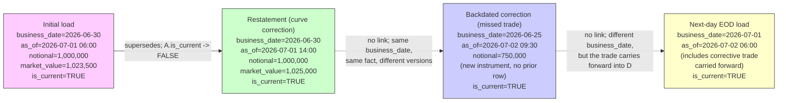

# Module 13 — Time & Bitemporality ⭐

!!! abstract "Module Goal"
    A market-risk warehouse runs on two clocks. **Business date** is the date a row describes — the close of business that the position, the sensitivity, or the VaR number applies to. **As-of date** (or as-of timestamp, or system date, or transaction time) is when the warehouse came to believe it. The two clocks tick independently, and every audit-grade question — "what did the report say on 2026-04-30 *as you knew it then*, before the 2026-05-15 amendment?" — depends on the warehouse storing both. This module is the storage pattern, the query patterns, and the definitions of "latest" that the storage pattern forces you to disambiguate. It is the second-most-cited gap in production risk warehouses (after additivity, Module 12) and the contract you sign with your auditor.

---

## 1. Learning objectives

By the end of this module, you should be able to:

- **Distinguish** business date from as-of / system / transaction-time date, name the column type each one takes, and articulate why the two timelines move independently — the position recorded at 06:00 on 2026-07-01 with `business_date = 2026-06-30` is one row, the *correction* of that row recorded at 11:00 on 2026-07-02 with the same `business_date = 2026-06-30` is a second row, and the warehouse must keep both.
- **Design** a bitemporal fact table or snapshot using either the `(business_date, as_of_timestamp, is_current)` triple (the usual market-risk pattern, on top of an append-only fact) or the four-column `(business_from, business_to, as_of_from, as_of_to)` interval pattern (the classical Snodgrass treatment, occasionally needed for interval-valued facts).
- **Reproduce** a past report exactly as it was known on a past date — a query parameterised by both a `business_date` filter and an `as_of_timestamp <=` cut-off — and explain why this single capability is the difference between passing and failing a Module 16-grade lineage audit.
- **Handle** restatements, backdated corrections, and cancellations as bitemporal *insert* operations rather than as updates: a restatement keeps `business_date` constant and inserts a row with a later `as_of_timestamp`; a backdated correction keeps `as_of_timestamp = now()` and uses a `business_date` in the past; a cancellation closes out the prior row's `as_of_to` and inserts a superseding row.
- **Resolve** the ambiguity in the English word "latest" — "latest position" can mean as-of-latest (latest version per business_date), business-latest (latest business_date with any as_of), or report-latest (latest as_of restricted to the official reporting business_date). The warehouse must pick a default, document it, and provide queryable variants for the other two.
- **Apply** the indexing, clustering, and partitioning patterns that make bitemporal queries fast (Snowflake / BigQuery cluster keys on `(business_date, as_of_timestamp)`, Postgres btree on the four interval columns) and the retention and archive patterns that keep storage cost bounded without violating regulatory retention.

## 2. Why this matters

A regulator walks into your office on 2026-05-08 with a single question: *"Show me the firmwide 99% 1-day VaR report exactly as it appeared on the morning of 2023-09-30, before the restatement on 2023-10-05 corrected the equity-derivatives position by \$120M."* The warehouse has the 2023-09-30 EOD numbers. It also has the corrected numbers loaded on 2023-10-05. If the warehouse stored only the corrected version — overwriting the row in place when the correction arrived — the original report is *gone*, and the only artefact left is the PDF that someone happened to save on a SharePoint folder. The regulator does not accept a PDF; the regulator wants the warehouse to reproduce the number from data. If the warehouse cannot, the audit fails, and the bank discovers the hard way that bitemporality is not a nice-to-have. It is the contract every regulated firm signs with its auditor.

Market risk is unique in the depth of this requirement. A retail bank's customer-balance table can survive on single-temporal storage with an audit log of changes; an internal CRM can be eventually-consistent. A market-risk warehouse cannot. Every reported risk number — VaR, ES, capital, sensitivity, P&L attribution, stress P&L — has a regulatory or audit consumer who will eventually ask "what did this number look like at the moment we read it?" Restatements happen routinely (a curve correction reruns yesterday's sensitivities, a missed trade is booked with a backdated business date, a rating downgrade re-classifies a portfolio after the fact). Each restatement is an event the warehouse has to remember, not a change it can absorb silently. The bitemporal pattern is how the warehouse makes "what we believed when we believed it" a queryable property of every row, not a property of a tape backup that nobody trusts.

The contrast is sharper still in the FRTB era. The Fundamental Review of the Trading Book introduces a back-testing framework that compares each day's reported VaR (or ES) against the realised P&L of the next day, and the exceedance count drives the bank's capital multiplier. Regulators have been explicit: the back-test must be computed against the *as-reported* VaR, the version published on the day, not a later restated version that retro-actively masks an exceedance. Without bitemporal storage, the bank cannot prove which version it published, and the back-test result is contestable. With bitemporal storage, the back-test query is parameterised by the as-of of the original reporting moment for every day in the window, and the result is reproducible by query. Modules 9 (VaR) and 10 (stress testing) introduced the back-test concept; Module 13 is the storage layer that makes the back-test defensible.

After this module a BI engineer should approach every fact table with the same two-question reflex. *What is the business date of this row — the date in the world it describes?* And *what is the as-of of this row — the moment the warehouse came to believe it?* Every fact in a regulated risk warehouse needs an answer to both, in two distinct columns, populated by the loader at insert time and never overwritten in place. The mathematics is shallow; the discipline is hard. A team that gets this discipline right at design time spends five minutes per quarter responding to audit reproducibility requests; a team that gets it wrong spends weeks per quarter rebuilding history from logs and JSON archives, and eventually loses the argument with the regulator.

The bitemporal pattern is also the foundation for two non-audit consumers that the next several modules will activate. **P&L attribution** (Module 14) is computed against a specific (business_date, as_of) pair; the dispatch of an attribution number must carry the as-of explicitly so a re-run of historical attribution against a later as-of does not silently change the published numbers. **Lineage** (Module 16) is, operationally, a parameterised bitemporal query — "for every reported number, the inputs and the moment they were loaded" — and without the bitemporal layer the lineage is a one-way log that the warehouse cannot reproduce by query. Module 13's pattern is what turns lineage from a narrative into a query.

## 3. Core concepts

A reading note. Section 3 walks the bitemporal story in eight sub-sections, building from the two-timeline definition (3.1) through the storage patterns (3.2), restatement and correction mechanics (3.3), the audit/regulatory drivers (3.4), the three definitions of "latest" (3.5), indexing and performance (3.6), the SCD2-vs-fact-bitemporality distinction (3.7), and the storage-cost discipline (3.8). Sections 3.1, 3.3, and 3.5 are the load-bearing concepts for an engineer; section 3.4 is the conversation with audit; section 3.6 is the conversation with the DBA.

Three sub-sections are worked narratives rather than concept definitions: §3.1a (one position, four moments in time) walks a single fact-table row through a week of bitemporal life; §3.4a (four further regulatory and audit consumers) catalogues the non-headline consumers of bitemporality; §3.5a (a clarifying conversation about "the latest VaR") traces a real exchange between a risk manager and an analyst. The narratives are deliberately slow-paced; they are the sections that make the abstract pattern concrete and that most data engineers find most useful to refer back to.

### 3.1 Two timelines that move independently

Every fact a risk warehouse stores has two relevant time coordinates. The first is the time the fact is *true in the world* — the business date, sometimes called the *valid time* or the *effective date* in the temporal-database literature. The second is the time the warehouse came to *know* the fact — the as-of date or as-of timestamp, sometimes called the *system date* or the *transaction time*. The two coordinates are independent. A fact can be known on the same day it is true (the common case), known days after it was true (a late-arriving trade, a vendor late-print, a backdated booking), or known and then *re-known* with a new value (a restatement). Each of those scenarios produces a different relationship between the two coordinates, and the bitemporal pattern is the schema design that records the relationship without losing information.

**Business date.** The date the row describes. The 2026-06-30 EOD position is the position as of close-of-business on 2026-06-30, irrespective of when the warehouse loaded the row. The column is typically a `DATE` (the calendar date), and the time-of-day component, if needed, is implicit in the convention "close of business on the business date" (which itself is a calendar-and-timezone convention attached to the book; Asia books close before Europe books close before US books close, and the *business date* is the local trading date that the EOD process produced, *not* a single global timestamp).

**As-of date / as-of timestamp / system date / transaction time.** The wall-clock instant the warehouse came to believe the row. The column is typically a `TIMESTAMP` in UTC. A `DATE` is sometimes used in shops where restatements only happen across calendar days, but a `TIMESTAMP` is the safer default — intraday restatements happen (a curve correction at 14:00 reruns sensitivities; a corrected scenario at 17:00 reruns a VaR), and if the as-of resolution is only `DATE`, two restatements on the same day collapse into a single state and the warehouse loses the earlier version. Default to TIMESTAMP unless you have a documented reason not to, and always store in UTC (Module 11 §3.x covered timezone discipline; the same rule applies here).

The two timelines are independent. The trade booked on 2026-06-29 with a backdated business date of 2026-06-28 (a corrective posting that should have happened the day before but didn't) sits at `business_date = 2026-06-28, as_of_timestamp = 2026-06-29 ...`. The same business_date, six months later, gets a restatement: `business_date = 2026-06-28, as_of_timestamp = 2026-12-15 ...`. Now the warehouse has two rows for the same `(book, instrument, business_date)` triple — and querying it requires choosing which as-of you mean. The choice is what every bitemporal query has to make explicit; the default is the most recent as-of (the warehouse's *current* belief about 2026-06-28), but the auditor's question is always parameterised by an as-of cut-off.

A useful diagram: think of the (business_date, as_of_timestamp) plane as a 2D grid. The diagonal — where business_date and as_of_timestamp are roughly equal — is the *normal* state of the warehouse, where each business date's row is loaded shortly after the close of that business date. The above-diagonal region (as_of > business_date) is *the past as we know it now*: the rows where the warehouse has restated or corrected its earlier belief about a past business_date. The below-diagonal region (as_of < business_date) is impossible by construction — the warehouse cannot believe something about a future business_date before that business_date has happened — and any row in this region is a loader bug.

A side note on **forecasted business_dates**. Some risk processes produce forward-looking projections — a stress P&L computed today against a future business_date scenario, or a "what-if" position that the warehouse is asked to store. These genuinely have `business_date > as_of_timestamp` (or equivalently, `business_date` in the future relative to the load wall-clock). The right schema treatment is to mark these rows with a `data_classification` flag (`actual` vs `projected`) and to store them in a separate fact table or with a flag column that prevents the BI layer from mixing actuals with projections. The Module 13 pattern proper — bitemporal storage with a real-world business_date and a load-time as_of — is for *actual* historical data. Projections live alongside, not within, the bitemporal layer.

The next sub-section formalises the storage pattern that records this 2D grid.

### 3.1a A worked narrative — one position, four moments in time

Before formalising the storage pattern, follow a single position through a week of bitemporal life. The exercise grounds the abstract two-timeline definition in a concrete trace.

The position is a single book-instrument combination at a US equity-derivatives desk: book `EQUITY_DERIVS_NY` (book_sk = 5001), instrument `AAPL OCT-2026 200 CALL` (instrument_sk = 9001). The position's notional and market value evolve through a normal week and through two unusual events — a curve restatement and a backdated correction.

**Moment 1 — Tuesday 2026-06-30, 18:00 NYT.** The trading day closes. The market-data feed publishes the EOD vol surface; the position-management system marks every option position to that surface and produces an EOD position file. The data-warehouse loader picks up the file at 02:00 UTC the next morning and inserts one row: `(book_sk = 5001, instrument_sk = 9001, business_date = 2026-06-30, as_of_timestamp = 2026-07-01 02:00:00, notional = 1,000,000, market_value = 1,023,500, is_current = TRUE)`. The warehouse's belief about 2026-06-30 EOD is now \$1,023,500 of market value on a \$1M notional. A dashboard query at 09:00 reads this row.

**Moment 2 — Wednesday 2026-07-01, 14:00 NYT.** A curve-rebuild process detects that the 2026-06-30 vol surface had a stale point at the 6-month tenor — the live vendor feed at EOD had returned a default value rather than a fresh print, and the rebuild has now sourced the correct print. The valuation engine reruns every option position whose vega exposure crosses the 6-month tenor; the AAPL October position is one of them. The new market value is \$1,025,000 (a \$1,500 increase). The loader executes a transactional update: flip the prior row's `is_current` to FALSE, insert a new row `(business_date = 2026-06-30, as_of_timestamp = 2026-07-01 18:00:00, notional = 1,000,000, market_value = 1,025,000, is_current = TRUE)`. The notional is unchanged (the trade itself did not change; only the valuation did); the market value has moved by the magnitude of the curve correction.

**Moment 3 — Thursday 2026-07-02, 09:30 NYT.** The trade-capture team discovers that an additional AAPL position — a 200-strike November call, instrument 9003 — was booked on 2026-06-25 but failed the daily ETL because of a cusip-mapping bug, and the position has been silently missing from every report since. The team backports the position with `business_date = 2026-06-25`, and the loader inserts a row at `as_of_timestamp = 2026-07-02 13:30:00` with `notional = 750,000, market_value = 751,800`. This is a *backdated correction* — the business_date is in the past relative to the as-of. The warehouse's belief about 2026-06-25 EOD has now changed: previously it did not include this position; now it does. A weekly P&L report rerun for week 2026-06-22-to-26 will produce a different number than it did when first run.

**Moment 4 — Friday 2026-07-03, 02:00 UTC.** The next regular EOD load arrives for `business_date = 2026-07-01`. The loader inserts a row for the AAPL October position with the new EOD market value (\$1,027,300, reflecting Wednesday's move) and *also* a row for the AAPL November position (the corrective trade carries forward into the 2026-07-01 EOD because it was a real, live trade, not a one-day phantom). The warehouse now has, for instrument 9001, three rows spanning two business dates and two as-ofs; for instrument 9003, two rows spanning two business dates.

Five rows for what was originally one position. Each row has its own `(business_date, as_of_timestamp)` coordinate; each row is queryable by an audit reproducibility query parameterised by an as-of cut-off; each row's contribution to a report is determined by the consumer's choice of as-of and business_date filters. This trace is what bitemporal storage looks like in motion: one position, multiple business_dates, multiple as_ofs per business_date, and the full history preserved for any query that wants it. The remainder of section 3 explains how to encode this pattern in the schema and how to query it efficiently.

### 3.2 The bitemporal modelling pattern

Two patterns are in common use. The first is the **append-only point-event pattern** that Module 07 introduced: every fact row carries `business_date` (DATE, the valid-time axis) and `as_of_timestamp` (TIMESTAMP, the transaction-time axis), and the warehouse never updates a row in place — every restatement is a new row with the same `business_date` and a later `as_of_timestamp`. A derived flag `is_current` (or a view, or a window function) identifies the current version of each `(grain, business_date)` tuple. This is the dominant pattern for periodic-snapshot facts (positions, sensitivities, VaR, P&L) in modern columnar warehouses (Snowflake, BigQuery, Databricks). The grain key includes `as_of_timestamp` — `UNIQUE (book_sk, instrument_sk, business_date, as_of_timestamp)` — and the BI consumer query layer either filters on `is_current = TRUE` for the fast path or applies an `as_of_timestamp <= ?` cut-off for the audit path.

The second pattern is the **interval-valued bitemporal table** from the Snodgrass tradition: every row carries four columns, `(business_from, business_to, as_of_from, as_of_to)`, each one a `TIMESTAMP` defining a half-open interval `[from, to)`. The row is "true in the world" between `business_from` and `business_to`, and "believed by the warehouse" between `as_of_from` and `as_of_to`. A restatement closes out the prior row by setting its `as_of_to = now()` and inserts a new row with `as_of_from = now()` and `as_of_to = +infinity` (often represented as `9999-12-31`). A correction-of-the-business-interval (the position was true from 2026-06-28 to 2026-06-30 and then changed) closes out the prior row's `business_to` and inserts a successor with the new business_from. This pattern is more general but less common in market risk — most risk facts are point-event in the business-time axis (a position *as of* a business date, not a position *during* an interval), so the four-column pattern collapses to the simpler `(business_date, as_of_timestamp)` form for the typical risk fact. Reach for the four-column pattern when the fact is genuinely interval-valued (a credit rating that is valid from `rating_from` to `rating_to`, a counterparty status that holds during a window).

A third variant, frequently seen in dbt-snapshot pipelines, is the **half-open `[valid_from, valid_to)` interval on a dimension** — Type 2 SCD with snapshot-friendly half-open intervals, where `valid_from` is the time the dim attribute became true and `valid_to` is the next change (or `9999-12-31` for the current version). Module 5 §3.3 walked the SCD2 mechanic; the same machinery applies to the *valid-time* axis on a dimension. The bitemporal extension of SCD2 — adding a *transaction-time* axis on top, recording when the warehouse came to believe the dim attribute change — is rarely needed for a risk dim (the operational practice is to load the dim change with `valid_from = the_moment_we_loaded_it`, conflating valid time and transaction time). When it *is* needed (auditor-grade dim restatement), the pattern extends naturally: add `as_of_from`, `as_of_to`, treat the dim row as bitemporal, and accept the extra storage cost.

The convention this module uses, and the convention the rest of the curriculum follows for new fact tables: **half-open intervals `[from, to)` per the modern dbt-snapshot convention.** The "from" timestamp is inclusive; the "to" timestamp is exclusive. The benefit is that adjacent intervals do not overlap (a row valid on 2026-06-30 has `business_to = 2026-07-01` *exclusive*; a row valid from 2026-07-01 has `business_from = 2026-07-01` *inclusive*; the same instant is the boundary, never inside both intervals), and range queries become unambiguous (`business_from <= ? AND business_to > ?` picks exactly one row per grain). The closed-closed convention (`from <= ? AND to >= ?`) is more error-prone — boundary rows can match two intervals — and should be avoided in new schemas.

**The `is_current` flag.** A derived column that the loader sets to `TRUE` on the row with the latest `as_of_timestamp` per grain, and to `FALSE` on every prior row. The flag is *not* the source of truth — the source of truth is the `as_of_timestamp` ordering — but it is the fast-path index for "current view" queries. The loader maintains it transactionally: when a new row arrives, the loader updates the prior row's `is_current = FALSE` *and* inserts the new row with `is_current = TRUE` in the same transaction. Skipping the transaction creates a window where two rows are `is_current = TRUE` (the BI layer sees a duplicate) or zero rows are (the BI layer sees nothing). Either case is a Module 21-class anti-pattern; the loader must own the atomicity.

**The `as_of_timestamp` source — wall-clock vs batch-clock.** A subtle convention with significant downstream consequences. Two reasonable choices: `as_of_timestamp = CURRENT_TIMESTAMP()` evaluated *per row* during the load, or `as_of_timestamp = batch_start_time` captured once at the start of the load and applied to every row in the batch. The recommended default is the second — the **batch-clock** convention. A nightly batch that loads 100,000 rows with the per-row wall-clock convention assigns 100,000 nearly-equal but distinct timestamps; the audit query "give me the state of the world as of when the 2026-07-01 EOD batch completed" becomes ambiguous (which of the 100,000 timestamps?). The batch-clock convention assigns one timestamp to the entire batch, making the batch the unit of bitemporal restatement. If a row in the batch fails and is re-inserted later, the re-inserted row carries a *different* batch-clock timestamp (from its corrective batch) and the warehouse correctly distinguishes the two events. Module 7 §3.x previewed this pattern; here the convention is binding for new bitemporal loaders.

**The 4D vs 2D mental model.** The four-column interval pattern is genuinely 4-dimensional in (business_from, business_to, as_of_from, as_of_to) space. A bitemporal query against it picks rows whose 2D `(business_time, as_of_time)` rectangle intersects the query's `(business_point, as_of_point)`. The three-column point-event pattern collapses two of the four dimensions (business_to is implicit at "the next business_date's row", as_of_to is implicit at "the next as_of's row"), making the mental model simpler at the cost of generality. Most market-risk facts are point-event in business time and the simpler 3-column pattern is the right default; the 4-column pattern is reserved for genuinely interval-valued data (ratings, classifications, statuses).

### 3.3 Restatements, backdated corrections, and cancellations

Three operations recur in market-risk loaders, and each produces a distinct bitemporal insert.

**Restatement.** The warehouse already has a row for `(grain, business_date)`, and a downstream system tells it that the value was wrong. The fix is to insert a *new* row with the same `business_date` and a later `as_of_timestamp`. The original row is preserved (audit), the new row becomes the current version (`is_current = TRUE`), and the prior row's `is_current` is flipped to `FALSE` in the same transaction. The "as we knew it then" query parameterised by an `as_of_timestamp <=` cut-off in the past returns the original row; the "as we know it now" query (or `is_current = TRUE`) returns the restated row. *Business date stays; as-of changes.*

A representative restatement: the 2026-06-30 EOD position for `(book = EQUITY_DERIVS_NY, instrument = AAPL_OPT_2027_06)` is loaded at 2026-07-01 06:00 with `notional = 1,000,000`. On 2026-07-01 14:00, the curve-rebuild process detects a vol-surface error, reruns the position-valuation step, and produces a corrected `notional = 1,025,000`. The loader inserts a new row with the same `business_date = 2026-06-30` and `as_of_timestamp = 2026-07-01 14:00`, flips the prior row's `is_current` to `FALSE`, and the warehouse now has two rows for the same business_date with different as-of timestamps. The auditor who asks "what did the report say at 2026-07-01 09:00?" gets the original 1,000,000; the auditor who asks "what does the warehouse currently believe about 2026-06-30?" gets 1,025,000. Both questions are answerable by query, neither requires a tape recovery.

**Backdated correction.** A trade that was missed in the original 2026-06-25 EOD load is discovered on 2026-07-02 and booked retroactively. The loader inserts a row with `business_date = 2026-06-25` (the date the trade *should* have been on) and `as_of_timestamp = 2026-07-02 09:00` (the moment the warehouse came to know about it). If the warehouse already has rows for `(book, instrument, business_date = 2026-06-25)`, the new row is a *restatement* of those rows; if it is a fresh `(book, instrument)` combination on 2026-06-25, it is a fresh row. In either case, the `business_date` is in the past relative to the `as_of_timestamp` — that is the defining feature. *As-of is today; business date is in the past.*

The reporting consequence of a backdated correction is non-trivial. A weekly P&L report run on 2026-06-30 against `business_date = 2026-06-25` returned a number that did not include the corrective trade. The same report rerun on 2026-07-02 against the same `business_date = 2026-06-25` returns a different number. *Both numbers are correct as-of their as-of.* A consumer who reads the second number and assumes it is the same number as the first is confused; the warehouse defends against this confusion by exposing the as-of column on every report and forcing the consumer to read the pair (business_date, as_of) as a unit. Module 16 (lineage and auditability) treats the dispatch-note discipline that records the as-of of every published number; Module 13's contribution is the storage layer that makes the as-of a queryable column rather than a free-text field on the email.

**Cancellation.** A trade is cancelled, or a sensitivity is withdrawn, or a scenario is invalidated. The bitemporal pattern is to insert a row with `as_of_timestamp = now()` that supersedes the prior row, with a measure value that reflects the cancellation (typically `notional = 0` or a `status = 'CANCELLED'` flag). The prior row is *not* deleted — the cancellation is an event the warehouse has to remember, the same way it has to remember a restatement. The closed-out prior row's `as_of_to` is set to `now()` (in the four-column pattern) or its `is_current` is flipped to `FALSE` (in the three-column pattern), and the new row carries the cancellation marker. The "as we knew it on the morning of the cancellation" query returns the live trade; the "as we knew it the next day" query returns the cancellation. Both views are reachable.

A subtle case: the cancellation arrives with a backdated business_date. A trade that was live on 2026-06-25 and 2026-06-26 is cancelled on 2026-06-27 with a stated cancellation date of 2026-06-25 (the trade should never have been booked in the first place). The bitemporal correction is a *backdated* cancellation: insert a row with `business_date = 2026-06-25, as_of_timestamp = 2026-06-27`, marking the trade as cancelled. The 2026-06-26 row for the same trade is *also* superseded — the trade should not have existed on 2026-06-26 either — and a similar cancellation row is inserted with `business_date = 2026-06-26, as_of_timestamp = 2026-06-27`. The pattern handles this by treating each (business_date, as_of) pair independently; the loader emits one cancellation row per affected business_date, and the warehouse stores them as parallel restatements of each underlying row.

A reference table summarising the three operations and the bitemporal columns each one touches:

| Operation                  | `business_date` of new row             | `as_of_timestamp` of new row | Prior-row `is_current`            | Notes                                                       |
| -------------------------- | -------------------------------------- | ---------------------------- | --------------------------------- | ----------------------------------------------------------- |
| Initial load               | the date the row describes             | now (load wall-clock)        | n/a (no prior row)                | The diagonal case: as_of >= business_date by the load lag.  |
| Restatement                | unchanged from prior row               | now (later than prior)       | flipped to FALSE in same txn      | Same business_date, new as_of, new measure values.          |
| Backdated correction       | a date in the past                     | now                          | flipped to FALSE if prior exists  | as_of - business_date = the "lateness" of the correction.   |
| Cancellation               | unchanged from prior row               | now                          | flipped to FALSE in same txn      | Measure values reflect the cancellation (zeroed or flagged).|
| Backdated cancellation     | each affected past business_date       | now (one per business_date)  | flipped to FALSE per affected row | One cancellation row per business_date the trade was live.  |

The pattern is uniform: every operation is an INSERT, and the only UPDATE is the transactional `is_current` flip on the prior row. The warehouse never overwrites a measure value in place; the warehouse never deletes a row that has ever been visible to a consumer. Both rules together are what make the bitemporal layer audit-grade.

A practical warning on **batch atomicity at scale**. A nightly load may insert 100,000 new rows and flip 100,000 prior `is_current` flags. Wrapping all 200,000 mutations in a single transaction is correct but can be prohibitively expensive on some engines (long lock holds, large transaction logs). The pragmatic pattern is to chunk the batch into transactional sub-batches (e.g., 1,000 grain-keys per sub-batch, each fully atomic), and to ensure the BI layer does not query the table mid-load (a load-window flag, a "loading" view, or a brief read lock). Alternative: use the engine's MERGE primitive (Snowflake `MERGE INTO`, BigQuery `MERGE`, Databricks `MERGE INTO`), which is atomic per statement and handles the prior-flip and new-insert in one operation. The MERGE pattern is the recommended default for new bitemporal loaders on modern columnar warehouses.

### 3.4 Why audit and regulators demand bitemporal

Three regulatory and audit drivers force bitemporality into a market-risk warehouse. Each one is a question the warehouse must be able to answer by query.

**BCBS 239 — risk data aggregation and reporting principles.** The Basel Committee's principles on risk-data quality (Principle 6 — adaptability; Principle 7 — accuracy; Principle 8 — completeness) require that a bank can reproduce risk numbers across time and explain how they were produced. Lineage and traceability are explicit requirements; the bank must be able to show, for every reported number, the underlying data and the moment it was loaded. Module 16 treats the BCBS 239 lineage layer in depth; the contribution from Module 13 is the bitemporal storage that makes the lineage *reproducible*. Without bitemporality, lineage is a one-way log of changes; with bitemporality, lineage is a parameterised query — "show me the data that produced this number at the time it was produced" — that runs against the same fact table every other consumer reads from.

**SOX (Sarbanes-Oxley) and equivalent financial-reporting reproducibility.** US-listed banks publishing financial statements with a market-risk disclosure are subject to SOX's internal-control requirements; equivalents in other jurisdictions (the UK Senior Managers Regime, the EU CRD VI governance requirements, Japanese FIEA) impose similar reproducibility duties. A material number in a published filing must be reproducible from the warehouse on demand, including the as-of of the underlying data. A restatement of a previously-published number (a 10-Q correction, a footnote amendment) must distinguish the original number from the corrected one *and* preserve both. The bitemporal pattern is the storage that makes both numbers queryable and audit-trail-complete.

**The auditor's question.** The single most common audit interaction is the parameterised reproducibility question: *"Show me the report exactly as it appeared on date X, before the amendment of date Y."* A version of this question lands at most large banks every quarter. The warehouse that can answer the question in five minutes by running a parameterised query passes the audit; the warehouse that cannot is in a six-week investigation that involves tape restores, JSON archives, and increasingly tense conversations with the audit partner. The bitemporal storage pattern is the difference. The cost of the pattern is one extra column on every fact (`as_of_timestamp`), the discipline of one extra index, and the storage of restatement rows; the cost of *not* having the pattern is the audit risk and, eventually, the audit finding.

A practical observation. The auditor does not always know they are asking a bitemporal question. A request like "show me the 2024-12-31 firmwide VaR for the year-end disclosure" looks single-temporal until the auditor adds "and confirm it matches the number in the published 10-K." If the published 10-K number was the *as-of-2025-01-15* version of the 2024-12-31 VaR (the version known at the moment of the 10-K filing), and the warehouse currently reflects a *post-restatement* view (a curve correction on 2025-02-01 changed the historical 2024-12-31 number by \$2M), the warehouse-current number does *not* match the 10-K. The data team's job is to recognise the implicit bitemporal parameter, run the query with the right as-of cut-off, and reproduce the published number. A team that does not know to ask "as-of when?" before running the query produces the wrong number, and the auditor concludes either that the published 10-K was wrong or that the warehouse is unreliable. Neither conclusion is good.

### 3.4a Other regulatory and audit consumers of bitemporality

The audit and BCBS 239 conversation is the headline driver, but four further consumer classes also depend on the bitemporal layer and frequently surface it as an explicit requirement.

**Model validation (SR 11-7 in the US, equivalent regimes elsewhere).** The model-validation function periodically replays historical model runs to confirm that current model outputs are reproducible from historical inputs. The replay is a parameterised bitemporal query: "for business_date X, with the inputs that were known at the as-of of the original model run, does the current model code reproduce the original output?" Without bitemporal storage of the inputs, the replay is impossible — the model team cannot distinguish "the model output changed because the model was re-versioned" from "the model output changed because the inputs were silently restated under it." The bitemporal layer makes both axes — model version and input as-of — independently controllable.

**FRTB IMA back-testing.** The FRTB IMA back-test compares each business day's reported VaR (or expected shortfall) against the realised P&L of the next day, accumulating a count of exceedances over a rolling window. The exceedance count is regulator-visible and triggers capital multiplier adjustments; the bank is required to demonstrate that the back-test was computed against the *as-reported* VaR — the version published on the day, not a later restated version that retro-actively masks an exceedance. The query that produces the back-test must use the as-of cut-off of the original reporting moment for every day in the window. A back-test computed against the as-of-latest VaR (the warehouse's current view of historical numbers) is *wrong by construction* and a regulatory finding waiting to happen.

**Internal P&L attribution and risk sign-off.** The desk-level sign-off process — the trader or risk manager who acknowledges each day's P&L and risk numbers — is a contractual point. "I signed off on the P&L of \$X for 2026-06-30" is a statement about the version of the P&L number that was in front of the signer at the moment of sign-off. If the warehouse later restates the number, the sign-off audit trail must preserve the as-of of the original sign-off. The bitemporal layer is what makes the sign-off auditable; a single-temporal warehouse cannot distinguish "signed off on the right number" from "signed off on a number that was later restated and is no longer visible."

**Reconciliation against external counterparties.** When a derivatives confirmation, a margin call, or a regulatory trade-repository submission disagrees with a counterparty, the dispute is resolved by reproducing each side's view at the disputed as-of. "Our 2026-04-30 collateral calculation showed exposure X; yours showed exposure Y; let's reconcile to the inputs as we both had them on the morning of 2026-05-01." The bitemporal layer makes the bank's side of the reconciliation a query; the counterparty does the same on their side; the two reproductions either match (the dispute was over interpretation) or diverge (the dispute was over data). Without bitemporality, the bank's side of the reconciliation is a forensic exercise.

In all four cases, the consumer is not asking a single-temporal "what is the value" question. They are asking a *parameterised* "what was the value at this moment in time, as known then" question — and the only schema that answers it is bitemporal.

A useful generalisation: any consumer whose deliverable is a **point-in-time artefact** — a published filing, a regulatory submission, a sign-off record, a trade confirmation, a margin call — is, implicitly, a bitemporal consumer. Their downstream question is always parameterised by the as-of of the artefact. The data team that internalises this generalisation stops being surprised when the regulator or auditor asks a bitemporal question; the data team that does not, gets surprised every quarter.

The point-in-time artefact list is longer than most teams realise. Every published filing (10-K, 10-Q, Pillar 3 disclosures, FFIEC call reports, EBA QRT submissions); every regulatory data request (CCAR, DFAST, EU stress-test data); every internal sign-off record (daily P&L, weekly limit utilisation, monthly capital attestation); every external confirmation (margin calls, dispute resolutions, tri-party collateral statements); every audit work-paper exhibit. Each one carries an implicit as-of, and each one is a future bitemporal query waiting to be written. The warehouse that takes this list seriously at design time builds bitemporality into every fact; the warehouse that does not finds the list every six months when the next quarter's audit cycle starts.

A second generalisation: the bitemporal pattern lets the warehouse distinguish *information-arrival* events from *world-changing* events. A position was \$1M on 2026-06-30 and the warehouse loaded it that night (`as_of - business_date = 1 day` — a routine information-arrival event). A position was misvalued on 2026-06-30 and the curve correction came in two days later (`as_of - business_date = 3 days` — also an information-arrival event, just later). A position was cancelled on 2026-06-30 and the cancellation arrived the next day (`as_of - business_date = 1 day` — but a world-changing event, the trade ceased to exist). The bitemporal pattern records each as a row with its own (business_date, as_of), and downstream queries can distinguish them by the `as_of - business_date` lag profile and the measure-value deltas. Module 15 (data quality) treats the lag-profile monitoring patterns; the relevant point here is that bitemporality enables the distinction at all.

### 3.5 "Latest" is ambiguous — three definitions

A user asks the data team for "the latest position for book X." The English is unambiguous to the user; in the warehouse, it is at least three different queries. Picking the wrong one ships the wrong number; picking *any* one without naming it leaves the consumer to assume their preferred meaning. The defensive pattern is to know all three, document the default, and provide named variants for the other two.

**As-of-latest** — the latest version of *each* business_date row, computed as the row with the maximum `as_of_timestamp` per `(grain, business_date)`. This is the warehouse's *current best understanding* of every business date in the table. The query is a window function: `QUALIFY ROW_NUMBER() OVER (PARTITION BY book_sk, instrument_sk, business_date ORDER BY as_of_timestamp DESC) = 1`, or the equivalent with `is_current = TRUE` on the fast path. Used for: "what does the warehouse currently believe about each historical business date" — restated history with the most recent corrections folded in. The right answer for back-testing, for time-series analysis, and for any consumer that wants the warehouse's best knowledge of the past.

**Business-latest** — the latest *business_date* in the table for the grain, with whatever as-of is associated with it. Computed as `MAX(business_date)` per grain, then the row(s) at that business_date (typically further filtered to the latest as_of within it). Used for: "what is the most recent date the warehouse has a record of for book X" — the freshness of the data, the recency of the warehouse's coverage. The right answer for monitoring queries (is the data fresh?), for batch-completion checks (did yesterday's load arrive?), and for "the latest position" when the user means *the most recent date we have data for*.

**Report-latest** — the latest `as_of_timestamp` *restricted to a specific business_date that matches the official reporting calendar*. If today is 2026-07-15 and the official reporting business_date is "the most recent month-end" = 2026-06-30, the report-latest row is the row with the maximum `as_of_timestamp` whose `business_date = 2026-06-30`. This is the warehouse's current best understanding of *the official reporting period*, not its current best understanding of every business date. Used for: producing the published report, where the business_date is fixed by calendar (month-end, quarter-end, year-end) and the as-of is "now." The right answer for regulatory submissions, for the board pack, and for any official-report consumer.

A single English sentence — "give me the latest position for book X" — can mean any of the three. The data team's first response should not be the SQL; it should be a clarifying question: "do you mean the warehouse's current view of *every* historical date (as-of-latest), the most recent date we have data for (business-latest), or the latest as-of of the official reporting period (report-latest)?" In practice, the data team writes all three, picks one as the default for the consumer, and documents the choice in the metadata for the next consumer. The default differs by use case: dashboards default to as-of-latest, monitoring tools default to business-latest, regulatory reports default to report-latest.

A more concrete framing of why the disambiguation matters. Imagine the warehouse contains five years of daily VaR data for the firmwide perimeter, and a curve correction yesterday retroactively changed last month's month-end VaR by \$8M. Three different consumers ask "give me the latest firmwide VaR" within an hour of each other:

- The dashboard team wants the *as-of-latest* across the time-series — the post-correction view of every business_date — to render a clean trend chart with the latest revisions folded in. Picking business-latest would show a single dot (yesterday); picking report-latest would lock to a fixed business_date and lose the trend. The dashboard's right answer is as-of-latest.
- The data-quality monitor wants *business-latest* — has yesterday's batch arrived? Is the most recent business_date with data the expected one? Picking as-of-latest would return rows for every historical business_date; picking report-latest would lock to an old date and miss yesterday's load. The monitor's right answer is business-latest.
- The regulatory-reporting team wants *report-latest* — the latest revision of the official month-end (the most recent month-end, in this case last month). Picking as-of-latest would correctly include the recent correction but might also include rows for *yesterday's* business_date that the regulator does not want; picking business-latest would lock to yesterday rather than the month-end. The regulatory team's right answer is report-latest, with `business_date = the_month_end` and `as_of_timestamp` = now (or the as-of of the official submission).

Three consumers, three queries, three different "latest" rows. The discipline is to know which one each consumer needs *before* writing the SQL.

A reference table that captures the three definitions:

| Definition         | Query pattern                                                                          | Used for                                                | Default for                       |
| ------------------ | -------------------------------------------------------------------------------------- | ------------------------------------------------------- | --------------------------------- |
| As-of-latest       | `ROW_NUMBER() OVER (PARTITION BY grain, business_date ORDER BY as_of DESC) = 1`        | Current view of restated history                        | Time-series dashboards            |
| Business-latest    | `WHERE business_date = (SELECT MAX(business_date) FROM fact)` then latest as_of within | Most recent date with data; freshness                   | Monitoring, "is yesterday loaded" |
| Report-latest      | `WHERE business_date = ? AND as_of_timestamp = MAX(as_of) FILTER (...)`                | Official reporting period at the latest known revision  | Regulatory and board reports      |

This is the **latest-disambiguation matrix** and it belongs in the data dictionary alongside the additivity matrix from Module 12 §3.1. Both are cover sheets that prevent silent semantic drift between the warehouse and its consumers.

### 3.5a A worked clarifying conversation

Trace a real exchange between a risk manager and a data analyst on the morning of 2026-07-15, three days after a curve restatement on 2026-07-12 retroactively changed the historical 2026-06-30 month-end VaR by \$8M.

**Risk manager (09:05):** "Send me the latest VaR for the equity-derivatives book."

**Analyst's first reflex** is to write `SELECT var_99_1d FROM fact_var WHERE book = 'EQUITY_DERIVS' AND is_current = TRUE ORDER BY business_date DESC LIMIT 1` and ship the answer. The query returns the 2026-07-14 VaR (yesterday's number, the most recent business_date with data, the warehouse's current view of it). It would take 30 seconds. The analyst would be wrong half the time.

**Analyst's second reflex** is to clarify: "By 'latest' do you mean (a) yesterday's VaR — the most recent business_date with data, our current view of it; (b) the latest version of the official month-end VaR — business_date = 2026-06-30, with the post-restatement value; or (c) the official month-end VaR as it was published in the management pack last week, before the restatement?"

**Risk manager (09:08):** "I want the official month-end number, the way it was in the management pack."

The risk manager wants Report-Latest *as of the publication moment* — which is *not* the as-of-latest of business_date 2026-06-30. The publication moment was 2026-07-08 (the management pack went out on the Wednesday after month-end), and the analyst needs to filter `as_of_timestamp <= 2026-07-08 17:00`.

```sql
SELECT business_date, as_of_timestamp, var_99_1d
FROM fact_var_bitemporal
WHERE book = 'EQUITY_DERIVS'
  AND business_date = DATE '2026-06-30'
  AND as_of_timestamp <= TIMESTAMP '2026-07-08 17:00:00'
QUALIFY ROW_NUMBER() OVER (
    PARTITION BY business_date ORDER BY as_of_timestamp DESC
) = 1;
```

The analyst returns two numbers: the as-published number (\$XXm) and the post-restatement current number (\$XX+8m), with a one-line note explaining the \$8M delta and naming the curve restatement that produced it. The risk manager has the number she wanted *and* a footnote that pre-empts the next question ("why does this differ from what I see in the dashboard now?"). The interaction takes four minutes; the alternative — shipping the wrong number, then explaining it on a follow-up — takes thirty.

The analyst's reflex is the lesson. Every "latest" question is a bitemporal question with at least two implicit parameters (which definition of latest, and which as-of cut-off if Report-Latest). Ten seconds of clarification at the start saves ten emails at the end.

### 3.6 Indexing and performance

Bitemporal queries have a characteristic shape: a range filter on `business_date` (`business_date BETWEEN ? AND ?` or `business_date = ?`), an as-of cut-off filter (`as_of_timestamp <= ?` or `is_current = TRUE`), and a join against the grain (book, instrument). The warehouse's storage layer must serve this shape efficiently or the queries become unworkable on a fact table with five years of daily history and millions of restatements.

**Snowflake / BigQuery / Databricks columnar warehouses.** Cluster the fact on `(business_date, as_of_timestamp)` — in that order, business_date first because it is the primary partition pruner and the more selective filter for most queries. The columnar storage engines do not have traditional B-tree indexes; they have *micro-partitions* (Snowflake) or *partition + clustering* (BigQuery), and the cluster key controls how data is co-located on disk. A query with `business_date = '2026-06-30'` prunes to the partitions covering that date; an additional `as_of_timestamp <= '2026-07-01 09:00'` prunes within those partitions to the relevant slice. Add a secondary cluster on `book_sk` if the query layer commonly filters by book.

**Postgres / MySQL / classical row-store.** Btree index on `(business_date, as_of_timestamp)` for the three-column pattern, or on `(business_from, business_to, as_of_from, as_of_to)` for the four-column interval pattern. The four-column case is harder — the planner needs to support range queries on all four columns simultaneously — and is best served by a GiST index on a `tstzrange` or `daterange` composite type. Postgres's `tstzrange` with the `&&` (overlap) operator and a GiST index gives true 4D bitemporal range queries with O(log n) lookup; without the GiST index, the planner falls back to a sequential scan and the queries become unusable on a large table.

**Materialised "current" view.** A common performance pattern is to maintain a separate materialised view or table containing only the `is_current = TRUE` rows. The view is rebuilt nightly (or maintained transactionally by the loader) and serves the fast path — the dashboard queries that want today's view of every business date. The full bitemporal table serves the audit path — the parameterised reproducibility queries that need an as-of cut-off. The split lets the storage layer optimise for both patterns: the current view is small and dense (one row per grain per business_date), the full table is larger but queried less frequently. The cost is the discipline to keep the two in sync; the benefit is two-orders-of-magnitude faster default queries.

**Partition-pruning discipline.** The single most common bitemporal-query performance bug is forgetting the `business_date` filter. A query that says only `WHERE as_of_timestamp <= '2026-07-01 09:00'` scans every business_date in the table, applies the as-of filter post-hoc, and returns possibly millions of rows. The query planner cannot prune partitions without the date filter. The defensive pattern is to require `business_date` (or `business_date BETWEEN`) on every bitemporal query, and to enforce the requirement in the semantic-layer or BI tool by making the date a mandatory parameter. A query that does not specify a date is, almost always, a query that should not be running.

**Semantic-layer encapsulation.** The defensive pattern for production BI is to expose the bitemporal fact through a semantic-layer view (dbt model, LookML view, Cube view, MetricFlow view) that takes two parameters — `business_date` and `as_of_timestamp` — and returns the per-grain row resolved against both. The BI tool consumer never writes the window-function query directly; they pick `business_date` and (optionally) `as_of_timestamp` from a parameter prompt, the semantic layer resolves the bitemporal selection, and the consumer sees a clean row-per-grain result. Three benefits: the bitemporal logic is centralised (one place to fix bugs, one place to optimise), the consumer cannot accidentally omit the filters (the semantic-layer view requires them), and the audit trail of "which as-of did this dashboard use?" becomes a property of the view definition rather than a property of every individual chart. The cost is one layer of indirection between the consumer and the raw fact; the benefit is bitemporal correctness by construction.

**Caching and the as-of-latest fast path.** The most-frequent BI query on a bitemporal fact is the as-of-latest current-view query — `WHERE is_current = TRUE` for a given business_date. This query is hit by every dashboard refresh, every monitoring check, every routine report. The performance pattern is to maintain a separate `fact_position_current` table (or materialised view) containing only the `is_current = TRUE` slice, refreshed by the same loader that maintains the `is_current` flag on the bitemporal table. Dashboards read from `fact_position_current`; audit reproducibility queries read from `fact_position_bitemporal`. Two tables, one source of truth, two access patterns optimised independently. The discipline: the loader writes both tables in the same transaction, and a data-quality check periodically reconciles the two (the row counts must match per business_date for `is_current = TRUE` rows in the bitemporal table).

**Query-shape monitoring.** A useful operational practice on a bitemporal warehouse is to log the shape of every query that hits the bitemporal fact: the `business_date` filter, the `as_of_timestamp` filter (or absence thereof), and the running time. A dashboard built on this log answers two operational questions: which consumers are running queries without the date filter (a partition-pruning bug — they should be redirected through the semantic-layer view), and which consumers are running audit-reproducibility queries (a heads-up to the audit team that the data is being requested in that mode, often a precursor to an audit interaction). The query-shape log also supports cost monitoring — a query that scans the entire bitemporal table is materially more expensive than one that prunes to a single partition, and the warehouse owner wants visibility on which consumers are doing which.

### 3.7 Bitemporality vs SCD2 — same idea, different access patterns

Module 5 §3.3 introduced Slowly Changing Dimension Type 2 (SCD2): a dimension table that records a *history* of attribute values, with `valid_from` and `valid_to` defining the interval each version is in force. SCD2 is *bitemporal on a dimension*. The pattern in Module 13 is *bitemporal on a fact*. The mechanics are the same — `[from, to)` intervals, restatement-as-insert, audit-trail preservation — but the access patterns differ.

**Dimensions are joined to facts at the fact's business date.** The SCD2 query is "give me the version of `dim_book` that was in force on `business_date = 2026-06-30`." The fact carries `book_sk` (the surrogate key of the dim version in force when the fact was loaded), and the join resolves to the right dim row by point-in-time. SCD2 dims are typically updated by a UPDATE+INSERT pattern (close out the prior row's `valid_to`, insert the new row with `valid_from = now()`); the table is small enough that the update is cheap.

**Facts are append-only.** A bitemporal fact never updates a row in place. Every restatement is a new row. The `is_current` flag is the only column the loader updates, and it does so transactionally with the new row insert. The append-only discipline is what makes the audit story work — if the loader were allowed to UPDATE a fact row, the warehouse could not prove it had not silently rewritten history. The cost is more rows; the benefit is unambiguous immutability of every loaded row, which is the audit story the regulator wants.

**The two patterns compose.** A `fact_position` row for `business_date = 2026-04-15` carries `book_sk = 5001` (the version of the book in force on 2026-04-15). On 2026-05-01, the book is restructured and `dim_book` rolls forward to `book_sk = 5002`. The fact row for 2026-04-15 *does not change*; it continues to reference 5001, and the SCD2 join still resolves to the right version. A separate restatement of the 2026-04-15 fact (a curve correction reruns the valuation) inserts a new fact row with the same `business_date = 2026-04-15`, the same `book_sk = 5001`, and a new `as_of_timestamp`. SCD2 on the dim is independent of bitemporal restatement on the fact; both mechanics run side-by-side, both preserve their own history, and the join resolves correctly across both axes. Module 7 §3.x walked through a worked example of this composition; the relevant point here is that bitemporality on facts does not duplicate SCD2 on dims — they handle different change types and they coexist.

**When to put bitemporality on a dimension.** SCD2 already makes a dimension valid-time-aware; the additional transaction-time axis is rarely needed for normal dim changes (a counterparty's credit rating, a book's hierarchy, a trader's desk assignment). It *is* needed when the dim attribute itself can be retroactively restated — the regulator publishes a clarification on 2026-08-01 that a bond's risk classification on 2026-06-30 should have been "high-yield" rather than "investment-grade", and the warehouse must record both "what we thought on 2026-06-30" and "what we now think on 2026-08-01 about 2026-06-30." This is rare but not zero. The fully-bitemporal dim adds two columns (`as_of_from`, `as_of_to`) on top of the SCD2 (`valid_from`, `valid_to`) pair, and the join logic now needs to specify both axes — for the fact's business_date, find the dim row whose `valid_from <= business_date < valid_to` AND `as_of_from <= reporting_as_of < as_of_to`. The complexity is real; reach for it only when the dim genuinely needs both timelines.

A reference table summarising when each pattern is appropriate:

| Pattern                                  | Where used                            | Operations                              | Storage cost       |
| ---------------------------------------- | ------------------------------------- | --------------------------------------- | ------------------ |
| Single-temporal (`business_date` only)   | Reference data, audit-irrelevant facts | UPDATE in place                         | 1x (baseline)      |
| SCD2 dim (`valid_from`, `valid_to`)      | Most market-risk dimensions          | UPDATE+INSERT (close, then add)         | 1.1x – 1.5x         |
| Bitemporal fact (3-col + `is_current`)   | All regulated risk facts (default)   | INSERT only; `is_current` flip           | 1.3x – 2.0x         |
| Bitemporal fact (4-col interval)         | Interval-valued facts (rare)         | INSERT + close prior `as_of_to` / `business_to` | 1.5x – 2.5x  |
| Fully bitemporal dim (4-col)             | Dims with retroactive restatement    | INSERT + close prior intervals          | 1.5x – 3.0x         |

The default for new market-risk facts is the 3-column bitemporal pattern (business_date, as_of_timestamp, is_current). The other patterns are reserved for the cases that genuinely need them — the architecture decision should be made at design time, not retrofitted under audit pressure.

### 3.8 Storage cost and retention discipline

The honest acknowledgement: bitemporal storage is non-trivially more expensive than single-temporal storage. Every restatement adds a row. A `fact_position` table with 4,000 instruments, 200 books, and 1,260 business days of history (five years) carries roughly 1 billion rows in the steady state. If 1% of business_dates are restated once each, that adds 10M rows; if heavy-restatement business dates (year-end, quarter-end, month-end) are restated 10 times each, the multiplier grows. The total bitemporal table can be 1.5x to 3x the single-temporal table in a large bank. In Snowflake-style storage at \$23/TB/month, this is real money but not catastrophic; the trade-off is favourable, especially against the audit risk of *not* having the bitemporal layer.

Three mitigations keep the cost bounded:

**Hot-cold archival of old as-of versions.** Keep the most recent N as-of versions (typically the last 90 days) in the hot fact table; archive older versions to a cold-tier table or to object storage with a query layer (Snowflake external tables, BigQuery external tables, Iceberg / Delta on S3). The hot table serves the routine BI queries; the cold table serves the audit reproducibility queries that go further back in time. The split typically reduces the hot-tier storage by 5x without losing any auditability.

**Compaction of identical successive rows.** If a restatement produces the same measure values as the prior row (a cosmetic restatement, perhaps a rerun that did not actually change anything), the loader can choose to *not* insert the new row at all — the prior row's `as_of_timestamp` is left untouched, and the warehouse's belief is unchanged. The discipline requires the loader to compare the new row to the current row before inserting; the savings can be substantial in shops with frequent reruns. The risk is that an auditor's "what did we believe at moment X" query can no longer distinguish "we did not rerun" from "we reran but the answer was the same"; for most audit purposes, this is acceptable, but in shops with strict process-evidence requirements (operational risk, model-validation evidence), the loader should always insert and accept the storage cost.

**Regulatory retention windows.** Every regulator has a minimum retention requirement for historical data. BCBS 239 and FRTB require five years for most market-risk data; SOX requires seven years for material financial-reporting evidence; specific jurisdictional rules can extend either. The warehouse's archival strategy *must respect the longest applicable retention*. Pruning old as-of versions before the retention window expires is a regulatory finding, and the bank's data-retention policy must explicitly enumerate which tables are subject to which retention. Module 16 (lineage and auditability) treats the retention policy in the regulatory context; the relevant discipline here is that the bitemporal layer is *not* a candidate for aggressive pruning, and the cold-tier archival is the right tool for cost management within the retention window.

A practical sizing exercise that often surprises teams. Take a `fact_sensitivity` table with the following profile: 200 books, 500 risk factors, 5 sensitivity types, 1,260 business days = 630M rows in the single-temporal baseline. Assume a 1.5x bitemporal multiplier for restatements (each business_date is restated, on average, half a time across its lifetime in the hot window) — 945M rows. At 100 bytes per row in compressed columnar storage, the table is 95 GB. At Snowflake list pricing of \$23/TB/month, the table costs \$2.20/month to store. The bitemporal increment over single-temporal is \$0.74/month. The audit-risk reduction is materially larger than the storage cost; the trade-off is overwhelmingly favourable. The discipline conversation about archival vs deletion is *not* about saving the \$0.74; it is about controlling the warehouse's growth trajectory across many fact tables and many years, and about disciplining the loader-side restatement frequency so that runaway re-runs do not multiply the table size unnecessarily.

The runaway-restatement failure mode deserves a sentence on its own. A loader bug or a misconfigured orchestrator can re-run an entire month of historical loads every night, inserting hundreds of thousands of restated rows that contain no new information. The bitemporal pattern makes this expensive in storage but invisible in the BI layer (every restatement looks correct on its own; the `is_current` flag picks the latest one and the dashboards render the right number). The compaction discipline (skip the insert if the new row is value-identical to the prior current row) is the loader-side defence; the data-quality monitor that alerts on "more than N restatements per business_date per week" is the operational defence. Both should be in place before the warehouse runs in production at scale.

## 4. Worked examples

### Example 1 — SQL: bitemporal upsert on `fact_position_bitemporal`

Build the canonical bitemporal periodic-snapshot fact and walk through four representative loader operations. Dialect: Snowflake / BigQuery (the syntax is portable to Postgres with minor adjustments — `TIMESTAMP_NTZ` becomes `TIMESTAMP`, `BOOLEAN` is the same, `NUMBER` becomes `NUMERIC`).

```sql
-- DDL: bitemporal periodic-snapshot fact on positions
CREATE TABLE fact_position_bitemporal (
    position_sk         BIGINT          NOT NULL,        -- surrogate key for the row
    book_sk             BIGINT          NOT NULL,
    instrument_sk       BIGINT          NOT NULL,
    business_date       DATE            NOT NULL,        -- valid-time axis
    as_of_timestamp     TIMESTAMP_NTZ   NOT NULL,        -- transaction-time axis (UTC)
    notional            NUMBER(28, 4)   NOT NULL,
    market_value        NUMBER(28, 4)   NOT NULL,
    source_system_sk    BIGINT          NOT NULL,
    is_current          BOOLEAN         NOT NULL,
    CONSTRAINT pk_fact_position_bitemporal
        PRIMARY KEY (book_sk, instrument_sk, business_date, as_of_timestamp)
)
CLUSTER BY (business_date, as_of_timestamp);

-- Indexing note: the cluster key is (business_date, as_of_timestamp); the BI consumer
-- queries always carry a business_date filter and an as_of cut-off, so the planner
-- can prune to the relevant micro-partitions in O(log n).
```

Now four loader operations simulating a realistic week of activity.

```sql
-- (a) Initial load: 2026-06-30 EOD positions, loaded the next morning at 06:00
INSERT INTO fact_position_bitemporal
    (position_sk, book_sk, instrument_sk, business_date, as_of_timestamp,
     notional, market_value, source_system_sk, is_current)
VALUES
    (1001, 5001, 9001, DATE '2026-06-30', TIMESTAMP '2026-07-01 06:00:00',
     1000000.00, 1023500.00, 100, TRUE),
    (1002, 5001, 9002, DATE '2026-06-30', TIMESTAMP '2026-07-01 06:00:00',
     -500000.00, -498200.00, 100, TRUE),
    (1003, 5002, 9001, DATE '2026-06-30', TIMESTAMP '2026-07-01 06:00:00',
     2000000.00, 2047100.00, 100, TRUE);

-- (b) Restatement of 2026-06-30: a curve correction at 14:00 reruns the valuations.
--     Same business_date, later as_of_timestamp. Prior rows' is_current flipped.
UPDATE fact_position_bitemporal
SET    is_current = FALSE
WHERE  business_date = DATE '2026-06-30'
  AND  book_sk = 5001 AND instrument_sk = 9001
  AND  is_current = TRUE;

INSERT INTO fact_position_bitemporal
    (position_sk, book_sk, instrument_sk, business_date, as_of_timestamp,
     notional, market_value, source_system_sk, is_current)
VALUES
    (1004, 5001, 9001, DATE '2026-06-30', TIMESTAMP '2026-07-01 14:00:00',
     1000000.00, 1025000.00, 100, TRUE);
-- Note: notional is unchanged (1,000,000) — the correction was to market_value
-- (1,023,500 -> 1,025,000), not notional. The bitemporal pattern preserves both
-- versions. The auditor can ask "what did we believe at 09:00?" (1,023,500) and
-- "what do we currently believe?" (1,025,000) and both answers are queryable.

-- (c) Backdated correction for 2026-06-25, inserted on 2026-07-02:
--     a missed trade is discovered. business_date is in the past relative to as_of.
INSERT INTO fact_position_bitemporal
    (position_sk, book_sk, instrument_sk, business_date, as_of_timestamp,
     notional, market_value, source_system_sk, is_current)
VALUES
    (1005, 5001, 9003, DATE '2026-06-25', TIMESTAMP '2026-07-02 09:30:00',
     750000.00, 751800.00, 100, TRUE);
-- Note: this is a fresh (book, instrument, business_date) tuple — the warehouse
-- did not previously have a row for instrument 9003 on 2026-06-25. No prior row
-- to flip; the new row arrives with is_current = TRUE. If a row had existed,
-- the loader would have flipped its is_current first (as in step (b)).

-- (d) The next day's regular EOD load: 2026-07-01 EOD positions, loaded 2026-07-02 06:00
INSERT INTO fact_position_bitemporal
    (position_sk, book_sk, instrument_sk, business_date, as_of_timestamp,
     notional, market_value, source_system_sk, is_current)
VALUES
    (1006, 5001, 9001, DATE '2026-07-01', TIMESTAMP '2026-07-02 06:00:00',
     1000000.00, 1027300.00, 100, TRUE),
    (1007, 5001, 9002, DATE '2026-07-01', TIMESTAMP '2026-07-02 06:00:00',
     -500000.00, -497500.00, 100, TRUE),
    (1008, 5001, 9003, DATE '2026-07-01', TIMESTAMP '2026-07-02 06:00:00',
     750000.00, 752900.00, 100, TRUE),  -- the corrective trade carries forward
    (1009, 5002, 9001, DATE '2026-07-01', TIMESTAMP '2026-07-02 06:00:00',
     2000000.00, 2051500.00, 100, TRUE);
```

After the four operations the table has the following state. Note how each `(book_sk, instrument_sk, business_date)` triple may have one or more rows, and `is_current = TRUE` identifies the current view. Read the table top-to-bottom in chronological order of `as_of_timestamp` and the loader's narrative becomes apparent: an initial Wednesday-morning batch, a Wednesday-afternoon curve correction, a Thursday backdated correction, a Friday-morning regular EOD. Each operation contributes one or more rows; no row is ever deleted; the `is_current` flag is the only column the loader updates after the initial insert.

| position_sk | book_sk | instrument_sk | business_date | as_of_timestamp     | notional   | market_value | is_current |
| ----------- | ------- | ------------- | ------------- | ------------------- | ---------- | ------------ | ---------- |
| 1001        | 5001    | 9001          | 2026-06-30    | 2026-07-01 06:00:00 | 1,000,000  | 1,023,500    | FALSE      |
| 1002        | 5001    | 9002          | 2026-06-30    | 2026-07-01 06:00:00 | -500,000   | -498,200     | TRUE       |
| 1003        | 5002    | 9001          | 2026-06-30    | 2026-07-01 06:00:00 | 2,000,000  | 2,047,100    | TRUE       |
| 1004        | 5001    | 9001          | 2026-06-30    | 2026-07-01 14:00:00 | 1,000,000  | 1,025,000    | TRUE       |
| 1005        | 5001    | 9003          | 2026-06-25    | 2026-07-02 09:30:00 | 750,000    | 751,800      | TRUE       |
| 1006        | 5001    | 9001          | 2026-07-01    | 2026-07-02 06:00:00 | 1,000,000  | 1,027,300    | TRUE       |
| 1007        | 5001    | 9002          | 2026-07-01    | 2026-07-02 06:00:00 | -500,000   | -497,500     | TRUE       |
| 1008        | 5001    | 9003          | 2026-07-01    | 2026-07-02 06:00:00 | 750,000    | 752,900      | TRUE       |
| 1009        | 5002    | 9001          | 2026-07-01    | 2026-07-02 06:00:00 | 2,000,000  | 2,051,500    | TRUE       |

Walk through what each row records. Row 1001 is the original 2026-06-30 EOD position for `(book = 5001, instrument = 9001)`; row 1004 is the restatement of the same triple. Row 1001's `is_current = FALSE` because row 1004 superseded it; row 1004's `is_current = TRUE`. The auditor's query for "as we knew it at 09:00 on 2026-07-01" returns row 1001 (because 06:00 <= 09:00 < 14:00); the warehouse's "current view" returns row 1004. Both rows are preserved, both are queryable, and the difference between them is the curve correction that ran at 14:00.

### Example 2 — SQL: as-of query, three definitions of "what does the warehouse say about 2026-06-30?"

Build three queries against the same `fact_position_bitemporal` and observe how each returns a different answer for the same business_date.

```sql
-- Query 1: "What were the EOD positions for book 5001 on business_date 2026-06-30,
--           as known at the moment 2026-07-01 09:00?"
-- This is the audit reproducibility query. The auditor wants the report exactly
-- as it was at 09:00 on 2026-07-01, before the 14:00 restatement.
SELECT
    book_sk,
    instrument_sk,
    business_date,
    as_of_timestamp,
    notional,
    market_value
FROM fact_position_bitemporal
WHERE book_sk = 5001
  AND business_date = DATE '2026-06-30'
  AND as_of_timestamp <= TIMESTAMP '2026-07-01 09:00:00'
QUALIFY ROW_NUMBER() OVER (
    PARTITION BY book_sk, instrument_sk, business_date
    ORDER BY as_of_timestamp DESC
) = 1;
-- Returns:
--   (5001, 9001, 2026-06-30, 2026-07-01 06:00, 1,000,000, 1,023,500)
--   (5001, 9002, 2026-06-30, 2026-07-01 06:00,  -500,000,  -498,200)
-- The 14:00 restatement is filtered out by the as_of cut-off.

-- Query 2: "What does the warehouse currently know about 2026-06-30 for book 5001?"
-- This is the current-view query. The latest as_of for each (grain, business_date),
-- with no cut-off — the warehouse's best understanding today.
SELECT
    book_sk,
    instrument_sk,
    business_date,
    as_of_timestamp,
    notional,
    market_value
FROM fact_position_bitemporal
WHERE book_sk = 5001
  AND business_date = DATE '2026-06-30'
  AND is_current = TRUE;
-- Returns:
--   (5001, 9001, 2026-06-30, 2026-07-01 14:00, 1,000,000, 1,025,000)
--   (5001, 9002, 2026-06-30, 2026-07-01 06:00,  -500,000,  -498,200)
-- Note: instrument 9001 returns the restated row; instrument 9002 was never
-- restated, so it returns the original row. The is_current flag handles both
-- cases identically.

-- Query 3: "What is the latest business_date the warehouse has data for, for book 5001,
--           and what do we currently know about it?"
-- This is the "business-latest" query — used for monitoring and freshness checks.
SELECT
    book_sk,
    instrument_sk,
    business_date,
    as_of_timestamp,
    notional,
    market_value
FROM fact_position_bitemporal
WHERE book_sk = 5001
  AND business_date = (
      SELECT MAX(business_date) FROM fact_position_bitemporal WHERE book_sk = 5001
  )
  AND is_current = TRUE;
-- Returns:
--   (5001, 9001, 2026-07-01, 2026-07-02 06:00, 1,000,000, 1,027,300)
--   (5001, 9002, 2026-07-01, 2026-07-02 06:00,  -500,000,  -497,500)
--   (5001, 9003, 2026-07-01, 2026-07-02 06:00,    750,000,    752,900)
-- A different business_date entirely (2026-07-01, not 2026-06-30) and a different
-- set of rows (the 2026-07-01 EOD positions including the corrective trade
-- that carried forward from the 2026-06-25 backdated correction).
```

Three queries, three different answers, all from the same data. The auditor's question is Query 1; the dashboard's default is Query 2; the data-quality monitor is Query 3. The data team that ships the wrong query for the wrong consumer ships the wrong number; the data team that internalises the latest-disambiguation matrix from §3.5 picks the right one and names it explicitly. The semantic-layer view that the BI tool reads from should be three views, not one — `vw_position_audit_asof(business_date, as_of_timestamp_cutoff)`, `vw_position_current(business_date)`, and `vw_position_business_latest(book_sk)` — each named so the consumer cannot accidentally invoke the wrong one.

**Postgres / standard-SQL CTE alternative.** The `QUALIFY` clause is Snowflake / BigQuery / Databricks; classical Postgres requires a CTE wrapper. The translation:

```sql
WITH ranked AS (
    SELECT
        book_sk, instrument_sk, business_date, as_of_timestamp,
        notional, market_value,
        ROW_NUMBER() OVER (
            PARTITION BY book_sk, instrument_sk, business_date
            ORDER BY as_of_timestamp DESC
        ) AS rn
    FROM fact_position_bitemporal
    WHERE book_sk = 5001
      AND business_date = DATE '2026-06-30'
      AND as_of_timestamp <= TIMESTAMP '2026-07-01 09:00:00'
)
SELECT book_sk, instrument_sk, business_date, as_of_timestamp, notional, market_value
FROM ranked
WHERE rn = 1;
```

The semantics are identical; the syntax varies by dialect. The recommended practice is to encapsulate the bitemporal selection in a database view or in a dbt model that exposes a clean `(grain, business_date)` per-row interface to the BI tool, parameterised by the `as_of_timestamp` cut-off. The BI tool then queries the view rather than the raw fact, and the bitemporal logic is centralised in one place.

**A fourth query — the time-series of restatements.** A useful diagnostic that the bitemporal pattern enables but a single-temporal layer cannot: the time-series of how the warehouse's belief about a single business_date evolved across as_ofs. The query is essentially "show me every version we ever held for this grain on this date, in chronological order of as_of."

```sql
SELECT
    book_sk, instrument_sk, business_date,
    as_of_timestamp,
    notional, market_value,
    is_current,
    market_value - LAG(market_value) OVER (
        PARTITION BY book_sk, instrument_sk, business_date
        ORDER BY as_of_timestamp
    ) AS restatement_delta
FROM fact_position_bitemporal
WHERE book_sk = 5001
  AND instrument_sk = 9001
  AND business_date = DATE '2026-06-30'
ORDER BY as_of_timestamp;
-- Returns:
--   (5001, 9001, 2026-06-30, 2026-07-01 06:00, 1,000,000, 1,023,500, FALSE, NULL)
--   (5001, 9001, 2026-06-30, 2026-07-01 14:00, 1,000,000, 1,025,000, TRUE,  1,500)
-- The restatement_delta column shows the magnitude of each restatement.
```

This query is the foundation of a "restatement-impact dashboard" that risk-control teams use to monitor unusual restatement patterns: a business_date with five restatements is investigated; a restatement with a delta exceeding a threshold (say, \$10M on a position) triggers an alert. Module 15 (data quality) treats the restatement-monitoring patterns; the relevant point here is that the bitemporal layer makes the monitoring queryable, not narrative.

## 5. Common pitfalls

!!! warning "Watch out"
    1. **Storing only `business_date` and overwriting the row on restatement.** The classical single-temporal mistake. The warehouse appears to work — every business_date has one row, queries are simple — until the auditor asks for a historical view and the original numbers are gone. The fix is structural (add the `as_of_timestamp` column from day one) and is significantly harder to retrofit than to design in.
    2. **Using a single `last_updated` timestamp to mean both restatement-time and bitemporal as-of.** The `last_updated` pattern is common in OLTP systems and conflates "when did this row change" with "what does the warehouse believe at this moment." A row whose `last_updated = 2026-07-01 14:00` does not tell you whether the *previous* version had `last_updated = 2026-07-01 06:00` (bitemporal — the warehouse used to believe something different) or `last_updated = 2026-06-15` (this row has been stable for two weeks). Use a separate `as_of_timestamp` column with explicit bitemporal semantics; reserve `last_updated` for technical-audit purposes (when did the loader touch this row), not for business semantics.
    3. **Querying without an `as_of_timestamp <=` filter.** A query that says "give me 2026-06-30 positions" and reads from the bitemporal fact without an as-of cut-off returns *all* versions of every 2026-06-30 row — the original, every restatement, every correction. The BI tool that does not know about bitemporality renders all of them and shows duplicates. The fix is to either always go through a current-view layer (`is_current = TRUE` filter, or a materialised view) or to require the as-of cut-off as a parameter. A bare `WHERE business_date = ?` is a bug.
    4. **Not handling `is_current` flag updates atomically.** The loader inserts a new row and forgets to flip the prior row's `is_current`, or flips it in a separate transaction that races with the insert. Result: a transient window where two rows are `is_current = TRUE` (BI sees duplicates) or where zero rows are (BI sees nothing). The fix is to wrap the prior-row flip and the new-row insert in a single transaction, and to add a data-quality check that asserts at most one `is_current = TRUE` row per `(grain, business_date)` (Module 15).
    5. **Reporting "latest" without specifying which definition.** A board-pack number labelled "latest position" can be as-of-latest, business-latest, or report-latest. The board interprets it as whichever they were thinking; the data team meant something different; the next quarter the question comes back as "why did the latest number change?" The fix is the latest-disambiguation discipline from §3.5: name the variant in the metric definition, surface the chosen variant in the report (preferably as a footnote: "as-of-latest as of 2026-07-15 14:00"), and document the default.
    6. **Backdated corrections that re-shape the position curve weeks later.** A trade missed in week 1 and discovered in week 4 inserts rows for week-1 business dates with as-of timestamps in week 4. A weekly P&L report rerun for week 1 now shows different numbers than it did when first run; a P&L attribution decomposition (Module 14) silently re-attributes prior-week P&L to the corrective trade. The fix is *not* to suppress the correction (the warehouse must record it), but to expose the as-of of every published number so that consumers know when re-runs differ from earlier runs. A "P&L drift dashboard" that compares the as-of-latest view of historical weeks against the as-of-when-published view is a powerful diagnostic.
    7. **Pruning old as-of versions before regulatory retention is met.** The cold-tier archival is the right tool for storage cost; aggressive deletion is not. The retention policy must enumerate the bitemporal layer explicitly, and the archival job must move rows to cold tier rather than delete them. A regulator who asks for a 2024-01-01 reproduction and is told "we pruned the bitemporal versions in 2025 to save storage" will not be sympathetic.
    8. **Confusing time-zones across the two timelines.** `business_date` is typically a local-calendar concept (the trading-day on which the position is in force, defined in the book's home time-zone) while `as_of_timestamp` is wall-clock UTC. A loader that records `as_of_timestamp` in local time and then compares it against a UTC-based audit cut-off produces off-by-one errors at midnight UTC, especially around DST transitions. Always store `as_of_timestamp` in UTC, document the time-zone of `business_date` per book, and convert in the reporting layer only.
    9. **Treating `as_of_timestamp` as an upsert key.** A loader that uses `INSERT ... ON CONFLICT (book_sk, instrument_sk, business_date, as_of_timestamp) DO UPDATE` and the as-of clock has only second-resolution can collide on rapid back-to-back loads. The collision UPDATE silently overwrites the prior row's measure values, destroying the bitemporal history. Use millisecond or microsecond resolution on the as-of clock, and treat the bitemporal grain key as immutable — never UPDATE the measures of an existing bitemporal row.

## 6. Exercises

1. **As-of reasoning.** Given the following bitemporal `fact_position_bitemporal` rows, what would the report show as of 2026-07-02 09:00 for `business_date = 2026-06-28` and `book_sk = 5001`? Walk through the row selection.

    | position_sk | book_sk | instrument_sk | business_date | as_of_timestamp     | notional   |
    | ----------- | ------- | ------------- | ------------- | ------------------- | ---------- |
    | 2001        | 5001    | 9001          | 2026-06-28    | 2026-06-29 06:00:00 | 1,500,000  |
    | 2002        | 5001    | 9002          | 2026-06-28    | 2026-06-29 06:00:00 | -800,000   |
    | 2003        | 5001    | 9001          | 2026-06-28    | 2026-06-30 11:00:00 | 1,520,000  |
    | 2004        | 5001    | 9003          | 2026-06-28    | 2026-07-01 09:30:00 | 600,000    |
    | 2005        | 5001    | 9001          | 2026-06-28    | 2026-07-03 14:00:00 | 1,510,000  |
    | 2006        | 5001    | 9002          | 2026-06-28    | 2026-07-02 10:30:00 | -795,000   |

    ??? note "Solution"
        The cut-off is `as_of_timestamp <= 2026-07-02 09:00:00`. Filter the rows:

        - Row 2001: as_of = 2026-06-29 06:00 — included.
        - Row 2002: as_of = 2026-06-29 06:00 — included.
        - Row 2003: as_of = 2026-06-30 11:00 — included.
        - Row 2004: as_of = 2026-07-01 09:30 — included.
        - Row 2005: as_of = 2026-07-03 14:00 — *excluded* (after cut-off).
        - Row 2006: as_of = 2026-07-02 10:30 — *excluded* (after cut-off).

        Now apply `ROW_NUMBER() OVER (PARTITION BY book_sk, instrument_sk, business_date ORDER BY as_of_timestamp DESC) = 1` to the remaining rows:

        - For instrument 9001: rows 2001 and 2003 both qualify; row 2003 is the most recent (2026-06-30 11:00 > 2026-06-29 06:00). Pick row 2003: notional = 1,520,000.
        - For instrument 9002: only row 2002 qualifies. Pick row 2002: notional = -800,000.
        - For instrument 9003: only row 2004 qualifies. Pick row 2004: notional = 600,000.

        The report at 2026-07-02 09:00 for book 5001 on business_date 2026-06-28 shows three positions: instrument 9001 with notional 1,520,000, instrument 9002 with notional -800,000, instrument 9003 with notional 600,000. Note that the *current* view (no cut-off) would show row 2005 instead of row 2003 for instrument 9001 (notional 1,510,000) and row 2006 instead of row 2002 for instrument 9002 (notional -795,000) — the cut-off is what makes this a reproducibility query rather than a current-view query.

2. **Three definitions of latest.** A user asks for "the latest position for book 5001." Before clarifying the request, list the three queries you would write and the situation in which each would be the right answer.

    ??? note "Solution"
        Write all three queries against `fact_position_bitemporal`:

        ```sql
        -- (a) As-of-latest: warehouse's current view of every historical business_date
        SELECT * FROM fact_position_bitemporal
        WHERE book_sk = 5001 AND is_current = TRUE;

        -- (b) Business-latest: most recent business_date with data, latest as_of within
        SELECT * FROM fact_position_bitemporal
        WHERE book_sk = 5001
          AND business_date = (SELECT MAX(business_date) FROM fact_position_bitemporal
                               WHERE book_sk = 5001)
          AND is_current = TRUE;

        -- (c) Report-latest: official reporting business_date (e.g. last month-end), latest as_of
        SELECT * FROM fact_position_bitemporal
        WHERE book_sk = 5001
          AND business_date = DATE '2026-06-30'  -- the official reporting date
          AND is_current = TRUE;
        ```

        - **(a) As-of-latest** is the right answer for a time-series chart that wants today's view of the entire history (the dashboard default).
        - **(b) Business-latest** is the right answer for a freshness check ("did yesterday's batch land?") or for a user who says "show me today's position" and means "the most recent date with data, whatever date that is."
        - **(c) Report-latest** is the right answer for a regulatory or board report that has a fixed business_date (the last month-end, quarter-end, or year-end) and wants the latest revision of that date.

        The clarifying question to the user is: *"By 'latest' do you mean (a) our current view of every historical date, (b) the most recent date we have data for, or (c) the official reporting period at its latest revision?"* The default in most dashboards is (a); the default for monitoring is (b); the default for regulatory output is (c). Pick the right one for the consumer; do not silently ship one and call it "latest."

3. **Restatement design.** Sketch the bitemporal upsert for a market-data feed where the vendor sometimes corrects yesterday's print at 8am the next day. State your `business_date`, `as_of_timestamp`, and `is_current` semantics.

    ??? note "Solution"
        The market-data fact is `fact_market_data` with grain *(risk_factor_sk, tenor, business_date)* — one row per risk factor per tenor per business date. The bitemporal columns and behaviour:

        - `business_date` (DATE): the date the print applies to. The 2026-06-30 EOD print is `business_date = 2026-06-30`, irrespective of whether it was loaded at 18:00 on 2026-06-30 or at 08:00 on 2026-07-01.
        - `as_of_timestamp` (TIMESTAMP): the wall-clock moment the warehouse loaded the row. The original print loaded at 18:30 on 2026-06-30 has `as_of_timestamp = 2026-06-30 18:30`. The vendor's correction loaded at 08:15 on 2026-07-01 has `as_of_timestamp = 2026-07-01 08:15`.
        - `is_current` (BOOLEAN): TRUE on the latest as_of per (risk_factor, tenor, business_date), FALSE on prior versions. The loader maintains it transactionally.

        The upsert flow when the 08:15 correction arrives:

        ```sql
        BEGIN;
        UPDATE fact_market_data
        SET    is_current = FALSE
        WHERE  risk_factor_sk = ? AND tenor = ? AND business_date = DATE '2026-06-30'
          AND  is_current = TRUE;

        INSERT INTO fact_market_data
            (risk_factor_sk, tenor, business_date, as_of_timestamp, value, is_current)
        VALUES
            (?, ?, DATE '2026-06-30', TIMESTAMP '2026-07-01 08:15:00', ?, TRUE);
        COMMIT;
        ```

        Two non-obvious points. First, downstream sensitivities and VaR computed against the original 18:30 print are *not* automatically re-run — they continue to reference the 18:30 as-of; the rerun is a separate orchestration step (the curve-correction reruns the valuation engine, which inserts new `fact_position` rows with their own as-of timestamps). The market-data restatement is a *signal*; the cascade of dependent restatements is a *workflow*. Second, the 08:15 correction may itself be corrected later in the day; the loader handles N-th restatements identically — flip the prior `is_current`, insert the new row, repeat. The bitemporal pattern scales naturally to arbitrary numbers of restatements without schema change.

4. **Latest-flag race.** Your loader runs the prior-row UPDATE and the new-row INSERT in two separate transactions. Describe the failure mode the BI layer can observe and propose a fix.

    ??? note "Solution"
        The failure mode: a window exists between the UPDATE (which sets the prior row's `is_current = FALSE`) and the INSERT (which adds the new row with `is_current = TRUE`) during which *no row* has `is_current = TRUE` for the affected `(grain, business_date)`. A BI query that reads the table during this window returns zero rows for that grain — the dashboard appears to lose the position for a few milliseconds and may render a missing value, an alert, or a divide-by-zero.

        The reverse failure also exists if the order is INSERT then UPDATE: between the INSERT and the UPDATE, *two rows* have `is_current = TRUE` for the affected grain, and the BI query returns duplicates that the consumer renders as a sum-doubled measure.

        The fix is to wrap both operations in a single transaction (BEGIN ... COMMIT), or to use a single MERGE / UPSERT statement that the database engine guarantees atomic. Snowflake `MERGE INTO`, BigQuery `MERGE`, Postgres `INSERT ... ON CONFLICT DO UPDATE`, and Databricks `MERGE INTO` all provide the atomic primitive. The loader should never use two separate transactions for related bitemporal mutations. Add a data-quality check (Module 15) that asserts `COUNT(*) FILTER (WHERE is_current = TRUE) = 1` per `(grain, business_date)` to catch any loader regression that violates the invariant.

5. **Storage and retention design.** Your `fact_var` table has the following profile in the steady state: 250 books × 1,260 business days × 4 (confidence, horizon) variants × 1 (firmwide perimeter) = ~1.26M rows in the single-temporal baseline. Restatements average 0.3 per business_date over the row's lifetime, dominated by month-end and quarter-end re-runs. Regulatory retention is 5 years (BCBS 239 minimum). Estimate the bitemporal storage size, propose a hot-cold split, and identify the archive boundary that respects retention while minimising hot-tier cost.

    ??? note "Solution"
        Bitemporal row count = 1.26M × (1 + 0.3) = 1.64M rows in the steady state, growing by ~328K rows per year in the hot tier (252 trading days × ~1,300 grain-key rows per day, plus restatements on prior days). At ~150 bytes per compressed row (VaR rows are wider than position rows due to scenario_set, methodology, and methodology-version metadata), the table is ~250 MB — small enough that a hot-cold split is *not* required for storage cost reasons alone, and the table fits comfortably in a single Snowflake micro-partition strategy with cluster on `(business_date, as_of_timestamp)`.

        That said, a hot-cold split is still useful for *query performance*: keep the last 90 days of business_date in the hot tier (the slice that supports daily dashboarding, week-on-week trend, and the most-recent-quarter regulatory submission), and archive older business_dates to a cold-tier table in the same database (or to an external table on object storage). The cold tier still satisfies BCBS 239 retention; the hot tier serves 99% of the routine query traffic in <100ms.

        Archive boundary: rolling 90 business days behind the current business_date. Move both the as-of-current and the as-of-historical rows for any business_date older than the boundary; do not split a business_date's rows across tiers (an audit query against a 2-year-old business_date should hit one tier, not two). The retention policy enumerates the cold-tier table explicitly: `fact_var_cold` is retained for 5 years from business_date, archive job runs weekly, deletion job runs annually for any rows whose business_date is older than 5 years from the run date. The deletion job has a manual approval gate that the data-governance committee must sign; automated deletion of regulatory-retained data is a Module 21-class anti-pattern.

6. **Audit reproducibility.** The bank published its 2024-12-31 firmwide VaR in the 10-K filed on 2025-02-28. On 2025-04-15, a curve-rebuild restated the 2024-12-31 firmwide VaR by \$3M. An auditor asks today (2026-05-08) to reconcile the warehouse's current value to the published 10-K number. Outline the query and the dispatch note.

    ??? note "Solution"
        The query against `fact_var_firmwide_bitemporal` parameterised by the as-of cut-off matching the 10-K filing date:

        ```sql
        SELECT business_date, as_of_timestamp, var_99_1d
        FROM fact_var_firmwide_bitemporal
        WHERE business_date = DATE '2024-12-31'
          AND as_of_timestamp <= TIMESTAMP '2025-02-28 17:00:00'  -- the 10-K filing moment
        QUALIFY ROW_NUMBER() OVER (
            PARTITION BY business_date ORDER BY as_of_timestamp DESC
        ) = 1;
        ```

        This returns the version of the 2024-12-31 VaR that was the warehouse's current belief at the 10-K filing moment — the number that was published. The dispatch note to the auditor:

        > Re: 2024-12-31 firmwide 99% 1-day VaR reconciliation to 10-K dated 2025-02-28.
        >
        > Published 10-K value: \$XXm.
        > Warehouse value as-of 2025-02-28 17:00 UTC: \$XXm. *(matches)*
        > Warehouse value as-of today (2026-05-08): \$XX+3m. *(reflects the 2025-04-15 curve restatement)*
        >
        > The \$3m delta is the impact of the 2025-04-15 curve restatement on the 2024-12-31 historical VaR. The restatement is recorded as a new row in `fact_var_firmwide_bitemporal` with `business_date = 2024-12-31, as_of_timestamp = 2025-04-15 ...`; the original 2025-02-28 row is preserved with `is_current = FALSE`. Both versions are queryable; the published 10-K number is the 2025-02-28 version and is reproducible by query.

        The bitemporal pattern is what makes this dispatch note possible. Without it, the data team would be unable to explain the \$3m delta and the auditor would conclude either that the 10-K was wrong or that the warehouse is unreliable.

7. **The four-column interval pattern.** A counterparty rating dimension `dim_counterparty_rating` records the rating of each counterparty over time, and the regulator has just published a clarification that retrospectively re-classifies a category of bonds. Sketch a fully-bitemporal four-column schema for this dim and walk through the insert pattern when the retroactive reclassification arrives.

    ??? note "Solution"
        The four-column schema:

        ```sql
        CREATE TABLE dim_counterparty_rating (
            counterparty_sk     BIGINT NOT NULL,
            rating              VARCHAR(8) NOT NULL,
            business_from       DATE   NOT NULL,         -- valid-time start (inclusive)
            business_to         DATE   NOT NULL,         -- valid-time end (exclusive)
            as_of_from          TIMESTAMP_NTZ NOT NULL,  -- transaction-time start
            as_of_to            TIMESTAMP_NTZ NOT NULL,  -- transaction-time end
            CONSTRAINT pk_dim_counterparty_rating
                PRIMARY KEY (counterparty_sk, business_from, as_of_from)
        );
        ```

        Initial loaded state: a single row for counterparty C with `rating = 'IG', business_from = 2026-01-01, business_to = 9999-12-31, as_of_from = 2026-01-01 09:00, as_of_to = 9999-12-31`. The counterparty is investment-grade since 2026-01-01, and the warehouse believes this from 2026-01-01 onwards (no end to the belief).

        On 2026-08-01, the regulator publishes a clarification that the counterparty should have been classified as `'HY'` from 2026-06-15 onwards. The bitemporal mutation:

        - Close out the existing row's transaction time: `UPDATE ... SET as_of_to = 2026-08-01 14:00 WHERE counterparty_sk = C AND as_of_to = 9999-12-31`.
        - Insert two new rows reflecting the new belief about the counterparty's history:
            - `(counterparty_sk = C, rating = 'IG', business_from = 2026-01-01, business_to = 2026-06-15, as_of_from = 2026-08-01 14:00, as_of_to = 9999-12-31)` — IG from Jan 1 to June 15.
            - `(counterparty_sk = C, rating = 'HY', business_from = 2026-06-15, business_to = 9999-12-31, as_of_from = 2026-08-01 14:00, as_of_to = 9999-12-31)` — HY from June 15 onwards.

        Now the dim has three rows. A query for "what rating did we believe on 2026-07-01 for the business_date 2026-06-30?" reads the original row (IG) — `as_of_from <= 2026-07-01 < as_of_to` selects the original IG belief, which had `business_from <= 2026-06-30 < business_to` (2026-06-30 is in the IG period before the reclassification). A query for "what rating do we currently believe applied on 2026-06-30?" reads the new HY row — `as_of_from <= now < as_of_to` selects the post-reclassification belief, which has the business_from of 2026-06-15 covering 2026-06-30. Both queries return the right answer; both are queryable from the same table; the regulator's reclassification is a queryable event rather than an irreversible overwrite.

## 7. Further reading

- Snodgrass, R. T. *Developing Time-Oriented Database Applications in SQL.* The canonical bitemporal-database reference. Predates the modern data-stack vocabulary but introduced every concept this module uses (valid time, transaction time, bitemporal tables, temporal SQL operators). Read the chapters on bitemporal joins and as-of queries. The book is freely available as a PDF download from the author's site.
- Jensen, C. S., Snodgrass, R. T. (eds.). *Temporal Database Entries* (the temporal-database glossary). The reference glossary for temporal-database vocabulary — *valid time*, *transaction time*, *bitemporal*, *snapshot equivalent*, *coalescing*. Useful when reconciling vocabulary across papers and textbooks; the same concept often goes by three names.
- Date, C. J., Darwen, H., Lorentzos, N. *Time and Relational Theory: Temporal Databases in the Relational Model and SQL.* The formal treatment of temporal data in the relational model. More theoretical than Snodgrass; useful for reasoning about edge cases (what does `SELECT *` return on a bitemporal table without an as-of qualifier?).
- Fowler, M. *Bitemporal History.* [https://martinfowler.com/articles/bitemporal-history.html](https://martinfowler.com/articles/bitemporal-history.html). The most accessible introduction to the topic; uses bank-account examples that translate directly to market-risk facts. Read this first if Snodgrass is too dense.
- Fowler, M. *Patterns for Things that Change with Time.* The companion essays to the bitemporal-history article, treating the history-of-an-object problem in OO modelling. The patterns generalise to fact-table modelling with minimal translation. Read the *Temporal Property*, *Temporal Object*, *Snapshot*, and *Audit Log* patterns in particular; the four together cover most of the design choices a warehouse architect faces.
- Internal: a runbook in the team wiki documenting the bitemporal load and reproducibility procedures used by your warehouse. Should include: the column conventions (`business_date`, `as_of_timestamp`, `is_current`), the loader's atomic-upsert pattern, the materialised current-view refresh schedule, the cold-tier archive boundary, the retention policy, and a sample audit-reproducibility query parameterised by `business_date` and `as_of_timestamp` cut-off. The runbook is what an on-call engineer reads when an auditor's reproducibility question lands; if you do not have one, write one before the audit.
- dbt Labs. *dbt snapshots documentation.* [https://docs.getdbt.com/docs/build/snapshots](https://docs.getdbt.com/docs/build/snapshots). The modern-data-stack treatment of the bitemporal-snapshot pattern. The `check` and `timestamp` strategies, the `dbt_valid_from` / `dbt_valid_to` columns, and the half-open interval convention this module uses are all dbt-snapshot conventions adopted across the industry.
- Basel Committee on Banking Supervision. *BCBS 239 — Principles for effective risk data aggregation and risk reporting.* The regulatory driver for the bitemporal pattern in risk warehouses. Principles 6, 7, and 8 (adaptability, accuracy, completeness) are where the reproducibility requirement lives.
- Kimball, R., Ross, M. *The Data Warehouse Toolkit.* The chapters on slowly changing dimensions (Type 2 in particular) and on "the role of date in the dimensional model" are the foundational warehouse-modelling treatment of time. The bitemporal-fact pattern is an extension of the SCD2 idea to facts; reading the Kimball treatment of dimensions makes the fact-table pattern feel natural.
- Snowflake, BigQuery, and Databricks engineering blogs on `MERGE` and bitemporal-snapshot loading patterns. Vendor documentation for the atomic upsert primitives that the bitemporal loader relies on — Snowflake's `MERGE INTO`, BigQuery's `MERGE`, Databricks `MERGE INTO` (Delta Lake). The three implementations are similar enough that learning one transfers to the others, but the partition-pruning and clustering specifics differ; check the current docs for performance tuning.
- Iceberg / Delta / Hudi documentation on time-travel queries. The open-table formats expose a *transaction-time* axis natively (`AS OF TIMESTAMP` queries against any historical snapshot of the table). The vocabulary differs from "bitemporal" — the open-table community calls this "time travel" — but the concept overlaps with the as-of axis of bitemporality. Useful background for any team building a lakehouse-style risk warehouse.

## 8. Recap

You should now be able to:

- Distinguish business date (the date the row describes; `DATE`) from as-of timestamp (the moment the warehouse came to believe it; `TIMESTAMP` UTC), and articulate why every fact in a regulated risk warehouse needs both columns from day one.
- Design a bitemporal periodic-snapshot fact using the `(business_date, as_of_timestamp, is_current)` triple on top of an append-only fact, with `UNIQUE (grain columns, as_of_timestamp)` enforcing the bitemporal grain key and an atomic loader maintaining the `is_current` flag.
- Reach for the four-column interval pattern `(business_from, business_to, as_of_from, as_of_to)` with half-open `[from, to)` semantics when the fact is genuinely interval-valued (a credit rating, a counterparty status), and recognise that most risk facts are point-event in business time and do not need the more general pattern.
- Implement restatements (same business_date, later as_of), backdated corrections (as_of = today, business_date in the past), and cancellations (insert a superseding row with a cancellation marker; preserve the prior row) as inserts rather than updates, with the `is_current` flag flipped transactionally.
- Reproduce a past report exactly as it was known on a past date by parameterising the query with both `business_date = ?` and `as_of_timestamp <= ?`, and use this capability to satisfy the audit reproducibility question that drives BCBS 239 and SOX compliance.
- Resolve the three definitions of "latest" — as-of-latest (current view of every business_date), business-latest (most recent business_date with data), report-latest (latest as_of of the official reporting business_date) — and document the default for each consumer rather than shipping the wrong variant under an ambiguous label.
- Apply the indexing and clustering patterns that make bitemporal queries fast (cluster on `(business_date, as_of_timestamp)` in Snowflake / BigQuery; GiST-indexed `tstzrange` in Postgres for the four-column pattern), maintain a materialised current-view for the BI fast path, and require the `business_date` filter on every query so the planner can prune partitions.
- Compose bitemporality on facts with SCD2 on dimensions: facts are append-only and bitemporal in two columns; dims are UPDATE+INSERT under SCD2 with their own valid-from/valid-to history; the join resolves by point-in-time on the fact's business_date.
- Manage storage cost with hot-cold archival of old as-of versions, optional compaction of identical successive rows, and respect for the regulatory retention window — never prune bitemporal versions before the retention is met.
- Avoid the seven pitfalls in §5 — overwriting on restatement, conflated `last_updated` semantics, missing as-of cut-off filters, non-atomic `is_current` updates, ambiguous "latest" reporting, silent P&L drift from backdated corrections, and premature pruning of bitemporal versions.
- Adopt the **batch-clock** convention (one `as_of_timestamp` per load batch, captured at batch start) rather than the per-row wall-clock convention, so that the audit query "as of when batch X completed" returns one well-defined version of the world.
- Hold the line on **append-only fact tables**: every restatement is a new row, every cancellation is a new row, every backdated correction is a new row, and the only UPDATE the loader ever runs against the bitemporal fact is the transactional `is_current` flip. The audit story depends on this rule.
- Use **MERGE** (Snowflake / BigQuery / Databricks) or transactional INSERT+UPDATE pairs (Postgres) to make the prior-row flip and the new-row insert atomic, and add a data-quality check that asserts at-most-one `is_current = TRUE` row per `(grain, business_date)`.

A final discipline note before the "What's next" section. Bitemporality is a property of *every fact in a regulated risk warehouse*, not a property of *some facts opted in*. The temptation to make the bitemporal pattern optional — "we'll add it to the high-stakes facts only, the lower-stakes ones can stay single-temporal" — is a false economy. The lower-stakes fact is the one whose audit-relevance you have not yet discovered; the regulator who cares about it has not yet asked the question. Adding bitemporality to a single new fact is a one-day exercise; retrofitting it onto an existing fact with five years of history is a multi-month project. Set the standard once, hold the line, and every new fact arrives bitemporal by default. The team's velocity goes up, not down — the conversation about whether a particular fact "needs" bitemporality is a conversation that does not happen, because the answer is always yes.

## 9. What's next

The discipline established here flows into the next several modules:

- **Module 14 (P&L Attribution)** runs on top of the bitemporal layer: every attribution decomposition is computed against a specific (business_date, as_of) pair, and the dispatch of an attribution number must carry the as-of explicitly so that re-runs of historical attribution against later as-ofs do not silently change published numbers.
- **Module 15 (Data Quality)** adds the loader-level checks that enforce bitemporal invariants — exactly one `is_current = TRUE` per `(grain, business_date)`, no `as_of_timestamp < business_date` (the impossible region), no future `business_date` rows ahead of the calendar.
- **Module 16 (Lineage and Auditability)** uses the bitemporal layer as its substrate. The lineage story — for every reported number, the inputs and the moment they were loaded — is operationally a parameterised bitemporal query. Without the bitemporal layer, lineage is a one-way log; with it, lineage is reproducible by query.
- **Module 17 (Performance and Materialization)** treats the storage-engine specifics — Snowflake clustering, BigQuery partitioning, Postgres GiST — that make the bitemporal pattern performant at scale. Module 13 establishes the schema; Module 17 establishes the physical storage that lets the schema scale.
- **Module 21 (Anti-patterns)** revisits the failure modes from §5 and the wider warehouse-scale anti-patterns that emerge when bitemporality is added late or applied inconsistently across facts. The single-temporal islands inside an otherwise-bitemporal warehouse are the most common case; the recovery patterns are non-trivial and worth knowing in advance.

The Module 13 reflexes — *every fact carries `business_date` and `as_of_timestamp`; every "latest" is one of three specific things; every restatement is an insert; every audit query is parameterised by the as-of cut-off* — recur throughout the rest of the curriculum. Internalise them here and the downstream modules read as natural elaborations rather than as new disciplines.

A closing observation for the BI engineer. The two questions that a market-risk warehouse hears most often — "why isn't this number equal to the sum of those numbers?" (Module 12's additivity question) and "what did this number look like when we first published it?" (Module 13's bitemporal question) — are the two questions the warehouse must always be ready to answer. Modules 12 and 13 together are the spine of a defensible warehouse; every other module elaborates on top of them. A data engineer who has internalised the additivity matrix from Module 12 §3.1 and the latest-disambiguation matrix from §3.5 is, by that fact alone, equipped for the majority of risk-warehouse design questions they will face in their career.

A second closing observation. The bitemporal pattern is not difficult mathematics — there is no calculus, no probability theory, no convex-analysis subtlety. It is a *discipline*: two columns on every fact, an atomic loader, a derived flag, a few well-formed queries. The warehouses that get this right are the ones whose teams treat the discipline as non-negotiable from day one. The warehouses that get it wrong are the ones whose teams treat it as a feature to add later. The cost of adding bitemporality after the fact — retrofitting an `as_of_timestamp` column onto a fact with five years of history, backfilling restatement rows from log archives, retrofitting the loader to maintain `is_current` atomically across thousands of dependent dashboards — is, in every case the curriculum has surveyed, an order of magnitude larger than the cost of designing the pattern in at the start. The lesson generalises: the time-axis discipline is one of the few warehouse design choices whose cost compounds with every passing day. Make the choice early.

---

## Appendix A — The bitemporal grid (ASCII)

Visualising the 2D plane of (business_date, as_of_timestamp). Time runs left-to-right on the business_date axis and bottom-to-top on the as_of_timestamp axis. Each cell describes a region of the plane with a characteristic interpretation.

```text
                                as_of_timestamp (when we knew it)
                                ^
                                |
            HISTORICAL VIEW     |   HISTORICAL VIEW
            OF PAST             |   OF PRESENT
            (early as_of,       |   (early as_of,
             past business)     |    current business)
                                |
            -- typical:         |   -- typical:
            "what we believed   |   "what we believed
             on day X about     |    on day X about
             a date well        |    today's data"
             before X"          |    (the EOD load before
                                |     restatement)
            ----------------------------------
            CURRENT VIEW        |   CURRENT VIEW
            OF PAST             |   OF PRESENT
            (recent as_of,      |   (recent as_of,
             past business)     |    current business)
                                |
            -- typical:         |   -- typical:
            "the warehouse's    |   "today's view of
             current best       |    today's data"
             understanding of   |   (the live, fast-path
             a date well in     |    BI query result;
             the past"          |    is_current = TRUE)
            (post-restatement   |
             view; the audit    |
             diagonal)          |
                                |
                                +--------------------------------> business_date
                                                                   (date the row describes)

The diagonal as_of = business_date is the "normal" load:
the data arrived shortly after the close of the business
date it describes. Above the diagonal: restatements and
backdated corrections (as_of > business_date). Below the
diagonal: impossible by construction (the warehouse cannot
believe a future business_date before it has happened).
```

The two left-hand quadrants — historical view of past and current view of past — are the bitemporal queries' main use case. The audit reproducibility question lives in the upper-left (an early as_of cut-off looking back at a past business_date). The dashboard's default "current view of restated history" lives in the lower-left (the latest as_of looking back at every past business_date). The right-hand quadrants treat today's business_date and are usually the simpler cases — there is one as-of of today's data and the dashboard reads it directly.

A practitioner's mnemonic for the four quadrants. Read them clockwise from the lower-right: *now is now* (today's business_date, today's as_of — the simplest case), *yesterday is now* (past business_date, today's as_of — the most-common dashboard case, the as-of-latest view), *yesterday was yesterday* (past business_date, past as_of — the audit reproducibility case), *now was yesterday* (today's business_date, past as_of — usually only meaningful for projections or for looking back at how today's view was developing during today). Three of the four are routine; the audit case is the one the bitemporal pattern uniquely enables.

A pedagogical observation. Several training programmes show only a 1D timeline of restatements (a horizontal time-axis with restatement events as ticks); the 2D grid above is materially clearer because it makes the *independence* of the two timelines visible. Always reach for the 2D representation when teaching the bitemporal pattern; the 1D simplification loses the central insight.

## Appendix B — Mermaid trajectory diagram

A flowchart-style depiction of one position's trajectory through (business_date, as_of) space, including a regular load, a restatement, and a backdated correction. Each node carries its (business_date, as_of) label and the resulting measure value.



The trajectory shows how a single fact table accretes rows over time. The four loader operations from Example 1 are visible as four distinct nodes. The audit reproducibility query at any past as-of cut-off picks the row with the maximum as-of `<=` the cut-off per `(grain, business_date)`; the current-view query picks the row with `is_current = TRUE`. Both views read the same table; both views are correct; both views are different for the affected business_dates.

A subtle but useful observation. The diagram is a *trajectory in two time-axes*: each node is a point in (business_date, as_of) space, and the directed edges record loader operations rather than physical-time succession. The same physical-time sequence (the wall clock advancing through Tuesday, Wednesday, Thursday, Friday) can land at any combination of the two axes — a Wednesday operation can produce a node at (Tuesday, Wednesday) or at (Friday, Wednesday) depending on whether the operation backdates a business_date or projects forward against an unloaded one. The trajectory's shape — how it spreads through the (business_date, as_of) plane — is the warehouse's *operational signature* across the week. A risk-control team that learns to read this signature can spot anomalies (a sudden burst of restatements in a single business_date, an unusual concentration of backdated corrections in one week) by query rather than by narrative report.

---

[← Module 12 — Aggregation](12-aggregation-additivity.md){ .md-button } [Next: Module 14 — P&L Attribution →](14-pnl-attribution.md){ .md-button .md-button--primary }
