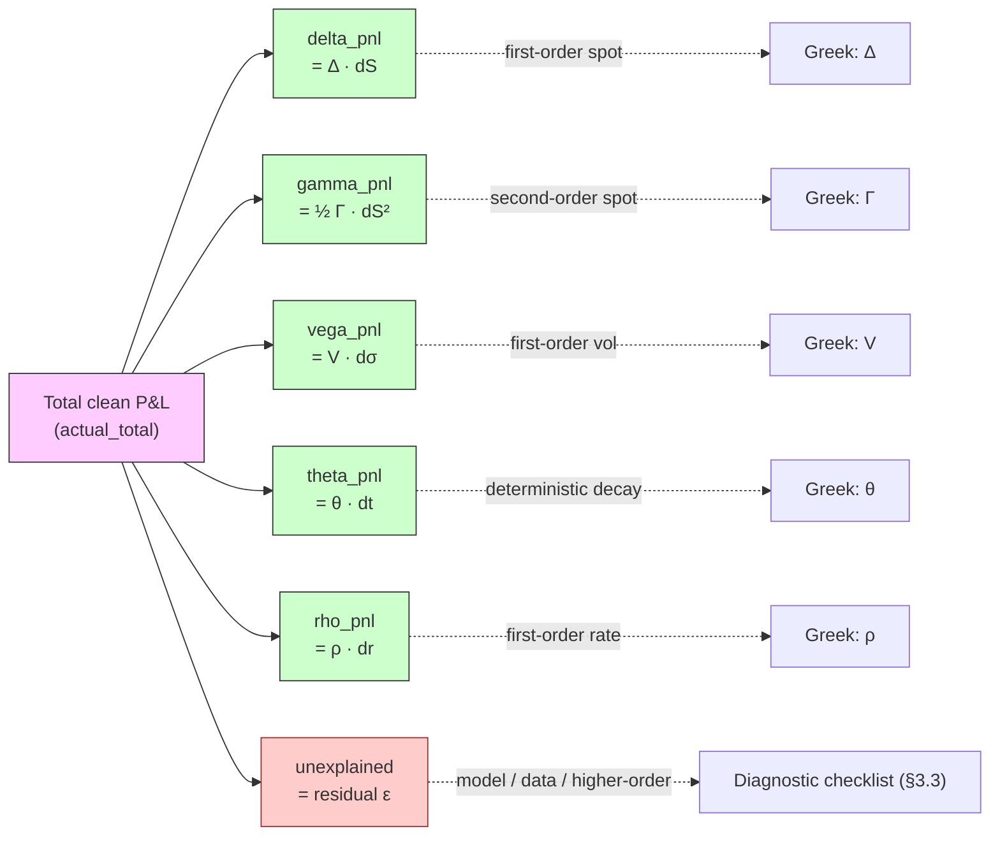

# Module 14 — P&L and P&L Attribution

!!! abstract "Module Goal"
    Every trading day ends with the same question, asked simultaneously by Finance, by Risk, by the desk head, and (eventually) by the regulator: *where did our P&L come from?* The number itself — yesterday's market value minus today's — is easy. The decomposition into per-Greek contributions, the comparison between what the books actually made and what the risk model said they should have made, and the residual that names the gap between the two — that is the daily reconciliation between *the world* and *the model of the world*. Module 14 is the storage layer, the math, and the diagnostic discipline behind that reconciliation. It is the module that connects sensitivities (M08) to the numbers Finance reports, names the four flavours of P&L the warehouse must keep separate, and introduces the FRTB PLA test — the regulator-mandated comparison that, if a desk fails it, costs the bank capital. Module 14 closes Phase 4 by turning the warehouse into something the desk and the regulator both trust.

---

## 1. Learning objectives

By the end of this module, you should be able to:

- **Distinguish** the four operative flavours of daily P&L — *clean P&L*, *dirty (accounting) P&L*, *risk-theoretical P&L (RTP)*, and *hypothetical P&L (HPL)* — and articulate, for each one, what is included, what is excluded, who consumes it, and which other flavour it is meaningfully compared against.
- **Decompose** a position's daily P&L via the second-order Taylor series in the Greeks (\(\Delta \cdot dS + \tfrac{1}{2} \Gamma \cdot dS^2 + V \cdot d\sigma + \theta \cdot dt + \rho \cdot dr + \dots\)) and compute each per-Greek contribution from a fact table of start-of-day sensitivities and a fact table of observed market moves.
- **Diagnose** unexplained P&L by walking the priority-ordered checklist — market-data first, then risk-factor coverage, then higher-order Greeks, then trade-population mismatch, then model error — rather than reaching for "model error" by default.
- **Apply** the FRTB Profit-and-Loss Attribution (PLA) test conceptually: compare HPL to RTP, run the rank-distribution KS and the Spearman correlation, place the desk in the green / amber / red traffic-light zone, and explain the capital-impact of an amber-or-red outcome.
- **Design** the storage shape of a P&L-attribution fact (`fact_pnl_attribution`) at the (book, business_date, as_of_timestamp, attribution_component) grain, fitting it onto the bitemporal layer from Module 13 so that restatements of historical attribution are queryable rather than overwritten.
- **Compose** the daily attribution into a horizontal "P&L bridge" by Greek and produce the unexplained-as-percent-of-total quality flag that the BI layer surfaces to risk managers and to PLA monitoring.

## 2. Why this matters

P&L attribution is the daily reconciliation between two parallel statements about the same trading day. The first statement is what *the books* say happened: yesterday's mark-to-market portfolio value minus today's, plus or minus everything else that ran through the position management system overnight. This is the number Finance reports, the number the desk head signs off on, the number that lands on the income statement. The second statement is what *the risk model* said *should* have happened: given the Greeks the warehouse computed at start-of-day and the market moves observed over the day, the predicted P&L is \(\Delta \cdot dS + \tfrac{1}{2} \Gamma \cdot dS^2 + V \cdot d\sigma + \theta \cdot dt + \dots\). Both statements describe the same trading day. They will disagree, sometimes by a small amount and sometimes by a large one, and the magnitude of the disagreement is — operationally — a measure of how well the risk model represents the desk's actual exposure. A persistently small disagreement says the model is good. A persistently large one says the model is wrong, the data is wrong, or both, and the desk has work to do before the next regulatory review.

Why does the data team care? Because the disagreement is only diagnosable if the warehouse stores the components of both statements at the right grain, with the right time semantics, and with the residual broken out as a first-class line item. A warehouse that stores only the total daily P&L can answer "how much did we make?" but it cannot answer "where did it come from?". A warehouse that stores the Greeks but not the market moves — or the market moves but not the Greeks at the right as-of — can compute the total but cannot reproduce the per-Greek decomposition the next morning when a risk manager wants to know *why* delta-P&L drove most of the day. The data design is the difference between an attribution number that is queryable, reproducible, and auditable, and an attribution number that is a stale spreadsheet on someone's laptop. Modules 8 (sensitivities), 9 (VaR), 11 (market data), and 13 (bitemporality) all converge here: P&L attribution is the daily *use* of every fact those modules taught you to store.

A practitioner footnote on the *cadence* of these conversations. The "where did our P&L come from?" conversation happens every morning, with the desk-head, before the trading day starts; the "did we pass PLA?" conversation happens monthly with the risk-control function and quarterly with the regulator; the "reconcile your number to the published filing" conversation happens once per audit cycle. All three conversations read from the same `fact_pnl_attribution` table; the difference is the as-of cut-off and the rolling window. A warehouse that is set up correctly serves all three from one source of truth without bespoke queries; a warehouse that is set up incorrectly produces three different numbers for the three conversations and the reconciliation between them becomes its own forensic exercise. The Module 14 design pattern is what makes the three conversations consistent with each other.

A second framing the BI engineer should internalise: P&L attribution is the *visible product* of every other module in Phase 4. The desk head looking at the morning P&L bridge sees one number — the residual — and asks one question — *is it small?*. Behind that one number lies the entire upstream chain: yesterday's positions (Module 7) marked at yesterday's market data (Module 11), the EOD bump engine that produced the start-of-day Greeks (Module 8), the overnight market-data load (Module 11 again) that produced today's prints, the pricing engine that re-ran the position library to produce HPL, and the bitemporal storage layer (Module 13) that pinned all of these inputs to a coherent as-of so the attribution is reproducible tomorrow. A residual that is "too big" is rarely a problem in the attribution batch itself — the Taylor decomposition is a one-line calculation — and almost always a problem in one of the upstream layers. The attribution layer is the *symptom indicator*; the upstream layers are where the cause lives. A team that internalises this frame stops treating the attribution batch as a thing-to-debug and starts treating it as a thing-to-monitor; the debugging happens upstream, where the cause is.

The regulatory stakes elevated sharply with the Fundamental Review of the Trading Book. Under FRTB's Internal Model Approach (IMA), a desk that wants to compute its market-risk capital with its own model — rather than the much more punitive Standardised Approach — must pass two ongoing tests: the back-test (Module 9) on VaR exceedances, and the *Profit-and-Loss Attribution test* (PLA), which compares the desk's hypothetical P&L (full revaluation under observed market moves) against its risk-theoretical P&L (the Greek-based prediction). The PLA test runs every business day, accumulates statistics over a rolling window, and assigns the desk to a traffic-light zone — green (model approved), amber (model under review), red (model disqualified, desk falls back to Standardised Approach). The capital impact of falling out of IMA is typically a 30-50% increase in the desk's capital requirement; for a large flow desk this can be hundreds of millions of dollars per year. The data team's job is to make sure the comparison the regulator runs is computed against the right numbers — the start-of-day Greeks, the day's actual market moves, the full-revaluation HPL from the pricing engine, and the residual — every business day, with full bitemporal reproducibility. The PLA test is FRTB's mechanism for forcing risk teams to keep their models aligned with reality, and the warehouse is what that mechanism reads from.

A practitioner reflex falls out of all this. Every time a number lands in a P&L report, ask three questions: *which flavour is this — clean, dirty, RTP, or HPL?*; *what was the as-of of the inputs — yesterday's start-of-day Greeks against today's market moves, or some other combination?*; and *what is the residual — and is it small enough that I would defend it to a risk manager?* The reflex is the same as the additivity reflex from Module 12 and the latest-disambiguation reflex from Module 13; it is one more discipline that turns a casual report into a defensible one.

A view of the daily P&L bridge that this module builds toward is the *attribution waterfall*: total P&L on the left, decomposed into per-Greek branches each annotated with the Greek that explains it, with the unexplained residual on the right. The diagram below shows the pattern; every desk's daily report carries a version of it, and the BI layer's job is to render it from `fact_pnl_attribution` deterministically, with the right as-of, every business day.



The waterfall is the canonical form of the daily desk-head dispatch. A version of it appears on every desk's morning report; a second version appears on the risk-manager's cross-desk summary; a third version, aggregated to the firmwide level, appears in the senior-management pack. Each version is the same data — the per-Greek decomposition with the residual — at a different aggregation grain. The aggregation rolls *components* across positions inside a desk and *desks* across the firm, but it never mixes components across grains (the firmwide delta-P&L is the sum of per-desk delta-P&Ls; it is *not* a re-derived figure from a firmwide Greek).

The waterfall reads left-to-right. The total clean P&L is the number the position would have made if held overnight and revalued at today's market; the five solid branches are the per-Greek contributions that the Taylor series attributes; the residual on the right is what the Taylor series cannot explain. Every solid branch traces back via a dotted edge to the Greek that produces it; the residual traces to the diagnostic checklist that §3.3 walks. A practitioner reading the bridge for a single book on a single day asks two questions: *do the five solid branches sum to a number close to the total?*, and *is the residual within the desk's tolerance?* If yes to both, the day is unremarkable. If no to either, the diagnostic starts.

## 3. Core concepts

A reading note. Section 3 walks the attribution story in seven sub-sections, building from the four P&L flavours (3.1) through the central Taylor-series decomposition (3.2), the priority-ordered diagnostic for unexplained P&L (3.3), the FRTB PLA test at high level (3.4), the parallel adjustment-attribution layer for reserves and XVAs (3.4a), the storage shape of `fact_pnl_attribution` (3.5), the connection to bitemporality (3.6), a worked clarifying conversation (3.6a), and a worked end-to-end narrative (3.7). Sections 3.1, 3.2, and 3.3 are the load-bearing concepts for an engineer; 3.4 is the conversation with regulators and risk modelling; 3.5 and 3.6 are the storage and time-axis design; 3.6a and 3.7 are the worked narratives that make the abstract pattern concrete.

Two of the sub-sections — §3.6a (a clarifying conversation between a risk manager and a data analyst) and §3.7 (an end-to-end narrative of one position through one trading day's attribution) — are written as deliberately slow-paced traces rather than as concept definitions. They are the sections that make the abstract storage and computation pattern concrete, and most data engineers find them the most useful to refer back to when implementing or debugging the attribution layer in their own warehouse.

!!! info "Definition: PLA test (FRTB Profit-and-Loss Attribution)"
    The *PLA test* is a daily statistical comparison between a desk's hypothetical P&L (HPL — full revaluation of yesterday's positions at today's market) and its risk-theoretical P&L (RTP — the Greek-based Taylor-series prediction). Two statistics are computed over a rolling window: the Kolmogorov-Smirnov (KS) statistic on the rank distribution of the standardised residual, and the Spearman correlation between the daily HPL and RTP series. The desk is placed into a green / amber / red traffic-light zone per regulator-prescribed thresholds; a red-zone outcome disqualifies the desk from the FRTB Internal Model Approach and triggers a fall-back to the Standardised Approach with a typical 30-50% increase in the desk's regulatory capital requirement.

### 3.1 Four flavours of P&L

A market-risk warehouse keeps four distinct P&L numbers per book per business date. They are *not* interchangeable, they are *not* substitutable, and a report that conflates two of them is a report that confuses the consumer. Name them, store them, and label every dispatched number with which flavour it is.

**Clean P&L.** The revaluation P&L excluding intra-day trading, fees, commissions, and FX revaluation. The number the *risk engine* would have predicted: yesterday's portfolio, marked at today's market, with no new trades and no operational adjustments. Clean P&L is the *position-only* number — the cleanest reflection of how the market moved against the book held overnight. It is what is meaningfully comparable to the Greek-based prediction, because the Greek-based prediction itself is a position-only quantity. Clean P&L is rarely the number Finance reports; it is the number the risk team computes for attribution.

**Dirty P&L (a.k.a. accounting P&L, or actual P&L).** The number Finance reports. Includes everything: the revaluation move (the "clean" component), plus new trades, plus commissions and fees, plus accruals of interest and dividends, plus FX revaluation of non-base-currency P&L back into the reporting currency, plus reserves and valuation adjustments (XVAs, model reserves, bid-ask reserves, prudent valuation adjustments). Dirty P&L is the number the trader sees on their P&L screen and the number the desk head signs off on; it is the number the income statement carries. Dirty P&L is *not* the number to compare against an attribution — it includes too many components the attribution does not explain.

**Risk-theoretical P&L (RTP).** The P&L *predicted* by the risk model, computed as the Taylor-series sum of per-Greek contributions: \(\Delta \cdot dS + \tfrac{1}{2} \Gamma \cdot dS^2 + V \cdot d\sigma + \theta \cdot dt + \rho \cdot dr + \dots\). RTP is computed from yesterday's start-of-day Greeks (the sensitivities the warehouse stored at EOD yesterday) against today's observed market moves (the differences in market data between yesterday's close and today's close). RTP is by construction an *approximation*; the higher-order terms ("...") that the warehouse did not bump for, the cross-Greeks that were not stored, and the non-linearities that the Taylor series cannot capture all live in the residual. RTP is the *model's claim* about the day.

**Hypothetical P&L (HPL).** The P&L from *full revaluation* under the observed market moves, holding the position constant from yesterday's close. HPL asks: "what would yesterday's portfolio have made today?" — and answers by passing yesterday's positions through today's market data using the *full pricing engine*, not the Taylor series. HPL is the *truth* about yesterday's portfolio under today's market, modulo the pricing engine's own correctness. The PLA test compares HPL and RTP — small *(HPL - RTP)* means the Taylor series is tracking the full revaluation, which means the Greeks are a faithful representation of the position; large *(HPL - RTP)* means the Taylor approximation is missing something the full revaluation captures.

A reference table summarises the four flavours and what each is meaningfully compared against:

| Flavour                 | Includes                                                          | Computed how                                                  | Compared against                                                |
| ----------------------- | ----------------------------------------------------------------- | ------------------------------------------------------------- | --------------------------------------------------------------- |
| Clean P&L               | Position-only revaluation move                                    | Yesterday's positions at today's market, full revaluation      | The HPL flavour (often equal by construction)                    |
| Dirty (accounting) P&L  | Everything: revaluation, new trades, fees, FX, accruals, reserves | Position-management and accounting systems                     | Trader's screen, the income statement                            |
| Risk-theoretical (RTP)  | Greek-based Taylor approximation of clean P&L                     | Sum of \(\Delta \cdot dS + \tfrac{1}{2}\Gamma dS^2 + V d\sigma + \dots\) | HPL (this is the PLA test)                                       |
| Hypothetical (HPL)      | Full revaluation of yesterday's positions at today's market       | Pricing engine on frozen positions                             | RTP (the FRTB-mandated comparison) and clean P&L                 |

A common confusion: clean P&L and HPL are often the *same number* by construction, when both are defined as full-revaluation of yesterday's positions at today's market with no operational components. Some warehouses use the names interchangeably; others reserve "clean P&L" for the daily revaluation reported up to Risk and "HPL" for the FRTB submission. The naming differs by shop; the *concept* — position-only revaluation — is the same. What matters is that both are distinct from dirty P&L (which carries operational components) and from RTP (which is the Taylor-series approximation, not a full revaluation). The PLA test compares HPL to RTP. Comparing HPL to dirty P&L is an apples-to-oranges error and is the most common pitfall the next section warns against.

A note on terminology. This module uses *clean* / *dirty* / *RTP* / *HPL* as the canonical four flavours. Different shops use slightly different vocabulary — *flat P&L* for clean, *book P&L* for dirty, *predicted P&L* for RTP, *hypothetical P&L* (verbatim) for HPL. Map the local vocabulary to the four canonical flavours in the runbook; never let the local vocabulary leak into the schema column names, which should be canonical.

A second confusion worth pre-empting: the "actual P&L" terminology that appears in some FRTB documents and many internal runbooks. *Actual P&L (APL)* in FRTB usage is roughly synonymous with dirty P&L — the operational P&L the desk and Finance attest to, including new trades and reserves — and is *not* what HPL is compared against. The FRTB framework uses APL alongside HPL and RTP in the back-testing context (the daily VaR exceedance count is computed against APL minus the operational components, which is essentially the clean / hypothetical flavour) but for PLA the comparison is HPL versus RTP. A team reading FRTB documentation alongside an internal runbook will see all four flavours referenced; the naming map is: APL ≈ dirty, HPL ≈ clean, RTP = the Taylor approximation, and the PLA test is HPL minus RTP. Document the mapping in the runbook and stop the daily confusion.

A reading hint for §3.1 onward. The four flavours, the Taylor decomposition, the diagnostic checklist, the FRTB PLA test, the storage shape, and the bitemporal layer are six themes that this section weaves together. Read them in order on the first pass; on subsequent reads, pick the theme relevant to the question at hand — schema design from §3.5, audit reproducibility from §3.6, residual diagnosis from §3.3 — without re-reading the whole section. The themes are written to be independently usable as references.

A practitioner observation on the *granularity* of the four flavours. Dirty P&L is reported at the trader-screen grain (intraday, instrument-level, fully decomposed with operational components broken out as separate lines); clean P&L and HPL are reported at the position grain (end-of-day, the position frozen at yesterday's close); RTP is reported at the Greek grain (decomposed by per-Greek contribution). The four flavours therefore *live in different fact tables*: dirty in `fact_position_pnl_daily` (with columns for each operational component), clean and HPL in `fact_position_pnl_clean` (one number per position per business_date), and RTP in `fact_pnl_attribution` (one row per per-Greek component, the table this module is about). The reconciliation between the four — dirty equals clean plus operational adjustments; clean equals RTP plus residual — is the daily reconciliation chain that the BI layer materialises and that the desk-head dashboard surfaces.

A practitioner observation on the **flavour-tag column**. Every P&L number stored in the warehouse should carry an explicit `pnl_flavour` enum column with values in `{'clean','dirty','rtp','hpl','apl'}`. The column is small (one byte per row) and prevents the most common dispatch mistake — sending a clean number to a Finance consumer who expects dirty, or comparing a stored RTP against a stored HPL when one of them is actually clean. The flavour-tag is not optional; without it, the warehouse cannot tell its consumers what flavour they are reading, and the consumers fill in the gap with assumptions that diverge silently across teams. Add the column to every P&L fact at design time; do not retrofit it.

!!! info "Definition: Clean vs. dirty P&L"
    *Clean P&L* is the position-only revaluation move: yesterday's portfolio re-marked at today's market, with no new trades, no fees, no FX revaluation, no reserves. *Dirty P&L* is clean P&L plus all operational components — new trades, fees, accruals, FX, reserves — and is the number Finance reports. Risk attribution operates on clean P&L; Finance attestation operates on dirty P&L.

### 3.2 The Taylor-series decomposition

The central equation of P&L attribution is the second-order Taylor expansion of the position value around yesterday's market state. Let \(P(S, \sigma, r, t)\) denote the position value as a function of underlying \(S\), implied volatility \(\sigma\), interest rate \(r\), and time \(t\). The change in value from yesterday to today is:

$$\Delta P \approx \sum_i \Delta_i \, dS_i + \frac{1}{2} \sum_{i,j} \Gamma_{ij} \, dS_i \, dS_j + \sum_k V_k \, d\sigma_k + \rho \, dr + \theta \, dt + \epsilon$$

Each term has an intuitive name. \(\Delta_i \cdot dS_i\) is the *delta-P&L* for risk factor \(i\) — first-order spot exposure. \(\tfrac{1}{2} \Gamma_{ij} \cdot dS_i \cdot dS_j\) is the *gamma-P&L* — second-order spot exposure, with the off-diagonal terms \(\Gamma_{ij}, i \neq j\) being the *cross-gamma* contributions. \(V_k \cdot d\sigma_k\) is the *vega-P&L* — first-order vol exposure across the vol surface. \(\rho \cdot dr\) is the *rho-P&L* — interest-rate sensitivity. \(\theta \cdot dt\) is the *theta-P&L* — the deterministic time-decay term, with \(dt\) typically equal to one calendar day (or the fraction of a year, depending on the theta-unit convention). The residual \(\epsilon\) is the *unexplained P&L* — everything the Taylor series cannot capture: higher-order terms (vanna, volga, third-order gamma), missing risk factors, and the model error itself.

A few practitioner conventions matter here. First, the Greeks are taken at *start of day* — yesterday's EOD sensitivities — not today's. Today's Greeks are computed from today's positions and today's market, which is a different (and forward-looking) attribution; the daily backward-looking attribution uses the Greeks the warehouse had when the day began. This is a non-trivial point: a warehouse that uses today's Greeks against today's moves systematically misattributes by approximately the change-in-Greeks-times-the-move. Pitfall §5 reiterates this. Second, the cross-gamma terms (the off-diagonal \(\Gamma_{ij}\)) are easy to double-count if the warehouse stores both the diagonal "gamma" sensitivity and a separate "cross-gamma" matrix and the attribution layer does not handle the bookkeeping carefully. The recommended convention is to store only the upper triangle (or only the lower triangle) of the \(\Gamma\) matrix and to apply the factor \(\tfrac{1}{2}\) consistently. Third, the theta term is deterministic — given \(\theta\) and \(dt\), the contribution is computed without reference to any market move — and is therefore the easiest to audit and the easiest to misattribute when omitted. A desk that forgets the theta term reports it as unexplained P&L, which is a false signal that the model is wrong; a desk that includes the theta term but uses the wrong day-count (calendar days vs. business days vs. year-fractions) reports the wrong magnitude.

A reference table of the standard Greeks, the market move each pairs with, the typical sign convention, and the unit:

| Greek      | Market move        | Per-Greek P&L term                  | Typical sign for a long vanilla call | Unit notes                           |
| ---------- | ------------------ | ----------------------------------- | ------------------------------------ | ------------------------------------ |
| \(\Delta\) | \(dS\) (spot)      | \(\Delta \cdot dS\)                 | positive (long delta)                | dimensionless × spot units           |
| \(\Gamma\) | \(dS^2\) (spot)    | \(\tfrac{1}{2} \Gamma \cdot dS^2\)  | positive (long gamma)                | per spot^2; the \(\tfrac{1}{2}\) is critical |
| \(V\)      | \(d\sigma\) (vol)  | \(V \cdot d\sigma\)                 | positive (long vega)                 | per vol-point; check vol-point convention |
| \(\theta\) | \(dt\) (time)      | \(\theta \cdot dt\)                 | negative (decay)                     | per calendar day or per year         |
| \(\rho\)   | \(dr\) (rate)      | \(\rho \cdot dr\)                   | depends on the rate exposure         | per percentage-point or per basis-point |

The "..." in the equation matters. Real positions have higher-order sensitivities — *vanna* (\(\partial^2 P / \partial S \partial \sigma\)), *volga* (\(\partial^2 P / \partial \sigma^2\)), *charm* (\(\partial^2 P / \partial S \partial t\)) — that the warehouse may or may not store. A desk whose attribution uses only \(\Delta, \Gamma, V, \theta, \rho\) is implicitly assuming the higher-order terms are negligible relative to the residual budget. For a vanilla equity book this is often fine; for an exotic book, vol-of-vol book, or barrier book it is not, and the higher-order Greeks must be stored, bumped, and attributed. The attribution layer is the consumer that surfaces the gap; if the residual is large and the desk holds vol-sensitive positions, the missing Greeks are the first place to look.

A worked numerical illustration of the decomposition for a single position. Take a vanilla call with start-of-day Greeks \(\Delta = 0.5, \Gamma = 0.02, V = 0.15, \theta = -0.04\) and observed market moves \(dS = +2, d\sigma = -0.5, dt = 1\). The per-term contributions are \(\Delta \cdot dS = 0.5 \times 2 = 1.00\); \(\tfrac{1}{2} \Gamma \cdot dS^2 = 0.5 \times 0.02 \times 4 = 0.04\); \(V \cdot d\sigma = 0.15 \times (-0.5) = -0.075\); \(\theta \cdot dt = -0.04 \times 1 = -0.04\). The predicted total is \(1.00 + 0.04 - 0.075 - 0.04 = 0.925\). Suppose the full revaluation HPL for the same position is 1.05; the residual is \(1.05 - 0.925 = 0.125\), or about 12% of the actual. This is the worked example carried through Example 1 in §4 below; the seven numbers are the seven rows that will land in `fact_pnl_attribution` for this (book, business_date) pair, and the 12% is the quality flag the BI layer surfaces.

A subtle convention on the **dt term** that catches teams out repeatedly. The theta Greek is reported in one of three day-count conventions, and the warehouse must pick one and stick to it: per *calendar day*, per *business day*, or per *year-fraction* (with a day-count basis like 365 or 252 or ACT/365 attached). Per calendar day is the most common front-office convention; per year-fraction is the most common quant-research convention; the difference between them is a factor of 365 (or 252). A desk that stores theta per year-fraction and attributes against \(dt = 1\) day overstates the daily theta contribution by ~365×. The fix is to document the convention explicitly in the `fact_sensitivity` schema (`theta_unit` enum: `per_calendar_day`, `per_business_day`, `per_year_fraction`) and to have the attribution batch read the convention before applying \(dt\). An unverified theta unit is a near-guaranteed source of unexplained P&L on every long-options book.

A practitioner observation on **the sign convention of unexplained**. There are two equally-valid sign conventions: `unexplained = actual_total - predicted_total` (positive when the model underpredicted the actual move) or `unexplained = predicted_total - actual_total` (positive when the model overpredicted). The first is more common in front-office dashboards; the second is more common in some risk-modelling literatures. Pick one, document it in the schema, and stick to it across every desk and every dashboard. A team that has the two conventions in different parts of the warehouse produces unexplained P&L numbers that flip sign as the consumer changes, and the resulting confusion eats hours per week of debugging that should not exist. The recommended convention for this curriculum is `unexplained = actual_total - predicted_total`, mirroring the residual definition in standard regression analysis.

A second subtle convention on the **vega units**. Vega is per "vol-point" or per "vol-percent" or per absolute-vol — each is a different scaling factor. Per vol-point typically means "per 1 percentage point of implied volatility" (so a vol move from 20% to 21% is \(d\sigma = +1\) vol-point); per absolute-vol means per 0.01 of vol (so the same move is \(d\sigma = +0.01\)). A 100× scaling error in vega is the second-most-common cause of unexplained P&L on a vol-sensitive book; the fix is the same as for theta — document the convention in the schema and have the attribution batch read it.

### 3.3 Sources of unexplained P&L

When the daily attribution shows a large residual — large meaning, in practice, more than ~5-10% of the absolute clean P&L on the day, persistently — the question becomes "which of the candidate causes is responsible?". The diagnostic is *priority-ordered*. Walk the list top to bottom; do not skip steps; do not jump to "model error" before the cheaper checks have been ruled out. The order encodes a decade of practitioner experience: the cheaper-to-fix causes are also the more frequent ones, and the most expensive cause (a genuine model misspecification) is also the rarest.

**1. Market-data error.** A bad fixing, a stale curve point, a vendor restatement, a default value substituted for a missing print, or a unit-mismatch in a curve transform. Market-data errors are the *most common* cause of unexplained P&L and the *easiest* to detect — the curve point with the missing print is visible in the market-data fact table; the vendor restatement that arrived overnight is visible in the bitemporal layer's restatement queue. Always check market data first. A persistent residual that resolves the day after a curve correction is, by elimination, a market-data residual.

**2. Missing risk factors.** The warehouse stored sensitivities to N risk factors; the position is sensitive to N+1. The (N+1)th factor moved on the day; the attribution carries the move into unexplained because there was no Greek to multiply it against. Common cases: a basis curve the position hedges against but the warehouse did not bump; a volatility-of-volatility risk that the desk's exotic book has but the standard Greek-set does not include; a dividend-yield sensitivity for an equity option that was approximated as a constant. The fix is structural — extend the Greek-set, rerun yesterday's bumps, store the new sensitivity — and is not cheap, but the diagnosis is straightforward: identify the risk factor that moved, check whether a Greek for it exists in `fact_sensitivity`, and if not, the gap is the missing-risk-factor case.

**3. Higher-order terms.** Cross-gamma, vanna, volga, charm, third-order gamma. These are present in any non-trivial book and absent from the standard \(\Delta, \Gamma, V, \theta, \rho\) attribution. If the day's market moves were large (so \(dS^3\) and \(dS \cdot d\sigma\) are not negligible) and the residual is positively correlated with one of those products, the higher-order terms are the cause. The fix is again structural — bump and store the higher-order Greeks — but the attribution layer should at least report which product is the *most explanatory* of the residual, so the modelling team has a starting point.

**4. Trade-population mismatch.** The position used for risk (yesterday's start-of-day position file) differs from the position used for revaluation (today's actual book). A late-arriving trade booked overnight, a cancellation that arrived after the risk batch but before the P&L batch, a corporate action, or simply a feed lag between the two systems. The diagnosis is to reconcile the two position files at trade level. The fix is operational — get the feeds back in sync, or attribute the late-arriving trade's day-one P&L separately — and the symptom in the attribution is a residual that correlates with the *count* of mismatched trades on the day rather than with any market-data quantity.

**5. Model error.** The pricing engine cannot capture the trade's economics. A barrier option in a Black-Scholes engine that does not handle the barrier; an exotic with path-dependence priced as European; a trade with embedded credit risk in a model that ignores credit. Model error is *real* and *consequential*, but it is the *rarest* of the five causes for a desk that has been operating its model for years. Do not jump to "the model is wrong" before steps 1-4 have been ruled out. A team that defaults to "model error" is a team that does not check market data first.

A diagnostic flowchart that the BI layer can implement as a sequence of automated checks — each check produces a Boolean signal, and a residual that passes all five without resolution is escalated to risk modelling — is the right pattern for any desk where unexplained P&L is monitored at the daily frequency. Module 15 (data quality) treats the upstream checks; Module 14's contribution is the residual signal itself and the priority-ordering of the downstream investigation.

A subtle case worth calling out separately: **theta misattribution**. Theta is the *deterministic* component of the day's P&L — given \(\theta\) and \(dt\), the contribution is fixed before the market opens. It is also frequently the *largest single component* on a quiet day for a long-options book. A desk that omits the theta term from its attribution sees the theta-P&L emerge as unexplained, concludes the model is mis-tracking, and starts an investigation of a residual that is — by inspection — exactly the deterministic decay. The cure is to store \(\theta\) in `fact_sensitivity` and to attribute it explicitly. The pattern is sufficiently common that it is the first item on any practitioner's "before you escalate, did you include theta?" checklist.

A reference table summarising the diagnostic priority order, the cheapest-to-detect signal at each step, and the typical fix horizon:

| Priority | Cause                          | Cheapest signal                                                | Fix horizon          | Typical owner          |
| -------- | ------------------------------ | -------------------------------------------------------------- | -------------------- | ---------------------- |
| 1        | Market-data error              | `fact_market_data` bitemporal restatement queue                | Hours to days        | Market-data team       |
| 2        | Missing risk factors           | (risk_factor moved, no Greek for it in `fact_sensitivity`)     | Days to weeks        | Risk + data            |
| 3        | Higher-order Greeks            | Residual correlates with `dS²·dσ`, `dσ²`, or `dS³`             | Weeks                | Risk modelling         |
| 4        | Trade-population mismatch      | Trade-level diff: risk-batch population vs. P&L-batch          | Days                 | Operations + data      |
| 5        | Model error                    | Steps 1-4 exhausted; residual structure points to model        | Months               | Risk modelling         |

Reading the table top-to-bottom is the operational discipline. Steps 1 and 4 are *data problems* with fast fixes; steps 2 and 3 are *coverage problems* requiring schema and bump-engine work; step 5 is a *modelling problem* with the longest fix horizon. A team that skips to step 5 by default is a team that does not control its data; a team that exhausts steps 1-4 first is a team that escalates only the genuine model issues, which is the only sustainable PLA-monitoring posture.

A practitioner observation on **the cadence of the diagnostic**. The five-step checklist is run *daily* on amber-zone residuals and *immediately* on red-zone residuals. The output of each daily run is logged — "step 1 ruled out at 09:30; step 2 ruled out at 11:00; step 3 inconclusive, escalated to risk modelling at 14:00" — and the log is reviewed weekly by the desk's risk-control function. The log is itself a data product: a `fact_pnl_diagnostic` table at (book, business_date, diagnostic_step, outcome) grain that captures the run-by-run findings, lives bitemporally alongside `fact_pnl_attribution`, and feeds the quarterly PLA-readiness review. Modules 15 and 16 will return to this pattern; the relevant point here is that the diagnostic itself is data, not narrative.

A useful **negative example** of the diagnostic. A desk reports a residual that suddenly jumps from ~3% (consistent green) to ~25% (deep red) on a single business_date. The team's instinct is to escalate to risk modelling immediately. The §3.3 checklist applied in priority order:

- *Step 1.* Was a market-data point restated in the previous 24 hours? Yes — a curve point on a peripheral tenor was corrected at 09:00 the morning of the affected business_date. Not the cause of the residual itself (the restatement happened before the attribution batch ran), but a flag worth noting.
- *Step 2.* Did any new risk factor become relevant? No — the desk's instrument list is unchanged from the prior week.
- *Step 3.* Was the day's market move large in any single risk factor? Yes — the affected business_date had a 3-sigma move in implied vol, which makes the higher-order vega-vega (volga) term significant. The desk's attribution does not include a volga component. The residual on this day is approximately the volga contribution.
- *Conclusion.* The residual is the missing volga term, surfacing because of the unusual vol move. The fix is to add volga to the desk's Greek-set; the immediate dispatch note explains the residual to the desk-head and the risk-control function with the candidate higher-order term identified, *without* escalating to model error. The diagnostic took 30 minutes; escalating without the diagnostic would have committed weeks of risk-modelling time to a problem that was, on inspection, a known gap in the standard Greek-set rather than a model failure.

A second negative example: a residual that has been ~15% for the past week and is suddenly 0% on the most recent business_date. The instinct might be that the model has been "fixed". The diagnostic: *Step 4.* Did the trade-population change? Yes — the upstream feed dropped 30 trades from the desk's position file, and the missing trades happened to be the ones whose Greeks were not faithfully captured. The 0% residual is not a fix; it is a *masking* of the same underlying issue by a data-completeness regression. The right dispatch is the opposite of celebration: investigate the missing trades, restore them, and the residual returns to its prior 15% — which was the honest signal all along. The pattern teaches that *better* attribution numbers are not always good news; they can be the symptom of a worse upstream problem.

### 3.4 The FRTB PLA test at high level

The Fundamental Review of the Trading Book introduced, alongside the back-test, a second daily test for desks that want to use the Internal Model Approach. The Profit-and-Loss Attribution test compares each business day's HPL (full-revaluation P&L on yesterday's portfolio at today's market) against the same day's RTP (the Greek-based Taylor-series prediction). The motivation is that a model that fails to predict its own desk's P&L from its own Greeks is, by inspection, a model that is not capturing the desk's exposure — and such a model should not be used to compute regulatory capital. The PLA test is FRTB's mechanism for forcing risk teams to keep their Greek-based representations aligned with the full-revaluation reality.

The test runs daily and accumulates two statistics over a rolling window (typically the most recent 250 business days, mirroring the back-test window):

- **Kolmogorov-Smirnov (KS) statistic** on the rank distribution of the daily *(HPL - RTP)*, normalised by the day's HPL volatility. The KS statistic measures how far the empirical distribution of the residuals departs from a target distribution (typically the standard normal); a large KS means the residuals are systematically biased or fat-tailed, which is taken as evidence that the Taylor approximation is mis-representing the desk's exposure.
- **Spearman rank correlation** between the daily HPL and the daily RTP. A high Spearman correlation means the two series move together — the model is at least getting the *direction* of the daily P&L right, even if the magnitude is off. A low Spearman is a sharp signal that the model is mis-tracking.

The two statistics together place each desk into a *traffic-light zone* per the FRTB threshold tables:

- **Green.** KS below the green threshold, Spearman above the green threshold. The model is approved; the desk continues on IMA.
- **Amber.** Either statistic in the amber zone. The model is under review; the desk pays a capital surcharge but stays on IMA.
- **Red.** Either statistic in the red zone. The model is disqualified for this desk; the desk falls back to the Standardised Approach (SA) until it can re-enter green, which typically requires a sustained period of green-zone performance.

The capital impact of falling out of IMA is non-trivial. The Standardised Approach computes capital using regulator-prescribed risk-weights and aggregation rules that are deliberately conservative; for a typical large-bank desk, the SA capital is approximately 30-50% higher than the IMA capital for the same portfolio. Aggregated across a bank's trading book, a single failed-PLA desk that cannot re-enter green can cost hundreds of millions of dollars per year in additional capital. The PLA test is, therefore, a regulator-mandated quality gate that the data team must support with full reproducibility: every day's HPL and RTP must be stored bitemporally, the rolling-window statistics must be computable from history, and any restatement of either series must propagate into the rolling window the regulator sees.

A worked numerical illustration of the test mechanics. Suppose a desk's daily standardised residual `(HPL - RTP) / sigma_HPL` over a 250-day window has an empirical distribution that, when ranked and compared against the standard normal, produces a KS statistic of 0.12. The FRTB threshold table places KS = 0.12 in the amber zone (typical thresholds: green if KS < 0.09, amber 0.09 - 0.12, red > 0.12 — the exact numbers vary by regulator implementation). Suppose the same window's Spearman correlation between HPL and RTP is 0.85; this is on the edge of green / amber on most threshold tables. The desk's overall zone is the *worse* of the two — amber. The amber outcome triggers a capital surcharge (a multiplier on the desk's IMA capital), an internal review by the risk-control function, and a documented remediation plan. A second amber period of similar length pushes the desk into red and the IMA-to-SA fall-back. The data team's role through this is to ensure the daily residuals feeding the test are correct, the rolling window is computed against the right as-of, and the resulting KS / Spearman numbers match between the bank's internal calculation and the regulator's audit replay.

A useful framing: the FRTB PLA test is the *external* version of the same internal P&L-attribution conversation the desk has every day with risk modelling. Internally, a residual that is consistently 20% of clean P&L is a problem the desk addresses by improving its Greek-set or fixing a market-data feed. Externally, the same residual translates into KS and Spearman statistics that, accumulated over a rolling window, push the desk towards amber or red. The internal conversation and the external test are reading from the same `fact_pnl_attribution` table. Module 14's storage design has to serve both consumers from the same data.

A note on the **desk-level granularity** of the PLA test. FRTB defines the test at the *trading desk* level — a regulator-approved organisational unit, typically corresponding to one risk-taking team within one asset class — rather than at the firmwide or sub-portfolio level. Each desk has its own KS, its own Spearman, its own traffic-light zone, and its own capital consequence. A bank with twenty desks under IMA runs twenty parallel PLA tests every day, with twenty separate rolling windows and twenty separate desk-level dashboards. The data implication is that `fact_pnl_attribution` is partitioned (logically and often physically) by `desk_sk`; the rolling-window queries are per-desk; the FRTB submission is a per-desk artefact. The desk dimension is a first-class organisational unit in the warehouse and the attribution layer must respect it.

A practical observation on the **threshold tables**. The exact FRTB thresholds for KS and Spearman in the green / amber / red zones are published in BCBS d457 and have been refined by national-regulator interpretations (the EU CRR III, the UK PRA's PS17/23, the US Federal Reserve's NPR). The thresholds are tighter than they look on paper: a desk operating with a "good" model in normal markets will sit comfortably in green, but a desk with a marginally-good model can spend extended periods bouncing between green and amber, and a sustained amber accumulates a capital surcharge that compounds over the year. The data team's role is not to evaluate the thresholds (that is risk modelling's role) but to ensure the inputs the test runs against are correct: the right HPL, the right RTP, the right as-of cut-off, the right desk-level partition.

A second framing point on **the rolling window's bitemporal subtlety**. The FRTB rolling window of ~250 business days is computed every day; the window slides forward by one day each business day. A restatement of a market-data point inside the window — say, a curve correction on day T-100 that lands today — would naively re-shape the rolling window's statistics for every subsequent day. The regulator's expectation is the opposite: the test was run on day T-100 against the as-reported view of that day; restating the inputs after the fact does not retroactively change the day-T-100 KS or Spearman value. The bitemporal pattern is what makes the regulator's expectation enforceable. A worked example: a 2026-04-15 market-data restatement on a 6-month tenor lands in the warehouse on 2026-04-15 14:00 UTC. The KS and Spearman computed for the rolling window ending 2026-04-14 should be unaffected — the regulator's view of every day in that window was published before the restatement landed — and the warehouse must compute the rolling-window query against `as_of_timestamp <= 2026-04-15 14:00:00`. The KS and Spearman computed for the window ending 2026-04-15, by contrast, do reflect the restated data because 2026-04-15 itself is computed against the post-restatement view (the as-of-latest of 2026-04-15). The two windows differ in their as-of cut-off; the warehouse query must reflect the difference. A team that runs the same query for both windows produces inconsistent statistics; a team that parameterises the query by the rolling-window's terminal as-of produces statistics that match the regulator's audit replay. The rolling-window query reads `fact_pnl_attribution` with the as-of cut-off matching each historical day's original publication, *not* the as-of-latest. A team that runs the rolling-window query against `is_current = TRUE` produces a number that does not match what was published, and the regulator (rightly) rejects it. Module 13's bitemporal pattern is, again, the foundation that makes Module 14's regulatory artefact defensible.

### 3.4a Reserves, valuation adjustments, and the XVA family

A class of P&L components that lives outside the per-Greek decomposition but is present in dirty P&L and in many internal attribution conversations: *reserves* and *valuation adjustments*. The reserves family includes bid-ask reserve (an adjustment to mark mid-prices conservatively to the bid for long positions and the ask for short), model reserve (an adjustment for known model uncertainty), and prudent valuation adjustment (PVA, the regulator-prescribed adjustment under EU CRR/CRD). The XVA family includes credit valuation adjustment (CVA, the cost of counterparty default), debit valuation adjustment (DVA, the offsetting bank's-own-default term), funding valuation adjustment (FVA, the cost of funding the trade), capital valuation adjustment (KVA, the cost of capital held against the trade), and margin valuation adjustment (MVA, the cost of initial margin posted).

These adjustments are *not* attributable to a Greek in the standard Taylor sense. They are themselves the output of separate models — a CVA model that takes counterparty exposure and credit-spread inputs; an FVA model that takes net-funding-position and a funding curve; a model-reserve calculation that takes a model-uncertainty parameter — and their daily P&L moves are attributable to *those* models' inputs. A complete attribution layer therefore has *two* tiers: the core per-Greek attribution that this module focuses on (the contents of `fact_pnl_attribution`), and an *adjustment attribution* layer that decomposes each reserve / XVA into its own model-input contributions. The pattern at storage is parallel: a `fact_xva_attribution` table at (book_sk, business_date, as_of_timestamp, xva_kind, xva_input_component, pnl_value) grain, where `xva_kind` is in `{'CVA','DVA','FVA','KVA','MVA','bid_ask','model_reserve','PVA'}` and `xva_input_component` decomposes each into its own per-input contributions.

For the FRTB PLA test, the relevant flavour is *clean P&L excluding the XVA and reserve P&L*. The PLA test compares the position-only revaluation (HPL) against the Greek-based prediction (RTP); the XVA P&L lives in a separate test (the XVA model's own back-test, where it is regulated under). Mixing the two — running the PLA test against a clean P&L that includes an unstable CVA daily move — is a common confusion that produces residuals which look like model error in the position model but are actually noise in the CVA model. The cure is the schema discipline: clean P&L is *position-only*; the XVA components live in a separate fact and a separate test. The dirty P&L the desk sees on the screen is clean P&L plus the XVA P&L plus the reserves plus the operational components, and is the number Finance reports — but it is not the number the FRTB PLA test reads.

### 3.5 The storage shape of `fact_pnl_attribution`

The attribution fact lives at the grain *(book, business_date, as_of_timestamp, attribution_component)*. Each row is one component of the day's predicted P&L for one book on one business date as of one warehouse-belief timestamp. The component column is a controlled vocabulary: `delta_pnl`, `gamma_pnl`, `vega_pnl`, `theta_pnl`, `rho_pnl`, plus higher-order rows where stored (`vanna_pnl`, `volga_pnl`, `cross_gamma_pnl`, `dividend_pnl`), plus the totals (`predicted_total`, `actual_total`, `unexplained`). Storing components as *rows* (the "tall" or EAV-style layout) rather than as columns has three advantages: new components can be added without a schema change; queries that aggregate components across desks or books are uniform; and the bitemporal restatement story is identical for every component.

A representative DDL (Snowflake-flavoured):

```sql
CREATE TABLE fact_pnl_attribution (
    book_sk                BIGINT       NOT NULL,
    business_date          DATE         NOT NULL,
    as_of_timestamp        TIMESTAMP_NTZ NOT NULL,
    attribution_component  VARCHAR(32)  NOT NULL,
    pnl_value              NUMBER(18,4) NOT NULL,
    currency_ccy           CHAR(3)      NOT NULL,
    is_current             BOOLEAN      NOT NULL DEFAULT TRUE,
    load_batch_id          BIGINT       NOT NULL,
    CONSTRAINT pk_fact_pnl_attribution
        PRIMARY KEY (book_sk, business_date, as_of_timestamp, attribution_component)
);
```

The horizontal "P&L bridge" view that risk managers want — total / delta / gamma / vega / theta / rho / unexplained, one row per book per business_date — is a query against this table, not a separate fact. Storing it as a query (a view, or a materialised view) keeps the source of truth in the tall fact and lets the BI layer pivot as needed. Example 2 in §4 walks both the conditional-aggregation form (Postgres-compatible) and the PIVOT form (Snowflake-native).

A few schema discipline points. First, the (`book_sk`, `business_date`, `as_of_timestamp`, `attribution_component`) primary key enforces that exactly one value per component per as-of belief lives in the table; restatements are *new rows with later as_of_timestamp*, not updates. Second, the `currency_ccy` column is mandatory — attribution numbers in different currencies must not be summed without conversion, which is the same Module 12 pre-aggregation discipline applied to attribution. Third, the `is_current` flag follows the Module 13 convention: TRUE on the row with the maximum `as_of_timestamp` per (book, business_date, attribution_component), FALSE on prior versions, maintained transactionally by the loader.

A debate that recurs in attribution-fact design is **rows-as-components versus columns-as-components**. The columnar (wide) layout would be `fact_pnl_attribution_wide(book_sk, business_date, as_of_timestamp, delta_pnl, gamma_pnl, vega_pnl, theta_pnl, rho_pnl, unexplained, predicted_total, actual_total, currency_ccy, is_current)` — one row per (book, business_date, as_of), one column per component. The wide layout reads more naturally for human eyes and is faster for the dashboard's pivot use-case (no aggregation needed). The tall layout this module recommends is more flexible — adding a new component is a new row, not a schema change — and is uniform in storage and query (every component is treated identically). The tall-layout decision is also future-proof against the cross-Greek and higher-order Greek extensions that exotic desks demand; the wide layout would require a schema migration every time a desk adds a vanna or volga component, which is operationally painful.

The recommended pattern in practice is **store tall, query wide**: the source-of-truth fact is tall, the BI layer materialises a wide view via the conditional-aggregation or PIVOT query in Example 2 below, and dashboards read the wide view. This pattern preserves the schema flexibility of tall storage and the query convenience of wide consumption. The materialised wide view is refreshed on the same cadence as the tall fact (typically end-of-day after the attribution batch completes) and follows the same bitemporal restatement story (a refresh after a market-data restatement re-derives the wide view's affected rows).

A practical observation on the **`attribution_component` controlled vocabulary**. The values must be stable, lower-case, snake-case strings — `delta_pnl`, `gamma_pnl`, etc. — and must be validated by the loader against an enumerated `dim_attribution_component` dimension table. A free-text `attribution_component` column inevitably accumulates typos (`delta_pnl` and `delta_PnL` and `delta-pnl` all in the same fact), and the pivot query starts producing NULLs for components that "should" be there. The dim has columns `(component_sk, component_name, component_kind, display_order, is_predicted_subtotal)` — `component_kind` distinguishes per-Greek (`delta_pnl`, `gamma_pnl`, ...) from totals (`predicted_total`, `actual_total`) from residuals (`unexplained`); `display_order` controls the column order in the wide view; `is_predicted_subtotal` flags the rows that contribute to the predicted_total sum (so the loader can verify the sum invariant automatically). The dim is reference data and changes only when a new component is added (e.g., `vanna_pnl` for an exotic desk).

A note on **the `methodology_version_sk` column**. The attribution batch implements a specific methodology — which Greeks are attributed, which day-count convention is used for theta, whether cross-gamma is included, whether the upper- or lower-triangle convention is used for the gamma matrix. The methodology evolves over time: an exotic desk adds vanna, the firm switches from per-year-fraction to per-calendar-day theta, the cross-gamma convention changes. Each methodology change is itself a bitemporal event and must be traceable. The recommended pattern is a `methodology_version_sk` foreign-key column on `fact_pnl_attribution` referencing a `dim_attribution_methodology` dimension that records which Greeks, conventions, and inputs are part of each version, with `valid_from` / `valid_to` defining the methodology's lifetime. The PLA rolling-window query is methodology-aware: a mid-window methodology change is a known source of statistical drift that the regulator will ask about, and the warehouse should be able to answer "the Spearman dropped on day T because the methodology changed from version A to version B on day T-3" by query rather than by narrative.

A note on **the `predicted_total` row's redundancy**. The predicted_total is, by construction, the sum of the per-Greek components. Storing it as a row in `fact_pnl_attribution` is *redundant* — the BI layer could compute it on the fly from the per-Greek rows. The reason to store it anyway is auditability: the loader writes the predicted_total at attribution time, with the as-of of the inputs at that moment, and a downstream re-aggregation can be cross-checked against the stored value. If the cross-check fails, either the loader has a bug or the per-Greek components have been restated without the total being updated — both are bugs the warehouse should surface. The `actual_total` is similarly stored as a row (the HPL from the pricing engine, not derivable from the per-Greek components) and is the second number the PLA test reads. Together, `predicted_total` and `actual_total` are the two rows that anchor the attribution; the per-Greek rows decompose `predicted_total`; the residual `unexplained = actual_total - predicted_total` is the third anchor.

A connecting note. The §3.5 schema treats attribution as data; the §3.6 next sub-section treats attribution as a *bitemporal* fact, which is the same data viewed through Module 13's discipline. The schema choices in §3.5 — the tall layout, the as_of_timestamp column, the is_current flag, the methodology_version_sk — are all informed by the bitemporal requirements that §3.6 articulates. A team that designs the schema in isolation from the bitemporal layer ends up with a fact that records attribution but cannot reproduce historical attribution under restatement; a team that designs both together ends up with a fact that serves the daily dashboard, the monthly review, and the quarterly audit from one source of truth.

### 3.6 Why bitemporality matters here

The attribution number for any given (book, business_date) pair is a *function of inputs* — the start-of-day Greeks, the day's market moves, the full-revaluation HPL — every one of which can be restated under the bitemporal pattern from Module 13. When a market-data point is restated, every attribution number that depended on it must be re-derivable; the *original* attribution (the one published at end of day) and the *post-restatement* attribution (the one the warehouse currently believes) must both live in the table, distinguishable by their `as_of_timestamp`. A regulator who asks "what did the PLA test say on 2026-04-30, before the curve restatement of 2026-05-15?" is asking a bitemporal question, and the warehouse must be able to answer it by query rather than by tape recovery.

The dispatch discipline matters too. When the attribution number is published — to the risk dashboard, to the desk-head sign-off email, to the FRTB PLA submission — the published artefact must carry the (`as_of_timestamp`) of the inputs that produced it. A re-run of the attribution next week, against a later as-of, will produce a different number for the same business_date; both numbers are correct, both are reproducible, and the dispatch note distinguishes them. The pattern is identical to the Module 13 dispatch-note discipline for any other bitemporal fact: name the as-of, store the as-of, query against the as-of.

A useful concrete scenario. The desk-head sign-off email at 18:00 NYT on 2026-07-01 says "P&L for 2026-07-01 was \$0.93 (predicted) versus \$1.05 (actual), \$0.12 unexplained." The signed-off numbers are recorded with `business_date = 2026-07-01, as_of_timestamp = 2026-07-02 02:00:00` (the attribution batch's load time). On 2026-07-15, a vol-surface restatement reruns the attribution; the new numbers are \$0.94 (predicted) versus \$1.07 (actual), \$0.13 unexplained, recorded with the same business_date but `as_of_timestamp = 2026-07-15 14:00:00`. The original sign-off email is now *not* what the warehouse currently shows for 2026-07-01; without the bitemporal as-of, the desk head is looking at a number that does not match the email they signed two weeks ago. With the bitemporal as-of, both numbers are queryable and the original sign-off is reproducible by query. The same scenario plays out for the FRTB PLA submission: the regulator's view of the day's HPL and RTP is the as-reported view, and any restatement after the submission must not silently overwrite the submitted numbers.

A second connection point worth surfacing: the relationship between `fact_pnl_attribution` and the **VaR back-test** from Module 9. The back-test compares each business day's reported VaR (the *limit* the desk operated under) against the next day's clean P&L (the actual outcome); an exceedance is a day where the loss exceeded the limit. The back-test is a *count*, not a decomposition, but the diagnostic when an exceedance occurs is exactly the attribution: a desk that has an exceedance asks "which Greek's contribution drove the loss?", and the answer is in `fact_pnl_attribution` for that day. The VaR limit, the back-test exceedance count, and the per-Greek attribution are three views of the same daily-P&L story; the warehouse stores all three with consistent bitemporal as-of so that the regulator's back-test investigation can read across them without ambiguity.

### 3.6a A worked clarifying conversation

Trace a real exchange between a risk manager and a data analyst on the morning of 2026-07-16, the day after the §3.6 vol-surface restatement landed.

An orienting note. The conversation below is a composite of exchanges that recur in production attribution-monitoring teams, with the names changed and the numbers scaled. The pattern — a consumer who reads "the latest" without specifying an as-of, an analyst who has to choose between a fast wrong answer and a slow right one, and a clarifying exchange that names the bitemporal axis — is the most common BI-layer interaction the attribution table generates after the first three months of production use.

**Risk manager (08:45):** "The 2026-07-01 attribution number changed overnight. The desk head signed off on \$0.12 unexplained two weeks ago and the dashboard now shows \$0.13. What happened?"

**Analyst's first reflex** is to investigate the dashboard for a bug. The number on the screen is different from the number two weeks ago; surely the dashboard is wrong. The analyst is about to file a ticket.

**Analyst's second reflex** is to ask: "what as-of is the dashboard reading?" The dashboard query is `SELECT ... FROM fact_pnl_attribution WHERE business_date = '2026-07-01' AND is_current = TRUE`. The `is_current = TRUE` filter returns the warehouse's current view, which is the post-restatement view. The desk-head sign-off two weeks ago captured the as-of-original view, which is `as_of_timestamp <= 2026-07-02 09:00:00`. The two queries return different rows because there *are* different rows in the table.

**Analyst (08:55):** "The dashboard reads the warehouse's current view of 2026-07-01. The original sign-off captured the view as-of 2026-07-02 morning, before the vol-surface restatement on 2026-07-15. Both numbers are correct as-of their as-of. The dashboard can be parameterised to show either; the default for the daily dashboard is current view because the restatements are the warehouse's best understanding. Do you want the dashboard to show the as-of-sign-off view by default for past dates?"

**Risk manager (09:00):** "Yes — for any date that has been signed off, show the as-of-sign-off view by default and surface the current-view delta as a secondary line. I want the sign-off number visible and the restatement delta as an explicit annotation."

The exchange illustrates two patterns. First, the warehouse stores both numbers — the bitemporal layer makes both reproducible, neither is "wrong" — and the dashboard's job is to *render the right one for the consumer*. Second, the consumer's preference (sign-off view as default, current-view as annotation) is a BI-layer decision, not a data-layer one. The data layer stores the fact bitemporally; the BI layer chooses the as-of cut-off per use case. This is exactly the latest-disambiguation pattern from Module 13 §3.5 applied to attribution.

A practical refinement. The dashboard's default view is itself a configuration choice with consequences. The recommended pattern is to default to the *as-of-sign-off* view for any (book, business_date) where a sign-off exists in the audit-trail table, and to default to the *current view* (`is_current = TRUE`) for business_dates without a sign-off (typically today and the most recent few days before sign-off cycles complete). The refinement requires a `dim_signoff_log` reference table that records every sign-off event with its as-of, and a CASE expression in the dashboard query that picks the right view per row. The implementation is two days of BI work and saves the daily "the number changed overnight" exchange forever.

A second variant of the conversation worth surfacing: a regulator's question. *"Send me the 2026-07-01 PLA test result for the equity-derivatives desk as it was reported on 2026-07-02."* The query is parameterised by `as_of_timestamp <= TIMESTAMP '2026-07-02 18:00:00'` (the close-of-business of the reporting day) and the regulator gets the as-reported HPL, RTP, KS, and Spearman values. A regulator's question that reads "send me the current 2026-07-01 PLA test result" would use `is_current = TRUE` and would return the post-restatement values; the dispatch note has to explain the delta. The bitemporal pattern is what makes both questions answerable from the same table without hand-editing or tape recovery.

### 3.7 A worked end-to-end narrative

Trace one trading day for one position. The book is `EQUITY_DERIVS_NY` (book_sk = 5001), the position is the AAPL October 200 call from the Module 13 worked example, and the business date is 2026-07-01.

A pre-narrative reading note. The trace below uses small numbers chosen for arithmetic transparency; in production the same shapes apply but the magnitudes are larger and the operational pressures (the morning sign-off deadline, the FRTB submission window, the audit-cycle calendar) are constant. Read the trace for the *shape* of the bitemporal fact-table mutations rather than for the magnitudes; the shape is what the schema needs to capture.

A pre-narrative orientation. The trace covers four moments in clock-time — yesterday's EOD, the trading day, today's EOD, and a restatement two days later — and shows how each moment writes to a specific fact table with a specific bitemporal as-of. Read the moments as a story rather than as a specification; the schema discipline emerges from the story rather than being imposed on it.

**EOD 2026-06-30, 18:00 NYT.** The risk batch computes the position's start-of-day Greeks for the next trading day: \(\Delta = 0.5\), \(\Gamma = 0.02\), \(V = 0.15\), \(\theta = -0.04\), \(\rho \approx 0\). The Greeks are stored in `fact_sensitivity` with `business_date = 2026-06-30, as_of_timestamp = 2026-07-01 02:00:00`.

**During 2026-07-01.** The market moves: spot ticks up 2 points (\(dS = +2\)), implied vol drifts down half a vol-point (\(d\sigma = -0.5\)), one calendar day elapses (\(dt = 1\)). The market-data fact table records the close-of-day prints for 2026-07-01 EOD.

**EOD 2026-07-01, 18:00 NYT.** The attribution batch runs. It joins `fact_sensitivity` (as of 2026-06-30) with `fact_market_data` (as of 2026-06-30 close and 2026-07-01 close) and computes:
- \(\Delta \cdot dS = 0.5 \times 2 = 1.00\) → `delta_pnl = 1.00`.
- \(\tfrac{1}{2} \Gamma \cdot dS^2 = 0.5 \times 0.02 \times 4 = 0.04\) → `gamma_pnl = 0.04`.
- \(V \cdot d\sigma = 0.15 \times -0.5 = -0.075\) → `vega_pnl = -0.075`.
- \(\theta \cdot dt = -0.04 \times 1 = -0.04\) → `theta_pnl = -0.04`.
- `predicted_total = 1.00 + 0.04 - 0.075 - 0.04 = 0.925`.

The pricing engine runs full revaluation on the frozen 2026-06-30 position at 2026-07-01 close and reports `actual_total = 1.05` (the HPL). The residual `unexplained = 1.05 - 0.925 = 0.125`, which is ~12% of actual. The attribution batch inserts seven rows into `fact_pnl_attribution` for `(book_sk = 5001, business_date = 2026-07-01, as_of_timestamp = 2026-07-02 02:00:00)`, one per component.

A pause to read the seven rows. Each is one component of the day's predicted P&L. The five per-Greek rows (delta, gamma, vega, theta, rho) decompose `predicted_total = 0.925`. The `actual_total = 1.05` is the HPL from the pricing engine, and the `unexplained = 0.125` is the residual the desk-head will see in the morning sign-off. The dispatch note from the attribution batch records the inputs (yesterday's Greeks, today's market moves, today's HPL), the as-of of each input, and the load_batch_id of this run. Every downstream consumer of these seven rows can reproduce them by re-running the attribution batch against the same inputs.

**Two days later, 2026-07-03 14:00 NYT.** A vol-surface restatement reruns the 2026-07-01 EOD valuation. The HPL changes from 1.05 to 1.07. The attribution batch reruns and inserts seven *new* rows into `fact_pnl_attribution` for the same `(book_sk = 5001, business_date = 2026-07-01)` but with `as_of_timestamp = 2026-07-03 14:00:00`. The original seven rows have their `is_current` flipped to FALSE; the new seven are `is_current = TRUE`. The auditor who asks "what was the 2026-07-01 attribution as of the original publication?" gets the original; the dashboard that asks "what is the current view of 2026-07-01 attribution?" gets the restated.

This is what the daily attribution looks like as a sequence of fact-table operations. Multiply by ~250 books, ~252 trading days per year, ~7-10 attribution components per desk, and the table accretes ~500K rows per year of routine attribution and a similar count of restatement rows over the table's lifetime. The storage cost is small; the diagnostic value is the entire content of this module.

A few additional operational details from the §3.7 trace that are worth surfacing explicitly. The attribution batch *follows* the position-revaluation batch — it cannot run until the HPL number is computed for every position — and *follows* the market-data EOD load (it needs both yesterday's and today's curve states). The dependency chain is `market_data_load -> revaluation_batch -> attribution_batch`, with each step reading from the prior step's bitemporal as-of. A failure in the revaluation batch (a missing position, a pricing-engine timeout) propagates to the attribution batch as a missing HPL row; the attribution batch should *not* substitute a default value for the missing HPL — it should mark the affected (book, business_date) row as "attribution_pending" and flag it to the operations dashboard. A silent substitution is a Module 21-class anti-pattern that produces an attribution number with a quietly-wrong actual_total and a residual that is, to the dashboard, indistinguishable from a real residual.

The orchestration also has to handle *partial restatements*. A vol-surface restatement on a single tenor affects only the positions whose vega exposure crosses that tenor; the attribution rerun for the affected positions is incremental, not a full re-run of every (book, business_date) in the warehouse. The loader identifies the affected positions, recomputes their HPL and per-Greek attribution, inserts the new rows with the restatement's as-of, and flips the prior `is_current` flags transactionally. Untouched positions retain their original `is_current = TRUE` rows. The bitemporal pattern handles the partial-restatement case naturally — there is no "all or nothing" — and the warehouse accumulates restatement rows only where they are needed, keeping the storage profile lean.

A practitioner aside on **the attribution batch's runtime**. For a typical large bank, the daily attribution batch processes ~250 desks × ~10,000 positions per desk × ~10 attribution components per position = ~25M rows per business day. The batch reads `fact_sensitivity` (yesterday's EOD), `fact_market_data` (today's EOD) and `fact_position_pnl_clean` (today's HPL), joins them, computes the per-Greek terms, and writes the results into `fact_pnl_attribution`. The runtime budget is typically 30-90 minutes; longer than that and the morning desk-head sign-off slips. The performance pattern is to partition the workload by `desk_sk` (so 250 desk-level sub-batches run in parallel), to materialise the upstream join as a temporary table per desk (so the attribution computation reads a small per-desk slice), and to write the output with a batch-clock `as_of_timestamp` (so all rows from this batch share one as-of value, simplifying the bitemporal restatement story). Module 17 will treat the performance specifics; Module 14's contribution is the pattern itself.

A second practitioner aside on **the new-trade-day-one attribution**. A trade booked intraday on 2026-07-01 has no start-of-day Greeks (it did not exist at start of day), so the standard Taylor decomposition does not apply directly to its day-one P&L. Two patterns are common. The first — *exclude from attribution* — treats the trade's day-one P&L as a separate line item (`new_trade_pnl`) outside the per-Greek decomposition; the trade joins the standard attribution from day two onwards once its EOD Greeks are computed. The second — *attribute against trade-time Greeks* — computes the trade's Greeks at the moment of booking and attributes the day's residual move from booking to EOD against those trade-time Greeks; the contribution sits inside the per-Greek decomposition with a trade-time-marked sub-component. The first is simpler and is the recommended default; the second is more accurate but introduces a sub-grain (trade-time as well as start-of-day) that complicates the bitemporal as-of story. Document the choice in the schema and apply it consistently; mixing the two on different desks is a source of inter-desk attribution divergence that the firmwide consolidation surfaces but cannot resolve without un-mixing first.

A note on the **dim_attribution_component's `is_predicted_subtotal` flag**. The flag distinguishes per-Greek components (which contribute to `predicted_total`) from totals and residuals (which do not). A query that wants to verify the loader's invariant — that `predicted_total = sum(per-Greek contributions)` — joins to the dim and filters on `is_predicted_subtotal = TRUE` to get the right row set. Without the flag, the verification query has to hard-code the list of per-Greek component names, which becomes wrong every time a new component is added. The flag turns a hard-coded list into a metadata-driven query that adapts to schema additions automatically. Module 6 (core dimensions) treats this kind of metadata-driven validation pattern; Module 14's contribution is the recognition that attribution components are themselves a managed dimension.

A note on **the loader's batch_id and load_batch_id columns**. The DDL above includes a `load_batch_id` column that uniquely identifies the attribution batch run that produced the row. Every row in `fact_pnl_attribution` carries the `load_batch_id` of the run that inserted it; restated rows carry the `load_batch_id` of the *restatement* batch, not the original. The column is the operational link between the bitemporal as-of (a wall-clock timestamp) and the orchestration layer (the workflow run that produced the rows). When an investigation asks "which batch run produced this number?" — for example, when a residual is anomalous and the engineer wants to inspect the batch's logs — the answer is one join away. A batch-id discipline at this granularity is a cheap addition to every fact and a recurring source of value when production incidents need triage; Module 16 (lineage) returns to this column.

A third practitioner aside on **FX revaluation P&L**. A book denominated in USD that holds JPY positions has two daily P&L components attributable to FX: the FX *revaluation* of the JPY position back into USD at the new USDJPY rate, and the per-Greek attribution within the JPY position (which is itself in JPY). Naively rolling the FX revaluation into the per-Greek delta-P&L (treating USDJPY as just another spot risk factor) double-counts: the JPY position has a delta to JPY-denominated underlyings, *and* the position is reported back in USD via the FX rate, and both moves are picked up by the warehouse if the schema is not careful. The cure is to keep the FX revaluation as a separate `fx_translation_pnl` row in `fact_pnl_attribution`, distinct from the per-Greek delta-P&L of the underlying spot exposures. This is the same Module 12 currency-aggregation discipline applied to attribution; the per-currency rows live separately, and the FX translation lives as its own line item.

## 4. Worked examples

### Example 1 — Python: Taylor-series attribution for a single option position

The Python sample below implements the second-order Taylor decomposition for one position, given a `Greeks` dataclass and a `MarketMoves` dataclass. The script is runnable as a standalone CLI, prints the per-component attribution as an ASCII table, and reports the unexplained-as-percent-of-total quality flag. The numbers in the `__main__` block mirror the §3.7 worked narrative.

```python
--8<-- "code-samples/python/14-pnl-attribution.py"
```

A walk-through of the load-bearing pieces:

- The `Greeks` dataclass is **frozen** so the same start-of-day sensitivity object can be safely shared across multiple attribution runs without accidental mutation. The unit conventions (per spot-point, per vol-point, per calendar-day) are documented in the docstring; the warehouse's `fact_sensitivity` table must obey the same conventions or the attribution will silently scale wrong by orders of magnitude.
- The `attribute_pnl` function is the one-line implementation of the Taylor series. Reading it left-to-right reproduces the equation from §3.2 term-by-term. The function is intentionally trivial; the *value* is in the schema discipline upstream (the right Greeks at the right as-of) and the *interpretation* downstream (the unexplained ratio and the diagnostic checklist).
- The `format_table` function renders the attribution in the same row layout as `fact_pnl_attribution`. A practitioner reading the output should be able to imagine each line as one row of the warehouse fact: same component vocabulary, same totals, same residual.
- The expected output (printed by the `__main__` block) shows `delta_pnl = 1.0000`, `gamma_pnl = 0.0400`, `vega_pnl = -0.0750`, `theta_pnl = -0.0400`, `predicted_total = 0.9250`, `actual_total = 1.0500`, `unexplained = 0.1250`. The unexplained ratio is ~12%, which on a single position on a single day is unalarming but would be the trigger for the diagnostic checklist if it persisted.

The attribution is deterministic — given the inputs, every run produces the same numbers — which is exactly the property the bitemporal layer expects. A re-run of the attribution at a later as-of (after a market-data restatement) takes new inputs and produces a new deterministic output; the determinism is what makes the bitemporal restatement clean.

A few practitioner extensions of the script that are worth knowing about, even though they are out of scope for the runnable sample:

- *Vectorise across positions.* The `attribute_pnl` function operates on one position at a time; a production batch operates on millions of positions per night. The vectorised form replaces the float arithmetic with NumPy array arithmetic; the per-position Greeks become column arrays of length N (number of positions), the market moves become column arrays of length M (number of risk factors), and the per-Greek contributions become NxM matrices that sum into N-length per-position predicted P&L vectors. The structure of the computation is identical; the dimensionality changes.
- *Cross-Greek terms.* The script omits cross-gamma; for an exotic book, the cross-gamma term is `0.5 * gamma_matrix @ (dS_outer)` where `gamma_matrix` is the upper-triangle NxN matrix of cross-Greek sensitivities and `dS_outer` is the outer product of the spot-move vector with itself. The factor of 0.5 applies once to the matrix; the upper-triangle convention prevents double-counting; the implementation is two NumPy lines.
- *Methodology versioning.* The attribution methodology itself can change — adding a new Greek, switching from per-calendar-day to per-business-day theta, switching from one cross-Greek convention to another. Methodology changes are themselves bitemporal events: a new `methodology_version_sk` column on `fact_pnl_attribution` distinguishes pre-change from post-change rows, and the rolling-window query for the FRTB PLA test must be aware that mid-window methodology changes can shift the test statistics. The script does not implement this; the warehouse should.

### Example 2 — SQL: aggregate attribution by Greek across a book

A representative `fact_pnl_attribution` schema and a sample population for one book on one business date, followed by two equivalent "P&L bridge" queries — one in the conditional-aggregation form (Postgres-compatible) and one in PIVOT form (Snowflake-native). The schema and data are intentionally simple to focus on the pivot pattern.

```sql
-- DDL: the tall storage shape (Snowflake-flavoured)
CREATE TABLE fact_pnl_attribution (
    book_sk                BIGINT        NOT NULL,
    business_date          DATE          NOT NULL,
    as_of_timestamp        TIMESTAMP_NTZ NOT NULL,
    attribution_component  VARCHAR(32)   NOT NULL,
    pnl_value              NUMBER(18,4)  NOT NULL,
    currency_ccy           CHAR(3)       NOT NULL,
    is_current             BOOLEAN       NOT NULL DEFAULT TRUE,
    CONSTRAINT pk_fact_pnl_attribution
        PRIMARY KEY (book_sk, business_date, as_of_timestamp, attribution_component)
);

-- Sample data: one book, one business_date, seven components
INSERT INTO fact_pnl_attribution
    (book_sk, business_date, as_of_timestamp, attribution_component, pnl_value, currency_ccy, is_current)
VALUES
    (5001, DATE '2026-07-01', TIMESTAMP '2026-07-02 02:00:00', 'delta_pnl',       1.0000, 'USD', TRUE),
    (5001, DATE '2026-07-01', TIMESTAMP '2026-07-02 02:00:00', 'gamma_pnl',       0.0400, 'USD', TRUE),
    (5001, DATE '2026-07-01', TIMESTAMP '2026-07-02 02:00:00', 'vega_pnl',       -0.0750, 'USD', TRUE),
    (5001, DATE '2026-07-01', TIMESTAMP '2026-07-02 02:00:00', 'theta_pnl',      -0.0400, 'USD', TRUE),
    (5001, DATE '2026-07-01', TIMESTAMP '2026-07-02 02:00:00', 'rho_pnl',         0.0000, 'USD', TRUE),
    (5001, DATE '2026-07-01', TIMESTAMP '2026-07-02 02:00:00', 'unexplained',     0.1250, 'USD', TRUE),
    (5001, DATE '2026-07-01', TIMESTAMP '2026-07-02 02:00:00', 'actual_total',    1.0500, 'USD', TRUE);
```

The horizontal P&L bridge — one row per (book, business_date), columns per component, plus an unexplained-as-percent-of-actual quality flag. First, the **Postgres-compatible conditional-aggregation form** that runs on every dialect:

```sql
-- Dialect: ANSI / Postgres / Snowflake / BigQuery — conditional aggregation
SELECT
    book_sk,
    business_date,
    SUM(CASE WHEN attribution_component = 'actual_total' THEN pnl_value END)  AS actual_total,
    SUM(CASE WHEN attribution_component = 'delta_pnl'    THEN pnl_value END)  AS delta_pnl,
    SUM(CASE WHEN attribution_component = 'gamma_pnl'    THEN pnl_value END)  AS gamma_pnl,
    SUM(CASE WHEN attribution_component = 'vega_pnl'     THEN pnl_value END)  AS vega_pnl,
    SUM(CASE WHEN attribution_component = 'theta_pnl'    THEN pnl_value END)  AS theta_pnl,
    SUM(CASE WHEN attribution_component = 'rho_pnl'      THEN pnl_value END)  AS rho_pnl,
    SUM(CASE WHEN attribution_component = 'unexplained'  THEN pnl_value END)  AS unexplained_pnl,
    -- Quality flag: |unexplained| / |actual|, NULL-safe
    ABS(SUM(CASE WHEN attribution_component = 'unexplained'  THEN pnl_value END))
        / NULLIF(ABS(SUM(CASE WHEN attribution_component = 'actual_total' THEN pnl_value END)), 0)
        AS unexplained_ratio
FROM fact_pnl_attribution
WHERE business_date = DATE '2026-07-01'
  AND is_current = TRUE
GROUP BY book_sk, business_date;
```

The same shape using **Snowflake's native PIVOT** operator, which is more concise and lets the optimiser choose a native pivot plan:

```sql
-- Dialect: Snowflake — native PIVOT
SELECT
    book_sk,
    business_date,
    actual_total,
    delta_pnl,
    gamma_pnl,
    vega_pnl,
    theta_pnl,
    rho_pnl,
    unexplained_pnl,
    ABS(unexplained_pnl) / NULLIF(ABS(actual_total), 0) AS unexplained_ratio
FROM (
    SELECT book_sk, business_date, attribution_component, pnl_value
    FROM fact_pnl_attribution
    WHERE business_date = DATE '2026-07-01'
      AND is_current = TRUE
)
PIVOT (
    SUM(pnl_value) FOR attribution_component IN (
        'actual_total'   AS actual_total,
        'delta_pnl'      AS delta_pnl,
        'gamma_pnl'      AS gamma_pnl,
        'vega_pnl'       AS vega_pnl,
        'theta_pnl'      AS theta_pnl,
        'rho_pnl'        AS rho_pnl,
        'unexplained'    AS unexplained_pnl
    )
);
```

A walk-through of the load-bearing pieces:

- The `is_current = TRUE` filter is mandatory; without it the pivot will sum across multiple as-of versions of the same business_date (the original attribution and every subsequent restatement), producing inflated totals that have no semantic meaning. The Module 13 latest-disambiguation discipline applies here: the dashboard wants as-of-latest, the regulator may want report-latest at a specific as-of cut-off.
- The `unexplained_ratio` calculation uses `NULLIF(..., 0)` to avoid divide-by-zero on a flat day. A book with `actual_total = 0` and `unexplained = 0` returns NULL rather than an error; a book with `actual_total = 0` and `unexplained != 0` also returns NULL, which is the correct downstream signal — "the ratio is undefined and the attribution should be inspected manually" — rather than a misleading +infinity.
- The PIVOT form is more readable but is a Snowflake / BigQuery / Oracle dialect; the conditional-aggregation form is portable across every SQL engine and is the safer default in a heterogeneous warehouse. Pick the form that matches your engine; do not mix them across repositories of the same project.
- The currency column is silently dropped from the bridge; in production the bridge would either carry `currency_ccy` as a grouping key (one row per book per currency) or convert to a reporting currency before the pivot. The Module 12 currency-aggregation discipline applies — convert at the per-row grain, not after the pivot.

A note on the **`is_current = TRUE` filter and the bitemporal as-of cut-off**. The pivot above uses `is_current = TRUE`, which returns the warehouse's current view of each (book, business_date) pair — appropriate for a daily dashboard that wants the most recent attribution. A regulator's submission, by contrast, wants the as-reported view: the attribution as it stood at the original publication moment, parameterised by `as_of_timestamp <= '2026-07-02 09:00:00'` (or whichever publication moment matches the regulator's expectation). The two queries differ only in the as-of clause; the rest of the pivot is identical. A team that has internalised the Module 13 latest-disambiguation pattern writes both queries explicitly and serves the right one to the right consumer; a team that has not, ships `is_current = TRUE` to everyone and has to reconcile the regulator's submission against the published filing the hard way.

A practitioner extension: the **traffic-light view**. The unexplained_ratio is the input to the traffic-light zone classification. A reasonable per-day classification uses thresholds like green = ratio < 5%, amber = 5-10%, red = > 10%, where the thresholds are calibrated per desk based on the desk's historical residual distribution. The query layer adds a `CASE WHEN` over the ratio to produce a `daily_zone` column; the FRTB-style rolling window adds the KS and Spearman aggregates over a 250-day rolling window. The pattern is the same conditional-aggregation idiom; the BI layer tags each row with the zone and the dashboard renders the colour. The thresholds belong in a `dim_pla_thresholds` reference table — one row per desk, with green/amber/red boundaries — so that calibration changes are themselves bitemporal events queryable by the regulator.

```sql
-- Dialect: ANSI / Postgres — daily zone classification
SELECT
    book_sk,
    business_date,
    unexplained_ratio,
    CASE
        WHEN unexplained_ratio IS NULL          THEN 'undefined'
        WHEN unexplained_ratio < 0.05           THEN 'green'
        WHEN unexplained_ratio < 0.10           THEN 'amber'
        ELSE                                         'red'
    END AS daily_zone
FROM v_pnl_bridge_wide
WHERE business_date BETWEEN DATE '2026-06-01' AND DATE '2026-07-31';
```

The view above is the daily input; the rolling-window FRTB statistics are an aggregate over 250 days of rows like these. A desk that shows two consecutive months of red `daily_zone` is a desk whose KS and Spearman are about to fail the FRTB threshold, which triggers the §3.4 capital consequence. The data layer's job is to make the daily_zone signal queryable, the rolling-window statistics computable, and the bitemporal as-of preserved so that the regulator's submission matches the desk's internal sign-off.

## 5. Common pitfalls

!!! warning "Watch out"
    1. **Comparing HPL to dirty P&L.** Apples-to-oranges. HPL is position-only revaluation; dirty P&L includes new trades, fees, FX, and reserves. The PLA test is HPL-versus-RTP, *not* dirty-versus-RTP. A residual computed against dirty P&L is dominated by the operational components and tells you nothing about the model. Always isolate the clean / HPL flavour before running the comparison.
    2. **Defaulting to "model error" for unexplained P&L.** The diagnostic is priority-ordered for a reason: market-data first, then risk-factor coverage, then higher-order Greeks, then trade-population mismatch, then model. A team that escalates to risk modelling before checking the curve burns relationship capital and wastes weeks; a curve-correction fix usually costs an afternoon.
    3. **Double-counting cross-gamma.** If the warehouse stores both a diagonal "gamma" sensitivity and an off-diagonal cross-gamma matrix, the attribution must apply the \(\tfrac{1}{2}\) factor to each entry exactly once and must not include the same (i,j) pair twice (once as (i,j) and once as (j,i)). Store only the upper or lower triangle, or document the symmetric convention explicitly and add a unit test.
    4. **Using today's Greeks against today's market moves.** The daily backward-looking attribution uses *yesterday's* end-of-day Greeks (the warehouse's belief at the start of today's trading) against today's observed market moves. Using today's Greeks against today's moves is a forward-looking attribution — useful for some analyses, wrong for the daily PLA reconciliation — and systematically misattributes by the change-in-Greeks-times-the-move.
    5. **Ignoring theta and reporting it as unexplained.** Theta is deterministic: given \(\theta\) and \(dt\), the contribution is fixed before the market opens. A desk that omits the theta term sees the deterministic decay emerge as a residual, concludes the model is broken, and starts a wasted investigation. Always include theta; document the day-count convention (calendar days vs. business days vs. year-fractions).
    6. **Silent re-shaping of historical attribution by a market-data restatement.** A vendor restatement on a single curve point can ripple through 30 days of historical attribution. Without bitemporal storage of `fact_pnl_attribution`, the restated numbers overwrite the published ones and the audit trail is gone. The Module 13 pattern — every restatement is a new row with a later as-of — applies to attribution exactly as it applies to positions, sensitivities, and VaR.
    7. **Mixing per-currency attributions without conversion.** A book with positions in USD, EUR, and JPY produces per-currency attribution rows in the local currency; summing them naively produces a number with no semantic meaning (you cannot add 100 USD + 100 EUR + 100 JPY). The Module 12 pre-aggregation discipline applies: convert at the per-row grain using the per-row business_date FX, then sum into the reporting currency. The currency_ccy column on `fact_pnl_attribution` is mandatory exactly to prevent silent currency mixing.
    8. **Storing attribution at the wrong grain.** A common shortcut is to store `fact_pnl_attribution` at (book, business_date) grain only, with the components as columns rather than rows. The shortcut breaks when a desk asks for a new component (vanna, volga) — the schema needs a migration, every dependent dashboard needs an update, and the downstream consumers of the table see a breaking change. The tall (component-as-row) layout absorbs new components without schema change. Resist the temptation of the wide layout for the source-of-truth fact; reach for it only in the materialised BI view.
    9. **Computing the rolling-window PLA statistics against `is_current = TRUE`.** The FRTB rolling window is computed against the as-reported view of each historical day (the as-of cut-off matching each day's original publication), not the warehouse's current view. A team that runs the rolling-window query against `is_current = TRUE` produces a number that does not match what was published, and the regulator (rightly) rejects it. The bitemporal as-of cut-off is not optional in the rolling-window query.

## 6. Exercises

1. **Worked attribution from raw.** Given a position with Greeks \(\Delta = 10, \Gamma = 0.5, V = 2, \theta = -0.1\) and observed market moves \(dS = +0.5, d\sigma = +1, dt = 1\), compute the predicted P&L term-by-term and the predicted total.

    ??? note "Solution"
        Apply the Taylor decomposition term-by-term:

        - `delta_pnl = 10 * 0.5 = 5.00`
        - `gamma_pnl = 0.5 * 0.5 * 0.5^2 = 0.5 * 0.5 * 0.25 = 0.0625`
        - `vega_pnl = 2 * 1 = 2.00`
        - `theta_pnl = -0.1 * 1 = -0.10`
        - `rho_pnl = 0` (no rate sensitivity given)
        - `predicted_total = 5.00 + 0.0625 + 2.00 - 0.10 = 6.9625`

        The attribution batch would insert five rows of `fact_pnl_attribution` for this (book, business_date) — one per component — plus a `predicted_total` row of 6.9625. The actual P&L (from full revaluation) would be inserted as `actual_total`, and the residual (`actual_total - predicted_total`) as `unexplained`. The relative size of the residual versus the actual_total determines whether the day's attribution falls into the green / amber / red diagnostic zone.

2. **Diagnose unexplained.** A desk is reporting 30% unexplained P&L every day for the past two weeks. Walk through the diagnostic checklist in priority order and identify, at each step, what query or check you would run.

    ??? note "Solution"
        Walk the §3.3 priority-ordered checklist:

        - **Step 1 — Market-data error.** Query `fact_market_data` for the desk's risk factors over the past two weeks; flag any rows where the as-of-latest value differs materially from the original load value (the bitemporal restatement signature) or where a curve point has a default / NULL value or has been silently substituted from a stale source. Cross-check the vendor's restatement notifications against the warehouse's load times. If a curve correction lands in this window and the residual resolves on the days *after* the correction, this is the cause.
        - **Step 2 — Missing risk factors.** Pull the desk's full instrument list and reconcile against `fact_sensitivity` to find any (instrument, risk_factor) combinations where a sensitivity should exist but does not. Common candidates: dividend yield for equity options, basis spreads for cross-currency positions, vol-of-vol for exotic books. The `fact_sensitivity` schema's `risk_factor_sk` column is the join key.
        - **Step 3 — Higher-order terms.** Compute, per day in the window, the products \(dS^3, dS \cdot d\sigma, d\sigma^2\) and check whether the residual correlates strongly with one of them. A high correlation with \(dS \cdot d\sigma\) implicates *vanna*; with \(d\sigma^2\), *volga*; with \(dS^3\), third-order gamma. The risk-modelling team would then be asked to bump and store the implicated higher-order Greek.
        - **Step 4 — Trade-population mismatch.** Reconcile the position file used by the risk batch (typically a snapshot at EOD) against the position file used by the P&L batch (typically a snapshot at the next-day 02:00 reload) at trade level. Late-arriving trades, cancellations between the two snapshots, and corporate actions are the usual causes. If the count of mismatched trades is non-zero and correlates with the residual size, this is the cause.
        - **Step 5 — Model error.** Only after steps 1-4 are exhausted. Engage risk modelling with the residual time-series, the per-step elimination evidence, and a hypothesis about which model assumption is breaking. Common late-stage findings: a barrier feature being approximated, a path-dependence being smoothed, an embedded credit risk being ignored.

        A 30% unexplained for two weeks consistently is large; in practice the cause is most often step 1 or step 2. Default to step 1 first.

3. **PLA test interpretation.** A book just failed PLA (red zone) for two consecutive months. List the data-engineering steps you'd take, distinguishing "fix the data" from "escalate to risk modelling".

    ??? note "Solution"
        The data-engineering steps fall into three buckets:

        **Fix the data (data-engineering owned, days-to-weeks):**

        - Audit the inputs to RTP and HPL for the affected window. For RTP: confirm `fact_sensitivity` had the right Greeks at the right as-of for every business_date; confirm `fact_market_data` had the right moves; confirm the attribution batch ran with start-of-day Greeks (not end-of-day). For HPL: confirm the pricing engine ran on yesterday's frozen positions (not today's), and that the position file used by the engine matches the position file used by the risk batch.
        - Reconcile the trade population. Run a daily diff between the risk batch's position snapshot and the P&L batch's position snapshot; flag any business_dates where the populations diverged. Late-arriving or cancelled trades are common causes of HPL-RTP divergence that look like model failure but are actually feed-lag.
        - Inspect the bitemporal restatement queue for the affected window. A market-data restatement that landed silently can re-shape both HPL and RTP for the historical days; if the rolling-window statistics include the post-restatement view of a window where the regulator only sees the as-reported view, the test result is contestable in either direction. Re-run the rolling window with the as-of cut-off matching the original publication for every day in the window.
        - Cross-check the day-count and unit conventions on theta and on rho. Theta misattribution in particular is a known source of systematic residual that fails KS without failing Spearman; if KS is in the red but Spearman is in the green, theta is the prime suspect.

        **Escalate to risk modelling (joint, weeks-to-months):**

        - If the data audit clears (the inputs are correct, the trade population is reconciled, the bitemporal as-of is right), the residual is genuinely model-driven. Hand the risk-modelling team a forensic packet: the daily HPL and RTP series for the window, the per-Greek decomposition, the residual time-series, and the diagnostic-checklist findings. Identify the candidate higher-order Greek or missing risk factor based on §3.3 step 3 / step 2.
        - The remediation owned by risk modelling — extending the Greek-set, re-bumping the position library, re-validating the pricing engine on the affected trade types — is multi-month. The data team supports by ensuring the new Greeks are stored at the right grain in `fact_sensitivity` and that the attribution batch picks them up.
        - In parallel, the desk operates on the Standardised Approach (the regulatory consequence of the red-zone outcome) until the model can re-enter green via sustained PLA performance.

        The discipline is to do the data audit *first* and exhaustively. A red-zone PLA outcome that turns out to be a feed-lag in the position-file refresh is a data-team problem solved in a week; the same outcome treated as a model problem from day one is a six-month project that should never have started.

4. **Bitemporal restatement of attribution.** A vol-surface restatement on 2026-07-15 retroactively changes the 2026-07-01 HPL by \$2,000. Sketch the rows that get inserted into `fact_pnl_attribution` and explain how the auditor's "what did the attribution say at the time of the original publication?" query is answered.

    ??? note "Solution"
        The original attribution batch on 2026-07-02 02:00:00 inserted seven rows for `(book_sk = 5001, business_date = 2026-07-01, as_of_timestamp = 2026-07-02 02:00:00)` — one per component. The restatement on 2026-07-15 reruns the attribution against the corrected vol surface. The HPL changes (by \$2,000), the vega-P&L term changes (because the day's \(d\sigma\) now reflects the corrected surface), and the residual changes. The loader inserts seven *new* rows for the same `(book_sk, business_date)` but with `as_of_timestamp = 2026-07-15 ...`, and flips the `is_current` flag on the original seven rows to FALSE in the same transaction. The fact table now has fourteen rows for the (book_sk, business_date) pair.

        The auditor's query parameterised by the original publication moment:

        ```sql
        SELECT attribution_component, pnl_value
        FROM fact_pnl_attribution
        WHERE book_sk = 5001
          AND business_date = DATE '2026-07-01'
          AND as_of_timestamp <= TIMESTAMP '2026-07-02 09:00:00'  -- the original publication moment
        QUALIFY ROW_NUMBER() OVER (
            PARTITION BY attribution_component
            ORDER BY as_of_timestamp DESC
        ) = 1;
        ```

        This returns the original seven rows. A second query with `as_of_timestamp <= NOW()` returns the restated seven rows. Both queries read the same table; both are correct as-of their as-of; the bitemporal pattern from Module 13 is what makes both reproducible.

5. **Currency-aware bridge.** A book holds positions in USD, EUR, and JPY. The attribution batch produces per-currency rows in `fact_pnl_attribution` with `currency_ccy` populated per row. Write the SQL that produces a USD-reporting P&L bridge with per-Greek totals, converting at the per-row business_date FX from `fact_fx_rate`.

    ??? note "Solution"
        The conversion happens at the per-row grain, *before* the pivot, using the per-row business_date FX rate. The query joins `fact_pnl_attribution` to `fact_fx_rate` on `(currency_ccy, business_date)` and multiplies `pnl_value * fx_to_usd` to produce a USD-denominated `pnl_value_usd` per row; the pivot then aggregates the USD column.

        ```sql
        WITH attribution_usd AS (
            SELECT
                a.book_sk,
                a.business_date,
                a.attribution_component,
                a.pnl_value * fx.fx_to_usd AS pnl_value_usd
            FROM fact_pnl_attribution a
            JOIN fact_fx_rate fx
              ON fx.currency_ccy = a.currency_ccy
             AND fx.business_date = a.business_date
             AND fx.is_current = TRUE
            WHERE a.is_current = TRUE
              AND a.business_date = DATE '2026-07-01'
        )
        SELECT
            book_sk,
            business_date,
            SUM(CASE WHEN attribution_component = 'actual_total' THEN pnl_value_usd END) AS actual_total_usd,
            SUM(CASE WHEN attribution_component = 'delta_pnl'    THEN pnl_value_usd END) AS delta_pnl_usd,
            SUM(CASE WHEN attribution_component = 'gamma_pnl'    THEN pnl_value_usd END) AS gamma_pnl_usd,
            SUM(CASE WHEN attribution_component = 'vega_pnl'     THEN pnl_value_usd END) AS vega_pnl_usd,
            SUM(CASE WHEN attribution_component = 'theta_pnl'    THEN pnl_value_usd END) AS theta_pnl_usd,
            SUM(CASE WHEN attribution_component = 'unexplained'  THEN pnl_value_usd END) AS unexplained_usd
        FROM attribution_usd
        GROUP BY book_sk, business_date;
        ```

        Two subtleties. First, the FX rate is itself a bitemporal fact; the `is_current = TRUE` filter on `fact_fx_rate` returns the warehouse's current view of the historical rate, but a regulator-grade query would parameterise both the FX rate's as-of and the attribution's as-of consistently. Second, FX is the only place in attribution where Module 12's pre-aggregation discipline is operationally non-negotiable — converting after the pivot would compute the wrong total, sometimes by 30%+ on a JPY-heavy book on a day where USDJPY moved.

6. **Theta convention audit.** A long-options desk reports a residual of \$1,460 every business day, suspiciously stable. The desk's start-of-day theta is reported as \$-4.00 in `fact_sensitivity` with `theta_unit = 'per_year_fraction'`. The attribution batch applies `theta_pnl = theta * dt` with `dt = 1` calendar day. Diagnose the residual.

    ??? note "Solution"
        The \$-4.00 theta is per year-fraction; one calendar day is `1/365 = 0.00274` of a year. The attribution batch applies `theta_pnl = -4.00 * 1 = -4.00` instead of the correct `-4.00 * 0.00274 = -0.01096`. The misattribution is `-4.00 - (-0.01096) = -3.989` per day, which (sign-flipped to positive contribution to the residual) is in the same ballpark as the \$1,460 reported residual once aggregated across the desk's positions.

        The cause is a unit mismatch: the schema stores theta per year-fraction, the batch applies it per calendar day, and no one reads the `theta_unit` column. The fix is in the attribution batch — read the `theta_unit` and apply the correct day-count conversion (`/365` for `per_year_fraction`, `/252` for `per_business_day`, `1.0` for `per_calendar_day`). The data-quality layer (Module 15) should add an invariant that the theta contribution to predicted_total is bounded by `|theta * 1.0|` to catch this class of unit error automatically.

        The diagnostic conversation is also instructive: a residual that is *suspiciously stable* day after day — independent of market moves — is almost always a deterministic-component misattribution. Theta is the most common deterministic component; rho on a flat-rate day is another. Variability of the residual is itself a signal: noisy residuals are usually market-data or risk-factor coverage issues; constant residuals are usually unit-conversion or sign-convention bugs.

7. **Component decomposition design.** Your warehouse currently stores `delta_pnl, gamma_pnl, vega_pnl, theta_pnl, rho_pnl, unexplained, predicted_total, actual_total` — eight components. The exotic-options desk asks you to add cross-gamma and vanna attribution. Sketch the schema change and the loader change.

    ??? note "Solution"
        The schema change is *zero* — the tall storage shape is exactly designed for this. New components are new values of the `attribution_component` column; the table needs no DDL change. The loader change has three parts:

        - **Upstream Greeks.** Confirm `fact_sensitivity` already stores the cross-gamma matrix and the vanna sensitivity at the desk's grain. If not, the upstream change is to bump and store these higher-order Greeks for the desk's instruments. This is the larger change of the three.
        - **Attribution batch.** Extend the attribution computation to include the cross-gamma term \(\Gamma_{ij} \cdot dS_i \cdot dS_j\) (with the \(\tfrac{1}{2}\) factor and the upper-triangle convention from §3.2) and the vanna term \(\partial^2 P / \partial S \partial \sigma \cdot dS \cdot d\sigma\). Insert two new rows per (book, business_date) for `attribution_component IN ('cross_gamma_pnl', 'vanna_pnl')`.
        - **Predicted-total reconciliation.** The `predicted_total` row must include the new components in its sum. Update the loader's predicted_total computation; add a unit test that asserts `predicted_total = sum(per-Greek components)` for every (book, business_date) post-rollout. The `unexplained` row is `actual_total - predicted_total`; after the rollout, the residual should *decrease* on the affected desk because more of the previously-unexplained is now attributed to the new Greeks. Monitor the residual reduction as evidence the new Greeks are correctly stored.

        The bitemporal layer handles the rollout itself: the date the new components first appear in `fact_pnl_attribution` is the as-of of the new attribution methodology; queries against earlier as-ofs continue to return the eight-component decomposition; queries against later as-ofs return the ten-component one. The methodology change is itself an as-of-axis event, which is why bitemporality is so useful.

## 7. Further reading

- Basel Committee on Banking Supervision. *Minimum capital requirements for market risk* (the FRTB final standards, BCBS d457, January 2019, and subsequent revisions). The PLA test specification, the KS and Spearman thresholds, the green/amber/red zone definitions, and the IMA-to-SA fall-back mechanics. The relevant paragraphs on the PLA test are explicit and worth reading directly; the practitioner literature paraphrases imperfectly.
- Risk.net. The trade press's running commentary on PLA-test outcomes and IMA approvals at large banks. Useful for calibration: which desks at which banks are passing, which are failing, and the public commentary from regulators on common failure modes. Search "FRTB PLA" and "P&L attribution test" on Risk.net for current articles.
- McNeil, A., Frey, R., Embrechts, P. *Quantitative Risk Management: Concepts, Techniques and Tools* (revised edition). The chapters on backtesting and risk-model validation are the textbook treatment of the statistical machinery (KS, Spearman, exceedance counting) that underpins both the FRTB back-test and the PLA test. The vocabulary in the textbook predates FRTB but transfers directly.
- Hull, J. *Options, Futures, and Other Derivatives.* The chapter on Greeks and the chapter on Taylor-series risk approximations are the right introductory treatment of the math in §3.2. Hull is especially clear on the unit conventions for theta and on the sign conventions for the Greeks across long vs. short positions.
- ISDA. *Standard Initial Margin Model (SIMM) — methodology and calibration documents.* SIMM is the related sensitivity-based capital framework for non-cleared OTC derivatives. The methodology overlaps with FRTB SA in the use of regulator-prescribed sensitivities and aggregation rules, and the documentation is a useful counterpoint to FRTB IMA / PLA. The current methodology version is published on the ISDA website.
- Bank of England / Prudential Regulation Authority. *Working papers and supervisory statements on P&L attribution and PLA test design.* The PRA has published technical notes on PLA-test implementation that are unusually concrete and runnable, and that complement the BCBS standards. Search the BoE / PRA website for "P&L attribution test" and the supervisory statement series.
- Internal: a runbook in the team wiki documenting the attribution batch, the diagnostic checklist, and the escalation path to risk modelling. The runbook is what an on-call engineer reads when the residual breaches the amber threshold; if you do not have one, write one before the next quarterly PLA review.
- Wilmott, P. *Paul Wilmott on Quantitative Finance.* The chapter on Greeks and the chapter on hedging-error analysis are the most accessible long-form treatment of why the Taylor decomposition works and where it breaks down. Wilmott is especially clear on the higher-order Greeks (vanna, volga, charm) that the standard \(\Delta, \Gamma, V, \theta, \rho\) attribution omits, and on the practitioner's instinct for which higher-order terms to add to which book.
- Vendor documentation: Snowflake's `PIVOT` and `UNPIVOT` operators, BigQuery's `PIVOT` macro, Databricks' `PIVOT` operator, and the Postgres `crosstab` extension. The four implementations differ in syntax and in performance behaviour but are conceptually identical. The conditional-aggregation form in Example 2 is portable; the native PIVOT form is preferred where supported because the optimiser can choose a more efficient plan.

## 8. Recap

You should now be able to:

- Distinguish *clean P&L*, *dirty P&L*, *risk-theoretical P&L (RTP)*, and *hypothetical P&L (HPL)*, name what each one includes and excludes, and compare the right pairs (HPL vs RTP for the PLA test; clean vs HPL conceptually equivalent in most shops; dirty for Finance attestation only).
- Decompose a position's daily P&L via the second-order Taylor series in the Greeks — \(\Delta \cdot dS + \tfrac{1}{2} \Gamma \cdot dS^2 + V \cdot d\sigma + \theta \cdot dt + \rho \cdot dr + \dots\) — using start-of-day Greeks against the day's market moves, and store each per-Greek contribution as a row of `fact_pnl_attribution`.
- Diagnose unexplained P&L by walking the priority-ordered checklist — market-data first, then risk-factor coverage, then higher-order Greeks, then trade-population mismatch, then model error — and avoid the default-to-model-error trap that wastes weeks of risk-modelling capacity.
- Apply the FRTB PLA test conceptually: compute the daily KS and Spearman statistics, place the desk into the green / amber / red zone, and articulate the capital-impact of an amber or red outcome (typically a 30-50% increase if the desk falls back to SA).
- Design `fact_pnl_attribution` at the (book, business_date, as_of_timestamp, attribution_component) grain in a tall layout, pivot it to the horizontal P&L bridge in the BI layer using either conditional aggregation (portable) or PIVOT (Snowflake / BigQuery), and surface the unexplained-as-percent-of-total quality flag.
- Compose attribution onto the bitemporal layer from Module 13 so that restatements of historical attribution are queryable rather than overwritten, and so that the auditor's "what did the attribution say at original publication?" question is answered by query rather than by tape recovery.
- Avoid the eight pitfalls in §5 — comparing HPL to dirty P&L; defaulting to model error; double-counting cross-gamma; using today's Greeks against today's moves; ignoring theta; silently re-shaping historical attribution via market-data restatements; mixing per-currency attributions without conversion; and computing rolling-window PLA statistics against `is_current = TRUE`.
- Recognise the parallel adjustment-attribution layer (`fact_xva_attribution`) that decomposes CVA, DVA, FVA, KVA, MVA, bid-ask reserves, model reserves, and PVA into their own per-input contributions, and keep it separate from the per-Greek `fact_pnl_attribution` layer that the FRTB PLA test reads from.
- Recognise that the bitemporal restatement of attribution is the storage discipline that makes the daily desk-head sign-off, the monthly internal PLA review, and the quarterly regulatory submission consistent with each other — three consumers reading from the same `fact_pnl_attribution` table at three different as-ofs, with the bitemporal layer guaranteeing reproducibility for each.
- Recognise that the upstream-chain freshness panel — the as-of of `fact_sensitivity`, `fact_market_data`, and `fact_position_pnl_clean` — is often a more useful first-look diagnostic than the attribution residual itself, because most large residuals are caused by stale or restated upstream inputs rather than by genuine model issues.
- Document the unit conventions explicitly in the schema — `theta_unit` (per_calendar_day / per_business_day / per_year_fraction), `vega_unit` (per_vol_point / per_absolute_vol), `gamma_convention` (upper_triangle / symmetric_full) — and have the attribution batch read the convention before applying the corresponding move, so that a unit-mismatch is impossible by construction rather than caught by inspection.

## 9. What's next

The discipline established here flows into the next several modules and closes the analytical-foundations phase of the curriculum:

- **Module 15 (Data Quality)** adds the loader-level checks that police `fact_pnl_attribution` invariants — the predicted_total equals the sum of per-Greek components, the unexplained equals actual_total minus predicted_total, exactly one `is_current = TRUE` row per (book, business_date, attribution_component), no negative `actual_total` rows where the upstream HPL is positive, no NULL `currency_ccy`. The Module 14 pattern depends on these invariants holding; Module 15 is where they are enforced automatically rather than by inspection.
- **Module 16 (Lineage and Auditability)** uses `fact_pnl_attribution` as a worked lineage example. The attribution number's lineage runs back through `fact_position_pnl_clean` to the pricing engine's revaluation run, through `fact_sensitivity` to the bump-engine's Greek calculation, and through `fact_market_data` to the vendor's curve print. Every step has an as-of, every step is bitemporally restatable, and the lineage query is a parameterised join that walks back from the attribution to the inputs at the right as-of for each.
- **Module 17 (Performance and Materialization)** treats the orchestration and physical-storage specifics — partitioning by `desk_sk`, materialising the wide pivot view, clustering on `(business_date, as_of_timestamp)` — that make the attribution batch run in 30-90 minutes against a multi-million-row fact. The Module 14 schema is general; Module 17 makes it fast.
- **Module 19 (Regulatory Context)** returns to FRTB end-to-end and treats the back-test (Module 9), the PLA test (Module 14), the IMA capital model, and the SA fall-back as a coherent regulatory framework. Module 14 introduces the PLA test in isolation; Module 19 places it in the wider regulatory-capital story.
- **Module 21 (Anti-patterns)** revisits the failure modes from §5 and the wider attribution-specific anti-patterns — silent substitution of missing HPL, conflating dirty and clean P&L in the dashboard, attributing FX-revaluation P&L into the per-Greek decomposition rather than into a separate FX-translation row.

The Module 14 reflexes — *every P&L number carries a flavour tag; every attribution uses start-of-day Greeks; every residual is diagnosed top-down through the §3.3 checklist; every restatement of attribution is a bitemporal insert; every dispatch carries the as-of of the inputs* — recur throughout the rest of the curriculum and through the working life of every BI engineer in market risk. Internalise them here and the daily attribution conversation with the desk and with the regulator becomes a routine query rather than a forensic exercise.

A closing observation. P&L attribution is the single point in the curriculum where every prior module's contribution becomes visible at the same time. The position from Module 7 is the input. The Greeks from Module 8 are the multiplier. The market data from Module 11 is the move. The bitemporal layer from Module 13 is the time-axis discipline that makes the attribution restatable. The aggregation discipline from Module 12 is what keeps the per-currency attribution numbers from being silently summed into a meaningless total. The VaR layer from Module 9 is the limit the desk operates under, and the back-test from the same module reads the same daily P&L stream that this module decomposes. A team that has internalised all of this — and that has built `fact_pnl_attribution` to the standard this module describes — has a warehouse that the desk, the risk team, the auditor, and the regulator all read from with confidence. That is what Phase 4 has been building toward, and Module 14 is where the build completes.

A second closing observation, for the BI engineer specifically. The day-to-day signal that the attribution layer is working is *quiet*. A well-built attribution batch runs every night, produces a number, lands a row in `fact_pnl_attribution`, and the desk-head signs off the next morning without a question. The signal that something is wrong is also quiet — a residual that ticks up by a few percent over a week, a KS statistic that drifts toward amber, a Spearman that softens — and the engineer who notices the quiet drift before it becomes a red-zone failure is the engineer who keeps the desk on IMA. The discipline is not glamorous; the discipline is what compounds over years into a warehouse that the bank can defend.

A practitioner mnemonic for the four flavours and their pairings: *clean equals HPL approximately*, *HPL versus RTP is the PLA test*, *dirty equals clean plus operational*, *RTP equals sum of per-Greek*. The four equations together capture the chain — from the trader's screen down to the per-Greek decomposition — that the warehouse must store coherently and serve consistently to every consumer. A team that recites these four equations weekly and audits its dashboards against them quarterly is a team whose attribution layer does not drift away from the standard.

A third and final closing observation. P&L attribution closes Phase 4 of the curriculum — the analytical-foundations phase — but it opens the door to Phase 5: the operational disciplines (data quality, lineage, performance) that make the analytical layer trustworthy in production. A warehouse that has good attribution but weak data quality produces residuals that turn out to be feed lags rather than model issues; a warehouse that has good attribution but weak lineage cannot reproduce the history when the auditor asks; a warehouse that has good attribution but weak performance misses the morning sign-off and the desk-head loses confidence. Phase 5 is what turns a clever fact table into a production system. Module 14 is the last "build the analytical layer" module and the entry point to "make the analytical layer operational" — Modules 15, 16, and 17 in turn.

---

[← Module 13 — Time & Bitemporality](13-time-bitemporality.md){ .md-button } [Next: Module 15 — Data Quality →](15-data-quality.md){ .md-button .md-button--primary }

---

## Appendix A — A bitemporal restatement trace for `fact_pnl_attribution`

A textual trace of one (book, business_date) pair through three bitemporal events: the original attribution, a vol-surface restatement, and a backdated trade booking. The trace is the data-engineering counterpart to the §3.7 narrative — it shows the row-level mutations rather than the conceptual flow, and demonstrates the bitemporal pattern's behaviour under realistic market-data and trade-population events.

**Event 1 — Original attribution at 2026-07-02 02:00:00 UTC.** The attribution batch processes the 2026-07-01 EOD for book `EQUITY_DERIVS_NY` (book_sk = 5001) and inserts seven rows into `fact_pnl_attribution`:

```text
(5001, 2026-07-01, 2026-07-02 02:00:00, 'delta_pnl',       1.0000, USD, TRUE)
(5001, 2026-07-01, 2026-07-02 02:00:00, 'gamma_pnl',       0.0400, USD, TRUE)
(5001, 2026-07-01, 2026-07-02 02:00:00, 'vega_pnl',       -0.0750, USD, TRUE)
(5001, 2026-07-01, 2026-07-02 02:00:00, 'theta_pnl',      -0.0400, USD, TRUE)
(5001, 2026-07-01, 2026-07-02 02:00:00, 'rho_pnl',         0.0000, USD, TRUE)
(5001, 2026-07-01, 2026-07-02 02:00:00, 'predicted_total', 0.9250, USD, TRUE)
(5001, 2026-07-01, 2026-07-02 02:00:00, 'actual_total',    1.0500, USD, TRUE)
(5001, 2026-07-01, 2026-07-02 02:00:00, 'unexplained',     0.1250, USD, TRUE)
```

The desk-head signs off at 09:00 NYT against these numbers; the FRTB PLA submission for the day reads the same eight rows.

**Event 2 — Vol-surface restatement at 2026-07-15 14:00:00 UTC.** A vol-surface point is restated; the affected positions' HPL and per-Greek attributions are recomputed. The loader inserts eight new rows for the same (book_sk, business_date) and flips the prior `is_current` flags atomically:

```text
-- Prior eight rows: is_current flipped to FALSE
UPDATE fact_pnl_attribution
SET    is_current = FALSE
WHERE  book_sk = 5001 AND business_date = DATE '2026-07-01'
  AND  as_of_timestamp = TIMESTAMP '2026-07-02 02:00:00';

-- New eight rows: inserted with restatement as-of
(5001, 2026-07-01, 2026-07-15 14:00:00, 'delta_pnl',       1.0000, USD, TRUE)
(5001, 2026-07-01, 2026-07-15 14:00:00, 'gamma_pnl',       0.0400, USD, TRUE)
(5001, 2026-07-01, 2026-07-15 14:00:00, 'vega_pnl',       -0.0600, USD, TRUE)  -- vol move re-marked
(5001, 2026-07-01, 2026-07-15 14:00:00, 'theta_pnl',      -0.0400, USD, TRUE)
(5001, 2026-07-01, 2026-07-15 14:00:00, 'rho_pnl',         0.0000, USD, TRUE)
(5001, 2026-07-01, 2026-07-15 14:00:00, 'predicted_total', 0.9400, USD, TRUE)
(5001, 2026-07-01, 2026-07-15 14:00:00, 'actual_total',    1.0700, USD, TRUE)  -- HPL re-marked
(5001, 2026-07-01, 2026-07-15 14:00:00, 'unexplained',     0.1300, USD, TRUE)
```

The fact table now has 16 rows for (5001, 2026-07-01). The dashboard reading `is_current = TRUE` sees the restated eight; an audit query parameterised by `as_of_timestamp <= 2026-07-02 09:00:00` sees the original eight. Both views are correct.

**Event 3 — Backdated trade booking at 2026-07-20 11:00:00 UTC.** A trade discovered to have been live on 2026-07-01 but missed by the original load is booked retroactively. The backdated correction triggers a re-run of attribution for 2026-07-01 (the trade's per-Greek contribution is added) and for every subsequent business_date through the trade's actual closure (each day's attribution incorporates the previously-missed position). For 2026-07-01, the loader inserts a third generation of eight rows:

```text
(5001, 2026-07-01, 2026-07-20 11:00:00, 'delta_pnl',       1.4500, USD, TRUE)  -- includes new trade
(5001, 2026-07-01, 2026-07-20 11:00:00, 'gamma_pnl',       0.0500, USD, TRUE)
(5001, 2026-07-01, 2026-07-20 11:00:00, 'vega_pnl',       -0.0800, USD, TRUE)
(5001, 2026-07-01, 2026-07-20 11:00:00, 'theta_pnl',      -0.0600, USD, TRUE)
(5001, 2026-07-01, 2026-07-20 11:00:00, 'rho_pnl',         0.0000, USD, TRUE)
(5001, 2026-07-01, 2026-07-20 11:00:00, 'predicted_total', 1.3600, USD, TRUE)
(5001, 2026-07-01, 2026-07-20 11:00:00, 'actual_total',    1.5200, USD, TRUE)
(5001, 2026-07-01, 2026-07-20 11:00:00, 'unexplained',     0.1600, USD, TRUE)
```

The fact table now has 24 rows for (5001, 2026-07-01); three generations × eight components. Each generation is queryable independently via its as-of cut-off; each generation tells a coherent story; the bitemporal pattern accumulates the history without losing any of it.

A query that walks the three generations:

```sql
SELECT as_of_timestamp, attribution_component, pnl_value, is_current
FROM fact_pnl_attribution
WHERE book_sk = 5001
  AND business_date = DATE '2026-07-01'
  AND attribution_component IN ('predicted_total','actual_total','unexplained')
ORDER BY as_of_timestamp, attribution_component;
```

The result is nine rows — three generations × three anchor components — and reading them in order tells the entire story of the (book, business_date) pair: original attribution, vol-surface restatement, backdated trade booking. The dispatch note for any consumer specifies which generation they are reading; the three generations are all reachable from the same table with the same query pattern. This is what bitemporal attribution looks like in motion, and it is the contract that turns the daily attribution from a one-shot snapshot into an audit-grade artefact.

A first reflection on the trace. The three bitemporal events — original load, vol-surface restatement, backdated trade booking — together cover the dominant production scenarios. Other events (a methodology change, a cancellation, a corporate action that retroactively re-prices a position) follow the same row-level pattern: a transactional flip of prior `is_current` flags and a fresh insert of the new generation. The pattern generalises to every restatement scenario the warehouse will encounter, which is the principal reason to design the bitemporal layer once and apply it uniformly across every fact.

A first reflection on the trace's *ordering* discipline. The transactional flip-then-insert ordering matters: flip the prior `is_current` to FALSE first, then insert the new row with `is_current = TRUE`, all in one transaction. Reverse the order or split across two transactions and the dashboard sees either zero rows or two rows with `is_current = TRUE` for the affected (book, business_date, attribution_component) tuple, depending on the timing window. The bitemporal pattern from Module 13 §5 already named this anti-pattern; it applies to attribution exactly as it applies to positions, sensitivities, and VaR.

A second observation about the trace. Each generation has a *coherent story* — the original eight rows, the restated eight rows, the backdated-trade eight rows — and each story sums correctly within itself: predicted_total = sum of per-Greek components, unexplained = actual_total - predicted_total. The per-generation invariants are checkable by a data-quality query (Module 15) that selects each generation in turn and asserts the sums. A team that runs this invariant check after every load catches a class of loader bugs — a missing per-Greek row, a stale predicted_total carried across generations, a sign-flipped unexplained — that would otherwise propagate silently into the dashboard. The invariant is cheap to check; the cost of *not* checking it is a corrupted attribution that the desk-head signs off on without realising the numbers do not add up.

A third observation. The trace shows three generations within ~20 days. In a typical production warehouse, most (book, business_date) pairs have *one* generation — the original attribution, never restated — and a small fraction have two or three generations after market-data restatements or backdated corrections. The bitemporal storage cost is therefore modest: the steady-state row count is roughly 1.2-1.5x the single-temporal baseline. The cost of *not* having the bitemporal layer is the audit story; the cost of having it is a 20-50% storage overhead. The trade is asymmetric and well worth making.

## Appendix B — Reading the daily PLA dashboard

A short visual guide to what a PLA-monitoring dashboard typically renders, for the BI engineer who has to build it. The dashboard has three panels, each one reading from a different view over `fact_pnl_attribution`.

**Panel 1 — Today's P&L bridge (per desk).** The horizontal waterfall from the §2 introduction, rendered as a stacked-bar or as a literal waterfall chart. Bars: actual_total, delta_pnl, gamma_pnl, vega_pnl, theta_pnl, rho_pnl, unexplained. Colour: green if `unexplained_ratio` < 5%, amber if 5-10%, red if > 10%. The data source is the wide pivot view from Example 2. The query filters on `business_date = today's reporting date` and `is_current = TRUE`. One bar per desk; the desk-level granularity is what FRTB requires.

**Panel 2 — Rolling 250-day KS and Spearman.** A two-line time-series chart per desk: the daily KS statistic over the rolling window and the daily Spearman correlation. Horizontal threshold lines at the FRTB amber and red boundaries. The query computes the rolling-window statistics from `fact_pnl_attribution` joined to itself across the 250-day window, with the as-of cut-off matching each historical day's original publication (the bitemporal subtlety from §3.4). The chart shows the desk's PLA trajectory over the past year and is the leading indicator of an impending zone change.

A practitioner observation about Panel 2. The rolling-window query is *expensive* — 250 days × 250 desks × ~10 attribution components × the rolling-window aggregation logic — and is run every business day. The performance pattern is to materialise the rolling-window statistics into a separate fact (`fact_pla_rolling`) at (desk_sk, business_date, ks_statistic, spearman_correlation, daily_zone) grain, refreshed incrementally by sliding the window forward by one day each evening. The materialised fact is small (~250 desks × 252 days/year ≈ 63K rows/year) and the dashboard reads from it in milliseconds. The bitemporal as-of of the materialised fact is the as-of of the *underlying attribution rows* the window was computed from; restatements of historical attribution propagate into the rolling fact via re-running the affected window. Module 17 treats the materialisation pattern; Module 14's contribution is the recognition that the rolling-window statistics are themselves a fact that deserves first-class storage rather than being recomputed on every dashboard load.

**Panel 3 — Diagnostic checklist status.** A table per desk per business_date listing the five §3.3 diagnostic steps and their daily outcomes. Columns: step, last_run_timestamp, outcome (cleared / inconclusive / escalated), notes. The data source is `fact_pnl_diagnostic` (introduced in §3.3). A desk that is cycling through amber zones but with consistent step-1 / step-2 clearances is a desk where the residual is genuinely model-driven; a desk that is hitting amber with step-1 outcomes of "inconclusive" is a desk with persistent market-data quality issues.

A fourth panel that some shops add — *the upstream-chain freshness panel* — surfaces the as-of of every input the day's attribution depends on (yesterday's `fact_sensitivity`, today's `fact_market_data`, today's `fact_position_pnl_clean`) and flags any input whose as-of is older than expected. A stale market-data input is the most common cause of an unexpectedly large residual on a routine business day, and the freshness panel turns the diagnostic from "investigate" into "look at the panel". The Module 15 data-quality patterns produce the freshness signals; Module 14's contribution is the recognition that the attribution dashboard's most useful diagnostic surface is often *not* the attribution itself but the freshness of its inputs.

The three panels together are what the desk-head, the risk manager, and the regulator each read every morning. The data engineer's job is to make sure all three panels read deterministically from the same `fact_pnl_attribution` source-of-truth, with the bitemporal as-of consistently applied, and with the rolling-window query producing the same number every time it is run for the same window. Determinism, reproducibility, and bitemporal consistency are the BI-layer contract; the desk's IMA approval depends on all three holding.
