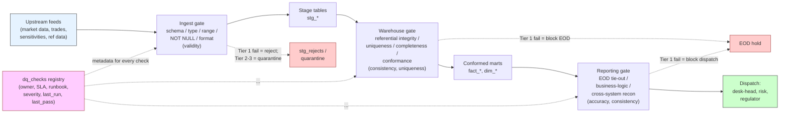

# Module 15 — Data Quality

!!! abstract "Module Goal"
    Roughly nine out of ten production incidents in a market-risk reporting stack are not bugs in the calculation engine — they are upstream data faults that survived the pipeline, landed in a fact table, and propagated into a number that a desk-head, a risk manager, or a regulator read without realising it was wrong. *Data quality* is the engineering discipline that catches those faults before the number is dispatched. Module 15 is the practitioner's tour of that discipline: the six dimensions every check is some flavour of, the reconciliation patterns that police agreement between systems, the placement of checks across the pipeline, the severity tiers that decide whether a failure blocks the EOD or merely logs a ticket, the silent-failure modes that make a green dashboard a worse signal than a red one, and the metadata registry that turns a thicket of ad-hoc SQL into a dispatchable, ownable, auditable control surface. Phase 5 of the curriculum begins here; the analytical layer built in Modules 03-14 is only as trustworthy as the DQ layer that polices it.

---

## 1. Learning objectives

By the end of this module, you should be able to:

- **Define** the six DQ dimensions — *completeness*, *accuracy*, *consistency*, *timeliness*, *validity*, *uniqueness* — and place a given market-risk failure mode into the right dimension without ambiguity.
- **Design** the four canonical reconciliation patterns used in trading risk — *front-to-back*, *source vs warehouse*, *totals tie-out*, and *cross-system* — and articulate, for each one, where the check sits, what it produces, and which team acts on a break.
- **Choose** where a given DQ check belongs in the pipeline — *at ingestion*, *in the warehouse layer*, *at reporting* — and trade off the cost of running it cheaply on every row against the cost of catching the violation later, after it has propagated.
- **Tier** the severity of a DQ failure — Tier 1 (CRITICAL, blocks EOD) through Tier 4 (LOW, monitored) — as a business decision made jointly with risk managers, and defend the tier against the temptation to mark everything Tier 1.
- **Detect** a silent failure — a check that reports green while the underlying data is broken — and name the four common mechanisms (stale data, loose tolerance, swallowed alert, suppressed rows) that produce one.
- **Build** a `dq_checks` metadata registry that captures ownership, SLA, runbook, severity, last_run, and last_pass for every check in the warehouse, and that the dashboard people watch *instead of* the underlying queries.

## 2. Why this matters

A working figure to internalise: in a typical large-bank market-risk reporting stack, somewhere between 80% and 95% of production incidents — the ones that escalate into a Risk-Operations bridge call, a regulatory restatement, or a desk-head losing trust in the numbers — turn out, on root-cause analysis, to be upstream data faults that survived the pipeline. The bug is not in the VaR engine, not in the pricer, not in the attribution computation. The bug is a missing fixing, a mis-categorised trade, a stale curve point, a partition the loader silently skipped, or a unit-mismatch that nobody caught at ingestion because nobody wrote the check. The calculation engines are well-tested by their builders; the *interfaces between systems* are where the failure modes live, and the data team is the only team whose job description includes policing those interfaces. Data quality is that policing function rendered as code.

Trading risk is unforgiving in a way that, say, a marketing analytics stack is not. A late or wrong number in marketing is a meeting; a late or wrong number in market risk is a regulatory submission that has already been transmitted with the wrong figure, a limit breach that was not surfaced because the position file was incomplete, or a desk that traded against an incorrect VaR all morning because the overnight batch silently used yesterday's volatilities. By the time Operations finishes chasing the missing confirmation, the EOD has run, the reports have been generated, and the regulatory submission has gone out. The DQ layer is the *only* layer that can catch the fault before that chain executes — which means DQ is not a quality-of-life concern for the data team, it is the firewall between the bank and the regulator. Modules 11 (market data), 13 (bitemporality), and 14 (P&L attribution) all *depend on* DQ to police their inputs and their invariants; without DQ, those modules' patterns produce numbers that look right and are wrong.

A practitioner reframing for the BI engineer arriving in Phase 5. The previous twelve modules taught the *conceptual layer* — what a position is, how a Greek behaves, where bitemporality belongs, why aggregation is dangerous. Phase 5 introduces the *production discipline* that keeps the conceptual layer honest in a real warehouse against a real desk against a real regulator. Module 15's specific contribution is the recognition that *every* fact table, *every* dimension, *every* derived view in Modules 03-14 has invariants that can be enumerated, encoded, and policed by a check; that the checks are themselves a product the warehouse owns; and that a warehouse without DQ is a warehouse whose numbers are *coincidentally correct* until they are not. The reflex this module installs is the same reflex Module 14 installed about flavour-tagging P&L: every number the warehouse dispatches carries an implicit claim about its quality, and the DQ layer is what makes the claim explicit and verifiable.

A worked figure that practitioners cite for the daily texture: a typical large-bank market-risk batch involves ~50 source feeds, ~200 fact tables and views, ~500 DQ checks, ~3-5 Tier 1 alerts per quarter, ~20-50 Tier 2 alerts per month, and ~100-200 Tier 3 entries per quarter that resolve in routine triage. The figures vary by shop, but the *order* is stable: Tier 1 is rare and always investigated; Tier 2 is weekly and triaged within hours; Tier 3 is routine and triaged in batch. A team whose Tier 1 rate is much higher than the indicative figure has either tier inflation or a genuinely fragile pipeline; a team whose Tier 1 rate is much lower may be missing coverage. The figures are not targets; they are the *order of magnitude* a healthy programme exhibits, against which a team can sense-check its own profile.

A regulatory framing the BI engineer should keep close. BCBS 239 — the *Principles for effective risk data aggregation and risk reporting* — is the international standard that tells globally-systemic banks what their risk-data layer must look like. It names accuracy, completeness, timeliness, and adaptability as first-class principles that the bank's senior management must be able to attest to, with documented evidence, in front of supervisors. The practical interpretation of BCBS 239 inside most banks is: *every material risk number must be traceable to its inputs, every input must pass documented DQ checks, and every check failure must be recorded with its resolution*. The DQ layer described in this module is not an engineering nicety; it is the technical implementation of a regulatory principle whose failure modes — wrong VaR, mis-stated capital, a desk that loses IMA approval because its data layer cannot defend its own numbers — are reviewed by supervisors annually. A team that does not internalise the BCBS 239 framing will under-invest in DQ until the supervisor's findings make the case for them.

A second framing, complementary to BCBS 239, is the *cost of a quality failure*. The economic literature on data quality (Redman, English, and others) repeatedly puts the all-in cost of poor data quality at 15-25% of operating revenue for a typical large enterprise; in a market-risk function the cost is harder to measure (it is bundled into the cost of restatements, regulatory fines, capital surcharges from FRTB-PLA failures, and the senior-management time spent re-affirming numbers that should have been right the first time) but is widely believed to be of comparable magnitude. The DQ layer is, framed economically, a *capital investment* whose returns are the avoidance of the cost-of-failure pool — and like most prevention investments, its return is invisible when it is working and conspicuous when it is not.

## 3. Core concepts

### 3.1 The six DQ dimensions

Every DQ check is some flavour of one of six dimensions. The vocabulary is borrowed from DAMA-DMBOK and from the regulatory data-quality frameworks (BCBS 239 in particular); learning to place a check in the right dimension is the first step toward designing a coherent DQ layer rather than a pile of ad-hoc SQL.

**Completeness.** Every required field, every required row, every required partition is present. The fact table covers every (book, business_date) it should cover; the trade record carries every column it should carry; the market-data snapshot includes every risk factor on the universe list. Completeness failures are usually *the easiest* DQ class to detect (a count or a left-anti-join is enough) and *the most consequential* when missed (a missing position is an under-reported risk). Market-risk example: the upstream sensitivities feed produces 18,400 rows on a typical EOD; today it produced 17,950. The 450 missing rows are completeness violations — possibly a load-time partition skip, possibly an upstream extract that filtered too aggressively, possibly a real reduction in the desk's instrument count, but in any case a signal worth investigating before the VaR batch consumes the file.

**Accuracy.** The values in the warehouse reflect reality — most usefully checked by reconciliation against an authoritative source of truth. Accuracy failures are the hardest to detect *in isolation* (a wrong notional looks like a right notional unless you compare it against another system) and require the reconciliation patterns of §3.2 to surface. Market-risk example: the warehouse's `fact_trade.notional_usd` for trade T-12345 is 10,000,000; the front-office trade-booking system shows 1,000,000. The warehouse value is wrong by a factor of ten, almost certainly a unit / scaling error in the loader, and is invisible to a within-warehouse check — only the cross-system reconciliation against the source-of-truth front-office system catches it.

**Consistency.** The same fact appears the same way across systems and across time — no contradictions. A trade's status in front-office and in middle-office matches; the desk hierarchy in the risk warehouse matches the one in Finance; today's `dim_book` row for book B-007 has the same parent_desk_sk as yesterday's row, unless a documented restructure event changed it. Consistency failures often surface as confusing edge cases — a report that disagrees with another report that everyone thought was reading from the same data — and are particularly easy to introduce when two systems independently maintain reference data without a shared master. Market-risk example: the risk-warehouse `dim_book` says book B-007 reports into desk D-22 (Equity Derivs NY); the Finance ledger says the same book reports into desk D-19 (Equity Derivs Global). The two systems compute a desk-level P&L total that does not reconcile, not because either total is wrong but because they are aggregating the same book under two different parent desks.

**Timeliness.** The data arrives within the SLA window. Timeliness failures are common, are often resolved without intervention (the late feed catches up), and are nonetheless dangerous because a downstream batch that runs against a *partial* feed produces numbers that look complete but are not. Market-risk example: the official 4pm London FX-rate snapshot is required for the EOD VaR batch; today the vendor's feed lands at 4:42pm. The VaR batch was scheduled for 4:30pm against a 5pm submission deadline, ran on time, and silently used yesterday's FX rates because the loader's "use latest available" fallback fired. The numbers landed; they were stale; the timeliness check should have blocked the batch and did not.

**Validity.** The values conform to the allowed types, formats, ranges, and reference-data domains. A `currency_ccy` column contains an ISO-4217 code; a `business_date` is a real calendar date in the expected range; a `book_sk` exists in `dim_book`. Validity failures are the cheapest class of check (schema and range constraints, run on every row at ingestion) and catch a high proportion of feed-format regressions before they reach the warehouse. Market-risk example: a sensitivities feed contains a row with `risk_factor = 'EURUSD_VOL_TENOR_99Y'`. The reference data lists tenors up to 30Y; the 99Y tenor is a bug in the upstream extract, possibly a stringification error that turned `9.9Y` into `99Y`. A validity check against the tenor reference catches it before the bump engine consumes the row and produces nonsense Greeks.

**Uniqueness.** The primary-key constraint holds; no duplicates. A (trade_id, business_date) pair appears at most once in `fact_trade`; a (book_sk, business_date, risk_factor_sk) tuple appears at most once in `fact_sensitivity`. Uniqueness failures are catastrophic when they occur (a duplicated trade doubles the desk's notional) and are often introduced by loader retries that did not implement idempotency correctly. Market-risk example: a network blip causes the position-file loader to retry the same Parquet partition; the retry inserts a second copy of every row in the partition; the resulting `fact_position` carries each position twice; the VaR engine reads the doubled positions and reports a VaR roughly twice the truth. The uniqueness check on (book_sk, business_date, instrument_sk) catches the duplication immediately; without it, the bad VaR ships.

A reference table summarising the six dimensions, what they police, the cheapest signal, and the typical owner who acts on a break:

| Dimension     | Polices                                              | Cheapest signal                                          | Typical owner            |
| ------------- | ---------------------------------------------------- | -------------------------------------------------------- | ------------------------ |
| Completeness  | Required fields, rows, partitions present            | Row counts, NOT NULL on key columns                       | Data engineering         |
| Accuracy      | Values reflect reality                                | Reconciliation against source-of-truth                    | Data + producing system  |
| Consistency   | Same fact identical across systems                    | Cross-system join on natural key                          | Data + producing system  |
| Timeliness    | Data arrives within SLA                              | `max(load_timestamp)` vs cut-off                         | Data engineering         |
| Validity      | Type, format, range, reference                       | Schema, range, reference-table left-anti-join            | Data engineering         |
| Uniqueness    | Primary-key constraint holds                         | `COUNT(*) > COUNT(DISTINCT pk)`                          | Data engineering         |

A practitioner observation: the six dimensions are not equally easy to detect, but they are *equally consequential* when violated. A team that focuses heavily on completeness and validity (because those are the easy checks to write) and neglects accuracy and consistency (because those require reconciliation infrastructure) builds a DQ layer that catches the obvious failures and misses the expensive ones. Module 15's design pressure is to invest in *all six* dimensions, with the understanding that accuracy and consistency dominate the long-tail incident reports.

A second practitioner observation, on the *interactions* between dimensions. The six dimensions are not independent; a violation in one frequently masquerades as a violation in another. A completeness break (a missing partition) often surfaces first as a *timeliness* alert (the count check waited five minutes for the late partition before failing). A consistency break (two systems disagreeing on a desk hierarchy) often surfaces first as an *accuracy* alert (the desk-level total reconciliation fails, even though both desks' underlying figures are right). A validity violation upstream often surfaces downstream as a *uniqueness* violation (a malformed key collides with another malformed key after both are normalised). The diagnostic discipline is to *resist* the first dimension the alert seems to point to and ask which of the six dimensions is *actually* broken; misattributing the dimension wastes time investigating the wrong invariant and leaves the underlying break in place when the symptom resolves.

A third observation, on the *temporal* pattern of which dimensions fail when. Completeness and timeliness failures cluster around new-feed onboarding, infrastructure incidents, and vendor-side regressions; they are spiky, often resolve quickly, and are the noisiest class of alert in a typical week. Accuracy and consistency failures cluster around system upgrades, reference-data restructures (a desk hierarchy change that one system absorbed and another did not), and methodology changes; they are rarer, slower-to-detect, and more likely to be discovered by a *consumer* (a risk manager noticing a number that does not look right) than by a check. Validity and uniqueness failures cluster around loader regressions and code deployments; they are the easiest class to add a regression test for, and a team with a healthy CI pipeline should rarely see them in production.

### 3.2 Reconciliation patterns

Reconciliation is the technique by which accuracy and consistency are policed. The vocabulary varies by shop — *recon*, *match*, *tie-out*, *break-detection* — but the patterns are stable. Four are canonical in trading risk; every market-risk warehouse runs some flavour of each.

**Front-to-back.** Trade flows from booking (front office) through middle-office confirmation and risk capture into settlement and Finance. At each handoff, the count of trades and the total notional must match. Where the check sits: at every system boundary, run nightly (and intra-day for cash-equity volume desks). What it produces: a reconciliation report per (handoff, business_date) listing trades present in upstream but missing in downstream, trades with mismatched notional, and trades with status disagreements. Who acts: middle-office Operations on missing confirmations, the risk-data team on mismatched booking-to-risk capture, Finance on settlement breaks. Front-to-back is the *load-bearing* reconciliation in trading; a desk that cannot reconcile its book front-to-back at end-of-day is a desk that cannot defend its P&L the next morning.

**Source vs warehouse.** What the upstream feed says vs what the warehouse loaded. Where the check sits: immediately after the loader, before the warehouse table is exposed to consumers. What it produces: a one-row recon-result per (feed, business_date) with source totals, warehouse totals, absolute and relative difference, and a PASS/WARN/FAIL status against a tolerance. Who acts: the data engineering team — a source-vs-warehouse break is, by elimination, a loader bug or a transform error. The pattern catches the most common loader regressions: silent partition skips, a CASE statement that drops rows, a unit-mismatch in a transform, a deduplication that was too aggressive or not aggressive enough. Example 1 in §4 builds this exact pattern.

**Totals tie-out.** An aggregate computed two ways must agree. The sum of leg notionals on a trade equals the trade-level notional; the sum of book P&Ls within a desk equals the desk P&L; the sum of position market values within a book equals the book's reported NAV. Where the check sits: in the warehouse layer, after the aggregation has been computed, before the result is exposed. What it produces: a row-level break list — the (trade, book, desk) tuples whose two computations disagree beyond tolerance. Who acts: the data team owns the within-warehouse totals tie-outs; cross-system tie-outs (warehouse desk-P&L vs Finance ledger desk-P&L) are jointly owned by data and Finance. Totals tie-outs are the cheapest accuracy check the warehouse can run on itself and the easiest to forget — the aggregate is, after all, *computed* from the underlying rows, so "of course" they tie out, except when a join goes wrong, a filter is mis-specified, or a NULL behaves differently from a zero.

**Cross-system.** Two independent systems compute the same quantity from independently-loaded data; the two answers must agree within tolerance. The VaR engine and the front-office position-keeping system should agree on the count and notional of positions held overnight. The risk warehouse and the Finance ledger should agree on the firmwide market-value total. Where the check sits: at the boundary between the two systems' fact tables, run nightly. What it produces: a one-row-per-comparison recon report with each system's value, the difference, the tolerance, the status. Who acts: the recon owns the *signal*, but the resolution belongs to whichever side is wrong, which is itself part of the diagnostic. Cross-system reconciliations are the most expensive class to maintain (two independently-loaded data sources, each with its own latency and as-of) and the most valuable when working — they are the *only* check that catches a category of bug where both systems are internally consistent and *both* are wrong relative to each other.

A reference table mapping the four patterns:

| Pattern                  | Where it sits                          | Produces                                              | Who acts                                |
| ------------------------ | -------------------------------------- | ----------------------------------------------------- | --------------------------------------- |
| Front-to-back            | At every system handoff                | Per-handoff trade-level break list                    | Operations / data / Finance              |
| Source vs warehouse      | Immediately after loader               | Per-feed totals report with PASS/WARN/FAIL            | Data engineering                         |
| Totals tie-out           | In the warehouse, post-aggregation      | Per-aggregate row-level break list                    | Data (intra-warehouse), data + Finance (cross) |
| Cross-system             | Between independent systems             | Per-comparison reconciliation report                   | Joint, with diagnostic ownership          |

A practitioner observation on tolerance. Every reconciliation pattern carries a *tolerance threshold* — the amount of difference below which the recon is treated as a PASS. The threshold is not a technical detail; it is a business decision that depends on the underlying quantity. A 0.01 USD difference on a desk-level P&L is rounding noise; a 0.01% difference on a book's FX rate is a meaningful market move. Pitfall §5 returns to this in detail; the relevant point for §3.2 is that the tolerance lives *with* the reconciliation, ideally as a column in the `dq_checks` registry, and is owned by the same business-and-data joint forum that decides severity tiers.

A second practitioner observation on *break investigation workflow*. A reconciliation that produces a break is the start of an investigation, not the end of one — and the workflow around the investigation deserves as much engineering attention as the recon itself. The canonical pattern is: the recon writes a row to a `fact_dq_break` table with the affected entities, the value on each side, the difference, the severity, and a `status` column initialised to `OPEN`; an analyst picks up the break, investigates, identifies the root cause, and updates the row to `RESOLVED` with a `resolution_notes` text and a `root_cause_category` enum (loader bug, source-system error, timing, methodology change, data correction in flight); the resolved breaks accumulate into a queryable history that the team uses to identify *recurring* root causes and prioritise fixes. A team that does not capture break history loses the most valuable signal the DQ layer produces — the *pattern* of what fails repeatedly — and ends up re-investigating the same root cause every quarter because nobody remembers it was the same one as last time.

A third observation, on the *cadence* of recon cycles. Front-to-back reconciliations are typically run *intra-day* for cash-equity desks (where settlement happens T+1 and the trade-flow volume is high) and *end-of-day* for fixed-income and derivatives desks (where the trade volume is lower and the intra-day book is more stable). Source-vs-warehouse reconciliations are run *immediately after every load*, regardless of the load's frequency. Totals tie-out reconciliations are run *post-aggregation*, which usually means once per warehouse build cycle (nightly, in most shops). Cross-system reconciliations are run *daily* at end-of-day, after all the contributing systems have closed and posted their figures. The cadence for each pattern follows the data's natural rhythm; a recon scheduled at the wrong cadence (a daily front-to-back that should be intra-day, or an intra-day cross-system that the contributing systems cannot support) produces noise and drains operational capacity without commensurate value.

### 3.3 Where DQ checks live in the pipeline

The same DQ idea — "this column should not be NULL", "the count should match" — can be implemented at three distinct points in the pipeline, with different cost, different blast-radius, and different consequence. Choosing where the check lives is a design decision; doing it well is the difference between a DQ layer that catches faults early and a DQ layer that catches faults after they have propagated.

**At ingestion.** Schema, type, range, NOT NULL, format. Run on every row as it arrives, before it lands in a stage table. Cheap (one constraint check per row, often executed by the loader itself), strict, and the right home for the validity dimension. The policy decision at ingestion is *reject vs quarantine*: a row that fails a hard constraint can be either rejected outright (the loader fails fast and the operator sees a load-time error) or quarantined into a separate `stg_*_rejects` table for inspection and possible repair. Reject-on-fail is the right policy when partial loads are unacceptable (a missing FX rate must not let a partial market-data snapshot land); quarantine is the right policy when the missing rows can be filled later (a sensitivities feed can quarantine the malformed 5% and still admit the well-formed 95%, with the gap visible to an operator). Pick one policy per feed, document it, and resist the temptation to mix policies within a single feed.

**In the warehouse layer.** Referential integrity, conformance to reference-data domains, business-rule checks. Run after stage tables are loaded but before the data is exposed to downstream consumers. Slower (joins to dimension tables, business-rule SQL) but catches a class of errors that a row-level ingestion check cannot catch — a `book_sk` value that is well-formed and in-range but does not correspond to any row in `dim_book` is a referential-integrity break that only the warehouse-layer check sees. The warehouse layer is also the natural home for the totals tie-out checks of §3.2 and for the *consistency* and *uniqueness* dimensions, both of which require the loaded data set to be present in full before they can be computed.

**At reporting.** Tie-outs against the official EOD, business-logic checks, sanity checks. Run after the reporting layer materialises its views and before the dispatch to consumers. The most expensive class to run (the full reporting computation has executed before the check fires) and the last line of defence — a check that fails here has caught a bug that survived ingestion and warehouse-layer policing, which is rare but consequential. Reporting-layer checks are also the right home for *business-logic* validation that requires the full reporting context: "is this firmwide VaR within the expected band for a Tuesday with this market move?" is a check only meaningful at the reporting layer because it depends on the aggregated VaR figure and the day's market-move statistics, neither of which exists earlier in the pipeline.

A reference table mapping the three placements:

| Placement              | Catches                                              | Cost          | Reject vs quarantine policy                                 |
| ---------------------- | ---------------------------------------------------- | ------------- | ----------------------------------------------------------- |
| Ingestion              | Schema, type, range, NOT NULL, format                | Cheapest      | Per-feed decision; document and stick to it                  |
| Warehouse layer        | Referential integrity, conformance, totals tie-outs   | Moderate      | Quarantine the bad rows; expose only the conformant subset    |
| Reporting              | Business-logic, sanity, EOD tie-out                   | Most expensive | Block the dispatch; alert the on-call BI engineer              |

The tooling layer matters less than the placement. dbt tests, Great Expectations, custom SQL queries, native database constraints — these are different implementations of the same idea. dbt's `tests:` block on a schema.yml lets a model declare its NOT NULL and uniqueness checks alongside the model definition; Great Expectations expresses the same checks as a Python expectation suite that the orchestrator runs at ingestion. A team that has converged on dbt for warehouse modelling will naturally run its DQ checks in dbt; a team that has a Spark / Databricks pipeline ahead of the warehouse will run Great Expectations against the staging Parquet. The check itself — "trade_id is unique within (business_date)" — is the same in either tool; the placement and the registry are what determine whether the check earns its operational keep.

A practitioner observation on *check density*. A warehouse with too few checks misses the failures the checks would have caught; a warehouse with too many checks produces alert fatigue and the on-call BI engineer learns to mute the dashboard. The right density is *the checks that map to invariants the business cares about*, no more and no less. A useful test of a check's right-to-exist: if it failed tonight at 02:00, would someone be paged? If yes, the check earns its place. If no — if the failure would be triaged the next morning by whoever happened to look at the dashboard — the check is either the wrong severity tier (move it down) or the wrong invariant (delete it).

A second observation on *check independence*. The most useful DQ checks are *independent* of the loader they police — they read from the warehouse using SQL the loader did not produce, against invariants the loader was not coded to satisfy. A check that is essentially a re-run of the loader's own logic catches no bugs in the loader; a check that comes at the same data from a different angle (a count from an independent feed, an aggregate against an independent reference) catches the loader's bugs as well as its own. The discipline is the same as in software engineering: a test that exercises the code through the same path as the code itself is testing the implementation, not the contract; a test that exercises the contract from outside the implementation catches bugs the implementation cannot see in itself. Apply the same discipline to DQ checks; the most-leveraged checks are the ones that read from independently-maintained sources, even when the second source is more expensive to query.

A third observation on *test data and synthetic-failure fixtures*. Every DQ check should have, alongside it, a *synthetic-failure fixture* — a small, well-known data set engineered to violate the check's invariant. The fixture lives in a test schema, gets refreshed alongside the check's deployment, and is run against the check on a regular cadence (weekly is plenty for most checks). The point is not to test the check's correctness during development (the developer presumably tests that as they write the SQL) but to ensure the check still *fires* against a known violation after months of production use, when the surrounding code has evolved and a refactoring may have silently broken the check's wiring. A team that does not maintain synthetic-failure fixtures discovers, during a real incident, that a check it relied on stopped firing six weeks ago and nobody noticed.

### 3.4 Severity tiers and the EOD-blocking decision

Not every DQ failure is equal. A NULL primary key on `fact_position` is a fail-fast emergency; a missing optional metadata field on a reference-data feed is a tomorrow-morning ticket. The severity-tier framework names four levels and ties each to an operational response. The tiering decision is *a business decision*, not a technical one — it is made jointly with risk managers and dispatched-on by the data team, and the right home for the tier is the `dq_checks` registry of §3.6.

**Tier 1 (CRITICAL).** Blocks EOD. The batch does not proceed; the on-call BI engineer is paged; the desk-head is notified that the EOD will be late or restated. Reserve Tier 1 for failures that would produce a *materially wrong* number if the EOD ran without resolution. Examples: missing official market-data snapshot (the EOD VaR cannot be computed without it); failed front-to-back reconciliation beyond tolerance (the position file is mis-aligned with the trade-booking system); a NULL primary key on `fact_position` (a duplicated or absent position is invisible in the aggregation); duplicate rows on a key fact (uniqueness violation). Tier 1 checks are *expensive*, deliberately — every Tier 1 alert is a real operational event — and should be small in number. A warehouse with twenty Tier 1 checks per night is a warehouse whose Tier 1 has stopped meaning anything.

**Tier 2 (HIGH).** Alerts immediately, EOD continues but with a watermark or a health flag on the affected output. The downstream dispatch carries a "DQ-warning" tag; the on-call engineer is notified; the resolution happens during business hours rather than overnight. Examples: a partial completeness break (95% of the sensitivities feed loaded, 5% missing, the missing 5% can be filled in the morning); a stale-but-still-usable market-data input (the FX feed is 30 minutes late but landed before the deadline); a totals tie-out break within a wider tolerance. Tier 2 is the right home for failures that *should* be visible the next morning but should not stop the EOD train.

**Tier 3 (MEDIUM).** Logged for next-day investigation. No immediate alert; the failure lands in the DQ registry's daily-review queue and is triaged at the morning standup. Examples: a metadata field that is NULL on a small percentage of rows; a reference-data row that has not been refreshed for a week; a non-blocking schema deprecation warning. Tier 3 is the right home for "we should know about this but it is not urgent" failures; the queue is reviewed daily and items either resolve, escalate to Tier 2, or are deprioritised.

**Tier 4 (LOW).** Monitored, no immediate action. The check runs and the result is logged; the dashboard surfaces the historical pass-rate; nobody is alerted. Tier 4 is the right home for *informational* checks — a check that surfaces a slow-moving trend, a check that exists to detect a regression that has not yet occurred, a check whose threshold is being calibrated. The temptation to delete Tier 4 checks is strong (they do not page anyone), but a well-curated Tier 4 catalogue is the early-warning system for the higher tiers.

A reference table:

| Tier | Name      | Operational response                                    | Examples                                          |
| ---- | --------- | ------------------------------------------------------- | ------------------------------------------------- |
| 1    | CRITICAL  | Blocks EOD, on-call paged                                | Missing FX snapshot, NULL PK, recon > tolerance    |
| 2    | HIGH      | Alerts immediately, EOD continues with watermark         | Partial completeness, late-but-on-time feed       |
| 3    | MEDIUM    | Logged for next-day investigation                        | Sparse NULL on metadata, stale reference-data row |
| 4    | LOW       | Monitored, no action                                    | Slow-moving trend, calibration check               |

The framework's *load-bearing* sentence is: *defining the tier is a business decision*. The data team can compute the check, write the SQL, and run the alert; only the risk manager (or the desk-head, or the regulatory-reporting lead) can decide whether a given failure is consequential enough to block the EOD. A team that tiers its checks unilaterally produces either a too-strict regime (everything blocks, the desk-head loses confidence) or a too-loose regime (failures are missed, the regulator finds them). The right pattern is a quarterly DQ review meeting that walks the registry, surfaces tier disputes, and ratifies the tier assignments with the business stakeholders. The output of that meeting is the source of truth for the registry's `severity` column.

A practitioner observation on the *EOD-blocking decision* itself. When a Tier 1 check fires and the EOD is held, the on-call engineer faces a sequence of branching decisions in a compressed timeframe: is the failure a genuine data fault or a check-side bug? Can the underlying issue be resolved in time to allow the EOD to complete on schedule? If not, what is the documented fallback — release with a watermark, release a partial dispatch covering the unaffected desks, delay the entire dispatch, or invoke a rollback to yesterday's snapshot? The branching tree is the same every time, and a runbook that walks it explicitly — with named decision points, named approvers, and named fallback procedures — is the difference between a 30-minute resolution and a 4-hour scramble. Every Tier 1 check should have a runbook of this shape; the runbook URL in the `dq_checks` registry is the link the on-call engineer clicks at 02:30 in the morning, half-asleep, with the desk-head texting for an ETA. A runbook written for that audience and that moment is the most leveraged piece of documentation in the DQ layer.

A second observation on *tier inflation*. The natural tendency in any new DQ programme is to mark every check Tier 1 ("just in case") and to demote the tiers later as the team gains operational experience. The result is a Tier 1 catalogue full of checks that should be Tier 2 or Tier 3, and a regular EOD that is held for non-blocking issues that the team learns to wave through. Once the team has learned to wave through a Tier 1 alert, the tier has lost its meaning — and the next *real* Tier 1 issue is at risk of being waved through as well. The discipline is to *start* checks at the lowest justifiable tier and *promote* them only when an incident demonstrates the cost of having them at the lower tier. The asymmetry favours under-tiering during ramp-up; the cost of a missed Tier 2 incident is recoverable, the cost of a desensitised on-call rota is not.

### 3.5 Failure modes — the silent ones

The most dangerous DQ failure is not the one that pages the on-call engineer at 03:00; it is the one that *passes silently* while the underlying data is broken. A green dashboard is a *worse* signal than a red one when the dashboard's greenness is the result of a check that should have fired and did not. Four mechanisms produce silent failures, and a DQ engineer who has not seen all four will eventually be surprised by them.

**The check ran but on stale data.** The check was scheduled to run after the load completed; the orchestrator reported the load as complete; the check ran; the check passed. Except the load had silently failed for the affected partition — it had succeeded for the *other* partitions, the orchestrator marked the parent task as complete, and the check ran against yesterday's data for the affected partition. The pass is real (yesterday's data does pass the checks) and the dispatch carries no warning. The cure is a *clock-skew* check — every DQ check should also assert that the data it is checking has a `load_timestamp` newer than yesterday's run, and a check whose underlying data is stale should fail fast even if the data passes the substantive checks.

**The check tolerance was set too wide and never trips.** The recon between source and warehouse is checked against a 5% tolerance; the actual difference has been ~0.5% historically; the loader regression introduces a 3% bias; the recon passes because 3% < 5%. The tolerance is doing nothing; the check exists in the registry as a green tile but provides zero coverage of the kind of break the loader actually produces. The cure is to *calibrate* the tolerance against the historical signal — a check whose long-run pass rate is 100% with no near-misses is a check whose tolerance is too wide; a check whose long-run pass rate is 70% with frequent borderline outcomes is calibrated. Module 15's quarterly DQ review should include a tolerance-recalibration step alongside the severity-tier review.

**The downstream system swallows the alert and never surfaces it.** The check fired; the alert was generated; the alert went to a Slack channel that nobody reads; or the alert was written to a log file that the dashboard does not parse; or the alert was posted to a JIRA queue that has 4,000 open tickets and the new ticket lands on page 73. The check is doing its job; the *operational layer above the check* is broken. The cure is to *test the alert path* — periodically introduce a fake failure (a synthetic check that always fails on the first Wednesday of the month) and verify that the alert reaches a human who acts on it. A team that does not test the alert path discovers, during a real incident, that nobody has been receiving the alerts for months.

**The producer "fixed" the data by suppressing failed rows so the count looks right.** This is the most insidious of the four. The upstream extract produces 18,400 rows, but 50 of them fail an internal validation in the producer's pipeline. The producer's loader, rather than alerting, *quietly drops* the 50 rows and emits 18,350. The downstream warehouse's count check expects ~18,400 ± 1% and passes against 18,350 (within tolerance). The DQ layer is doing its job — the count is in band — but the *content* of the data is wrong: 50 positions are missing entirely. The cure is to *cross-check* the count against an *independent* source where available (the front-office trade-keeping system says how many trades were live overnight; the warehouse count should match that, not match the count of the file that arrived). It is also to maintain a relationship with the producing team where suppression is not a quiet behaviour but a logged event the consumer can see.

A useful aphorism for the silent-failure category: *trust, but verify the verification*. Every DQ check is itself a piece of code that can fail, and a DQ layer that does not periodically validate its own checks will accumulate silent-failure debt. The `dq_checks` registry's `last_pass` column is the basic instrumentation; a check that has not failed in 365 days is a check that needs a sceptical review.

A fifth silent-failure mode worth naming explicitly, because it is increasingly common in modern data stacks: **the orchestrator skipped the check because of an upstream task failure.** Most orchestrators (Airflow, Dagster, Prefect) propagate task failures through the DAG by skipping downstream tasks, on the reasonable principle that running a downstream task against missing inputs is worse than not running it. The unintended consequence: when the upstream loader fails, the downstream DQ check is *skipped*, the registry shows `last_status = NOT_RUN` rather than `FAIL`, and a dashboard that filters on `status = 'FAIL'` shows green. The data is broken (the loader failed, the partition is empty), the check should have surfaced the brokenness, and instead the check is silent because it never ran. The cure is two-part: (a) the dashboard must surface `NOT_RUN` as a *distinct* state from `PASS`, with its own colour, so a missing run is visually distinguishable from a green pass; (b) the orchestrator must include a *meta-check* that fires when any expected check did not run, escalating to Tier 1 or Tier 2 as appropriate. A team that conflates `NOT_RUN` with `PASS` has a dashboard that lies to it on every infrastructure incident.

A sixth silent-failure mode, more subtle: **the check was correctly designed but the data shape changed and the check no longer covers what it should.** A check that polices `notional_usd > 0` was written when the warehouse stored only USD-equivalent notionals; a downstream change introduced multi-currency support, and the loader now stores native notionals with a separate currency column. The check still passes (native notionals are still positive), but the *invariant it was meant to police* — that the firmwide USD-equivalent total is sensible — is no longer covered, because the column it reads is no longer the column the invariant lives in. The cure is a regular *semantic review* of the registry, ideally during the same quarterly meeting that re-tiers severity: walk each check, ask "does this check still police the invariant we wrote it for?", and retire or rewrite the checks whose semantics have drifted away from their intent.

### 3.6 DQ metadata — the registry

The thing the dashboard people watch is *not* the underlying SQL queries — it is the **DQ checks registry**, a table (or a metadata service) that lists every check in the warehouse along with its operational metadata. The registry is what turns a thicket of ad-hoc checks into a managed, ownable, dispatchable control surface, and it is the single most-leveraged investment a DQ team can make.

The registry's columns:

- `check_name` — a stable, unique identifier. Used in the alert payload and the dashboard.
- `check_description` — a one-sentence description of the invariant the check polices.
- `dimension` — one of *completeness*, *accuracy*, *consistency*, *timeliness*, *validity*, *uniqueness*.
- `severity` — Tier 1 / 2 / 3 / 4 per §3.4.
- `owner` — the team accountable for resolving a failure. Not the team that runs the check, the team that *fixes* the underlying data.
- `sla_minutes` — the maximum time between a failure firing and a resolution being underway. Tier 1 is typically 30 minutes; Tier 2 is two hours; Tier 3 is one business day; Tier 4 is "during the next quarterly review".
- `runbook_url` — a link to the wiki page that describes how to triage and resolve a failure of this check. A check without a runbook is a check that pages someone who does not know what to do.
- `query_or_view_name` — the SQL or the view that implements the check. Stored as a reference to the underlying definition, not inlined into the registry.
- `last_run_timestamp` — when the check most recently ran.
- `last_pass_timestamp` — when the check most recently passed.
- `last_status` — PASS / WARN / FAIL / NOT_RUN.
- `tolerance_threshold` — the numeric tolerance, where applicable. Stored as a column so it can be tuned without code changes.

The registry is *itself a fact* that lives bitemporally (Module 13) — when a tolerance is tuned or a severity is re-tiered, the change is recorded with an as-of, and the audit trail of how the DQ layer evolved is queryable. The dashboard reads the registry on every refresh; the alerting layer reads the registry to decide who to page when a check fails; the quarterly DQ review meeting reads the registry to walk the catalogue.

A practitioner observation on the registry's *size*. A mature market-risk warehouse will have somewhere between 200 and 1,500 active DQ checks. The lower end is a desk-level warehouse with a handful of feeds and a tight scope; the upper end is a firmwide platform with hundreds of feeds, dozens of fact tables, and end-to-end reconciliation across multiple systems. A registry with fewer than ~50 checks is almost certainly missing coverage; a registry with more than ~2,000 is almost certainly carrying obsolete checks that should be retired. The right pattern is to *grow* the registry deliberately — add a check when a new invariant is identified, retire a check when its invariant is no longer load-bearing — and to review the catalogue quarterly against the inventory of fact tables and feeds.

### 3.6a The dq_checks registry — schema sketch

A concrete schema sketch for `dq_checks`, captured here as a reference because the registry's design is the most-leveraged single artefact in the DQ layer.

| Column                  | Type        | Notes                                                                  |
| ----------------------- | ----------- | ---------------------------------------------------------------------- |
| `check_sk`              | BIGINT PK   | Surrogate key for the check                                             |
| `check_name`            | VARCHAR     | Stable unique identifier, used in alerts and dashboards                  |
| `check_description`     | VARCHAR     | One-sentence description of the policed invariant                       |
| `dimension`             | ENUM        | One of completeness / accuracy / consistency / timeliness / validity / uniqueness |
| `severity`              | INT         | 1 / 2 / 3 / 4 per §3.4                                                  |
| `owner_team`            | VARCHAR     | Team accountable for resolution; not the team that wrote the check      |
| `sla_minutes`           | INT         | Maximum minutes between failure and resolution underway                  |
| `runbook_url`           | VARCHAR     | Link to the wiki page describing triage and resolution                   |
| `check_view_or_query`   | VARCHAR     | Reference to the SQL implementing the check                              |
| `tolerance_threshold`   | DECIMAL     | Numeric tolerance, where applicable; tunable without code change         |
| `placement`             | ENUM        | ingestion / warehouse / reporting                                        |
| `enabled`               | BOOLEAN     | Master switch; if FALSE the check is not run                             |
| `mute_until_timestamp`  | TIMESTAMP   | Time-bound mute; auto-unmute regardless of operator action               |
| `last_run_timestamp`    | TIMESTAMP   | Most recent run                                                          |
| `last_pass_timestamp`   | TIMESTAMP   | Most recent successful pass                                              |
| `last_status`           | ENUM        | PASS / WARN / FAIL / NOT_RUN                                             |
| `valid_from`            | TIMESTAMP   | Bitemporal as-of of this registry row                                    |
| `valid_to`              | TIMESTAMP   | Bitemporal end-of-validity                                                |
| `is_current`            | BOOLEAN     | Bitemporal current-row flag                                               |

The registry is the *operating contract* between the DQ layer and every consumer of the warehouse. The dashboard reads it on every refresh; the alerting layer reads it when a check fires and decides whom to page; the orchestrator reads `enabled` and `mute_until_timestamp` to decide which checks to run; the audit layer reads the bitemporal `valid_from` / `valid_to` to reconstruct what the DQ regime looked like at any historical point. A registry that lives alongside the checks rather than embedded in them is the structural choice that turns a brittle pile of SQL into an auditable control surface.

A practitioner observation on *registry governance*. The `dq_checks` registry is itself a piece of data that needs governance — every column update should be traceable, every severity change should have an approver, every mute should have an expiry. The simplest viable governance model is to treat the registry as code: store its content in a YAML file in version control, generate the registry table from the YAML during deployment, and require a code-review on every change. Tooling like dbt's `dbt_project_evaluator` and the `elementary` package implement variations of this pattern. The advantage of code-as-registry is that every change to severity, tolerance, or ownership goes through the same review process as a code change, with the same audit trail. The disadvantage is that *operational* changes (mute during an incident, tune a tolerance during ramp-up) become heavyweight; the right pattern is usually a hybrid where stable metadata (severity, ownership, runbook) lives in YAML and operational metadata (mute, last_run, last_pass) lives in a runtime table. Either way, the registry's design and lifecycle deserve as much engineering thought as the checks themselves.

### 3.6b The DQ scorecard — composite quality indicator

A useful pattern for senior-management reporting is the *DQ scorecard*: a single composite indicator per data product (per fact table, per feed, per desk) that summarises the health of the underlying checks in a number a non-technical audience can read. The scorecard is not a replacement for the check-level dashboard the on-call engineer uses; it is a *rolled-up* view for the audience that wants a one-glance answer to "is the warehouse healthy today?".

The most common scorecard formula is a weighted pass-rate: each check contributes its current pass status (1 if PASS, 0 if FAIL, 0.5 if WARN, NULL if NOT_RUN), weighted by its severity (Tier 1 weighted 8x, Tier 2 weighted 4x, Tier 3 weighted 2x, Tier 4 weighted 1x), and the weighted average is the scorecard score in the range [0, 1]. A score of 1.00 is all-green; a score below 0.95 is amber; a score below 0.85 is red. The thresholds are tunable per data product; the relevant point is that the *senior-management view* of DQ health is a single number that aggregates a hundred underlying checks into something that fits on a slide.

A practitioner caution on the scorecard. A scorecard is a useful summarisation but a dangerous *substitute* for the underlying check data. A scorecard that reads 0.97 is reassuring even when the 3% gap is concentrated in a small number of Tier 1 failures that would be operationally devastating; the average smooths over what the operator most needs to see. The right pattern is to surface the scorecard *alongside* a list of any current Tier 1 or Tier 2 failures, so the senior-management audience cannot read the green number without also seeing the specific failures driving the 3% gap. A scorecard without the failure-list context is a dashboard pattern that creates false confidence; a scorecard with the context is a useful summary that supports rather than replaces the operational view.

### 3.7 The pipeline-stage diagram

The placement decisions of §3.3 and the tiers of §3.4 combine into a stage-by-stage view of where checks fire across the pipeline. Source feeds enter at the left; the EOD report dispatches to the right; checks fire at every gate, with each gate enforcing the dimensions and tiers appropriate to its placement.



Reading the diagram. The three gates — ingest, warehouse, reporting — each enforce a different subset of the six dimensions, with the cheapest checks at ingest and the most business-context-sensitive checks at reporting. Tier 1 failures at any gate halt the train; Tier 2-3 failures at ingest route to a quarantine table; the registry is the metadata spine that sits *above* the gates and tells the alerting and dispatch layers what to do when a check fires. The pattern is uniform across feeds and uniform across fact tables; the gates are the same shape whether the feed is market data, trades, sensitivities, or reference data. The diagram is the canonical mental model an engineer should carry into every DQ design conversation.

### 3.8 Statistical process control for ongoing DQ monitoring

The DQ checks discussed so far are *deterministic* — a row either violates the rule or it does not, and the check output is binary. A second class of checks is *statistical*: the underlying signal is a continuous metric (today's row count, today's average notional, today's reconciliation residual), and the check fires when the metric drifts outside a statistically-defined band. The vocabulary is borrowed from manufacturing quality control — *statistical process control*, or SPC — and the workhorse tool is the *control chart*.

A control chart for a DQ metric tracks the daily value of the metric on the y-axis and the date on the x-axis, with three reference lines overlaid: the *centre line* (the long-run mean of the metric), the *upper control limit* (UCL, typically the mean plus 3 standard deviations), and the *lower control limit* (LCL, the mean minus 3 standard deviations). A point inside the band is *in control* — the metric is behaving consistently with its history. A point outside the band is *out of control* — the metric has drifted in a way the historical pattern does not predict, and warrants investigation.

The pattern is especially useful for DQ metrics that are *naturally noisy* and that a deterministic threshold would either over-fire or under-fire on. A daily row count that varies between 17,500 and 19,000 over the past 90 days has no single threshold that catches both the quiet-day extreme (17,000 is unusually low) and the busy-day extreme (19,500 is unusually high) without false positives in the middle. A control chart with the 3-sigma band catches both, adapts to seasonal patterns when the band is recomputed periodically, and produces a richer signal than a single hard threshold.

A practitioner observation on the *Western Electric rules* — a set of heuristics that detect specific failure patterns even when no single point exceeds the control limits. Rule 1: any single point outside the 3-sigma band. Rule 2: two of three consecutive points outside the 2-sigma band on the same side. Rule 3: four of five consecutive points outside the 1-sigma band on the same side. Rule 4: eight consecutive points on the same side of the centre line. The four rules together catch *trends* and *shifts* that a single-point threshold misses — a metric that has slowly drifted from the centre line over the past two weeks will trip Rule 4 long before it trips Rule 1. The rules are textbook SPC; their application to DQ metrics in trading-risk warehouses is the practice that turns a noisy alert stream into a leading indicator of upstream regression.

A reference table mapping common DQ metrics to the SPC technique that fits them:

| Metric                                            | SPC technique                                      | Why it fits                                              |
| ------------------------------------------------- | -------------------------------------------------- | -------------------------------------------------------- |
| Daily row count of a feed                         | Control chart on count                              | Naturally noisy; seasonal; hard threshold over-fires       |
| Daily reconciliation residual (source vs warehouse) | Control chart on relative difference              | Loader regressions appear as drift, not as single excursions |
| Per-day NULL rate on an optional column           | Control chart on NULL fraction                     | Slow drift indicates upstream-format regression            |
| Per-day distinct count of a categorical column    | Control chart on cardinality                        | Sudden cardinality drop = upstream filter regression       |
| Daily latency between feed-load timestamp and EOD cut-off | Control chart on minutes-late                | Drift toward zero = approaching SLA breach                  |

A second observation, on the relationship between SPC and the deterministic checks of §3.3-3.4. The two are complementary rather than substitutes. The deterministic checks police *invariants the business has named* — primary keys, NOT NULL constraints, hard tolerances. The SPC checks police *patterns the historical data has named* — typical row counts, typical residuals, typical latencies. A mature DQ layer runs both: the deterministic checks catch the failures the team can articulate in advance, the SPC checks catch the failures the team had not anticipated but that the historical signal can detect. A team that runs only deterministic checks is blind to slow-drift failures; a team that runs only SPC is at the mercy of which failures happen to manifest as statistical drift. The right balance is roughly two-thirds deterministic / one-third SPC by check count, with the SPC checks concentrated on the metrics most likely to drift slowly (counts, latencies, residuals, NULL rates).

A third observation on *recalibration cadence*. SPC bands are computed from a historical window; the window should slide forward periodically (typically monthly) so that the bands adapt to genuine evolutions in the underlying signal. A band frozen at last year's distribution will increasingly produce false positives as the underlying process drifts; a band recomputed too frequently will accommodate even genuine regressions and lose its signal. A monthly recompute over a rolling 90-day window is the typical compromise; the right cadence depends on how stationary the underlying signal is and how much the team is willing to tune.

## 4. Worked examples

### Example 1 — SQL: source-vs-warehouse reconciliation with a configurable tolerance

A common DQ pattern is the *source-vs-warehouse* recon described in §3.2. The upstream feed reports total notional and a row count for the trades it intended to send; the warehouse aggregates the same figures from the loaded `fact_trade`; the recon query produces a one-row report per business_date with PASS / WARN / FAIL against a configurable tolerance. The pattern is portable across dialects; the snippet below uses ANSI SQL that runs on Snowflake, BigQuery, Postgres, and Databricks with no changes.

```sql
-- Dialect: ANSI SQL (Snowflake / BigQuery / Postgres / Databricks)
-- Source: stg_trade_notional_source — raw counts and totals from the source-system feed
--         columns: business_date, source_count, source_total_notional_usd, feed_load_timestamp
-- Target: fact_trade_notional_warehouse — warehouse aggregate of fact_trade
--         columns: business_date, warehouse_count, warehouse_total_notional_usd, load_timestamp
-- Tolerance: configurable; here set to 0.5% on notional, exact match on count.

WITH src AS (
    SELECT business_date,
           source_count,
           source_total_notional_usd,
           feed_load_timestamp
    FROM   stg_trade_notional_source
    WHERE  business_date = DATE '2026-05-07'
),
wh AS (
    SELECT business_date,
           warehouse_count,
           warehouse_total_notional_usd,
           load_timestamp
    FROM   fact_trade_notional_warehouse
    WHERE  business_date = DATE '2026-05-07'
),
recon AS (
    SELECT  COALESCE(src.business_date, wh.business_date)              AS business_date,
            src.source_count,
            wh.warehouse_count,
            src.source_total_notional_usd,
            wh.warehouse_total_notional_usd,
            ABS(COALESCE(src.source_total_notional_usd, 0)
              - COALESCE(wh.warehouse_total_notional_usd, 0))           AS abs_diff,
            CASE
              WHEN COALESCE(src.source_total_notional_usd, 0) = 0 THEN NULL
              ELSE ABS(COALESCE(src.source_total_notional_usd, 0)
                     - COALESCE(wh.warehouse_total_notional_usd, 0))
                 / NULLIF(ABS(src.source_total_notional_usd), 0)
            END                                                         AS abs_diff_pct,
            0.005                                                       AS tolerance_threshold,
            src.feed_load_timestamp,
            wh.load_timestamp
    FROM    src FULL OUTER JOIN wh ON src.business_date = wh.business_date
)
SELECT  business_date,
        source_count,
        warehouse_count,
        source_total_notional_usd,
        warehouse_total_notional_usd,
        abs_diff,
        abs_diff_pct,
        tolerance_threshold,
        CASE
          WHEN source_count IS NULL OR warehouse_count IS NULL          THEN 'FAIL_MISSING_FEED'
          WHEN source_count <> warehouse_count                          THEN 'FAIL_COUNT_MISMATCH'
          WHEN abs_diff_pct IS NULL                                     THEN 'WARN_ZERO_SOURCE_TOTAL'
          WHEN abs_diff_pct > tolerance_threshold                       THEN 'FAIL_NOTIONAL_BREACH'
          WHEN abs_diff_pct > tolerance_threshold * 0.5                 THEN 'WARN_NOTIONAL_NEAR_THRESHOLD'
          ELSE 'PASS'
        END                                                             AS status,
        CURRENT_TIMESTAMP                                               AS recon_run_timestamp
FROM    recon;
```

A walk through the query. The two CTEs (`src`, `wh`) extract the same business_date from each side. The `recon` CTE FULL-OUTER-joins them so a missing feed on either side surfaces rather than silently dropping out — a common silent-failure mode is a feed that did not arrive at all and an INNER join that returns zero rows, which the dashboard then renders as "no breaks". The `abs_diff` and `abs_diff_pct` columns compute the absolute and relative differences, with NULLIF guarding the zero-source case. The status column is a *cascading* CASE — missing feed first, count mismatch second, zero source third, then the relative-tolerance breach, then a near-threshold warning, with PASS as the default. The cascade order matters: a count mismatch should surface as `FAIL_COUNT_MISMATCH` and not as `FAIL_NOTIONAL_BREACH`, because the diagnostic conversation is different (missing trades vs. mis-loaded notionals).

The output is one row. The `dq_checks` registry's entry for this check stores the tolerance (0.005) as a column so it can be re-tuned without changing the SQL; the dashboard reads the status column and renders the green / amber / red tile; the alert layer fires on any status starting with `FAIL` and routes to the data-engineering on-call rota.

A subtle point about tolerance asymmetry. The check above treats the count as a hard equality and the notional as a soft tolerance, which is the right pattern for a trade feed where a missing trade is unambiguously wrong but a small rounding difference in notional is expected (FX revaluation, rounding-mode differences between systems, minor reference-rate disagreements). A different feed — for example an end-of-day P&L total — might allow a small count tolerance (a position that closes mid-day might or might not appear in the count depending on the snapshot timing) but require a tight notional match. The tolerance shape should be designed per feed; the SQL pattern generalises.

A second subtle point on the *as-of of the recon*. The query above filters on `business_date = DATE '2026-05-07'` and reads the latest available rows from both `stg_trade_notional_source` and `fact_trade_notional_warehouse`. In a bitemporal warehouse (Module 13) this implicitly reads `is_current = TRUE` rows; in a non-bitemporal warehouse this reads whatever the loader most recently wrote. The recon is therefore a *point-in-time* check against the current state of both sides; if either side is restated tomorrow, today's recon result will not change but tomorrow's will reflect the restatement. A recon framework that wants to capture the historical pattern of breaks should *persist* each day's recon result into a `fact_dq_recon_result` table (with the run_timestamp, the inputs read, the computed outputs, the status), so the historical pattern of when recons passed and when they failed is itself queryable. This is the same pattern as persisting break investigations from §3.2; together they form the operational data layer that a quarterly DQ review meeting reads from.

A third point on *handling the zero-source edge case*. The query handles `source_total_notional_usd = 0` (or NULL) with a `WARN_ZERO_SOURCE_TOTAL` status rather than a divide-by-zero. The edge case is rare in production (a feed that produces zero total notional usually means the feed is empty, which is a separate kind of failure) but is exactly the kind of edge case that, when not handled, breaks the recon query during an unrelated incident. The defensive coding (`NULLIF(ABS(src.source_total_notional_usd), 0)`) is the right pattern; a recon query that crashes during an incident is a recon query that is silent during the incident.

### Example 2 — SQL: a reusable DQ-check pattern (template view)

The single most-leveraged design pattern in DQ engineering is the *check-as-view*: every DQ check is implemented as a view that returns the rows that violated the rule. If the view returns zero rows, the check passes; if the view returns N rows, the check has detected N violations. The pattern is uniform — a single dashboard query reads from every check view by union — and integrates naturally with dbt's `tests:` block, which uses the same convention.

```sql
-- Dialect: ANSI SQL (Snowflake / BigQuery / Postgres / Databricks)
-- Pattern: each dq_check__* view returns the rows that violated its rule.
--          A check passes if the view returns zero rows.

-- Check 1: NULL book_sk on fact_position is a primary-key violation.
CREATE OR REPLACE VIEW dq_check__null_book_sk AS
SELECT  fp.position_sk,
        fp.business_date,
        fp.instrument_sk,
        'fact_position.book_sk IS NULL'                AS rule_violated
FROM    fact_position fp
WHERE   fp.book_sk IS NULL;

-- Check 2: A negative notional is allowed only if the position is a recognised short.
--          A negative notional on a long-only book is a sign-flip error.
CREATE OR REPLACE VIEW dq_check__notional_negative AS
SELECT  fp.position_sk,
        fp.business_date,
        fp.book_sk,
        fp.instrument_sk,
        fp.notional_usd,
        'notional_usd < 0 and position is not a recognised short' AS rule_violated
FROM    fact_position fp
JOIN    dim_book db   ON db.book_sk = fp.book_sk
WHERE   fp.notional_usd < 0
  AND   db.allow_short = FALSE;

-- Check 3: A market_factor_sk whose latest as_of_timestamp is older than 24 hours.
--          A stale market factor will produce stale Greeks and stale VaR.
CREATE OR REPLACE VIEW dq_check__market_data_stale AS
SELECT  market_factor_sk,
        MAX(as_of_timestamp)                          AS latest_as_of_timestamp,
        DATEDIFF('hour', MAX(as_of_timestamp), CURRENT_TIMESTAMP) AS staleness_hours,
        'market_factor latest as_of_timestamp older than 24 hours' AS rule_violated
FROM    fact_market_data
GROUP BY market_factor_sk
HAVING  DATEDIFF('hour', MAX(as_of_timestamp), CURRENT_TIMESTAMP) > 24;

-- Summary view: union all checks, count violations, attach metadata from dq_checks.
CREATE OR REPLACE VIEW dq_check_summary AS
WITH violations AS (
    SELECT 'dq_check__null_book_sk'        AS check_name,
           COUNT(*)                         AS violation_count
    FROM   dq_check__null_book_sk
    UNION ALL
    SELECT 'dq_check__notional_negative',  COUNT(*) FROM dq_check__notional_negative
    UNION ALL
    SELECT 'dq_check__market_data_stale',  COUNT(*) FROM dq_check__market_data_stale
)
SELECT  v.check_name,
        v.violation_count,
        CASE WHEN v.violation_count = 0 THEN 'PASS' ELSE 'FAIL' END   AS status,
        r.severity,
        r.owner,
        r.sla_minutes,
        r.runbook_url,
        CURRENT_TIMESTAMP                                              AS run_timestamp
FROM    violations  v
JOIN    dq_checks   r ON r.check_name = v.check_name;
```

A walk through the pattern. Each `dq_check__*` view is defined to return *only the offending rows*, with a `rule_violated` text column that names the invariant and any contextual columns useful for triage. The summary view UNIONs the violation counts across every registered check and joins to the registry to attach severity, ownership, SLA, and runbook. The dashboard reads `dq_check_summary`; the alerting layer fires on any row with `status = 'FAIL'` and severity in `(1, 2)`; the on-call engineer clicks the runbook link from the alert payload and triages the violations by querying the underlying view directly.

The pattern integrates naturally with dbt. A dbt singular test is, by convention, a SELECT that returns rows on failure and zero rows on pass — exactly the same shape as the views above. The migration from the views to dbt tests is a one-line wrapper: each `dq_check__*` view becomes a `tests/dq_check__*.sql` file with the same body, and dbt's test runner does the rest. dbt's schema-level `tests:` block (`unique`, `not_null`, `accepted_values`, `relationships`) is sugar over the same convention, generating the same SELECT-returns-violations pattern under the hood. A team that has standardised on the check-as-view pattern in raw SQL has zero migration cost when they adopt dbt; the abstraction is the same.

A practitioner observation on the *naming convention*. The `dq_check__<rule>` prefix is load-bearing. It groups every check view together in the database catalogue (auto-completion in the SQL client surfaces them as a coherent set), it makes the pattern instantly recognisable to a new engineer reading the code, and it lets the orchestrator discover checks by namespace rather than by an explicit registry-driven enumeration. Pick a prefix and stick to it across the warehouse; resist the temptation to mix `dq_check__`, `check_`, `validation_`, and `qc_` for checks that all do the same thing.

A second practitioner observation on *what the view does not do*. The views above return violations; they do not *fix* anything, do not *quarantine* anything, do not *halt* anything. The remediation logic is a separate concern — the orchestrator reads the summary view, decides whether to halt the EOD based on severity and tier, and either holds the train or proceeds with a watermark. Keeping the check pure (read-only, side-effect-free, deterministic) is what makes the pattern composable; a check that writes to a quarantine table is a check that has merged two concerns (detection and remediation) that should be separable.

A third observation on *parameterisation*. The three example checks above are concrete views with no parameters; in practice many checks generalise across multiple tables or columns and benefit from being parameterised. dbt's macro system is the standard tool here: a `` definition lets the same logic apply to fifty different (table, column) pairs without copy-paste. The trade-off is that parameterised checks are *slightly* harder to debug (the failing query is the macro expansion, not the macro source) and *slightly* easier to misuse (the parameterisation invites adding checks that exist because they are easy rather than because they police a real invariant). Use parameterisation for the obvious mechanical cases (NOT NULL, uniqueness, referential integrity); resist it for the business-logic checks where the invariant is specific to the table.

A fourth observation on *the join to the registry*. The summary view's JOIN to `dq_checks` is what brings in the metadata. A check that exists in the views but not in the registry is invisible to the dashboard; a check that exists in the registry but not in the views is reported as `NOT_RUN`. The two-way invariant — every check view has a registry row, every active registry row has a check view — is itself a meta-DQ check. A `dq_check__registry_drift` query that surfaces orphans on either side, run weekly, prevents the slow-drift class of registry / check disagreement that mature programmes accumulate over years.

## 5. Common pitfalls

!!! warning "Watch out"
    1. **Defining DQ thresholds without tying them to business risk.** A 5% tolerance on FX rates is a *huge* number — at FX-rate scales a 5% move is a tail event; the check is doing nothing useful. A 5% tolerance on a daily count of trades may be perfectly fine. Tolerances are not generic; they are per-quantity, per-feed, per-business-context. Co-author them with risk managers, document the rationale in the `dq_checks` registry, and recalibrate quarterly against historical signal.
    2. **Reconciling on aggregated data only and missing row-level differences.** A check that compares total notional source vs warehouse will pass when one trade has been doubled and another dropped — the two errors offset in the aggregate. The aggregate recon is necessary but not sufficient; for primary fact tables the recon should also walk the row-level join and surface trades present in one side and absent in the other, even if the totals tie out. Aggregate-only reconciliation is the second-most-common silent-failure mode in trading-risk DQ.
    3. **Running DQ checks on a snapshot taken AFTER the official EOD.** If the check runs against a point-in-time snapshot taken after the EOD has already been signed off and dispatched, the check is *re-validating* a number that has already left the building. Findings are useful for the next-day post-mortem but cannot prevent the bad number from reaching the regulator. The check must run against the data the EOD will use, *before* the EOD dispatches — which means the check must be inside the orchestrated batch, not on a separate cron that fires later.
    4. **Silencing a Tier-1 check during an outage and forgetting to re-enable it.** During a known-broken upstream incident, the on-call engineer mutes the failing check to stop the alert storm. The incident is resolved at 11pm; the on-call hands over to the next shift; the check is never re-enabled. Three weeks later, an unrelated regression hits the same fact table; the check that should have caught it is silent; the bad number ships. Every mute should carry a *time-bound auto-unmute* (the system re-enables after N hours regardless of whether anyone remembered) and a hand-over checklist item.
    5. **Testing only happy-path DQ rules and not failure-path scenarios.** The check `notional_usd > 0` is correct on every well-formed row; the question is whether it fires when the source is *empty*, when the source is *truncated*, when the loader has not run, or when the column has been silently renamed upstream. A DQ test suite that does not include synthetic-failure fixtures — feeds with the failure modes the check is meant to detect — is a suite that has not been validated against its actual purpose. Add at least one synthetic-failure fixture per check and run them on a regular cadence.
    6. **Treating the check-pass-rate as a quality KPI in isolation.** "All checks green for 90 consecutive days" sounds good and may be evidence of either a healthy pipeline or a calibration problem (tolerances too wide, checks not testing the failure modes that actually occur). The right KPI pairing is *pass rate* alongside *break-resolution time* and *false-positive rate*; a healthy DQ regime has occasional fails that resolve quickly, not a perpetual all-green that never trips.
    7. **Conflating `NOT_RUN` with `PASS` in the dashboard.** If the orchestrator skipped the check because of an upstream failure, the registry's `last_status` is `NOT_RUN` and the dashboard tile should be a *distinct colour* — typically grey or amber — from the green of a passed check. A dashboard that renders `NOT_RUN` as green has a coverage hole that is invisible to the operator; a dashboard that renders it as red produces noise on every infrastructure incident. Distinct colour, distinct meaning, distinct operational response.
    8. **Letting DQ checks accumulate without retiring obsolete ones.** A DQ catalogue grows naturally as new feeds and new fact tables come online; without a counter-pressure to retire obsolete checks, the catalogue eventually carries dozens of checks that police invariants no longer load-bearing (a check on a deprecated column, a recon against a system that has been decommissioned, a tier assignment from a desk that has reorganised). The operational symptom is rising noise, falling signal, and a registry that the team gradually stops trusting. The cure is the quarterly review meeting; the registry has a `retired_at_timestamp` column that captures the disable date and the reason, and the audit trail of retirement is itself queryable.

## 6. Exercises

1. **Design checks for a feed.** Design DQ checks for an upstream sensitivities feed that lands every EOD as a Parquet file with columns `(book, instrument, risk_factor, sensitivity_value, business_date)`. List 6-8 checks, give each a severity tier, and justify the assignment.

    ??? note "Solution"
        A reasonable starter set:

        - **Validity — schema match (Tier 1).** The Parquet file's schema must match the expected `(book, instrument, risk_factor, sensitivity_value, business_date)` exactly. A schema drift here is a feed-format regression that will mis-load every downstream column; block ingestion.
        - **Completeness — business_date present and equals expected EOD (Tier 1).** Every row must carry the expected business_date. A feed with mixed dates or a stale business_date will silently mark fresh data as historical or vice versa.
        - **Validity — risk_factor in reference list (Tier 2).** Each `risk_factor` value must exist in `dim_risk_factor`. A novel risk factor is either a legitimate addition (escalate to risk + data) or a feed corruption (a `99Y` tenor); quarantine and review.
        - **Completeness — row count within expected band (Tier 2).** Today's row count must be within ±10% of the rolling-30-day average per book. A 50% drop is a likely partition-skip; a 5x increase is a likely double-load.
        - **Uniqueness — (book, instrument, risk_factor, business_date) is unique (Tier 1).** The natural key must be unique within the feed; a duplicate doubles the desk's sensitivity and therefore its VaR contribution.
        - **Validity — sensitivity_value in plausible range (Tier 3).** A sensitivity that is more than 10x larger (in absolute value) than the rolling-30-day per-instrument average is suspicious; flag for review without blocking.
        - **Accuracy — sum of sensitivities by book vs front-office reported total (Tier 1).** The desk's reported aggregate sensitivity must reconcile against the front-office system within tolerance; a break here is a cross-system disagreement that the VaR engine should not consume.
        - **Timeliness — feed lands by 18:00 local time (Tier 2).** A late feed is not blocking until it threatens the EOD deadline; alert at 18:00, escalate at 19:30 to Tier 1 if the EOD batch is at risk.

        The list illustrates that a single feed easily generates 6-8 checks across four-to-five dimensions, and that severity tiering is genuinely a per-check business decision rather than a default of "everything Tier 1".

2. **Severity reasoning.** What severity tier is "a missing FX rate for USD/GBP on the 5pm London cut"? Defend the answer.

    ??? note "Solution"
        Tier 1 (CRITICAL). USD/GBP is a major-pair FX rate that almost every cross-currency P&L computation in the warehouse depends on. A missing 5pm London cut means: (a) the EOD VaR cannot be computed with the official market-data snapshot, (b) any P&L denominated in GBP cannot be revalued back to USD reporting currency at the official rate, (c) the regulatory submission cannot use the prescribed snapshot. The downstream blast radius is large enough that the EOD train should not proceed without a resolution — either the rate arrives, an authorised fallback (the previous day's rate, with a clear watermark) is invoked under documented policy, or the EOD is delayed.

        A subtler version of the question: what if the missing rate is NZD/SGD instead of USD/GBP? The answer is more nuanced — the blast radius is far smaller (a desk that does not hold NZD/SGD exposure is unaffected), and the right tier might be Tier 2 with a watermark on the affected desks' reports. The general principle is that *the tier should reflect the blast radius*, and major-pair FX rates are Tier 1 because their blast radius is firmwide.

3. **Catch the silent failure.** Your DQ dashboard shows green every day, but Risk says yesterday's VaR is wrong. List four reasons a check might be "passing" while data is broken.

    ??? note "Solution"

        - The check ran against stale data — the loader silently failed for the affected partition, the orchestrator marked the parent task as complete, the check ran against yesterday's still-cached data, and the pass is real (yesterday's data does pass) but irrelevant to today's EOD.
        - The tolerance is too wide. A 5% tolerance on a recon whose actual difference is 2-3% will pass every day even when a regression introduces a real bias.
        - The producer is silently suppressing failed rows. The upstream extract drops 50 problem rows before the file lands; the count check passes against the truncated count; the warehouse has a hole.
        - The alert path is broken. The check fires but the alert is posted to a Slack channel nobody reads, or to a JIRA queue with thousands of open tickets, or to a deprecated email distribution list. The check is correct; the operational layer above it is silent.
        - (Bonus, fifth) The check was muted during an outage three weeks ago and the un-mute was never performed; the dashboard tile reads "PASS" because the check is not running at all.

4. **Tolerance calibration.** A source-vs-warehouse recon on daily trade notional has been running with a 5% tolerance for the past year and has never fired. The relative difference each day has averaged 0.3% with a standard deviation of 0.15%. Should the tolerance be lowered, and if so to what?

    ??? note "Solution"
        Yes, the tolerance should be lowered. A check whose tolerance is more than 30 standard deviations above the historical noise level provides essentially zero coverage of any plausible regression — a 1% bias would be a 6-sigma event historically, and the check would still pass. A reasonable recalibration is to set the tolerance at the historical mean plus three or four standard deviations: 0.3% + 4 × 0.15% = 0.9%, rounded conventionally to 1.0%. The new tolerance will fire on a sustained 1% bias (which is a meaningful regression) while still passing on the day-to-day rounding noise. The recalibration should be discussed with risk managers (a 1% tolerance on notional is a business decision about what magnitude of break is consequential), documented in the registry's tolerance history, and revisited the next time the historical signal is recalibrated.

5. **Where does the check live?** A new feed delivers daily counterparty exposures by book. You need to police: (a) the file arrived; (b) the schema is correct; (c) `counterparty_id` exists in `dim_counterparty`; (d) the firmwide total reconciles to the credit-risk system; (e) each book's exposure is within its limit. Place each check at ingestion, warehouse, or reporting and explain.

    ??? note "Solution"

        - **(a) File arrived** — *ingestion* (timeliness). A presence-and-size check on the landing zone before the loader runs.
        - **(b) Schema correct** — *ingestion* (validity). Schema-validation against the expected Parquet schema, run before parsing the rows.
        - **(c) `counterparty_id` in `dim_counterparty`** — *warehouse layer* (consistency / referential integrity). The check requires `dim_counterparty` to be loaded and conformed first; it cannot run at ingestion because the dim may not yet be available.
        - **(d) Firmwide total reconciles to credit-risk system** — *reporting* (accuracy, cross-system). The check requires both the warehouse's aggregate and the credit-risk system's aggregate, both of which materialise at reporting-layer granularity.
        - **(e) Each book's exposure within limit** — *reporting* (business-logic). The limit is reference data tied to the book; the comparison is a business-logic invariant that fits naturally at the reporting layer where the per-book aggregate is computed.

        The placement of (c) and (e) is a useful illustration that "validity" can live at either ingestion (against a static format) or at the warehouse (against a dimension table), and that the choice depends on what reference data the check needs at the moment it runs.

6. **The all-green dashboard.** Your DQ dashboard has been all-green for 180 consecutive days. Argue both sides: is this evidence of a healthy DQ regime or evidence of a calibrated-out DQ regime?

    ??? note "Solution"
        *Healthy regime evidence.* The team has good upstream contracts, the producing systems are stable, the loaders are well-tested, and the checks are catching regressions in CI before they reach production. The all-green is the steady-state of a mature programme; the team should be congratulated and the catalogue maintained.

        *Calibrated-out regime evidence.* The tolerances may have been set too wide during ramp-up and never re-tightened; checks may have been silenced during past incidents and never re-enabled; the catalogue may not include the failure modes that would actually fire. The all-green is the symptom of a check layer that is no longer a meaningful filter on the data.

        The diagnostic that distinguishes the two: review the historical *near-miss* rate. If, over the 180 days, several checks came within 80% of their tolerance (e.g. a recon at 0.4% against a 0.5% tolerance), the regime is healthy and well-calibrated. If no check has been within 50% of its tolerance for the entire period, the regime is calibrated-out and a tolerance-tightening exercise is overdue. The data needed for the diagnostic — the day-by-day check-result history with the actual values, not just the PASS/FAIL — should be persisted in a `fact_dq_check_history` table; a programme without this history cannot answer the all-green diagnostic and is at risk of false confidence.

## 7. Further reading

- Basel Committee on Banking Supervision. *Principles for effective risk data aggregation and risk reporting* (BCBS 239), January 2013. The regulatory expectation that data aggregation, integrity, completeness, and timeliness are first-class risk-management concerns. The fourteen principles are the canonical reference for how a regulator expects a bank's risk data layer to be governed; the DQ patterns in Module 15 are how the data team operationalises principles 3-6 (accuracy, completeness, timeliness, adaptability) in practice. <https://www.bis.org/publ/bcbs239.htm>
- DAMA International. *DAMA-DMBOK: Data Management Body of Knowledge*, second edition. The chapter on *Data Quality Management* is the textbook treatment of the six dimensions, the DQ lifecycle, and the metadata-and-stewardship practices that surround the technical checks. The vocabulary in this module (the six dimensions, the DQ lifecycle) is taken directly from DMBOK and aligns with how data-governance teams articulate the practice across industries.
- dbt Labs. *Tests and data quality with dbt*. The dbt documentation covers the schema-test conventions (`unique`, `not_null`, `accepted_values`, `relationships`), the singular-test pattern (a SELECT that returns rows on failure), and the integration with dbt's `dbt test` runner. The check-as-view pattern in Example 2 is the same shape dbt expects; dbt is the natural execution engine for a warehouse-resident DQ layer that has converged on a SQL-first toolchain. <https://docs.getdbt.com/docs/build/tests>
- Great Expectations. *Documentation*. Great Expectations is the Python-resident counterpart to dbt tests, with a richer expectation vocabulary and a stronger story for non-warehouse data sources (Parquet, CSV, JSON, S3 paths, Spark dataframes). For a pipeline that does substantial pre-warehouse processing in Spark or Databricks, GE is the right home for the ingestion-layer checks; the warehouse-layer and reporting-layer checks remain a better fit for SQL and dbt. <https://greatexpectations.io/>
- Redman, T. *Data Quality: The Field Guide*. The practitioner's classic on the human and process side of DQ — how to set up a stewardship organisation, how to build a business case, how to negotiate tolerances with stakeholders, how to run a DQ programme that lasts beyond the founder's tenure. The technical patterns in Module 15 are the *tools*; Redman is the field guide for the *organisation* that wields them.
- Vendor reference on reconciliation tooling. Datactics, Duco, Gresham CTC, and Smart Stream are the established vendors for cross-system reconciliation in financial services; their documentation and case studies are useful for calibrating expectations on what enterprise-grade recon platforms do that hand-rolled SQL does not (UI for break investigation, workflow for resolution, audit trail, scalability across hundreds of millions of rows). For a team building a DQ layer from scratch the SQL patterns in Module 15 are the right starting point; for a team operating at firmwide scale the vendor platforms are the right end state.
- BCBS. *Standards: Stress testing principles* and *Sound practices for backtesting counterparty credit risk models* — both contain DQ-relevant guidance on reconciliation and data-completeness expectations that overlap with the patterns in this module and that a regulatory-affairs reader will want alongside the BCBS 239 principles document.

## 8. Recap

You should now be able to:

- Place a given DQ failure mode into the right one of the *six dimensions* (completeness, accuracy, consistency, timeliness, validity, uniqueness) and articulate, for each one, a market-risk example and the cheapest signal that detects it.
- Design and operate the four *reconciliation patterns* — front-to-back, source vs warehouse, totals tie-out, cross-system — naming for each where the check sits, what it produces, who owns the resolution, and how the tolerance is set.
- Choose where a given DQ check lives in the pipeline — at ingestion, in the warehouse layer, at reporting — and trade off the cost of running cheaply on every row against the cost of catching the violation later, and pick a *reject vs quarantine* policy per feed and document it.
- Tier severity (1 / 2 / 3 / 4) as a *business decision* made jointly with risk managers, defend the tier against the temptation to mark everything Tier 1, and recognise that the right Tier 1 catalogue is *small* and *expensive* by design.
- Detect a *silent failure* — the check that reports green while the data is broken — by name: stale data, loose tolerance, swallowed alert, suppressed rows. Build the cures: clock-skew checks, calibrated tolerances, tested alert paths, independent count cross-checks.
- Build a `dq_checks` *metadata registry* that captures owner, SLA, runbook, severity, last_run, and last_pass for every check, and have the dashboard people watch the registry rather than the underlying SQL.
- Implement the *check-as-view* pattern — every DQ check returns the rows that violated the rule, the summary view UNIONs them with metadata from the registry — and migrate the same pattern to dbt tests with no code change.
- Apply *statistical process control* (SPC) techniques — control charts, the Western Electric rules, monthly recalibration over a rolling window — to DQ metrics that are naturally noisy and that no single hard threshold catches well.
- Build the *DQ scorecard* as a senior-management-facing composite indicator that summarises the registry's health in a single number, while still surfacing the underlying Tier 1 / Tier 2 failures that drive the score.
- Recognise that the DQ layer is *itself a data product* whose checks deserve test fixtures, CI gating, coverage metrics, and the same engineering discipline applied to any production code path.
- Recognise the *career arc* of the DQ discipline — individual checks, feed-level coverage, programme-level governance — and place the BI engineer's current responsibility on the arc to plan the next set of investments.

## 9. What's next

Module 15's patterns become the substrate for the rest of Phase 5. **Module 16 (Lineage and Auditability)** uses the DQ check results as a first-class lineage artefact — when an attribution number is questioned, the lineage walk includes which DQ checks passed, which warned, and which were green-but-not-running, alongside the upstream data sources. **Module 17 (Performance and Materialization)** treats the orchestration of the DQ layer alongside the EOD batch — the placement decisions of §3.3 have direct performance implications, and the registry-driven check selection lets the orchestrator skip expensive checks when an upstream invariant has already failed. **Module 18 (Architecture Patterns)** revisits the DQ gates as part of the canonical lambda / kappa / medallion patterns. **Module 21 (Anti-patterns)** returns to the silent-failure modes of §3.5 and treats them as a class of organisational anti-pattern, not just a technical one. The DQ reflexes from Module 15 — *every fact has invariants*, *every check is a registered, owned, runbookable artefact*, *a green dashboard is only as trustworthy as the checks behind it* — recur through every subsequent module.

A closing observation. The DQ layer is the *quietest* of the production-discipline modules and the *loudest* when it fails. A well-built DQ regime runs every night, catches the day's two or three real faults, lets the on-call engineer triage them before the desk-head's morning sign-off, and produces no further drama. The signal that the regime is working is, again, *quiet* — the absence of restatements, the absence of regulatory questions, the absence of mid-morning Risk-vs-Finance reconciliation arguments. The signal that it is failing is also quiet — a slowly-rising false-positive rate, a tolerance that has not tripped in 365 days, an alert path that nobody has tested in six months — until the day a real fault slips through and the absence of catch becomes a public incident. Phase 5 is the part of the curriculum where the BI engineer learns to listen for that quiet signal and to build the layer that keeps it quiet.

A practitioner mnemonic for the discipline: *six dimensions, four reconciliations, three placements, four tiers, four silent-failure modes, one registry*. Walk a new feed against the mnemonic — which of the six dimensions does it need policed, which of the four recons applies, where do the checks sit, what are the tiers, what are the silent modes — and the DQ design falls out almost mechanically. The mnemonic is the cheap entry point; the registry is the durable artefact; the discipline is what compounds over years into a warehouse the bank can defend.

A second closing observation, on *organisational placement* of the DQ function. In small teams the DQ work is done by whichever data engineer happens to be near the failing pipeline; in mid-sized teams there is usually a named DQ engineer or a small DQ pod inside the data team; in large banks the DQ function may be split across the data team (technical implementation), the chief-data-officer organisation (governance, policy, BCBS 239 compliance), and an internal-audit or risk-control function (independent assurance). The right placement depends on the bank's scale and on the regulatory pressure it operates under, but the *load-bearing principle* is that DQ has to live somewhere with the authority to *halt the EOD* when a Tier 1 check fires, and somewhere with the authority to *escalate* when the upstream producer is the cause of repeated breaks. A DQ team without halt authority is a DQ team that produces dashboards and fights losing battles; a DQ team without escalation authority is a DQ team whose findings are filed and forgotten. Negotiate both authorities at programme inception; retrofitting them after the fact is much harder than negotiating them up-front.

A third closing observation, on the *career arc* of a BI engineer through the DQ discipline. The first six months on a market-risk team are usually spent learning the conceptual layer of Modules 03-14: what the numbers mean, where they come from, what shape the warehouse is in. The next twelve months are usually spent building checks against the invariants the engineer is learning, one feed at a time, growing the registry from a handful of starter checks into a meaningful coverage map. The years after that are spent *curating* the registry — retiring obsolete checks, recalibrating tolerances, promoting and demoting tiers, owning the quarterly DQ review meeting and the relationship with the producing teams. The arc is one of expanding ownership: from individual checks, to feed-level coverage, to programme-level governance. The most senior data engineers in market risk are the ones who have done the full arc and who can tell, at a glance over a new feed's design, where its DQ failures are most likely to lurk.

---

[← Module 14 — P&L Attribution](14-pnl-attribution.md){ .md-button } [Next: Module 16 — Lineage →](16-lineage-auditability.md){ .md-button .md-button--primary }

---

## Appendix A — Anatomy of a real DQ incident

A textual trace of a single DQ incident through the lifecycle described in §3, captured here as the operational counterpart to the conceptual material in the body of the module. The incident is a composite of patterns common in market-risk shops; the names and figures are illustrative. The trace is the kind of post-mortem an experienced DQ engineer reads to learn what good incident response looks like and what shape the documentation around an incident should take.

**T+0 (Tuesday 02:14 UTC, EOD batch).** The orchestrator runs the nightly EOD batch for the equity-derivatives book. The sensitivities loader completes at 02:13; the warehouse-layer checks fire at 02:14; one of them — `dq_check__sensitivity_count_in_band`, an SPC check on per-book row count — flags book `EQUITY_DERIVS_NY` (book_sk = 5001) for an unusually low row count: 8,200 rows tonight against a 30-day mean of 12,400 with a standard deviation of 280. The figure is more than 14 sigma below the mean; the SPC check fires Tier 2 (alert immediately, EOD continues with a watermark on the affected desk).

**T+0 (02:14 UTC).** PagerDuty fires; the on-call BI engineer's phone rings. The alert payload includes the check name, the affected book, the historical mean and the observed value, the runbook URL, and a link to the underlying view. The engineer wakes up, logs in, and clicks the runbook.

**T+0 (02:18 UTC).** The runbook walks the standard triage tree for an unexpected count drop. *Step 1: did the loader's source partition arrive complete?* The engineer checks the upstream landing-zone manifest: the partition's row count matches what the loader received, so the loader did not silently drop rows. *Step 2: was an upstream filter changed?* The engineer queries the producing system's metadata: a configuration change deployed the previous afternoon added a new filter that excludes positions with `instrument_status = 'PENDING_REVIEW'`. The change was discussed in a meeting the data team did not attend; the affected book had ~4,200 positions in `PENDING_REVIEW` overnight after a reference-data restructure. *Diagnosis: the upstream filter is working as designed; the affected positions are legitimately excluded.*

**T+0 (02:32 UTC).** The engineer documents the diagnosis in the incident ticket, escalates the *coordination failure* (the filter change should have been notified to the data team) to the morning standup, and closes out the immediate alert. The EOD batch continues with the watermark on `EQUITY_DERIVS_NY`; the desk-head's morning report carries a "DQ-warning: position count below SPC band, see ticket INC-12345" footer.

**T+0 (07:45 UTC, morning standup).** The data team's standup picks up the ticket. The team confirms the diagnosis and adds two follow-up actions: (a) a *meta-process* improvement to ensure the producing team's change-management notifications include the data team as a stakeholder, (b) a *check refinement* to make `dq_check__sensitivity_count_in_band` aware of the `instrument_status` distribution so a legitimate exclusion does not trip the SPC band.

**T+1 (Wednesday 02:14 UTC).** The next night's EOD runs. The sensitivities loader produces 8,150 rows for `EQUITY_DERIVS_NY` (the 4,200 `PENDING_REVIEW` positions are still excluded). The SPC check has not yet been refined; it fires again at Tier 2. The on-call engineer (a different one) reads the previous night's ticket, confirms the same root cause, and silences the alert for this specific book until the check refinement lands.

**T+3 (Friday).** The check refinement is deployed: the SPC band is now computed *after* excluding `PENDING_REVIEW` positions from the historical baseline as well, so the band reflects the post-change distribution. The check passes against the new normal; the ticket is closed.

**T+30 (one month later).** The DQ quarterly review meeting walks the incident as an example of *coordination failure as a DQ failure mode*. The team agrees that all upstream producers will route change notifications through a shared Confluence page that the data team subscribes to; the change is documented in the team's runbook and propagated to the producer-team contracts.

A first reflection on the trace. The incident *was not a data fault* — the upstream filter change was legitimate and the affected positions were correctly excluded — and yet the SPC check did exactly what it should have done: it surfaced a meaningful change in the data shape that warranted investigation. The right outcome of an SPC alert is not "fix the data" but "investigate, diagnose, and either fix the data or update the check"; the incident took two nights to resolve because the second outcome was the right one and the team needed time to refine the check.

A second reflection on the trace's *coordination dimension*. The proximate cause of the incident was a configuration change in an upstream system; the root cause was a *coordination failure* between the producing team and the data team. The DQ layer caught the symptom; the lasting fix was a process improvement that would not have happened without the alert prompting the conversation. A DQ programme that focuses only on the technical layer (write better checks, tune better tolerances) and ignores the coordination layer (who notifies whom about which changes) catches symptoms repeatedly without fixing the underlying organisational pattern. The relationship between the data team and the producing teams is itself a DQ artefact; a DQ engineer who does not invest in those relationships is a DQ engineer who will fight the same incident every quarter for years.

A third reflection on the trace's *temporal pattern*. The incident took 30 minutes to triage at 02:14 UTC, two nights to fully resolve, and one quarterly review to close out the organisational follow-through. Most real DQ incidents have this telescoping timescale: the immediate triage is fast, the technical fix is days, the organisational fix is weeks-to-quarters. A DQ layer designed for only the immediate-triage timescale will keep firing the same alerts; a DQ layer designed for all three timescales — immediate, technical, organisational — will produce monotonically improving incident patterns over time.

## Appendix B — A starter check catalogue for a market-risk warehouse

A reference list of the checks a typical market-risk warehouse should have on day one of a new DQ programme, organised by fact table. The list is not exhaustive; it is a *starter set* against which a team can ratchet up coverage as the programme matures. Each check below is described in one line; the actual implementation is left as an exercise for the reader (or as a worked example for a future module).

**For `fact_trade`:**

- Uniqueness: `(trade_id, business_date)` is unique. Tier 1.
- Completeness: every `business_date` since `min(business_date)` has at least one row. Tier 2.
- Validity: `currency_ccy` exists in `dim_currency` (ISO-4217 reference). Tier 1.
- Validity: `book_sk` exists in `dim_book`. Tier 1.
- Accuracy: per-business_date `count(*)` reconciles to the front-office trade-keeping system within tolerance. Tier 1.
- Accuracy: per-business_date `sum(notional_usd)` reconciles to the front-office system within 0.5%. Tier 1.

**For `fact_position`:**

- Uniqueness: `(book_sk, business_date, instrument_sk)` is unique. Tier 1.
- Completeness: every active book (per `dim_book.is_active = TRUE`) has at least one position row per business_date. Tier 1.
- Validity: `notional_usd` is non-NULL and within plausible range. Tier 2.
- Consistency: each book's `sum(notional_usd)` ties out to the desk-level total in the position-keeping system. Tier 1.

**For `fact_market_data`:**

- Completeness: every risk_factor on the universe list has a snapshot for the official EOD cut-off. Tier 1.
- Timeliness: the latest `as_of_timestamp` is within 24 hours of `current_timestamp`. Tier 1.
- Validity: numeric values are within plausible range per risk_factor type (e.g. interest rates between -5% and +20%). Tier 2.
- Uniqueness: `(risk_factor_sk, as_of_timestamp)` is unique. Tier 1.

**For `fact_sensitivity`:**

- Uniqueness: `(book_sk, business_date, risk_factor_sk, sensitivity_type)` is unique. Tier 1.
- Completeness: every position in `fact_position` has at least the standard \(\Delta, \Gamma, V, \theta, \rho\) sensitivities. Tier 2.
- Validity: `sensitivity_value` is non-NULL and within plausible range per Greek type. Tier 3.
- Consistency: per-book aggregate sensitivity ties to the front-office reported sensitivity within tolerance. Tier 2.

**For `fact_pnl_attribution` (Module 14):**

- Uniqueness: `(book_sk, business_date, attribution_component, as_of_timestamp)` is unique. Tier 1.
- Invariant: `predicted_total = sum(per-Greek components)` per `(book_sk, business_date)`. Tier 1.
- Invariant: `unexplained = actual_total - predicted_total` per `(book_sk, business_date)`. Tier 1.
- Bitemporal invariant: exactly one row with `is_current = TRUE` per `(book_sk, business_date, attribution_component)`. Tier 1.
- SPC: `unexplained / actual_total` is within the rolling 90-day 3-sigma band per book. Tier 2.

**For `fact_var` (Module 9):**

- Uniqueness: `(desk_sk, business_date, var_horizon, var_confidence)` is unique. Tier 1.
- Completeness: every desk that traded on the business_date has a VaR row. Tier 1.
- Consistency: per-desk VaR matches the VaR engine's own audit log within tolerance. Tier 1.
- SPC: daily VaR is within the rolling 30-day band per desk; large drift triggers investigation. Tier 2.

The list above is roughly 25 checks across six fact tables — the lower end of the "right density" range described in §3.3. A mature warehouse will have ten to fifty checks per fact table by the time the programme has been running for a year; the starter set is the *floor*, not the ceiling. The growth pattern is to add a check every time a new invariant is identified (often during an incident post-mortem) and to retire a check every time its invariant is no longer load-bearing (usually during a quarterly review). A team that grows the catalogue at one or two checks per fact table per quarter will be at the right density within two-to-three years.

A practitioner observation on the *cross-cutting checks* the starter list does not include. Some checks operate across the whole warehouse rather than against a single fact table — for example, "every fact table loaded for today's business_date passes its individual checks and the load completed within the EOD window". These cross-cutting checks belong in their own section of the registry (a `dq_check__warehouse_*` namespace) and are typically the meta-check that tells the orchestrator "the EOD is healthy enough to dispatch". A warehouse without cross-cutting checks has good per-table coverage but no single signal that the whole night's load is safe to release; a warehouse with cross-cutting checks can answer "is tonight's EOD ready?" with a single boolean read from the registry.

## Appendix C — A break-investigation lifecycle in practice

A short walk through the lifecycle of a single break, with the artefacts each stage produces. The walk illustrates the operational discipline around §3.2 reconciliations and complements the incident trace in Appendix A.

**Detection (T+0).** The recon query from Example 1 runs at 02:00 UTC and returns one row with `status = 'FAIL_NOTIONAL_BREACH'`: source total 412.85m USD, warehouse total 415.20m USD, abs_diff 2.35m, abs_diff_pct 0.57%, tolerance_threshold 0.50%. The orchestrator inserts a row into `fact_dq_break` with `status = 'OPEN'`, `severity = 1`, `assigned_to = NULL`, `detected_at_timestamp = 02:00:14`, and a payload that captures the recon query's full output for later reference.

**Triage (T+0 + 15 minutes).** The on-call BI engineer is paged. The alert payload includes the break's identifier, the affected business_date, the size of the gap, and a link to a triage view (`v_dq_break_triage`) that joins the break to the underlying source and warehouse rows. The engineer queries the triage view and observes that 12 trades present in source are missing in warehouse. The engineer assigns the break to themselves (`assigned_to = engineer_id`, `status = 'IN_PROGRESS'`), and starts the investigation.

**Investigation (T+0 + 90 minutes).** The engineer traces the 12 missing trades through the loader logs and discovers that they share a common `instrument_subtype` that the loader's filter inadvertently excluded after a deployment the previous afternoon. The engineer documents the root cause in the break ticket (`root_cause_category = 'LOADER_FILTER_REGRESSION'`, `resolution_notes = 'Loader filter excluded instrument_subtype X after deployment Y; trades present in source but absent from fact_trade'`) and coordinates with the deployment owner to revert the filter.

**Resolution (T+0 + 4 hours).** The filter is reverted; the loader is re-run for the affected business_date; the warehouse total now matches source within tolerance. The engineer updates the break to `status = 'RESOLVED'`, `resolved_at_timestamp = 06:00:00`, with the post-fix recon-query output captured in the payload. The morning standup picks up the break for awareness; the deployment owner schedules a post-mortem to discuss how the regression escaped CI.

**Pattern detection (T+30 days).** A monthly query against `fact_dq_break` rolls up resolved breaks by `root_cause_category` and reveals that loader-filter regressions are the third-most-common root cause over the past quarter. The team prioritises a CI improvement — adding an integration test that exercises the loader against a synthetic source containing every known instrument_subtype — to reduce the recurrence rate.

A reflection on the lifecycle. The break itself is a single event; the *value* of the lifecycle comes from the artefacts each stage produces — the triage view that accelerates investigation, the root-cause categorisation that enables pattern detection, the post-fix recon that confirms resolution. A team that captures only "break opened" and "break closed" loses most of the operational signal; a team that captures the full lifecycle builds the data layer that drives quarterly engineering investments and that supplies the metrics for the BCBS 239 attestation.

## Appendix D — Testing the DQ layer itself in CI

A DQ layer that is not itself tested is a DQ layer the team should not trust — for the same reason that an untested codebase produces silent regressions, an untested check catalogue produces checks that no longer fire. The discipline of *testing the DQ checks themselves* is one of the highest-leverage practices a mature programme adopts, and it deserves a brief tour here even though it is more an engineering practice than a market-risk one.

The pattern is straightforward in concept: every DQ check has, alongside it, a *test fixture* — a small data set engineered to satisfy or violate the check's invariant, plus a test harness that runs the check against the fixture and asserts the expected outcome. The fixture lives in a test schema or a fixtures directory in the repo; the harness runs as part of the CI pipeline that gates every code change to the DQ layer. A change that breaks an existing check (intentional or not) fails the CI build; the team knows immediately rather than discovering the regression in production weeks later.

A concrete example. The check `dq_check__null_book_sk` from Example 2 should return rows when `fact_position.book_sk IS NULL`. A test fixture inserts three rows into a test `fact_position` — two with valid `book_sk`, one with `NULL` — and runs the check; the harness asserts that the check returns exactly one row, that the row corresponds to the inserted NULL, and that the rule_violated text matches the expected string. The fixture is small, the test is fast, and the assertion is precise. A second fixture inserts only valid rows and asserts the check returns zero rows; the two together cover both the positive and the negative case. The pair of tests, run in CI on every change, catches a class of regressions (somebody refactors the view, the WHERE clause silently changes meaning, the check stops firing) that no amount of production monitoring can catch in advance.

A practitioner observation on *fixture management*. The fixtures should be *isolated* from the production data — typically in a separate schema or a separate database — and should be *idempotent* (the test harness sets up the fixture, runs the check, asserts the outcome, and tears down, all within a single CI job). A fixture that depends on production data is a fixture that breaks when production data changes; a fixture that leaves state behind is a fixture that breaks the next test in the suite. Use the standard testing-engineering disciplines (transactions that rollback, schemas that get dropped after the test, fixtures generated from code rather than copied from production) and the DQ test suite stays maintainable as the catalogue grows.

A second observation on *coverage metrics*. Every check should have at least one positive fixture (the check passes against well-formed data) and one negative fixture (the check fires against malformed data); a CI report should surface the *coverage rate* (checks with both fixtures, checks with one, checks with none) and gate releases on the coverage rate not regressing. A DQ catalogue with 80% positive-fixture coverage and 60% negative-fixture coverage is a typical mature state; below 50% on either is a warning sign that the test discipline has slipped behind the catalogue growth.

A third observation on the *cost-benefit*. Writing a fixture for every check roughly doubles the engineering cost of adding a check (write the SQL, write the fixture, write the assertion). The benefit is asymmetric: the cost is paid once at check-creation time; the protection lasts indefinitely against the regression class the fixture catches. For a check that polices a Tier 1 invariant, the cost-benefit is overwhelmingly in favour of the fixture; for a Tier 4 informational check the calculus is more nuanced. A reasonable policy is "all Tier 1 and Tier 2 checks must have positive and negative fixtures; Tier 3 checks should have at least a positive fixture; Tier 4 checks may have no fixtures". The policy is enforced in the CI pipeline that gates the registry's `severity` column changes — promoting a check from Tier 3 to Tier 2 requires a negative fixture to be added in the same change.

## Appendix E — DQ for streaming and real-time data

The patterns described in the body of this module assume a *batch* warehouse — feeds land overnight, the EOD batch runs, the checks fire after the load completes, the dispatch happens in the morning. A growing fraction of market-risk data, particularly for intra-day risk and for high-frequency trading desks, lives in *streaming* infrastructure — Kafka topics, Flink jobs, real-time materialised views — where the batch model does not apply. The DQ patterns translate but with adaptations, and a brief tour is useful for the engineer who will face streaming data in the years ahead.

The six dimensions translate directly: completeness, accuracy, consistency, timeliness, validity, uniqueness all apply to streaming data, but the *implementation* of each check changes. Completeness in batch is "is every required row present?"; in streaming it is "is the message rate within expected bounds?". Timeliness in batch is "did the feed land by the cut-off?"; in streaming it is "what is the end-to-end latency from publish to consume, and is it within SLA?". Uniqueness in batch is "no duplicate primary keys"; in streaming it is "no duplicate messages within the deduplication window", which is fundamentally a windowed computation against a stream rather than an aggregate against a table.

The reconciliation patterns also translate but with adaptations. Source-vs-warehouse reconciliation in streaming is typically a *windowed* recon: every five minutes, sum the messages produced by the source over the past five minutes and compare to the messages consumed and stored by the warehouse over the same window. Front-to-back reconciliation in streaming is harder because the systems involved are operating at different latencies and the "same point in time" is fuzzier; the typical pattern is to define a synchronisation point (e.g. all systems' state at the top of every minute) and recon at the synchronisation points rather than continuously.

The placement model has a fourth class: *in-stream checks*. A streaming pipeline can run checks at the point of message production, at the point of consumption, at intermediate processing nodes, and at the point of materialisation into a queryable view. Each placement has its own latency-vs-coverage trade-off, and the patterns from §3.3 generalise but with a richer set of options.

The severity model translates with one change: a streaming Tier 1 check cannot "block the EOD" because there is no EOD; instead it typically *circuit-breaks* the downstream consumer (stops the materialised view from updating, halts the trading-system feed, falls back to a cached state). The operational response is faster and more automated, but the consequence model is the same — a Tier 1 failure has a defined automatic response, a Tier 2 failure alerts and continues with a watermark, and so on.

The silent-failure modes are *worse* in streaming than in batch. A check that should run on every message can silently stop running because of a deployment, a back-pressure incident, or a configuration change; the check's "last_run" timestamp can be only seconds old (because some messages are still being checked) but the check coverage can have collapsed to a fraction of the throughput. The cure is the same in spirit as for batch — independent monitoring of the check's own throughput, alerts on coverage drops, periodic synthetic-failure injections to validate the check is still firing — but the engineering investment is heavier because the timescales are tighter.

A practitioner observation on *the streaming DQ registry*. The registry's role is the same in streaming as in batch — it is the metadata spine that tells consumers what checks exist, what they police, who owns them, and how to triage a failure. The registry's *content* shifts: instead of `last_run_timestamp` and `last_pass_timestamp`, the streaming registry typically stores `current_pass_rate_5min` and `current_throughput_msg_per_sec`, with rolling-window statistics that reflect the continuous nature of the data. The pattern is otherwise the same; a team that has built a good batch registry can extend it to streaming with relatively modest engineering investment.

## Appendix F — The relationship between DQ and the rest of Phase 5

A short conceptual map of how Module 15 connects to the four other production-discipline modules in Phase 5, useful for the engineer planning their reading order or planning a programme-level investment.

**Module 15 (Data Quality) and Module 16 (Lineage and Auditability).** The two modules are complementary and each amplifies the other. Lineage answers *what produced this number?*; DQ answers *was every input to this number well-formed?*. A lineage walk that does not include the DQ check results at each upstream node is a walk that says "these are the inputs" without saying "these inputs were trustworthy". A DQ programme that does not produce lineage-traversable check results is a programme whose findings are not connectable back to the consumer's question. The right pattern is for the DQ check results to be themselves a *first-class lineage artefact* — when an attribution number is questioned, the lineage walk surfaces both the upstream data and the DQ checks that policed it, so the consumer can see at a glance whether the inputs were not just present but *clean*.

**Module 15 (Data Quality) and Module 17 (Performance and Materialization).** The placement decisions of §3.3 have direct performance consequences. A check that runs at ingestion costs a few milliseconds per row; a check that runs at the warehouse layer costs a query-optimiser plan and an aggregate scan; a check that runs at reporting costs the full reporting computation. A DQ programme that pushes too many checks to reporting drives the EOD batch's runtime up and delays the morning dispatch; a programme that pushes too many checks to ingestion misses the consistency and accuracy invariants that only the warehouse layer can see. Module 17 will cover the orchestration and materialisation patterns that let the DQ checks run in parallel with the data load, with the goal of adding minimal latency to the critical path.

**Module 15 (Data Quality) and Module 18 (Architecture Patterns).** The DQ gates from §3.7 are part of the canonical lambda / kappa / medallion architectures. In the medallion pattern, ingestion checks fire at the bronze-to-silver boundary, warehouse checks fire at the silver-to-gold boundary, and reporting checks fire at the gold-to-mart boundary. The Module 15 vocabulary maps directly onto these architectural patterns; learning DQ first and then learning the architecture is the easier reading order, because the architecture's gates are then *named* by their DQ purpose rather than by their tooling.

**Module 15 (Data Quality) and Module 21 (Anti-patterns).** Several of the silent-failure modes from §3.5 — the swallowed alert, the suppressed rows, the muted-and-forgotten check — are organisational anti-patterns as much as technical ones, and Module 21 will treat them in their organisational dimension. The DQ engineer who has internalised the technical patterns from Module 15 will find Module 21 a natural extension; the two modules together cover both the patterns to build and the anti-patterns to avoid.

A closing observation on the Phase 5 reading order. The five modules build on each other in roughly this dependency order: DQ (Module 15) supplies the check results that lineage (Module 16) traverses; performance (Module 17) makes the combined DQ-and-lineage layer fast enough for daily use; architecture (Module 18) names the canonical patterns those layers fit into; anti-patterns (Module 21) inoculates against the failure modes the patterns invite. A team that reads the phase out of order will still benefit but will sometimes find a forward reference in an earlier module to a concept introduced in a later one; reading in order keeps the dependencies linear.

## Appendix G — A reading guide for the BCBS 239 principles

A short pointer for the engineer who wants to map Module 15's patterns onto the BCBS 239 principles a regulator will reference. The fourteen BCBS 239 principles are organised into four groups (governance, data architecture, risk-data aggregation, risk-reporting practices); the second and third groups overlap most directly with Module 15.

**Principle 3 — Accuracy and integrity.** The bank's risk data must be accurate and reliable, generated on an automated basis where possible. Module 15's *accuracy* dimension and the four reconciliation patterns of §3.2 are the operational implementation of this principle; the registry is the audit evidence that the policing exists.

**Principle 4 — Completeness.** A bank should be able to capture and aggregate all material risk data across the banking group. Module 15's *completeness* dimension and the per-feed completeness checks are the operational implementation; the cross-cutting checks of Appendix B (the meta-check that the whole night's load is healthy) are the firmwide aggregation evidence.

**Principle 5 — Timeliness.** A bank should be able to generate aggregate and up-to-date risk data in a timely manner. Module 15's *timeliness* dimension, the §3.3 placement decisions, and the SLA columns in the registry are the operational implementation; the latency SPC charts of §3.8 are the leading indicator of impending SLA breaches.

**Principle 6 — Adaptability.** A bank should be able to generate aggregate risk data to meet a broad range of on-demand, ad hoc risk-management reporting requests. Module 15's *consistency* dimension and the cross-system reconciliations are the operational implementation; the ability to answer ad-hoc questions depends on the underlying data being trustworthy, which is what the DQ layer enforces.

A practitioner observation on regulatory dialogue. When a supervisor asks "how do you know your VaR number is right?", the answer that lands is *not* "we have a great VaR engine"; it is "here is the lineage from the VaR number back to the inputs, here are the DQ checks each input passed, here is the audit trail of the registry showing the checks were active and policed during the period in question". Module 15's artefacts — the registry, the persisted check results, the break history — are the *evidentiary substrate* of that answer. A team without the substrate will struggle in the supervisory dialogue regardless of how good its underlying models are; a team with the substrate has a story that holds together under examination.

A second observation on the *evolution* of regulatory expectations. BCBS 239 was published in 2013 and applies primarily to globally-systemically-important banks; subsequent regional implementations (the European Central Bank's TRIM exercises, the Federal Reserve's SR letters on data, the Prudential Regulation Authority's supervisory statements) have extended similar expectations to a wider set of firms. The trajectory has been one of *steadily rising* documentation expectations — what was acceptable as a manual reconciliation in 2015 is expected to be an automated registry-driven check in 2025. A team that builds its DQ layer to the standard described in this module is investing not just for the current regulatory environment but for the harder one that the next supervisory cycle will likely bring.

A third observation on *industry benchmarking*. Many large banks participate in informal industry forums (the Capital Markets Data Quality Forum, ISDA's data-quality working groups, the various national BCBS 239 implementation forums) where DQ practices are compared and benchmarked across firms. A team that stays connected to these forums benefits from the collective experience of dozens of peer programmes; a team that operates in isolation re-discovers patterns the industry has already learned. The investment in industry engagement is small (a few days a year of participation) and the return is meaningful (calibration of the team's own programme against the prevailing standard, early visibility into emerging regulatory expectations, war-stories about failure modes the team has not yet seen). Encourage at least one senior member of the DQ team to participate in an industry forum and to bring back the findings as input to the quarterly review.

A fourth and final observation. The discipline described in this module is, at its core, the application of *engineering rigour to the data layer of a regulated business*. The patterns are not mysterious; they are the same patterns that any mature engineering discipline applies — registries, tests, runbooks, severity tiers, post-mortems, quarterly reviews, industry benchmarking. The specific market-risk dimension is the *consequence model*: a missed bug here ships a wrong number to a regulator, where in most engineering domains a missed bug ships a degraded user experience. The consequences are higher, the discipline therefore tighter, but the patterns are the patterns; an engineer who has done the discipline elsewhere will recognise it here, and an engineer who has done it here will recognise it anywhere they go next.

## Appendix H — A concise glossary of DQ terms used in this module

- **Check.** A unit of validation that polices a single invariant against the data. Typically implemented as a SQL view or a singular dbt test that returns rows on failure and zero rows on pass.
- **Dimension.** One of the six DQ dimensions: completeness, accuracy, consistency, timeliness, validity, uniqueness. Every check belongs to exactly one dimension.
- **Reconciliation.** The technique of comparing the same quantity across two independent sources and asserting agreement within a tolerance. Four canonical patterns: front-to-back, source-vs-warehouse, totals tie-out, cross-system.
- **Tolerance threshold.** The amount of difference below which a recon is treated as a PASS. Typically expressed as either an absolute value or a relative percentage; the choice depends on the underlying quantity.
- **Severity tier.** Tier 1 (CRITICAL, blocks EOD), Tier 2 (HIGH, alerts immediately), Tier 3 (MEDIUM, next-day investigation), Tier 4 (LOW, monitored). The tier is a business decision that tells the operator how to respond to a failure.
- **Registry.** The metadata table (or service) that lists every check in the warehouse along with its operational metadata: owner, SLA, runbook, severity, last_run, last_pass.
- **Quarantine.** A holding area for rows that failed a validity check at ingestion. Inspected and possibly repaired before being admitted to the conformed warehouse.
- **Watermark.** A flag attached to a downstream output indicating that a known DQ issue affected the inputs. The dispatch carries the watermark; consumers know to read with appropriate scepticism.
- **Silent failure.** A DQ check that reports green while the underlying data is broken. Four canonical mechanisms: stale data, loose tolerance, swallowed alert, suppressed rows. A fifth: orchestrator-skipped check reported as PASS.
- **SPC.** Statistical process control — the use of control charts and the Western Electric rules to detect drift in continuous DQ metrics that no single hard threshold catches well.
- **Scorecard.** A composite indicator that summarises the registry's health in a single number per data product. Useful for senior-management reporting; should always be surfaced alongside the underlying failure list.
- **BCBS 239.** The Basel Committee's *Principles for effective risk data aggregation and risk reporting*, the international standard against which globally-systemic banks' DQ programmes are evaluated by supervisors.
- **DAMA-DMBOK.** The *Data Management Body of Knowledge*, second edition, published by DAMA International — the source of the six-dimensions vocabulary and of the broader DQ-lifecycle framing used in this module.
- **Front-to-back.** A reconciliation pattern that walks a trade from the booking system through middle-office and risk capture into settlement and Finance, asserting that counts and totals match at every handoff.
- **Source-vs-warehouse.** A reconciliation pattern that compares what the upstream feed reports it produced against what the warehouse loaded; catches loader regressions and silent partition skips.
- **Totals tie-out.** A reconciliation pattern internal to the warehouse: an aggregate computed two ways (sum of legs vs trade-level total, sum of book P&Ls vs desk P&L) must agree.
- **Cross-system.** A reconciliation pattern between two independent systems' computations of the same quantity; catches the class of bug where both systems are internally consistent and both are wrong relative to each other.
- **Runbook.** The wiki page or playbook that describes how to triage and resolve a failure of a specific check. Linked from the registry; the document the on-call engineer reads at 02:30 in the morning.
- **Synthetic-failure fixture.** A small, well-known data set engineered to violate a check's invariant; used in CI to ensure the check still fires after months of production use.
- **Western Electric rules.** A set of SPC heuristics that detect specific drift patterns (single-point excursion, two-of-three at 2-sigma, four-of-five at 1-sigma, eight-on-the-same-side) even when no single point exceeds the 3-sigma control limits.

The glossary above is intentionally short and biased toward terms used in this module; for a more comprehensive vocabulary the DAMA-DMBOK glossary and the BCBS 239 document are the canonical references. A team adopting Module 15's patterns should grow the local glossary as it adopts the practice — the local terms (the names of the local fact tables, the local team names, the local registry implementation) are what make the patterns concrete in a specific shop. The vocabulary is the entry point; the artefacts are the durable product; the discipline is what compounds.

A final summative thought to close the module. The DQ layer is sometimes characterised, dismissively, as the *plumbing* of the data warehouse — the infrastructure underneath the analytical layer that nobody notices when it works. The characterisation is correct in one sense: a working DQ layer is invisible to the consumer, who reads the dashboard, signs off the EOD, and goes home. The characterisation misses the point in another, more important sense: the plumbing is *exactly the part of the building* whose failure costs the most to clean up. A burst pipe in a marketing analytics stack is an inconvenience; a burst pipe in a market-risk reporting stack is a regulatory letter, a capital surcharge, a senior-management committee discussing what went wrong and who is accountable. The DQ engineer is the plumber; the work is unglamorous on the day, indispensable over the year, career-defining over the decade. Phase 5 is where the BI engineer learns to take the unglamorous work seriously, because it is the work that makes the rest of the warehouse trustworthy. Module 15 is the entry point to that learning. The remaining modules of Phase 5 — lineage, performance, architecture, anti-patterns — build on the same foundation, and a team that has internalised the DQ discipline will find them not just easier to read but easier to operate.

A coda for the engineer who is reading this module while inheriting an existing DQ programme rather than building one from scratch. The patterns above describe a *target state*; most real programmes are some intermediate state between "starter set" and "mature catalogue", with mixed coverage, partial registry adoption, and a long tail of legacy checks that nobody quite remembers the rationale for. Inheriting such a programme is the more common situation than building greenfield, and the right approach is *evolutionary, not revolutionary*. Audit the current catalogue against the §3 dimensions and the Appendix B starter set; identify the highest-leverage gaps; close them one at a time; refactor the registry into the §3.6a shape as new checks are added rather than as a big-bang migration; build the test fixtures of Appendix D for the most-load-bearing checks first. A year of disciplined evolution will move a programme from "ad-hoc" to "managed"; another year will move it from "managed" to "mature". The discipline is patient; the payoff is durable; the work is — yes — quiet, but it is also the work that compounds into the warehouse the bank can defend.

A second coda for the engineer who is reading this module from outside market risk and wondering how much of it transfers. The vocabulary is market-risk-specific; the patterns are not. The six dimensions, the four reconciliation patterns, the three placement choices, the four severity tiers, the silent-failure modes, and the registry are all general-purpose data-quality patterns that apply to any regulated data domain. Credit risk has the same patterns; treasury operations has the same patterns; regulatory finance has the same patterns. The market-risk specificity in this module is the *examples* — the FX-rate snapshot, the sensitivity feed, the front-to-back reconciliation across desks — and the *consequence model* (FRTB-PLA, regulatory submission deadlines, IMA capital). The structural patterns are domain-agnostic. An engineer moving between market risk, credit risk, and finance will find the same discipline waiting in each, with the local examples and consequences differing but the underlying patterns identical. Phase 5 in market risk is therefore the most transferable piece of the curriculum; learning the patterns here is learning a discipline that travels.

An illustrative war-story for the coda's evolutionary message.

The story is meant to make the abstract advice "audit, prioritise, evolve" concrete enough that the engineer reading the module on day one knows what the first month looks like.

A practitioner war-story to anchor the coda. A new BI engineer joining a desk-level market-risk team in their first week notices that the daily desk-P&L tile on the dashboard reads green every morning, has done so for the past 90 days, and nobody on the team has investigated why. The new engineer queries the underlying check and discovers that the tolerance was set during a vendor-feed migration two years prior, was meant to be tightened after the migration completed, and was never revisited. The check is technically passing; the substantive coverage has been ~zero for two years. Three days into the role, the new engineer has identified the highest-leverage gap in the desk's DQ programme — and the gap exists not because the team is bad at their job but because the registry's review cadence had slipped. A quarterly review meeting reinstated the next month catches the same kind of drift across another dozen checks. The story is unremarkable, repeats itself in many shops, and illustrates the central principle of the module: *the registry only works if someone walks it*.

A third and final closing remark on the *attitude* the discipline rewards. Good DQ engineers are, in temperament, mildly paranoid: they assume the data is broken until proven otherwise, they assume the check is silent until they see it fire, they assume the green dashboard is a calibration artefact until the historical near-miss rate convinces them otherwise. The paranoia is not pathological; it is *calibrated scepticism* against a domain where being credulous about the data is the failure mode that costs the bank money. Cultivate the scepticism early; let it inform the questions asked at design reviews ("what failure mode does this check not catch?"), the alerts read at 02:00 ("could this check have passed against stale data?"), and the quarterly reviews ("when did this check last fire, and is the silence evidence of health or evidence of muting?"). The scepticism is the practitioner reflex this module installs; the registry, the patterns, and the artefacts are the tools the reflex wields. Internalise both, and the warehouse the team builds will be the kind that earns the desk's morning sign-off as a routine event rather than as a daily small miracle.
