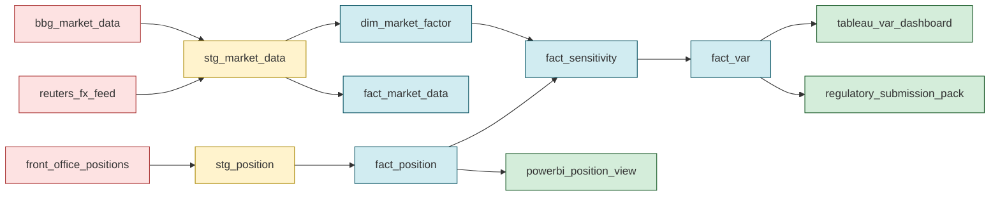

# Module 16 — Data Lineage & Auditability

!!! abstract "Module Goal"
    *"How was this number calculated?"* is the question that ends data-engineering careers — not because it is hard to answer in principle, but because the warehouse that cannot answer it on demand is the warehouse whose numbers cannot be defended in front of the regulator. Lineage is the engineering discipline that makes the answer reproducible: every reported figure traceable to its inputs, every transformation traceable to the code (and the code-version) that produced it, every restated history queryable as it was known on the day. Module 13 (bitemporality) gave you "what the data was at a point in time"; Module 15 (data quality) gave you "the data passed its checks"; Module 16 is the third leg — *"the data flowed through these transformations, in this version, to produce that number"* — that completes the audit-grade trio. BCBS 239 made lineage non-negotiable for systemically important banks; the rest of the industry has followed, and the BI engineer arriving in Phase 5 inherits both the regulatory framing and the daily operational discipline.

---

## 1. Learning objectives

By the end of this module, you should be able to:

- **Distinguish** column-level from table-level lineage, and decide which question each one is fit to answer — impact analysis at the table grain, root-cause and "which inputs touched this output column" at the column grain.
- **Choose** between parsing-based and log-based lineage capture for a given pipeline, and recognise that a hybrid (parse the dbt project, log the BI consumption layer) is the production-typical answer.
- **Map** the data-relevant BCBS 239 principles (P3, P7, P9, P11) to concrete data-engineering practices — bitemporal storage, source-system tagging, pipeline-run tracking, code-version stamping, scheduled DQ — and articulate which practice supports which principle.
- **Reproduce** a past report exactly as it appeared on a past as-of by combining the bitemporal storage layer of Module 13 with the lineage-and-versioning discipline of Module 16.
- **Implement** the operational lineage scaffolding (`source_system_sk`, `pipeline_run_id`, `code_version`) on a new fact table, and explain why these three columns are the difference between "we believe we can reproduce the report" and "we can demonstrate the reproduction by query."
- **Evaluate** the lineage-tooling landscape — open-source (OpenLineage, Marquez, Datahub, Amundsen), commercial (Atlan, Collibra, Alation, Informatica), cloud-native (Glue, GCP Data Catalog, Purview), and embedded (dbt exposures + dbt-docs) — and recognise the strengths and limits of each class without endorsing any one product.

## 2. Why this matters

The single sentence that catalyses every lineage programme is the auditor's question: *"How was this number calculated?"* In a small warehouse with a single feed, a single transformation, and a single dashboard, the question has a five-minute answer that fits in a Slack message. In a production market-risk warehouse with fifty feeds, three hundred fact and dim tables, two thousand dbt models, four BI layers, and a dozen ad-hoc reporting paths, the question has *no* answer unless someone has built one — deliberately, as a first-class artefact of the warehouse. The warehouse without lineage cannot defend its numbers; the warehouse with lineage can answer the auditor's question by query, in minutes, against the same fact tables every other consumer reads from. Module 16 is the discipline that turns the answer from a forensic exercise into a parameterised SQL query.

The regulatory framing makes the discipline non-optional for the systemically important banks and increasingly non-optional for the rest. BCBS 239 — *Principles for effective risk data aggregation and risk reporting* — names lineage explicitly: Principle 9 (Clarity and usefulness) requires risk reports to be "supported by data of clear provenance," and Principles 3, 7, and 11 each impose duties that depend on a working lineage layer. National regulators have followed suit (the PRA's SS1/23 in the UK, the Fed's SR 11-7 model-risk guidance in the US, the EBA's risk-data quality reviews in the EU). A bank that cannot demonstrate lineage on demand fails its annual data-quality review; a bank whose lineage exists only as a Visio diagram on a SharePoint folder fails it slightly later. The data team's job is to build the lineage layer that converts "we believe the data flowed through these transformations" into "we can demonstrate the flow, by query, against any past as-of."

The practitioner reframing is more concrete and usually more motivating than the regulatory one. After this module, the BI engineer should approach every fact table the warehouse exposes with the same three-question reflex. *Which source systems contributed rows to this fact?* *Which pipeline run produced each row, and what code-version did that run execute?* *Which downstream artefacts — dim refreshes, derived facts, BI dashboards, regulatory submissions — depend on this fact, and would notice if it changed?* The questions are answerable from the lineage layer; the answers are the *contract* the warehouse offers its consumers. The contract's value is invisible while it is honoured (the warehouse just works) and conspicuous when it is not (the auditor asks a question; the team spends two weeks reconstructing the answer from log files and Confluence pages). The module's load-bearing claim is that the cost of building the contract — three extra columns on every fact, an OpenLineage-or-equivalent emitter on every transformation, a lineage table the BI tool reads from — is small relative to the cost of *not* having it, and the smaller it is built, the larger the discipline it enables.

A combined framing for Phase 5. Module 13 gave you bitemporality (what the data *was*). Module 15 gave you data quality (the data *passed its checks*). Module 16 gives you lineage (how the data *got there*). The three together are the audit-grade triple that makes the warehouse defensible: any past report is reproducible (M13), the inputs were quality-policed (M15), and the transformations are traceable (M16). Removing any one leaves the other two unable to answer the auditor's question alone. The triple is the *minimum viable foundation* for a regulated risk warehouse, and Phase 5 is the curriculum's deliberate sequencing of the foundation in three modules so the BI engineer learns each layer before being asked to combine them.

A useful figure to internalise on the daily texture of the lineage workload. A typical large-bank market-risk warehouse with ~50 source feeds, ~300 fact and dim tables, and ~2,000 dbt models will emit on the order of 5,000-15,000 lineage events per day from the orchestrated path, plus another 500-2,000 from the consumption side (ad-hoc queries, BI refreshes, exports). The audit trail accumulates at ~3-6 GB per year of header data; the deep-dive payload bodies add another ~30-60 GB per year if column-level lineage is captured comprehensively. The reproduction primitive of §3.4 is invoked roughly 10-30 times per quarter (a mix of audit deep-dives, internal validation drills, and incident root-cause investigations); the column-level impact-analysis query of Example 1 is invoked roughly 100-300 times per quarter (mostly for change-management blast-radius scoping). The figures vary by shop but the *order of magnitude* is stable; a team whose figures are dramatically off in either direction has either an under-instrumented warehouse (too few events) or a runaway emit pattern (too many) and should investigate.

## 3. Core concepts

A reading note. Section 3 walks the lineage story in seven sub-sections: the column-vs-table grain distinction (3.1), the parsing-vs-log capture trade-off (3.2), the BCBS 239 mapping to data-engineering practices (3.3), the reproducibility-as-bitemporality-plus-lineage synthesis (3.4), an overview of the tooling landscape (3.5), the operational lineage scaffolding columns every fact table should carry (3.6), and the audit-trail discipline that turns the scaffolding into a queryable artefact (3.7). Sections 3.4 and 3.6 are the load-bearing concepts; section 3.3 is the regulatory translation; section 3.5 is the survey of the market.

### 3.1 Column-level vs table-level lineage

Two grains of lineage are in common use, and the distinction is the most-cited source of confusion when a lineage programme starts. Both are useful; they answer different questions; a warehouse that captures only one is missing half the value.

**Table-level lineage** records which tables feed which tables. The graph node is a table; the edge is "this table's rows were loaded from these tables." A typical edge: `stg_market_data` is loaded from `vendor_market_data`. Cheap to maintain (a parse of the loader's SQL is enough; a single emit per transformation captures it), useful for the most common operational question — *impact analysis*: "I am about to drop a column from `vendor_market_data`; which downstream tables will break?" The answer is the transitive downstream closure of the edge graph, computed in seconds against a `lineage_edges` table. Table-level lineage is the right starting point for any lineage programme; it is enough to answer the impact-analysis question and the *coarse* "which inputs feed this output" question, and it is what every parsing-based lineage tool produces by default.

**Column-level lineage** records which columns feed which columns. The node is a `(table, column)` pair; the edge is "this column's values were derived from these source columns." A typical edge: `dim_market_factor.value` is derived from `stg_market_data.fx_rate`. More expensive to maintain (the parser must walk the SELECT list of every transformation and resolve each output column back to its source columns through the joins, the CTEs, and the subqueries), and the only grain at which the *focused* impact-analysis question can be answered: "the methodology team is changing the way we compute `fact_sensitivity.fx_delta_value`; which source columns affect this output, and which do not?" Table-level lineage says "everything in `fact_position`, `dim_market_factor`, `dim_book` could affect it"; column-level lineage says "specifically `fact_position.notional`, `dim_market_factor.value`, and the join keys that wire them together." The difference is the difference between scoping a methodology review to fifteen columns and scoping it to fifteen *tables* with hundreds of columns each.

A reference table that captures the trade-off:

| Grain         | Node                | Edge                                        | Cost to maintain                                   | Best for                                          |
| ------------- | ------------------- | ------------------------------------------- | -------------------------------------------------- | ------------------------------------------------- |
| Table-level   | a table             | "this table's rows came from these tables"  | Cheap; one parse per transformation                 | Impact analysis at table grain                    |
| Column-level  | a `(table, column)` | "this column's values came from these columns" | Expensive; full SQL parsing or instrumentation     | "Which source columns affect this output column?" |

A practitioner observation. The right answer for most warehouses is **table-level lineage on every transformation, column-level lineage on the critical-path facts**. Building column-level lineage everywhere is achievable but expensive; building it on `fact_var`, `fact_sensitivity`, `fact_pnl`, `fact_position`, and the dim tables that wire them is achievable and high-value. The pragmatic discipline is to start at table-level, use the resulting graph for impact analysis, and *promote* the critical-path subgraph to column-level once the table-level layer is bedded in. A team that tries to build column-level everywhere on day one almost never finishes; a team that starts at table-level and promotes selectively almost always does.

A second observation, on what column-level lineage *does not* tell you. Column-level lineage records that `fact_sensitivity.fx_delta_value` derives from `fact_position.notional` and `dim_market_factor.value`. It does *not* record the *transformation function* — the multiplication, the unit conversion, the optional CASE that handles the FX-perturbation sign convention. The transformation function lives in the code (the dbt model, the Spark job, the stored procedure), and the lineage edge points to the code-version, not the function itself. A consumer who wants to know "what arithmetic produced this value?" follows the edge to the code-version, then reads the code at that version. The discipline is to ensure the code-version is queryable, immutable, and resolvable to a git SHA — section 3.6 returns to this.

A third observation, on the *direction* of the lineage question. Lineage edges are stored once and queried in two directions: *downstream* ("what does this column affect?" — the impact-analysis question of Example 1) and *upstream* ("what affects this column?" — the root-cause question that fires when a published number is wrong). The same edge table answers both with a transitive closure that walks the graph in the chosen direction. A team that has built only the downstream traversal and discovers the upstream question during an incident — "the dashboard shows a wrong VaR; which inputs could have caused it?" — finds itself writing the inverse query under time pressure. The right discipline is to expose both traversals as named SQL functions or as views in the warehouse from day one; the cost is a few hours, the value is the diagnostic speed during the next incident.

A fourth observation, on the *granularity-vs-coverage* trade-off when the team has limited engineering time. A small team facing a BCBS 239 deadline can usually achieve one of two outcomes: *table-level lineage with full coverage* (every table in the warehouse, every consumption layer, the full graph) or *column-level lineage with partial coverage* (the critical-path facts, depth two or three upstream, no consumption layer). Both are defensible answers to the auditor; the wrong answer is *column-level on a subset with no statement of what is and is not covered*. The auditor's question of last resort is "what is the scope of this lineage?" — a clean answer ("table-level, all warehouse objects, all dispatched dashboards") beats a hedged one ("column-level, the eight critical facts, but we have not measured what is missing"). Pick the outcome the team can *defend the boundary of* and write the boundary into the data dictionary.

### 3.2 Parsing-based vs log-based capture

How does the lineage edge get into the lineage table in the first place? Two mechanisms dominate, and the choice between them — or rather, the *combination* of the two — is the operational design decision the lineage programme has to make.

**Parsing-based capture.** The lineage emitter reads the SQL of every transformation (every dbt model, every stored procedure, every Spark SQL job) at *deploy time*, parses each SELECT statement, and emits an edge per (source table, target table) pair (or per source-column → target-column pair, for column-level lineage). The output is a static lineage graph that reflects the *code* the warehouse intends to execute. Tools: dbt's built-in dependency parser, sqllineage, sqlglot, sqlfluff, dbt-docs's lineage view. *Strengths*: complete coverage of the code base by construction (every model in the dbt project is parsed); deterministic (the same code always produces the same graph); cheap to run (one parse per deploy, not one per execution). *Weaknesses*: blind to dynamic SQL (a stored procedure that constructs its SELECT at runtime cannot be parsed); blind to ad-hoc queries (the analyst who runs a one-off `INSERT INTO fact_x SELECT ... FROM y` outside the dbt project produces a lineage edge the parser never sees); blind to BI-tool joins (the Tableau dashboard that joins two warehouse views into a derived field invents a relationship the parser cannot recover from the warehouse SQL).

**Log-based capture.** The lineage emitter sits on the *execution path* — the database query log, the engine's instrumentation hook, an OpenLineage adapter wired into the orchestrator. Every executed query produces an event with the inputs read, the outputs written, and the runtime metadata (run_id, code_version, start/end timestamps). The events accumulate into a lineage graph that reflects the *actual execution history* of the warehouse. Tools: OpenLineage (with adapters for Airflow, Spark, dbt, Snowflake, BigQuery), Marquez, Datahub's execution-time integrations, vendor-native query history (Snowflake `query_history`, BigQuery `INFORMATION_SCHEMA.JOBS`, Databricks audit log). *Strengths*: catches *every* execution including dynamic SQL, ad-hoc queries, and BI-tool reads; pairs naturally with `pipeline_run_id` for run-level traceability; reflects what the warehouse *actually did*, not what the code intended. *Weaknesses*: requires every execution path to emit events (a Spark job without the OpenLineage adapter is invisible; a stored procedure on an unsupported engine is invisible); produces a noisy graph (every ad-hoc SELECT becomes an edge, and the graph needs filtering before it is consumable); lags the deploy by however long the first execution takes.

A reference table:

| Capture        | Source of truth        | Strengths                                              | Weaknesses                                              | Typical home                          |
| -------------- | ---------------------- | ------------------------------------------------------ | ------------------------------------------------------- | ------------------------------------- |
| Parsing-based  | The transformation code | Complete by construction; deterministic; cheap         | Blind to dynamic SQL, ad-hoc queries, BI-tool joins      | dbt projects, stored-procedure layer  |
| Log-based      | The execution log       | Catches every execution; pairs with run_id; honest      | Needs adapters everywhere; noisy; lags first execution   | BI consumption layer, ad-hoc queries  |

The production-typical answer is **hybrid**: parsing-based capture for the data-engineering layer (the dbt project, the orchestrated transformations), log-based capture for the consumption layer (BI tools, ad-hoc analysts, exploratory notebooks). The two layers' emitters write to the same `lineage_edges` table (or the same OpenLineage backend), and downstream consumers query the unified graph without caring which emitter populated each edge. A team that picks only parsing-based misses the BI consumption layer; a team that picks only log-based misses the deterministic, deploy-time guarantee that the data-engineering layer is wholly covered. The hybrid is more work to set up and dramatically more useful in operation.

A practitioner observation on the *gap* the hybrid still leaves. The pattern catches every dbt model and every executed query, but it does *not* catch the spreadsheet that an analyst built by exporting a CSV from Tableau, joining it to another CSV, and emailing the result to a desk-head. That spreadsheet's lineage is invisible to the warehouse — and the spreadsheet is, increasingly often, the artefact the auditor cites. The discipline that closes this gap is *organisational*: the warehouse offers a sanctioned export mechanism that emits a lineage event ("user X exported view V at as-of T"), and the bank's data-governance policy disallows ad-hoc exports outside the sanctioned mechanism. The technical layer is a one-line emit; the policy layer is the much harder piece of the work, and it is the one most lineage programmes underinvest in.

A second observation, on the *signal-to-noise* characteristics of each capture. Parsing-based lineage is *deterministic but coarse* — it records every relationship the code intends, including ones that almost never fire (a CASE branch that handles a corner case, a join that triggers only on a specific business_date). Log-based lineage is *honest but cluttered* — it records every executed relationship, including the analyst's typo, the abandoned exploratory query, and the orchestrator's retry that re-emitted the same edge ten times. The consumer-side discipline for both is *filtering*: parsing-based output is filtered by relevance (drop edges to deprecated tables, drop edges to internal scratch schemas), log-based output is filtered by frequency (an edge that fires once in a year of logs is probably a typo, an edge that fires every night is probably a real dependency). The filtering rules live alongside the `lineage_edges` table as a small set of curated views; the warehouse exposes the *filtered* graph to consumers and reserves the *raw* graph for diagnostic deep-dives.

A third observation worth flagging for any team about to wire up log-based capture: the OpenLineage events the engine emits are *typically* triggered by the orchestrator (an Airflow operator, a dbt run hook, a Spark listener), not by the engine itself. The implication is subtle: a query that bypasses the orchestrator — an analyst running `INSERT INTO ... SELECT ...` directly against the warehouse from a SQL workbench — does not emit an OpenLineage event, even though the query log records the SQL. The warehouse-side query-log scrape is the safety net for these cases, and the OpenLineage events from the orchestrator are the *primary* signal for orchestrated work. A team that wires up OpenLineage from the orchestrator and forgets the query-log scrape has a lineage layer that *believes* it covers everything but in fact silently misses the analyst-driven path. The diagnostic test: pick a recent ad-hoc query the team knows about, search for it in the lineage events, and confirm both the orchestrator emit (absent) and the query-log scrape (present, after a delay). If only one is present, the gap is real and the team needs to plug it before the auditor finds it.

### 3.3 What auditors and regulators expect — BCBS 239 mapped to engineering practice

The Basel Committee's *Principles for effective risk data aggregation and risk reporting* — usually shortened to BCBS 239 — is the international standard that tells globally systemically important banks (G-SIBs) and, increasingly, large domestic banks (D-SIBs) what their risk-data layer must look like. The standard names fourteen principles, of which seven are technical (the rest are governance and supervisory expectations). For the BI/data engineer the most-cited four are P3, P7, P9, and P11; the others (P5 timeliness, P6 adaptability, P8 comprehensiveness) are equally binding but typically treated by the orchestration and architecture layers (Modules 17 and 18) rather than by the lineage layer.

**Principle 3 — Accuracy and integrity.** "Risk data should be accurate and reliable." The engineering reading: the warehouse's reported numbers reconcile to authoritative sources, and the reconciliation is documented and queryable. The *lineage* contribution: every reported number is traceable to its inputs, and each input is traceable to the source system that produced it. Without lineage, "accurate" is an assertion; with lineage, it is a queryable property. The supporting practices: source-vs-warehouse reconciliation (Module 15 §3.2), `source_system_sk` on every fact row (Module 16 §3.6), and the ability to replay any reported number from its inputs at the original as-of (the bitemporal-plus-lineage synthesis of §3.4).

**Principle 7 — Accuracy of reports.** "Risk management reports should accurately and precisely convey aggregated risk data and reflect risk in an exact manner." The engineering reading: the report shows what it claims to show — no silent restatements, no arithmetic errors that survived the pipeline, no aggregation that hides additivity violations (Module 12), no signing convention that flipped between fact and dashboard (Module 21 anti-pattern). The *lineage* contribution: every reported number carries its as-of, its code-version, and a reference to the inputs that produced it. The supporting practices: the bitemporal storage of Module 13, the code-version stamping of §3.6, and the dispatch-note discipline that records on every published report the as-of, the code-version, and the lineage hash of the underlying data.

**Principle 9 — Clarity and usefulness.** "Risk management reports should communicate information in a clear and concise manner." The engineering reading that matters to the data team: reports are *self-documenting* with respect to their data provenance — a consumer looking at a number on a dashboard can answer "where did this come from?" without engaging the data team. The *lineage* contribution: the lineage graph is a queryable artefact the consumer (or the consumer's tool) can reach into. The supporting practices: the BI tool surfaces the lineage path on every visualisation (most modern BI tools — Tableau, Power BI, Looker — support this if the lineage emitter is wired in); the data dictionary links every column in every reportable view to its lineage upstream; the runbook for every Tier 1 dispatch records the lineage of the dispatched number.

**Principle 11 — Distribution.** "Risk management reports should be distributed to the relevant parties while ensuring confidentiality is maintained." The engineering reading: the right data goes to the right people at the right time, and the distribution is auditable. The *lineage* contribution: the lineage layer extends *beyond* the warehouse into the consumption layer — every dashboard view, every CSV export, every regulatory submission, every email-attached report carries an edge in the lineage graph that records when it was produced and who consumed it. The supporting practices: the log-based capture of §3.2 wired into the BI tool and the export mechanism, the access-control layer integrated with the lineage emitter so each consumption event records the consumer, and the retention policy that keeps the consumption-side lineage events for the regulator-mandated duration (typically seven years for risk reports in most jurisdictions).

A reference table that maps each principle to the specific data-engineering practices the warehouse should be running:

| BCBS 239 principle              | Engineering practice that supports it                                            |
| ------------------------------- | -------------------------------------------------------------------------------- |
| P3 — Accuracy and integrity     | Source-vs-warehouse reconciliation, `source_system_sk` on every fact, daily ties |
| P5 — Timeliness                 | SLA-aware orchestration, freshness dashboards, late-arriving-data policy         |
| P6 — Adaptability               | Bitemporal storage (M13), parameterised queries, ad-hoc-friendly schema          |
| P7 — Accuracy of reports        | Bitemporal storage, code-version stamping, dispatch-note discipline              |
| P8 — Comprehensiveness          | Coverage matrix of fact tables vs risk taxonomy, completeness checks (M15)       |
| P9 — Clarity and usefulness     | Lineage graph queryable from BI, data dictionary, lineage-path visibility         |
| P11 — Distribution              | Log-based lineage on the consumption layer, access-controlled emit, retention    |

A practitioner observation on *audit translation*. The supervisor does not arrive with a checklist that says "show me your `lineage_edges` table." The supervisor arrives with a question — "show me how you produced the firmwide VaR for 2024-12-31" — and judges the bank by the quality of the answer. The lineage layer is the *mechanism* by which the answer is produced; the supervisor's evaluation is whether the mechanism is repeatable, governed, and complete. A bank that can produce the answer in a five-minute parameterised query passes; a bank that needs two weeks of forensic reconstruction fails, even if the underlying data was correct all along.

A second observation on the *governance overlay*. BCBS 239 names eleven principles about the data layer and three further principles about the supervisory expectations on senior management; the data-engineering practices in the table above only address the first eleven. The remaining three (P12 review, P13 remediation, P14 supervisory cooperation) are governance duties that the data team supports rather than owns: the team produces the *evidence* that the practices are in place (the `lineage_edges` table, the bitemporal facts, the freshness dashboards), and the governance function packages the evidence into the supervisory submission. The practical implication for the BI engineer is that *every* artefact the team builds — every dashboard, every reconciliation report, every lineage view — is potentially evidence the governance function will pull into a supervisory pack, and the artefacts should be designed with that future use in mind (named clearly, queryable on a stable schema, retained for the regulator-mandated duration). A team that treats its dashboards as ephemeral (rebuilt every quarter, schema churns freely, old versions discarded) produces evidence that is hard to package; a team that treats them as long-lived artefacts produces evidence that the governance function can pull into the pack with minimal translation.

A third observation, on the *materiality threshold* the regulator applies. BCBS 239 explicitly applies to G-SIBs and D-SIBs; smaller banks are subject to lighter expectations and, in many jurisdictions, no formal BCBS 239 review at all. The temptation for a smaller bank is to defer the lineage investment until the bank grows into the regulatory category. The empirical pattern is that retro-fitting lineage into a mature warehouse is dramatically more expensive than building it in from the start; a smaller bank that defers the discipline pays the cost twice over when it eventually graduates. The pragmatic recommendation for any new market-risk warehouse, regardless of the bank's regulatory category: build the row-level scaffolding (`source_system_sk`, `pipeline_run_id`, `code_version`) into every fact from day one, capture lineage edges from the dbt project from day one, and treat the audit trail as a first-class fact table from day one. The incremental cost during build is small; the saved retro-fit cost during the eventual graduation is large.

### 3.4 Reproducibility = bitemporality + lineage

The single most important sentence in this module. *Bitemporal storage tells you what the data WAS at a point in time; lineage tells you what TRANSFORMED the data; together, any past report can be reproduced exactly.* Each layer alone is incomplete: bitemporality without lineage gives you the *inputs* at the as-of but not the *transformation* that produced the output; lineage without bitemporality gives you the transformation but cannot reach back to the inputs as they were known on the day. The two layers are complementary — neither is sufficient on its own, both together are a complete reproduction primitive — and the audit-grade warehouse builds both deliberately.

A worked reproduction. The auditor asks: *"What did `fact_var` look like for book `EQUITY_DERIVS_NY` on 2024-03-31, as the firm knew it on 2024-04-15?"* The reproduction proceeds in three steps:

1. **Identify the code-version** that produced the report on 2024-04-15. Query the lineage layer's history table: the edge `fact_var → tableau_var_dashboard` for `book = EQUITY_DERIVS_NY, business_date = 2024-03-31` carries `captured_at = 2024-04-15 ..., code_version = git:f7a3c92`. The reported number was produced by the code at git SHA `f7a3c92`.
2. **Reconstruct the inputs at the as-of**. For each input table the lineage edge points to (`fact_position`, `fact_sensitivity`, `dim_market_factor`, `dim_book`), run a bitemporal query parameterised by `business_date = 2024-03-31, as_of_timestamp <= 2024-04-15 17:00`. The result is the *exact* set of input rows the code at `git:f7a3c92` saw on 2024-04-15.
3. **Replay the transformation**. Check out the code at `git:f7a3c92`, run it against the bitemporal-restricted inputs from step 2, and compare the output to the originally reported number. They should agree to floating-point precision.

Each step depends on a different layer. Step 1 depends on the lineage layer (the edges, the captured_at timestamps, the code_version stamps). Step 2 depends on the bitemporal layer (the as-of-cut-off query). Step 3 depends on both — the code-version comes from lineage, the input rows come from bitemporality, and the replay's correctness validates that both layers were captured faithfully. The reproduction is not a forensic exercise; it is a parameterised query plus a `git checkout`, achievable in under an hour against a well-built warehouse and impossible against a poorly-built one.

A practitioner observation on the *floor* this synthesis sets. A team that builds bitemporality without lineage can answer "what were the inputs on the day?" but cannot answer "what arithmetic did we do to them?" — and the auditor's question almost always demands both. A team that builds lineage without bitemporality can answer "what code ran?" but cannot answer "what data did it see?" — and the auditor's question is again unanswerable. Both layers together is the floor for an audit-grade warehouse; either layer alone is technically interesting but operationally insufficient. The Phase 5 sequencing is deliberate: M13 builds bitemporality, M15 builds the quality-policing that makes the inputs trustworthy, M16 builds the lineage that ties the two together into a reproduction primitive.

A second observation on *how the reproduction is consumed in practice*. The auditor rarely asks for the full reproduction up front; the auditor asks for the *number*, and the warehouse responds with the number plus its provenance (the as-of, the code-version, a link to the lineage path). The auditor accepts the number on its provenance, and the reproduction is run only when the auditor wants a specific deep dive. The reproduction primitive's value is that it *exists* — the warehouse can produce it on demand — not that it is run on every reported number. A team that internalises this stops worrying that the lineage layer is "overkill for what we actually need" and starts treating it as the *insurance* it is: rarely invoked, very expensive to lack when needed.

A third observation on *partial reproduction*. The full three-step reproduction above (locate the code-version, reconstruct the inputs, replay the transformation) is the gold standard, but it is expensive — checking out an old code-version requires a clean dev environment with the dependencies as they existed at the time, which can be non-trivial for a code-base that has evolved its dependency stack across years. A *partial* reproduction that runs the first two steps and stops short of the replay still satisfies most auditor questions: the team produces the bitemporal-restricted inputs, asserts that the code-version recorded in the lineage event is the version that ran, and points the auditor at the git history for the code itself. The auditor accepts the partial reproduction in most cases; the full replay is reserved for the rare deep-dive where the auditor wants byte-for-byte reproduction of the published number. The team should be *capable* of the full replay (so the rare case is achievable) but should expect to invoke the *partial* reproduction routinely.

A fourth observation on the *order in which the layers fail*. When a reproduction attempt fails, it almost always fails at one of three places, and the failure mode is diagnostic of which layer needs investment. *Bitemporal failure*: the inputs as queried do not match the inputs the code-version saw on the day, because a fact table was overwritten in place rather than restated bitemporally — Module 13 discipline gap. *Lineage failure*: the code-version recorded in the lineage event no longer exists in git, because a force-push or a branch deletion removed it — Module 16 discipline gap, specifically around the immutability of the code-version reference. *Replay failure*: both layers are intact but the code at the recorded version no longer runs against the recorded inputs because the runtime (the dbt version, the warehouse's SQL dialect, the engine's behaviour around NULLs) has shifted — a deeper engineering-hygiene gap that the team needs to address through containerised replay environments or through documented runtime version pinning. A team that runs a few reproduction drills per year — synthetically, against historical numbers known to be correct — surfaces these failure modes before the auditor does, and converts each one into a discipline improvement rather than an audit finding.

### 3.5 The lineage tooling landscape — a survey, not an endorsement

A short tour of the tools that the BI engineer will encounter when building or operating a lineage layer. The intent is overview, not endorsement; tools change rapidly and the right choice for a shop depends on the engine mix, the budget, and the existing platform investments more than on the tools' intrinsic merits.

**Open-source.** *OpenLineage* is the cross-engine specification for execution-time lineage events; it has adapters for Airflow, Spark, dbt, Snowflake, BigQuery, Trino, and Flink, and it writes to a backend that stores the events. *Marquez* is the reference OpenLineage backend, providing storage and a small UI for the graph. *Datahub* is a fuller catalogue product (LinkedIn's open-source contribution) that combines lineage, search, ownership, and governance metadata; it consumes OpenLineage events and several proprietary feeds. *Amundsen* is Lyft's catalogue (similar shape to Datahub, narrower scope) that includes lineage as a first-class feature. The open-source stack is the right starting point for a team that wants to experiment, build incrementally, and avoid vendor lock-in; it is also the stack the regulator increasingly recognises as the industry baseline.

**Commercial.** *Atlan*, *Collibra*, *Alation*, and *Informatica* are the established commercial catalogue products, each with lineage as a major feature. They differ in price, in the breadth of connectors, in the depth of governance features (workflow, approvals, ownership), and in the maturity of their column-level lineage. The commercial products' value proposition over the open-source stack is *time-to-value*: a commercial deployment can be in production in weeks where an open-source stack might take months to bed in. The trade-off is cost (six- to seven-figure annual licences are typical for a large bank) and the dependency on the vendor's roadmap for new connectors.

**Cloud-native.** Each major cloud vendor offers a native catalogue: *AWS Glue Data Catalog* (with lineage in Glue Studio and increasingly via OpenLineage), *GCP Data Catalog* (recently rebranded as Dataplex Catalog, with lineage capture from Dataform and BigQuery), and *Azure Purview* (with lineage capture from Synapse, Data Factory, and Power BI). The cloud-native products are the path of least friction for a shop already committed to a single cloud; the trade-off is reduced portability and, occasionally, less depth than the dedicated catalogue products.

**Embedded.** *dbt's exposures + dbt-docs* is the lightest-weight lineage option — and is, for many warehouses, *enough*. dbt parses every model in the project at compile time, builds a table-level dependency graph, and renders it in dbt-docs as a navigable lineage view. The exposures feature lets the warehouse declare downstream consumers (a Tableau dashboard, a regulatory submission) as first-class nodes, extending the graph beyond the warehouse boundary. A dbt-only warehouse with disciplined exposures coverage produces a lineage layer that satisfies BCBS 239's table-level expectations at near-zero incremental cost.

A reference table organising the four classes:

| Class           | Examples                                          | Cost              | Strengths                                      |
| --------------- | ------------------------------------------------- | ----------------- | ---------------------------------------------- |
| Open-source     | OpenLineage, Marquez, Datahub, Amundsen          | Engineering time  | Vendor-neutral, extensible, increasingly capable |
| Commercial      | Atlan, Collibra, Alation, Informatica            | High licence      | Time-to-value, governance breadth, support     |
| Cloud-native    | AWS Glue Catalog, GCP Dataplex, Azure Purview    | Cloud spend       | Native integration with the cloud's data tools  |
| Embedded        | dbt exposures + dbt-docs, Spline, Marquez-via-dbt | Minimal           | Zero-friction for dbt-only or dbt-dominant shops |

A practitioner observation on *tool selection*. The right lineage tool for a given warehouse is overwhelmingly determined by the *engine mix* and the *existing platform*. A pure-dbt-on-Snowflake warehouse should start with dbt-docs + dbt exposures, layer in OpenLineage events from Snowflake's query log when the consumption-side gap becomes painful, and only consider a commercial catalogue if the governance workflow features (approvals, ownership, certification) become load-bearing. A polyglot warehouse with dbt + Spark + ad-hoc SQL + Tableau + Power BI is a very different proposition; the open-source OpenLineage + Marquez stack or one of the commercial catalogues is the realistic path. The wrong move is to pick the tool first and then design the lineage capture to fit it; the right move is to enumerate the engines, the consumption layers, and the regulatory expectations, then pick the tool that covers the union with the least operational overhead.

### 3.6 Operational lineage — the three columns every fact should carry

The lineage layer is not only edges in a graph; it is also *columns on every fact row* that record the provenance of each individual row. Three columns are load-bearing for an audit-grade fact table; a warehouse that omits them is a warehouse whose lineage stops at the table level and cannot reach down to the row level when the auditor's question is row-specific.

**`source_system_sk`.** A foreign key into a `dim_source_system` dimension that records every system the warehouse ingests data from. Each fact row carries the surrogate key of the system that produced it. The dimension records the system name, the system owner (the team accountable for the source data), the system's authoritative status (is it the source-of-truth for this data domain or a downstream consumer?), and the SLA for the feed. The reason this column matters at the row grain rather than the table grain: a single fact table often consolidates data from multiple sources (`fact_position` may contain rows from the front-office system, the prime broker file, the OTC-confirmation system, and an internal manual-adjustment table), and the reconciliation question — *"which of my position rows came from the prime broker?"* — is unanswerable without the column. Every fact in a regulated risk warehouse should carry it; the cost is one BIGINT per row, and the value is the queryability of every accuracy and reconciliation question that depends on knowing the source.

**`pipeline_run_id`.** A foreign key (or a UUID) that identifies the orchestrated execution that loaded the row. Every nightly batch, every intra-day refresh, every backfill is a *run* with a unique identifier; every row the run inserts carries that identifier. The supporting `dim_pipeline_run` dimension records the run's start and end timestamps, the orchestrator (Airflow DAG run, Dagster run, dbt invocation), the status (succeeded, failed, partial), the operator who triggered it (cron, manual, retry), and the upstream feed cut-off timestamps the run respected. The column makes "which rows landed in this run?" queryable, and — critically — it is the join key the lineage layer uses to associate a row with the *event* the lineage emitter produced for the run. Without `pipeline_run_id`, the lineage events float free of the rows they describe; with it, the lineage is row-resolvable.

**`code_version`.** The git SHA (or equivalent immutable identifier) of the transformation code that produced the row. The column makes "which version of the code produced this row?" queryable, and — combined with `pipeline_run_id` — completes the row-level provenance triple (system + run + code). A row whose `code_version = git:f7a3c92` was produced by the code as it existed at that SHA; the code as it exists today (or as it existed yesterday) may produce a different value from the same inputs. The column is what makes "show me the report on a past date" actually feasible by query: the lineage layer points at the code-version, the warehouse checks out that version of the code, and the replay of the transformation against the bitemporal-restricted inputs reproduces the original number. Without the column, the replay is impossible — there is no way to know which version of the code to check out.

A reference table:

| Column            | Type           | Records                                                    | Why row-level                                              |
| ----------------- | -------------- | ---------------------------------------------------------- | ---------------------------------------------------------- |
| `source_system_sk`| BIGINT FK      | Which source system produced this row                      | A fact often consolidates multiple sources                  |
| `pipeline_run_id` | UUID / BIGINT  | Which orchestrated execution loaded this row                | Lineage events join to runs, not to rows directly          |
| `code_version`    | VARCHAR (SHA)  | Which version of the transformation code produced this row | Reproduction requires checking out the right code-version  |

A practitioner observation on *retro-fitting*. Adding the three columns to a *new* fact table is trivial — the loader populates them at insert time, the schema gains three columns, and the operational discipline is in place from day one. Retro-fitting them onto an *existing* fact table is harder; historical rows have no `source_system_sk` (the warehouse has lost the information), no `pipeline_run_id` (the original run is gone), no `code_version` (the git SHA from years ago may or may not still be reachable). The right pattern for retro-fitting is a one-off migration that populates the columns with `unknown` (or a sentinel value) for historical rows and applies the discipline going forward. The migration documents itself: "rows before the migration date have unresolvable lineage; rows after the migration date have full lineage." The auditor will accept the gap if the team can demonstrate the discipline going forward and the gap is bounded; the auditor will not accept "we never bothered." The lesson for new warehouses is to build the three columns into the schema from day one and avoid the retro-fit altogether.

### 3.7 Audit trails — turning the scaffolding into a queryable artefact

The three operational columns of §3.6 capture the *row-level* provenance; the lineage edges of §3.1 capture the *graph* of dependencies. The third leg is the **audit trail** — a queryable history of *every* lineage event the warehouse has emitted, retained for the regulator-mandated duration, and cross-indexed against the bitemporal layer. The audit trail is what the auditor's deep-dive questions ultimately read from; it is the artefact the reproduction primitive of §3.4 walks across.

The audit trail is itself a fact table — typically called `fact_lineage_event` or `audit_trail` — with columns: `event_id` (UUID), `event_timestamp` (TIMESTAMP, when the lineage emitter recorded the event), `event_type` (enum: load, transform, dispatch, export), `source_table` (VARCHAR, the input), `target_table` (VARCHAR, the output), `source_columns` (ARRAY/JSON, optional, for column-level events), `target_columns` (ARRAY/JSON, optional), `pipeline_run_id` (FK to `dim_pipeline_run`), `code_version` (VARCHAR, git SHA), `operator` (VARCHAR, who or what triggered the event), and `payload` (JSONB, the full OpenLineage event for replay). The table is append-only — events are never deleted, never updated — and lives bitemporally with the rest of the warehouse (Module 13's pattern applies here too: the table records *when the event happened* and *when the warehouse came to know about it*, which is occasionally not the same instant for events that arrive late from external systems).

A practitioner observation on *retention*. The regulator-mandated retention for risk-reporting audit trails varies by jurisdiction and by data class, but seven years is a safe upper bound for most market-risk artefacts in major jurisdictions (FFIEC, EBA, FSA in Japan, APRA in Australia all converge near this figure). The audit trail's storage cost is *small* relative to the underlying fact data — a lineage event is a few hundred bytes, and even a busy warehouse emits at most a few million events per day — but the cost compounds across years and the warehouse should plan for it. A typical large-bank warehouse retains the full audit trail in *hot* storage for the most recent 18-24 months and tiers older events to cheaper *archive* storage (S3 Glacier, Snowflake's long-term storage, BigQuery's long-term storage pricing) with a documented restoration SLA. The discipline is the same as for any regulatory retention: define the policy, automate the tiering, document the restoration procedure, and rehearse it quarterly so the team can hit the SLA when the audit deep-dive arrives.

A second observation on *trust*. The audit trail's value is its *trustworthiness* — the regulator's confidence that the events in the table are authentic, complete, and tamper-evident. Three practices support this trust: (a) the audit trail is written by the lineage emitter directly, not by a downstream copy (the further the events travel before being persisted, the more places they can be tampered with or lost); (b) the audit trail's writer has *append-only* permissions — even a privileged DBA cannot UPDATE or DELETE rows without leaving an evidence trail (most modern warehouses support this through column-level permissions or through a write-only role); (c) the audit trail is cross-indexed against the bitemporal layer, so a tampering attempt that removed events but left the underlying facts intact would produce a queryable inconsistency. The discipline is paranoid by design — the auditor's question of last resort is "could this audit trail have been tampered with?" — and the warehouse that builds the discipline up front does not have to defend the discipline retroactively.

A third observation on *event payload size*. The OpenLineage event payload can be small (a few hundred bytes for a minimal table-level edge with no facets) or large (a few kilobytes if the event carries column-level lineage, schema facets, statistics, and parent-run links). Payload size matters at scale: a busy warehouse emitting tens of thousands of events per day with full payloads accumulates rapidly into hundreds of GB per year of *event* storage, separate from the underlying fact storage. The pragmatic discipline is to *split* the payload into a small *header* (event_id, timestamp, type, source, target, code_version, run_id — fixed-width, indexed, queried frequently) and a separate *body* (the JSON payload with facets, schema, statistics — wide, queried rarely). The header lives in a hot, queryable table; the body lives in a separate JSONB column or in object storage referenced by URI, queried only when a deep-dive needs the full event. The split lets the audit trail scale to the multi-year retention horizon without ballooning the warehouse's hot-storage cost.

### 3.8 Lineage at the consumption boundary

The lineage layer is most often built end-to-end *within* the warehouse — sources, stages, dims, facts, marts. The boundary that the warehouse-internal lineage cannot cross on its own is the *consumption* layer: the BI tool that reads from a mart view and renders a dashboard, the regulatory-submission engine that exports a fact slice into an XBRL filing, the analyst's notebook that pulls a CSV. Each consumption artefact is a *terminus* in the lineage graph that the warehouse can name but cannot fully describe; the consumer's own lineage layer (the BI tool's internal field-to-source mapping, the submission engine's input-to-output mapping) is what extends the chain to the end-user-visible artefact.

The right pattern for the consumption boundary is the **declarative exposure**: the warehouse declares each consumption artefact as a first-class node in the lineage graph, names its upstream warehouse objects, and accepts that the *internal* lineage of the consumption artefact lives in the consumer tool. dbt's `exposures` feature is the cleanest implementation of this pattern in the open-source ecosystem; the dbt project declares a `tableau_var_dashboard` exposure with `depends_on: [ref('fact_var')]`, and dbt-docs renders the exposure as a downstream node in the lineage view. The dashboard's *internal* lineage (which Tableau worksheets read which fields) lives in Tableau's own metadata API, queried separately and joined by the lineage backend if needed. Equivalent patterns exist in commercial catalogues (Atlan's "data products," Collibra's "downstream assets," Datahub's "downstream entities") and in OpenLineage (the consumer's `dataset` references in the run event).

A practitioner observation on *exposure coverage*. The exposure declaration is *manual*: someone has to write the exposure block when a new dashboard is built and update it when the dashboard's upstream changes. The discipline drifts the moment it stops being part of the dashboard-build workflow — the dashboard ships, the exposure does not get written, the lineage layer silently misses the artefact. The cure is to wire the exposure check into the deployment pipeline: a dbt project that ships a fact table marked `consumption_layer = TRUE` in its metadata cannot pass CI without at least one exposure pointing at it. The check is one small YAML rule and a CI assertion; the value is that exposure coverage stays at 100% by construction rather than degrading to 60% over a year of inattention.

A second observation on *cross-tool joins*. A common pattern in larger banks: the BI dashboard joins data from two warehouse views, and the join is *invented* in the BI tool — neither view in the warehouse is aware of the other. The lineage layer correctly records the dashboard as downstream of *both* views, but it does not record the *join key* the BI tool used. If the join key is wrong (a common bug — the BI analyst joins on `book_name` when the canonical key is `book_sk`, accidentally widening the result), the lineage layer cannot detect the bug; it only records the dependency. The cure is *outside* the lineage layer: the warehouse should expose joinable views with declared join keys (a dbt model that materialises the join correctly, with the exposure pointing at the materialised result), and the data-governance policy should disallow ad-hoc joins in the BI tool against fact-grain views. The lineage layer is a *witness* to the correct join, not a *guarantor*; the engineering discipline is to make the correct join the path of least resistance for the BI analyst.

### 3.9 Lineage SLOs and operational health

The lineage layer is itself a service the warehouse runs, with its own service-level objectives, its own monitoring, and its own failure modes. A team that builds a lineage layer and *does not* instrument its operational health discovers, during the next audit, that the layer was silently broken for three months and the recent reproduction queries are returning incomplete results. Three SLOs are load-bearing for an operational lineage layer.

**Coverage SLO.** The percentage of fact-table rows with a non-null `pipeline_run_id` and non-null `code_version`, and the percentage of fact tables with at least one inbound and one outbound edge in `lineage_edges`. Target: 100% on both. A coverage gap at the row level (fact rows with NULL `pipeline_run_id`) is a loader bug that needs urgent remediation; a coverage gap at the table level (fact tables with no edges) is a deploy-time emitter gap that needs the dbt project's exposures or the OpenLineage adapter wiring to be checked.

**Freshness SLO.** The maximum age of the most recent lineage event for each fact table. Target: less than (the table's load frequency + a small slack). A `fact_var` table loaded daily should have a lineage event within the last 24 hours plus an hour of slack; a freshness gap means the lineage emitter ran but failed to write, or the orchestrator ran the load without invoking the emitter. The freshness check fires as a Tier 2 DQ alert (Module 15 §3.4); it does not block EOD but is investigated within a business day.

**Reproducibility SLO.** The success rate of synthetic reproduction drills. The team picks a small set of historical reported numbers (say, the firmwide VaR for the last quarter-end of each of the last three years), runs the full reproduction primitive against each, and counts the fraction that reproduce within tolerance. Target: 100%; a drill that fails is a discovery that the lineage layer has a gap that real audit questions would also hit. The drill cadence is quarterly for most warehouses; the cost is a few engineer-days per quarter, the value is the early-warning signal on the layer's operational health.

A reference table:

| SLO              | Measure                                                | Target              | Failure response                                       |
| ---------------- | ------------------------------------------------------ | ------------------- | ------------------------------------------------------ |
| Coverage         | % rows / tables with non-null lineage scaffolding       | 100%                | Loader bug — urgent fix                                |
| Freshness        | Max age of most recent lineage event per table          | < load_freq + slack | Emitter gap — Tier 2 DQ alert                          |
| Reproducibility  | Synthetic-drill success rate                            | 100%                | Layer gap — engineering investment to close the gap     |

The three SLOs together are the *operational dashboard* the lineage team watches; the dashboard is the lineage analogue of the `dq_checks` registry of Module 15 §3.6. A team that runs both dashboards alongside each other has a cohesive operational view of the warehouse's audit-readiness.

### 3.10 Three lineage incidents — short narratives

Three short narratives drawn from common patterns in production market-risk warehouses. Each one is the kind of incident the lineage layer either prevents (when built well) or fails to prevent (when built carelessly), and the kind a BI engineer should expect to encounter at least once in a five-year career arc.

**Incident 1 — the silent column rename.** A dbt deploy on a Wednesday evening renames `fact_position.notional_usd` to `fact_position.notional_base_ccy_usd`, with a `view` shim left behind to preserve backward compatibility. The shim works; every downstream consumer continues to read the column under the old name; the deploy passes CI. Six months later, a developer cleaning up "dead code" deletes the shim view, citing zero hits in the warehouse's query log. The next morning, the Tableau dashboard that reads the (now-deleted) view fails to refresh; the desk-head's morning P&L review starts forty minutes late. The investigation discovers that Tableau's dashboard had a *cached extract* that was refreshed weekly rather than daily; the weekly refresh was a query the data team had never seen in the daily query log. The lineage layer would have caught the issue in two ways: (a) the exposure declaration for the dashboard pointed at the view, and the view's deletion would have failed the dependency check in CI; (b) the log-based capture from Tableau's metadata API would have shown weekly hits on the view. The team had built parsing-based lineage (which saw the view-to-dashboard edge through the exposure but had no enforcement at deploy time) and had skipped the BI-tool integration; the gap cost them forty minutes of dashboard downtime and a sharp conversation with the desk-head.

**Incident 2 — the methodology-change blast radius.** The risk-modelling team announces a change to the FX-volatility curve construction methodology, scheduled for the next quarter's release. The change affects every option position that crosses the 6-month FX-vol tenor — but how many positions, and on which desks, and through how many downstream reports, is the question the data team is asked the morning after the announcement. The team runs the column-level impact-analysis query of Example 1 against `dim_market_factor.value` (the column the methodology change directly affects) and produces a list: 47,000 fact rows in `fact_sensitivity`, 18,000 in `fact_var`, 4 dashboards, 2 regulatory submissions, 1 weekly board pack. The risk-modelling team uses the list to schedule the parallel-run period (Modules 17 §3.x and 19 §3.x will treat the parallel-run discipline), to estimate the change-management effort, and to draft the customer-facing announcement. The lineage layer's value is most visible in this scenario: a question that would otherwise have taken a week of meetings (asking each desk and each tool owner whether the methodology change affects them) takes thirty minutes against the column-level lineage graph.

**Incident 3 — the audit deep-dive on a restated quarter.** An external auditor reviewing the bank's 2024 10-K asks for the firmwide VaR exactly as it was published on 2024-04-30, before the restatement on 2024-05-12 corrected the equity-derivatives book's vega exposure by \$8M. The data team executes the reproduction primitive of §3.4: query the lineage layer for the dispatch event of the published number on or before 2024-04-30, recover the `code_version = git:e3a8f12` and `pipeline_run_id`, run the bitemporal-restricted query against the upstream facts with `as_of_timestamp <= 2024-04-30 17:00`, and confirm the published number reproduces from the inputs at the recorded code-version. The reproduction takes 45 minutes including the documentation step. The auditor accepts the reproduction; the 10-K disclosure is signed off; the year-end audit closes on schedule. The narrative is the *uneventful* one — exactly the outcome the lineage layer is built to enable. A team that had skipped the lineage layer would have spent weeks on the same question, with a worse outcome and a mark in the audit findings.

A practitioner observation drawn from the three incidents: the lineage layer's value is *asymmetric*. On most days it does nothing visible; on the rare day when an incident, a methodology change, or an audit deep-dive arrives, it converts a week-of-work problem into an hour-of-work problem. The team that internalises the asymmetry treats the layer as *insurance* — paid for in small daily increments, drawn against in rare large events — and resists the temptation to disinvest in the layer during budget reviews. The team that does not internalise the asymmetry treats the layer as overhead and, at the next budget cut, finds a way to shrink it; six months later, the next deep-dive arrives, and the team rediscovers the value the hard way.

### 3.11 The dispatch note — closing the loop on every published number

The final operational artefact in the Module 16 stack is the **dispatch note** — the small block of metadata that accompanies every published number out of the warehouse. The dispatch note is the consumer-visible analogue of the row-level scaffolding of §3.6: instead of being a column on a fact row, it is a header on the published artefact that the consumer reads alongside the number itself. A regulatory submission carries a dispatch note in its filing metadata; a board-pack PDF carries one in the cover page; a Tableau dashboard carries one in the tooltip on every visualisation. The dispatch note's purpose is to make the provenance of every published number self-contained — the consumer who reads the number can answer "where did this come from?" without engaging the data team.

A reference structure for a dispatch note:

| Field                   | Example                                | Why                                                          |
| ----------------------- | -------------------------------------- | ------------------------------------------------------------ |
| `business_date`         | 2026-04-30                             | The date the number describes (Module 13 valid time)         |
| `as_of_timestamp`       | 2026-05-08 17:32:00 UTC                | The moment the warehouse believed the inputs (Module 13)     |
| `code_version`          | git:f7a3c92                            | The version of the transformation code that produced the number |
| `pipeline_run_id`       | 0x9f4e... (UUID)                       | The orchestrated execution that loaded the underlying rows    |
| `lineage_root`          | fact_var (firmwide aggregation)         | The fact table the published number was computed from         |
| `dq_status`             | PASS (all Tier 1 and Tier 2 checks)     | The DQ posture of the underlying data (Module 15 §3.6)        |
| `dispatch_id`           | 0x3a8c... (UUID)                       | Unique identifier for this published instance                  |
| `retention_until`       | 2033-05-08                             | The regulator-mandated retention horizon for this artefact    |

The dispatch note is *generated* by the warehouse at the moment the number is published, *embedded* in the published artefact, and *recorded* in the audit trail of §3.7. The three locations together close the loop: the consumer-visible artefact carries enough to identify itself; the audit trail records that the artefact was published; the warehouse's lineage layer can reach back from the dispatch_id to the underlying inputs and forward from the inputs to every consumer that received them.

A practitioner observation on *enforcement*. The dispatch note's value depends on its being *non-optional* — every published artefact carries one, no exceptions. The discipline is enforced at the dispatch boundary: the publishing layer (the regulatory-submission engine, the BI-tool refresh job, the email-attachment generator) refuses to dispatch an artefact that does not have a dispatch note. The cost is one validation step in the dispatch layer; the value is that the consumer never receives a number whose provenance they cannot resolve. A team that treats the dispatch note as best-effort discovers, during the next deep-dive, that the regulator-cited number is from an artefact that shipped without a note and the provenance is unrecoverable.

A second observation on *backwards compatibility*. The dispatch note format will evolve over time — new fields get added (a `model_version` for risk numbers that depend on a versioned model; a `confidence_class` for numbers with known precision limits), old fields get deprecated. The audit trail must preserve every historical dispatch note in the format it was emitted in; the consumer-side parser must tolerate older formats indefinitely. The discipline is the same as for any long-lived data contract: version the format, retain old versions, and never break backward compatibility silently. The cost is a small parser-side complexity; the value is that a 2026 dispatch note remains queryable in 2033 when the seven-year audit horizon arrives.

### 3.12 Lineage and the change-management workflow

The lineage layer's most visible operational consumer is the change-management workflow — the process by which a proposed change to the warehouse (a column rename, a new transformation, a deprecated feed, a methodology update) is reviewed, scoped, and shipped. A change-management workflow without lineage is a workflow that *guesses* at the blast radius of every change and frequently underestimates it; a workflow with lineage is one that *measures* the blast radius and scopes the change accordingly.

The pattern is straightforward in shape. The proposed change is described in a change request — a Jira ticket, a pull request, a design doc, depending on the team's tooling. The change-management gate runs the column-level impact-analysis query of Example 1 against the affected columns and produces a *blast-radius report*: the downstream tables, the downstream columns, the downstream dashboards, the downstream regulatory submissions, the affected consumer teams. The reviewer reads the blast-radius report alongside the change description, decides whether the change's scope and risk are acceptable, and either approves the change for shipping or routes it back for additional consultation with the affected consumers.

A practitioner observation on *blast-radius surprise*. The most useful function the blast-radius report serves is *surprise prevention*. A change that the proposer thought was small ("just a column rename, with a backwards-compat shim") turns out to affect three regulatory submissions and a board-pack visual; the reviewer sees the surprise, escalates the change to the consumer teams, and either gets sign-off or scopes the change down. The discipline is to *always* run the blast-radius report — even on changes that obviously look small — because the cases where the report adds value are precisely the cases where the proposer underestimated the blast radius. A workflow that allows changes to skip the report on grounds of obviousness is a workflow that ships the surprises into production.

A second observation on the *change-acceptance contract*. The blast-radius report is also the artefact that the consumer team uses to *accept* the change. The publisher of the change attaches the report to the change request; the affected consumer teams sign off on the change with a documented acknowledgement that they have seen the report and accepted the impact. The signed-off report becomes part of the change's audit trail; if the change later causes a downstream incident, the audit trail demonstrates that the consumers were informed and accepted the risk. The discipline reduces inter-team friction (a change cannot land without consumer sign-off, so consumers feel respected) and improves auditability (every accepted change has a documented impact analysis). Lineage is the technical mechanism that makes the contract feasible at scale; without lineage, the consumer sign-off is performative ("we accept the change but have no idea what it affects"), and the contract is hollow.

### 3.13 The boundary between lineage and observability

A clarifying note for engineers arriving from a backend or platform background. *Lineage* and *observability* are adjacent disciplines that share tooling, share emit patterns, and frequently share backends — but they answer different questions. The distinction matters because tools are sometimes marketed as one when they really serve the other; a buying decision based on a category mismatch produces a tool that is good at its stated job and silent on the job the team actually needed.

**Lineage** answers *which artefacts depend on which artefacts*. The graph nodes are tables, columns, dashboards, exports; the edges are dependencies; the queries are impact analysis (downstream) and provenance (upstream). The consumer is the change-management workflow, the audit reproduction primitive, and the regulator. The output is a graph that resolves to specific named artefacts.

**Observability** answers *what is happening in the system right now*. The graph nodes are runs, jobs, queries, services; the edges are causal chains (job A triggered job B); the queries are "why did this batch fail?" and "where is the latency coming from?". The consumer is the on-call engineer and the SRE function. The output is a timeline of events that resolves to specific runtime incidents.

The two disciplines share the OpenLineage spec (which carries both dataset facets and run facets), share the Marquez/Datahub backends (which can ingest both kinds of events), and share the underlying instrumentation (an Airflow listener emits both a lineage event for the run's inputs and outputs *and* an observability event for the run's start/end/status). The right way to think about the relationship is *lineage is the static dependency graph; observability is the runtime execution log; both are emitted by the same instrumentation, stored in overlapping backends, and queried for different consumer purposes*. A team that conflates the two builds tools that serve neither well; a team that distinguishes them invests in both deliberately.

A practitioner observation on *which to build first*. For a market-risk warehouse subject to BCBS 239, the regulatory pressure is on lineage; observability is operational hygiene that the team needs but the regulator is less focused on. The build order is usually lineage first (for the audit and impact-analysis jobs), then observability second (for the operational health of the lineage layer itself, plus the broader pipeline). A team that builds observability first produces a system that is easy to operate but cannot answer the auditor's question; a team that builds lineage first produces a system that can answer the auditor but is hard to operate. The right end-state is both, the right starting point depends on the team's regulatory exposure, and the right discipline is to recognise which one is being built at any given moment so the right consumer is being served.

### 3.14 A worked walk-through — the morning of an audit deep-dive

A short narrative that puts the Module 16 stack into motion. The setting: an external audit team has a scheduled review of the bank's 2024 year-end disclosures. On a Wednesday morning the lead auditor sends an email with three questions; the BI engineer is the on-call point of contact for the first response. The narrative follows the engineer's first hour with the questions.

**Question 1 (09:05).** *"Please confirm the 2024-12-31 firmwide VaR figure of \$143.2M as published in the 10-K Note 7 disclosure. We need the underlying inputs and the transformation code that produced the figure."*

The engineer recognises the reproduction primitive. Step one: locate the dispatch event for the figure. A query against `fact_lineage_event` filtered by `target_table = 'fact_var', business_date = 2024-12-31, event_type = 'dispatch'`, ordered by `event_timestamp` ascending, returns the first dispatch event of the figure on 2025-01-15 (the day the 10-K was finalised). The event records `code_version = git:b4e9c01, pipeline_run_id = 0x9f4e...`. Time elapsed: 5 minutes.

**Question 1 reproduction (09:10-09:35).** Step two: bitemporal-restricted query against the upstream facts. The lineage graph for `fact_var` lists four direct upstream tables (`fact_position`, `fact_sensitivity`, `dim_market_factor`, `dim_book`). For each, the engineer runs the standard as-of-bounded query parameterised by `business_date = 2024-12-31, as_of_timestamp <= 2025-01-15 17:00`. The four queries return the input set. Step three: a containerised replay environment built into the warehouse's reproduction tooling checks out the code at `git:b4e9c01`, runs it against the input set, and produces a VaR figure of \$143.187M — matching the published \$143.2M to the rounding precision of the disclosure. The engineer packages the queries, the input set, the code-version, and the comparison into a reproduction-pack PDF and emails it to the auditor. Time elapsed: 30 minutes.

**Question 2 (10:00).** *"We note a restatement of the equity-derivatives book's 2024-Q3 P&L in the 2025-Q1 disclosure. Please reconcile the original Q3 figure of \$22.4M loss with the restated figure of \$24.1M loss, including the source of the \$1.7M difference."*

The engineer recognises a *paired* reproduction question. Run the reproduction primitive twice: once with `as_of_timestamp <= 2024-10-15 17:00` (the original Q3 publication moment) to recover the original \$22.4M; once with `as_of_timestamp <= 2025-04-15 17:00` (the restated Q1 publication moment) to recover the restated \$24.1M. The difference is the bitemporal delta between the two as-ofs; a `JOIN` on the input set between the two queries reveals which rows changed, and the diff is dominated by 8 specific position rows whose vega exposure was restated by a curve correction on 2025-02-01. Time elapsed: 25 minutes including the diff query and the narrative write-up.

**Question 3 (10:30).** *"Please describe the change-management process applied to the curve-correction transformation deployed on 2025-02-01, including the impact analysis that was performed."*

The engineer pulls the change request for the 2025-02-01 deploy from the change-management system; attached to the change request is the blast-radius report from §3.12, listing the 8 affected position rows, the 3 downstream sensitivity tables, the 2 affected dashboards, and the consumer sign-offs from the equity-derivatives risk team and the disclosure-reporting team. The narrative is straightforward: the change was scoped, reviewed, accepted by consumers, and shipped on schedule. Time elapsed: 10 minutes.

The full first hour: three audit questions, three answers grounded in queryable artefacts, total response time 70 minutes. The auditor's follow-up email at lunchtime is a one-line acknowledgement and a request for a follow-up call later in the week to walk through the reproduction-pack. The audit deep-dive that, in a warehouse without the Module 16 stack, would have consumed two engineers for a fortnight, consumes one engineer for an hour. The asymmetry is exactly the asymmetry §3.10 named: small daily investment, large rare draw-down.

A practitioner reflection on the narrative: the value of the lineage stack is most visible *on the morning of the deep-dive*. Every other day the stack is invisible — the auditor is not looking, the consumers are reading dashboards, the pipelines are running. On the deep-dive morning, every component (the row-level scaffolding, the bitemporal storage, the lineage edges, the audit trail, the dispatch notes, the change-management blast-radius reports) earns its keep at once. A team that has built the stack experiences the morning as routine; a team that has not, experiences it as a crisis. The choice between the two is made during the build, not on the morning of the audit.

### 3.15 Lineage and the legal-hold regime

A short note on a pattern that surfaces more often in mature market-risk warehouses than in newer ones: the *legal hold*. When the bank is the subject of regulatory enforcement, an active investigation, or material litigation, the bank's legal function issues a legal hold that suspends ordinary data-deletion for the affected scope. The hold lasts for the duration of the proceeding, which may be years; during the hold, *no* data within the scope may be deleted, and the data team must be able to demonstrate, on demand, that nothing has been.

The lineage layer is central to a defensible legal-hold posture. The hold is typically scoped — "all market-risk data related to book X for business dates 2022-01-01 through 2023-12-31, including all reports, dashboards, and exports derived from that data" — and the scope translates into a *lineage closure*: the upstream feeds that contributed to the in-scope facts, the in-scope facts themselves, the downstream marts that derived from them, and the consumption artefacts that read from those marts. The lineage layer's closure query (the upstream and downstream traversals of §3.4) is the mechanism by which the legal-hold scope is rendered into a concrete list of artefacts that must be preserved.

A practitioner observation on *hold-aware retention*. Ordinary retention policies tier old data into archive storage and eventually delete it after the regulator-mandated horizon. A legal hold *suspends* the deletion step within the hold's scope; data that would otherwise have been deleted on the seven-year boundary is retained until the hold is lifted. The implementation pattern is a `hold_scope` flag on every fact and lineage-event row, set when the hold is issued (via a one-shot UPDATE driven by the lineage closure query) and cleared when the hold is lifted. The retention job inspects the flag on every row before deletion and skips any row with an active hold. The discipline is straightforward in shape; the failure mode is forgetting to update the flag when a new artefact is added to the in-scope perimeter mid-hold, which is why the lineage closure should be re-run quarterly during long-running holds and the flag re-applied to any newly-discovered artefacts.

A second observation on *evidence preservation*. The legal function will, at the end of the hold, often request a *complete evidence package* — every artefact in the hold's scope, indexed by lineage path, exported to a defensible format (PDF, signed Parquet, or whatever the legal team's eDiscovery tooling expects). The lineage layer's closure query is again the primary mechanism: walk the closure, export each artefact, attach the dispatch note from §3.11, sign the package with the warehouse's evidence-signing key, and hand it to the legal team. A team that has built the lineage layer can produce the package in days; a team that has not can spend months reconstructing the scope by hand.

### 3.16 Lineage and machine-learning pipelines

A note on a category of consumer that increasingly shares the warehouse with the BI and reporting layers: *machine-learning pipelines*. A model that uses warehouse data as a feature input is, in effect, a downstream consumer with the same lineage requirements as a regulatory submission — and increasingly, with regulatory expectations of its own (the EU AI Act, the Fed's SR 11-7 model-risk guidance, the PRA's SS1/23) that demand reproducibility of every model-prediction artefact. The lineage layer's role for ML pipelines is the same as for BI dashboards: capture the dependency from source to feature to model artefact to prediction, with code-version stamping at every hop, so any past prediction can be reproduced from its inputs and the model code that produced it.

The ML-specific complications are three. First, ML pipelines often have a *training* phase and a *serving* phase that read from different data versions (training reads a historical snapshot, serving reads the latest); the lineage layer must distinguish the two and record both. Second, ML feature stores introduce an intermediate layer between the warehouse and the model (the feature store materialises features and serves them at low latency); the lineage chain must extend through the feature store rather than stop at it. Third, ML models themselves are versioned artefacts (the model registry tracks versions); the lineage event for a prediction must record the model version, the feature-store version, and the warehouse data version simultaneously.

A practitioner observation on *the model registry*. The model registry (MLflow, Weights & Biases, the cloud-vendor equivalents) is the analogue of the warehouse's `dim_pipeline_run` for the ML side: it records every model training run, every model version, every deployment event. The lineage layer extends to the registry by emitting an event when a feature pipeline trains a model (capturing the training data's as-of, the feature-store version, the resulting model version) and another when the model is deployed (capturing the model version, the deployment timestamp, the consuming pipeline). The two events together close the loop: a prediction emitted by a deployed model can be reproduced by recovering the model version, the feature-store version at the prediction's as-of, and the warehouse data version that fed the feature store. The pattern is identical in shape to the BI-side reproduction primitive of §3.4; only the artefact types differ.

A second observation on *the regulatory line between "model" and "calculation"*. The regulator distinguishes a *model* (which produces an output that depends on judgment, parameters, or learned weights and is subject to model-risk governance) from a *calculation* (which is a deterministic transformation that produces the same output from the same inputs every time and is subject to data-quality governance only). The distinction matters for the ML lineage layer: a model is subject to model-risk validation, periodic recalibration, and a separate change-management workflow; a calculation is not. The lineage layer should *tag* each downstream artefact as model-derived or calculation-derived (an enum on the lineage event, populated by the emitter from a curated registry of model-bearing pipelines), so the change-management workflow and the audit reproduction primitive both route correctly. A team that conflates the two finds itself dragging a calculation through the model-risk validation queue (slow, expensive, irrelevant) or a model through the data-quality queue (fast, cheap, regulatorily insufficient). The tagging is one column on the event; the operational savings are large.

### 3.17 Common metadata that the lineage layer should NOT own

A clarifying note on scope. The lineage layer's job is to capture *dependency* — which artefacts feed which artefacts, at what code-version, through which pipeline run. It is *not* the right home for the broader set of metadata that surrounds the warehouse: business glossaries, data-classification tags (PII, MNPI, restricted), ownership rosters, certification status, deprecation notices. Those metadata categories belong in the *catalogue* layer (the search-and-discovery surface that consumers use to find the right table) or in the *governance* layer (the workflow surface that the data-stewardship team uses to certify quality and assign ownership). A lineage layer that tries to own all of metadata becomes a poorly-focused catalogue; a catalogue that tries to own lineage becomes a poorly-focused dependency tracker. The right architecture is *separation of concerns*: each layer captures the metadata it is best at capturing, and the layers exchange data through stable APIs.

The practical implication for tool selection. Most commercial catalogue products (Atlan, Collibra, Alation) bundle lineage, catalogue, and governance into a single product, and the bundle is convenient if the team's needs span all three. The bundle is *less* convenient if the team's lineage needs are sophisticated (deep column-level resolution across a polyglot engine mix) and the catalogue needs are simple (a glossary and an ownership roster); in that case, a focused open-source lineage backend (Marquez, OpenMetadata) plus a lighter catalogue surface produces a better fit than a one-stop-shop bundle. The discipline is to enumerate the metadata needs separately, evaluate each tool against the matching need, and resist the temptation to pick the most *visible* product (the one with the slickest demo) over the one that fits the actual requirement.

A reference table that disentangles the three layers:

| Layer        | Owns                                                          | Does not own                                          |
| ------------ | ------------------------------------------------------------- | ----------------------------------------------------- |
| Lineage      | Edges, code-versions, run identifiers, audit-trail events     | Glossary, classification, ownership, certification    |
| Catalogue    | Glossary, search, classification, deprecation notices         | Edges, code-versions, runtime events                  |
| Governance   | Ownership, certification, workflow, approval state            | Edges, search, glossary                               |

The three layers exchange data via stable APIs: the catalogue queries the lineage backend to render a "downstream consumers" panel on every table page; the governance workflow queries the catalogue for ownership and the lineage for blast radius when reviewing a change; the lineage emitter reads the catalogue's classification to tag events with sensitivity flags. Each layer owns its own data; each layer is replaceable without breaking the others; the architecture survives a tool swap that the bundled-product approach does not.

### 3.18 Lineage as a product

A closing framing for the engineer who will inherit responsibility for the lineage layer in their team. The lineage layer is a *product* the warehouse team owns, with consumers (the auditor, the change-management workflow, the methodology team, the legal-hold function), with SLOs (§3.9), with a roadmap (the hybrid build-out from §3.2, the column-level promotion from §3.1, the consumption-boundary integration from §3.8), and with a budget that competes with every other engineering investment the team makes. The product orientation matters because lineage layers built without it tend to be *technical artefacts* rather than *consumed services* — the edges accumulate in a table that nobody queries, the audit trail grows without being indexed, the SLOs are not defined and so are not met. The product orientation imposes the discipline of *who is the consumer*, *what do they read from the layer*, *how do we know the layer is healthy*, and *what is the next investment that improves the consumer experience*.

A practitioner observation on *naming*. Teams that treat the lineage layer as a product usually give it a name — a project name, an internal brand — that the consumers learn to recognise. The naming has a cultural effect: a named product has a roadmap, a Slack channel, a stand-up; an unnamed pile of tables has none of those. The naming costs nothing and changes the team's relationship to the work. The right name is whatever rolls off the tongue and signals the product's purpose to the consumer; the wrong name is the absence of one.

A second observation on *the team that owns the layer*. In small warehouses the lineage layer is owned by the data-engineering team alongside everything else; in larger warehouses it is owned by a dedicated *data-governance* or *audit-readiness* function that sits at the intersection of data engineering, risk, and compliance. The right ownership depends on the bank's size and regulatory exposure; the wrong ownership is *no* ownership — the layer that everyone uses and nobody owns is the layer that decays first under budget pressure. A team that internalises the product orientation names the owner explicitly, even if the owner is one engineer rotating through the responsibility on a quarterly basis.

A third observation on *measuring success*. A lineage layer's success is measured by the *speed* at which the consumers' questions get answered. The headline metric: the median time-to-answer on an audit deep-dive, measured from the auditor's question landing in the team's inbox to the reproduction-pack landing in the auditor's inbox. The target evolves with the team's maturity — a new lineage programme might target 4 hours, a mature one targets 30 minutes — and the trend over time is the diagnostic of whether the layer is improving or decaying. A team that does not measure the metric does not know whether the layer is getting better; a team that measures it has the evidence base for the next round of investment. The metric is the lineage-product's analogue of the DQ programme's `dq_checks` registry from Module 15: a single number that summarises the layer's operational state and that the team can defend in front of the budget committee.

## 4. Worked examples

Two examples. The first, in SQL, queries a `lineage_edges` table to find every downstream artefact of a source column — the heart of impact analysis. The second, in Python, parses a SQL file and emits OpenLineage-style table-level edges, illustrating the *mechanics* of parsing-based capture without the magic of a real parser.

### Example 1 — SQL: transitive closure on the lineage graph

A `lineage_edges` table stores one row per (source_column → target_column) edge. The schema:

```sql
CREATE TABLE lineage_edges (
    source_table     VARCHAR NOT NULL,
    source_column    VARCHAR NOT NULL,
    target_table     VARCHAR NOT NULL,
    target_column    VARCHAR NOT NULL,
    transform_type   VARCHAR NOT NULL,        -- e.g. 'insert_select', 'merge', 'view'
    code_version     VARCHAR NOT NULL,        -- git SHA of the transformation
    captured_at      TIMESTAMP NOT NULL,      -- when the edge was emitted
    PRIMARY KEY (source_table, source_column, target_table, target_column, code_version)
);
```

A representative edge set for a small risk-warehouse chain — a vendor market-data feed flowing through staging, into a market-factor dim, and into a sensitivity fact:

```sql
INSERT INTO lineage_edges VALUES
  ('vendor_market_data', 'spot_rate',        'stg_market_data',    'fx_rate',         'insert_select', 'git:abc1234', TIMESTAMP '2026-05-08 02:15:00'),
  ('stg_market_data',    'fx_rate',          'dim_market_factor',  'value',           'insert_select', 'git:abc1234', TIMESTAMP '2026-05-08 02:30:00'),
  ('dim_market_factor',  'value',            'fact_sensitivity',   'fx_delta_value',  'insert_select', 'git:abc1234', TIMESTAMP '2026-05-08 03:10:00'),
  ('fact_position',      'notional',         'fact_sensitivity',   'fx_delta_value',  'insert_select', 'git:abc1234', TIMESTAMP '2026-05-08 03:10:00'),
  ('fact_sensitivity',   'fx_delta_value',   'fact_var',           'var_99_1d',       'insert_select', 'git:def5678', TIMESTAMP '2026-05-08 04:45:00'),
  ('fact_var',           'var_99_1d',        'tableau_var_dash',   'var_displayed',   'view',          'tab:v3.2',    TIMESTAMP '2026-05-08 06:00:00');
```

The impact-analysis question — *"if I change `vendor_market_data.spot_rate`, which downstream columns are affected?"* — is the transitive downstream closure of the edge graph starting from `(vendor_market_data, spot_rate)`. A recursive CTE computes it:

```sql
WITH RECURSIVE downstream(source_table, source_column, target_table, target_column, depth) AS (
    -- Anchor: direct downstream of the column the user asked about.
    SELECT
        e.source_table,
        e.source_column,
        e.target_table,
        e.target_column,
        1 AS depth
    FROM lineage_edges e
    WHERE e.source_table  = 'vendor_market_data'
      AND e.source_column = 'spot_rate'

    UNION ALL

    -- Recursive: the downstream of the downstream, joined to the prior level.
    SELECT
        e.source_table,
        e.source_column,
        e.target_table,
        e.target_column,
        d.depth + 1 AS depth
    FROM lineage_edges e
    JOIN downstream d
      ON e.source_table  = d.target_table
     AND e.source_column = d.target_column
    WHERE d.depth < 20  -- belt-and-braces guard against cycles
)
SELECT DISTINCT target_table, target_column, MIN(depth) AS first_seen_at_depth
FROM downstream
GROUP BY target_table, target_column
ORDER BY first_seen_at_depth, target_table, target_column;
```

A line-by-line read. The anchor clause selects the direct downstream of the input column: every row in `lineage_edges` whose `source` matches the user's input becomes a tuple `(source, target, depth=1)`. The recursive clause joins the prior level's `target` to the next level's `source`, accumulating depth as it traverses. The cycle guard (`d.depth < 20`) is a defensive bound; in a healthy warehouse the graph is a DAG and depth is bounded by the longest dependency chain (typically 5–10 hops from raw feed to dashboard), but a graph with an accidental cycle would otherwise loop forever. The outer `SELECT DISTINCT` deduplicates the result (a downstream column reachable by two paths appears once) and the `MIN(depth)` records the shortest path.

The expected output for our sample data:

| target_table         | target_column      | first_seen_at_depth |
| -------------------- | ------------------ | ------------------- |
| stg_market_data      | fx_rate            | 1                   |
| dim_market_factor    | value              | 2                   |
| fact_sensitivity     | fx_delta_value     | 3                   |
| fact_var             | var_99_1d          | 4                   |
| tableau_var_dash     | var_displayed      | 5                   |

Five downstream columns at five depths; the dashboard is five hops downstream of the vendor feed. A change to `spot_rate` propagates through every one of them and, by extension, into every report, every consumer, and every regulatory submission that reads `tableau_var_dash`. The query is the *primary mechanism* by which a methodology change, a column rename, or a feed deprecation gets reviewed: the engineer runs the query, the result is the impact list, and the change is scoped to the affected downstream consumers before the change ships.

A note on **cycles**. The cycle guard above bounds the recursion at 20 levels, which is deeper than any real warehouse should need. A genuine cycle in the lineage graph (`A → B → C → A`) is almost always a bug — either a circular view definition that the parser failed to detect, or a feedback edge between two systems that the lineage emitter mis-classified. The right response is *warning, not error*: the impact-analysis query should still run (returning the cycle's transitive closure), but the orchestrator should emit a Tier 2 alert that a cycle exists and assign the investigation to the data team. A team that errors on cycles produces a brittle lineage layer; a team that warns on cycles produces a useful one and a backlog of bugs to fix.

A second note on **column-level vs table-level filters**. The query above works at column-level granularity. The same query at table-level (replace `(source_table, source_column)` matching with just `source_table` matching) returns the downstream tables; this is the impact-analysis question scoped to the table grain, useful when the change is "drop a column from `vendor_market_data`" without needing to know which downstream columns specifically depend on the dropped column. The two grains coexist in the same edge table, and the consumer chooses the granularity at query time.

### Example 2 — Python: a toy SQL parser that emits table-level lineage

The full implementation is in `docs/code-samples/python/16-sql-lineage.py`. A walk-through here, with the key function inlined.

```python
import re

_INSERT_RE = re.compile(
    r"INSERT\s+INTO\s+(?P<target>[\w\.]+)(?P<body>[^;]*?);",
    re.IGNORECASE | re.DOTALL,
)
_FROM_RE = re.compile(r"FROM\s+(?P<tbl>[\w\.]+)", re.IGNORECASE)
_JOIN_RE = re.compile(r"JOIN\s+(?P<tbl>[\w\.]+)", re.IGNORECASE)


def extract_dependencies(
    sql_text: str, code_version: str = "unknown"
) -> list[tuple[str, str]]:
    """Parse a SQL string and return (source_table, target_table) edges.

    Handles the common case `INSERT INTO X SELECT ... FROM A JOIN B ...`
    and emits one edge per (source, target) pair. Anything more complex
    is either ignored or mis-parsed; see module docstring for caveats.
    """
    edges: list[tuple[str, str]] = []
    for match in _INSERT_RE.finditer(sql_text):
        target = match.group("target").strip()
        body = match.group("body")
        sources: set[str] = set()
        for from_match in _FROM_RE.finditer(body):
            sources.add(from_match.group("tbl"))
        for join_match in _JOIN_RE.finditer(body):
            sources.add(join_match.group("tbl"))
        for source in sorted(sources):
            edges.append((source, target))
    return edges
```

The mechanics. The outer regex `_INSERT_RE` matches an `INSERT INTO <target> ... ;` statement and captures the target table name plus the body of the statement up to the terminating semicolon. The inner regexes `_FROM_RE` and `_JOIN_RE` scan the body for every `FROM` and `JOIN` clause, capturing the table name in each. The function emits one edge per (source, target) pair, deduplicated through the `sources` set. Run on a representative chain (vendor → staging → dim → fact, three INSERT statements), the parser produces the expected five edges and the transitive closure of `vendor_market_data` reaches `fact_sensitivity` through the staging and dim layers.

```python
--8<-- "code-samples/python/16-sql-lineage.py"
```

The result on the demo SQL:

```text
=== Stage 1: parsed edges ===
  vendor_market_data             -> stg_market_data
  ref_risk_factor                -> dim_market_factor
  stg_market_data                -> dim_market_factor
  dim_market_factor              -> fact_sensitivity
  fact_position                  -> fact_sensitivity

=== Downstream of 'vendor_market_data' (transitive closure) ===
  -> stg_market_data
  -> dim_market_factor
  -> fact_sensitivity
```

The output mirrors the SQL impact-analysis query of Example 1, computed in-process from the parsed SQL rather than from a populated `lineage_edges` table. In a real deployment the parser runs at deploy time, populates the `lineage_edges` table, and the impact-analysis query reads from the populated table; the two examples are the *deploy-time* and the *query-time* halves of the same lineage pattern.

The limitations are critical to internalise. The regex parser does *not* handle CTEs (a `WITH foo AS (SELECT ... FROM A) INSERT INTO B SELECT ... FROM foo` will mis-attribute the edge — it will emit `foo → B` rather than `A → B`). It does not handle subqueries (`INSERT INTO B SELECT ... FROM (SELECT ... FROM A) x` will emit no edge for `A`). It does not handle dynamic SQL, MERGE statements, CTAS (`CREATE TABLE AS SELECT`), or anything stranger. It does not produce column-level edges at all — every column in `B` is implicitly dependent on every column in the sources, which is wrong but the right approximation at this grain. Production lineage parsing uses *real* SQL parsers — `sqlglot`, `sqlfluff`, `sqllineage` — that build an AST, resolve names through the parse tree, and emit accurate edges. The toy here is for *teaching*; the discipline it teaches is what the production parsers automate.

A second note on the OpenLineage-shape output. The `to_openlineage_like()` method on the `LineageGraph` class emits a JSON payload that mirrors the shape of an OpenLineage RunEvent — `inputs`, `outputs`, `transform`, `version`. A real OpenLineage event carries more (job and run identifiers, schema facets, statistics, parent run links), but the core idea is the same: every transformation emits an event with its inputs and outputs, the events accumulate in the backend, and downstream consumers query the unified graph. The toy here is the smallest possible illustration of the OpenLineage *shape*; the production deployment is the official OpenLineage adapters wired into Airflow / Spark / dbt / the warehouse's query log.

## 5. Common pitfalls

!!! warning "Watch out"
    1. **Capturing lineage at table level when the question is column level.** The lineage graph exists, but the question — "which source columns affect this output column?" — is unanswerable. The pattern fails most often on critical-path facts (`fact_var`, `fact_sensitivity`, `fact_pnl`) where a methodology change needs the column-level scope; the team builds an impact-analysis tool that returns "fifteen tables" and the methodology team manually reads SQL to narrow it down. The fix is to *promote* the critical-path subgraph to column-level lineage; the warehouse retains table-level everywhere else and column-level where it earns its keep.

    2. **Lineage that is not versioned.** The lineage graph reflects today's transformations, but the auditor is asking about yesterday's report. Yesterday's transforms changed last night (a dbt deploy at 23:00 added a new join); the lineage shows the post-change graph for a pre-change report. The fix is to capture lineage edges with a `code_version` and a `captured_at`, store them bitemporally (Module 13 pattern), and the impact-analysis query parameterises by the as-of of the report being analysed. A lineage layer without versioning is, on most days, *worse* than no lineage layer — it gives confidently wrong answers to the question it was built to answer.

    3. **Lineage capture that breaks on ad-hoc SQL.** The dbt project is parsed comprehensively; the analyst who runs `INSERT INTO fact_x SELECT ...` from a SQL workbench produces a row whose lineage the parser never sees. The fix is the hybrid parsing-plus-log capture of §3.2 — the dbt project is parsed at deploy time, the warehouse's query log is scraped continuously by an OpenLineage adapter, and the two emit into the same `lineage_edges` table. A lineage layer that covers only the orchestrated path is a lineage layer with a silent gap that grows every time an analyst runs an ad-hoc query against the production warehouse.

    4. **Manual lineage docs that drift from code.** The Visio diagram on the SharePoint folder; the Confluence page that lists "the data flow"; the README in the dbt project that names the upstreams of every model. All three are *valuable* the day they are written and *misleading* the day after, because the code evolves and the docs do not. The fix is to capture lineage *from the code*, not *as documentation alongside the code* — the parsing-based and log-based mechanisms of §3.2 are both "from the code," and both update automatically when the code changes. A lineage programme that depends on humans writing documentation is a programme that decays the moment the team's attention shifts.

    5. **Assuming the BI tool emits lineage when it does not.** "Tableau / Power BI / Looker tracks lineage natively" is a marketing claim that often turns out to be true *for the BI tool's own internal joins* and false for the joins back into the warehouse. The dashboard reads from a warehouse view; the warehouse view reads from a fact; the BI tool's lineage panel shows the dashboard-to-view relationship and stops at the view boundary. The full lineage chain (dashboard → view → fact → source) requires the warehouse-side lineage to be emitted *and* the BI tool's lineage to be linked at the view boundary. The fix is to verify the BI tool's lineage coverage on day one — pick a representative dashboard, trace it back to the source, and confirm every hop is queryable — rather than assuming the marketing claim.

## 6. Exercises

1. **BCBS 239 mapping.** For each data-engineering practice in the list below, identify the BCBS 239 principle (P3, P5, P6, P7, P8, P9, or P11) it most directly supports. The same practice may support more than one principle; pick the *primary* one and note any secondary support.

    Practices: (a) bitemporal storage of every fact, (b) dbt schema tests on every model, (c) `source_system_sk` on every fact row, (d) daily source-vs-warehouse reconciliation, (e) `pipeline_run_id` and `code_version` on every fact row, (f) tagged scheduled vs ad-hoc job runs in the orchestrator, (g) lineage edges queryable from the BI dashboard, (h) freshness dashboards on every feed.

    ??? note "Solution"
        | Practice                                       | Primary BCBS 239 principle | Secondary support     |
        | ---------------------------------------------- | -------------------------- | --------------------- |
        | (a) Bitemporal storage                          | P7 (accuracy of reports)   | P6 (adaptability)      |
        | (b) dbt schema tests                            | P3 (accuracy and integrity)| P7                    |
        | (c) `source_system_sk` on every fact            | P3 (accuracy and integrity)| P11                   |
        | (d) Source-vs-warehouse reconciliation          | P3 (accuracy and integrity)| P7                    |
        | (e) `pipeline_run_id` + `code_version`          | P9 (clarity and usefulness)| P7                    |
        | (f) Scheduled vs ad-hoc job tagging             | P11 (distribution)         | P9                    |
        | (g) Lineage queryable from BI dashboard         | P9 (clarity and usefulness)| P11                   |
        | (h) Freshness dashboards on every feed          | P5 (timeliness)            | P3                    |

        The exercise's pedagogic point is that *most* engineering practices map cleanly to one principle and *some* genuinely span several; the team that internalises the mapping learns to talk to the auditor in BCBS 239 vocabulary, which dramatically reduces translation friction during the annual review.

2. **Reproduce a past report.** An auditor asks: *"What did `fact_var` look like for book `EQUITY_DERIVS_NY` on 2024-03-31, as the firm knew it on 2024-04-15?"* List the lineage and bitemporal queries you would run, in order, to produce a defensible answer.

    ??? note "Solution"
        Five steps, each a parameterised query.

        **Step 1 — locate the dispatch event.** Query the lineage layer for the event that produced the published number on or before 2024-04-15:
        ```sql
        SELECT event_id, code_version, pipeline_run_id, payload
        FROM fact_lineage_event
        WHERE target_table = 'fact_var'
          AND event_type = 'dispatch'
          AND payload->>'book_sk' = (SELECT book_sk FROM dim_book WHERE book_code = 'EQUITY_DERIVS_NY')
          AND payload->>'business_date' = '2024-03-31'
          AND event_timestamp <= TIMESTAMP '2024-04-15 17:00'
        ORDER BY event_timestamp DESC
        LIMIT 1;
        ```
        The result records the `code_version` (e.g., `git:f7a3c92`) and the `pipeline_run_id` of the run that produced the report.

        **Step 2 — read the published number from the bitemporal fact.** Apply the as-of cut-off:
        ```sql
        SELECT business_date, as_of_timestamp, var_99_1d
        FROM fact_var
        WHERE book_sk = (SELECT book_sk FROM dim_book WHERE book_code = 'EQUITY_DERIVS_NY')
          AND business_date = DATE '2024-03-31'
          AND as_of_timestamp <= TIMESTAMP '2024-04-15 17:00'
        QUALIFY ROW_NUMBER() OVER (PARTITION BY business_date ORDER BY as_of_timestamp DESC) = 1;
        ```

        **Step 3 — reconstruct the input set.** For each upstream of `fact_var` (per the lineage graph: `fact_position`, `fact_sensitivity`, `dim_market_factor`, `dim_book`), run the same as-of-bounded query.

        **Step 4 — replay the transformation.** Check out the code at `git:f7a3c92`; run it against the inputs from step 3; compare the output to the value from step 2.

        **Step 5 — document the reproduction.** Record the queries, the inputs, the code-version, and the comparison in a reproduction-pack artefact attached to the audit response.

        The full reproduction is achievable in under an hour against a well-built warehouse and is the artefact the auditor expects.

3. **Lineage tool choice.** Compare parsing-based versus log-based lineage capture for two warehouses: (a) a dbt-only warehouse on Snowflake with a single Tableau consumption layer; (b) a mixed-engine warehouse with dbt, Spark, ad-hoc SQL from analysts, and consumption through both Tableau and Power BI. Which approach for which?

    ??? note "Solution"
        **Warehouse (a) — dbt-only on Snowflake with Tableau.** Parsing-based capture from dbt (dbt-docs's lineage view, augmented by dbt exposures pointing at the Tableau dashboards) covers the data-engineering layer comprehensively. The Tableau consumption layer is small and homogeneous; declaring exposures for each material dashboard plus periodic Snowflake `query_history` scrapes (for the long tail of ad-hoc queries from the small analyst team) closes the gap. Log-based OpenLineage capture from Snowflake is *helpful but optional* given the homogeneity. Recommendation: parsing-based primary, light-touch log-based secondary.

        **Warehouse (b) — mixed dbt + Spark + ad-hoc + multi-BI.** Parsing-based capture covers the dbt portion but is silent on Spark (Spark SQL is dynamic and not always parseable from source files) and on ad-hoc analyst queries (which never enter the dbt project). Log-based capture via OpenLineage adapters on Spark, on the warehouse query log, and on each BI tool is *required* to achieve coverage. Parsing-based capture *also* runs on the dbt portion to retain the deploy-time deterministic graph. Recommendation: hybrid — parsing-based on the dbt sub-project, log-based everywhere else, with both emitters writing to a shared `lineage_edges` backend (Marquez or a commercial catalogue).

        The general principle: parsing-based is the right starting point for *deterministic* paths (dbt, stored procedures with stable SQL); log-based is the right complement for *dynamic* paths (Spark, ad-hoc queries, BI joins); the production mix is almost always a hybrid.

4. **Audit-trail retention.** Your warehouse emits roughly 5,000 lineage events per day (4,500 from the orchestrated dbt loads, 500 from ad-hoc queries and BI consumption). Each event is ~400 bytes serialised. Estimate the seven-year audit-trail storage footprint, and propose a hot/archive tiering policy.

    ??? note "Solution"
        Volume: 5,000 events/day × 365 days × 7 years × 400 bytes ≈ 5.1 GB serialised, before indexes and replication overhead. With typical 3-4× warehouse storage overhead (indexes, columnar metadata, secondary copies), the all-in footprint is ~15-20 GB over seven years — *trivial* relative to the underlying fact data, which is typically multi-TB.

        Tiering recommendation: keep the most recent 24 months in hot storage (the warehouse's standard storage class) for sub-second query latency on the deep-dive questions that arrive within the year. Tier the older 5 years to archive storage (Snowflake long-term storage, S3 Glacier, BigQuery long-term storage pricing) with a documented restoration SLA of 4-24 hours. Most audit deep-dives are within the recent-months window; the older-than-2-years queries are rare and the restoration latency is acceptable. Document the tiering policy, automate the tiering job, and rehearse a restoration quarterly so the team can hit the SLA when the query arrives.

5. **Design.** Sketch the column set for a `dim_pipeline_run` dimension that supports the row-level lineage scaffolding of §3.6. Justify each column.

    ??? note "Solution"
        | Column                | Type        | Justification                                                   |
        | --------------------- | ----------- | --------------------------------------------------------------- |
        | `pipeline_run_id`     | UUID PK     | Globally unique; foreign key target from every fact row          |
        | `pipeline_name`       | VARCHAR     | Human-readable name (e.g., `nightly_eod_load`)                  |
        | `orchestrator`        | ENUM        | `airflow` / `dagster` / `dbt_cloud` / `manual` / `cron`         |
        | `triggered_by`        | VARCHAR     | The user or scheduler that triggered the run                     |
        | `trigger_type`        | ENUM        | `scheduled` / `manual` / `retry` / `backfill`                   |
        | `start_timestamp`     | TIMESTAMP   | When the run began (UTC)                                         |
        | `end_timestamp`       | TIMESTAMP   | When the run completed (UTC); NULL for in-flight                 |
        | `status`              | ENUM        | `running` / `succeeded` / `failed` / `partial` / `cancelled`    |
        | `code_version`        | VARCHAR     | Git SHA of the transformation code the run executed              |
        | `upstream_cutoff_ts`  | TIMESTAMP   | The as-of cut-off the run respected for upstream feeds           |
        | `rows_inserted`       | BIGINT      | Total rows the run inserted across all targets                   |
        | `error_message`       | TEXT        | NULL on success; free text on failure                            |

        The dimension is itself bitemporal (Module 13 applies); a run that is later re-run with a corrective code-version produces a *new* row in `dim_pipeline_run` and the affected fact rows carry the new `pipeline_run_id`. The original run's row is preserved for audit.

## 7. Further reading

- Basel Committee on Banking Supervision, *Principles for effective risk data aggregation and risk reporting* (BCBS 239), January 2013, with subsequent supervisory progress reports — the foundational regulatory document and the one every BI/data engineer in market risk should read at least once.
- The OpenLineage specification at <https://openlineage.io/> — the cross-engine standard for execution-time lineage events; its data model and adapter list are the right starting point for any new lineage programme.
- dbt documentation on exposures and dbt-docs at <https://docs.getdbt.com/docs/build/exposures> — the embedded lineage capability that, for many warehouses, is enough on its own to satisfy table-level BCBS 239 expectations.
- Marquez (<https://marquezproject.ai/>) and Datahub (<https://datahubproject.io/>) — the two leading open-source backends for storing and exploring lineage events.
- DAMA International, *The DAMA Guide to the Data Management Body of Knowledge* (DMBOK), 2nd edition — the governance-and-practice reference that frames lineage alongside ownership, quality, and metadata management.
- Bank of England working papers and supervisory statements on regulatory data lineage — in particular SS1/23 (*Model risk management principles for banks*) and the PRA's periodic data-quality review findings — for the UK regulatory framing of the same expectations BCBS 239 sets internationally.

## 8. Recap

You should now be able to:

- Distinguish column-level from table-level lineage and pick the right grain for the question being asked.
- Choose between parsing-based and log-based capture (or, more usually, the hybrid) for a given warehouse's engine mix and consumption layer.
- Map the data-relevant BCBS 239 principles (P3, P7, P9, P11 in particular) to concrete data-engineering practices, and articulate which practice supports which principle in front of an auditor.
- Reproduce a past report exactly by combining the bitemporal storage of Module 13 with the lineage and code-version discipline of Module 16.
- Implement the row-level lineage scaffolding (`source_system_sk`, `pipeline_run_id`, `code_version`) on a new fact table and explain why each column is load-bearing for audit-grade reproduction.
- Survey the lineage tooling landscape — open-source, commercial, cloud-native, embedded — without falling into the trap of picking a tool before the requirements are written.
- Recognise the common pitfalls — table-level when the question is column-level, unversioned lineage, ad-hoc-SQL gaps, drifting manual docs, BI-tool lineage that stops at the view boundary — and the operational disciplines that prevent each one.

## Lineage diagram — vendor feed to BI dashboard

The reference graph for a small risk-warehouse chain. Each node is a table or a consumption artefact; each edge is a lineage edge captured by the parsing or log-based emitters of §3.2.



The graph reads left-to-right: source feeds (vendor and front-office systems) flow into stage tables, then into the mart layer (dims and facts), then into the consumption layer (BI tools and the regulatory submission pack). Every edge in the diagram is a row in `lineage_edges`; the impact-analysis query of Example 1 walks the edges to compute the transitive closure of any chosen source column. A change to `bbg_market_data` propagates to four downstream artefacts; a change to `front_office_positions` propagates to five. The graph is the *map* the data team navigates whenever a feed deprecation, a methodology change, or an audit deep-dive is on the table.

---

[← Module 15 — Data Quality](15-data-quality.md){ .md-button } [Next: Module 17 — Performance →](17-performance-materialization.md){ .md-button .md-button--primary }
