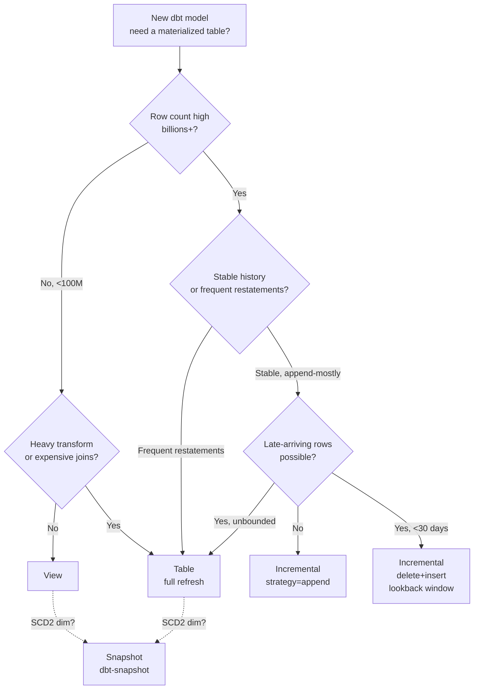

# Module 17 — Performance & Materialization Strategy

!!! abstract "Module Goal"
    Risk data is huge, and the warehouse that stores it pays for every modelling decision twice — once in storage and once in compute. Materialization is the discipline of choosing, *per object*, whether to compute the rows on demand (a view), to compute them once and persist (a table), to append only what is new since the last run (an incremental), or to capture row history at SCD2 grain (a snapshot). Get the choices right and the EOD batch finishes by 7pm, the dashboards refresh in seconds, and the warehouse bill stays inside the annual plan; get them wrong and the dashboard is stale, the cluster spills to disk, the bill triples — or, worst of all, you pre-aggregate a non-additive measure (Module 12) and the report is silently wrong. This module is the production trade-offs reference: which model is materialized, what is a view, where to partition, when to go incremental, what to cluster on, how to backfill, and — repeatedly — how to identify when materialization is the *wrong* answer.

---

## 1. Learning objectives

By the end of this module, you should be able to:

- **Choose** between view, table, incremental, and snapshot materializations for a given warehouse object, and defend the choice in terms of row count, change frequency, freshness SLA, and the consumer's query pattern.
- **Apply** partitioning and clustering strategies — partition by `business_date`, cluster by `book_sk` and `risk_factor_sk` — to a daily-grain risk fact, and translate the same intent across Snowflake, BigQuery, Redshift, and Databricks Delta dialects.
- **Reason** about the storage-vs-compute trade-off: views are free at rest and expensive at query time, tables are fast at query time and pay storage continuously, incrementals are the cheap-to-query option that pays the price in operational complexity (backfill, idempotency, late-arriving handling).
- **Identify** the cases where materialization is the wrong answer — pre-aggregating a non-additive measure (Module 12), partitioning by a high-cardinality column, materializing a fast-changing reference table that should be a view.
- **Implement** an incremental dbt model with `is_incremental()`, a unique key, a partition spec, and a deterministic late-arriving lookback window, and explain the compiled SQL the macro produces.
- **Plan** a tiering policy that keeps recent EOD in fast storage, older history on cheaper storage, and regulatory retention in cold archive with a documented restore SLA.

## 2. Why this matters

In a risk warehouse, materialization decisions are where storage cost, query latency, and reproducibility collide. A market-risk warehouse with three years of `fact_sensitivity` history at typical scale (500 books × 50,000 instruments × 200 risk factors × 750 business dates) has hundreds of billions of rows on a single fact table; the same warehouse runs an EOD batch with a 12-hour overnight window and hands the dashboards over to BI consumers at 7am with a 5-minute SLA on the most-watched queries. The path between *raw rows on the data lake* and *5-second dashboard render* is paved with materialization choices. Each choice is local — *should this dbt model be a view or a table?* — and the choices compound: a view that depends on a view that depends on a view recomputes the entire chain every time the leaf is queried, and the same chain materialized at the right intermediate node returns in milliseconds.

The trio of failure modes is recurrent and operationally expensive. **Stale dashboards** (the materialization refreshes too rarely, or the upstream feed is late, and the BI consumer reads yesterday's data thinking it is today's). **Runaway cost** (an over-eager materialize-everything policy triples the warehouse bill within a quarter, or a poorly-clustered table fans out to a full scan on every query). **Silent wrongness** (a pre-aggregated `fact_var_by_region` table speeds up the dashboard by 50× and ships a number the math forbids — the Module 12 anti-pattern that the warehouse can no longer back out of without restating the dashboard's history). The first two are visible and complained about; the third is invisible and only surfaces under audit. The discipline this module teaches is to make the materialization decision *deliberately* — with the row counts in front of you, with the additivity table from Module 12 open in another tab, and with the consumer's query pattern named explicitly — so the cheap, the fast, and the *correct* answer all line up.

The economic stakes deserve a sentence of their own. A typical large-bank market-risk warehouse runs $500k-$2M annually in compute and storage; a poorly-tuned warehouse runs 2-3× that for the same workload. The savings from getting the materialization decisions right is the difference between a comfortable annual budget and a quarterly conversation with the CFO about why the warehouse line item is over-running the plan. The savings is also the difference between a team that can fund the next year's roadmap (new dashboards, new feeds, new analytical capabilities) and a team that spends the year defending the existing footprint. The materialization discipline is not just an engineering virtue; it is the budget-protection mechanism that lets the team grow the warehouse rather than shrink it.

The reproducibility stakes deserve a sentence of their own too. The Module 16 reproduction primitive — bitemporal inputs plus code-version replay equals reproducible reports — depends on the materialization layer being deterministic. An incremental model whose runs are non-deterministic, a snapshot whose history was lost to an overwritten source, a table refreshed from a moving source whose state was not captured — each of these breaks reproducibility silently. The materialization discipline of this module is what keeps the reproduction primitive honest; without it, the bitemporal layer of Module 13 and the lineage layer of Module 16 are defending a target that has already moved.

After this module the BI engineer should approach every new dbt model with three reflexes. First: *what is the grain, and is the measure additive at this grain?* (Module 12 link — never materialize an aggregate of a non-additive measure). Second: *what is the row count, the change frequency, and the consumer's freshness SLA?* (the view / table / incremental triage). Third: *what does the partition / cluster / sort look like, and what does the query plan say when I read it back?* (the production-readiness check). The decision framework in section 3 builds these reflexes step by step; the worked examples in section 4 show what the right and wrong answers look like in code.

A useful figure to internalise on the daily texture of the materialization workload. A typical large-bank market-risk dbt project has on the order of 1,500-3,000 models — a few hundred staging models (mostly views), a few hundred intermediate models (a mix of views and tables), several hundred dimension models (mostly snapshots and tables), and several hundred fact models (mostly incrementals). The nightly dbt run executes all of them in dependency order, with the longest models being the high-volume incrementals (`fact_sensitivity` at 30-90 minutes, `fact_var` at 60-120 minutes, `fact_pnl` at 30-60 minutes) and the bulk of the wall-clock time being spent on those handful of objects rather than spread evenly. The optimization leverage is therefore *concentrated*: a 10% improvement in the slowest five models is worth more than a 50% improvement in the fastest 500. The discipline is to know which models dominate the run, profile them carefully, and reserve the deep tuning effort for them; the rest can use sensible defaults and be left alone until the warehouse usage pattern changes.

A second useful figure: the storage-cost distribution. The same warehouse typically holds 70-90% of its bytes on the four reference fact tables of Module 7 (`fact_position`, `fact_sensitivity`, `fact_var`, `fact_pnl`), with the rest spread across the remaining hundreds of objects. The implication for tiering and retention is the same as for compute optimization — the leverage is concentrated, the cheap wins are on the heavy facts, the long tail of small objects is not worth aggressive tuning. A team that builds its tiering policy around the four reference facts (with sensible defaults on everything else) captures most of the cost saving with a fraction of the engineering effort.

A third useful figure: the read-frequency distribution. The warehouse's query log typically shows that ~10% of the objects receive ~90% of the reads — a Pareto distribution that is consistent across most warehouses. The 10% are the consumer-facing marts and the most-read facts; the 90% are the staging and intermediate models that exist to support the marts but are rarely read directly. The implication for the materialization choice is that the 10% deserve careful tuning (the right cluster keys, the right partition spec, the right freshness SLO) and the 90% can use defaults; over-tuning the long tail is engineering effort that produces no measurable benefit. The discipline is to identify the 10% from the query log, focus the tuning effort there, and let the long tail run on sensible defaults until the read pattern changes.

## 3. Core concepts

A reading note. Section 3 walks the materialization story in nine sub-sections: the four materialization strategies (3.1), partitioning and clustering and the warehouse-specific dialects (3.2), the storage-vs-compute trade-off matrix (3.3), the non-additive aggregate anti-pattern that ties this module back to Module 12 (3.4), backfill and reprocessing patterns (3.5), tiering and storage classes (3.6), a performance-debugging shortlist (3.7), warehouse sizing and cost attribution (3.8), the intra-day vs EOD architectural split (3.8a), and the operational SLOs and health monitoring of the materialization layer (3.9). Sections 3.1 and 3.4 are the most load-bearing; section 3.2 is the warehouse-vendor translation table; section 3.5 is where most production incidents are won or lost; section 3.9 is the operational discipline that turns the engineering choices into a sustainable production service.

### 3.1 The four materialization strategies

Every object the warehouse exposes is one of four materialization shapes. dbt names three of them directly (`view`, `table`, `incremental`); the fourth (`snapshot`) is dbt's SCD2 capture mechanism. The choice between them is the most important per-model decision the dbt project makes.

**View.** No storage. The object is a saved query; every consumer SELECT recomputes the rows from the underlying tables. Right for: cheap transformations, low-frequency reads, fast-changing logic where the *definition* needs to be updated more often than the data, and any layer where the upstream is itself a small fast table. Wrong for: heavy aggregations, repeated reads of the same expensive computation, anything that joins a hundred-billion-row fact with a hundred-million-row dim. The cost is paid every read, by every consumer, forever; if the read pattern is "200 BI users hitting the same view 50 times a day," a view is the wrong choice and a table or incremental is right.

A note on the *materialized view* (Snowflake's `MATERIALIZED VIEW`, BigQuery's `MATERIALIZED VIEW`, Postgres's `MATERIALIZED VIEW`) — a hybrid that some warehouses offer between a view and a table. The materialized view is a precomputed result that the warehouse refreshes incrementally as the underlying changes; reads are fast (it is a table), the freshness is automatic (the warehouse maintains it), and the storage cost is the materialized result. The pattern is appealing in principle and limited in practice — Snowflake's materialized views forbid joins across multiple tables, BigQuery's are limited in the aggregation functions they support, Postgres's require explicit `REFRESH MATERIALIZED VIEW` (so the freshness is not actually automatic). The right discipline is to *know the feature exists*, evaluate it against the team's specific warehouse, and use it sparingly where it fits — most of the time a dbt-managed `table` or `incremental` is the more flexible answer.

**Table (full refresh).** The object is materialized and rebuilt every time the dbt project runs. Right for: moderate-size objects (millions to low billions of rows) where the transformation is heavy enough to want it precomputed but the change rate is low enough that rebuilding the whole thing nightly is acceptable. The full-refresh pattern is *deterministic by construction* — every run produces the same output from the same inputs — which is its main advantage over incremental: backfill, restate, and audit-replay all reduce to "run the model again." Wrong for: high-volume time-series facts where the cost of recomputing three years of history nightly is prohibitive.

**Incremental.** The object is materialized, but each run only processes rows that are new since the last run — an `INSERT` of new rows, or a `MERGE` of new + updated rows. Right for: high-volume time-series facts where most of the historical rows do not change between runs (`fact_sensitivity`, `fact_market_data`, `fact_pnl`, the daily-grain risk facts of Module 7). The pattern is *the* production-typical materialization for the four reference fact tables — full refresh of three years of `fact_sensitivity` is hours of compute; the incremental run that adds one EOD's worth of new rows finishes in minutes. Wrong for: any model whose rows are non-deterministic given the inputs, or whose late-arriving window is longer than the team is willing to lookback.

Incremental is also the *most sensitive to misconfiguration* of the four. A non-deterministic source (a `current_timestamp` in the SELECT, a window function whose result depends on row order) produces different rows on re-runs and quietly drifts the table away from reproducibility. A wrong `unique_key` produces silent duplicates on the merge path. A too-short lookback window misses late-arriving rows; a too-long lookback wastes compute. The discipline section in 3.5 covers the patterns that prevent each of these.

**Snapshot (dbt-snapshot, SCD2).** The object captures the full history of the source table at row grain — every row, every change, both `valid_from` and `valid_to`. Right for: slowly-changing dimensions ([Module 5](05-dimensional-modeling.md) link — `dim_book`, `dim_instrument`, `dim_counterparty`) where the history of the row matters for past-point-in-time reporting. The dbt-snapshot pattern is the operational primitive that turns a regularly-overwritten source table into a bitemporal-friendly dimension; without it, the warehouse has no record of the row's prior state and cannot answer "what was the book's hierarchy as known on 2024-12-31?" Wrong for: fact tables (which already capture history through their `business_date` grain) and for dimensions that genuinely do not change (a SCD0 reference list — currencies, country codes — does not need a snapshot).

A note on the snapshot's two flavours. dbt-snapshots come in `timestamp` and `check` strategies. The `timestamp` strategy compares an `updated_at` column on the source to detect changes — cheap, accurate when the source maintains the column reliably, and the right default for sources that are themselves audit-traced. The `check` strategy compares a configurable list of columns row-by-row to detect changes — more expensive (a full join on every snapshot run), the only option when the source has no `updated_at` column, and the right choice for legacy reference tables that are overwritten in place without timestamping. The discipline is to prefer `timestamp` when available, fall back to `check` only when the source forces it, and to alert when a `check` snapshot's runtime grows beyond the team's tolerance (an indication that the source has grown to the point where row-by-row comparison is no longer viable).

A reference table that captures the four-way decision at a glance:

| Strategy     | Storage | Compute / read | Compute / refresh           | Right for                                            |
| ------------ | ------- | -------------- | --------------------------- | ---------------------------------------------------- |
| View         | None    | Full recompute | None                         | Light transforms, fast-changing logic, small upstream |
| Table        | Full    | Direct read   | Full rebuild every run       | Moderate-size heavy transforms, low change rate      |
| Incremental  | Full    | Direct read   | Append/merge new rows only   | High-volume time-series facts                        |
| Snapshot     | Full    | Direct read   | New row per change (SCD2)    | Slowly-changing dimensions (Module 5)                |

A practitioner observation on *the most common mistake*. New dbt projects almost always over-materialize — every model becomes a `table`, the warehouse fills with redundant copies, the dbt run takes hours, and the cost rises linearly. The corrective discipline is to default to `view` and *promote* to `table` (or `incremental`) only when the read pattern justifies the storage. A model read once a day by an analyst should be a view; a model read 10,000 times a day by a Tableau dashboard should be a table or incremental. The promotion rule is observable from the warehouse's query log; the warehouse that instruments its own usage can audit its materialization choices quarterly and demote the un-read tables back to views. The audit's typical finding: 30-50% of the warehouse's `table` materializations are read fewer than once a day and could be views with no SLA impact, and 10-20% of the warehouse's `view` materializations are read thousands of times a day and should be promoted to tables to relieve compute pressure. The audit is cheap to run (a single query against the warehouse's information schema joined to the query log) and saves multiples of its cost in the next month's compute bill.

A second observation on *the dbt-snapshot trap*. dbt-snapshots run on their own cadence and are easy to forget about. A dimension whose source table is being overwritten in place every night, with no dbt-snapshot capturing the history, loses its prior state every night — and the bitemporal reporting layer of Module 13 silently produces wrong "as known on date X" answers. The discipline is to wire a snapshot for every SCD2 dimension before the dimension is consumed by any fact, and to alert when the snapshot run fails (the failure is invisible in the data; the warehouse keeps serving the latest values, but the history is gone).

A worked illustration of the trap. A risk warehouse loads `dim_book` from an upstream HR/finance system that publishes a fresh full snapshot every night; the upstream's prior state is overwritten on each publish. The data team materializes `dim_book` as a `table` in dbt and refreshes it nightly. The bitemporal reporting layer of Module 13 promises that "the firmwide VaR as known on 2024-12-31" can be reproduced from the bitemporally-restricted facts plus the dimensions as they were known on 2024-12-31. The promise breaks: the dimension is the latest copy, not the 2024-12-31 copy, and the reproduction silently uses today's hierarchy instead of the as-of hierarchy. The fix is to wire a dbt-snapshot on `dim_book` (strategy `check`, since the upstream has no `updated_at` column) and consume the snapshot's bitemporally-aware view rather than the raw table. The fix takes a few hours; the cost of *not* fixing it is the next regulatory deep-dive returning a different number than the originally-reported one.

A third observation on *ephemeral models*. dbt offers a fifth materialization, `ephemeral`, that is not a persisted object at all — it is a CTE inlined into every consumer's compiled SQL. Ephemeral has its place (small reusable transformations that should not clutter the warehouse with a physical view), and its trap (a deeply-chained ephemeral graph compiles into a single enormous SQL statement that hits the warehouse's query-length limit and refuses to run). The pragmatic discipline is to use ephemeral only for shallow, well-named helper transformations and to promote any ephemeral that is consumed by more than two or three downstream models to a view; the small storage cost of the view is well repaid by the readability of the compiled SQL and the diagnostic ease when something breaks.

A fourth observation on *the materialization decision being reversible at low cost*. Every materialization choice in this module can be revisited cheaply — a `view` can be promoted to a `table` with a single config change and a single `dbt run`, a `table` can be demoted to a `view` the same way, an `incremental` can be re-bootstrapped from scratch with `dbt run --full-refresh`. The reversibility is the licence to *experiment*: pick the simplest materialization that meets the SLA, ship it, instrument the read pattern, and revisit the choice quarterly. A team that treats materialization as a ship-once decision over-engineers up front; a team that treats it as a continuously-tunable knob ships the simple thing and tunes when the data tells it to.

A fifth observation on *the one decision that is not reversible at low cost*. The choice of partition column is the exception. Once a table has years of history at a given partition key, changing the partition requires a full table rewrite, a coordinated cutover, a backfill of every downstream incremental, and a refresh of every cached query plan. The discipline is to *get the partition column right at table creation* — `business_date` for the daily-grain risk facts is the canonical right answer for risk warehouses, and deviation from this default needs a deliberate justification documented in the data dictionary. A team that ships the wrong partition and discovers it three years later pays a quarter-long migration cost; a team that gets it right at creation pays nothing.

### 3.2 Partitioning, clustering, sort keys

Materialization strategy chooses *whether* to persist; partitioning and clustering choose *how* to lay the persisted bytes out so the query optimizer can prune. The two decisions are independent — a `table` and an `incremental` both need a partition spec — but the shape of the partition is constrained by the materialization in the incremental case (partition pruning is what makes the lookback window cheap).

**Partitioning** is the physical organization of a table by a column, almost always `business_date` for the daily-grain risk facts. The optimizer reads only the partitions the query touches. A query with `WHERE business_date = DATE '2026-05-08'` against a table partitioned by `business_date` reads one partition out of 750; the same query against an unpartitioned table scans the whole thing. The performance gain is multiple orders of magnitude on the canonical risk-warehouse query patterns. The partition column is also the column the optimizer uses to prune on range queries — `WHERE business_date BETWEEN ... AND ...` reads only the partitions in the range, and the optimizer's pruning is what makes the lookback queries of section 3.5 cheap.

**Clustering / sort keys** is the secondary organization within a partition, by columns the optimizer also wants to prune on — for risk facts, typically `book_sk` and `risk_factor_sk`. A query with `WHERE business_date = ... AND book_sk IN (...)` against a `(business_date)` partitioned, `(book_sk, risk_factor_sk)` clustered table reads the right partition *and* the right micro-blocks within the partition; the same query against partition-only fans out to a full scan of the day's rows. The clustering also helps *joins* — a `JOIN ... USING (book_sk)` against a clustered table reads only the blocks that match the join key, which is the difference between a sort-merge join (fast) and a hash join with a full scan of the right side (slow).

The warehouse-specific dialects diverge on the syntax but converge on the intent. A reference table:

| Warehouse           | Partitioning                                  | Clustering                                            |
| ------------------- | --------------------------------------------- | ----------------------------------------------------- |
| Snowflake           | Micro-partitions (auto, hidden)               | `CLUSTER BY (col1, col2)` + `AUTOMATIC_CLUSTERING`    |
| BigQuery            | `PARTITION BY` (one column, daily/monthly)    | `CLUSTER BY` (up to 4 columns)                         |
| Redshift            | (No native partitioning; uses DISTKEY pattern) | `DISTKEY` (one column) + `SORTKEY` (compound or interleaved) |
| Databricks Delta    | `PARTITIONED BY` (one or more columns)        | `ZORDER BY` (after `OPTIMIZE`)                         |
| Postgres / Postgres-likes | Partition tables (range, list, hash)         | B-tree indexes; no native clustering                  |

A few notes on the dialects' differences. **Snowflake**'s micro-partitions are automatic — the engine partitions every table by ingestion order without the user declaring anything, and explicit `CLUSTER BY` only matters for tables whose query pattern wants a secondary organization the auto-partitioning cannot match. The `AUTOMATIC_CLUSTERING` setting is what keeps the cluster fresh as new rows arrive; without it, a clustered table drifts and the optimizer's pruning degrades. **BigQuery** is the strict opposite — partitioning is explicit, one column, and the `_PARTITIONTIME` pseudo-column is the standard pattern; clustering is up to four columns, declared at table creation, and re-clustered on demand by the engine. **Redshift** has no partitioning concept of the BigQuery shape — the equivalent is `DISTKEY` (which co-locates rows with the same key on the same compute slice) plus `SORTKEY` (which orders rows within each slice); the `SORTKEY` is what acts most like a partition for query-pruning purposes. **Databricks Delta** is closer to BigQuery's shape — partition columns are declared at `CREATE TABLE`, and `ZORDER BY` is the explicit re-clustering that runs after `OPTIMIZE`.

A practitioner observation on *partition cardinality*. The right partition column has *moderate* cardinality — too few partitions and the optimizer cannot prune (a single-partition table is no better than an unpartitioned table); too many partitions and the metadata overhead dominates the query cost. `business_date` at daily grain is the canonical right answer for risk facts: 250 partitions per year, ~2,500 partitions over a decade, well within every warehouse's metadata sweet spot. `book_sk` is the canonical *wrong* answer — 500 books × 750 dates = 375,000 partitions, the optimizer's metadata layer chokes, and BigQuery in particular will reject the DDL. The rule of thumb: partition by the *coarsest* dimension the query consistently filters on; cluster by the *finer* dimensions that vary within a partition.

A reference table of partition-cardinality sweet spots and their typical use cases:

| Partition strategy            | Cardinality (10 yrs)    | Right for                                      | Wrong for                              |
| ----------------------------- | ----------------------- | ---------------------------------------------- | -------------------------------------- |
| `business_date` (daily)       | ~2,500                  | Daily-grain risk facts, EOD-batch loads        | Sub-daily grain, monthly-only queries  |
| `business_month` (monthly)    | ~120                    | Long-history facts, regulatory aggregates      | Daily-grain queries (no pruning)       |
| `business_year`               | ~10                     | Archive tables, very-long-term retention       | Anything queried at finer granularity  |
| `legal_entity_sk`             | ~5-50                   | Multi-entity warehouses with entity-specific reads | Single-entity queries (no pruning)  |
| `(business_date, region_sk)`  | ~10,000-25,000          | Multi-region risk facts with region-specific dashboards | Anything querying across regions   |
| `book_sk`                     | ~500-5,000              | Almost never                                   | Almost everything (too high cardinality) |

The composite partition `(business_date, region_sk)` is worth a brief note: BigQuery and Databricks Delta support multi-column partition keys, and the composite is the right answer when the query pattern consistently filters on both columns *and* the cardinality stays within the warehouse's tolerance. The cost is the metadata overhead of the larger partition count; the benefit is the pruning works on both dimensions independently. Snowflake and Redshift do not support multi-column partitioning natively (Snowflake's auto-partitioning is single-column from the engine's perspective; Redshift has no partitioning concept), and the equivalent on those warehouses is to put the second column into the cluster key.

A second observation on *cluster-key reordering*. Once rows are loaded, changing the cluster key is expensive. Snowflake re-clusters lazily in the background and a freshly re-clustered table can take days to settle; BigQuery re-clusters on `OPTIMIZE`-equivalent commands but the re-cluster is a full table rewrite; Redshift `SORTKEY` changes require a `VACUUM` against the whole table. The discipline is to *get the cluster key right at table creation* — interview the consumers, look at the query log of the upstream tables, model the dominant predicate columns — rather than to refactor it after the table is in production.

A third observation on *the order of cluster columns*. The leading column in the cluster key gets the most aggressive pruning; trailing columns provide secondary pruning that degrades quickly past the second or third position. The right ordering is *most-frequently-filtered to least-frequently-filtered*. For risk facts the canonical order is `business_date` first (every query filters on it), `book_sk` second (most queries filter on it), `risk_factor_sk` third (sensitivity-specific queries filter on it). A team that orders the cluster key the other way around — `risk_factor_sk` first, `business_date` last — gets the worst of both worlds: queries that filter on `business_date` cannot prune effectively (the leading column is wrong), and queries that filter on `risk_factor_sk` could have been served by a single-column cluster equally well. The diagnostic is to read the warehouse's query log, count the filter columns by frequency, and align the cluster order to the count.

A fourth observation on *interleaved vs compound sort keys (Redshift specifically)*. Redshift offers two sort-key shapes — `COMPOUND` (the default, prioritizes the leading column) and `INTERLEAVED` (gives equal weight to all columns in the key). Interleaved is theoretically attractive for the case where queries filter on different combinations of columns at roughly equal frequency, but in practice the maintenance cost is high (interleaved sort keys require periodic `VACUUM REINDEX` to stay efficient, and the reindex is expensive on multi-billion-row tables) and the use case is narrow. The right default for risk facts is `COMPOUND SORTKEY (business_date, book_sk, risk_factor_sk)`; reach for interleaved only if the query log demonstrates that no single column dominates the filter pattern.

A fifth observation on *the partition-clustering interaction*. The two organizations are *complementary*, not redundant — partitioning prunes at the file level (skip whole files), clustering prunes within each file (skip whole blocks). A well-designed table uses both: partition by the column the optimizer can use to skip files (`business_date`), cluster by the columns that further prune within each partition's files (`book_sk`, `risk_factor_sk`). A table that partitions but does not cluster reads the whole partition for every query; a table that clusters but does not partition has to consult every file's cluster metadata to decide whether to read it. The combination of both is the right answer for the canonical risk-fact pattern.

### 3.3 The storage-vs-compute trade-off

The four materialization strategies of section 3.1 are points on a single trade-off curve: how much storage are you willing to pay for how much query-time speed? The reference table:

| Dimension          | View                       | Table                          | Incremental                         | Snapshot (SCD2)               |
| ------------------ | -------------------------- | ------------------------------ | ----------------------------------- | ----------------------------- |
| Storage cost       | Zero                       | Full table size                | Full table size                     | Full + history rows           |
| Compute / read     | Recompute on every read    | Direct read (cheap)            | Direct read (cheap)                 | Direct read (cheap)           |
| Compute / refresh  | None                       | Full rebuild per run           | Append/merge per run                | New row per change            |
| Freshness          | Always fresh (at read)     | As of last full rebuild        | As of last incremental run          | Captures change-by-change     |
| Reproducibility    | Free (it's a query)        | Free (deterministic build)     | Sensitive to backfill discipline    | Free if SCD2 keys are stable  |
| Operational risk   | Low                        | Low (just runs longer)         | High (idempotency, late-arriving)   | Medium (snapshot misses)      |

The trade-off has no single right answer; it has a right answer *per object*, given the row count, the change rate, the read frequency, the freshness SLA, and the consumer's tolerance for staleness.

A worked decision. `dim_book` has 500 rows, changes a few times per year, is read by every fact-table join. The right choice is a `table` (or a dbt-snapshot if the team needs SCD2 history) — the storage is trivial, the build is fast, the read benefits 200 dashboards. `fact_market_data` has 50,000 risk factors × 750 business dates = 37 million rows, changes only by appending one EOD's worth of rows nightly, is read by every sensitivities computation. The right choice is `incremental` — the full rebuild would be hours, the append is minutes, the read benefits the whole sensitivities pipeline. `vw_position_currency_view` is a thin wrapper over `fact_position` that joins `dim_currency` for human-readable codes. The right choice is `view` — the join is cheap, the read pattern is occasional, no storage is justified.

A practitioner observation on *the freshness column*. The "Freshness" row in the trade-off table is the one most often misunderstood. A view is "always fresh" only in the trivial sense that it recomputes on every read; if the *underlying* table is stale (the upstream loader has not run, the source feed is late), the view is exactly as stale as the underlying table. A table is "as of last full rebuild" — but the rebuild cadence is itself a choice, and a table rebuilt every 4 hours is fresher than a view that only reads from a table rebuilt nightly. The discipline is to think about freshness *end-to-end* — from the source feed's arrival to the consumer's read — rather than at the materialization boundary alone. The end-to-end freshness is what the consumer actually experiences; the per-object freshness is one term in a chain.

A second observation on *the reproducibility column*. Reproducibility — the property that the same inputs always produce the same outputs — is free for views (the SELECT is deterministic) and for full-refresh tables (the rebuild is deterministic), and *expensive* for incrementals (the order of runs matters, the lookback window must cover late arrivals, the source must be deterministic). The Module 16 reproduction primitive (bitemporal inputs + code-version replay) works cleanly for views and tables and requires extra discipline for incrementals — specifically, the ability to re-bootstrap the incremental from scratch with `--full-refresh` and confirm that the bootstrapped table matches the incrementally-built one. The discipline is to run a full-refresh comparison quarterly on every incremental fact table; a mismatch is the signal that the incremental has drifted from reproducibility and needs investigation.

### 3.4 The non-additive-aggregate anti-pattern (link to Module 12)

The single most expensive materialization mistake in a risk warehouse. Pre-aggregating a non-additive measure into a "performance" fact table — `fact_var_by_region`, `fact_capital_by_business_line`, `fact_es_by_desk` — bakes a Module 12 violation into the storage layer. The dashboard queries against the pre-aggregated table run fast; the numbers they return are mathematically meaningless; the warehouse cannot back out of the pattern without restating every dashboard that has ever consumed it.

The mechanics are familiar from Module 12 §3.5. Materializing daily VaR *per desk* is fine — the desk is the grain at which the VaR is computed from positions, market data, and scenarios, and the row records the actual quantile. Materializing region-level VaR *by `SUM(desk_var)`* is wrong — the regional quantile is not the sum of the desk quantiles, it is a different quantile of a different distribution that has to be computed from the *same* underlying positions, market data, and scenarios at the regional grain. The pre-aggregated `fact_var_by_region` table that takes a shortcut and sums the desk numbers ships a number that no audit will accept and no risk manager should trust. The number is not just *approximately* wrong — it is wrong in a structural way that no amount of correlation-modelling or scaling factor can repair.

The correct pattern is to **materialize at the grain the consumer needs, computed independently from the components, never by rolling up a coarser fact**. If the consumer needs regional VaR, the warehouse computes regional VaR — from positions, market data, scenarios, at the regional grain — and materializes it as its own fact. The desk-grain fact stays the desk-grain fact; the regional-grain fact is a separate object with its own loader, its own grain, and its own provenance. The two facts coexist, neither is derived from the other by summation, and the BI tool routes the regional dashboard at the regional fact and the desk dashboard at the desk fact.

A practitioner observation on *the seductive shortcut*. The conversation that ends in a Module 12 violation is always: "the regional VaR dashboard takes 45 seconds to render, can we pre-aggregate?" The data engineer's answer must be: "we can pre-aggregate the *positions* that feed the regional VaR computation, but we cannot pre-aggregate the VaR itself by summing desk VaRs — the math forbids it. If the dashboard is slow, the right fix is to materialize the regional-grain fact as its own table, not to take a shortcut over the desk-grain fact." The conversation is unpopular at the time and vindicated at every subsequent audit. The data dictionary's additivity flag (Module 12 §3.7) is the artefact that makes the conversation reusable — the BI tool reads the flag, refuses to materialize an aggregate over a non-additive column, and the engineer is rescued from having to win the argument every time it recurs.

A second observation on *which measures are safe to pre-aggregate*. Module 12's additivity catalogue is the reference, and the rule is mechanical: any measure that is *fully additive* across the dimensions of the proposed aggregate (notional, market value within a snapshot, cash P&L, sensitivities within the same risk factor) can be pre-aggregated freely; any measure that is *non-additive* across any of the dimensions (VaR, ES, capital, ratios, percentages) cannot. The semi-additive cases (positions, balances, unrealised P&L) need careful handling: pre-aggregation across the additive dimensions is fine, pre-aggregation across the non-additive dimension is the same Module 12 violation in slow motion. The data dictionary's per-dimension additivity profile is what disambiguates each case; the materialization decision routes through the additivity profile, not around it.

A reference table that pairs measure types with their pre-aggregation safety:

| Measure type                           | Pre-aggregate across positions? | Pre-aggregate across time? | Pre-aggregate across hierarchy? |
| -------------------------------------- | ------------------------------- | -------------------------- | ------------------------------- |
| Notional, market value, cash P&L       | Yes                             | Yes (cash) / No (stock)    | Yes                             |
| Sensitivity (same risk factor, tenor)  | Yes                             | No (semi-additive)         | Yes                             |
| Sensitivity (across risk factors)      | No (vector, not scalar)         | No                         | No                              |
| VaR, ES, capital                       | No                              | No                         | No                              |
| Position notional (stock)              | Yes                             | No (stock)                 | Yes                             |
| Unrealised P&L (stock)                 | Yes                             | No (stock)                 | Yes                             |
| Ratios, percentages, Sharpe           | No (weighted, not summed)       | No                         | No                              |

The rule for materializing pre-aggregates: pre-aggregate only across dimensions where every measure in the table is "Yes." A pre-aggregate that includes a "No" cell on any measure is the Module 12 violation in disguise; the data dictionary should flag the column and the dbt project should refuse the materialization at compile time.

A third observation on *the cumulative pre-aggregation pattern*. A common variant of the anti-pattern: a "rolling 30-day VaR" pre-aggregated table that takes `MAX(var_usd) OVER (ORDER BY business_date ROWS BETWEEN 29 PRECEDING AND CURRENT ROW)`. The window function is mathematically meaningful (the maximum of the last 30 daily VaRs is a well-defined statistic), but the pre-aggregated table that exposes it can mislead the consumer into treating it as "the 30-day VaR" — which it is not (the 30-day VaR is a quantile of a 30-day-horizon P&L distribution, computed differently). The pre-aggregated table is correct as a *summary statistic* and wrong as a *risk measure*; the data dictionary must call out the distinction, and the BI tool must surface the warning when the column is used in a risk-reporting context.

### 3.5 Backfill and reprocessing patterns

Incremental models live or die on their backfill discipline. The four patterns below cover most of the production cases.

**`is_incremental()` guards.** The dbt macro that surfaces the "is this a full refresh or an incremental run?" flag in the model's SQL. The model body has a single SELECT with an ` WHERE business_date >= ... ` block: on a full refresh the WHERE is absent and the model rebuilds the entire history; on an incremental run the WHERE prunes the source to the lookback window. The macro is the single switch that lets the same model serve both the daily incremental load and the periodic full-rebuild that backfill or restatement requires. The discipline is to *write the model so that the full-refresh path always produces the same result as the incremental path applied from genesis* — if the two diverge, the model is not idempotent and the warehouse cannot reproduce its own history. The diagnostic is a quarterly comparison run: drop the table, full-refresh from scratch, compare the result to the incrementally-built table; any divergence is a bug.

**Idempotent merges (delete-and-insert vs upsert).** The merge logic that decides what happens when an incremental run finds a row whose `unique_key` already exists. The two patterns:

- **Delete-and-insert.** The macro deletes any existing rows in the lookback window before inserting the new rows. Works cleanly for time-series facts where the source is the authoritative truth in the window; tolerates source restatements without special handling. The dbt `incremental_strategy = 'delete+insert'` config implements this on Snowflake, BigQuery, and Redshift.
- **Upsert (MERGE).** The macro emits a SQL `MERGE` that updates existing rows in place and inserts new ones. Tighter (no transient deleted state), more sensitive to the `unique_key` being correct (a wrong unique key produces silent duplicates or silent overwrites). `incremental_strategy = 'merge'` is the default on most warehouses.

The choice between them is dialect-aware and consumer-aware. Delete-and-insert is simpler to reason about and cheaper on warehouses where DELETE is cheap (Snowflake, BigQuery, Databricks); upsert is the right choice on warehouses where DELETE is expensive (Redshift, Postgres) or where the consumer cannot tolerate the brief inconsistent state during the delete window. Both are *idempotent* — re-running the model with the same inputs produces the same final state — which is the property that makes backfill safe.

**Reprocessing windows.** How far back can the incremental model re-run? Typical convention: 7-30 days hot (any business_date in this window can be re-run by a single dbt invocation), older periods archived (re-running requires explicit operator action and possibly a temporary table promotion). The 7-30 day window is sized to the longest realistic late-arriving window for the source feeds — Module 13's late-arriving discipline. A team that sets the reprocessing window to 1 day will, sooner or later, miss a late-arriving market-data correction that lands on day 4; a team that sets it to 90 days pays the compute cost on every incremental run. The right discipline is to instrument the actual late-arriving distribution from the upstream feed and pick a window that covers 99% of cases.

**Audit-driven reprocessing.** A specific class of backfill: a fix to a market-data feed at `2024-01-15` means re-running 30 days of dependent facts (`fact_sensitivity`, `fact_var`, `fact_pnl`) from that date forward. The reprocessing must run in dependency order — the upstream `fact_market_data` first, then each downstream fact in topological order — and must produce the same final state as if the original run had been correct. The discipline is the lineage layer of Module 16: query the lineage graph for the downstream closure of `fact_market_data` (filtered to rows touching `2024-01-15` or later), order the closure topologically, and dispatch the re-runs as a parameterized DAG. Without the lineage layer, the team is guessing at the closure and missing dependencies; with it, the reprocessing is a parameterized query.

A practitioner observation on *the difference between a backfill and a restatement*. A *backfill* fills in rows that should have been there but were not (the loader missed a day, the source feed was unavailable, the warehouse was down for maintenance) — the new rows have *new* `as_of_timestamp` values and the bitemporal layer correctly records them as "we came to know this on date X." A *restatement* changes rows that *were* there with corrected values (a market-data correction, a methodology fix, a discovered bug) — the new rows have *new* `as_of_timestamp` values and the bitemporal layer correctly records both the original and the corrected values, with downstream queries respecting the as-of cut-off. The materialization layer is the same in both cases (the same incremental model, the same lookback window), but the bitemporal discipline is what turns the operational primitive into an audit-grade history. A team that runs backfills and restatements without the bitemporal layer collapses the original and corrected values into a single overwritten state; the warehouse loses the audit trail of what was known when, and Module 16 reproduction becomes impossible.

A second observation on *the cost of the reprocessing window*. A 30-day reprocessing of `fact_sensitivity` with the typical incremental config rebuilds 30 partitions and re-clusters 30 partitions; the cost is roughly 30× the cost of a single nightly run, plus the warehouse's overhead for the larger working set. On a modest warehouse this is a few hours of compute; on a busy warehouse the reprocessing competes with the nightly EOD batch and can push EOD past its SLA. The discipline is to schedule reprocessing into the off-peak window (the warehouse is typically idle between 9am and 4pm Eastern, after the EOD batch finishes and before the European EOD batch starts), to size the reprocessing warehouse separately from the nightly EOD warehouse, and to *throttle* the reprocessing at the orchestrator level so it cannot consume more than a configured fraction of the warehouse's capacity. A reprocessing that runs un-throttled and starves the next morning's dashboard refresh is the operational incident that ends every team's confidence in the reprocessing primitive.

A reference reprocessing playbook:

1. **Identify the scope.** Query the lineage layer for the downstream closure of the corrected source, filtered to the affected `business_date` range.
2. **Estimate the cost.** Multiply the per-partition cost of each affected model by the partition count; flag if the total exceeds the off-peak window's capacity.
3. **Order the runs.** Topologically sort the closure so upstream models run before downstream models.
4. **Throttle the dispatch.** Configure the orchestrator to run no more than N reprocessing tasks concurrently, where N is sized to leave at least 50% of the warehouse capacity for normal operations.
5. **Monitor the freshness.** During reprocessing, the freshness SLO of the affected models is suspended; communicate the suspension to consumers and re-arm the SLO when reprocessing completes.
6. **Validate the result.** After reprocessing, run a row-count and a measure-sum reconciliation against the expected post-fix state; any divergence is investigated before re-arming the consumer-facing freshness.
7. **Document the run.** Append the reprocessing event to the audit trail (Module 16) with the scope, the duration, the operator, and the outcome.

The playbook is the same shape every time; the discipline is to *follow* it rather than improvising under time pressure. A team that has rehearsed the playbook in a non-incident scenario (a quarterly reprocessing drill against a known-correct source) executes it cleanly during a real incident; a team that has not rehearsed improvises, misses steps, and turns a 4-hour reprocessing into a 24-hour incident.

A third observation on *idempotency at the orchestrator level*. The dbt model is idempotent (the delete-and-insert pattern guarantees that re-running with the same source produces the same target); the *orchestrator* must also be idempotent to extend the guarantee end-to-end. An Airflow DAG that re-runs the dbt model but does *not* re-run the upstream loader on the same source data violates idempotency at the boundary — the re-run is acting on a different source than the original. The discipline is to run the loader and the dbt model as a single atomic orchestration unit, with the source-data fingerprint (a hash, a row count, a `pipeline_run_id`) recorded on every run so the operator can verify that two re-runs of the same upstream produce the same downstream. Without the fingerprint, the team is debugging an idempotency failure with no diagnostic; with it, the failure surfaces immediately and the fix is local.

A fourth observation on *the four incremental strategies and when each is right*. dbt exposes four named incremental strategies, and the choice between them is the second-most-important per-model decision after the materialization itself.

- **`append`.** New rows are inserted; existing rows are never touched. Right for: pure event streams (`fact_trade_event`, `fact_cashflow`) where rows are immutable once written and the loader guarantees no duplicates. Wrong for: any model where the source can produce restatements within the lookback window. Cheapest of the four (no DELETE, no MERGE, just INSERT); the simplest to reason about; the most fragile if the assumptions break.
- **`merge`.** A SQL `MERGE` statement updates existing rows in place (by `unique_key`) and inserts new ones. Right for: most fact-table cases where the source is the authoritative truth and rows can be restated. The default on Snowflake, BigQuery, Databricks. Wrong for: warehouses where MERGE is expensive (older Postgres versions, some MPP engines without native MERGE) or where the consumer cannot tolerate the brief inconsistent state during the merge.
- **`delete+insert`.** Rows in the lookback window are deleted, then the new rows are inserted. Right for: time-series facts where the source restates entire time windows rather than individual rows. The atomicity is at the partition level rather than the row level. Wrong for: warehouses where DELETE is expensive (Redshift, large unpartitioned Postgres tables).
- **`insert_overwrite`.** Rows in the partition window are overwritten atomically — typically implemented as `DROP PARTITION` + `INSERT OVERWRITE`. Right for: BigQuery and Databricks Delta workloads where partition-level atomicity is the natural unit and the lookback window aligns with partition boundaries. Wrong for: Snowflake (no native partition concept) and Redshift (no partition-overwrite primitive).

A reference table that pairs each strategy with its right-fit case:

| Strategy           | Best for                                          | Worst for                                | Native dialects                        |
| ------------------ | ------------------------------------------------- | ---------------------------------------- | -------------------------------------- |
| `append`           | Pure event streams, immutable rows                | Sources that restate within lookback     | All warehouses                         |
| `merge`            | Most fact tables, restatable rows                 | Warehouses without native MERGE          | Snowflake, BigQuery, Databricks        |
| `delete+insert`    | Time-series facts, partition-aligned restatement   | Warehouses with expensive DELETE         | Snowflake, BigQuery, Databricks        |
| `insert_overwrite` | Partition-aligned overwrite, BigQuery time-series | Snowflake, Redshift                      | BigQuery, Databricks (partitioned)     |

The right default for the four reference fact tables is `delete+insert` for `fact_sensitivity` and `fact_pnl` (time-series facts with partition-aligned restatement), `merge` for `fact_var` (where the row-level restatement of a single book's VaR is the typical update pattern), and `append` for `fact_trade_event` (immutable event stream). The defaults are warehouse-agnostic in intent and dialect-specific in implementation; the dbt project's per-model `incremental_strategy` config is what makes the choice explicit.

A fifth observation on *the cost of the wrong strategy*. A team that picks `merge` when `append` would have worked pays the MERGE overhead on every run — typically 2-5× the runtime of an INSERT for the same data volume — for no benefit. A team that picks `append` when the source can restate produces silent duplicates that take weeks to diagnose. The discipline is to *ask the source* whether restatements are possible before picking the strategy; if the source team cannot give a confident no, default to `merge` or `delete+insert`. The defensive default costs a small fraction of the optimistic default's failure mode.

A sixth observation on *the migration between strategies*. A team that starts with `append` and discovers a year later that the source does in fact restate (the silent-duplicate bug surfaces during a regulatory tie-out) has to migrate to `merge` or `delete+insert`. The migration is not transparent — the existing duplicates need to be cleaned up before the merge logic can keep the table clean going forward. The cleanup is a one-off batch script that identifies the duplicates by `unique_key` and keeps the latest `loaded_at` for each, which can be expensive on a multi-billion-row table. The right discipline is to default defensively from day one; the wrong discipline is to optimize for the cheapest run-time and pay the migration cost when the assumption breaks.

### 3.6 Tiering and storage classes

A market-risk warehouse's data is not all read with the same frequency. The most-recent EOD is queried thousands of times a day; year-old EOD is queried hundreds of times a month, mostly by the regulatory-reporting team for trend analysis; eight-year-old EOD is queried once a quarter by the audit team during a deep-dive. The storage policy that matches the read frequency is *tiering*: hot data in fast storage, warm data in cheaper storage, cold data in archive storage with a documented restore SLA.

A reference policy:

| Tier        | Age range          | Storage class                          | Read latency       | Typical use                                |
| ----------- | ------------------ | -------------------------------------- | ------------------ | ------------------------------------------ |
| Hot         | 0-90 days          | Warehouse standard storage             | Sub-second         | Operational dashboards, daily EOD, intra-day |
| Warm        | 90 days - 2 years  | Warehouse cheap storage / external table | Seconds to minutes | Trend analysis, regulatory submissions      |
| Cold / archive | 2+ years          | Object storage (S3 Glacier, GCS Coldline) | Hours to restore   | Regulatory retention, audit deep-dives      |

The boundaries between the tiers are not universal — a team that does intra-month trend analysis pulls warm-tier reads more often than the table suggests; a team whose regulatory submissions all run on EOD-grain data has a smaller hot-tier footprint than the table suggests. The discipline is to *measure* the actual read pattern (the warehouse's query log captures the per-partition read frequency) and adjust the tiering policy to match. A warehouse that is read once per quarter on partitions older than 6 months is a warehouse where the warm-tier boundary should move to 6 months, not 24; the cost saving from moving the boundary is the difference between the hot and warm storage prices, multiplied by the volume that crosses the boundary, multiplied by the months it stays in the cheaper tier.

The tiering policy applies to *fact tables* primarily; dim tables are typically small enough that the whole table stays hot. The implementation is dialect-specific — Snowflake's long-term-storage pricing tiers automatically after 90 days; BigQuery has a similar 90-day automatic tiering; Databricks Delta tables can be lifted to cheaper object storage with the cost paid in restore time; Redshift has Spectrum for external tables on S3. The discipline is the *policy* (who decides what tier each fact table sits in, and what the restore SLA is for the cold tier), not the implementation (which the warehouse vendor automates).

A practitioner observation on *the policy that grows storage forever*. The default behavior of every warehouse is to keep data in the hot tier indefinitely; the team has to *opt in* to tiering. A warehouse that ships without a tiering policy grows its hot-storage bill linearly with time, and the bill becomes the budget conversation that derails the next year's roadmap. The discipline is to *write the tiering policy at the same time as the loader* — the loader populates the table, the tiering policy specifies when its older partitions move to cheaper storage, and the policy is reviewed annually as the consumer pattern evolves.

A second observation on *the regulatory retention floor*. Every market-risk artefact has a regulatory retention requirement that sets the *minimum* age at which the data may be deleted. The retention floor varies by jurisdiction and by data class — typical figures are seven years for risk reports in major jurisdictions (FFIEC in the US, EBA in Europe, FSA in Japan, APRA in Australia), ten years for trade-event records under MiFID II, and indefinite retention for some categories of model-risk evidence under SR 11-7. The tiering policy must respect the floor: a fact table that supports a regulatory submission cannot be deleted before its retention horizon, even if the operational read pattern would justify deletion. The discipline is to tag every fact table with its regulatory retention class in the data dictionary, and to wire the tiering automation to *move* (never delete) any partition whose age is below the retention horizon. Deletion is reserved for partitions older than the longest applicable retention class, and even then is reviewed annually.

A reference table of typical retention floors:

| Artefact class                         | Typical retention floor | Notes                                            |
| -------------------------------------- | ----------------------- | ------------------------------------------------ |
| Daily risk reports (VaR, ES, capital)  | 7 years                 | FFIEC, EBA, FSA, APRA convergent                 |
| Trade-event records                    | 10 years                | MiFID II in Europe, similar in other jurisdictions |
| Position records (EOD)                 | 7 years                 | Aligned with risk-report retention                |
| Market-data inputs                     | 7 years                 | Required for risk-report reproduction             |
| Model-risk evidence (validation, code) | Indefinite (or 15+ yrs) | SR 11-7 in the US; equivalent in other regimes   |
| Lineage and audit trails               | 7 years                 | BCBS 239 P11 distribution, extended to evidence  |

The retention floor is the *minimum*; the team's policy may extend retention beyond the floor for operational reasons (trend analysis, model backtesting, internal audits). The discipline is to know the floor for every fact table the warehouse exposes, document the chosen retention in the data dictionary, and never accidentally delete data below the floor.

A third observation on *the cost of restore*. The cold-tier restore SLA is one of those numbers the team agrees to in a planning meeting and never tests until the day the auditor asks for an eight-year-old VaR number. The restore that the cloud provider quotes as "4 hours" turns out to be 4 hours *per object*, and the auditor's question requires restoring 30 partitions, and the team is now four days into a restoration that was supposed to take half a day. The discipline is to *rehearse* the cold-tier restore quarterly — pick a random old partition, restore it under realistic conditions (production cluster, shared bandwidth), measure the wall-clock time, and update the documented SLA to reflect what was actually achieved. The auditor's deep-dive is not the time to discover the SLA was aspirational.

### 3.7 Performance debugging shortlist

When the materialized object is slower than expected, the diagnosis runs through a small checklist. Most performance problems are one of these five.

1. **Query plan reads** — does the query do a partition prune (good), an index range scan (also good), a full scan (bad), or a sort-merge join with no pre-sort (very bad)? Every warehouse exposes a `EXPLAIN` or query-profile view; reading it is the single most useful skill in performance debugging. A query that should prune to one partition but does a full scan almost always has a predicate that the optimizer cannot push down — a function on the partition column (`WHERE DATE_TRUNC('day', business_date) = ...` instead of `WHERE business_date = ...`), or a join that obscures the partition column.
2. **Statistics freshness** — is the optimizer's row-count estimate close to the true row count? Snowflake refreshes stats automatically; BigQuery does not need them (it has the storage stats); Redshift requires explicit `ANALYZE`; Postgres uses `pg_stat_user_tables` and `ANALYZE`. A query plan that picks the wrong join order is almost always operating on stale stats.
3. **Spill to disk** — does the query's working set exceed the warehouse's memory grant? Large joins, large window functions, and large `ORDER BY` operations spill when the data is too big; the spill turns an in-memory operation into a disk-bound one and the latency multiplies by 10-100×. The fix is either to add memory (a bigger warehouse, more compute), or to reduce the working set (filter earlier, partition prune harder, replace a window function with a self-join).
4. **Network shuffle on cross-cluster joins** — does the query require data to move between compute slices? On Redshift this is the classic DISTKEY mistake — the join column is not the DISTKEY, every row has to move, and a 10-second query becomes a 5-minute query. On Snowflake and BigQuery the analog is the cross-warehouse query that pulls data through the metadata service. The fix is to align the DISTKEY (or the cluster column) with the dominant join key.
5. **Materialization mismatch** — is the object's materialization wrong for the read pattern? A view read 10,000 times a day is recomputing 10,000 times; a table refreshed nightly when the source changes hourly serves stale data. The fix is to revisit the materialization choice using sections 3.1 and 3.3.

A practitioner observation on *the order of the checklist*. The five items above are listed in the order they typically surface in a real diagnosis — the query plan is the first thing the engineer reads, statistics freshness is the second hypothesis, spill is the third, network shuffle is the fourth, materialization mismatch is the catch-all when the first four come up clean. The discipline is to follow the order rather than jumping to the fashionable hypothesis (every team has a member who blames "stats" for every slow query); a query that does a full scan because of a typo'd predicate cannot be fixed by `ANALYZE`, and the engineer who runs `ANALYZE` first is wasting a billable warehouse-hour to confirm it.

A second observation on *instrumentation as a precondition for debugging*. None of the five checklist items can be diagnosed without the warehouse exposing the relevant telemetry — the query plan, the row-count estimates, the spill metrics, the shuffle metrics, the materialization read counts. Modern cloud warehouses expose all of this in their information schema and query history; older on-premise warehouses often do not. The discipline is to *enable* the telemetry before the warehouse hits production, not after the first slow-query incident; retro-fitting the instrumentation onto a busy warehouse is much harder than building it in from day one. The team that operates a warehouse with no query log, no spill metrics, and no read counts is operating it blind, and the slow-query diagnosis devolves into guesswork no matter how skilled the engineer.

A third observation on *the regression test for the materialization layer*. Most performance bugs are introduced by changes — a new dbt model, a refactored upstream, a tuning that helped one query and hurt another. The discipline that catches these early is a *performance regression test* that runs against a representative query suite (the top 20 queries by frequency, plus a few synthetic queries that stress specific patterns) on every dbt-project change. The test compares the runtimes against a baseline; a regression beyond a configured threshold (say, +30% on any query) fails the build. The cost of the test is a few minutes of warehouse compute per change; the value is that performance regressions surface in CI rather than in production. A team that operates without the test ships regressions silently and discovers them weeks later when the dashboard latency has crept past the consumer's tolerance.

### 3.8 Warehouse sizing and cost attribution

The materialization decisions of sections 3.1-3.7 determine *what* the warehouse stores and computes; the warehouse's *sizing* (the compute cluster's shape, the concurrency model, the per-query resource grant) determines how fast each query finishes and how much each one costs. The two decisions are coupled — a poorly-sized warehouse cannot run a well-materialized query fast, and a well-sized warehouse cannot rescue a wrongly-materialized one — and the BI engineer should understand both even if the platform team owns the cluster sizing.

**Compute cluster shapes.** Each cloud warehouse exposes a small number of cluster shapes. Snowflake offers t-shirt sizes (`X-SMALL` through `6X-LARGE`) that scale linearly in compute and credits-per-hour; BigQuery offers slot reservations (committed slot capacity) plus on-demand pricing per byte scanned; Redshift offers node-count and node-type combinations (`ra3.4xlarge`, `ra3.16xlarge`); Databricks offers job clusters with explicit driver/worker sizing. The common pattern across vendors is *separate warehouses for separate workloads* — a small interactive warehouse for ad-hoc analyst queries, a medium warehouse for scheduled BI dashboards, a large warehouse for the nightly EOD batch. The separation prevents the EOD batch from starving the interactive analyst, and it lets each warehouse be sized independently to the workload it serves.

**Concurrency and queueing.** Every warehouse has a maximum number of queries it can run in parallel before queries start queueing. Snowflake's default is 8 concurrent queries per warehouse (configurable via `MAX_CONCURRENCY_LEVEL`); BigQuery's slot model means concurrency is effectively unlimited but each query competes for slots; Redshift uses workload management (WLM) queues with explicit slot counts. The discipline is to *measure* the warehouse's actual concurrency profile during the busy window and right-size — a warehouse running at 30% concurrency is over-sized; a warehouse running at 95% concurrency is under-sized and queries are queueing. The diagnostic is the `query_history` view's `queue_time` column; queries spending more than a few seconds in queue are the signal to scale up.

**Per-query resource grants.** Some warehouses (Snowflake's `MAX_RESOURCE_MONITOR_USAGE`, Databricks' Photon-based query routing, BigQuery's slot-priority models) let the operator set per-query resource limits to prevent a single runaway query from monopolizing the cluster. The discipline is to set a *default grant* that handles 95% of queries comfortably and a *separate large-query grant* for the small number of queries (the EOD batch, the quarterly regulatory aggregation) that legitimately need more. A warehouse with no per-query limits is one runaway query away from a stalled cluster; a warehouse with per-query limits set too tight is one well-meaning query away from a `RESOURCE_EXHAUSTED` error and an operations ticket.

**Cost attribution.** The warehouse's compute cost has to be attributed back to the consumer that incurred it, otherwise the team cannot tell which dashboards are the expensive ones. Modern cloud warehouses tag every query with the user, the warehouse, and (with discipline) a `query_tag` set by the application. The dbt project should set `query_tag` on every model run so the warehouse's cost reports can attribute compute back to dbt models; the BI tool should set `query_tag` on every dashboard query so the cost reports can attribute compute back to dashboards. The discipline is the metadata; the cost reports are the consequence. A team that operates a warehouse without query tagging cannot answer "which dashboard is costing us $5k/month?" and cannot have the conversation with the dashboard's owner about whether the cost is justified.

A reference structure for the `query_tag` payload (set as JSON on every query the warehouse executes):

```json
{
  "source": "dbt",
  "model": "fact_sensitivity_incremental",
  "run_id": "9c8f7e6d-a1b2-4c3d-9e0f-1a2b3c4d5e6f",
  "code_version": "git:f7a3c92",
  "consumer": "scheduled-eod",
  "cost_centre": "market-risk-bi"
}
```

The same shape works for BI-tool-originated queries (`source` becomes `tableau` or `powerbi`, `model` becomes the dashboard name, `consumer` becomes the user or service account). The cost report joins the query log to the tag payload and rolls the cost up to whichever dimension the conversation needs — by dbt model, by dashboard, by cost centre, by consumer. The tagging discipline is small (a few hundred lines of dbt macro plus a BI-tool config); the cost-attribution capability is the difference between a defensible warehouse bill and an undefensible one.

A practitioner observation on *the cost monitoring cadence*. The warehouse cost is measured daily by the cloud vendor and reviewed monthly by the finance function; the team that operates the warehouse should review *weekly* — surprises caught at one week are recoverable, surprises caught at one month are budget conversations. The weekly review is a 30-minute standing item on the team's agenda: pull the warehouse cost report, identify the top 10 most-expensive queries by total credit consumption, classify each one (legitimate / wasteful / runaway), and ticket the wasteful and runaway ones for investigation. The discipline scales: a team that runs the weekly review for a year develops a reflex for which patterns are expensive (a join with no partition prune, a window function over a billion-row partition, a view chain that compiles into a 50-CTE monster) and starts catching the patterns at code review rather than after the bill arrives.

A second observation on *the conversation with finance*. The warehouse cost is the data team's most-visible expenditure to the rest of the bank, and the conversation about it is rarely about the absolute number — it is about whether the number is *justified*. A team that can explain its cost in business terms ("the firm-wide VaR dashboard costs $X/month, which is the cost of computing 250 daily VaRs at portfolio grain across 500 books, supporting 200 risk managers and the regulatory submission") wins the conversation; a team that explains its cost in engineering terms ("we run 1,500 dbt models on a 4X-LARGE warehouse") loses it. The discipline is to *map* the cost to the business outcomes the warehouse supports — by dashboard, by submission, by user — and to bring the map to the finance conversation. The map is built on the same query-tag discipline that supports cost attribution; the engineering investment in tagging pays out in business credibility.



The decision tree is not exhaustive — it does not capture every edge case — but it is the right starting point for 90% of new dbt models. The branches that lead to `Incremental` are the highest-leverage and the most-easily-misconfigured; the branches that lead to `View` are the cheapest and the most under-used.

### 3.8a Intra-day vs EOD materialization patterns

A note on the materialization of intra-day risk data, because the patterns diverge from the EOD-batch reference architecture in ways worth flagging. EOD risk runs on a clean cycle — feeds arrive between 4pm and midnight local time, the batch processes overnight, the dashboards are ready by 7am — and the materialization choices in sections 3.1-3.7 are tuned to that cycle. Intra-day risk runs continuously throughout the trading day, with a different freshness expectation (minutes rather than hours), a different consumer pattern (traders rather than risk managers), and a different load shape (continuous trickle rather than overnight batch). The materialization layer has to accommodate both.

Three patterns are common.

**Lambda architecture.** The classical pattern: a *batch* layer that produces the EOD-grain truth (the Module 7 reference facts at daily grain) and a *speed* layer that produces approximate intra-day numbers from a continuous stream (Kafka, Kinesis, or equivalent). The batch layer feeds the regulatory submissions and the audit-grade dashboards; the speed layer feeds the trader-facing intra-day risk monitors. The two layers are separate dbt projects, separate warehouses, and separate consumer audiences; the only point of contact is the EOD reconciliation that confirms the batch layer's daily total matches the speed layer's intra-day sum to within tolerance. The pattern's strength is that each layer is optimized for its workload; the weakness is the operational cost of running two parallel architectures.

**Kappa architecture.** A more recent variation: a single streaming layer handles both intra-day and EOD by replaying the stream at EOD to reproduce the daily-grain facts. The stream is the source of truth; the batch layer is derived. The pattern's strength is the architectural simplicity (one source, one transformation path); the weakness is that the stream-replay step is operationally complex on multi-billion-row daily volumes, and most market-risk warehouses still run a separate batch architecture in practice.

**EOD-only.** The pragmatic answer for most market-risk dashboards: there is no intra-day materialization at all, and the dashboards refresh once per EOD cycle. The pattern works when the consumer's freshness expectation is EOD-grain (most regulatory and risk-management dashboards) and is the wrong answer when the consumer is the trading desk asking for live position updates. The discipline is to *segment* the consumer audience — EOD dashboards on the EOD pattern, trader-facing tools on a separate intra-day system — rather than try to make the EOD architecture serve both.

A practitioner observation on *the temptation to add intra-day to an EOD warehouse*. The conversation that ends in over-engineering is always: "the trading desk wants intra-day VaR, can we add it to the EOD warehouse?" The data engineer's answer must be: "the EOD warehouse is sized, optimized, and operated for EOD; adding intra-day is not a config change, it is a separate architecture with its own operational cost." The right answer is usually a *separate* intra-day stack (lambda's speed layer, an OLAP cube fed by the trade-capture system, a custom service) that is operated by a team familiar with intra-day patterns. The EOD warehouse stays focused on what it does well; the intra-day requirement is met by a system designed for it. The decision is uncomfortable in the architecture meeting and saved by every subsequent operational incident that does *not* happen because the two systems are decoupled.

A second observation on *the reconciliation between intra-day and EOD*. When both architectures coexist, the operational discipline that keeps them honest is the daily reconciliation: at EOD-cutover, the intra-day system's accumulated state is compared against the batch system's freshly-computed state, and any divergence beyond a documented tolerance is investigated. The reconciliation is what catches the case where the intra-day stream missed an event, the batch loader misclassified a row, or the two systems' methodology has silently drifted apart. The reconciliation report is part of the EOD dispatch — it ships with the freshness reports and the data-quality reports — and the team's confidence in the intra-day numbers depends on the reconciliation passing. A team that operates the two architectures without the reconciliation discipline is operating two parallel sources of truth, and the next discrepancy is the one the trader spots on the dashboard at 11:30am with no explanation available.

A third observation on *the materialization choice for the speed layer*. The speed layer is typically *not* materialized in the warehouse-table sense — it is a streaming compute layer (Flink, Spark Streaming, kSQL) writing to a low-latency store (Kafka topic, Redis, in-memory cache) that the trader-facing tool reads directly. The "materialization" in the warehouse sense applies to the batch layer; the speed layer's analog is the *windowed-state* the streaming engine maintains. The disciplines transfer: idempotency on re-processing (the streaming engine must produce the same output on the same input), late-arriving handling (the watermark policy is the streaming analog of the lookback window), reproducibility (the streaming engine must be able to re-process a window from a checkpoint and produce the same result). The Module 17 mental model — pick the materialization shape that matches the read pattern, the change rate, the freshness SLA — applies in the streaming world too, with the vocabulary translated to the streaming engine's primitives.

A fourth observation on *the staffing implication*. The intra-day stack is operationally distinct enough that running it well requires team members familiar with streaming patterns — exactly-once semantics, watermarks, checkpointing, state stores — that are not the same skills as warehouse materialization. A team that takes on the intra-day requirement without growing the streaming-skill bench tends to ship the intra-day system as a side project that decays under operational pressure; a team that staffs the intra-day work as its own discipline ships and operates it sustainably. The discipline is to acknowledge the staffing implication early in the architecture conversation, not after the system is in production and the on-call rotation discovers the team has no one to page.

### 3.9 Materialization SLOs and operational health

The materialization layer is itself a service the warehouse runs, with its own service-level objectives, its own monitoring, and its own failure modes. A team that builds the materialization layer and *does not* instrument its operational health discovers, during the next dashboard incident, that the layer was silently degraded for weeks and the freshness numbers everyone was reading were wrong. Three SLOs are load-bearing for an operational materialization layer.

**Freshness SLO.** The maximum age of any row in any consumer-facing fact table, measured as `now - max(business_date)` (for daily-grain facts) or `now - max(loaded_at)` (for intra-day facts). Targets vary by consumer: 6 hours for the EOD-batch SLA on the four reference facts, 1 hour for the intra-day risk-monitoring layer, 24 hours for the regulatory-reporting facts (which are inherently EOD-based). The SLO is enforced by a monitoring query that runs every 15 minutes against every consumer-facing fact and alerts when the freshness exceeds the target. A breach is the signal that an upstream loader has failed, an incremental run has hit a unique-key duplicate, or the orchestrator has dropped a DAG run.

**Refresh-completion SLO.** The wall-clock window within which the nightly dbt run must complete. Targets vary by warehouse and by consumer expectation; 4 hours overnight (10pm-2am local time) is a typical window for a large-bank market-risk warehouse, with the EOD batch finishing in time for the European morning reporting cycle. The SLO is enforced by the orchestrator's run-time monitoring; a run that exceeds the window is escalated to the on-call engineer, who diagnoses whether the cause is data-volume growth (legitimate, requires a warehouse upsize), a regression (a recent dbt change made a model slower), or an upstream delay (a source feed arrived late and the dependent models had to wait).

**Cost SLO.** The maximum monthly compute spend, expressed as a percentage of the annual budget. Targets are set by the platform team in agreement with finance — 8.5% of annual budget per month is a typical target (slightly above 1/12 to allow for seasonal variation). The SLO is enforced by the cost monitoring of section 3.8; a breach is the signal that a recent change has introduced runaway compute and needs investigation. The breach can come from many sources — a new dashboard hitting a view that should have been a table, a new model whose join lacks a partition prune, a new analyst running ad-hoc queries against a fact-grain view — and the diagnosis routes through the per-query cost attribution.

A reference table for the three SLOs:

| SLO              | Metric                                | Typical target                | Breach signals                              |
| ---------------- | ------------------------------------- | ----------------------------- | ------------------------------------------- |
| Freshness        | `now - max(business_date)`            | EOD ≤ 6h, intra-day ≤ 1h      | Loader failure, incremental duplicate, late feed |
| Refresh-completion | dbt run wall-clock                  | ≤ 4h nightly window           | Volume growth, regression, upstream delay   |
| Cost             | Monthly spend % of annual budget       | ≤ 8.5% per month              | Runaway query, materialization mismatch, dashboard misuse |

A practitioner observation on *the SLO that everyone forgets*. The cost SLO is the one most commonly omitted from the operational dashboard, because the team that built the materialization layer is rarely the team that pays the bill. The discipline is to make the cost SLO visible *to the team that built the layer* — a Slack alert when the monthly run-rate is on track to exceed 110% of the target — so the engineering team can self-correct before the finance conversation arrives. The team that owns the cost SLO operationally tends to spend its design time more carefully on materialization choices than the team that does not; the team that does not own it tends to ship the table-everything default and discover the consequences three months later.

A second observation on *the freshness-vs-cost trade-off*. The three SLOs are not independent — tighter freshness costs more compute (more frequent refreshes), faster refresh-completion costs more compute (bigger warehouse), looser cost SLO buys both. The discipline is to *negotiate* the trade-off with the consumer rather than picking unilaterally. The risk-monitoring desk that demands intra-day freshness and a 5-minute dashboard SLA on a 100-billion-row fact is asking for a budget conversation; the discipline is to surface the cost implication early and let the desk decide whether the freshness is worth the bill. The conversation is uncomfortable; the alternative — silently absorbing the cost and hoping the budget allows it — is operationally worse.

A worked example of the trade-off conversation. The risk-monitoring desk asks for a 1-hour freshness SLO on the `mart_intraday_var` dashboard; the current SLO is EOD (24 hours). The data team estimates the cost of the change: the underlying `fact_sensitivity` would need to refresh hourly during trading hours (9 hours × 1 refresh/hour = 9 refreshes per day, vs the current 1), the warehouse cost goes from ~$200/day to ~$1,800/day, and the annual cost difference is ~$400k. The desk's response options are three: (a) accept the cost (the freshness is worth it for the trading mandate); (b) negotiate a relaxed SLO (4-hour freshness instead of 1-hour, ~$600/day, ~$130k/year); (c) re-scope the dashboard to a smaller perimeter (only the largest 50 books refresh hourly, the rest stay EOD, ~$400/day, ~$70k/year). The right answer depends on the trading mandate; the wrong answer is for the data team to silently pick (a) without the cost conversation, then be blamed for the budget overrun three months later.

A third observation on *the operational-health dashboard as a first-class artefact*. The three SLOs above, the per-model run times, the per-warehouse cost trends, the cluster-depth metrics, and the reproducibility-comparison results all belong on a single operational-health dashboard that the team reads every morning. The dashboard is the team's *self-monitoring* layer; it is what catches the slow degradation that does not trigger an alert (the model that is 30% slower this week than last, the warehouse that is creeping up on its concurrency limit, the cost that is on track to overrun by month-end). The discipline is to build the dashboard early in the warehouse's life, treat it as a critical artefact, and review it with the same cadence as the warehouse's own SLOs. A team that operates without an operational-health dashboard is operating reactively; a team that operates with one catches problems before they become incidents.

A reference panel set for the operational-health dashboard:

| Panel                                | Source                              | Cadence | Alerts on                                  |
| ------------------------------------ | ----------------------------------- | ------- | ------------------------------------------ |
| Freshness per fact table             | `now - max(business_date)`           | Live    | Any fact > SLO target                       |
| Nightly dbt run wall-clock           | dbt artifacts / orchestrator metrics | Daily   | Run > 4h, or > +20% vs 7-day median        |
| Per-model runtime trend              | dbt artifacts                       | Daily   | Any model > +30% vs 7-day median           |
| Warehouse credit consumption         | Warehouse cost API                  | Daily   | Daily run-rate > 110% of monthly target    |
| Top 10 most expensive queries        | Warehouse query log + tags          | Daily   | New entries to the top 10                  |
| Cluster depth (Snowflake)            | `SYSTEM$CLUSTERING_DEPTH`           | Weekly  | Cluster depth > 5 on any large fact         |
| Reproducibility comparison           | Quarterly full-refresh diff         | Quarterly | Any divergence between full vs incremental |
| Cold-tier restore rehearsal          | Manual rehearsal log                | Quarterly | Restore wall-clock exceeds documented SLA  |

The panel set is the *minimum*; teams will add panels as their warehouse grows (per-consumer cost trends, per-dashboard latency distributions, per-loader feed-arrival times). The discipline is to start with the minimum and add panels as the operational pattern reveals what the team needs; over-building the dashboard upfront is its own form of waste.

## 4. Worked examples

### Example 1 — Incremental dbt model with partition pruning and lookback

A typical incremental model for a sensitivities fact. The model file (`models/marts/fact_sensitivity_incremental.sql`) carries the dbt config block, the `is_incremental()` guard, and a deterministic SELECT against the upstream:

```sql
{{
    config(
        materialized='incremental',
        unique_key=['book_sk', 'risk_factor_sk', 'business_date'],
        incremental_strategy='delete+insert',
        partition_by={'field': 'business_date', 'data_type': 'date', 'granularity': 'day'},
        cluster_by=['book_sk', 'risk_factor_sk'],
        on_schema_change='fail'
    )
}}

WITH source AS (
    SELECT
        book_sk,
        instrument_sk,
        risk_factor_sk,
        business_date,
        as_of_timestamp,
        sensitivity_value,
        sensitivity_currency_sk,
        source_system_sk,
        pipeline_run_id,
        code_version
    FROM {{ ref('stg_sensitivity') }}
    
    WHERE business_date >= DATEADD('day', -7, (SELECT MAX(business_date) FROM {{ this }}))
    
)
SELECT * FROM source
```

A walk-through. The `materialized='incremental'` config marks the model as incremental — dbt builds the table on the first run and merges new rows on subsequent runs. The `unique_key` is the model's grain expressed as a column tuple — `(book_sk, risk_factor_sk, business_date)` — and is what the merge logic uses to identify rows that already exist. The `incremental_strategy='delete+insert'` chooses the delete-and-insert pattern over the upsert pattern (section 3.5); the choice is appropriate here because we want to tolerate source restatements within the lookback window.

The `partition_by` config (BigQuery and Databricks dialects) declares `business_date` at daily granularity as the partition column; the optimizer prunes on this column for any query with `WHERE business_date = ...` or `WHERE business_date BETWEEN ...`. The `cluster_by` config declares the secondary organization within each partition — `book_sk` and `risk_factor_sk` are the canonical risk-fact cluster keys, matching the dominant predicate columns of every downstream consumer.

The `is_incremental()` block is the load-bearing piece. On the first run (table does not exist), the block is skipped and the SELECT pulls the entire history from `stg_sensitivity` into a freshly-built table. On every subsequent run, the block fires and the SELECT only pulls rows whose `business_date` is within seven days of the maximum `business_date` already in the table. The lookback window — seven days — is the deliberate handler for late-arriving rows: a market-data correction that lands on day 5 will still be picked up by the model on day 5's run, because the lookback covers the seven preceding business dates. A team whose late-arriving distribution has a longer tail should widen the window to match.

The `on_schema_change='fail'` config is the seatbelt against silent column drift — if the upstream `stg_sensitivity` adds or removes a column between runs, dbt fails the run rather than silently dropping the column or backfilling NULLs.

The compiled SQL the macro produces (on the incremental path, with the `delete+insert` strategy on Snowflake) is approximately:

```sql
-- Step 1: build a temp table with the new/changed rows
CREATE OR REPLACE TEMPORARY TABLE fact_sensitivity__dbt_tmp AS
WITH source AS (
    SELECT book_sk, instrument_sk, risk_factor_sk, business_date,
           as_of_timestamp, sensitivity_value, sensitivity_currency_sk,
           source_system_sk, pipeline_run_id, code_version
    FROM stg_sensitivity
    WHERE business_date >= DATEADD('day', -7, (SELECT MAX(business_date) FROM fact_sensitivity))
)
SELECT * FROM source;

-- Step 2: delete rows in the lookback window from the target
DELETE FROM fact_sensitivity
WHERE (book_sk, risk_factor_sk, business_date) IN (
    SELECT book_sk, risk_factor_sk, business_date FROM fact_sensitivity__dbt_tmp
);

-- Step 3: insert the new rows
INSERT INTO fact_sensitivity
SELECT * FROM fact_sensitivity__dbt_tmp;
```

The three-step shape is what makes the model idempotent: re-running the same incremental against the same source produces the same final state, because the DELETE prunes the lookback window before the INSERT repopulates it.

A practitioner observation on *what the lookback window does and does not protect against*. The 7-day lookback handles late-arriving rows whose `business_date` is within 7 days of the maximum already-loaded date — a market-data correction landing on day 5 that pertains to day 0 is correctly picked up. The lookback does *not* protect against late-arriving rows whose `business_date` is older than the window; a correction landing on day 10 that pertains to day 0 falls outside the lookback and requires an explicit reprocessing run. The discipline is to instrument the source feed's actual late-arriving distribution (the histogram of `(arrival_date - business_date)` across the last year), pick the lookback to cover the 99th percentile of the distribution, and *alert* on any row whose late-arrival exceeds the lookback so the team can trigger a reprocessing.

A second observation on *the unique-key trap*. The `unique_key=['book_sk', 'risk_factor_sk', 'business_date']` is the model's grain expressed as a column tuple, and it must match the *actual* grain of the table. A unique key that misses a column (for example, omitting `instrument_sk` when the grain is actually book × instrument × risk-factor × date) produces silent duplicates on the merge — the merge collapses rows that the schema considers distinct, and the table's row count diverges from the source. The diagnostic is a `dbt test` of the form "unique_key combination is unique on the target table"; the test must run on every dbt build and must fail the build on violation. A team that has the unique-key-test in CI catches the bug at the next dbt run; a team that does not catches it the next time someone writes a `COUNT(DISTINCT)` query and notices the numbers do not tie.

A third observation on *the on_schema_change trap*. The `on_schema_change='fail'` config is the right default for production; the trap is that the dev team often relaxes it to `'sync_all_columns'` or `'append_new_columns'` to make iteration faster, and forgets to re-tighten it before promoting to production. The relaxed setting silently absorbs schema changes (a renamed column becomes a NULL-filled new column), and the consumer-side reports start showing NULLs where they should show values. The discipline is to keep `on_schema_change='fail'` on every production model and to handle schema changes through a deliberate dbt-level migration (`alter_column`, `relation_check`) rather than through the silent-absorption path. The cost of the discipline is the occasional dbt run failure that needs an explicit fix; the value is the absence of silent NULL-pollution incidents.

### Example 2 — Clustering / partitioning DDL across three dialects

The same `fact_sensitivity` table created directly via DDL, in three warehouse dialects. The intent — partition by `business_date`, cluster by `book_sk` and `risk_factor_sk` — is identical; the syntax and the optimizer behavior diverge.

**Snowflake.**

```sql
-- Snowflake: micro-partitions are automatic; CLUSTER BY is the explicit secondary organization
CREATE TABLE fact_sensitivity (
    book_sk            NUMBER NOT NULL,
    instrument_sk      NUMBER NOT NULL,
    risk_factor_sk     NUMBER NOT NULL,
    business_date      DATE   NOT NULL,
    as_of_timestamp    TIMESTAMP_TZ NOT NULL,
    sensitivity_value  NUMBER(20, 8),
    sensitivity_currency_sk NUMBER NOT NULL,
    source_system_sk   NUMBER NOT NULL,
    pipeline_run_id    VARCHAR(36) NOT NULL,
    code_version       VARCHAR(40) NOT NULL
)
CLUSTER BY (business_date, book_sk, risk_factor_sk);

-- Enable AUTOMATIC_CLUSTERING so the cluster stays fresh as new rows land
ALTER TABLE fact_sensitivity SET AUTOMATIC_CLUSTERING = TRUE;
```

Snowflake's micro-partitioning is automatic and hidden — every table is partitioned by ingestion order without the user declaring anything. The `CLUSTER BY` clause is the *explicit secondary organization* the user requests when the auto-partitioning is not aligned with the query pattern. Listing `business_date` first in the cluster key is the canonical pattern: the engine groups rows with the same `business_date` together, then sorts within the group by `book_sk` and `risk_factor_sk`. The optimizer prunes on the leading column most aggressively; trailing columns provide secondary pruning.

**BigQuery.**

```sql
-- BigQuery: explicit PARTITION BY (one column), CLUSTER BY (up to 4 columns)
CREATE TABLE risk.fact_sensitivity (
    book_sk            INT64 NOT NULL,
    instrument_sk      INT64 NOT NULL,
    risk_factor_sk     INT64 NOT NULL,
    business_date      DATE   NOT NULL,
    as_of_timestamp    TIMESTAMP NOT NULL,
    sensitivity_value  NUMERIC(20, 8),
    sensitivity_currency_sk INT64 NOT NULL,
    source_system_sk   INT64 NOT NULL,
    pipeline_run_id    STRING NOT NULL,
    code_version       STRING NOT NULL
)
PARTITION BY business_date
CLUSTER BY book_sk, risk_factor_sk
OPTIONS (
    require_partition_filter = TRUE,
    partition_expiration_days = 730
);
```

BigQuery's partitioning is *explicit* and *single-column* — `PARTITION BY business_date` is the load-bearing line. The `require_partition_filter = TRUE` option is the seatbelt that rejects any query that does not include a predicate on `business_date`, which is the discipline that prevents accidental full-scan queries against a multi-billion-row fact. The `partition_expiration_days = 730` option implements the tiering policy of section 3.6 — partitions older than two years are automatically dropped, with the long-term-storage tier picking up partitions older than 90 days at reduced cost. `CLUSTER BY` is up to four columns; the optimizer prunes on the leading columns first.

**Redshift.**

```sql
-- Redshift: DISTKEY (one column, controls slice distribution) + SORTKEY (organizes within slice)
CREATE TABLE fact_sensitivity (
    book_sk            BIGINT NOT NULL,
    instrument_sk      BIGINT NOT NULL,
    risk_factor_sk     BIGINT NOT NULL,
    business_date      DATE   NOT NULL,
    as_of_timestamp    TIMESTAMPTZ NOT NULL,
    sensitivity_value  DECIMAL(20, 8),
    sensitivity_currency_sk BIGINT NOT NULL,
    source_system_sk   BIGINT NOT NULL,
    pipeline_run_id    VARCHAR(36) NOT NULL,
    code_version       VARCHAR(40) NOT NULL
)
DISTKEY (book_sk)
COMPOUND SORTKEY (business_date, book_sk, risk_factor_sk);
```

Redshift's model is *different in shape* from Snowflake and BigQuery. There is no native partitioning concept; the equivalent is the combination of `DISTKEY` (which controls how rows are distributed across the cluster's compute slices) and `SORTKEY` (which orders rows within each slice, enabling zone-map pruning analogous to partition pruning). The `DISTKEY` is `book_sk` here — the choice co-locates all rows for the same book on the same slice, which makes book-level joins fast. The `COMPOUND SORTKEY (business_date, book_sk, risk_factor_sk)` makes range queries on `business_date` prune at the zone-map level, with secondary pruning on `book_sk` and `risk_factor_sk`. The alternative `INTERLEAVED SORTKEY` gives equal weight to all three columns at higher maintenance cost; the compound shape is the right default for the daily-grain risk-fact pattern where `business_date` is the dominant predicate.

The three dialects illustrate the convergence of intent and the divergence of mechanism. Every modern warehouse offers a way to organize a daily-grain fact table such that a query with `WHERE business_date = ... AND book_sk IN (...)` prunes aggressively and runs in milliseconds; the syntax differs and the operator's mental model differs, but the right cluster choice for the risk-fact pattern is consistent across the three. (Postgres and PostgreSQL-compatible engines use a different mechanism — partition tables with range partitioning on `business_date`, plus B-tree indexes on `(book_sk, risk_factor_sk)` — that is worth a separate aside; the intent is the same, the syntax involves CREATE TABLE...PARTITION BY RANGE and a child table per partition.)

A practitioner observation on *the difference the dialect makes for the dbt project*. dbt abstracts most of the dialect differences through its `partition_by` and `cluster_by` configs — the same model file with the same config compiles to Snowflake `CLUSTER BY`, BigQuery `PARTITION BY ... CLUSTER BY`, and Redshift `DISTKEY ... SORTKEY` automatically. The abstraction is leaky in two places: the *granularity* of the partition (BigQuery offers daily/monthly/yearly; Snowflake's auto-partitioning has no granularity concept; Redshift has no partition concept), and the *number* of cluster columns (BigQuery caps at 4; Snowflake and Redshift have higher limits). The discipline is to write the dbt config to the *most restrictive* dialect the project targets — daily granularity, ≤4 cluster columns — and to verify the compiled DDL on each target warehouse before deploy. The verification catches the dialect-specific surprise (a config that compiles cleanly on Snowflake but fails on BigQuery) before it reaches production.

A second observation on *the cross-dialect testing burden*. A team that operates the warehouse on a single dialect (say, Snowflake-only) can ignore the cross-dialect concerns and tune for Snowflake's specifics. A team that operates on multiple dialects (Snowflake for the analytics warehouse, BigQuery for the ML feature store, Redshift for a legacy mart) pays a higher tax — every materialization decision has to be validated against each dialect, and a tuning that works on one may underperform on another. The pragmatic answer is to *standardize* the materialization patterns across dialects (the same partition column, the same cluster keys, the same incremental strategy), accept the lowest-common-denominator performance, and reserve dialect-specific tuning for the small number of facts where the performance gap actually matters. The alternative — per-dialect optimisation everywhere — is engineering cost the team rarely recovers.

A practitioner observation on *the dialect-migration cost*. A team that picks a dialect today and migrates to a different dialect five years later (Snowflake to BigQuery, Redshift to Snowflake, on-premise to cloud) discovers that the materialization layer is a substantial portion of the migration work. The dbt models compile cleanly on the new dialect because dbt abstracts the syntax; the *performance characteristics* do not migrate cleanly because each dialect's optimizer is different. A model that runs in 3 minutes on Snowflake might run in 8 minutes on BigQuery without re-tuning, or vice versa. The discipline for any team contemplating a future migration is to keep the materialization patterns *portable* (avoid dialect-specific features that have no equivalent on the target), to instrument the per-model runtime so the migration can identify regressions early, and to budget for a re-tuning phase as part of the migration plan. A migration done without re-tuning ships and immediately runs over budget; a migration done with re-tuning finishes on cost and on schedule.

A third observation on *the BigQuery `require_partition_filter` discipline*. The option mentioned in the BigQuery DDL example is more important than it looks. A risk-warehouse fact table without `require_partition_filter = TRUE` is one careless analyst query away from a billion-row scan that consumes the day's BigQuery slot allocation; the option turns the careless query into a clean error that the analyst notices immediately. The cost is a few extra characters in the WHERE clause on every legitimate query — `WHERE business_date = ...` rather than `WHERE 1=1` — and the value is the protection against the runaway scan. The discipline is to set the option on every fact table over (say) 100 million rows, and to set it from day one rather than retro-fitting it after the first incident.

A third observation on *the role of OPTIMIZE / VACUUM / re-cluster*. Every warehouse has a maintenance command that re-organizes the physical bytes after a period of incremental loading degrades the cluster — Databricks `OPTIMIZE`, Redshift `VACUUM`, Snowflake `AUTOMATIC_CLUSTERING` (handled in the background), BigQuery's automatic re-clustering on `INSERT`. The discipline is to schedule the maintenance at a known cadence — weekly is typical for high-churn tables, monthly for lower-churn — and to monitor the *cluster depth* (Snowflake's `SYSTEM$CLUSTERING_DEPTH`, equivalent metrics on other warehouses) so the cadence can be tuned to the actual degradation rate. A table whose cluster depth has drifted from 2 to 12 is a table whose pruning has degraded by an order of magnitude; the maintenance run brings it back, and the dashboard latency recovers.

### Example 3 — A view-vs-table promotion decision in production

A consumer-side scenario worth walking through, because it surfaces every practical aspect of the materialization choice in a single conversation.

The setup. The team has a `mart_book_pnl_summary` model that joins `fact_pnl` (350M rows over 3 years), `dim_book` (500 rows), `dim_business_line` (15 rows), and `dim_calendar` (~1,100 rows for the 3-year window) and computes per-(book, business_line, business_date) PnL totals. The model is currently materialized as a view — the join is straightforward, and at design time the read pattern was unknown. Six months later, the warehouse's query log shows the view is being read 8,000 times a day by Tableau dashboards, with each read averaging 12 seconds and consuming approximately 2 credits on the medium warehouse. The dashboard team is complaining about the latency.

The diagnosis. Each view read recomputes the four-way join and the aggregation; the join produces ~150M rows in the working set before aggregation reduces it to ~150k rows in the output. The 12-second latency is dominated by the join (8 seconds) and the aggregation (3 seconds), with 1 second of network and BI-tool overhead. The cost is 8,000 reads × 2 credits = 16,000 credits/day, or roughly $24,000/month at the warehouse's credit price.

The proposed promotion. Convert the model to `materialized='table'`, partitioned by `business_date`, clustered by `(book_sk, business_line_sk)`. The table refresh runs nightly as part of the EOD batch, takes ~2 minutes, costs ~5 credits per run. The reads against the materialized table average 200ms each (a direct partition prune + cluster scan), consuming 0.05 credits per read. The new cost: 8,000 reads × 0.05 + 1 refresh × 5 = 405 credits/day, or roughly $600/month — a 40× cost reduction.

The trade-offs. The freshness changes from "always fresh on read" to "as of last EOD batch"; the dashboard now lags the underlying `fact_pnl` by up to 24 hours. The reproducibility is unchanged (the table is fully deterministic given the inputs). The storage cost adds 150k rows × ~80 bytes = 12 MB across the daily snapshot history (negligible). The operational complexity adds one more model to the dbt run, with the standard freshness-monitoring already in place.

The decision. The promotion is correct on every axis: the cost saving is dramatic, the latency improvement is dramatic, the freshness regression is acceptable to the dashboard consumers (who are reading EOD-grain data anyway), and the operational complexity is minimal. The team executes the change in a 2-day exercise (modify the dbt config, run a full refresh, validate the row counts and the cost numbers, update the dashboard's freshness expectation in the data dictionary), and the warehouse bill drops by $23k/month at the next billing cycle. The same exercise, repeated quarterly across the 30-50 highest-cost views in the warehouse, is the single highest-leverage cost-optimization activity the team can run.

The caveats. The promotion is *not* always the right answer. If the consumers needed sub-EOD freshness, the table refresh cadence would have to be more frequent, eroding the cost saving. If the join logic changed daily (the methodology team is iterating on the business-line attribution rules), the table would need a full refresh on every change, eroding the cost saving in a different way. If the consumers numbered 5 instead of 8,000, the recomputation cost would be smaller and the materialization cost would not pay back. The decision framework is not "always promote views" — it is "instrument the read pattern, calculate the trade-off, promote when the math works."

## 5. Common pitfalls

!!! warning "Watch out"
    1. **Incremental model with a non-deterministic source.** Any source that depends on `current_timestamp`, on `random()`, or on a window function whose result depends on row order produces different rows on re-run. The incremental table drifts away from reproducibility row by row, and the warehouse cannot defend the historical numbers under audit. The fix: every column in the incremental model's SELECT must be deterministic given the source rows; non-determinism is allowed only at load-time stamping (the `pipeline_run_id` column), never in the row's measure values.
    2. **Materializing an aggregate of a non-additive measure.** The `fact_var_by_region` table that takes `SUM(desk_var)` is the canonical Module 12 violation, baked into the storage layer. The dashboard queries fast and reports a number the math forbids. The fix: compute the regional VaR independently from positions, market data, and scenarios at the regional grain — never as a roll-up of the desk-grain fact.
    3. **Partitioning by a high-cardinality column.** `PARTITION BY book_sk` (500 books × 750 dates = 375,000 partitions) overwhelms the metadata layer; BigQuery refuses the DDL outright, Snowflake degrades silently. The fix: partition by the *coarsest* dimension that consumers consistently filter on (`business_date`), and cluster by the finer dimensions (`book_sk`, `risk_factor_sk`).
    4. **Reordering the cluster key after rows are loaded.** Snowflake re-clusters lazily and a freshly-changed cluster key can take days to settle; BigQuery and Redshift require a full table rewrite. The dashboards see degraded pruning during the re-cluster. The fix: get the cluster key right at table creation by interviewing the consumers and looking at the upstream query log; treat cluster-key changes as a migration, not a config tweak.
    5. **Running ANALYZE / GATHER STATS too rarely.** On Redshift, Postgres, and any warehouse that does not refresh stats automatically, stale stats lead the optimizer to pick wrong join orders, wrong join algorithms, and wrong parallelism. A query that ran in 3 seconds last week takes 5 minutes this week, with no SQL change. The fix: schedule a weekly `ANALYZE` on every fact table, and a daily `ANALYZE` on the highest-churn tables.
    6. **No tiering policy and storage grows forever.** The default behavior is to keep all data in the hot tier indefinitely; the bill grows linearly with time. The fix: write the tiering policy alongside the loader, automate the tiering with the warehouse's native lifecycle features, and review the policy annually as the consumer pattern evolves.
    7. **Snapshot model that snapshots a fact instead of a dimension.** dbt-snapshots are designed for SCD2 capture of dimension tables; pointing one at a daily-grain fact (which already captures history through `business_date`) produces a doubly-versioned table that is twice the size and offers no benefit. The fix: snapshot dimensions, not facts; for facts, use bitemporal columns (`business_date` + `as_of_timestamp`) per Module 13.
    8. **Materializing a model upstream of an incremental.** A view that an incremental reads from is recomputed on every incremental run, which is fine if the view is cheap but devastating if it joins multiple billion-row facts. The diagnostic is the incremental's runtime: a 30-minute incremental whose source is a view doing a billion-row join is spending the bulk of its time in the view recomputation. The fix: materialize the view as a table (or as another incremental) so the upstream cost is amortized across the consumers.

## 6. Exercises

1. **Sizing.** `fact_sensitivity` has grain `(book, instrument, risk_factor, business_date)`. Assume 500 books, 50,000 instruments, 200 risk factors, 250 trading days/year, and that *not every* (book, instrument, risk_factor) combination exists — assume a realistic density of 0.5% (each book holds 0.5% of the instrument universe, and each held instrument has sensitivities to ~20 of the 200 risk factors). Estimate the row count for one year. At 100 bytes per row, estimate the storage. How would you partition and cluster?

    ??? note "Solution"
        Naive cardinality: 500 × 50,000 × 200 × 250 = 1.25 trillion rows/year. Way too high — but sensitivities are sparse. Each book holds ~250 instruments (0.5% of 50,000), and each instrument has sensitivities to ~20 risk factors (10% of 200). Per book per date: 250 × 20 = 5,000 rows. Per year: 500 books × 5,000 × 250 dates = 625,000,000 rows ≈ **625 million rows/year**. At 100 bytes per row: **~62 GB/year**, ~190 GB across three years of hot data — well within a comfortable hot tier. Partition by `business_date` (250 partitions/year, ~750 across three years — comfortable for any warehouse). Cluster by `(book_sk, risk_factor_sk)` to match the dominant predicate columns of the downstream `fact_var` and the regulatory-attribution queries; the leading position of `book_sk` reflects the desk-by-desk read pattern, and `risk_factor_sk` provides the secondary pruning for risk-factor-specific queries.

2. **Materialization choice.** A `fact_pnl_attribution` model is updated nightly from a heavy SQL transformation (joins six fact and dim tables, runs ~15 minutes on a medium warehouse), is queried by 200 BI users daily (each making ~50 reads), has a 7-day late-arriving window for upstream P&L corrections, and the dashboard SLA is 5-minute end-to-end latency. Pick a materialization strategy and defend the choice.

    ??? note "Solution"
        **Incremental with `delete+insert` strategy and a 7-day lookback window.** A view is wrong: 200 users × 50 reads × 15-minute recompute = 2,500 hours of warehouse compute daily, financially infeasible and well outside the 5-minute SLA. A full-refresh table is also wrong: nightly 15-minute rebuilds are tolerable, but the 7-day late-arriving window means upstream corrections from 5 days ago need to land in the table without rebuilding the whole history every time. Incremental matches: the nightly run picks up the new EOD plus the lookback window of 7 days (so any late-arriving correction within 7 days is reprocessed correctly), the consumers read directly from the materialized table at sub-second latency, and the operational cost is minutes per run rather than hours. The `delete+insert` strategy handles in-window restatements idempotently. Wire `on_schema_change='fail'` to prevent silent column drift, and instrument the late-arriving distribution to confirm 7 days is the right window.

3. **Anti-pattern.** A team proposes a `fact_var_region_pre_aggregated` table — one row per `(region, business_date)`, populated by `SELECT region, business_date, SUM(var_usd) FROM fact_var_by_desk GROUP BY 1, 2` — to speed up a slow regional VaR dashboard. What's wrong, and what would you propose instead?

    ??? note "Solution"
        The proposal is the canonical Module 12 violation baked into a materialization. The regional VaR is *not* the sum of the desk VaRs — VaR is a quantile of a P&L distribution, and the regional quantile is a different quantile of a different (combined) distribution. The pre-aggregated table ships a number the math forbids; every audit will reject it. The correct pattern is to compute regional VaR *at the regional grain* from the underlying components — positions, market-data scenarios, simulated P&L paths — never by rolling up the desk-grain fact. Propose a separate `fact_var_by_region` model that runs the VaR engine at regional grain (the same engine, parameterized to the regional perimeter), materialized with the same incremental + partition + cluster strategy as the desk-grain fact, with its own provenance and its own additivity flags. The two facts coexist; neither is derived from the other by summation; the dashboard routes to the regional fact for regional questions and the desk fact for desk questions. Cost: more compute (the engine runs twice — once at desk, once at region). Value: numbers that are mathematically defensible, ship under audit, and do not require restatement when the auditor inevitably notices the violation.

4. **Cluster key design.** The team is creating a new `fact_market_data` table at grain `(risk_factor_sk, business_date)` — 50,000 risk factors × 250 dates/year = 12.5M rows/year. The two dominant query patterns are (a) "give me the full curve for one risk factor across the last 250 dates" (called by the risk-engine sensitivity computation) and (b) "give me the snapshot for all risk factors on one date" (called by the EOD reporting layer). Design the partition + cluster strategy.

    ??? note "Solution"
        The two patterns pull on opposite axes — pattern (a) wants rows for one risk factor across many dates, pattern (b) wants rows for many risk factors on one date. A single partition + cluster choice cannot optimize both perfectly. The right compromise: **partition by `business_date`** (so pattern (b) prunes to one partition; pattern (a) reads all 250 partitions for a single risk factor but each partition is small at 50,000 rows), **cluster by `risk_factor_sk`** within each partition (so pattern (a) prunes within each partition to the few blocks containing the one risk factor; pattern (b) reads the whole partition without further pruning, which is fine because the partition is already small). The asymmetry is acceptable because pattern (b) is the simpler pull (the partition fits in memory) and pattern (a) is the pull that benefits most from the cluster pruning. An alternative — partition by a coarser bucket of `risk_factor_sk` (say, asset-class-level) — would optimize pattern (a) at pattern (b)'s expense and is the wrong trade-off given the consumer mix.

5. **Tiering policy.** The team's `fact_sensitivity` is at 200 GB after 18 months. Storage costs $25/TB/month in the hot tier and $4/TB/month in the warm tier; restores from the cold tier take 4 hours. Audit deep-dives invoke the warm tier ~30 times/quarter and the cold tier ~5 times/quarter. Draft a tiering policy that minimizes cost while supporting the audit pattern.

    ??? note "Solution"
        Hot tier: most-recent 90 days (~33 GB). Warm tier: 90 days to 2 years (~167 GB). Cold tier: 2+ years (zero in this scenario; will accumulate as the table ages). Hot-tier cost: 33 GB × $25/TB × 0.001 = $0.83/month (negligible). Warm-tier cost: 167 GB × $4/TB × 0.001 = $0.67/month. The savings from moving the warm-tier rows out of hot storage is ~$4/month at this scale — small at 200 GB, but linear in volume, so at 2 TB the savings is $40/month, and at 20 TB it is $400/month. The audit-frequency numbers (30 warm-tier and 5 cold-tier accesses per quarter) confirm the tiering boundaries are well-placed: warm-tier access is frequent enough to warrant queryable storage, cold-tier access is rare enough to tolerate the 4-hour restore SLA. Document the policy in the data dictionary, automate the tiering with the warehouse's native lifecycle (Snowflake long-term storage / BigQuery long-term storage / S3 lifecycle rules), and rehearse the cold-tier restore quarterly to confirm the SLA is real.

6. **Debugging a slow query.** A consumer reports that a query against `fact_var` filtered by `WHERE business_date BETWEEN '2026-01-01' AND '2026-04-30' AND book_sk IN (101, 102, 103)` is taking 90 seconds, when similar queries usually return in 2-3 seconds. The table is partitioned by `business_date` and clustered by `(book_sk, risk_factor_sk)`. Walk through the diagnostic checklist and propose hypotheses.

    ??? note "Solution"
        Run the diagnostic checklist of section 3.7 in order. **(1) Query plan.** Pull `EXPLAIN` and check whether the query is partition-pruning to the 4-month window or full-scanning the table. If full-scan, look for a function on the `business_date` predicate (`WHERE DATE_TRUNC('month', business_date) ...` is the classic pattern that defeats pruning) or for a join that obscures the partition column. **(2) Statistics freshness.** On Redshift or Postgres, run `ANALYZE fact_var` and re-time the query; a 30× slowdown can be entirely explained by the optimizer picking the wrong join order from stale stats. **(3) Spill to disk.** Check the warehouse's spill metrics; the 4-month × 3-book filter likely returns ~30k-300k rows, which should fit in memory comfortably, but a join to a wider dim table (a `dim_book` with hundreds of attributes, or a `dim_risk_factor` with curve-shape data) could blow the working set. **(4) Network shuffle.** If the query joins `fact_var` to a fact-grain partner that is not co-located, the shuffle could dominate; check the warehouse's network metrics. **(5) Materialization mismatch.** If `fact_var` was recently changed from a table to a view (or its upstream was), the query is now recomputing the view body on every read; verify the materialization config has not regressed. The most likely cause given the symptoms (a recent regression from sub-3-second to 90-second on a previously-fast query): a recent dbt change has either degraded the cluster (a re-cluster is in progress and pruning is degraded), a recent statistics-refresh has been missed, or a recent upstream change has converted a downstream table to a view. The fix routes through the diagnosis: identify the regression, reverse or compensate, monitor for recurrence.

## 7. Further reading

- dbt incremental models documentation — [https://docs.getdbt.com/docs/build/incremental-models](https://docs.getdbt.com/docs/build/incremental-models). The canonical reference for `materialized='incremental'`, `unique_key`, `incremental_strategy`, and the `is_incremental()` macro.
- Snowflake clustering and micro-partitions documentation — [https://docs.snowflake.com/en/user-guide/tables-clustering-keys](https://docs.snowflake.com/en/user-guide/tables-clustering-keys). Covers `CLUSTER BY`, `AUTOMATIC_CLUSTERING`, and the diagnostics for cluster depth.
- BigQuery partitioning + clustering documentation — [https://cloud.google.com/bigquery/docs/partitioned-tables](https://cloud.google.com/bigquery/docs/partitioned-tables) and [https://cloud.google.com/bigquery/docs/clustered-tables](https://cloud.google.com/bigquery/docs/clustered-tables). Covers `PARTITION BY`, `CLUSTER BY`, `require_partition_filter`, and partition expiration.
- Redshift design guide — DISTKEY/SORTKEY chapters of the AWS Redshift documentation. The chapter on choosing a sort key and the chapter on the difference between compound and interleaved sort keys are the load-bearing reads.
- Databricks Delta Lake documentation — `OPTIMIZE`, `ZORDER BY`, and the lifecycle features. The Databricks blog post on liquid clustering (the recent successor to ZORDER) is also worth tracking as the feature matures.
- Kleppmann, M. *Designing Data-Intensive Applications*. The chapters on storage engines, indexes, and column-oriented storage are the right theoretical grounding for understanding what the warehouse vendors are actually doing under the materialization syntax.
- Internal — link to the team's runbook on backfill procedures, the dbt project's documentation on incremental conventions, and the warehouse cost-monitoring dashboard.
- Snowflake's "Search Optimization Service" and "Materialized Views" documentation — features adjacent to clustering that occasionally pay off for specific query patterns (high-selectivity point lookups, heavy aggregations on stable data); read these once to know when to reach for them.
- BigQuery's "BI Engine" documentation — the in-memory caching layer that sits in front of BigQuery and accelerates dashboard queries; relevant when the BI tool is Looker, Tableau, or Connected Sheets and the freshness expectation is sub-minute.
- The dbt blog series on incremental model patterns — practitioner-grade write-ups of specific incremental scenarios (slowly-changing facts, late-arriving dimensions, schema migrations on incrementals); searchable from the dbt community discourse.

A note on what to read in what order. A new BI engineer joining the team should read the dbt incremental docs first (the core mechanics), then the warehouse-specific clustering documentation for the warehouse the team uses (the dialect-specific tuning), then the Kleppmann chapters on storage and indexes (the theoretical grounding), then the practitioner blog posts (the corner cases). The whole reading list takes 8-12 hours and pays back across the first quarter of work; the team that asks every new joiner to work through it ships materialization decisions of consistent quality from week one.

A note on what *not* to read first. The vendor whitepapers that promise "10× performance" with feature X (search optimization service, materialized views, BI Engine, liquid clustering) are interesting but should not be the first reading — the first reading should establish the mental model of the trade-offs, and the vendor whitepapers should slot into the model as specific tools for specific cases. A team that reads the vendor whitepapers first tends to reach for the advertised features before establishing whether they fit; a team that reads the foundational material first reaches for them only when the trade-off analysis says they fit. The order matters for the long-term quality of the team's decisions.

## 8. Recap

You should now be able to:

- **Choose** between view, table, incremental, and snapshot for any new dbt model, given the row count, the change rate, the freshness SLA, and the consumer's read pattern. The default is `view`, promote to `table` or `incremental` only when the read pattern justifies the storage, and reserve `snapshot` for SCD2 dimensions.
- **Apply** partitioning (by `business_date`) and clustering (by `book_sk` and `risk_factor_sk`) to a daily-grain risk fact, and translate the same intent across Snowflake (`CLUSTER BY` + `AUTOMATIC_CLUSTERING`), BigQuery (`PARTITION BY` + `CLUSTER BY`), Redshift (`DISTKEY` + `SORTKEY`), and Databricks Delta (`PARTITIONED BY` + `ZORDER`).
- **Reason** about the storage-vs-compute trade-off for each materialization shape, and recognise that the right answer is per-object, not warehouse-wide. Views are free at rest and expensive at query time; tables and incrementals are fast at query time and pay storage continuously; the choice depends on the read pattern, the change rate, and the consumer's tolerance for staleness.
- **Identify** the cases where materialization is the wrong answer — pre-aggregating non-additive measures (Module 12), partitioning by high-cardinality columns, materializing fast-changing logic that should be a view, snapshotting facts instead of dimensions.
- **Implement** an incremental dbt model with a deterministic late-arriving lookback window, a correct `unique_key`, the right `incremental_strategy` (`append` for events, `merge` or `delete+insert` for facts), and a partition spec that the optimizer can prune on. Wire `on_schema_change='fail'` as the seatbelt.
- **Plan** a tiering policy that matches the read frequency of each tier of the data, respects the regulatory retention floor, and rehearses the cold-tier restore quarterly so the SLA is real rather than aspirational.
- **Operate** the materialization layer as a service with explicit SLOs — freshness, refresh-completion, cost — instrumented on an operational-health dashboard the team reads every morning, with alerts that surface degradation before it becomes an incident.
- **Connect** this module to its Phase 5 neighbours — Module 12 (do not materialize aggregates of non-additive measures), Module 7 (the four reference fact tables and their grain), Module 13 (bitemporal storage and reproducibility), Module 16 (lineage-driven reprocessing), and Module 18 (architecture patterns that build on the materialization choices made here).

---

A closing thought on *the discipline as a whole*. Materialization is the layer where the warehouse's promises to its consumers — fresh dashboards, defensible numbers, manageable cost — meet the warehouse's promises to its operators — reproducible runs, traceable lineage, predictable operations. The choices in this module are made one model at a time, and the cumulative effect is the difference between a warehouse that serves the bank well for a decade and one that has to be rebuilt every two years. The discipline is local; the consequences are global. The team that internalizes this ships materialization decisions that compound into a sustainable warehouse; the team that does not ships decisions that compound into a budget conversation.

---

[← Module 16 — Lineage](16-lineage-auditability.md){ .md-button } [Next: Module 18 — Architecture →](18-architecture-patterns.md){ .md-button .md-button--primary }
