# Module 18 — Architecture Patterns

!!! abstract "Module Goal"
    Most architecture-pattern fights in industry are religious wars — lambda vs kappa, ETL vs ELT, lake vs warehouse, on-prem vs cloud — fought at conference talks and on engineering blogs and decided more by fashion than by evidence. In market risk you do not have that luxury. The regulator dictates much of the shape: bitemporality at the fact layer (Module 13), source/run/version stamping on every row (Module 16), reconciliation at every boundary (Module 15), reproducibility of any past report on demand. Those constraints narrow the architectural decision space dramatically — there are not, in practice, fifty defensible architectures for a regulated risk warehouse, there are perhaps four or five — and the choices that remain inside that narrow space are consequential. This module gives you the vocabulary to make them: lambda, kappa, and medallion as the dominant macro-patterns; ELT vs ETL as the load-and-transform shape; the lake / lakehouse / warehouse triangle as the storage shape; and a reference architecture for a market-risk BI stack that ties every layer back to the modules of Phases 2-4. Phase 5 closes here, with the whole system in view at once.

---

## 1. Learning objectives

By the end of this module, you should be able to:

- **Compare** lambda, kappa, and medallion as macro-architectural patterns, and explain why medallion is the practical default for batch-dominant risk warehouses while kappa remains a niche choice for the genuinely streaming-first parts of the platform.
- **Distinguish** ELT from ETL in the modern data stack, and articulate why elastic warehouse compute, SQL-first transformation tooling, and in-warehouse lineage have made ELT the default for new builds while large legacy ETL estates persist for plausible economic reasons.
- **Place** the risk warehouse correctly in the wider data platform — as a gold layer above a cleansed lake (Pattern A), as a standalone warehouse (Pattern B), or as a gold schema inside a lakehouse (Pattern C) — and justify the choice from data volume, freshness SLA, and existing infrastructure.
- **Sketch** a reference architecture for a market-risk BI stack — ingestion, bronze, silver, gold, serving, observability — and name which Module of this curriculum covers each layer's discipline.
- **Identify** the regulatory forces that shape the architecture from the outside: bitemporality, source/run/version stamping, boundary reconciliation, code versioning. Recognise that an architecture that does not surface these as first-class artefacts is not defensible no matter how elegant it looks on the diagram.
- **Evaluate** common architectural variations — risk-warehouse-as-data-product, federated query via virtualization, hybrid on-prem-plus-cloud — and recognise the operational cost each one shifts from one place in the diagram to another.

## 2. Why this matters

Most of the architectural debates in the data-engineering trade press are pitched as universal — *Kafka or batch?*, *Snowflake or Databricks?*, *dbt or stored procedures?* — as if the right answer were a property of the technology rather than of the workload. In a regulated risk warehouse the framing is upside down. The regulator has already decided large parts of the architecture for you: the warehouse must be bitemporal at the fact layer (M13) so any past report can be reproduced as it was known; every row must carry source-system, pipeline-run, and code-version stamps (M16) so its provenance is queryable; every boundary between feeds and the warehouse must be reconciled (M15) so a missing trade is caught before it becomes a missing risk number; every transformation must be versioned in a code repository (git) so the as-of code is recoverable. Architectures that cannot surface these four things as first-class artefacts are not architecturally interesting; they are *non-compliant*, and the elegance of their diagrams will not save them at the next regulatory review.

What that means for you, the BI engineer arriving at the architecture conversation, is that the decision space is *narrower than it appears* and the decisions that remain are *consequential*. Lambda vs kappa is, in practice, a decision about whether the warehouse needs a real-time path at all (most risk warehouses do not — the regulatory cuts are EOD or end-of-month and the intraday view is a separate analytical tier, not a regulatory artefact). ETL vs ELT is, in practice, a decision about whether the team is building a new warehouse on modern infrastructure (almost always ELT) or operating a fifteen-year-old Informatica estate that cannot be migrated overnight (ETL by inertia, ELT only after a costly migration). The lake / warehouse / lakehouse choice is, in practice, a decision about data volume, the team's existing investment, and whether the firm has bought into a single-vendor lakehouse story. Each of these decisions can be made well or badly, and the cost of getting them wrong is measured in years of remediation work; the cost of getting them right is the freedom to spend the team's engineering budget on building things rather than on rebuilding the foundation.

This module is the closing module of Phase 5 and the closing architectural module of the curriculum. After this you should be able to walk into any market-risk BI team — at a global bank, a regional bank, a hedge fund, an insurer — and read its architecture diagram in minutes: where it sits on the lambda/kappa/medallion axis, whether it is ELT or ETL, where the warehouse sits relative to the lake, what regulatory pressure is shaping it, and what the next two years of architectural work probably looks like for the team. You will not be able to design a warehouse from scratch on day one — that is a decade's craft, not a module's — but you will be able to *describe* the warehouse you are joining in the right vocabulary, and *propose* incremental changes in terms the architecture team will recognise. That is the practitioner-grade outcome the curriculum aims at.

A useful figure to internalise on the macro-shape of the industry. A 2024-2025 cross-industry survey of large-bank market-risk warehouses (the sample is small, the figures are illustrative rather than authoritative) suggests that ~70% are medallion-shaped batch warehouses with no streaming path, ~20% are medallion-plus-a-narrow-streaming-tier (intraday risk for trading desks, EOD batch for everything else), and ~10% are mostly-streaming kappa-shaped platforms (typically the hedge-fund and prop-trading end of the market, where intraday is the regulatory artefact and EOD is a derived rollup). Of the same sample, ~60% are ELT-on-cloud-warehouse, ~25% are mid-migration from legacy ETL, and ~15% remain on legacy ETL with no concrete migration plan. Of the same sample, ~40% have a separate data lake feeding the warehouse, ~30% are warehouse-only, and ~30% have consolidated onto a lakehouse platform. The figures shift year by year; the *direction of travel* is consistently toward medallion, toward ELT, and toward the lakehouse, with the legacy estates shrinking and the cloud-native estates growing. A team joining the industry today should expect to spend most of its career in a medallion-ELT-lakehouse world; a team joining a fifteen-year-old shop should expect to spend a multi-year migration arriving there.

A second framing for Phase 5 closure. Phases 2-4 of this curriculum walked the components — the dimensional models (M05-M07), the risk measures (M08-M11), the aggregation discipline (M12), the time discipline (M13), the attribution layer (M14). Phase 5 turned the components into a *system* — quality (M15), lineage (M16), performance (M17), and now architecture (M18). The closing question of Phase 5 is: *what does it look like when all of this fits together?* The answer is the reference architecture of §3.4, and the rest of this module exists to articulate it precisely enough that you can recognise it (or its absence) in a warehouse you have just joined. After M18 the curriculum moves into the contextual phase (M19-M22) — regulation, business engagement, anti-patterns, capstone — that situates the warehouse you have learned to build inside the firm and the regulatory environment it operates in. M18 is therefore the final *engineering* module, and the architectural vocabulary it teaches is the language the rest of the curriculum will assume.

## 3. Core concepts

A reading note. Section 3 walks the architecture story in seven sub-sections: the lambda/kappa/medallion macro-pattern comparison (3.1), the ELT vs ETL load-and-transform shape (3.2), the lake / warehouse / lakehouse storage triangle (3.3), the reference architecture for a market-risk BI stack (3.4 — the longest sub-section, because it is the load-bearing one), the regulatory forces shaping the architecture from the outside (3.5), and the common variations and edge patterns (3.6). Section 3.4 is the synthesis sub-section — the one that ties every module of the curriculum to a layer of the architecture; sections 3.1-3.3 are the vocabulary you need to make sense of 3.4; section 3.5 is the regulatory-pressure framing; section 3.6 is the survey of variations you will encounter in the wild.

### 3.1 Lambda vs kappa vs medallion

Three macro-patterns dominate the conversation about how data flows through a modern analytical platform. The names are mostly historical artefacts of when each pattern was popularised, and the boundaries between them are fuzzy at the edges, but the distinction is sharp enough at the centre that any architecture conversation worth having uses the vocabulary.

**Lambda architecture.** Two computation paths in parallel — a *batch path* that processes the full historical dataset on a slow cadence (nightly, hourly), and a *speed path* that processes new events on a fast cadence (seconds, minutes) and produces approximate up-to-the-second views. The two paths are reconciled at the *serving layer* — the BI tool reads the batch-path output for the historical reporting questions and the speed-path output for the live-dashboard questions, and the two are stitched together into a unified view. Lambda was the dominant pattern of the early-2010s big-data era (Storm + Hadoop, Spark Streaming + Spark batch); its appeal is that the batch path is simple and reproducible while the speed path provides freshness, and the serving layer hides the duality from the consumer. Its weakness is the *heavy maintenance overhead* — every transformation has to be implemented twice, once for the batch path and once for the speed path, and the two implementations have to produce reconciled outputs even though they run on different engines with different semantics. The maintenance cost has driven most of the industry away from lambda toward simpler patterns.

**Kappa architecture.** A single streaming path. Every transformation is a stream operator, the historical dataset is just a *replay* of the stream from its earliest offset, and batch reprocessing is implemented as a slow stream replay rather than as a separate pipeline. The pattern was popularised by Jay Kreps's 2014 essay on the strength of treating the log as the source of truth (Kafka being the canonical log), and it solves the lambda maintenance problem by *deleting the batch path* — there is only one implementation, and replay is what you do when you need to recompute history. The cost is that *every* part of the platform now runs on streaming infrastructure, even the parts that do not need it; the regulatory cuts that the risk warehouse produces are EOD-cadence by definition, and running them through a streaming engine adds operational complexity without adding value. Kappa is the right pattern for the genuinely streaming-first parts of a financial platform — intraday risk for trading desks, real-time market-data ingestion, fraud detection — and the wrong pattern for the regulatory reporting tier of the warehouse, which is batch-shaped by the regulator's design.

**Medallion architecture.** Three named layers — *bronze* (raw landing), *silver* (cleansed and conformed), *gold* (business-ready marts) — connected by batch transformations on a daily (or sometimes hourly) cadence. The pattern was popularised by Databricks but the underlying shape (raw / cleansed / mart) has been the standard data-warehousing pattern since the Inmon era — Databricks's contribution was to give the layers memorable names and to articulate the discipline as a *model* rather than as folklore. Bronze is the source-system-faithful copy with bitemporal stamps and no transformations; silver is the cleansed-and-conformed-to-the-firm's-master-data layer where the cross-source reconciliation happens; gold is the business-aligned facts and dimensions the BI tool reads from. Medallion is *the* practical default for batch-dominant risk warehouses — it maps onto the regulatory shape (bitemporal raw, conformed canonical, mart-grade reporting), it is implementable on every modern warehouse and lakehouse platform, and the dbt-project structure of Example 2 is its operational manifestation.

A reference table that captures the three-way decision at a glance:

| Pattern   | Computation paths        | Strength                                          | Weakness                                              | Right for                                              |
| --------- | ------------------------ | ------------------------------------------------- | ----------------------------------------------------- | ------------------------------------------------------ |
| Lambda    | Two (batch + speed)      | Simple batch, fresh speed, unified at serving      | Two implementations of every transformation           | Legacy big-data estates; rare in new builds             |
| Kappa     | One (streaming)          | Single implementation; replay is reprocessing     | Streaming infra everywhere, even where unneeded       | Genuinely streaming-first platforms; intraday risk     |
| Medallion | One (batch)              | Maps to regulatory shape; warehouse-native; simple | No real-time path by construction                     | Batch-dominant risk warehouses (the typical case)      |

A practitioner observation on the *which-pattern-do-I-actually-have* question. Most warehouses called "lambda" today are actually medallion warehouses with a small streaming side-tier bolted on — the batch path is the medallion, the speed path is a Kafka-fed dashboard for trading-desk live-PnL, and the two do not really reconcile because the streaming side-tier produces a *different* product from the batch tier (intraday-PnL is not the same number as EOD-PnL, and the consumer knows it). The *true* lambda — two implementations of the *same* transformation reconciled at the serving layer — is rare in practice, and shrinking. Most warehouses called "kappa" are similarly hybrid: the streaming path handles the live-trading slice, but the regulatory reporting tier is still implemented as a batch (or batch-shaped slow stream) because the regulator's cadence is batch. The pragmatic discipline is to *describe* the warehouse you have in honest terms rather than aspirational ones — "we are medallion with a small streaming side-tier for intraday PnL" is a more useful description than "we are lambda" because it tells you where to look when something breaks and where the maintenance cost is concentrated.

A practitioner reading guide for the rest of §3.1: the *macro pattern* the warehouse adopts is the most consequential architectural decision because it shapes every subsequent decision (the storage tier, the orchestration topology, the team boundaries, the per-row cost economics). It is also the decision that is *hardest to reverse* — a medallion warehouse can adopt a streaming side-tier with months of work, but a kappa-shaped warehouse cannot become medallion without re-platforming. The right discipline is to anchor the macro-pattern decision early, defend it explicitly against the alternatives (a one-pager that names what was considered and why each alternative was rejected), and revisit it only when the underlying workload changes meaningfully.

A second observation on *the medallion layer count*. Some teams add more layers — a *staging* layer below bronze (the raw vendor-format files before parsing), a *platinum* layer above gold (highly-curated executive summary marts), a *sandbox* layer parallel to gold (analyst-driven exploratory marts). The names proliferate; the underlying discipline does not. The four-or-five-layer warehouse and the three-layer warehouse are the same warehouse described at different granularities, and the right number of layers is the smallest one that lets each layer carry a single responsibility (raw landing, conformance, business marts). A team that ships a seven-layer warehouse on day one has usually over-architected; a team that collapses to two layers (bronze and gold, no silver) has usually under-architected and the cross-source conformance work has nowhere to live (returning in 3.4 to why this is the most common mistake).

A third observation on *kappa for risk warehouses specifically*. The kappa pattern's appeal in financial-services contexts is real but narrowly applicable. The intraday-risk slice — VaR computed every fifteen minutes, sensitivities streamed from the trade-capture system, real-time greeks for option desks — is genuinely streaming-first and benefits from a kappa-shaped pipeline. The EOD regulatory tier — FRTB capital, IMA backtesting, P&L-attribution submissions — is genuinely batch-shaped and the streaming infrastructure adds nothing. The right architectural answer for most risk warehouses is *both* — a kappa-shaped intraday tier and a medallion-shaped EOD tier, sharing a common bronze layer where the source feeds land. The two tiers consume the same raw events but compute different products on different cadences for different consumers. A team that tries to unify them into a single kappa or a single medallion is solving the wrong problem.

A fourth observation on the *historical drift* of the names. "Lambda" was coined by Nathan Marz around 2011 as a deliberate generalisation of the architecture LinkedIn, Twitter, and a handful of other big-data shops were converging on; "kappa" was Jay Kreps's 2014 counterproposal; "medallion" was Databricks's mid-2010s rebranding of an Inmon-era pattern. Each name carried a specific technological commitment at the time of its coinage — lambda meant Storm-plus-Hadoop, kappa meant Kafka, medallion meant Delta Lake — and each has since drifted to mean the *shape* rather than the *implementation*. The drift is useful (the patterns outlive the technologies) and confusing (a "kappa" pipeline today rarely runs on the original Kafka-streams engine the name was coined for). A practitioner reading an architecture document should mentally translate each name to its underlying shape — *one path or two, batch or streaming, layered or not* — and not be misled by the technological connotations the name had ten years ago.

A fifth observation on the *measurement* problem. Most warehouses cannot answer the question "are we lambda or medallion?" with a single confident sentence — the architecture has accreted over years, different teams own different parts, and the team that built the streaming side-tier may have left without documenting whether the batch and streaming paths were intended to reconcile. The diagnostic exercise is worth running on any warehouse the team has just inherited: enumerate the data flows from source to consumer, classify each flow by its cadence (batch or streaming) and its product (the *number* it produces, not the *table* it writes to), and check whether flows that produce the same product on different cadences are reconciled or treated as different products. The exercise typically reveals one or two surprises (a streaming dashboard that the team thought reconciled to the batch one but does not, a batch job nobody runs anymore), and the surprises are exactly the architectural debt the team is now responsible for.

A sixth observation on *the streaming-first slice*. Where a kappa-shaped intraday tier does exist alongside the medallion EOD tier, the architectural discipline is to articulate the *interface* between them precisely. Three boundary patterns dominate. *Shared bronze*: the streaming tier and the batch tier both read from the same bronze landing zone; the streaming tier consumes the events as they land, the batch tier consumes the same events on its own cadence; the products diverge at silver and gold. *Streaming-into-bronze*: the streaming tier *is* the bronze loader; the batch medallion tier reads the bronze rows the streaming tier wrote; the streaming tier is responsible for the bronze layer's freshness. *Independent stacks*: the streaming tier is a parallel pipeline with its own ingestion, its own storage, its own consumers, and the only shared artefact is the source feed itself. Each is defensible; each has different operational properties (the shared-bronze pattern has the cleanest cross-tier reconciliation; the streaming-into-bronze pattern has the simplest ingestion topology; the independent-stacks pattern has the loosest coupling but the most duplicated effort). The discipline is to *choose deliberately* — most warehouses with a streaming tier ended up with one of these patterns by accident rather than by design, and the resulting architecture is neither the cleanest reconciliation nor the simplest topology nor the loosest coupling but an unhappy midpoint.

### 3.2 ELT vs ETL in the modern stack

The second axis of architectural debate is *where the transformation runs*. Two patterns dominate, and the choice between them has shifted decisively over the last decade as warehouse compute has become elastic and cheap.

**ETL (Extract, Transform, Load).** The transformation runs *before* the warehouse load — typically in a proprietary ETL engine (Informatica PowerCenter, Talend, IBM DataStage, Microsoft SSIS) that pulls from the source, applies the transformations in its own runtime, and writes the cleansed-and-conformed output to the warehouse. The pattern was the dominant data-warehousing shape from the late-1990s to the mid-2010s, when warehouse compute was scarce and expensive (a single Teradata node cost six figures and was sized for the steady-state query load, not for the burst of nightly transformations) and offloading the transformation to a separate engine was the only economically viable option. ETL's legacy is large — most fifteen-year-old bank warehouses are ETL-shaped, with hundreds of Informatica jobs, a dedicated ETL operations team, and proprietary mapping documents that nobody outside the team can read. The maintenance cost is real (the proprietary engine's licence, the specialist team, the brittle deploy process); the inertia is also real (the migration cost is large and the business case for the migration has to be made deal-by-deal).

**ELT (Extract, Load, Transform).** The transformation runs *inside* the warehouse, *after* the raw load. The source feed lands in the warehouse as-is (the bronze layer), the transformations are SQL (or SQL-templated, via dbt), and the warehouse's elastic compute handles the burst of nightly transformations on the same engine that serves the analytic queries. The pattern was made viable by the arrival of cloud warehouses (Snowflake, BigQuery, Redshift, Databricks SQL) whose compute is elastic and cheap on a per-query basis, and was made *standard* by the arrival of dbt (which gave SQL-based transformation a project structure, a test framework, and a documentation layer that the proprietary ETL tools had charged six figures a year for). ELT is the default for new builds today; the question for greenfield risk warehouses is not "ETL or ELT" but "which warehouse and which orchestrator."

A reference table:

| Aspect              | ETL (legacy)                                  | ELT (modern)                                          |
| ------------------- | --------------------------------------------- | ----------------------------------------------------- |
| Where transform runs | Proprietary engine outside warehouse           | Inside the warehouse, as SQL                           |
| Tool examples       | Informatica, Talend, DataStage, SSIS           | dbt + Snowflake / BigQuery / Databricks / Redshift     |
| Compute model       | Fixed-size, dedicated cluster                  | Elastic, on-demand                                     |
| Lineage             | Proprietary, often opaque to non-specialists  | Visible (SQL is the artefact); dbt-docs / OpenLineage  |
| Testing             | Tool-specific test framework or manual         | dbt tests, schema tests, singular tests                |
| Skill set           | ETL-tool specialists                           | SQL + general engineering                              |
| Source control      | Tool's own repository or none                  | Git, like every other software artefact                |
| Cost model          | Licence-heavy, capacity-led                    | Pay-per-query, demand-led                              |

A practitioner observation on *why ELT won*. Three forces converged. *First*, warehouse compute became elastic — the proprietary ETL engine's value proposition (offload the transformation from the expensive warehouse) evaporated when the warehouse stopped being expensive in a fixed-cost way. *Second*, transformations became SQL — the warehouse-native language, which every data engineer knows, replaced the proprietary mapping languages that only the ETL specialists knew. *Third*, the lineage layer (M16) became a first-class concern — and lineage on warehouse-native SQL is *queryable* (parse the dbt project, walk the dependency graph, store the result in a `lineage_edges` table) in a way that lineage on proprietary ETL is *not* (the metadata is locked in the vendor's repository, the parsing is brittle, the cross-tool lineage is essentially impossible). The combination tipped the economic and operational case decisively toward ELT, and the migration that followed has consumed a large fraction of the data-engineering industry's effort over the last decade.

A second observation on *why ETL persists*. Migration is expensive, the business case has to be made against the firm's other investment opportunities, and the migrated estate carries no new business value — the migrated dashboards show the same numbers as the pre-migration ones. A bank with fifteen years of Informatica investment, a hundred Informatica jobs in production, and a dedicated ETL team faces a multi-year, multi-million-pound migration with no immediate revenue upside; the rational response is often *do nothing*, or *migrate the highest-value subset only*, or *freeze the legacy estate and build greenfield work in ELT*. The third pattern — the *bimodal* architecture, with a legacy ETL tier shrinking over time and a greenfield ELT tier growing alongside it — is the production-typical state of most large-bank warehouses today, and it is likely to remain so for another five to ten years before the legacy tier finally retires.

A third observation on *the dbt-as-de-facto-standard* phenomenon. dbt is not the only ELT framework (SQLMesh, Dataform, custom in-house frameworks all exist) but it has become the de-facto standard for the SQL-first ELT pattern in the same way Pandas became the de-facto standard for tabular Python. The result is that "ELT" in industry conversation now usually means "dbt plus a cloud warehouse" — and the architecture conversation has narrowed accordingly. A team building a new risk warehouse in 2026 should expect dbt to be the project structure, a cloud warehouse to be the runtime, an orchestrator (Airflow, Dagster, Prefect) to be the scheduler, and the sum of those choices to be the *modern stack* the rest of this module assumes. Deviation from this stack is possible but should be deliberate; the default carries the team's tooling, hiring, and community-knowledge advantage.

A fourth observation on the *EtLT* refinement. A pure ELT pattern lands the source as-is and transforms entirely in the warehouse; a pure ETL pattern transforms entirely in a separate engine. The production-typical compromise is sometimes called *EtLT* — *small-t* extraction-time transforms (parse the vendor's proprietary binary format into Parquet, decompress the file, redact PII columns the warehouse is not allowed to land), then load, then large-T in-warehouse transformation. The small-t step is genuinely outside-the-warehouse work — the warehouse cannot read a Bloomberg BPIPE binary directly, and the parsing has to happen somewhere upstream — but the discipline is to keep the small-t step as small as possible and to push every business-logic transformation into the in-warehouse large-T. A team that lets the small-t grow into business logic has reinvented the ETL-tier-outside-the-warehouse problem in a thinner wrapper.

A fifth observation on the *cost-attribution* dynamics. ELT shifts compute cost from the dedicated ETL cluster (a fixed line item on the operations budget) to the warehouse (a variable line item that grows with query volume). The shift is economically favourable in aggregate — the elastic pay-per-query model is cheaper than the steady-state oversized cluster — but it changes the *shape* of the cost conversation with finance. The legacy ETL cost was predictable and budget-friendly; the ELT cost is demand-driven and can spike unexpectedly when a careless dbt model fans out to a full table scan. The discipline that prevents the spike is the materialization discipline of M17, plus a query-cost monitoring layer (Snowflake's `query_history` joined to credit consumption, BigQuery's `INFORMATION_SCHEMA.JOBS` joined to slot usage) that the team watches as carefully as it watches the data-quality dashboard. A team that migrates to ELT and ignores the cost-monitoring layer typically faces a CFO conversation by the end of the second quarter.

### 3.3 Where the risk warehouse sits relative to the lake / lakehouse

The third axis is the *storage* shape of the platform. Three patterns dominate, and the choice depends on data volume, real-time requirements, and the firm's existing infrastructure investment.

**Pattern A — lake-plus-warehouse.** A data lake (S3, GCS, ADLS, or HDFS) holds the raw bronze tier and a cleansed silver tier as Parquet (or ORC, or Avro) files; a warehouse (Snowflake, BigQuery, Redshift) holds the gold mart layer that the BI tool reads. The boundary between the lake and the warehouse is the silver-to-gold transformation — the lake handles the heavy raw-data processing (the petabyte-scale market-data archive, the unstructured vendor feeds), the warehouse handles the structured business-mart layer. The pattern is the production-typical shape of large banks with significant pre-existing lake investment (typically Hadoop estates that migrated to cloud-object-storage); the warehouse is the *risk team's* layer, the lake is the *platform team's* layer, and the cross-team boundary aligns with the storage boundary.

**Pattern B — warehouse-only.** No lake. The bronze, silver, and gold layers all live inside the warehouse, typically as schemas (`bronze_schema.trades`, `silver_schema.trade`, `gold_schema.fact_position`). The pattern is the production-typical shape of smaller firms (regional banks, hedge funds, asset managers) where the data volume does not justify the operational complexity of a separate lake, and where the warehouse's storage tier is cheap enough that bronze-in-the-warehouse is economically viable. The simplification is real — one platform, one access-control surface, one billing line item, one team — and the limitation is that the warehouse's storage cost-per-byte is higher than the lake's (typically 2-5× on equivalent volumes), which becomes material at multi-petabyte scale.

**Pattern C — lakehouse.** A single platform (Databricks Delta Lake, Snowflake with Iceberg, or a cloud-native lakehouse like AWS S3 + Glue + Athena) doing both. The bronze, silver, and gold layers all live as table-format files (Delta, Iceberg, Hudi) on cloud object storage, with the warehouse-grade SQL engine (Databricks SQL, Snowflake, Trino, Spark SQL) querying them in place. The pattern unifies the lake's storage economics with the warehouse's SQL ergonomics, and is increasingly the chosen direction for greenfield builds. The trade-off is platform lock-in (the table format dictates the engine that can write to it efficiently, even if multiple engines can read from it) and the operational complexity of a younger ecosystem (the lakehouse table formats are six or seven years old at the time of writing; the patterns are still settling).

A reference table:

| Pattern             | Bronze location | Silver location | Gold location | Right for                                                |
| ------------------- | --------------- | --------------- | ------------- | -------------------------------------------------------- |
| A — lake + warehouse | Lake (Parquet)  | Lake (Parquet)  | Warehouse     | Large banks with pre-existing lake; multi-team boundaries |
| B — warehouse-only  | Warehouse       | Warehouse       | Warehouse     | Smaller firms; volume below ~100 TB; single-team operation |
| C — lakehouse        | Lakehouse table | Lakehouse table | Lakehouse table | Greenfield builds; single-vendor platform commitment      |

A practitioner observation on the *direction of travel*. Pattern C (the lakehouse) is the pattern most new builds aim at; Pattern A is the pattern most large-bank brownfield warehouses are starting from; Pattern B is the pattern most smaller firms are running today and will continue to run. The migration from A to C — collapsing the lake-plus-warehouse split into a single lakehouse — is a multi-year project with significant operational risk, and the business case has to be defended against the alternative of leaving Pattern A in place and investing the budget elsewhere. The migration from B to C — promoting a warehouse-only shop to a lakehouse — is rare; most firms in Pattern B do not have the data-volume problem the lakehouse solves, and the operational complexity of a lakehouse adds cost without adding value at sub-petabyte scale.

A second observation on *the choice depending on data volume*. The crossover point at which the lake-plus-warehouse split (Pattern A) becomes economically obvious is around 100-500 TB of raw historical data — below this, warehouse storage is cheap enough that the operational simplification of Pattern B dominates; above this, the warehouse storage cost becomes a budget item the team has to defend, and the lake's order-of-magnitude lower per-byte cost starts to matter. The crossover is workload-specific (a warehouse with predominantly hot data has a different break-even than one with predominantly cold data), but the rule of thumb holds: small warehouses do not need a lake, large warehouses do, and the boundary moves up over time as warehouse storage gets cheaper. A team designing a new warehouse should size its expected ten-year data volume against the crossover and choose accordingly.

A third observation on *Pattern C's promise*. The lakehouse's appeal — single platform, lake economics, warehouse ergonomics — is real and the direction the industry is heading, but the patterns are not yet fully settled. The bitemporal-fact discipline of M13 lands on Delta and Iceberg differently than on a traditional warehouse; the lineage discipline of M16 needs lakehouse-aware emitters that are still maturing; the materialization discipline of M17 is well-supported on Databricks Delta but less standardised across the broader lakehouse ecosystem. A team committing to Pattern C in 2026 is buying into a credible long-term direction *and* committing to absorb the cost of being a relatively early adopter; the trade-off is defensible, and worth being honest about.

A fourth observation on the *table-format wars*. Pattern C is not a single architecture but a family — Delta Lake (Databricks-led, the most mature), Iceberg (Apache, the most vendor-neutral), Hudi (Uber-originated, narrower but with strong incremental-write semantics). The choice between them constrains the engine that can write to the table efficiently (multiple engines can read, but writes are typically optimised for one engine), the catalog the metadata lives in (Unity Catalog for Delta, Polaris/Glue/Nessie for Iceberg, Hive Metastore for legacy), and the cloud-vendor commitments downstream. Snowflake's recent Iceberg support, Databricks's Iceberg-compatibility moves, and the broader industry pressure toward Iceberg-as-neutral-format are reshaping the landscape annually; a team committing to a specific table format today should expect to revisit the choice within three years as the standardisation settles.

A fifth observation on the *boundary maintenance* cost of Pattern A. The lake-plus-warehouse split looks clean on the architecture diagram and is operationally messier in practice — the boundary between the cleansed-lake silver and the warehouse gold is a *replication boundary* that has to be kept in sync, monitored for drift, and reconciled when it breaks. The team owns two query engines (the lake's Spark / Presto / Athena, the warehouse's native engine), two access-control surfaces, two data-quality test frameworks, and the cross-engine reconciliation as its own engineering problem. Teams that operate Pattern A successfully invest heavily in the boundary tooling; teams that underinvest discover the silver-vs-gold drift during the next regulatory deep-dive. The discipline is to budget for the boundary explicitly — a dedicated engineer or a fraction of the team's capacity — and to instrument the boundary as a first-class observability surface (silver row counts vs gold row counts, silver freshness vs gold freshness, boundary-replication SLA).

A sixth observation on *the lakehouse vendor commitment*. The lakehouse promise of "any engine on any table format" is more aspirational than current. In practice, a Delta Lake table is best written by Databricks, an Iceberg table is best written by the engine that owns the catalog (Snowflake's catalog, Polaris, Unity, Glue), and the cross-engine writes that *do* work are typically slower or feature-restricted relative to the native engine. The team adopting Pattern C should assume *one* engine writes to the lakehouse (the others may read), choose that engine deliberately, and treat any future "write from the second engine" as an architectural change requiring its own assessment. The promise of vendor neutrality is real over the long arc of the industry; the daily reality is one-engine-writes-and-the-others-read.

A seventh observation on *the migration arithmetic from A to C*. A team contemplating the move from Pattern A (lake-plus-warehouse) to Pattern C (lakehouse) should size the migration explicitly before committing. The bronze and silver tiers (the lake portion) typically migrate easily — the storage format changes from raw Parquet to Delta or Iceberg, the metadata moves from Glue or Hive to the new catalog, the queries shift from Athena or Spark to the lakehouse engine. The gold tier (the warehouse portion) is the harder migration — the SQL dialect changes, the materialisation patterns may not translate directly (Snowflake clustering vs Delta Z-Ordering), the performance characteristics of the gold queries have to be re-validated against the new engine. A typical migration timeline is 18-30 months for a large-bank warehouse, with the bulk of the effort on the gold tier and on the BI-tool reconnection rather than on the lake portion. The business case has to defend the migration cost against the alternative of leaving Pattern A in place; the case is rarely overwhelming, and the right answer is often "do not migrate yet" rather than "migrate now."

### 3.4 Reference architecture for a market-risk BI stack

This is the load-bearing sub-section of the module. The reference architecture below is the medallion-shaped, ELT-on-cloud-warehouse, Pattern-A-or-C reference design that the rest of the curriculum has been implicitly building toward. Each layer maps to a Module of the curriculum, and the cross-cutting observability concerns map to the Phase 5 modules. The diagram first, then the layer-by-layer walk.

```mermaid
flowchart LR
    subgraph SOURCES["Source systems"]
        VEND[Vendor feeds<br/>Bloomberg, Refinitiv]
        TRD[Trade booking<br/>Murex, Calypso]
        MKT[Market data<br/>Official cuts]
    end
    subgraph INGEST["Ingestion (M03)"]
        ING[Fivetran / Airbyte / Python]
    end
    subgraph BRONZE["Bronze — raw landing (M03, M13)"]
        BR[Source-faithful copies<br/>Bitemporal stamps<br/>No transforms]
    end
    subgraph SILVER["Silver — cleansed + conformed (M03, M06, M15)"]
        SI[xref / conformed dims<br/>DQ checks<br/>Single source of truth]
    end
    subgraph GOLD["Gold — business marts (M05, M07, M10-M12)"]
        F1[fact_position]
        F2[fact_sensitivity]
        F3[fact_var]
        F4[fact_pnl]
        F5[fact_stress]
    end
    subgraph SERVE["Serving layer (M14)"]
        BI[Tableau / Power BI]
        SEM[Semantic layer<br/>dbt metrics / Cube]
        NB[Notebooks]
    end
    subgraph OBS["Observability (M15-M17)"]
        LIN[Lineage<br/>OpenLineage]
        DQ[DQ dashboards]
        ORCH[Orchestration<br/>Airflow / Dagster]
    end
    SOURCES --> INGEST --> BRONZE --> SILVER --> GOLD --> SERVE
    OBS -.observes.-> BRONZE
    OBS -.observes.-> SILVER
    OBS -.observes.-> GOLD
    OBS -.observes.-> SERVE
```



**Ingestion layer.** The first layer is where the warehouse meets the outside world. Vendor feeds (Bloomberg BPIPE, Refinitiv, ICE, MarkitWire), trade-booking system extracts (Murex, Calypso, Front Arena, Summit), and official market-data cuts (the firm's authoritative end-of-day market-data snapshot) all land here. The tooling has converged on three categories: *managed connectors* (Fivetran, Airbyte, Stitch) for the SaaS-flavoured feeds where a maintained connector exists; *custom Python/Spark* for the bank-specific feeds that no managed connector covers (typically the trade-capture systems and the proprietary vendor feeds); *file-drop ingestion* (S3 / GCS / ADLS event triggers + a Lambda / Cloud Function / Databricks job) for the batch-oriented feeds that publish CSV/Parquet to a shared landing zone. The ingestion layer's discipline is *to do as little as possible* — it picks up the bytes from the source, optionally compresses them, and writes them to bronze without transformation; any cleanup, parsing, or conformance happens in silver. This is Module 3's territory.

The ingestion layer also carries the *first reconciliation seam* — the row counts and checksums the source publishes alongside the data should be captured and compared to what the ingestion job actually loaded. A vendor feed that publishes 15,000 trades and an ingestion run that loaded 14,997 has a three-row gap that has to be resolved before the bronze load is considered complete; a missed trade at this seam is invisible to every downstream layer and surfaces only when the regulatory submission disagrees with the source-system's own report. The discipline is to instrument the seam as a first-class metric (publish the row-count delta to the same observability surface the DQ dashboards use) and to alert on any non-zero delta.

**Bronze — raw landing.** Append-only, source-system-faithful copies of every feed. The bronze tables retain the source's column names, types, and quirks — `cpty_id` from one booking system stays as `cpty_id`; `counterparty_code` from another stays as `counterparty_code`; the conformance happens later. Every row carries the bitemporal stamps (`as_of_timestamp`, `business_date`, `valid_from`, `valid_to`) introduced in M13, the source-system-and-run stamps (`source_system_sk`, `pipeline_run_id`) introduced in M16, and nothing else — bronze is *raw*, and the discipline is to keep it raw. The temptation to "clean up just this one obvious typo" in bronze should be resisted; the typo belongs in silver, where it is documented as a transformation and lineaged accordingly. Bronze is the warehouse's *replay buffer* — if anything downstream goes wrong, the team's recovery path is to truncate the silver-and-gold tables and re-run the transformations against the unchanged bronze. A bronze layer that has been edited has lost this property silently.

The bronze layer is also the warehouse's *retention anchor*. Regulatory retention requirements (typically 5-7 years for trade-level data, 10 years for some jurisdictions) are satisfied by retaining the bronze rows over the regulatory window, with the silver-and-gold layers free to retain a shorter horizon if storage budget is tight. The discipline is to *partition the bronze tables by ingestion date* (so old data can be tiered to cheap storage transparently — see M17) and to never delete from bronze without a documented retention-policy decision and an auditor's sign-off. A team that finds itself short on storage and prunes old bronze rows to make room is a team that has just shortened the warehouse's reproduction horizon without realising it.

**Silver — cleansed and conformed.** The conformance layer. Cross-source identifier resolution happens here (the xref dimension from M03 mapping multiple booking-system counterparty IDs to a single firm-wide `counterparty_sk`); type coercion and standardisation happen here (`notional_amt NUMBER(18,2)` from one source becomes `notional NUMERIC(38,4)` in silver, alongside `nominal_value FLOAT` from another source); the firm's conformed dimensions (M06 — `dim_book`, `dim_instrument`, `dim_counterparty`, `dim_market_factor`) are *built* here from the bronze sources; data-quality checks (M15) run on the silver tables and fail the build if the checks do not pass. Silver is the *single source of truth* for the firm's business entities — once a row is in silver, it is the firm's authoritative version of that fact, and the gold marts treat silver as canonical without going back to bronze. The silver discipline is what makes the gold layer trustworthy; a warehouse that skips silver and runs gold transformations directly off bronze (the most common architectural mistake — see pitfalls) loses the conformance discipline and accumulates inconsistency the BI consumers cannot diagnose.

The silver layer is also where the *firm's master-data discipline* lands operationally. The xref dimensions, the conformed reference data, the standard hierarchies (the firm's book hierarchy, the regulatory product taxonomy, the legal-entity tree) — every artefact that requires firm-wide agreement on a canonical representation lives in silver. The downstream consequence is that the silver layer is the layer with the *highest cross-team-coordination cost* — every change to a conformed dimension affects every consumer downstream, and the change has to be coordinated, communicated, and reviewed before deployment. The discipline is to treat silver-layer changes with the same change-management rigour as production-database schema changes — versioned, reviewed, communicated, with backward-compatibility where possible and with deprecation windows where not. A team that ships silver changes carelessly is a team that breaks every gold mart simultaneously.

**Gold — business marts.** The dimensional model the BI tool reads from. The four reference fact tables of M07 — `fact_position`, `fact_sensitivity`, `fact_var`, `fact_pnl` — plus the stress-and-scenario fact (`fact_stress`) and any other business-aligned aggregate marts the consumer base needs. The gold layer is where the dimensional-modelling discipline of M05 lands, where the Kimball-style star schemas live, where the BI tool's SELECT statements terminate. Gold tables are *optimised for BI consumption* — partitioned by `business_date` (M17), clustered by the dominant filter columns (`book_sk`, `risk_factor_sk`), materialised as tables or incrementals (M17), with the additivity discipline of M12 honoured at the grain. A consumer who reads a gold table should be able to trust that the schema is stable, the freshness SLA is met, the columns mean what they say, and the numbers reconcile to the silver layer.

The gold layer is also where the *aggregation discipline* of M12 is most tested. The temptation to materialise pre-aggregated marts (`fact_var_by_region`, `fact_sensitivity_by_book_summary`) is strong — the BI tool reads them in milliseconds where the equivalent rollup query against the base fact takes seconds — and the temptation has to be checked against the additivity rules of M12. A pre-aggregated mart of an additive measure is fine; a pre-aggregated mart of a non-additive measure (VaR, ES, any quantile-based risk measure) is silently wrong, and the warehouse cannot reverse the aggregation to retrieve the correct value once the rollup has been published. The discipline is to *gate every gold-mart proposal* against the additivity table from M12 — if the measure is non-additive at the grain the consumer wants, the answer is to compute the rollup on demand against the base fact, not to materialise it as a mart.

**Serving layer.** The BI tool (Tableau, Power BI, Looker), the notebooks (Jupyter, Databricks, Hex, Mode), and the *semantic layer* that sits between them and the gold tables. The semantic layer (dbt metrics, Cube, LookML, AtScale) is the discipline that prevents the BI tool from becoming the source of truth for business definitions — instead of every dashboard re-defining "VaR" with its own SQL, the semantic layer defines `metric: var_99_1d` once and every dashboard references the canonical definition. The semantic-layer discipline is increasingly important as the BI consumer base grows; without it, the warehouse ends up serving twenty inconsistent versions of the same number to twenty different dashboards, and the data team cannot even tell which version is being used by which consumer. This is Module 14's territory.

The serving layer also carries the *consumer-identification* discipline that makes the lineage layer's downstream graph queryable. Every BI tool query, every notebook execution, every export to Excel should be tagged with the consumer's identity (the user, the dashboard, the notebook, the export job) and the tag should propagate into the warehouse's query log. The downstream lineage graph is then the join between the gold-layer tables and the consumer identifications — "which dashboards consumed `fact_var` last week" is a SQL query against the join, and the impact-analysis question of M16 is answerable in seconds rather than weeks. A team that does not instrument the consumer identification cannot answer the downstream question, and the lineage layer's value is halved by the gap.

**Observability — cross-cutting.** Three concerns sit *above* the data flow, observing every layer. *Lineage* (M16) — OpenLineage emitters on every transformation, a `lineage_edges` table the warehouse can query, parsing-based capture for the dbt project plus log-based capture for the BI consumption layer. *Data-quality dashboards* (M15) — the row-count, range, referential-integrity, and reconciliation checks that run on every silver and gold transformation, with a dashboard the data team watches and an alert path the on-call engineer is paged from. *Pipeline-orchestration metrics* (Airflow, Dagster, Prefect) — the run-history table that records every pipeline run, every task, every retry, every duration; the orchestration layer is also where the `pipeline_run_id` originates and where the lineage events are typically emitted from. The three observability concerns share a common discipline: they are not *part of* the data flow, they are *first-class artefacts* alongside it, queryable from the warehouse like any other table, and the BI engineer who treats them as second-class loses the ability to reason about what the warehouse is doing.

The observability tier also carries the warehouse's *cost-monitoring* surface — the per-query, per-warehouse, per-team cost attribution that lets the team answer "which gold mart is consuming the most credits this month" and "which BI dashboard is responsible for the credit spike on Thursday." The cost surface is built from the warehouse's native query-history view (Snowflake `query_history`, BigQuery `INFORMATION_SCHEMA.JOBS`, Databricks audit log) joined to the orchestrator's run-history and to the dbt project's model metadata. The discipline of having this surface available routinely — not as a quarterly forensic exercise but as a daily dashboard — is what lets the team manage the warehouse cost continuously rather than reactively. A team that builds the cost surface in week one operates within budget; a team that defers it until the first CFO conversation operates over budget for at least one quarter while the surface is being built under time pressure.

A practitioner observation on *the layer count vs the team count*. The reference architecture has six layers (ingestion, bronze, silver, gold, serving, observability) and most production warehouses have all six in some form. The team that owns each layer varies by organisation. In a large bank: ingestion is owned by the platform team, bronze and silver are owned by a central data-engineering team, gold is owned by the risk-team's BI engineers, serving is owned by the BI team (a sibling team to the risk-BI engineers), observability is owned by a cross-cutting platform-reliability team. In a smaller firm: a single team owns all six layers, and the architectural diagram is unchanged but the cross-team boundaries disappear. The right discipline is to ensure the *interfaces between layers* are clean (a documented contract for what bronze offers silver, what silver offers gold, what gold offers the BI tool) regardless of whether the layers are owned by the same team or different ones.

A second observation on the *contracts at the interfaces*. The contract a layer offers its consumers is the same shape regardless of which team owns it: a *schema* (the columns, types, and grain the consumer can rely on), a *freshness SLA* (how recently the data was loaded and how often it refreshes), a *quality SLO* (the data-quality checks that have passed before the layer is considered consumable), and a *lineage anchor* (the upstream the layer's rows derive from, so the consumer can trace any row back to its origin). The contract should be *documented* (in a data-dictionary entry, a dbt schema.yml description, a published runbook), *versioned* (a schema change is a contract change, communicated to consumers ahead of deployment), and *monitored* (the freshness and quality SLOs should fire alerts the owning team is on-call for). A layer that does not articulate its contract leaves the consumer guessing — and the consumer's guesses are the seedlings of every cross-team dispute the warehouse will host.

A reference table that maps each layer to its module-of-the-curriculum and its primary contract:

| Layer         | Module(s)         | Schema stability   | Freshness SLA            | Primary discipline                   |
| ------------- | ----------------- | ------------------ | ------------------------ | ------------------------------------ |
| Ingestion     | M03               | Source-defined     | Source-defined           | Idempotent extraction                |
| Bronze        | M03, M13          | Source-shaped      | Within hours of source   | Append-only, bitemporal stamps       |
| Silver        | M03, M06, M15     | Conformed, stable  | Within hours of bronze   | Conformance + DQ                     |
| Gold          | M05, M07, M10-M12 | Contractual        | Daily (EOD + N hours)    | Dimensional model, additivity        |
| Serving       | M14               | Semantic-defined   | Inherits gold + cache    | Semantic layer, BI consistency       |
| Observability | M15-M17           | Self-describing    | Real-time per event      | Lineage, DQ, orchestration metrics   |

A fourth observation on the *layer-promotion economics*. Each layer's role is also defined by the per-row cost the team is willing to spend on it. Bronze's per-row cost is the lowest — the layer does no transformation, the storage is in the cheapest tier, the value extracted is the audit-trail-and-replay property. Silver's per-row cost is moderate — the conformance and DQ work add real compute, the storage is warm, the value extracted is the firm-wide canonical layer. Gold's per-row cost is the highest — the partitioning, clustering, materialisation, and consumer-ready optimisation are all paid here; the storage is hot; the value extracted is the BI-ready answer. The economics shape the architectural decisions — a transformation that adds substantial compute belongs in silver if it is a conformance step, in gold if it is a business-mart step, and *not* in bronze regardless. The discipline is to *match the work to the layer* — heavy work belongs where the layer's per-row cost can absorb it, lightweight work belongs in the lighter-cost layers. A team that puts heavy transformations in bronze inflates the bronze cost without delivering a corresponding benefit; a team that puts light transformations in gold materialises rows the consumer never reads.

A fifth observation on the *anti-pattern of layer collapsing*. The most common architectural deviation from the reference is to *collapse* layers — bronze-and-silver into one (the cleansed-bronze anti-pattern, where the bronze tier carries enough cleansing that re-running silver from a clean bronze is impossible), silver-and-gold into one (the conformed-mart anti-pattern, where the conformance and the business-mart are the same table and the conformance discipline is therefore not separately auditable), serving-and-gold into one (the BI-tool-as-source-of-truth anti-pattern, where the BI tool's logic *is* the gold layer). Each collapse simplifies the diagram and complicates the operations; the diagram-simplification is the appeal, and the operations-complication is the cost paid quietly over years. The discipline is to *resist* the collapse temptation — the layers exist for a reason, the boundaries between them are the audit-friendly seams, and the warehouse with the fewest layers is rarely the warehouse with the lowest operational cost in the long run.

### 3.6a The maturity model

A useful framing for warehouses across the industry is a five-level maturity model that tracks how far each warehouse has progressed toward the reference architecture of §3.4. The model is informal — different vendors and consultancies publish their own variants — but the levels capture the typical industry trajectory and let a team locate itself in the trajectory.

**Level 1 — Spreadsheets and shared drives.** No warehouse. The risk numbers are produced by individual analysts pulling from source systems into Excel, joining sheets together, and emailing the results. Reproduction depends on the analyst remembering what they did. Lineage is a Visio diagram on SharePoint. Common in small firms and in the early-stage subsidiaries of larger firms. The migration path is to Level 2 — install a warehouse, land the source feeds, replicate the spreadsheet logic in SQL.

**Level 2 — A warehouse with a flat schema.** A warehouse exists, the source feeds land in it, the BI tool reads from it. There is no medallion structure, no dbt project, no lineage layer; the transformations are stored procedures or BI-tool calculated fields, the schema is whatever the source feeds dictate, the data quality is "what the source gave us." Common in mid-sized firms and in the older parts of large-bank warehouses. The migration path is to Level 3 — introduce a transformation layer (dbt or equivalent), introduce a conformance layer (silver), introduce schema and dimensional discipline (gold).

**Level 3 — Medallion structure, no observability.** The warehouse has a bronze / silver / gold structure, the transformations live in dbt, the dimensional model is recognisable. There is no lineage emitter, no automated DQ dashboard, no orchestration-metrics surface — the team operates the warehouse by intuition and by reading the dbt-run logs after the fact. Common in firms that have completed the medallion-restructure project but have not yet invested in the observability tier. The migration path is to Level 4 — wire OpenLineage, build the DQ dashboard, instrument the orchestration metrics.

**Level 4 — Medallion plus observability.** The reference architecture of §3.4 in full. The warehouse is medallion-shaped, ELT-driven, with lineage and DQ and orchestration metrics as first-class observability surfaces. The four regulatory constraints of §3.5 are met. The team can answer the auditor's questions by query. Common in mature warehouses at large banks; the typical destination of a multi-year modernisation programme. The migration path is to Level 5 — make the architecture *itself* observable and continuously improvable.

**Level 5 — Self-improving architecture.** The reference architecture is in place *and* the team has instrumented its own warehouse to identify the next improvement. The query log is mined to identify under- and over-materialised models (M17); the lineage graph is mined to identify orphaned tables and missing critical-path edges (M16); the DQ history is mined to identify rules that fire too often or too rarely (M15); the cost model is monitored to identify the next budget conversation before it becomes a CFO problem. Rare; the discipline of *continuous architectural improvement* is harder to sustain than the discipline of building the architecture in the first place, and most teams that reach Level 4 stay there for years.

A reference table:

| Level | Architecture shape          | Observability      | Typical state            | Migration cost to next level    |
| ----- | --------------------------- | ------------------ | ------------------------ | ------------------------------- |
| 1     | Spreadsheets, no warehouse  | None               | Small/early firms        | Months (install warehouse)      |
| 2     | Flat warehouse              | Logs only          | Legacy mid-size shops    | 12-24 months (introduce dbt + medallion) |
| 3     | Medallion, no observability | Manual / reactive  | Post-restructure firms   | 6-12 months (wire observability) |
| 4     | Reference architecture      | Lineage + DQ + ops | Mature large-bank shops  | Years (cultural shift)          |
| 5     | Self-improving              | Continuous         | Rare                     | n/a (terminal)                  |

A second observation on the *direction-of-travel* through the levels. The progression from Level 1 to Level 4 is rarely a smooth slope — it is typically a *step-change* per project, with each level reached by a specific multi-quarter investment that the team has to fund and defend. The Level-1-to-Level-2 step is "install a warehouse" (months); the Level-2-to-Level-3 step is "introduce a transformation framework and conformance layer" (12-24 months); the Level-3-to-Level-4 step is "wire observability across every layer" (6-12 months); the Level-4-to-Level-5 step is "instrument the warehouse to reveal its own next improvement" (continuous, never finished). Each step is its own funding conversation, its own change-management exercise, and its own cultural shift in how the team operates. A team mid-step looks like a Level-N-and-a-half — and the right answer when asked is to name the in-progress step rather than to round up to the next integer.

A third observation on *honest self-assessment*. The most useful thing a team can do with the maturity model is to locate itself honestly — including the parts of the warehouse that are at a different level from the rest. A typical large-bank warehouse is *Level 4 in its newest gold marts* and *Level 2 in its legacy regulatory submissions*; the team that says "we are Level 4" without acknowledging the legacy tier mis-represents the warehouse to its own management. The right discipline is to score each major workstream separately, identify the lowest-level component as the binding constraint on the warehouse's overall maturity, and prioritise the next investment toward raising the lowest-level component rather than polishing the highest. The auditor's question of last resort — "show me the *worst* part of your warehouse" — is the one the maturity model helps the team answer ahead of being asked.

A fourth observation on *the layer-as-team-boundary mapping*. The reference architecture's layer boundaries are also the natural team boundaries in a large organisation, and the alignment of layer-to-team is one of the load-bearing organisational decisions the warehouse depends on. The platform team owns ingestion and bronze (the source-system mechanics, the landing zone, the bitemporal stamping); the central data-engineering team owns silver (the firm-wide conformance, the master-data discipline); the risk-team's BI engineers own gold (the business-aligned facts, the dimensional model); the BI/visualization team owns serving (the BI tool, the semantic layer, the dashboards); a cross-cutting platform-reliability team owns observability (the lineage emitters, the DQ dashboards, the orchestrator metrics). The boundaries between teams *are* the boundaries between layers, and the contract at each boundary is what the upstream team commits to provide and the downstream team commits to consume. A team-to-layer misalignment — the BI team owning silver, or the risk team owning ingestion — typically surfaces as an inability to make changes without cross-team coordination on every PR, and the right corrective action is to *re-align the team boundaries* rather than to live with the cross-team friction.

### 3.5 What the regulator forces into the architecture

The architectural decisions of 3.1-3.4 are constrained from outside by regulatory expectations that the warehouse must satisfy independently of the architectural style. Four constraints dominate, and any architecture that does not surface them as first-class artefacts is non-compliant by construction.

**Bitemporality at the fact layer (M13).** Every fact row must carry both *valid time* (the business date the row describes) and *system time* (the as-of date the row was loaded). A regulator asking "what did the firm's VaR look like on 2024-12-31, *as known on* 2025-01-15?" must be answerable by query against the bitemporally-stamped fact tables; a warehouse that only carries valid time cannot answer the question, and a warehouse that only carries system time cannot reproduce the as-of report. The bitemporal discipline is non-negotiable for the gold layer's regulatory facts; it is *strongly recommended* for the silver layer (so the conformance logic is itself reproducible) and *required* for the bronze layer (so the raw landing is itself auditable).

**Source-system, pipeline-run, and code-version stamps on every row (M16).** The lineage scaffolding columns — `source_system_sk`, `pipeline_run_id`, `code_version` — are non-optional. A row that cannot be traced back to its source feed, its pipeline run, and the code-version that produced it is a row whose provenance cannot be defended; an entire fact table that cannot be lineaged is a regulatory finding waiting to happen. The discipline is to *land the columns in bronze* (where they originate) and to *propagate them through silver and gold* (where the lineage chain is preserved by transformation). A warehouse that strips these columns at silver because "the BI consumer does not need them" has lost the lineage chain and cannot re-acquire it.

**Reconciliation at every boundary (M15).** Every transition between layers must be reconciled — the bronze row counts must match the source-system row counts, the silver row counts must match the bronze row counts (after deduplication), the gold row counts must match the silver row counts (after aggregation). The reconciliation produces a small set of metrics per pipeline run that the operations team reviews; a mismatch fires an alert; an unexplained mismatch blocks the next layer's run. The discipline is what catches the *missing trade* (the source dropped a row, no one noticed) and the *duplicated trade* (the source republished, the dedup logic missed an edge case) before they become wrong risk numbers in production.

**Audit trail of code changes — every transformation versioned in git.** The transformation code (the dbt models, the Spark jobs, the stored procedures) lives in a source-control system, every change goes through a pull-request review, every deployment records the git SHA that was deployed, every row in every fact table carries the `code_version` of the transformation that produced it. The discipline is what makes the reproduction primitive of M16 work — the regulator's "show me the report as it was published on 2024-12-31" is reproducible only if the team can check out the code-version that produced the report, run it against the bitemporally-restricted bronze data, and obtain the same numbers. A warehouse whose transformation code lives in the BI tool's UI (a Tableau calculated field, a Power BI measure) is a warehouse whose transformations are not versioned in git, and the reproduction primitive does not work for those numbers.

A practitioner observation on the *non-negotiability* of these four constraints. The four are not architectural *preferences* — they are the price of entry to a regulated environment. An architecture that meets them imperfectly can be improved over time; an architecture that has not even tried to meet them is starting from the wrong place and the cost of retrofitting them onto a mature warehouse is a multi-year remediation programme. The right discipline is to bake them into the warehouse's day-one design, treat them as first-class concerns, and review the warehouse's compliance with them quarterly. Greenfield warehouses get this right cheaply; brownfield warehouses pay the retrofit cost in proportion to how late they noticed.

A reference table that maps each constraint to the module that introduces it and to the operational artefact it manifests as in the warehouse:

| Constraint                                  | Originating module | Operational artefact                                       |
| ------------------------------------------- | ------------------ | ---------------------------------------------------------- |
| Bitemporality at the fact layer             | M13                | `valid_from` / `valid_to` / `as_of_timestamp` columns      |
| Source / run / version stamps               | M16                | `source_system_sk`, `pipeline_run_id`, `code_version` cols |
| Boundary reconciliation                     | M15                | Singular tests, DQ dashboards, alert thresholds            |
| Code versioning in git                      | (this module)      | Git repo + CI pipeline + deployment audit log              |
| Production / non-production segregation     | (implicit)         | Dev/staging/prod targets, automated CI/CD, access controls |

A second observation on the *implicit fifth constraint*. The four constraints above are the explicit regulatory expectations; an implicit fifth — *segregation of production from non-production* — is universally enforced by the firm's own controls and audit functions even where the regulator does not name it. The production warehouse must be deployable only by an automated CI/CD pipeline, not by a human at a SQL prompt; the production data must be readable by the production BI tool but not bulk-exportable by individual analysts; the production transformation code must be reviewed by a second engineer before merge. The discipline is operational rather than architectural, but it shapes the architecture nonetheless — the warehouse needs a *non-production* tier (development, staging, UAT) that mirrors the production schema, the dbt project needs targets for each tier, the orchestrator needs separate run histories per tier. A team that ships a single-tier warehouse and grants production access to anyone with a SQL workbench will fail every internal audit before the regulator even arrives.

A third observation on *what the regulator does not force* and what the team chooses anyway. Beyond the four constraints, the regulator is largely indifferent to architectural style — medallion vs lambda, ELT vs ETL, lake vs lakehouse, on-prem vs cloud — provided the four constraints are met. The architectural choices that *remain* in the team's hands are not regulatory questions; they are engineering and economic questions, and the team should not retreat behind "the regulator wants this" when the regulator in fact does not. The discipline is to be honest with stakeholders about which architectural decisions are forced from outside and which are the team's own preference; conflating the two undermines the team's credibility on the constraints that genuinely *are* non-negotiable.

### 3.5a A note on architecture documentation

The four constraints of §3.5 carry an implicit corollary that deserves its own treatment: the architecture has to be *documented* at a fidelity sufficient to defend it. The auditor's question "show me how this number was calculated" is answered by query against the lineage layer; the auditor's question "show me the architecture of the warehouse" is answered by a *document*, and the document has to exist before the question is asked. The right discipline is to maintain three artefacts continuously: a *high-level architecture diagram* (the §3.4 reference, customised to the firm — one page, the layers and their boundaries), a *data-flow diagram* (one diagram per critical fact, source to consumer, naming the transformations along the way), and a *runbook per fact* (the operational procedure for re-running, backfilling, and reconciling each gold-layer fact). The diagrams should be source-controlled (mermaid, PlantUML, draw.io with XML export) and reviewed on the same cadence as the code; a diagram in a Visio file on a SharePoint folder fails every audit by being unreviewable.

A practitioner observation on *the document-vs-code tension*. The architecture document and the dbt project should be the *same artefact* viewed at different granularities — the high-level diagram summarises the dbt project's dependency graph, the data-flow diagram per fact summarises the lineage chain to that fact, the runbook per fact summarises the model config and the orchestrator schedule. A discrepancy between the document and the code is *always* the document's fault (the code is what runs in production; the document is what someone last edited), and the discipline is to *generate* the document from the code where possible — dbt-docs renders a passable architecture view from the dbt project, OpenLineage renders a passable lineage view from the emitted events, the orchestrator's UI renders a passable run-history view from its run logs. The hand-maintained part of the documentation should be the *narrative* (what each layer is for, what each fact represents, what the design choices were and why) and not the *facts* (which models depend on which, which queries fire which transformations). A team that hand-maintains the facts is a team whose documentation drifts; a team that generates the facts and writes the narrative around them ships documentation that stays accurate.

### 3.6 Common variations

Three variations on the reference architecture appear often enough in the wild to deserve naming. Each shifts operational cost from one place to another rather than removing it.

**Risk-warehouse-as-data-product.** Each desk (or each risk type — market risk, credit risk, operational risk) owns its own slice of the warehouse, conformed at the firm level. The pattern is a financial-services adaptation of the *data mesh* idea — the central platform team owns bronze and silver, the desk teams own their own gold marts, the firm-wide BI tool reads across the desk-owned marts via the conformed silver layer. The benefit is that each desk's domain knowledge stays close to the data; the cost is that the firm-wide consistency depends on the discipline of every desk, and the silver-layer conformance becomes the cross-team contract. The pattern works best in firms with mature data-engineering capability across the desks; it works badly in firms where one or two desks have the capability and the rest do not.

**Federated query model (data virtualization).** The data is physically distributed across multiple stores (a warehouse here, a lake there, a third-party SaaS over there) and a virtualization layer (Trino, Starburst, Presto, Denodo, Dremio) presents the union as a single queryable surface. The pattern is appealing for firms that cannot consolidate their data into a single platform — typically because of regulatory data-residency requirements, or because of acquisition history (the merged bank's data lives in two warehouses and merging them is a multi-year project). The cost is operational complexity (the virtualization layer adds a runtime that has to be maintained, monitored, and tuned) and query performance (federated queries are slower than equivalent local queries by an order of magnitude). The pattern is the right answer for the cases where consolidation is not possible; it is the wrong answer when consolidation is.

**Hybrid on-prem-plus-cloud.** Regulatory data sits on-prem (in a legacy warehouse, a Hadoop estate, or a private data centre), analytics happen in the cloud (a cloud warehouse or lakehouse). The pattern is increasingly common at large banks where data-residency or cost-of-egress concerns prevent the regulatory-tier data from leaving the on-prem environment, while the analytical workloads benefit from cloud elasticity. The architectural cost is the *replication boundary* — a copy of the on-prem regulatory data must be maintained in the cloud, and the reconciliation between the two copies becomes its own engineering problem. The hybrid is the production-typical state of large banks today and is likely to remain so for the foreseeable future.

A fourth variation worth naming for completeness, even though it sits awkwardly with the regulatory constraints of §3.5: the *zero-copy data sharing* pattern. Snowflake's data-share, Databricks's Delta Sharing, BigQuery's Analytics Hub each let one warehouse expose a read-only view of its tables to a separate warehouse without physically copying the data. The pattern is appealing for inter-firm or intra-firm cross-region analytics — the regulatory data lives in one warehouse, the analytical consumers across the firm read it via the share without each holding a copy. The trade-off is that the share's consumer cannot persist the shared tables (so the M13 bitemporal-as-of discipline becomes the sharing-warehouse's responsibility), the access controls are coarser-grained than the warehouse's native ones, and the cross-vendor sharing (Snowflake-to-BigQuery) is still an awkward proposition. The pattern is the right answer for read-heavy intra-firm analytics with low-latency requirements; it is the wrong answer for the regulatory-tier data the consuming team needs to apply its own bitemporal or lineage discipline to.

A practitioner observation on the *common cost-shifting* across the variations. Each variation looks like a simplification at first glance and is in fact a *redistribution* of operational cost. The data-product variation moves cost from the central platform team to the desk teams (each desk now operates a piece of the warehouse); the federated variation moves cost from data-migration onto a virtualization layer that has to be maintained continuously; the hybrid variation moves cost from cross-environment data-migration onto a cross-environment replication layer. The discipline is to recognise that the cost has not disappeared — it has moved — and to budget for the new location of the cost rather than assuming the architectural simplification has saved engineering effort. A team that adopts a variation without naming where the cost has moved to is a team that will discover the cost in the next operations review.

A reference table that maps each variation to where it shifts cost and what its principal failure mode is:

| Variation              | Cost moves from                         | Cost moves to                              | Principal failure mode                       |
| ---------------------- | --------------------------------------- | ------------------------------------------ | -------------------------------------------- |
| Risk-warehouse-as-data-product | Central platform team               | Desk teams (distributed)                   | Inconsistent maturity across desks           |
| Federated query model   | Data migration / consolidation         | Virtualization layer (Trino, Starburst)    | Federated-query performance, lock-in to engine |
| Hybrid on-prem + cloud  | Wholesale platform migration            | Cross-environment replication boundary     | Replication drift, dual operations cost      |

## 4. Worked examples

### Example 1 — SQL: a silver-layer conformance view standardising two source-system feeds

Two trade-capture systems publish to bronze. System A uses the column names `cpty_id`, `notional_amt`, `ccy`, `trd_dt`; System B uses `counterparty_code`, `nominal_value`, `currency_iso`, `trade_date`. The silver-layer view `silver.trade` unions them with conformed column names, conformed types, and a `source_system_sk` that lets the downstream consumer trace each row back to its origin.

```sql
-- silver.trade: conformed view across two booking-system bronze feeds.
-- Pattern: column rename + type coercion + source tagging + xref resolution.
CREATE OR REPLACE VIEW silver.trade AS
WITH src_a AS (
    SELECT
        1                               AS source_system_sk,    -- System A
        a.trade_id                       AS source_trade_id,
        a.cpty_id                        AS source_counterparty_id,
        CAST(a.notional_amt AS NUMERIC(38,4)) AS notional,
        UPPER(a.ccy)                     AS currency_code,
        a.trd_dt                         AS trade_date,
        a.as_of_timestamp,
        a.pipeline_run_id,
        a.code_version
    FROM bronze.src_bookingsys_a__trades a
),
src_b AS (
    SELECT
        2                               AS source_system_sk,    -- System B
        b.trade_id                       AS source_trade_id,
        b.counterparty_code              AS source_counterparty_id,
        CAST(b.nominal_value AS NUMERIC(38,4)) AS notional,
        UPPER(b.currency_iso)            AS currency_code,
        b.trade_date                     AS trade_date,
        b.as_of_timestamp,
        b.pipeline_run_id,
        b.code_version
    FROM bronze.src_bookingsys_b__trades b
),
unioned AS (
    SELECT * FROM src_a
    UNION ALL
    SELECT * FROM src_b
)
SELECT
    u.source_system_sk,
    u.source_trade_id,
    -- Resolve source-specific counterparty IDs to the firm-wide surrogate key.
    -- The xref dimension is the silver-layer artefact that makes the gold
    -- layer cross-source consistent (M03).
    x.counterparty_sk,
    u.source_counterparty_id,           -- retained for audit / debugging
    u.notional,
    u.currency_code,
    u.trade_date,
    u.as_of_timestamp,
    u.pipeline_run_id,
    u.code_version
FROM unioned u
LEFT JOIN silver.dim_counterparty_xref x
    ON  x.source_system_sk      = u.source_system_sk
    AND x.source_counterparty_id = u.source_counterparty_id;
```

A walk through the pattern. The `src_a` and `src_b` CTEs perform the *first canonical pattern* — column rename. Each source's idiosyncratic column names are mapped to the firm's canonical names (`cpty_id` and `counterparty_code` both become `source_counterparty_id`; `notional_amt` and `nominal_value` both become `notional`). The CTEs also perform the *second canonical pattern* — type coercion (`notional` is forced to `NUMERIC(38,4)` regardless of how the source represented it; `currency_code` is upper-cased to a consistent ISO format). The `source_system_sk` literal performs the *third canonical pattern* — source tagging, so that the downstream consumer can always identify which feed each row came from. The `LEFT JOIN` to `dim_counterparty_xref` performs the *fourth pattern* — xref resolution, the silver-layer artefact (M03) that maps the source-specific counterparty IDs to the firm's canonical `counterparty_sk`. Note that `source_counterparty_id` is *retained* in the output even after the xref resolution — keeping the source-specific identifier alongside the canonical one is the audit-trail discipline that lets the next investigation reconstruct what the source was telling us before the conformance.

A practitioner observation. This view is a *view*, not a table — the silver-layer conformance is a transformation applied to bronze on every read, not a materialisation. For low-volume tables (millions of rows), this is the right default — the storage cost of materialising the conformed table is not justified by the read pattern. For high-volume tables (the multi-billion-row trade history), the same logic should be materialised as an incremental (M17) — the conformed table is read by every gold transformation, the read pattern justifies the storage. The choice is the materialisation discipline of M17 applied to the conformance layer; the *logic* in the view does not change, only the dbt config above it.

A second observation on the *retention of source-specific identifiers*. The view above keeps `source_counterparty_id` alongside the conformed `counterparty_sk`, which doubles the column count on the silver row and might look wasteful. The discipline is deliberate. The source-specific identifier is what the analyst needs when investigating "the source said X but our warehouse says Y" — without it, the only way to chase the anomaly is to re-query the bronze layer with the same predicates and pray the bronze rows have not been re-loaded since. The audit-friendly seam is to keep both identifiers in silver and to let the gold layer drop the source-specific one if it does not need it; the storage cost is small, the diagnostic cost of the missing column is large, and the discipline of "carry the source identifier as far down the chain as it remains useful" is what makes the silver layer auditable rather than just consumable.

A third observation on the *xref dimension's place in the architecture*. `dim_counterparty_xref` is a *silver-layer* artefact, not a bronze or gold one. It is built from bronze (the source feeds tell it which IDs exist) and consumed by silver-and-gold (every conformance view joins through it), but it is not source-faithful (bronze) and not business-aligned (gold) — it is the pure conformance artefact, and it lives in the silver schema accordingly. Teams that put the xref in bronze (because "it is reference data and bronze is where reference data lives") confuse the layer's purpose; teams that put it in gold (because "the BI tool reads from gold") create a circular dependency where the conformance discipline depends on the BI-consumption layer. The silver placement is the correct one, and the discipline of putting *every* conformance artefact in silver — xref dimensions, lookup tables, mapping tables, slowly-changing reference data — is the silver-layer's coherence story.

### Example 2 — A dbt project structure for the medallion model

The dbt project is the operational manifestation of the medallion architecture. The directory tree below is the canonical shape; every line corresponds to a layer or a cross-cutting concern from §3.4.

```text
models/
  bronze/
    _sources.yml              # declares the bronze tables as dbt sources
  silver/
    dim_counterparty.sql      # conformed counterparty dimension
    dim_instrument.sql        # conformed instrument dimension
    silver_trade.sql          # the conformance view from Example 1
  gold/
    fact_position.sql         # daily-grain position fact (M07)
    fact_sensitivity.sql      # daily-grain sensitivity fact (M07)
    fact_var.sql              # daily-grain VaR fact (M11)
    fact_pnl.sql              # daily-grain P&L fact (M10)
  schema.yml                  # tests + documentation for every model
  exposures.yml               # downstream BI dashboards as dbt exposures
macros/
  bitemporal_upsert.sql       # the M13 bitemporal merge pattern, reused
tests/
  singular/
    assert_position_reconciliation.sql  # silver-to-gold row-count parity (M15)
```

**The bronze layer.** `models/bronze/_sources.yml` declares the bronze tables as dbt *sources* — dbt does not materialise them (they are loaded by the ingestion layer, not by dbt), but it knows about them so the lineage graph is complete and the freshness checks can be wired up. The bronze layer's role in the BCBS 239 / lineage story (M16) is to be the *anchor* of the lineage chain — every silver model's lineage edge points back to a bronze source, and the bronze sources point back to the ingestion layer outside the warehouse.

```yaml
# models/bronze/_sources.yml
version: 2
sources:
  - name: bronze
    schema: bronze
    tables:
      - name: src_bookingsys_a__trades
        loaded_at_field: as_of_timestamp
        freshness:
          warn_after: { count: 1, period: hour }
          error_after: { count: 6, period: hour }
      - name: src_bookingsys_b__trades
        loaded_at_field: as_of_timestamp
```

**The silver layer.** Each silver model is a *conformance transformation* — typically a view (for low-volume conformance) or an incremental (for high-volume conformance). The silver layer's role in the BCBS 239 story is to be the *firm-wide canonical layer* — the single source of truth for business entities, the layer where cross-source reconciliation lives, the layer that the gold marts depend on without going back to bronze.

```sql
-- models/silver/silver_trade.sql
{{ config(
    materialized='view',
    tags=['silver', 'conformance']
) }}

-- (the conformance SQL from Example 1)
SELECT
    source_system_sk,
    source_trade_id,
    counterparty_sk,
    notional,
    currency_code,
    trade_date,
    as_of_timestamp,
    pipeline_run_id,
    code_version
FROM {{ source('bronze', 'src_bookingsys_a__trades') }}
-- ... (full SQL omitted for brevity; see Example 1)
```

**The gold layer.** Each gold model is a *business-aligned mart* — typically an incremental partitioned by `business_date` and clustered on the dominant filter columns (M17). The gold layer's role in the BCBS 239 story is to be the *consumer-facing layer* — the layer the BI tool reads from, the layer the regulatory submissions are computed from, the layer whose schema is contractually stable.

```sql
-- models/gold/fact_position.sql
{{ config(
    materialized='incremental',
    unique_key=['business_date', 'book_sk', 'instrument_sk'],
    partition_by={'field': 'business_date', 'data_type': 'date'},
    cluster_by=['book_sk', 'instrument_sk'],
    tags=['gold', 'fact', 'regulatory']
) }}

SELECT
    t.trade_date AS business_date,
    b.book_sk,
    i.instrument_sk,
    t.counterparty_sk,
    SUM(t.notional) AS notional,
    t.currency_code,
    t.as_of_timestamp,
    t.pipeline_run_id,
    t.code_version
FROM {{ ref('silver_trade') }} t
JOIN {{ ref('dim_book') }}      b ON b.book_id_natural = t.book_id_natural
JOIN {{ ref('dim_instrument') }} i ON i.isin = t.isin

WHERE t.as_of_timestamp > (SELECT MAX(as_of_timestamp) FROM {{ this }})

GROUP BY 1, 2, 3, 4, 6, 7, 8, 9
```

**The schema.yml file.** The single file that documents every model, declares every column-level test, and wires up the dbt-docs lineage view. This is the *primary* lineage artefact for the parsing-based capture path of M16 — every model and every column has a description, every primary key has a `unique` and `not_null` test, every foreign key has a `relationships` test.

```yaml
# models/schema.yml (excerpt)
version: 2
models:
  - name: fact_position
    description: "Daily-grain position fact, conformed across booking systems."
    columns:
      - name: business_date
        description: "Business date the position is as-of."
        tests: [not_null]
      - name: book_sk
        tests:
          - not_null
          - relationships: { to: ref('dim_book'), field: book_sk }
      - name: code_version
        description: "Git SHA of the dbt project that produced this row (M16)."
        tests: [not_null]
```

**The exposures file.** `exposures.yml` declares the downstream BI dashboards, regulatory submissions, and analyst notebooks as dbt *exposures* — dbt does not own them, but it tracks that they exist and which gold models they consume. This is the lineage layer's *consumption-side anchor* (M16) — the lineage chain extends from bronze through silver and gold to the named exposure, and the impact-analysis question ("if I change `fact_position`, which dashboards break?") is answerable from the exposure graph.

```yaml
# models/exposures.yml
version: 2
exposures:
  - name: firmwide_var_dashboard
    type: dashboard
    owner: { name: "Risk BI Team", email: "risk-bi@example.com" }
    depends_on: [ref('fact_var'), ref('fact_position')]
    url: "https://tableau.example.com/views/FirmwideVaR"
```

**The macros directory.** Reusable SQL templates — the bitemporal-upsert macro (M13), the audit-column injection macro (M16), the data-quality-test macro (M15). The macros directory is where the cross-cutting disciplines of Phase 5 are centralised so they are applied consistently across every model.

```sql
-- macros/bitemporal_upsert.sql (sketch)

    -- M13 pattern: close the prior valid_to, insert the new valid_from row.
    -- Used by every silver and gold dimension that needs SCD2 history.
    MERGE INTO {{ this }} t
    USING (SELECT * FROM {{ ref(model.name ~ '__staging') }}) s
    ON  t.{{ unique_key }} = s.{{ unique_key }}
        AND t.valid_to = TIMESTAMP '9999-12-31'
    WHEN MATCHED AND t.row_hash <> s.row_hash THEN
        UPDATE SET valid_to = s.as_of_timestamp
    -- ... (insert clause omitted for brevity)

```

The macro centralises the bitemporal-upsert pattern of M13 in one place so every SCD2 dimension uses the same implementation; the alternative (re-implementing the merge per dimension) accumulates subtle inconsistencies that fail the auditor's reproduction test in unpredictable ways.

**The tests directory.** Singular tests — bespoke SQL queries that fail the dbt run if they return any rows. The reconciliation tests (silver-to-gold row-count parity, gold-cross-fact aggregation parity) live here. This is the M15 reconciliation discipline applied as a CI-blocking check. Generic tests (the ones declared in `schema.yml`: `unique`, `not_null`, `accepted_values`, `relationships`) cover the common contract assertions; singular tests cover the bespoke business-rule assertions that the generic-test framework cannot express. The discipline is to *prefer generic tests where they suffice* (they are cheap to write, easy to read, and the framework optimises their execution) and to *reach for singular tests only for the assertions that genuinely require bespoke SQL*. A project whose tests directory is bursting with singular tests has typically under-used the generic-test framework and would benefit from a refactor.

```sql
-- tests/singular/assert_position_reconciliation.sql
-- Returns rows where the gold fact_position row count for a date does not
-- match the silver_trade row count for the same date. Failure blocks the
-- dbt build.
WITH gold_counts AS (
    SELECT business_date, COUNT(*) AS n FROM {{ ref('fact_position') }}
    GROUP BY 1
),
silver_counts AS (
    SELECT trade_date AS business_date, COUNT(DISTINCT book_sk || instrument_sk) AS n
    FROM {{ ref('silver_trade') }} GROUP BY 1
)
SELECT g.business_date, g.n AS gold_n, s.n AS silver_n
FROM gold_counts g
JOIN silver_counts s USING (business_date)
WHERE g.n <> s.n
```

The dbt project structure is *the* operational manifestation of the medallion architecture. It is the artefact the data team ships, the artefact the lineage layer parses, the artefact CI runs against, the artefact the regulatory-audit team reviews. A dbt project that follows the structure above is a warehouse that surfaces the regulatory constraints of §3.5 as first-class concerns; a project that does not is one whose architecture diagram does not match its code.

A practitioner observation on the *naming conventions* the dbt project should adopt. The model file names should encode the layer and the entity — `silver_trade.sql` rather than `trade.sql`, `gold_fact_position.sql` rather than `fact_position.sql` (or the layer can be encoded as a directory and dropped from the file name, but the convention should be uniform). The schema names should similarly encode the layer — `bronze_<source_system>`, `silver`, `gold` — so that a SELECT statement is self-documenting about which layer it is reading from. The discipline is consistency rather than the specific names; a project that mixes naming conventions across teams is harder to read than one that picks an unfashionable convention and applies it uniformly.

A second practitioner observation on the *one-project-or-many* question. Some teams ship a single monolithic dbt project for the entire warehouse; others split it into multiple projects (one per layer, one per business domain, one per team). The right answer depends on the team boundary structure — a single team owning the full warehouse is best served by a single project (cross-layer refactors are atomic, the lineage graph is unified), a multi-team warehouse with strong layer ownership is best served by *layer-aligned* projects (each team owns its project, the cross-project lineage is wired up via dbt's package mechanism). The wrong answer is a domain-aligned split that crosses the layer boundaries — a "fixed-income project" containing fixed-income silver and fixed-income gold, parallel to an "equities project" containing equities silver and equities gold — because it duplicates the silver discipline across projects and prevents the firm-wide conformance the silver layer was supposed to provide. The discipline is to align the project boundary with the team boundary *and* with the layer boundary; deviation in either direction tends to surface as a refactoring exercise eighteen months later.

A second observation on the *CI integration*. The dbt project is only as disciplined as its CI pipeline. The minimum viable CI for a regulated risk warehouse runs `dbt build` (which compiles, runs, and tests every model) on every PR, blocks the merge on any test failure, and re-runs the build on the merge commit before the production deployment. The next-tier discipline adds `dbt source freshness` (so a stale source feed fails the build), `dbt-checkpoint` or `sqlfluff` (so the SQL style is enforced), and a *slim CI* layer (`dbt build --select state:modified+`) that only re-runs the changed models and their downstreams (so PR builds are minutes, not hours). The teams that treat CI as a first-class engineering investment ship more confidently and recover from incidents faster; the teams that treat CI as an afterthought ship a surprise to production every other deployment.

A reference checklist for the production-readiness review of a dbt project before it goes live in a regulated risk warehouse:

- Every model has a description in `schema.yml`.
- Every primary key has `unique` and `not_null` tests.
- Every foreign key has a `relationships` test.
- Every gold model has the bitemporal stamps and the M16 audit columns (`source_system_sk`, `pipeline_run_id`, `code_version`).
- Every gold model has a partition spec and a cluster spec aligned to its dominant query pattern (M17).
- Every silver-to-gold transformation has a singular reconciliation test.
- Every source has a `freshness` declaration and an alert wired to a non-zero delta.
- Every BI dashboard is declared as an `exposure`.
- The `dbt build` command runs to green in CI on every PR.
- The deployment pipeline records the git SHA and writes it to a queryable run-history table.
- The OpenLineage emitter is wired into both dbt and the orchestrator.
- The DQ dashboard exists, is monitored, and has an on-call rotation.

A team that can answer "yes" to every checkbox has a Level-4 warehouse on the §3.6a maturity scale and a defensible regulatory posture; a team with three-or-more "no" answers has a remediation backlog that should be prioritised before the next regulatory review.

A third observation on the *deployment topology*. The dbt project's CI runs against a non-production target (a `dev` schema, a `ci` schema, often a separate non-production warehouse); the merge-to-main triggers a deployment to the `prod` target on the production warehouse. The deployment should be *automated* (no human running `dbt run --target prod` from a laptop), *traceable* (every deployment records the git SHA, the deployer's identity, the start and end timestamps, the test results), and *reversible* (a failed deployment can be rolled back to the previous git SHA, with the data side effects either tolerated or re-run). The discipline closes the loop with M16's reproduction primitive — a deployment that records its git SHA in the run metadata is a deployment whose `code_version` column the warehouse can populate, and the reproduction primitive works end-to-end. A team whose deployments are manual or untraceable cannot populate `code_version` reliably, and the M16 lineage chain has a hole at the deployment seam.

## 5. Common pitfalls

!!! warning "Watch out"
    1. **Skipping the silver layer ("we'll just go bronze → gold").** The most common architectural mistake. The conformance work has to live somewhere; if there is no silver layer, the conformance ends up scattered across the gold transformations, each gold mart re-implements the cross-source resolution slightly differently, and the firm-wide consistency the silver layer was supposed to provide silently disappears. The fix is more expensive than getting it right on day one.
    2. **Over-engineering the bronze layer.** The opposite mistake. Bronze should be raw, append-only, source-faithful — *no transformations*, not even "obvious" ones like type coercion or whitespace trimming. Every transformation in bronze is a transformation that cannot be re-run from the unchanged source, and the bronze layer's value as a replay buffer is destroyed.
    3. **Building gold marts that don't reconcile to silver.** The gold layer is supposed to be a deterministic transformation of silver; if a gold mart's totals do not reconcile to the silver source it was built from, either the gold logic is wrong or the silver source is being read inconsistently across marts. The reconciliation tests of Example 2 are the CI-level safety net; the discipline is to fail the build when the reconciliation fails, not to whitelist the mismatch.
    4. **Coupling BI-tool logic into the warehouse contract.** When business logic ("what counts as VaR for the regulatory submission") lives in the Tableau dashboard's calculated fields rather than in the gold layer, the BI dashboard becomes the de-facto source of truth — the next dashboard re-implements the logic, the two diverge, and the warehouse cannot tell which version is canonical. The semantic-layer discipline of §3.4 is the prevention; the cure once the disease has set in is months of re-platforming.
    5. **Treating dbt models as documentation but not running them in CI.** The dbt project's tests are only valuable if they actually run on every PR — a project where the tests exist but are not CI-blocking is a project whose tests will silently rot until the next regulatory deep-dive notices. The discipline is to wire `dbt build` (not just `dbt run`) into CI from day one and to treat a failing test as a blocking PR review comment.
    6. **Lambda-by-accident.** The team that bolted a streaming side-tier onto its medallion warehouse and now has a batch and a streaming path that produce different numbers without realising it. The fix is to *acknowledge* the duality (the streaming tier's product is a different product, not a fresher version of the same product) and to communicate that to consumers, or to remove the streaming tier if the consumers do not actually need it.
    7. **Conflating architectural style with regulatory compliance.** The team that defends its architectural choices on the grounds that "the regulator wants this" when the regulator in fact does not — typically used to justify an over-complicated design or to resist a simplification proposal. The discipline is to be honest about which decisions are forced from outside (the four constraints of §3.5) and which are the team's own preference; conflating the two undermines the team's credibility on the constraints that genuinely *are* non-negotiable, and the next regulatory deep-dive notices.
    8. **Building a streaming tier the consumers do not actually want.** The team that read a kappa-architecture blog post, built a Kafka-fed real-time tier, and discovered after launch that the consumers were happy with the EOD batch and that the streaming tier was a costly answer to a question nobody asked. The discipline is to *interview the consumers* before adding architectural complexity; the consumer who actually wants a streaming product will say so unambiguously, and the consumer who does not will not pretend otherwise just because the streaming infrastructure is available.

## 6. Exercises

1. **Architecture sketch.** Given these constraints — 50 TB total data, 99.99% EOD SLA, 5 business regions, 1,000 books, regulatory retention of 7 years — sketch the architecture. Choose lambda / kappa / medallion, ELT vs ETL, lake or no lake. Defend each choice in two sentences per decision.

    ??? note "Solution"
        *Macro-pattern*: medallion. The 99.99% EOD SLA is a batch-shaped requirement, the 5-region / 1,000-book / 7-year-retention scale is comfortably batch, there is no streaming-first product in the brief that would justify the operational cost of a kappa or lambda streaming tier. *ELT vs ETL*: ELT. This is a greenfield-shaped brief (no mention of an existing Informatica estate), the volume is small enough that a cloud warehouse handles the transformations comfortably, and the modern-stack tooling (dbt + Snowflake / BigQuery / Databricks) is the right default. *Lake or no lake*: 50 TB is below the typical 100-500 TB crossover where a separate lake becomes economically obvious; warehouse-only (Pattern B) or a Pattern-C lakehouse if the firm has standardised on one. The regulatory 7-year retention is satisfied by the warehouse's storage tiering (M17) — recent years on hot storage, older years on cheap storage, no separate lake required.

2. **ELT vs ETL trade-off.** Your firm has a 15-year-old Informatica ETL stack — 200 jobs, a dedicated 6-person ETL operations team, a £1.2M annual licence, deep entanglement with downstream regulatory submissions. Make the case for migrating to dbt + Snowflake — and the case against. Be honest about the costs of each path.

    ??? note "Solution"
        *For the migration*: the licence saving (~£1.2M/year), the team-skill modernisation (Informatica skills are increasingly hard to hire), the lineage-and-test improvement (dbt's test framework + warehouse-native lineage is meaningfully better than what Informatica offers), the cloud-elasticity story (no more capacity planning for the ETL cluster), the recruiting advantage (data engineers want to work on dbt, not on Informatica). *Against the migration*: the upfront cost (a 200-job migration is 2-3 years of engineering effort, conservatively £3-5M loaded), the risk to regulatory submissions during cutover (every migrated job has to be reconciled against the legacy job before the legacy is decommissioned), the skill-set transition for the existing team (the 6 Informatica specialists either re-skill or are made redundant — both have human and political costs), the absence of new business value (the migrated dashboards show the same numbers as the pre-migration ones — the business case is purely cost-and-modernisation, not feature-led). The honest answer is usually a *bimodal* path: freeze the Informatica estate at its current scope, build all greenfield work in dbt + Snowflake, and migrate the legacy estate opportunistically over five-plus years rather than attempting a big-bang migration.

3. **Identify the missing piece.** A team presents the following architecture: source feeds → bronze (raw landing, append-only) → gold (BI marts, partitioned by date). The team uses dbt for the bronze-to-gold transformation, has Tableau dashboards on top of gold, and runs the pipeline nightly via Airflow. Identify the BCBS 239 / lineage / DQ piece that is missing.

    ??? note "Solution"
        Three things are missing, the most prominent being the *silver layer*. The architecture has bronze and gold but no conformance / cleansing layer between them — the cross-source identifier resolution, the firm-wide conformed dimensions, the data-quality checkpoint all have nowhere to live, and the gold marts are likely re-implementing the conformance logic inconsistently. Secondarily: there is no *observability* tier mentioned — no lineage emitter (M16), no data-quality dashboard (M15), no separate orchestration-metrics surface; all three are implicit but should be first-class. Tertiarily: the *semantic layer* between gold and Tableau is unmentioned, which means the Tableau dashboards are likely the source of truth for business definitions (the §3.4 anti-pattern). The fix is to introduce a silver layer between bronze and gold (the largest piece of work), then to wire OpenLineage into the dbt project and the Airflow scheduler (a smaller piece), then to introduce a semantic layer between gold and Tableau (a medium-sized piece, often deferred).

4. **Pattern selection.** A regional bank with 5 TB of data, a 4-person data team, no existing data platform investment, and a six-month deadline to deliver a market-risk BI capability is choosing its initial architecture. Recommend a pattern and tooling stack, and explain what you are deferring.

    ??? note "Solution"
        Pattern B (warehouse-only), medallion-shaped, ELT on a cloud warehouse — Snowflake or BigQuery are the safest defaults. Tooling: dbt for transformations, Airflow or Dagster for orchestration, Tableau or Power BI for serving (whichever the firm already licenses), Fivetran or Airbyte for managed-connector ingestion. The 5 TB volume is well below the lake-crossover, the 4-person team cannot operate a lake-plus-warehouse split, the six-month deadline forecloses a lakehouse adoption (the patterns are still settling and the operational complexity is real). What you are deferring: the semantic layer (gold → Tableau directly is fine for v1, introduce a semantic layer when the dashboard count exceeds ~20), the column-level lineage (table-level via dbt-docs is enough for v1, promote to column-level on the critical-path facts in v2), the streaming side-tier (no intraday product in the brief, defer indefinitely), the lake (defer until volume crosses the crossover or the firm acquires another data-heavy business). The discipline is to ship the simplest defensible architecture and tune it as the workload reveals what needs tuning.

5. **Variation choice.** A global bank has just acquired a regional bank. The acquired bank has its own market-risk warehouse on a different cloud provider with different schemas and different reference data. The global bank's CDO wants a unified firmwide market-risk view within twelve months. Which architectural variation from §3.6 is the right starting point, and what is the long-term endpoint?

    ??? note "Solution"
        The right starting point is the *federated query* variation — a virtualization layer (Trino or Starburst) over both warehouses, presenting a unified queryable surface for the firmwide reporting layer without requiring data migration. The twelve-month deadline forecloses a real consolidation; the federated path lets the firmwide view exist on the deadline at the cost of slower queries and operational complexity. The *long-term endpoint* (years three-to-five) is a true consolidation — one warehouse (or one lakehouse), one set of conformed dimensions, the federated layer retired. The intermediate state (year two) is typically a *bimodal* path — the legacy regional warehouse is frozen, all new work is built in the global warehouse, the migration of the legacy estate happens opportunistically. The discipline is to acknowledge that the federated layer is a *transition mechanism*, not a permanent architecture, and to fund the consolidation work explicitly so the federation does not become permanent by default.

6. **Maturity self-assessment.** Apply the §3.6a maturity model to a warehouse you know (current employer, previous role, or a hypothetical you have read about). Score each of the six layers (ingestion, bronze, silver, gold, serving, observability) separately and identify the binding-constraint layer.

    ??? note "Solution"
        The exercise is most useful when applied honestly, including to warehouses the team is proud of. A typical scoring of a "modern" large-bank market-risk warehouse might look like: ingestion at Level 4 (managed connectors plus custom Python, fully orchestrated), bronze at Level 4 (raw landing with bitemporal stamps), silver at Level 3 (medallion-shaped but the conformance discipline has gaps in the legacy product lines), gold at Level 4 (dimensional, partitioned, materialised), serving at Level 3 (BI tools read directly from gold without a semantic layer), observability at Level 2 (lineage diagram exists but is not queryable; DQ runs in dbt but no dashboard). The binding constraint is observability at Level 2, and the next investment is to wire OpenLineage and build a DQ dashboard — not to polish gold further. The discipline is to *prioritise the lowest-scoring layer* rather than to defer it because it is the least visible; the auditor's question of last resort surfaces the lowest-level layer first.

## 7. Further reading

- Kleppmann, M. *Designing Data-Intensive Applications* (O'Reilly). The single best textbook reference on the macro-architecture decisions of this module — lambda/kappa, batch/streaming, log-based and partition-based replication. Chapters 10 and 11 are the most relevant.
- Reis, J. & Housley, M. *Fundamentals of Data Engineering* (O'Reilly). The closest thing to a canonical reference on the modern data stack; the chapter on the data-engineering lifecycle is an alternative articulation of the medallion pattern.
- Inmon, W. H. *Building the Data Warehouse* (Wiley). The original 1992 articulation of the layered warehouse pattern that medallion is a rebranding of. Older than this curriculum's typical reader, still surprisingly relevant on the foundational discipline.
- Marz, N. & Warren, J. *Big Data: Principles and best practices of scalable realtime data systems* (Manning). The original lambda-architecture book; useful for the historical context even where the technologies are dated.
- The OpenLineage and dbt project documentation, both of which evolve continuously and are the practical reference for the operational artefacts of §3.4 and Example 2.
- BCBS, *Principles for effective risk data aggregation and risk reporting* (BCBS 239), 2013 and subsequent updates. The regulatory document the constraints of §3.5 derive from; worth reading once in full to internalise the regulator's framing.
- Holwerda, J. et al. *Data Engineering with dbt* (Packt). Practical reference on the dbt project structure of Example 2, with worked examples of medallion modelling in dbt.
- Databricks, *Medallion Architecture* (https://www.databricks.com/glossary/medallion-architecture). The canonical articulation of the bronze/silver/gold pattern, written by the team that popularised the names. Vendor-specific in tooling but the underlying discipline is universal.
- dbt Labs, *dbt Fundamentals Course* (https://courses.getdbt.com/). Free self-paced course on the dbt project structure and the modern-stack ELT pattern.
- Snowflake, BigQuery, and Databricks each publish *reference architectures for financial services* — vendor-flavoured but useful as concrete worked examples of the patterns of §3.4 implemented on each platform.
- Bank of England, working papers on regulatory data architecture (search the BoE staff working paper series). Particularly useful as a regulator's articulation of the constraints of §3.5.
- Kreps, J. *Questioning the Lambda Architecture* (O'Reilly Radar, 2014). The original essay that argued for kappa over lambda; still the clearest articulation of the trade-off.

## 8. Recap

You should now be able to:

- Compare lambda, kappa, and medallion as macro-patterns, and recognise that medallion is the practical default for batch-dominant risk warehouses while kappa remains a niche choice for genuinely streaming-first parts of the platform.
- Distinguish ELT from ETL in the modern stack, articulate why ELT has won most new-build conversations, and recognise the legitimate reasons large legacy ETL estates persist.
- Place the risk warehouse correctly relative to the data lake or lakehouse — Pattern A (lake plus warehouse), Pattern B (warehouse-only), Pattern C (lakehouse) — and choose the right pattern from data volume and existing infrastructure.
- Sketch the reference architecture for a market-risk BI stack — ingestion, bronze, silver, gold, serving, observability — and name which Module of this curriculum covers each layer.
- Recognise the four regulatory constraints that shape the architecture from outside — bitemporality, source/run/version stamping, boundary reconciliation, code versioning — and treat them as non-negotiable first-class artefacts.
- Identify the common architectural variations — risk-warehouse-as-data-product, federated query, hybrid on-prem-plus-cloud — and recognise the operational cost each one shifts rather than removes.
- Read the dbt project structure of Example 2 as the operational manifestation of the medallion pattern, and design a new project that surfaces the Phase 5 disciplines of lineage, DQ, and reproducibility from day one.
- Locate any warehouse on the §3.6a maturity model, identify its binding-constraint layer, and propose the next architectural investment in terms the architecture team will recognise.

A practitioner observation on the *consolidation of disciplines*. Reaching this point in the curriculum, the BI engineer has accumulated a long list of disciplines — bitemporality, additivity, materialisation, conformance, lineage, DQ, reconciliation, semantic-layer, naming, deployment. The temptation is to treat each as a separate concern; the synthesis of M18 is that they are *one* concern viewed from different angles, and the reference architecture of §3.4 is the artefact in which all of them land simultaneously. A warehouse built without one of them is a warehouse with a hole; a warehouse built with all of them is a warehouse the team can defend, operate, and improve. The discipline of M18 is therefore the discipline of *integration* — knowing that each previous module's lesson is a contribution to the same system rather than a standalone topic, and designing the system so the contributions reinforce each other rather than fight.

A closing note on Phase 5. M15 (data quality), M16 (lineage), M17 (performance), M18 (architecture) form a coherent unit — the engineering disciplines that turn the components of Phases 2-4 into a system that can be operated, audited, and improved. After Phase 5 the curriculum turns to context — M19 on the regulatory environment, M20 on working with the business, M21 on anti-patterns, M22 the capstone — and the engineering vocabulary of Phase 5 is the language those modules will assume. A reader who has reached this recap with the medallion shape, the ELT discipline, the lakehouse trade-off, and the §3.4 reference architecture in their working memory has the engineering foundation the rest of the curriculum builds on.

---

[← Module 17 — Performance](17-performance-materialization.md){ .md-button } [Next: Module 19 — Regulatory Context →](19-regulatory-context.md){ .md-button .md-button--primary }
