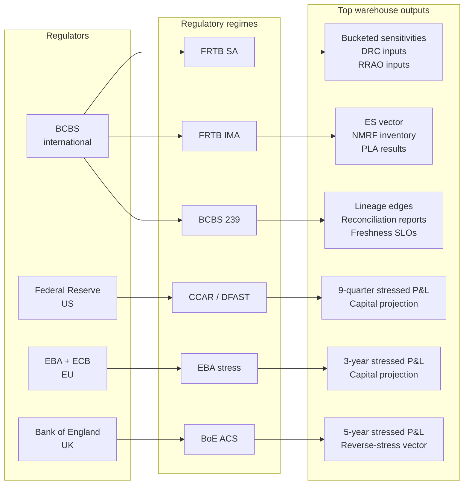

# Module 19 — Regulatory Context (Just Enough)

!!! abstract "Module Goal"
    Every fact-table column you have built across the previous eighteen modules exists because some regulator asked for it. The bitemporal stamps of M13, the lineage scaffolding of M16, the conformed dimensions of M06, the stress fact of M10, the sensitivity grain of M08 — none of these shapes were chosen aesthetically; each was forced into existence by a published standard from BCBS, the Federal Reserve, the EBA, the Bank of England, or a national supervisor reading one of those standards into local law. Module 19 opens Phase 6 of the curriculum by walking the regulatory landscape that has been the *invisible upstream* of every architectural choice in Phases 2–5. The aim is not to make you a regulatory specialist — that is a separate decade of craft, lived inside legal-and-compliance teams — but to make you a BI engineer who can read the diagram of a market-risk warehouse and name, for each load-bearing column, the regulatory text that put it there. After this module, the constraints you have absorbed without explanation become a coherent story; the trade-offs you have lived with become defensible; and the next regulatory deep-dive becomes a conversation you can participate in rather than one you survive.

---

## 1. Learning objectives

By the end of this module, you should be able to:

- **Distinguish** Basel III from FRTB SA from FRTB IMA at the level of detail a BI engineer needs — what each regime computes, what inputs it consumes, and which of your fact tables carries those inputs.
- **Identify** which regulatory regime drives which dataset in the warehouse, and articulate why the same `fact_sensitivity` row is consumed simultaneously by FRTB SA bucketing, FRTB IMA Expected Shortfall, and the desk's intra-day risk dashboard.
- **Map** the data-engineering-relevant BCBS 239 principles to concrete deliverables you can point at in the warehouse — bitemporal storage, lineage edges, reconciliation reports, freshness SLOs.
- **Recognise** the data demands of the major macro stress regimes (CCAR/DFAST in the US, EBA in the EU, Bank of England ACS in the UK) and articulate why a single conformed `fact_stress` table can serve all three without bespoke pipelines per regulator.
- **Anticipate** the regulatory submission cadences — daily backtesting and PLA, monthly and quarterly capital reports, annual and biennial stress-test cycles, ad-hoc thematic reviews — and design the warehouse's freshness and retention policies accordingly.
- **Translate** a regulatory question ("show me the IMA capital charge for the equity-derivatives desk on 2024-12-31") into the parameterised warehouse query that answers it, drawing on the lineage-and-bitemporality machinery of Phase 5.

## 2. Why this matters

A useful framing for this Phase-6 opener. The previous eighteen modules taught the *engineering* of the warehouse — the trade lifecycle, the dimensional models, the risk measures, the stress fact, the bitemporal layer, the lineage, the architecture — at increasing levels of integration. The remaining four modules (M19–M22) teach the *context* of the warehouse: the regulatory environment that shapes its design (M19), the business stakeholders that consume its outputs (M20), the recurring anti-patterns that degrade it over time (M21), and the capstone synthesis that ties everything together (M22). Phase 6 is shorter than the engineering phases because the contextual material is less *implementable* and more *intellectual*; the engineer absorbs it through reading and discussion rather than through coding exercises. M19 is the longest of the contextual modules because the regulatory frame is the largest single contextual input shaping the warehouse, and absorbing it changes how the engineer reads every architectural decision in the previous modules.

A useful empirical pattern to keep in mind across the section. The dollar amounts at stake make the regulatory framing materially different from the analytical workloads many BI engineers encounter elsewhere. A 1% mis-statement in the IMA capital charge for a global bank's trading book translates routinely into hundreds of millions of dollars of mis-allocated regulatory capital — the difference between the bank holding capital it does not need (lost return on equity) and not holding capital it does need (a potential supervisor-mandated capital-raise event). A 1-day delay in the daily PLA reporting cadence translates into a regulator-finding incident, with the consequences ranging from a warning letter to (in the worst case) a forced reversion of the affected desk to the SA capital regime. The order of magnitude of these consequences is what makes the regulatory data pipeline a *risk-class-of-its-own* engineering workload, deserving of operational severity matching the trading-system pipelines rather than the routine-analytics pipelines the engineer may have built elsewhere. The stakes are not the same as in a typical BI engagement, and the engineering discipline must rise to match.

A useful exercise to start with: pick any column from any fact table you have touched in the previous eighteen modules — `fact_sensitivity.bucket_id`, `fact_var.confidence`, `fact_pnl.flavour`, `fact_position.source_system_sk`, `dim_market_factor.is_modelable_flag` — and ask the question *why is this column here?* In every case the honest answer is some variant of *because a regulator asked for it*, with the specific regulator and the specific paragraph of the specific standard varying by column. The bucketing taxonomy on `fact_sensitivity` exists because BCBS d352 (the FRTB final standard) prescribes it. The 99% confidence on `fact_var` exists because Basel 2.5 specified it for the legacy IMA. The `is_modelable_flag` on the market-factor dimension exists because BCBS d508 introduced the NMRF concept. The bitemporal stamps on every fact exist because BCBS 239's Principle 7 demands report-as-of reproducibility. The warehouse is, to a first approximation, a *literal implementation* of an intersection of regulatory standards, with the residual being the bank-specific business logic that sits on top.

The practitioner consequence is that *not knowing* the regulatory backdrop is a strictly worse position than knowing it. An engineer who does not know why the bucketing taxonomy looks the way it does will eventually propose a "simplification" that breaks the SA capital calculation; an engineer who does not know what the PLA test is will be surprised when the desk loses IMA approval and the methodology team asks the warehouse to retroactively prove that the inputs were stable; an engineer who does not know what BCBS 239 expects will treat lineage as a nice-to-have until the next supervisory review reveals it is not. Every architectural choice in Phases 2–5 of this curriculum becomes obvious in retrospect once the regulatory frame is in view, and arbitrary-looking until then. The aim of this module is to fill in the frame so the rest stops looking arbitrary.

An empirical anchor worth carrying through the module. A typical large-bank market-risk warehouse supports, on a routine basis, on the order of 8 to 12 distinct regulatory regimes (FRTB SA, FRTB IMA, BCBS 239 evidence, CCAR or equivalent annual stress, Pillar 3 disclosures, ICAAP, plus several jurisdictional overlays) and produces on the order of 30 to 50 distinct submission templates per year (some daily, some monthly, some quarterly, some annual, plus the ad-hoc thematic responses). The submissions consume on the order of 5 to 8 conformed fact tables (`fact_position`, `fact_sensitivity`, `fact_var`, `fact_es`, `fact_pnl`, `fact_stress`, `fact_capital`, `fact_lineage_event`) and a comparable number of conformed dimensions (`dim_book`, `dim_instrument`, `dim_market_factor`, `dim_scenario`, `dim_frtb_bucket`, `dim_methodology_version`, `dim_submission_calendar`, `dim_pipeline_run`). The ratio — many regimes consuming few facts via many submission queries — is the structural shape of the regulatory workload, and the warehouse pattern that handles it is the conformed-dimensional model the curriculum has been building toward across Phases 2 through 5. The numbers vary by bank but the *order of magnitude* is stable; a team facing dramatically more facts per regime is a team that has fragmented its data along regime lines and is paying a maintenance cost for the fragmentation.

A practitioner reading guide for the rest of the module. The regulatory backdrop is wide and the temptation is to read every paragraph closely; the more useful approach for a first pass is to *skim* the framework descriptions in §3.1–§3.4 and *read closely* the data-engineering implications and the worked examples in §3.5 and §4. The framework descriptions tell you what each regime *is*; the data-engineering implications tell you what each regime *demands of your warehouse*; the worked examples show you what the implementation *looks like in SQL*. The first pass is for orientation; subsequent reads — typically when a specific regime lands on the team's plate — focus on the relevant sub-section in detail. The module is designed to support both reading patterns.

A closing note worth highlighting on the *cross-pollination* with the rest of the curriculum. The regulatory frame established here will recur explicitly in M20 (when the warehouse meets its consumers, the regulator is one of those consumers and the conversation is shaped by the regimes covered here), in M21 (where several of the most damaging anti-patterns are explicitly regulatory in nature — the team that confuses BCBS 239 evidence with documentation, the team that lets methodology version skew, the team that builds regime-specific pipelines instead of conformed facts), and in M22 (where the capstone synthesis treats the regulatory-shaped warehouse as the integrated end-state the curriculum has been building toward). The frame is, in this sense, *load-bearing* for the rest of the curriculum; every subsequent module assumes it. A reader who has not absorbed M19 will find the remaining modules harder to follow; a reader who has absorbed it will find them clarifying.

A second framing worth stating explicitly. The regulatory landscape this module covers is *practitioner-grade*, not exhaustive. The actual standards run to thousands of pages each, with national-supervisor overlays adding more, and a complete reading is the work of years inside a regulatory-affairs function. What a BI engineer needs is enough vocabulary to recognise the standards by name, enough structural understanding to know what each one demands of the warehouse, and enough reading skill to reach the relevant paragraph quickly when a colleague says "the supervisor wants the FRTB d508 paragraph 35.4 evidence for our NMRF inventory." This module gives you that working vocabulary and points at the primary sources for the day you need to go deeper. Phase 6 of the curriculum is the *contextual* phase — the modules that situate the warehouse you have learned to build inside the firm and the regulatory environment that shapes it — and Module 19 is its opening because *every* subsequent contextual module (working with the business in M20, anti-patterns in M21, the capstone in M22) assumes the regulatory frame is in place.

## 3. Core concepts

A reading note. Section 3 walks the regulatory story in six sub-sections: the Basel III/IV market-risk landscape at altitude (3.1), FRTB as the dominant regime split into SA and IMA (3.2), BCBS 239 as the data-aggregation-and-reporting standard that shaped Phase 5 (3.3), the macro stress-test regimes — CCAR, EBA, ACS — that drive `fact_stress` (3.4), the data deliverables BI teams must produce to support each regime (3.5), and the submission cadences that drive the warehouse's refresh and retention policies (3.6). Sections 3.2 and 3.5 are the load-bearing concepts for an engineer; 3.3 is the BCBS 239 translation Phase 5 implicitly assumed; 3.4 connects to Module 10's stress fact.

A second reading note on the *vocabulary* this module assumes and the vocabulary it does not. The text uses regulatory acronyms — FRTB, IMA, SA, NMRF, ES, IMCC, PLA, DRC, RRAO, CCAR, DFAST, EBA, ACS, BCBS, COREP, FFIEC, ICAAP, RCAP — without defining each one in the running text; the first occurrence of each links back to the introducing sub-section. The module does *not* attempt to cover IFRS 9 (the accounting standard for financial-instrument classification and impairment), MiFID II / MiFIR (the EU transaction-reporting and market-conduct framework), Dodd-Frank (the US post-crisis regulatory overhaul beyond CCAR), EMIR (the EU derivatives reporting and clearing framework), or the various conduct, operational, and liquidity regulations that touch financial firms but do not directly drive market-risk fact tables. Each of these is an important regulation in its own right and the warehouse the BI engineer touches will eventually have a relationship with them; the relationship is mediated by other teams (Finance for IFRS, Legal for MiFID, Trade Reporting for EMIR) and the market-risk warehouse contributes to those workstreams as a data source rather than as the primary system. The narrowing keeps this module focused on the regulations that *primarily* shape the market-risk warehouse; the broader regulatory environment is a topic for a separate curriculum.

A second reading note on what to do with this section as you read it. Section 3 is the longest single section in the module. A first pass should be a *survey* — read the sub-section headers, skim the opening paragraph of each sub-section, register the reference tables, and read the practitioner observations selectively. The detailed paragraphs are designed for a second pass when a specific regime lands on the team's plate. The worked examples in Section 4 close the loop — the regulatory frame is abstract until the SQL makes it concrete, and the SQL is what the BI engineer will actually write. The exercises in Section 6 are the test of whether the frame has stuck; readers who can answer them confidently have absorbed the module's content; readers who struggle should re-read the relevant sub-section before moving on to M20.

### 3.1 The Basel III / IV market-risk landscape

A brief historical orientation. Basel I (1988) was the original international framework, with a one-size-fits-all 8% capital ratio against credit-weighted assets. Basel II (2004) introduced the three-Pillar structure, internal-models-based credit risk, and the operational risk capital category. Basel 2.5 (2009) was the post-2008 emergency revision that tightened market-risk capital — adding Stressed VaR, the Incremental Risk Charge, and the Comprehensive Risk Measure for correlation portfolios. Basel III (2010, with subsequent revisions) raised the minimum capital ratios, introduced the conservation and countercyclical buffers, added the leverage ratio, and tightened the liquidity standards. Basel IV (the informal name for the post-2017 finalisation package) introduced the FRTB market-risk standard, the revised credit-risk standardised approach, the operational-risk standardised approach replacing AMA, and the output floor that limits the IMA-versus-SA capital benefit. The market-risk warehouse the BI engineer touches today implements primarily *Basel III-as-amended-by-FRTB*, with the warehouse's conformed-fact discipline tracing back through every revision since 2004. The historical layering matters because some warehouse columns persist across revisions (the 99% confidence on `fact_var` was a Basel II convention retained through 2.5 and now coexisting with FRTB's 97.5% ES on `fact_es`), and the engineer who recognises the layering can read the schema as a *historical artefact* of the framework's evolution rather than as an arbitrary set of choices.

The Basel Committee on Banking Supervision (BCBS) is the international standard-setter for bank prudential regulation. It does not itself have legal authority over any bank — the standards are *implemented* by national supervisors (the Federal Reserve in the US, the PRA in the UK, the EBA and the ECB in the EU, the FSA in Japan, APRA in Australia, and so on) — but the standards are sufficiently authoritative that compliance is essentially universal among internationally active banks. The Basel framework has three *Pillars*: Pillar 1 covers minimum capital requirements (the calculations a bank must do to determine its regulatory capital); Pillar 2 covers supervisory review (the bank's own assessment of risks not fully captured by Pillar 1, plus the supervisor's response); Pillar 3 covers market discipline (the disclosures the bank must make publicly so investors and counterparties can assess its risk profile). Market-risk capital lives primarily in Pillar 1, with supervisory expectations under Pillar 2 and disclosure templates under Pillar 3.

The market-risk Pillar 1 calculation has two approaches. The *Standardised Approach* (SA) is the prescribed-formula approach — the bank applies the regulator's published formulae and parameters to its sensitivities, and the output is the SA capital charge. Every bank is required to compute the SA, and for many banks (typically smaller ones, or larger ones whose internal models have not been approved) the SA *is* the regulatory capital charge. The *Internal Models Approach* (IMA) is the bank's-own-model approach — a bank that has invested in a sophisticated risk model and has had it approved by its supervisor may use the model's output (under FRTB, the Expected Shortfall plus a stressed-ES plus an NMRF capital add-on) as its regulatory capital charge. The IMA capital charge is typically lower than the SA charge for the same portfolio (which is the whole economic motivation for investing in IMA), but the approval is contingent on ongoing tests — backtesting (Module 9) and the PLA test (Module 14) — and a desk that fails the tests reverts to SA with a 30–50% capital uplift.

The capital itself is computed as *risk-weighted assets* (RWA) multiplied by the minimum capital ratio, which is 8% under Basel III plus a 2.5% capital conservation buffer plus a variable countercyclical buffer set by the national supervisor — the de-facto floor in the modern post-2017 framework is around 10.5% of RWA, with G-SIBs adding a further 1–3.5% G-SIB surcharge. The market-risk RWA is the SA or IMA capital charge multiplied by 12.5 (the inverse of the 8% capital ratio, retained for arithmetic continuity with the historical framework). The arithmetic of "SA charge → market-risk RWA → multiplied by ~10.5% to get capital required" is the calculation the warehouse must reproduce on demand for any historical date the supervisor asks about, and the bitemporal-plus-lineage discipline of M13 and M16 is what makes that reproduction queryable.

The *trading book versus banking book boundary* is one of the most consequential regulatory concepts for the warehouse, because the boundary determines which capital regime each position falls under. The banking book holds positions intended to be held to maturity (or at least without active trading intent) — primarily the lending book — and is subject to *credit risk* capital (a separate Basel framework, not covered here). The trading book holds positions intended for short-term resale or hedged with positions intended for resale — primarily derivatives and securities held by the markets desks — and is subject to *market risk* capital (the FRTB framework this module focuses on). FRTB has *redrawn* the boundary relative to the previous framework: the new boundary has stricter rules about which positions can be classified as trading-book, stricter rules about *rebooking* a position from one book to the other (the capital arbitrage of moving a position whichever way reduces the headline capital number is no longer permitted without supervisory notification), and requires the bank to maintain a documented policy for the boundary that the supervisor can review. The data-engineering implication is that every position carries a *regulatory book classification* on its dimension (`dim_book.regulatory_classification` — `TRADING_BOOK`, `BANKING_BOOK`, or `BOUNDARY_OTHER`), and the warehouse must surface every change in classification as an audit-trail event so the supervisor can satisfy themselves no quiet rebooking is happening.

A reading note on the *Pillar 1 capital arithmetic* the warehouse must reproduce. The Pillar 1 calculation chain is *SA charge → market-risk RWA → market-risk capital required → contribution to total capital ratio*. Each link in the chain is a multiplication or a ratio with parameters published by the supervisor; each link must be reproducible against the parameters in force on the calculation date. The warehouse pattern: store the SA charge (or the IMA equivalent) at the per-business-date grain, derive the RWA via the published 12.5 multiplier, derive the capital required via the per-jurisdiction minimum capital ratio (which itself can vary over time as buffers are activated or deactivated), and surface the chain as a queryable view. A team that has stored only the headline capital number cannot reproduce the chain; a team that has stored every link can defend any historical capital number with the full arithmetic visible.

A practitioner observation on the *jurisdictional implementation lag*. The Basel standards are international; the implementation is national; the gap between the BCBS publication date and the local effective date is routinely measured in years and occasionally in decades. FRTB was finalised at the BCBS level in 2016, revised in 2019, and as of 2026 has not yet reached uniform live status across the major jurisdictions — the EU's CRR3 transposition, the US Basel-Endgame proposal, and the UK PRA's near-final policy statement each have their own effective dates, their own transitional arrangements, and their own carve-outs from the BCBS text. The warehouse implication is that a global bank operating across jurisdictions runs *parallel* market-risk regimes during the transition window — Basel 2.5 IMA in one jurisdiction, FRTB SA in another, FRTB IMA in a third — and the warehouse must serve all three simultaneously. The conformed-fact-tables-many-regimes pattern matters at this scale because the alternative — three jurisdiction-specific warehouses — fragments the data and makes cross-jurisdictional capital aggregation a separate forensic exercise.

A reference table at altitude — the regimes the BI engineer is most likely to encounter and the BCBS document number that anchors each:

| Regime              | Anchor document        | Status (2026)                          | Primary owner        |
| ------------------- | ---------------------- | -------------------------------------- | -------------------- |
| Basel 2.5 IMA (legacy) | BCBS d193 (2009)    | Being phased out under FRTB            | Risk Methodology     |
| FRTB SA             | BCBS d352 / d508       | Live in most jurisdictions             | Risk + Finance       |
| FRTB IMA            | BCBS d352 / d508       | Live where supervisor has approved     | Risk Methodology     |
| BCBS 239            | BCBS d239 (2013)       | Continuous compliance, G-SIBs and D-SIBs | Risk Data + Governance |
| CCAR / DFAST        | Fed regulatory issuances | Annual cycle, US                     | Capital Planning     |
| EBA stress          | EBA methodology notes  | Biennial cycle, EU                     | Capital Planning     |
| BoE ACS             | BoE Stress Testing handbook | Annual cycle, UK                  | Capital Planning     |

A practitioner observation on the *Basel 2.5 legacy*. Even as FRTB rolls out, the Basel 2.5 framework (the post-2010 revision that introduced Stressed VaR and the Incremental Risk Charge alongside the standard 99% 10-day VaR) remains in operational use in jurisdictions where FRTB is not yet live, and the warehouse's `fact_var` table typically retains the Stressed VaR component as a parallel measure even after FRTB IMA is approved. The practitioner reading: do not delete the Basel 2.5 calculations the day FRTB goes live; expect them to remain in the warehouse for transitional reasons, for back-comparison purposes, and because some jurisdictions' supervisors continue to ask for them as a sanity check on FRTB outputs. The bitemporal layer makes the parallel-running tractable — the same `fact_var` row can carry a Basel 2.5 component and an FRTB IMA component side by side, with the SCD2 dimension tracking which methodology was authoritative on which date.

A practitioner observation on the *Pillar 2 / Pillar 3 distinction* and what it means for the warehouse. Pillar 2 — the supervisory review process — is where the bank's own assessment of risks not fully captured by Pillar 1 lands. The bank's Internal Capital Adequacy Assessment Process (ICAAP) is the formal annual document produced under Pillar 2, summarising the bank's view of its capital adequacy across all risk types and stress conditions. The market-risk warehouse contributes the market-risk slice of the ICAAP — the standalone capital number, the stressed-VaR equivalent, the FRTB IMA capital trajectory under the bank's own scenarios, the model-validation evidence — alongside parallel contributions from the credit-risk, operational-risk, and liquidity-risk warehouses. Pillar 3 — market discipline through public disclosure — is where the bank's quarterly capital and risk disclosures land, in templates standardised by BCBS (and locally by EBA, Fed, PRA). The market-risk warehouse contributes the disclosure templates the bank publishes on its investor-relations website. Both Pillars consume the same conformed facts as the supervisory submissions; the difference is the audience (Pillar 2 = the supervisor reading the bank's self-assessment; Pillar 3 = the market reading the bank's standardised disclosures) and the presentation (Pillar 2 = narrative-heavy with supporting numbers; Pillar 3 = template-driven with limited narrative).

A reading note on *the supervisor's evolving expectations on technology*. Supervisors increasingly expect banks to demonstrate technology-platform sophistication in addition to the data-discipline expectations of BCBS 239. Recent supervisory commentary across jurisdictions has signalled expectations on cloud platforms (security, residency, vendor risk), AI/ML model governance (where the warehouse contributes by recording every dataset that feeds every model), open-source software supply-chain (where the warehouse's infrastructure is itself audited), and the cyber-resilience of the warehouse (operational continuity under a cyber incident). The market-risk BI engineer is rarely the primary owner of these technology-platform questions, but the warehouse the team operates is a *substrate* on which the questions are asked and the warehouse's design choices have implications for the answers. The discipline is to participate in the technology-platform conversations as the warehouse's representative, contributing the warehouse's view of how the platform discussions affect the data discipline.

A reading note on *the supervisory-college dynamics* for global banks. A bank operating in multiple jurisdictions deals with multiple supervisors simultaneously — the home-country lead supervisor (typically the bank's primary regulator), the host-country supervisors (one per significant jurisdiction), and the supervisory college that coordinates among them. The college framework is established under BCBS principles and operationalised through bilateral supervisory agreements; the home supervisor takes the lead role for capital and group-level matters, the host supervisors retain authority for jurisdictional matters within their borders. The data team's deliverable to a supervisory college is typically a *consolidated* view (the firm-wide capital number rolled up from all jurisdictions) plus *jurisdictional* views (the per-jurisdiction subsidiary or branch view) — both produced from the same conformed warehouse with different aggregation grains. The discipline is to treat the warehouse as a *single source of truth* for both views, with the per-jurisdiction view derived from the consolidated by filtering on the legal-entity or jurisdiction dimension, rather than to maintain separate data stores per jurisdiction.

A reading note on *the bank's relationship with its primary supervisor* as the most consequential operational anchor. Across all of the regimes covered in this module, the bank's relationship with its primary supervisor is the foundational thread the BI engineer should be aware of without owning. The relationship is built across years through routine submissions, ad-hoc engagements, formal reviews, and informal conversations; it is held by the bank's regulatory-affairs function and senior risk leadership, not by the data team. The data team's contribution to the relationship is its operational reliability — delivering on cadence, producing defensible numbers, answering questions promptly, surfacing problems early. Each successful interaction strengthens the relationship; each operational failure weakens it. The data team that has internalised the connection between its day-to-day execution and the bank's supervisory standing operates with appropriate care; the team that has not treats the regulatory pipeline as just another workload and is surprised when an operational failure prompts a supervisor letter.

A second observation on the *long arc of the Basel framework's evolution*. Basel I in 1988 was 30 pages; Basel II in 2004 was several hundred pages; the post-2008 layering of Basel 2.5, Basel III, BCBS 239, FRTB, and the various Basel IV components now totals several thousand pages of standards plus several thousand more of supervisory interpretations and national overlays. The trajectory is one of *increasing granularity* — each cycle adds finer requirements on data, modelling, governance, and reporting. The warehouse's design is the operational embodiment of this trajectory; columns and tables that exist today were forced into existence by specific cycles. An engineer who understands the trajectory understands not only where the warehouse is today but the *direction* the next cycle will push it — typically more granular risk-factor decomposition, more frequent reporting, more extensive evidence requirements, and broader scope to non-traditional risk types (climate, cyber, conduct). The next decade's warehouse will be a strict superset of today's, with the same backbone extended further.

### 3.2 FRTB — the Fundamental Review of the Trading Book

FRTB is the dominant market-risk regulation of the modern era. Originally published as BCBS d352 in 2016 and revised in 2019 as BCBS d508, with an implementation timeline that has slipped repeatedly across jurisdictions but is broadly settling in the 2024–2026 window, FRTB replaces the Basel 2.5 market-risk framework with a substantially more granular and substantially more data-hungry regime. Every market-risk warehouse the BI engineer is likely to touch in the next decade is either implementing FRTB, has just implemented FRTB, or is preparing for the next FRTB-revision cycle. Knowing FRTB at the conceptual level is the price of admission for the role.

A reading note on *the IMA's economic-versus-regulatory tension*. The IMA's economic appeal is real — a sophisticated model produces lower capital than the conservative SA. The regulatory tension is also real — the supervisor wants the model to be defensible, conservative, and consistent across banks, with the various tests (PLA, backtesting, NMRF assessment) calibrated to push the bank's IMA capital toward the SA capital rather than away from it. The bank's methodology team navigates the tension by choosing model parameters that satisfy the tests while preserving as much of the economic capital benefit as possible. The data team supports the navigation by producing inputs that the methodology team can rely on; an unreliable input forces the methodology team to add conservatism, which erodes the capital benefit, which reduces the IMA's economic appeal. The discipline is to produce inputs the methodology team trusts; the resulting capital benefit is, indirectly, the data team's contribution to the bank's economic outcome.

A reading note on *the operational drudgery of FRTB SA*. The FRTB SA calculation is mechanical — bucket the sensitivities, apply the risk weights, apply the within-bucket correlations, apply the cross-bucket correlations, sum across risk classes, add DRC and RRAO. There is no model judgement, no calibration uncertainty, no ongoing test discipline; the calculation produces the same number from the same inputs every time. The operational burden is in the *upstream* — getting the per-position sensitivities into the warehouse with the correct bucketing, getting the issuer reference data current for the DRC, classifying the positions for the RRAO. A team that operates SA well has invested in the upstream pipelines and treats the SA calculation itself as a thin computational layer on top; a team that struggles with SA is typically struggling with the upstream rather than with the SA arithmetic. The discipline is to recognise the SA's mechanical nature and to invest the engineering effort where it matters — in the quality and timeliness of the inputs, not in tweaking the calculation that consumes them.

A second observation on the *post-implementation revision cycle*. The BCBS standards are not static; each major standard is followed by a revision cycle that fixes implementation issues, clarifies ambiguous text, and adjusts calibration parameters. FRTB has already gone through one revision (BCBS d508 in 2019 revising d352 from 2016) and is in its first post-implementation review at the time of writing, with a further revision cycle expected mid-decade. The data-engineering implication is that the warehouse must be *revision-aware* — the bucketing taxonomy, the correlation matrices, the modelability test parameters, the NMRF stress methodology each have a *version* in `dim_methodology_version`, and the warehouse can reproduce any historical calculation against the methodology version that was in force at the time. A team that has not built the methodology-version dimension is a team that cannot answer the supervisor's "did you compute the 2024 capital number under the methodology in force in 2024 or under the current methodology?" question without a multi-day forensic exercise.

A reference table that captures the FRTB SA versus IMA decision at a glance for the BI engineer:

| Aspect              | FRTB SA                                              | FRTB IMA                                              |
| ------------------- | ---------------------------------------------------- | ----------------------------------------------------- |
| Calculation basis   | Bucketed sensitivities × prescribed risk weights     | Full-revaluation Expected Shortfall                   |
| Inputs from warehouse | Delta, Vega, Curvature per regulator bucket        | ES vector per modelable risk factor + NMRF inventory  |
| Approval required   | No (always available as fallback)                    | Yes (per desk, ongoing tests)                         |
| Capital cost        | Higher (typically 30–50% above IMA equivalent)       | Lower (the economic motivation for the investment)    |
| Test cadence        | None (mechanical calculation)                        | Daily backtesting + daily PLA + monthly NMRF retest   |
| Failure mode        | None — the calculation always works                  | Loss of IMA approval reverts the desk to SA           |
| Owning fact tables  | `fact_sensitivity` + `dim_frtb_bucket` + `fact_drc_input` | `fact_es` + `fact_nmrf_inventory` + `fact_pla_test` |
| Reference text      | BCBS d352 / d508 §10–§40                             | BCBS d352 / d508 §50–§70                              |

A practitioner observation on the *FRTB transition arithmetic*. A bank moving from Basel 2.5 IMA to FRTB IMA typically sees its market-risk capital requirement increase by 30–60% on the same portfolio, driven by three structural changes: the move from VaR-99% to ES-97.5% (modestly higher capital intensity for the same distribution), the addition of the NMRF capital charge (which can dominate for certain exotic-derivative books), and the more granular risk-factor-level model approval (which restricts diversification benefit relative to the previous portfolio-level approval). A bank moving from Basel 2.5 IMA to FRTB SA typically sees its capital increase by 200–400% — the Standardised Approach is calibrated to be punitive enough that IMA remains the economically preferred path for any flow desk that can sustain it. The data-engineering implication is that the FRTB transition is not a like-for-like swap; the warehouse must support both regimes in parallel through the transition window, and the methodology team will spend years tuning the IMA calibration to bring the capital number down to a defensible level. The conformed-fact-tables-many-regimes pattern is what makes the parallel-running tractable.

A reading note on FRTB's *structural shape* before the SA/IMA walks. FRTB has three calculation paths the bank may choose between (subject to supervisory approval): the Standardised Approach (SA, available to every bank), the Internal Models Approach (IMA, requiring supervisor approval), and a *Simplified Standardised Approach* (SSA, available only to small banks with limited trading-book activity). Most BI engineers will encounter SA and IMA in their warehouses; SSA is rare in the institutions that build sophisticated market-risk warehouses. The two main paths consume largely the same warehouse inputs (positions, sensitivities, prices) with substantially different output calculations and substantially different operational discipline (SA is mechanical and stable; IMA is model-driven and subject to ongoing test discipline). The conformed-fact pattern serves both paths from the same data backbone, with the path-specific aggregation living in regime-specific dbt models on top.

**FRTB SA — the Standardised Approach.** The SA is a *bucket-based sensitivities approach*. The bank computes Delta, Vega, and Curvature sensitivities for every position, classifies each sensitivity into one of seven *risk classes* (General Interest Rate Risk or GIRR; Credit Spread Risk for non-securitisations or CSR-NS; Credit Spread Risk for securitisations or CSR-S; Equity; FX; Commodity; and Credit Spread for the correlation trading portfolio), and within each risk class assigns each sensitivity to a *bucket* defined by an issuer / tenor / currency / sector taxonomy that BCBS publishes in the standard. The bucketed sensitivities are then aggregated within each bucket using a prescribed correlation matrix (BCBS publishes the matrix; the bank does not get to estimate it), then aggregated across buckets within each risk class using a second prescribed correlation matrix, then aggregated across risk classes by simple summation. The output is the *sensitivities-based capital charge*. To this is added a *Default Risk Charge* (DRC) for positions exposed to issuer default, computed via a separate sensitivity-and-recovery formula, and a *Residual Risk Add-On* (RRAO) for risks the sensitivity-based framework does not capture (exotic-payoff risk, gap risk on barrier options, correlation risk on bespoke baskets) computed as a fixed percentage of the notional of the affected positions.

The data-engineering implication of FRTB SA is that `fact_sensitivity` must carry the *regulatory bucketing taxonomy* alongside whatever risk-management taxonomy the desk uses. The two are typically *not* the same — a desk's vega bucket might be "10y EUR swaption ATM volatility surface point" while the FRTB SA bucket is "GIRR vega bucket 6 (10–15y tenor, EUR currency)" — and reporting one as if it were the other is a category error that will fail an SA capital calculation silently. The warehouse's `dim_frtb_bucket` dimension carries the SA bucketing taxonomy explicitly, and `fact_sensitivity` joins to both `dim_risk_factor` (the risk-management view) and `dim_frtb_bucket` (the regulatory view), with the join keys derived from the position's instrument, currency, tenor, and issuer.

A practitioner reading note on the *granularity* of the FRTB SA bucketing. Each risk class has its own bucket structure, and the structures are not symmetric — GIRR has roughly 10 currency buckets × 10 tenor buckets per currency = ~100 buckets; CSR-NS has roughly 18 buckets defined by sector and credit quality; Equity has 11 buckets defined by economy, market cap, and sector; FX has buckets per currency pair (the bucket count varies by national overlay); Commodity has 11 buckets by commodity type. The total bucket count across all risk classes is in the low hundreds — small enough to fit comfortably in a `dim_frtb_bucket` table, large enough that the manual coding of every bucket is error-prone (the discipline is to source the bucket definitions from a versioned reference file checked into source control, not to type them out in a CREATE TABLE statement). A bank operating in multiple jurisdictions may also need to support jurisdictional bucket variants (the EU's CRR3 transposition, the US Basel-Endgame proposal, and the UK PRA's policy each have minor bucket-definition deviations from the BCBS source); the dimension's design must accommodate the variants without proliferating into one-bucket-per-jurisdiction sprawl.

A reference table of the FRTB SA risk classes the BI engineer will encounter on `fact_sensitivity` and `dim_frtb_bucket`:

| Risk class | Full name                                       | Typical sensitivities | Bucket dimension                   |
| ---------- | ----------------------------------------------- | --------------------- | ---------------------------------- |
| GIRR       | General Interest Rate Risk                      | Delta, Vega, Curvature | Currency × tenor band            |
| CSR-NS     | Credit Spread Risk (non-securitisation)         | Delta, Vega           | Issuer credit quality × sector × maturity |
| CSR-S      | Credit Spread Risk (securitisation)             | Delta, Vega           | Securitisation tranche × seniority |
| Equity     | Equity risk                                     | Delta, Vega, Curvature | Issuer market cap × economy × sector |
| FX         | Foreign exchange risk                           | Delta, Vega, Curvature | Currency pair                      |
| Commodity  | Commodity risk                                  | Delta, Vega, Curvature | Commodity type × delivery location |
| CTP        | Correlation Trading Portfolio                   | Specific Delta + DRC  | Tranche, with its own framework    |

The bucketing taxonomy is *prescribed* by BCBS — the bank does not get to choose its bucket boundaries — and the warehouse's `dim_frtb_bucket` is essentially a transcription of the BCBS annex into a queryable dimension table. A change in the bucket taxonomy (which has happened twice between BCBS d352 and d508, and is likely to happen again in future revisions) is a Phase 2 dimension-change event that the warehouse must propagate to every dependent fact and every dependent submission view. The SCD2 history on `dim_frtb_bucket` is the audit-trail mechanism that makes the propagation traceable.

A second observation on the SA's *Default Risk Charge* (DRC) and *Residual Risk Add-On* (RRAO). The DRC captures the capital impact of issuer default — the risk that a bond issuer or a single-name credit derivative reference name defaults outright — and is computed on a separate sensitivity-and-recovery basis that joins to the bank's issuer-rating and recovery-assumption reference data. The RRAO captures the risks the sensitivity-based framework cannot model — the gap risk on barrier options, the correlation risk on bespoke baskets, the exotic-payoff risk on structured products — and is computed as a fixed percentage of the notional of the affected positions (the percentage varies by product type and is published in the standard). Both are *additive* to the sensitivities-based capital charge — they do not benefit from the within-bucket or cross-bucket diversification of the sensitivities calculation. The data-engineering implication is that the warehouse must carry, alongside `fact_sensitivity`, a `fact_drc_input` table at issuer grain (for the DRC) and a flagged subset of positions on `fact_position` carrying the RRAO product-type classification (for the RRAO). The three components combine at the top of the SA calculation, with each component traceable independently for audit purposes.

A third observation on the *SA as a permanent fixture*. Even in a bank with widespread IMA approval, the SA remains operationally significant for several reasons: (1) it is the *floor reference* under the Basel IV output floor (capping IMA capital at 72.5% of SA), so the SA must be computed in parallel for the floor calculation; (2) it is the *fallback* if any desk loses IMA approval (the desk reverts to SA on the day approval is lost, with no transition window); (3) it is the *new-desk default* — a desk that has not yet earned IMA approval is on SA from the first day, and the SA infrastructure must support the new desk immediately; (4) it is the *reconciliation reference* — the supervisor expects the bank to demonstrate the IMA capital is reasonable relative to the SA capital, and the comparison is part of the IMA approval renewal. The right operational discipline is to treat the SA pipeline as a permanent fixture co-running with the IMA pipeline, with the same data inputs, the same scheduling discipline, and the same reproducibility expectations.

A fourth observation on *the SA's growing dominance* in jurisdictions where IMA approval is granted sparingly. Several supervisors have signalled a preference for fewer, higher-quality IMA approvals rather than broader IMA usage; the result is that some banks find themselves operating substantially more of their trading book under SA than the original FRTB design contemplated. The data-engineering implication: the SA pipeline is the *primary* pipeline for those banks, with IMA covering only a few flagship desks. The conformed-fact-tables pattern is regime-agnostic — the same `fact_sensitivity` serves the SA-heavy and IMA-heavy banks alike — and the discipline scales without modification. The practitioner reading: do not assume the IMA is the dominant calculation in the warehouse; for many banks today, the SA is.

**FRTB IMA — the Internal Models Approach.** The IMA is a *full-revaluation Expected Shortfall approach*. The bank computes a 97.5% Expected Shortfall (ES) at a 10-day horizon for every *modelable risk factor* — a risk factor for which the bank has sufficient observable historical price data to credibly estimate the distribution. The ES is computed both on the current period's market data and on a *stressed period* (a 12-month historical window of significant financial stress, typically calibrated to include 2008 and the COVID-19 stress), giving ES_t (current) and S-ES (stressed). For *non-modelable risk factors* (NMRFs) — risk factors that fail the modelability tests of BCBS d508 — a separate stress-based capital charge is computed using a stressed scenario with no diversification benefit. The three components are combined into the *Internal Models Capital Charge* (IMCC) by a formula that takes the maximum of the current-period and stressed-period ES across an aggregation hierarchy plus the NMRF charge, with diversification benefit recognised within risk classes but not across them.

The data-engineering implication of FRTB IMA is that the warehouse must carry, for every modelable risk factor, an *ES vector* (the time series of the desk's P&L distribution under the model's scenarios), an *NMRF inventory* (the list of risk factors deemed non-modelable, with the supporting evidence — the price observations the modelability test was run on, the test result, the date of the most recent re-test), the PLA test results (Module 14) and the backtesting results (Module 9) for every desk on every business day. The ES vector lives in a `fact_es` (or sometimes a `fact_pnl_distribution`) table at a grain of (desk, risk_factor, business_date, as_of_timestamp, scenario_id); the NMRF inventory lives in a `dim_market_factor` extension or a separate `fact_nmrf_inventory` table that is updated on the modelability-test cadence (typically monthly). The PLA and backtesting results live in `fact_pla_test` and `fact_backtest` tables that the regulator's submission process reads from.

A second observation on the *modelability test* itself. The test of whether a risk factor is modelable (and therefore eligible for the ES treatment rather than the punitive NMRF treatment) is data-driven: the risk factor must have at least 24 *real* observable price observations over the past 12 months, with a minimum of one observation per 30-day window and a maximum gap of 90 days between observations. The arithmetic is straightforward; the data-engineering challenge is sustaining the *evidence* — the warehouse must be able to demonstrate, for any given risk factor on any given assessment date, the count of qualifying observations, the dates of each observation, the source of each observation (the vendor feed, the broker quote, the executed transaction), and the test outcome. The `fact_market_factor_observation` table that supports this lives at a grain of (risk_factor, observation_date, source_id, as_of_timestamp) and feeds a monthly modelability assessment that updates `dim_market_factor.is_modelable_flag` under SCD2 so the historical modelable status at any past date is queryable.

A third observation on the *NMRF capital arithmetic*. The NMRF capital charge is computed by stressing each non-modelable risk factor under a regulator-prescribed extreme scenario (a "worst-case" historical move over the relevant horizon), with no diversification benefit recognised across NMRFs. The arithmetic is brutal: every NMRF contributes its full stressed loss to the capital number, and a desk with many NMRFs faces a substantial NMRF capital charge even if its modelable-risk-factor ES is small. The data-engineering implication is that the NMRF inventory is a *capital driver*, and reducing the NMRF count (by sourcing additional price observations to upgrade marginal risk factors to modelable status) is a *capital optimisation* exercise. The warehouse's role: maintain the per-risk-factor observation history with high fidelity, surface the modelability status on a dashboard the methodology team uses to prioritise observation-sourcing efforts, and reproduce the NMRF inventory at any past assessment date so the capital number reproduces.

A fourth observation on the *ES-versus-VaR conceptual difference* and why the FRTB switch matters. Value at Risk (VaR — the Basel 2.5 framework's primary measure) is a *quantile* — the loss exceeded only on a small fraction of days under the model's distribution. Expected Shortfall (ES — FRTB's primary measure) is a *conditional expectation* — the average loss in the tail beyond the quantile. ES has theoretical properties VaR lacks (it is a *coherent risk measure*, sub-additive in the way risk managers want; it captures the *severity* of tail events VaR sees only the *threshold* of), and the FRTB switch from VaR-99% to ES-97.5% reflects two decades of academic and practitioner critique of VaR's failure during the 2008 crisis (where the worst losses were in the tail beyond VaR's threshold). The data-engineering implication is that the warehouse's `fact_es` carries the conditional expectation per scenario, not the quantile cut — the underlying P&L distribution must be retained at the per-scenario grain rather than collapsed to the quantile, so the conditional-expectation arithmetic is reproducible. A warehouse that has stored only the quantile cuts (the legacy VaR pattern) cannot reproduce ES without re-running the model; the discipline for FRTB is to retain the full per-scenario P&L distribution.

**The IMCC formula at a level a BI engineer needs.** The IMCC combines four components: ES_t (current-period Expected Shortfall, scaled across the desk hierarchy), S-ES (stressed-period Expected Shortfall, similarly scaled), an NMRF stress capital charge (no diversification), and a multiplier that depends on the desk's backtesting performance. The formula's headline shape is roughly *IMCC = max(IMCC_t, IMCC_avg) + NMRF_charge*, where IMCC_t is the current day's ES (current and stressed combined), IMCC_avg is the rolling average over the past 60 business days, and the multiplier kicks in if backtesting exceptions exceed a regulator-defined threshold. The exact arithmetic has annexes and corner cases the methodology team owns; the BI engineer's responsibility is to ensure the inputs (ES_t, S-ES, NMRF, the backtesting exception count, the rolling-window membership) are queryable, reproducible, and bitemporally consistent.

**DRC under IMA.** Even under IMA, the *Default Risk Charge* is computed separately, typically using a credit-default-simulation model that draws on issuer ratings, recovery assumptions, and correlation parameters distinct from the ES model. The DRC under IMA is *not* simply the DRC under SA; it is its own calculation with its own approval requirements and its own data inputs (issuer-level exposure, rating, jurisdiction, recovery assumption). The warehouse carries `fact_drc_input` at a grain of (issuer, business_date, as_of_timestamp, exposure_metric) and the IMA DRC engine reads from it directly.

**The PLA test as the IMA gatekeeper.** The Profit-and-Loss Attribution test of Module 14 is the regulator's mechanism for verifying that the bank's IMA model actually represents the desk's exposure. Each business day, the desk's hypothetical P&L (full revaluation under observed market moves) is compared against its risk-theoretical P&L (the Greek-based prediction); two statistics are computed (KS statistic on the rank distribution, Spearman correlation); and the desk is placed in the green / amber / red traffic-light zone. *A desk that is in the red zone for two consecutive quarters loses IMA approval and reverts to SA*, with the typical 30–50% capital uplift that follows. The data-engineering implication is severe: the PLA test must be runnable on demand, reproducible bitemporally, and surfaced on a daily dashboard the methodology team monitors closely. A warehouse that cannot run the PLA test on a past business date — or worse, a warehouse that produces a different PLA outcome on re-run than it produced originally — is a warehouse that has just made the IMA loss harder to defend.

A fifth observation on the *backtesting discipline* under FRTB IMA. Daily backtesting compares the desk's actual P&L to the previous day's VaR (or, under FRTB, the previous day's 99% VaR computed from the ES model as a parallel calculation); an *exception* is a day where the actual loss exceeds the predicted threshold. Under FRTB the exception count over the rolling 250-business-day window drives a *multiplier* on the IMA capital charge — between 4 and 12 exceptions in the window adds a graduated multiplier (typically 1.0 to 1.5×); more than 12 exceptions triggers supervisory escalation; persistent excessive exceptions can trigger IMA disqualification. The daily backtesting and the daily PLA test together are the *two ongoing tests* the IMA approval is contingent on — a desk that fails either over the relevant window faces capital-uplift consequences. The data team's role is to make both tests reproducible bitemporally, surfaced on a daily dashboard the methodology team monitors, and instrumented with full lineage back to the underlying P&L and VaR/ES calculations.

**The desk-level granularity of FRTB IMA.** A subtle but consequential FRTB design choice the BI engineer must internalise is that the IMA approval is granted per *trading desk* — not per business line, not per legal entity, not at the bank level. A bank applying for IMA submits a list of desks (each desk being a precisely-defined organisational unit with documented head, mandate, and position scope) and the supervisor approves or denies each desk individually. The capital calculation then runs per desk, the PLA test runs per desk, the backtesting runs per desk, and the loss of IMA approval is per desk — one desk's red-zone status does not affect its sibling desks. The data-engineering implication is that `dim_book` (or `dim_desk` if the warehouse models the two separately) carries the FRTB desk identifier, the desk's IMA approval status with effective dates under SCD2, and the parent-desk hierarchy so capital aggregation can roll up correctly. A warehouse that treats "desk" as an interchangeable label rather than as a regulated organisational primitive will fail the FRTB submission's most basic structural check.

**A practitioner observation on what the supervisor actually reviews.** A common misconception when a BI engineer first encounters FRTB is that the supervisor reviews the *capital number*. The supervisor reviews much more: the modelability test inputs and outputs (was the methodology applied correctly to each risk factor?), the NMRF stress scenarios (are they severe enough?), the PLA test results (are they consistent with the model's claimed accuracy?), the backtesting exception narratives (does the bank investigate each exception or accept them mechanically?), the desk-level governance (is the desk head named, is the position scope documented, are the changes governed?), and the bitemporal reproducibility of every reported number (can the bank re-produce the IMA capital for any past business date in the retention window?). The capital number is the *output* the supervisor is ultimately concerned with, but the review is overwhelmingly about the *evidence chain* leading to that number. A warehouse that can produce the capital number but cannot produce the evidence chain is a warehouse that fails the IMA review even when the capital number itself is correct.

A fourth observation on the *output floor* introduced under Basel IV. The output floor caps the IMA capital benefit at 72.5% of the equivalent SA capital — that is, no matter how favourable the IMA's economic-capital number, the regulatory capital cannot fall below 72.5% of what the SA would have computed for the same portfolio. The floor was a 2017 BCBS compromise that recognised IMA's economic value while limiting the dispersion of capital outcomes across banks running similar portfolios. The data-engineering implication is that the warehouse must compute *both* the SA and the IMA capital numbers in parallel, with the floor calculation living as a downstream view that takes the maximum of (IMA capital, 0.725 × SA capital). A bank that has invested heavily in IMA but has not run the SA in parallel will discover during the supervisor's first floor calculation that the SA infrastructure is incomplete and the floor cannot be calculated correctly. The right pattern from day one is to treat the SA pipeline as a permanent fixture even after IMA is approved; the SA is the *floor reference* and the warehouse must keep producing it.

A fifth observation on the *FRTB SA versus IMA decision* from the bank's perspective. A bank chooses to invest in IMA when the expected capital saving over the medium term outweighs the cost of the model development, the ongoing test discipline, the supervisor approval cycle, and the operational risk of losing IMA approval. For a high-flow trading desk with a stable risk profile, the saving is typically substantial and the IMA investment is straightforward to justify. For a low-flow or rapidly-changing desk, the SA may be operationally simpler and the capital differential not worth the investment. The decision lives at the methodology and capital-planning level; the data team supports both regimes regardless. The warehouse pattern that handles both cleanly is the same conformed `fact_sensitivity` table feeding both the SA pipeline and (where IMA is in scope) the ES calculation — the SA never goes away, the IMA is added on top for the desks where it is justified.

A sixth observation on *the trading-book / banking-book boundary under FRTB*. The boundary's sharpness is one of FRTB's most discussed features. Under the previous framework, banks had wide discretion to classify positions across the boundary, with documented but loosely enforced policies. FRTB tightened the rules substantially: positions must be classified at the moment of inception and the classification is presumptive (a position in the trading book is assumed to be trading-book unless the bank can demonstrate otherwise); rebooking from one book to the other requires supervisory notification and can trigger a capital re-assessment; the bank must maintain a documented and enforced boundary policy that the supervisor reviews. The data-engineering implication is severe — the warehouse must record every position's classification at every point in time (SCD2 on `dim_book.regulatory_classification`), every change with the operator and approval reference (`fact_lineage_event` with `event_type = 'RECLASSIFY'`), and produce on demand the full classification history for any position. A warehouse that cannot answer "when did this position move from banking book to trading book and who approved it" is a warehouse that cannot defend the bank's boundary policy under supervisory scrutiny.

### 3.3 BCBS 239 — Principles for Effective Risk Data Aggregation and Risk Reporting

BCBS 239 (the document number is the standard's de-facto name; the official title is *Principles for effective risk data aggregation and risk reporting*) was published in 2013 and applies formally to globally systemically important banks (G-SIBs) and increasingly to domestic systemically important banks (D-SIBs). It sets out fourteen principles covering governance, infrastructure, data aggregation, reporting, and supervisory review. The standard is short — fewer than thirty pages — and the principles are stated at a high level, leaving the implementation detail to the bank and the supervisor's interpretation. Despite the brevity, BCBS 239 has shaped Phase 5 of this curriculum more than any other single document: the bitemporality discipline of M13, the data-quality discipline of M15, and the lineage discipline of M16 each map directly to one or more of the fourteen principles.

The data-engineering-relevant principles, recapping from Module 16's longer treatment:

- **Principle 3 — Accuracy and integrity.** The warehouse's reported numbers reconcile to authoritative sources, the reconciliation is documented and queryable, and source-system provenance is recorded on every fact row.
- **Principle 5 — Timeliness.** Data is available on the cadence the consumer requires; the warehouse's freshness SLOs are documented, monitored, and breached only with documented reason.
- **Principle 6 — Adaptability.** The warehouse can answer ad-hoc supervisory questions in reasonable time; the schema does not require months of re-engineering to support a new question.
- **Principle 7 — Accuracy of risk reports.** The reports the warehouse produces accurately convey the underlying risk numbers; restatements are recorded, not silent; the bitemporal layer makes any past report reproducible.
- **Principle 8 — Comprehensiveness.** The warehouse covers all material risks; the coverage is documented and gaps are remediated on a published schedule.
- **Principle 9 — Clarity and usefulness.** Reports are self-documenting with respect to their data provenance; the lineage graph is queryable from the BI tool.
- **Principle 11 — Distribution.** The right reports go to the right people at the right time; the distribution is logged and audited.

The other principles (P1, P2, P4, P10, P12, P13, P14) are governance-oriented or supervisory-cooperation-oriented; the data team supports them by producing the evidence the governance function packages, but does not own them directly. The supervisor's audit toolkit includes *thematic reviews* (a deep-dive into a specific aspect of the bank's risk-data layer, run every two to three years), *on-site inspections* (a multi-week regulatory team taking up residence inside the bank), and *data sampling* (the supervisor specifies a random sample of reported numbers and asks the bank to demonstrate the reproduction of each). The warehouse that is built with the lineage-and-bitemporality discipline of Phase 5 in place can answer the data-sampling question by parameterised query in minutes; the warehouse that has not been so built spends weeks and produces a worse answer.

A reading note on *the wider supervisory environment surrounding BCBS 239*. National supervisors typically pair their BCBS 239 expectations with adjacent guidance — model risk management (the Fed's SR 11-7, the PRA's SS1/23, the EBA's Guidelines on Internal Governance), data governance (typically embedded in the bank's overall risk-data-governance framework), and operational resilience (post-2020 expectations on the bank's ability to continue operating under stress). The market-risk warehouse touches all of these adjacent domains: the model risk management framework reads from the warehouse for model inputs and validations; the data governance framework treats the warehouse as a primary data domain; the operational resilience framework includes the warehouse in the business-continuity scope. The BI engineer's awareness of these adjacent expectations is part of the contextual knowledge Phase 6 builds; the engineer who has the awareness can participate productively in the cross-functional governance conversations the warehouse is part of, while the engineer who has not is reduced to data-engineering questions in conversations the rest of the bank is having about governance, model risk, and resilience.

A reading note on *the operational discipline gap between routine and stress-cycle months*. A pattern many BI engineers underestimate when joining a market-risk warehouse: the discipline level required during the routine months (daily backtesting, monthly NMRF retests, quarterly Pillar 3 disclosures) is *very different* from the discipline level required during the stress-cycle months (a daily cadence of methodology questions, ad-hoc reconciliations, late-night verification runs). The team has to operate at *both* levels across the year — the routine level continuously, the stress-cycle level intensively for several months — and the engineering capacity must be sized for the higher level rather than for the routine. A team sized for the routine months runs out of capacity during the stress months and produces lower-quality stress-cycle work; a team sized for the stress months has spare capacity during routine months that can be invested in the foundational engineering Phase 5 has emphasised. The discipline of *over-staffing slightly relative to the routine workload to leave headroom for the stress cycles* is one of the operational discipline lessons that pays back over years.

A practitioner observation worth internalising. The supervisor reading BCBS 239 against the bank does not arrive with a checklist that says "show me your `lineage_edges` table." The supervisor arrives with a *question* — *"show me how you produced the firmwide VaR for 2024-12-31"* or *"reconcile this DRC capital charge to the underlying issuer exposures"* — and judges the bank by the quality of the answer. The lineage layer, the bitemporal layer, the data-quality layer, the conformed dimensions — each of these is the *mechanism* by which the answer is produced. A bank that can produce the answer in a five-minute parameterised query passes the substantive test of BCBS 239 even if the formal documentation is thin; a bank with thick documentation but no working reproduction primitive fails. The discipline is to build the mechanism so the answer is queryable, then write the documentation that *describes* the mechanism, in that order.

A reading note before the further BCBS 239 observations. The BCBS 239 framework is, in the BI engineer's day-to-day work, the most consequential of the regulatory standards covered in this module — it is the standard that touches *every* engineering decision rather than only the calculations. Bitemporality is BCBS 239. Lineage is BCBS 239. Reconciliation is BCBS 239. Freshness SLOs are BCBS 239. Documentation discipline is BCBS 239. The team that has internalised BCBS 239 has built the discipline that supports every other regime in this module; the team that has not is building each regime's compliance separately and discovering the cross-regime overlaps each time. The investment in the BCBS 239 disciplines is the highest-leverage engineering investment the warehouse can make.

A second observation, on the *materiality threshold* the BCBS 239 framework formally applies. The standard's text formally addresses G-SIBs and D-SIBs; smaller banks are subject to lighter expectations and, in many jurisdictions, no formal BCBS 239 review at all. The temptation for a smaller bank is to defer the BCBS 239 investment until the bank grows into the regulatory category. The empirical pattern is that retro-fitting the BCBS 239 capabilities into a mature warehouse — bitemporality, lineage, reconciliation, freshness SLOs — is dramatically more expensive than building them in from the start. A smaller bank that defers the discipline pays the cost twice over when it eventually graduates to the regulatory category, and the cost the second time is paid under regulatory time pressure rather than to a self-set engineering schedule. The practical recommendation for any new market-risk warehouse, regardless of the bank's regulatory category: build the BCBS 239 capabilities into the warehouse from day one, treat the audit-trail and lineage tables as first-class artefacts, and use the freshness and reconciliation SLOs as operational discipline even before any formal supervisor expects them.

A third observation, on the *evolving scope* of BCBS 239. The standard was published in 2013 against a then-modern view of risk-data infrastructure; the supervisory expectations have not stood still since. Recent supervisory commentary in the EU, US, and UK has expanded the implicit scope to include *climate risk data*, *non-financial risk data* (operational risk, conduct risk, cyber risk), and the *AI/ML model inventory* (which models are in use, which datasets they consume, which risk factors they price). The warehouse that has built a clean lineage-and-bitemporality layer for market risk is well-positioned to extend the same discipline to these emerging domains; the warehouse that has not is facing the same retro-fit cost across multiple risk types simultaneously. The BCBS 239 capabilities the warehouse builds for market risk are, in practice, the *template* for every subsequent risk-data discipline the supervisor will expect.

A reading note on *the BCBS 239 review process from the supervisor's perspective*. The supervisor's BCBS 239 reviews follow a typical pattern: a few weeks of pre-review correspondence in which the supervisor requests a defined scope of evidence, a one-to-two-week on-site visit in which the supervisor's team examines the warehouse's data and capabilities, a follow-up correspondence in which the supervisor articulates findings and remediation expectations, and a remediation-tracking phase that runs over the following months. The data team's role through the review is to produce evidence on demand (the attestation queries, the lineage walks, the bitemporal reproductions, the reconciliation reports) at the speed the on-site visit requires. A team that produces evidence in minutes during the visit gains the supervisor's confidence; a team that produces evidence in days erodes it. The investment in the daily disciplines is what enables the in-visit speed; there is no shortcut that bypasses the daily disciplines and produces in-visit speed under time pressure.

A fourth observation on the *fourteen principles in their published form*. The standard's text is short and worth reading once in full — it is one of the few regulatory documents the BI engineer can read end-to-end in an afternoon. The principles are: P1 governance, P2 data architecture and IT infrastructure, P3 accuracy and integrity, P4 completeness, P5 timeliness, P6 adaptability, P7 accuracy of risk reports, P8 comprehensiveness, P9 clarity and usefulness, P10 frequency, P11 distribution, P12 review, P13 remediation and supervisory measures, P14 home/host cooperation. Of the fourteen, P1 and P2 establish the governance and architectural framing; P3–P6 set expectations for the *risk-data layer*; P7–P11 set expectations for the *risk-reporting layer*; P12–P14 set expectations for the *supervisory engagement*. The data team's primary engineering concerns map to P3–P11, with the rest being governance and supervisory-cooperation duties the team supports through evidence production rather than owns directly.

A fifth observation on *PRA SS1/23 and equivalent national supervisory guidance*. National supervisors typically issue their own guidance documents that interpret BCBS 239 for their jurisdictions: the PRA's Supervisory Statement SS1/23 in the UK (replacing the earlier SS18/14), the Federal Reserve's SR 11-7 on model risk management (which touches lineage indirectly through the model-input documentation expectations), the EBA's risk-data quality reviews and associated guidelines. The national documents are the *operational* expression of the BCBS 239 principles, with explicit implementation timelines, reporting templates, and supervisory expectations that the bank's regulatory-affairs function tracks closely. The data team rarely reads the national documents directly — the regulatory-affairs function summarises the deltas — but the engineer who has read the BCBS 239 text once is well-positioned to understand the national overlay when it lands.

### 3.4 The macro stress-test regimes — CCAR, EBA, ACS

A reading note before the regime walks. The three macro stress regimes covered here — CCAR/DFAST, EBA, BoE ACS — are the largest and most data-intensive of the bank's regulatory engagements, typically consuming 30–50% of the warehouse's annual engineering effort during the stress-cycle months. Each runs on a multi-month timeline (the team begins preparation 3–4 months before the submission deadline, runs the stress in parallel with daily operations during that window, and submits the package on the regulator's deadline), each consumes the same conformed `fact_stress` table populated by the same stress engine, and each produces a regime-specific aggregation view that the bank's capital-planning function consumes. The shared infrastructure is what makes the workload manageable; the regime-specific configuration is what makes each submission compliant.

Three macro stress-test regimes dominate the BI engineer's stress-fact workload, one per major jurisdiction. Each is a *forward-looking, scenario-based, multi-quarter projection* of the bank's capital position under a regulator-prescribed adverse scenario, and each demands the same data backbone — positions, sensitivities, P&L, capital — restated under stressed market conditions and a macro overlay. The three regimes are different in their cadence, their scenario design, and their submission templates, but the warehouse pattern is the same: a `fact_stress` table at a grain of (book, scenario_id, projection_quarter, business_date, as_of_timestamp), populated by a stress engine that reads the live `fact_position` and `fact_sensitivity` tables and applies the regulator's scenario.

A reading note on *what to do when a colleague mentions a regulatory term you do not recognise*. The recurring experience for a BI engineer joining a market-risk warehouse: a colleague refers to FRTB d508 paragraph 35.4, or the EBA's 2025 transparency template Annex C row 17, or PRA SS1/23 Section 3.2, and the engineer has no immediate context. The right response is *to ask* — colleagues who have lived with the regulatory landscape are typically generous with quick explanations, and the cost of a 5-minute clarification is dramatically less than the cost of a wrong assumption that survives into the warehouse design. The discipline is to build the working vocabulary by accumulation — each unfamiliar term explained becomes a permanent addition — rather than by trying to absorb the entire regulatory landscape in a single reading session. The module's practitioner observations and the references list are meant to support this incremental learning; the regulatory landscape is too large for a single sitting and is best approached as the long-term build-up of a working vocabulary.

A reading note on *the multi-engine consolidation* the macro stress regimes require. A typical large-bank stress submission pulls inputs from several engines — the market-risk warehouse for the trading-book numbers, the credit-risk system for the loan-book numbers, the counterparty-credit-risk engine for the derivatives-counterparty numbers, the asset-liability-management system for the banking-book interest-rate numbers, the operational-risk system for the operational-loss projections. The firm-wide stress engine reconciles all of these into the consolidated capital projection. The market-risk warehouse is *one input among several*, and the BI engineer's awareness of the wider engine ecosystem is what makes the cross-engine reconciliation conversations productive. The discipline is to know which engines feed the firm-wide stress, which numbers the market-risk warehouse owns, where the joins between engines happen, and which team owns each join. The discipline is part of the *contextual* knowledge Phase 6 is meant to instil; the engineer who has it can navigate the cross-team conversations, the one who has not can only contribute the market-risk numbers in isolation.

A practitioner observation on the *boundary between market-risk stress and firm-wide stress*. The macro stress regimes covered in this section are *firm-wide* exercises that consume market-risk inputs alongside credit-risk, liquidity-risk, and operational-risk inputs to produce an integrated multi-quarter capital projection. The market-risk warehouse is one *upstream* of the firm-wide stress engine; the engine itself typically lives in the bank's capital-planning function, not in the market-risk team. The data team's deliverable to the firm-wide stress is the *stressed market-risk capital component* per scenario per projection period — a small number per (scenario, projection_quarter) — alongside the supporting backing detail for any drill-down questions. The boundary matters because the *full* CCAR/EBA/ACS submission includes substantially more than just market-risk numbers; the BI engineer's responsibility is the market-risk slice, and the warehouse's regime-specific aggregation queries produce that slice in the format the firm-wide engine ingests. Treating the entire CCAR submission as the warehouse's responsibility overstates the team's scope; treating only the market-risk slice as the responsibility correctly bounds the work.

**CCAR / DFAST (US Federal Reserve).** The Comprehensive Capital Analysis and Review (CCAR) and the Dodd-Frank Act Stress Test (DFAST) are the Federal Reserve's annual quantitative stress tests on large US bank holding companies. The Fed publishes the *Severely Adverse* scenario each February (a multi-page document specifying the path of GDP, unemployment, equity indices, FX rates, interest rates, credit spreads, real-estate prices, and a host of other macro and market variables over a 9-quarter projection horizon), the bank computes its capital position under the scenario for each of the 9 quarters, and the bank submits the projection to the Fed in April. The Fed publishes its own results (using its own internal models) in June, alongside the bank-submitted results. The bank also designs and submits its own *idiosyncratic* scenarios — typically 2–3 scenarios calibrated to the bank's specific business mix — and projects under those as well. The data-engineering implication is that `fact_stress` must carry the 9-quarter projection horizon as a first-class dimension (it is *not* a single business-date stress run; it is a quarter-by-quarter projection), and the stress engine must be capable of restating the entire portfolio under the scenario's full multi-quarter macro overlay.

A second observation on the CCAR *quantitative versus qualitative* distinction. CCAR has historically had two components: a *quantitative* assessment (the projection numbers themselves) and a *qualitative* assessment (the supervisor's review of the bank's capital-planning process, governance, and internal controls). The Federal Reserve has, in recent years, narrowed the qualitative assessment for the largest banks (it remains in place for several institutions and for any bank whose quantitative results raise concerns). The data team's contribution is overwhelmingly to the quantitative side — the numbers, the supporting backing detail, the reproducibility evidence. The qualitative side is owned by the bank's capital-planning function and consumes the warehouse as a *supporting source* rather than the primary deliverable. The implication for the BI engineer: the CCAR season concentrates the team's effort on producing defensible numbers; the qualitative narrative is built by other teams from those numbers.

**EBA stress test (EU).** The European Banking Authority's biennial stress test covers a sample of large EU banks, with the ECB co-running the test for euro-area banks. The methodology is published by the EBA in advance, with both *baseline* and *adverse* scenarios calibrated by the ESRB (European Systemic Risk Board); the projection horizon is typically three years (with annual cuts rather than CCAR's quarterly granularity); the submission templates are extensive and the level of detail comparable to CCAR. The EBA test runs in 2025, 2027, 2029, and so on; the ECB also runs its own *thematic* stress tests in the off years (climate stress, cyber stress, IRRBB stress) that demand similar but narrower data submissions. The data-engineering implication is that the same `fact_stress` table that serves CCAR also serves the EBA test, with the scenario_id pointing to a different scenario in `dim_scenario` and the projection horizon configured for annual rather than quarterly cuts.

A reading note on *the calibration ownership boundary*. The macro stress scenarios are calibrated by the regulator (CCAR by the Fed, EBA by the ESRB, ACS by the BoE), and the bank consumes the calibration as input. The bank's own *idiosyncratic* scenarios under CCAR are calibrated by the bank's own methodology team. The bank's own scenarios under ICAAP and risk-appetite monitoring are similarly bank-calibrated. The data team's role is the same in every case — consume the calibrated scenario, apply it to the position population, produce the stressed numbers — but the *responsibility* for the calibration rests with whoever produced it. The data team's escalation path differs accordingly: a question about the regulator's scenario goes back to the regulator (typically through regulatory-affairs); a question about a bank-calibrated scenario goes to the methodology team. The discipline is to know which scenario is which and route questions correctly; misrouting is a small but persistent friction that wastes engineering time across the year.

A reading note on *the BoE's reverse-stress emphasis*. The BoE's interest in reverse stress testing is unusual among the major regulators — neither CCAR nor EBA explicitly requires the bank to find the scenario that breaches its capital threshold. The BoE's framing is that the forward-stress regime tests against the supervisor's imagination of plausible scenarios, while the reverse-stress framing tests against *the firm's specific exposure structure* and reveals concentrations the forward regime might miss. The data team's contribution to a reverse-stress submission is the optimisation infrastructure (Module 10 §3.3) plus the bitemporal facts the optimisation reads from. The reverse-stress finding the bank reports back to the BoE — the scenario, the loss, the plausibility metric, the implied vulnerabilities — is then a topic for supervisory discussion, with the warehouse providing the supporting evidence on demand.

A second observation on the EBA's *transparency exercise* — the disclosure of bank-by-bank stress results published alongside the aggregate report. The transparency exercise means the bank's stressed capital number for the EBA test is *publicly disclosed*, with the result comparable across the European bank sample. The competitive sensitivity is real (no bank wants to be the worst-performing institution in the public table) and shapes the bank's internal preparation: the methodology team scrutinises every input, the data team scrutinises every reconciliation, the regulatory-affairs team scrutinises every narrative justification. The warehouse's role: produce numbers that survive the scrutiny — bitemporally reproducible, lineage-attested, fully reconciled. The discipline that handles routine FRTB and CCAR submissions is the same discipline that handles the higher-stakes EBA exercise; the warehouse does not need to be different in kind, just executed with full operational rigour.

**Bank of England Annual Cyclical Scenario (ACS).** The Bank of England's annual stress test of UK banks has historically used the *Annual Cyclical Scenario* — a forward-looking scenario calibrated to a standardised severity (a five-year projection covering a UK-specific recessionary scenario, with overlays for inflation, real-estate, and counterparty stress). The BoE has occasionally run *Biennial Exploratory Scenarios* (BES) in addition, focused on specific themes (climate transition, cyber resilience). The ACS is conceptually similar to CCAR — a regulator-prescribed scenario, a multi-year projection, a detailed submission template — and the warehouse pattern is the same. The BoE is also a vocal proponent of *reverse stress testing* (Module 10 §3.3) — the inverse problem of finding the scenario that breaches a stated capital threshold — and the ACS submission package typically includes a reverse-stress component the BoE expects the bank to have produced internally.

A practitioner observation on the *macro overlay aggregation* that the warehouse must support. Each macro stress regime delivers its scenario as a *macro narrative* (GDP, unemployment, equity, FX, rates, credit spreads, real estate) plus a *granular shock vector* derived from the macro by the methodology team. The granular shock vector is what the warehouse consumes — one row per granular risk factor with the shock magnitude — but the regulator's submission templates ask for both the headline macro variables (which the methodology team supplies) and the granular results (which the warehouse supplies). The BI engineer's responsibility is to ensure the granular results reconcile back to the macro narrative — if the scenario specifies "US 10Y yields rise to 7%" then the warehouse's per-tenor shock for the US 10Y should be consistent with the bank's curve construction at 7%. A mismatch between the macro and the granular is a finding waiting to happen; the discipline is to instrument the consistency check as part of the daily DQ during the stress cycle.

A reference table comparing the three macro stress-test regimes at the BI engineer's level of detail:

| Regime  | Frequency      | Projection horizon | Scenario design owner          | Idiosyncratic component | Reverse stress |
| ------- | -------------- | ------------------ | ------------------------------ | ----------------------- | -------------- |
| CCAR    | Annual         | 9 quarters         | Federal Reserve                | Bank-defined (2–3)      | No             |
| EBA     | Biennial       | 3 years (annual cuts) | EBA + ESRB                  | No                      | No             |
| BoE ACS | Annual         | 5 years            | Bank of England                | No                      | Yes (expected) |

Each regime also has its own *peripheral* requirements — CCAR requires a qualitative narrative on capital plans; EBA requires a long-form technical note explaining the bank's modelling approach; BoE ACS requires a structured response on the bank's reverse-stress findings. The data team is rarely the primary author of these narratives, but the warehouse must produce the underlying numbers the narrative cites. A common pattern: the team produces a *"narrative pack"* alongside the submission templates — the same numbers as the templates, but laid out with charts and per-driver decompositions that the regulatory-affairs team uses to draft the prose. The narrative pack is built from the same conformed facts as the templates, with a different aggregation and presentation layer; the discipline is to ensure the numbers in the narrative pack tie exactly to the numbers in the templates, and the cross-check is automated as part of the daily DQ.

The shared insight across all three regimes is that *the same data backbone serves all three*. A bank that has built a single conformed `fact_stress` with a flexible scenario dimension and a configurable projection horizon can submit to CCAR, the EBA test, and the ACS from the same warehouse with regime-specific aggregation queries on top. A bank that has built three separate stress pipelines — one per regulator — has triplicated its engineering effort, triplicated its reconciliation surface, and made the cross-regime "are we computing consistent stress numbers?" question essentially unanswerable. The conformed-dimension and bitemporal patterns of Phases 2 and 5 are *what makes* the single-backbone-many-regimes architecture viable.

A reading note on what makes the macro stress regimes the *operationally hardest* part of the warehouse's annual workload. Three properties combine to elevate the difficulty: the *scale* of the calculation (every position must be re-priced under the regulator's full scenario, multiplied by the number of projection periods, multiplied by the number of scenarios — typically several million revaluations per submission), the *deadline pressure* (the submission window is fixed by the regulator and missed deadlines have substantive consequences), and the *cross-team coordination* (the calculation depends on inputs from front-office position systems, market-data systems, methodology models, capital-planning models — each owned by a separate team with its own schedule). The warehouse is the *integration point* for the inputs and the *production point* for the outputs; when the stress cycle goes wrong, the warehouse team is in the middle of the firefighting. The discipline that prevents the firefighting is the operational rigour of Phase 5 — bitemporality, lineage, reconciliation, freshness SLOs, all the engineering-discipline investments that look excessive in routine months and prove their value in stress-cycle months.

A practitioner observation on the *seasonal cadence* of stress work. Each regime has a published submission window (CCAR April, EBA July of a stress year, ACS October), and the bank's stress-testing function operates on a multi-month sprint leading up to each window. The sprint is *intense* — every desk's positions must be re-priced under the regulator's full scenario, the macro overlay must be applied consistently across asset classes, the projection arithmetic must reconcile across nine quarters or three years, and every intermediate calculation must be reproducible by query. The data team's role during the sprint is to keep the conformed facts populated, the bitemporal layer trustworthy, the reconciliation reports passing, and the ad-hoc query SLA honoured for the dozens of "wait, what is happening to the EUR rates curve in quarter 5?" questions the methodology team will produce per day. A team that has not invested in operational discipline before the sprint begins is a team that will spend the sprint firefighting; a team that has built the discipline finds the sprint busy but tractable. The single most consequential investment a market-risk BI team can make in advance of a stress cycle is the bitemporal-plus-lineage discipline, because *every* unexpected question during the sprint resolves to either "what was the data at this past as-of?" or "which transformation produced this number?" and both are answerable in seconds with the discipline in place.

A reading note on *the parallel-running of the three regimes in a global bank*. A bank operating across the US, EU, and UK runs the three macro stress regimes effectively in parallel — CCAR preparation begins in January, the EBA cycle (in stress-test years) consumes the spring and early summer, the BoE ACS dominates the autumn. A global market-risk team operates in continuous stress-cycle mode for much of the year, with brief recovery windows between submissions. The data team's planning challenge is to identify the *quiet windows* (typically late December and brief stretches in February and August) and concentrate foundational engineering work there, deferring non-urgent investments to the windows. The team that has not mapped its calendar to the stress cycles starts large initiatives at the wrong time and abandons them when the next cycle's pressure arrives; the team that has mapped the calendar plans investments around the cycle and finishes what it starts.

A second observation on the *macro overlay translation* problem. The regulator's scenario is published as a macro narrative — "GDP contracts by 8%, unemployment rises to 10%, US 10y yields rise to 7%, equity markets fall by 50%, USD strengthens by 20% against EUR" — but the warehouse's risk factors are *granular* — the spot price of every individual equity, the every-tenor yield curve point in every currency, the implied volatility surface for every option underlier. The translation from the macro narrative to the granular shock vector is a methodology exercise the risk-modelling team owns; the data team's role is to consume the resulting shock vector (one row per granular risk factor, with the absolute or relative shock magnitude) and apply it consistently across the position population. The warehouse pattern is `dim_scenario` carrying the scenario header (regulator, severity, narrative) plus a child `dim_scenario_shock` carrying the per-risk-factor shock. The conformance discipline of Module 10 — making sure two desks running "CCAR Severely Adverse" use the same shock vector — is *exactly* the discipline that makes regulatory stress submissions internally consistent across desks.

A reading note on *the warehouse's outputs as evidence rather than as final products*. Across every regime in this section, the warehouse's role is to produce *evidence the bank's other functions package* into the regulatory artefact — not to be the regulatory artefact itself. The submission template is filled in by regulatory affairs; the narrative is written by capital planning; the bank's senior management signs the cover letter. The warehouse provides the numbers, the supporting backing detail, the lineage attestation, the reconciliation reports — the *substantive content* the rest of the bank packages. The framing matters because it bounds the data team's scope correctly: the team is responsible for the data, not for the submission; the team escalates data-quality concerns to regulatory affairs and to senior management, who then decide how to handle them in the submission narrative. A team that confuses the boundary takes responsibility for the submission decisions and finds itself in conversations it should not be in; a team that maintains the boundary contributes the data and supports the rest of the bank's submission machinery.

A practitioner observation on the *climate-stress overlay*. A development none of the original macro stress regimes anticipated, but all of them are now incorporating: *climate scenarios*. The ECB's 2022 climate stress test, the BoE's 2021 Climate Biennial Exploratory Scenario, the Fed's 2023 Pilot Climate Scenario Analysis, and a host of national equivalents have established climate stress as a *parallel* exercise to the macro stress, with its own scenario library (typically NGFS — Network for Greening the Financial System — scenarios), its own time horizon (often longer than macro stress, projecting 30–80 years for transition risk), and its own risk-factor decomposition (carbon prices, climate-related credit-spread widening, sectoral equity impacts). The market-risk warehouse's contribution to climate stress is the application of the climate-scenario shock vector to the position population — conceptually the same exercise as CCAR with a different `dim_scenario` row. The conformed-fact pattern serves climate stress as readily as it serves the macro regimes; the team that has built the pattern for CCAR has built it for climate by extension. The discipline matters because climate-stress requirements are evolving rapidly and the warehouse must keep pace.

A reading note on *the regime-versus-pipeline distinction*. The regime is the regulatory construct (FRTB SA, FRTB IMA, CCAR, EBA, ACS, BCBS 239); the pipeline is the data-engineering construct (the dbt models, the orchestrator DAGs, the SQL transformations) that produces the regime's deliverables. The two are related but not identical — multiple regimes typically share the same pipeline (the conformed pattern), and a single regime can span multiple pipelines (the SA pipeline plus the DRC pipeline plus the RRAO pipeline together produce the FRTB SA deliverable). The discipline is to maintain the distinction in the team's mental model and in the warehouse's documentation; conflating regime with pipeline is the entry point to the fragmented architecture pitfall, where each regime gets its own pipeline and the conformed pattern dissolves. The right architecture maps many regimes onto few pipelines via the aggregation layer; the wrong architecture maps each regime onto its own pipeline and pays the maintenance cost forever.

A reading note on *the cross-functional dependencies* of the regime list. None of the regimes in the §3.5 table is solely the data team's responsibility; each is a multi-team deliverable in which the data team plays the *integration* role. FRTB SA depends on the methodology team's bucket calibration, the front-office's position feed, the market-data team's risk-factor curves, and the data team's pipeline that joins them. FRTB IMA adds the model-validation team's backtesting and PLA review, the methodology team's NMRF assessments, and the regulatory-affairs team's submission packaging. CCAR/EBA/ACS adds the capital-planning function's scenario translation and the firm-wide stress engine. BCBS 239 adds the data-governance function's policy framework and the internal-audit function's control reviews. The data team is the *technical backbone* but not the *only* contributor; the warehouse's outputs become regulatory artefacts only after the wider organisational machinery has consumed and packaged them. The discipline for the BI engineer is to map the cross-team dependencies explicitly — a `dim_regulatory_owner` reference recording, per regime, the contributing teams and the named owners — so the data team's escalations during deadline pressure go to the right place rather than disappearing into the cross-team gaps.

A second observation on *RWA versus capital versus capital ratio*. The output of the regulatory capital calculation is reported in three related but distinct units: *RWA* (risk-weighted assets — the SA or IMA charge multiplied by 12.5), *capital required* (the RWA multiplied by the minimum capital ratio, currently around 10.5% with G-SIB and countercyclical surcharges adding more), and the *capital ratio* (the bank's actual capital divided by its RWA, expressed as a percentage). The supervisor cares primarily about the *capital ratio* (whether the bank is above the minimum), the bank's senior management cares about the *capital required* (the capital the bank must hold against the trading book), the methodology team cares about the *RWA* (the metric most directly tied to the underlying calculations). The warehouse must produce all three, with the arithmetic transparent and reproducible. Confusion between the three is a common source of communication errors in cross-team conversations; the discipline is to label every reported number with its unit explicitly and to maintain a `dim_capital_metric` that names each metric and its derivation.

### 3.5 What data BI teams must produce to support each regime

A summary table that maps each regime to the warehouse artefacts it consumes:

| Regime              | Primary data artefact                              | Cadence            | Owning fact tables                                       |
| ------------------- | -------------------------------------------------- | ------------------ | -------------------------------------------------------- |
| FRTB SA             | Bucketed sensitivities + DRC + RRAO inputs         | Daily              | `fact_sensitivity` + `dim_frtb_bucket` + `fact_drc_input` |
| FRTB IMA            | ES vector per modelable RF + S-ES + NMRF inventory | Daily              | `fact_es` + `fact_nmrf_inventory` + `fact_pla_test`        |
| CCAR / DFAST        | 9-quarter stressed P&L + capital projection        | Annual submission  | `fact_stress` + `fact_capital_projection`                  |
| EBA stress          | 3-year stressed P&L + capital projection           | Biennial           | `fact_stress` (different scenario_id) + capital projection |
| BoE ACS             | 5-year stressed P&L + reverse-stress component     | Annual             | `fact_stress` + `fact_reverse_stress`                      |
| BCBS 239            | Lineage + reconciliation + freshness + retention   | Continuous         | `lineage_edges` + `fact_lineage_event` + DQ dashboards     |
| Daily backtesting   | VaR exception count vs realised P&L                | Daily              | `fact_var` + `fact_pnl` + `fact_backtest`                  |

The pattern visible in the table is that the warehouse's *fact-table inventory* is small relative to the *regime inventory*. A handful of conformed facts (`fact_position`, `fact_sensitivity`, `fact_var`, `fact_pnl`, `fact_stress`, `fact_es`) plus a handful of conformed dimensions (`dim_book`, `dim_instrument`, `dim_market_factor`, `dim_scenario`, `dim_frtb_bucket`) serve every regime in the table. The regime-specific work happens in the *aggregation layer* — the SQL that reads the conformed facts and produces the regulator-specific submission view — not in the fact tables themselves. The Phase 2 dimensional-modelling discipline, the Phase 4 measure discipline, and the Phase 5 lineage-and-bitemporality discipline are what make this consolidation possible. A warehouse that has fragmented its fact tables along regime lines (a separate `fact_sensitivity_frtb`, a separate `fact_sensitivity_ima`, a separate `fact_sensitivity_risk_management`) has built the same data three times and pays a triple maintenance cost forever.

A reading note before the table. The §3.5 summary table below is the operational map of the regulatory landscape — it captures, for each regime, the specific data artefacts the warehouse must produce, the cadence at which the artefacts are needed, and the conformed fact and dimension tables that own the data. The BI engineer who has memorised this table can navigate any regulatory conversation with the right vocabulary; the engineer who has not is reduced to grep-ing the warehouse for table names whenever a regime is mentioned. The table is short, the regimes are stable across years, and the investment in memorising it pays back quickly. The same table appears in different forms in many bank's internal data dictionaries — typically as a `dim_regulatory_regime` reference, or as a static documentation page the regulatory-affairs team maintains.

A practitioner observation on *the BCBS 239 deliverable specifically*. The warehouse's BCBS 239 deliverable is not a single report; it is a *capability*. The supervisor asks an unscripted question and the warehouse produces the answer by query. The capability has four queryable surfaces — lineage diagrams the auditor can navigate; reconciliation reports the data team produces daily; an ad-hoc query SLA the team commits to (typically: any reasonable supervisory question is answered within five business days, with a documented reproduction primitive against the warehouse); and a data-incident catalog that records every quality breach, every reconciliation failure, every late delivery with its root cause and remediation. The four surfaces together *are* the BCBS 239 deliverable; documentation describes them but does not substitute for them.

A reading note on *the cost economics of conformed-versus-fragmented*. A simple back-of-envelope: a regime-specific pipeline costs roughly N person-weeks to build (where N depends on regime complexity, typically 4–20 weeks); a conformed-fact extension costs roughly 1–2 person-weeks once the conformed pattern is in place. A team operating across 8 regimes with regime-specific pipelines has built 8N person-weeks of pipeline; the same team operating across 8 regimes with conformed facts has built ~12 person-weeks of extension on top of the foundational conformed-fact investment. The conformed pattern wins on absolute cost once the regime count exceeds 2–3, and the cost gap widens as new regimes are added. Maintenance costs follow the same shape: a regime-specific pipeline is N person-weeks per year of ongoing maintenance, while a conformed-fact extension is roughly N/4 person-weeks per year (the shared foundation absorbs most of the maintenance overhead). The economics of conformed-vs-fragmented are sufficiently asymmetric that the choice is essentially forced once the regime count is appreciable; the only reason to build regime-specific pipelines is when the regimes are *truly* incompatible at the data level, which is rare in practice.

A reading note on the operational reality of the *capability mindset* in a real warehouse. The capability mindset reads as obvious in writing and is hard to maintain in practice — every regime arrives with its own templates, its own deadlines, its own narrative requirements, and the temptation is always to build the regime-specific pipeline that satisfies the immediate deadline rather than the conformed-fact pattern that satisfies the long-term direction. The team that resists the temptation pays a small short-term cost (the conformed pattern takes slightly longer to build than the regime-specific pipeline) and reaps a large long-term benefit (every subsequent regime extends the pattern rather than rebuilding it); the team that succumbs to the temptation builds the same data three times and then four times and then five, with the maintenance cost compounding. The discipline is to treat *every* new regime as an extension of the existing pattern, not as a new pipeline; the cost discipline is what separates the long-tenure regulatory data team from the burned-out one.

A second observation on the *cross-regime data sharing pattern*. A subtle but important point: the FRTB IMA `fact_es` table and the CCAR `fact_stress` table are not independent. The FRTB stressed-ES calculation requires identifying a 12-month *stress period* in the historical record (typically 2008 or COVID), and the per-risk-factor moves over that stress period are conceptually similar to the per-risk-factor shocks in a CCAR Severely Adverse scenario. A bank that has built a single conformed `dim_scenario` covering both the FRTB stress period (as a historical scenario per Module 10's taxonomy) and the CCAR Severely Adverse scenario (as a hypothetical scenario) can run both calculations against the same scenario library, with the same shock-vector consistency checks applying to both. The cross-regime sharing makes the warehouse's *operational reconciliation* easier (when the team adjusts the FRTB stress period definition, the CCAR scenario library can be refreshed in the same pass) and makes the supervisor's "is your stress framework consistent across regimes?" question answerable by query. The fragmented alternative — a separate FRTB stress engine, a separate CCAR stress engine, no shared scenario library — produces inconsistent answers and an unanswerable consistency question.

A third observation on *what BI engineers most often miss*. A pattern recurring across the modules so far: the regulator-facing surface of the warehouse is *more* than the regulator-mandated submission templates. The submission templates are what the bank fills in; the *evidence* the supervisor expects to see during a review is everything the warehouse produces *around* the submission — the daily monitoring dashboards, the per-desk PLA traffic-light history, the NMRF retest cadence, the reconciliation reports between source systems and the warehouse, the lineage graph the supervisor can navigate independently. A team that focuses only on the submission templates produces a warehouse that fills in the boxes correctly but cannot defend the boxes when asked; a team that builds the surrounding evidence layer produces a warehouse that defends itself. The discipline is to treat the submission template as the *visible top* of an iceberg and the supervisor-facing evidence layer as the bulk underneath, sized appropriately to the regulatory weight of the regime in question.

A reading note before the practitioner observations. The summary table above is the *operational map* the BI engineer should keep close at hand — it answers the daily question "which fact table feeds which submission?" without requiring re-derivation each time. The engineer who has memorised the table can navigate any regulatory conversation with the right vocabulary; the engineer who has not is reduced to grep-ing the warehouse for table names whenever a regime is mentioned. The table is short, the regimes are stable across years, and the investment in memorising it pays back quickly.

A practitioner observation on the *capability mindset*. The summary table can read as a list of facts and dimensions to build, but the deeper point is about *capability*. Each of the regimes in the table is, from the BI engineer's perspective, an instance of the same underlying capability: take the conformed warehouse facts, apply a regime-specific aggregation and presentation layer, surface the result with full lineage and bitemporal reproducibility. The capability is *one thing*, not seven; the regime-specific work is the *configuration* of the capability, not its re-implementation. A team that has internalised the capability mindset finds the addition of a new regime — when the next BCBS revision lands, when the supervisor introduces a new climate stress, when the bank enters a new jurisdiction — a matter of weeks of work; a team that has built each regime as a bespoke pipeline finds the same addition a multi-quarter project. The Phase 5 disciplines (lineage, bitemporality, reconciliation, conformed dimensions) are *what makes* the capability mindset operationally viable; without them, every regime really is a separate pipeline because the underlying primitives are not strong enough to support consolidation.

A reading note on *what BCBS 239 will look like after its next revision cycle*. BCBS 239 has not yet been formally revised since its 2013 publication, but supervisory commentary across jurisdictions has signalled significant revisions in the coming years — broadening the formal scope from G-SIBs and D-SIBs to a wider set of large banks, expanding the principles to cover non-financial-risk data (climate, cyber, conduct, AI/ML model inputs), and tightening the operational-discipline expectations (faster ad-hoc query response, more comprehensive lineage capture, more rigorous reconciliation). The data team should expect the revision to *broaden* rather than fundamentally change the existing principles; the team that has invested in the current discipline will find the revision an extension rather than a re-build. Climate-risk-data and AI/ML-model-inventory are the two areas the BI engineer should expect to be working on in the next several years even before the formal revision lands.

A second observation on the *audit-trail discipline* across regimes. Every regime in the table has its own evidence-pack expectations, but the underlying audit-trail data structure can be shared. A single `fact_lineage_event` table (Module 16) serves the FRTB IMA approval audit, the CCAR submission audit, the EBA stress audit, the BCBS 239 review, the daily backtesting audit, and the ad-hoc thematic-review audit. The events are differentiated by `event_type` (load, transform, dispatch, reclassify, retest) and by the target_table they refer to; the same query patterns reach into the table from each regime's perspective. The shared audit trail is the warehouse's *single source of truth* for "what happened, when, and on what code-version" across every regulatory engagement. The discipline is to instrument every operationally-significant action as an audit-trail event from day one — not because any single regime requires it that day, but because the next regime that lands will, and the retro-fit cost is multiplied across the gap.

### 3.6 Regulatory submission cadences

A reading note. The cadence section ties the regulatory landscape back to the operational rhythm of the warehouse — how frequently each regime fires, what the warehouse must produce on each firing, and how the cadence shapes the team's work calendar. The cadences are the *operational manifestation* of the regulatory standards: a quarterly Pillar 3 disclosure is the standard's instruction translated into a quarterly engineering deliverable; a daily PLA test is the FRTB IMA tests translated into a daily monitoring obligation. The team that has internalised the cadence pattern can predict the warehouse's busy seasons, plan its engineering work around them, and resist the temptation to defer foundational investments to the off-season (where the off-season is shorter than the team thinks).

The warehouse's refresh, retention, and orchestration design is driven by the cadences of the submissions it must support. A summary:

- **Daily**: VaR backtesting (the day's realised P&L compared to yesterday's VaR; an *exception* if loss exceeds VaR; the rolling exception count drives the IMA multiplier); PLA test (the day's HPL vs RTP comparison; the rolling traffic-light status drives IMA approval). Both are computed on T+1 from the previous business day's data and surfaced on a dashboard the methodology team monitors before market open.
- **Monthly**: Internal capital reports (the bank's own management reporting of capital consumption by desk, business line, and risk type); NMRF re-test results (the modelability test re-run on the past 12 months of price observations; risk factors gain or lose modelable status on the monthly cadence).
- **Quarterly**: Pillar 3 disclosures (the public-facing capital-and-risk disclosures the bank publishes on its investor-relations website); supervisory capital reports (the regulator-mandated capital submission, typically COREP in the EU and FFIEC in the US); rolling-window PLA aggregations (the quarterly traffic-light determination that drives IMA gain/loss).
- **Annual or biennial**: Full stress-test submissions (CCAR annual, EBA biennial, BoE ACS annual); ICAAP (Internal Capital Adequacy Assessment Process — the bank's own annual statement of its capital adequacy, reviewed by the supervisor under Pillar 2); RCAP (the BCBS Regulatory Consistency Assessment Programme, a multi-year peer-review of jurisdictional implementation that occasionally pulls bank-level data).
- **Ad-hoc**: Thematic reviews (typically two to three weeks' notice, a defined scope, a multi-week deliverable); incident reports (when a data quality or model issue is identified, a written report to the supervisor within the regulator's mandated window, typically 30 days); supervisory queries (an unscripted question from the bank's regulatory contact, typically expected within a few business days).

The cadence pattern shapes the warehouse's *retention horizon* directly. Daily metrics need at least a year of history (for the rolling-window aggregations); monthly metrics need at least three years; quarterly metrics typically need five to seven years to support trend analysis and supervisory comparisons; annual stress-test submissions need to be reproducible at any point within the regulator-mandated retention window, which is typically seven years for risk reports and ten years for some specific submissions. The bitemporal layer of M13 plus the lineage layer of M16 plus the cold-storage tiering of M17 are what make the retention horizon achievable without ballooning the warehouse's hot-storage cost.

A reading note on *the irregular cadence-within-a-cadence*. The submission cadences in the list are *nominal* — the regulator's expected frequency. The *actual* cadence is often higher because of revisions, restatements, supplementary submissions, and the bank's internal multi-pass review of every submission before it goes out. A nominal-quarterly Pillar 3 disclosure typically requires three internal passes (data team produces, finance reviews, regulatory affairs finalises) before the public release; a CCAR submission requires perhaps a dozen internal passes (each stress-engine refresh produces a new version; the consolidation team reviews; the methodology team sanity-checks; the senior management signs off). The data team's effective cadence is therefore higher than the nominal cadence, and the engineering capacity must be sized accordingly. A team that staffs to the nominal cadence is a team that misses internal review windows and pushes the back-end of the schedule into supervisory deadline pressure.

A reading note on what the cadence pattern *implies* for the team's calendar. The cadence list above translates directly into the team's working calendar across the year. Daily and monthly cadences are continuous obligations the team meets through the standing pipelines; quarterly cadences punctuate the quarter-end with a few days of submission work; the annual stress cycle dominates 3–4 months per year (different months for CCAR vs EBA vs ACS, so a global team operating across jurisdictions is essentially in stress-cycle mode for half the year); ad-hoc supervisory questions come in irregularly but with high priority when they arrive. The team that has internalised this calendar can plan its engineering investments around the predictable busy seasons, defer non-urgent work to the relative quiet of post-submission months, and resist the temptation to start new initiatives immediately before a stress cycle. The team that has not internalised it discovers each busy season as a surprise and underestimates the engineering capacity the season consumes.

A practitioner observation on the *cadence mismatch* between the warehouse's natural rhythm and the regulator's submission cycles. The warehouse runs daily; the regulator's quarterly submissions consume the warehouse's daily output with a quarter-end snapshot. The submission is *not* a separate calculation — it is a parameterised view of the same daily pipeline, with the as-of cut-off pinned to the quarter-end and the aggregation grain set to whatever the submission template requires. A warehouse that has built the daily pipeline correctly produces the quarterly submission as a SQL query plus a template-population step; a warehouse that has built the quarterly submission as a *separate* pipeline has duplicated the work and introduced a reconciliation problem (does the quarterly submission match the daily aggregations for the quarter-end day?) that the team will spend cycles defending forever. The discipline is to treat every regulatory submission as a *view* of the daily pipeline, not as a *separate computation*, and to test the equivalence as part of the daily DQ checks.

A second observation on the *ad-hoc query SLA*. The supervisor's most frequent interaction with the warehouse — once the routine submissions are landing reliably — is the ad-hoc question: *"can you reconcile the equity-derivatives book's vega capital between the FRTB SA and the FRTB IMA on 2025-09-30?"*, *"what was the marginal contribution of the EUR rates curve to the CCAR 2025 stress loss for the rates desk?"*, *"show me the full lineage of the VaR backtesting exception count for the past four quarters, with the per-day backing detail."* Each of these is a parameterised query against the conformed facts the warehouse already maintains. The team that has built the facts cleanly and the queries against them as standing dbt models answers each question in hours; the team that has not spends days extracting, joining, and reconciling. The ad-hoc SLA is the visible manifestation of the warehouse's underlying discipline, and the team that misses it consistently is the team whose underlying discipline needs revisiting before the next routine submission cycle.

A reading note before the diagram. The diagram below is intentionally one of the longer mermaid figures in the curriculum because it is the *contextual map* of the regulatory landscape — the picture the engineer references when a colleague says "the supervisor wants the X under regime Y" and the engineer needs to identify the warehouse outputs the question implies. The diagram packs four regulators, six regimes, and six data-output groupings into a single flowchart, with each path traceable left-to-right from the regulator through the regime to the warehouse outputs. The compactness is deliberate; printed and pinned to the team's wall, the diagram serves as a quick-reference aid that reduces the cognitive load of every subsequent regulatory conversation.

A diagram that summarises the regulator → regime → data-output flow is worth carrying as a mental model for the rest of this module:



The diagram makes visible a structural property of the regulatory landscape: the *regulators* are few (four institutions cover most of the warehouse's regulatory burden), the *regimes* are also few (six regimes cover essentially all of it), and the *data outputs* — while numerous in form — collapse to a small set of conformed fact tables once the warehouse pattern is in place. A BI engineer who has internalised the diagram can read any regulatory submission template by working backwards from the data output, through the regime, to the regulator, and locate the warehouse query that satisfies it.

A reading note on *how to use the diagram in a team setting*. The diagram is a useful artefact to reference in cross-team conversations — when a colleague asks about a regime, the diagram shows how the regime relates to the regulator above and the data below. Print it, pin it to the team's wall, refer to it during sprint planning when the next regulatory deliverable comes up, and update it when a new regime arrives. The diagram is not a one-time read; it is a living reference the team maintains as the regulatory landscape evolves. Most banks have an internal version of this diagram in their data-governance documentation, often more detailed (with named submission templates, named regulatory contacts, named data-team owners per regime). Building one for the team if none exists is a small but high-leverage investment; the diagram structures every subsequent regulatory conversation.

A second observation on the *what is missing from the diagram*. The diagram covers the *primary* regulators and regimes for a market-risk warehouse; it does not cover several adjacent but important workstreams the warehouse touches indirectly. *Pillar 3 disclosures* (the public-facing capital-and-risk disclosures the bank publishes quarterly) consume the same `fact_var`, `fact_es`, and capital-aggregation outputs as the supervisory submissions, but with a different presentation layer optimised for investor consumption. *Pillar 2 ICAAP* (the bank's own annual capital-adequacy statement) consumes the same stress numbers as CCAR/EBA but with the bank's own scenario library overlaid. *MAS Singapore, APRA Australia, BoJ Japan, and the host of national supervisors covering the global bank's overseas operations* each have their own variants of the standards in the diagram — typically close enough to the BCBS source that the warehouse can serve them with regime-specific aggregation queries, occasionally divergent enough that a separate regime is needed. The capability mindset of §3.5 is what handles the long tail: the warehouse's conformed facts plus a regime-specific aggregation per supervisor produces every variant from the same underlying data backbone.

A third observation on the *evolution* of the regulatory landscape over the BI engineer's career. The standards in the diagram were not always there; CCAR was introduced in 2009, BCBS 239 in 2013, FRTB final in 2016, the EBA stress test became biennial in the mid-2010s, the BoE ACS in its current form dates from 2014. The standards continue to evolve — climate stress is being layered on top of the macro stress regimes, the FRTB is in its first major post-implementation revision cycle, BCBS 239's scope has expanded informally to cover non-financial-risk data, and the next decade will bring further additions. The BI engineer's career will therefore span several regulatory cycles, each adding a new regime to the diagram and asking the warehouse to extend its data backbone to cover the new domain. The capability that survives the cycles is the underlying discipline (conformed dimensions, bitemporal facts, lineage edges, reconciliation reports, freshness SLOs); the regime-specific configurations are perishable and rebuilt each cycle. Investing in the capability is the long-horizon win; investing only in the current cycle's configuration is the short-horizon survival strategy.

A reading note on *what surveys of the regulatory landscape consistently miss*. A common framing in vendor surveys and industry conferences treats regulatory compliance as a *cost centre* the bank minimises — the necessary tax on operating in regulated markets, to be reduced where possible. The framing is partial. The disciplines the regulatory frame demands — bitemporality, lineage, conformed dimensions, freshness SLOs, reconciliation — are also the disciplines that make the warehouse *operationally good* across non-regulatory dimensions: traders trust numbers they can trace, risk managers act on data they know is current, finance reconciles to a warehouse that reconciles to its sources. The regulatory frame is, in this sense, a *forcing function* for engineering quality the bank would benefit from anyway; the cost of meeting the regulator is largely the cost of building the warehouse the bank needs internally. The team that internalises this reframing approaches regulatory work as an investment rather than as a tax, and produces both better compliance and better operational outcomes; the team that treats it as a tax produces minimum-viable compliance and misses the operational dividend.

A reading note on *the operational difference between routine and ad-hoc cadences*. The routine cadences (daily, monthly, quarterly, annual) are predictable and the warehouse's standing pipelines satisfy them mechanically. The ad-hoc cadence is *unpredictable* — the supervisor's question lands on a Friday afternoon with a Monday-morning expected response — and tests the warehouse's *flexibility* rather than its routine pipeline discipline. The team that has invested in the standing pipelines but not in the ad-hoc-query capability finds itself unable to answer the unpredictable questions in time; the team that has built both finds the ad-hoc question manageable. The capability for ad-hoc queries is a function of the warehouse's *general queryability* — the conformed facts, the bitemporal layer, the lineage edges, the complete and current dimensions — rather than a separate engineered surface. A warehouse that is queryable for routine questions is queryable for ad-hoc ones; a warehouse that requires special pipelines for routine questions has not built the general queryability and faces the ad-hoc question as a one-off engineering exercise.

A third observation on *retention versus archival*. The retention horizons in the cadence list refer to the period during which the data must remain *queryable* in support of supervisory questions. There is a separate, longer *archival* horizon — typically 10 to 15 years for some financial-records categories, and indefinite for certain documents — during which the data must remain *recoverable* but not necessarily online-queryable. The warehouse pattern that handles both: hot storage for the queryable horizon (the past 18–24 months, served by the warehouse's primary engine), warm storage for the supervisory-question horizon (years 2 through 7, accessible via slower queries against tiered storage), cold archival for the regulatory-records horizon (year 7+ as compressed Parquet on object storage with documented retrieval procedures). Module 17's tiering discipline provides the technical mechanism; the regulatory expectations of this section provide the *retention policy* the tiering implements. A warehouse that has tiered intelligently can serve the supervisor's "show me 2019 data" question in minutes against warm storage where the unprepared warehouse would face a multi-day restore from archival.

A fourth observation on the *intersection of cadence and time zones*. The regulator's submission deadlines are stated in local time (4 PM Eastern for some Fed submissions, end-of-business CET for ECB submissions, end-of-business GMT for PRA submissions); the warehouse's batch cadences are typically anchored to a single time zone (UTC or the bank's headquarters zone); the desks producing the underlying numbers operate across global time zones with their own end-of-business cuts. The orchestration of "everything must be ready by the submission deadline" requires the warehouse to track the cut-off time per submission, the dependencies' cut-off times in the relevant zones, and the buffer between the latest dependency cut-off and the submission deadline. A warehouse that has not modelled this carefully discovers during the first late-running pipeline that the submission deadline is missed not because the pipeline failed but because the time-zone arithmetic was sloppy. The discipline is to maintain a `dim_submission_calendar` that records every regulatory deadline with its time zone, the dependent pipelines, and the orchestrator's buffer policy; the operational team monitors the calendar continuously and escalates any pipeline drifting toward its submission-deadline buffer.

### 3.7 Adjacent compliance angle: KYC/AML

AML/KYC screening sits next to market-risk reporting in most firms' compliance functions and shares much of the data backbone (counterparty hierarchy, source-system identifiers, audit trails). The `kyc-screener` plugin in Anthropic's open-source `claude-for-financial-services` catalogue is one example of how this work is moving toward agent-augmented workflows. Data engineers supporting market-risk reporting often find themselves on the same data pipelines.

## 4. Worked examples

A reading note on the *examples' relationship to the rest of the curriculum*. Both examples below depend on infrastructure built in earlier modules: the bitemporal facts of M13, the conformed dimensions of M06, the lineage edges of M16. A reader who has worked through the earlier modules will recognise the patterns immediately; a reader who has not should treat the examples as the *integration test* for the earlier material — if the examples make sense, the earlier material has stuck; if they do not, a brief return to M13 and M16 will close the gap. The examples are intentionally compact (~50 lines of SQL each) to keep the focus on the regulatory-translation pattern rather than on SQL technique.

A reading note before the worked examples. Two SQL examples follow. The first walks the FRTB SA per-bucket aggregation of Delta sensitivities — the canonical first-step query of an SA capital calculation. The second walks a BCBS 239 lineage attestation — the canonical evidence-pack query for a regulatory review. Both are written in ANSI / Snowflake-flavoured SQL (the dialect closest to industry-standard for warehouse work in 2026); minor adjustments are needed for BigQuery, Postgres, or Spark SQL but the structural pattern transfers cleanly. Each example is followed by a line-by-line read, a list of what the example *does not* do (the simplifications made for legibility), and a practitioner observation on what makes the query queryable in production.

### Example 1 — SQL: FRTB SA bucket-level sensitivities aggregation

The goal is to produce the per-bucket Delta sensitivities for an FRTB SA capital calculation on a given business date, then to compute the within-bucket weighted aggregate using a stylised correlation matrix. The query reads from `fact_sensitivity` (which carries the per-position sensitivity values stamped with the regulatory bucket id) and `dim_frtb_bucket` (which carries the bucket taxonomy: risk class, currency, tenor band, sector). The dialect below is ANSI / Snowflake-flavoured; minor adjustments may be needed for BigQuery, Postgres, or Spark SQL.

```sql
-- ============================================================
-- Example 1: FRTB SA per-bucket Delta aggregation
-- Dialect: ANSI / Snowflake
-- Assumes: fact_sensitivity is bitemporal (M13), populated daily
-- ============================================================

WITH per_bucket AS (
    SELECT
        b.risk_class,
        b.bucket_id,
        b.currency,
        b.tenor_band,
        SUM(s.value) AS bucket_delta_sum,
        COUNT(*)     AS contributing_positions
    FROM fact_sensitivity s
    JOIN dim_frtb_bucket b
      ON s.bucket_id = b.bucket_id
    WHERE s.business_date     = DATE '2026-05-08'
      AND s.as_of_timestamp  <= TIMESTAMP '2026-05-09 06:00:00'
      AND s.sensitivity_type  = 'DELTA'
      AND b.risk_class        = 'GIRR'
    GROUP BY b.risk_class, b.bucket_id, b.currency, b.tenor_band
),
-- Stylised within-bucket aggregation. Real FRTB applies a published
-- correlation matrix per (risk_class, bucket_id); this is an illustration.
-- The actual matrix lives in BCBS d352 / d508 annexes and is referenced
-- via a `dim_frtb_correlation` lookup in production warehouses.
within_bucket_aggregate AS (
    SELECT
        risk_class,
        bucket_id,
        currency,
        tenor_band,
        bucket_delta_sum,
        contributing_positions,
        -- Illustrative per-bucket weighted sensitivity:
        -- in the real SA the weight is the regulator-published risk weight
        -- per (risk_class, bucket_id); here we use a placeholder of 0.015.
        bucket_delta_sum * 0.015 AS weighted_delta,
        ABS(bucket_delta_sum * 0.015) AS abs_weighted_delta
    FROM per_bucket
)
SELECT
    risk_class,
    bucket_id,
    currency,
    tenor_band,
    contributing_positions,
    bucket_delta_sum,
    weighted_delta,
    abs_weighted_delta
FROM within_bucket_aggregate
ORDER BY risk_class, bucket_id;
```

A line-by-line read. The `per_bucket` CTE joins the sensitivity fact to the FRTB bucket dimension, restricts to a single business date and to the as-of cut-off the report was published at (M13's bitemporal reproducibility — the same query against the same as-of will return the same numbers tomorrow), restricts to Delta sensitivity and to the GIRR risk class for the example, and sums the per-position values into a per-bucket total. The `within_bucket_aggregate` CTE applies a stylised risk weight to each per-bucket total — in the real SA the risk weight is published by BCBS and looked up per (risk_class, bucket_id) via a `dim_frtb_correlation` reference table; the `0.015` placeholder is illustrative. The final SELECT returns the per-bucket weighted sensitivity, ordered for legibility.

What the query *does not do*. The next step in the SA — the *cross-bucket aggregation within a risk class* — applies a separate correlation matrix between buckets, computed as a weighted sum-of-squares-plus-cross-terms expression that BCBS publishes in the same annex. The cross-risk-class aggregation — Delta + Vega + Curvature combined — is a final summation at the top of the calculation. Both steps are mechanically similar to the within-bucket step but require additional reference-data joins; the practitioner pattern is to build them as further CTEs on top of `within_bucket_aggregate`, parameterised by the regulator-published correlation matrices that live in `dim_frtb_correlation`. The full SA pipeline is typically a dbt project of 15–30 models, with each layer corresponding to one aggregation step in the standard.

A practitioner observation on *what makes this query reproducible*. The `business_date` parameter pins the reporting day; the `as_of_timestamp` parameter pins the warehouse's view of the data at the moment of the report; the `dim_frtb_bucket` join key resolves to a versioned bucket taxonomy (the FRTB bucket definitions occasionally change between BCBS revisions; the dimension is SCD2 to record the change history). A re-run of the query against the same parameters returns the same numbers — the regulator's reproducibility expectation is satisfied by construction. A query that omits the `as_of_timestamp` filter or that reads from a non-bitemporal fact table cannot make the same guarantee, and the regulator's "reproduce this number" question becomes unanswerable in a single SQL statement.

A reading note on the *exposed parameterisation*. The query reads the `business_date` as a literal (`'2026-05-08'`) and the `as_of_timestamp` as a literal (`'2026-05-09 06:00:00'`); in production these are passed as parameters from the orchestrator (the dbt run-context, the Airflow DAG run, the Dagster sensor) rather than hardcoded. The dialectal mechanics of parameter passing vary (dbt uses `{{ var('business_date') }}`, BigQuery uses `@business_date`, Snowflake uses session variables); the structural pattern is the same — parameters at the top, fact joins in the middle, output at the bottom. The reproducibility property the query relies on requires the parameters to be *recoverable* from the lineage layer; the orchestrator records the parameter values as part of the `pipeline_run_id` metadata, and the lineage event for the query records the run id. A run that does not record its parameter values is a run whose output cannot be reproduced — the warehouse remembers the *result* but not the *inputs that produced it*, and the supervisor's reproduction question becomes unanswerable.

A second observation on *what the query does not need*. Notice the absence of any per-position detail, any trade identifier, any counterparty name. The aggregation grain is the FRTB bucket — by design, the SA submission rolls up below the bucket — and the per-position detail lives in the underlying `fact_sensitivity` rows that the supervisor can drill into on demand if a deep-dive is required. The discipline is to design the regulatory aggregation queries to read only what the submission requires, with the per-position drill-down available via the lineage edges rather than embedded in the submission view. A submission view that joins to per-position detail unnecessarily is a view that pulls more rows than it needs, runs slower than it should, and risks accidentally exposing trade-level information in the regulator's pack that the regulator did not ask for and that the bank may not be permitted to share at the per-trade grain.

A practitioner observation on *the production deployment of this query as a standing dbt model*. The query above is written as a parameterised one-off, but in production the query lives as a dbt model — `marts.frtb_sa_per_bucket_delta` — that runs as part of the daily SA pipeline. The model materialises into a table the BI tool can read directly, with the bitemporal cut-off picked up from the orchestrator's run-context (the `as_of_timestamp` is the orchestrator's run timestamp, the `business_date` is the orchestrator's business-date parameter). The dbt model is tested (a `unique` test on the bucket grain, a `not_null` test on the weighted_delta column, a custom test that the per-bucket totals reconcile to a separate aggregation through an alternate path), documented (a `schema.yml` entry naming the BCBS d508 paragraph that defines each output column), and lineaged (the OpenLineage emitter records the model's execution and the dependency on `fact_sensitivity` and `dim_frtb_bucket`). The standing-model pattern is what turns a one-off query into a production capability; the team that has not made the transition spends every SA submission re-writing the query under time pressure.

### Example 2 — SQL: BCBS 239 lineage attestation query

The goal is to produce, for a given report run on a given business date, the *evidence pack* the warehouse hands to the regulator: every source table the report depends on, the latest as-of timestamp on each source, the code-version of each transformation, and a PASS/FAIL flag based on whether all sources are within the freshness SLA. The query reads from the `lineage_edges` table introduced in Module 16 and from a `fact_lineage_event` audit-trail table. Dialect: ANSI / Snowflake.

```sql
-- ============================================================
-- Example 2: BCBS 239 lineage attestation evidence pack
-- Dialect: ANSI / Snowflake
-- Inputs: target_table (the report fact), business_date, as_of cutoff
-- Output: one row per direct upstream source with freshness + PASS/FAIL
-- ============================================================

WITH target AS (
    SELECT
        'fact_var'                                      AS target_table,
        DATE '2026-05-08'                                AS report_business_date,
        TIMESTAMP '2026-05-09 06:00:00'                 AS report_as_of_cutoff,
        INTERVAL '6 hours'                              AS freshness_sla
),
-- Direct upstream sources of the target report from the lineage edges table.
upstream_sources AS (
    SELECT DISTINCT
        e.source_table,
        e.code_version,
        e.captured_at AS edge_captured_at
    FROM lineage_edges e
    CROSS JOIN target t
    WHERE e.target_table = t.target_table
),
-- Latest as-of timestamp per source, bounded by the report's as-of cutoff.
source_freshness AS (
    SELECT
        u.source_table,
        u.code_version,
        u.edge_captured_at,
        (SELECT MAX(le.event_timestamp)
           FROM fact_lineage_event le
          WHERE le.target_table = u.source_table
            AND le.event_type   = 'load'
            AND le.event_timestamp <= (SELECT report_as_of_cutoff FROM target)
        ) AS source_latest_as_of
    FROM upstream_sources u
),
-- Compare freshness against the SLA and emit PASS/FAIL.
attestation AS (
    SELECT
        f.source_table,
        f.code_version,
        f.source_latest_as_of,
        (SELECT report_as_of_cutoff FROM target) AS report_as_of_cutoff,
        DATEDIFF('hour',
                 f.source_latest_as_of,
                 (SELECT report_as_of_cutoff FROM target)) AS source_age_hours,
        CASE
            WHEN f.source_latest_as_of IS NULL                       THEN 'FAIL_MISSING'
            WHEN (SELECT report_as_of_cutoff FROM target)
                 - f.source_latest_as_of
                 <= (SELECT freshness_sla FROM target)               THEN 'PASS'
            ELSE                                                          'FAIL_STALE'
        END AS attestation_status
    FROM source_freshness f
)
SELECT
    source_table,
    code_version,
    source_latest_as_of,
    report_as_of_cutoff,
    source_age_hours,
    attestation_status
FROM attestation
ORDER BY attestation_status DESC, source_table;
```

A reading note on *what makes the attestation query a fixture rather than a one-off*. The query is roughly 50 lines of SQL — small enough to be a single dbt model, simple enough that any engineer on the team can read it, structured enough that it generalises across reportable facts by changing the `target_table` parameter. The smallness, simplicity, and generality together are what make the attestation operationally sustainable; a 500-line attestation query is a query the team will stop maintaining after the original author leaves, while a 50-line query can survive several team rotations. The discipline is to keep the attestation queries small, simple, and parameterised; a query that grows beyond ~100 lines is a query that has likely accreted special-case logic and should be refactored into multiple smaller models rather than maintained as a monolith.

A second observation on *the structural shape of the attestation query*. The query is a four-stage pipeline (target parameterisation, upstream enumeration, freshness lookup, status assertion) implemented as four CTEs. The four-stage shape is the *canonical* shape for a regulatory evidence query: take the input parameters, walk the lineage to enumerate the relevant data, look up the freshness or quality metrics, assert the status. The same four-stage shape applies to a quality-attestation (substituting DQ check results for the freshness lookup), a reconciliation-attestation (substituting source-vs-warehouse comparisons), a model-validation-attestation (substituting validation test results). The team that has internalised the four-stage shape can write any new attestation query by analogy in minutes, rather than re-deriving the structure from first principles each time. The discipline is to recognise the shape and reuse it; the cost saving compounds across the dozens of attestations a mature warehouse maintains.

A line-by-line read. The `target` CTE parameterises the query: the report fact (`fact_var`), the report business date, the as-of cut-off the report was published at, and the freshness SLA in hours. The `upstream_sources` CTE walks the lineage edges to find every source table the target depends on directly (the recursive walk for transitive closure is left as an exercise for the reader and is the natural extension to the M16 Example 1 pattern). The `source_freshness` CTE looks up, for each upstream source, the latest `load` event timestamp that occurred at or before the report's as-of cut-off — this is the moment the source last refreshed before the report was produced. The `attestation` CTE compares the source's age to the SLA and emits PASS, FAIL_STALE (the source was older than the SLA), or FAIL_MISSING (no load event found at all).

What the query produces in practice. For a report that ran cleanly, every source returns PASS and the regulator's evidence pack is a single-page table the bank prints, signs, and submits. For a report that ran on a degraded pipeline — perhaps the overnight market-data load was delayed and the warehouse fell back to the previous day's data — the query returns FAIL_STALE for the affected source, and the bank's submission either includes the FAIL row with a documented exception explanation (the right discipline) or holds the report until the underlying issue is resolved (the safer discipline). Either way, the FAIL row is *visible* — the warehouse does not silently produce a stale number; the attestation query forces the team to confront the freshness gap before the submission goes out.

A practitioner observation on *why this query matters*. The supervisor's BCBS 239 question is rarely "show me your lineage diagram"; it is "demonstrate that the number you reported on 2024-12-31 was produced from inputs that met your freshness SLA." The attestation query is the parameterised answer to that question, runnable in seconds, against the same `lineage_edges` and `fact_lineage_event` tables that every other reproduction query reads from. A warehouse that has built the attestation query as a standing dbt model, refreshed alongside every reportable fact, has reduced the BCBS 239 evidence work from a quarterly forensic exercise to a daily byproduct of the pipeline. The team that operates this way is the team that finds BCBS 239 reviews uneventful; the team that produces the attestation manually each quarter is the team for whom every review is a multi-week sprint.

A reading note on *the column choice for the attestation output*. The attestation result table includes the source table name, the code version that produced it, the source's latest as-of timestamp, the report's as-of cut-off, the age in hours, and the status. Each column carries information the operator needs at a glance — the source name to identify which feed is in trouble, the code version to reproduce the source's current state, the timestamps to verify the calculation, the age to see at what severity the SLA was breached, the status to triage. Omitting any column makes the result harder to act on; including additional columns (the name of the upstream owner, the runbook URL for the source, the next-expected refresh time) is often worth the extra schema complexity. The discipline is to design the attestation output with the operator's incident-response in mind from the start; an attestation that only reports PASS/FAIL without the supporting context is an attestation that creates work rather than reducing it.

A reading note on the *PASS/FAIL convention*. The query produces three possible attestation outcomes — `PASS`, `FAIL_STALE`, `FAIL_MISSING` — and orders the result with the FAIL outcomes at the top so the team's eye lands on the exceptions first. The convention is small but consequential: a result table that buries the failures in the middle of a long PASS list is a table the operator scans casually and missed exceptions slip through; a result table that surfaces the failures at the top is a table the operator triages in order. Most production attestation queries also include a *summary header row* (`'TOTAL_SOURCES = 47, PASS = 45, FAIL = 2'`) that the dashboard can render as a single status indicator before drill-down. The visualisation discipline pairs with the query discipline; both are part of the operational discipline the BCBS 239 capability requires.

A second observation on the *transitive closure extension*. The query above walks only the *direct* upstream sources of the report fact — the immediate parents in the lineage graph. A complete BCBS 239 attestation typically requires the *transitive* closure: every source the report depends on, including the indirect dependencies several hops upstream. The extension is a recursive CTE on `lineage_edges` (analogous to the M16 Example 1 pattern) that walks the graph from the target back to every reachable source, accumulating the path depth and recording each intermediate transformation's `code_version`. The deeper the recursion, the longer the evidence pack — but the depth is bounded by the warehouse's actual graph (typically 5–10 hops from raw feed to report) and the recursion terminates naturally. A team that has built both the direct-upstream and the transitive-upstream variants of the attestation query has the full BCBS 239 evidence machinery in two SQL files; the supervisor's choice between the two depends on the depth of the question, and both are runnable in seconds.

A reading note on *what an attestation looks like in the dashboard layer*. The query above produces a tabular result; the dashboard layer typically renders it as a small heatmap (one cell per source, coloured by status), a summary header (total sources, PASS count, FAIL count), and a drill-down link that expands each source's full row when clicked. The dashboard is the BCBS 239 operator's morning view — a 30-second scan to confirm the warehouse is healthy or to identify the one or two sources requiring action. The visualisation discipline is small but consequential; a well-designed dashboard turns the attestation data into operational signal, a poorly-designed one buries the signal under noise. Most BI tools (Tableau, Power BI, Looker) handle the rendering trivially once the underlying attestation table is in place; the team's discipline is to design the dashboard with the operator's daily workflow in mind from the start.

A reading note on *the failure modes the query exposes*. The three outcomes — PASS, FAIL_STALE, FAIL_MISSING — each correspond to a different operational state of the warehouse, and each requires a different response. A `PASS` is the steady-state outcome and the warehouse is operating as designed. A `FAIL_STALE` indicates the source loaded but later than the SLA; the response is to investigate the upstream delay (was the vendor feed late? was the orchestrator congested? did a transformation take longer than usual?) and to resolve before the next reporting cycle. A `FAIL_MISSING` indicates the source did not load at all; the response is more urgent (is the source feed down? was there an upstream incident? did the bronze loader silently fail?) and typically triggers a P1 incident with on-call escalation. The query *categorises* the failure for the operator; the operational runbook *prescribes the response* for each category. The pairing of the query and the runbook is what makes the attestation operationally useful rather than merely informational.

A third observation on what the attestation reveals about *organisational discipline*. A warehouse where every attestation query returns PASS is a warehouse with healthy operational discipline; a warehouse where some sources routinely return FAIL_STALE is a warehouse where the freshness SLAs are aspirational rather than honoured. The attestation query is *also* the warehouse's own self-monitoring tool, and the team should run it on every reportable fact every business day, treating any non-PASS result as a P1 incident. The supervisor's question is downstream of the daily monitoring; the team that has been failing the attestation internally for weeks before the supervisor asks has a much harder defence than the team that has been passing it daily and can demonstrate the unbroken streak. The attestation is, in this sense, both the *evidence the supervisor reads* and *the discipline the team maintains*; treating it as one without the other misses half the value.

A reading note on *what the attestation does not cover and why that matters*. The attestation query above checks freshness against a per-source SLA; it does not check data quality, data completeness, reconciliation, or model-output reasonableness. Each of these is a separate attestation query (the M15 quality framework feeds a quality-attestation; the M15 reconciliation framework feeds a reconciliation-attestation; the model-validation team's reasonableness checks feed a reasonableness-attestation). A complete BCBS 239 evidence pack typically combines all four attestations into a single composite report, with each component PASS or FAIL independently and the overall report PASS only when all four are PASS. The composite shape is the canonical BCBS 239 deliverable; the freshness attestation alone is one quarter of it. The discipline is to build all four attestations as standing models, refresh them with every reportable fact, and combine them at the dashboard layer for the operator's morning review.

A reading note on *the relationship to Module 16's Example 1*. The attestation query above and the impact-analysis query of Module 16 §4 read from the same `lineage_edges` table but in opposite directions — Module 16 walks downstream from a source column to the dashboards that consume it; the attestation walks upstream from a report fact to the sources it depends on. The two together exhaust the lineage layer's primary use cases (downstream impact analysis, upstream attestation) and are the *minimum viable* lineage workload every market-risk warehouse should support. A team that has built both queries has demonstrated the lineage layer is operationally complete; a team that has built only one has built only half the capability. The discipline is to deploy both as standing models, refresh both on the same cadence as the underlying lineage events, and make both available to consumers via documented dashboards.

A reading note on *the cross-reference between the two examples*. The two examples in this module solve different problems but share a common technical foundation — both consume bitemporal facts at parameterised cut-offs, both produce reproducible output, both extend cleanly into production via standing dbt models. The shared foundation is what makes the warehouse's regulatory capability *coherent* rather than *ad hoc*; every regulatory query the team writes from this point on follows the same pattern, with the regime-specific logic confined to the aggregation step. The discipline is to recognise the shared foundation early and to write every query in the pattern from the start; a warehouse where the queries are stylistically inconsistent is a warehouse where each query has to be re-understood from scratch, and the cumulative cognitive friction degrades the team's productivity invisibly.

A reading note on the *standing-deployment pattern* for the attestation. As with Example 1, the production deployment is a standing dbt model — `marts.bcbs239_attestation_fact_var` (and equivalent models per reportable fact) — that runs as part of every reporting fact's daily refresh. The model materialises into a small attestation table (~50 rows per reportable fact per business date) that the team's daily monitoring dashboard reads. The materialisation is incremental; the operational pattern is to retain the attestation history for the regulatory retention horizon (typically 7 years) so the supervisor can reach back to any past report and recover its attestation. The standing-deployment pattern turns the attestation from a query-on-demand exercise into a continuous-monitoring discipline; the team that has made the transition treats every non-PASS attestation as an operational signal rather than as a one-off discovery.

A third observation on *cross-example consistency*. The two examples above share a deliberate structural property: both are parameterised SQL queries against bitemporal facts, both honour an `as_of_timestamp` cut-off, both produce reproducible output for any past business date. The shared property is not accidental — it is the *pattern* the warehouse must support across every regulatory query, regardless of the specific regime. A team that has built one query in this pattern can write the next one by analogy; a team whose first query is non-bitemporal sets a precedent that every subsequent query has to break, and the warehouse accumulates inconsistency. The discipline is to write *every* regulatory query in the bitemporal-parameterised form from the start, even when the immediate need does not require it; the cost is small per query and the discipline compounds.

A fourth observation on *what a "well-built warehouse" looks like through the lens of these examples*. The two queries above run in seconds against a warehouse where the bitemporal layer is honoured, the lineage edges are populated, the conformed dimensions are versioned under SCD2, and the audit trail is queryable. The same queries run in *minutes* (or fail entirely) against a warehouse where any of those properties is broken: a non-bitemporal `fact_sensitivity` cannot reconstruct historical buckets; a sparse `lineage_edges` cannot answer "what does this report depend on"; an unversioned `dim_frtb_bucket` cannot reproduce the past taxonomy; an empty `fact_lineage_event` cannot demonstrate freshness. The examples are, in this sense, both worked solutions to specific regulatory questions and *diagnostics* of the warehouse's underlying health. A team that finds the queries hard to write is a team that is missing a foundational layer, and the right response is to invest in the foundation rather than to brute-force the query.

A reading note on *how the pitfalls below were selected*. The six pitfalls in the warning admonition (plus the two operational pitfalls in the post-admonition observations) were drawn from the most-cited supervisory findings across the major regulatory regimes covered in the module. They are not exhaustive — every team will accumulate its own list of lessons learned — but they are common enough that any market-risk BI team operating for several years will encounter at least three of them. Treating the list as a *checklist for self-assessment* is more useful than treating it as a one-time read; the team that reviews the list quarterly and asks "where are we vulnerable?" is the team that catches the next pitfall before it lands as a finding.

A reading note before the pitfalls. The pitfalls below are not theoretical; each is a pattern that has played out in real warehouses, with consequences ranging from supervisor findings to lost IMA approvals to material capital mis-statements. The framing is deliberately operational — what to watch for, what to avoid, what to instrument so the pitfall surfaces early. The team that internalises these pitfalls through this module avoids them by design; the team that learns them by experience pays the operational cost first and the engineering cost second.

## 5. Common pitfalls

!!! warning "Watch out"
    1. **Treating FRTB SA bucketed sensitivities as the same as risk-management sensitivities.** The two taxonomies are different — a desk's vega bucket is "10y EUR swaption ATM volatility surface point", the FRTB SA bucket is "GIRR vega bucket 6". Reporting one as if it were the other will produce a wrong SA capital number that may take quarters to discover. Carry both taxonomies as separate joins on `fact_sensitivity` and label every report with which taxonomy it uses.
    2. **Reporting NMRF count without an audit trail of why each factor was deemed non-modelable.** The NMRF inventory is a regulatory artefact; the supervisor will ask why a specific risk factor was deemed non-modelable, and the warehouse must produce the evidence (the price observations, the modelability test result, the date of the test, the methodology version). An NMRF inventory that reports only "47 factors are non-modelable" without the per-factor evidence is a finding waiting to happen.
    3. **Missing the PLA test for two consecutive quarters and losing IMA approval automatically.** The PLA test is daily; the rolling-window aggregation is quarterly; a desk in the red zone for two consecutive quarters auto-reverts to SA with the 30–50% capital uplift. The data team's role is to make the daily PLA result visible and reproducible; a warehouse where the PLA result is a one-line number on a dashboard with no upstream traceability is a warehouse where the methodology team cannot diagnose a degrading desk in time to remediate.
    4. **CCAR submission mis-classifying a portfolio across the trading-banking boundary.** A swap held to hedge a banking-book loan but booked in the trading book is a *boundary position* — its classification matters for both the trading-book FRTB capital and the banking-book IRRBB capital, and the CCAR submission must classify it consistently. A warehouse that does not surface the boundary classification on `dim_book` or that allows silent rebooking is a warehouse where the same position contributes to two different regulatory totals, and the supervisor will find the inconsistency.
    5. **A BCBS 239 attestation that is a one-page checklist rather than evidence.** "All data flows are documented; all reports reconcile; all freshness SLOs are met" is *not* a BCBS 239 attestation — it is a *claim*. The attestation is the *evidence* that the claim holds: the lineage edges that demonstrate the documentation, the reconciliation reports that demonstrate the reconciliation, the attestation queries (Example 2) that demonstrate the freshness. A bank that confuses the claim with the evidence will pass internal audit and fail the next supervisory review.
    6. **Conflating CCAR's quarterly projection horizon with EBA's annual horizon in a single `fact_stress` schema.** Both regimes write to the same fact, but the projection-horizon dimension has different cadences. A schema that hardcodes "9 quarters" or "3 years" is a schema that fails the next regime change; the right pattern is a `dim_projection_period` with an explicit horizon per scenario, and a stress engine that reads the horizon from the dimension rather than the code.

An additional reading note before the further pitfalls. Pitfalls 7 and 8 below are *operational* rather than *technical* — they describe failure modes rooted in how the team operates rather than in the warehouse's data structures. They are included because the operational failures cause more regulatory findings in practice than the technical failures; the warehouse with clean data structures and a sloppy operational discipline is more frequently the warehouse cited in supervisory letters than the warehouse with messy data and rigorous operations. The framing is deliberately operational; the discipline is teachable but is not learned from documentation alone.

A seventh pitfall worth flagging, on the *capital-impact awareness gap*. A frequent BI-engineering miss is treating the regulatory data pipeline as a routine ETL workload — a daily batch like any other, with a freshness SLA, a DQ check, and a green-tick when it lands. The miss is in not internalising that *the numbers this pipeline produces drive the bank's capital requirement* and that a calculation error of even a few percentage points compounds into hundreds of millions of dollars of mis-stated capital across a global bank. The discipline that comes with this internalisation is severity-appropriate: every change to the pipeline goes through review at multiple layers; every DQ failure escalates to senior risk-control engagement; every reproduction discrepancy is investigated end-to-end before it is closed. A team that operates the regulatory pipeline with the same operational severity as the trading-system pipeline matches the regulator's expectation; a team that operates it as a routine analytical workload underestimates the operational risk.

An additional pitfall on *the silent submission gap*. A pattern that recurs in firms with mature regulatory pipelines but immature operational discipline: a routine submission is generated by a standing pipeline, packaged by an automated tool, and submitted by a regulatory-affairs analyst — all without anyone in the data team verifying that the submission matches the warehouse's current state. The submission goes out with stale data; the discrepancy is discovered weeks later when the bank's internal reconciliation catches it; the bank files a corrected submission and acknowledges the gap to the supervisor. The discipline that prevents the gap is the *attestation gate* — every submission, before it is sent to the regulator, passes through an attestation check that verifies the underlying data is current, the lineage is complete, and the figures reconcile to the warehouse. The attestation gate is a few lines of code (the query of Example 2, with a fail-the-build behaviour if any non-PASS result is encountered) and saves the bank from the silent-gap failure mode entirely.

An eighth pitfall on *the version-skew between methodology and warehouse*. The methodology team owns the SA bucketing taxonomy, the IMA model parameters, the NMRF assessment criteria; the data team owns the warehouse implementation. The two teams must move in coordination — every methodology change implies a warehouse change, and the two must land together so the produced numbers reflect the current methodology. The common failure mode is *version skew*: the methodology team has updated a parameter; the warehouse is still running on the old parameter; the produced number is wrong; the discovery happens during the next supervisory review. The discipline is to treat the methodology versions as a first-class artefact in the warehouse — `dim_methodology_version` carries every version with effective dates under SCD2; every produced number carries the methodology version in its lineage; the daily DQ checks compare the current methodology version against the warehouse's executed version and alert on any skew. Without the discipline, the version skew is silent and persistent; with it, the skew is caught at the daily DQ pass.

## 6. Exercises

A reading note. The five exercises below are designed to be answered from the module's text plus the reader's accumulated experience from the previous eighteen modules. Each exercise has a worked solution; readers should attempt the solution before reading it. The exercises are deliberately framed at the *practitioner* level — they ask the reader to apply the regulatory frame to operational warehouse decisions, not to derive the regulatory text itself. Discussion of the exercises in a team setting is encouraged and typically produces better answers than solo work.

1. **Mapping matrix.** For each regulatory requirement below, identify the warehouse fact table, dimension, and pipeline component that primarily satisfies it: (a) FRTB SA Delta capital calculation; (b) FRTB IMA Expected Shortfall; (c) CCAR Severely Adverse stress P&L; (d) BCBS 239 Principle 9 (lineage clarity); (e) daily VaR backtesting.

    ??? note "Solution"
        (a) `fact_sensitivity` joined to `dim_frtb_bucket`, populated by the daily SA pipeline that bucketed every position's Delta into the regulator's risk-class taxonomy. (b) `fact_es` (or `fact_pnl_distribution`) populated by the IMA pipeline that runs full revaluation under the firm's risk-factor model and aggregates into the 97.5% ES at 10-day horizon, joined to `dim_market_factor` for the modelable/non-modelable classification. (c) `fact_stress` joined to `dim_scenario` (carrying the Severely Adverse scenario's macro overlay) and to `dim_projection_period` (carrying the 9-quarter horizon), populated by the stress engine that re-prices every position under the scenario for each projection quarter. (d) `lineage_edges` populated by the OpenLineage emitters wired into the dbt project (parsing-based) and the BI consumption layer (log-based), with a queryable `fact_lineage_event` audit trail and a documented data dictionary. (e) `fact_var` and `fact_pnl` joined on (book, business_date) with a `fact_backtest` aggregation that records exception counts, populated daily as part of the EOD pipeline.

2. **Boundary question.** A trader's swap was originally held to hedge a banking-book loan but is booked in the trading book. Under FRTB, how does this rebooking risk affect the data engineering team's responsibilities, and what data artefacts must the warehouse produce to defend the classification to a supervisor?

    ??? note "Solution"
        FRTB has tightened the rebooking rules: a swap that hedges a banking-book exposure but sits in the trading book is a *boundary position*, and the supervisor expects the bank to maintain a documented policy plus an audit trail of every classification change. The data engineering team's responsibilities: (1) `dim_book.regulatory_classification` carries the current classification (`TRADING_BOOK`, `BANKING_BOOK`, `BOUNDARY_HEDGE`) under SCD2 so the historical classification at any past date is queryable; (2) every classification change emits a `fact_lineage_event` of type `RECLASSIFICATION` with the operator, timestamp, justification, and approver; (3) the warehouse can produce on demand the full history of the position's classification over the regulator's retention horizon (typically 7 years); (4) a daily reconciliation surfaces any position whose classification has changed in the past 24 hours, so the bank's regulatory function can confirm the change was approved through the documented governance. Without the SCD2 history and the audit trail, the supervisor's "show me when this position was rebooked and by whom" question is unanswerable, and the assumption is rebooking-for-capital-arbitrage until the bank can prove otherwise.

3. **Scenario design.** The CCAR Severely Adverse scenario for 2025 includes a specific macro shock: "US 10Y Treasury yields rise to 7%". How would your stress fact table capture and reconcile this against your daily risk fact tables, and what reconciliation question should the team be able to answer to a supervisor on demand?

    ??? note "Solution"
        The scenario is captured as a row in `dim_scenario` with `scenario_id = 'CCAR_2025_SA'`, `severity = 'SEVERELY_ADVERSE'`, `regulator = 'FED'`, and a child table `dim_scenario_shock` carrying the per-risk-factor shock vector (one row per risk factor, with the risk factor identifier joining to `dim_market_factor` and the shock magnitude — for the US 10y, the absolute level 7%, with a derived shift relative to the current level). The stress engine reads the daily `fact_position` and `fact_sensitivity` plus the `dim_scenario_shock` rows, applies the shock to the live market data, and writes the stressed P&L per position per projection quarter into `fact_stress` at a grain of (book, scenario_id, projection_quarter, business_date, as_of_timestamp). Reconciliation against daily risk: a query joining `fact_var` (the daily 99% VaR for the same book) to `fact_stress` (the same book under the CCAR scenario) lets the supervisor compare the stress loss to the VaR loss and assess whether the stress is consistent with the firm's VaR-implied tail-risk profile. The supervisor's likely question is "what is the marginal contribution to the CCAR stress loss from the US 10y rate shock specifically?" — answerable by running the stress with and without that single risk-factor shock and taking the difference, with both runs traceable bitemporally and by lineage.

4. **Cadence reasoning.** A new risk factor is added to the modelable inventory on 2026-04-15. The desk's IMA capital calculation includes the factor from that date. A supervisor asks on 2026-09-30 to see the IMA capital charge for that desk on 2026-04-30, with full demonstration of which risk factors were classified as modelable on that date. Walk through how the warehouse answers the question.

    ??? note "Solution"
        The answer is a three-step reproduction. (1) Query `dim_market_factor` (SCD2) for the modelable classification *as it was* on 2026-04-30 — the SCD2 history returns the set of risk factors flagged modelable at that date, which includes the new factor added on 2026-04-15. (2) Query `lineage_edges` for the IMA capital report run that produced the 2026-04-30 number, recovering the `code_version` of the IMA engine at that date. (3) Run the bitemporally-bounded query against `fact_es` and `fact_nmrf_inventory` with `business_date = 2026-04-30, as_of_timestamp <= 2026-05-01 06:00:00`, joined to the SCD2 modelable set, and confirm the IMA capital charge reproduces. The supervisor's evidence pack: the SCD2 snapshot, the lineage edge with the code version, the bitemporal queries, and the reproduced number with the calculation steps. The whole exercise is a parameterised query plus a `git checkout` of the IMA code at the recovered version, achievable in under an hour against a well-built warehouse.

5. **Reproducibility chain.** A regulator's query lands on the team: *"reproduce the firmwide IMA capital charge for 2025-09-30, with full evidence chain back to the underlying inputs."* Outline the reproduction primitive the team executes. Which Phase 5 disciplines does each step depend on?

    ??? note "Solution"
        The reproduction primitive is the M16 §3.4 pattern adapted to the IMA capital flow. Step 1: query `lineage_edges` for the dispatch event of the IMA capital number on 2025-09-30, recover the `code_version` and `pipeline_run_id`. Depends on the M16 lineage discipline. Step 2: walk the lineage graph upstream to enumerate every input (`fact_es`, `fact_nmrf_inventory`, `fact_pla_test`, `dim_market_factor` for the modelability classification, `dim_methodology_version` for the IMA model parameters). Depends on the lineage edges being complete and queryable. Step 3: for each input, run the bitemporally-bounded query with `business_date = 2025-09-30, as_of_timestamp <= 2025-09-30 23:59:59` (the IMA cut-off). Depends on the M13 bitemporal discipline. Step 4: check out the IMA engine code at the recovered `code_version`, run it against the input set, and confirm the produced number reconciles to the originally reported number. Depends on the M16 code-version stamping discipline. Step 5: package the lineage walk, the input queries, the code-version, and the reconciliation into the supervisor's evidence pack. Depends on the discipline being treated as routine output rather than as forensic exercise. Total time for the team that has built the disciplines: under one hour. Total time for the team that has not: weeks of forensic work, with the outcome a worse evidence pack and a likely supervisory finding.

## 7. Further reading

A reading note on the references. The seven references below are the primary sources for the regulatory landscape this module has surveyed; collectively they total several thousand pages. The BI engineer's effective use of the references is to read the BCBS 239 document (~30 pages) end-to-end at least once; to skim the FRTB documents (BCBS d352 and d508) at the level of the table of contents and the worked-example annexes; to read the executive summaries and methodology notes of the most recent CCAR, EBA, and BoE ACS publications; and to refer to the ISDA SIMM document as a comparison point when the SIMM and FRTB SA frameworks are discussed together. Detailed close reading of the standards is the work of the methodology and regulatory-affairs functions; the BI engineer's job is to recognise the structure of each document, locate the data demands quickly, and refer back when a specific paragraph is needed.

- Basel Committee on Banking Supervision, *Principles for effective risk data aggregation and risk reporting* (BCBS 239), January 2013. <https://www.bis.org/publ/bcbs239.htm>
- Basel Committee on Banking Supervision, *Minimum capital requirements for market risk* (BCBS d352), January 2016 — the original FRTB final standard.
- Basel Committee on Banking Supervision, *Minimum capital requirements for market risk* (BCBS d508), January 2019 — the substantive 2019 revisions to the SA, IMA, and NMRF treatment.
- Federal Reserve Board, *Comprehensive Capital Analysis and Review (CCAR)* documentation and annual scenario disclosures. <https://www.federalreserve.gov/supervisionreg/ccar.htm>
- European Banking Authority, *EU-wide stress testing methodology* and biennial scenario publications. <https://www.eba.europa.eu/risk-and-data-analysis/risk-analysis/eu-wide-stress-testing>
- Bank of England, *Annual Cyclical Scenario* (ACS) and Biennial Exploratory Scenario (BES) publications via the Financial Stability Report. <https://www.bankofengland.co.uk/financial-stability>
- BCBS publications portal — the canonical source for all Basel-Committee standards, with the document numbering convention (`d###`) used throughout this module. <https://www.bis.org/bcbs/publications.htm>
- ISDA, *Standard Initial Margin Model (SIMM) methodology* — a related sensitivity-and-bucketing framework used for non-cleared OTC derivative initial margin; useful as a comparison point to FRTB SA. <https://www.isda.org/2024/01/19/isda-simm/>

An additional reading note on the *navigation* of long regulatory texts. The BCBS standards are structured with section numbers that follow a stable convention (chapter.section.paragraph), and the supervisory expectations typically reference specific paragraphs (e.g., "BCBS d508 §35.4 on the modelability test for risk factors"). The BI engineer's effective navigation strategy is to keep a personal index of the paragraph references that have come up in the team's own work — when the supervisor or the methodology team mentions a paragraph, the engineer can look up the text quickly rather than re-reading the document. The index is a few hundred entries at maturity, easily maintained as a markdown table or a wiki page, and dramatically reduces the cognitive friction of regulatory conversations. Investing in the index is a small upfront cost with substantial ongoing benefit; teams that have built the index find regulatory engagements straightforward, teams that have not face every conversation as a fresh document-search exercise.

A note on *the half-life of the references*. Some of the references below are remarkably stable (BCBS 239 has not been formally revised since 2013; the BCBS publications portal index is essentially the same structure across the past decade), while others change every cycle (the CCAR scenario each year, the EBA methodology each cycle, the BoE ACS each year). The BI engineer's reading discipline should reflect the half-life: read the stable references once and refer back occasionally, read the per-cycle references as each cycle lands. The references list is the *map* to the regulatory landscape; the engineer who has navigated it once can return to any specific source quickly when needed.

A note on the *evolving SIMM-versus-FRTB-SA conversation*. The ISDA Standard Initial Margin Model (SIMM) and FRTB SA share a common heritage — both are sensitivity-and-bucket-based frameworks for translating per-position Greeks into a regulatory or contractual capital number — and the two have evolved in parallel since the mid-2010s. SIMM applies to non-cleared OTC derivatives initial margin (a contractual rather than regulatory capital concept); FRTB SA applies to trading-book regulatory capital. The conceptual overlap is substantial and the data inputs are largely shared (the same per-position Delta and Vega rows feed both), but the bucket taxonomies, the correlation matrices, and the calibration parameters differ. A bank that has built FRTB SA infrastructure typically extends it to SIMM with modest additional engineering — a different bucket dimension (`dim_simm_bucket`), a different correlation reference table, a different aggregation view — rather than building a parallel pipeline. The conformed-`fact_sensitivity` pattern is what makes the dual usage tractable, and the warehouse engineer who has internalised the FRTB SA pattern from the worked Example 1 of this module will find the SIMM extension a straightforward exercise.

## 8. Recap

You should now be able to:

- Distinguish Basel III's Pillar 1 market-risk capital framework from FRTB's SA and IMA, and articulate what each computes and what it consumes from the warehouse.
- Recognise the BCBS 239 principles that drove the lineage and bitemporality discipline of Phase 5, and point at the specific warehouse artefacts that satisfy each principle.
- Identify the three macro stress regimes (CCAR, EBA, BoE ACS) that drive `fact_stress`, and recognise that a single conformed stress fact serves all three with regime-specific aggregation queries on top.
- Translate a regulatory question into the parameterised warehouse query that answers it, drawing on the lineage and bitemporal layers built in earlier modules.
- Anticipate the regulatory submission cadences — daily, monthly, quarterly, annual, ad-hoc — and connect each cadence to a freshness, retention, or orchestration design decision in the warehouse.
- Identify the operational disciplines (bitemporality, lineage, reconciliation, freshness SLOs, methodology versioning, conformed dimensions) that the BCBS 239 framework demands as the substantive evidence behind the supervisor's questions, and recognise that documentation describes those disciplines but does not substitute for them.
- Position the regulatory landscape's *direction of travel* — increasing granularity per cycle, broader scope to non-traditional risk types (climate, cyber, conduct), more frequent reporting, more extensive evidence requirements — and design the warehouse's capabilities to extend cleanly along that direction rather than to satisfy only the current cycle's requirements.
- Recognise the common pitfalls that turn a regulatory submission into a finding — bucketing taxonomy confusion, NMRF inventory without evidence, lost PLA approval, boundary mis-classification, attestation as claim rather than evidence — and design the warehouse to make each one visible early.
- Read any new regulatory document with enough working vocabulary to map its data demands onto the warehouse you have learned to build, and reach the relevant primary sources when a colleague asks for the paragraph.

A closing observation on the *operational rhythm* the module's content implies. The market-risk BI team operating in a fully-regulated bank lives in a continuous rhythm of daily monitoring, monthly reporting, quarterly disclosure, and annual stress cycles, punctuated by ad-hoc supervisory engagements. The rhythm shapes the team's calendar, the team's capacity allocation, and the team's investment priorities. A team aligned with the rhythm — investing in foundational capabilities during the quiet windows, executing the routine pipelines steadily, mobilising for the busy seasons predictably — operates sustainably across years. A team unaligned with the rhythm — starting initiatives at the wrong time, consuming engineering capacity reactively, mobilising for each busy season as a surprise — burns out and produces lower-quality output across all dimensions. The discipline of *aligning with the rhythm* is one the BI engineer learns from experience and benefits from naming explicitly; this module's purpose is partly to give the engineer the vocabulary to recognise the rhythm before encountering it firsthand.

A closing reflection on Phase 6's opening module. M19 is the module that recasts every architectural decision of Phases 2–5 in regulatory light. The bitemporality of M13 was not chosen for elegance; it was chosen because BCBS 239 Principle 7 demands report-as-of reproducibility. The lineage of M16 was not chosen for engineering aesthetics; it was chosen because BCBS 239 Principle 9 demands traceability from report to inputs. The conformed `fact_stress` of M10 was not chosen for naming consistency; it was chosen because the same backbone serves CCAR, EBA, and BoE ACS without triplication. The BI engineer who has finished M19 should re-read the previous modules' load-bearing sub-sections with the regulatory frame in mind — the architectural choices that read as arbitrary on the first pass read as *necessary* on the second. The regulator-shaped warehouse is the real warehouse the curriculum has been building toward; M19 is the module that makes the shape visible.

The next three modules of Phase 6 build on the regulatory frame established here. M20 (Working with the Business) covers the consumer-facing relationships — the desks, the risk managers, the finance team, the regulatory-affairs function — that consume the warehouse's outputs and shape its requirements. M21 (Anti-patterns) covers the recurring engineering mistakes that degrade the warehouse over time, with the regulatory frame as the lens that reveals which anti-patterns are merely inelegant and which are *non-compliant*. M22 (Capstone) ties the entire curriculum into a single integrated narrative, the warehouse the engineer is now equipped to design, build, defend, and evolve. The contextual phase is shorter than the engineering phases because the contextual material is meant to be *absorbed* rather than *implemented*; the engineer carries it forward as a frame that shapes every subsequent engineering decision.

---

[← Module 18 — Architecture](18-architecture-patterns.md){ .md-button } [Next: Module 20 — Working with Business →](20-working-with-business.md){ .md-button .md-button--primary }
