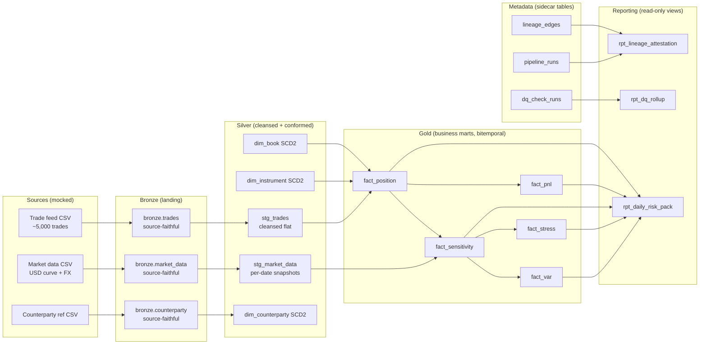

# Module 22 — Capstone — Tiber Markets Risk Mart

!!! abstract "Module Goal"
    The capstone is the synthesis. Modules 01 through 21 walked the components — the business context, the dimensional models, the risk measures, the cross-cutting disciplines, the engineering plumbing, the regulatory and organisational context, the catalogue of failure modes. Module 22 asks you to put it together. You will design and partially implement a market-risk reporting mart for a small synthetic firm — *Tiber Markets* — that supports a daily risk pack. The brief is deliberately under-specified at the engineering level: the reader makes the design choices, defends them in a one-page write-up, and grades their own work against a rubric. There is a reference solution outline in §5, but it is an outline — the reader does the work, not the curriculum. By the end of the capstone you will have a portfolio artefact that demonstrates everything the curriculum has taught, in the only way that ever really demonstrates it: a working warehouse with bitemporal facts, lineage you can query, DQ you can defend, and a daily risk pack you can reproduce.

---

## 1. Capstone overview

### 1.1 What you will build

A single-firm market-risk reporting mart for *Tiber Markets*, a fictional small securities firm running a single trading division across rates and FX. The mart supports a daily risk pack that any of the firm's risk managers, finance counterparts, or regulators could read. The deliverables, listed in detail in §3, are: a one-page bus matrix, an ER diagram of the silver and gold layers, dbt-style model code for three silver dimensions and three gold facts, two sample reports (a daily risk pack and a daily DQ rollup), at least five DQ checks, a lineage attestation query, and a README. The synthesis being demonstrated is not any one component but the *coherence* of the whole — the bus matrix matches the ER diagram, the DQ checks reference the dimensions and facts that exist, the lineage query returns rows that match the daily risk pack, the README explains what is mocked and what is real.

The scope was chosen for a reason. A *small* firm with two desks and ~5,000 trades is large enough to require every discipline the curriculum teaches (conformed dimensions, bitemporality, non-additive aggregation, DQ at boundaries, lineage attestation, daily reproducibility) but small enough that a single reader working part-time can build the whole thing in two to four weeks of evenings and weekends. A larger scope (multi-asset, multi-region, multi-entity) would require more time than the capstone budget allows and would dilute the synthesis into engineering tedium. The reader's portfolio benefits from a *finished* small artefact more than from a half-finished large one.

### 1.2 Why this scope

Three considerations shaped the brief. *First*, the scope must touch every Phase of the curriculum — rates and FX cover the instrument variety of [Module 04](04-financial-instruments.md) (linear and FX-forward instruments, leaving optionality out of scope), bitemporality at the fact layer exercises [Module 13](13-time-bitemporality.md), historical VaR exercises [Module 09](09-value-at-risk.md), and the daily reproduction exercises [Modules 13](13-time-bitemporality.md), [15](15-data-quality.md), and [16](16-lineage-auditability.md) jointly. *Second*, the scope must be *implementable* in two to four weeks part-time by a reader who has done no prior dbt work — so the data volumes are small (~5,000 trades, ~250 business days of history, ~50 books), the instrument set is narrow (vanilla USD swaps, USD treasury bonds, FX forwards in seven G10 pairs), and the pricing is mocked. *Third*, the scope must produce a *defensible portfolio artefact* — a reader who finishes the capstone should be able to walk into a market-risk BI interview and demo the warehouse end-to-end on a laptop in twenty minutes.

### 1.3 Expected time investment

Two to four weeks part-time is the realistic envelope. A reader who has done dbt and warehouse modelling work before, who can spend two evenings a week and one weekend day, will land near the bottom of the range; a reader who is doing this from a standing start will land near the top, and may legitimately stretch to six weeks if they take the *Excellent* or *Exceptional* tier of the rubric seriously. The capstone is a *project*, not a take-home assignment — there is no deadline imposed by the curriculum, and the intent is that the reader treats it as an opportunity to do their best work, not to satisfy a minimal requirement.

A suggested cadence: week one for the design artefacts (bus matrix, ER diagram, scope decisions, synthetic data generator), week two for the silver layer (dimensions, bitemporal stubs, DQ checks at silver), week three for the gold layer (facts, recompute-from-components for VaR, the daily risk pack), week four for the cross-cutting layer (lineage attestation, README, the *what done looks like* checklist of §9). Readers who cannot commit four weeks should consider dropping the stress scenario (§5.6) and the second sample report (the DQ rollup) — both are clearly marked as *optional for Pass tier* in the rubric of §4 — rather than skimping on the bitemporal and lineage work, which are the load-bearing parts of the synthesis.

A discipline note on time-boxing. Software projects expand to fill the time available, and capstone projects are no exception. Set a hard end date at the start, work toward it, and ship at that date even if the Excellent-tier rows are not finished — a Pass-tier artefact shipped is worth ten unfinished Excellent-tier ones. The reader who keeps polishing past the deadline loses momentum, often abandons the project in week six, and ends up with nothing on the CV; the reader who ships at week four with seven Pass-tier rows has the artefact and can iterate on it later if motivation returns. The discipline is the same one that ships production software — *done is the engine of more done*.

### 1.4 Submission and self-grading

There is no instructor to submit to. The reader self-grades against the rubric of §4 and the *what done looks like* checklist of §9. The intended audience for the artefact is the reader's *future self at an interview* — the warehouse should be polished enough that the reader can demo it on a laptop, walk through the lineage query, defend the bitemporal design, and explain why VaR is computed-on-demand rather than pre-aggregated, in a twenty-minute interview slot. A reader who finishes the capstone and cannot do that demo has not finished the capstone yet.

A note on the self-grading discipline. The temptation, working alone, is to grade kindly — every box is *almost* ticked, every check is *mostly* green, every section is *substantially* present. The discipline that defeats this is the *adversarial-reader* exercise: imagine an interviewer or an internal-audit reviewer reading your repository for the first time, with thirty minutes and a sceptical eye. What do they see? Do they see a coherent warehouse, or a collection of half-finished components? Does the README answer their first three questions, or does it leave them digging through commit history to figure out what is mocked? The adversarial-reader exercise is the closest a self-graded project gets to external review, and it is worth running on your own work twice — once at the end of week three, when there is still time to fix the gaps, and again at the end of week four, when you are about to claim the project as done.

### 1.5 Mapping the capstone to the curriculum

A short summary of which modules contribute which discipline to the capstone, so a reader who is rusty on a module knows where to read first. The mapping is deliberately tight — every module of the curriculum appears in the capstone, and a reader who finds a section of the brief unfamiliar can locate the relevant module from the table below.

| Capstone artefact         | Primary modules                                                                                          | Secondary modules                                                                          |
| ------------------------- | -------------------------------------------------------------------------------------------------------- | ------------------------------------------------------------------------------------------ |
| Bus matrix                | [M05](05-dimensional-modeling.md), [M06](06-core-dimensions.md), [M07](07-fact-tables.md)                | [M02](02-securities-firm-organization.md)                                                  |
| ER diagram                | [M05](05-dimensional-modeling.md), [M07](07-fact-tables.md)                                              | [M13](13-time-bitemporality.md), [M16](16-lineage-auditability.md)                         |
| dbt model code            | [M07](07-fact-tables.md), [M13](13-time-bitemporality.md), [M17](17-performance-materialization.md)      | [M06](06-core-dimensions.md), [M18](18-architecture-patterns.md)                           |
| Sample report — risk pack | [M08](08-sensitivities.md), [M09](09-value-at-risk.md), [M14](14-pnl-attribution.md)                     | [M12](12-aggregation-additivity.md), [M20](20-working-with-business.md)                    |
| Sample report — DQ rollup | [M15](15-data-quality.md)                                                                                | [M16](16-lineage-auditability.md)                                                          |
| DQ checks                 | [M15](15-data-quality.md)                                                                                | [M11](11-market-data.md), [M21](21-antipatterns.md)                                        |
| Lineage attestation       | [M16](16-lineage-auditability.md)                                                                        | [M19](19-regulatory-context.md)                                                            |
| Stress scenario           | [M10](10-stress-testing.md)                                                                              | [M11](11-market-data.md), [M12](12-aggregation-additivity.md)                              |
| README                    | [M20](20-working-with-business.md)                                                                       | [M21](21-antipatterns.md)                                                                  |

The pattern in the table is not an accident — every Phase of the curriculum contributes at least one row, the Phase 5 engineering modules contribute the most rows, and the Phase 6 contextual modules round out the discipline. A reader who has done the capstone has, by construction, exercised every Phase.

### 1.6 What the capstone is *not*

A short list of what the capstone is explicitly not, to head off scope creep. The capstone is not a *production* warehouse — there is no on-call rota, no SLA, no real consumer. It is not a *complete* warehouse — the four out-of-scope items of §2.4 (full pricing, FRTB-SA capital, real-time, multi-region) are deliberately excluded and adding them is busywork that does not exercise new disciplines. It is not a *job interview take-home* — the ones banks send out are typically tighter scope (one fact table, one model, one query) and judged on stylistic polish rather than synthesis. It is not a *certification* — there is no body that validates capstone completion, and the artefact's value is exactly what the reader can demonstrate on it, not what the curriculum claims. The right framing is *a portfolio piece you wrote to consolidate your learning* — that is what it is, and that is what an interviewer will respond to when you walk them through it.

### 1.7 A note on collaboration

The capstone is a *self-directed* project in the sense that there is no instructor, no grader, and no team. It is *not* a project that has to be done in isolation. Two patterns of collaboration are sensible. *First*, peer-review with another reader who has finished the curriculum: trade repositories, run each other's adversarial-reader exercise, and exchange one round of written feedback before either of you ships. The peer review surfaces the gaps that self-grading misses (the README ambiguity that the author cannot see, the demo flow that breaks for someone who has not seen the project before, the design decision that the author thinks is obvious but is in fact load-bearing). *Second*, build the capstone in *parallel* with a team-mate, comparing design decisions every week — the *same brief, two solutions* exercise is the single most efficient way to internalise the dimensional-modelling design space, because every decision the other person made differently is a decision you now have to defend rather than take for granted.

A note on what *not* to do. Do not co-author one capstone with another reader and submit it as both your work — the artefact's value is precisely that the reader did the work themselves, and a co-authored repository on both CVs is transparent to interviewers and damaging to both of you. Do not lift another reader's published capstone wholesale, change the firm name, and present it as your own — published capstones exist (the curriculum encourages publishing them) and an interviewer who recognises the structure will catch the lift in the first three minutes. Do steal *patterns* from other capstones liberally — the bitemporal upsert, the lineage table shape, the DQ check catalogue are all conventional, and reading other people's implementations of them is exactly how you learn what good looks like. The line between *theft* and *learning* is *whether you can defend the choice when an interviewer probes it* — if you can, you have learned the pattern; if you cannot, you have copied the code.

## 2. The brief

### 2.1 Business context — Tiber Markets

*Tiber Markets* is a fictional small securities firm headquartered in London, regulated by the PRA, with one trading division (Markets) split into two desks: a **USD rates desk** trading vanilla USD interest-rate swaps and USD treasury bonds, and a **G10 FX desk** trading FX forwards in seven G10 pairs (EURUSD, GBPUSD, USDJPY, USDCHF, USDCAD, AUDUSD, NZDUSD). The two desks share infrastructure but report risk independently to a head of Markets risk. The firm has 50 books across the two desks (typically 30 rates books, 20 FX books — the exact split is the reader's design choice) and runs roughly 5,000 live trades on any given business day.

The firm's regulatory posture is light by global-bank standards — it is small enough that FRTB-IMA is not in play (the regulator has accepted the standardised approach), but it is large enough that BCBS 239 [Module 19](19-regulatory-context.md) §3 applies in spirit if not in the letter (the supervisor expects bitemporal reproducibility, lineage attestation, and DQ-at-boundary discipline regardless of the firm's tier). Internal audit runs an annual review of the risk warehouse and writes findings the head of Markets risk has to remediate. The combination — small enough to fit on a laptop, regulated enough that the engineering disciplines matter — is exactly the synthesis target the capstone aims at.

The firm's stakeholders consume the daily risk pack on the morning of T+1. The head of Markets risk reads the firmwide and per-desk summary tiles. The two desk heads read the per-book sensitivities and P&L. The CFO and the regulator read the firmwide VaR and the stress P&L on a weekly cadence (the daily pack is produced daily; the consumption cadence is mixed). All of these consumers are reading the *same* mart — the warehouse you will build is the one source of truth for market risk at Tiber Markets. The stakeholder-engagement discipline of [Module 20](20-working-with-business.md) applies in microcosm: each consumer cares about a different slice of the same warehouse, and the data dictionary has to make every slice self-describing.

### 2.2 The mandate

Design and implement (or sketch — see §3 for what is implementation versus what is sketch) a market-risk reporting mart that supports the daily risk pack. The pack contains five logical sections: **positions** (book × instrument grain, MTM in USD), **sensitivities** (book × risk-factor grain, the linear DV01 and FX delta exposures), **VaR** (firmwide, per-desk, per-book; historical method, 99% confidence, 1-day horizon, 250-day window), **P&L** (book × business-date grain, decomposed into clean P&L and dirty P&L per [Module 14](14-pnl-attribution.md)), and **one stress scenario** (a 200bp parallel shift in the USD swap curve, applied as a delta-shock per [Module 10](10-stress-testing.md) §3). Each section is one query against the gold layer of your warehouse.

### 2.3 Why these five sections of the daily risk pack

Each section of the pack exists to answer a specific consumer question, and the synthesis of [Modules 07](07-fact-tables.md) through [10](10-stress-testing.md) tells you which fact table powers which section.

**Positions.** The base layer. Answers *what do we own and what is it worth?* Read by every consumer at every cadence. The grain is `book × instrument × business_date` and the measure is `mtm_usd`. The fact table is `fact_position` and the dimensional joins are `dim_book`, `dim_instrument`, `dim_date`. This is the only section that is unambiguously additive across every grouping you might want — sum positions across books and you get the firmwide MTM, no diversification subtlety to worry about.

**Sensitivities.** The risk-decomposition layer. Answers *if the market moves, how much do we move with it?* Read by the desk heads (per-book sensitivities) and the head of Markets risk (per-desk rollups). Grain is `book × risk_factor × business_date`, measure is per-bucket DV01 for rates and FX delta for FX. Additivity is *inside-a-risk-factor* — you can sum DV01 across positions in the same bucket but not across buckets without explicit treatment, per [Module 08](08-sensitivities.md) §3.3.

**VaR.** The aggregate-risk layer. Answers *what is the 1-in-100 daily loss?* Read by head of Markets risk and CFO. Grain is `book × business_date` (or `desk × business_date` or firmwide). Measure is `var_99_1d` in USD. *Non-additive* by construction (the AP1 anti-pattern of [Module 21](21-antipatterns.md) §3.1) — must be recomputed from the underlying scenario P&L vector at each grain.

**P&L.** The performance layer. Answers *did we make money yesterday?* Read by every consumer. Grain is `book × business_date`, measures are `clean_pnl_usd` and `dirty_pnl_usd` per [Module 14](14-pnl-attribution.md) §3.3. Additive across positions but the clean-vs-dirty decomposition has to survive the aggregation.

**Stress.** The tail-risk layer. Answers *what would happen if the curve shifted 200bp tonight?* Read by head of Markets risk and (weekly) CFO. Grain is `scenario × book × business_date`, measure is `stress_pnl_usd`. Additive *inside-a-scenario* across positions (the safe-aggregation rule of [Module 12](12-aggregation-additivity.md) §3.3), never across scenarios.

The reader should keep this table in mind when designing the gold layer — every fact has a different additivity contract, and the contracts are the load-bearing part of the design.

### 2.4 Constraints (must)

- **Bitemporality at the fact layer.** Every gold fact carries `business_date`, `valid_from_ts`, `valid_to_ts`, and `as_of_ts` — the bitemporal pattern of [Module 13](13-time-bitemporality.md) §3.4. The warehouse must be able to reproduce yesterday's daily risk pack as it was known yesterday morning, after an overnight late trade and an overnight market-data correction.
- **BCBS 239 lineage.** Every gold row carries source-system, pipeline-run, and code-version stamps per [Module 16](16-lineage-auditability.md) §3.2. The lineage attestation query of §3.6 must return a non-empty result for any selected `(book_id, business_date, as_of_ts)` triple.
- **DQ checks at silver and gold.** At least five DQ checks across the two layers, expressed as testable predicates per [Module 15](15-data-quality.md) §3. The DQ rollup report of §3.5 must show green on yesterday's snapshot.
- **Reproduce yesterday's report.** Given a `(business_date, as_of_ts)` pair, the warehouse must produce the daily risk pack that was delivered on that date — not the *current* state of the data filtered to that date. This is the AP2-not-this anti-pattern of [Module 21](21-antipatterns.md) §3.2 made concrete.

### 2.5 Out of scope (do not build)

- A full pricing engine. Mock the sensitivities — for a vanilla USD swap, generate a per-bucket DV01 vector deterministically from the trade's notional, tenor, and pay/receive direction; for an FX forward, generate an FX delta from the notional and the pair. The mock is a documented assumption, not a real pricing model.
- A full FRTB-SA capital calculation. Mention the bucket structure of [Module 19](19-regulatory-context.md) §3.4 in the README, but do not implement it; FRTB-SA at this scope is busywork that does not exercise any new discipline.
- Real-time anything. The warehouse is batch, daily, EOD-cut. No streaming, no intraday slice.
- Multi-region, multi-entity. One legal entity, one currency of report (USD), one calendar (NYC business days for rates, London for FX — the calendar discipline is a single dimension, not a multi-region complication).
- Optionality. No vanilla options, no exotics — the instrument set is linear-only by construction, which keeps the sensitivities additive at the right grain (DV01 for rates, FX delta for FX, both additive across positions inside a single risk factor).

### 2.6 Stakeholders and their consumption pattern

A short stakeholder map for the warehouse, because every design decision in §3 has to defend itself against *who is reading what*. The pattern below is deliberately small and stylised — Tiber Markets has perhaps a dozen consumers of the warehouse in total — but it exercises the stakeholder-engagement discipline of [Module 20](20-working-with-business.md) §3.2 in microcosm.

| Stakeholder                | Reads                                                          | Cadence       | Tolerance for delay         |
| -------------------------- | -------------------------------------------------------------- | ------------- | --------------------------- |
| Head of Markets risk       | Firmwide and per-desk summary tiles; VaR; daily P&L            | Daily, T+1 AM | Hard 07:30 SLA              |
| USD rates desk head        | Per-book sensitivities; per-book P&L; rates stress             | Daily, T+1 AM | Hard 07:30 SLA              |
| G10 FX desk head           | Per-book FX delta; per-book P&L; FX exposures                  | Daily, T+1 AM | Hard 07:30 SLA              |
| CFO                        | Firmwide VaR; firmwide P&L; one stress headline                | Weekly        | Soft Friday-EOD             |
| PRA supervisor             | Firmwide VaR; bitemporal reproductions of past reports         | Ad-hoc        | Days, occasionally hours    |
| Internal audit             | Lineage attestations; DQ rollup history; code version diffs    | Annually      | Weeks                       |

The implication for the warehouse design is that the *daily risk pack* is the load-bearing artefact — it serves the three highest-cadence consumers and is the source the supervisor reads when they ask for a historical reproduction. The DQ rollup and the lineage attestation queries are lower-cadence but higher-stakes — they serve internal audit and the regulator, and getting them wrong produces a finding the head of Markets risk has to remediate. The reader's design choices should make the daily risk pack fast and the attestation queries *correct* — those are different optimisation targets, and the warehouse needs both.

### 2.7 Tooling assumptions

The reader chooses the warehouse and orchestrator. Two sensible defaults:

- **Local dev path.** DuckDB as the warehouse + dbt-duckdb as the transformation layer + Python (numpy + pandas) for synthetic data generation. The whole stack runs on a laptop with no external services. Most readers should pick this path — the capstone is about the discipline, not about cloud setup.
- **Cloud path.** Snowflake (free trial) + dbt-snowflake + Python for synthetic data. This path is closer to a real bank's stack but adds setup complexity that is not the synthesis being assessed. Pick this path only if you already have warehouse credentials and want the practice.

The mart language is SQL, the orchestration is whatever the reader is comfortable with (a Makefile, a shell script, a dbt build invocation — the orchestration sophistication is *not* on the rubric). The visualisation tier (the BI tool that would render the daily risk pack) is *out of scope* — the daily risk pack is delivered as the output of two SQL queries, not as a Power BI report. A reader who wants to add a BI layer for portfolio polish can do so, but it is not on the rubric.

## 3. Deliverables

Each deliverable below is followed by its **success criterion** — the explicit predicate the reader's own work has to satisfy to count as Pass tier on the rubric of §4. The Excellent and Exceptional tiers add additional predicates; Pass is the floor.

### 3.1 Bus matrix (one page)

A single-page markdown table per [Module 05](05-dimensional-modeling.md) §3.6 with facts as columns and dimensions as rows, with cells marked where the dimension is conformed onto the fact. The bus matrix is the architectural one-pager — it is the artefact you would put in front of an architect or a regulator to demonstrate that the dimensions are conformed and the facts are coherent. A sample bus matrix for Tiber Markets is in §7; the reader's bus matrix may differ on the dimension/fact set, but it must demonstrate conformance.

**Success criterion.** Every fact in the matrix has at least three conformed dimensions; every dimension that appears on more than one fact is genuinely the same dimension (same surrogate key, same SCD discipline) at silver, not a per-fact copy.

### 3.2 ER diagram (silver and gold)

A diagram of the silver and gold layers per [Module 05](05-dimensional-modeling.md) §3.4. Mermaid (`erDiagram`) is the suggested format — the diagram lives in the README and renders on GitHub. The diagram shows the three silver dimensions (counterparty, instrument, book), the gold facts (position, sensitivity, var, optionally pnl and stress), and the foreign-key relationships. Bitemporal columns are explicit on the gold facts.

**Success criterion.** The ER diagram includes all seven entities of the bus matrix, the foreign-key relationships are correct, and the bitemporal columns (`valid_from_ts`, `valid_to_ts`, `as_of_ts`, `business_date`) are visible on the gold facts.

### 3.3 dbt-style model code

dbt model files for *three silver dimensions* and *three gold facts*. The dimensions are `dim_counterparty` (SCD2 per [Module 06](06-core-dimensions.md) §3.4), `dim_instrument` (SCD2), and `dim_book` (SCD2 — books reorganise more than people expect). The facts are `fact_position`, `fact_sensitivity`, and `fact_var`, all bitemporal at the fact layer. A reader who picks the cloud path may also include `fact_pnl` and `fact_stress`, but Pass tier requires only the three named.

**Success criterion.** Each model file is valid dbt SQL (parses with `dbt parse`), references upstream models with `ref()`, has a `schema.yml` entry with at least one test, and the bitemporal columns on the facts are populated by an upsert pattern (the snippet of §5.4 is the canonical pattern). `dbt build` runs end-to-end on the synthetic data without errors.

### 3.4 Sample report — daily risk pack

A SQL query (one query, possibly with CTEs) that returns the daily risk pack for a given `(business_date, as_of_ts)` pair. The grain is `book × instrument × business_date` for the positions section and `book × business_date` for the VaR and P&L sections. The output is a single result set with columns covering position MTM, key sensitivities, VaR, and P&L. The query reads only the gold layer.

**Success criterion.** The query runs against yesterday's data and returns a non-empty result set with one row per `(book, instrument)` for the position rows. Re-running the query with `as_of_ts` set to a prior timestamp returns a *different* result set that matches what was delivered on that prior timestamp (this is the bitemporal proof).

### 3.5 Sample report — daily DQ rollup

A SQL query that returns the per-check status of every DQ check for a given `business_date`. The output is one row per check with columns `(check_name, layer, fact_or_dim, status, failed_row_count, run_ts)`. Status is `green` / `amber` / `red` per the severity ladder of [Module 15](15-data-quality.md) §3.5.

**Success criterion.** The DQ rollup returns one row per check, with all checks green on yesterday's clean synthetic data. The reader has *also* run a deliberate-corruption test — manually mutated a row in silver, re-run the build, confirmed at least one check turns red, then reverted — and the README documents the test.

### 3.6 DQ checks (≥ 5)

At least five DQ checks across the silver and gold layers, expressed as dbt tests (or warehouse-native singular tests, or both). The required minimum coverage:

- **Silver.** A uniqueness check on the natural key of `dim_instrument`, a not-null check on the SCD2 effective-from on `dim_counterparty`, a referential-integrity check on `fact_position.book_id` to `dim_book`.
- **Gold.** A reconciliation check that `SUM(fact_position.mtm_usd)` over a `(business_date, as_of_ts)` snapshot ties to a stored expected total within tolerance, and a non-additivity-flag check that confirms `fact_var.var_99_1d` is *not* aggregated by SUM in any downstream model (the AP1 check of [Module 21](21-antipatterns.md) §3.1).

The reader may add more checks — the rubric Excellent tier asks for ≥ 8, the Exceptional tier asks for ≥ 12 with at least two singular tests that exercise multi-table conditions.

**Success criterion.** The five named checks exist as dbt tests, run as part of `dbt build`, and all pass on yesterday's synthetic data.

### 3.7 Lineage attestation query

A single SQL query that, given `(book_id, business_date, as_of_ts)`, returns the lineage chain that produced `fact_var` for that row: which silver rows fed which gold rows, which pipeline run wrote them, which code version was in effect at the time, and which DQ checks were green at the moment of the write. The lineage tables follow [Module 16](16-lineage-auditability.md) §3.4 — a `lineage_edges` table of (upstream_table, downstream_table, run_id) tuples, joined to a `pipeline_runs` table of (run_id, code_version, started_ts, ended_ts) tuples.

**Success criterion.** The query returns a non-empty result for any selected `(book_id, business_date, as_of_ts)` triple where `fact_var` has data. The result lists the upstream tables (silver dimensions, silver facts), the run_id that wrote the gold row, the code_version of the dbt project at the time of the write, and the DQ check statuses at that moment. A regulator who asked *how was this VaR computed?* could read the result and trace the chain.

### 3.8 Bitemporal proof artefact

A short standalone artefact — a markdown document (or a notebook) — that walks through *one* concrete bitemporal scenario end-to-end. Pick a `business_date` somewhere in the middle of your generated history. Show the daily risk pack as it was first delivered (the morning `as_of_ts`). Then show the same `business_date`'s pack at a later `as_of_ts`, after one or more late corrections have been applied. Highlight the rows that changed and explain *why* each one changed (a late trade, a market-data correction, a counterparty remap, a book reorganisation). The artefact is two queries and a paragraph of narrative; it is the proof that the bitemporality of [Module 13](13-time-bitemporality.md) §3.4 actually works in your warehouse, not just that the columns are present.

**Success criterion.** The artefact shows two distinct result sets for the same `business_date`, the differences are explained against the underlying corrections, and a reader who has never seen your warehouse can follow the narrative without looking at the source data.

### 3.9 README

A README at the project root explaining how to run the project: install dependencies, generate the synthetic data, run `dbt build`, query the daily risk pack, query the DQ rollup, query the lineage attestation. The README also documents *what is mocked* (the sensitivities, the market-data feed, the trade feed) and *what is real* (the bitemporal pattern, the lineage tables, the DQ checks). A short *known limitations* section names what was deferred (FRTB-SA capital, options, intraday).

**Success criterion.** A reader who has never seen the project can follow the README from a clean clone, generate the synthetic data, build the warehouse, and run the three sample queries in under thirty minutes. The README is honest about what is mocked.

### 3.10 Stretch deliverables (Excellent / Exceptional only)

Three additional deliverables that distinguish the Excellent and Exceptional tiers from Pass. None of these are required; readers who have time should pick one rather than spreading effort across all three.

**Stretch A — Semantic-layer integration.** Express the warehouse's facts and dimensions in dbt's MetricFlow YAML (or the equivalent for SQLMesh, Cube, LookML). Flag every non-additive measure with the `non_additive_dimension` attribute so the BI tool surfaces the constraint by construction. The point is to push the additivity contract of [Module 12](12-aggregation-additivity.md) §3 down into the semantic layer where the BI consumer cannot bypass it.

**Stretch B — Bitemporal DQ rollup.** Re-implement the DQ rollup of §3.5 as a *bitemporal* query — given a `(business_date, as_of_ts)` pair, return the DQ status that was true at that moment, not the current status. The query joins `dq_check_runs` to `pipeline_runs` by `pipeline_run_id` and slices on `started_ts ≤ as_of_ts`. The exercise demonstrates the bitemporal pattern at the *metadata* layer, which is a level of polish few capstones reach.

**Stretch C — One end-to-end backfill.** Simulate a backfill scenario: the synthetic data generator produces a corrected market-data feed for a historical week (e.g., the first week of generated history). Re-run the warehouse with the corrected feed, observe the bitemporal facts close out the prior versions and insert the corrected ones, and run the lineage attestation query for one row to show the new `as_of_ts` and the new `pipeline_run_id`. The backfill is the single most operationally realistic exercise the capstone offers — every production warehouse runs backfills, and seeing one work end-to-end is the proof that the bitemporal pattern is not just theoretical.

A reader who completes one of the three stretches has crossed from Excellent into Exceptional on at least one row of the rubric. A reader who completes all three has produced a portfolio artefact that very few capstones in the field match.

**Optional advanced track — AI-augmented variant.** Use `model-builder` (from Anthropic's open-source `financial-analysis` plugin) to generate the synthetic instrument and position data for the project; use `audit-xls` to QA your final risk-pack spreadsheet before submission. Document where the agent helped and where it failed — both observations are valuable inputs to production deployment decisions.

## 4. Rubric

The rubric has three tiers — *Pass*, *Excellent*, *Exceptional* — and one row per deliverable. *Pass* is the floor a portfolio artefact has to clear to be defensible at an interview; *Excellent* is the polish a strong reader should aim for; *Exceptional* is the synthesis-plus-extension level that distinguishes a reader who is going to lead a team in a few years from a reader who is going to follow one.

| Deliverable                  | Pass                                                                                                                              | Excellent                                                                                                                                | Exceptional                                                                                                                                                              |
| ---------------------------- | --------------------------------------------------------------------------------------------------------------------------------- | ---------------------------------------------------------------------------------------------------------------------------------------- | ------------------------------------------------------------------------------------------------------------------------------------------------------------------------ |
| Bus matrix                   | All facts have ≥ 3 conformed dimensions; conformance is genuine.                                                                  | Bus matrix names SCD type per dimension and grain per fact in cell annotations.                                                          | Bus matrix is annotated with consumer ownership per fact and points back to the BCBS 239 principles each fact addresses.                                                  |
| ER diagram                   | Mermaid `erDiagram` covers seven entities; FKs correct; bitemporal columns visible on gold facts.                                 | Diagram visually distinguishes silver from gold; SCD2 columns visible on dimensions; cardinalities correct.                              | Diagram includes the lineage tables (`lineage_edges`, `pipeline_runs`) and the DQ tables, and the bitemporal pattern is annotated with a one-line caption per layer.       |
| dbt model code               | Three silver dims + three gold facts; `dbt build` passes; bitemporal upsert correct.                                              | Adds `fact_pnl` and `fact_stress`; uses incremental materialization on gold facts; schema docs filled in.                                | Adds a semantic-layer entry per fact (in dbt's MetricFlow YAML or similar) flagging non-additive measures; surfaces non-additivity to the BI tool by construction.        |
| Sample report — risk pack    | Single SQL query; returns non-empty result; bitemporal slice produces a different result for a prior `as_of_ts`.                  | Risk pack includes per-desk and firmwide rollups; the rollups recompute non-additive measures from components rather than summing them.   | Risk pack includes a one-page narrative comment in the SQL explaining each section's grain and additivity contract per [Module 12](12-aggregation-additivity.md) §3.   |
| Sample report — DQ rollup    | One row per check; all green on clean data; deliberate-corruption test documented.                                                | DQ rollup distinguishes layer (silver vs gold) and severity (green/amber/red) and orders by severity.                                    | DQ rollup is itself bitemporal — the reader can ask *what was the DQ status at this moment yesterday?* and get the answer that was true at the time.                       |
| Lineage attestation query    | Returns non-empty result for a selected triple; surfaces upstream tables, run_id, code_version, DQ status.                        | Query returns a graph (tabular adjacency-list form) walked breadth-first from `fact_var` back to bronze.                                  | Query supports a *what-changed* mode — given two `as_of_ts` values, returns the diff in lineage and identifies the run that introduced the change.                         |
| README                       | A new reader can run the project in 30 minutes; honest about mocks; lists known limitations.                                      | Includes a one-page architecture diagram (mermaid), a per-table data dictionary, and a runbook for re-generating yesterday's risk pack.   | Includes a *post-mortem* section walking through one bug the reader found and fixed during the build, framed as a war story per [Module 21](21-antipatterns.md).     |

A note on tier inflation. The rubric is not a school grade — every reader who delivers Pass-tier on every row has produced an artefact that is defensible at a market-risk BI interview at most banks. Excellent and Exceptional are aspirational targets for readers who have time and energy to push further; they are not the threshold. A reader who delivers four Pass-tier rows and three blank rows has *not* finished the capstone and should not claim it on a CV. A reader who delivers seven Pass-tier rows has finished the capstone and is, in the curriculum's view, a competent practitioner of market-risk BI engineering.

A second note on rubric scope. The rubric covers seven of the nine deliverables listed in §3 (the bitemporal proof artefact of §3.8 and the README of §3.9 are folded into the *README* row, since the proof artefact lives inside the README in most readers' implementations). Readers who deliver the proof artefact as a separate document should add it as an eighth row to their personal scorecard with the same Pass / Excellent / Exceptional structure: *Pass* is two distinct result sets with a paragraph of explanation; *Excellent* is the same plus an annotated diff table showing the deltas; *Exceptional* is the same plus a screencast of the queries running live, suitable for a CV portfolio link.

A third note on the *Exceptional* tier. Most readers should not aim for it. The Exceptional tier is the *I-want-to-lead-a-team-someday* level, and the additional engineering effort it demands (semantic-layer integration, lineage diff queries, post-mortem write-ups, bitemporal DQ rollup) is a multiplier on the Excellent-tier work, not an increment. A reader who is doing the capstone as a *foundational* portfolio piece should aim for Pass on every row and Excellent on the two rows that play to their strengths; that is a coherent, defensible artefact and it represents the curriculum's expectation of a competent practitioner. The Exceptional tier is for the reader who has finished the Excellent-tier work, has time and curiosity left over, and wants to push the artefact into the territory that distinguishes them in a senior-engineer interview pool. There is no shame in not reaching it.

A fourth note on rubric ordering. The seven rows are roughly ordered by *prerequisite* — the bus matrix anchors the dimensional design, the ER diagram visualises it, the dbt model code implements it, the sample reports consume it, the DQ checks protect it, the lineage attestation explains it, the README documents it. A reader who tries to skip directly to the lineage attestation without the gold facts being right will produce nothing of value; the rubric's ordering is the project's critical path, and the temptation to start with the polish-row (the README) instead of the foundation-row (the bus matrix) should be resisted.

### 4.1 How to use the rubric on yourself

The rubric is most useful as a *weekly* checklist, not as an end-of-project audit. At the end of week one, score yourself on the bus matrix and the ER diagram rows — if both are at Pass, you can move on to week two; if either is blank, the week one work is not done and adding silver dimensions on top of an unstable bus matrix will create rework. At the end of week two, score yourself on the dbt model code row — Pass means the silver dimensions are in, Excellent means the gold facts are in too. At the end of week three, score yourself on the sample report and DQ rows. At the end of week four, score yourself on the lineage and README rows. The cumulative score at the end of each week tells you whether you are on track or whether you need to descope (drop the stress scenario, drop the second sample report, defer one of the stretch deliverables) to ship on time.

A reader who reaches the end of week four with three Pass-tier rows and four blank rows has descoped too late and should not ship the project as a portfolio artefact — the gaps are too visible. The right response is to extend by one or two weeks and finish the missing rows, *or* to retroactively redefine the scope (drop `fact_pnl` and `fact_stress` from the gold layer, drop the corresponding rubric rows) and ship the smaller artefact honestly. Both responses are defensible; shipping a half-finished artefact and claiming it as complete is not.

## 5. Reference solution outline

This section is an outline, not a solution. The reader does the work; the outline names the suggested approach, the suggested sequence, and gives two illustrative snippets (the bitemporal upsert pattern and the historical-VaR pattern) so the reader is not starting from a blank page on the technically tricky parts. Every other line of code in the warehouse is the reader's own.

### 5.1 Suggested directory structure

```text
tiber-markets-risk/
├── README.md
├── Makefile                      # one-line targets: data, build, query
├── synthetic/
│   ├── generate_books.py         # 50 books across two desks
│   ├── generate_instruments.py   # USD swaps, USD treasuries, FX forwards
│   ├── generate_counterparties.py
│   ├── generate_trades.py        # ~5,000 live trades, 250 days history
│   ├── generate_market_data.py   # USD swap curve, FX rates
│   └── seed.py                   # orchestrates the above into bronze/
├── bronze/                       # CSV/Parquet landing zone (synthetic)
├── dbt/
│   ├── dbt_project.yml
│   ├── profiles.yml              # duckdb default
│   ├── models/
│   │   ├── silver/
│   │   │   ├── dim_counterparty.sql
│   │   │   ├── dim_instrument.sql
│   │   │   ├── dim_book.sql
│   │   │   ├── stg_trades.sql
│   │   │   └── schema.yml        # silver tests
│   │   ├── gold/
│   │   │   ├── fact_position.sql
│   │   │   ├── fact_sensitivity.sql
│   │   │   ├── fact_var.sql
│   │   │   └── schema.yml        # gold tests
│   │   └── reporting/
│   │       ├── rpt_daily_risk_pack.sql
│   │       └── rpt_dq_rollup.sql
│   ├── macros/
│   │   ├── bitemporal_upsert.sql
│   │   └── historical_var.sql
│   └── seeds/                    # static reference data (calendars, ccy)
├── lineage/
│   ├── lineage_edges.sql         # OpenLineage-style adjacency list
│   └── pipeline_runs.sql
└── tests/                        # singular tests, ad-hoc SQL
    ├── test_var_not_summed.sql
    └── test_position_reconciliation.sql
```

Two notes on the structure. *First*, the `synthetic/` directory is a Python package — it is the only Python in the project, and its only job is to write CSV/Parquet files into `bronze/`. Once those files are written, the warehouse build is pure SQL via dbt, which keeps the language boundaries clean. *Second*, the `lineage/` directory is *not* in `dbt/models/` because the lineage tables are written by the orchestrator (the Makefile target that wraps `dbt build`), not by dbt itself — dbt-internal lineage covers the dbt-graph but not the run-level metadata, which has to be stamped by the runner.

### 5.2 Suggested order of work

The recommended sequence is the order the rubric is structured in — *silver dimensions first, then gold facts, then DQ, then reporting, then lineage* — because each step depends on the previous one and skipping ahead leaves rework. A more granular breakdown:

1. **Synthetic data first.** Generate bronze before writing any SQL. The synthetic data generator is the contract the rest of the warehouse builds against, and getting it right (deterministic seed, bitemporally-consistent late-arriving rows, plausible distributions) is half the engineering work.
2. **Silver dimensions next.** `dim_book`, `dim_instrument`, `dim_counterparty` — each as SCD2, each with a uniqueness test on the natural key and a non-overlap test on the validity intervals. Get the dimensional shape right before the facts.
3. **Silver staging fact (`stg_trades`).** A flat, source-faithful copy of the trade feed with bronze-to-silver cleansing (type-cast, null-defaults, bronze provenance retained).
4. **Gold facts.** `fact_position` from `stg_trades` × `dim_instrument` (the position is the running EOD state), `fact_sensitivity` from `fact_position` × the mocked sensitivity generator, `fact_var` from `fact_sensitivity` × the historical-VaR macro of §5.5.
5. **DQ checks.** Add the schema-level tests as you build each model; add the singular tests (the reconciliation, the non-additivity flag) after gold is in place.
6. **Reporting.** The daily risk pack and the DQ rollup are the *last* SQL you write — they are read-only views on top of gold. If gold is right, reporting is mechanical.
7. **Lineage.** Add the `lineage_edges` and `pipeline_runs` tables and the orchestrator that writes them. The lineage attestation query of §3.7 is the test that the lineage layer works.
8. **README and polish.** Documentation last, when you know what you actually built.

A reader who tries to build all of these in parallel will spend twice as long and produce a less coherent artefact. The discipline is sequential — finish each step to the *Pass* tier before moving on, and circle back to upgrade tiers only after the whole chain is end-to-end.

A second observation on the order of work. The *temptation* is to start with the gold layer, because gold is the layer the consumer sees and the layer that feels like it justifies the project. Resist it. Every time the gold layer is built before the silver dimensions are stable, the gold has to be rebuilt when the silver shape changes, and the reader spends two-thirds of the project rewriting gold rather than designing it. The right discipline is *bottom-up* — bronze first, silver next, gold last, reporting on top. The reader who has the silver dimensions stable by end of week two will have time to do the gold properly; the reader who has half-finished gold by end of week one will be rewriting it through week three.

A third observation on test-as-you-go. Every model file should land with at least one schema test (uniqueness, not-null, accepted-values, or relationship) on the same commit. The cost of writing the test alongside the model is small; the cost of bolting tests on at the end of the project, when there are twenty models and the reader has forgotten the assumptions of each, is large and the resulting tests are typically shallower than they should be. The discipline is *no model lands without a test* — the same discipline that the [Module 15](15-data-quality.md) §3 DQ programme advocates for production warehouses, applied to the capstone in the small.

### 5.3 Synthetic data generation

The synthetic data is the foundation; bad synthetic data produces a warehouse that *looks* right and *acts* wrong. The right approach is `numpy + pandas`, deterministic seed, bitemporally-consistent late arrivals.

A one-paragraph sketch of the trade generator: for each of 250 business dates, draw a Poisson number of new trades (mean ~20), pick a desk with weight (rates 60%, FX 40%), pick a book at random within the desk, pick an instrument at random within the desk's instrument universe, draw a notional from a log-normal (median ~$10M for swaps, ~$5M for FX), draw a tenor from a discrete distribution, pick a counterparty at random from the active set. Then *separately*, with low probability per row, mutate a small number of past rows to simulate late-arriving trades, market-data corrections, and counterparty-id remaps — each mutation gets a fresh `as_of_ts` so the bitemporal pattern has something to bite on. The result is a bronze trade feed with ~5,000 live rows and a few hundred bitemporal corrections, which is realistic for a small firm and gives the bitemporal queries something interesting to answer.

The market-data generator is similar in shape: per business date, generate a USD swap curve at the standard tenors (3M, 6M, 1Y, 2Y, 5Y, 10Y, 30Y) from a random walk seeded at plausible levels, generate FX rates for the seven pairs from a separate random walk, and write the result to `bronze/market_data.parquet`. The mocked sensitivity generator takes a position and a market-data snapshot and returns a per-bucket DV01 vector for swaps and an FX delta for forwards — the calculation is deterministic given the inputs (no Monte Carlo, no calibration), which is what *mocked* means.

A discipline note on the synthetic data generator's seed. Use a fixed seed (`numpy.random.default_rng(42)` is the conventional choice) and document it in the README. A reader who runs `make data` twice and gets two different bronze layers cannot debug the warehouse — every transient anomaly is *either* a code bug *or* a data-generation accident, and the bisection takes hours. A fixed seed eliminates the second branch and turns every anomaly into a code bug, which is the bug you can actually fix. The same discipline applies in production: synthetic data for unit tests should always be deterministic, and the place where this typically breaks down is the late-arriving-row simulation, which has its own random branch and needs its own seed.

A second discipline note on the late-arriving-row simulation. The bitemporal pattern of [Module 13](13-time-bitemporality.md) §3.4 is only exercised if the synthetic data has actual late-arriving rows — otherwise the warehouse looks bitemporal but cannot be tested as such. The right approach is to generate the *initial* bronze rows on day T with `as_of_ts = T morning`, then simulate one or two corrections per business day with `as_of_ts = T+1 morning`, then occasionally simulate a delayed correction with `as_of_ts = T+5 morning` (a real bank gets these — a counterparty-id remap that the operations team only notices at month-end). The capstone's bitemporal proof artefact of §3.8 picks up these corrections; without them the proof artefact is empty.

### 5.4 Illustrative snippet — bitemporal upsert

The first of two illustrative snippets. This is the canonical bitemporal upsert pattern from [Module 13](13-time-bitemporality.md) §3.5, applied to `fact_position`. The snippet is short on purpose — the surrounding plumbing (the dbt `is_incremental()` guard, the macro packaging) is the reader's work; the snippet shows the *core diff* between a non-bitemporal upsert and a bitemporal one.

```sql
-- fact_position: bitemporal upsert. Close out the prior valid row,
-- insert the new one with the new business_date and as_of_ts.
-- Run inside a dbt incremental model with on_schema_change='append_new_columns'.

-- 1. Close out rows whose effective state has changed since last as_of.
UPDATE {{ this }} tgt
SET valid_to_ts = '{{ var("run_ts") }}'::timestamp
WHERE tgt.valid_to_ts = '9999-12-31'::timestamp
  AND EXISTS (
    SELECT 1 FROM {{ ref('stg_positions_today') }} src
    WHERE src.position_natural_key = tgt.position_natural_key
      AND src.business_date         = tgt.business_date
      AND ( src.mtm_usd      <> tgt.mtm_usd
         OR src.notional_usd <> tgt.notional_usd
         OR src.book_id      <> tgt.book_id )
  );

-- 2. Insert the new bitemporal row.
INSERT INTO {{ this }}
SELECT
    src.position_natural_key,
    src.book_id,
    src.instrument_id,
    src.business_date,
    src.notional_usd,
    src.mtm_usd,
    '{{ var("run_ts") }}'::timestamp        AS valid_from_ts,
    '9999-12-31'::timestamp                 AS valid_to_ts,
    '{{ var("run_ts") }}'::timestamp        AS as_of_ts,
    '{{ var("run_id") }}'                   AS pipeline_run_id,
    '{{ var("code_version") }}'             AS code_version
FROM {{ ref('stg_positions_today') }} src;
```

What to notice. The `valid_to_ts = '9999-12-31'` sentinel marks the open-ended row; the close-out updates it to `run_ts`; the new row inserts with the new `valid_from_ts = run_ts` and the open-ended `valid_to_ts`. Querying *as of yesterday* is `WHERE valid_from_ts <= '<yesterday>'::timestamp AND valid_to_ts > '<yesterday>'::timestamp`. The `as_of_ts` column is the *time when this row was written* — the `run_ts` of the pipeline that wrote it — and it is the column the lineage attestation query joins on. The `pipeline_run_id` and `code_version` columns close the BCBS 239 lineage requirement of [Module 16](16-lineage-auditability.md) §3.2. See the M13 example for the full version with deletes and the parallel `transaction_time` axis if you need it.

### 5.5 Illustrative snippet — historical VaR

The second of the two snippets. This is the historical-VaR pattern from [Module 09](09-value-at-risk.md) §3.4 packaged as a Python helper that the reader calls from a dbt-Python model (or runs separately and writes to `bronze/var_inputs.parquet` for the dbt SQL model to pick up). The snippet is intentionally minimal — it shows the *quantile of the historical P&L vector* core, not the full return-bucketing and scenario-construction logic.

```python
import numpy as np
import pandas as pd

def historical_var_99_1d(scenario_pnl: np.ndarray) -> float:
    """
    Historical VaR at 99% confidence, 1-day horizon.
    Input: a 1-D array of historical scenario P&L values (USD), length ~250.
    Output: the loss threshold (positive number = magnitude of the 1% worst loss).

    Per M09 §3.4: quantile of the loss distribution, not of the P&L distribution.
    """
    if scenario_pnl.size < 100:
        raise ValueError("VaR window too short — need at least 100 scenarios")
    losses = -np.asarray(scenario_pnl)
    return float(np.quantile(losses, 0.99))


def var_for_book(positions: pd.DataFrame,
                 historical_returns: pd.DataFrame,
                 business_date: pd.Timestamp) -> float:
    """
    Per-book VaR. positions: book_id × risk_factor → exposure.
    historical_returns: 250 rows × risk_factor → 1-day return.
    Returns the book's 99% 1-day historical VaR in USD.
    """
    exposures = positions.set_index("risk_factor")["exposure_usd"]
    aligned   = historical_returns.reindex(columns=exposures.index).fillna(0)
    scenario_pnl = aligned.dot(exposures).to_numpy()
    return historical_var_99_1d(scenario_pnl)
```

What to notice. The function takes the *scenario P&L vector* as input, not pre-aggregated VaR. That is the AP1 fix of [Module 21](21-antipatterns.md) §3.1 in code form — VaR is computed from components, never summed from a coarser layer. To compute firmwide VaR, you call `var_for_book` with the firmwide exposures (sum of positions across books × risk_factor); you do *not* sum the per-book VaRs, because the resulting number is wrong by the diversification benefit. The dbt model that calls this helper is responsible for materialising `fact_var` at the requested grain (book, desk, firmwide) by passing the right exposure aggregation each time. See the M09 example for the full version with bucketed risk-factor mapping and the variance–covariance comparison.

### 5.6 Stress scenario — 200bp parallel shift

The single stress scenario in scope is a 200bp parallel shift in the USD swap curve, applied as a delta-shock per [Module 10](10-stress-testing.md) §3.4. The pattern is *sensitivity × shock vector = stress P&L*: take the per-bucket DV01 vector from `fact_sensitivity`, multiply each bucket by `-200 / 10000` (a 200bp upward parallel shift produces a loss for a long-rates position equal to `-DV01 × 200 / 10000`), sum across buckets to get the stress P&L per position, aggregate to the requested grain.

The full implementation is a single SQL query against `fact_sensitivity` with the shock vector as a constant. The reader writes it. The discipline being exercised is the *additivity-inside-a-scenario* principle of [Module 12](12-aggregation-additivity.md) §3.3 — stress P&L is additive across positions inside a single scenario, so summing per-book stress P&L to firmwide is mathematically valid (unlike summing VaR, which is not). The DQ check that protects this is a singular test that confirms the firmwide stress P&L equals the sum of per-book stress P&L within a small tolerance. If it does not, the warehouse has a bug.

A one-paragraph extension target for Excellent tier: add a *second* stress scenario (a 10% USD strengthening, applied to the FX delta of the FX desk's positions) and confirm that the two stresses are stored as *independent rows* in `fact_stress` keyed by `(scenario_id, position_id, business_date, as_of_ts)`, never as a wider table with one column per scenario. The wide-table pattern is the AP6 anti-pattern of [Module 21](21-antipatterns.md) §3.6 — every new stress scenario requires a schema change. The narrow-table pattern is the right one.

### 5.7 Suggested DQ check catalogue

A starter set of nine DQ checks the reader can adapt. The five required by §3.6 are marked (*); the remaining four are Excellent-tier additions.

| # | Check name                          | Layer  | Predicate                                                                                              | Severity |
| - | ----------------------------------- | ------ | ------------------------------------------------------------------------------------------------------ | -------- |
| 1 | dim_instrument_natural_key_unique * | silver | `instrument_natural_key` is unique within the latest SCD2 row per instrument                            | red      |
| 2 | dim_counterparty_scd2_eff_not_null* | silver | `valid_from_ts` is non-null for every row                                                                | red      |
| 3 | fact_position_book_id_in_dim_book * | silver | every `book_id` in `fact_position` exists in `dim_book` for the row's `business_date`                    | red      |
| 4 | fact_position_mtm_total_within_tol* | gold   | `SUM(mtm_usd)` per `(business_date, as_of_ts)` ties to expected total within 0.5%                        | red      |
| 5 | fact_var_not_summed_downstream    * | gold   | no production model contains `SUM(var_99_1d)` (parsed from dbt manifest)                                 | red      |
| 6 | fact_position_no_orphan_instrument  | silver | every `instrument_id` in `fact_position` joins to `dim_instrument`                                       | red      |
| 7 | dim_book_scd2_no_overlap            | silver | for any `book_natural_key`, the SCD2 validity intervals do not overlap                                   | amber    |
| 8 | fact_sensitivity_dv01_bucket_sum    | gold   | per-position bucket DV01s sum to within tolerance of the position's instrument DV01                      | amber    |
| 9 | fact_pnl_clean_plus_flow_eq_dirty   | gold   | per-`(book, business_date)`, `clean_pnl_usd + trade_flow_pnl_usd ≈ dirty_pnl_usd` within 1bp of notional | amber    |

A reader who implements all nine has fully covered the *Excellent*-tier DQ row of the rubric. The amber checks are interesting because they are *non-blocking* — the build does not fail, but the DQ rollup turns amber and the analyst on call sees it on the morning dashboard. The red checks block the build by design. Distinguishing red from amber is the discipline of [Module 15](15-data-quality.md) §3.5; getting the line in the right place is the difference between a warehouse that pages the on-call every night for a 0.001bp rounding drift and a warehouse that pages them only when something is genuinely wrong.

### 5.8 Two design decisions worth defending in your README

A capstone artefact that is technically complete but has no design narrative is harder to defend at an interview than a slightly less polished one with a written rationale. Two specific decisions are worth a paragraph each in the README.

**Decision 1 — narrow vs wide stress fact.** The reader has chosen the narrow `(scenario_id, position_id, ...)` shape over the wide `(position_id, stress_200bp_pnl, stress_fx10pct_pnl, ...)` shape. The defence is two-fold: the narrow shape adds new scenarios as new rows (no schema change, no breaking downstream consumers), and the narrow shape composes cleanly with the bitemporal upsert pattern (each `(scenario, position, business_date, as_of_ts)` tuple is a separate bitemporal cell). The cost is one extra join in the reporting query and a slightly less obvious shape for an analyst opening the table for the first time — both costs the reader has decided are worth paying. This is the kind of defence an interviewer will probe; have it ready.

**Decision 2 — bitemporal at gold only, not at silver.** The reader has applied the bitemporal pattern at the gold fact layer but kept the silver dimensions as plain SCD2. The defence is that gold is the layer consumed by external reports (and therefore the layer the regulator asks about), while silver is internal-conformance-only and SCD2 already gives the as-of-history the dimensions need. Bitemporality at silver would double the storage and complicate the SCD2 logic for no incremental consumer benefit. This is a *deliberate* design choice, not an oversight, and it should be documented as such — readers who grade themselves Pass tier without articulating it have left a gap an interviewer will find.

A reader who finds *more* design decisions worth defending in their README — the choice of incremental vs full-refresh on each gold model, the choice of `business_date` vs `as_of_ts` for partition pruning, the choice of materialised view vs table for the reporting layer — should write them up too. The README is the place where the warehouse stops being a collection of SQL files and becomes an *architectural artefact*, and the defence of decisions is what makes that transition.

### 5.9 A sketch of the lineage attestation query

The §3.7 deliverable asks for a single query that, given `(book_id, business_date, as_of_ts)`, returns the lineage chain that produced `fact_var` for that row. The reader writes the query; the sketch below names the joins and the columns to surface, so the reader is not starting from a blank page on the structure.

```sql
-- Lineage attestation for fact_var. Replace placeholders with the run's parameters.
WITH target_run AS (
    SELECT pipeline_run_id, code_version, started_ts, ended_ts
    FROM   pipeline_runs
    WHERE  pipeline_run_id = (
        SELECT pipeline_run_id FROM gold.fact_var
        WHERE  book_id = :book_id
          AND  business_date = :business_date
          AND  as_of_ts = :as_of_ts
        LIMIT 1
    )
),
upstream AS (
    SELECT le.upstream_table, le.downstream_table
    FROM   lineage_edges le
    JOIN   target_run tr USING (pipeline_run_id)
),
dq_status AS (
    SELECT check_name, status, failed_row_count
    FROM   dq_check_runs
    JOIN   target_run USING (pipeline_run_id)
)
SELECT 'fact_var' AS attested_object,
       :book_id AS book_id, :business_date AS business_date, :as_of_ts AS as_of_ts,
       tr.code_version,
       tr.started_ts AS run_started_ts,
       (SELECT array_agg(upstream_table) FROM upstream) AS upstream_tables,
       (SELECT array_agg(check_name || '=' || status) FROM dq_status) AS dq_results
FROM target_run tr;
```

The query is one SELECT with three CTEs; the reader's version may be shaped differently (a pure adjacency-list walk, an Excellent-tier breadth-first traversal, an Exceptional-tier diff query). The point of the sketch is the *output shape* — one row per attested object, with the upstream tables, the code version, the run timestamp, and the DQ status as columns. A regulator who reads the row should be able to say *I now know which tables fed this number, which version of the code computed it, which run instance wrote it, and what the DQ status was at that moment*. If the row does not answer those four questions, the attestation is incomplete.

### 5.10 Anti-patterns to consciously avoid

A short reminder list of the [Module 21](21-antipatterns.md) anti-patterns most likely to creep into a capstone, paired with the design choice that prevents each one.

- **AP1 — pre-aggregating non-additive measures.** Tempting because the daily risk pack is faster if VaR is summed at the rollup. Prevented by the historical-VaR helper of §5.5 being called once per requested grain (not once per book and then summed) and by the singular DQ check #5 of §5.7 that fails the build if any production model SUMs `var_99_1d`.
- **AP2 — snapshot-only warehouse.** Tempting because the bitemporal upsert of §5.4 is more code than a simple overwrite. Prevented by the bitemporal proof artefact of §3.8 — if you cannot demonstrate two distinct result sets for the same `business_date`, the warehouse is snapshot-only and the rubric's *reproduce yesterday* row fails.
- **AP3 — mixed grain in one fact.** Tempting if the reader collapses position rows and trade rows into a single `fact_trade_position` table. Prevented by the bus matrix discipline of §7 — every fact has *one* grain, named in cell annotations, and a fact whose grain you cannot state in one sentence is mixed-grain by definition.
- **AP4 — bypassed conformance.** Tempting if the reader writes `dim_book` once for `fact_position` and then a *different* `dim_book` for `fact_var` because the join was awkward. Prevented by treating dimensions as project-wide (one `dim_book.sql`, used by every fact) and by the conformance test of §7 (the same `book_id` set joins to every fact at the same `business_date`).
- **AP6 — wide-table stress fact.** Tempting because the reporting query is one fewer join if every stress is a column. Prevented by the narrow-stress-fact decision of §5.8 — keep `(scenario_id, position_id, ...)` as the natural key, every stress is a row.

A reader who can articulate all five of these in interview, point to the specific line of their warehouse that prevents each one, and explain *why* the prevention works, has the synthesis the capstone is designed to produce.

## 6. Self-assessment questions

The questions below are organised by phase of the curriculum. There are 18 questions, designed so a reader who has finished the capstone can work through them in an hour and confirm coverage of every Phase. Each question has a collapsed `??? note` block with a hint or a partial solution — the intent is to nudge, not to spoil. A reader who cannot answer a question after looking at the hint should re-read the named module before proceeding.

### Foundations (Phase 1)

1. **Q1.** *Tiber Markets has two desks, both in the Markets division. Which division of [Module 02](02-securities-firm-organization.md) §3.2 does the *risk warehouse* sit in, and why does that matter for the warehouse's funding model?*

    ??? note "Hint"
        The risk warehouse is consumed by Markets risk (a function of the Risk division, not the Markets revenue division), and by Finance and Compliance. Funding usually sits with Risk, but the hardest budget conversations are about who pays for the *changes* the desks request — see M02 §3.5 on the cost-allocation question.

2. **Q2.** *In the trade lifecycle of [Module 03](03-trade-lifecycle.md) §3.4, at which stage does a trade enter `stg_trades` in your capstone warehouse? At which stage does it become a row in `fact_position`?*

    ??? note "Hint"
        Trade enters silver after it has cleared the trade-capture system's confirmation step (post-T+0 confirmation, pre-EOD position). It becomes a position row at EOD when the position-keeping engine (mocked in your capstone) consolidates it with the book's prior state.

3. **Q3.** *The capstone limits the instrument set to vanilla USD swaps, USD treasuries, and FX forwards. Which sensitivities of [Module 04](04-financial-instruments.md) §3.4 are out of scope as a result, and what would change in your warehouse if vanilla European options were added?*

    ??? note "Hint"
        Vega, gamma, and any cross-greeks are out. Adding options would require a non-linear sensitivity dimension, a vol-surface market-data feed, and a different stress-shock pattern (vol shocks, not just rate shocks). The warehouse's narrow-table sensitivity design (one row per `(position, risk_factor, business_date, as_of_ts)`) handles the addition gracefully — the wide-table design would not.

### Modeling (Phase 2)

4. **Q4.** *Your `dim_book` is SCD2. Give a concrete scenario in which the SCD2 history matters for a daily risk pack — i.e., the answer to a question would be wrong without it.*

    ??? note "Hint"
        A book gets renamed mid-history (a desk reorganisation merges two books into one, then six months later splits them again differently). A regulator asking *what was book FX-G10-EU-001's VaR on this date six months ago?* needs the book hierarchy as it was *then*, not as it is *now*. SCD1 (overwrite) loses that. See M06 §3.4.

5. **Q5.** *In the bus matrix of §7, `dim_risk_factor` is shared between `fact_sensitivity` and `fact_var`. What goes wrong if these two facts use *different* risk-factor surrogate keys (i.e., the dimension is per-fact rather than conformed)?*

    ??? note "Hint"
        VaR cannot be reconciled to sensitivities. The per-bucket DV01 in `fact_sensitivity` and the per-bucket return in the VaR input cannot be joined, which means the VaR computation either fails or silently mismatches. This is the *bypassed conformance* anti-pattern of [Module 21](21-antipatterns.md) §3.4. See M05 §3.6.

6. **Q6.** *In `fact_position`, what is the grain? What is the natural key? Why are these two different things in your warehouse?*

    ??? note "Hint"
        Grain is `(book × instrument × business_date × as_of_ts)`. Natural key is `(position_natural_key, business_date, as_of_ts)` where `position_natural_key` is some upstream identifier. Grain is what the row *means*; natural key is what *uniquely identifies* it. They differ because the grain has more attributes than the key strictly needs — see M07 §3.3.

### Risk Measures (Phase 3)

7. **Q7.** *Your historical VaR uses a 250-day window. What changes if the window is 60 days? 1000 days? Why is 250 the conventional choice?*

    ??? note "Hint"
        Shorter window → more reactive, more noise, more chance of missing a stress event in the recent history. Longer window → more stable, but old market regimes leak in (a 1000-day window in 2026 still includes 2024 calm-vol days). 250 ≈ one trading year, which is the regulatory convention for IMA backtesting and a reasonable bias-variance compromise. See M09 §3.5.

8. **Q8.** *Your 200bp stress is a parallel shift. What is the difference between a parallel-shift stress and a curve-twist stress, and which one would catch a bug in your DV01 bucket alignment?*

    ??? note "Hint"
        Parallel shift moves every bucket by the same amount; a curve-twist moves the short end one way and the long end the other (e.g., +200bp at 2Y, -200bp at 30Y). A misaligned DV01 bucket would still produce a *plausible* parallel-shift number (the buckets sum), but would produce a clearly wrong twist number (the per-bucket directionality matters). See M10 §3.5.

9. **Q9.** *Why is firmwide VaR not the sum of per-book VaR in your warehouse? Where in the rubric of §4 is this caught?*

    ??? note "Hint"
        VaR is a quantile, not a sum, and quantiles are not additive — summing per-book VaRs ignores the diversification benefit between books. The rubric catches it in the *reporting* row (the *Excellent* tier requires the rollups recompute non-additive measures from components) and the *DQ checks* row (the AP1 singular test of [Module 21](21-antipatterns.md) §3.1 confirms `var_99_1d` is not aggregated by SUM downstream). See M12 §3.5.

### Cross-cutting (Phase 4)

10. **Q10.** *Your bitemporal upsert closes out the prior row and inserts a new one. Why not simply UPDATE the prior row in place? What query would break?*

    ??? note "Hint"
        UPDATE in place destroys the historical state — the warehouse can no longer answer *what did this row look like yesterday morning?*. The break is the bitemporal slice query — `WHERE valid_from_ts <= '<yesterday>' AND valid_to_ts > '<yesterday>'` returns the *current* state if you UPDATE in place, not the as-of-yesterday state. See M13 §3.5.

11. **Q11.** *Your warehouse has a separate USD-FX-rate per business date. What goes wrong if you convert per-trade notionals to USD using *today's* rate instead of the *trade-date's* rate?*

    ??? note "Hint"
        Historical reports drift over time as today's FX rate moves — yesterday's risk pack reports a different number tomorrow than it does today. This is also a BCBS 239 §6 reproducibility failure. The fix is the snapshot-FX pattern of [Module 11](11-market-data.md) §3.4.

12. **Q12.** *In your daily risk pack query, how do you decompose P&L into clean P&L and dirty P&L? What is the conceptual difference?*

    ??? note "Hint"
        Clean P&L is the change in MTM holding the position fixed (mark-to-market move); dirty P&L is the total P&L including new trades, amendments, and terminations. The decomposition is *clean = ∆ MTM at constant position; dirty − clean = trade-flow contribution*. See M14 §3.3.

### Engineering (Phase 5)

13. **Q13.** *Name two of your DQ checks. For each, what is the *severity* (green/amber/red trigger), and what is the *runbook action* if it fires red on a Monday morning at 06:00?*

    ??? note "Hint"
        Example: the reconciliation check on `SUM(fact_position.mtm_usd)` is red if the gap exceeds 0.5% of the firmwide total — runbook is *halt the daily risk pack publication, page the BI on-call, escalate to head of Markets risk if not resolved by 07:30*. The non-additivity-flag check is amber if any downstream model SUMs `var_99_1d` and red if any production report does — runbook is *fail the build, fix the offending model*. See M15 §3.5.

14. **Q14.** *Your lineage attestation query joins `lineage_edges` to `pipeline_runs`. What additional table would you need to attest *DQ status at the moment of the write*, and what would its grain be?*

    ??? note "Hint"
        A `dq_check_runs` table at grain `(check_name, run_id, status, failed_row_count, run_ts)`. Joining it to `pipeline_runs` by `run_id` gives the DQ status at the moment that pipeline produced the gold rows. See M16 §3.5.

15. **Q15.** *Your gold facts are bitemporal. What is the storage cost of bitemporality versus an SCD1-overwrite warehouse, and how do you bound it?*

    ??? note "Hint"
        Storage scales with the number of bitemporal versions, which scales with the number of corrections × the number of rows. For a small firm with few corrections, the overhead is small (single-digit percent). The bound is the corrections-per-row distribution — most rows are written once and never corrected. The performance discipline is partition pruning on `business_date` and clustering on `as_of_ts`, per [Module 17](17-performance-materialization.md) §3.4.

### Business and Regulatory (Phase 6)

16. **Q16.** *The PRA supervisor asks for *yesterday's risk pack as it was delivered to the head of Markets risk yesterday morning*. Walk through the query you would run in your capstone warehouse. Where in [Module 19](19-regulatory-context.md) does this requirement live?*

    ??? note "Hint"
        Run the daily risk pack query of §3.4 with `as_of_ts = '<yesterday 06:00>'`. The bitemporal slice returns the rows as they existed at that moment. The requirement is BCBS 239 §6 (timeliness and reproducibility) per [Module 19](19-regulatory-context.md) §3.3. The discipline that makes the answer possible is the bitemporal upsert of §5.4.

17. **Q17.** *The head of the FX desk asks why the firmwide VaR went up 30% overnight when none of the FX positions changed materially. Where in your warehouse do you look for the answer? Which discipline of [Module 20](20-working-with-business.md) does this conversation exercise?*

    ??? note "Hint"
        Look at the historical-return window — a single new tail day entered the 250-day window overnight (or an old calm day fell out). `fact_var` does not store this directly; the answer requires drilling into the VaR inputs (the historical return matrix). The discipline is *explainability of the headline number*, [Module 20](20-working-with-business.md) §3.4 — and the warehouse is well-designed if the answer can be produced in five minutes, not five hours.

### Capstone-specific

18. **Q18.** *Of the eight anti-patterns of [Module 21](21-antipatterns.md), which two are most likely to creep into your capstone warehouse if you cut corners on the rubric? What design choices in your warehouse explicitly prevent them?*

    ??? note "Hint"
        Most likely: AP1 (pre-aggregating VaR — tempting because the daily risk pack is faster if VaR is summed at the rollup) and AP2 (storing only latest snapshot — tempting because the bitemporal upsert is more code than the SCD1 overwrite). Prevented by: the AP1 singular test that fails the build if any production model SUMs `var_99_1d`, and the bitemporal upsert pattern of §5.4 with the as-of-yesterday query of Q10 as the proof.

### Capstone-specific (continued)

19. **Q19.** *Your README says the sensitivities are mocked. An interviewer asks: "what would change in your warehouse if I gave you a real pricing engine that emitted DV01 vectors as a feed?"* Answer in two sentences.

    ??? note "Hint"
        The shape of `fact_sensitivity` does not change — the mock and the real feed both produce per-bucket DV01 rows at the same grain. What changes is the *bronze* loader (it reads the engine's feed format instead of generating the values from the position attributes), the *DQ checks* (a real engine has its own reconciliation contract that the warehouse's DQ has to honour), and the *lineage* (the engine becomes an upstream source-system in the lineage graph). The architectural decoupling is the point — the warehouse does not depend on how the sensitivities were computed, only on their shape.

20. **Q20.** *You have ~5,000 trades and ~250 days of history. What is the approximate row count of `fact_position` over a year, and what partitioning strategy would you adopt if the firm grew to 5 million trades?*

    ??? note "Hint"
        ~5,000 × 250 = ~1.25M position rows over a year (assuming most positions persist across many days; in practice the number is between 1.25M and the cumulative trade-count depending on turnover). At 5M trades the same calculation gives ~1.25B rows, which is partition-required territory. The right partition is `business_date` (the predicate every consumer query carries), and the right cluster within partition is `book_id` then `instrument_id`. See [Module 17](17-performance-materialization.md) §3.4.

## 7. Bus matrix sample — Tiber Markets

The bus matrix below is *one* defensible answer to the §3.1 deliverable. The reader's bus matrix may differ (the capstone permits adding `fact_pnl` and `fact_stress`, dropping `dim_scenario` if the stress is not in scope, etc.) but it must demonstrate the conformance discipline of [Module 05](05-dimensional-modeling.md) §3.6.

Rows are dimensions; columns are facts. A `✓` means the dimension is conformed onto the fact. Annotations in parentheses name the SCD type and the joining grain where relevant.

| Dimension          | fact_position    | fact_sensitivity | fact_var         | fact_pnl         | fact_stress      |
| ------------------ | ---------------- | ---------------- | ---------------- | ---------------- | ---------------- |
| dim_date           | ✓ (business_date) | ✓ (business_date) | ✓ (business_date) | ✓ (business_date) | ✓ (business_date) |
| dim_book           | ✓ (SCD2)         | ✓ (SCD2)         | ✓ (SCD2)         | ✓ (SCD2)         | ✓ (SCD2)         |
| dim_instrument     | ✓ (SCD2)         | ✓ (SCD2)         | —                | ✓ (SCD2)         | ✓ (SCD2)         |
| dim_counterparty   | ✓ (SCD2)         | —                | —                | —                | —                |
| dim_risk_factor    | —                | ✓ (bucket)       | ✓ (bucket)       | —                | ✓ (bucket)       |
| dim_scenario       | —                | —                | ✓ (var_run)      | —                | ✓ (stress_id)    |
| dim_currency       | ✓ (SCD1)         | ✓ (SCD1)         | ✓ (SCD1)         | ✓ (SCD1)         | ✓ (SCD1)         |

A reading of the matrix below. Every fact is anchored by `dim_date` and `dim_book` — those are the two universally-conformed dimensions of the warehouse, and they are SCD2 to preserve the historical hierarchies. `dim_instrument` is conformed onto every fact except `fact_var`, which is keyed by risk-factor not by instrument (a deliberate design choice — VaR is a risk-factor-level measure, not an instrument-level measure). `dim_counterparty` only joins to `fact_position` because the other facts are computed at risk-factor or scenario grain, where the counterparty has been aggregated out. `dim_scenario` is the *Type 2 dimension that everyone forgets* — it captures the per-run identification of the VaR scenario set and the per-stress identification of the stress definition, and it is the dimension that lets you ask *which VaR scenarios were used for this row?* months later.

A note on the conformance test. The test of *whether* the dimensions are conformed is *not* whether they appear in the matrix — the test is whether `SELECT b.book_id FROM fact_position p JOIN dim_book b USING (book_id)` returns the *same* set of `book_id` values as `SELECT b.book_id FROM fact_var v JOIN dim_book b USING (book_id)` for any given `(business_date, as_of_ts)`. If those two queries return different `book_id` sets, the dimension is *named* conformed but is not *actually* conformed. The DQ check of §3.6 should test this.

A second reading of the matrix, on what is *not* there. There is no `dim_trader` row, even though [Module 06](06-core-dimensions.md) §3.4 names trader as a typical conformed dimension — Tiber Markets is small enough that traders attribute to books, the books attribute to desks, and the trader-level grain is not consumed by any of the daily risk pack's tiles. Adding `dim_trader` would be defensible (an analyst might want trader-level P&L for compensation discussions), but it would also be over-engineering for the brief. There is no `dim_legal_entity` row, because Tiber Markets is one legal entity by construction; in a multi-entity firm this would be the most consequential conformed dimension and the absence of it would be a finding. There is no `dim_region` row for the same reason. The matrix is *complete for this scope* — and the discipline is to articulate, in the README, why each named dimension is in scope and which dimensions of [Module 06](06-core-dimensions.md) §3 have been deliberately excluded.

A third reading on the relationship between the bus matrix and the ER diagram. The bus matrix is a *logical* artefact — it says *which dimensions conform onto which facts*. The ER diagram is a *physical* artefact — it says *which tables exist, what columns they have, and how they join*. The two should be consistent (every cell-marked dimension corresponds to a foreign key in the diagram, every fact in the diagram corresponds to a column in the matrix), and a discrepancy between them is the most common architectural finding an internal-audit reviewer will surface. The discipline is to update both together — change the matrix, change the diagram, change the dbt models, in the same commit. A reader who lets the matrix drift from the diagram has produced two contradictory pieces of documentation and the reviewer will trust neither.

### 7.1 What the matrix would look like at a global bank

A useful contrast for context. A global bank's bus matrix has dozens of rows (per asset class: rates, FX, equities, credit, commodities, structured products; per region: NY, London, Tokyo, Hong Kong, Sydney; per measure type: linear, vol, exotic; per regulator: PRA, ECB, FRB, FCA) and dozens of columns (one per fact table, sometimes split by intraday vs EOD). The bus matrix at that scale is its own architectural artefact and is typically maintained in a dedicated tool (Atlan, Collibra, custom internal catalogues) rather than as a markdown table.

The Tiber Markets bus matrix of §7 is a *seven-row, five-column* simplification of that structure. The simplification is the *point* — every discipline that the global bank's matrix exercises is exercised by the Tiber matrix in miniature, and the reader who understands the small one can read the large one without difficulty. A reader who walks into a global bank with the Tiber bus matrix in hand will not be ready to maintain the bank's matrix on day one, but will be able to *read* it on day one and to ask the right questions about it on day two — which is more than most new joiners can do.

## 8. Reference architecture sample — Tiber Markets

The architecture for the capstone is a small medallion warehouse, batch-only, no streaming tier, dbt-on-DuckDB by default. The mermaid below is *one* defensible reference architecture; the reader's architecture may differ in the orchestrator (Makefile vs Airflow vs Dagster) and the storage tier (DuckDB vs Snowflake vs Postgres), but the layer structure should be recognisable.



A reading of the diagram. The four medallion layers (bronze, silver, gold, reporting) are the same as the canonical pattern of [Module 18](18-architecture-patterns.md) §3.1 — bronze is source-faithful, silver is cleansed-and-conformed, gold is business-aligned and bitemporal, reporting is read-only views the BI tool consumes. The metadata layer (`lineage_edges`, `pipeline_runs`, `dq_check_runs`) is a sidecar — it is not part of the medallion proper but is queried by the lineage attestation report and the DQ rollup report. The sidecar is the artefact that turns a *medallion warehouse* into a *defensible regulated warehouse* — without it, the warehouse cannot answer the lineage questions a BCBS 239 supervisor will ask.

A note on the absence of a streaming tier. Tiber Markets is small enough that there is no intraday-risk consumer — the desks read live P&L from the trade-capture system directly, and the risk warehouse produces only the EOD cut. A larger firm would add a kappa-shaped intraday tier alongside the medallion EOD tier, sharing the bronze layer per [Module 18](18-architecture-patterns.md) §3.1 — this is the *both-tiers-share-bronze* pattern. The capstone is deliberately scoped to the EOD-only case to keep the synthesis focused.

A note on the metadata sidecar. The three sidecar tables (`lineage_edges`, `pipeline_runs`, `dq_check_runs`) are the artefacts that turn the warehouse from a *report producer* into an *attestable system*. Without `pipeline_runs`, there is no way to ask *which run wrote this row*; without `lineage_edges`, there is no way to ask *which upstream rows produced this gold row*; without `dq_check_runs`, there is no way to ask *what was the DQ status when this row was written*. All three are queryable, all three are bitemporal-by-construction (each row is appended once and never updated), and all three are written by the orchestrator wrapping `dbt build`, not by dbt itself. A reader who skips the sidecar has built a warehouse that *runs* but cannot be *attested* — and attestation is the whole point at the regulated end of the industry.

A note on the bronze-layer faithfulness. The bronze tables in the diagram are deliberately *one row per source-system row* with no transformation other than type-casting and bronze-provenance stamping (the `_loaded_at_ts`, `_source_file`, `_source_row_id` columns). The temptation, especially with mocked synthetic data, is to do *small-t* transformations in the bronze loader — drop obviously-bad rows, normalise enum values, fix timezone assumptions. Resist it. The discipline of [Module 18](18-architecture-patterns.md) §3.2 (the EtLT refinement) is to keep small-t small and push every business-logic transformation into silver. A bronze layer that has been transformed beyond recognition cannot answer the question *what did the source actually send?*, which is the question that comes up every time a downstream number is disputed and the team has to decide whether the upstream feed is wrong or the downstream model is wrong.

### 8.1 An alternative orchestration sketch

The diagram of §8 shows a single orchestrator (a Makefile or a `dbt build` invocation) wrapping the warehouse. A reader who wants to be closer to a production stack can substitute Airflow, Dagster, or Prefect — the layer structure is unchanged, but the orchestrator becomes a DAG of tasks rather than a single command.

A minimal Airflow DAG for the capstone has six tasks: `generate_synthetic_data` (Python), `load_to_bronze` (Python or SQL), `dbt_run_silver` (BashOperator wrapping `dbt run --select silver`), `dbt_test_silver` (BashOperator wrapping `dbt test --select silver`), `dbt_run_gold` (`dbt run --select gold`), `dbt_test_gold` (`dbt test --select gold`). The orchestrator writes one row to `pipeline_runs` at the start of the DAG and updates it at the end with the success/failure status. The dependencies flow left-to-right; a failure on any silver test halts the DAG before gold is touched, which is the discipline of *fail fast at the closest layer to the source* that keeps bad data out of gold.

A reader who prefers simplicity should stay with the Makefile — Airflow at this scope adds operational complexity (a scheduler process, a metadata database, a UI) that does not exercise any new discipline. The orchestrator is *out of rubric* — the synthesis is in the warehouse, not in the orchestrator. A reader who chooses to add Airflow should do so for their own learning, not to satisfy the rubric.

## 9. What "done" looks like

The checklist below is the reader's self-test against their own implementation. A reader who can tick every box has finished the capstone at Pass tier or above.

- [ ] **Bitemporal at the fact layer.** Every gold fact has `business_date`, `valid_from_ts`, `valid_to_ts`, and `as_of_ts`. The bitemporal slice query (`WHERE valid_from_ts <= '<ts>' AND valid_to_ts > '<ts>'`) returns the as-of state for any past `<ts>` in the warehouse's history.
- [ ] **DQ green.** The DQ rollup of §3.5 shows green on yesterday's snapshot. A deliberate-corruption test produces at least one red row, then reverts.
- [ ] **Lineage queryable.** The lineage attestation query of §3.7 returns a non-empty result for any selected `(book_id, business_date, as_of_ts)` triple where `fact_var` has data. The result includes the upstream tables, the run_id, the code_version, and the DQ status at the moment of the write.
- [ ] **Reproduce yesterday.** Re-running the daily risk pack query of §3.4 with `as_of_ts = '<yesterday morning>'` produces the same numbers that were delivered yesterday morning, *not* the current state of the data filtered to yesterday's `business_date`.
- [ ] **Semantic-layer-safe.** Every non-additive measure (`var_99_1d` in particular) is flagged in the data dictionary with a `safe_aggregation = none` attribute, and a singular test confirms no production model SUMs it. The semantic layer (if any) disables SUM on the column by default.
- [ ] **dbt build is green.** `dbt build` runs end-to-end from a clean clone in under five minutes on a laptop, with all tests passing and no warnings except the ones documented in the README as known-and-accepted.
- [ ] **README is honest.** A new reader can follow the README from a clean clone and have the warehouse running in under thirty minutes. The README is explicit about what is mocked (sensitivities, market data, trade feed) and what is real (bitemporal pattern, lineage tables, DQ checks).
- [ ] **Twenty-minute interview demo.** The reader can, on a laptop, walk an interviewer through: the bus matrix, the ER diagram, the daily risk pack query, the bitemporal as-of slice, the lineage attestation query, and one DQ check end-to-end. Without notes. In twenty minutes.

A reader who cannot tick the last box has not finished the capstone — the demo *is* the synthesis, and the warehouse is built so the demo is possible. A reader who has the demo polished but does not have the bitemporal slice working has confused *polish* with *substance* — the demo is worth nothing without the underlying warehouse to back it.

### 9.1 Common gaps to check for

The list below is a *negative* checklist — things readers commonly leave half-done that they then claim as finished. Run through it before claiming the capstone is complete.

- **The bitemporal columns exist but the upsert pattern is wrong.** The columns are populated, `dbt build` runs green, but the close-out `UPDATE` of §5.4 is missing — every row has the same `valid_from_ts` and `valid_to_ts = '9999-12-31'`, so the as-of query returns *everything* and the bitemporal slice does not actually slice. Check by running the daily risk pack at two different `as_of_ts` values and confirming the result sets *differ in the rows you expected to differ in*.
- **The lineage table is populated but never queried.** The `lineage_edges` and `pipeline_runs` tables exist, the orchestrator writes them, but no query in the warehouse consumes them — the lineage attestation query of §3.7 is on the to-do list, never written. Without the consumer, the lineage layer is decoration; with the consumer, it is the artefact a regulator will read.
- **The DQ tests pass because the data is too clean.** All checks green is not, by itself, evidence that the checks work — it might mean the synthetic data is too tame to break them. The deliberate-corruption test of §3.5 is the proof; without running it, the green status is uncorroborated.
- **The README is outdated.** The README claims the warehouse covers five fact tables but the dbt project only has three. Re-read the README on the day you ship the project, with the source code open in another window, and check every claim against the code. README drift is the single most common reason a portfolio project loses interview credibility.
- **The demo has not been rehearsed.** The reader can run the queries in the order they remember the queries existing, but stumbles when the interviewer asks for *yesterday's report at 14:00* (which requires a different `as_of_ts` than the one in the saved query) or *the lineage for a specific book* (which requires a different `WHERE` clause than the one in the saved query). The demo must be *fluent*, not memorised.
- **The non-additivity flag is documented but not enforced.** The data dictionary says `var_99_1d` is non-additive, but the singular test of §3.6 that confirms no production model SUMs it has not been written. The flag without the enforcement is the AP1 anti-pattern of [Module 21](21-antipatterns.md) §3.1 waiting to recur the moment a new BI report is written.

A reader who has *every* item on this negative checklist clean is in good shape. A reader who has any one of them open should fix it before claiming the capstone — these are the gaps an adversarial reader will find first.

### 9.2 The interview demo script

A suggested twenty-minute demo script for the reader to practise. The script is one possible flow; readers should adapt it to their own warehouse but should retain the *order* (foundation first, polish last) because the order is what makes the demo land.

1. **Minute 0-2 — open the README.** Show the architecture diagram of §8. Name the two desks, the data volumes, the warehouse choice. State explicitly what is mocked and what is real.
2. **Minute 2-5 — the bus matrix.** Open the markdown and walk the seven dimensions and five facts. Pause on the conformance choice — *every fact is anchored by date and book; instrument is on every fact except VaR; risk_factor is on sensitivity, var, and stress*. Defend one design choice (e.g., why VaR is not joined to instrument).
3. **Minute 5-9 — the daily risk pack query.** Open the SQL, run it against today's snapshot, show the result. Then change the `as_of_ts` to a prior timestamp and re-run, show the different result. Explain which underlying corrections produced the difference.
4. **Minute 9-12 — the lineage attestation query.** Pick one row from the prior result, run the lineage query for it, walk the columns: upstream tables, run_id, code_version, DQ status. Frame as *this is what a regulator gets when they ask how this number was computed*.
5. **Minute 12-15 — one DQ check.** Pick the singular AP1 test (no production model SUMs `var_99_1d`), open the test SQL, explain what it is checking, and show the test in the dbt manifest. Mention the deliberate-corruption test you ran earlier.
6. **Minute 15-18 — one design decision you would change.** Name one specific choice you made in the warehouse (e.g., the choice of incremental over full-refresh, or the narrow vs wide stress shape) and articulate what you would do differently next time and why.
7. **Minute 18-20 — questions.** Hand back to the interviewer. Be ready for the obvious probes (*how would this scale to millions of trades*, *what changes if you add options*, *how would you add a Tokyo desk*) — each is covered in §10 and the self-assessment of §6.

The demo should feel rehearsed but not robotic. The interviewer is reading your fluency with the warehouse, not your memorisation of a script — the right level of practice is *able to recover from being interrupted at any point* rather than *able to recite the script verbatim*. Three rehearsals in front of a mirror, or one with a peer reviewing, is the right preparation budget.

## 10. After the capstone

You have built a small but defensible market-risk reporting mart. The warehouse is bitemporal, lineage-queryable, DQ-checked, and reproduces yesterday's report on demand. It is small — one trading division, two desks, ~5,000 trades, no options — but the disciplines it exercises are the same disciplines a global bank's market-risk warehouse exercises at three orders of magnitude more scale. The synthesis is real, and you should claim it on a CV.

The natural next steps from here are *scale-out variations*. **Multi-asset.** Add equities (a `dim_equity_underlier`, `fact_equity_position`, equity sensitivities) or commodities. The dimensional pattern survives — the new asset class adds new dimensions and new facts but does not change the bus-matrix discipline. **Multi-region.** Add a Tokyo desk and a New York desk, each with its own calendar (the calendar dimension turns from one row per date to one row per `(date, region)`), each with its own currency of report (the FX-conversion discipline of [Module 11](11-market-data.md) §3.4 becomes load-bearing). **IMA capital.** Implement the FRTB-IMA backtesting and capital calculation per [Module 19](19-regulatory-context.md) §3.4 — this is a six-month project on top of the capstone, not a weekend extension, but it is the natural Phase 6 follow-on for a reader headed toward a market-risk-quant-adjacent BI role. **ML-augmented DQ.** Replace the threshold-based DQ checks of §3.6 with anomaly-detection models (an isolation forest on the position-level mtm_usd, a per-book outlier detector on the daily P&L) — this is the engineering frontier of risk-warehouse DQ and the next decade's research direction.

For further reading, three books deserve naming. *The Data Warehouse Toolkit* by Kimball and Ross is the canonical reference for everything in Phase 2 of the curriculum and remains the right book to keep on the desk when you are designing a new mart. *Options, Futures, and Other Derivatives* by Hull is the canonical reference for the risk-measure and instrument material in Phases 1 and 3 — a BI engineer who reads Hull's chapters on Greeks, VaR, and FRTB once will speak the front-office's language fluently. *Designing Data-Intensive Applications* by Kleppmann is the canonical reference for the engineering material in Phase 5 — it is not market-risk-specific, but every architectural principle in [Module 18](18-architecture-patterns.md) appears in Kleppmann in deeper and more general form. Beyond the books, the BCBS 239 standard itself is short (forty pages), well-written, and the only document that will tell you *exactly* what the regulator expects of your warehouse — read it once a year for the rest of your career.

A note on the *real bank* extension. A reader who has finished the capstone and wants to test their understanding against a real bank's environment has three reasonable paths. *First*, take an internal data set from your firm (anonymised, not exfiltrated) and re-implement one of your daily reports as a dbt model in your local capstone warehouse — the exercise of porting a real-world report into the disciplined warehouse you have built is the closest a part-time learner gets to the *muscle* of production engineering, and you will discover the half-dozen places where your firm's data does not fit the textbook pattern. *Second*, volunteer for the next data-quality investigation that crosses your desk — armed with the [Module 15](15-data-quality.md) discipline and the lineage attestation pattern of [Module 16](16-lineage-auditability.md), you will be the engineer in the room with the right vocabulary, and the visibility you earn is disproportionate to the effort. *Third*, write the post-mortem of a recent incident in your team using the AP-N format of [Module 21](21-antipatterns.md) §3 — a one-page diagnosis of an incident, with symptom / why-it-happened / why-it-hurt / fix / before-and-after sections, will make you the team's institutional memory in a way no other document does.

For communities to join: the dbt Slack (especially the `#tools-snowflake`, `#tools-databricks`, and `#analytics-engineering` channels) is the highest-signal place to encounter modern-stack engineering discussion; the QuantLib mailing list is the highest-signal place to encounter pricing-and-risk-methodology discussion; the FpML community covers the data-format and trade-representation side; the PRMIA (Professional Risk Managers' International Association) and GARP (Global Association of Risk Professionals) certifications and forums are the highest-signal places to encounter the regulatory-and-risk-management discussion. None of these are required reading; all of them are useful. Pick one and lurk for six months before contributing.

### 10.0 Where to take the warehouse next

A short list of small, focused upgrades the reader can ship in a weekend each, after the main capstone is done. Each upgrade is self-contained and adds a single discipline; together they form an optional Phase 8 of personal development.

- **Add a containerised version.** Wrap the warehouse in a Dockerfile so a reviewer can `docker run` and have the warehouse up in two commands. This is purely operational polish but it is the single highest-leverage change for portfolio reviewability.
- **Add a CI pipeline.** GitHub Actions running `dbt build` on every push, with the synthetic-data generation cached and the test results posted as a status check. The CI badge in the README is itself a credibility signal.
- **Publish the README as a blog post.** Write a 1500-word *what I built and why* essay, illustrated with one diagram and two SQL snippets, and publish it to a personal blog or to a community channel. Public writing is the multiplier on private engineering work.
- **Refactor with one new pattern from outside.** Pick a pattern the curriculum did not cover (Snowflake's `QUALIFY`, dbt's `--defer` flag, a Polars-based bronze loader) and refactor one corner of the warehouse to use it. The exercise is *learn one new technique by deploying it in a context you fully understand*, which is the most efficient way to keep the toolbox growing.

None of these upgrades affect the capstone's rubric tier. All of them affect the artefact's visibility and longevity. A reader who keeps the warehouse running and updated for a year after shipping it will find that the artefact compounds in value — every additional commit is evidence of *engineering as a habit*, which is the trait every hiring manager actually wants.

### 10.1 Career framing

A short note on how to talk about the capstone in a job-search context. The right framing in a CV bullet is *artefact + discipline + scope* — for example: *"Designed and implemented a bitemporal market-risk reporting mart (dbt + DuckDB) with conformed dimensions, BCBS 239-style lineage attestation, ≥ 8 DQ checks, and reproducible historical reporting; covered linear rates and FX over a synthetic 50-book / 5K-trade firm."* That sentence tells a recruiter you understand the domain (market risk, BCBS 239), the engineering (dbt, bitemporality, lineage, DQ), and the scope honestly (synthetic, small). It is more credible than the generic *"Built a data warehouse using dbt and Snowflake"* bullet that thousands of CVs carry, and it gives the interviewer something specific to probe.

The right framing in an interview is *demo first, narrative second*. Open the laptop, show the daily risk pack query, run it, show the bitemporal slice query for an earlier `as_of_ts`, point out the difference. Then walk the bus matrix and explain the conformance choices. Then run the lineage attestation query and explain what each column means. Then close with one design decision you would do differently next time (this is the question every interviewer asks, and having a thoughtful answer ready signals self-awareness — the absence of an answer signals the opposite). Twenty minutes total. Practise the demo three times before any interview where you intend to use it; the difference between a polished demo and an unrehearsed one is the difference between *the candidate who clearly built this* and *the candidate who claims to have built this*.

A note on the *honesty about mocks*. The most common interview mistake with capstone projects is overclaiming — saying *"I built a market-risk warehouse"* when what was actually built was *"a synthetic-data demonstrator of the warehouse pattern"*. The honest version is more impressive than the overclaimed version, because the interviewer can tell the difference and respects the candidate who tells the truth without prompting. The README's *what is mocked, what is real* section of §3.9 is the artefact that lets you do this confidently — point to it, say *"the sensitivities are mocked because a real pricing engine is out of scope; the bitemporal pattern, the lineage, and the DQ are all real"*, and the conversation moves to the real engineering.

A note on the *recruiter funnel*. Most market-risk BI roles are filled through one of three routes: internal promotion, bank-to-bank lateral moves via a recruiter, or graduate / mid-career conversion programmes. The capstone helps in all three but is most distinguishing in the third — a candidate converting from generic BI or data-engineering work into market-risk BI is competing against candidates with prior market-risk experience, and a polished capstone is the artefact that closes the experience gap. For internal promotions the capstone matters less (the team already knows the candidate's work) but a published artefact still helps in the conversation with skip-level managers who do not know the candidate directly.

### 10.2 The synthesis in one sentence

If a reader asked the curriculum to compress its argument into a single sentence, the sentence would be: *a market-risk warehouse is defensible if and only if it stores components rather than aggregates, is bitemporal at the fact layer, attests its lineage on demand, recomputes non-additive measures from those components on every read, and reproduces yesterday's report exactly as it was delivered yesterday morning.* Every module of the curriculum is a fragment of that sentence; the capstone is the smallest artefact that demonstrates all of it at once. A reader who has built it has internalised the argument in a way that no amount of reading ever produces.

A second compression. The same sentence in the negative form: *a market-risk warehouse fails review when it stores aggregates instead of components, when it overwrites yesterday instead of versioning it, when its lineage cannot be queried, when its non-additive measures are summed, or when yesterday's report cannot be reproduced.* Every anti-pattern of [Module 21](21-antipatterns.md) is one of these five failures in concrete form. The capstone, by exercising the positive version of each, immunises the reader against the negative.

### 10.3 A closing thought

The curriculum has walked twenty-two modules with you, from the basic structure of a securities firm in [Module 02](02-securities-firm-organization.md) to the warehouse you have just built. Every module taught a discipline; every discipline appeared in the capstone, in the small. The warehouses that fail in the field — the regional VaR table that does not reconcile to the firmwide engine, the snapshot warehouse that cannot reproduce yesterday's report, the pre-aggregated stress that loses its grain — fail because *one* of these disciplines was skipped, and the skipping was not noticed until the supervisor or the auditor asked the awkward question. Your warehouse, if you have ticked the boxes of §9, will not fail in those ways. It will fail in other ways — every warehouse fails in *some* way, and the next decade of your career will teach you which ways those are. But the foundational disciplines are now yours. Go build.

---

[← Module 21 — Anti-patterns](21-antipatterns.md){ .md-button } [← Back to Curriculum](../curriculum.md){ .md-button .md-button--primary }
