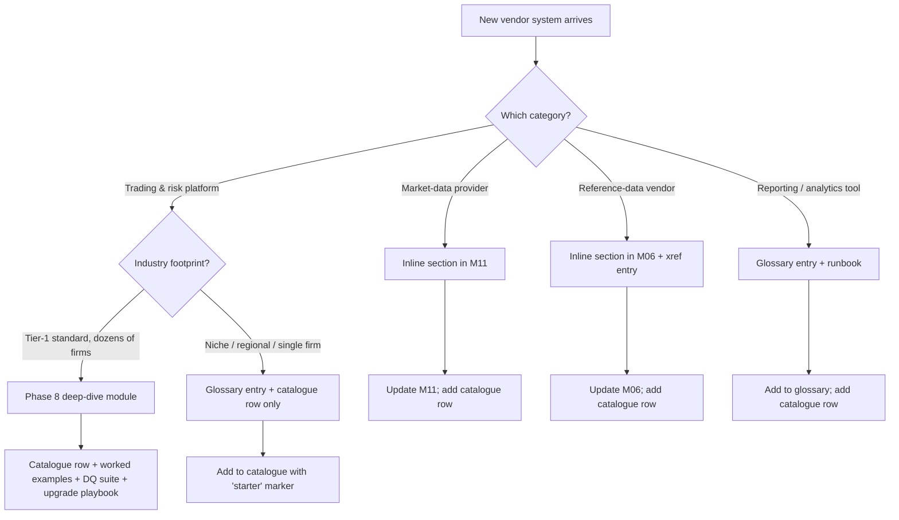

# Module 23 — Working with Vendor Systems (the framework)

!!! abstract "Module Goal"
    Modules 01-22 taught the *theory* of a market-risk warehouse — what data shapes belong on the gold layer, how bitemporality protects reproducibility, where lineage stamps go, why aggregation has to respect additivity. None of that theory specifies what happens on the morning a project manager forwards an email saying *"we have just signed the contract for Polypaths, the data team owns onboarding, your slot in the architecture committee is in three weeks."* A new vendor system has just landed in the warehouse's inbox. This module is the framework for what comes next: how to categorise the system, how to apply a six-step onboarding template that is the same whether the vendor is a trading platform or a market-data feed, where the system slots into the medallion architecture (M18), and how to decide whether it deserves a Phase 8 deep-dive module of its own. Phase 8 of the curriculum starts here, and Module 24 (Murex) is the first applied case study; the framework defined in this module is what every future vendor-applied module — Polypaths, Quantserver, Calypso, Summit, Sophis — will instantiate. The cost of doing vendor onboarding ad-hoc is years of one-off plumbing; the value of doing it via the framework is that vendor #5 takes a tenth of the time of vendor #1.

---

## 1. Learning objectives

By the end of this module, you should be able to:

- **Identify** the four categories of vendor systems a market-risk warehouse typically integrates — trading and risk platforms, market-data providers, reference-data vendors, reporting and analytics tools — and place any new system you encounter into the right category on the first read of its product brief.
- **Apply** a six-step onboarding template (catalogue → map → extract → validate → lineage → version-track) to any new vendor system, and articulate the artefact each step produces and the discipline each step protects against.
- **Catalogue** a new vendor system into the warehouse's source-system register with the metadata downstream consumers and auditors will need: entities exposed, grain, refresh frequency, integration pattern, contract version, schema hash.
- **Decide** where Bloomberg-style market-data feeds fit relative to trading-platform vendors like Murex and Calypso, and whether a newly-arrived system warrants a Phase 8 module of its own, an inline callout in [Module 11](11-market-data.md), or a glossary entry.
- **Recognise** the anti-patterns specific to vendor onboarding — joining vendor identifiers directly in gold marts, skipping schema-version capture, treating the vendor's official feed as authoritative without firm-side reconciliation — and write the silver-layer conformance plus DQ checks that prevent each of them.
- **Plan** the per-vendor onboarding workplan in a way that scales: vendor #1 may take six months because the framework is being established alongside it; vendor #5 should take six weeks because the framework is reused.

## 2. Why this matters

Every BI or data engineer in market risk eventually inherits a vendor system to integrate. The pattern is so consistent across firms that it is worth naming explicitly: the firm signs a contract with Murex, or buys a small Polypaths deployment for the structured-credit desk, or migrates the FX desk from an in-house pricer to Front Arena, or finally retires the 1990s-vintage Sophis instance the equity-derivatives desk has been running on. The trade-capture and risk-engine teams onboard the new system at the *front-office* level — they configure books, calibrate models, train traders — and the data team inherits the *downstream* problem of getting the new system's outputs into the warehouse, conformed against the firm's master data, validated, lineaged, and version-tracked, all without breaking any of the existing reports the warehouse already serves. The downstream problem is the warehouse's problem, not the front office's, and the warehouse owns it for the lifetime of the vendor relationship.

The cost of getting it wrong, ad-hoc style, is large and recurrent. A team that integrates each new vendor as a one-off — a custom set of bronze tables, a hand-rolled silver-conformance script, a vendor-specific DQ harness, vendor-specific lineage attributes — accumulates a *vendor-shaped* warehouse where every consumer query has to know which vendor produced which fact, where every silver dimension has a vendor-specific column, where the cross-vendor reconciliation question ("does Murex's position for book X match Calypso's position for the equivalent book Y?") cannot be answered without writing custom code per pair. The team responsible for the warehouse spends years building one-off plumbing instead of risk-data discipline, and the BI consumers spend years guessing which vendor's number to trust. The cost is invisible on any single project; it is enormous over the warehouse's lifetime.

The value of doing vendor onboarding via a framework is leverage. The framework itself takes effort to establish — vendor #1 is the case where the catalogue table, the silver-conformance pattern, the DQ check library, and the lineage stamp conventions get written for the first time, and the team's investment is real. Vendor #2 reuses 60% of the framework. Vendor #3 reuses 80%. By vendor #5 the onboarding is 90% template-driven and 10% vendor-specific judgement, and the team has shifted from *building plumbing* to *configuring the framework*. The applied modules of Phase 8 — Module 24 on Murex first, with Polypaths, Quantserver, Calypso, Summit, Front Arena, Sophis as starters for future contributors — are each instances of the framework. A reader who understands the framework can write the module for a vendor it does not yet cover, and that extensibility is the framework's chief value proposition.

A fourth motivation worth pulling out explicitly: the *audit defensibility* of vendor integrations. Every vendor a firm consumes from is a potential point of regulatory questioning. A regulator asking "where did this trade come from?" wants the answer to walk back through the lineage — through the warehouse's gold mart, through the silver-conformed view, through the bronze landing, through the vendor extract, to the vendor's own system of record. A team that has run the framework's lineage step (step 5) every time can produce that walk-back in minutes; a team that has not has gaps in the lineage that the regulator will surface as findings. The audit consequences of a finding range from minor (a documentation update required) to substantial (a remediation programme imposed on the data team's roadmap), and the cost of the framework's discipline is small relative to the cost of regulatory remediation. The framework is, in significant part, a *regulatory-defence* artefact, even though its day-to-day value is operational.

A practitioner-angle paragraph. After this module you should be able to receive an email saying *"we have just signed the contract for [vendor]"* and produce, within a working day, a one-page response that names the system's category, lists the six-step onboarding artefacts, identifies which existing warehouse layers will absorb it, flags the most likely integration risks, and proposes the workplan duration and team allocation. You should also be able to read an existing vendor integration somebody else built and assess whether it followed the framework or accreted ad-hoc — which silver-layer assets are missing, which DQ checks are absent, which lineage stamps were skipped — and write the remediation plan. The framework is the language; the per-vendor modules are the dictionary; together they let the data team treat vendor onboarding as a *repeatable capability* rather than a *recurring crisis*.

## 3. Core concepts

A reading note. Section 3 builds the vendor-onboarding framework in six sub-sections: the four categories of vendor systems and how to recognise each (3.1), the six-step onboarding template that applies to all of them (3.2), the catalogue table that registers every vendor system the warehouse encounters (3.3), the decision tree for where a new system slots into the curriculum (3.4), where vendor data sits in the medallion architecture established in [Module 18](18-architecture-patterns.md) (3.5), and the anti-patterns specific to vendor onboarding that the framework exists to prevent (3.6). Section 3.2 is the load-bearing sub-section — the six-step template is what the rest of Phase 8 instantiates.

### 3.1 Vendor system categories

Vendor systems differ enough in their data shapes and integration patterns that the warehouse benefits from a deliberate categorisation. Four categories cover essentially every system a market-risk warehouse will encounter; the rare exceptions (a research-platform feed, an internal pricing engine the firm acquired through a M&A transaction) usually fit one category by analogy and inherit its onboarding pattern.

A reading orientation for the rest of §3.1. Each category is described in four layers: the *typical members* (which vendors fall in this category), the *defining characteristics* (what makes the category coherent), the *integration shape* (how the warehouse absorbs systems in this category), and the *curriculum location* (where in the curriculum the category's deeper treatment lives). The categorisation is *practical* rather than theoretically tidy — a vendor that straddles two categories in some abstract sense is placed in the category that best describes its dominant integration pattern at most firms.

**Trading and risk platforms.** End-to-end capital-markets platforms that handle trade capture, position management, valuations, sensitivities, and often risk measures (VaR, FRTB) and back-office accounting too. The dominant vendors are Murex (MX.3), FIS Calypso, Finastra Summit, ION Front Arena, Numerix Polypaths, Numerix Quantserver, and the historical Misys/Finastra Sophis. Each of these is a *system of record* for some portion of the firm's trading activity — typically organised by asset class or by desk — and the warehouse receives nightly batch extracts (occasionally intraday for the more streaming-friendly platforms). The data shapes are *firm-specific*: a Murex deployment at Bank A looks different from one at Bank B because each firm customises books, attributes, and reporting hierarchies. The integration pattern is dominated by *datamart* extracts (the vendor's curated reporting layer) rather than by direct database access; the volumes are large (millions of trade rows, billions of sensitivity rows for a tier-1 deployment); the upgrade impact is significant (a major version upgrade can take multiple quarters of data-team work). [Module 24](24-murex-applied.md) is the applied case study for Murex; analogous future modules cover the other platforms.

**Market-data providers.** Vendors whose product is a *market observation* rather than a trading workflow — Bloomberg, Refinitiv (formerly Reuters, now LSEG), ICE Data Services, S&P Global Market Intelligence, MSCI, exchange direct feeds. The data shapes are the curves, surfaces, prices, and fixings of [Module 11](11-market-data.md). Integration patterns vary widely: Bloomberg ships through BPIPE (a binary protocol), B-PIPE Data License, or DLWS files; Refinitiv ships through Eikon Data API, RFA/RDP feeds, or DataScope file deliveries; ICE through the ICE Data Services portal or direct feed. The volumes are moderate (a few million rows per day across all factors for a global firm) but the *latency sensitivity* is high (intraday consumers expect updates in seconds, EOD consumers expect the official cut by a published time). The licensing constraints are strict — most vendor contracts limit redistribution, downstream consumer counts, and which derivative products the data may be used for — and the warehouse must enforce them through access controls and consumer-tagging. The Module 11 layer is the existing home for this category; Module 23 cross-references it rather than restating it.

**Reference-data vendors.** Vendors whose product is the *static descriptive metadata* about financial instruments, counterparties, and the entities the firm trades with. The dominant vendors are GLEIF (Global Legal Entity Identifier Foundation) for LEIs, OpenFIGI (Bloomberg-administered) for instrument identifiers, ANNA (Association of National Numbering Agencies) for ISIN allocation, S&P Global for sector classification (GICS), MSCI for index constituents, Bloomberg for SEDOL and ticker reference, the SWIFT BIC directory for bank identifiers. The data shapes are conformed dimensions in the warehouse vocabulary — each reference-data vendor populates one or more `dim_xref_*` tables ([Module 6](06-core-dimensions.md)). The integration pattern is typically a *daily snapshot file* (CSV, JSON, or XML on a sFTP drop) plus an API for ad-hoc lookups; the volume is small (millions of rows once at initial load, tens of thousands of incremental changes daily); the latency sensitivity is low (a once-per-day refresh is the norm). The licensing constraints are lighter than market data but still meaningful (some vendors charge per lookup, others per consumer seat). The integration pattern is mature — the xref dimensions of M06 are exactly the structure these vendors populate.

A note on the *reference-data category's organisational distinctness*. Reference-data integrations typically live with the firm's *master-data-management* function rather than with the warehouse's data-engineering team. The MDM team owns the firm-canonical identifier schemes (the firm's authoritative `counterparty_sk` set, the firm's authoritative `instrument_sk` set), and the reference-data vendors feed into those schemes. The data-engineering team consumes the resulting xref dimensions in the silver-layer conformance work, but the integrations themselves are MDM's responsibility. The framework still applies — every reference-data integration has its catalogue, its mapping, its extraction, its validation, its lineage, its version-tracking — but the team executing the framework is MDM rather than data engineering. The cross-team coordination (data engineering as a downstream consumer of MDM's outputs) is itself a discipline the framework supports indirectly through the catalogue's contracts but does not enforce directly.

**Reporting and analytics tools.** Vendors whose product is a *consumption surface* the warehouse feeds rather than a source the warehouse consumes. The dominant categories are regulator submission portals (the bank's national regulator's BCBS 239 attestation portal, the EBA's COREP/FINREP submission, the Federal Reserve's FR Y-14 system), industry data services that the bank both consumes from and contributes to (Risk.net pricing benchmarks, the ISDA market-data committee's published rates), and BI tools where vendor-specific export formats matter (Tableau extract files, Power BI datasets, Anaplan model imports). The integration pattern is *outbound* rather than inbound — the warehouse produces the file or invokes the API, and the vendor (or regulator) is the consumer. The framework still applies: the outbound feed needs to be catalogued, the firm-canonical-to-vendor mapping is the inverse of the inbound xref pattern, the DQ checks become *outbound* validations (what the regulator will reject before submitting), and the lineage stamp on the outbound feed must be reproducible months later when the regulator queries a specific cell.

A note on the categories' *boundary blurring*. The four categories are clear at the centre and fuzzy at the edges. A vendor that produces both market data and reference data — Bloomberg's combined offering being the classic case — fits two categories simultaneously, and the firm decides per *integration* which category each Bloomberg product belongs to. A vendor that produces both trading-platform outputs and risk-engine outputs — Murex's modular architecture lets it sit in both — is clearly in the trading-and-risk-platform category but the integrations for the two product lines may follow slightly different patterns. The framework handles the boundary blurring by treating each *integration* as the unit of categorisation, and by allowing a single vendor to appear under multiple categories if their products genuinely span them. The discipline is to *not force* a vendor into a single category when its products do not fit; the cost of the artificial categorisation is downstream confusion about which integration pattern applies.

A note on *vendors not yet in the catalogue*. Every firm encounters at least one vendor that does not fit neatly into any of the four categories — a niche analytics platform, a regional pricing service, a research-data subscription, an industry-utility membership. The framework absorbs these by extending the categorisation: the team can add new categories as needed, with the existing four as the typical anchors. The discipline is to *catalogue the new vendor first* (as soon as the firm signs the contract) and to *categorise it second* (after enough integration work has been done to understand its shape). A team that holds off on cataloguing a niche vendor because they cannot yet decide its category is a team that loses sight of the vendor entirely; the catalogue should be the broad register, with the categorisation refining as the team's understanding develops.

A reference table that captures the four categories at a glance:

| Category                       | Data shape                                  | Integration pattern                  | Volume          | Latency                | Onboarding pattern                |
| ------------------------------ | ------------------------------------------- | ------------------------------------ | --------------- | ---------------------- | --------------------------------- |
| Trading & risk platforms       | Trades, positions, sensitivities, P&L       | Datamart batch + occasional API      | Large           | EOD (some intraday)    | Phase 8 deep-dive module          |
| Market-data providers          | Curves, surfaces, prices, fixings           | Binary feed / API / file drop        | Moderate        | Real-time / intraday   | Already covered in [M11](11-market-data.md) |
| Reference-data vendors         | Static descriptive metadata, identifiers    | Daily snapshot file + lookup API     | Small           | Daily                  | Inline in [M06](06-core-dimensions.md) xref |
| Reporting & analytics tools    | Outbound: warehouse → vendor / regulator    | File submission / API call           | Variable        | Submission cadence     | Glossary entry + runbook          |

A practitioner observation on *why the categorisation matters*. The category determines the warehouse layer that absorbs the vendor (trading platforms land in bronze and are conformed in silver; market-data providers also land in bronze but have a dedicated curated layer in M11; reference-data vendors land in the xref dimensions directly; reporting tools live on the outbound side of the gold layer), it determines the downstream consumer pattern (trading platforms feed the risk engines and the regulatory submissions; market-data providers feed everything; reference-data vendors are joined into every dimension; reporting tools serve regulators and committees), and it determines the *team* on the warehouse side that owns the integration (the silver-layer team for trading platforms, the market-data-operations team for market data, the master-data-management team for reference data, the regulatory-reporting team for submissions). A new vendor that arrives without a category declared is a vendor that no team will own clearly, and the integration will drift to whichever team has the most spare capacity rather than the most relevant capability.

A note on *the categories' overlap with the firm's procurement governance*. Many firms have a separate procurement-governance process for each vendor category — trading-platform vendors go through one approval committee, market-data vendors through another, reference-data vendors through a third, reporting tools through a fourth. The categorisation in this section maps reasonably well to those committees, which means the framework's vocabulary aligns with the firm's existing procurement process and the data team can engage with procurement using terms procurement already understands. A team that uses the framework's categories in conversations with procurement is a team whose vendor proposals navigate the procurement process more smoothly; a team that invents its own categorisation has to translate into procurement's vocabulary at every interaction.

A note on *the categorisation's role in capacity planning*. The categorisation drives the team's capacity planning because each category has different per-vendor steady-state cost profiles. A trading-and-risk-platform integration is the most expensive in steady state — substantial DQ-check operation, regular cross-system reconciliation, periodic version upgrades. A market-data-provider integration is moderately expensive — high-frequency monitoring of feed freshness, regular vendor-vs-vendor cross-checking. A reference-data-vendor integration is the cheapest in steady state — daily snapshot loads, infrequent xref expansions, very rare schema changes. A reporting-and-analytics integration is variable — submission-cadence-driven activity, with quiet periods between submission deadlines. A team that knows the per-category cost profile can budget its annual capacity correctly; a team that treats every vendor as the same cost shape either over-allocates (and wastes capacity on cheap categories) or under-allocates (and runs out of capacity on the expensive ones).

A second observation on *the boundary cases*. Some vendors straddle categories. Bloomberg sells market data (BPIPE), reference data (the FIGI service), and an analytics platform (BQuant, BVAL). Each of these is a separate *integration* even though they all ship from the same vendor — Bloomberg market data is M11's territory, Bloomberg FIGI is M06's xref territory, BVAL is closer to a market-data composite that gets cleansed under M11's vendor-cleansed-official discipline. The framework handles the multi-product vendors by treating each *product* as the integration unit, not the *vendor entity*. A Bloomberg integration is in fact three or four parallel integrations under the framework, each catalogued and onboarded separately.

A third observation on *the in-house pricing engine* boundary case. Some firms have an internal pricing engine — the firm's own quantitative-research team's library, exposed as a service the trading platforms call into for valuations. From the warehouse's perspective the in-house engine is *functionally* a vendor system: it has its own data shapes, its own identifiers, its own version cadence, its own outage characteristics, and it produces facts the warehouse persists. The framework applies even though no contract was signed; the catalogue entry, the silver conformance, the DQ checks, the version-tracking are all warranted. Treating the in-house engine as "ours so we don't need the framework" is the most common framework-skipping mistake, and it has the same long-run consequences as skipping the framework for a real vendor.

### 3.1a The vendor relationship over the warehouse's lifetime

A short note on the *temporal* dimension of the vendor relationship. A vendor system is not a one-time integration but a multi-decade relationship; the warehouse will live with each vendor for ten or twenty years, and the discipline that protects the relationship has to operate over that horizon, not just over the integration's first few months. Three temporal phases are worth naming because they impose different demands on the framework.

**Phase 1 — onboarding (months 1-12).** The integration is being built. The team is establishing the catalogue entry, the silver-conformance views, the DQ check suite, the lineage stamps, and the version registry. The vendor's quirks are being discovered and documented for the first time. The team's velocity is determined by how cleanly the framework absorbs the vendor's specifics; a team using the framework can integrate a new vendor in three to six months at this maturity, a team without the framework typically takes nine to twelve months for the same scope. The deliverable at the end of phase 1 is a stable, in-production integration with all six framework artefacts in place.

**Phase 2 — steady-state operation (years 1-5).** The integration is in production. The team's daily activity is monitoring (the DQ checks fire, the team triages), incremental enhancement (a consumer wants a new column, the team extends the silver view), and version-tracking (each vendor minor release is triaged and absorbed). The team's per-vendor capacity in steady state is typically 5-15% of one engineer's time per vendor, with spikes during version upgrades and during incident response. A team that has more than ten vendors in this phase is a team that has invested heavily in the framework, because the steady-state cost would otherwise be unmanageable.

**Phase 3 — major upgrade or replacement (year 5 onwards).** The vendor ships a major version that requires significant migration work, or the firm decides to replace the vendor with a different system. Phase 3 is a project rather than a steady-state activity, with a defined kick-off, defined scope, defined timeline. The team's framework artefacts are the asset that makes phase 3 tractable: the catalogue entry tells the team what is being migrated, the silver-conformance views are the point where the migration translates from old to new, the DQ checks become the cross-version reconciliation harness, the version registry tracks the migration's progress. A team without the framework artefacts faces phase 3 with no map of what to migrate; a team with them has the map and the tools.

A practitioner observation on the *cost-shape over the lifetime*. The total cost of the vendor relationship over the warehouse's lifetime is dominated by phase 2 (steady state lasts the longest) and by the periodic phase 3 events (major upgrades happen every few years, each with substantial concentrated cost). Phase 1 (the initial onboarding) is the most *visible* cost — the project gets a budget, a team, a delivery date — but is typically the smallest of the three over the relationship's lifetime. The framework's value is largely in *reducing the steady-state and phase-3 costs* by giving the team the artefacts that make those phases tractable; the phase-1 cost is paid once, the savings accrue across the rest of the relationship.

### 3.1b A note on the "vendor" boundary in financial firms

A definitional digression worth pausing on. The word *vendor* in the framework's vocabulary is broader than the everyday usage; it covers any external or internal system the warehouse integrates as a *source*, not just systems supplied by a third-party software firm. The categorisation is *functional* rather than commercial: any system that produces facts the warehouse persists, that has its own version cadence, that has its own outage profile, that has its own identifier scheme — that system is a *vendor* in the framework's sense, regardless of whether the firm bought it from a third party or built it internally.

The three boundary cases that recur:

**The acquired system.** A firm that has just completed an M&A acquisition typically inherits the acquired firm's trading, risk, and reporting platforms. From day one of the close, the warehouse's job is to integrate the acquired platforms alongside the firm's existing ones. The acquired platforms are *vendors* under the framework — even if they were once internal to the acquired firm — and the catalogue, conformance, validation, lineage, and version-tracking discipline applies to them. The post-acquisition integration work is one of the most demanding cases the framework absorbs, because the timeline pressure is high (the acquirer needs consolidated reporting quickly), the documentation is often poor (the acquired firm's tribal knowledge does not transfer cleanly), and the master-data reconciliation is substantial (the two firms' counterparty and instrument masters typically overlap heavily and must be merged). A team with the framework in place handles the post-acquisition work as an extension of its normal vendor-onboarding capacity; a team without the framework typically experiences the acquisition as an integration crisis.

**The decommissioning system.** A vendor system being retired — replaced by another platform, or sunset because the desk it served has been wound down — is still in scope for the framework during its sunset period. The catalogue entry should be marked *deprecated* with a sunset date; the silver-conformance views should remain operational so historical reporting continues to work; the DQ checks should remain in place so the residual data quality is monitored; the lineage stamps remain critical for any historical reproduction the warehouse may need to perform after the system is gone. A team that decommissions a vendor by simply turning off the integration loses the historical reporting capability for the period the vendor covered; a team that follows a deliberate sunset process retains the historical capability while the active integration is wound down. The sunset discipline is the symmetric counterpart of the onboarding discipline.

**The internal-but-external system.** Some firms have internal pricing or risk engines that, organisationally, sit *outside* the warehouse team — a quant-research function, a separate analytics-engineering function, a desk-specific tooling team. From the warehouse's perspective these systems are functionally vendors, even though they sit within the same firm. The same framework discipline applies; the *organisational politics* of applying it can be more delicate (asking an internal team to publish a contract, version their releases, and treat the warehouse as a downstream consumer is a request that can land awkwardly if the internal team has not previously thought of itself in those terms). The framework's value here is to give the warehouse team a *standard* to point to — "every system the warehouse integrates is treated this way, including yours" — rather than negotiating the discipline ad-hoc per internal counterpart.

### 3.2 The six-step onboarding template

Once the vendor's category is settled, the same six-step template applies to the integration regardless of which category the vendor sits in. The template's value is *consistency*: every vendor onboarding produces the same six artefacts in the same order, every team member knows what artefact comes from what step, every reviewer knows what to look for at each gate. A team that follows the template ends up with a warehouse where every vendor integration looks structurally similar; a team that skips steps ends up with a warehouse where each vendor's integration is an idiosyncratic shape that has to be re-learned every time someone queries it.

A reading orientation for the rest of the section. Each step is described in three layers: the *what* (the activity the step performs), the *artefact* (the tangible output the step produces, which becomes a queryable or referenceable thing in the warehouse), and the *discipline protected* (the failure mode the step exists to prevent). The framework's value comes from running every step every time, even when the team is under pressure to skip one or two; the steps that get skipped under pressure are typically the steps whose absence will cause the next vendor incident.

**Step 1 — Catalogue.** Before any code is written, document what the vendor's outputs *are*. The catalogue entry is a structured record covering: the entities exposed (trades, positions, sensitivities, prices, identifiers); the grain of each entity (one row per trade-and-modification, one row per position-and-business-date, one row per sensitivity-and-bucket); the refresh frequency (nightly batch, intraday updates, on-demand); the file format or API protocol (CSV / Parquet / Avro / proprietary binary); the contractual constraints (volume limits, redistribution restrictions, consumer counts); the system-of-record relationship (is this vendor the *authoritative* source for the entity, or a *secondary* source the warehouse holds for cross-validation?); the contact and escalation chain on the vendor side (account manager, technical support, escalation matrix); the contract version and renewal cadence on the firm side. The artefact is a *catalogue entry* — typically a row in a `source_system_register` table, often supplemented by a markdown page in the team wiki. The discipline this step protects against is *integration without specification* — a team that begins coding before the catalogue is complete typically discovers, midway through implementation, that the entity grain is not what they assumed and the work has to be re-done.

A note on *what makes the catalogue entry sufficient*. The catalogue entry is sufficient when a new team member can read it and answer the questions: what does this vendor produce, when, in what shape, with what constraints, who do I talk to on the vendor side, what are the contractual gotchas, what known issues should I be aware of? If the new team member can answer those questions from the catalogue alone — without needing to ask the original engineer — the catalogue is sufficient; if not, the catalogue needs more depth. The test is *operational*, not aspirational; a team can verify the test by actually onboarding a new team member to a vendor integration and observing how many questions they ask.

**Step 2 — Map.** Translate the vendor's identifiers and column names into the firm's canonical model. Every vendor uses its own identifier scheme (Murex's `MX_TRADE_ID`, Bloomberg's `BB_INSTRUMENT_ID`, GLEIF's `LEI`, the firm's internal `TRADE_SK`); every vendor uses its own column names (one calls it `notional_amt`, another calls it `nominal_value`, a third calls it `face`); every vendor uses its own conventions (one books FX trades buy-side as positive, another books sell-side as positive). The mapping artefact is a *xref table* (or a set of them) of the form introduced in M06 — `dim_xref_counterparty`, `dim_xref_instrument`, `dim_xref_book` — populated with the vendor's identifier on one side and the firm's canonical identifier on the other. The mapping also includes a *column-rename specification* documenting which vendor column maps to which firm-canonical column, and a *convention-translation specification* documenting any sign-flip, unit conversion, or semantic translation required. The artefact is a *silver-layer conformance specification* — a document that the silver-layer SQL will implement and that the data-quality team will validate against. The discipline this step protects against is *vendor-language leakage* — a warehouse that lets vendor identifiers and column names propagate into the gold layer becomes a warehouse where every BI consumer has to know which vendor produced which row, and the entire point of the silver layer (a single source of truth across vendors) is lost.

A note on *the convention-translation specification*. Sign conventions, currency conventions, status taxonomies, time-zone conventions — every vendor has its own, and the firm-canonical convention is its own as well. The convention-translation specification should *enumerate every convention difference* the silver layer will translate, with the source convention, the target convention, and the translation rule. A specification that says only "translate Murex's conventions to firm-canonical" is too vague to support a code review or an audit; a specification that lists, for example, "Murex direction = 'B' → firm direction_sign = +1; Murex direction = 'S' → firm direction_sign = -1" is concrete enough that the silver-layer SQL can be verified against it line by line. The discipline is to make the specification *operational* — every translation rule that the silver-layer SQL applies should be explicitly documented, and any rule the SQL applies that is not in the specification is either a bug or an unauthorised extension that should be promoted to the specification.

**Step 3 — Extract.** Choose the integration pattern and implement the extraction. Four patterns dominate in practice. *Datamart query*: the vendor exposes a curated reporting database (the Murex datamart, the Calypso DataNav layer) and the warehouse runs scheduled SQL queries against it to pull the day's data. *API pull*: the vendor exposes a REST or GraphQL API and the warehouse polls it on a schedule (Bloomberg's BLPAPI, Refinitiv's RDP, GLEIF's API). *File drop*: the vendor publishes nightly files to a shared sFTP or cloud-storage location and the warehouse polls for new arrivals (the typical pattern for market-data and reference-data vendors). *Message bus*: the vendor publishes events to a message bus the warehouse subscribes to (rarer in batch-shaped warehouses but common where the vendor is intraday-streaming-first). The choice depends on what the vendor offers, what the warehouse's ingestion layer supports, what the latency requirement is, and what the operational model looks like. The artefact is *an extractor* — a Python module, a dbt source, an Airflow operator — that lands the vendor's outputs in bronze with the correct lineage stamps. The discipline this step protects against is *real-time extraction when batch is sufficient* — a team that defaults to the most aggressive integration pattern (real-time API polling) when the consumer only needs EOD typically pays the cost of operational complexity, vendor load, and licence overage without gaining any real value.

A practitioner note on *picking the integration pattern*. The choice between the four patterns above is bounded primarily by what the vendor offers — a vendor that does not expose an API cannot be integrated through API pull regardless of the warehouse's preference. Within the bounds of what the vendor offers, the team's choice should be driven by the consumer's freshness requirement, the data volume, the warehouse's existing ingestion infrastructure, and the operational cost of running the chosen pattern in production. A typical decision: "the consumer needs EOD freshness, the vendor offers both file drop and API; we pick file drop because our existing ingestion infrastructure handles file drops well, the operational cost is lower, and we do not need the API's intraday capability." The decision is documented in the catalogue entry under *integration patterns* (per-entity) and revisited only when the consumer's requirements change or the vendor's offerings change.

**Step 4 — Validate.** Layer the data-quality checks the warehouse will run on every load. The discipline of [Module 15](15-data-quality.md) applies directly. Four check categories cover the typical needs: *count checks* (the vendor's published row count for the day matches the count the warehouse loaded); *total checks* (the vendor's published aggregate notional or aggregate trade-count rolls up to the same number from the warehouse's loaded rows); *schema checks* (the columns and types in today's load match the contract — column adds, removals, or type changes are flagged); *business-rule checks* (specific assertions about the data — every trade has a non-null counterparty, every position has a non-null instrument, every sensitivity has a non-null risk-factor). The artefact is *a DQ check suite* — typically a set of `dq_check__vendor_X_*` queries or dbt tests, with a documented severity (error / warn / info), an alert path (which on-call team receives the page), and a remediation playbook. The discipline this step protects against is *silent integration drift* — a vendor that adds a column today, renames one tomorrow, and changes a semantic meaning next week will degrade the warehouse silently if the DQ checks are not in place to catch each change at load time.

A practitioner note on *check severity calibration*. The severity of each check — error (the load is held), warn (the load proceeds, the exception is logged), info (the exception is logged, no action) — needs to be calibrated to the failure mode the check addresses. A count tie-out failure is almost always severity error: a missing trade is consequential, the load should not be promoted until the gap is explained. A schema-drift failure is severity error: the schema is the contract, an unannounced change must be acknowledged before the new schema is promoted. An unmapped-xref failure is typically severity warn: a single new counterparty the firm has not yet onboarded into the master-data system is not worth holding the morning's load over, but the exception should reach the master-data team for next-day triage. Calibrating severity is a judgement call per check; the discipline is to *make the calibration explicit* (in the check's metadata), to review it periodically (the calibration may need to change as the integration matures), and to keep the alert volume manageable (a check that fires every day at severity error and is always closed without action is a check that has been miscalibrated).

**Step 5 — Lineage.** Stamp every row that lands from the vendor with the metadata that lets a future consumer trace it back. The discipline of [Module 16](16-lineage-auditability.md) applies directly. Four stamps are mandatory: `source_system_sk` (the vendor's identifier in the firm's `source_system_dim` — `MUREX`, `BLOOMBERG`, `GLEIF`); `pipeline_run_id` (the orchestration framework's identifier for the load run that produced this row); `code_version` (the git SHA of the code that performed the load and conformance); and `vendor_schema_hash` (a hash of the vendor's schema at load time, so schema drift can be detected and historic loads can be reproduced). Optional but recommended additional stamps: `load_timestamp_utc` (when the row landed in bronze), `vendor_extract_id` (the vendor's identifier for the extract that produced this row, if the vendor publishes one), `vendor_version` (the vendor product version — e.g., MX.3.2.1 — at load time). The artefact is *a lineage convention* — typically codified as a macro, a base model, or an ingestion utility that every vendor extractor uses to stamp its rows. The discipline this step protects against is *unattributable rows* — a row in the warehouse that cannot be traced back to a specific vendor, a specific load run, and a specific code version is a row that has lost its regulatory defensibility, and the BCBS 239 attestation cannot rest on it.

A practitioner observation on *the lineage stamp's universality*. Step 5 is the step the framework's discipline most depends on, because every other step's discipline becomes uninspectable without lineage. A team that runs step 4 (validation) but skips step 5 (lineage) cannot answer the question "which load run produced the row that failed validation"; a team that runs step 6 (version tracking) but skips step 5 cannot tell which version produced any given row. The lineage stamps are the *substrate* on top of which the other framework artefacts function, and the discipline of stamping every row consistently across every vendor — not just the easy ones, not just the high-volume ones, every row from every source — is the discipline the framework most rewards. A team that is selective about lineage stamps is a team that has no defensible line of investigation when a regulator asks about a specific row.

**Step 6 — Version-track.** Maintain a record of the vendor's product version, the schema version, and the firm's code version that processed each load. The artefact is *a version registry* — typically a `vendor_version_dim` table (or equivalent on `source_system_dim`) with the vendor product version, the schema hash, the date the version was first observed, the date the version was last observed, and the date a successor version was promoted to canonical. The team subscribes to the vendor's release notes and tracks each upgrade through a documented process: (a) identify the upgrade announcement; (b) catalogue the schema and behaviour changes; (c) update the silver conformance to handle the changes; (d) parallel-run the old and new versions for a transition period; (e) cut over and retire the old. The discipline this step protects against is *version-blind onboarding* — a team that integrates a vendor without tracking the version is a team that cannot reproduce a historical query when the vendor has since shipped two upgrades, and the historical reproduction is exactly what the auditor will ask for.

A note on *the version registry's secondary value*. Beyond the upgrade-tracking value, the version registry has a secondary value: it serves as the *audit log* of the warehouse's vendor relationships. A regulator asking "which version of Vendor X did the warehouse use in 2024?" gets the answer from the registry; a forensic investigation asking "did the schema change at the time of this incident?" gets the answer from the registry; a contract-renewal conversation asking "how often have we been on the latest version?" gets the answer from the registry. The registry is one of the most-cited artefacts in mature vendor-management discussions, even though its construction is a routine engineering task. The discipline is to *populate the registry consistently from day one*, even when no immediate audit need exists; the audit need will come, and the registry that has been populated all along answers it directly, while the registry that has been populated retroactively answers it imperfectly.

A reference table summarising the six-step template:

| Step | Name             | Artefact                                       | Discipline protected                                  |
| ---- | ---------------- | ---------------------------------------------- | ----------------------------------------------------- |
| 1    | Catalogue        | `source_system_register` entry                 | Specification before code                             |
| 2    | Map              | xref tables + conformance specification        | Vendor-language containment                           |
| 3    | Extract          | Extractor module / dbt source / Airflow operator | Right pattern for the latency requirement            |
| 4    | Validate         | DQ check suite (counts, totals, schema, rules) | Catch integration drift at load time                  |
| 5    | Lineage          | Mandatory stamps on every row                  | Regulatory defensibility (BCBS 239)                   |
| 6    | Version-track    | `vendor_version_dim` entry + upgrade playbook  | Historical reproducibility across vendor upgrades     |

A practitioner observation on *the order of the steps*. The order is deliberate and not all permutations work. Catalogue must come before map (you cannot map fields you have not yet listed). Map must come before extract (you do not know what to land in bronze until you know what each vendor field corresponds to in the firm-canonical model — though pragmatically the bronze layer can accept the vendor's raw shape and the mapping can happen at the silver step). Validate, lineage, and version-track *can* be parallelised once extract is in place, but the discipline is to treat them as gates rather than nice-to-haves: an integration that goes live without DQ checks is an integration that will fail silently, and the cost of retrofitting them after the fact is substantially higher than building them in alongside the extractor. The team-process discipline is to define the steps as *gates* on the integration's promotion from dev to prod, not as parallel tracks with no enforced ordering.

A second observation on *the relationship between the steps and the team's roles*. The six steps of the template do not all live with the same person on the team. Step 1 (catalogue) typically lives with the integration's project lead — the person responsible for the vendor relationship and for coordinating with the vendor's account manager. Step 2 (map) lives with the master-data-management team in coordination with the data engineer who will write the silver-layer SQL. Step 3 (extract) lives with the data engineer who owns the bronze loader. Step 4 (validate) lives with the data-quality team in coordination with the integration engineer. Step 5 (lineage) lives with the data engineer through a shared utility or macro that the data-quality team has reviewed. Step 6 (version-track) lives with the integration's project lead, with the data engineer maintaining the registry. The role split varies by team size — a small team has one person doing all six, a large team has six different people — but the *responsibility* for each step is named, and a team that lets a step go unowned is a team that lets that step decay.

A third observation on *the framework's per-vendor cost decay*. The first vendor onboarded under the framework is the most expensive — the team is establishing the catalogue table, the xref pattern, the DQ check library, the lineage convention, and the version registry simultaneously with the integration itself. Vendor #2 reuses the catalogue table, the lineage convention, and most of the DQ pattern; the team builds vendor-specific xref entries and vendor-specific DQ rules but the framework infrastructure already exists. By vendor #5 the team is typically *configuring* the framework rather than *building* it, and the per-vendor onboarding cost has dropped by an order of magnitude. The arithmetic is the framework's chief economic justification — a one-off integration is cheaper for a single vendor, but the cumulative cost over a portfolio of vendor relationships favours the framework decisively.

### 3.3 The catalogue table — vendor systems the warehouse encounters

Below is the catalogue table the framework maintains as the warehouse's authoritative register of vendor systems. The "Module link" column points to the existing or planned curriculum module covering the system; entries marked *(planned)* are starters for future contributors — the framework is extensible by design, and a future contributor adding the Polypaths or Calypso module slots into the existing pattern without altering the framework itself.

| Name              | Category                       | Vendor               | Typical use                                                | Module link                                  |
| ----------------- | ------------------------------ | -------------------- | ---------------------------------------------------------- | -------------------------------------------- |
| Murex (MX.3)      | Trading & risk platform        | Murex                | Cross-asset front-to-back-to-risk; tier-1 bank standard    | [Module 24](24-murex-applied.md)             |
| Polypaths         | Trading & risk platform        | Polypaths Software Corp | Fixed-income analytics: OAS, prepayment, key-rate durations | [Module 25](25-polypaths-applied.md)         |
| Quantserver       | Trading & risk platform        | Numerix              | Pricing-library service, often paired with Polypaths       | *(planned — starter for future contributor)* |
| Calypso           | Trading & risk platform        | FIS (now Adenza)     | Capital-markets platform, strong in rates and credit       | *(planned — starter for future contributor)* |
| Summit            | Trading & risk platform        | Finastra             | Capital markets, strong in fixed income                    | *(planned — starter for future contributor)* |
| Front Arena       | Trading & risk platform        | ION (FIS heritage)   | Cross-asset front-to-risk, common in mid-tier banks        | *(planned — starter for future contributor)* |
| Sophis            | Trading & risk platform        | Misys (now Finastra) | Equity and equity-derivatives, legacy at many shops        | *(planned — starter for future contributor)* |
| Bloomberg         | Market-data provider           | Bloomberg LP         | Reference data, prices, curves, BVAL composite             | See [Module 11](11-market-data.md)           |
| Refinitiv (LSEG)  | Market-data provider           | LSEG                 | Reference data, prices, curves, news                       | See [Module 11](11-market-data.md)           |
| ICE Data Services | Market-data provider           | Intercontinental Exchange | Fixed-income evaluations, rates, end-of-day prices    | See [Module 11](11-market-data.md)           |
| S&P Global        | Market-data + reference data   | S&P Global           | Credit ratings, GICS sector classifications, prices        | *(planned — starter for future contributor)* |
| MSCI              | Market-data + reference data   | MSCI                 | Index constituents, ESG ratings, factor models             | *(planned — starter for future contributor)* |
| GLEIF             | Reference-data vendor          | GLEIF (foundation)   | Legal Entity Identifiers (LEI) for counterparties          | *(planned — starter for future contributor)* |
| OpenFIGI          | Reference-data vendor          | Bloomberg-administered | Open-standard instrument identifiers (FIGI)              | *(planned — starter for future contributor)* |

A practitioner observation on the *(planned)* entries. The framework is the load-bearing artefact of Phase 8; the per-vendor modules are the dictionary entries that instantiate it. A future contributor who decides to write the Polypaths module — or the Calypso module, or the GLEIF module — slots their work into the existing framework: they catalogue the vendor under §3.1's category scheme, they walk the §3.2 six-step template against the vendor's specifics, they cite the worked-example pattern from §4 and adapt it, they reuse the DQ check shapes from §4, they list the vendor-specific anti-patterns under §5. The framework's structure is the contributor's template; the per-vendor knowledge is the contributor's contribution. A reader unfamiliar with one of the planned vendors who needs to onboard it can use the framework directly without waiting for the module — the framework is what does the work, and the module's value is to compress per-vendor judgement into a re-usable form.

A second observation on the *categorisation choices in the table*. Bloomberg appears once as a market-data provider, but in practice Bloomberg has a reference-data product (FIGI) and an analytics product (BVAL composite) that fit different categories. The catalogue table treats each *integration* as the unit of registration, not each vendor entity; a Bloomberg-FIGI integration would be a separate row from a Bloomberg-market-data integration if the firm runs both. The table above is illustrative rather than exhaustive on this point — a real firm's catalogue would list every integration as its own row, and the consolidation here is for readability.

A third observation on *the catalogue table as a living artefact*. The table above is a curriculum-time snapshot — at the time of writing, these are the vendors most likely to appear at a tier-1 bank's market-risk warehouse. A real firm's catalogue is *living* — it adds rows when new vendors are integrated, marks rows as decommissioned when vendors are retired, updates the module-link column as new applied modules are written. The discipline of keeping the table current is small in any given month and substantial over the warehouse's multi-year lifetime; a team that lets the table drift typically rediscovers vendor integrations during incident response that no one currently on the team remembers building.

A fourth observation on *the vendors not in the table*. The list is not exhaustive — every firm has long-tail vendors (a niche risk-analytics tool, a region-specific exchange feed, a data product from a research house) that do not appear above but still warrant the framework. The discipline is to *add* every vendor to the catalogue at integration time, regardless of whether it appears in the curriculum's list. The framework's value is in the registration discipline, not in the specific vendors documented in the training material.

### 3.4 The decision tree — Phase 8 module, M11 callout, or glossary entry?

When a new vendor system arrives, the next question is where it should be documented in the curriculum. The decision tree below codifies the choice. The criteria are: which category the vendor sits in, how broadly it is used in the industry (a vendor used at most tier-1 banks warrants a deep-dive module; a niche vendor used at one firm warrants a glossary entry), and how distinctive its data shape is from existing coverage (a vendor whose outputs slot cleanly into the M11 market-data discipline does not need a separate module, but a vendor whose outputs require new conformance patterns does).



An additional path the diagram does not show explicitly: a vendor that produces *outbound* feeds (the warehouse writes to the vendor rather than reading from it — regulatory submission portals, exchange reporting, rating-agency feeds) follows a parallel discipline. The catalogue entry is the same, but the steps are inverted: the warehouse defines its firm-canonical outputs, maps them to the vendor's expected schema (the inverse xref pattern), produces the outbound file or API call, validates the output against the vendor's expected format before submission, and tracks the version of the vendor's submission specification. The framework's six steps apply, with each step's direction reversed; the discipline is identical.

A practitioner observation on the *industry-footprint criterion*. The criterion is not a snobbery — every vendor matters to the firm that runs it — but a curriculum-design judgement about where finite training material is best invested. A module on Murex pays back across a large fraction of the curriculum's audience because Murex is the most common vendor in the field; a module on a regional bond-pricing tool pays back at one firm. The catalogue still registers the regional tool, the framework still applies to its onboarding, but the deep-dive module slot is reserved for the high-footprint cases. A future contributor with deep knowledge of a regional tool can absolutely write a module on it — the framework supports it — but the curriculum's *sequenced* coverage prioritises the high-footprint cases.

A second observation on *the decision tree's flexibility*. The tree is a default, not a rigid prescription. A vendor that on first read looks like a single-firm-only niche tool might turn out, on closer investigation, to have a wider footprint than was apparent — and the team should reclassify it from "glossary entry only" to "Phase 8 module" if the evidence supports it. Conversely, a vendor that was originally written up as a deep-dive might become deprecated or marginalised over time, and the team should reclassify it back down. The classification is a *working hypothesis* the team revisits annually as part of the catalogue maintenance cycle, not a one-off labelling.

A third observation on *the ambiguous boundary between a Phase 8 module and a M11 callout*. Some market-data vendors — Bloomberg's BVAL, Refinitiv's RAVE — have datamart-like reporting layers and version-upgrade dynamics that look more like a trading-platform vendor than a pure market-data feed. The decision tree resolves these by category-of-primary-use: BVAL is fundamentally a market-data composite, and its onboarding is a M11 specialisation; Refinitiv's RAVE is similar. A vendor whose outputs require silver-layer conformance against the firm's trade-and-position dimensions belongs in Phase 8; a vendor whose outputs slot into the M11 vendor → cleansed → official pipeline belongs in M11.

### 3.5 Where vendor data fits in the medallion architecture

[Module 18](18-architecture-patterns.md) established the medallion architecture as the curriculum's reference shape: bronze (raw landing) → silver (cleansed and conformed) → gold (business marts) → serving. Vendor data sits in this architecture at well-defined positions, and the framework's six-step template aligns directly with the layer responsibilities.

Vendor extracts land in **bronze** — source-faithful, with the vendor's column names and identifiers preserved exactly as the vendor produced them, plus the lineage stamps from step 5 of the template (`source_system_sk`, `pipeline_run_id`, `code_version`, `vendor_schema_hash`). Bronze is the warehouse's *replay buffer*: if anything downstream goes wrong, the team's recovery path is to truncate silver and gold and re-run the transformations against the unchanged bronze rows.

The vendor's outputs are conformed in **silver**. The xref dimensions from step 2 of the template translate vendor identifiers into firm-canonical identifiers; the column-rename specification renames vendor columns to firm-canonical column names; the convention-translation specification flips signs, converts units, and translates semantics where vendors disagree. The DQ checks from step 4 of the template run on the silver tables and fail the build if the checks do not pass. Silver is the *single source of truth* for the firm's business entities, and the gold marts treat silver as canonical without going back to bronze.

The conformed silver data feeds **gold** — the business-aligned facts and dimensions the BI tool reads from. Gold tables do not see vendor identifiers or vendor column names; they see firm-canonical identifiers and firm-canonical columns. The `source_system_sk` stamp from step 5 propagates from bronze through silver to gold so that a BI consumer can ask "which vendor produced this row" if needed, but the *default* gold-layer query is vendor-agnostic. A gold mart that joins multiple vendors (a `fact_position` mart that combines Murex positions and Calypso positions, for example) does so through the silver-conformed identifiers, not through vendor-specific joins.

The discipline this layering imposes is the framework's load-bearing discipline. A team that lets vendor identifiers leak into gold has lost the multi-vendor-warehouse benefit; a team that runs gold transformations directly off bronze (skipping silver) has lost the conformance discipline; a team that lets bronze be edited has lost the replay-buffer property. The medallion architecture and the six-step template are mutually reinforcing — each protects the other from the most common shortcuts.

A second framing on *where vendor data does not go*. The medallion layers are bronze, silver, and gold; vendor data lives in all three but in *different shapes* in each. A common misconception is that the warehouse should have a single "vendor schema" in which all vendor data lives — a `vendor_layer` that sits between bronze and silver, holding everything sourced from external systems before conformance. The misconception is structural: the layer the warehouse needs is the silver layer, not a parallel "vendor layer", because the silver layer's job is exactly to absorb vendor data and translate it to firm-canonical. A team that builds a separate vendor layer is building a layer that duplicates silver's responsibility without adding any new capability, and the result is two layers with overlapping logic that drift apart over time. The framework's discipline is to use silver for vendor conformance, period; the vendor's identity is captured in the `source_system_sk` column, not in a separate physical layer.

A third framing on *the lineage chain across the layers*. A row in gold can be traced back to its origin through the chain: gold row → silver-conformed row (via the `source_trade_id` plus `source_system_sk` plus `pipeline_run_id`) → bronze row (via the same triple) → vendor extract (via `mx_extract_run_id` or equivalent) → vendor source system. Each link in the chain is queryable in the warehouse, and the chain together is what makes the BCBS 239 traceability requirement satisfiable. A team that breaks any link — by dropping `source_system_sk` at one layer, by failing to capture the vendor's run id, by editing bronze and losing the original — breaks the chain and the traceability. The discipline is to *protect every link* through automated checks, code review, and orchestrator validation; the chain is only as strong as its weakest link, and any broken link costs the whole warehouse its regulatory defensibility.

A reference table mapping the six steps to medallion layers:

| Step                | Layer where the artefact lives    | Layer the artefact protects |
| ------------------- | --------------------------------- | --------------------------- |
| 1 — Catalogue       | Source-system register (silver)   | All layers                  |
| 2 — Map             | Silver (xref dimensions)          | Silver and gold             |
| 3 — Extract         | Bronze (the raw landing)          | Bronze                      |
| 4 — Validate        | Silver DQ checks                  | Silver and gold             |
| 5 — Lineage         | Stamp on every row, all layers    | All layers                  |
| 6 — Version-track   | Vendor-version dimension (silver) | All layers                  |

### 3.5a A note on the contract layer between the team and the vendor

The framework's six steps are technical artefacts the warehouse builds. There is a *parallel* layer of organisational artefacts the team should establish alongside them — the contract layer between the data team and the vendor — that often receives less attention than the technical work but matters as much over the vendor relationship's lifetime.

The first organisational artefact is the *named technical contact* on the vendor side. Every vendor system has a person (or a small team) on the vendor's side whose job it is to answer the integration team's questions, explain unexpected behaviours, and route bug reports through the vendor's product organisation. The team should establish the named contact at integration kickoff, document the contact in the catalogue entry, and verify the contact remains current at quarterly intervals (vendor-side personnel turnover is a real source of integration friction). A team that does not have a named contact is a team that opens vendor support tickets through the generic web portal and waits days for a response; a team that does has a back-channel that resolves urgent issues in hours.

The second organisational artefact is the *release-notes subscription*. Every vendor that ships software updates produces release notes; the data team should subscribe to the release-notes channel for every vendor in its catalogue, with a single team-shared inbox or feed reader, and someone responsible for triaging each release. The triage produces three outputs: (a) "no warehouse impact" (the release does not change anything the warehouse consumes); (b) "minor impact" (a column has been added that the warehouse may want to consume, a behaviour has changed that the warehouse needs to acknowledge); (c) "major impact" (a breaking change that requires a planned upgrade). The triage cadence is monthly at minimum; more frequent if the vendor ships more frequently. A team without the subscription discipline is a team that discovers vendor changes when its DQ checks fail rather than from the release notes.

The third organisational artefact is the *renewal calendar*. Every vendor contract has a renewal date; the data team should maintain a calendar of renewal dates across all vendors, with an alert lead time (typically six months) ahead of each renewal. The lead time lets the team participate in the renewal conversation — to flag operational concerns, to request changes to the contract terms, to weigh the vendor's value against the cost. A team that learns about a vendor renewal a week before the deadline has no leverage in the conversation; a team that has a six-month lead time can shape the renewal materially.

The fourth organisational artefact is the *escalation matrix*. When a vendor integration breaks production, the data team needs to know — before the breakage happens — who to call on the vendor's side at 03:00, who to email at 09:00, who to escalate to within the vendor's organisation if the issue is not progressing, and what the firm's contractual SLA promises. The escalation matrix is a one-page document per vendor, kept current, accessible to every on-call engineer. A team that builds the matrix has the answers when the production page fires; a team without the matrix improvises and loses hours.

The fifth organisational artefact is the *vendor scorecard*. Periodically (annually at most firms) the data team should produce a short scorecard for each vendor — a few-page document covering the vendor's reliability over the period (uptime, on-time delivery, incident count), the integration's data-quality posture (DQ check pass rates, schema-drift events, identifier-reconciliation gaps), the version-management posture (which versions the firm has run, which are in support), the cost-vs-value assessment (the contract spend, the warehouse's measured value from the integration), and the relationship health (escalations needed, vendor responsiveness on support tickets, account-management quality). The scorecard goes to the firm's procurement team and to the data team's leadership; it is the input for renewal decisions, vendor-of-the-year recognitions, and difficult conversations about underperforming vendors. A team that produces the scorecard has a structured way to engage the vendor's account team; a team that does not has only ad-hoc impressions.

A practitioner observation on *the contract layer's quiet importance*. The technical artefacts of the framework are visible in code reviews, release deployments, and architecture diagrams. The organisational artefacts are visible in the meetings that do not happen because someone called the right vendor contact ahead of time, the upgrade work that is scoped realistically because the release notes were triaged six months ago, the renewal conversations that produce favourable terms because the data team showed up prepared. The organisational layer is half of why a mature vendor relationship works smoothly; the team that invests in only the technical layer ends up with technically-clean integrations that nevertheless consume disproportionate organisational capacity to maintain.

### 3.5a1 A note on the framework's tooling investment

A short observation on the *tooling* the framework benefits from but does not require. A team can run the framework with nothing more than text documents (the catalogue as a markdown file, the version registry as a CSV) and standard SQL views. The framework's discipline is independent of the tooling. That said, several tools — when adopted — make the framework cheaper to operate.

Three tools recur in mature framework deployments. *A source-system register table* in the warehouse itself, populated by the catalogue entries, queryable from SQL — turns the catalogue from a documentation artefact into a queryable asset. *A DQ check framework* (dbt tests, Great Expectations, the firm's in-house DQ platform) — turns the validation step from ad-hoc SQL into a structured, tested, alerted system. *A lineage capture system* (OpenLineage emitters, the warehouse's native lineage features, dbt's lineage graph) — turns the lineage stamps from a passive convention into an active, queryable graph. A team that adopts all three has a substantially cheaper framework operation than a team that runs the framework with text files alone; the tooling investment pays back over the warehouse's lifetime, but the framework's value does not depend on the tooling.

### 3.5b The catalogue entry — a worked structure

The catalogue table of §3.3 listed vendors at a glance. The *catalogue entry* for a single vendor is a richer artefact — a structured document that sits alongside the entry in the source-system register and captures the metadata downstream consumers and auditors need. A worked structure of a catalogue entry, illustrated for a hypothetical vendor:

- **Vendor identity.** Name (`Vendor X`), parent firm, country of origin, year of first deployment at the firm, deployment scope (which desks, which asset classes, which products).
- **Category and warehouse treatment.** Category from §3.1 (`Trading & risk platform`); warehouse treatment from §3.4 decision tree (`Phase 8 deep-dive module — see Module 25 (planned)`).
- **Entities exposed.** Trades, positions, sensitivities, P&L, accounting movements — with a one-line grain description for each.
- **Refresh frequencies.** Per-entity cadence — `trades: nightly batch + intraday corrections`; `positions: nightly batch only`; `sensitivities: nightly batch only`.
- **Integration patterns.** Per-entity pattern — `trades: datamart query`; `positions: datamart query`; `sensitivities: datamart query`; `accounting movements: file drop`.
- **Identifier conventions.** What the vendor's identifiers look like, what xref dimensions they map into, whether the vendor carries external identifiers (LEI, ISIN, FIGI) the warehouse can use as secondary xref inputs.
- **Bitemporality semantics.** What the vendor's `as_of_date`-equivalent column means, how it relates to the warehouse's bitemporal stamps, whether the vendor publishes restatements and how often.
- **Performance characteristics.** Typical extract durations, typical row volumes per entity, expected freshness windows, known performance issues.
- **Lineage stamps.** Which `source_system_sk` value, which version-tracking column, which vendor-side run id — confirms the framework's step-5 stamps are populated.
- **Contractual constraints.** Volume limits, redistribution restrictions, consumer counts, derivative-product restrictions — anything the warehouse must enforce.
- **Vendor contacts.** Named technical contact, account manager, escalation chain — from §3.5a's organisational layer.
- **Subscription state.** Release-notes feed, support ticket portal URL, renewal date, contract version.
- **Known issues and quirks.** Vendor-specific gotchas the team has discovered — late updates of `LAST_MODIFIED`, identifier reassignment patterns, version-upgrade breaking changes that recurred, etc.

A practitioner observation on *the catalogue entry's growth over time*. The catalogue entry starts thin at integration kickoff (the team knows the vendor's name, category, and a few entities) and accretes detail as the integration matures. By the time the integration has been in production for a year, the catalogue entry should be a substantial document — every vendor-specific quirk the team has encountered should appear, every workaround the team has built should be documented, every lesson learned should be captured. A new team member onboarding to the integration should be able to read the catalogue entry and arrive at productive contributorship in days rather than months.

A second observation on *the catalogue's audit value*. When an auditor asks "what is the firm's reliance on Vendor X?", the catalogue entry is the answer. The auditor wants to know which entities the firm consumes, which downstream systems depend on those entities, what the contractual posture is, what the operational maturity is. A team with a current catalogue entry produces the answer in minutes; a team without one produces it in weeks of investigation. The catalogue is a regulatory artefact in addition to an operational one, and the discipline of keeping it current is one of the most leveraged investments the team can make.

### 3.5b1 The cross-vendor reconciliation question

The framework's individual per-vendor disciplines protect each integration. The cross-vendor question — *do the firm's data look consistent across all vendors?* — is a separate discipline that builds on top. The cross-vendor reconciliation asks: when two vendors hold what should be the same fact (a counterparty the firm trades with through both Murex and Calypso, an instrument priced by both Bloomberg and Refinitiv, a position the firm takes in product X that is recorded in both the trading platform and the back-office system), do they agree?

The reconciliation has three flavours. *Identifier reconciliation*: do the xref dimensions resolve the two vendors' identifiers to the *same* firm-canonical surrogate key? A counterparty whose `MX_CPTY_ID` in Murex resolves to `counterparty_sk = 1001` and whose `CALYPSO_CPTY_CODE` in Calypso resolves to `counterparty_sk = 1002` is a counterparty whose xref has *failed* to recognise the duplicate. *Value reconciliation*: when both vendors hold a price for the same instrument, do the prices agree within tolerance? Bloomberg's quote for `AAPL US Equity` and Refinitiv's quote for `AAPL.O` for the same business date should match within a small bid-offer-related tolerance; a larger discrepancy is a discrepancy worth investigating. *Coverage reconciliation*: do the two vendors cover the same scope of facts? A position the firm holds that appears in Murex but not in the back-office settlement system, or vice versa, is a coverage gap that needs investigation.

The reconciliation runs as a DQ check (per the [Module 15](15-data-quality.md) framework) on the silver layer, where the cross-vendor comparison is most natural — both vendors' data have been conformed to the firm-canonical schema, the join is clean, the discrepancy is unambiguous. The output is a discrepancy report that the master-data team or the data-engineering team triages, with each discrepancy classified as: a genuine vendor disagreement (one vendor is wrong, or both are right and the firm needs to choose); a xref gap (the warehouse's identifier-resolution missed a duplicate); a timing artefact (the two vendors' data were captured at slightly different times and the values differ for that reason); or a coverage gap (one vendor's scope does not include the fact the other has).

A practitioner observation on *the reconciliation's organisational ownership*. The cross-vendor reconciliation typically does not have a clean single owner on the team. The data engineers own the technical machinery (the silver-layer joins, the DQ checks); the master-data team owns the xref dimensions; the business teams own the resolution of any genuine vendor disagreement (which vendor's price is the firm's official one, for example). The framework's value here is the *shared vocabulary* — the team can talk about "the cross-vendor reconciliation report for vendor pair (Murex, Calypso) for business-date T" with everyone understanding which artefact is meant — but the resolution discipline requires cross-team coordination that the framework alone does not provide. A team that establishes the cross-team coordination as an explicit standing process (a weekly review of the reconciliation reports, a clear escalation path for unresolved discrepancies) gets the value of the reconciliation; a team that treats the reconciliation as a one-team artefact typically lets the discrepancy backlog grow indefinitely.

### 3.5c The framework as a hiring and onboarding artefact

A digression on the framework's value for the team's *human* capacity. A new data engineer joining the team typically spends the first few months building a mental model of which vendors the warehouse integrates, which entities each produces, which DQ checks are in place, which gold marts depend on which vendors. In a team without the framework, this learning is *implicit* — the new engineer absorbs it through a combination of code-reading, conversation with senior team members, and incident response when things break. The cost of the implicit learning is real: the new engineer is unproductive on vendor-related work for weeks, and the team's senior members lose capacity to repeated explanations.

In a team with the framework, the learning is *explicit*. The new engineer reads the catalogue table, the per-vendor catalogue entries, the framework documentation (Module 23 itself, in the curriculum's case), and the per-vendor applied modules (Module 24, and the future Polypaths/Calypso/Quantserver modules as they are written). The new engineer has a structured mental model in days rather than months, and the team's senior members are freed to higher-leverage work. The framework's *educational* value is one of its less-discussed but most important benefits — every vendor onboarded under the framework becomes a teaching artefact that subsequent team members inherit.

A second observation on the *hiring* value. A team that can describe its vendor-onboarding discipline in framework terms ("we follow a six-step template, we maintain a source-system register, we have these sixteen DQ check shapes per vendor") is a team that signals operational maturity to candidates. Candidates who care about that maturity are typically the candidates the team most wants to hire; candidates who do not are typically the candidates the team is happier to filter out. The framework is therefore a recruitment tool as well as an operational one, and a team that articulates its discipline in interviews tends to attract the right people.

### 3.5c1 A worked sequence — onboarding vendor #5 under the framework

A short narrative to make the framework's per-vendor-cost-decay observation concrete. Imagine a team that has been operating the framework for two years; they have onboarded four vendors (Murex, Bloomberg, GLEIF, Calypso) and the framework artefacts are well-established. Vendor #5 — call it *Vendor E* — has just been signed; the team's project lead is sketching the workplan.

Day 1. The project lead reads Vendor E's product brief, places it in the trading-and-risk-platform category (§3.1), and creates a new row in the source-system register — this becomes the seed of the catalogue entry. The project lead schedules a kickoff meeting with the vendor's account team and identifies the named technical contact.

Week 1. The catalogue entry (step 1) is populated through joint sessions between the project lead, the data engineer, and the vendor's technical contact. The entry covers entities, grains, refresh frequencies, integration patterns, contractual constraints, and known issues that the vendor has shared. Output: a complete catalogue entry by end of week 1.

Weeks 2-3. The mapping work (step 2) — the master-data team populates `dim_xref_counterparty`, `dim_xref_instrument`, `dim_xref_book` for Vendor E's identifiers, leveraging the existing xref structure built for previous vendors. Output: a populated xref slice for Vendor E by end of week 3.

Weeks 3-5. The extractor work (step 3) — the data engineer builds the bronze loader using the team's standard ingestion utility, which already provides the lineage stamp pattern (step 5). The extractor takes the form of a dbt source plus a small Python loader for the file-drop case, both reusing the team's existing patterns. Output: bronze landing in development by end of week 5.

Weeks 4-6. The DQ check work (step 4) — the data-quality team adapts the team's existing DQ check patterns (count tie-out, schema drift, unmapped xref) to Vendor E's specifics. The team adds Vendor-E-specific business-rule checks based on the catalogue entry's documentation. Output: a DQ check suite running against the development bronze by end of week 6.

Week 6. The version registry (step 6) — a row in `vendor_version_dim` for Vendor E's initial version, the team subscribes to Vendor E's release notes, the upgrade playbook is documented. Output: version-tracking discipline in place by end of week 6.

Weeks 7-8. Production readiness — the silver-conformed view is finalised, the gold-mart consumers are notified of the new source, the cutover plan is reviewed with the architecture committee. Output: production cutover at the end of week 8.

Total elapsed time: 8 weeks. Total team capacity: roughly 0.5 FTE of a data engineer plus 0.25 FTE of a data-quality engineer plus fractional time from the project lead and the master-data team, across the eight weeks. The same scope at vendor #1 (without the framework) would have taken six to nine months of one full-time engineer. The leverage compounds across vendors; the team's velocity is what the framework delivers.

### 3.5d The framework's relationship to the broader data-platform initiatives

A short note on how the vendor-onboarding framework interacts with two adjacent disciplines that often appear in the same conversations: *data mesh* and *data contracts*.

**Data mesh.** The data-mesh framing — domain-owned data products, federated computational governance, self-serve data infrastructure — is a fashionable architectural pattern at the time of this writing and is being adopted by parts of the financial-services industry. The framework of this module is *compatible* with data mesh but does not *require* it. In a data-mesh context, each vendor integration could be thought of as a *data product* owned by the vendor-onboarding team, with the silver-conformed view as the product's interface and the gold marts as downstream products that consume it. The framework's six steps map naturally to the data-mesh discipline of producing well-defined, contract-bound, discoverable data products. A team that operates under a data-mesh charter can adopt the framework as the per-vendor discipline within the broader mesh; a team that does not need the data-mesh framing can adopt the framework standalone without losing any of its value.

**Data contracts.** The data-contracts movement — explicit, versioned, machine-readable contracts between data producers and consumers — overlaps directly with the framework's catalogue and validation steps. The catalogue entry of step 1 includes most of what a data contract specifies (schema, grain, freshness, semantics); the DQ check suite of step 4 is what the data contract's expectations machinery would enforce. A team adopting both can use the framework's catalogue entries *as* its data contracts, with the DQ checks as the contract enforcement; the discipline is the same, the vocabulary differs. A team adopting the framework without explicit data-contract tooling still benefits from the discipline, just in a less standardised form.

A practitioner observation on *the relationship to broader initiatives*. The framework is deliberately scoped narrowly — it covers the warehouse-side data-engineering discipline of onboarding vendor systems, not the firm's broader data strategy. Adjacent initiatives (data mesh, data contracts, master-data-management programmes, data-governance frameworks) all interact with the framework, and the framework's scope can be enlarged or contextualised inside any of them. The discipline of the framework does not depend on which broader initiative the firm has chosen; the framework lives within whichever broader context the firm has set. A team that lets every broader-initiative debate stall the per-vendor work has lost the framework's value; a team that gets on with the per-vendor work while the broader debate continues delivers value continuously.

### 3.5d1 The framework as a basis for vendor-team negotiation

A short observation on the framework's negotiating value with vendors. When a vendor proposes a new feature, a contract change, or a deprecation that affects the warehouse, the data team's response is more credible if framed in framework terms. "We will need six months to absorb your proposed schema change because it affects our silver-conformance views and our DQ check suite, and we have a defined parallel-run discipline for changes of this scope" is a more persuasive response than "that sounds hard, can we have more time". The framework gives the data team a *vocabulary* and an *operational basis* the vendor's account team understands and respects; the vendor is more likely to accommodate the team's timeline when the team can articulate exactly why the timeline is needed.

A second observation on *the framework as a discipline-comparing tool*. When the firm is evaluating a new vendor against incumbents, the data team can use the framework's six steps as a comparison rubric: how easy is it to catalogue this vendor, how clean is the mapping into the firm's master data, how mature are the vendor's extraction interfaces, how supportive of the warehouse's DQ checks is the vendor's documentation, how well does the vendor support lineage stamps, how disciplined is the vendor's version-management. A vendor that scores well on all six is a vendor that will integrate cheaply over the relationship's lifetime; a vendor that scores poorly is a vendor whose total cost of ownership is higher than its sticker price suggests. The framework makes the comparison structured and defensible.

### 3.5e A note on the framework's documentation hygiene

A short observation on the *documentation* discipline that runs alongside the framework's technical artefacts. The framework's value depends on its artefacts being *queryable* — the catalogue entry tells the team what the integration is, the silver-conformance specification tells the team how it conforms, the DQ check inventory tells the team what is being validated, the version registry tells the team what version is current. If any of these artefacts is out of date, the team operates on incorrect information and the framework's value erodes accordingly.

The hygiene discipline has three layers. First, *currency*: every framework artefact is updated within a defined window (typically days, not months) after the change it documents. A team that lets documentation drift for months ends up with artefacts that mislead rather than inform. Second, *completeness*: every change to an integration produces a documentation update; the documentation is treated as a deliverable alongside the code. A team that ships code without the matching documentation has shipped half the change. Third, *findability*: the documentation is in a known, searchable location that every team member knows how to navigate. Documentation that is technically current but practically unfindable might as well not exist.

A practitioner observation on *the documentation-vs-code gap*. The most common failure mode is the gap between the code and the documentation: the silver-conformance view evolves over time as the team adds features and fixes bugs, but the catalogue entry reflects the integration as it was originally built. A reader consulting the catalogue gets an outdated picture; the team tolerates the gap because closing it requires effort that is not directly tied to a customer-visible feature. The discipline that closes the gap is to *include documentation updates in the definition of done* for every integration change — code, tests, documentation, all together, all reviewed in the same pull request, all merged together. A team that treats documentation as a separate workstream from the code typically produces stale documentation; a team that treats them as one workstream produces current documentation.

### 3.6 Anti-patterns specific to vendor onboarding

The framework exists, in part, to prevent the recurring anti-patterns that emerge when vendor onboarding is done ad-hoc. Six anti-patterns dominate in practice, and each is the inverse of one of the framework's gates.

**Skipping the silver-layer conformance and joining vendor identifiers directly in gold marts.** The most common shortcut. A team under time pressure publishes a gold mart that joins `bronze.murex_trade.mx_counterparty_id` to `bronze.calypso_trade.cpty_code` via a hand-rolled mapping in the gold-mart SQL itself. The mart works, the consumer is happy, the team moves on. Six months later a third vendor arrives and the gold mart's hand-rolled mapping has to be rewritten; a year later a vendor renames its identifier column and the gold mart breaks for reasons no one can immediately diagnose; eighteen months later the consumer's question "is my position consistent across all three vendors?" cannot be answered without re-reading the gold-mart SQL line by line. The remediation is to extract the mapping to a silver-layer xref dimension where the gold mart inherits the conformance from the silver layer.

**Not capturing the vendor schema version, so silent column-name renames break downstream weeks later.** A vendor ships a minor upgrade that renames `notional_amt` to `notional_amount` (the team did not notice the underscore in the release notes), the warehouse's extractor continues to look for `notional_amt`, the column no longer exists in the source, the extractor silently writes NULLs into the bronze layer, the silver conformance passes the row through (the NULL is a legal value), the gold mart shows a position with zero notional, the BI consumer's report shows the desk's total exposure as half of what it actually is, and the desk's risk manager blames the warehouse. The remediation is the schema-hash DQ check from step 4 of the template — every load compares the vendor's schema hash to the last-known-good hash and fails the build if the hash has changed without an explicit acknowledgement.

**Treating "the vendor's official feed" as authoritative without firm-side reconciliation.** A vendor ships a daily file that the vendor itself describes as "the official cut" — the firm assumes the file is correct and loads it without further validation. Some weeks later it emerges that the vendor's "official cut" disagrees with the firm's internal trade-booking system on a subset of trades — the vendor's cut included some pre-trade quotes the firm had not yet booked, or excluded some late-day amendments the firm had booked after the vendor's cutoff. The remediation is a *front-to-back reconciliation* DQ check: the warehouse compares the vendor's published numbers against the firm's own booking-system extract for the same business date, and any non-trivial discrepancy triggers an investigation before the load is treated as canonical.

**Underestimating version-upgrade pain.** A team scopes a vendor upgrade as "two sprints, one engineer" because the release notes describe a small set of changes. The upgrade in fact ships breaking changes to a dozen column semantics that the release notes do not call out explicitly; the migration takes six months, requires parallel-running the old and new versions for a quarter, and consumes one full-time engineer plus fractional time from the silver-layer team and the BI team. The remediation is to *budget vendor upgrades realistically* — a major Murex upgrade (3.1 to 3.2, say) at a tier-1 bank typically takes one to two quarters of data-team work, not one to two sprints, and the planning conversations with stakeholders should reflect that.

**Missing the as-of / business-date distinction on vendor extracts.** The bitemporality discipline of [Module 13](13-time-bitemporality.md) is a warehouse-level concern, but it manifests at vendor-integration time. A vendor publishes a trade extract dated 2026-05-08 — what does that mean? Is the extract *as of* 2026-05-08 (so a trade booked on 2026-05-08 appears in the extract) or *for business date* 2026-05-08 (so a trade with value-date 2026-05-08 appears, regardless of when it was booked)? The two interpretations are different and the vendor's documentation often does not distinguish them clearly. A team that loads vendor extracts without resolving the question typically discovers the ambiguity months later, when the historical reproduction of a regulatory submission produces a different number than the original. The remediation is to *explicitly catalogue* the date semantics for every vendor in step 1 and to capture both the vendor's date stamp and the load timestamp at every row.

**Building bespoke pipelines per vendor instead of using the framework.** The meta-anti-pattern. Each individual shortcut above is a manifestation of treating the next vendor as a one-off. A team that does this five times over has built a warehouse where every vendor integration is its own unique snowflake — and the team's marginal cost of onboarding the sixth vendor is the same as the first, because there is no framework to inherit from. The remediation is to invest in the framework explicitly during vendor #1, accept the up-front cost, and reap the leverage on every subsequent vendor. The framework is the antidote to the meta-anti-pattern.

A seventh anti-pattern worth naming explicitly: **letting the vendor's product roadmap dictate the warehouse's roadmap**. A vendor that ships a new feature — a new entity in its datamart, a new API surface, a new "you should integrate this" announcement — is a vendor with its own commercial incentives, not necessarily aligned with the warehouse's roadmap. The data team should treat every vendor-roadmap announcement as an *input* to the warehouse's planning, not as a *commitment* the warehouse must fulfil. A team that integrates every new vendor feature reflexively ends up with a warehouse whose roadmap is set by the vendor's marketing, not by the firm's risk-management priorities. The remediation is to *prioritise* vendor features against the warehouse's other roadmap items on the same merit basis as any other work — does the new feature deliver value the firm needs, at a cost the team can afford, in a timeframe that competes with the team's other commitments? — and to say no to the vendor where the answer is no.

An eighth anti-pattern, on the boundary between technical and organisational: **letting integration knowledge live only in one engineer's head**. A vendor integration that was originally built by one engineer and has since been maintained by that engineer alone accumulates *tacit knowledge* — the engineer knows which DQ failures are usually false alarms, which Murex behaviours are quirks rather than bugs, which consumer dashboards depend on which silver columns. When that engineer leaves the team, the tacit knowledge leaves with them, and the next engineer to inherit the integration spends months relearning it. The remediation is *deliberate documentation* — the catalogue entry is the artefact, but the discipline is to keep the catalogue entry current with every new piece of tacit knowledge as it emerges. A team that documents tacit knowledge as it is acquired loses none of it on personnel changes; a team that documents it only at exit loses most of it.

A ninth anti-pattern: **ignoring vendor deprecations until support is withdrawn**. A vendor that announces it is deprecating a feature — an old API version, a legacy file format, a sunset of an entity — is announcing a future cost the warehouse will incur. The team that ignores the deprecation until support is withdrawn typically faces a forced migration on a tight timeline, with no negotiation room. The team that tracks deprecations actively — through the release-notes subscription of §3.5a — can plan the migration into the team's normal workplan, with adequate lead time and at lower urgency. The framework's version-track step (step 6) is what keeps the deprecation awareness current; a team that runs the version-track step as a checkbox rather than as a discipline misses deprecations and pays the urgency cost.

A tenth anti-pattern, on the consumer-facing side: **letting BI consumers depend on bronze-layer columns**. A consumer who builds a Tableau dashboard against `bronze.murex_position` directly — bypassing the silver-conformed layer — has built a dashboard that is fragile to every Murex schema change and that does not benefit from the warehouse's DQ checks (the bronze layer is raw and unvalidated). The remediation is the *organisational discipline* of restricting consumer access to silver and gold layers only, with bronze accessible only to the data-engineering team. A team that lets bronze be queryable by all consumers has effectively published the vendor's raw schema as a consumer-facing contract — and every vendor schema change becomes a consumer-facing breaking change. The framework's value depends on the layering being respected at the access-control level, not just at the documentation level.

## 4. Worked examples

### Example 1 — SQL: generic vendor-extract conformance pattern

A hypothetical new vendor — *Vendor X* — has been onboarded. The vendor publishes nightly batch extracts of trades that land in `bronze.vendor_x_trades_extract` with the vendor's own column names and identifier conventions. The silver-layer conformance step (step 2 of the template) translates this into a firm-canonical view that joins to the firm's xref dimensions and stamps the lineage attributes. The dialect is ANSI-flavoured SQL (Snowflake / BigQuery / Postgres compatible).

**The bronze table — vendor-faithful.**

```sql
-- Dialect: ANSI SQL (Snowflake / BigQuery / Postgres compatible)
-- Source-faithful bronze landing for Vendor X trades.
-- Column names match the vendor's extract exactly.
CREATE TABLE bronze.vendor_x_trades_extract (
    vx_trade_id            VARCHAR(40)  NOT NULL,   -- Vendor X internal trade id
    vx_cpty_code           VARCHAR(20)  NOT NULL,   -- Vendor X counterparty code
    vx_instr_code          VARCHAR(20)  NOT NULL,   -- Vendor X instrument code
    vx_book                VARCHAR(20)  NOT NULL,   -- Vendor X book identifier
    nominal_value          NUMERIC(20,4),           -- Vendor X notional column
    ccy                    CHAR(3),                 -- Trade currency
    trade_dt               DATE,                    -- Vendor X trade date
    value_dt               DATE,                    -- Vendor X value date
    direction              CHAR(1),                 -- 'B' (buy) or 'S' (sell)
    -- Lineage stamps (added by the bronze loader)
    source_system_sk       VARCHAR(20)  NOT NULL,   -- = 'VENDOR_X'
    extract_run_id         VARCHAR(40)  NOT NULL,   -- orchestrator run id
    code_version           VARCHAR(40)  NOT NULL,   -- git SHA of loader
    vendor_schema_hash     VARCHAR(64)  NOT NULL,   -- SHA-256 of column list
    load_timestamp_utc     TIMESTAMP    NOT NULL    -- when the row landed
);
```

**The xref dimension — populated by the mapping step.**

```sql
-- Dialect: ANSI SQL.
-- Maps vendor counterparty codes to the firm-canonical counterparty surrogate key.
CREATE TABLE silver.dim_xref_counterparty (
    source_system_sk       VARCHAR(20)  NOT NULL,
    vendor_cpty_code       VARCHAR(40)  NOT NULL,
    counterparty_sk        BIGINT       NOT NULL,
    valid_from             DATE         NOT NULL,
    valid_to               DATE,                     -- NULL for current row
    PRIMARY KEY (source_system_sk, vendor_cpty_code, valid_from)
);

-- A few illustrative rows
INSERT INTO silver.dim_xref_counterparty VALUES
    ('VENDOR_X', 'VX_CPTY_001', 1001, DATE '2024-01-01', NULL),
    ('VENDOR_X', 'VX_CPTY_002', 1002, DATE '2024-01-01', NULL),
    ('MUREX',    'MX_CPTY_A',   1001, DATE '2024-01-01', NULL),  -- same firm-canonical id
    ('MUREX',    'MX_CPTY_B',   1002, DATE '2024-01-01', NULL);
```

**The silver-conformed view.**

```sql
-- Dialect: ANSI SQL.
-- Conforms Vendor X trades to the firm-canonical model.
-- - Renames vendor columns to firm-canonical names
-- - Joins to xref dimensions to resolve identifiers
-- - Stamps source_system_sk and lineage attributes
-- - Captures vendor_schema_hash for upgrade-tracking
CREATE OR REPLACE VIEW silver.vendor_trade_conformed AS
SELECT
    -- Firm-canonical surrogate keys (resolved via xref)
    xc.counterparty_sk                          AS counterparty_sk,
    xi.instrument_sk                            AS instrument_sk,
    xb.book_sk                                  AS book_sk,
    -- Firm-canonical attributes (renamed from vendor names)
    bx.vx_trade_id                              AS source_trade_id,
    bx.nominal_value                            AS notional,
    bx.ccy                                      AS notional_ccy,
    bx.trade_dt                                 AS trade_date,
    bx.value_dt                                 AS value_date,
    CASE bx.direction WHEN 'B' THEN 1 WHEN 'S' THEN -1 END
                                                AS direction_sign,
    -- Lineage stamps (passed through from bronze)
    bx.source_system_sk                         AS source_system_sk,
    bx.extract_run_id                           AS extract_run_id,
    bx.code_version                             AS code_version,
    bx.vendor_schema_hash                       AS vendor_schema_hash,
    bx.load_timestamp_utc                       AS load_timestamp_utc
FROM bronze.vendor_x_trades_extract bx
LEFT JOIN silver.dim_xref_counterparty xc
       ON xc.source_system_sk = bx.source_system_sk
      AND xc.vendor_cpty_code = bx.vx_cpty_code
      AND bx.trade_dt BETWEEN xc.valid_from AND COALESCE(xc.valid_to, DATE '9999-12-31')
LEFT JOIN silver.dim_xref_instrument xi
       ON xi.source_system_sk = bx.source_system_sk
      AND xi.vendor_instr_code = bx.vx_instr_code
      AND bx.trade_dt BETWEEN xi.valid_from AND COALESCE(xi.valid_to, DATE '9999-12-31')
LEFT JOIN silver.dim_xref_book xb
       ON xb.source_system_sk = bx.source_system_sk
      AND xb.vendor_book_code = bx.vx_book
      AND bx.trade_dt BETWEEN xb.valid_from AND COALESCE(xb.valid_to, DATE '9999-12-31')
WHERE bx.source_system_sk = 'VENDOR_X';
```

**A small reusable lineage utility.** Most teams build the lineage stamps as a shared utility (a SQL macro, a dbt model, a Python helper) so every vendor's bronze loader emits the same stamp shape. A sketch of what the utility provides:

```sql
-- Dialect: ANSI SQL
-- Macro: with_lineage_stamps(extract_run_id, code_version, source_system_sk, vendor_schema_hash)
-- Returns the standard four-stamp set as a CTE that the loader unions onto its select.
WITH lineage_stamps AS (
    SELECT
        '{{ source_system_sk }}'        AS source_system_sk,
        '{{ extract_run_id }}'          AS extract_run_id,
        '{{ code_version }}'            AS code_version,
        '{{ vendor_schema_hash }}'      AS vendor_schema_hash,
        CURRENT_TIMESTAMP                AS load_timestamp_utc
)
SELECT
    raw.*,
    ls.source_system_sk,
    ls.extract_run_id,
    ls.code_version,
    ls.vendor_schema_hash,
    ls.load_timestamp_utc
FROM raw_vendor_x_extract raw
CROSS JOIN lineage_stamps ls;
```

The utility centralises the stamp shape: a future change to the standard stamp set (for example, adding a new mandatory column) updates the utility once and propagates to every vendor's loader on the next deployment. A team that hand-rolls the stamps in each vendor's loader has to update each loader individually for any cross-cutting change, which is more work and more error-prone.

A walk-through of what the view does. The `LEFT JOIN`s against the three xref dimensions resolve the vendor's identifiers (`vx_cpty_code`, `vx_instr_code`, `vx_book`) into firm-canonical surrogate keys (`counterparty_sk`, `instrument_sk`, `book_sk`); the `BETWEEN ... AND COALESCE(...)` clauses honour the SCD2 versioning on the xref dimensions so a trade booked in 2024 picks up the 2024 mapping rather than the current one; the column renames push the firm-canonical names into the view's output schema; the `CASE` translates Vendor X's direction-flag convention into the firm's signed-direction convention; the lineage stamps pass through unchanged from bronze. A gold mart consuming this view sees firm-canonical attributes and lineage stamps — it does not see the vendor's column names or the vendor's identifier scheme. Adding a second vendor (Vendor Y, say) requires building the symmetric `silver.vendor_y_trades_extract` and a second conformed view that produces the same output schema; a `silver.fact_trade` materialisation that unions the two conformed views inherits the firm-canonical schema for free, and the gold layer is vendor-agnostic by construction.

### Example 2 — SQL: vendor onboarding DQ check suite

Three reusable check shapes, following the *select-rows-that-violated-the-rule* pattern from [Module 15](15-data-quality.md). Each check is a SQL query that returns zero rows when the data is clean and one or more rows when the rule is violated; the orchestration framework treats a non-empty result as a failure and routes the rows to an exception table for triage.

**Check 1 — count tie-out.** Compare the vendor's published row count for the day against the count the warehouse actually loaded. The vendor publishes the count in a separate manifest file (or as a header on the data file); the warehouse loads the manifest into a small `bronze.vendor_x_extract_manifest` table.

```sql
-- Dialect: ANSI SQL.
-- dq_check__vendor_x_count_tieout
-- Returns one row (the discrepancy) if the loaded count does not match the manifest count.
WITH manifest AS (
    SELECT
        extract_run_id,
        published_row_count
    FROM bronze.vendor_x_extract_manifest
    WHERE business_date = CURRENT_DATE
),
loaded AS (
    SELECT
        extract_run_id,
        COUNT(*) AS loaded_row_count
    FROM bronze.vendor_x_trades_extract
    WHERE DATE(load_timestamp_utc) = CURRENT_DATE
    GROUP BY extract_run_id
)
SELECT
    m.extract_run_id,
    m.published_row_count,
    COALESCE(l.loaded_row_count, 0)            AS loaded_row_count,
    m.published_row_count - COALESCE(l.loaded_row_count, 0)
                                                AS gap
FROM manifest m
LEFT JOIN loaded l ON l.extract_run_id = m.extract_run_id
WHERE m.published_row_count <> COALESCE(l.loaded_row_count, 0);
```

**Check 2 — unmapped xref.** Identify rows in the bronze extract that did not resolve to a firm-canonical surrogate key via the xref dimension. A non-empty result means the xref dimension is missing one or more vendor identifiers — typically because the vendor has booked a trade against a counterparty the firm has not yet onboarded.

```sql
-- Dialect: ANSI SQL.
-- dq_check__vendor_x_unmapped_xref
-- Returns rows whose vendor counterparty code does not resolve to a firm counterparty_sk.
SELECT
    bx.vx_trade_id,
    bx.vx_cpty_code,
    bx.trade_dt,
    bx.extract_run_id
FROM bronze.vendor_x_trades_extract bx
LEFT JOIN silver.dim_xref_counterparty xc
       ON xc.source_system_sk = bx.source_system_sk
      AND xc.vendor_cpty_code = bx.vx_cpty_code
      AND bx.trade_dt BETWEEN xc.valid_from AND COALESCE(xc.valid_to, DATE '9999-12-31')
WHERE bx.source_system_sk = 'VENDOR_X'
  AND DATE(bx.load_timestamp_utc) = CURRENT_DATE
  AND xc.counterparty_sk IS NULL;
```

**Check 3 — schema drift.** Compare the schema hash on today's load to the last-known-good hash. A non-empty result means the vendor has changed its schema since the last canonical load — either added a column, removed one, renamed one, or changed a type. The team must investigate before the load is promoted.

```sql
-- Dialect: ANSI SQL.
-- dq_check__vendor_x_schema_drift
-- Returns the offending hash(es) if the current load's schema hash does not match the
-- last-known-good hash recorded in the vendor_version_dim.
WITH current_hash AS (
    SELECT DISTINCT vendor_schema_hash
    FROM bronze.vendor_x_trades_extract
    WHERE DATE(load_timestamp_utc) = CURRENT_DATE
),
known_good AS (
    SELECT vendor_schema_hash
    FROM silver.vendor_version_dim
    WHERE source_system_sk = 'VENDOR_X'
      AND status = 'CANONICAL'
)
SELECT
    c.vendor_schema_hash AS current_hash,
    (SELECT vendor_schema_hash FROM known_good) AS canonical_hash
FROM current_hash c
WHERE c.vendor_schema_hash NOT IN (SELECT vendor_schema_hash FROM known_good);
```

**A note on the unmapped-xref check's resolution path.** When the unmapped-xref check fires, the row that violated it indicates a vendor identifier the firm has not yet onboarded into the master-data system. The resolution path is: the data team routes the exception to the master-data team, the master-data team verifies whether the identifier represents a new entity (a new counterparty the firm has just begun trading with) or a duplicate of an existing entity (the same counterparty under a slightly different identifier), and the master-data team either creates the new entry in `dim_xref_counterparty` or merges the new identifier into the existing entry. The cycle time depends on the master-data team's capacity and on the urgency of the resolution — for a small, low-impact entity the cycle may take days; for a large counterparty whose unmapped state is blocking a major report the cycle may be hours. The discipline is to *route the exception immediately and to track its resolution to closure*; an exception that lingers in the unmapped-xref report for weeks is an exception the team has implicitly accepted as routine, and the routine acceptance erodes the warehouse's data-quality posture.

The three checks together cover the most common silent-failure modes: a partial extract (count tie-out catches it), a missing identifier mapping (unmapped xref catches it), and a vendor-side schema change (schema drift catches it). The DQ harness wires each check into the orchestrator with severity *error* (the load is held until the check is resolved) for the count and schema checks, and severity *warn* (the load proceeds but the exception is logged for next-day triage) for the unmapped xref. A team that runs these three checks on every vendor load catches the overwhelming majority of integration-time problems at the moment they occur, rather than weeks later when a downstream consumer notices a number that does not look right.

## 5. Common pitfalls

!!! warning "Watch out"
    1. **Skipping the silver-layer conformance and joining vendor identifiers directly in gold marts.** The shortcut works for the first vendor and breaks the warehouse for the third. Always conform in silver; let gold see firm-canonical identifiers only.
    2. **Not capturing the vendor schema version, so silent column-name renames break downstream weeks later.** A vendor that renames `notional_amt` to `notional_amount` will silently NULL out the column for any extractor that does not validate the schema hash. The schema-drift DQ check is mandatory, not optional.
    3. **Treating "the vendor's official feed" as authoritative without firm-side reconciliation.** The vendor's "official" cut may not match the firm's own booking system on a subset of trades. Reconcile front-to-back at every load before treating the vendor's number as canonical.
    4. **Underestimating version-upgrade pain.** A major version upgrade at a tier-1 bank typically takes one to two quarters of data-team work, not one to two sprints. The version-track step exists in the framework precisely because upgrades are expensive — budget them realistically.
    5. **Missing the as-of / business-date distinction on vendor extracts.** A vendor extract dated 2026-05-08 may mean *as of* 2026-05-08 or *for business date* 2026-05-08, and the difference matters for historical reproduction. Catalogue the date semantics explicitly in step 1 and capture both stamps at every row.
    6. **Building bespoke pipelines per vendor instead of using the framework.** The meta-anti-pattern. Each one-off integration looks cheaper than the framework on day one and is more expensive than the framework by vendor #3. Invest in the framework during vendor #1.
    7. **Treating in-house pricing engines or internal services as exempt from the framework.** The framework applies regardless of whether the integration is with an external vendor or an internal service — both have versions, both have schemas, both can drift, both deserve the catalogue, the conformance, the DQ checks, the lineage, and the version registry.

### A note on adapting the worked examples to non-trade entities

The two examples above are written for a *trade* entity (the unit of vendor exchange most teams encounter first). The same pattern adapts to other entities with minor adjustments. A *position* entity follows the same shape but the grain is `(book, instrument, business_date)` rather than the trade-id grain; the silver-conformed view has the same xref joins, the same lineage stamps, the same convention translations. A *sensitivity-vector* entity follows the same shape but is long-format (one row per position-and-risk-factor) and joins to an additional `dim_xref_risk_factor` for the risk-factor identifier. A *price* entity (for market-data-vendor integrations) follows the same shape but joins to `dim_xref_instrument` only and has a different convention translation set (timestamps and timezones replace the sign and status conventions).

The adaptations are mechanical once the trade pattern is internalised. A team that has built the trade example for vendor #1 can build the position, sensitivity, and price examples for the same vendor in days; a team can then build the equivalent suite for vendor #2 in weeks. The framework's leverage is exactly this — the marginal cost of each additional entity, and each additional vendor, drops sharply once the first instance is in place.

## 6. Exercises

1. **Apply the framework.** Walk through the six-step onboarding template for a hypothetical new equity-options trading system the firm has just acquired through M&A — call it *EquiOpt 5*. Briefly state what artefact each of the six steps produces and which team on the warehouse side would own that artefact.

    ??? note "Solution"
        Step 1 — Catalogue: a `source_system_register` row for `EQUIOPT_5` listing its entities (trades, positions, sensitivities for the equity-options book), grain (one row per trade per modification, one row per position per business-date, one row per sensitivity per bucket-and-business-date), refresh frequency (nightly batch via sFTP file drop), file format (CSV with header), system-of-record relationship (authoritative for the equity-options desk's positions), contract version, escalation chain. Owner: the silver-layer team's data-engineer-on-the-integration.

        Step 2 — Map: rows in `dim_xref_counterparty`, `dim_xref_instrument`, `dim_xref_book` for the EquiOpt 5 identifiers; a column-rename specification translating EquiOpt 5 columns to firm-canonical names; a convention-translation specification noting that EquiOpt 5 books equity options in lots-of-100-shares whereas the firm canonical is per-share. Owner: the silver-layer team in coordination with the master-data-management team.

        Step 3 — Extract: a Python ingestion module (or dbt source plus a simple loader) that polls the sFTP drop, validates the file's checksum against the manifest, lands the raw CSV into `bronze.equiopt_5_trades` / `_positions` / `_sensitivities` with the lineage stamps. Owner: the data-engineering team.

        Step 4 — Validate: a DQ check suite — `dq_check__equiopt_5_count_tieout`, `dq_check__equiopt_5_unmapped_xref`, `dq_check__equiopt_5_schema_drift`, plus equity-options-specific business-rule checks (every option has a non-null strike, every put has a delta in the expected sign range, etc.). Owner: the data-quality team or the integration engineer.

        Step 5 — Lineage: every bronze row carries `source_system_sk = 'EQUIOPT_5'`, the run id, the code version, the schema hash; every silver-conformed row passes the stamps through; every gold-mart row that includes EquiOpt 5 data carries the stamps too. Owner: the data-engineering team via the standard ingestion utility.

        Step 6 — Version-track: a row in `vendor_version_dim` for the initial version of EquiOpt 5; the team subscribes to the EquiOpt vendor's release notes; the upgrade-playbook is documented for the eventual upgrade. Owner: the data-engineering team in coordination with the front-office sponsor.

2. **Categorise these systems.** For each of the five systems below, state which of the four categories it belongs to (trading & risk platform / market-data provider / reference-data vendor / reporting & analytics tool) and which Phase 8 treatment it warrants under the §3.4 decision tree (deep-dive Phase 8 module / inline section in M11 / inline section in M06 / glossary entry plus catalogue row).

    a. *Murex MX.3* (deployed for cross-asset trading at a tier-1 global bank).
    b. *Bloomberg BPIPE* (real-time market-data feed for FX and rates).
    c. *GLEIF LEI directory* (legal-entity identifiers for counterparty reference data).
    d. *The EBA's COREP submission portal* (regulatory submission outbound).
    e. *An internally-built Python pricer* used for one structured-credit desk's bespoke products.

    ??? note "Solution"
        a. Trading & risk platform; deep-dive Phase 8 module — exactly the case for [Module 24](24-murex-applied.md).

        b. Market-data provider; inline section in [Module 11](11-market-data.md). Already covered there; Module 23's catalogue table cross-references it.

        c. Reference-data vendor; inline section in [Module 06](06-core-dimensions.md) plus a row in `dim_xref_counterparty` populated from the GLEIF directory. A short module of its own (covering the GLEIF API specifics) is reasonable but not required — the M06 xref pattern absorbs the integration cleanly.

        d. Reporting & analytics tool; glossary entry plus a runbook covering the COREP submission cadence, the file format, the validation rules, and the firm-canonical-to-COREP mapping. The framework still applies (the outbound feed is catalogued, the firm-canonical-to-vendor mapping is the inverse of the inbound xref pattern, the DQ checks become outbound validations).

        e. The in-house pricer is functionally a vendor system — it has a schema, a version, an outage profile, and produces facts the warehouse persists. It belongs in the framework: catalogue it under a category-of-best-fit (most likely *trading & risk platform* given the function), apply the six-step template, register it in `source_system_dim` with a stamp like `INTERNAL_PRICER_X`. A glossary entry plus a catalogue row is sufficient unless the pricer scales to multiple desks, in which case a deeper module may be warranted.

3. **Catch the integration anti-pattern.** Below is a sketch of a vendor pipeline a teammate has built for a new vendor (*Vendor Z*). Identify which of the six pitfalls in §5 it violates, and propose the fix.

    ```sql
    -- A teammate's gold mart, written without the framework
    CREATE OR REPLACE TABLE gold.fact_position_with_z AS
    SELECT
        m.mx_book               AS book_id,
        m.mx_cpty               AS counterparty_id,
        m.notional              AS notional_usd,
        m.business_date
    FROM bronze.murex_position m
    UNION ALL
    SELECT
        z.vz_book_code          AS book_id,
        z.vz_counterparty_name  AS counterparty_id,
        z.face_amount           AS notional_usd,
        z.report_date           AS business_date
    FROM bronze.vendor_z_position z;
    ```

    ??? note "Solution"
        At least three of the §5 pitfalls are present.

        First, pitfall 1 — the gold mart joins vendor identifiers directly without going through silver-layer conformance. `m.mx_book` and `z.vz_book_code` are unioned into the same `book_id` column even though they come from different identifier schemes; a row for book "A" from Murex is treated as the same book as a row for book "A" from Vendor Z, which is not necessarily true. The fix is to introduce `silver.murex_position_conformed` and `silver.vendor_z_position_conformed` views that resolve to firm-canonical `book_sk` via `dim_xref_book`, then build the gold mart on top.

        Second, pitfall 5 — the date semantics are not aligned across the two sources. Murex's `business_date` and Vendor Z's `report_date` may not mean the same thing (one might be the trade date, the other the value date, or one might be as-of and the other for-business-date). The two should be normalised to a single firm-canonical date semantic in silver, with the original timestamps preserved.

        Third, pitfall 6 — the bespoke union-in-gold pattern *is* the meta-anti-pattern: each new vendor will require another `UNION ALL` clause, and the gold mart's complexity grows linearly with vendor count rather than being absorbed by the silver layer. The fix is to push the conformance into silver and let gold consume a single conformed silver view (`silver.fact_position`) that already unions across vendors.

        A bonus observation: the gold mart is missing `source_system_sk` (pitfall 5 in M24's pitfalls list, which is the same anti-pattern restated for the multi-vendor case). A consumer querying `gold.fact_position_with_z` cannot tell which vendor produced any given row, and the warehouse has lost the vendor-distinguishability property the framework's lineage step protects. The fix is to propagate `source_system_sk` from bronze through silver to gold.

### A closing observation — the framework as a multi-year investment

A short closing observation that bridges the worked examples back to the framework's chief purpose. The two examples above are technical instantiations of the framework's discipline. The full value of the framework, though, materialises over a multi-year horizon: the team that has the framework in place at the end of year one onboards vendor #2 in three months instead of nine, has a clean diagnostic path when a Murex extract goes sideways in year two, executes the version-upgrade work for Vendor X in year three on a predictable schedule, and absorbs an M&A-driven new-vendor wave in year four without an integration crisis. The investment compounds; the early-year cost pays back continuously across the warehouse's lifetime.

A team that adopts the framework partially — running steps 1, 2, and 3 but skipping 4, 5, or 6 — gets a fraction of the value but pays nearly all of the cost. The disciplines reinforce each other: validation depends on lineage to make the validation traceable, lineage depends on the catalogue to give the source-system a name, version-tracking depends on lineage to make the version queryable. A team that runs the framework as a checklist of independent steps loses the reinforcement; a team that runs it as an integrated discipline gets the compounding value. The closing recommendation, repeated explicitly: every step, every vendor, every time. The framework's value is in its *consistency*, not in any individual step's brilliance.

### A second closing observation — when the framework should be skipped

A short observation in the spirit of intellectual honesty. The framework adds operational discipline at the cost of project velocity in the very short term. There are narrow circumstances where skipping the framework is the right call: a one-off integration with a vendor the firm will use for a single project (a research vendor consulted for a particular model calibration, a one-time data purchase to bootstrap a desk's history), an internal exploration that may never reach production, a proof-of-concept where the question is whether the integration is feasible at all rather than whether it is sustainable.

In these narrow cases, the framework's six steps can be collapsed into the minimum needed to deliver the immediate value: a one-paragraph catalogue note, a hand-rolled mapping in the integration code, an extractor that lands data without lineage stamps, a single ad-hoc validation. The output is a *throwaway* integration; if the integration turns out to be useful and is promoted to ongoing use, the framework's full discipline must be applied retroactively before the integration can be considered production-grade.

The risk of the throwaway pattern is that throwaway integrations sometimes survive longer than intended — a desk finds the data useful, asks for it again next quarter, then again the quarter after, and a year later the throwaway is a load-bearing piece of the warehouse with none of the framework's protections. The discipline is to *explicitly time-box* throwaway integrations and to revisit them at the time-box's expiry; if the integration has survived past the time-box, it must be either retired or promoted to framework-grade. A team that lets throwaways drift into production without explicit promotion has accumulated technical debt without recognising it; a team that enforces the time-box keeps its production warehouse free of unmanaged integrations.

## 7. Further reading

- Murex official site, [https://www.murex.com](https://www.murex.com) — for the MX.3 product framing referenced in the catalogue table and in Module 24.
- FIS / Adenza Calypso overview, vendor product pages — for the Calypso framing referenced in the catalogue.
- "Building Vendor-Agnostic Data Pipelines" — any reasonable industry article on the framework discipline. The dbt-labs blog and the Modern Data Stack publications carry the pattern under various names; the underlying discipline is identical.
- Basel Committee on Banking Supervision, *BCBS 239 — Principles for effective risk data aggregation and risk reporting*, 2013 — for the source-system-traceability requirement that the framework's lineage step (step 5) instantiates.
- dbt sources documentation, [https://docs.getdbt.com/docs/build/sources](https://docs.getdbt.com/docs/build/sources) — for the modern pattern of declaring vendor-extract tables as `sources` rather than as bare bronze tables, with the freshness and quality contracts built into the declaration.
- GLEIF, [https://www.gleif.org](https://www.gleif.org) — the open reference-data vendor whose LEI service populates the firm's counterparty xref dimension; an example of the reference-data category from §3.1.

### A note on this module's relationship to the rest of Phase 8

This module establishes the framework. Module 24 (Murex applied) instantiates the framework for the field's most consequential single vendor. Future modules in Phase 8 — Polypaths, Quantserver, Calypso, Summit, Front Arena, Sophis, GLEIF, OpenFIGI, S&P, MSCI — would each instantiate the framework for their respective vendors, following Module 24's pattern. The framework is the *durable* contribution of Phase 8; the per-vendor modules are the contributors' *applied instantiations* that demonstrate the framework's reach.

A reader who internalises this module without ever writing a per-vendor module of their own still acquires the warehouse-side discipline that makes vendor relationships sustainable. A reader who internalises this module and goes on to write a per-vendor module — for their firm's specific Polypaths deployment, for the regional pricing tool the firm has acquired, for the bespoke internal pricer the firm wants to integrate as a vendor — extends the curriculum's reach for the next reader. The framework is *generative*: every per-vendor module written under it adds to the curriculum's coverage without changing the framework itself, and the cumulative coverage over the curriculum's lifetime is what scales the framework's value.

A second-to-last note. The framework is a *contribution* to the curriculum more than it is a closed artefact. The shape, the categories, the six steps, the catalogue table, the decision tree, the anti-patterns — each can be refined as the field's experience accumulates. A reader who finds, in their work, that the framework is missing a step or has miscategorised something is invited to refine it; the next contributor adds the refinement, and the curriculum's coverage improves accordingly.

### A note on the framework's enduring shape

A short closing observation. The framework's shape — six steps, four categories, the catalogue table, the medallion-aligned layering — is intentionally simple and intentionally durable. The simplicity makes the framework teachable and adoptable; the durability means a team that adopts the framework today should expect it to remain useful in five and ten years, even as the underlying technologies and the specific vendors evolve. The framework is *vendor-agnostic*, *technology-agnostic*, and *organisation-agnostic*; the discipline transfers across all three dimensions. A reader who has internalised the framework has acquired a tool that will serve them across roles, firms, and the next decade of the field's evolution.

## 8. Recap

You should now be able to:

- Identify the four categories of vendor systems a market-risk warehouse encounters (trading & risk platforms, market-data providers, reference-data vendors, reporting & analytics tools) and place a new system into the right category from its product brief.
- Apply the six-step onboarding template (catalogue → map → extract → validate → lineage → version-track) to any new vendor, and articulate the artefact each step produces and the discipline each step protects.
- Maintain a `source_system_register` (the catalogue table) that is the warehouse's authoritative record of every vendor system it integrates, with the metadata downstream consumers and auditors will need.
- Use the §3.4 decision tree to decide whether a newly-arrived vendor warrants a Phase 8 deep-dive module of its own, an inline callout in [Module 11](11-market-data.md) or [Module 06](06-core-dimensions.md), or a glossary entry plus a catalogue row.
- Place vendor data correctly in the medallion architecture from [Module 18](18-architecture-patterns.md) — bronze landing, silver conformance, gold consumption — and recognise the layer-jumping shortcuts that lose the framework's value.
- Recognise the six anti-patterns specific to vendor onboarding (skipping silver conformance, missing schema versioning, no firm-side reconciliation, underestimating upgrade pain, ignoring date semantics, building bespoke per-vendor pipelines) and write the silver conformance plus DQ checks that prevent each of them.
- Read [Module 24](24-murex-applied.md) as the first applied case study of the framework, and use the framework to guide the writing of further per-vendor modules (Polypaths, Calypso, Summit, Front Arena, Sophis, GLEIF, OpenFIGI) as future contributors instantiate them.
