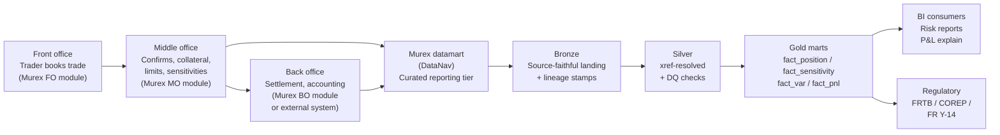

# Module 24 — Murex (MX.3) Applied

!!! abstract "Module Goal"
    [Module 23](23-vendor-systems-framework.md) gave the framework: every vendor system is catalogued, mapped, extracted, validated, lineaged, and version-tracked through the same six steps. This module instantiates the framework for the single vendor that, more than any other, defines the data-engineering job at most tier-1 banks: Murex (the firm), specifically the MX.3 platform. If your firm runs Murex — and roughly 300 of the world's banks do — the warehouse's daily reality is largely a function of what comes out of MX.3 and how cleanly the data team absorbs it. The trade-capture system is Murex; the position keeper is Murex; the sensitivities are Murex; often the VaR is Murex; sometimes the regulatory FRTB engine is Murex. The data-engineering work is to receive those outputs, conform them against the firm's master data, validate them, and serve them to risk reporting and to the regulator without losing any of the discipline of the previous twenty-three modules. This module is the applied case study; it is also a template a future contributor can fork to write the analogous module for Calypso, Polypaths, Quantserver, Summit, Front Arena, or Sophis.

!!! info "Disclaimer — version and customisation caveats"
    This module reflects general industry knowledge of Murex MX.3 as of mid-2026. Specific column names, table structures, and behaviours vary by Murex version (MX.3 has shipped multiple major and minor releases over the last decade) and by each firm's customisations (Murex deployments are heavily configurable, and no two deployments expose identical schemas). Treat the patterns and examples here as a *starting framework*, not as an MX.3 reference manual — verify every column name, every table structure, and every documented behaviour against your firm's actual MX.3 instance before applying. The framework discipline of [Module 23](23-vendor-systems-framework.md) is the durable contribution; the specific Murex details below are illustrative and version-sensitive.

---

## 1. Learning objectives

By the end of this module, you should be able to:

- **Describe** Murex MX.3's role in a tier-1 bank's trading and risk ecosystem — what modules cover trade capture, what cover middle and back office, what cover risk and accounting — and locate the warehouse's integration touchpoints relative to those modules.
- **Identify** the datamart (sometimes called DataNav) extraction layer as the canonical integration surface for the warehouse, distinguish it from direct database access, and explain why the warehouse ingests from the datamart rather than from the trading-application database directly.
- **Conform** Murex identifiers (`MX_TRADE_ID`, `MX_CPTY_ID`, `MX_INSTR_ID`, `MX_BOOK_CODE`) to firm-canonical surrogate keys via the xref dimension pattern from [Module 6](06-core-dimensions.md), and articulate where the conformance lives in the medallion architecture from [Module 18](18-architecture-patterns.md).
- **Apply** Murex-specific data-quality checks — trade count tie-out vs the front-office booking system, sensitivity coverage against positions, market-data alignment, currency consistency, status sanity — as silver-layer validations layered on top of the [Module 15](15-data-quality.md) framework.
- **Plan** for a Murex version upgrade (MX.3.x to MX.3.y, or a major-release migration) by inventorying the schema and behavioural changes, sizing the parallel-run period, and budgeting the data-team work realistically — typically one to two quarters at a tier-1 bank rather than one to two sprints.
- **Diagnose** a Murex-fed risk-reporting anomaly (a sudden VaR move, an unexpected sensitivity gap, a position discrepancy) by walking the bronze → silver → gold path against the lineage stamps and the DQ check outputs.

## 2. Why this matters

Murex is the most consequential vendor in the daily life of a market-risk data engineer at a tier-1 bank. The firm — Murex SA, founded in Paris in 1986 — has built the dominant capital-markets-platform product in the European and Asian banking world over four decades, and now serves roughly 300 banks globally as of mid-2026, including the majority of the largest by trading-book size. The MX.3 platform is the system of record for trade capture, position management, valuations, sensitivities, and (increasingly) regulatory risk metrics for the firms that deploy it. When the warehouse computes a VaR figure for a Murex-using bank, the inputs are Murex's positions, Murex's sensitivities, and Murex's market-data interpretations; when the regulatory submission goes out, the trade-level detail is largely Murex's; when the auditor traces a number back to its source, the source is, in significant part, MX.3. A warehouse-side data engineer at a Murex-using firm spends a meaningful fraction of every working week reading Murex extracts, debugging Murex-vs-firm reconciliations, planning Murex upgrades, and explaining Murex-specific quirks to BI consumers who do not want to hear the phrase "well, that's a Murex thing" but will hear it many times.

The warehouse-side consequence is concrete. The Murex datamart layer (the curated reporting tier MX.3 exposes for downstream consumption — sometimes branded DataNav, sometimes deployed under different naming at different firms) is the daily ingestion target for the warehouse's bronze layer; the silver-layer conformance is largely "translate Murex's identifier scheme and column conventions into the firm's canonical model"; the gold marts are largely Murex-derived facts surfaced under firm-canonical names. The data team's velocity is bounded by the Murex schema's stability: a Murex upgrade that changes column semantics consumes the team's capacity for a quarter; a stable Murex environment lets the team invest in higher-value work. The team that treats Murex as one of many vendors — applying the framework of [Module 23](23-vendor-systems-framework.md) deliberately — manages the relationship sustainably; the team that treats Murex as *the warehouse* (because functionally it nearly is) loses the discipline that lets the warehouse incorporate other vendors and other internal systems alongside it.

A fourth motivation worth pulling out: the *career value* of Murex expertise. The market for data engineers with deep Murex-warehouse-integration experience is durably strong because the firms running Murex are large and stable, the integrations are long-lived, and the discipline does not transfer instantly from another platform's experience. A data engineer who has shipped a clean Murex integration at one tier-1 bank is highly hireable at another tier-1 bank running Murex; the experience compounds. A reader who is investing time in this module is investing in a career-durable capability, not a fashionable one. The framework discipline transfers across vendors, but the Murex specifics — the datamart's quirks, the version-upgrade rhythms, the reconciliation patterns — are themselves a marketable skill set.

A practitioner-angle paragraph. After this module you should be able to walk into a Murex-using bank's data team on day one and read the integration architecture in vocabulary the team uses: which datamart entities the warehouse extracts, where the bronze landing is, what the silver-conformance pattern looks like, which DQ checks are in place, which Murex version the team is on and which version they are migrating toward, which gold marts depend on which datamart entities. You should also recognise the warning signs of a Murex integration that has lost its framework discipline — Murex identifiers leaking into the gold layer, no schema-hash check in the DQ suite, a gold mart that joins Murex and Calypso positions with hand-rolled mapping in the gold SQL — and write the remediation plan. The Murex relationship is a multi-decade investment for any bank that owns it; the data team's role is to be the steward who absorbs its outputs cleanly, decade after decade, version after version, without letting the warehouse become a Murex-shaped artefact rather than a firm-shaped one.

A note on scope. This module covers the *warehouse-side data-engineering* perspective on Murex — what comes out of the datamart, how to absorb it, how to validate it, how to plan upgrades. It does not cover the *front-office* perspective (how to configure Murex, how to book trades, how to calibrate models in the platform), the *back-office* perspective (how Murex handles settlement, accounting, collateral), or the *quantitative* perspective (how Murex's pricing libraries are constructed). Those perspectives belong to the front-office team, the back-office operations team, and the quant team respectively; the BI engineer's role is downstream of all of them, and the discipline this module covers is the downstream-absorption discipline.

## 3. Core concepts

A note on the section's *implementation independence*. The patterns described below are largely implementation-independent — they apply whether the warehouse uses Snowflake or BigQuery, dbt or a custom orchestrator, Python or Scala for the bronze loaders. The Murex-specific content is the *what* — what the entities are, what the conventions are, what the failure modes are — and the warehouse-specific content is the *how* — how the loader is implemented, which orchestrator runs the schedule, which DQ framework wires the checks. The discipline transfers; the implementation choices are local. A reader at a Snowflake-and-dbt shop and a reader at a BigQuery-and-Airflow shop should each find the patterns immediately applicable to their stack with light adaptation.

A reading note. Section 3 builds the Murex-warehouse-integration story in eight sub-sections: what Murex MX.3 is and where it sits at a tier-1 bank (3.1), where it sits in the medallion architecture (3.2), the datamart / DataNav extraction layer (3.3), the common datamart entities the warehouse consumes (3.4), Murex identifiers and their xref to firm masters (3.5), how Murex's bitemporality interacts with the warehouse's bitemporal pattern from [Module 13](13-time-bitemporality.md) (3.6), the Murex-specific DQ checks the warehouse runs (3.7), and the version-upgrade impact and mitigation patterns (3.8). Section 3.4 is the longest sub-section because the entity catalogue is what the rest of the module depends on; section 3.8 is the load-bearing organisational sub-section because Murex upgrades shape the team's capacity-planning more than any other recurring activity.

### 3.1 What Murex is

Murex SA is a French software company, headquartered in Paris, founded in 1986 by Laurent Néel and Salim Daher. The firm has been privately held throughout its history (no IPO, no major acquisitions of the firm itself) and has built the dominant capital-markets-platform product in the European and Asian banking world over four decades. The current platform is **MX.3** (sometimes written MX3 or Mx.3 in firm documentation) — a successor to MX 2000 and earlier generations. As of mid-2026 the platform is deployed at roughly 300 banks globally, with concentrations in Europe, the Middle East, and Asia-Pacific; the North American footprint is smaller but growing.

MX.3 is *modular* — a bank typically deploys a subset of the modules rather than the entire platform. The major modules cover:

- **Front office (trade capture and pre-trade analytics).** The trader's workflow — booking trades, viewing live positions, running pre-trade what-ifs. Asset-class coverage is broad: rates (swaps, swaptions, caps/floors), credit (CDS, bond futures, structured credit), FX (spot, forwards, options, NDFs), equities (cash equities, options, structured products), commodities (futures, swaps, options), structured products. The trader works against a real-time view of the position; the trade is booked into MX.3's transactional database the moment it is captured.
- **Middle office (confirmations, collateral, limits, sensitivities).** Trade confirmations against counterparties, collateral management against the firm's CSAs, intraday and end-of-day limit monitoring, sensitivity computation against the booked positions, P&L production. The middle-office modules are the ones the warehouse most heavily consumes from — they produce the position snapshots, the sensitivity vectors, and the P&L attributions the risk reporting layer depends on.
- **Back office (settlement, accounting, payments).** Settlement instruction generation, payment processing, accounting-entry production for the firm's general ledger. The back-office modules feed Finance more than Risk, but the warehouse may consume settlement and accounting facts for reconciliation and for the firm's regulatory accounting submissions.
- **Risk (VaR, sensitivities, FRTB).** A dedicated risk-engine module that computes VaR (historical, parametric, Monte Carlo), Expected Shortfall, scenario P&Ls, and increasingly FRTB capital metrics (SBM, IMA, NMRF). At firms that use the Murex risk engine, the warehouse consumes the engine's outputs as facts; at firms that compute risk in a separate engine (an internal FRTB engine, a Numerix integration), the warehouse consumes Murex's positions and sensitivities and feeds them into the separate engine.

The architectural pattern of the typical large-bank MX.3 deployment is *Murex as front-to-middle, Murex datamart as the warehouse's source*. Trades are captured in the front-office module, positions and sensitivities are computed in the middle-office module, the day's outputs are published to the datamart layer overnight, and the warehouse extracts from the datamart the next morning for downstream consumption. The variation across firms is mostly in *which* modules each firm uses (some firms use Murex front-to-back; others use Murex front-to-middle and a different back-office system; others use Murex for some asset classes and other platforms — Calypso, Polypaths, Front Arena — for others), not in the integration pattern per se.

A reference of how Murex maps to the [Module 2](02-securities-firm-organization.md) org-chart pieces: the front office's trade-capture and pre-trade what-if work happens in MX.3's front-office module; the middle office's confirmations, collateral, limits, and sensitivity work happens in MX.3's middle-office module; the back office's settlement and accounting work happens in MX.3's back-office module (where deployed); the risk function consumes MX.3's outputs (positions, sensitivities, VaR) for its own reporting and capital production. Most of the firm's daily front-to-back data flow passes through MX.3 in some form, and the warehouse's job is to absorb the parts that cross the data-team's boundary.

A diagram of the typical end-to-end data flow at a Murex-using bank — from front-office trade capture through Murex's internal modules to the warehouse and on to the BI and regulatory consumers:



A note on *Murex's competitive landscape* worth understanding before the rest of the module. Murex competes most directly with Calypso (now part of Adenza, recently acquired by Nasdaq), Front Arena (ION, with FIS heritage), Summit (Finastra), and at the structured-products end with Numerix's Polypaths and Quantserver. The competitive dynamic shapes Murex's product roadmap — features added to compete with Calypso's coverage of fixed income, features added to address gaps that competing-vendor sales teams have exploited. The warehouse-side relevance is that the data team should expect Murex's roadmap to evolve in response to competitive pressure, with the resulting changes (new entities, new columns, new behaviours) requiring the warehouse to adapt. A team that follows Murex's competitive positioning loosely (through the firm's Murex account team, through industry conferences, through the trade press) is better-prepared for the roadmap-driven changes than a team that consumes only the release notes; the broader context explains *why* the changes are coming, not just *what* they are.

A second framing on *Murex's commercial position*. The firm has been profitable, growing, and stable through four decades — an unusual achievement in enterprise software, and one that matters to the warehouse because vendor stability translates directly to integration stability. A vendor that gets acquired or restructured every few years (the Calypso ownership history — Calypso → Adenza → Nasdaq — is illustrative of the volatility some vendors exhibit) creates discontinuities that the integration team must absorb; Murex's stability has spared its users that particular form of friction. The warehouse-side consequence is that a firm choosing Murex today can reasonably plan for the same vendor relationship in fifteen years, with the same product line and broadly the same architectural shape; the planning horizon for some other vendors is shorter and more uncertain. The stability is a *feature* of the Murex relationship that the warehouse benefits from, even if the data team rarely articulates it explicitly.

A third framing on *Murex's cost*. The Murex contract is a substantial line item on the firm's technology budget — typically tens of millions of dollars annually at a tier-1 deployment, consisting of licence fees, maintenance fees, professional services, and the firm's internal Murex-administration team. The warehouse's integration is one of many downstream consumers of that investment, and the warehouse's value (consistent positions, reproducible risk numbers, defensible regulatory submissions) is what justifies, in part, the spending. A team that ships a clean Murex integration is a team that has helped justify the firm's substantial Murex investment; a team that ships a fragile Murex integration is a team that has undermined the investment's value. The framing matters at budget time — the warehouse team's investment in the Murex integration is small relative to the Murex contract itself, and the warehouse's discipline is what makes the Murex contract pay off downstream.

A practitioner observation on *the Murex-vs-everything-else question*. A common framing at firms that have just signed a Murex contract — or just renewed one — is "should we move *everything* into Murex?" The pragmatic answer at most large firms is no, because the cost of forcing every asset class through one platform exceeds the cost of running a few platforms in parallel; the structured-credit desk's exotic product needs a dedicated structured-products platform like Numerix Polypaths that Murex does not match in depth, the prime-brokerage business needs a platform Murex was not designed for, the fixed-income trading business may already run on Calypso. The warehouse-side consequence is that the warehouse must integrate Murex *and* a few neighbouring platforms, and the framework discipline of [Module 23](23-vendor-systems-framework.md) is exactly what makes the multi-platform integration tractable.

### 3.2 Where Murex sits in the medallion architecture

In the medallion architecture from [Module 18](18-architecture-patterns.md), Murex extracts land in **bronze** as source-faithful copies of the datamart query outputs. The bronze tables retain Murex's column names and identifier conventions exactly — `MX_TRADE_ID` stays as `MX_TRADE_ID`, `MX_CPTY_ID` stays as `MX_CPTY_ID`, no transformations are applied in the landing. Every bronze row carries the framework's mandatory lineage stamps (`source_system_sk = 'MUREX'`, `pipeline_run_id`, `code_version`, `vendor_schema_hash`, plus Murex-specific `mx_extract_run_id` and `mx_schema_version`). Bronze is the *replay buffer*: if a downstream consumer raises a question about a historical figure, the team's first move is to query the bronze layer for the relevant load-run and re-run the silver conformance against it.

The conformance happens in **silver**. The Murex-specific column names (`MX_TRADE_ID`, `NOMINAL_AMT`, `BOOK_CODE`, `CPTY_CODE`) are renamed to firm-canonical names (`source_trade_id`, `notional`, `book_sk` after xref resolution, `counterparty_sk` after xref resolution); the Murex identifiers are joined to `dim_xref_counterparty`, `dim_xref_instrument`, `dim_xref_book` to produce firm-canonical surrogate keys; the Murex-specific conventions (sign conventions, currency conventions, status-flag conventions) are translated into the firm's canonical conventions. The DQ checks of §3.7 run on the silver tables and fail the build if the checks do not pass. Silver is the *single source of truth* for Murex-originated facts within the warehouse.

The conformed silver data feeds **gold** — the business-aligned facts and dimensions the BI tool reads from. The gold marts (`fact_position`, `fact_sensitivity`, `fact_var`, `fact_pnl`) consume the silver-conformed Murex view alongside silver-conformed views from other source systems (Calypso, Polypaths, internal pricers) through the firm-canonical surrogate keys. A BI consumer querying `gold.fact_position` for the firm's USD swaps book sees a row regardless of whether the position was sourced from Murex or from another platform; the `source_system_sk` column lets the consumer filter for Murex specifically if they want to, but the *default* view is vendor-agnostic.

The discipline this layering imposes is the load-bearing discipline of the Murex integration. A team that lets `MX_*` column names leak into the gold layer has built a Murex-shaped warehouse rather than a firm-shaped one; a team that runs gold transformations directly off bronze (skipping silver) has lost the conformance discipline; a team that lets bronze be edited has lost the replay-buffer property. The framework's rules are not Murex-specific, but they apply to Murex with particular force because Murex is the largest single source the warehouse consumes from, and the warehouse's shape is most at risk of being Murex-shaped if the discipline lapses.

### 3.3 The datamart / DataNav extraction layer

Murex publishes the warehouse-readable view of its data through a **datamart** layer — a curated reporting tier separate from the transactional database the trading application runs against. The datamart is sometimes branded **DataNav**, sometimes deployed under firm-specific names; the naming varies but the architectural pattern is consistent across deployments. The reasons for the separation are operational: querying the transactional database directly risks degrading the trading application's responsiveness (a long-running risk-extract query can starve the trader's UI), and the transactional schema is optimised for the application's read-write pattern rather than for analytical queries. The datamart is loaded overnight from the transactional database, held in a separate (or logically partitioned) physical store, and exposed for warehouse consumption through SQL.

The datamart's storage technology has shifted over time. Historical Murex deployments ran heavily on **Oracle** (the datamart was an Oracle schema, often on a dedicated Oracle instance), reflecting the era when Murex was first deployed at the major banks. More recent deployments have shifted toward cloud-native warehouses — **Snowflake** and **BigQuery** in particular — either as a *replacement* for the Oracle datamart (the datamart is loaded directly into Snowflake or BigQuery overnight) or as a *federated query target* (the warehouse runs federated queries against the Murex datamart's Oracle instance and lands the results in the cloud warehouse). The technology choice is driven by the firm's broader cloud strategy more than by Murex itself; the integration patterns are similar regardless of the underlying database.

The integration pattern — regardless of the datamart's underlying technology — is *batch query at a scheduled cadence*. The warehouse's orchestrator (Airflow, Dagster, the firm's in-house orchestrator) runs a series of SQL queries against the datamart shortly after Murex's overnight load completes, lands the results in the bronze layer, and triggers the silver conformance and DQ checks. A typical daily timeline at a tier-1 bank looks like: Murex's overnight datamart load completes around 02:00–03:00 local time; the warehouse's extraction kicks off around 03:30; bronze landing completes by 04:30; silver conformance completes by 05:30; DQ checks run and gold marts refresh by 07:00; BI consumers see the day's data when they arrive at their desks.

The query patterns the warehouse runs against the datamart are typically *incremental* — a daily extract of the rows that changed since the prior day's run, rather than a full re-extract of every row in the datamart. The incremental pattern relies on the datamart exposing a `LAST_MODIFIED` timestamp (or equivalent) on each row; the warehouse's query filters for `LAST_MODIFIED > prior_run_timestamp` and lands only the changes. This pattern is essential for performance — full re-extracts of a tier-1 bank's Murex position table can run for hours and disrupt the morning's downstream schedule — but it requires *trust* that Murex updates the `LAST_MODIFIED` timestamp on every change. A bug in Murex's datamart-load logic that fails to update `LAST_MODIFIED` on a particular kind of change will silently skip rows in the warehouse's incremental load, and the warehouse will not know until a downstream reconciliation surfaces the gap. The remediation is a *periodic full reconciliation* — typically a weekly or monthly full extract that compares row-by-row against the warehouse's incremental-loaded state — to catch the silent skips.

A second observation on *the datamart's load timing's downstream implications*. Murex's datamart load typically completes overnight, with the timing dependent on the previous evening's trading-day close and on the volume of trades processed. The warehouse's own load schedule has to be sequenced *after* the datamart load completes, with margin to absorb a late datamart finish. The typical timeline at a tier-1 bank looks like: trading-day close at the local market's official EOD (varies by region — 17:00 in NY, 17:30 in London, 16:30 in Tokyo); Murex's datamart load completes between 02:00 and 04:00 local time of the firm's primary data centre; the warehouse's bronze load fires at a configured trigger (either time-based or notification-based from Murex); the warehouse's silver and gold layers refresh by 06:00-07:00; BI consumers see the day's data when they arrive. A team that schedules the warehouse load too early — before the datamart's load is reliably complete — fires its load against an incomplete extract and propagates the incompleteness downstream. A team that schedules too late wastes morning hours that consumers could have used. The tuning is empirical and should be revisited periodically as Murex's load behaviour shifts.

A practitioner observation on *direct database access*. Some teams, frustrated with the datamart's nightly cadence and the perceived complexity of the datamart layer, propose to query Murex's transactional database directly to get *intraday* freshness. The pattern is feasible technically — Murex's transactional database is a SQL database like any other — but is *strongly* discouraged operationally: the trading application's responsiveness is at risk, the firm's Murex licence may not permit direct query access, and the schema of the transactional database is a much weaker contract than the datamart's schema (it changes more frequently, it is documented less, and Murex's support contract typically does not cover firm-issued queries against it). The right pattern for intraday freshness is to use Murex's intraday extracts where they are offered, or to deploy a parallel intraday integration against a lighter-weight Murex output (the message bus, the ticker feed) rather than the transactional database directly.

A second observation on *the federated-query option*. A federated query — where the warehouse's cloud platform (Snowflake or BigQuery) queries the on-premise Oracle datamart in place via a connector — avoids the data-movement step of nightly ETL and is attractive for the firm with a heavy on-premise Oracle estate that has not yet migrated. The trade-off is *query performance* (cross-environment federation is slower than native warehouse query) and *cost* (the data is read repeatedly from the Oracle source rather than landed once and reused). The federated pattern is reasonable as a *migration intermediate* — a way to expose Murex data into the cloud warehouse before the full data-movement migration is complete — but is rarely the long-term steady-state pattern. The team should plan the migration to true data-movement ETL within a defined horizon.

### 3.3a A note on the datamart's metadata layer

A short observation on a Murex datamart feature most teams discover only after they have been operating the integration for a while: the datamart typically exposes its *own metadata layer* — a set of system tables describing the datamart's schema, the vendor-published row counts, the load-completion timestamps, the dispensation registry. The metadata layer is the warehouse's friend; it is the source of the manifest data the count-tie-out DQ check relies on, the signal the load orchestrator polls before firing, the schema description the schema-drift DQ check compares against.

The discipline is to *load the metadata layer alongside the data layer*. The metadata is small (typically a few hundred rows per day across all the system tables), the cost is negligible, and the value is substantial — every DQ check, every load-completion check, every schema-drift check depends on the metadata layer being current. A team that loads only the data and not the metadata is a team that has to re-derive the manifest information from the data itself (counting rows, hashing column lists, inferring completion timestamps), which is more expensive and more error-prone than reading it from Murex's own metadata.

A second observation on the *metadata layer's documentation*. Murex documents the metadata layer in its own product documentation; the data team should read the relevant sections during integration kickoff and update its understanding with each Murex version that ships. The metadata layer's schema is usually more stable than the data-layer schema (Murex changes the metadata less often than the data), but it is not immutable; a version that adds a new system table or renames a metadata column is one the team needs to catch through the same schema-drift discipline it applies to the data layer.

### 3.4 Common datamart entities

Below is a non-exhaustive catalogue of the entities a typical MX.3 datamart exposes for warehouse consumption. The names are *generic* — the actual table names in any specific deployment vary by Murex version and by the firm's customisations, and the disclaimer at the top of this module applies. The entities and their downstream uses are stable across deployments; the column names are not.

A reading orientation for the rest of §3.4. Each entity is described in three layers: the *grain* (what one row represents), the *typical column shape* (what categories of attributes the entity carries, with the explicit caveat from the disclaimer that the actual column names vary), and the *downstream uses* (which warehouse consumers depend on the entity). The intent is to give the reader a mental model of *what to expect* when they look at their firm's Murex datamart for the first time, so they can map their firm's specific entities to the categories below.

**Trade-detail entity.** The atomic trade-and-modification record. One row per trade per modification — a new trade is one row, an amendment to that trade is a second row, a cancellation is a third row, a re-booking is a fourth. The grain is `(trade_id, modification_seq, business_date)` or equivalent. Typical columns include the trade identifier, the modification timestamp, the instrument identifier, the counterparty identifier, the trade direction (buy/sell), the notional, the trade currency, the trade date, the value date, the settlement date, the trader id, the book id, and a status flag (NEW / AMENDED / CANCELLED / REBOOKED). The downstream uses are extensive: trade-level regulatory submissions, trade-blotter reports, trade-by-trade reconciliations to the front-office booking system. The warehouse typically materialises this as `silver.fact_trade` after conformance.

**Position-snapshot entity.** The end-of-day net position by book and instrument. One row per `(book, instrument, business_date)` — a fund's position in a particular swap on a particular day is one row, and the row carries the net notional, the trade date, the value date, the discount factor, the present value (PV), and the various market-data references. The grain is the *aggregated* position rather than the trade detail; multiple trades against the same book and instrument roll up into one position row. The downstream uses are the firm's position-level regulatory submissions (FR Y-14 in the US, COREP in the EU), the firm's risk reporting, and the firm's P&L attribution. The warehouse typically materialises this as `silver.fact_position` after conformance.

**Sensitivity-vector entity.** The greeks and bucketed sensitivities for each position. Long-format by default — one row per `(position, risk_factor_or_bucket, business_date)` — so a single position with sensitivity to twenty risk factors becomes twenty rows in this table. Typical columns include the position identifier (the join back to the position-snapshot entity), the risk-factor identifier or bucket identifier, the sensitivity type (DV01, CS01, vega, delta, gamma), the sensitivity value, the sensitivity currency, and the business date. The downstream uses are the firm's risk reporting (sensitivity by book, sensitivity by risk factor), the FRTB Sensitivity-Based-Method (SBM) capital calculation, and the P&L attribution decomposition. The volume is large — a tier-1 bank's sensitivity vector for a single business day can run to hundreds of millions of rows. The warehouse typically materialises this as `silver.fact_sensitivity` after conformance.

A note on the *trade-vs-position grain choice* downstream. The trade-detail entity and the position-snapshot entity hold related but different information. A book's positions are the *aggregation* of its trades; a position is determined by summing the relevant trades. In principle the warehouse could derive positions from trades and skip the position entity; in practice every Murex-using firm consumes both, because Murex's position-snapshot entity carries Murex's *authoritative* position (with Murex's own aggregation rules, sign conventions, and netting logic) and the warehouse should treat it as the firm's official position rather than re-deriving it. A team that derives positions from trades typically discovers, after a regulator query, that its derived positions disagree with Murex's published positions on edge cases (a partially-cancelled trade, a multi-leg trade with non-trivial netting, a give-up trade with two parties) and has to rebuild on the published positions anyway. The discipline is to consume both, with the trade detail used for trade-level questions and the position snapshot used for position-level questions, and to reconcile them as a DQ check.

**P&L entity.** The day-over-day P&L for each book and (often) each position. Typical columns include the book identifier, the position identifier (where applicable), the business date, the P&L type (clean P&L, dirty P&L, hypothetical P&L, attribution components), the P&L value, the P&L currency, and a reference to the prior-day position the P&L was computed from. The downstream uses are the firm's P&L attribution analysis (covered in [Module 14](14-pnl-attribution.md)), the front-office P&L explain reports, the desk-level P&L commentary the trader writes daily. The warehouse typically materialises this as `silver.fact_pnl` after conformance.

**Accounting-movement entity.** The accounting entries Murex produces for the firm's general ledger. One row per accounting movement — typically a debit-credit pair against the firm's chart of accounts. The downstream uses are the firm's finance reporting and the reconciliation between the risk view of P&L and the finance view of P&L (the famous "risk-vs-finance reconciliation" that consumes a meaningful fraction of every bank's middle-office capacity). The warehouse may or may not consume this entity depending on whether the data team owns the risk-vs-finance reconciliation; if the finance team owns it, the warehouse may skip this entity entirely.

A note on *the entities the warehouse may not consume*. Some Murex deployments expose entities the warehouse does not need: collateral-management facts that the operations team handles in a separate system, settlement-instruction records that the back-office system owns directly, regulatory-reporting outputs the warehouse produces independently. The team should *enumerate the available entities* during cataloguing (step 1 of the framework) and explicitly mark which ones the warehouse will and will not consume. The unconsumed entities are not failures — they are *deliberate scoping decisions* — but the documentation should capture the decision so a future team member understands why a given Murex entity is not in the warehouse's silver layer. A team without the explicit scoping documentation typically rediscovers the unconsumed entities periodically and considers re-integrating them, often without the original context that explained why they were excluded.

A reference table summarising the entities, their typical grains, and their downstream uses:

| Entity                  | Typical grain                                          | Typical row count (tier-1 bank, EOD) | Downstream uses                                          |
| ----------------------- | ------------------------------------------------------ | ------------------------------------- | -------------------------------------------------------- |
| Trade detail            | (trade_id, modification_seq, business_date)            | Millions                              | Trade-level regulatory, blotter, FO recon                |
| Position snapshot       | (book, instrument, business_date)                      | Hundreds of thousands                 | Position regulatory, risk reporting, P&L attribution     |
| Sensitivity vector      | (position, risk_factor_or_bucket, business_date)       | Hundreds of millions                  | Risk reporting, FRTB SBM, P&L attribution                |
| P&L                     | (book, position, business_date, pnl_type)              | Hundreds of thousands to millions     | P&L attribution, FO P&L explain, finance recon           |
| Accounting movement     | (movement_id, business_date)                           | Hundreds of thousands                 | Finance reporting, risk-vs-finance reconciliation        |

A practitioner observation on *the entity sizes' implications for the warehouse*. The sensitivity vector entity is the largest — hundreds of millions of rows per day at a tier-1 bank — and its size shapes a substantial fraction of the warehouse's storage and compute budget. A typical tier-1 bank's sensitivity table accumulated over the regulatory retention horizon (5-7 years, or longer in some jurisdictions) reaches the multi-billion-row scale, and the warehouse's storage discipline (partitioning, columnar compression, lifecycle management to cold storage for old partitions — see [Module 17](17-performance-materialization.md)) must accommodate it without making the per-day storage cost prohibitive. The position-snapshot is the next-largest, but typically two orders of magnitude smaller than sensitivities; the trade-detail is two further orders of magnitude smaller again; the P&L and accounting-movement tables sit between trade-detail and position-snapshot in size. A team designing the warehouse's storage budget should size the budget against the sensitivity table first, the others second.

A second observation on *what to extract first*. A team starting a Murex integration on day one should not attempt to extract every entity simultaneously. The pragmatic order is: trade-detail first (because it is the source of truth for the warehouse's view of the firm's trading activity); position-snapshot second (because it is the input for most risk reporting); sensitivity-vector third (because it is the largest entity and benefits from the warehouse's storage and conformance discipline being established before it is loaded); P&L fourth (because it depends on the position-snapshot being conformed first); accounting-movement last (and only if the data team owns the risk-vs-finance reconciliation). A team that tries to integrate everything simultaneously on day one typically delivers nothing for the first six months; a team that integrates entity-by-entity delivers value at the end of each entity's onboarding.

### 3.4b A note on entity-grain edge cases

A short observation on three Murex-specific entity-grain edge cases that recur in BI conversations and deserve explicit treatment in the warehouse.

**Multi-leg trades.** A swap is one trade with two legs (a fixed leg and a floating leg); a swaption is one trade with multiple legs (the option leg, the underlying-swap leg with its own sub-legs); a structured-credit trade can have many legs. Murex represents multi-leg trades typically as one parent row plus one child row per leg, with a `parent_trade_id` linking them. The warehouse's silver layer must preserve the parent-child relationship and let downstream consumers query at either grain (the trade level for portfolio-level reports, the leg level for cash-flow projections). A team that flattens the hierarchy at silver loses the ability to query at the leg level; a team that preserves it can answer both questions.

**Give-up trades and inter-affiliate bookings.** A trade booked between two affiliates of the same firm appears in Murex as a *pair* of trades (the buy side at affiliate A, the sell side at affiliate B); from the firm-canonical perspective the two are *one* trade that should net to zero. The warehouse's silver layer should recognise the inter-affiliate pattern and flag it explicitly, so that downstream consumers can choose to include or exclude the affiliate-pair offset depending on the report's purpose. A team that treats the two sides as independent trades typically double-counts the firm's exposure on inter-affiliate-heavy books; a team that flags the pair handles it correctly.

**Trade cancellations and rebookings.** A trade that has been cancelled and rebooked appears in Murex as the original trade with status CANCELLED plus a new trade with status NEW, often with different identifiers but with a `cancel_reference` linking them. The warehouse's silver layer should preserve the linkage and let downstream consumers query "the trade as it has evolved" (the chain of cancel-and-rebook events) rather than only the current state. A team that treats each event as independent loses the trade's evolution history; a team that preserves the chain can answer historical reproduction questions correctly.

### 3.4c A note on the entity-load ordering at refresh time

A short observation on the *order* in which the warehouse refreshes the Murex entities at each load. The entities have dependencies — the position-snapshot depends on the trade-detail (positions are derived, in part, from trades), the sensitivity-vector depends on the position-snapshot (every sensitivity is associated with a position), the P&L depends on the position-snapshot and the sensitivity-vector, the attribution depends on all three. The refresh order should respect these dependencies: trades first, then positions, then sensitivities, then P&L and attribution.

The dependency-respecting order matters for two reasons. First, *consistency*: a downstream consumer who queries the silver layer mid-refresh sees a partial state, and the partial state should be consistent across entities. A consumer who queries `silver.murex_position` and `silver.murex_sensitivity` for the same business date should see positions and sensitivities that match — every position has its sensitivities, every sensitivity has its position. Refreshing the entities out of order can produce a window where positions exist without sensitivities or sensitivities exist without positions; the consumer's query during that window returns inconsistent results. Second, *DQ check correctness*: the sensitivity-coverage DQ check compares positions against sensitivities and assumes both are at the same refresh state. A check fired during a partial refresh produces false positives; the orchestrator should hold DQ checks until the refresh is complete.

A practitioner observation on *the orchestrator's role*. The orchestration framework — Airflow, Dagster, the firm's in-house orchestrator — is responsible for sequencing the refreshes correctly and for holding the gold marts and DQ checks until the silver layer is complete. The orchestrator's DAG should explicitly encode the dependencies; a team that lets each entity refresh independently typically discovers the consistency window when a consumer reports an unexplained gap. The orchestrator's value is precisely this kind of dependency management; a team that under-uses the orchestrator's capabilities discovers the cost in operational friction.

### 3.4a A worked example of an entity contract

A short worked example of how the framework's *contract* discipline manifests for a single Murex entity. Take the position-snapshot entity. The catalogue entry for it includes a *contract* the silver-layer team relies on:

- *Schema*: the columns that will be present, their types, their nullability. A column that has been in the contract for three years and disappears in a Murex upgrade is a contract violation — the team should detect it (via the schema-drift DQ check), escalate it (via the standing communication channel with the Murex admin team), and either restore the column or update the contract with deprecation notification to consumers.
- *Grain*: one row per `(book_code, instrument_id, business_date)` — the contract guarantees that there will be exactly one position row per book-instrument-date combination, no duplicates, no gaps for active positions.
- *Freshness SLA*: the position snapshot for business-date T is available in the warehouse's silver layer by 06:00 of T+1 on most days; on days when Murex's overnight load is delayed, the freshness column will indicate the actual production timestamp.
- *Quality SLO*: the position snapshot has passed the count tie-out, sensitivity coverage, and currency consistency DQ checks before being marked CANONICAL; positions that did not pass those checks are flagged with a `dq_status` column.
- *Lineage anchor*: every row carries `source_system_sk = 'MUREX'`, the `mx_extract_run_id`, the `mx_schema_version`, the `pipeline_run_id`, and the `code_version`; consumers can trace any row back to its bronze origin and the code that produced it.

The contract is documented in a `silver.murex_position_conformed.contract.md` file (or equivalent in the team's documentation system), reviewed quarterly with the consuming teams (the risk-reporting team, the regulatory-reporting team, the BI team), and versioned alongside the silver-conformance code. A contract change goes through a deprecation cycle: the team announces the proposed change, sets a deprecation deadline, runs the old and new versions in parallel during the deprecation window, and cuts over only after every consumer has acknowledged the change.

A practitioner observation on *the contract's value at incident time*. When a downstream consumer reports a number that looks wrong, the first investigation question is "did the contract hold?" — were the schema, grain, freshness, and quality SLOs all met for the period in question? If yes, the issue is downstream of the silver layer (in the consumer's own SQL, in a gold mart, in the BI tool); if no, the issue is in the silver layer or upstream of it. The contract makes the question answerable in seconds rather than hours, and the investigation converges quickly. A team without explicit contracts spends substantial investigation time on the upstream-vs-downstream classification before the actual root cause investigation can begin.

### 3.5 Murex identifiers and xref to firm masters

Murex assigns its own internal identifiers to every entity it manages — every trade has an `MX_TRADE_ID`, every counterparty has an `MX_CPTY_ID`, every instrument has an `MX_INSTR_ID`, every book has an `MX_BOOK_CODE`. These identifiers are *Murex-internal* — they are unique within the Murex deployment but rarely match the firm-wide identifiers the warehouse uses elsewhere. A counterparty may be `MX_CPTY_001` in Murex, `CALYPSO_CPTY_A` in Calypso, `LEI_5493001234567890ABCD` in the firm's master counterparty register; a trade may be `MX_TRADE_999` in Murex, `FO_TRADE_42` in the front-office trade-capture system the trader sees, and `BO_TRADE_999_v3` in the back-office settlement system. The warehouse's job is to *resolve* the Murex identifiers to the firm-canonical surrogate keys (`counterparty_sk`, `instrument_sk`, `book_sk`, `trade_sk`) so that downstream consumers see firm-canonical identifiers regardless of the source system.

The xref dimension pattern from [Module 6](06-core-dimensions.md) applies directly. The warehouse maintains a `dim_xref_counterparty` table that maps `(source_system_sk, vendor_cpty_code) → counterparty_sk`, with SCD2 versioning so historical mappings are preserved through identifier changes. The Murex-specific rows in this table look like:

```
source_system_sk | vendor_cpty_code | counterparty_sk | valid_from  | valid_to
'MUREX'          | 'MX_CPTY_001'    | 1001            | 2024-01-01  | NULL
'MUREX'          | 'MX_CPTY_002'    | 1002            | 2024-01-01  | NULL
'MUREX'          | 'MX_CPTY_003'    | 1003            | 2024-01-01  | NULL
```

The same pattern applies to instruments (`dim_xref_instrument`), books (`dim_xref_book`), and any other identifier scheme Murex uses that the warehouse needs to resolve to firm-canonical. The xref-population work is typically a *master-data-management* responsibility — the MDM team owns the firm-canonical identifier scheme and the mappings into and out of it — but the data team consumes the xref tables in the silver-conformance views.

A subtlety: Murex sometimes carries *external* identifiers alongside its internal ones. A trade booked against an external counterparty often carries the counterparty's LEI in a separate column (`CPTY_LEI`); an instrument often carries its ISIN, FIGI, or CUSIP in separate columns. The warehouse can use these external identifiers as *secondary* xref inputs — a Murex counterparty whose LEI is known can be mapped to the firm-canonical counterparty via the LEI rather than via the `MX_CPTY_ID`, which catches the case where Murex assigns multiple internal IDs to what is in fact the same external counterparty. The xref pattern accommodates this: the dimension can join on either the vendor's internal ID or the external ID, with the conformance logic preferring whichever produces a successful match. The discipline is to *capture the external identifiers in bronze* even if the silver conformance does not initially use them; once captured, they are available for future xref improvements without a re-extract.

A second observation on *the bulk-onboarding case*. When the firm has just signed the Murex contract and is loading historical data into the warehouse for the first time, the xref dimension must be populated for every counterparty, instrument, and book that has historical activity — potentially tens of thousands of entries per dimension. The bulk population is typically a one-off project: the master-data team sources the firm-canonical identifiers from the firm's reference data, the Murex admin team provides the Murex internal identifiers, and the data team builds the join. The bulk population is *expensive* in time but happens once; the steady-state maintenance (a handful of new entries per day as new counterparties or instruments are onboarded) is cheap. The discipline is to *run the bulk population deliberately* as a project of its own, not to interleave it with the steady-state integration work; a team that tries to bulk-populate the xref alongside the daily integration typically delivers neither cleanly.

A third subtlety: Murex's identifier scheme is *itself* versioned within a deployment. A counterparty may have its `MX_CPTY_ID` reassigned over time as part of a Murex-side data-cleanup exercise (the firm's Murex administrators consolidate two duplicate counterparty records into one and the surviving record's ID changes). The warehouse must be resilient to this — the SCD2 versioning on the xref dimension handles it, with the old `MX_CPTY_ID` mapped to the firm-canonical `counterparty_sk` in the historical row and the new `MX_CPTY_ID` mapped to the same `counterparty_sk` in the current row. A team that does not version the xref entries loses the historical mapping the moment Murex re-IDs a counterparty, and the historical reproduction of any pre-re-ID risk number becomes impossible.

### 3.5y A note on the legitimately empty entity

A small additional note. The Murex datamart sometimes carries entities that are *empty* on quiet days — a sensitivity entity with no rows for a desk that did not trade, a P&L entity with zero rows because the EOD process did not have anything to compute against. The silver-layer DQ checks should distinguish *legitimately empty* from *anomalously empty* — the former is normal on weekends, holidays, and quiet days; the latter is a possible failure mode that warrants investigation. The discipline is to record an *expected baseline* for each entity (typical row count for a normal business day) and to alert when actuals deviate substantially from the baseline; a check that fires on every weekend is a check that has not been calibrated correctly.

### 3.5x A note on Murex's external-id propagation

A short observation. When Murex's bronze extracts include external identifiers (LEI on the counterparty, ISIN on the instrument), the silver layer should *propagate them through* to gold even though the firm-canonical surrogate keys are the primary join keys. The propagation has two values: it gives downstream consumers a familiar identifier they can recognise without consulting the dimension tables, and it provides a *secondary* xref path the warehouse can use if the primary `MX_*` join breaks for any reason. The cost is small (a few additional columns on the silver and gold tables); the value compounds over the warehouse's lifetime.

### 3.5a A second pass on the trader-id and book hierarchy

A short observation on two Murex identifier dimensions worth calling out specifically because they show up in nearly every BI report and have particular xref dynamics.

The **trader id** in Murex (`MX_TRADER_ID` or equivalent) identifies the user who booked the trade. The trader id has two consumers: the front-office P&L reports (showing each trader their own performance) and the regulatory submissions (some regulatory regimes require trade-level attribution to the booking user). The xref to the firm-canonical `trader_sk` is straightforward in principle — every Murex user has a corresponding entry in the firm's HR system — but is operationally subtle: traders move desks, change roles, leave the firm, and the xref dimension must handle the temporal dimension correctly. A trade booked by Trader A in 2024 should remain attributed to Trader A in 2026 even if Trader A has since left the firm or moved to a different desk. The SCD2 versioning on `dim_xref_trader` handles this; a team that uses SCD1 (overwriting the xref entry on each change) loses the historical attribution and can no longer answer "who booked this trade".

The **book hierarchy** in Murex is typically a multi-level tree: the trader belongs to a book, the book belongs to a desk, the desk belongs to a business unit, the business unit belongs to a division. Each level carries its own identifier (`MX_BOOK_CODE`, `MX_DESK_CODE`, `MX_BU_CODE`, `MX_DIV_CODE`). The hierarchy *changes* over time — books are reassigned to different desks, desks are merged, business units are reorganised. The xref pattern handles each level independently (one xref dimension per level), with SCD2 versioning on each. The downstream BI consumer queries the firm-canonical hierarchy (the firm's own desk and division identifiers, not Murex's), and the silver layer's join into the xref dimensions resolves the Murex hierarchy into the firm-canonical one. A team that flattens the hierarchy at the silver layer (storing `desk_code` and `bu_code` directly on the position row rather than letting the consumer roll up through dimension attributes) loses the flexibility to handle hierarchy reorganisations cleanly; the disciplined approach is to store the leaf-level identifier (`book_sk`) on the fact row and to roll up through `dim_book` attributes at query time.

A practitioner observation on the *organisational reshuffles*. Tier-1 banks reshuffle their organisational hierarchy roughly every two to three years — a new CEO, a strategic re-prioritisation, a regulatory restructuring driver. Each reshuffle ripples through the book hierarchy, and the warehouse must absorb the changes without losing historical reporting capability. The disciplined pattern (SCD2 on every level of the hierarchy dimension, with the silver layer's joins honouring the SCD2 valid-from/valid-to bounds) handles each reshuffle as a routine update; the undisciplined pattern (SCD1, or hard-coded hierarchy in the gold marts) requires substantial rework at each reshuffle. The reshuffles are predictable in cadence even if their specifics are not, and the discipline pays back at every cycle.

### 3.6 Bitemporality in Murex

Murex has its own *as-of* concept built into its datamart — most extracts carry a column variously named `AS_OF_DATE`, `AS_OF_TIMESTAMP`, `EFFECTIVE_DATE`, or similar (the exact name varies by Murex version and by the entity in question). The column conveys "the value of this row as Murex believed it on this date and time", and lets a consumer of the datamart query historical states of the data ("show me what the position looked like on 2026-04-15") rather than only the current state. The semantic is *partial* — sufficient for "what was true on date X" queries but not always granular enough to capture every restatement chain that the firm's bitemporal discipline requires.

The warehouse's bitemporal discipline from [Module 13](13-time-bitemporality.md) layers on top of Murex's. Each Murex extract is treated as an *immutable input event* — the warehouse loads the extract into bronze with a load-timestamp stamp and never modifies the bronze row after the fact. If Murex restates a value (for example, an end-of-day position is corrected the next morning because a trade was mis-booked the night before), Murex publishes a new extract row with a later `AS_OF_TIMESTAMP`; the warehouse loads the new row alongside the original and the bitemporal view in silver picks up the latest as-of. The original row is preserved in bronze for any historical reconstruction that needs to know what the firm believed before the correction.

The warehouse's silver-conformed view typically exposes both Murex's `AS_OF_TIMESTAMP` (renamed `mx_as_of_timestamp` for clarity) and the warehouse's own bitemporal stamps (`as_of_timestamp`, `business_date`, `valid_from`, `valid_to`). A downstream consumer can ask "what was the position as of warehouse-time T" (the canonical bitemporal query from M13) or "what did Murex believe at Murex-time T" (a more specific query that lets the consumer reconstruct what the front office's screens were showing at that moment). The two times are *related* but not identical — the warehouse's `as_of_timestamp` is set at the moment of the warehouse's load, which is typically a few hours after Murex's `AS_OF_TIMESTAMP` — and the discipline is to expose both rather than to collapse them.

A second observation on *the as-of granularity*. Murex's `AS_OF_TIMESTAMP` is typically *daily* — a single value per day, set at the time the day's official load completes. The granularity is sufficient for "what did Murex believe at the end of business-date T" queries but not for "what did Murex believe at 11am on business-date T" queries. A consumer who needs intra-day granularity must either consume Murex's intraday extracts (where offered) or accept the daily granularity. The warehouse should make the granularity *explicit* in the silver-layer documentation — a column-level note that `mx_as_of_timestamp` is the EOD timestamp and not an intraday one — so consumers do not silently misinterpret it. A team that documents the granularity prevents the misinterpretation; a team that does not typically discovers the misinterpretation when a consumer's report shows unexpected results and the investigation reveals the granularity assumption.

A practitioner observation on *the restatement-chain question*. A common question from a regulator or auditor is "show me every restatement of this position through its lifetime". The Murex `AS_OF_TIMESTAMP` lets the warehouse answer this for restatements that Murex itself published; if a restatement was made *outside* Murex (a manual correction in a downstream spreadsheet that bypassed Murex), the answer is missing. The warehouse's discipline is to *prohibit* such out-of-band corrections — every correction should flow through Murex (so it appears in the next datamart extract with a fresh `AS_OF_TIMESTAMP`) or through a documented warehouse-side override (which carries its own bitemporal stamps and is never silent). A team that allows ad-hoc corrections to land in the warehouse without flowing through Murex first has lost the restatement-chain integrity, and the auditor's question becomes unanswerable.

### 3.7 Common Murex DQ checks

The DQ check suite the warehouse runs on Murex extracts has five recurring shapes, each addressing a specific failure mode the integration is exposed to. The pattern follows the [Module 15](15-data-quality.md) framework — each check is a SQL query that returns zero rows when the data is clean and one or more rows when the rule is violated.

**Trade count tie-out vs the front-office booking system.** The single most important Murex check: every trade that a trader sees in the front-office screen should appear in the warehouse's trade-detail extract for the same business date. The check compares the count of trades in the warehouse's bronze landing for the day against the count of trades in the front-office system's own report (typically a daily trade-blotter file the FO publishes alongside its end-of-day cycle). A non-zero gap indicates a missing trade — possibly a trade booked late and missed by the Murex datamart cutoff, possibly a trade lost in transit, possibly a Murex-side data issue. Severity: *error* (the load is held until the gap is investigated and explained).

**Sensitivity coverage check.** Every position with a non-zero notional should have at least one sensitivity row associated with it in the sensitivity-vector entity. A position without sensitivities is a position the risk engine has not priced — the position will appear in the warehouse's `fact_position` mart but contribute zero to any sensitivity-based aggregation (VaR, FRTB SBM, scenario P&L), and the resulting risk numbers will silently understate the firm's exposure. The check returns the positions for which the join to the sensitivity-vector entity is empty; severity is *error* in normal practice.

**Market-data alignment check.** Every curve identifier or risk-factor identifier referenced in the sensitivity-vector entity should exist in the warehouse's market-data extract for the same business date. A sensitivity row that references a curve the market-data layer does not have is a sensitivity that cannot be reconciled to its market-data inputs, and any P&L attribution decomposition involving that sensitivity will fail or silently use a substituted curve. The check returns the orphan curve references; severity *warn* (the integration proceeds but the orphan list goes to the market-data team for triage).

**Currency consistency check.** Every trade booked in a particular currency should have its sensitivities and P&L expressed in either the trade currency or the firm's reporting currency, and the conversion (where applied) should use the trade-date FX or the report-date FX consistently per the firm's convention. A trade in JPY whose sensitivity is reported in USD using a non-canonical FX timestamp is a conversion-discipline failure that propagates into the firm's P&L explain and into the regulatory submission. The check returns the trades whose currency-treatment does not conform to the firm's convention; severity *warn*.

**Status sanity check.** Trades carrying a NEW status should not have any settled-only fields populated; trades carrying a SETTLED status should not be missing any settlement-required fields; trades carrying a CANCELLED status should not contribute to any aggregate. The check returns the trades violating any of the status-vs-fields rules; severity *warn* unless the rule is regulatory-critical (in which case *error*).

A note on *the checks' false-positive cost*. Every DQ check has both a true-positive value (catching genuine failures) and a false-positive cost (alerting on transient or innocuous conditions that consume the team's investigation capacity). The team should monitor the *true-positive rate* of each check periodically — what fraction of fired alerts represented genuine issues — and recalibrate any check whose true-positive rate is too low. A check with a true-positive rate below 20% is a check that is consuming more team capacity than it is delivering value; the calibration may need to be tightened (the threshold for firing should be more conservative), or the check may need to be replaced with a more specific pattern that catches the same issues with less noise. The discipline is to treat the DQ check suite as a *living artefact* that the team refines based on operational experience, not as a static set of rules established at integration time.

A reference table summarising the checks:

| Check                                | What it catches                                            | Severity      |
| ------------------------------------ | ---------------------------------------------------------- | ------------- |
| Trade count tie-out                  | Missing trades between FO booking system and Murex extract | Error         |
| Sensitivity coverage                 | Positions priced but with no sensitivities computed        | Error         |
| Market-data alignment                | Sensitivity rows referencing curves that don't exist       | Warn          |
| Currency consistency                 | Non-canonical currency conversion or stamp                 | Warn          |
| Status sanity                        | Trade status inconsistent with populated fields            | Warn or error |

A practitioner observation on *the order in which checks are added*. The five checks above are listed in roughly the order a maturing integration adopts them. A new Murex integration on day one ships the trade count tie-out and the schema-drift check (the two cheapest to implement, the two with the highest blast-radius coverage); the sensitivity-coverage check arrives in the second sprint, once the silver-conformed sensitivity view is stable; the market-data alignment check arrives once the warehouse has a market-data layer to align against (often only after [Module 11](11-market-data.md)'s discipline is in place); the currency-consistency and status-sanity checks arrive as the team encounters the specific failure modes they catch. A team that ships all five on day one has either over-invested in DQ at the expense of building the integration itself or has copied the checks from a previous Murex integration with adaptation — both are reasonable patterns, with different trade-offs.

A second observation on *the check's relationship to the FO booking system*. The trade count tie-out check requires the FO booking system to publish its own daily trade count somewhere the warehouse can read. At firms where the FO booking system *is* Murex (Murex front-office module), the tie-out is a Murex-vs-Murex check — the front-office trade count vs the datamart trade count — and catches Murex-internal sync issues between the front-office tier and the datamart tier. At firms where the FO booking system is *separate* from Murex (a different upstream system that feeds trades into Murex), the tie-out is a cross-system check and catches integration issues between the upstream and Murex. Both patterns are common; the discipline is the same; the specific failure modes the check catches differ between them.

A third observation on *the count-tie-out check's business value*. Of the five checks, the trade count tie-out is the one that delivers the most value per unit of engineering effort — it catches the failure mode that has the highest blast radius (a missing trade that propagates through every downstream aggregate) at the moment the load happens, before any consumer has read the data. A team that ships only one Murex DQ check on day one should ship the trade count tie-out; the others can follow in subsequent sprints. A team that does not ship the trade count tie-out at all is a team that has accepted a class of silent failure the framework explicitly exists to prevent.

### 3.8 Performance and incremental-extract considerations

The Murex datamart's large entities — sensitivity vectors in particular, position snapshots to a lesser extent — make full-extract patterns infeasible at tier-1 bank scale. A daily full extract of the sensitivity-vector entity at a tier-1 bank can run for hours and produces hundreds of millions of rows; the warehouse's downstream consumers cannot wait that long for the morning's data. Three patterns mitigate the volume.

**Incremental extracts based on `LAST_MODIFIED`.** The most common pattern. The datamart entity exposes a `LAST_MODIFIED` (or `LAST_UPDATED`, or `MODIFICATION_TIMESTAMP`) column that updates on every row change; the warehouse's extract query filters for `LAST_MODIFIED > prior_run_timestamp` and lands only the changes. The pattern is fast — typically the daily incremental is a few hundred thousand rows even when the underlying table is hundreds of millions of rows — and is the warehouse's default for all the large Murex entities. The caveat (mentioned in §3.3): the pattern relies on Murex updating `LAST_MODIFIED` correctly on every change, which needs to be verified per-version. A bug in Murex's datamart-load logic that fails to update `LAST_MODIFIED` on a particular kind of change will silently skip rows in the warehouse's load.

**Partitioning the silver layer by business date.** The silver-conformed views and tables are partitioned by `business_date`, so that a query for a single date's data scans only that date's partition rather than the full table. The pattern is the standard performance discipline of [Module 17](17-performance-materialization.md); for Murex-derived silver tables the partitioning is essential because the table volumes are large enough that full scans are operationally infeasible.

**Pre-computing expensive joins once at silver.** The xref-resolution joins (Murex identifier to firm-canonical surrogate key) are deterministic and idempotent — they produce the same result for the same input regardless of when they are run. The pattern is to materialise the silver-conformed view as a *table* (rather than as a view) so the join is computed once per load and re-used by every downstream consumer; the gold marts query the materialised silver table rather than re-running the joins on every gold-mart refresh. The pattern adds storage cost (the materialised table is larger than the underlying view) but saves substantial compute cost (the joins run once rather than once-per-gold-mart-per-day).

A fourth pattern, complementary to the three above, is **partition-aware extracts**. The Murex datamart's larger entities are typically partitioned in the underlying datamart by business date or by a similar coarse axis. The warehouse's extract query should include the partition key in the WHERE clause so that the datamart engine can use partition pruning; an extract query that omits the partition key forces a full scan of the datamart and can run an order of magnitude slower. The discipline is to *always include the partition key* and to verify, periodically, that the datamart engine is in fact pruning as expected. A team that monitors the datamart query plans on a sampling basis catches partition-pruning regressions early; a team that does not monitor them discovers the regression when the morning's extract takes three hours instead of thirty minutes.

A practitioner observation on *the periodic full reconciliation*. The incremental pattern's reliance on `LAST_MODIFIED` is its weak spot. The mitigation is a *periodic full reconciliation* — typically weekly or monthly — where the warehouse runs a full extract of the entity, compares it row-by-row against the warehouse's incremental-loaded state, and reports any discrepancies. The full reconciliation is run off-hours (when the datamart's load is light) and is treated as a DQ check rather than as a production load (the incremental remains the source of truth between full reconciliations). A team that runs the periodic full reconciliation catches the silent-skip failures within at most a week; a team that does not run it carries the silent-skip risk indefinitely.

### 3.9 Version-upgrade impact

Murex ships major and minor versions on a roughly biennial-to-triennial cadence at the major-release level (MX 2000 → MX.3, with the platform now in its long MX.3 lifecycle) and on a more frequent cadence at the minor-release level within MX.3. Each upgrade can change the datamart schema, modify column semantics, add or remove entities, and shift the behaviour of underlying calculations. The warehouse's data team is responsible for absorbing each upgrade without breaking downstream consumers, and the absorption work is typically *substantial* — far more than the release notes suggest at first read.

The standard mitigation patterns are three:

**Schema-hash DQ check.** A check that compares the schema of every Murex extract on every load against the last-known-good schema hash recorded in the `vendor_version_dim`. A change in the hash — whether a new column has appeared, a column has been removed, or a column's type has changed — fails the load and forces an explicit acknowledgement before the new schema is promoted to canonical. The pattern catches *unannounced* schema changes (a Murex hot-fix that ships without release-notes coverage, a datamart-customisation deploy that happened without the data team being informed) at the moment they occur.

**Parallel run of old and new pipelines for one to two quarters.** When a Murex upgrade is planned, the data team builds a *parallel* extraction pipeline against the upgraded Murex environment and runs it alongside the existing pipeline against the pre-upgrade environment. The two pipelines produce two sets of silver-conformed and gold-mart outputs; the parallel-run period (typically one to two quarters) is used to compare the outputs row-by-row and to investigate every discrepancy. Discrepancies fall into three categories: (a) bugs in the new pipeline that need to be fixed; (b) genuine differences caused by the Murex upgrade (a calculation that has been corrected in the new version, for example) that need to be communicated to consumers; (c) acceptable noise (rounding differences, timestamp differences) that can be tolerated. The parallel run ends when all category (a) discrepancies are resolved, all category (b) differences are understood and documented, and the consumer-facing communication has been completed.

**A vendor-version dimension on every fact row.** Every silver and gold row carries a `mx_schema_version` column (or equivalent) so that historical reproduction can pin the query to the schema version that was in force on the historical date. A fact row produced under MX.3.1 carries `mx_schema_version = '3.1'`; a fact row produced under MX.3.2 carries `mx_schema_version = '3.2'`. A consumer reproducing a historical risk number queries the warehouse with the historical date and the historical schema version, and the warehouse returns the row as it was understood at that version. The pattern is essential for the reproducibility discipline of [Module 13](13-time-bitemporality.md); without it, historical reproduction across an upgrade boundary loses fidelity.

A practitioner observation on the *upgrade sizing*. A Murex upgrade at a tier-1 bank — a major version upgrade like MX.3.1 to MX.3.2, or a significant minor upgrade — typically takes one to two quarters of data-team work (one full-time engineer plus fractional contributions from the silver-layer team, the BI team, and the master-data team) plus an additional one to two quarters of parallel-run validation before the old pipeline can be retired. The total elapsed time from upgrade kick-off to old-pipeline retirement is therefore typically nine to twelve months. A team that scopes a Murex upgrade as "two sprints, one engineer" is a team that has not budgeted realistically; the realistic budget is much larger, and the planning conversations with stakeholders need to reflect that. The cost is one of the chief reasons firms defer Murex upgrades for as long as Murex's support contract permits — the upgrade work is genuine, the business value is incremental, and the postponement is rational until support pressure forces the move.

### 3.9a The reproducibility discipline across an upgrade boundary

A digression worth pulling out of §3.9 because it recurs in audit conversations at most Murex-using firms. The reproducibility requirement of [Module 13](13-time-bitemporality.md) — "any past report can be reproduced as it was known on its date" — is the requirement most stressed by a Murex upgrade. Before the upgrade, a query for "the position as of 2026-03-15" returns the rows produced by the pre-upgrade pipeline; after the upgrade, the same query against the warehouse returns rows produced by the post-upgrade pipeline against the *same* underlying Murex data, which can produce a different number if the upgrade changed any calculation. The auditor or regulator who runs the query a year after the upgrade and gets a different number from the figure they have on file in the original report is right to ask for an explanation, and the team's answer must be defensible.

The defensibility comes from three discipline layers. First, the bitemporal stamps on every row let the warehouse explicitly answer "what did the warehouse believe at warehouse-time T, given the schema and code in force at warehouse-time T?". Second, the `mx_schema_version` column on every row lets the warehouse pin the schema version used to produce the row, so a query for "as the row was produced at the time" can re-apply the matching conformance logic. Third, the `code_version` column captures the warehouse-loader git SHA, so the team can — in principle — check out the historical code and re-run it against the historical bronze rows to reproduce the historical silver and gold outputs.

The third layer is the *aspirational* one. Most teams do not actually re-run historical code on demand; the cost is high, the engineering rigour required is substantial (the historical code may not run on the current platform without modification). The pragmatic compromise is to *snapshot* the historical silver and gold outputs at the time they are produced — to write the post-conformance row to a *historical archive* that survives subsequent re-runs — and to query the archive when historical reproduction is needed. The archive is a snapshot of the warehouse's state at each historical point, indexed by `(business_date, mx_schema_version, code_version)`, and a reproduction query returns the archived row rather than re-computing it. The archive is more expensive (storage cost) but more defensible (the answer is the literal historical row, not a re-computation that may differ).

A practitioner observation. The reproducibility-across-upgrade question is almost never raised until an audit fires it. A team that has built the discipline before the audit answers in days; a team that has not built it scrambles for weeks and produces an answer the auditor may or may not accept. The investment is preventive — the cost is paid up-front, the value materialises at audit time — and the framework's lineage and version-tracking steps (steps 5 and 6) are exactly what makes the discipline tractable. A Murex integration that skips the lineage and version-tracking discipline is a Murex integration that has accepted future audit risk it cannot quantify.

### 3.9b A note on the upgrade path strategy

A second digression on the upgrade-management theme, on the question of *which versions to skip*. Murex ships minor versions on a several-month cadence; a firm running MX.3.1 can choose to upgrade to MX.3.2 immediately when it is released, to skip MX.3.2 and wait for MX.3.3, or to skip several minor versions and upgrade only at the boundary where vendor support of the older version is withdrawn. Each strategy has trade-offs.

The *immediate-upgrade* strategy keeps the firm on the most current version, with the most recent bug fixes and feature additions, and minimises the work the team has to absorb at any single upgrade (each minor upgrade is a small delta from the prior). The cost is that the team is *constantly* upgrading — every few months a new version is released, the team triages it, plans the upgrade work, runs the parallel period, cuts over. The team's capacity for non-upgrade work is reduced; the operational risk of frequent cutovers is real.

The *defer-and-batch* strategy lets the firm skip minor versions and upgrade only at the support-withdrawal boundary or at the next major version. The cost is that each upgrade is *larger* — the firm jumps from MX.3.1 to MX.3.5 in a single project rather than walking through the four intermediate versions, and the cumulative impact of four versions' worth of changes hits the team at once. The benefit is that the team has long stretches between upgrades to focus on non-upgrade work; the operational risk per upgrade is concentrated but the *rate* of risk events is lower.

The pragmatic middle is the *biennial cadence* strategy — upgrade once every 18-24 months, picking up roughly two minor versions per upgrade. The strategy balances the upgrade cost against the risk of falling out of vendor support, and is the typical pattern at most large banks. The team's planning operates on a two-year horizon: this year is an upgrade year, next year is a non-upgrade year, the cycle repeats. The discipline is to *commit* to the cadence ahead of time and to budget the upgrade year accordingly, rather than to drift between strategies based on each release's perceived urgency.

A practitioner observation on *the support-withdrawal pressure*. Murex publishes its support timelines for each version; a version that is approaching end-of-support is a version the firm must upgrade off before the deadline. The deadline is non-negotiable in practice — running on an unsupported version means no security patches, no bug fixes, no vendor backing for any incident — and the team must plan the upgrade work to complete before the deadline. A team that drifts close to the deadline with the upgrade work incomplete typically asks Murex for an extension, which Murex sometimes grants and sometimes does not. The discipline is to plan the upgrade work to *finish well ahead* of the deadline, with margin for unexpected discoveries during the parallel run; the team that finishes on the deadline has accepted the maximum risk for the minimum margin.

### 3.10 Common Murex-specific anti-patterns

The framework anti-patterns from [Module 23](23-vendor-systems-framework.md)'s §3.6 apply to Murex with particular force. Five Murex-specific anti-patterns are worth calling out individually because they recur in every Murex integration the author has seen.

A reading orientation for §3.10. The five anti-patterns below recur with high frequency and are worth memorising. The remediation in each case is *not* a clever new technique — it is the application of the framework's existing discipline (silver-layer conformance, schema-version capture, front-to-back reconciliation, cadence-matching, version-tracking) to the specific failure mode the anti-pattern represents. The anti-patterns are listed because they are the failure modes a team integrating Murex *will* encounter — not "may encounter" — and the early recognition of the pattern is what enables a team to remediate before the failure compounds.

**Hard-coding Murex-specific column names in BI dashboards.** A BI consumer who writes a Tableau or Power BI dashboard that references `MX_TRADE_ID` or `NOMINAL_AMT` directly has built a dashboard that breaks the moment Murex renames either column in an upgrade. The remediation is the framework's silver-conformance discipline — the dashboard should reference firm-canonical column names like `source_trade_id` and `notional`, and the silver layer absorbs the Murex-specific renaming.

**Treating Murex's "official position" as canonical without front-to-back reconciliation.** Murex's middle-office position keeper is *one* view of the firm's positions; the firm's back-office position keeper (where deployed separately), the firm's settlement system, and the firm's general ledger are *other* views, and the four views should reconcile within tolerance. A warehouse that ships Murex positions to risk reporting without reconciling against the back-office and the GL is a warehouse that propagates any Murex-side issue into every downstream consumer; the periodic front-to-back reconciliation is mandatory.

**Joining Murex IDs directly to firm IDs without going through xref.** A gold-mart SQL that joins `bronze.murex_position.MX_CPTY_ID` directly to `dim_counterparty.firm_cpty_code` via a hand-rolled `CASE` or hard-coded mapping is the framework anti-pattern in its purest form. The remediation is the xref dimension — the join goes through `dim_xref_counterparty`, and the gold mart sees `counterparty_sk` rather than either ID directly.

**Extracting in real-time when nightly batch is sufficient.** A team that builds a real-time API integration against Murex (consuming the message bus, polling intraday extracts) for a use case where the consumer only needs EOD freshness has paid the cost of operational complexity, vendor load, and licence overage without gaining real value. The remediation is to *match the integration cadence to the consumer's freshness requirement* — EOD batch for EOD consumers, intraday only where the consumer genuinely needs intraday.

**Mixing two Murex schema versions in the same pipeline run.** A team in the middle of a Murex upgrade who runs the old and new pipelines simultaneously without versioning the outputs ends up with a silver layer that contains some rows from the old schema and some from the new, with no `mx_schema_version` column to distinguish them. Downstream queries silently mix the two and produce inconsistent results. The remediation is to *version every row* with the schema version it was produced under, and to never let the silver layer carry mixed-version rows without the version stamp making the mixture explicit.

### 3.9c A note on Murex's roadmap and the warehouse's planning horizon

A short observation on how Murex's product roadmap interacts with the warehouse team's annual planning. Murex publishes a forward-looking roadmap several years out — typically including major-version releases, headline feature additions, deprecation plans, and the broad direction of the product's evolution. The roadmap is *vendor-asserted*, not contractual — Murex can and does adjust it — but it is a useful input to the warehouse team's planning.

The warehouse team should consume the roadmap annually, typically as part of the team's annual planning cycle. The consumption produces three outputs: (a) a list of Murex-driven changes the warehouse will absorb in the coming year (a planned upgrade, an expected schema change, a new entity to integrate); (b) a list of Murex-driven changes in the medium-term (next year and beyond) that should shape the warehouse's longer-range planning (a major-version migration, a deprecation requiring action); (c) a confidence assessment of the roadmap's items based on the team's historical experience of Murex's roadmap-vs-actual delivery pattern. The outputs feed into the warehouse team's roadmap, with the Murex-driven work allocated capacity alongside the team's other commitments.

A practitioner observation on the *roadmap-vs-actuals reconciliation*. Murex, like every software vendor, ships some of what its roadmap promises and slips other parts. A team that plans on the roadmap as if it were a delivery commitment is a team that overplans; a team that ignores the roadmap entirely is a team that underplans. The pragmatic middle is to plan for the roadmap items the team has high confidence in, to monitor the lower-confidence items quarterly, and to adjust the plan as the actuals become clearer. The discipline is to have the conversation, document the decisions, and revisit them on a known cadence; the alternative is to be surprised by Murex's actual deliveries every six months.

### 3.10a A note on the warehouse's relationship with the Murex administration team

A short organisational note. Every firm running Murex has an internal *Murex administration team* — typically a few people whose job it is to configure Murex, maintain its reference data, deploy patches, troubleshoot front-office issues, and liaise with Murex's vendor support. The Murex administration team is *not* the data team — they sit closer to the trading-floor support function, not the BI engineering function — but the relationship between the two teams is consequential because the data team's daily reality is shaped by what the Murex admin team does to the Murex environment.

The Murex admin team's actions that the data team needs to track include: deployment of patches and minor releases (the data team needs advance warning so the schema-drift DQ check does not fire unexpectedly); changes to configurable behaviours (a switch in the position-keeping convention, a change in how a status flag is set, a reconfiguration of the datamart load schedule); reference-data updates (a counterparty consolidated into another, a book renamed, an instrument re-categorised — all of which can ripple into the warehouse's xref dimensions); the addition or removal of trade desks from the Murex deployment scope. Each of these actions can change what the warehouse sees the next morning, and the data team that is *informed in advance* can prepare; the data team that is *informed after the fact* responds to incidents.

The discipline is to establish a *standing communication channel* between the data team and the Murex admin team — a regular meeting cadence (weekly or bi-weekly), a shared change calendar, an explicit notification protocol for any change that affects the datamart. The cost of the standing channel is small (a few hours per month of meeting time); the value is substantial (most preventable Murex-related incidents are prevented by the channel existing rather than by any specific technical artefact). A team that does not have the channel typically discovers Murex changes through DQ check failures and operates reactively; a team that has the channel operates proactively and absorbs Murex changes before they cause downstream incidents.

A second observation on the *administrative-vs-engineering boundary*. The Murex admin team usually has *write* access to Murex's transactional database and to the datamart configuration; the data team has *read* access only. The boundary is right and important — the data team should not be making configuration changes on the trading platform, the trading-platform team should not be making changes to the warehouse. Where the boundary blurs (an emergency where the data team is asked to change a datamart query directly to fix a downstream issue, or where the Murex admin team is asked to load data into the warehouse) the team should *resist* the blurring, fix the underlying boundary issue, and restore the clean separation. A team that lets the boundary blur typically discovers, months later, that no one knows who owns which artefact and the operational responsibility for incident resolution is contested. The framework's discipline includes the organisational discipline of keeping the boundary clean.

### 3.10b A note on the Murex-warehouse boundary on incident response

A short observation on incident response, which is a Murex-specific capability the data team builds over time. When the warehouse's morning load fails or a downstream consumer reports an unexpected number, the on-call engineer's first question is *where in the bronze → silver → gold path is the issue*. The Murex-specific aspects of the diagnostic path are: did Murex's overnight load complete successfully (consult the metadata layer); did the warehouse's bronze load pick up the right extract (consult the lineage stamps); did the silver conformance produce the expected row counts (consult the DQ check history); did any DQ check fail and route an exception (consult the alert log); did the gold mart refresh against the expected silver state (consult the gold mart's lineage); is the consumer querying the gold mart with assumptions that match the mart's documented contract.

Each step is a one-query lookup if the team has built the framework discipline; each is a multi-hour investigation otherwise. The discipline is to *practice the diagnostic path* — periodic incident-response drills where the team simulates a Murex-fed issue and walks through the diagnostic — so that on the night of a real incident the path is muscle memory rather than improvisation. A team that drills quarterly responds to incidents in minutes; a team that does not drill responds in hours, with the consequent cost in consumer trust and team morale.

A second observation on *the post-incident review*. Every Murex-related incident — regardless of cause, regardless of severity — should produce a short post-incident review that captures: what happened, how it was diagnosed, what was the root cause, what corrective actions are needed, what preventive actions would catch the issue earlier next time. The reviews are not blame exercises; they are *learning artefacts*. Over years of incidents, the corpus of post-incident reviews becomes the team's institutional memory of the Murex integration's failure modes, and the patterns that emerge across reviews become the basis for new DQ checks, new monitoring, new documentation. A team that runs the post-incident discipline accumulates institutional memory; a team that does not relives the same incidents repeatedly without learning from them.

### 3.11 The Murex-and-the-other-platforms case

A short note on the multi-platform reality at most Murex-using firms, because the warehouse's discipline is shaped as much by the *interaction* between Murex and other platforms as by Murex itself. Few firms run Murex as the sole trading platform. The typical large-bank deployment has Murex covering the rates, FX, and credit business, with Calypso or another platform covering parts of fixed-income, with Polypaths or Numerix Quantserver covering structured credit and exotic derivatives, with the equity-derivatives desk on Sophis or Front Arena, with the prime-brokerage business on a dedicated platform, with various in-house pricers covering desk-specific products that no off-the-shelf vendor handles. The warehouse must integrate all of them, and the integrations must produce *consistent* outputs at the firm-canonical level — a position the firm holds is the *firm's* position regardless of which platform booked it.

The cross-platform consistency requirement falls on the silver layer. The xref dimensions of [Module 6](06-core-dimensions.md) carry mappings from each platform's identifiers to firm-canonical surrogate keys, so that a counterparty the firm trades with through both Murex and Calypso resolves to the *same* `counterparty_sk` regardless of which platform the row was sourced from. The conformance views translate each platform's column conventions to a common firm-canonical schema, so that a position from Murex and a position from Calypso land in `silver.fact_position` with identical column names and semantics. The DQ checks reconcile across platforms — the firm's total notional in book X should be the same whether computed from Murex's positions, from Calypso's positions, or from a sum across both, modulo the platforms' respective coverages.

A practitioner observation on *the cross-platform reconciliation work*. The cross-platform reconciliation is some of the highest-leverage work the data team does and some of the most operationally fraught. The leverage is real because the firm's risk-management depends on a *consistent* view of its positions across platforms; the operational fraughtness is real because each platform has its own quirks, its own timing, its own identifier-management practices, and aligning them is a continuous discipline rather than a one-off integration. A team that ships the silver-layer cross-platform conformance is a team that has solved the firm's most pressing data-integration problem; a team that ships per-platform silos is a team that has deferred the problem to every BI consumer's individual SQL.

A second observation on *the Murex coverage gaps and how the warehouse fills them*. Even at the most Murex-heavy firms, certain products are not booked in Murex — typically because the desk uses a specialised platform that handles the product's specific complexity better, or because the product is so bespoke that no off-the-shelf platform covers it. The warehouse's silver layer must surface these gaps explicitly, with `source_system_sk` distinguishing the Murex-sourced positions from the non-Murex-sourced ones, so that a downstream consumer querying "the firm's total position in product X" gets a complete answer rather than only the Murex slice. A team that defaults to assuming "if it's not in Murex it's not material" inevitably discovers that some non-Murex slice is material for some downstream question; the discipline is to integrate every source the firm trades through, however small, and to let the silver layer present the firm-wide view.

A third observation on *the Murex-as-leader question*. At firms where Murex is the dominant platform, the warehouse's silver-layer schema often defaults to Murex's conventions — Murex's notional sign convention, Murex's status taxonomy, Murex's date semantics — with the other platforms conformed to match. The pattern is pragmatic (Murex-aligned data flows through the warehouse with less translation effort) but carries a hidden cost: the firm's canonical schema becomes Murex-shaped, and a future migration off Murex (or a future addition of a non-Murex platform with very different conventions) requires translating the entire silver schema. The disciplined alternative is to define the firm-canonical schema *independently* of any platform's conventions, with each platform conformed to the firm-canonical equally, even if Murex's conformance is the smallest delta. The discipline is harder up-front but pays back over the multi-decade life of the warehouse.

### 3.11a A note on Murex's dispensation and override patterns

A short observation on a Murex-specific operational pattern that recurs at most deployments and that the warehouse must absorb cleanly. Murex supports *dispensations* and *overrides* — controlled deviations from the platform's default behaviour, applied by authorised users to handle exceptional circumstances. A dispensation might be: "for this trade only, use the alternate calibration of the vol surface because the default calibration produces a value the trader believes is wrong"; an override might be: "for this position only, mark it as not-counted in the desk's limit utilisation because the trader has a separate limit for this product". Both patterns produce data that *deviates* from the system's default rules, and both must be visible downstream so that consumers understand why the data looks the way it does.

The warehouse-side discipline is to *capture the dispensation and override flags* in the silver layer. Murex typically publishes a status code or a flag column on the affected rows; the silver-conformed view should preserve these and make them queryable downstream. A position with `override_flag = 'EXCLUDE_FROM_LIMIT'` should retain the flag in the gold mart so that a limit-utilisation report can correctly include or exclude it; a trade with a vol-calibration dispensation should retain the dispensation reference so that a P&L explain report can cite it. A team that strips dispensation flags during conformance has built a warehouse where the data looks consistent but does not match the trader's expectations; a team that preserves them has built a warehouse that matches the trader's intent.

A second subtlety: dispensations and overrides are *bitemporal*. A dispensation that was in force on 2026-04-15 and is no longer in force on 2026-05-15 is a dispensation that historical reports for 2026-04-15 should still show. The warehouse's bitemporal pattern handles this correctly if the dispensation-flag column is included in the silver-conformed view's bitemporal join; a team that handles dispensations as a separate side-table outside the bitemporal pattern typically loses the historical correctness.

A practitioner observation on *the dispensation governance question*. Dispensations and overrides are governance-sensitive — every one of them is a deliberate deviation from the system's default rules, and every one of them needs an audit trail. Murex captures the audit trail on its own side (which user applied the dispensation, when, with what justification), and the warehouse should *cross-reference* the audit trail in its own lineage stamps where possible. A regulatory question of the form "show me every dispensation applied to this trade through its lifetime" is answerable only if the warehouse's lineage stamps cross-reference Murex's dispensation audit trail; a warehouse that captures only its own metadata leaves the question half-answered. The discipline is to include the dispensation-id in the bronze and silver rows whenever Murex publishes one, and to make the cross-reference queryable from the warehouse side.

### 3.11b A note on the Murex sensitivity-layer's structural complexity

The sensitivity-vector entity (§3.4) is the largest entity the warehouse consumes from Murex and also the structurally most complex. A position with sensitivity to twenty risk factors becomes twenty rows; a complex book with thousands of positions becomes hundreds of thousands of rows; the firm's full daily sensitivity load reaches hundreds of millions of rows at a tier-1 deployment. The structural complexity is not just volume — it is also the *shape* of the data and the *interpretive subtleties* around what each row means.

A reading of the sensitivity entity at the typical tier-1 bank reveals several structural layers. First, the *risk-factor taxonomy*: each sensitivity row references a specific risk factor (a particular point on a yield curve, a particular cell in a vol surface, a particular spot price), and the warehouse must maintain the risk-factor dimension so that downstream consumers can group sensitivities by curve, by surface, by region, by FRTB bucket. Second, the *bucketing layer* (covered in [Module 8](08-sensitivities.md) and the FRTB sub-section of [Module 11](11-market-data.md)): the firm typically aggregates fine-grained sensitivities into coarser buckets for capital and reporting purposes, and the warehouse must preserve both the fine-grained and the bucketed views. Third, the *sensitivity-type* dimension: a single position can carry delta, gamma, vega, theta, rho, DV01, CS01 sensitivities simultaneously, and the warehouse must handle the sensitivity-type as a dimension rather than as separate facts. Fourth, the *valuation-context* dimension: sensitivities are computed against a specific market-data snapshot and a specific calibration; the warehouse should capture the snapshot reference so that a sensitivity row can be related back to the market-data state it was computed against.

A practitioner observation on *the sensitivity layer's reconciliation cost*. The sensitivity layer is the single largest source of consumer questions at most Murex-using firms, because the layer's structural complexity gives the consumer many ways to misunderstand it. "Why is my book's total delta zero when I clearly have positions?" — the consumer is summing across delta types in a way that cancels (long delta in one factor, short delta in another, net zero) when they meant to sum the absolute exposures. "Why does my sensitivity coverage report show different totals from yesterday?" — the consumer is comparing across two different bucketing schemes that the warehouse maintains for two different consumer groups. The reconciliation cost is real, and the warehouse's discipline of *clear column naming, comprehensive documentation, and well-defined silver-layer contracts* is what reduces the cost. A team that ships the sensitivity layer with sparse documentation typically spends a substantial fraction of its time answering the same questions repeatedly; a team that documents thoroughly answers each question once.

### 3.11c A note on the Murex P&L attribution layer

A short observation on a Murex output that requires particular care: the *P&L attribution* layer, where Murex decomposes the day's P&L into per-Greek and per-risk-factor contributions. The attribution layer is a downstream consumer of the position, sensitivity, and market-data layers — it produces, for each position, the day's P&L attributed to delta moves, gamma moves, vega moves, theta accrual, residual unexplained P&L, and so on.

The warehouse-side discipline around the attribution layer is to *consume it as a fact* rather than to re-derive it. Murex's attribution methodology is calibrated to the firm's pricing models and conventions; an in-warehouse re-derivation would diverge from Murex's published numbers in ways that would confuse the front office, who reads the Murex-published attribution daily. The warehouse should ingest the attribution layer through the standard pattern — bronze landing, silver conformance, gold consumption — and let the BI consumers query the gold mart for the attribution view.

A second subtlety: the attribution layer is the most *computationally fragile* of the Murex outputs. A small error in a single position's sensitivity, market-data point, or convention can produce a large attribution discrepancy that propagates through the day's P&L explain. The warehouse's DQ checks should pay particular attention to attribution-layer anomalies — a residual P&L that is unusually large, an attribution decomposition that does not sum to the total P&L within tolerance, an attribution Greek that is unusually large relative to its history. The discipline is to *flag attribution anomalies aggressively* because they are the most leveraged signal of upstream issues; a clean attribution layer is a strong indicator that the position, sensitivity, and market-data layers are all working correctly.

### 3.11d A note on the warehouse's role in the Murex risk-engine outputs

A short observation on a Murex output that some firms consume and others do not: the Murex risk engine's VaR, ES, and FRTB outputs. At firms that use the Murex risk engine, the warehouse consumes these outputs as facts (the day's VaR by book, the day's IMA / NMRF FRTB calculations) and the gold mart's `fact_var` and `fact_frtb` tables are populated from the Murex risk extracts. At firms that compute risk in a separate engine — an internal FRTB engine, a Numerix integration, a vendor-neutral risk platform — the warehouse consumes Murex's positions and sensitivities and feeds them into the separate engine, with the engine's outputs landing in the warehouse instead.

The warehouse's discipline differs slightly between the two patterns. In the Murex-risk-engine pattern, the warehouse's role is largely *passive* — receive the engine's outputs, conform them, surface them. In the separate-engine pattern, the warehouse's role is more *active* — extract the inputs, transform them into the engine's expected format, run the engine, ingest the outputs. The framework discipline applies to both patterns, but the operational intensity is higher in the separate-engine case.

A practitioner observation on the *risk-engine choice*. The choice between Murex's risk engine and a separate engine is typically made at the firm level rather than by the data team, but the data team is a stakeholder in the decision and should be consulted. The Murex-risk-engine choice has lower data-team operational cost (fewer moving parts, less integration work) but couples the firm to Murex's risk methodology choices; the separate-engine choice has higher data-team operational cost but provides flexibility and (often) deeper FRTB capabilities. A team that arrives at a firm where the choice has already been made should accept the local optimum and operate the framework accordingly; a team consulted on the choice should advocate for what best serves the warehouse's long-term sustainability.

### 3.12 Operational considerations the framework does not cover

A short closing sub-section on the Murex-specific operational considerations that sit *outside* the framework's six steps but materially shape the data team's daily life. The framework covers the technical artefacts of integration; the operational considerations covered here are about how the integration *runs* in production once it is built.

**Murex outage handling.** Murex deployments occasionally have outages — patches that did not deploy cleanly, hardware failures on the firm's Murex infrastructure, network partitions between the Murex environment and the warehouse. When the datamart is unavailable, the warehouse's morning load fails; the question for the data team is what to communicate to consumers, what to fall back to, and when to retry. The discipline is to *publish a freshness SLO* — "yesterday's positions are available by 07:00 most days; on days when Murex is unavailable, the previous-day's positions remain queryable but the freshness column makes the staleness explicit" — and to alert consumers proactively when the SLO is breached. A team that handles outages silently leaves consumers guessing why their morning report looks stale; a team that handles them explicitly gives consumers the information they need to manage their own work around the outage.

**Murex's overnight load failures.** Distinct from a Murex outage: Murex's own overnight load (from its transactional database to its datamart) sometimes fails or completes partially. The datamart appears available to the warehouse, but the data within is incomplete. The DQ checks of §3.7 — particularly the count tie-out — catch this case at the warehouse's load time, but the catch is *post hoc*: by the time the warehouse's load fires, the consumer's morning is already underway. The mitigating discipline is to require Murex to publish its own load-completion signal (a manifest file, a status flag in a known table) that the warehouse can poll for *before* firing its own load; a load that fires only after the upstream signal is positive is a load that does not waste compute on an incomplete datamart. The team should establish the load-completion signal contract with the Murex admin team explicitly during integration kickoff.

**Murex licence-counting and the warehouse's consumption.** Murex contracts typically include consumption-based pricing components — a per-trade fee, a per-consumer fee, a per-extracted-row fee. The warehouse's consumption from the datamart is one of the inputs to that counting. A team that consumes more than the contract anticipated finds itself in an awkward conversation with Murex's account manager and, sometimes, with the firm's procurement team. The discipline is to *meter* the warehouse's Murex consumption against the contractual allowances proactively (a regular report from the data team to procurement) and to flag any approaching threshold breach early. A team that runs blind on consumption typically discovers the breach during a contract renewal conversation, with no recovery time.

**The relationship to Murex's own audit trail.** Murex maintains its own audit trail — every trade modification, every position change, every user action is logged in Murex itself. The warehouse's lineage stamps are *separate* from Murex's audit trail; a forensic investigation may need to consult both. The discipline is to *design the warehouse's lineage stamps so they cross-reference Murex's own identifiers* — the `mx_extract_run_id` that Murex publishes, the `mx_trade_id` plus `mx_modification_seq` for any trade-level reconstruction. A warehouse whose lineage stamps reference only the warehouse's own identifiers and not Murex's loses the cross-reference capability; a warehouse whose stamps include both can answer forensic questions that span both systems.

A practitioner observation on the *operational maturity arc*. A new Murex integration in its first few months exhibits all of these operational issues — outages happen, load failures happen, consumption surprises happen, audit trail mismatches happen. A mature integration in its third year has *playbooks* for each of them; the team has seen each issue once, written down what they did, refined the response on the second occurrence, and now responds reflexively. The operational maturity is built through experience, not through up-front planning; the framework gives the technical foundation, the operational maturity grows on top of it through the team's accumulated incident-response experience. A team in year one should not expect to have year-three operational maturity; a team in year three should have built it deliberately.

## 4. Worked examples

### Example 1 — SQL: Murex extract → silver-layer conformed view

The goal: take a hypothetical raw `bronze.murex_trade_extract` (loaded by the bronze ingestion job from the Murex datamart) and produce a `silver.murex_trade` view that performs the column renames, the xref-resolved identifiers, the lineage stamps, and the schema-version capture. The dialect is ANSI-flavoured SQL.

**The bronze table — Murex-faithful.**

```sql
-- Dialect: ANSI SQL (Snowflake / BigQuery / Postgres compatible)
-- Source-faithful bronze landing for Murex trade extract.
-- Column names match the Murex datamart's extract exactly (illustrative;
-- actual names vary by Murex version and by firm customisation).
CREATE TABLE bronze.murex_trade_extract (
    mx_trade_id            VARCHAR(40)  NOT NULL,   -- Murex internal trade id
    mx_modification_seq    INTEGER      NOT NULL,   -- Modification sequence
    mx_cpty_id             VARCHAR(20)  NOT NULL,   -- Murex counterparty id
    mx_instr_id            VARCHAR(20)  NOT NULL,   -- Murex instrument id
    mx_book_code           VARCHAR(20)  NOT NULL,   -- Murex book code
    mx_trader_id           VARCHAR(20),             -- Murex trader id
    nominal_amt            NUMERIC(20,4),           -- Murex notional column
    nominal_ccy            CHAR(3),                 -- Trade currency
    trade_date             DATE,                    -- Trade date
    value_date             DATE,                    -- Value date
    settlement_date        DATE,                    -- Settlement date
    mx_status              VARCHAR(15),             -- 'NEW' / 'AMENDED' / 'CANCELLED' / 'REBOOKED'
    mx_direction           CHAR(1),                 -- 'B' or 'S'
    mx_as_of_timestamp     TIMESTAMP    NOT NULL,   -- Murex's as-of stamp
    -- Optional Murex external identifiers
    cpty_lei               VARCHAR(20),             -- Counterparty LEI (where known)
    instr_isin             VARCHAR(12),             -- Instrument ISIN (where known)
    -- Lineage stamps (added by the bronze loader)
    source_system_sk       VARCHAR(20)  NOT NULL,   -- = 'MUREX'
    mx_extract_run_id      VARCHAR(40)  NOT NULL,   -- Murex's extract run id
    mx_schema_version      VARCHAR(20)  NOT NULL,   -- e.g. '3.2.1'
    pipeline_run_id        VARCHAR(40)  NOT NULL,   -- Warehouse orchestrator run id
    code_version           VARCHAR(40)  NOT NULL,   -- Warehouse loader git SHA
    vendor_schema_hash     VARCHAR(64)  NOT NULL,   -- SHA-256 of column list
    load_timestamp_utc     TIMESTAMP    NOT NULL    -- Warehouse load time
);
```

**The xref dimension — the small slice of `dim_xref_counterparty` relevant here.**

```sql
-- Dialect: ANSI SQL.
-- Maps Murex counterparty IDs to firm-canonical counterparty surrogate keys.
-- Same shape as the generic xref in Module 23, populated with Murex rows.
SELECT * FROM silver.dim_xref_counterparty
WHERE source_system_sk = 'MUREX';
-- Illustrative content:
-- ('MUREX', 'MX_CPTY_001', 1001, '2024-01-01', NULL)
-- ('MUREX', 'MX_CPTY_002', 1002, '2024-01-01', NULL)
-- ('MUREX', 'MX_CPTY_003', 1003, '2024-01-01', NULL)
```

**The silver-conformed view.**

```sql
-- Dialect: ANSI SQL.
-- Conforms Murex trades to the firm-canonical model.
-- - Renames Murex columns to firm-canonical names
-- - Resolves Murex identifiers via xref dimensions
-- - Translates the direction-flag convention to a signed direction
-- - Captures source_system_sk = 'MUREX' on every row
-- - Captures mx_extract_run_id and mx_schema_version for lineage and upgrade-tracking
CREATE OR REPLACE VIEW silver.murex_trade_conformed AS
SELECT
    -- Firm-canonical surrogate keys (resolved via xref)
    xc.counterparty_sk                          AS counterparty_sk,
    xi.instrument_sk                            AS instrument_sk,
    xb.book_sk                                  AS book_sk,
    -- Firm-canonical attributes (renamed from Murex names)
    bx.mx_trade_id                              AS source_trade_id,
    bx.mx_modification_seq                      AS modification_seq,
    bx.nominal_amt                              AS notional,
    bx.nominal_ccy                              AS notional_ccy,
    bx.trade_date                               AS trade_date,
    bx.value_date                               AS value_date,
    bx.settlement_date                          AS settlement_date,
    CASE bx.mx_direction WHEN 'B' THEN 1 WHEN 'S' THEN -1 END
                                                AS direction_sign,
    -- Status mapped to a firm-canonical taxonomy
    CASE bx.mx_status
         WHEN 'NEW'        THEN 'OPEN'
         WHEN 'AMENDED'    THEN 'OPEN'
         WHEN 'CANCELLED'  THEN 'CANCELLED'
         WHEN 'REBOOKED'   THEN 'OPEN'
    END                                         AS firm_status,
    -- Both Murex's and the warehouse's bitemporal stamps
    bx.mx_as_of_timestamp                       AS mx_as_of_timestamp,
    bx.load_timestamp_utc                       AS warehouse_as_of_timestamp,
    -- Lineage stamps (passed through from bronze)
    bx.source_system_sk                         AS source_system_sk,
    bx.mx_extract_run_id                        AS mx_extract_run_id,
    bx.mx_schema_version                        AS mx_schema_version,
    bx.pipeline_run_id                          AS pipeline_run_id,
    bx.code_version                             AS code_version,
    bx.vendor_schema_hash                       AS vendor_schema_hash
FROM bronze.murex_trade_extract bx
LEFT JOIN silver.dim_xref_counterparty xc
       ON xc.source_system_sk = bx.source_system_sk
      AND xc.vendor_cpty_code = bx.mx_cpty_id
      AND bx.trade_date BETWEEN xc.valid_from AND COALESCE(xc.valid_to, DATE '9999-12-31')
LEFT JOIN silver.dim_xref_instrument xi
       ON xi.source_system_sk = bx.source_system_sk
      AND xi.vendor_instr_code = bx.mx_instr_id
      AND bx.trade_date BETWEEN xi.valid_from AND COALESCE(xi.valid_to, DATE '9999-12-31')
LEFT JOIN silver.dim_xref_book xb
       ON xb.source_system_sk = bx.source_system_sk
      AND xb.vendor_book_code = bx.mx_book_code
      AND bx.trade_date BETWEEN xb.valid_from AND COALESCE(xb.valid_to, DATE '9999-12-31')
WHERE bx.source_system_sk = 'MUREX';
```

**A small reference for the equivalent silver-conformance views for the other entities.** The trade conformation above is the most detailed; the equivalent views for the other Murex entities follow the same pattern, with entity-specific column lists. A short outline:

```sql
-- silver.murex_position_conformed
-- Same xref-resolution shape, plus:
--   notional, notional_ccy, business_date, mx_as_of_timestamp,
--   pv_amt (present value), pv_ccy
-- Plus the standard lineage stamps.

-- silver.murex_sensitivity_conformed
-- Long-format: one row per (position, risk_factor, sensitivity_type, business_date).
-- Joins to dim_xref_book (resolves position to firm-canonical),
-- dim_xref_risk_factor (resolves Murex risk-factor id to firm-canonical risk_factor_sk),
-- and to dim_xref_sensitivity_type (resolves Murex's type strings to firm-canonical types).
-- Plus the standard lineage stamps and mx_extract_run_id, mx_schema_version.

-- silver.murex_pnl_conformed
-- Joins to dim_xref_book and (optionally) dim_xref_position to resolve identifiers.
-- Distinguishes pnl_type: 'CLEAN', 'DIRTY', 'HYPOTHETICAL', 'ATTRIBUTION_DELTA',
-- 'ATTRIBUTION_GAMMA', 'ATTRIBUTION_VEGA', etc.
-- Plus the standard lineage stamps.
```

Each view follows the same template — bronze input, xref joins, column renames, convention translations, lineage pass-through. The team that has built one view has effectively built the template for all of them; the marginal cost of building each subsequent view is small once the pattern is established.

A walk-through. The three `LEFT JOIN`s resolve the Murex-internal identifiers (`mx_cpty_id`, `mx_instr_id`, `mx_book_code`) into firm-canonical surrogate keys via the xref dimensions; the SCD2 `BETWEEN` clauses honour the historical mapping so a 2024 trade picks up the 2024 mapping rather than the current one; the column renames push the firm-canonical names into the view's output schema; the `CASE` expressions translate Murex's direction-flag and status conventions into the firm's canonical conventions; both the Murex `mx_as_of_timestamp` and the warehouse's own `warehouse_as_of_timestamp` are exposed so a downstream consumer can choose which bitemporal axis to query against; the lineage stamps pass through unchanged from bronze, with the additions of `mx_extract_run_id` and `mx_schema_version` that are Murex-specific. A gold mart consuming `silver.murex_trade_conformed` sees firm-canonical attributes, firm-canonical surrogate keys, and lineage stamps — it does not see Murex's column names or Murex's identifier scheme. The same shape applies to the position, sensitivity, and P&L conformations; each is a separate `silver.murex_*_conformed` view following the same pattern.

### Example 2 — SQL: Murex DQ check suite

Three Murex-specific checks, each returning rows-that-violated-the-rule per the [Module 15](15-data-quality.md) pattern.

**Check 1 — trade count tie-out vs the front-office booking system.** Compare the count of trades the warehouse has loaded for the day against the count the front-office booking system itself reports. The FO system publishes its daily trade count to a small `bronze.fo_daily_trade_count` table; the warehouse compares against the count it actually loaded.

```sql
-- Dialect: ANSI SQL.
-- dq_check__murex_trade_count_tieout
-- Returns the discrepancy if Murex's loaded count differs from FO's published count.
WITH fo_published AS (
    SELECT
        business_date,
        published_trade_count
    FROM bronze.fo_daily_trade_count
    WHERE business_date = CURRENT_DATE
),
murex_loaded AS (
    SELECT
        trade_date AS business_date,
        COUNT(*) AS loaded_trade_count
    FROM bronze.murex_trade_extract
    WHERE source_system_sk = 'MUREX'
      AND DATE(load_timestamp_utc) = CURRENT_DATE
      AND mx_status <> 'CANCELLED'
    GROUP BY trade_date
)
SELECT
    fo.business_date,
    fo.published_trade_count,
    COALESCE(mx.loaded_trade_count, 0)         AS loaded_trade_count,
    fo.published_trade_count - COALESCE(mx.loaded_trade_count, 0)
                                                AS gap
FROM fo_published fo
LEFT JOIN murex_loaded mx ON mx.business_date = fo.business_date
WHERE fo.published_trade_count <> COALESCE(mx.loaded_trade_count, 0);
```

**Check 2 — sensitivity coverage.** Identify positions that exist in the position-snapshot extract but have no rows in the sensitivity-vector extract. A non-empty result means at least one position has not been priced for risk, and any sensitivity-based aggregation will silently understate the firm's exposure.

```sql
-- Dialect: ANSI SQL.
-- dq_check__murex_sensitivity_coverage
-- Returns positions present in the position table that have no sensitivities.
SELECT
    p.book_sk,
    p.instrument_sk,
    p.business_date,
    p.notional,
    p.mx_extract_run_id
FROM silver.murex_position_conformed p
LEFT JOIN silver.murex_sensitivity_conformed s
       ON s.book_sk = p.book_sk
      AND s.instrument_sk = p.instrument_sk
      AND s.business_date = p.business_date
WHERE p.business_date = CURRENT_DATE
  AND p.notional <> 0
  AND s.book_sk IS NULL;
```

**Check 3 — schema drift.** Compare today's load's schema hash against the canonical hash recorded in the vendor-version dimension. Any new hash fails the load until explicitly acknowledged.

```sql
-- Dialect: ANSI SQL.
-- dq_check__murex_schema_drift
-- Returns the offending hash(es) if today's load's schema hash is not in the
-- known-good list maintained by the data team.
WITH current_hash AS (
    SELECT DISTINCT vendor_schema_hash, mx_schema_version
    FROM bronze.murex_trade_extract
    WHERE DATE(load_timestamp_utc) = CURRENT_DATE
),
known_good AS (
    SELECT vendor_schema_hash
    FROM silver.vendor_version_dim
    WHERE source_system_sk = 'MUREX'
      AND status = 'CANONICAL'
)
SELECT
    c.vendor_schema_hash AS current_hash,
    c.mx_schema_version  AS current_mx_version,
    (SELECT STRING_AGG(vendor_schema_hash, ', ') FROM known_good) AS canonical_hashes
FROM current_hash c
WHERE c.vendor_schema_hash NOT IN (SELECT vendor_schema_hash FROM known_good);
```

**A note on running the checks via dbt or an equivalent test framework.** The three checks above are written as standalone SQL queries for readability, but in production the team typically wires them into a test framework — dbt's singular tests, a custom Python harness, or the firm's in-house DQ platform. The wiring provides several conveniences: each check has a defined severity (the framework holds the load on error-severity failures and continues on warn-severity), a defined alert path (the framework routes failures to the on-call channel), a documented owner (the framework knows which team owns each check), and a queryable history (the framework records every check's pass/fail history so the team can analyse trends over time). A team that runs the checks as ad-hoc SQL outside any framework loses these conveniences and accepts an operational burden the framework would absorb.

**A note on the Murex check suite's evolution over time.** The three checks above are the *minimum viable* Murex DQ suite; a mature Murex integration accumulates substantially more checks over its lifetime. Examples of additional checks the team may add as the integration matures: a P&L tie-out (Murex's reported P&L for a book matches the warehouse's silver-layer aggregation); a sensitivity-totals check (the sum of sensitivities across all positions for a book matches a Murex-published total); a market-data cross-check (the curve points referenced in Murex's sensitivity rows match the curve points in the firm's market-data layer at the same business date); a volatility-of-results check (today's risk numbers for stable books should not differ wildly from yesterday's, and a wild differ should fire an alert for investigation). Each new check addresses a failure mode the team has experienced; each increases the suite's coverage at the cost of a small additional maintenance burden. The discipline is to add new checks deliberately, in response to identified failure modes, rather than speculatively.

The three checks together cover the Murex integration's most consequential silent-failure modes: a missing trade between the front office and Murex (count tie-out catches it), a position priced without a corresponding sensitivity (coverage catches it), a Murex-side schema change that has not been explicitly accepted by the data team (drift catches it). All three should be wired into the orchestrator with appropriate severity (count tie-out: error; coverage: error; drift: error) and the alert path should reach the Murex-integration on-call engineer within minutes of the check failing. A team that runs these three checks on every Murex load catches the Murex integration's principal failure modes at the moment they occur.

## 5. Common pitfalls

!!! warning "Watch out"
    1. **Hard-coding Murex-specific column names in BI dashboards.** A Tableau or Power BI dashboard that references `MX_TRADE_ID` or `NOMINAL_AMT` directly breaks the next time Murex renames either column in an upgrade. Reference firm-canonical names from the silver layer instead.
    2. **Treating Murex's "official position" as canonical without front-to-back reconciliation.** Murex's middle-office position keeper is one view; the back-office position keeper, the settlement system, and the GL are others. Reconcile across them before treating Murex's number as authoritative.
    3. **Joining Murex IDs directly to firm IDs without going through xref.** A gold-mart SQL that hand-rolls the Murex-to-firm identifier mapping is the framework anti-pattern in its purest form. Always go through the xref dimension.
    4. **Extracting in real-time when nightly batch is sufficient.** Real-time integrations consume operational complexity, vendor load, and licence overage. Use them only where the consumer genuinely needs intraday freshness.
    5. **Mixing two Murex schema versions in the same pipeline run.** A pipeline that runs against both old and new Murex environments without versioning the outputs produces a silver layer with inconsistent rows. Always stamp `mx_schema_version` on every row, and never let mixed-version rows accumulate without the stamp making the mixture explicit.
    6. **Forgetting `source_system_sk = 'MUREX'` on the silver and gold rows.** A multi-vendor warehouse loses the ability to distinguish Murex from Calypso (or any other source) at query time if the source-system stamp is dropped along the way. Always carry the stamp from bronze through silver to gold.
    7. **Trusting Murex's `LAST_MODIFIED` column without verifying it updates on every economic change.** The incremental-extract pattern relies on `LAST_MODIFIED` being correct; verify it per Murex version and run a periodic full reconciliation to catch silent skips.

## 6. Exercises

1. **Map a Murex extract to firm-canonical.** Below is a sketch of a Murex-style raw extract for a small set of trades. Write the silver-layer conformance view that produces firm-canonical attributes — assume `dim_xref_counterparty`, `dim_xref_instrument`, and `dim_xref_book` are populated for the relevant Murex IDs.

    ```text
    Bronze table: bronze.murex_position_extract
    Columns: mx_position_id, mx_book_code, mx_instr_id, mx_cpty_id,
             notional_amt, nominal_ccy, business_date, mx_as_of_timestamp,
             mx_extract_run_id, mx_schema_version, source_system_sk
    ```

    ??? note "Solution"
        ```sql
        -- Dialect: ANSI SQL
        CREATE OR REPLACE VIEW silver.murex_position_conformed AS
        SELECT
            xc.counterparty_sk                          AS counterparty_sk,
            xi.instrument_sk                            AS instrument_sk,
            xb.book_sk                                  AS book_sk,
            bp.mx_position_id                           AS source_position_id,
            bp.notional_amt                             AS notional,
            bp.nominal_ccy                              AS notional_ccy,
            bp.business_date                            AS business_date,
            bp.mx_as_of_timestamp                       AS mx_as_of_timestamp,
            bp.source_system_sk                         AS source_system_sk,
            bp.mx_extract_run_id                        AS mx_extract_run_id,
            bp.mx_schema_version                        AS mx_schema_version
        FROM bronze.murex_position_extract bp
        LEFT JOIN silver.dim_xref_counterparty xc
               ON xc.source_system_sk = bp.source_system_sk
              AND xc.vendor_cpty_code = bp.mx_cpty_id
              AND bp.business_date BETWEEN xc.valid_from
                                       AND COALESCE(xc.valid_to, DATE '9999-12-31')
        LEFT JOIN silver.dim_xref_instrument xi
               ON xi.source_system_sk = bp.source_system_sk
              AND xi.vendor_instr_code = bp.mx_instr_id
              AND bp.business_date BETWEEN xi.valid_from
                                       AND COALESCE(xi.valid_to, DATE '9999-12-31')
        LEFT JOIN silver.dim_xref_book xb
               ON xb.source_system_sk = bp.source_system_sk
              AND xb.vendor_book_code = bp.mx_book_code
              AND bp.business_date BETWEEN xb.valid_from
                                       AND COALESCE(xb.valid_to, DATE '9999-12-31')
        WHERE bp.source_system_sk = 'MUREX';
        ```
        The pattern matches Example 1's trade conformation: xref joins for identifier resolution, column renames for firm-canonical attribute names, lineage and version stamps preserved through. A unmapped-xref DQ check should accompany this view to flag any positions whose identifiers do not resolve.

2. **Plan a Murex upgrade.** Your firm is upgrading from MX.3.1 to MX.3.2 in six months. The data team owns the warehouse-side impact analysis. Sketch the workplan: what to inventory, what to test, what parallel-run period to recommend.

    ??? note "Solution"
        A reasonable workplan:

        *Months 1-2 (inventory).* Read every change-note in the MX.3.2 release documentation; identify every datamart entity affected (column adds, removals, renames, type changes, semantic changes); produce a per-entity impact matrix listing which silver-conformed view, which DQ check, and which gold mart is at risk for each change. Inventory the firm's customisations and check whether any of them interact with the changed entities. Output: an impact matrix circulated to the BI team, the consumer teams, and the architecture committee.

        *Months 2-4 (build).* In a parallel environment connected to the upgraded MX.3.2, rebuild the bronze loaders, silver conformance views, and DQ checks against the new schema. Where a column has been renamed, update the silver view to use the new name; where a column has been added that the warehouse should consume, extend the silver view to include it; where a semantic has changed, update the conformance logic to handle both the old and new semantics during the transition. Output: a parallel pipeline running in non-production against MX.3.2.

        *Months 4-6 (parallel run).* Run the parallel pipeline alongside the production pipeline. Compare row-by-row outputs (positions, sensitivities, P&L) at the silver and gold layers. Investigate every discrepancy and classify as bug-in-new-pipeline (fix), legitimate-MX-3.2-change (document and communicate), or acceptable noise (tolerate). Output: a discrepancy log, a consumer-facing communication brief, and a sign-off from each consumer team.

        *Month 6 (cutover).* Promote the parallel pipeline to production. Decommission the old pipeline. Update `vendor_version_dim` to mark MX.3.1 as RETIRED and MX.3.2 as CANONICAL. Begin the post-cutover monitoring window (typically one to two months) where the team watches for any unexpected behaviour. Output: production cutover, with the new schema-hash captured in the schema-drift DQ check.

        Realistic resource budget: one full-time data engineer plus 25-50% time from a silver-layer team member, a BI-team member, and a master-data-team member, across the six months. The total elapsed time from kick-off to old-pipeline retirement is six months in this scenario; at firms with more customisations or more downstream consumers it can stretch to nine or twelve months.

3. **Diagnose.** Your VaR for book X is suddenly 30% higher than yesterday's. Murex extract size is normal, sensitivity counts are normal, market-data is unchanged. Walk through the diagnostic checklist for a Murex-fed pipeline.

    ??? note "Solution"
        A reasonable checklist, walking the bronze → silver → gold → engine path:

        *Step 1 — confirm the move is real, not a reporting artefact.* Re-run the VaR calculation against today's snapshot to confirm the 30% move reproduces. Check whether the move is in the *historical* VaR window (the time series of returns being used) or in the *current* position (the basket being repriced).

        *Step 2 — check the front-to-back reconciliation.* Compare today's Murex position for book X against the front-office system's report. A position the FO believes is X but Murex believes is 1.3X would explain the 30% move.

        *Step 3 — check the sensitivity layer.* Compare today's sensitivity vectors for book X against yesterday's. Are there new risk-factor exposures that did not exist yesterday? A new exposure to a volatile factor would drive a 30% VaR move without affecting the position notional.

        *Step 4 — check for new trades or amendments.* Query the trade-detail extract for trades with `trade_date = today` and `book_code = book X`. A large new trade that was correctly captured but is contributing materially to the VaR is a legitimate explanation rather than a data issue.

        *Step 5 — check the lineage stamps.* Was today's Murex extract produced by the same `mx_schema_version` as yesterday's? A schema version change would have triggered the schema-drift DQ check, but verify directly. Was the same `code_version` of the warehouse loader used? A loader code change between yesterday and today (a new release deployed overnight) is a less obvious source of an apparent VaR move.

        *Step 6 — check the as-of layering.* Did the warehouse pick up the most recent Murex `mx_as_of_timestamp` for the book, or did a stale prior-day extract get picked up? A late-arriving correction from Murex that did not land in time for the warehouse's load could explain the move once the next load completes.

        *Step 7 — broaden the search.* If steps 1-6 do not explain the move, the issue is likely *not* on the Murex-or-warehouse side — it may be on the market-data side (a curve that did move yesterday but the test thought it had not) or on the VaR-engine side (a model change, a methodology refresh). Bring in the relevant partner team (Market Data Operations, Quant) for joint diagnosis.

        The discipline the framework rewards here: if every row carries `source_system_sk`, `mx_extract_run_id`, `mx_schema_version`, `pipeline_run_id`, `code_version`, and the bitemporal stamps, every step of the diagnostic is a one-query lookup in the warehouse rather than an investigation that takes days. The lineage discipline of [Module 16](16-lineage-auditability.md) is exactly what makes the diagnostic checklist tractable.

A note on *the team's emotional relationship with Murex*. A team that operates a long-running Murex integration develops a particular emotional relationship with the platform. Murex is a colleague the team works with daily, sometimes for decades. The team learns Murex's quirks, accepts its limitations, advocates for its strengths, occasionally complains about its frustrations. The relationship is *real* in the way working relationships with long-tenured colleagues are real, and the team's sustained productivity depends in part on the relationship being healthy.

A team that develops a *frustrated* relationship with Murex — Murex is the obstacle, every issue is Murex's fault, every conversation about Murex is exasperated — is a team whose productivity erodes over time and whose ability to engage constructively with the Murex admin team and the vendor's support team is degraded. A team that develops a *constructive* relationship — Murex is a partner with whom the team co-evolves, every issue is a problem to be solved together, every conversation is forward-looking — is a team that sustains productivity over the long arc of the relationship. The framework discipline supports the constructive relationship by giving the team tools to engage with Murex on equal footing; the absence of the framework typically pushes the team toward the frustrated relationship. The discipline is partly emotional, in this sense, as well as technical.

### A second closing observation — the long arc of a Murex integration

A short narrative observation on what a long-running Murex integration looks like. A team that began their Murex integration in 2014 (at the early MX.3 era), maintained it through five minor-version upgrades and one major-version migration, absorbed two M&A events that brought additional Murex deployments into the firm, navigated three reorganisations of the firm's book hierarchy, integrated alongside the Murex risk engine for one period and a separate engine for another, supported two rounds of regulatory regime changes (the FRTB phase-in, the BCBS 239 attestation programme), and is now operating in 2026 with twelve years of accumulated experience.

The team's daily work in 2026 looks routine — a morning load completes, the DQ checks pass, the BI consumers see their reports, the on-call rotation is quiet. The routine is the *output* of twelve years of accumulated discipline; it is not what the daily work looked like in year one or year three. The catalogue entry is dense with hard-won knowledge; the silver-conformance views are mature, with edge cases handled cleanly; the DQ check suite is comprehensive, with each check earning its place by catching a real issue at some point in the integration's history; the version registry is a deep historical record; the post-incident review corpus is hundreds of entries deep.

A reader who joins the team in 2026 inherits all of this. The framework's value to the new team member is precisely that the inherited artefacts are queryable — the new member can read the catalogue entry, study the silver views, review the DQ check rationale, understand the post-incident reviews, and become productive in weeks rather than months. The framework's value to the team's *future* members is the same. A team that has invested in the framework is a team that has built an asset that survives personnel turnover, organisational restructuring, and Murex's own evolution; a team that has not has accumulated tribal knowledge that walks out the door whenever a senior engineer leaves.

The two closing observations together: the framework discipline is a multi-decade investment, instantiated for the most consequential single vendor in the field, applicable through Murex's evolutions and the firm's evolutions and the team's evolutions. Module 24 is the documentation of one team's accumulated experience, distilled into a form a future team can absorb and extend. The next per-vendor module — Calypso, Polypaths, Quantserver, whichever the contributor's firm runs — would distil the equivalent experience for that vendor, following Module 24's template. The curriculum's Phase 8 grows by accretion as contributors add per-vendor modules over time, each one extending the warehouse-side discipline's reach.

### A closing observation — Murex as the curriculum's most consequential single integration

A short closing observation that situates this module within Phase 8 and the curriculum as a whole. Of all the vendor systems the curriculum covers — the trading platforms, the market-data providers, the reference-data vendors, the reporting tools — Murex is the one that, at most tier-1 banks, dominates the warehouse's daily reality. The data-engineering job at a Murex-using firm is in significant part a Murex-integration job; the warehouse's discipline is in significant part a Murex-discipline. A reader who has internalised this module has acquired the most consequential single integration capability in the curriculum.

The framework discipline of [Module 23](23-vendor-systems-framework.md), instantiated through the Murex specifics of this module, is what scales. A reader who has both modules can apply the framework to the next vendor — Calypso, Polypaths, Quantserver, Summit, Front Arena, Sophis, an in-house pricer, an acquired firm's legacy platform — with confidence that the discipline has been proven at the most demanding case and will work at the others. The future contributor who writes the next per-vendor module follows the same template; the future engineer who joins the team and inherits a Murex integration reads this module and is productive faster. The investment in this module — the writing, the reading, the application — pays back across the multi-decade life of the warehouse and across every vendor relationship the warehouse will host.

A final practitioner observation. Murex is not the only vendor that matters, and the team that treats Murex as the *only* vendor that matters has built a Murex-shaped warehouse rather than a firm-shaped one (the antipattern of §3.10's variations). The framework's discipline is to treat Murex as *one* vendor — the largest, the most consequential, but still one of many — and to give every other vendor the same discipline. The framework's value is the *uniformity* of treatment across vendors, and the warehouse that embodies it is a warehouse whose vendor relationships are managed sustainably for decades rather than firefighting one vendor's crisis after another.

## 7. Further reading

- Murex official site, [https://www.murex.com](https://www.murex.com) — for the firm's product framing and their own positioning of MX.3 as a platform.
- Murex MX.3 product overview — vendor pages cover the modules at a glance, with deeper specifications behind the firm's contracted documentation.
- Basel Committee on Banking Supervision, *BCBS 239 — Principles for effective risk data aggregation and risk reporting*, 2013 — for the source-system-traceability angle that directly shapes the Murex integration's lineage stamps.
- Industry papers on the Murex-vs-in-house build/buy decision — the pros and cons of running a vendor platform versus a bank-internal one, which informs why the warehouse's relationship with Murex is structurally different from its relationship with an in-house pricer.
- dbt sources documentation, [https://docs.getdbt.com/docs/build/sources](https://docs.getdbt.com/docs/build/sources) — the modern pattern for declaring vendor-extract tables as `sources` in a dbt project, with freshness and quality contracts inline.
- General industry references on capital-markets IT — books and trade-press articles covering the Murex / Calypso / Summit / Front Arena / Sophis landscape in the aggregate, useful for understanding where Murex sits in the broader vendor ecosystem.

A short observation on the *limits* of the patterns' transferability. While most of the patterns transfer, some are Murex-specific and do not. Murex's particular datamart implementation, the specific column names referenced (with the disclaimer's caveat), the exact behaviour of `LAST_MODIFIED` and `AS_OF_TIMESTAMP`, the upgrade rhythm of MX.3.x — these details are Murex's own and a Calypso engineer translating from this module to their own platform must verify each detail against their platform's actual behaviour rather than assuming the Murex specifics carry over. The framework discipline transfers; the platform-specific facts do not. A reader doing the translation should treat this module's framework discipline as the durable contribution and the Murex specifics as an instantiation that informs but does not determine the equivalent for their own platform.

### A third closing observation — the universal applicability of the patterns

A short observation that broadens the module's relevance. While Module 24 is written about Murex specifically, the patterns it describes — the datamart extraction layer, the bronze-silver-gold layering for vendor data, the xref-based identifier conformance, the schema-version capture, the parallel-run upgrade discipline, the cross-system reconciliation, the operational maturity arc — are not Murex-specific. They are *trading-platform-vendor-specific*, and the same patterns apply to Calypso, Polypaths, Quantserver, Summit, Front Arena, Sophis, and any in-house pricing engine that fits the trading-and-risk-platform category.

A reader who never encounters Murex but who reads this module nonetheless acquires the patterns. When that reader joins a Calypso shop, the patterns transfer with light adaptation: the datamart layer becomes Calypso's DataNav (or whatever the Calypso deployment calls its reporting tier), the identifier scheme becomes Calypso's `CALYPSO_TRADE_ID` instead of Murex's `MX_TRADE_ID`, the version-upgrade rhythm becomes Calypso's release cadence instead of Murex's. The framework discipline transfers, the patterns transfer, the operational maturity transfers. Module 24 is the case study for one platform; the discipline it teaches is for all of them.

A second observation on *why Murex specifically*. Of the platforms that fit the category, Murex was chosen for the curriculum's first applied module for three reasons: it has the largest deployed footprint and therefore the broadest reader relevance; its datamart extraction pattern is the most representative of the category, so the patterns that work for Murex transfer most cleanly to other platforms; the curriculum author had the deepest direct experience with Murex, which let the module ground its specifics in a real deployment rather than in inferred guesswork. Future per-vendor modules — written by future contributors with deep experience of their respective platforms — would each ground their specifics similarly. The curriculum's accumulated coverage grows as contributors add modules, each one bringing direct experience that the curriculum benefits from.

## 8. Recap

You should now be able to:

- Describe Murex MX.3's role at a tier-1 bank — the modules it covers (front, middle, back, risk), how those modules map to the [Module 2](02-securities-firm-organization.md) org-chart pieces, and where the warehouse intersects each.
- Locate the datamart (DataNav) extraction layer as the warehouse's canonical Murex integration surface, distinguish it from direct database access against the trading application, and explain why the warehouse uses one rather than the other.
- Conform Murex identifiers (`MX_TRADE_ID`, `MX_CPTY_ID`, `MX_INSTR_ID`, `MX_BOOK_CODE`) to firm-canonical surrogate keys via the xref pattern from [Module 6](06-core-dimensions.md), and place the conformance correctly in the medallion architecture from [Module 18](18-architecture-patterns.md).
- Apply the Murex-specific DQ checks (trade count tie-out, sensitivity coverage, market-data alignment, currency consistency, status sanity, schema drift) as silver-layer validations layered on top of the [Module 15](15-data-quality.md) framework.
- Plan a Murex version upgrade realistically — inventory the schema and behavioural changes, build a parallel pipeline, run it alongside production for one to two quarters, version every fact row with the `mx_schema_version` it was produced under, and budget the data-team work at one to two quarters rather than one to two sprints.
- Diagnose a Murex-fed risk-reporting anomaly by walking the bronze → silver → gold path against the lineage stamps and the DQ check outputs, with each step a one-query lookup rather than a multi-day investigation.
- Use this module as a template for a future contributor's Phase 8 modules on Calypso, Polypaths, Quantserver, Summit, Front Arena, or Sophis — the framework discipline of [Module 23](23-vendor-systems-framework.md) is the durable contribution, and the per-vendor specifics are the contributor's instantiation.
