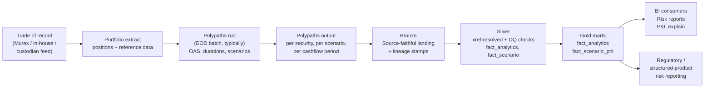

# Module 25 — Polypaths Applied

!!! abstract "Module Goal"
    [Module 23](23-vendor-systems-framework.md) defined the framework — every vendor system is catalogued, mapped, extracted, validated, lineaged, and version-tracked through the same six steps — and [Module 24](24-murex-applied.md) instantiated that framework for Murex MX.3, the dominant *trade-of-record* platform at most tier-1 banks. This module instantiates the framework for a vendor that occupies a structurally different slot in the architecture: Polypaths, the specialist fixed-income analytics platform from Polypaths Software Corp. Where Murex is the system of record for trades, positions, and (often) sensitivities, Polypaths is an *analytics calculator* — the warehouse feeds it a portfolio plus market data, the warehouse receives back per-security analytics (OAS, prepayment speeds, key-rate durations, scenario P&Ls). The data-engineering discipline is therefore narrower in scope than M24 — Polypaths produces fewer entities, the integration touches fewer parts of the warehouse, the upgrade impact is typically smaller — but the framework discipline is identical, and the *distinction* between a calculator and a trade-of-record is the load-bearing concept the module exists to teach.

!!! info "Disclaimer — version and customisation caveats"
    This module reflects general industry knowledge of Polypaths as of mid-2026. Specific output schema, scenario taxonomy, and model conventions vary by Polypaths version and by each firm's calibration. Treat it as a starting framework, not as a Polypaths reference manual — verify against your firm's actual Polypaths instance before applying. The framework discipline of [Module 23](23-vendor-systems-framework.md) is the durable contribution; the specific Polypaths details below are illustrative and version-sensitive.

---

## 1. Learning objectives

By the end of this module, you should be able to:

- **Describe** Polypaths' role in a fixed-income analytics pipeline — what it computes (OAS, prepayment, key-rate durations, scenario analytics), which desks rely on it (structured-credit, MBS, ABS, CMO, asset-management fixed-income), and where the warehouse intersects it.
- **Distinguish** Polypaths from a trade-of-record system such as Murex ([Module 24](24-murex-applied.md)) — why "the trade is in Murex, the analytic is in Polypaths" is the standard architectural pattern, and why the warehouse must treat the two integrations differently.
- **Identify** the typical Polypaths output entities — security-level analytics, scenario outputs, cashflow projections — and articulate the grain, downstream uses, and lineage requirements of each.
- **Conform** Polypaths identifiers (CUSIP-heavy, with ISIN cross-referencing for non-US instruments) to firm-canonical surrogate keys via the xref dimension pattern from [Module 6](06-core-dimensions.md).
- **Apply** Polypaths-specific data-quality checks — portfolio coverage, scenario completeness, OAS sanity ranges, prepayment-speed reasonableness, fair-value-versus-market drift — as silver-layer validations layered on top of the [Module 15](15-data-quality.md) framework.
- **Plan** for a Polypaths model recalibration or version upgrade — recognise that a prepayment-model recalibration can shift OAS by tens of basis points overnight with no market move, and budget the parallel-run discipline accordingly.

## 2. Why this matters

If your firm trades structured fixed income — MBS, ABS, CMO, structured credit, callable agency debt — Polypaths is almost certainly somewhere in your analytics pipeline. The platform has been the specialist's specialist for option-adjusted-spread analytics and prepayment modelling for decades, used by buy-side asset managers (insurance companies running large MBS portfolios, pension funds with structured-product allocations, mutual funds with fixed-income mandates) and by sell-side fixed-income trading desks (the structured-credit desk, the MBS trading desk, the agency-debt desk). The data-engineering job at a Polypaths-using firm is to absorb its outputs cleanly — the per-security analytics, the per-scenario P&Ls, the cashflow projections — and to serve them to risk reporting, P&L attribution, and the regulatory submissions that depend on structured-product risk metrics.

The architectural distinction that matters most is that Polypaths is *not* a trade-of-record system. The trade is booked somewhere else — Murex (Module 24), an in-house structured-products platform, a custodian feed, the asset manager's own portfolio-management system — and Polypaths is fed the resulting portfolio as an *input*. The warehouse therefore consumes Polypaths as an *analytic enrichment* of the position, not as the position itself. A team that conflates the two — that treats Polypaths' fair-value as the trade-of-record value, or that treats Polypaths' position view as authoritative when the actual trade-of-record disagrees — produces a warehouse where the structured-product reporting silently drifts from the firm's official books and records. The discipline is to keep the two integrations cleanly separated: Murex (or whichever trade-of-record system applies) provides the trade and the position; Polypaths provides the analytic; the warehouse joins them at the silver or gold layer through firm-canonical instrument keys.

This module reflects general industry knowledge of Polypaths as of mid-2026. Specific output schema, scenario taxonomy, and model conventions vary by Polypaths version and by each firm's calibration. Treat it as a starting framework, not as a Polypaths reference manual — verify against your firm's actual Polypaths instance before applying. The framework discipline of [Module 23](23-vendor-systems-framework.md) is the durable contribution; the specific Polypaths details below are illustrative and version-sensitive. The same caveat applied to M24 for Murex applies here: the contribution is the *shape* of the integration discipline, not a reference manual for any particular Polypaths release.

A practitioner-angle paragraph. After this module you should be able to walk into a Polypaths-using fixed-income shop on day one and read the analytics-integration architecture in vocabulary the team uses: which Polypaths output entities the warehouse extracts, where the bronze landing is, what the silver-conformance pattern looks like, which DQ checks catch model-recalibration drift, which gold marts depend on which Polypaths outputs, and which trade-of-record system Polypaths is being fed from. You should also recognise the warning signs of a Polypaths integration that has lost its framework discipline — Polypaths fair-values being reported as market values, OAS time series spanning model recalibrations without a version stamp, scenario P&Ls aggregated across two Polypaths versions in the same report — and write the remediation plan.

A note on scope. This module covers the *warehouse-side data-engineering* perspective on Polypaths — what comes out of the platform, how to absorb it, how to validate it, how to plan for recalibrations. It does not cover the *quantitative* perspective (how Polypaths' OAS implementation works internally, how its prepayment models are constructed, how its calibration is performed), the *trader-workflow* perspective (how to use Polypaths' interactive UI for pre-trade pricing, how to interpret its scenario outputs at the desk level), or the *structured-products business* perspective (how MBS and structured-credit deals are originated and traded). Those perspectives belong to the quantitative-research team, the trading desk, and the structured-products business respectively; the BI engineer's role is downstream of all of them, and the discipline this module covers is the downstream-absorption discipline.

## 3. Core concepts

A reading note. Section 3 builds the Polypaths-warehouse-integration story in eight sub-sections: what Polypaths is and where it sits in the analytics ecosystem (3.1), how it differs structurally from a trade-of-record system (3.2), the typical integration pattern and load timeline (3.3), the common Polypaths output entities (3.4), Polypaths' identifier model and the xref to firm masters (3.5), how the run-snapshot model interacts with the warehouse's bitemporal pattern from [Module 13](13-time-bitemporality.md) (3.6), the Polypaths-specific DQ checks (3.7), and the version-and-recalibration impact patterns (3.8).

### 3.1 What Polypaths is

Polypaths is the flagship product of Polypaths Software Corp, a specialist software firm that has built fixed-income analytics — and in particular option-adjusted-spread and prepayment analytics — for decades. The platform is best known for four capabilities:

- **OAS analytics.** The option-adjusted spread is the spread that compensates the holder of a bond with embedded optionality (a callable corporate bond, a prepayable mortgage-backed security, a putable agency note) for the optionality-adjusted credit and liquidity risk. Computing it requires a model of the underlying interest-rate process, a model of the embedded option's exercise behaviour (rational exercise for callables, prepayment-model-driven exercise for MBS), and a numerical method for solving the implied spread that reconciles the model price to the market price. Polypaths' OAS implementation is one of the platform's defining capabilities, and is what attracts most buy-side fixed-income shops to the product.
- **Prepayment modelling.** Mortgage-backed securities, asset-backed securities, and many structured products carry *prepayment risk* — the risk that the underlying borrowers refinance or pay down their loans faster (or slower) than the bond's pricing assumes, changing the bond's effective duration and yield. Polypaths supports the standard prepayment frameworks (PSA, CPR, SMM) and ships its own calibrated prepayment models that incorporate refinance incentive (how much rates have moved since origination), burnout (the diminishing prepayment response of a pool that has already seen its most rate-sensitive borrowers refinance), seasoning (the age of the pool), and other behavioural drivers. The prepayment model is a substantial determinant of every MBS analytic the platform produces, and a firm's choice of prepayment-model calibration is a meaningful business decision.
- **Cashflow projection.** Given a structured product's deal documentation and a prepayment-and-default scenario, Polypaths projects the principal-and-interest cashflow waterfall through the deal's tranches, period by period, to maturity. The cashflow projections are inputs to the OAS calculation, to the duration calculation, and to the scenario P&Ls; they are also a deliverable in their own right for asset-liability-management and cashflow-matching exercises at insurance-company and pension-fund clients.
- **Scenario and sensitivity analytics.** Per-security key-rate durations (the sensitivity of price to a parallel shift in each segment of the yield curve), convexity, and scenario P&Ls (the price under specific interest-rate, spread, and prepayment-speed shifts) are produced as standard outputs. These feed the firm's risk reporting and (where the firm uses Polypaths-derived sensitivities for it) the regulatory capital calculation.

A diagram of where Polypaths sits in a typical firm's data flow — the trade-of-record system on one side, the analytics calculator in the middle, the warehouse on the other side, and the BI and regulatory consumers downstream:



The annotation on the diagram that the reader should internalise: Polypaths is the *calculator*, not the trade-of-record. The trade lives elsewhere; Polypaths produces analytics about it.

A note on Polypaths' competitive position. Polypaths competes most directly with the structured-products analytics offered inside the major trading platforms (Numerix's Quantserver and Numerix's own analytics suite, Bloomberg's BVAL composite for fair-value analytics, the structured-products modules within Murex and Calypso), with specialist analytics shops (Yield Book, originally a Salomon product and now part of FTSE Russell), and with the in-house analytics libraries the largest buy-side and sell-side firms maintain themselves. Polypaths' niche is the specialist's specialist — firms that need depth in OAS and prepayment analytics rather than breadth across asset classes typically choose it. The warehouse-side relevance is that Polypaths' roadmap is shaped by competition in the structured-products analytics space, and the team should expect periodic model recalibrations and the occasional new analytic to surface in the platform's outputs.

A note on the *buy-side vs sell-side flavours of Polypaths use*. The integration shape differs subtly between the two reader audiences this module addresses. At a buy-side asset manager (an insurance company, a pension fund, a mutual-fund complex), Polypaths typically serves a *portfolio-management* purpose — the analytics support investment decisions, the cashflow projections feed asset-liability matching, the scenario analytics support the firm's investment-committee reporting. At a sell-side trading desk, Polypaths typically serves a *market-making* purpose — the analytics support the trader's pricing of new trades, the scenario analytics support the desk's risk reporting, the OAS analytics support the desk's relative-value commentary. The warehouse-side patterns described in this module apply to both; the specific consumer set differs, and the integration's documented contracts (the freshness SLA, the entity scope, the DQ check severity) should reflect the consumer's needs rather than a one-size-fits-all default.

### 3.2 How Polypaths differs from a trade-of-record system

The architectural distinction between an analytics calculator and a trade-of-record system is the most consequential conceptual point in this module. The two integration types look superficially similar — both produce facts the warehouse persists, both have schemas the warehouse must conform, both have version cadences the warehouse must track — but their *role* in the firm's data architecture is structurally different, and the warehouse must treat them accordingly.

A trade-of-record system (Murex, Calypso, an in-house position keeper) is the *authoritative source* for the firm's trading activity. When the firm asks "what trades did we execute today?" the answer comes from the trade-of-record system. When the firm asks "what is our position?" the answer comes from the trade-of-record system. The data the warehouse consumes from a trade-of-record system is *constitutive* of the firm's books and records — it defines the truth, it is auditable as such, and any disagreement between the trade-of-record system and another source is resolved in the trade-of-record system's favour absent strong evidence to the contrary.

An analytics calculator (Polypaths, Numerix Quantserver, an in-house pricing library) is the *derived view* of the firm's trading activity. The calculator does not know what trades the firm executed — it knows what positions the firm fed it, and it computes analytics against those positions. When the firm asks "what is our OAS exposure?" the answer comes from the calculator. When the firm asks "what is our scenario P&L for a 100bp parallel shift?" the answer comes from the calculator. The data the warehouse consumes from an analytics calculator is *interpretive* of the trades, not constitutive of them — it depends on the calculator's model assumptions, on the input portfolio it was fed, on the market data it priced against. Disagreement between the calculator's view and the trade-of-record system's view is *expected* (the calculator is computing something the trade-of-record system does not compute) and is not resolved in the calculator's favour.

The warehouse-side consequence is that the two integration types are joined in the silver or gold layer through a firm-canonical instrument key, with each contributing what it owns: the trade-of-record system contributes the position (the notional, the book, the counterparty, the trade history), the calculator contributes the analytic (the OAS, the duration, the scenario P&L). A query that asks "what is the OAS-weighted-duration of book X?" joins the two and combines their contributions; a query that asks "what trades does book X hold?" goes to the trade-of-record only; a query that asks "what is the scenario P&L for book X?" goes to the calculator only.

A practitioner observation on *the question of "which fair-value should we report?"*. Polypaths produces a model-derived fair-value for each security as part of its analytics. The firm's official fair-value for accounting and regulatory purposes is rarely the Polypaths fair-value alone — it is typically a composite (a vendor-cleansed price from BVAL or ICE, a trader-marked price for illiquid securities, the Polypaths model price as a sanity check). The warehouse should *not* surface the Polypaths fair-value as the firm's official price; it should surface it as a Polypaths-specific analytic, alongside the firm's official price, and let the consumer choose. A team that lets Polypaths' fair-value leak into the gold layer's `fact_position.fair_value` column has confused the calculator with the price source, and the firm's official price reporting will silently drift toward Polypaths' model view.

A second practitioner observation on *the comparable distinction with market-data vendors*. Polypaths' role-as-calculator is also distinct from a market-data vendor's role-as-observation. A market-data vendor (Bloomberg, Refinitiv, ICE) publishes *observations* of the market — prices, curves, fixings — that the warehouse treats as inputs to the firm's own analytics. Polypaths consumes some of those observations as inputs and produces analytics from them; the warehouse consumes the analytics as outputs. A team that treats Polypaths as analogous to a market-data vendor will mis-architect the integration: market-data vendor outputs land in the M11 market-data layer (with the vendor → cleansed → official curation pattern); Polypaths outputs land in their own analytics-layer entities (with no curation but with version-tracking). The framework's category scheme of [Module 23](23-vendor-systems-framework.md) handles this cleanly — Polypaths is a trading-and-risk-platform vendor (specifically an analytics calculator) rather than a market-data-provider vendor — and the team that respects the categorisation builds the right shape of integration.

### 3.3 The integration pattern

The dominant Polypaths integration pattern is *EOD batch*. The warehouse extracts the day's portfolio (positions, reference data) from the trade-of-record system, transmits it to Polypaths, triggers a Polypaths run, waits for the analytics output, lands the output in bronze, conforms it in silver, and serves it to gold by the next morning. The timeline at a typical firm looks like: the trade-of-record system's EOD position cut completes around 02:00–03:00 local time; the portfolio is transmitted to Polypaths shortly after; the Polypaths run completes within an hour or two depending on portfolio size and scenario count; the analytics output is available in the warehouse's bronze layer by 05:00–06:00; silver conformance and DQ checks complete by 06:30–07:00; the gold marts refresh in time for the morning's risk-and-P&L reports.

A second pattern that some firms operate alongside the EOD batch is *intraday on-demand pricing*. A trader on the structured-credit desk who is contemplating a new trade may invoke Polypaths interactively to price the prospective trade under current market conditions. The intraday pattern is operationally distinct from the EOD batch — it is on-demand rather than scheduled, it returns results to the trader's UI rather than to the warehouse, it typically runs against a smaller portfolio (the prospective trade plus a few comparable existing trades), and it uses a current market-data snapshot rather than the official EOD cut. The intraday pattern is *not* the canonical risk-reporting integration; the EOD batch is. The warehouse typically does not consume the intraday pattern's outputs — they are ephemeral, tied to a specific trader's workflow, and not auditable as the firm's official analytics — but should be aware that they exist so that conversations with the front office about "what Polypaths said this morning" can be disambiguated correctly.

The integration mechanics — how the portfolio is transmitted to Polypaths, how the run is triggered, how the output is retrieved — vary by deployment. Some firms run Polypaths on-premise as a server the warehouse calls into; some run it as a cloud-hosted service through Polypaths' SaaS offering; some run it embedded in a larger analytics platform that wraps Polypaths alongside other calculators. The specific transport (file drop on a shared filesystem, SFTP transfer, REST API call, message-bus publish-subscribe) is a deployment decision and should be documented in the catalogue entry. The framework discipline of [Module 23](23-vendor-systems-framework.md) applies regardless: every load gets lineage stamps, every load is tracked by a `polypaths_run_id`, every load's input portfolio and output analytics are reproducible from the bronze layer.

A note on *the input-portfolio's role as a first-class artefact*. The portfolio extract that the warehouse transmits to Polypaths is itself a fact the warehouse should land in bronze, not just a transient input. The reasons are reproducibility and auditability: a regulator (or a forensic investigation) asking "what portfolio was Polypaths given to compute these analytics?" needs the input portfolio retained alongside the output analytics, with the same `polypaths_run_id` linking the two. A team that treats the input portfolio as transient — generating it, sending it, and deleting it — loses the audit trail and cannot reproduce the run later if the source positions in the trade-of-record system have since changed. The discipline is to land the input portfolio in `bronze.polypaths_input_portfolio_snapshot` with the same lineage stamps and the same `polypaths_run_id` the output analytics will carry, and to retain it under the same regulatory retention horizon as the analytics outputs.

A second note on *the run-trigger orchestration*. The warehouse's orchestrator (Airflow, Dagster, the firm's in-house) is responsible for sequencing the steps: trade-of-record EOD load completes, portfolio extract is produced, Polypaths run is triggered, the warehouse waits for completion, the output is retrieved, the bronze landing happens, the silver and gold layers refresh, the DQ checks run, the alerts fire on failure. The dependency chain is long, and a failure at any step blocks the rest. The orchestrator's value is in encoding this chain explicitly, so that a failure at step N produces a clear signal of which step failed and which downstream consumers will be affected, rather than a silent gap that the morning's risk-report consumer discovers when their dashboard is stale. A team that under-uses the orchestrator's dependency-tracking capability discovers the cost in operational friction at incident-handling time.

### 3.4 Common Polypaths output entities

Three entity categories cover essentially every output a typical Polypaths integration consumes. The names below are *generic*; the actual table or column names in any specific deployment vary by Polypaths version and by the firm's configuration, and the disclaimer at the top of this module applies. The categories and their downstream uses are stable; the column conventions are not.

**Security-level analytics.** The atomic per-security analytics row. One row per `(security, business_date)` — typically keyed on CUSIP for US fixed income — carrying the day's analytics for the security under the run's market-data and model assumptions. Typical columns include the security identifier (CUSIP), the business date, the OAS (in basis points), the effective duration, the convexity, the key-rate durations (often as a struct or a set of bucketed columns — 3-month, 6-month, 1-year, 2-year, 5-year, 10-year, 30-year are typical buckets), the assumed prepayment speed (CPR or PSA), the model fair-value, and the run identifiers (`polypaths_run_id`, `polypaths_model_version`). The downstream uses are the firm's risk reporting (key-rate-duration-based interest-rate risk, OAS-weighted exposure summaries), the P&L attribution (the duration-and-convexity-driven explain components of [Module 14](14-pnl-attribution.md)), and the structured-product-specific regulatory submissions. The warehouse typically materialises this as `silver.polypaths_security_analytics_conformed`.

**Scenario outputs.** The per-security, per-scenario output. One row per `(security, scenario, business_date)` — a single security with twenty scenarios produces twenty rows in this entity per day. Typical columns include the security identifier, the scenario identifier (a name or code such as `parallel_+100bp`, `key_rate_2y_+25bp`, `spread_+50bp`, `prepay_+20pct`), the scenario fair-value or scenario P&L, the scenario currency, and the run identifiers. The downstream uses are the firm's scenario P&L reporting (the desk-level P&L under each of a standard set of regulatory and internal scenarios), the structured-product stress-testing exercises ([Module 10](10-stress-testing.md)), and the FRTB Sensitivity-Based-Method capital calculation where the firm derives sensitivities from scenario P&Ls rather than from analytical greeks. The volume is moderate — a tier-1 buy-side fixed-income shop running fifty scenarios across thirty thousand securities produces 1.5 million rows per business day. The warehouse typically materialises this as `silver.polypaths_scenario_pnl_conformed`.

**Cashflow projections.** The per-security, per-future-period projected cashflow. One row per `(security, projection_period, business_date)` — a thirty-year MBS projected through three hundred and sixty monthly periods produces three hundred and sixty rows per security per business day. Typical columns include the security identifier, the projection period (a date or a period-index), the projected principal cashflow, the projected interest cashflow, the projected scheduled principal, the projected prepayment principal, the assumed prepayment speed for the period, and the run identifiers. The downstream uses are asset-liability-management exercises (matching projected cashflow against liability cashflow), the cashflow-based regulatory submissions for insurance-company clients (NAIC AVR/IMR work in the US, Solvency II equivalent in Europe), and the scenario-cashflow analytics where the projection is rerun under stressed prepayment assumptions. The volume is the largest of the three entity categories — three hundred and sixty rows per security per day, multiplied by tens of thousands of securities, produces tens of millions of rows daily. The warehouse may consume this entity selectively (only for the securities and the periods the downstream consumers actually need) rather than wholesale.

A reference table summarising the three entity categories:

| Entity                       | Typical grain                                     | Typical row count (tier-1 fixed-income shop, EOD) | Downstream uses                                                |
| ---------------------------- | ------------------------------------------------- | -------------------------------------------------- | -------------------------------------------------------------- |
| Security-level analytics     | (security_cusip, business_date)                   | Tens of thousands                                  | Risk reporting, P&L attribution, structured-product regulatory |
| Scenario outputs             | (security_cusip, scenario_id, business_date)      | Hundreds of thousands to millions                  | Scenario P&L, stress testing, FRTB SBM (scenario-derived)     |
| Cashflow projections         | (security_cusip, projection_period, business_date) | Tens of millions                                   | ALM, insurance regulatory, scenario-cashflow analytics        |

A practitioner observation on *the entity-load ordering*. Security-level analytics is the smallest and most broadly consumed entity, and should be loaded first; scenario outputs are the next-largest and should be loaded second; cashflow projections are the largest and should be loaded selectively (only the consumed subset) and last. A team that tries to load all three entities at full volume on day one typically discovers that the cashflow-projection table consumes a disproportionate share of the warehouse's storage budget and re-scopes the integration to load only the periods and securities the downstream consumers genuinely need. The discipline is to *ask the consumer first* what they need from each entity, and to scope the load accordingly.

A second observation on *the entities the warehouse may not consume*. Some Polypaths deployments expose entities the warehouse does not need: trader-workflow outputs from the intraday on-demand pricing pattern, deal-document parsing artefacts that the structured-products desk handles in its own tooling, model-diagnostic outputs (convergence statistics, calibration residuals) that the quantitative-research team consumes directly. The team should *enumerate the available entities* during cataloguing and explicitly mark which the warehouse will and will not consume. The unconsumed entities are not failures — they are deliberate scoping decisions — but the documentation should capture the decision so a future team member understands why a given Polypaths entity is not in the warehouse's silver layer.

A third observation on *entity-grain edge cases for structured-product securities*. A structured-product deal — a CMO with multiple tranches, a CDO with senior-mezzanine-equity sub-divisions, a CLO with floating-rate notes across the capital structure — is one *deal* with multiple *tranches*, and Polypaths typically produces analytics at the tranche grain (each tranche's CUSIP gets its own row of analytics). The warehouse's silver layer should preserve the tranche grain rather than aggregating to the deal level — the per-tranche analytics are what the risk reporting and the regulatory submissions consume — but should also allow consumers to roll up to the deal level via the deal-tranche relationship in the firm's instrument master. A team that aggregates to the deal level at silver loses the per-tranche queryability; a team that preserves the tranche grain and lets consumers roll up downstream handles both shapes correctly.

### 3.5 Polypaths identifiers and xref to firm masters

Polypaths is *CUSIP-heavy* — its identifier model reflects its US fixed-income focus, and CUSIP is the dominant security identifier across the platform. For securities without a CUSIP — non-US instruments identified by ISIN, structured-product tranches with firm-internal identifiers, OTC trades with no public identifier — the firm typically supplies the cross-reference at the input portfolio level (the portfolio extract sent to Polypaths includes both the CUSIP, where one exists, and a fallback identifier) and consumes back the same identifier on the output side.

The xref dimension pattern from [Module 6](06-core-dimensions.md) applies as in M24. The warehouse maintains a `dim_xref_instrument` table that maps `(source_system_sk, vendor_instr_code) → instrument_sk`, with SCD2 versioning so historical mappings are preserved. The Polypaths-specific rows in the table look like:

```
source_system_sk | vendor_instr_code   | instrument_sk | valid_from  | valid_to
'POLYPATHS'      | '31358MD37'         | 5001          | 2024-01-01  | NULL
'POLYPATHS'      | '3137B1U68'         | 5002          | 2024-01-01  | NULL
'POLYPATHS'      | 'FIRM_INTERNAL_001' | 5003          | 2024-01-01  | NULL
```

The first two rows above are agency-MBS CUSIPs; the third is an example of a firm-internal identifier supplied to Polypaths for a security without a CUSIP. The xref-population work is typically a *master-data-management* responsibility — the MDM team owns the firm-canonical instrument scheme and ensures every CUSIP a Polypaths run touches has been mapped to a firm `instrument_sk` — but the data team consumes the xref tables in the silver-conformance views.

A practitioner observation on *the OpenFIGI fallback*. For non-US securities where the firm has not yet established a firm-internal identifier, the OpenFIGI service (Bloomberg-administered, free for low-volume use) provides a stable cross-reference between ISIN and FIGI that the warehouse can use as an interim mapping. The discipline is to *promote* the OpenFIGI-mapped securities to firm-internal identifiers as soon as the MDM process catches up, rather than relying on OpenFIGI as the long-term mapping; the FIGI is a useful identifier but is not the firm-canonical identifier the warehouse should be keyed on.

A second observation on *CUSIP-versus-ISIN duality for cross-listed securities*. A small subset of US securities have both a CUSIP and an ISIN (the ISIN typically being the country-prefixed form of the CUSIP). The xref dimension should map *both* identifiers to the same `instrument_sk`, so that a downstream consumer joining on either form resolves to the same instrument. A team that maintains separate `instrument_sk` values for the two identifier forms produces silent duplication in any aggregation that joins on instrument_sk — the same security counted twice. The discipline is to enforce identifier-uniqueness at the MDM level: one security, one `instrument_sk`, multiple `vendor_instr_code` values across multiple `source_system_sk` values mapping into it.

A third observation on *the new-security onboarding latency*. A new security that the firm has just begun trading typically has not yet been onboarded into the firm-canonical instrument master at the time it first appears in a Polypaths run. The xref join in the silver-conformance view returns NULL for the `instrument_sk`, the row is flagged by the unmapped-xref DQ check, and the warehouse holds the row until MDM completes the onboarding. The latency between a security first appearing and the MDM onboarding completing is typically a few hours to a day at a well-functioning firm; longer at firms where the MDM process is more constrained. The team should maintain a *stale-unmapped* monitor that flags any unmapped row that has been waiting more than a defined threshold (24-48 hours typically), to catch cases where the MDM process has dropped the request.

### 3.6 Bitemporality and the run-snapshot model

Each Polypaths run is essentially a *snapshot*: analytics computed against a specific market-data cut, against a specific portfolio cut, with a specific model calibration. Polypaths does not natively layer bitemporality on top — the run produces what the run produces, and the model treats each run as an independent computation. The bitemporality discipline of [Module 13](13-time-bitemporality.md) is layered on at the warehouse, not at Polypaths itself, and the discipline is to treat each Polypaths run as an *immutable input event* that carries enough lineage to reconstruct the run later if needed.

The mandatory stamps the warehouse should attach to every Polypaths-derived row are:

- `polypaths_run_id` — the unique identifier of the Polypaths run that produced the row, supplied by Polypaths or assigned by the warehouse's ingestion at run time.
- `polypaths_run_timestamp` — the timestamp at which the run was executed, in UTC.
- `polypaths_model_version` — the version of the Polypaths analytics model in effect at the run, including the prepayment-model calibration version where it differs from the platform version.
- `business_date` — the as-of date the run was computing analytics for (typically the prior trading day's close).
- `warehouse_load_timestamp_utc` — when the row landed in bronze.

Together with the framework's standard lineage stamps (`source_system_sk = 'POLYPATHS'`, `pipeline_run_id`, `code_version`, `vendor_schema_hash`), these stamps let any historical row be traced back to a specific run, a specific model version, a specific input portfolio, and a specific market-data cut. A regulator asking "what was the OAS for security X on date Y?" gets an answer keyed on the `polypaths_run_id` of the canonical run for that date; a forensic investigation asking "did the model recalibrate between dates A and B?" gets an answer by comparing the `polypaths_model_version` stamps on the two dates' rows.

A practitioner observation on *re-runs and supersession*. A team will occasionally need to re-run Polypaths against a corrected portfolio or a corrected market-data input — the original run was based on stale data, or carried a known input bug, or used a model version that has since been retired in favour of a corrected one. The warehouse should *retain* the original run's outputs in bronze (the bronze layer is the replay buffer; nothing is deleted) and *supersede* the original at the silver layer with the corrected run's outputs, marking the original as `superseded` with a pointer to the replacement. The bitemporal pattern of M13 supports this directly — the silver layer has a `valid_from` / `valid_to` axis, and the original row's `valid_to` is closed when the corrected row's `valid_from` opens. A team that simply overwrites the silver layer with the corrected run loses the audit trail of the supersession and cannot answer the question "what was the warehouse's view of OAS for security X on date Y *as known at time Z*?" correctly.

A second observation on *the run-snapshot's interaction with the trade-of-record's bitemporality*. The trade-of-record system (Murex or equivalent) carries its own bitemporal view — the position as known at a particular as-of timestamp. When the warehouse joins a Polypaths-derived analytic to a trade-of-record position, it should join on the *consistent* as-of pair: the position as the trade-of-record knew it at the time the portfolio extract was generated, and the analytic Polypaths produced from that extract. Joining a current position against an old analytic, or vice versa, produces silently inconsistent rows. The discipline is to retain the as-of-pair-link explicitly in the silver layer — the `polypaths_run_id` ties the analytic to the input portfolio, and the input portfolio carries the trade-of-record as-of timestamp it was extracted at — so that downstream joins can validate the as-of consistency. A team that joins on `instrument_sk` and `business_date` alone, without the as-of consistency check, produces analytics that look correct in steady-state but quietly misalign during corrections-and-restatements windows.

A third observation on *the as-of querying pattern downstream consumers will ask for*. A common downstream ask is "what was our OAS exposure for book X as known on date Y?" — a bitemporal query along the as-known axis rather than the business-date axis. The query requires the silver layer to retain the supersession history and to support a `valid_from` / `valid_to` filter on each row. The discipline of [Module 13](13-time-bitemporality.md) provides the pattern; the Polypaths-specific responsibility is to ensure every supersession event carries the right metadata (the original `polypaths_run_id`, the superseding `polypaths_run_id`, the supersession reason) so the consumer's query can filter to the as-known view they want. A team that does not engineer for this query pattern will be asked to retroactively reconstruct the as-known views from bronze when a regulator or an internal audit asks for them, and the reconstruction is substantially more expensive than maintaining the bitemporal view continuously.

### 3.7 Polypaths-specific DQ checks

Five check categories cover the typical Polypaths integration's failure modes. The framework discipline of [Module 15](15-data-quality.md) applies — every check is a SQL query that returns rows-that-violated, every check has a calibrated severity, every check has a defined alert path and remediation playbook.

**Portfolio coverage.** Every security in the input portfolio should have analytics in the output. A non-empty result — securities present in the input but absent in the output — means Polypaths failed to produce analytics for some part of the portfolio, and any downstream aggregation will silently understate the firm's exposure. The check is implemented by joining the warehouse's input-portfolio snapshot against the bronze Polypaths output and identifying the unmatched securities.

**Scenario completeness.** Every security that received analytics should also have a row for every scenario the run was configured to produce. A non-empty result — a security with security-level analytics but missing some scenarios — means Polypaths failed mid-run on at least one scenario, and any scenario-aggregation report will silently exclude the missing rows. The check is implemented by counting the distinct scenarios per security and comparing against the configured scenario list.

**OAS sanity range.** OAS values outside a reasonable range — negative for an investment-grade bond, > 2000bps for an investment-grade bond, extreme outliers in either direction relative to the security's history — flag either bad input data (a market-price input that disagrees with the model fair-value at extreme magnitude), bad model behaviour (a model that has converged to an implausible value), or a legitimate but exceptional market event. The check is implemented as a parameterised range check per credit-rating bucket, with the offending rows flagged for analyst review rather than blocking the load. The severity is typically warn rather than error — the firm should investigate but should not halt morning's reporting on a handful of outliers.

**Prepayment-speed reasonableness.** Prepayment speeds outside reasonable ranges — CPR > 60% (implausibly fast prepayment), CPR < 1% (implausibly slow prepayment for an aged pool with refinance incentive), large day-on-day moves with no rate move to drive them — flag either bad inputs or model misbehaviour. The check is parameterised per product type (agency MBS, non-agency MBS, ABS, structured credit each have different reasonable ranges) and per pool-age cohort, and is severity warn.

**Fair-value vs market-price drift.** The Polypaths model fair-value compared to the security's traded market price gives a sanity check on the model's calibration — a model that systematically prices a sector higher or lower than the market is a model whose calibration has drifted, and the analytics it produces are therefore suspect. The check is implemented by joining the silver Polypaths analytics against the firm's market-price source (a vendor-cleansed price from M11, a trader mark for illiquid securities) and flagging securities where the gap exceeds a calibrated threshold.

A practitioner observation on the *check severity calibration for an analytics calculator*. The DQ check severities for an analytics calculator should generally be more permissive than for a trade-of-record system. A missing trade in Murex is a constitutive gap — the firm's books and records are wrong until the gap is closed. A missing analytic in Polypaths is an interpretive gap — the firm's books and records are still correct, but a derived view is incomplete. The team should hold the morning's load on a coverage failure (the analytics layer is incomplete and downstream consumers should know), but should typically *not* hold on a fair-value-drift outlier (the analytic is suspect for a few securities and the broader picture remains usable). The calibration is a judgement call per check; the discipline is to make the calibration explicit, to revisit it periodically, and to keep the alert volume manageable.

A second observation on *the relationship between Polypaths DQ and the firm's broader market-data DQ*. The fair-value-vs-market-price drift check is structurally a *cross-source* check — it joins a Polypaths-derived analytic against a market-data-source price — and it lives at the boundary between the Polypaths integration and the [Module 11](11-market-data.md) market-data layer. The check's failure mode could indicate a Polypaths model issue (the model is mispricing the security) or a market-data-source issue (the price input is stale or wrong). The team that operates the check should have a triage runbook that distinguishes the two: a single-security drift typically points to a market-data issue for that security; a sector-wide drift typically points to a Polypaths calibration issue; a portfolio-wide drift typically points to a model-version change. The check is most useful when paired with the segmentation discipline; raw "drift > threshold" alerts without segmentation produce noise rather than signal.

A third observation on *the DQ suite's evolution over time*. The five check categories above are the *minimum viable* Polypaths DQ suite; a mature integration accumulates more checks as it matures. Examples of additional checks the team may add: a duration-bucketing-consistency check (the sum of key-rate durations approximates the effective duration within a tolerance, a sanity check on the bucketing); a scenario-symmetry check (a +100bp parallel shift should produce P&L roughly equal-and-opposite to a -100bp parallel shift, with a convexity-driven asymmetry within bounds); a cashflow-projection-consistency check (the sum of projected principal cashflows over the projection horizon equals the security's outstanding principal balance, within rounding); a model-version drift check (the `polypaths_model_version` is the firm-blessed version, not an unblessed newer one). Each new check addresses a failure mode the team has experienced; each increases the suite's coverage at the cost of small additional maintenance burden. The discipline is to add new checks deliberately, in response to identified failure modes, rather than speculatively.

### 3.8 Version upgrades and model recalibration

Polypaths version upgrades — like Murex version upgrades — are a periodic event the data team must absorb. The Polypaths upgrade cadence is typically less aggressive than the major trading-platform vendors' (Polypaths is a specialist platform with a more focused user base, and its release rhythm reflects that), but the per-upgrade impact can still be substantial: a new analytics module surfacing new output columns, a deprecated scenario taxonomy, an adjustment to how key-rate durations are bucketed.

The more consequential periodic event is *model recalibration*. Polypaths' prepayment models are calibrated against historical loan-level prepayment data, and the calibration is refreshed periodically — typically annually, sometimes more often if the rate environment has shifted enough to justify an interim recalibration. A recalibration can shift the model's prepayment-speed assumptions across the portfolio meaningfully, and the downstream analytics — OAS, effective duration, scenario P&Ls — shift along with them. The numerical magnitudes vary, but a recalibration that shifts portfolio-average OAS by 10-50bps with no market move is within the range of normal experience, and a recalibration that shifts effective duration by 0.5-1.0 years on a long-duration portfolio is similarly possible.

The mitigations are the same as the M24 pattern. Parallel runs of the old and new model versions during the recalibration's transition window let the team measure the recalibration's impact before promoting it to canonical. Version-tracking on every row (`polypaths_model_version`) lets the team identify which rows were produced under which calibration, and lets historical comparisons account for the calibration discontinuity. Schema-hash DQ checks catch any structural changes the recalibration brings with it. Communication to downstream consumers — the risk reporting team, the P&L attribution team, the structured-product traders — happens in advance of the cutover so the consumers can interpret any apparent moves correctly when the new calibration goes live.

A practitioner observation on the *consumer communication around recalibration*. The risk and P&L reports the firm publishes daily are read by traders, by the desk's risk officer, by the firm's enterprise risk function, by senior management. A 30bp OAS move across the firm's MBS book overnight, with no rate move, will draw attention — and the question "what changed?" will be asked within minutes of the morning's report being published. A team that has communicated the recalibration in advance can answer the question immediately ("Polypaths recalibrated the prepayment model overnight; the OAS shift is the calibration's impact and is consistent with our pre-cutover impact analysis"). A team that has not communicated in advance spends the morning explaining and apologising. The communication discipline is operationally cheap and pays back enormously at incident-handling time.

A second observation on *cross-version aggregation*. A common temptation when comparing Polypaths-derived analytics across time is to compute a moving average or year-on-year comparison without checking whether the model recalibrated within the window. A 12-month OAS time series for a book that crosses a recalibration looks like a step-change at the recalibration date, and a downstream consumer who interprets the step-change as a market move is misreading the data. The discipline is to *segment by `polypaths_model_version`* in any cross-time aggregation, and to surface the recalibration date to the consumer where it falls within the time window. A team that suppresses the segmentation produces aggregations that are interpretable by Polypaths-aware analysts but misleading to anyone else.

A third observation on *the parallel-run window's duration*. The duration of the parallel run that precedes a recalibration cutover is a judgement call. Too short (a few days) and the team has not seen enough business cycles to be confident the recalibrated model behaves correctly across the firm's product mix; too long (multiple quarters) and the team is paying double-compute cost for analytics that are largely interchangeable. The typical durations seen in practice: two to four weeks for a minor calibration refresh against a stable rate environment; four to eight weeks for a more substantive calibration change or one that crosses a quarter-end (so the consumers see at least one quarter-end report under both versions); a full quarter for a major model-version change that affects the analytics' shape, not just their magnitudes. The team should document the chosen duration in the integration's runbook and revisit the duration choice after each cutover based on what was learned.

A fourth observation on the *version-management surface for the firm's official model*. Some firms operate Polypaths against a *firm-blessed* model calibration that lags the platform's latest calibration by a quarter or two — the firm waits for early adopters of the new calibration to surface any issues before promoting it internally. Other firms run on the latest calibration as soon as it ships. Both patterns are defensible; the choice is a firm-level risk-management decision rather than a data-engineering one. The data team's responsibility is to track whichever calibration the firm is on, to record it in the version registry, and to surface the calibration's identity to consumers. A team that is unaware of the firm's calibration-promotion policy is a team that may be running a non-blessed calibration in production without realising it, with the consequent regulatory and audit risk.

A fifth observation on the *upgrade impact's narrower scope versus M24's*. Polypaths upgrades are typically smaller in scope than Murex upgrades — the platform is narrower (specialist analytics rather than full-stack platform), the entity catalogue is smaller (three principal entities rather than the half-dozen or more that Murex exposes), the customisation surface is smaller (the firm's calibration choices are the principal customisations, rather than the deep configurability of a Murex deployment). A typical Polypaths version upgrade requires a few weeks of warehouse-side work, against the one-to-two-quarters typical of a Murex major upgrade. The framework discipline is the same; the elapsed time is shorter. The team that has internalised the M24 upgrade discipline can apply it to Polypaths with confidence that the work will land in less elapsed time and at lower cost.

## 4. Worked examples

### Example 1 — SQL: Polypaths extract → silver-layer conformed analytics view

The pattern is identical in shape to M24's silver-conformance pattern: bronze input, xref joins for identifier resolution, column renames for firm-canonical attribute names, lineage stamps preserved through. The Polypaths-specific differences are the entity (per-security analytics rather than per-trade), the identifier (CUSIP rather than `MX_TRADE_ID`), and the version stamps (`polypaths_model_version` rather than `mx_schema_version`).

**The bronze table — what Polypaths' raw extract looks like once landed.**

```sql
-- Dialect: ANSI SQL.
-- Hypothetical raw bronze landing of a Polypaths analytics extract.
-- Column names are illustrative; the disclaimer at the top of the module applies.
CREATE TABLE bronze.polypaths_analytics_extract (
    -- Polypaths-native columns (raw, unrenamed)
    pp_security_cusip       VARCHAR(9)   NOT NULL,    -- Polypaths-supplied CUSIP
    pp_business_date        DATE         NOT NULL,    -- The as-of date of the analytics
    pp_oas_bps              DECIMAL(8,2),             -- OAS in basis points
    pp_effective_duration   DECIMAL(8,4),             -- Effective duration in years
    pp_convexity            DECIMAL(8,4),             -- Convexity
    pp_krd_3m               DECIMAL(8,4),             -- Key-rate duration, 3-month bucket
    pp_krd_6m               DECIMAL(8,4),             -- Key-rate duration, 6-month bucket
    pp_krd_1y               DECIMAL(8,4),             -- Key-rate duration, 1-year bucket
    pp_krd_2y               DECIMAL(8,4),             -- Key-rate duration, 2-year bucket
    pp_krd_5y               DECIMAL(8,4),             -- Key-rate duration, 5-year bucket
    pp_krd_10y              DECIMAL(8,4),             -- Key-rate duration, 10-year bucket
    pp_krd_30y              DECIMAL(8,4),             -- Key-rate duration, 30-year bucket
    pp_fair_value           DECIMAL(18,6),            -- Model fair-value
    pp_fair_value_ccy       VARCHAR(3),               -- Fair-value currency
    pp_prepay_cpr           DECIMAL(8,4),             -- Assumed prepayment speed (CPR)
    -- Polypaths run-level metadata (carried on every row of the run)
    pp_run_id               VARCHAR(40)  NOT NULL,    -- Polypaths run identifier
    pp_run_timestamp        TIMESTAMP    NOT NULL,    -- Polypaths run execution timestamp
    pp_model_version        VARCHAR(20)  NOT NULL,    -- e.g. '2026.1' or '2026.1.prepay-r2'
    -- Lineage stamps (added by the bronze loader)
    source_system_sk        VARCHAR(20)  NOT NULL,    -- = 'POLYPATHS'
    pipeline_run_id         VARCHAR(40)  NOT NULL,    -- Warehouse orchestrator run id
    code_version            VARCHAR(40)  NOT NULL,    -- Warehouse loader git SHA
    vendor_schema_hash      VARCHAR(64)  NOT NULL,    -- SHA-256 of column list
    load_timestamp_utc      TIMESTAMP    NOT NULL     -- Warehouse load time
);
```

**The xref dimension — the small slice of `dim_xref_instrument` relevant here.**

```sql
-- Dialect: ANSI SQL.
-- Maps Polypaths instrument identifiers (CUSIP-keyed) to firm-canonical instrument
-- surrogate keys. Same shape as the generic xref of Module 23 / Module 6, populated
-- with Polypaths rows.
SELECT * FROM silver.dim_xref_instrument
WHERE source_system_sk = 'POLYPATHS';
-- Illustrative content:
-- ('POLYPATHS', '31358MD37',         5001, '2024-01-01', NULL)
-- ('POLYPATHS', '3137B1U68',         5002, '2024-01-01', NULL)
-- ('POLYPATHS', 'FIRM_INTERNAL_001', 5003, '2024-01-01', NULL)
```

**The silver-conformed view.**

```sql
-- Dialect: ANSI SQL.
-- Conforms Polypaths security-level analytics to the firm-canonical model.
-- - Renames Polypaths columns to firm-canonical names
-- - Resolves Polypaths CUSIPs via the xref dimension
-- - Captures source_system_sk = 'POLYPATHS' on every row
-- - Captures polypaths_run_id, polypaths_run_timestamp, polypaths_model_version
--   for lineage and recalibration-tracking
CREATE OR REPLACE VIEW silver.polypaths_security_analytics_conformed AS
SELECT
    -- Firm-canonical surrogate key (resolved via xref)
    xi.instrument_sk                            AS instrument_sk,
    -- Firm-canonical attributes (renamed from Polypaths names)
    bp.pp_business_date                         AS business_date,
    bp.pp_oas_bps                               AS oas_bps,
    bp.pp_effective_duration                    AS effective_duration,
    bp.pp_convexity                             AS convexity,
    -- Key-rate durations exposed as separate columns; consumers may
    -- pivot to a (bucket, value) struct downstream if preferred.
    bp.pp_krd_3m                                AS krd_3m,
    bp.pp_krd_6m                                AS krd_6m,
    bp.pp_krd_1y                                AS krd_1y,
    bp.pp_krd_2y                                AS krd_2y,
    bp.pp_krd_5y                                AS krd_5y,
    bp.pp_krd_10y                               AS krd_10y,
    bp.pp_krd_30y                               AS krd_30y,
    bp.pp_fair_value                            AS model_fair_value,
    bp.pp_fair_value_ccy                        AS model_fair_value_ccy,
    bp.pp_prepay_cpr                            AS prepay_cpr,
    -- Polypaths run-level lineage (passed through from bronze)
    bp.pp_run_id                                AS polypaths_run_id,
    bp.pp_run_timestamp                         AS polypaths_run_timestamp,
    bp.pp_model_version                         AS polypaths_model_version,
    -- Standard lineage stamps (passed through from bronze)
    bp.source_system_sk                         AS source_system_sk,
    bp.pipeline_run_id                          AS pipeline_run_id,
    bp.code_version                             AS code_version,
    bp.vendor_schema_hash                       AS vendor_schema_hash,
    bp.load_timestamp_utc                       AS warehouse_load_timestamp_utc
FROM bronze.polypaths_analytics_extract bp
LEFT JOIN silver.dim_xref_instrument xi
       ON xi.source_system_sk = bp.source_system_sk
      AND xi.vendor_instr_code = bp.pp_security_cusip
      AND bp.pp_business_date BETWEEN xi.valid_from
                                  AND COALESCE(xi.valid_to, DATE '9999-12-31')
WHERE bp.source_system_sk = 'POLYPATHS';
```

A walk-through. The single `LEFT JOIN` resolves the Polypaths CUSIP into the firm-canonical `instrument_sk` via the xref dimension; the SCD2 `BETWEEN` clause honours the historical mapping so a 2024 row picks up the 2024 mapping rather than the current one; the column renames push firm-canonical names into the view's output schema; the Polypaths run-level lineage (`polypaths_run_id`, `polypaths_run_timestamp`, `polypaths_model_version`) is preserved alongside the framework's standard lineage stamps so any historical row can be traced back to a specific run and a specific model version. A gold mart consuming `silver.polypaths_security_analytics_conformed` sees firm-canonical attributes, the firm-canonical instrument key, and the lineage stamps — it does not see Polypaths' raw column names or CUSIP-keyed identifiers. A gold mart joining Polypaths analytics to a position from a different source (Murex, the trade-of-record system) joins on `instrument_sk` and gets the analytics-and-position pair without needing to know either source's identifier scheme.

The equivalent silver-conformance views for the scenario-output and cashflow-projection entities follow the same pattern, with entity-specific column lists. A short outline:

```sql
-- silver.polypaths_scenario_pnl_conformed
-- One row per (instrument_sk, scenario_id, business_date).
-- Joins to dim_xref_instrument as above.
-- Joins to dim_xref_scenario (resolves Polypaths' scenario codes to firm-canonical
-- scenario keys, where the firm has a canonical scenario taxonomy).
-- Plus the standard lineage stamps and the Polypaths run-level stamps.

-- silver.polypaths_cashflow_projection_conformed
-- One row per (instrument_sk, projection_period, business_date).
-- Joins to dim_xref_instrument as above.
-- Carries projected_principal, projected_interest, projected_scheduled_principal,
-- projected_prepayment_principal, period_assumed_prepay_cpr.
-- Plus the standard lineage stamps and the Polypaths run-level stamps.
```

### Example 2 — SQL: Polypaths DQ check suite

Three Polypaths-specific checks, each returning rows-that-violated-the-rule per the [Module 15](15-data-quality.md) pattern.

**Check 1 — portfolio coverage.** Every security in the day's input portfolio should have analytics in the day's output. The check joins the input portfolio snapshot against the silver Polypaths analytics and identifies the unmatched securities.

```sql
-- Dialect: ANSI SQL.
-- dq_check__polypaths_portfolio_coverage
-- Returns input-portfolio securities that have no Polypaths analytics for the day.
-- Severity: error. The analytics layer is incomplete and downstream consumers
-- should be alerted before the morning's reports are published.
WITH portfolio_in AS (
    SELECT
        instrument_sk,
        business_date
    FROM silver.polypaths_input_portfolio_snapshot
    WHERE business_date = CURRENT_DATE
      AND notional <> 0
),
analytics_out AS (
    SELECT DISTINCT
        instrument_sk,
        business_date
    FROM silver.polypaths_security_analytics_conformed
    WHERE business_date = CURRENT_DATE
)
SELECT
    p.instrument_sk,
    p.business_date,
    'POLYPATHS_OUTPUT_MISSING' AS coverage_gap_reason
FROM portfolio_in p
LEFT JOIN analytics_out a
       ON a.instrument_sk = p.instrument_sk
      AND a.business_date = p.business_date
WHERE a.instrument_sk IS NULL;
```

**Check 2 — OAS sanity range.** OAS values outside a reasonable range per credit-rating bucket are flagged for analyst review. The threshold values below are illustrative — the firm should calibrate per its own product mix.

```sql
-- Dialect: ANSI SQL.
-- dq_check__polypaths_oas_sanity
-- Returns rows where the OAS is outside the reasonable range for the security's
-- credit-rating bucket. Severity: warn. The morning's load proceeds, but the
-- offending rows are flagged for analyst review.
SELECT
    a.instrument_sk,
    a.business_date,
    a.oas_bps,
    d.credit_rating_bucket,
    a.polypaths_run_id,
    a.polypaths_model_version,
    CASE
        WHEN d.credit_rating_bucket IN ('AAA', 'AA') AND a.oas_bps < -25 THEN 'OAS_TOO_LOW_FOR_HIGH_GRADE'
        WHEN d.credit_rating_bucket IN ('AAA', 'AA') AND a.oas_bps > 500 THEN 'OAS_TOO_HIGH_FOR_HIGH_GRADE'
        WHEN d.credit_rating_bucket IN ('A', 'BBB')  AND a.oas_bps < 0   THEN 'OAS_NEGATIVE_FOR_IG'
        WHEN d.credit_rating_bucket IN ('A', 'BBB')  AND a.oas_bps > 2000 THEN 'OAS_TOO_HIGH_FOR_IG'
        WHEN d.credit_rating_bucket IN ('BB', 'B', 'CCC') AND a.oas_bps < 50 THEN 'OAS_TOO_LOW_FOR_HY'
        ELSE NULL
    END AS sanity_reason
FROM silver.polypaths_security_analytics_conformed a
JOIN silver.dim_instrument d ON d.instrument_sk = a.instrument_sk
WHERE a.business_date = CURRENT_DATE
  AND (
        (d.credit_rating_bucket IN ('AAA', 'AA') AND (a.oas_bps < -25 OR a.oas_bps > 500))
     OR (d.credit_rating_bucket IN ('A', 'BBB')  AND (a.oas_bps < 0   OR a.oas_bps > 2000))
     OR (d.credit_rating_bucket IN ('BB', 'B', 'CCC') AND a.oas_bps < 50)
      );
```

**Check 3 — run completeness across scenarios.** Every security with analytics should also have a row for every scenario the run was configured to produce. The check counts the distinct scenarios per security and compares against the configured scenario list (held in a small `silver.polypaths_run_scenario_config` table).

```sql
-- Dialect: ANSI SQL.
-- dq_check__polypaths_run_completeness
-- Returns securities with security-level analytics but with at least one scenario
-- missing from the scenario-output entity. Severity: error. A missing scenario
-- means a scenario-aggregation report will silently exclude the corresponding rows.
WITH expected_scenarios AS (
    SELECT scenario_id
    FROM silver.polypaths_run_scenario_config
    WHERE business_date = CURRENT_DATE
      AND status = 'ACTIVE'
),
expected_per_security AS (
    SELECT
        a.instrument_sk,
        a.business_date,
        e.scenario_id
    FROM silver.polypaths_security_analytics_conformed a
    CROSS JOIN expected_scenarios e
    WHERE a.business_date = CURRENT_DATE
),
delivered AS (
    SELECT DISTINCT
        instrument_sk,
        business_date,
        scenario_id
    FROM silver.polypaths_scenario_pnl_conformed
    WHERE business_date = CURRENT_DATE
)
SELECT
    e.instrument_sk,
    e.business_date,
    e.scenario_id,
    'SCENARIO_MISSING' AS gap_reason
FROM expected_per_security e
LEFT JOIN delivered d
       ON d.instrument_sk = e.instrument_sk
      AND d.business_date = e.business_date
      AND d.scenario_id   = e.scenario_id
WHERE d.instrument_sk IS NULL;
```

The three checks together cover the Polypaths integration's most consequential silent-failure modes: a security present in the input but absent in the output (coverage catches it), an OAS value implausibly far from where the security's credit bucket would price (sanity catches it), a scenario the run was supposed to produce but did not (completeness catches it). All three should be wired into the orchestrator, with the coverage and completeness checks at error severity (the load is held until the gap is explained) and the OAS sanity check at warn severity (the load proceeds, the analyst reviews the outliers later in the morning).

**A note on running the checks via dbt or an equivalent test framework.** The three checks above are written as standalone SQL queries for readability, but in production the team typically wires them into a test framework — dbt's singular tests, a custom Python harness, or the firm's in-house DQ platform. The wiring provides several conveniences: each check has a defined severity (the framework holds the load on error-severity failures and continues on warn-severity), a defined alert path (the framework routes failures to the on-call channel), a documented owner (the framework knows which team owns each check), and a queryable history (the framework records every check's pass/fail history so the team can analyse trends over time). A team that runs the checks as ad-hoc SQL outside any framework loses these conveniences and accepts an operational burden the framework would absorb. The same framework wiring that hosts the M24 Murex DQ checks should host the Polypaths checks; the per-vendor cost-decay arithmetic of [Module 23](23-vendor-systems-framework.md) shows up here directly — vendor #2's checks slot into the framework vendor #1's checks already populated.

## 5. Common pitfalls

!!! warning "Watch out"
    1. **Comparing OAS across Polypaths versions without checking whether the prepayment model was recalibrated.** A 30bp OAS move between two dates that crosses a recalibration is the recalibration's effect, not a market move. Always segment cross-time aggregations by `polypaths_model_version` and surface the recalibration date to the consumer.
    2. **Mixing Polypaths outputs with another vendor's analytics in the same report.** Different analytics platforms make different model assumptions — a Polypaths OAS and a Yield Book OAS are not the same number even for the same security. Aggregations that mix the two are mathematically unsound; surface them as separate columns and let the consumer choose.
    3. **Treating Polypaths' fair-value as the trade-of-record value.** The Polypaths fair-value is a model-derived analytic, not a market price. The firm's official price comes from a vendor-cleansed source (BVAL, ICE) or from a trader mark, and the warehouse's `fact_position.fair_value` should reflect that — not the Polypaths model output.
    4. **Joining Polypaths outputs to a portfolio that is not the same portfolio that was fed in.** The analytics are computed against a specific input portfolio; joining them to a different portfolio (a more-recent snapshot, a corrected version) produces silent inconsistency. Always join on the `polypaths_run_id` to ensure the analytics-and-portfolio pairing is the one the run actually produced.
    5. **Ignoring the run-snapshot model and treating outputs as continuously point-in-time.** Each Polypaths run is a discrete snapshot, not a continuous time series. The bitemporal pattern of [Module 13](13-time-bitemporality.md) is the warehouse's responsibility to layer on; ignoring it produces analytics that cannot be reproduced as-known-on-a-prior-date.
    6. **Hard-coding Polypaths-specific column names in BI dashboards.** A Tableau dashboard that references `pp_oas_bps` or `pp_krd_5y` directly breaks the next time Polypaths renames either column or the next time the silver layer evolves. Reference firm-canonical names from the silver layer instead.
    7. **Running Polypaths intraday at high frequency when the EOD batch is the official cut.** The intraday on-demand pricing pattern is for trader workflow, not for risk reporting. The warehouse's official analytics come from the EOD run; intraday outputs should not be promoted to the official surface, and the warehouse generally should not consume them at all.

## 6. Exercises

1. **Map a Polypaths output to firm-canonical.** Below is a sketch of a Polypaths-style raw extract for a small set of MBS. Write the silver-layer conformance view that produces firm-canonical attributes — assume `dim_xref_instrument` is populated for the relevant CUSIPs.

    ```text
    Bronze table: bronze.polypaths_analytics_extract
    Columns: pp_security_cusip, pp_business_date, pp_oas_bps,
             pp_effective_duration, pp_convexity,
             pp_krd_3m, pp_krd_6m, pp_krd_1y, pp_krd_2y,
             pp_krd_5y, pp_krd_10y, pp_krd_30y,
             pp_fair_value, pp_fair_value_ccy, pp_prepay_cpr,
             pp_run_id, pp_run_timestamp, pp_model_version,
             source_system_sk, pipeline_run_id, code_version,
             vendor_schema_hash, load_timestamp_utc
    ```

    ??? note "Solution"
        ```sql
        -- Dialect: ANSI SQL
        CREATE OR REPLACE VIEW silver.polypaths_security_analytics_conformed AS
        SELECT
            xi.instrument_sk                            AS instrument_sk,
            bp.pp_business_date                         AS business_date,
            bp.pp_oas_bps                               AS oas_bps,
            bp.pp_effective_duration                    AS effective_duration,
            bp.pp_convexity                             AS convexity,
            bp.pp_krd_3m                                AS krd_3m,
            bp.pp_krd_6m                                AS krd_6m,
            bp.pp_krd_1y                                AS krd_1y,
            bp.pp_krd_2y                                AS krd_2y,
            bp.pp_krd_5y                                AS krd_5y,
            bp.pp_krd_10y                               AS krd_10y,
            bp.pp_krd_30y                               AS krd_30y,
            bp.pp_fair_value                            AS model_fair_value,
            bp.pp_fair_value_ccy                        AS model_fair_value_ccy,
            bp.pp_prepay_cpr                            AS prepay_cpr,
            bp.pp_run_id                                AS polypaths_run_id,
            bp.pp_run_timestamp                         AS polypaths_run_timestamp,
            bp.pp_model_version                         AS polypaths_model_version,
            bp.source_system_sk                         AS source_system_sk,
            bp.pipeline_run_id                          AS pipeline_run_id,
            bp.code_version                             AS code_version,
            bp.vendor_schema_hash                       AS vendor_schema_hash,
            bp.load_timestamp_utc                       AS warehouse_load_timestamp_utc
        FROM bronze.polypaths_analytics_extract bp
        LEFT JOIN silver.dim_xref_instrument xi
               ON xi.source_system_sk = bp.source_system_sk
              AND xi.vendor_instr_code = bp.pp_security_cusip
              AND bp.pp_business_date BETWEEN xi.valid_from
                                          AND COALESCE(xi.valid_to, DATE '9999-12-31')
        WHERE bp.source_system_sk = 'POLYPATHS';
        ```
        The pattern matches Example 1: a single xref join to resolve the CUSIP into `instrument_sk`, column renames to firm-canonical names, and the Polypaths run-level lineage (`polypaths_run_id`, `polypaths_run_timestamp`, `polypaths_model_version`) preserved alongside the framework's standard lineage stamps. An unmapped-xref DQ check should accompany this view to flag any CUSIPs that do not resolve — a new security the MDM team has not yet onboarded into the firm's instrument master is a typical source of unresolved rows.

2. **Diagnose.** Your portfolio's OAS jumped 30bps across all MBS overnight with no market move. Walk through the diagnostic checklist for a Polypaths-fed pipeline.

    ??? note "Solution"
        A reasonable checklist, walking the Polypaths-specific lineage:

        *Step 1 — check `polypaths_model_version` on yesterday's vs today's outputs.* If the version changed overnight, the most likely explanation is a Polypaths prepayment-model recalibration. A recalibration that shifts portfolio-average OAS by 10-50bps with no market move is within the range of normal experience, and the version stamp is the fastest confirmation. The investigation is largely complete if the version moved; the remaining work is communication to the consumers.

        *Step 2 — confirm via the Polypaths release notes or vendor communication.* Polypaths typically announces calibration changes in advance through release notes or direct customer communication. The team's standing channel with the Polypaths account team should have flagged the change; if it did not, that itself is a process-improvement finding for the next recalibration.

        *Step 3 — check the input portfolio.* If the model version did not change, the next-most-likely explanation is a portfolio-input change: a large new position in a high-OAS security that lifted the portfolio-average, a removal of low-OAS securities that did the same, a portfolio-extract bug that mis-categorised securities. Compare today's input portfolio against yesterday's at the security-level grain.

        *Step 4 — check the market-data input.* A spread-curve input that moved overnight (a credit-spread curve, a swap-spread curve) would shift OAS even if rates did not. Cross-reference against the firm's market-data layer ([Module 11](11-market-data.md)) to confirm whether any of the spread inputs Polypaths consumes moved.

        *Step 5 — check the prepayment-speed assumptions.* If the model version did not change but the platform's prepayment-speed assumptions for the portfolio's pools shifted (a refresh of the loan-level data, an update to the burnout calibration), the OAS would shift along with them. Compare the `prepay_cpr` column on a sample of securities between yesterday and today.

        *Step 6 — check the warehouse's loader.* A warehouse loader change that altered how the OAS column is read or interpreted could produce an apparent move that is not in fact in the data. Check the `code_version` stamp on yesterday's vs today's rows.

        The discipline the framework rewards: if every row carries `polypaths_run_id`, `polypaths_run_timestamp`, `polypaths_model_version`, `pipeline_run_id`, and `code_version`, every step of the diagnostic is a one-query lookup in the warehouse. The lineage discipline of [Module 16](16-lineage-auditability.md) is exactly what makes the diagnostic checklist tractable; in the Polypaths-specific case, the `polypaths_model_version` check at step 1 typically resolves the investigation in minutes rather than hours.

3. **Apply the framework.** You have been asked to integrate Polypaths as a new vendor source. Apply the six-step onboarding framework from [Module 23](23-vendor-systems-framework.md) to Polypaths specifically.

    ??? note "Solution"
        The six steps, instantiated for Polypaths:

        *Step 1 — Catalogue.* Register Polypaths in the source-system register: category = trading-and-risk-platform (specifically an analytics calculator within the category), vendor = Polypaths Software Corp, entities exposed = security-level analytics, scenario outputs, cashflow projections, grain per entity per §3.4, refresh frequency = EOD batch (with intraday on-demand pricing not consumed by the warehouse), integration pattern = portfolio extract out + analytics file in (or API depending on deployment), system-of-record relationship = analytics calculator (NOT trade-of-record; the trade lives in Murex or the firm's other trade-of-record system), contractual constraints per the firm's Polypaths contract, contact and escalation chain on the vendor side.

        *Step 2 — Map.* The mapping is dominated by the CUSIP-to-`instrument_sk` xref. Populate `dim_xref_instrument` with `(source_system_sk = 'POLYPATHS', vendor_instr_code = CUSIP, instrument_sk)` rows for every security in the portfolio. For non-CUSIP securities, supply firm-internal identifiers in the input portfolio and map them in the same xref. Document the column-rename specification (`pp_oas_bps → oas_bps`, `pp_effective_duration → effective_duration`, etc.) and any convention translations (typically minimal for Polypaths — the model conventions are largely standardised — but verify per deployment).

        *Step 3 — Extract.* Choose the integration pattern based on the firm's Polypaths deployment shape. For an on-premise Polypaths server, file drop on a shared filesystem is typical; for a Polypaths SaaS deployment, an API pull is typical. Implement the extractor (a Python module, a dbt source) that lands the day's analytics in `bronze.polypaths_analytics_extract` with the lineage stamps applied.

        *Step 4 — Validate.* Wire the five DQ check categories from §3.7 into the orchestrator: portfolio coverage (severity error), scenario completeness (severity error), OAS sanity range (severity warn), prepayment-speed reasonableness (severity warn), fair-value-vs-market drift (severity warn). Define alert paths (the on-call channel for the Polypaths-integration team), document the remediation playbook for each check, and calibrate the warn-severity thresholds against the firm's product mix during the integration's first quarter.

        *Step 5 — Lineage.* Stamp every row with `source_system_sk = 'POLYPATHS'`, `polypaths_run_id`, `polypaths_run_timestamp`, `polypaths_model_version`, `pipeline_run_id`, `code_version`, `vendor_schema_hash`, `load_timestamp_utc`. The stamping is implemented in the bronze loader and preserved through the silver and gold layers. The discipline is uniform with the framework's standard, plus the Polypaths-specific run-level stamps that distinguish a Polypaths integration from any other.

        *Step 6 — Version-track.* Maintain `vendor_version_dim` rows for each Polypaths platform version and each prepayment-model calibration the firm has used. Subscribe to the Polypaths release notes and the recalibration announcements. For each upcoming change, run the parallel-pipeline pattern from §3.8: the new version runs alongside the old in non-production, the team measures the impact on the portfolio's analytics, the team communicates the impact to the consumer teams, the cutover happens on a planned date with the new version's hash captured in the schema-drift DQ check.

        The integration's total elapsed time, from kickoff to in-production cleanly with all six framework artefacts in place, is typically three to six months at a firm with the framework already established (vendor #N, where N > 1) and six to nine months at a firm establishing the framework alongside the integration (vendor #1). The Polypaths-specific work is narrower in scope than M24's Murex integration — fewer entities, fewer DQ checks, smaller volumes — and the elapsed time reflects the narrower scope.

## 7. Further reading

- Polypaths Software Corp official site, [https://www.polypaths.com](https://www.polypaths.com) — for the firm's product framing and platform documentation.
- Fabozzi, F. J. *The Handbook of Mortgage-Backed Securities* — the canonical MBS reference; covers OAS analytics, prepayment models, and structured-product cashflow waterfalls in depth.
- Hayre, L. (ed.) *Salomon Smith Barney Guide to Mortgage-Backed and Asset-Backed Securities* — practitioner-grade reference on the analytics and conventions Polypaths implements.
- A textbook on fixed-income analytics covering OAS methodology — Fabozzi's broader fixed-income series, or Tuckman & Serrat's *Fixed Income Securities*, both cover the OAS framework and the numerical methods involved.
- Basel Committee on Banking Supervision, *Minimum capital requirements for market risk* (FRTB), latest version — for the structured-product reporting context in which Polypaths-derived sensitivities and scenario P&Ls are consumed by the regulatory capital calculation.
- Industry comparison materials on third-party fixed-income analytics — trade-press coverage of the Polypaths / Yield Book / Numerix / in-house build/buy decision, useful for understanding where Polypaths sits in the broader analytics-vendor landscape.

A short observation on the limits of these references' transferability. The Polypaths-specific behaviour (the platform's own model implementations, the platform's own column conventions, the platform's recalibration cadence) is documented only in the firm's contracted Polypaths documentation and in the team's accumulated experience with the platform. The references above cover the *analytics concepts* Polypaths implements (OAS, prepayment modelling, key-rate durations) at a depth that lets the reader understand what the platform is computing and why; they do not substitute for the platform-specific documentation. The framework discipline of [Module 23](23-vendor-systems-framework.md) and the integration patterns of this module are the durable contribution; the Polypaths specifics are an instantiation that the reader should verify against their firm's actual Polypaths deployment.

### A closing observation — Polypaths as the curriculum's first analytics-calculator case study

A short closing observation that situates this module within Phase 8. Of the trading-and-risk-platform vendors the framework's category includes, Polypaths is the curriculum's first *analytics calculator* applied case study, distinct from the Murex *trade-of-record* applied case study of [Module 24](24-murex-applied.md). The two modules together establish the two principal sub-shapes within the trading-and-risk-platform category, and a future contributor adding a module for any other trading-and-risk-platform vendor — Calypso, Summit, Front Arena, Sophis on the trade-of-record side; Numerix Quantserver, Yield Book, an in-house analytics library on the calculator side — can refer to whichever of M24 or M25 best matches their vendor's role.

The framework discipline transfers across both sub-shapes. The category-of-the-vendor matters for *integration shape* (calculators do not own positions; trade-of-record systems do), for *DQ check calibration* (calculators have interpretive gaps; trade-of-record systems have constitutive gaps), and for *the team's mental model of what the vendor is contributing* (an enrichment vs a source of truth). The framework discipline is the durable contribution; the per-vendor specifics are the instantiation that the contributor's accumulated experience supplies. A reader who has internalised both M24 and M25 has acquired the two principal applied patterns within Phase 8's largest category and is well-positioned to absorb any additional trading-and-risk-platform vendor the firm encounters.

A final practitioner observation. Polypaths is one vendor among many, and the team that treats Polypaths as central to their daily reality — to the exclusion of the framework discipline that lets the warehouse host every other vendor cleanly — has built a Polypaths-shaped corner of the warehouse rather than a firm-shaped one. The framework discipline is to treat Polypaths as one analytics calculator among potentially several (Polypaths for MBS, an in-house engine for IR derivatives, Quantserver for exotics, an external analytics tool for credit indices) and to give each the same treatment. The framework's value is the uniformity, and the warehouse that embodies it is a warehouse whose vendor relationships scale sustainably across the multi-decade life of the firm's structured-products business.

## 8. Recap

You should now be able to:

- Describe Polypaths' role in a fixed-income analytics pipeline — what it computes (OAS, prepayment, key-rate durations, scenario analytics), which desks rely on it, and where the warehouse intersects it.
- Distinguish Polypaths from a trade-of-record system such as Murex ([Module 24](24-murex-applied.md)), and articulate why "the trade is in Murex, the analytic is in Polypaths" is the standard architectural pattern.
- Identify the typical Polypaths output entities — security-level analytics, scenario outputs, cashflow projections — at the grain and downstream-use level, and explain how the warehouse should scope which entities to consume.
- Conform Polypaths identifiers (CUSIP-keyed, with ISIN/firm-internal fallbacks) to firm-canonical surrogate keys via the xref pattern from [Module 6](06-core-dimensions.md).
- Apply the Polypaths-specific DQ check categories (portfolio coverage, scenario completeness, OAS sanity, prepayment reasonableness, fair-value-vs-market drift) as silver-layer validations on top of the [Module 15](15-data-quality.md) framework.
- Recognise that a Polypaths prepayment-model recalibration can shift portfolio-average OAS by tens of basis points overnight with no market move, and apply the version-tracking and parallel-run discipline that the framework prescribes for absorbing the change cleanly.
- Walk the [Module 23](23-vendor-systems-framework.md) six-step onboarding framework against Polypaths specifically — catalogue the platform, map the identifiers, implement the extract, wire the DQ checks, stamp the lineage, track the versions — and produce a workplan for the integration's first six months.
