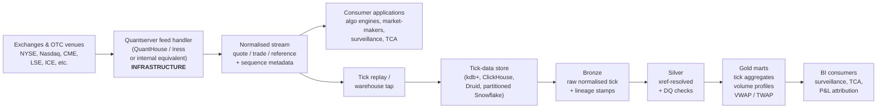

# Module 26 — Quantserver Applied

!!! abstract "Module Goal"
    [Module 23](23-vendor-systems-framework.md) defined the framework — every vendor system is catalogued, mapped, extracted, validated, lineaged, and version-tracked through the same six steps. [Module 24](24-murex-applied.md) instantiated that framework for Murex, the dominant *trade-of-record* platform; [Module 25](25-polypaths-applied.md) instantiated it for Polypaths, a specialist *analytics calculator*. This module instantiates the framework for a vendor that occupies a structurally different slot again: Quantserver, the market-data infrastructure pattern represented in the public market by QuantHouse's Quantserver platform (now part of Iress). Where Murex owns the trade and Polypaths derives an analytic, Quantserver does neither — it sits *upstream* of both, as the feed handler and normalisation layer that delivers exchange-native quote and trade data into the firm's applications and into the warehouse's tick-data store. The data-engineering discipline is therefore at a lower architectural layer than M24 or M25 — the volumes are higher by orders of magnitude, the bitemporal model is simpler, the entity catalogue is narrower — but the framework discipline is identical, and the *distinction* between an infrastructure platform and a trading or analytics platform is the load-bearing concept the module exists to teach.

!!! info "Disclaimer — what 'Quantserver' refers to here, and version caveats"
    "Quantserver" is a name used both for QuantHouse's market-data infrastructure platform (now Iress, following the 2018 acquisition) and for *internal/proprietary systems* with that name at various firms. This module covers the QuantHouse pattern as the **public reference** because it is the most commonly recognised industry meaning. If your firm uses "Quantserver" to refer to an internal system, the framework discipline of [Module 23](23-vendor-systems-framework.md) still applies — the entity catalogue, the streaming-data DQ checks, the bitemporal layering, the xref pattern — but you will need to adapt the entity catalogue and extraction patterns described below to your firm's specifics. The framework is the durable contribution; the QuantHouse-style specifics are an instantiation that informs but does not determine your firm's actual integration.

---

## 1. Learning objectives

By the end of this module, you should be able to:

- **Describe** Quantserver's role in market-data infrastructure — what it does (feed handling, normalisation, low-latency distribution), what it produces (quote streams, trade streams, reference-data updates, sequence metadata), and where the warehouse intersects it.
- **Identify** streaming vs batch integration patterns and explain why a market-data infrastructure platform is consumed by the warehouse through a tick-replay tap rather than through the same datamart-extract pattern that M24's Murex integration uses.
- **Distinguish** infrastructure platforms (this module) from trading platforms ([Module 24](24-murex-applied.md)) and from analytics calculators ([Module 25](25-polypaths-applied.md)) — three distinct sub-shapes within the trading-and-risk-platform category, each with different integration patterns.
- **Conform** exchange-native symbols (RIC, MIC + ticker, native exchange code) to firm-canonical instrument surrogate keys via the xref pattern from [Module 6](06-core-dimensions.md), at the volumes a tick stream demands.
- **Apply** Quantserver-specific data-quality checks for streaming data — sequence-number gap detection, timestamp ordering, price sanity, instrument coverage, session-boundary checks — as silver-layer validations layered on top of the [Module 15](15-data-quality.md) framework.
- **Choose** a tick-data storage technology realistically (kdb+, ClickHouse, Apache Druid, partitioned Snowflake/BigQuery) and articulate the cost and performance trade-offs that drive the decision.

## 2. Why this matters

If your firm trades on exchange — equities, listed derivatives, FX spot, listed rates — a Quantserver-class system is somewhere in your market-data infrastructure, whether it is the QuantHouse / Iress product, a competitor (Refinitiv Elektron, Bloomberg B-PIPE, ICE Consolidated Feed, an internal feed handler), or a fork of an open-source feed-handling stack. The platform's job is to terminate the exchange's native protocol on one side, normalise the messages into a single canonical format on the other side, and distribute the normalised stream to the firm's algorithmic-trading engines, market-making applications, surveillance systems, and (eventually, via a downstream tap) the warehouse's tick-data store. The data-engineering job at a Quantserver-using firm is to absorb the high-volume tick stream cleanly into the warehouse — to xref-resolve the symbols, to detect gaps and out-of-order events, to materialise queryable aggregates without melting the warehouse's storage budget — and to serve the resulting tick-data store to surveillance, transaction-cost-analysis, P&L attribution, and the regulatory submissions that depend on exchange-traceable evidence.

The architectural distinction that matters most is that Quantserver-class systems sit at a different *layer* than Murex or Polypaths. Murex is a trading platform — it owns trades, positions, and (often) sensitivities. Polypaths is an analytics calculator — it consumes a portfolio and produces analytics about it. Quantserver is *infrastructure* — it does not own trades, it does not produce analytics, it produces the *market-data feed* that both of the other categories rely on. The data the warehouse consumes from Quantserver is *observational* — what the exchange said, when it said it, with what sequencing — and the consumption pattern is *streaming* in shape (even when the warehouse-side ingestion is a periodic batch tap of a stream that was itself continuous). A team that conflates the layers — that treats Quantserver as a Murex-shaped batch source, that runs a nightly extract against tick data the way the warehouse runs a nightly extract against a Murex datamart — produces a warehouse where the tick-data integration is fundamentally mis-sized for the volume and the temporal model the data actually carries.

"Quantserver" is a name used both for QuantHouse's market-data infrastructure platform (now Iress, following the 2018 acquisition) and for internal/proprietary systems with that name at various firms. This module covers the QuantHouse pattern as the public reference because it is the most commonly recognised industry meaning. If your firm uses "Quantserver" to refer to an internal system, the framework in [Module 23](23-vendor-systems-framework.md) still applies — adapt the entity catalogue and extraction patterns to your firm's specifics. The framework discipline is the durable contribution; the QuantHouse-style specifics are illustrative and version-sensitive. The same caveat applied to M24 and M25 applies here: the contribution is the *shape* of the integration discipline, not a reference manual for any particular Quantserver release or any particular firm's internal Quantserver implementation.

A practitioner-angle paragraph. After this module you should be able to walk into a Quantserver-using firm — a market maker, a quant fund, a sell-side execution desk, a tier-1 bank with a listed-rates business — on day one and read the market-data-integration architecture in vocabulary the team uses: which exchange feeds the platform terminates, where the normalised stream lands, where the warehouse tap sits, what tick-data store the warehouse uses, which conformance happens at the edge versus downstream, which DQ checks catch gap and ordering issues, which surveillance and TCA consumers depend on which slice of the stream. You should also recognise the warning signs of a Quantserver integration that has lost its framework discipline — tick data being stored in a row-store warehouse table that no longer responds to intraday queries within reasonable latency, sequence-number gaps being silently ignored because "the data looks fine on a chart", xref resolution being deferred so far downstream that the join cost dominates every query — and write the remediation plan.

A note on scope. This module covers the *warehouse-side data-engineering* perspective on Quantserver — what comes out of the platform, how to absorb it into a tick-data store, how to validate it, how to make it queryable for the consumers the warehouse serves. It does not cover the *low-latency-trading* perspective (how to consume the live stream into an algorithmic-trading engine on a microsecond budget; that is the algo team's domain), the *exchange-microstructure* perspective (how the exchange's order book is constructed from individual order events; that is a quant-research topic), or the *operations-of-the-feed-handler-itself* perspective (how the platform is deployed, monitored, and tuned at the network level; that is the market-data operations team's domain). The data-engineering role this module covers is downstream of all of those, and the discipline is the downstream-absorption discipline.

## 3. Core concepts

A reading note. Section 3 builds the Quantserver-warehouse-integration story in eight sub-sections: what Quantserver is in the QuantHouse / Iress public meaning (3.1), where Quantserver sits in the trading ecosystem and how it differs from Murex and Polypaths (3.2), the streaming-vs-batch integration pattern and how the warehouse taps the stream (3.3), the common Quantserver output entities (3.4), the exchange-native identifier model and the xref-at-the-edge problem (3.5), how the warehouse's bitemporal pattern from [Module 13](13-time-bitemporality.md) applies in the simpler streaming form (3.6), the Quantserver-specific DQ checks (3.7), the tick-data storage choices and the version-upgrade impact (3.8).

### 3.1 What Quantserver is

Quantserver, in the QuantHouse / Iress public meaning, is a market-data infrastructure platform whose product is *normalised exchange data delivered with low latency*. Founded by QuantHouse in the mid-2000s and acquired by Iress in 2018, the platform connects to dozens of exchanges and OTC venues, terminates each venue's native protocol (the exchange's binary multicast, the venue's FIX session, the trading platform's proprietary feed), normalises the resulting messages into a single canonical format, and distributes the normalised stream over low-latency transport (binary multicast, TCP unicast, FIX session, direct application-library binding) to the consuming firms' applications. The platform's customer base spans market makers, high-frequency-trading firms, quantitative funds, sell-side execution desks, and the broader category of firms whose trading or surveillance application requires real-time exchange-data inputs.

The platform's defining capabilities, from a data-engineering perspective:

- **Feed handling.** The exchange-side connection is what the platform owns operationally. Each exchange's connection requires the platform to manage the venue's authentication, sequence numbering, gap recovery (the venue's request-for-retransmit protocol), session lifecycle (open, close, reset), and protocol versioning. A team consuming the platform's normalised output is consuming the *result* of the platform's feed-handling work — they do not see the venue's raw protocol, they see the platform's normalised view of it.
- **Normalisation.** The platform's central data-engineering contribution is the canonical message format that smooths over the dozens of venue-specific protocols. A "trade print" message looks the same in the platform's output regardless of whether the print originated on NYSE, Nasdaq, LSE, or CME — same field names, same units, same time-zone convention, same sequence-numbering convention. The normalisation is what makes the downstream consumer's life tractable; without it every consumer would need to re-implement the venue-specific decoding for every venue they consumed from.
- **Distribution.** The platform's transport layer is engineered for low latency — sub-millisecond from receipt at the platform's edge to delivery at the consumer's application is the typical performance target. The transport options vary by deployment: binary multicast for the lowest-latency consumers (algo engines colocated near the platform's edge), TCP unicast for consumers with less stringent latency requirements (surveillance, TCA, the warehouse tap), FIX for compatibility with standard venue-connectivity infrastructure.
- **Conflation control.** A consumer that does not need every individual quote update can request the platform's *conflated* view (the most-recent quote per instrument per time window) rather than the *full* tick stream (every individual update). The conflation reduces the consumer's bandwidth and processing requirements at the cost of losing the individual-event granularity. The choice between conflated and full ticks is a per-consumer subscription decision and matters for the warehouse's downstream workload sizing.
- **Order-book reconstruction.** For consumers subscribing to Level 2 or Level 3 data (the depth of the order book, not just the top-of-book quote), the platform reconstructs the venue's order book from individual order-add, order-modify, order-cancel events and delivers either snapshots or full-book-deltas to the consumer. The reconstruction work is non-trivial — the platform owns the state of the book on behalf of the consumer — and the consumer's choice between L1, L2, and L3 subscription has substantial implications for both data volume and downstream-storage cost.

A diagram of where Quantserver sits in the firm's data flow — exchanges on the left, consuming applications and the warehouse tap on the right:



The annotation on the diagram that the reader should internalise: Quantserver is *infrastructure* — it sits between the exchanges and the consuming applications, not between trades and analytics. The warehouse is one consumer among many, and the warehouse's tap into the stream is downstream of the same normalised feed the algo engines and market-makers see.

A note on Quantserver's competitive position. The QuantHouse / Iress product competes with Refinitiv Elektron (the historical Reuters market-data infrastructure, now part of LSEG), Bloomberg's B-PIPE (Bloomberg's real-time API for institutional consumers), ICE's consolidated feed, the major exchanges' direct feeds delivered via specialist infrastructure providers (Exegy, Pico, Hosted Solutions), and the internal feed-handling stacks the largest market-makers and HFT firms operate themselves. The choice between vendor and in-house is driven primarily by the firm's latency budget — a firm whose trading strategy depends on microsecond-level latency advantage typically operates its own colocated feed handlers; a firm whose latency requirements are millisecond-level is well-served by a vendor product. The warehouse-side relevance is that the choice of feed-handling infrastructure shapes the normalised-message format the warehouse will consume; a firm using QuantHouse's normalised format produces a different bronze schema from a firm using Refinitiv Elektron's, even when both terminate the same exchange. The framework discipline applies to both; the catalogue entry should record which platform the firm is on and which version of its normalised format the firm consumes.

### 3.2 Where Quantserver sits — infrastructure, not platform, not calculator

The architectural distinction between an infrastructure platform and a trading platform is the most consequential conceptual point in this module. Murex (M24) is a trading platform — it produces trades and positions that the warehouse consumes as the firm's books and records. Polypaths (M25) is an analytics calculator — it consumes a portfolio and produces analytics that the warehouse consumes as a derived view of the trades. Quantserver is neither — it is *infrastructure that produces the market-data feed both Murex and Polypaths (and the algo engines, the surveillance systems, every other downstream application) consume*.

The structural consequences for the warehouse:

- **Quantserver does not own trades.** A trade print on the Quantserver feed is the *exchange's record* that a trade occurred between two anonymous (from the platform's perspective) counterparties at a given price and size. It is not the firm's trade. The firm's trade (where the firm was party to the trade) is recorded by the firm's order-management system or trading platform; the Quantserver-feed print is the *market evidence* that supports the firm's record. The two should be reconcilable but are not the same fact.
- **Quantserver does not produce analytics.** A quote on the Quantserver feed is the venue's reported best bid and offer at a moment in time. It is not a fair-value, not an OAS, not a sensitivity. Any analytic the warehouse derives from the Quantserver feed (a VWAP, a volume profile, a realised volatility) is the warehouse's own derivation — Quantserver is the *input* to the analytic, not the source of it.
- **Quantserver's time model is different.** Each event on the Quantserver feed carries an exchange timestamp (when the event happened on the venue) and a platform-received timestamp (when the platform's edge received it). The warehouse adds a third — when the warehouse-tap received it from the platform. The bitemporality is therefore *streaming-shaped*: every event is a single point on the timeline, with multiple time-stamps describing when that point was observed at each layer. The bitemporality of M13 applies in this simpler form (business_time = exchange timestamp, system_time = warehouse-received timestamp), without the *as-of-correction* complication that dominates the bitemporal pattern at M24 and M25.
- **The volumes are different by orders of magnitude.** A tier-1 bank's Murex deployment produces millions of trade rows per day; a tier-1 bank's Polypaths integration produces hundreds of thousands to low millions of analytics rows per day. A busy listed-equities desk's Quantserver tap produces *hundreds of millions* of quote and trade events per day; a tier-1 bank's full-market tap can produce *billions*. The warehouse infrastructure that suffices for M24 and M25 — row-store warehouse tables on Postgres or vanilla Oracle, traditional partitioning, conventional B-tree indexes — *does not work* for the Quantserver scale. The storage and query technology is fundamentally different.

A short summary table contrasting the three sub-shapes within the trading-and-risk-platform category:

| Aspect                  | Murex (M24, trade-of-record)             | Polypaths (M25, analytics calculator)      | Quantserver (M26, infrastructure)             |
| ----------------------- | ----------------------------------------- | ------------------------------------------- | ---------------------------------------------- |
| Owns trades             | Yes — the firm's books and records        | No — consumes a portfolio extract           | No — observes the market's trades              |
| Produces analytics      | Often (sensitivities, P&L)                | Yes — its core purpose                      | No — produces only normalised observations     |
| Integration pattern     | Nightly batch via datamart extract        | EOD batch (portfolio out, analytics in)     | Streaming → tap → tick-data store              |
| Typical row volume      | Millions per day                          | Hundreds of thousands to millions per day   | Hundreds of millions to billions per day       |
| Bitemporality shape     | As-of corrections common                  | Run-snapshot, occasional supersession       | Append-only, immutable per event               |
| Storage tech            | Conventional warehouse tables             | Conventional warehouse tables               | Specialised TSDB or partitioned columnar       |
| Upgrade impact          | Major (1-2 quarters)                      | Moderate (few weeks)                        | Typically wire-compatible; warehouse-side risk |

A team that internalises the table above can place any new vendor that fits the trading-and-risk-platform category into the right sub-shape on first contact, and can size the integration accordingly.

### 3.3 The integration pattern — streaming, not batch

The dominant Quantserver integration pattern is *streaming on the live wire and a downstream tap into the tick-data store*. The platform's primary consumers (the algo engines, the market-makers, the surveillance systems) consume the live stream directly — they need the data with low latency, they cannot wait for a batch cut. The warehouse, in contrast, typically does not need microsecond latency — its consumers (surveillance investigators, TCA analysts, P&L attribution, regulatory submissions) consume the data minutes to hours after the events occur, and the warehouse's storage technology is optimised for query rather than for write throughput. The standard architecture therefore decouples the two: the platform's distribution layer feeds the latency-sensitive consumers directly, and a *replay* of the same stream feeds the warehouse's tick-data store on a delayed-but-continuous basis.

The replay can be implemented several ways:

- **Direct subscription with a buffered consumer.** The warehouse's ingestion process subscribes to the platform's stream and writes the events to the tick-data store as they arrive, with a small in-memory buffer to absorb bursts. This is the simplest pattern but couples the warehouse's ingestion to the platform's live-distribution availability.
- **Replay-from-disk after the live distribution.** The platform records the day's stream to disk; after the trading day completes (or at periodic checkpoints during the day) the warehouse reads the recorded stream and writes it to the tick-data store. This decouples ingestion from live availability but introduces a freshness lag that may or may not matter depending on the consumer.
- **Tap from a downstream message bus.** The firm operates an internal message bus (Kafka, Solace, the firm's in-house) that the platform publishes to alongside its primary distribution; the warehouse's ingestion process subscribes to the bus rather than to the platform directly. This is the most operationally robust pattern at the cost of an additional infrastructure component.

The choice depends on the firm's latency requirement for the warehouse-side consumers, the platform's offered integration patterns, and the firm's broader streaming-infrastructure investments. A firm with a mature Kafka deployment will typically tap through Kafka; a firm without one will typically use one of the direct patterns. The choice should be documented in the catalogue entry and revisited when either the consumer's freshness requirement or the firm's infrastructure shifts.

The integration's mechanical timeline at a typical firm looks like: the trading day opens; the platform's feed handlers connect to the venues and begin terminating their protocols; events stream through the platform's normalisation and into the firm's distribution layer; the warehouse's tap consumes the stream into bronze with lineage stamps applied; the silver-conformance pipeline runs in micro-batches (every minute, every five minutes, every fifteen minutes — the cadence is a tuning choice) to xref-resolve symbols and apply DQ checks; the gold-aggregate pipeline runs at a coarser cadence (hourly, end-of-session) to materialise queryable aggregates the consumers will use. The framework's six-step discipline applies regardless of the cadence; what changes from M24 and M25 is that the cadence is sub-daily rather than nightly.

A note on *the input portfolio's absence*. Unlike Polypaths (where the warehouse must transmit a portfolio extract to the calculator before the calculator runs), Quantserver does not consume a portfolio from the warehouse — the warehouse is purely a downstream consumer of the platform's stream. This simplifies the integration substantially: there is no input-payload-as-a-fact to land alongside the output, no input-output reconciliation to maintain, no orchestration sequencing between an outbound load and an inbound load. The warehouse's job is purely receive-and-store, with the conformance and DQ checks applied as the events flow through.

A second note on *the orchestration's role for a streaming integration*. The warehouse's orchestrator (Airflow, Dagster, the firm's in-house) plays a different role for a streaming integration than for a batch one. For a batch integration the orchestrator schedules the run; for a streaming integration the orchestrator monitors the running ingestion process (is the ingestion lag under a defined threshold? is the events-per-second throughput within expected range? is the on-call alerted when the ingestion process restarts?), schedules the silver-conformance and gold-aggregate batches that consume from the bronze tick-data store, and routes alerts when any of the operational signals breach. The discipline shifts from *job scheduling* to *process monitoring*; the orchestrator is the right tool for both, but the team's mental model of what the orchestrator is doing is different.

### 3.4 Common Quantserver output entities

Four entity categories cover essentially every output a typical Quantserver integration consumes. The names below are *generic* in the sense that the platform's actual canonical-message field names vary by deployment and by version of the platform's normalisation specification. The categories and their downstream uses are stable; the wire-format specifics are not, and the disclaimer at the top of the module applies.

**Quote stream.** The atomic per-instrument-per-event quote update. One row per `(instrument, exchange_timestamp, sequence_number)` — for L1, the top-of-book bid and ask; for L2 or L3, the depth-of-book entries delivered as snapshots or as add/modify/cancel deltas. Typical columns include the exchange-native symbol (RIC, MIC + ticker, native code), the event timestamp from the venue (UTC, microsecond or nanosecond precision), the platform-received timestamp, the warehouse-received timestamp, the bid price, the bid size, the ask price, the ask size, the depth level (for L2/L3), the source exchange identifier, and the sequence number per source. The downstream uses are best-execution analysis, intraday volatility estimation, the inputs to a market-making algorithm's spread calibration, the inputs to a surveillance system's quote-stuffing detector, and the recreation of the order book at any historical point in time (within the depth subscribed to). The volumes are large — a busy listed-equities desk's L1 quote stream produces tens to hundreds of millions of rows per day; an L2 stream produces multiples of that.

**Trade stream.** The atomic per-instrument-per-trade event. One row per `(instrument, exchange_timestamp, sequence_number)` — every trade the venue prints. Typical columns include the exchange-native symbol, the event timestamp from the venue, the platform-received timestamp, the warehouse-received timestamp, the trade price, the trade size, the trade side (buy or sell, where the venue identifies it), the exchange-native trade identifier, the source exchange identifier, the sequence number, and any venue-specific trade conditions (regular, off-floor, cross, late-print). The downstream uses are realised volume aggregates (VWAP, daily volume, intraday volume profile), transaction-cost-analysis benchmarks, surveillance signals (spoofing, layering, quote-stuffing detection), P&L attribution where trader fills are reconciled against the venue's prints, and the regulatory submissions that require exchange-traceable evidence (MiFID II transaction reporting in Europe, the equivalent regimes elsewhere).

**Reference-data updates.** The non-tick-but-still-streamed metadata events: instrument additions (a new IPO begins trading), instrument removals (a listing is delisted), corporate-action events (a dividend ex-date, a stock split, a merger close), symbol changes (a ticker rename, a CUSIP migration). Typical volumes are very low compared to the quote and trade streams — tens to hundreds of events per day — but the downstream impact of missing one is high. A symbol change that the warehouse misses results in the same security appearing under two `instrument_sk` values for a brief period; a corporate action that the warehouse misses results in price discontinuities being mis-attributed to market moves rather than to the action. The reference-data stream is typically subscribed to as a separate feed from the price-and-trade stream, and the warehouse's ingestion should treat the two with equal seriousness despite the volume disparity.

**Sequence-number metadata.** Every message on the Quantserver stream carries a sequence number per source (per exchange feed). The sequence numbers are monotonically increasing within the source's session and reset at session boundaries. The metadata is not a separate entity in its own right — it is a field on every event — but it is consequential enough to deserve mention as a category, because it is the warehouse's primary mechanism for detecting whether the stream's delivery to the warehouse was complete. A gap in the sequence (sequence number 12,344 followed by 12,346 with no 12,345 observed) is direct evidence that the warehouse missed a message. The framework discipline is to *capture the sequence number on every row*, store it in the bronze layer, and run a continuous gap-detection check against it.

A reference table summarising the four entity categories:

| Entity                       | Typical grain                                          | Typical row count (busy listed desk, per day) | Downstream uses                                              |
| ---------------------------- | ------------------------------------------------------ | ---------------------------------------------- | ------------------------------------------------------------ |
| Quote stream (L1)            | (instrument, exchange_timestamp, sequence_number)      | Tens to hundreds of millions                   | Best-execution, intraday vol, market-making calibration      |
| Quote stream (L2/L3)         | (instrument, depth_level, exchange_timestamp, seqno)   | Multiples of L1                                | Order-book reconstruction, depth-aware surveillance          |
| Trade stream                 | (instrument, exchange_timestamp, sequence_number)      | Millions to tens of millions                   | VWAP, TCA, surveillance, regulatory transaction reporting    |
| Reference-data updates       | (event_id, exchange_timestamp)                         | Tens to hundreds                               | Symbol-change handling, corporate-action processing          |

A practitioner observation on *the entity-load scoping*. A team integrating Quantserver for the first time should *resist the temptation* to subscribe to every entity at full depth on day one. The L2/L3 quote stream in particular is multiples of the L1 stream's volume, and a warehouse that ingests both before sizing its tick-data store typically discovers that the storage and query budget is exhausted before the integration is in production. The discipline is to *ask the consumer first* what they need from each entity (does the surveillance team need full L3 depth, or does L1 with depth on demand suffice?) and to scope the load accordingly. A team that ingests narrow first and broadens later spends less than one that ingests broad first and narrows under operational pressure.

A second observation on *what the warehouse may legitimately not consume*. Some Quantserver subscriptions deliver entities the warehouse does not need: per-message platform-internal diagnostics, the platform's own health-monitoring events, conflated-vs-full-tick variants the warehouse has already chosen between. The team should *enumerate the available entities* during cataloguing and explicitly mark which the warehouse will and will not consume. As with M25's note on the same point, unconsumed entities are not failures — they are deliberate scoping decisions — but the documentation should capture the decision so a future team member understands why a given Quantserver entity is not in the warehouse's silver layer.

### 3.5 Quantserver identifiers and xref to firm masters — the at-the-edge problem

Quantserver's identifier model is dominated by *exchange-native symbols*. A US-listed equity on NYSE arrives identified by its NYSE ticker (or, in the platform's normalised view, by a `MIC + ticker` pair where the MIC is `XNYS`); a UK-listed equity on the London Stock Exchange arrives identified by its LSE ticker (often supplemented by a SEDOL). A bond on a fixed-income venue arrives identified by its venue-specific code, typically with a CUSIP or ISIN cross-reference if the venue carries it. A futures contract on CME arrives identified by its CME contract code. The platform itself does not impose a single canonical identifier on top of the venue's native identifier — its job is to deliver the venue's view, normalised in *shape* but faithful to the venue's identifier scheme.

The xref dimension pattern from [Module 6](06-core-dimensions.md) applies as in M24 and M25. The warehouse maintains a `dim_xref_instrument` table that maps `(source_system_sk, vendor_instr_code) → instrument_sk`, with SCD2 versioning so historical mappings are preserved. The Quantserver-specific rows in the table look like:

```
source_system_sk  | vendor_instr_code | instrument_sk | valid_from  | valid_to
'QUANTSERVER'     | 'XNYS:AAPL'       | 7001          | 2024-01-01  | NULL
'QUANTSERVER'     | 'XNAS:MSFT'       | 7002          | 2024-01-01  | NULL
'QUANTSERVER'     | 'XLON:HSBA'       | 7003          | 2024-01-01  | NULL
'QUANTSERVER'     | 'XCME:ESZ4'       | 7004          | 2024-01-01  | NULL
```

The structural challenge that distinguishes Quantserver's xref from M24 or M25's is *volume*. M24's xref resolves tens of thousands of trade IDs per day; M25's resolves tens of thousands of CUSIPs per day. Quantserver's xref must resolve *every event in the tick stream* — hundreds of millions of events per day for a busy desk — and the resolution must happen at the warehouse's ingestion edge, fast enough to keep up with the stream's throughput. A naive implementation that runs the xref join as a row-by-row lookup in the bronze-to-silver transformation does not scale.

The standard mitigations:

- **Edge-side resolution.** The xref is resolved at the warehouse's ingestion edge — typically by an in-memory hashmap keyed on `(source_system_sk, vendor_instr_code)` that the ingestion process loads on startup and refreshes periodically. The hashmap lookup is constant-time and adds negligible per-event latency. The trade-off is that the hashmap must be kept in sync with the canonical xref dimension; a periodic refresh (every five minutes, every fifteen minutes — the cadence is a tuning choice) is the standard mitigation.
- **Bulk join in micro-batches.** An alternative pattern lands the bronze events with the raw `vendor_instr_code` only, and runs the xref join as a bulk `JOIN` in micro-batches at the silver layer. This is operationally simpler (no edge-side state to maintain) at the cost of deferring the resolution and producing a bronze layer that is not immediately queryable in firm-canonical terms.
- **Late-binding for unmapped symbols.** A new instrument that begins trading mid-day will not have an xref entry until the firm's master-data process catches up. The ingestion should land the events with a NULL `instrument_sk` and flag the unmapped events for the unmapped-xref DQ check, rather than dropping the events or blocking the ingestion. The events are reprocessed once the xref entry is created.

A practitioner observation on *the edge-side hashmap's memory cost*. The hashmap approach scales to a few tens of thousands of instruments comfortably (a few tens of megabytes of memory). For a firm tracking hundreds of thousands of instruments across all major exchanges, the hashmap's memory footprint becomes a real consideration; the team may need to partition the hashmap by source exchange (one hashmap per major venue, loaded on the ingestion process for that venue) or to fall back on a low-latency external lookup (a Redis cache, an embedded RocksDB) when a single hashmap is impractical. The framework discipline is the same regardless; the implementation tactic varies with the scale.

A second observation on *symbol-change handling*. A symbol change (an instrument's ticker is renamed by the venue, or the venue migrates to a new identifier scheme) is one of the most consequential silent failure modes for a tick-data warehouse. If the xref is not updated within the same load that processes the renamed events, the events arrive with a `vendor_instr_code` the xref does not recognise, the `instrument_sk` resolves to NULL, and the events are flagged as unmapped. The downstream impact is that the security's tick-data history is fragmented across two `instrument_sk` values (the old one for events before the rename, the new one for events after) unless the team detects and merges them. The standard mitigations: subscribe to the platform's reference-data update stream (which announces symbol changes), automate the xref-update workflow when a rename is announced, and run a daily reconciliation against the venue's published symbol-change announcements to catch any the platform missed.

### 3.6 Bitemporality — the simpler streaming form

Streaming infrastructure is inherently *append-only and immutable*. Each event on the Quantserver feed is a single point in time; the venue published it, the platform received it, the warehouse stored it. The event is not corrected later in the way a Murex trade can be corrected by a back-office adjustment, nor superseded in the way a Polypaths analytics row can be superseded by a corrected-input re-run. The bitemporal pattern of [Module 13](13-time-bitemporality.md) applies in a substantially simpler form than at M24 or M25: every row carries a single `business_time` (the venue's exchange timestamp) and a single `system_time` (the warehouse's received timestamp), with no *as-of-correction* axis to maintain.

The mandatory time-stamps the warehouse should attach to every Quantserver-derived row are:

- `event_timestamp_utc` — the venue's exchange timestamp, in UTC, at microsecond or nanosecond precision (whichever the venue publishes).
- `platform_received_timestamp_utc` — the platform's edge-of-network received timestamp, in UTC.
- `warehouse_received_timestamp_utc` — the timestamp at which the warehouse's tap consumed the event, in UTC.
- `source_exchange_id` — the venue identifier, typically the MIC.
- `source_sequence_number` — the venue-supplied or platform-supplied sequence number, monotonically increasing per source within the session.

Together with the framework's standard lineage stamps (`source_system_sk = 'QUANTSERVER'`, `pipeline_run_id`, `code_version`, `vendor_schema_hash`), these stamps let any historical event be located precisely on the timeline and traced back to the source venue and the source session. A regulator asking "what was the best bid on AAPL at 14:32:11.234567 UTC on 2026-03-15?" is answered by a point-in-time query against the silver layer, filtered by `instrument_sk` and bracketing the timestamp; a forensic investigation asking "did any event in the stream go missing between sequence numbers 12,300 and 12,400 from the NYSE feed on 2026-03-15?" is answered by a sequence-number-gap query against the same silver layer.

A practitioner observation on *historical corrections from the venue*. Although the Quantserver stream itself is append-only, exchanges occasionally publish *corrections* to historical prints — a trade that was reported in error and is being cancelled, a price that was misreported and is being amended. The corrections arrive as new events on the stream (not as in-place modifications to the original event) and carry their own sequence numbers. The warehouse should consume the corrections as new events alongside the originals and let downstream consumers decide how to reconcile them — typically by a *correction-aware view* in the silver or gold layer that masks the original event with the correction where one exists. Treating the corrections as in-place updates to the original event would violate the append-only model and break the sequence-number-gap detection.

A second observation on *replay and reproducibility*. A consequence of the append-only model is that *replay is straightforward*. The bronze layer is a complete record of every event the warehouse received in the order it received them, with sequence numbers and timestamps preserved; rebuilding the silver and gold layers from bronze is a deterministic operation that produces identical results to the original load, provided the xref dimension's historical state has been preserved (the SCD2 pattern of M6 supplies this). The reproducibility property is consequential for the regulatory submissions where the firm must answer "what did the warehouse know at time T?" with full bitemporal precision; the streaming-shape's simplicity makes the answer a single query rather than the multi-axis bitemporal reconstruction that an M24 or M25 integration requires.

### 3.7 Quantserver-specific DQ checks for streaming data

Five check categories cover the typical Quantserver integration's failure modes. The framework discipline of [Module 15](15-data-quality.md) applies — every check is a SQL query that returns rows-that-violated, every check has a calibrated severity, every check has a defined alert path and remediation playbook. The streaming-shape introduces some adaptations: the checks run on a continuous or micro-batch cadence rather than on a nightly batch, and the severity calibration must reflect the stream's volume (a check that flags 0.001% of rows still flags thousands of rows per day at tick-stream volumes).

**Sequence-number gap detection.** Every source on the Quantserver stream has a monotonic sequence number; gaps in the sequence indicate that messages were dropped between the platform and the warehouse. The check is implemented by computing the lag between consecutive sequence numbers per source and flagging any lag greater than 1. The severity is typically *error* for any non-trivial gap (more than one or two events) — a dropped message in a quote stream is a silent loss of market evidence the warehouse cannot reconstruct. The remediation is to request a retransmit from the platform's gap-recovery protocol where one is available, or to mark the gap explicitly in the silver layer so downstream consumers can account for it.

**Timestamp ordering.** Events from a single source on a single instrument should arrive in monotonically non-decreasing exchange-timestamp order; an out-of-order event flags either clock skew at the venue, a replay that arrived after the original, or an ingestion-side reordering bug. The check is implemented by computing the lag between consecutive `event_timestamp_utc` values per `(instrument, source_exchange_id)` and flagging any negative lag. The severity is typically *warn* — out-of-order events are expected at low rates because of clock-skew and replay phenomena, and only become a concern when the rate spikes.

**Price sanity.** Quotes outside the day's reasonable range (a quote at 10x the day's open with no halt-and-resume event to justify it, a negative spread between bid and ask, a zero or negative price) flag either bad input from the venue, a bug in the platform's normalisation, or a legitimate but exceptional event (a fat-finger fill, a flash-event window). The check is implemented as a parameterised range check per instrument and per session, with the offending events flagged for investigation. The severity is typically *warn* — the warehouse should retain the events for downstream review rather than block the ingestion on a handful of outliers.

**Instrument coverage.** Every instrument that the firm subscribes to and that should be active during the trading session must produce at least one event per session. An instrument that appears in the subscription list but produces no events — neither a quote nor a trade — for an active session is either a subscription error (the platform is not actually delivering the instrument) or a venue-side issue (the instrument was halted or delisted without the warehouse's xref being updated). The check is implemented by joining the firm's expected-instrument list (per session, per venue) against the day's distinct `instrument_sk` set in the silver layer and flagging the unmatched instruments.

**Session-boundary checks.** Each venue has published session times (the open and close of the regular trading session, plus pre-market and post-market sessions where applicable). The first event of the session should arrive within a reasonable window after the published open; the last event before the session's close should arrive within a reasonable window of the close. A first event that arrives substantially late, or a last event that arrives substantially early, flags either a venue-side delay or a platform-side issue with the session lifecycle. The check is implemented by computing the first and last `event_timestamp_utc` per `(source_exchange_id, business_date)` and comparing against the published session calendar.

A practitioner observation on *the check severity calibration for streaming data*. The DQ check severities for a streaming integration must be calibrated against the stream's volume, not against an absolute event count. A "0.01% of rows fail price sanity" rule that would translate to a few rows per day at M25's volumes translates to thousands of rows per day at Quantserver's volumes — and an alert that fires thousands of times per day is an alert that the on-call team will mute within a week. The discipline is to express the severity thresholds in *rate-per-volume* terms (sequence-gap rate per million events, out-of-order rate per million events) and to alert on rate excursions rather than on absolute counts. The framework discipline's adaptation to streaming is in the calibration; the check shape itself is the same.

A second observation on *the cross-source consistency check*. A consequential check that becomes available once the warehouse subscribes to multiple venues for the same listed security (a US dual-listed name on both NYSE and Nasdaq, a European name on Xetra and Euronext) is the *cross-source consistency* check: the prices across venues should track each other within a tight arbitrage band, and a persistent divergence flags either a venue-side issue or a platform-side issue with one of the feeds. The check is more bespoke than the five above because it requires a multi-venue join and a calibrated arbitrage tolerance per security pair; it is typically added after the integration is operationally stable rather than at integration time.

### 3.8 Tick-data storage and version-upgrade impact

The warehouse-side decision that dominates a Quantserver integration is *which tick-data store to use*. The conventional warehouse storage technologies that suffice for M24 and M25 — Postgres, Oracle, vanilla Snowflake or BigQuery without partitioning — *do not work* at tick-stream volumes. A row-store database that handles millions of M24 trade rows comfortably will be unable to answer a one-day intraday query against tens of millions of M26 tick rows in any reasonable latency, and at hundreds of millions to billions of rows per day the technology choice becomes a make-or-break decision for the integration.

The principal options:

- **kdb+ / Q.** The reference-standard tick-data store, used by most tier-1 banks and the major HFT firms. Column-oriented, in-memory-first with disk-spillover, with a query language (Q) that is tuned for the time-series aggregates tick data demands. The platform's strength is *raw query performance* — sub-second response on a day's worth of tick data is routine. The platform's weakness is *cost and skill* — kdb+ licences are expensive and the Q language requires specialist expertise that is not common in the broader data-engineering market.
- **ClickHouse.** Open-source column-oriented database originally built at Yandex for web-analytics workloads, increasingly adopted in financial markets for tick storage. The platform's strength is *cost and accessibility* — open-source, SQL interface, large and growing community. The platform's weakness relative to kdb+ is performance at the absolute extreme; for most firms' workloads ClickHouse is more than adequate, but at the absolute high-volume end kdb+ retains an edge.
- **Apache Druid.** Open-source column-oriented store optimised for real-time analytics on time-series data. The platform's strength is *streaming ingestion* — Druid's ingestion model is built around continuous incoming events. The platform's weakness is *complex query patterns* — Druid is excellent for the standard time-series-aggregate queries and less excellent for the more bespoke joins.
- **Partitioned Snowflake / BigQuery.** A conventional cloud warehouse can handle moderate tick volumes (low tens of millions of rows per day) at acceptable latency, provided the partitioning strategy is right (date-and-instrument partitioning, with clustering on the instrument-and-timestamp axis). The platform's strength is *operational simplicity* — the firm already operates the warehouse, no new infrastructure is required. The platform's weakness is *cost-per-query at scale* — at the high-volume end the warehouse's per-query cost becomes the dominant operational expense.
- **InfluxDB / Timescale.** Time-series-database options that fit between the analytics-focused tick stores above and the operational-monitoring time-series databases. Used at smaller-scale tick deployments; less common at tier-1 bank scale.

The choice is dominated by *the firm's volume*, *the consumer's latency requirement*, and *the firm's existing infrastructure*. A small firm with a single desk's tick subscription and an existing Snowflake deployment will typically choose partitioned Snowflake. A tier-1 bank with a full-market tap and consumers that need sub-second query latency will typically choose kdb+. A firm in the middle — with mid-volume requirements and an open-source-leaning infrastructure preference — will typically choose ClickHouse. The decision should be documented in the catalogue entry along with the rationale, and revisited if the firm's volume or consumer requirements shift materially.

A note on the *upgrade impact*. Quantserver-class platforms (and the QuantHouse / Iress product specifically) typically maintain backward compatibility at the wire level — a normalised-message format that has been deployed for several years generally accepts new fields without breaking the parser of older consumers. The warehouse-side upgrade risk is therefore narrower than at M24's Murex: most upgrades are absorbed by the existing parser without code change. The remaining risks are *parser changes* (the platform deprecates an old field encoding), *schema additions* (new fields the warehouse may want to consume), and *behavioural changes* (the platform changes its conflation algorithm or its sequence-numbering convention). A vendor-version dimension on every row — `quantserver_normalisation_version` or equivalent — captures the version each event was produced under, so historical comparisons can account for any version-dependent behaviour. The mitigation is the same as M24's: schema-hash DQ check, vendor-version dimension, parallel-run for any non-trivial change.

A practitioner observation on the *upgrade cadence's narrower scope versus M24's*. Quantserver-class upgrades typically require days-to-weeks of warehouse-side work, against the months-to-quarters typical of a Murex major upgrade. The platform's narrower scope (a single function — feed handling and normalisation — rather than a full-stack trading platform's many functions), the wire-level backward compatibility, and the absence of customisation surfaces (the platform is largely consumed as-shipped, with little firm-specific configuration) all reduce the per-upgrade burden. The framework discipline is the same; the elapsed time is shorter. A team that has internalised the M24 upgrade discipline can apply it to Quantserver with confidence that the work will land in less elapsed time and at lower cost.

A second observation on *Quantserver-specific anti-patterns*, which are covered in §5 but worth foreshadowing here: the most consequential anti-pattern in this category is *storage-technology mis-sizing* — choosing a row-store warehouse table for tick data and discovering six months later that no consumer query completes in under 30 seconds. The remediation (migrate to a specialised tick store) is substantially more expensive than getting the choice right at integration time; the framework discipline should *force the storage-technology decision to be made consciously*, with the volumes projected and the consumer's latency requirement documented, before the bronze loader is written.

## 4. Worked examples

### Example 1 — SQL: Quantserver tick extract → silver-layer conformed tick view

The pattern is structurally similar to M24's and M25's silver-conformance views — bronze input, xref join for identifier resolution, column renames for firm-canonical attribute names, lineage stamps preserved through — but with the streaming-specific stamps (`event_timestamp_utc`, `received_timestamp_utc`, `source_sequence_number`) replacing the batch-specific ones, and with an emphasis on the high-volume processing pattern. The example below shows the trade-stream conformance; the quote-stream conformance follows the same shape with bid/ask/size columns in place of the trade columns.

**The bronze table — what the Quantserver tap looks like once landed.**

```sql
-- Dialect: ANSI SQL (with notes for tick-store-specific dialects below).
-- Hypothetical raw bronze landing of a Quantserver trade-stream tap.
-- Column names are illustrative; the disclaimer at the top of the module applies.
CREATE TABLE bronze.quantserver_trade_tick (
    -- Quantserver-native columns (raw, unrenamed)
    exchange_symbol                    VARCHAR(32)    NOT NULL,    -- Native venue symbol, e.g. 'XNYS:AAPL'
    event_timestamp_utc                TIMESTAMP(9)   NOT NULL,    -- Venue exchange timestamp, nanosecond precision
    platform_received_timestamp_utc    TIMESTAMP(9)   NOT NULL,    -- Platform edge received timestamp
    received_timestamp_utc             TIMESTAMP(9)   NOT NULL,    -- Warehouse tap received timestamp
    trade_price                        DECIMAL(18,6),               -- Trade price in venue currency
    trade_size                         DECIMAL(18,4),               -- Trade size in venue units
    trade_side                         VARCHAR(4),                  -- 'BUY' / 'SELL' / NULL where venue does not identify
    exchange_trade_id                  VARCHAR(40),                 -- Venue-supplied trade identifier
    exchange_sequence_number           BIGINT         NOT NULL,    -- Venue-supplied sequence number
    source_exchange_id                 VARCHAR(8)     NOT NULL,    -- MIC, e.g. 'XNYS', 'XNAS', 'XLON'
    trade_conditions                   VARCHAR(32),                 -- Venue-specific trade conditions
    -- Lineage stamps (added by the bronze loader)
    source_system_sk                   VARCHAR(20)    NOT NULL,    -- = 'QUANTSERVER'
    pipeline_run_id                    VARCHAR(40)    NOT NULL,    -- Warehouse orchestrator run id
    code_version                       VARCHAR(40)    NOT NULL,    -- Warehouse loader git SHA
    vendor_schema_hash                 VARCHAR(64)    NOT NULL,    -- SHA-256 of column list
    quantserver_normalisation_version  VARCHAR(20)    NOT NULL     -- Platform's normalisation spec version
)
-- For a tick-store deployment the partitioning is critical:
-- PARTITION BY DATE(event_timestamp_utc), source_exchange_id
-- CLUSTER BY exchange_symbol, event_timestamp_utc
-- (Snowflake/BigQuery syntax varies; kdb+ uses date-partitioned splayed tables; ClickHouse uses MergeTree partitioning.)
;
```

**Sample rows for illustration:**

```text
exchange_symbol | event_timestamp_utc          | trade_price | trade_size | trade_side | exchange_seq | source_exch
'XNYS:AAPL'     | 2026-03-15 14:32:11.234567   | 178.42      | 100        | 'BUY'      | 1283412      | 'XNYS'
'XNYS:AAPL'     | 2026-03-15 14:32:11.234891   | 178.42      | 50         | 'SELL'     | 1283413      | 'XNYS'
'XNAS:MSFT'     | 2026-03-15 14:32:11.235012   | 412.18      | 200        | 'BUY'      | 8842116      | 'XNAS'
'XLON:HSBA'     | 2026-03-15 14:32:11.235445   | 7.345       | 1000       | NULL       | 4421188      | 'XLON'
'XCME:ESZ4'     | 2026-03-15 14:32:11.235823   | 5234.50     | 1          | 'SELL'     | 9921345      | 'XCME'
'XNYS:AAPL'     | 2026-03-15 14:32:11.236011   | 178.43      | 75         | 'BUY'      | 1283414      | 'XNYS'
```

**The xref dimension — the small slice of `dim_xref_instrument` relevant here.**

```sql
-- Dialect: ANSI SQL.
-- Maps Quantserver exchange-native symbols (MIC + ticker form) to firm-canonical
-- instrument surrogate keys. Same shape as M24 / M25, populated with Quantserver rows.
SELECT * FROM silver.dim_xref_instrument
WHERE source_system_sk = 'QUANTSERVER';
-- Illustrative content:
-- ('QUANTSERVER', 'XNYS:AAPL', 7001, '2024-01-01', NULL)
-- ('QUANTSERVER', 'XNAS:MSFT', 7002, '2024-01-01', NULL)
-- ('QUANTSERVER', 'XLON:HSBA', 7003, '2024-01-01', NULL)
-- ('QUANTSERVER', 'XCME:ESZ4', 7004, '2024-01-01', NULL)
```

**The silver-conformed view — trade-stream conformance.**

```sql
-- Dialect: ANSI SQL.
-- Conforms Quantserver trade-stream events to the firm-canonical model.
-- - Renames Quantserver columns to firm-canonical names
-- - Resolves Quantserver exchange symbols via the xref dimension
-- - Derives business_date from the event_timestamp_utc + the venue's session calendar
-- - Captures source_system_sk = 'QUANTSERVER' on every row
-- - Preserves source_sequence_number for gap-detection DQ
-- - Captures quantserver_normalisation_version for version-tracking
CREATE OR REPLACE VIEW silver.quantserver_trade_tick_conformed AS
SELECT
    -- Firm-canonical surrogate key (resolved via xref)
    xi.instrument_sk                                           AS instrument_sk,
    -- Business date derived from the event timestamp + the venue's session calendar
    -- (the session calendar resolves cases where a 23:55 event in one TZ belongs
    -- to the next business day in the venue's local convention; for simplicity
    -- this example uses the UTC date, but a production view would join to a
    -- session-calendar dimension)
    DATE(qs.event_timestamp_utc)                               AS business_date,
    -- Streaming-specific time-stamps (preserved for bitemporal queries and DQ)
    qs.event_timestamp_utc                                     AS event_timestamp_utc,
    qs.platform_received_timestamp_utc                         AS platform_received_timestamp_utc,
    qs.received_timestamp_utc                                  AS received_timestamp_utc,
    -- Trade-event firm-canonical attributes
    qs.trade_price                                             AS trade_price,
    qs.trade_size                                              AS trade_size_local,
    qs.trade_side                                              AS trade_side,
    qs.exchange_trade_id                                       AS source_trade_id,
    qs.trade_conditions                                        AS source_trade_conditions,
    -- Source identifiers (preserved for cross-source reconciliation and gap detection)
    qs.source_exchange_id                                      AS source_exchange_id,
    qs.exchange_sequence_number                                AS source_sequence_number,
    -- Lineage stamps
    qs.source_system_sk                                        AS source_system_sk,
    qs.pipeline_run_id                                         AS pipeline_run_id,
    qs.code_version                                            AS code_version,
    qs.vendor_schema_hash                                      AS vendor_schema_hash,
    qs.quantserver_normalisation_version                       AS quantserver_normalisation_version
FROM bronze.quantserver_trade_tick qs
LEFT JOIN silver.dim_xref_instrument xi
       ON xi.source_system_sk = qs.source_system_sk
      AND xi.vendor_instr_code = qs.exchange_symbol
      AND DATE(qs.event_timestamp_utc) BETWEEN xi.valid_from
                                           AND COALESCE(xi.valid_to, DATE '9999-12-31')
WHERE qs.source_system_sk = 'QUANTSERVER';
```

A walk-through. The single `LEFT JOIN` resolves the venue-native symbol into the firm-canonical `instrument_sk`; the SCD2 `BETWEEN` clause honours the historical mapping so a backfill of 2024 events picks up the 2024 mapping rather than the current one. The `event_timestamp_utc`, `platform_received_timestamp_utc`, and `received_timestamp_utc` are preserved alongside each other so any downstream consumer can choose which time axis to query against (typically `event_timestamp_utc` for analytical questions, `received_timestamp_utc` for operational ones). The `source_sequence_number` is preserved because it is the input to the gap-detection DQ check (Example 2 below) and would be lost if the view dropped it. The `quantserver_normalisation_version` stamp lets historical comparisons account for any version-dependent behaviour in the normalisation. A gold mart consuming `silver.quantserver_trade_tick_conformed` sees firm-canonical attributes and can join to other sources (Murex executions, Polypaths analytics) on `instrument_sk` without needing to know the venue's symbol scheme.

A note on the *deployment-target dialect*. The view above is written in ANSI SQL for readability. In a kdb+ deployment the equivalent operation is a `select` with `update` for the column renames and a left join (`lj`) against the xref keyed dictionary; in a ClickHouse deployment the join is straightforward but the partitioning and clustering of the bronze table dominate performance; in a Snowflake or BigQuery deployment the equivalent view performs adequately at moderate volumes provided the bronze table is partitioned and clustered on `(date, source_exchange_id, exchange_symbol)`. The conformance *logic* is the same across deployments; the syntax and the storage-layer tuning differ.

### Example 2 — SQL: Quantserver streaming DQ check suite

Three Quantserver-specific checks, each returning rows-that-violated-the-rule per the [Module 15](15-data-quality.md) pattern.

**Check 1 — sequence-number gap detection.** Every venue's stream should produce monotonically-increasing sequence numbers without gaps. The check identifies any pair of consecutive observed sequence numbers (per source) where the difference is greater than 1.

```sql
-- Dialect: ANSI SQL with window functions.
-- dq_check__quantserver_sequence_gap
-- Returns sequence-number gaps per source per micro-batch window.
-- Severity: error. A dropped message in a tick stream is a silent loss of
-- market evidence the warehouse cannot reconstruct without a venue-side replay.
WITH ordered AS (
    SELECT
        source_exchange_id,
        source_sequence_number,
        event_timestamp_utc,
        LAG(source_sequence_number) OVER (
            PARTITION BY source_exchange_id
            ORDER BY source_sequence_number
        ) AS prev_sequence_number
    FROM silver.quantserver_trade_tick_conformed
    WHERE event_timestamp_utc >= CURRENT_TIMESTAMP - INTERVAL '15' MINUTE
      AND event_timestamp_utc <  CURRENT_TIMESTAMP
)
SELECT
    source_exchange_id,
    prev_sequence_number,
    source_sequence_number,
    (source_sequence_number - prev_sequence_number - 1) AS gap_size,
    event_timestamp_utc,
    'SEQUENCE_GAP_DETECTED' AS gap_reason
FROM ordered
WHERE prev_sequence_number IS NOT NULL
  AND source_sequence_number - prev_sequence_number > 1;
```

**Check 2 — instrument coverage.** Every instrument that the firm subscribes to and that should be active during the trading session must produce at least one event per session. The check joins the firm's expected-instrument list against the day's distinct `instrument_sk` set and identifies the unmatched instruments.

```sql
-- Dialect: ANSI SQL.
-- dq_check__quantserver_instrument_coverage
-- Returns subscribed instruments that produced no events during an active session.
-- Severity: error. A missing instrument flags either a subscription error or a
-- venue-side issue the warehouse should investigate before downstream consumers
-- discover the gap in their morning's reports.
WITH expected AS (
    SELECT
        s.instrument_sk,
        s.source_exchange_id,
        s.business_date
    FROM silver.quantserver_subscription_calendar s
    WHERE s.business_date = CURRENT_DATE
      AND s.session_status = 'ACTIVE'
),
delivered AS (
    SELECT DISTINCT
        instrument_sk,
        source_exchange_id,
        business_date
    FROM silver.quantserver_trade_tick_conformed
    WHERE business_date = CURRENT_DATE
)
SELECT
    e.instrument_sk,
    e.source_exchange_id,
    e.business_date,
    'INSTRUMENT_NO_EVENTS' AS coverage_gap_reason
FROM expected e
LEFT JOIN delivered d
       ON d.instrument_sk      = e.instrument_sk
      AND d.source_exchange_id = e.source_exchange_id
      AND d.business_date      = e.business_date
WHERE d.instrument_sk IS NULL;
```

**Check 3 — clock skew.** The lag between the venue's `event_timestamp_utc` and the warehouse's `received_timestamp_utc` should be small and stable; an excursion flags either a venue-side clock issue, a platform-side delay, or a warehouse-side ingestion backlog. The check identifies events where the lag exceeds a calibrated tolerance.

```sql
-- Dialect: ANSI SQL.
-- dq_check__quantserver_clock_skew
-- Returns events where the warehouse-received timestamp is materially later than
-- the event timestamp. Severity: warn (a small number of late events is normal;
-- a sustained lag excursion warrants investigation).
SELECT
    instrument_sk,
    source_exchange_id,
    event_timestamp_utc,
    received_timestamp_utc,
    EXTRACT(EPOCH FROM (received_timestamp_utc - event_timestamp_utc)) AS lag_seconds,
    source_sequence_number,
    quantserver_normalisation_version,
    'CLOCK_SKEW_EXCEEDED' AS skew_reason
FROM silver.quantserver_trade_tick_conformed
WHERE event_timestamp_utc >= CURRENT_TIMESTAMP - INTERVAL '15' MINUTE
  AND event_timestamp_utc <  CURRENT_TIMESTAMP
  AND EXTRACT(EPOCH FROM (received_timestamp_utc - event_timestamp_utc)) > 5.0;
```

The three checks together cover the Quantserver integration's most consequential silent-failure modes at the streaming layer: a dropped message (the gap-detection check catches it), a subscribed instrument that produced no events (the coverage check catches it), and a sustained ingestion delay (the clock-skew check catches it). All three should be wired into the orchestrator's continuous-monitoring layer (not a once-a-day batch), with the gap-detection and coverage checks at error severity (the integration's health is degraded and the on-call should be alerted) and the clock-skew check at warn severity (the on-call should be alerted only on sustained excursions, not on individual outliers).

A note on running the checks at scale. The three checks above are written as standalone SQL queries for readability. In production at tick-stream volumes the checks are typically wired into a streaming-aware framework rather than executed as periodic batches: the gap-detection check runs as a window function over a Kafka topic or a Druid real-time slice; the coverage check runs as a periodic batch but against a windowed silver materialisation rather than against the full tick history; the clock-skew check is often implemented as a continuous metric (a histogram of `received_timestamp - event_timestamp` lag, alerted when the 95th percentile breaches a threshold) rather than as a row-returning query. The framework discipline is the same — check, severity, alert path, remediation playbook — but the implementation tactic adapts to the streaming shape.

## 5. Common pitfalls

!!! warning "Watch out"
    1. **Storing tick data in a row-store warehouse table.** A team that lands the Quantserver tap into a Postgres or vanilla Oracle table, or into an unpartitioned Snowflake table, typically discovers six months later that no consumer query against the day's tick data completes in under thirty seconds. The remediation (migrate to a specialised tick store) is substantially more expensive than getting the choice right at integration time. Choose the storage technology consciously, with the projected volume and the consumer latency requirement documented, before the bronze loader is written.
    2. **Recording `event_timestamp` only without `received_timestamp`.** The bitemporal pattern requires both: the venue's `event_timestamp` is the business-time axis, the warehouse's `received_timestamp` is the system-time axis. A team that drops the `received_timestamp` cannot answer "what did the warehouse know about AAPL at time T?" in any operationally useful way, and cannot diagnose ingestion-side issues that manifest as growing lag. Capture both on every row.
    3. **Ignoring sequence-number gaps because "the data looks fine on a chart."** A dropped message is silent in any aggregate view — the missing event does not show as a hole in a candlestick chart, it shows as a slightly different aggregate that looks plausible. The gap-detection check is the only mechanism that surfaces the loss; running without it produces a tick-data store the firm cannot defend in a regulatory inquiry.
    4. **Resolving xref symbols at the gold layer instead of at the edge.** A team that lands the bronze layer with raw `vendor_instr_code` and runs the xref join only at gold-aggregate time pays a join cost on every consumer query; a team that resolves xref at the warehouse's ingestion edge pays the cost once per event. At tick-stream volumes the difference is between a tractable warehouse and an intractable one. Resolve xref at the edge wherever the architecture supports it.
    5. **Confusing conflated quotes with full-tick quotes.** A consumer that subscribes to the conflated quote stream (most-recent-quote-per-time-window) and then derives an aggregate that assumed every quote update was visible (an event-count-per-second metric, a microstructure analytic) produces silently wrong numbers. The conflation choice should be documented in the catalogue entry per entity, and any analytic that depends on the choice should be checked against it.
    6. **Mixing Level 1 and Level 2 streams in the same fact without a depth flag.** A warehouse that lands L1 top-of-book and L2 depth events into the same bronze table without a column distinguishing them produces a bronze layer that no consumer can query correctly — the L1 events appear to be bid-and-ask-only depth-zero rows, the L2 events appear with depth values, but a consumer who is unaware of the mixing aggregates them inconsistently. Either land the two streams in separate bronze tables or carry an explicit `depth_level` column on every row.
    7. **Not handling exchange symbology changes.** A ticker rename or an identifier-scheme migration that the warehouse's xref does not track within the load that processes the renamed events results in the security's tick history fragmenting across two `instrument_sk` values silently. The remediation is operationally cheap if caught the same day, expensive after weeks. Subscribe to the platform's reference-data update stream, automate the xref-update workflow on rename announcements, and run a daily reconciliation against the venue's published symbol-change announcements.

## 6. Exercises

1. **Apply the framework.** Walk through the 6-step Module 23 onboarding template for a new Quantserver feed handler being added to your firm's warehouse — say, a new connection to the Tokyo Stock Exchange (XTKS) for the firm's expanding APAC equities business.

    ??? note "Solution"
        The six steps, instantiated for a Quantserver XTKS feed addition:

        *Step 1 — Catalogue.* Update the source-system register entry for the existing Quantserver integration to add the XTKS feed. Record: category = trading-and-risk-platform (specifically infrastructure within the category), vendor = QuantHouse / Iress (or the firm's chosen feed handler), entity additions = quote stream and trade stream for XTKS-listed securities, grain per entity = (instrument, exchange_timestamp, sequence_number), refresh frequency = streaming, integration pattern = streaming tap into the firm's tick-data store, system-of-record relationship = market-data observation (NOT trade-of-record; the firm's own trades on XTKS live in the firm's order-management system), session calendar for XTKS (the venue's open and close times in JST, with the corresponding UTC windows), volume projection (estimate based on the firm's expected APAC equities subscription scope).

        *Step 2 — Map.* Populate `dim_xref_instrument` with `(source_system_sk = 'QUANTSERVER', vendor_instr_code = 'XTKS:<ticker>', instrument_sk)` rows for every XTKS-listed security in the subscription. Coordinate with MDM to ensure every security has a firm-canonical `instrument_sk` before the feed goes live; XTKS-only listings without a parallel listing on a venue the firm already covers are most of the new mappings. Document any convention translations (XTKS publishes prices in JPY at the venue's tick-size convention; the silver layer's `trade_price` should preserve the venue's convention without any FX conversion at the silver layer).

        *Step 3 — Extract.* Configure the Quantserver-platform subscription to include the XTKS feed. Configure the warehouse-side ingestion (the streaming consumer, the bronze loader) to receive the XTKS stream with the same lineage stamps as the existing feeds. Validate the bronze loader's handling of JPY prices and JST timestamps before going live (the `event_timestamp_utc` should normalise to UTC; the `business_date` derivation should use the JST session calendar so a 23:55 JST event maps to the correct JST business date rather than a UTC-derived date that splits the session).

        *Step 4 — Validate.* Wire the five DQ check categories from §3.7 into the orchestrator for the XTKS feed: sequence-number gap detection, timestamp ordering, price sanity (calibrate ranges per XTKS instrument), instrument coverage (the XTKS subscription list joined against the day's delivered instrument set), session-boundary checks (JST open and close times). Define alert paths and document the remediation playbook for each check, calibrating the warn-severity thresholds against the XTKS feed's first weeks of data.

        *Step 5 — Lineage.* Stamp every XTKS-derived row with `source_system_sk = 'QUANTSERVER'`, `source_exchange_id = 'XTKS'`, `source_sequence_number`, `event_timestamp_utc`, `platform_received_timestamp_utc`, `received_timestamp_utc`, `pipeline_run_id`, `code_version`, `vendor_schema_hash`, `quantserver_normalisation_version`. The stamping is implemented in the bronze loader and preserved through the silver and gold layers.

        *Step 6 — Version-track.* Maintain `vendor_version_dim` rows for the Quantserver normalisation version (the platform-wide version) and the XTKS-specific platform plug-in version (where the platform tracks per-venue plug-in versions separately). Subscribe to the platform's release notes for any change affecting the XTKS handling. For the launch itself, run a parallel-pipeline period of one to two weeks (the new feed alongside the existing ones, with the silver-conformance and DQ-check pipelines validated against the new stream) before promoting to production-canonical.

        The integration's elapsed time, given that the framework is established for the existing Quantserver integration, is typically two to four weeks from kickoff to production cleanly, dominated by the MDM effort to populate the xref entries and the validation period for the JPY-and-JST-specific edge cases.

2. **Storage choice.** Your firm currently stores 6 months of Quantserver tick data in a warehouse-style fact table on Snowflake. Query latency for intraday slices is now 30+ seconds, and the consumer team is escalating. Walk through three remediation options with trade-offs.

    ??? note "Solution"
        Three options, in increasing order of operational disruption:

        *Option A — partition and cluster the existing table aggressively.* Repartition the fact table on `DATE(event_timestamp_utc)` and `source_exchange_id`, cluster on `(instrument_sk, event_timestamp_utc)`, and validate that the most common consumer queries now hit a small partition set. The trade-off is that the gain is bounded — Snowflake's pruning is excellent within a partition, but the per-query cost at tick volumes is dominated by the bytes scanned, and an intraday slice for a busy security still scans tens of millions of rows. Realistic expectation: this halves or thirds the query latency to perhaps 10-15 seconds, which may be enough for some consumers but not for the most demanding (a TCA analyst wanting sub-second response). Operational disruption is low (no new infrastructure; the migration is a re-organise of the existing table). Cost-per-query stays in Snowflake credits, which scales with the volume.

        *Option B — introduce ClickHouse as a tick-store layer alongside Snowflake.* Stand up a ClickHouse cluster, replicate the Quantserver bronze and silver layers into it (the existing Snowflake layers remain as a long-term archive and as the source-of-truth for non-tick consumers), point the latency-sensitive consumers at ClickHouse. ClickHouse's column-orientation, materialised views, and merge-tree partitioning are well-suited to the tick-aggregate query pattern; sub-second response on a day's worth of tick data is realistic. The trade-off is the operational cost of the new cluster (deploy, monitor, back up, patch — all new for the team) and the data-engineering work to keep ClickHouse and Snowflake in sync. Realistic timeline: two to four months from decision to production, with the team taking on a new technology to support. Cost-per-query drops substantially for the moved consumers; the Snowflake bill drops modestly because the residual non-tick workload is unchanged.

        *Option C — migrate the tick storage to kdb+.* Stand up a kdb+ cluster, migrate the historical tick data, point the highest-latency-demand consumers at kdb+. kdb+'s in-memory-first model and Q query language deliver the absolute-best query performance at the cost of the highest licence and skill expense. The trade-off is large: kdb+ licences are expensive at any reasonable scale, the team needs Q expertise that is rare in the broader market, and the integration with the firm's broader data platform requires building the bridges that don't exist out of the box. Realistic timeline: six to twelve months from decision to production, with a meaningful licence and skill investment. Cost-per-query is the lowest of the three options for the tick workload; total cost of ownership is the highest because of the licence and the specialist skill the team must hire or develop.

        The recommendation depends on the firm's *latency requirement* and *scale*. A firm whose consumers can live with 10-second response and whose volume is mid-tier should pursue Option A. A firm whose consumers need sub-second response and whose volume is mid-to-high should pursue Option B. A firm whose consumers need sub-second response and whose volume is the highest tier (tier-1 bank, full-market tap) should pursue Option C. The discipline is to *quantify the latency requirement* with the consumer team explicitly before choosing — many "30-second is too slow" complaints turn out to be "5-second would be acceptable" once the consumer is asked, and Option A often suffices in that case.

3. **Diagnose a gap.** A surveillance alert fires for a quote-stuffing pattern on instrument X at 14:32:11. Investigating, you find no Quantserver events for that instrument between 14:31:45 and 14:32:18 (a 33-second gap). What do you check first?

    ??? note "Solution"
        A reasonable diagnostic sequence:

        *Step 1 — check the sequence numbers around the gap.* Query `silver.quantserver_trade_tick_conformed` and the parallel quote-stream view for the instrument's `source_exchange_id` for the period 14:31:30 to 14:32:30. If the sequence numbers across the gap are consecutive (the last sequence before the gap is N and the first after is N+1), the instrument was simply *quiet* during the 33 seconds — no events were published by the venue, which is unusual but not anomalous for less-liquid securities. The surveillance alert may be a false positive triggered by the sudden burst of activity at 14:32:18 after the quiet period. If the sequence numbers across the gap have a jump (last before is N, first after is N+5,000), the warehouse missed events — proceed to step 2.

        *Step 2 — check the warehouse's gap-detection alerts.* Did `dq_check__quantserver_sequence_gap` fire during the 14:31-14:32 window? If yes, the integration team already knows about the loss and the on-call channel should have a record of it; the surveillance alert is downstream of the data-quality issue and is itself a consequence of the gap. If no, the gap-detection check is itself broken, which is a more serious finding.

        *Step 3 — check the venue itself.* Query the venue's published trading-status feed for the instrument during the window. Was the instrument *halted* by the venue (a circuit-breaker trip, a news-pending halt, a regulatory halt)? If yes, the gap is legitimate — the venue published no events because the instrument was not trading — and the surveillance alert is again a false positive triggered by the resumption. The venue's halt feed is typically delivered as part of the reference-data stream and should be queryable from the warehouse's `silver.quantserver_reference_data_events` view.

        *Step 4 — check whether the gap is instrument-specific or wider.* Query the same window for the instrument's neighbours on the same venue (other large-cap equities, other stocks in the same sector). If neighbours show normal activity, the issue is instrument-specific (a venue-side issue with that one instrument, or a platform-side filter that excluded it). If neighbours also show no activity, the issue is broader (a venue-wide outage, a platform-side feed-handler issue, a warehouse-side ingestion outage).

        *Step 5 — check the platform's operational status feed.* The Quantserver platform typically publishes its own operational-status feed; query it for the window for any reported issues with the venue's connection. A reported feed-handler restart, a reported gap-recovery event, or a reported network issue in the window is direct evidence the gap was platform-side.

        *Step 6 — escalate based on findings.* If steps 1-5 identify a venue-side or platform-side cause, the surveillance team should be informed that the gap was the result of an infrastructure event rather than a market event, and the surveillance alert should be re-classified accordingly. If steps 1-5 do not identify a cause, the issue may be warehouse-side (an ingestion process restart, a Kafka tap that lost the subscription) and the integration team's operational logs should be the next investigation surface.

        The discipline the framework rewards: every event in the silver layer carries `source_sequence_number`, `event_timestamp_utc`, `received_timestamp_utc`, `source_exchange_id`, and the lineage stamps. Steps 1, 2, and 5 are one-query lookups in the warehouse. The surveillance team's question is answered in minutes rather than the multi-hour investigation it would require without the framework's lineage discipline.

4. **Cross-source reconciliation.** You are integrating Quantserver alongside an existing Murex-fed warehouse. A trader has executed a buy of 10,000 AAPL on NYSE at 14:32:11.234 at 178.42; the trade appears in Murex with `mx_trade_id = 'MX-44218'`. How would you design a check that reconciles the Murex execution against the Quantserver trade prints in the same window?

    ??? note "Solution"
        The check joins the Murex execution against the Quantserver trade-stream window around the execution timestamp, looking for matching prints (price, size, side, venue, timestamp within tolerance). A reasonable implementation:

        ```sql
        -- Dialect: ANSI SQL.
        -- dq_check__murex_to_quantserver_print_reconciliation
        -- Returns Murex executions that lack a matching trade print in the
        -- Quantserver stream within a calibrated tolerance window.
        WITH murex_executions AS (
            SELECT
                mt.mx_trade_id,
                mt.instrument_sk,
                mt.execution_timestamp_utc,
                mt.execution_price,
                mt.execution_size,
                mt.execution_venue_mic
            FROM silver.murex_trade_conformed mt
            WHERE mt.business_date = CURRENT_DATE
              AND mt.execution_venue_mic IS NOT NULL  -- on-venue executions only
        ),
        candidate_prints AS (
            SELECT
                qt.instrument_sk,
                qt.event_timestamp_utc,
                qt.trade_price,
                qt.trade_size_local,
                qt.source_exchange_id,
                qt.source_trade_id
            FROM silver.quantserver_trade_tick_conformed qt
            WHERE qt.business_date = CURRENT_DATE
        )
        SELECT
            m.mx_trade_id,
            m.instrument_sk,
            m.execution_timestamp_utc,
            m.execution_price,
            m.execution_size,
            m.execution_venue_mic,
            'NO_MATCHING_QUANTSERVER_PRINT' AS gap_reason
        FROM murex_executions m
        LEFT JOIN candidate_prints qp
               ON qp.instrument_sk        = m.instrument_sk
              AND qp.source_exchange_id   = m.execution_venue_mic
              AND ABS(EXTRACT(EPOCH FROM (qp.event_timestamp_utc - m.execution_timestamp_utc))) < 1.0
              AND ABS(qp.trade_price - m.execution_price) < 0.01
              AND qp.trade_size_local = m.execution_size
        WHERE qp.instrument_sk IS NULL;
        ```

        A walk-through. The `LEFT JOIN` looks for Quantserver prints matching the Murex execution on `(instrument, venue)` with the price within a small tolerance, the size exact, and the timestamp within a one-second window of the Murex execution timestamp. Murex executions that have no matching print are returned as reconciliation failures. The check's calibration matters: the timestamp tolerance must be wide enough to accommodate clock-skew between Murex and Quantserver (typically tens of milliseconds), the price tolerance must be tight enough to avoid false matches against unrelated prints (one cent for equities, calibrated per asset class), the size match should be exact for normal cases but may need to allow for partial fills (a Murex execution that shows as a single 10,000-share fill may correspond to several smaller prints on Quantserver if the executing broker worked the order). The check is an example of *cross-source reconciliation*, which is one of the framework's most consequential downstream uses; the result is a confirmation that the firm's trade record is supported by the venue's published evidence, which is what the surveillance, TCA, and regulatory submissions all depend on.

## 7. Further reading

- Iress (formerly QuantHouse) — product overview at [https://www.iress.com](https://www.iress.com), the public reference for the Quantserver platform's current ownership and positioning.
- Narang, R. *Inside the Black Box* — an accessible introduction to quantitative trading infrastructure, including the role market-data infrastructure plays in the broader algo-trading stack.
- Kx Systems documentation — the canonical reference for kdb+ and the Q query language, the reference-standard tick-data store at most tier-1 banks. [https://code.kx.com](https://code.kx.com).
- ClickHouse documentation — [https://clickhouse.com](https://clickhouse.com), the open-source columnar database increasingly used as a tick-store alternative to kdb+.
- Johnson, B. *Algorithmic Trading and DMA* — covers the broader market-microstructure and infrastructure context in which a Quantserver-class platform operates, including the venue-protocol and gap-recovery details the platform abstracts.
- FIX Protocol — [https://www.fixtrading.org](https://www.fixtrading.org), the most common standard wire protocol Quantserver-class platforms terminate against the venues; useful background for understanding the platform's normalisation work.
- Apache Druid documentation — [https://druid.apache.org](https://druid.apache.org), a third tick-store option with a streaming-ingestion-first architecture.

A short observation on the limits of these references' transferability. The Quantserver-platform-specific behaviour (the QuantHouse / Iress normalisation specification, the platform's own performance characteristics, the platform's release cadence) is documented only in the firm's contracted Quantserver documentation and in the team's accumulated experience with the platform. The references above cover the *infrastructure concepts* (feed handling, normalisation, low-latency distribution, tick-storage technology) at a depth that lets the reader understand what the platform is doing and why; they do not substitute for the platform-specific documentation. The framework discipline of [Module 23](23-vendor-systems-framework.md) and the integration patterns of this module are the durable contribution; the Quantserver specifics are an instantiation that the reader should verify against their firm's actual deployment.

### A closing observation — Quantserver as the curriculum's first infrastructure case study

A short closing observation that situates this module within Phase 8. Of the trading-and-risk-platform vendors the framework's category includes, Quantserver is the curriculum's first *infrastructure platform* applied case study, distinct from M24's *trade-of-record* case study (Murex) and M25's *analytics calculator* case study (Polypaths). The three modules together establish three distinct sub-shapes within the trading-and-risk-platform category — system-of-record, analytics-calculator, infrastructure — and a future contributor adding a module for any further trading-and-risk-platform vendor can refer to whichever of M24, M25, or M26 best matches their vendor's role.

The framework discipline transfers across all three sub-shapes. The category-of-the-vendor matters for *integration shape* (infrastructure platforms are streaming, calculators and trade-of-record systems are typically batch), for *DQ check calibration* (infrastructure platforms have continuous-monitoring DQ; calculators and trade-of-record systems have batch-DQ), for *storage technology* (infrastructure platforms drive the warehouse to specialised tick stores, calculators and trade-of-record systems are well-served by conventional warehouse tables), and for *the team's mental model of what the vendor is contributing* (observation vs derivation vs constitution). The framework discipline is the durable contribution; the per-vendor specifics are the instantiation that the contributor's accumulated experience supplies. A reader who has internalised M24, M25, and M26 has acquired the three principal applied patterns within Phase 8's largest category and is well-positioned to absorb any additional trading-and-risk-platform vendor the firm encounters.

A final practitioner observation. Quantserver-class infrastructure is one layer in a multi-layer stack, and the team that treats Quantserver as the only thing that matters at the market-data layer has built a tick-data corner of the warehouse rather than a market-data architecture. The framework discipline is to treat Quantserver as one infrastructure choice among potentially several (Quantserver for the firm's main exchange feeds, Bloomberg B-PIPE for the firm's reference and OTC data, an internal feed handler for the firm's lowest-latency requirements) and to give each the same treatment. The framework's value is the uniformity, and the warehouse that embodies it is a warehouse whose market-data integrations scale sustainably across the multi-decade life of the firm's listed-markets business.

## 8. Recap

You should now be able to:

- Describe Quantserver's role in market-data infrastructure — feed handling, normalisation, low-latency distribution — and explain why a Quantserver-class platform sits at a different architectural layer than Murex or Polypaths.
- Identify streaming vs batch integration patterns and articulate why a tick-stream tap into a specialised tick-data store is the standard warehouse-side pattern for a Quantserver integration, in contrast to the nightly datamart extract that dominates M24 and M25.
- Conform exchange-native symbols (RIC, MIC + ticker, native venue codes) to firm-canonical surrogate keys via the xref pattern from [Module 6](06-core-dimensions.md), at the volumes and edge-resolution discipline a tick stream demands.
- Apply the Quantserver-specific DQ check categories (sequence-number gap detection, timestamp ordering, price sanity, instrument coverage, session-boundary checks) as silver-layer validations on top of the [Module 15](15-data-quality.md) framework, calibrated for streaming volumes.
- Choose a tick-data storage technology (kdb+, ClickHouse, Druid, partitioned Snowflake/BigQuery) consciously, with the firm's volume, the consumer's latency requirement, and the firm's existing infrastructure all weighed.
- Distinguish three sub-shapes within the trading-and-risk-platform vendor category — trade-of-record (M24 Murex), analytics-calculator (M25 Polypaths), infrastructure (M26 Quantserver) — and place a new vendor on first contact into the right sub-shape.
- Use this module as a template for a future contributor's Phase 8 modules on other infrastructure-layer platforms (Refinitiv Elektron, Bloomberg B-PIPE, ICE Consolidated Feed) — the framework discipline of [Module 23](23-vendor-systems-framework.md) is the durable contribution, and the per-platform specifics are the contributor's instantiation.
