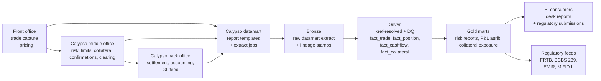

# Module 27 — Calypso Applied

!!! abstract "Module Goal"
    [Module 23](23-vendor-systems-framework.md) defined the framework — every vendor system is catalogued, mapped, extracted, validated, lineaged, and version-tracked through the same six steps. [Module 24](24-murex-applied.md) instantiated that framework for Murex, the dominant *trade-of-record* platform at most tier-1 banks; [Module 25](25-polypaths-applied.md) and [Module 26](26-quantserver-applied.md) instantiated it for the analytics-calculator and infrastructure sub-shapes. This module instantiates the framework for Calypso (now Nasdaq Calypso), the closest peer to Murex in the trade-of-record sub-shape. Many firms run one or the other; some run both for different desks. The data-engineering challenges at a Calypso-fed warehouse are structurally identical to those at a Murex-fed warehouse — datamart extraction, identifier xref, schema-version tracking, bitemporality layered on top — but the specifics differ enough that the warehouse design that suits a Murex-only firm cannot be re-used wholesale at a Calypso-only firm without revisiting the entity catalogue, the identifier conventions, the upgrade cadence, and the DQ surfaces where Calypso's strengths and weaknesses differ from Murex's.

!!! info "Disclaimer — version, branding, and customisation caveats"
    This module reflects general industry knowledge of Calypso as of mid-2026 (now branded Nasdaq Calypso, following the Calypso Technology → Adenza 2021 → Nasdaq 2023 ownership trail). Specific schema, table names, and behaviours vary by Calypso version and by each firm's customisations. Treat it as a starting framework, not as a Calypso reference manual — verify against your firm's actual Calypso instance before applying. The framework discipline of [Module 23](23-vendor-systems-framework.md) is the durable contribution; the specific Calypso details below are illustrative and version-sensitive. The same caveat applied to M24 for Murex applies here: the contribution is the *shape* of the integration discipline, not a reference manual for any particular Calypso release.

---

## 1. Learning objectives

By the end of this module, you should be able to:

- **Describe** Calypso's role in capital-markets trading — what desks it serves (cross-asset, with traditional strengths in rates, FX, treasury, collateral, and clearing), how its modules map to the front/middle/back-office organisation of [Module 2](02-securities-firm-organization.md), and where the warehouse intersects each.
- **Compare** Calypso to Murex at a data-shape level — both are full-stack trade-of-record platforms with datamart-based extraction, but the asset-class strengths, deployment models, and customisation surfaces differ enough that the warehouse-side design is not a copy-paste from one to the other.
- **Conform** Calypso identifiers (Calypso trade IDs, internal counterparty and instrument IDs) to firm-canonical surrogate keys via the xref dimension pattern from [Module 6](06-core-dimensions.md).
- **Apply** Calypso-specific data-quality checks — trade-count tie-out, the cashflow-vs-accrual consistency check that exploits Calypso's strongest reconciliation surface, collateral coverage, xref completeness, schema-hash drift — as silver-layer validations layered on top of the [Module 15](15-data-quality.md) framework.
- **Plan** for a Calypso version upgrade or for a post-Nasdaq-integration shift in the broader Adenza/Nasdaq stack — recognising that Calypso's upgrade cadence and impact profile are similar in shape to Murex's but distinct in detail.
- **Recognise** Calypso's strength in the collateral, clearing, and cashflow representation areas — and the consequent DQ surfaces and downstream uses that distinguish a Calypso integration from a Murex one.

## 2. Why this matters

If your firm trades capital-markets products at any meaningful scale, Calypso is one of the two or three platforms most likely to be in play. The platform has been the cross-asset trade-of-record system for hundreds of banks since its founding in 1997, with traditional strengths in rates, FX, treasury, collateral, and the cleared-derivatives workflow that became increasingly consequential after the post-2008 regulatory reforms. The data-engineering job at a Calypso-using firm is in many respects identical to the job at a Murex-using firm — extract the nightly datamart, xref-resolve identifiers, run cross-source reconciliations, track schema and version drift, plan upgrades carefully — but the specifics differ enough that switching from a Murex-focused warehouse design to a Calypso-fed one is a substantial project rather than a trivial relabelling. A team that treats the two as interchangeable typically discovers, midway through the integration, that the assumptions about asset-class coverage, identifier conventions, datamart layout, and upgrade rhythm that worked for Murex do not transfer cleanly, and the integration takes longer than planned.

The architectural distinction that matters most is that Calypso is the closest *peer* to Murex within the trade-of-record sub-shape, rather than a different sub-shape entirely (the way Polypaths and Quantserver are). Calypso owns trades, owns positions, often owns sensitivities and (under the firm's specific deployment) owns the back-office accounting layer too. The warehouse consumes from Calypso in the same general pattern as it consumes from Murex: nightly datamart extracts, bronze landing, silver-layer xref and conformance, gold marts feeding BI and regulatory submissions. The structural similarity is the point — a team that has internalised the M24 Murex discipline can apply it to Calypso with confidence that the *shape* of the integration is the same. The differences are at the *detail* level, and this module exists to make those details explicit so the team can adapt the existing discipline rather than re-derive it from scratch.

This module reflects general industry knowledge of Calypso as of mid-2026 (now branded Nasdaq Calypso). Specific schema, table names, and behaviours vary by Calypso version and by each firm's customisations. Treat it as a starting framework, not as a Calypso reference manual — verify against your firm's actual Calypso instance before applying. The framework discipline of [Module 23](23-vendor-systems-framework.md) is the durable contribution; the specific Calypso details below are illustrative and version-sensitive. The same caveat applied to M24 for Murex applies here: the contribution is the *shape* of the integration discipline, not a reference manual for any particular Calypso release.

A practitioner-angle paragraph. After this module you should be able to walk into a Calypso-using bank's data team on day one and read the integration architecture in the vocabulary the team uses: which datamart entities the warehouse extracts, where the bronze landing is, what the silver-conformance pattern looks like, which DQ checks are wired (especially the cashflow-vs-accrual consistency check that exploits Calypso's strongest data surface), which Calypso version the team is on and which version they are migrating toward, which gold marts depend on which datamart entities, and which collateral, clearing, and cashflow analytics depend on Calypso as their source. You should also recognise the warning signs of a Calypso integration that has lost its framework discipline — Calypso identifiers leaking into the gold layer, the collateral entity left half-integrated, the cashflow-vs-accrual reconciliation un-run — and write the remediation plan.

A note on scope. This module covers the *warehouse-side data-engineering* perspective on Calypso — what comes out of the platform, how to absorb it, how to validate it, how to plan for upgrades. It does not cover the *Calypso-administrator* perspective (how the platform is configured and operated), the *trader-workflow* perspective (how a rates trader uses Calypso's pricing screens and trade-capture flows), or the *quantitative-research* perspective (how Calypso's pricing models are constructed and calibrated). Those perspectives belong to the Calypso operations team, the trading desk, and the quantitative-research team respectively; the BI engineer's role is downstream of all of them, and the discipline this module covers is the downstream-absorption discipline.

## 3. Core concepts

A reading note. Section 3 builds the Calypso-warehouse-integration story in nine sub-sections: what Calypso is and its corporate history (3.1), where Calypso sits in the firm's data architecture (3.2), the Calypso-vs-Murex comparison (3.3), the datamart and report-template extraction layer (3.4), the common datamart entities (3.5), Calypso's identifier model and xref to firm masters (3.6), bitemporality in Calypso (3.7), Calypso-specific DQ checks with the cashflow-vs-accrual surface highlighted (3.8), and the version-upgrade impact (3.9).

### 3.1 What Calypso is

Calypso was founded in 1997 by Kishore Bopardikar in San Francisco, with a French/American engineering footprint that has persisted through the platform's subsequent ownership changes. The platform was acquired by Thoma Bravo in 2016, merged with Axiom Software Laboratories (a regulatory-reporting and risk software firm) to form Adenza in 2021, and the combined Adenza was acquired by Nasdaq in 2023. The platform is now branded Nasdaq Calypso, though it is still commonly referred to as "Calypso" colloquially within the industry and within the data teams that have operated against it for decades. The Nasdaq ownership has begun to shape the platform's roadmap toward a broader Nasdaq-stack integration (with Nasdaq's existing trading-technology, clearing, and market-data assets), and a Calypso-using firm should expect the platform's positioning and capabilities to evolve over the coming years as the Nasdaq integration matures.

The platform's coverage spans cross-asset trading at the front, middle, and back office:

- **Front office.** Trade capture across the supported asset classes (rates, FX, fixed income, credit, treasury, with module-by-module coverage of equity derivatives and structured products where the firm has subscribed to those modules). Pricing screens for the desk's day-to-day workflow. Order management and execution capture.
- **Middle office.** Risk and limit monitoring (with sensitivities, VaR, and FRTB calculations available depending on the deployment's risk-module subscription). Collateral management — historically one of Calypso's strongest areas, with deep coverage of CSA eligibility rules, haircut calculations, dispute workflow, and the broader bilateral and cleared collateral lifecycle. Trade confirmation and settlement-instruction generation. The middle-office layer is where Calypso's coverage tends to differentiate from Murex's most visibly, with the collateral and clearing workflows being a particular strength.
- **Back office.** Settlement processing, accounting entry generation, GL feed production, and reconciliation against the firm's general ledger. Calypso's back-office coverage is comprehensive at many deployments; at others the firm has chosen to retain a separate back-office system (an in-house ledger, a vendor accounting platform) and to use Calypso for the front-and-middle workflow only.
- **Risk and regulatory.** Sensitivity computation (DV01, CS01, key-rate durations, FX delta and gamma, equity delta and vega where applicable), VaR (historical, parametric, Monte Carlo depending on the module), FRTB Sensitivity-Based-Method and Internal Models Approach support, FRTB Standardised Approach, the typical regulatory submissions a tier-1 capital-markets firm runs. The risk module's coverage has evolved substantially across the platform's ownership transitions; the post-2023 Nasdaq-integration roadmap is expected to bring further evolution in this area.

The platform's user base is broad and global. Calypso is deployed at over 200 banks worldwide, with strong presence in Europe and Asia and a meaningful North American footprint. Tier-1 banks, tier-2 banks, central banks, and clearing houses are all represented in the customer base, with the platform's flexibility making it deployable across the full range of institutional sizes.

### 3.2 Where Calypso sits in the firm's data architecture

Calypso, like Murex, is a *full-stack trading platform* — it is the system of record for the trades, positions, and (in many deployments) the sensitivities and risk measures the firm publishes. The warehouse's relationship to Calypso is therefore in the same general shape as the warehouse's relationship to Murex (M24): Calypso is upstream, the warehouse is downstream, the integration's daily reality is a nightly batch extract from Calypso's curated reporting layer into the warehouse's bronze layer, with the silver and gold layers doing the conformance, validation, and aggregation work that prepares the data for BI and regulatory consumption.

A diagram of where Calypso sits in a typical firm's data flow, with the annotation that the shape is structurally similar to M24's Murex diagram:



The annotation that the reader should internalise: the diagram is in the same shape as M24's Murex diagram, which is the point. The trade-of-record sub-shape produces this shape regardless of vendor; the work the warehouse does is the same shape regardless of vendor. The differences are in the entity catalogue, the identifier conventions, the version cadence, and the DQ surfaces — covered in the sub-sections below — rather than in the overall integration architecture.

A note on *Calypso's deployment model*. Calypso has historically been deployed on-premise, with the platform installed on the firm's own servers and integrated against the firm's authentication, network, and storage infrastructure. The post-2021 Adenza ownership and the post-2023 Nasdaq ownership have brought cloud-hosted deployment options into the platform's offering, and a growing fraction of newer Calypso deployments are cloud-based (typically AWS or Azure, depending on the firm's broader cloud-vendor relationship). The warehouse-side relevance is that the extraction mechanics differ between on-premise and cloud deployments — an on-premise Calypso extract typically lands as a file or a database export the warehouse pulls, a cloud-hosted Calypso extract may be delivered via a managed pipeline or a federated query directly into Snowflake / BigQuery. The framework discipline applies to both; the catalogue entry should record the deployment model and the extraction mechanics specific to it.

### 3.3 Calypso vs Murex — a data-engineering comparison

The most consequential conceptual point for a reader who already knows Murex is that Calypso is *the same sub-shape* as Murex (full-stack trade-of-record) but *different in detail* at the level the warehouse cares about. A short side-by-side comparison at the data-engineering level:

| Aspect                          | Murex (M24)                                                  | Calypso (M27)                                                |
| ------------------------------- | ------------------------------------------------------------ | ------------------------------------------------------------ |
| Asset-class strengths           | Cross-asset, traditional strength in exotics and structured FX | Cross-asset, traditional strength in rates, FX, collateral, clearing |
| Deployment model                | Primarily on-premise; emerging cloud options                 | Historically on-premise; growing cloud post-Nasdaq           |
| Datamart pattern                | DataNav / curated reporting layer                            | Report templates + datamart extracts                         |
| Identifier convention           | `MX_TRADE_ID`, `MX_CPTY_ID`, `MX_INSTR_ID` (illustrative)    | Calypso trade IDs, internal counterparty/instrument IDs (illustrative) |
| Upgrade cadence                 | Major versions every 1-2 years; significant data impact      | Major versions on similar cadence; post-Nasdaq stack shift in play |
| Collateral coverage             | Present; not the platform's defining strength                | Strong; historically a Calypso differentiator                |
| Cashflow representation         | Adequate                                                     | Strong; deep deal-level cashflow modelling                   |
| Clearing workflow               | Supported                                                    | Strong; emerged early with CCP-clearing integration          |
| Customisation surface           | Deep; firms customise extensively                            | Deep; firms customise extensively                            |
| Vendor ownership stability      | Stable independent vendor                                    | Calypso Tech → Thoma Bravo → Adenza → Nasdaq (ownership changes affect roadmap) |

The comparison is intended to be *even-handed*. This is not vendor advocacy in either direction — both platforms are mature, both are deployed at scale, both have areas of strength and areas where their coverage is thinner than the firm might wish. The warehouse-side relevance is that a team migrating from a Murex-focused architecture to a Calypso-focused one (or running both, which is common at firms that have grown by acquisition) needs to revisit the entity catalogue, the identifier xref, the DQ surfaces, and the version-tracking discipline against the differences in the table above. The framework discipline transfers; the specifics adapt.

A practitioner observation on *firms that run both*. A non-trivial number of tier-1 banks run *both* Murex and Calypso simultaneously, with different desks on different platforms — perhaps Murex for exotics and structured FX, Calypso for rates and the cleared-derivatives book. The warehouse-side challenge in this case is *cross-platform consistency*: a position in book X that is half in Murex and half in Calypso (because the desk split its instruments across the two) must be aggregated correctly at the gold layer, with the source-system stamps preserved so a downstream consumer can drill back to the originating platform. The framework discipline supports this directly — the `source_system_sk` stamp on every row distinguishes Murex from Calypso, and the firm-canonical identifiers (the xref-resolved `instrument_sk`, `counterparty_sk`, `book_sk`) let the cross-platform aggregation happen on common keys — but the discipline must be applied rigorously or the cross-platform views silently produce numbers that disagree with either platform's own internal view.

A second observation on *the build/buy decision in the same shape*. The arguments for choosing Calypso over an in-house build are similar to those for choosing Murex: a vendor platform absorbs the cross-asset coverage, regulatory-change responsiveness, and operational engineering that an in-house build would otherwise require. The arguments against are also similar: a vendor platform constrains the firm to the vendor's roadmap, the vendor's version cadence, and the vendor's customisation surface. The warehouse-side relevance is that whichever platform the firm has chosen, the warehouse's role is to absorb the platform's outputs cleanly and to defend the firm's overall data architecture from becoming a vendor-shaped artefact rather than a firm-shaped one. The discipline is the same for Calypso as for Murex, and the framework's value is the *uniformity* of treatment.

### 3.4 The Calypso datamart and report-template extraction layer

The dominant Calypso warehouse-integration pattern is *nightly batch extraction via the datamart and report-template layer*. Calypso, like Murex, does not expose its operational application database directly to the warehouse — the operational database is tuned for the trading-platform's read-write workload, not for the warehouse's bulk-extract pattern, and direct access would create performance and reliability issues for the trading workflow. Instead, Calypso exposes a *curated reporting tier*: a set of report templates that the platform's reporting engine populates with the day's data, plus a datamart-style extract layer that the warehouse queries against. The pattern is structurally similar to Murex's DataNav layer; the specifics differ.

Calypso's report templates are configurable artefacts that define *what* the datamart contains. A template specifies the columns, the filtering criteria, the aggregation grain, and the output format. Templates are defined within Calypso (typically by the Calypso administration team in coordination with the consumer of the report), populated by the platform's reporting engine on a scheduled cadence (nightly batch typically; intraday templates exist for some workflows), and exposed to consumers either as files (CSV, Parquet, fixed-width) dropped to a shared filesystem or as queryable views in the datamart database.

The warehouse-side extraction pattern wraps the report-template layer:

- **For each warehouse-consumed entity** (trade detail, position snapshot, cashflow projection, sensitivity, P&L, collateral) there is a corresponding Calypso report template.
- **The template's output** is landed in the warehouse's bronze layer as a faithful copy of the template's columns, plus the framework's standard lineage stamps.
- **The silver layer** runs the xref conformance, the column renames, and the DQ checks against the bronze table.
- **The gold layer** materialises the consumer-facing marts.

A practitioner note on *the report-template layer's role as an extra layer*. The report templates are an *additional layer* between the Calypso operational data and the warehouse's bronze landing — the data passes through the template's definition (the SQL or the equivalent logic the platform's reporting engine executes) before the warehouse sees it. The advantage of this extra layer is that the template can be tuned (filtered, aggregated, joined within Calypso) so the warehouse receives a data shape close to what it needs; the disadvantage is that the template itself is a piece of *firm-specific logic* that lives within Calypso, not within the warehouse, and is therefore outside the warehouse's normal source-control and review process. A team that lets the template definitions drift without recording them in the warehouse's own documentation typically discovers, midway through an upgrade or a personnel transition, that no one currently on the team can explain what a particular template was supposed to be doing. The discipline is to *export the template definitions* into the warehouse's documentation repository (version-controlled alongside the warehouse's own code) and to treat any change to a template as a coordinated change with both Calypso-side and warehouse-side review.

A second note on *the LAST_MODIFIED-equivalent for incremental extraction*. Like Murex (M24), Calypso supports incremental extraction patterns where the warehouse pulls only the rows that have changed since the last load, rather than re-pulling the full entity each night. The mechanism varies by entity but typically involves a `LAST_MODIFIED`-like column or an audit-trail table that records every change. The incremental pattern reduces extraction time substantially at the cost of additional complexity — the team must trust the `LAST_MODIFIED` column to be correctly maintained on every economic change, must handle deletion semantics explicitly (a deleted row's last state may need to be retained for historical reproduction), and must run periodic full reconciliations to catch any drift between the incremental and full views. The discipline is the same as Murex's: trust the incremental for steady-state speed, but verify it periodically with a full reconciliation, and document the recovery procedure if the `LAST_MODIFIED` is ever found to be unreliable.

### 3.5 Common datamart entities

Six entity categories cover essentially every output a typical Calypso warehouse integration consumes. The names below are *generic* in the sense that the actual table or column names in any specific deployment vary by Calypso version and by the firm's customisations, and the disclaimer at the top of the module applies. The categories and their downstream uses are stable; the column conventions are not.

**Trade detail.** The atomic trade-and-modification table. One row per `(calypso_trade_id, modification_event)` covering every trade booked into Calypso across the supported asset classes. Typical columns include the Calypso trade ID, the trade date, the value date and (where relevant) the maturity date, the counterparty internal ID, the instrument internal ID, the book code, the trader ID, the trade direction (buy/sell), the notional amount and currency, the price or rate, the asset class, the status (live, terminated, cancelled, amended), and the modification event type (new, amend, cancel, novation). The downstream uses are the firm's books-and-records integrity (the trade-detail entity is *constitutive* of the firm's official trade record for the desks Calypso serves), the upstream input to position aggregation, and the cross-source reconciliation against the front-office and back-office systems. The warehouse typically materialises this as `silver.calypso_trade_conformed`.

**Position snapshot.** The end-of-day position table. One row per `(book, instrument, currency, business_date)` covering every active position the desk holds at the close of the trading day. Typical columns include the book code, the instrument internal ID, the currency, the business date, the position notional, the position fair-value in the position currency and in the book's reporting currency, the as-of timestamp Calypso held when the snapshot was taken, and any position-level attributes the firm has configured (the regulatory book classification, the hedge designation, the FRTB risk bucket). The downstream uses are the firm's official position reporting and the upstream input to sensitivity and P&L computation. The warehouse typically materialises this as `silver.calypso_position_conformed`.

**Cashflow projection.** The deep cashflow modelling that Calypso is traditionally strong in. One row per `(calypso_trade_id, projection_period, business_date)` covering the trade's projected principal and interest cashflows from the business date forward to maturity. Typical columns include the Calypso trade ID, the projection period (as a date or a period-index), the projected principal cashflow, the projected interest cashflow, the projected fee cashflow where applicable, the cashflow currency, the discount factor at the business date, and the present-value contribution of the period. The downstream uses are asset-liability-management, the accrual-and-cashflow consistency reconciliation (see §3.8's check below — this is Calypso's strongest DQ surface), the cashflow-based regulatory submissions where applicable, and the cashflow-input to certain risk calculations.

**Risk vector / sensitivity.** The long-format sensitivity export. One row per `(calypso_trade_id, risk_factor, bucket, business_date)` covering each sensitivity the trade contributes per risk-factor bucket. Typical columns include the Calypso trade ID, the risk-factor identifier (rate, spread, FX, vol, etc.), the bucket identifier (the tenor, the strike, the maturity bucket as appropriate), the sensitivity value, the sensitivity unit (per basis point, per vol-point, etc.), the business date, and the model and configuration identifiers under which the sensitivity was computed. The downstream uses are the firm's sensitivity reporting, the FRTB Sensitivity-Based-Method capital calculation, and the upstream input to scenario-P&L computation. The volumes can be large — a tier-1 deployment can produce billions of sensitivity rows per day when the full risk-factor coverage is in place.

**P&L.** The daily P&L table. One row per `(book, business_date)` typically, with decomposition columns for clean P&L, dirty P&L, the Greek-based explain components where Calypso is producing them, the new-trade P&L, and the residual unexplained P&L. The downstream uses are the firm's daily P&L attestation, the P&L attribution framework of [Module 14](14-pnl-attribution.md), the FRTB Profit and Loss Attribution Test where the firm is on Internal Models Approach, and the desk-level performance reporting.

**Collateral.** Calypso's strongest area historically. One row per `(collateral_agreement, asset, business_date)` covering every collateral position the firm holds or owes under its CSA agreements. Typical columns include the collateral agreement identifier (the CSA or equivalent bilateral or cleared collateral agreement), the asset identifier, the eligibility flag (whether the asset is currently eligible under the agreement's terms), the haircut percentage, the collateral value before haircut, the collateral value after haircut, the dispute status (whether the position is currently disputed), and the agreement's threshold and minimum-transfer-amount parameters. The downstream uses are the firm's collateral exposure reporting, the regulatory collateral-related submissions (the CFTC and ESMA's reporting regimes on cleared and bilateral derivatives), the disputes-management workflow, and the upstream input to counterparty-credit-risk calculations.

A reference table summarising the six entity categories:

| Entity                       | Typical grain                                        | Typical row count (tier-1 bank, EOD) | Downstream uses                                              |
| ---------------------------- | ---------------------------------------------------- | ------------------------------------- | ------------------------------------------------------------ |
| Trade detail                 | (calypso_trade_id, modification_event)               | Hundreds of thousands to low millions | Books-and-records, position input, cross-source reconciliation |
| Position snapshot            | (book, instrument, currency, business_date)          | Hundreds of thousands                 | Position reporting, sensitivity input, P&L input             |
| Cashflow projection          | (trade_id, projection_period, business_date)         | Millions to tens of millions          | ALM, accrual reconciliation, cashflow regulatory             |
| Risk vector / sensitivity    | (trade_id, risk_factor, bucket, business_date)       | Hundreds of millions to billions      | Sensitivity reporting, FRTB SBM, scenario P&L                |
| P&L                          | (book, business_date)                                | Tens of thousands                     | Daily P&L attestation, attribution, FRTB PLA                 |
| Collateral                   | (collateral_agreement, asset, business_date)         | Hundreds of thousands                 | Collateral exposure, regulatory submissions, dispute management |

A practitioner observation on *the collateral entity's frequently-incomplete state*. The collateral entity is the most-incomplete part of many Calypso integrations, despite Calypso's traditional strength in the area. The reason is that the collateral data is *operationally complex* — the eligibility rules per CSA can be dozens of conditions deep, the dispute lifecycle has multiple states the integration must track, the cleared and bilateral worlds have different reporting requirements, and the firm's collateral team often has tooling outside Calypso (dispute-tracking systems, eligibility-rule engines, regulatory-submission utilities) that the warehouse must also integrate against to produce a complete picture. A team that integrates the trade-detail and position entities first and leaves the collateral entity for "the next phase" often discovers that the next phase is substantially larger than the previous one and re-scopes accordingly. The discipline is to *scope the collateral integration explicitly* in the catalogue entry rather than deferring it indefinitely.

A second observation on *the entity-load ordering*. The trade-detail entity should be loaded first — it is the foundation for the rest, and any DQ check on the downstream entities relies on the trade-detail being available. The position-snapshot and P&L entities should be loaded next, followed by the cashflow-projection and sensitivity entities (which are larger and more compute-intensive on the Calypso side, so their batch windows are often later in the overnight schedule). The collateral entity can be loaded in parallel with any of the above since it does not depend on them at the silver level (though gold-layer joins between collateral and position do exist). The dependency chain should be encoded in the warehouse's orchestrator so a failure of an upstream load triggers the expected behaviour on the downstream loads, with the same orchestration discipline as M24 prescribes.

A third observation on *Calypso's cashflow-projection entity as a distinctive surface*. The cashflow-projection entity is one of Calypso's defining strengths — the platform's representation of deal-level cashflows is deep, the projections handle a wide range of product structures (vanilla swaps, structured products with embedded options, accreting and amortising schedules, callable and putable features), and the projections are typically reliable enough that the warehouse can build accrual-reconciliation checks (§3.8 below) on top of them. A Calypso-using firm that has not built out the cashflow-projection consumption is leaving a significant data asset un-used; the warehouse-side investment in conforming this entity and building the downstream consumers (the ALM team, the accrual-reconciliation DQ check, the cashflow-based regulatory submissions) pays back broadly. The contrast with M24's Murex is that Murex's cashflow representation, while adequate, is not the platform's defining strength in the same way; the warehouse's investment in the cashflow surface accordingly differs in proportion at the two platforms.

### 3.6 Calypso identifiers and xref to firm masters

Calypso, like Murex, assigns its own internal identifiers for the trades, counterparties, instruments, and books in the platform. The identifiers are *firm-internal-to-Calypso* — they have no meaning outside the Calypso deployment — and the warehouse's job is to xref them into firm-canonical surrogate keys using the xref dimension pattern from [Module 6](06-core-dimensions.md). The illustrative naming is: Calypso trade IDs typically carry a `CL_TRADE_ID` or `CALYPSO_TRADE_ID` prefix or scheme (the literal column name varies by version and by the firm's customisation), Calypso counterparty IDs follow the platform's internal scheme, Calypso instrument IDs follow the platform's internal scheme, and Calypso book codes follow the firm's configured hierarchy within the platform.

The xref dimension's relevant rows look like:

```
source_system_sk | vendor_trade_code     | trade_sk | valid_from  | valid_to
'CALYPSO'        | 'CL-2026-018744'      | 9001     | 2026-03-15  | NULL
'CALYPSO'        | 'CL-2026-018745'      | 9002     | 2026-03-15  | NULL
'CALYPSO'        | 'CL-2026-018746'      | 9003     | 2026-03-15  | NULL
```

```
source_system_sk | vendor_cpty_code      | counterparty_sk | valid_from  | valid_to
'CALYPSO'        | 'CPTY_INTERNAL_42'    | 6001            | 2024-01-01  | NULL
'CALYPSO'        | 'CPTY_INTERNAL_43'    | 6002            | 2024-01-01  | NULL
```

```
source_system_sk | vendor_instr_code     | instrument_sk | valid_from  | valid_to
'CALYPSO'        | 'INSTR_INTERNAL_881'  | 8001          | 2024-01-01  | NULL
'CALYPSO'        | 'INSTR_INTERNAL_882'  | 8002          | 2024-01-01  | NULL
```

The xref-population work is split between the master-data-management team (counterparty and instrument xref) and the integration team (trade xref, which is more dynamic because new trades are created continuously and the trade-level xref is therefore populated by the bronze loader as new trades arrive rather than by a separate MDM process). The framework discipline of [Module 23](23-vendor-systems-framework.md) applies: every Calypso ID must resolve to a firm-canonical surrogate key, with the resolution happening at the silver layer through the xref dimension, and any unresolved row flagged by the unmapped-xref DQ check.

A practitioner observation on *the multi-platform xref consistency challenge*. A firm running both Murex and Calypso for different desks must maintain *two* xref-source-system-sk values (`'MUREX'` and `'CALYPSO'`) within the same xref dimensions, with the same firm-canonical surrogate keys appearing in both. A counterparty that the firm trades with on both platforms (say a major dealer who shows up in both books) has *two* rows in `dim_xref_counterparty` — one for each platform's internal counterparty code — both mapping to the same `counterparty_sk`. The MDM team's discipline is to ensure that the firm-canonical surrogate key is consistent across the two source-system mappings, so any aggregation that joins on `counterparty_sk` produces a consistent view across both platforms. A team that maintains separate `counterparty_sk` values for the same counterparty across platforms produces silent duplication in cross-platform aggregations; the discipline is to enforce identifier-uniqueness at the MDM level.

A second observation on *book-hierarchy harmonisation across platforms*. The firm's book hierarchy is often defined differently within each trading platform (Murex has its own book structure, Calypso has its own), and the firm-canonical book hierarchy in the warehouse must reconcile the two. The xref pattern handles the mapping, but the more consequential challenge is *semantic*: a "rates book" in Murex may be the same desk's "rates book" in Calypso, but the boundary between the two may differ (different products, different trading-desk assignments, different P&L attribution). The discipline is to *document the harmonisation rules* in the warehouse's reference documentation and to surface the platform-of-origin in the gold layer so a consumer can drill back to either platform's view when investigating a discrepancy. The framework's `source_system_sk` stamp is the mechanism; the discipline is to use it consistently.

### 3.7 Bitemporality in Calypso

Calypso, like Murex, has its own as-of concept on most extracts — each datamart row carries some form of as-of timestamp indicating when Calypso's internal state was sampled to produce the row. The as-of pattern's specifics vary by entity (the trade-detail entity carries the modification timestamp, the position-snapshot entity carries the snapshot timestamp, the cashflow-projection entity carries the projection-run timestamp), and Calypso's coverage of restatement granularity is *partial* — some entities support clean as-of correction, others do not, and the firm's specific customisations affect what is available where.

The warehouse-side discipline is the same as M24's: treat each Calypso extract as an *immutable input event* and layer the warehouse's own bitemporal pattern (from [Module 13](13-time-bitemporality.md)) on top, with the warehouse owning the system-time axis explicitly rather than relying on Calypso to do it. The mandatory stamps on every Calypso-derived row are:

- `calypso_as_of_timestamp` — Calypso's as-of timestamp where the entity supports it.
- `calypso_extract_run_id` — the unique identifier of the Calypso extract that produced the row.
- `calypso_schema_version` — the Calypso platform version under which the extract was produced.
- `business_date` — the business date the row describes.
- `warehouse_load_timestamp_utc` — when the row landed in the warehouse's bronze layer.

Together with the framework's standard lineage stamps (`source_system_sk = 'CALYPSO'`, `pipeline_run_id`, `code_version`, `vendor_schema_hash`), these stamps let any historical row be traced back to the originating Calypso extract and to the platform version it was produced under. A regulator asking "what was the position for book X on date Y as the firm knew it at time Z?" is answered by a bitemporal query against the silver layer, filtered on `business_date` and bracketing the `warehouse_load_timestamp_utc`.

A practitioner observation on *the Calypso-side restatement workflow*. Calypso supports *trade amendments* and *retroactive corrections* that change a trade's economic terms after the original booking — a typical scenario is a back-office correction to a settlement instruction that flows back into the trade record, or a counterparty's late confirmation that triggers an amendment to the original capture. The amendments appear as new modification events on the trade in the next extract; the warehouse should consume them as new versions of the trade row rather than as in-place updates, with the M13 bitemporal pattern providing the `valid_from` / `valid_to` axis. A team that overwrites the silver layer with the amended trade and loses the original version cannot answer "what did we know about this trade at the time of the original booking?" correctly, and the answer is exactly what a regulator or an internal audit will ask for.

A second observation on *the cashflow-projection's run-snapshot character*. The cashflow-projection entity behaves more like Polypaths's run-snapshot pattern (M25 §3.6) than like the trade-detail's transactional pattern: each projection is computed against a specific market-data snapshot and a specific portfolio cut, and a subsequent projection against a different snapshot will produce different numbers even for the same underlying trade. The warehouse should *retain the projection-run identifier* on every cashflow row so a downstream consumer can identify which projection a particular row came from, and so that historical reproductions can replay a specific projection rather than reconstructing it. The discipline is the same as M25's; the application is to a Calypso entity that has this character.

### 3.8 Calypso-specific DQ checks

Five check categories cover the typical Calypso integration's failure modes. The framework discipline of [Module 15](15-data-quality.md) applies. The Calypso-specific surface that distinguishes this DQ suite from M24's Murex suite is the *cashflow-vs-accrual consistency check* — Calypso's strongest reconciliation surface, and one of the most consequential checks a Calypso-fed warehouse can run.

**Trade count tie-out.** The warehouse's loaded trade count should match the front-office's published trade count for the same business date and the same set of books. A discrepancy flags either a load incompleteness, an inclusion-criteria mismatch, or a front-office reporting issue. The check is implemented by joining the warehouse's `silver.calypso_trade_conformed` against the front-office's daily trade-count report and identifying the per-book discrepancies. Severity is typically *error* — the firm's trade count is a constitutive number that downstream consumers and regulators rely on, and a discrepancy must be reconciled before the morning's reporting is published.

**Cashflow-vs-accrual consistency.** The strongest Calypso-specific DQ surface. The projected cashflows in `silver.calypso_cashflow_projection_conformed` should match the accrual entries in the firm's accounting layer (the GL feed Calypso produces, or the firm's separate accounting platform if Calypso is not the firm's back-office system). A trade whose Calypso-projected cashflows for the period do not match the accrual entries the GL recorded for the same period flags a reconciliation break between Calypso's deal-level model and the firm's accounting view — typically a data issue (an amendment that propagated to one side but not the other), occasionally a deeper modelling issue (Calypso's projection treats a deal feature differently than the GL's accrual logic). The check is one of the most operationally valuable in a Calypso integration; it catches reconciliation breaks early, before the month-end close discovers them under time pressure. Severity is typically *error*.

```sql
-- Dialect: ANSI SQL.
-- dq_check__calypso_cashflow_consistency
-- Returns trades where the Calypso-projected cashflow for the period does not
-- match the accrual entries the GL recorded for the same period.
WITH calypso_period AS (
    SELECT
        c.trade_sk,
        c.business_date,
        SUM(c.projected_interest_cashflow) AS projected_interest_for_period
    FROM silver.calypso_cashflow_projection_conformed c
    WHERE c.projection_period BETWEEN c.business_date - INTERVAL '1' MONTH
                                  AND c.business_date
      AND c.business_date = CURRENT_DATE
    GROUP BY c.trade_sk, c.business_date
),
gl_period AS (
    SELECT
        g.trade_sk,
        g.business_date,
        SUM(g.accrual_amount) AS accrual_for_period
    FROM silver.gl_accrual_entries g
    WHERE g.accrual_period_end = CURRENT_DATE
    GROUP BY g.trade_sk, g.business_date
)
SELECT
    c.trade_sk,
    c.business_date,
    c.projected_interest_for_period,
    g.accrual_for_period,
    (c.projected_interest_for_period - g.accrual_for_period) AS reconciliation_gap,
    'CASHFLOW_VS_ACCRUAL_GAP' AS gap_reason
FROM calypso_period c
LEFT JOIN gl_period g
       ON g.trade_sk      = c.trade_sk
      AND g.business_date = c.business_date
WHERE ABS(COALESCE(c.projected_interest_for_period, 0)
        - COALESCE(g.accrual_for_period, 0)) > 0.01;
```

**Collateral coverage.** Every collateralised trade (a trade that falls under an active CSA agreement) should have a corresponding collateral entry in the collateral entity, with the collateral value reflecting the trade's current exposure. A collateralised trade with no collateral entry flags either an incomplete collateral load or a collateral-team workflow gap. The check is implemented by joining the silver-conformed trade table against the silver-conformed collateral table on the CSA identifier and identifying the unmatched trades. Severity is *error* — uncollateralised exposure where the agreement requires collateral is a regulatory and credit-risk issue.

**Xref completeness.** Every Calypso trade should resolve to a firm-canonical trade surrogate key via the xref. A trade that did not resolve flags an unmapped Calypso identifier — typically a new trade booked under a counterparty or instrument that the firm's master-data process has not yet onboarded. The check is implemented by counting the rows in `silver.calypso_trade_conformed` where the xref-resolved `trade_sk` is NULL. Severity is *warn* if the count is below a threshold (some latency between trade booking and MDM onboarding is normal) and *error* if it exceeds the threshold (the MDM process has dropped the request).

**Schema-hash drift.** The vendor_schema_hash of today's Calypso extract should match yesterday's, except on dates where a known Calypso upgrade is in flight. A mismatch flags an unannounced schema change — typically a column added or renamed by a Calypso patch that the warehouse was not informed of. The check is implemented by comparing today's distinct `vendor_schema_hash` value to yesterday's and alerting on any change. Severity is typically *error* — an unannounced schema change can break the silver-conformance views silently and produce wrong rows downstream until detected.

A practitioner observation on *the cashflow-vs-accrual check's exceptional value*. Of the five checks above, the cashflow-vs-accrual consistency check is the most operationally valuable in a Calypso integration. It exploits Calypso's strongest data surface (the deep cashflow representation) against the firm's most stringent constitutive data (the GL), and the breaks it catches are typically the highest-priority issues the integration faces — a reconciliation gap that, left undetected, surfaces at month-end close with much higher remediation cost. A Calypso-fed warehouse that has not built this check is leaving its most valuable DQ surface un-used; the warehouse's investment in building it is among the highest-return DQ work a Calypso-using firm can do.

A second observation on *the comparison to Murex's DQ checks*. The five checks above include some that are direct analogues of M24's Murex checks (trade count tie-out, schema-hash drift) and some that are Calypso-specific in their strength (cashflow-vs-accrual, collateral coverage). The same xref completeness check shows up in both. The framework discipline is the same — every check is SQL, every check has a severity, every check has an alert path — and the per-vendor-cost-decay arithmetic of [Module 23](23-vendor-systems-framework.md) shows up here: a team that has built the M24 Murex DQ harness already has the harness for the analogous Calypso checks; the new work is the Calypso-specific surfaces (cashflow-vs-accrual, collateral coverage) where the per-vendor judgement is highest.

### 3.9 Version-upgrade impact

Calypso version upgrades are a periodic event the data team must absorb, in the same general shape as M24's Murex upgrades. The platform's major-version cadence has historically been roughly annual at the major-version level, with patches and minor releases in between. Recent major versions include the 14.x and 15.x lines; the post-Nasdaq integration is expected to bring further evolution in the platform's roadmap as the Nasdaq-stack integration matures (the integration is in progress as of mid-2026; the specifics of how the broader Nasdaq stack will shape Calypso's version trajectory are still developing).

The per-upgrade impact on the warehouse is structurally similar to Murex's:

- **Column-level changes.** A new Calypso version may add columns to existing report templates, remove deprecated columns, rename columns, or change column types. The warehouse must inventory these against its silver-conformance views and update accordingly.
- **Semantic-level changes.** A column's meaning may change between versions — a status flag's value set extends, an enumeration adds new members, a numeric column's units change. These changes are more dangerous than column-level changes because they do not break the schema check but do produce wrong rows downstream until the warehouse adapts.
- **Report-template definition changes.** The Calypso administration team may update the templates themselves during an upgrade — the SQL or equivalent logic the template runs may be modified, with knock-on effects on the data shape the warehouse receives.
- **Customisation-surface changes.** A Calypso upgrade may affect how the firm's customisations interact with the upgraded platform — a customisation that worked under the previous version may need to be re-validated under the new one.

The mitigations are the same as M24's pattern. Parallel runs of the old and new Calypso environments during the upgrade transition let the team measure the impact before promoting the new version to canonical. A vendor-version dimension on every row (`calypso_schema_version`) lets the team identify which rows were produced under which version, and lets historical comparisons account for any version-discontinuity. Schema-hash DQ checks catch any structural changes the upgrade brings with it. Communication to downstream consumers happens in advance so consumers can interpret any apparent moves correctly when the new version goes live.

A practitioner observation on *the Nasdaq-integration roadmap's particular impact*. The post-2023 Nasdaq ownership has introduced a longer-horizon consideration that is distinctive to Calypso (and to the broader Adenza products): the platform's integration into Nasdaq's broader trading-technology stack. The expected effects over a multi-year horizon include closer integration with Nasdaq's market-data and clearing technologies, possible deprecation of some Calypso-specific surfaces in favour of Nasdaq-stack equivalents, and shifts in the platform's roadmap that reflect Nasdaq's strategic priorities. The warehouse-side discipline is *to track this trajectory explicitly* — the catalogue entry should record the Nasdaq-integration status, the vendor-version dimension should capture which version each row was produced under, and the team should expect that any forward-looking architecture decisions (cloud migration plans, new module subscriptions, integration with adjacent Nasdaq-stack products) will be influenced by the Nasdaq-integration's progress. A team that ignores the ownership trajectory and treats Calypso as a static platform will be surprised by the changes; a team that tracks it will be prepared.

A second observation on *the upgrade-impact-scope comparison with M24*. Calypso major-version upgrades, in the author's experience, typically require warehouse-side work on a scale comparable to Murex's: one to two quarters of effort for a major version, with the precise duration depending on the firm's customisation depth and the consumer scope. The framework discipline of M24 applies in full to Calypso; the elapsed-time-and-cost arithmetic is similar. A team that has done one Murex upgrade can apply the same playbook to a Calypso upgrade with high confidence.

A third observation on *the post-Nasdaq stack-integration as a possible Phase-3 event*. The framework's lifecycle model from M23 §3.1c describes three phases of a vendor relationship: onboarding (phase 1), steady-state (phase 2), major upgrade or replacement (phase 3). The post-Nasdaq stack integration for an existing Calypso-using firm has the character of a *phase 3 event* — a significant migration project rather than a steady-state activity — even though the platform is not being replaced. A team approaching the Nasdaq-integration transition should plan for it with phase-3-shaped resourcing: a defined project with explicit kick-off, scope, timeline, and the framework artefacts (catalogue, conformance, validation, lineage, version-tracking) as the asset that makes the migration tractable. A team that treats the transition as routine maintenance will be under-resourced for what may turn out to be a multi-quarter project.

## 4. Worked examples

### Example 1 — SQL: Calypso extract → silver-layer conformed view

The pattern is identical in shape to M24's silver-conformance pattern: bronze input, xref joins for identifier resolution, column renames for firm-canonical attribute names, lineage stamps preserved through. The Calypso-specific differences are the entity (trade-detail at this layer), the identifier (Calypso trade IDs and internal counterparty/instrument IDs rather than Murex's `MX_` prefixed ones), and the version stamp (`calypso_schema_version` rather than `mx_schema_version`).

**The bronze table — what the Calypso trade-extract looks like once landed.**

```sql
-- Dialect: ANSI SQL.
-- Hypothetical raw bronze landing of a Calypso trade-detail extract.
-- Column names are illustrative; the disclaimer at the top of the module applies.
CREATE TABLE bronze.calypso_trade_extract (
    -- Calypso-native columns (raw, unrenamed)
    cl_trade_id             VARCHAR(40)  NOT NULL,    -- Calypso trade identifier
    cl_modification_event   VARCHAR(20)  NOT NULL,    -- 'NEW' / 'AMEND' / 'CANCEL' / 'NOVATION'
    cl_cpty_internal_id     VARCHAR(40)  NOT NULL,    -- Calypso internal counterparty ID
    cl_instr_internal_id    VARCHAR(40)  NOT NULL,    -- Calypso internal instrument ID
    cl_book_code            VARCHAR(40)  NOT NULL,    -- Firm's book code (within Calypso's hierarchy)
    cl_trader_id            VARCHAR(40),               -- Calypso trader identifier
    cl_direction            VARCHAR(4)   NOT NULL,    -- 'BUY' / 'SELL'
    notional_amount         DECIMAL(20,4) NOT NULL,   -- Trade notional
    notional_currency       VARCHAR(3)   NOT NULL,    -- ISO currency code
    trade_date              DATE         NOT NULL,    -- Trade booking date
    value_date              DATE,                      -- Settlement / value date
    maturity_date           DATE,                      -- Maturity (where relevant)
    price_or_rate           DECIMAL(20,8),             -- Price or rate at trade
    asset_class             VARCHAR(20)  NOT NULL,    -- 'RATES' / 'FX' / 'CREDIT' / etc.
    cl_status               VARCHAR(20)  NOT NULL,    -- 'LIVE' / 'TERMINATED' / 'CANCELLED' / 'AMENDED'
    cl_as_of_timestamp      TIMESTAMP    NOT NULL,    -- Calypso as-of timestamp
    business_date           DATE         NOT NULL,    -- The business date the row describes
    -- Calypso run-level metadata
    cl_extract_run_id       VARCHAR(40)  NOT NULL,    -- Calypso extract run identifier
    cl_schema_version       VARCHAR(20)  NOT NULL,    -- Calypso platform/schema version
    -- Lineage stamps (added by the bronze loader)
    source_system_sk        VARCHAR(20)  NOT NULL,    -- = 'CALYPSO'
    pipeline_run_id         VARCHAR(40)  NOT NULL,    -- Warehouse orchestrator run id
    code_version            VARCHAR(40)  NOT NULL,    -- Warehouse loader git SHA
    vendor_schema_hash      VARCHAR(64)  NOT NULL,    -- SHA-256 of column list
    load_timestamp_utc      TIMESTAMP    NOT NULL     -- Warehouse load time
);
```

**The xref dimensions — the small slices of `dim_xref_*` relevant here.**

```sql
-- Dialect: ANSI SQL.
-- The xref dimensions populated with Calypso source-system rows.
SELECT * FROM silver.dim_xref_trade
WHERE source_system_sk = 'CALYPSO';
-- Illustrative content:
-- ('CALYPSO', 'CL-2026-018744', 9001, '2026-03-15', NULL)
-- ('CALYPSO', 'CL-2026-018745', 9002, '2026-03-15', NULL)

SELECT * FROM silver.dim_xref_counterparty
WHERE source_system_sk = 'CALYPSO';
-- ('CALYPSO', 'CPTY_INTERNAL_42', 6001, '2024-01-01', NULL)

SELECT * FROM silver.dim_xref_instrument
WHERE source_system_sk = 'CALYPSO';
-- ('CALYPSO', 'INSTR_INTERNAL_881', 8001, '2024-01-01', NULL)

SELECT * FROM silver.dim_xref_book
WHERE source_system_sk = 'CALYPSO';
-- ('CALYPSO', 'RATES_BOOK_NY', 4001, '2024-01-01', NULL)
```

**The silver-conformed view.**

```sql
-- Dialect: ANSI SQL.
-- Conforms Calypso trade-detail extract to the firm-canonical model.
-- - Resolves Calypso trade, counterparty, instrument, and book IDs via xref
-- - Renames Calypso columns to firm-canonical names
-- - Captures source_system_sk = 'CALYPSO' on every row
-- - Captures calypso_extract_run_id and calypso_schema_version for lineage
--   and version-tracking
CREATE OR REPLACE VIEW silver.calypso_trade_conformed AS
SELECT
    -- Firm-canonical surrogate keys (resolved via xref)
    xt.trade_sk                                 AS trade_sk,
    xc.counterparty_sk                          AS counterparty_sk,
    xi.instrument_sk                            AS instrument_sk,
    xb.book_sk                                  AS book_sk,
    -- Firm-canonical attributes (renamed from Calypso names)
    ct.cl_modification_event                    AS modification_event,
    ct.cl_direction                             AS trade_direction,
    ct.notional_amount                          AS notional_book_currency,
    ct.notional_currency                        AS notional_currency,
    ct.trade_date                               AS trade_date,
    ct.value_date                               AS value_date,
    ct.maturity_date                            AS maturity_date,
    ct.price_or_rate                            AS trade_price_or_rate,
    ct.asset_class                              AS asset_class,
    ct.cl_status                                AS status,
    ct.business_date                            AS business_date,
    ct.cl_as_of_timestamp                       AS calypso_as_of_timestamp,
    -- Calypso run-level lineage (passed through from bronze)
    ct.cl_extract_run_id                        AS calypso_extract_run_id,
    ct.cl_schema_version                        AS calypso_schema_version,
    -- Standard lineage stamps (passed through from bronze)
    ct.source_system_sk                         AS source_system_sk,
    ct.pipeline_run_id                          AS pipeline_run_id,
    ct.code_version                             AS code_version,
    ct.vendor_schema_hash                       AS vendor_schema_hash,
    ct.load_timestamp_utc                       AS warehouse_load_timestamp_utc
FROM bronze.calypso_trade_extract ct
LEFT JOIN silver.dim_xref_trade xt
       ON xt.source_system_sk = ct.source_system_sk
      AND xt.vendor_trade_code = ct.cl_trade_id
      AND ct.business_date BETWEEN xt.valid_from
                                AND COALESCE(xt.valid_to, DATE '9999-12-31')
LEFT JOIN silver.dim_xref_counterparty xc
       ON xc.source_system_sk = ct.source_system_sk
      AND xc.vendor_cpty_code = ct.cl_cpty_internal_id
      AND ct.business_date BETWEEN xc.valid_from
                                AND COALESCE(xc.valid_to, DATE '9999-12-31')
LEFT JOIN silver.dim_xref_instrument xi
       ON xi.source_system_sk = ct.source_system_sk
      AND xi.vendor_instr_code = ct.cl_instr_internal_id
      AND ct.business_date BETWEEN xi.valid_from
                                AND COALESCE(xi.valid_to, DATE '9999-12-31')
LEFT JOIN silver.dim_xref_book xb
       ON xb.source_system_sk = ct.source_system_sk
      AND xb.vendor_book_code = ct.cl_book_code
      AND ct.business_date BETWEEN xb.valid_from
                                AND COALESCE(xb.valid_to, DATE '9999-12-31')
WHERE ct.source_system_sk = 'CALYPSO';
```

A walk-through. Four `LEFT JOIN` clauses resolve the Calypso internal identifiers (trade, counterparty, instrument, book) into firm-canonical surrogate keys via the xref dimensions; the SCD2 `BETWEEN` clauses honour the historical mappings; the column renames push firm-canonical names into the view's output schema; the Calypso run-level lineage (`calypso_extract_run_id`, `calypso_schema_version`) and the Calypso as-of timestamp are preserved alongside the framework's standard lineage stamps. A gold mart consuming `silver.calypso_trade_conformed` sees firm-canonical attributes and the firm-canonical surrogate keys — it does not see Calypso's raw column names or internal identifiers. A gold mart joining Calypso trades to Murex trades from the parallel `silver.murex_trade_conformed` view joins them on `(trade_sk, counterparty_sk, instrument_sk, book_sk)` and gets a unified cross-platform view, with the source-system stamp letting any downstream consumer drill back to either platform's view.

The equivalent silver-conformance views for the position, cashflow, sensitivity, P&L, and collateral entities follow the same pattern, with entity-specific column lists and the appropriate xref joins for the entity's identifier set.

### Example 2 — SQL: Calypso DQ check suite

Three Calypso-specific checks, each returning rows-that-violated-the-rule per the [Module 15](15-data-quality.md) pattern.

**Check 1 — trade count tie-out vs front office.** The warehouse's loaded trade count should match the front-office's published trade count for the same business date and the same set of books.

```sql
-- Dialect: ANSI SQL.
-- dq_check__calypso_trade_count_tieout
-- Returns books where the warehouse's loaded trade count does not match the
-- front-office's published trade count for the same business date.
WITH warehouse_counts AS (
    SELECT
        book_sk,
        business_date,
        COUNT(DISTINCT trade_sk) AS warehouse_trade_count
    FROM silver.calypso_trade_conformed
    WHERE business_date = CURRENT_DATE
      AND status IN ('LIVE', 'AMENDED')
    GROUP BY book_sk, business_date
),
fo_counts AS (
    SELECT
        book_sk,
        business_date,
        published_trade_count
    FROM silver.fo_trade_count_published
    WHERE business_date = CURRENT_DATE
)
SELECT
    fo.book_sk,
    fo.business_date,
    fo.published_trade_count,
    COALESCE(wh.warehouse_trade_count, 0) AS warehouse_trade_count,
    (fo.published_trade_count - COALESCE(wh.warehouse_trade_count, 0)) AS count_gap,
    'TRADE_COUNT_TIEOUT_FAIL' AS gap_reason
FROM fo_counts fo
LEFT JOIN warehouse_counts wh
       ON wh.book_sk      = fo.book_sk
      AND wh.business_date = fo.business_date
WHERE fo.published_trade_count <> COALESCE(wh.warehouse_trade_count, 0);
```

**Check 2 — cashflow-vs-accrual consistency.** The strongest Calypso-specific DQ surface. Already shown in §3.8; reproduced here as a complete worked example with sample sample-row commentary.

```sql
-- Dialect: ANSI SQL.
-- dq_check__calypso_cashflow_consistency
-- Returns trades whose Calypso-projected interest cashflows for the period
-- do not match the accrual entries the GL recorded for the same period.
WITH calypso_period AS (
    SELECT
        c.trade_sk,
        c.business_date,
        SUM(c.projected_interest_cashflow) AS projected_interest_for_period
    FROM silver.calypso_cashflow_projection_conformed c
    WHERE c.projection_period BETWEEN c.business_date - INTERVAL '1' MONTH
                                  AND c.business_date
      AND c.business_date = CURRENT_DATE
    GROUP BY c.trade_sk, c.business_date
),
gl_period AS (
    SELECT
        g.trade_sk,
        g.business_date,
        SUM(g.accrual_amount) AS accrual_for_period
    FROM silver.gl_accrual_entries g
    WHERE g.accrual_period_end = CURRENT_DATE
    GROUP BY g.trade_sk, g.business_date
)
SELECT
    COALESCE(c.trade_sk, g.trade_sk)              AS trade_sk,
    COALESCE(c.business_date, g.business_date)    AS business_date,
    c.projected_interest_for_period,
    g.accrual_for_period,
    (COALESCE(c.projected_interest_for_period, 0)
     - COALESCE(g.accrual_for_period, 0))         AS reconciliation_gap,
    'CASHFLOW_VS_ACCRUAL_GAP' AS gap_reason
FROM calypso_period c
FULL OUTER JOIN gl_period g
       ON g.trade_sk      = c.trade_sk
      AND g.business_date = c.business_date
WHERE ABS(COALESCE(c.projected_interest_for_period, 0)
        - COALESCE(g.accrual_for_period, 0)) > 0.01;
```

**Check 3 — xref completeness.** Every Calypso trade should resolve via the xref to a firm-canonical trade surrogate key. The check counts the unresolved rows and flags them with their unresolved-key context.

```sql
-- Dialect: ANSI SQL.
-- dq_check__calypso_xref_completeness
-- Returns Calypso trades whose xref-resolved trade_sk, counterparty_sk,
-- instrument_sk, or book_sk is NULL — typically a new identifier the MDM
-- process has not yet onboarded.
SELECT
    ct.cl_trade_id,
    ct.cl_cpty_internal_id,
    ct.cl_instr_internal_id,
    ct.cl_book_code,
    ct.business_date,
    CASE
        WHEN xt.trade_sk IS NULL          THEN 'TRADE_XREF_MISSING'
        WHEN xc.counterparty_sk IS NULL   THEN 'COUNTERPARTY_XREF_MISSING'
        WHEN xi.instrument_sk IS NULL     THEN 'INSTRUMENT_XREF_MISSING'
        WHEN xb.book_sk IS NULL           THEN 'BOOK_XREF_MISSING'
    END AS gap_reason
FROM bronze.calypso_trade_extract ct
LEFT JOIN silver.dim_xref_trade xt
       ON xt.source_system_sk = ct.source_system_sk
      AND xt.vendor_trade_code = ct.cl_trade_id
      AND ct.business_date BETWEEN xt.valid_from
                                AND COALESCE(xt.valid_to, DATE '9999-12-31')
LEFT JOIN silver.dim_xref_counterparty xc
       ON xc.source_system_sk = ct.source_system_sk
      AND xc.vendor_cpty_code = ct.cl_cpty_internal_id
      AND ct.business_date BETWEEN xc.valid_from
                                AND COALESCE(xc.valid_to, DATE '9999-12-31')
LEFT JOIN silver.dim_xref_instrument xi
       ON xi.source_system_sk = ct.source_system_sk
      AND xi.vendor_instr_code = ct.cl_instr_internal_id
      AND ct.business_date BETWEEN xi.valid_from
                                AND COALESCE(xi.valid_to, DATE '9999-12-31')
LEFT JOIN silver.dim_xref_book xb
       ON xb.source_system_sk = ct.source_system_sk
      AND xb.vendor_book_code = ct.cl_book_code
      AND ct.business_date BETWEEN xb.valid_from
                                AND COALESCE(xb.valid_to, DATE '9999-12-31')
WHERE ct.business_date = CURRENT_DATE
  AND ct.source_system_sk = 'CALYPSO'
  AND (xt.trade_sk IS NULL
    OR xc.counterparty_sk IS NULL
    OR xi.instrument_sk IS NULL
    OR xb.book_sk IS NULL);
```

The three checks together cover the Calypso integration's most consequential silent-failure modes: a trade-count mismatch against the front office (the tie-out check catches it), a cashflow-vs-accrual gap that would surface at month-end (the consistency check catches it early), an unmapped Calypso identifier that would corrupt downstream aggregations (the xref completeness check catches it). All three should be wired into the orchestrator, with severities calibrated per the practitioner observations in §3.8 — the trade-count tie-out and the cashflow consistency at error severity, the xref completeness at warn-or-error depending on the unresolved-row count.

A note on running the checks via dbt or an equivalent test framework. As with M24 and M25, the three checks above are written as standalone SQL queries for readability, but in production the team typically wires them into a test framework — dbt's singular tests, a custom Python harness, or the firm's in-house DQ platform. The framework wiring provides the standard conveniences: defined severity, defined alert path, documented owner, queryable history. The same wiring that hosts the M24 Murex DQ checks should host the Calypso checks; the per-vendor cost-decay arithmetic of [Module 23](23-vendor-systems-framework.md) shows up here directly — the M27 checks slot into the framework that M24 already populated.

## 5. Common pitfalls

!!! warning "Watch out"
    1. **Comparing Calypso outputs to Murex outputs without normalising for different sensitivity conventions.** Calypso and Murex compute the same sensitivities under different unit conventions, different bucketing schemes, and (in some cases) different model frameworks. A direct comparison of a Calypso DV01 to a Murex DV01 for the "same" instrument typically produces a non-zero difference that is *expected* rather than anomalous, and a team that interprets the gap as a data issue chases a phantom. Normalise the conventions before comparing, and document the normalisation.
    2. **Running Calypso reports directly from BI without going through silver-layer conformance.** A Tableau or Power BI dashboard that points directly at a Calypso datamart table sees Calypso's raw column names, internal identifiers, and version-sensitive semantics. The dashboard breaks the next time Calypso renames a column or the next time the firm migrates between Calypso versions. The discipline is to always go through the silver-conformance layer so the BI consumer sees firm-canonical attributes regardless of Calypso's internal evolution.
    3. **Missing the cashflow-vs-accrual reconciliation entirely.** Calypso's strongest DQ surface is the cashflow-vs-accrual check, and a Calypso integration without it is leaving its most valuable reconciliation un-run. The work to build the check is moderate; the value it delivers (catching reconciliation breaks before month-end, surfacing data issues before they become accounting issues) is substantial. Build it.
    4. **Treating Calypso's "official position" as authoritative without front-to-back tie-out.** Calypso's middle-office position is one view; the back-office position, the GL position, and the front-office trader's view are others. Reconcile across them before treating Calypso's number as authoritative; the same discipline applies as for Murex (M24's pitfall #2).
    5. **Hard-coding Calypso-version-specific column names in BI dashboards.** Same anti-pattern as M24's #1, with Calypso column names instead of Murex's. A dashboard that references the Calypso v14 column name `cl_notional_amt` breaks when v15 renames it; reference firm-canonical names from the silver layer.
    6. **Ignoring Calypso's collateral entity.** The collateral entity is often the most-incomplete part of a Calypso integration, and the easiest one to defer to "phase 2" indefinitely. A Calypso-using firm whose warehouse does not load the collateral entity is missing the firm's collateral-exposure view, the related regulatory submissions, and the credit-risk inputs that depend on collateral. Scope the collateral integration explicitly; do not let it slide into permanent deferral.
    7. **Treating Calypso as if it were Murex.** The two platforms are peers in the trade-of-record sub-shape, but the entity catalogue, identifier conventions, DQ surfaces, and customisation surfaces differ enough that the warehouse design must be tuned per platform. A team that copies a Murex-shaped warehouse design onto Calypso without revisiting the differences typically discovers the mis-tuning during integration testing.

## 6. Exercises

1. **Compare.** Your firm currently runs Murex for rates and is migrating FX to Calypso. List five data-engineering decisions that the Calypso addition forces you to revisit, and why.

    ??? note "Solution"
        Five decisions, with rationale:

        *Decision 1 — cross-platform xref consistency.* The existing warehouse has `(source_system_sk = 'MUREX')` rows in the xref dimensions for the counterparties and instruments the rates desk trades. The Calypso addition introduces `(source_system_sk = 'CALYPSO')` rows for the FX desk's counterparties and instruments — and many of these are the same counterparties and instruments the rates desk also trades. The MDM team must coordinate the firm-canonical surrogate-key assignment so a counterparty that appears in both platforms gets the same `counterparty_sk` across both xref source-systems, and the cross-platform aggregations join correctly on the firm-canonical key. The decision is *whether the firm's MDM process is mature enough to handle the cross-platform consistency*, and the answer drives the integration's pacing.

        *Decision 2 — the silver-conformance pattern's per-platform parallelism.* The existing warehouse has `silver.murex_trade_conformed`, `silver.murex_position_conformed`, etc. The Calypso addition introduces the parallel `silver.calypso_*_conformed` views. The decision is *whether downstream gold marts should union the two source-system silver views or join them on firm-canonical keys*. The typical answer is *both* depending on the consumer — a regulatory submission that requires firm-wide totals unions them at the gold layer; a front-office report that wants to drill back to either platform's view joins them on the firm-canonical key while preserving the source-system stamp. The architectural choice should be made explicitly per consumer rather than defaulted to one pattern.

        *Decision 3 — the DQ surface portfolio.* The existing Murex DQ check suite covers trade-count tie-out, sensitivity coverage, market-data alignment, currency consistency, status sanity, and schema drift. The Calypso addition introduces *additional* DQ surfaces that the Murex suite does not cover — specifically the cashflow-vs-accrual consistency check (Calypso's strongest surface) and the collateral coverage check. The decision is *which checks to build first* in the Calypso-onboarding scope, and the cashflow-vs-accrual check should be high on the list because its value is high and Calypso is the source surface for it.

        *Decision 4 — the storage and partitioning of the Calypso silver layer alongside Murex.* The Murex silver tables are partitioned and sized for the Murex volumes (rates-desk trade and position counts). The Calypso silver tables for the FX desk will have different volumes — typically higher FX trade counts due to the high-velocity nature of FX, lower per-trade sensitivity counts due to FX's simpler risk profile relative to rates exotics. The decision is *whether the existing partitioning strategy suits both platforms or whether the Calypso silver tables need their own partitioning*. The answer depends on the firm's data volumes and the warehouse technology; the discipline is to *measure rather than assume*.

        *Decision 5 — the upgrade-cadence alignment.* The Murex upgrade cycle and the Calypso upgrade cycle are independent — the firm may face a Murex 3.x→3.y upgrade in Q2 and a Calypso v15→v16 upgrade in Q3 of the same year. The decision is *how the data team's annual capacity is allocated across the two upgrade workloads*, and whether the two upgrades can or should overlap (typically not, given the parallel-run discipline each requires). The catalogue entries for both platforms should record the expected upgrade windows, and the team's planning should account for them.

2. **Diagnose.** Calypso's published trade count for yesterday is 12,400. The warehouse loaded 12,392 trades. Where do you look, in order?

    ??? note "Solution"
        A reasonable diagnostic sequence, walking bronze → silver → gold:

        *Step 1 — confirm the 8-row gap is in the silver layer rather than at gold-aggregation time.* Query `silver.calypso_trade_conformed` with the same filters Calypso uses for its published count (typically `status IN ('LIVE', 'AMENDED')` and the business-date filter) and confirm the count is 12,392. If it is 12,400 here and the gap surfaces only at gold, the issue is in a downstream filter rather than in the silver load.

        *Step 2 — check the bronze layer for the 8 missing trades.* Compare the distinct `cl_trade_id` count in `bronze.calypso_trade_extract` for the business date against Calypso's published count. If the bronze count is 12,400, the silver-conformance lost 8 rows — typically a `WHERE` clause that filtered them out (an unresolved xref on a critical join, a status enum the conformance view did not handle). If the bronze count is 12,392, the load itself missed 8 trades.

        *Step 3 — check the xref completeness DQ check's output for the date.* If the silver-conformance lost rows, the xref completeness check should have flagged them. Query `dq_check__calypso_xref_completeness` for the date and see which trades were flagged as unmapped. If the check flagged exactly 8 rows, the diagnosis is *xref incompleteness*; the remediation is to onboard the missing identifiers via MDM and reprocess.

        *Step 4 — check the bronze loader's audit trail for filtered rows.* The bronze loader typically records its row counts (rows-received-from-source, rows-landed-in-bronze, rows-rejected-with-reason). If the loader rejected 8 rows, the rejection-reason log identifies why (a parsing failure, a NULL in a required column, a duplicate primary key). The remediation depends on the reason.

        *Step 5 — check the Calypso extract itself.* If steps 1-4 do not explain the gap, the issue may be in the Calypso extract — the report template produced 12,400 rows according to Calypso's internal log but only 12,392 reached the warehouse's bronze landing. This points to a transport-layer issue (file truncation, a network drop, a partial database export). The remediation involves the Calypso administration team and the integration's transport layer.

        *Step 6 — check the inclusion-criteria definition*. If the count mismatch persists after steps 1-5, the issue may be in the *inclusion-criteria definition* itself — Calypso's published count uses one filter (perhaps "all trades booked on the business date"), the warehouse uses another (perhaps "all trades active on the business date"), and the 8-trade gap is a legitimate difference in what each side is counting. The remediation is to *align the definitions* — typically a meeting between the Calypso administration team and the warehouse team to define the canonical count, document it in the catalogue entry, and ensure both sides use the same filter going forward.

        The discipline the framework rewards: every row in the silver layer carries `source_system_sk`, `calypso_extract_run_id`, `calypso_schema_version`, `pipeline_run_id`, `code_version`, and the bitemporal stamps. Each step of the diagnostic is a one-query lookup, and the investigation that would take days without the lineage discipline takes hours with it.

3. **Plan an upgrade.** Your firm is upgrading Calypso from version N to N+1 in 6 months. Sketch the data-team workplan.

    ??? note "Solution"
        A reasonable workplan, structurally similar to the M24 Murex upgrade plan with Calypso-specific adaptations:

        *Months 1-2 (inventory).* Read every change-note in the Calypso N+1 release documentation and the Adenza/Nasdaq integration-roadmap announcements. Identify every report-template affected (column adds, removals, renames, type changes, semantic changes); produce a per-entity impact matrix listing which silver-conformed view, which DQ check, and which gold mart is at risk for each change. Inventory the firm's Calypso customisations and check whether any of them interact with the changed entities. Pay particular attention to the cashflow-projection entity (Calypso's strongest data surface — changes here have outsized downstream impact) and the collateral entity (where customisations are common). Output: an impact matrix circulated to the BI team, the consumer teams (Treasury, ALM, the rates and FX desks, the collateral team), and the architecture committee.

        *Months 2-4 (build).* In a parallel environment connected to the upgraded Calypso N+1, rebuild the bronze loaders, silver conformance views, and DQ checks against the new schema. Where the report-template definitions have changed, coordinate with the Calypso administration team to validate the new templates and document them. Where a column has been renamed, update the silver view to use the new name; where a column has been added that the warehouse should consume, extend the silver view to include it; where a semantic has changed, update the conformance logic to handle both the old and new semantics during the transition. Output: a parallel pipeline running in non-production against Calypso N+1.

        *Months 4-6 (parallel run).* Run the parallel pipeline alongside the production pipeline. Compare row-by-row outputs at the silver and gold layers, with particular attention to the cashflow-vs-accrual check (any change to Calypso's projection logic shows up here first) and the collateral entity (where customisation-interaction risk is highest). Investigate every discrepancy and classify as bug-in-new-pipeline (fix), legitimate-Calypso-N+1-change (document and communicate), or acceptable noise (tolerate). Output: a discrepancy log, a consumer-facing communication brief, and a sign-off from each consumer team.

        *Month 6 (cutover).* Promote the parallel pipeline to production. Decommission the old pipeline. Update `vendor_version_dim` to mark Calypso N as RETIRED and Calypso N+1 as CANONICAL. Begin the post-cutover monitoring window where the team watches for any unexpected behaviour. Output: production cutover, with the new schema-hash captured in the schema-drift DQ check.

        Realistic resource budget: one full-time data engineer plus 25-50% time from a silver-layer team member, a BI-team member, a master-data-team member, and (this is the Calypso-specific addition versus the M24 plan) a member of the firm's collateral team to validate the collateral-entity-related changes. The total elapsed time from kick-off to old-pipeline retirement is six months in this scenario; at firms with deeper Calypso customisations or with broader consumer scope it can stretch to nine or twelve months. The Nasdaq-stack-integration trajectory may add additional considerations — if the Calypso N+1 release is positioned as a stepping stone toward broader Nasdaq-stack integration, the upgrade may need to be planned as part of a longer-horizon roadmap rather than as a standalone event.

4. **Build the cashflow-vs-accrual check.** Walk through the construction of the cashflow-vs-accrual consistency DQ check from scratch, including the data sources you would need and the calibration steps.

    ??? note "Solution"
        Construction in five steps:

        *Step 1 — identify the cashflow data source.* The warehouse needs `silver.calypso_cashflow_projection_conformed` populated with the per-trade per-period projected cashflows. If this view is not yet in place, building it is the prerequisite — the cashflow-projection entity from §3.5 is the source, conformed via the silver-layer pattern of Example 1 with the appropriate entity-specific columns.

        *Step 2 — identify the accrual data source.* The check joins against `silver.gl_accrual_entries` (or the equivalent name in the firm's GL-conformed silver layer). This requires the firm's GL feed to be in the warehouse, conformed against the same `trade_sk` keys that Calypso resolves to. If the GL is fed from Calypso itself (Calypso producing the GL feed), the trade-sk reconciliation is straightforward; if the GL is from a separate accounting platform, the cross-platform `trade_sk` xref must be in place first.

        *Step 3 — define the comparison logic.* The check sums the projected interest cashflow per trade per accounting period and compares against the accrual amount the GL recorded for the same trade and period. The comparison must handle: timing differences (the projection covers a period the GL has not yet booked), sign conventions (the projection's sign may differ from the GL's depending on the trade's direction), currency conversions (the projection and the accrual may be in different currencies and need normalisation), and rounding (a small absolute gap is acceptable; the tolerance should be calibrated).

        *Step 4 — calibrate the tolerance.* The tolerance for "match" should be set explicitly per asset class. A typical starting calibration: 0.01 in the reporting currency for individual trades, scaling to a larger absolute tolerance for aggregated checks. The calibration should be revisited after the first month of running so that the alert volume is manageable (false-positive rate low) without missing real reconciliation breaks.

        *Step 5 — wire the check into the DQ framework.* The check runs nightly after both the Calypso load and the GL load have completed. The check's output (the rows that violated the tolerance) goes to the on-call channel for the integration team, with a per-trade context that lets the on-call investigate. The check's severity is *error*. The remediation playbook documents the typical resolutions (a missing amendment that propagated to one side only, a configuration mismatch between Calypso and the GL, a genuine modelling difference that needs to be documented and accepted).

        Once built, the check earns its place by catching reconciliation breaks early — typically a meaningful percentage of month-end close issues at a Calypso-using firm can be prevented by this single check. The work to build it is moderate (a few weeks of data-engineering time, plus the prerequisite work to land both data sources cleanly); the value it delivers is among the highest in the Calypso DQ portfolio.

## 7. Further reading

- Nasdaq Calypso product overview — [https://www.nasdaq.com/solutions/calypso](https://www.nasdaq.com/solutions/calypso), the current public reference for the platform's positioning following the Nasdaq acquisition.
- Adenza historical materials — where still accessible, useful for context on the Calypso platform's positioning during the Adenza period (2021-2023) and the integration with Axiom's regulatory-reporting capabilities.
- General industry references on cross-asset trading platforms — trade-press coverage of the Murex / Calypso / Summit / Front Arena landscape, useful for understanding where Calypso sits in the broader vendor ecosystem.
- Basel Committee on Banking Supervision, *BCBS 239 — Principles for effective risk data aggregation and risk reporting*, 2013 — for the source-system-traceability angle that directly shapes the Calypso integration's lineage stamps and the cross-source reconciliation discipline.
- dbt sources documentation, [https://docs.getdbt.com/docs/build/sources](https://docs.getdbt.com/docs/build/sources) — the modern pattern for declaring vendor-extract tables as `sources` in a dbt project, with freshness and quality contracts inline.
- ISDA Common Domain Model materials — for the cross-platform-data-standardisation angle that affects how cleared-derivatives data flows between Calypso, the CCPs, and the broader reporting ecosystem.

A short observation on the limits of these references' transferability. The Calypso-specific behaviour (the platform's report-template structure, the platform's customisation surfaces, the platform's collateral and clearing workflows) is documented only in the firm's contracted Calypso documentation and in the team's accumulated experience with the platform. The references above cover the *broader context* (the platform's history and ownership, the cross-asset trading-platform landscape, the regulatory regime in which Calypso operates) at a depth that lets the reader understand where Calypso sits and what shape of integration it requires; they do not substitute for the platform-specific documentation. The framework discipline of [Module 23](23-vendor-systems-framework.md) and the integration patterns of this module are the durable contribution; the Calypso specifics are an instantiation that the reader should verify against their firm's actual Calypso deployment.

### A closing observation — Calypso as Murex's peer

A short closing observation that situates this module within Phase 8. Of the trading-and-risk-platform vendors the framework's category includes, Calypso is the closest *peer* to Murex within the trade-of-record sub-shape. M24 (Murex) and M27 (Calypso) together establish the two principal applied instances of the trade-of-record sub-shape — the two platforms most likely to be encountered at a tier-1 bank's market-risk warehouse — and a reader who has internalised both has acquired the principal applied patterns for the dominant sub-shape within Phase 8's largest category. The other applied modules in Phase 8 cover the other sub-shapes (M25 Polypaths for analytics-calculator, M26 Quantserver for infrastructure); together the four applied modules establish the framework's core instantiations.

The framework discipline transfers across all four applied modules. A reader who has internalised M24, M25, M26, and M27 can apply the discipline to any further trading-and-risk-platform vendor the firm encounters — Summit, Front Arena, Sophis, an in-house pricing engine, an acquired firm's legacy platform — by identifying which sub-shape the vendor most resembles and adapting the corresponding applied module's pattern. The framework's value is the *uniformity* of treatment across vendors; the per-vendor modules are the dictionary of instantiations the framework supports.

A final practitioner observation. Calypso is one vendor among many at any tier-1 bank's market-risk warehouse, and the team that treats Calypso as central to the exclusion of the framework discipline that lets the warehouse host every other vendor has built a Calypso-shaped corner of the warehouse rather than a firm-shaped one. The framework discipline is to treat Calypso as one trade-of-record platform among potentially several (Murex for some desks, Calypso for others, an in-house platform for still others) and to give each the same treatment. The framework's value is the uniformity, and the warehouse that embodies it is a warehouse whose vendor relationships scale sustainably across the multi-decade life of the firm's capital-markets business.

## 8. Recap

You should now be able to:

- Describe Calypso's role in capital-markets trading — the modules it covers (front, middle, back, risk), the asset classes it traditionally excels in (rates, FX, treasury, collateral, clearing), and where the warehouse intersects each.
- Compare Calypso to Murex at a data-shape level — both are full-stack trade-of-record platforms with datamart-based extraction, but the asset-class strengths, deployment models, identifier conventions, and DQ surfaces differ enough that the warehouse design must be tuned per platform.
- Conform Calypso identifiers (Calypso trade IDs, internal counterparty and instrument IDs, book codes) to firm-canonical surrogate keys via the xref pattern from [Module 6](06-core-dimensions.md), and place the conformance correctly in the medallion architecture from [Module 18](18-architecture-patterns.md).
- Apply the Calypso-specific DQ checks — trade-count tie-out, the cashflow-vs-accrual consistency check that exploits Calypso's strongest reconciliation surface, collateral coverage, xref completeness, schema-hash drift — as silver-layer validations on top of the [Module 15](15-data-quality.md) framework.
- Plan a Calypso version upgrade realistically — inventory the schema and behavioural changes, build a parallel pipeline, run it alongside production for one to two quarters, version every fact row with the `calypso_schema_version` it was produced under, and account for the broader Nasdaq-stack-integration trajectory in any longer-horizon planning.
- Diagnose a Calypso-fed risk-or-P&L anomaly by walking the bronze → silver → gold path against the lineage stamps and the DQ check outputs, with each step a one-query lookup rather than a multi-day investigation.
- Use this module, alongside M24, M25, and M26, as the principal applied template within Phase 8 — the four modules together cover the dominant sub-shapes of the trading-and-risk-platform vendor category, and a future contributor adding a module for any further vendor in the category can refer to whichever of the four best matches the new vendor's role.
